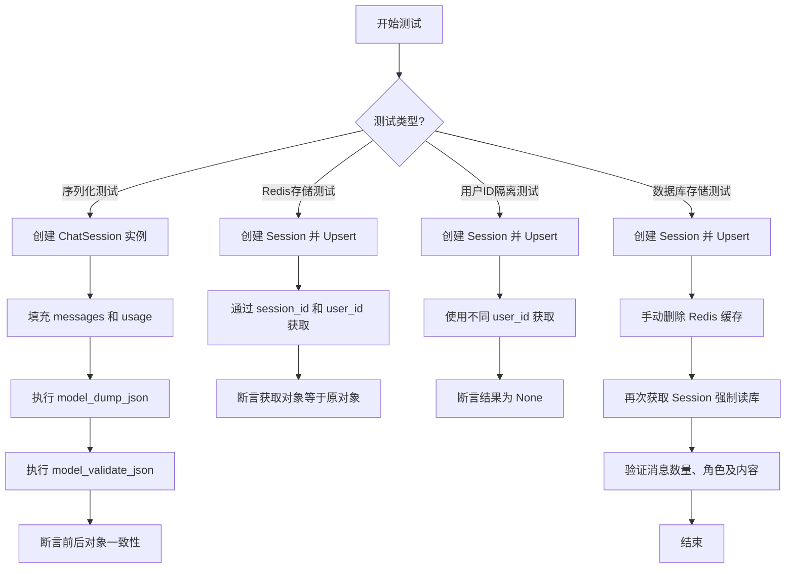
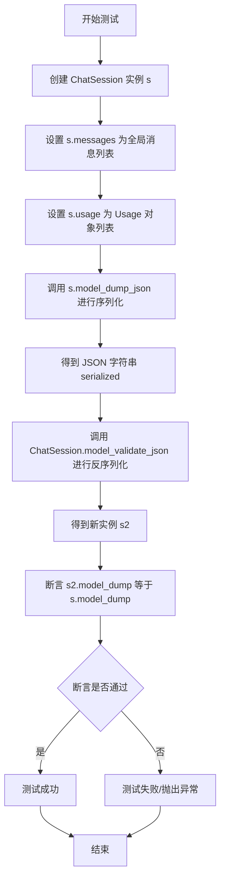
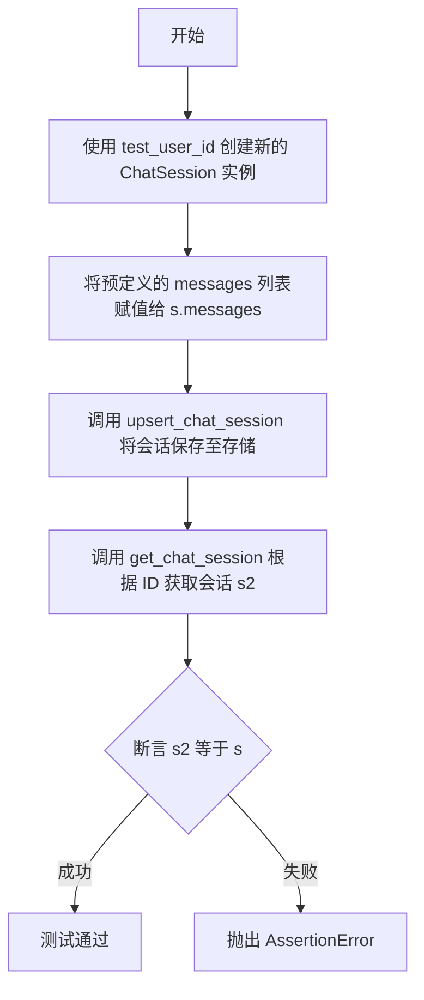
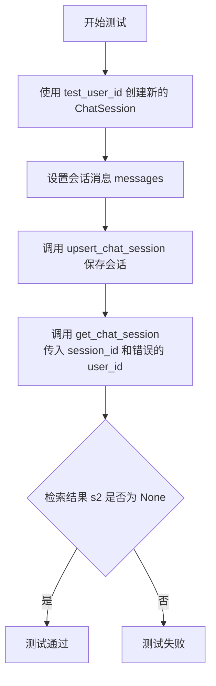
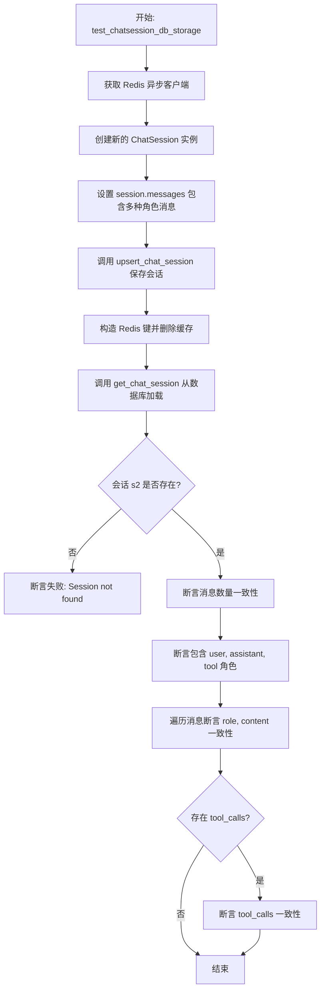
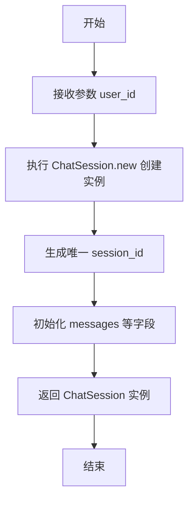
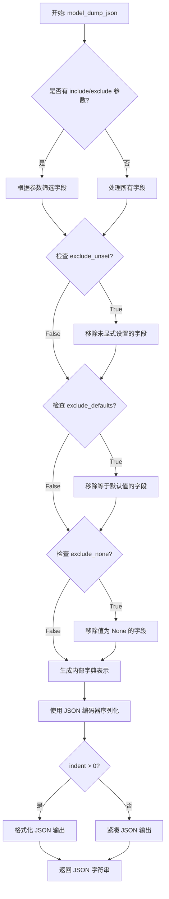
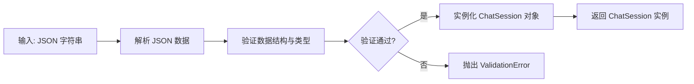
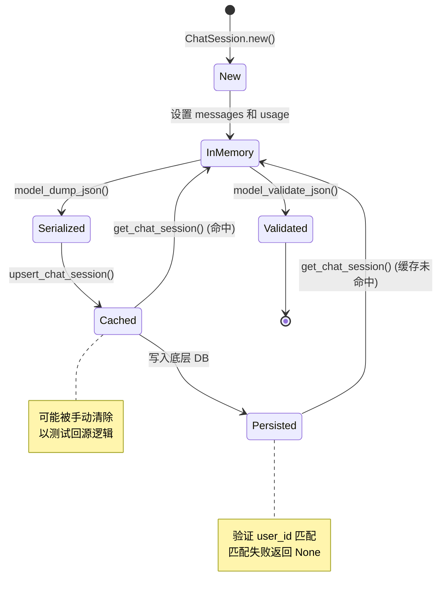

# `AutoGPT\autogpt_platform\backend\backend\api\features\chat\model_test.py` 详细设计文档

该文件包含一系列基于 pytest 的异步测试用例，用于验证 ChatSession 模型的序列化/反序列化机制、Redis 缓存读写、基于用户 ID 的数据隔离安全性以及绕过缓存直接从数据库加载数据的完整流程。

## 整体流程



## 类结构

```
Test Suite Components (测试套件组件)
├── Global Data (全局数据)
│   └── messages (测试消息集)
└── Test Functions (测试函数)
    ├── test_chatsession_serialization_deserialization
    ├── test_chatsession_redis_storage
    ├── test_chatsession_redis_storage_user_id_mismatch
    └── test_chatsession_db_storage
```

## 全局变量及字段


### `messages`
    
预定义的测试用聊天消息列表，包含用户、助手和工具角色的消息

类型：`List[ChatMessage]`
    


### `ChatSession.session_id`
    
聊天会话的唯一标识符

类型：`str`
    


### `ChatSession.user_id`
    
关联用户的唯一标识符

类型：`str`
    


### `ChatSession.messages`
    
聊天会话包含的消息列表

类型：`List[ChatMessage]`
    


### `ChatSession.usage`
    
记录Token使用情况的对象列表

类型：`List[Usage]`
    


### `ChatMessage.content`
    
消息的文本内容

类型：`str`
    


### `ChatMessage.role`
    
消息发送者的角色类型（如user, assistant, tool）

类型：`str`
    


### `ChatMessage.tool_calls`
    
助手生成的工具调用信息列表

类型：`List[dict]`
    


### `ChatMessage.tool_call_id`
    
用于关联工具调用与响应的唯一ID

类型：`str`
    


### `Usage.prompt_tokens`
    
输入提示消耗的Token数量

类型：`int`
    


### `Usage.completion_tokens`
    
生成回复消耗的Token数量

类型：`int`
    


### `Usage.total_tokens`
    
总共消耗的Token数量

类型：`int`
    
    

## 全局函数及方法


### `test_chatsession_serialization_deserialization`

该测试函数用于验证 `ChatSession` 对象的序列化与反序列化机制的正确性。它创建了一个包含预设消息和使用统计信息的 `ChatSession` 实例，将其转换为 JSON 字符串（序列化），随后再将该 JSON 字符串转换回 `ChatSession` 对象（反序列化），最终通过断言比较原始对象与恢复对象的字典数据是否完全一致，以确保数据在转换过程中未发生丢失或失真。

参数：

- 该函数无参数。

返回值：`None`，该函数为测试函数，不返回业务数据，成功时通过断言，失败时抛出异常。

#### 流程图



#### 带注释源码

```python
@pytest.mark.asyncio(loop_scope="session")  # 使用 pytest-asyncio 标记，指定事件循环作用域为 session
async def test_chatsession_serialization_deserialization():  # 定义异步测试函数
    # 创建一个新的 ChatSession 对象，指定用户 ID 为 "abc123"
    s = ChatSession.new(user_id="abc123")
    
    # 将全局预定义的 messages 列表赋值给会话的 messages 属性
    s.messages = messages
    
    # 创建一个 Usage 对象并赋值给会话的 usage 属性，模拟 token 消耗统计
    s.usage = [Usage(prompt_tokens=100, completion_tokens=200, total_tokens=300)]
    
    # 将 ChatSession 对象 s 序列化为 JSON 格式的字符串
    serialized = s.model_dump_json()
    
    # 利用 JSON 字符串反序列化，构造一个新的 ChatSession 对象 s2
    s2 = ChatSession.model_validate_json(serialized)
    
    # 验证反序列化后的对象 s2 的字典形式数据是否与原始对象 s 完全一致
    assert s2.model_dump() == s.model_dump()
```


### `test_chatsession_redis_storage`

验证聊天会话对象能够被成功创建并保存到 Redis 存储中，随后能够通过会话 ID 和用户 ID 正确检索，并验证检索出的数据与原始数据一致。

参数：

- `setup_test_user`：`Fixture`，用于初始化测试用户环境的 pytest 夹具。
- `test_user_id`：`str`，用于关联测试会话的用户 ID。

返回值：`None`，该函数为测试函数，无返回值，通过断言验证逻辑正确性。

#### 流程图



#### 带注释源码

```python
# 标记该测试函数为异步测试，并设置事件循环范围为 session 级别
@pytest.mark.asyncio(loop_scope="session")
async def test_chatsession_redis_storage(setup_test_user, test_user_id):

    # 步骤 1: 使用传入的测试用户 ID 创建一个新的聊天会话对象
    s = ChatSession.new(user_id=test_user_id)
    
    # 步骤 2: 将全局定义的模拟消息列表赋值给当前会话
    s.messages = messages

    # 步骤 3: 调用 upsert_chat_session 异步方法将会话保存到 Redis 存储
    # 该方法会返回更新后的会话对象（通常包含生成的 session_id）
    s = await upsert_chat_session(s)

    # 步骤 4: 根据 session_id 和 user_id 从存储中检索会话
    s2 = await get_chat_session(
        session_id=s.session_id,
        user_id=s.user_id,
    )

    # 步骤 5: 断言检索到的会话对象 s2 与原始保存的对象 s 完全相等
    # 验证了存储和读取的数据完整性
    assert s2 == s
```


### `test_chatsession_redis_storage_user_id_mismatch`

该测试函数旨在验证当尝试使用错误的用户ID（user_id）检索已存储的聊天会话时，系统能正确返回None，从而确保用户数据的隔离性和安全性，防止越权访问。

参数：

-  `setup_test_user`：`Fixture`，用于初始化测试用户数据环境的Pytest fixture。
-  `test_user_id`：`str`，用于创建初始会话的测试用户ID。

返回值：`None`，该函数作为测试用例，无直接返回值，通过断言验证逻辑。

#### 流程图



#### 带注释源码

```python
@pytest.mark.asyncio(loop_scope="session")
async def test_chatsession_redis_storage_user_id_mismatch(
    setup_test_user, test_user_id
):
    # 使用测试用户ID创建一个新的聊天会话对象
    s = ChatSession.new(user_id=test_user_id)
    # 预填充测试消息数据
    s.messages = messages
    # 将会话持久化存储（写入Redis/DB）
    s = await upsert_chat_session(s)

    # 尝试使用正确的 session_id 但错误的 user_id ('different_user_id') 获取会话
    s2 = await get_chat_session(s.session_id, "different_user_id")

    # 断言检索结果应为 None，验证了用户隔离机制有效
    assert s2 is None
```


### `test_chatsession_db_storage`

该函数是一个异步测试用例，旨在验证聊天会话数据（包括消息内容、角色及工具调用信息）能够被正确地持久化到数据库中，并且在绕过 Redis 缓存的情况下，能够从数据库中完整、准确地加载出来。

参数：

-   `setup_test_user`：`Fixture`，用于设置测试用户环境的 pytest 夹具。
-   `test_user_id`：`str`，测试用户的唯一标识符，用于创建和检索会话。

返回值：`None`，该函数为测试用例，无返回值，通过断言来验证逻辑正确性。

#### 流程图



#### 带注释源码

```python
@pytest.mark.asyncio(loop_scope="session")
async def test_chatsession_db_storage(setup_test_user, test_user_id):
    """Test that messages are correctly saved to and loaded from DB (not cache)."""
    from backend.data.redis_client import get_redis_async

    # 1. 创建一个新的聊天会话，并指定用户ID
    s = ChatSession.new(user_id=test_user_id)
    
    # 2. 设置会话的消息列表（包含 user, assistant, tool 三种角色的消息）
    s.messages = messages  # Contains user, assistant, and tool messages
    
    # 3. 确保会话ID已生成
    assert s.session_id is not None, "Session id is not set"
    
    # 4. 将会话写入存储（通常同时写入缓存和数据库）
    s = await upsert_chat_session(s)

    # 5. 构造 Redis 缓存键，用于清除缓存
    redis_key = f"chat:session:{s.session_id}"
    async_redis = await get_redis_async()
    
    # 6. 删除 Redis 中的缓存，强制后续读取操作必须访问数据库
    await async_redis.delete(redis_key)

    # 7. 从数据库加载会话（因为缓存已被清除）
    s2 = await get_chat_session(
        session_id=s.session_id,
        user_id=s.user_id,
    )

    # 8. 验证从数据库加载的会话不为空
    assert s2 is not None, "Session not found after loading from DB"
    
    # 9. 验证加载的消息数量与原始数量一致
    assert len(s2.messages) == len(
        s.messages
    ), f"Message count mismatch: expected {len(s.messages)}, got {len(s2.messages)}"

    # 10. 验证所有预期的角色（user, assistant, tool）都存在于加载的消息中
    roles = [m.role for m in s2.messages]
    assert "user" in roles, f"User message missing. Roles found: {roles}"
    assert "assistant" in roles, f"Assistant message missing. Roles found: {roles}"
    assert "tool" in roles, f"Tool message missing. Roles found: {roles}"

    # 11. 逐条验证消息的详细内容（角色、内容、工具调用）
    for orig, loaded in zip(s.messages, s2.messages):
        assert orig.role == loaded.role, f"Role mismatch: {orig.role} != {loaded.role}"
        assert (
            orig.content == loaded.content
        ), f"Content mismatch for {orig.role}: {orig.content} != {loaded.content}"
        
        # 如果原始消息包含工具调用，验证加载的消息也包含且数量一致
        if orig.tool_calls:
            assert (
                loaded.tool_calls is not None
            ), f"Tool calls missing for {orig.role} message"
            assert len(orig.tool_calls) == len(loaded.tool_calls)
```


### `ChatSession.new`

该方法是一个类工厂方法，用于根据提供的 `user_id` 创建并初始化一个新的 `ChatSession` 实例。根据测试用例的使用情况，该方法生成的实例会自动包含一个唯一的 `session_id`，且支持 Pydantic 模型的序列化和反序列化功能。

参数：

-   `user_id`：`str`，创建会话所关联的用户唯一标识符。

返回值：`ChatSession`，新创建的聊天会话实例，包含会话 ID 和初始状态。

#### 流程图



#### 带注释源码

```python
# 注意：提供的代码片段中仅包含了测试用例，未包含 ChatSession 类的具体实现代码。
# 以下代码是根据测试用例中的使用方式推断出的接口定义和预期行为。

@classmethod
def new(cls, user_id: str) -> "ChatSession":
    """
    工厂方法：创建一个新的 ChatSession 实例。

    :param user_id: 用户ID
    :return: ChatSession 实例
    """
    # 推测实现：
    # 1. 生成唯一的 session_id (UUID 或类似机制)
    # 2. 初始化 messages 列表为空
    # 3. 初始化 usage 统计
    # 4. 返回实例
    pass
```


### `ChatSession.model_dump_json`

将 `ChatSession` 模型实例序列化为 JSON 格式的字符串。该方法通常继承自 Pydantic 的 `BaseModel`，用于将包含消息列表、使用量统计及用户 ID 等信息的会话对象转换为字符串，以便于存储或网络传输。

参数：

-  `indent`：`int | None`，JSON 字符串的缩进空格数，若为 None 则输出紧凑格式。
-  `include`：`set[int] | set[str] | dict[int, set[int] | set[str]] | dict[str, set[int] | set[str]] | None`，指定需要包含在输出中的字段。
-  `exclude`：`set[int] | set[str] | dict[int, set[int] | set[str]] | dict[str, set[int] | set[str]] | None`，指定需要从输出中排除的字段。
-  `exclude_unset`：`bool`，是否排除那些在模型创建后未被显式设置的字段（仅使用默认值的字段）。
-  `exclude_defaults`：`bool`，是否排除值等于默认值的字段。
-  `exclude_none`：`bool`，是否排除值为 None 的字段。
-  `round_trip`：`bool`，是否启用“往返”模式，以确保序列化后的 JSON 能够无损解析回原始类型（例如区分浮点数和整数）。
-  `warnings`：`bool | Literal['none', 'warn', 'error']`，设置如何处理序列化过程中遇到的警告。

返回值：`str`，包含 `ChatSession` 实例数据的 JSON 格式字符串。

#### 流程图



#### 带注释源码

```python
# 注意：此方法继承自 pydantic.BaseModel，并非在提供的测试文件代码中直接定义。
# 以下是基于 Pydantic V2 标准库实现的逻辑描述和签名。

def model_dump_json(
    self,
    *,
    indent: int | None = None,
    include: 'IncEx | None' = None,
    exclude: 'IncEx | None' = None,
    exclude_unset: bool = False,
    exclude_defaults: bool = False,
    exclude_none: bool = False,
    round_trip: bool = False,
    warnings: 'bool | Literal["none", "warn", "error"]' = True,
) -> str:
    """
    生成 `self` 的 JSON 字符串表示。
    
    在测试代码 `serialized = s.model_dump_json()` 中调用此方法，
    将 ChatSession 对象（包含 user_id, session_id, messages, usage 等）
    转换为字符串以便于后续的反序列化测试。
    """
    # 1. 内部调用 model_dump() 将模型转换为字典，应用 include/exclude 等过滤逻辑
    # 2. 使用 pydantic 的核心 JSON 编码器将字典转换为 JSON 字符串
    # 3. 处理 indent 参数以决定是否美化输出
    # 4. 返回最终的 JSON 字符串
    pass
```


### `ChatSession.model_validate_json`

该方法用于将 JSON 字符串解析并验证为 `ChatSession` 类的实例。它通常用于从存储或传输中恢复会话对象。

参数：

-   `json_data`：`str` | `bytes`，包含序列化 `ChatSession` 数据的 JSON 格式字符串（在代码中通过 `serialized` 变量传入）。

返回值：`ChatSession`，通过解析和验证 JSON 数据后生成的 `ChatSession` 实例对象。

#### 流程图



#### 带注释源码

```python
# 注意：ChatSession 类的具体实现未在提供的代码片段中展示，该方法继承自 Pydantic 的 BaseModel。
# 以下为代码中的调用上下文及推断的签名逻辑：

# s.model_dump_json() 生成了 serialized 字符串
serialized = s.model_dump_json()

# 调用类方法 model_validate_json 将 JSON 字符串反序列化为对象
# json_data: str - 包含 ChatSession 数据的 JSON 字符串
# 返回: ChatSession - 解析后的会话实例
s2 = ChatSession.model_validate_json(serialized)
```


## 关键组件


### ChatSession 管理
封装聊天会话的生命周期，包括会话的创建、消息列表的维护、使用统计信息的记录，以及对象的 JSON 序列化与反序列化。

### Redis 缓存层
提供高性能的会话存储与检索服务，用于缓存 ChatSession 数据以加快访问速度，并在查询时验证用户 ID 的匹配以确保数据安全。

### 数据库持久化
作为 ChatSession 数据的可靠后端存储，确保在缓存失效或数据被清除后，仍能从数据库中完整还原会话消息、角色及工具调用信息。

### 工具调用支持
支持复杂的对话场景，能够序列化和存储包含 tool_calls 字段的助手消息，以及关联的 tool_call_id 工具响应消息，确保函数调用上下文的完整性。


## 问题及建议


### 已知问题

-   **测试与实现细节强耦合**：在 `test_chatsession_db_storage` 测试中，代码直接导入了 `redis_client` 并通过硬编码的键格式 `f"chat:session:{s.session_id}"` 来手动删除 Redis 缓存。这种做法导致测试代码严重依赖底层数据存储的键命名规则。一旦 Redis 键的命名策略发生变更，测试将立即失败，违反了测试隔离原则。
-   **全局变量管理不当**：测试数据 `messages` 被定义为模块级别的全局变量。在多个测试同时运行或需要修改测试数据时，全局变量容易引发状态污染，且不利于不同测试用例之间的数据隔离和复用。
-   **脆弱的序列化对比**：在 `test_chatsession_serialization_deserialization` 中，使用 `assert s2.model_dump() == s.model_dump()` 进行全量对比。如果模型中包含动态生成的字段（如 `updated_at` 时间戳），这种对比方式极易因时间差异导致测试失败，从而产生误报。
-   **局部依赖导入**：在 `test_chatsession_db_storage` 函数内部进行 `from backend.data.redis_client import get_redis_async` 导入。虽然 Python 允许这样做，但在测试代码中通常建议在文件顶部统一管理依赖，以保持代码结构的清晰和依赖关系的可追溯性。

### 优化建议

-   **引入 Fixture 管理测试数据**：建议将全局变量 `messages` 转换为 Pytest 的 `fixture` 函数。这样可以确保每次测试调用时都能获得干净的数据副本，并且可以方便地通过参数化（parametrize）来测试不同的消息场景。
-   **使用 Mock 或标志位控制缓存层**：为了验证 DB 存储逻辑，建议不要直接操作 Redis 删除键。更好的做法是在 `upsert_chat_session` 或 `get_chat_session` 接口中增加一个控制参数（如 `skip_cache=True`）来强制回源到数据库，或者在测试中 Mock 缓存层使其返回 `None`。这样可以保持测试对底层存储细节的无感知性。
-   **封装验证逻辑**：在 `test_chatsession_db_storage` 中存在大量的断言逻辑（检查角色、内容、Tool calls 等）。建议将这些验证逻辑提取为一个独立的辅助函数（如 `assert_messages_equal`），以提高测试代码的可读性和复用性。
-   **增强序列化测试的健壮性**：在进行模型序列化/反序列化对比时，建议排除动态字段（如时间戳），或者仅校验核心业务字段，而不是直接对比整个 `model_dump()` 的结果。


## 其它


### 数据流与状态机

本模块主要涉及 `ChatSession` 对象的生命周期管理，包括创建、序列化、存储（缓存与数据库）、检索及反序列化。数据流在内存、Redis 缓存和持久化数据库之间流转。

**状态流转图：**



**详细数据流描述：**

1.  **对象构造与初始化**：
    *   通过 `ChatSession.new(user_id)` 创建新的会话实例，状态为 `New`。
    *   在内存中填充 `messages` 列表（包含 user, assistant, tool 角色的消息）和 `usage` 统计数据。

2.  **序列化与持久化**：
    *   调用 `s.model_dump_json()` 将对象转换为 JSON 字符串（`Serialized` 状态），验证 Pydantic 模型的序列化能力。
    *   调用 `upsert_chat_session(s)` 将会话写入存储层。根据测试逻辑，数据首先写入 Redis 缓存（`Cached` 状态），随后同步持久化到数据库（`Persisted` 状态）。

3.  **检索与回源机制**：
    *   调用 `get_chat_session(session_id, user_id)` 尝试获取会话。
    *   系统优先检查 Redis 缓存。如果缓存存在且 `user_id` 匹配，直接返回对象。
    *   **Cache-Aside 模式验证**：在 `test_chatsession_db_storage` 中，显式删除 Redis 键（`redis.delete`）以模拟缓存失效。
    *   当缓存失效时，系统自动从数据库加载数据，重建 `ChatSession` 对象，并隐式地回填缓存或直接返回。

4.  **反序列化与验证**：
    *   从存储层获取的数据通过 `ChatSession.model_validate_json()` 进行反序列化和模型校验，确保数据结构的完整性和类型安全。

### 外部依赖与接口契约

本测试代码及被测系统依赖于外部异步存储服务和 Pydantic 数据验证库。

**1. Redis 缓存服务 (`backend.data.redis_client`)**

*   **描述**：提供高性能的键值存储，用于会话数据的快速读取。
*   **接口契约**：
    *   **依赖函数**：`get_redis_async()`
    *   **返回类型**：异步 Redis 客户端实例。
    *   **操作契约**：
        *   `delete(key: str)`: 异步删除指定键，用于测试环境下的缓存清理。
        *   键命名规范：`chat:session:{session_id}`。
*   **耦合方式**：代码直接依赖具体的键格式进行清理操作，表明存储层与业务逻辑层存在关于键命名策略的隐式契约。

**2. 数据持久层 (`upsert_chat_session`, `get_chat_session`)**

*   **描述**：负责会话数据的持久化存储和查询，底层可能连接关系型数据库或 NoSQL 数据库。
*   **接口契约**：
    *   `upsert_chat_session(session: ChatSession) -> ChatSession`:
        *   **功能**：保存或更新会话（包含消息和元数据）。
        *   **契约**：必须将数据完整写入 DB，并在写入后返回的对象中包含有效的 `session_id`。
    *   `get_chat_session(session_id: str, user_id: str) -> Optional[ChatSession]`:
        *   **功能**：根据 ID 查询会话。
        *   **契约**：必须执行 `user_id` 权限校验。如果 `user_id` 不匹配，返回 `None` 而非抛出异常。

**3. Pydantic 模型 (`ChatSession`, `ChatMessage`, `Usage`)**

*   **描述**：数据建模与验证库。
*   **接口契约**：
    *   `model_dump_json() -> str`: 保证生成的 JSON 字符串能完整无损地表达模型状态。
    *   `model_validate_json(json_str) -> BaseModel`: 保证能从 JSON 字符串准确重建对象，且类型转换符合定义。

### 错误处理与异常设计

基于测试用例的分析，系统在错误处理方面采用了特定的设计策略，主要侧重于防御性编程和数据一致性校验。

1.  **权限不匹配处理**
    *   **场景**：当请求的 `user_id` 与会话所有者 ID 不一致时（如 `test_chatsession_redis_storage_user_id_mismatch`）。
    *   **策略**：**静默失败**。函数 `get_chat_session` 返回 `None`，而不是抛出 `PermissionDenied` 或 `AuthenticationError` 异常。
    *   **设计意图**：这种设计允许调用方通过简单的 `if session is None` 逻辑来处理“未找到”或“无权访问”的情况，简化了上层错误处理流程，但可能掩盖了具体的错误原因（是资源不存在还是无权限）。

2.  **数据完整性校验**
    *   **场景**：序列化与反序列化过程（`test_chatsession_serialization_deserialization`）。
    *   **策略**：基于 Pydantic 的严格类型校验。如果在反序列化过程中 JSON 数据缺失字段或类型不匹配（例如 `tool_calls` 结构错误），Pydantic 将抛出 `ValidationError`。
    *   **处理方式**：测试使用 `assert` 确保往返数据一致。在生产环境中，此类异常通常需捕获并记录日志，视为数据损坏或格式错误。

3.  **缓存穿透处理**
    *   **场景**：Redis 缓存被删除后，从数据库加载数据（`test_chatsession_db_storage`）。
    *   **策略**：**自动降级**。`get_chat_session` 实现了 Cache-Aside 逻辑。当 Redis 操作失败或 Key 不存在时，自动回源查询数据库。
    *   **鲁棒性**：系统不强制依赖缓存可用性，即使 Redis 挂掉或数据被清理，只要 DB 正常，服务仍可用。

### 设计目标与约束

1.  **设计目标**

    *   **数据一致性**：
        *   确保 `ChatSession` 对象在内存序列化为 JSON 后，能够完全无损地反序列化回原对象，保证字段类型、嵌套结构（如 `tool_calls`）和数值的精确匹配。
    *   **高可用性与性能**：
        *   采用 Redis 作为缓存层，优先读取缓存以降低延迟和数据库压力。
        *   设计了缓存回源机制，确保在缓存失效时服务仍不中断。
    *   **多租户/用户隔离**：
        *   强制要求在获取会话时必须同时提供 `session_id` 和 `user_id`，确保用户只能访问自己的会话数据，防止越权访问。

2.  **约束条件**

    *   **异步 I/O 模型**：
        *   所有存储操作（`upsert`, `get`）必须支持异步调用（`async/await`），以适应高并发 I/O 密集型场景。
    *   **测试环境隔离**：
        *   测试依赖于 `pytest-asyncio` 的 `loop_scope="session"`，意味着测试运行在共享的事件循环中，测试数据（如 `setup_test_user`）需要在会话级别进行隔离或清理。
    *   **数据结构约束**：
        *   `ChatMessage` 必须支持包含复杂嵌套结构（如 `tool_calls` 列表），且必须兼容 OpenAI 风格的消息格式（包含 `role`, `content`, `tool_call_id` 等字段）。
    *   **键值存储约束**：
        *   Redis 键的格式被硬编码为 `f"chat:session:{s.session_id}"`，这使得存储层的命名空间结构成为系统的一个硬性约束，修改它将影响数据的访问。


    