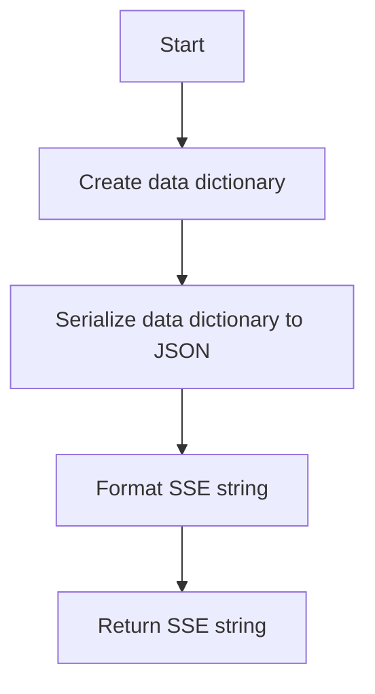
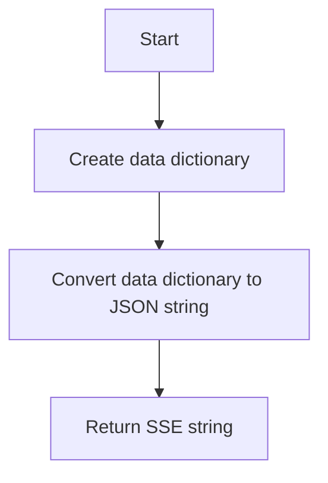
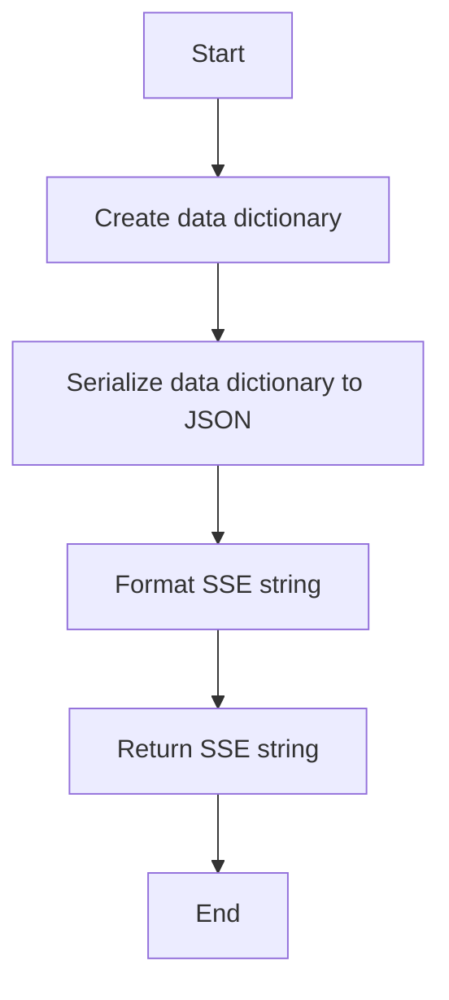
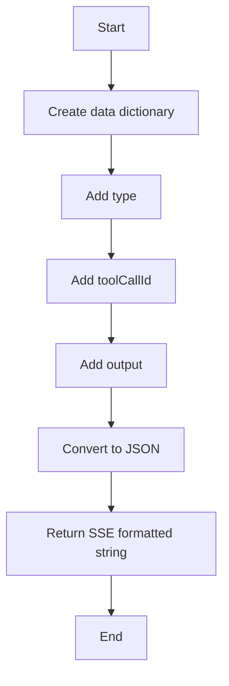
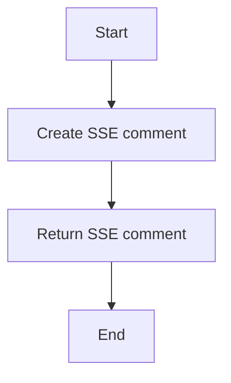

# `.\AutoGPT\autogpt_platform\backend\backend\api\features\chat\response_model.py` 详细设计文档

This module defines a set of response models for the Vercel AI SDK UI Stream Protocol, which is used for streaming chat responses.

## 整体流程

```mermaid
graph TD
    A[Start] --> B[StreamStartResponse]
    B --> C[StreamStartStep]
    C --> D[StreamTextStart | StreamTextDelta | StreamTextEnd]
    D --> E[StreamFinishStep]
    E --> F[StreamFinishResponse]
    F --> G[StreamUsage | StreamError | StreamHeartbeat | StreamToolInteraction]
    G --> H[End]
```

## 类结构

```
StreamBaseResponse (抽象基类)
├── StreamStartResponse (消息生命周期)
│   ├── StreamStart
│   ├── StreamFinish
│   ├── StreamStartStep
│   ├── StreamFinishStep
│   └── StreamError
├── StreamTextResponse (文本流)
│   ├── StreamTextStart
│   ├── StreamTextDelta
│   └── StreamTextEnd
├── StreamToolInteraction (工具交互)
│   ├── StreamToolInputStart
│   ├── StreamToolInputAvailable
│   └── StreamToolOutputAvailable
└── StreamOther (其他)
    ├── StreamUsage
    └── StreamHeartbeat
```

## 全局变量及字段


### `ResponseType.START`
    
Indicates the start of a new message.

类型：`str`
    


### `ResponseType.FINISH`
    
Indicates the end of a message/stream.

类型：`str`
    


### `ResponseType.START_STEP`
    
Indicates the start of a step within a message.

类型：`str`
    


### `ResponseType.FINISH_STEP`
    
Indicates the end of a step within a message.

类型：`str`
    


### `ResponseType.TEXT_START`
    
Indicates the start of a text block.

类型：`str`
    


### `ResponseType.TEXT_DELTA`
    
Indicates a delta update to a text block.

类型：`str`
    


### `ResponseType.TEXT_END`
    
Indicates the end of a text block.

类型：`str`
    


### `ResponseType.TOOL_INPUT_START`
    
Indicates the start of a tool call.

类型：`str`
    


### `ResponseType.TOOL_INPUT_AVAILABLE`
    
Indicates that tool input is ready for execution.

类型：`str`
    


### `ResponseType.TOOL_OUTPUT_AVAILABLE`
    
Indicates that tool execution result is available.

类型：`str`
    


### `ResponseType.ERROR`
    
Indicates an error occurred.

类型：`str`
    


### `ResponseType.USAGE`
    
Indicates token usage statistics.

类型：`str`
    


### `ResponseType.HEARTBEAT`
    
Indicates a heartbeat to keep the SSE connection alive.

类型：`str`
    


### `StreamBaseResponse.type`
    
The type of the streaming response.

类型：`ResponseType`
    


### `StreamStart.messageId`
    
Unique message ID.

类型：`str`
    


### `StreamStart.taskId`
    
Task ID for SSE reconnection.

类型：`str`
    


### `StreamTextStart.id`
    
Text block ID.

类型：`str`
    


### `StreamTextDelta.delta`
    
Text content delta.

类型：`str`
    


### `StreamToolInputStart.toolCallId`
    
Unique tool call ID.

类型：`str`
    


### `StreamToolInputStart.toolName`
    
Name of the tool being called.

类型：`str`
    


### `StreamToolInputAvailable.input`
    
Tool input arguments.

类型：`dict[str, Any]`
    


### `StreamToolOutputAvailable.output`
    
Tool execution output.

类型：`str | dict[str, Any]`
    


### `StreamUsage.promptTokens`
    
Number of prompt tokens.

类型：`int`
    


### `StreamUsage.completionTokens`
    
Number of completion tokens.

类型：`int`
    


### `StreamUsage.totalTokens`
    
Total number of tokens.

类型：`int`
    


### `StreamError.errorText`
    
Error message text.

类型：`str`
    


### `StreamError.code`
    
Error code.

类型：`str`
    


### `StreamError.details`
    
Additional error details.

类型：`dict[str, Any]`
    


### `StreamHeartbeat.toolCallId`
    
Tool call ID if heartbeat is for a specific tool.

类型：`str`
    
    

## 全局函数及方法


### StreamBaseResponse.to_sse

Converts the response to Server-Sent Events (SSE) format.

参数：

- 无

返回值：`str`，返回一个格式化的SSE字符串。

#### 流程图

```mermaid
graph TD
    A[Start] --> B[Call model_dump_json()]
    B --> C[Format data as JSON]
    C --> D[Return formatted SSE string]
```

#### 带注释源码

```python
def to_sse(self) -> str:
    """Convert to SSE format."""
    return f"data: {self.model_dump_json()}\n\n"
```


### StreamStart.to_sse

Converts a StreamStart object to Server-Sent Events (SSE) format.

参数：

- `self`：`StreamStart`，The StreamStart object to convert.

返回值：`str`，A string representing the SSE formatted data.

#### 流程图



#### 带注释源码

```python
def to_sse(self) -> str:
    """Convert to SSE format, excluding non-protocol fields."""
    import json

    data: dict[str, Any] = {
        "type": self.type.value,
        "messageId": self.messageId,
    }
    return f"data: {json.dumps(data)}\n\n"
```


### StreamFinish.to_sse

Converts a StreamFinish object to Server-Sent Events (SSE) format.

参数：

- 无

返回值：`str`，返回一个格式化的SSE字符串。

#### 流程图



#### 带注释源码

```python
def to_sse(self) -> str:
    """Convert to SSE format."""
    return f"data: {self.model_dump_json()}\n\n"
```


### StreamStartStep.to_sse

Converts a StreamStartStep object to Server-Sent Events (SSE) format.

参数：

- 无

返回值：`str`，返回一个格式化的SSE字符串

#### 流程图


#### 带注释源码

```python
def to_sse(self) -> str:
    """Convert to SSE format."""
    return f"data: {self.model_dump_json()}\n\n"
```


### StreamFinishStep.to_sse

Converts a StreamFinishStep object to Server-Sent Events (SSE) format.

参数：

- 无

返回值：`str`，返回一个格式化的SSE字符串。

#### 流程图


#### 带注释源码

```python
def to_sse(self) -> str:
    """Convert to SSE format."""
    return f"data: {self.model_dump_json()}\n\n"
```


### StreamTextStart.to_sse

Converts a StreamTextStart object to Server-Sent Events (SSE) format.

参数：

-  `self`：`StreamTextStart`，The StreamTextStart object to convert.
-  ...

返回值：`str`，A string representing the SSE formatted data.

#### 流程图



#### 带注释源码

```python
def to_sse(self) -> str:
    """Convert to SSE format."""
    import json

    data: dict[str, Any] = {
        "type": self.type.value,
        "id": self.id,
    }
    return f"data: {json.dumps(data)}\n\n"
```


### StreamBaseResponse.to_sse

Converts the response to Server-Sent Events (SSE) format.

参数：

- 无

返回值：`str`，返回一个格式化的SSE字符串

#### 流程图


#### 带注释源码

```python
def to_sse(self) -> str:
    """Convert to SSE format."""
    return f"data: {self.model_dump_json()}\n\n"
```


### StreamTextEnd.to_sse

Converts a StreamTextEnd object to Server-Sent Events (SSE) format.

参数：

- 无

返回值：`str`，返回一个格式化的SSE字符串。

#### 流程图


#### 带注释源码

```python
def to_sse(self) -> str:
    """Convert to SSE format."""
    return f"data: {self.model_dump_json()}\n\n"
```


### StreamToolInputStart.to_sse

Converts a StreamToolInputStart object to Server-Sent Events (SSE) format.

参数：

- `self`：`StreamToolInputStart`，The StreamToolInputStart object to convert.
- ...

返回值：`str`，A string representing the SSE formatted data.

#### 流程图


#### 带注释源码

```python
def to_sse(self) -> str:
    """Convert to SSE format."""
    import json

    data: dict[str, Any] = {
        "type": self.type.value,
        "toolCallId": self.toolCallId,
        "toolName": self.toolName,
    }
    return f"data: {json.dumps(data)}\n\n"
```


### StreamToolInputAvailable.to_sse

Converts a StreamToolInputAvailable response to Server-Sent Events (SSE) format.

参数：

- `self`：`StreamToolInputAvailable`，The instance of the StreamToolInputAvailable class.

返回值：`str`，A string representing the SSE formatted response.

#### 流程图

```mermaid
graph TD
    A[Start] --> B[Call self.model_dump_json()]
    B --> C[Format JSON]
    C --> D[Return SSE formatted string]
    D --> E[End]
```

#### 带注释源码

```python
def to_sse(self) -> str:
    """Convert to SSE format."""
    return f"data: {self.model_dump_json()}\n\n"
```


### StreamToolOutputAvailable.to_sse

Converts a StreamToolOutputAvailable object to Server-Sent Events (SSE) format.

参数：

- `self`：`StreamToolOutputAvailable`，The instance of StreamToolOutputAvailable to be converted.
- ...

返回值：`str`，A string representing the SSE formatted data.

#### 流程图



#### 带注释源码

```python
def to_sse(self) -> str:
    """Convert to SSE format, excluding non-spec fields."""
    import json

    data = {
        "type": self.type.value,
        "toolCallId": self.toolCallId,
        "output": self.output,
    }
    return f"data: {json.dumps(data)}\n\n"
```


### StreamUsage.to_sse

Converts the StreamUsage object to Server-Sent Events (SSE) format.

参数：

- 无

返回值：`str`，返回一个格式化的SSE字符串。

#### 流程图


#### 带注释源码

```python
def to_sse(self) -> str:
    """Convert to SSE format."""
    return f"data: {self.model_dump_json()}\n\n"
```


### StreamError.to_sse

Converts the StreamError object to Server-Sent Events (SSE) format.

参数：

- `self`：`StreamError`，The StreamError object to convert.

返回值：`str`，The SSE formatted string representation of the StreamError object.

#### 流程图


#### 带注释源码

```python
def to_sse(self) -> str:
    """Convert to SSE format."""
    return f"data: {self.model_dump_json()}\n\n"
```


### StreamHeartbeat.to_sse

Converts the StreamHeartbeat object to Server-Sent Events (SSE) format.

参数：

- 无

返回值：`str`，SSE格式的字符串，用于保持SSE连接活跃。

#### 流程图



#### 带注释源码

```python
def to_sse(self) -> str:
    """Convert to SSE comment format to keep connection alive."""
    return ": heartbeat\n\n"
```


## 关键组件


### 张量索引与惰性加载

用于高效地索引和访问大型数据集，同时延迟加载数据以减少内存消耗。

### 反量化支持

提供对反量化操作的支持，以优化模型性能和资源使用。

### 量化策略

实现量化策略，以减少模型大小和提高推理速度。


## 问题及建议


### 已知问题

-   **代码重复性**：`StreamBaseResponse` 类中的 `to_sse` 方法在多个子类中被重复实现，可以考虑将其移动到基类中，以减少代码重复。
-   **全局函数缺失**：代码中缺少全局函数来处理一些可能需要的通用功能，例如错误处理或日志记录。
-   **类型注释**：部分字段和方法的类型注释不够详细，可能需要进一步明确类型和描述。

### 优化建议

-   **提取 `to_sse` 方法**：将 `to_sse` 方法从 `StreamBaseResponse` 移动到基类 `BaseModel` 中，因为 Pydantic 的 `BaseModel` 已经提供了 `to_json` 方法，可以用来生成 SSE 格式的字符串。
-   **添加全局函数**：根据需要添加全局函数，例如 `log_error` 用于记录错误，`handle_exception` 用于处理异常。
-   **完善类型注释**：为每个字段和方法提供更详细的类型注释和描述，以便于其他开发者理解和使用。
-   **单元测试**：为每个类和方法编写单元测试，以确保代码的正确性和稳定性。
-   **文档化**：为代码添加详细的文档注释，包括每个类、方法和字段的用途和参数说明。
-   **代码风格**：统一代码风格，例如缩进、命名规范等，以提高代码的可读性和可维护性。
-   **性能优化**：对于可能影响性能的代码段，进行性能分析并优化。


## 其它


### 设计目标与约束

- 设计目标：
  - 提供一个统一的接口来处理AI SDK UI Stream Protocol的响应。
  - 确保响应格式的一致性和可扩展性。
  - 支持多种类型的响应，如消息生命周期、文本流、工具交互等。
- 约束：
  - 遵循AI SDK UI Stream Protocol规范。
  - 使用Pydantic库进行数据验证和序列化。
  - 支持SSE（Server-Sent Events）格式。

### 错误处理与异常设计

- 错误处理：
  - 使用`StreamError`类来表示错误响应。
  - 错误响应包含错误文本、错误代码和附加错误详情。
- 异常设计：
  - 在数据验证过程中捕获异常，并返回相应的错误响应。

### 数据流与状态机

- 数据流：
  - 从AI SDK接收事件，并转换为相应的响应模型。
  - 将响应模型转换为SSE格式并发送回客户端。
- 状态机：
  - 每个响应类型对应一个状态，如`StreamStart`、`StreamTextStart`等。
  - 状态机根据事件类型和状态转换规则进行状态转换。

### 外部依赖与接口契约

- 外部依赖：
  - Pydantic库用于数据验证和序列化。
  - `json`库用于JSON序列化。
- 接口契约：
  - `StreamBaseResponse`类定义了所有响应模型的基类。
  - `to_sse`方法用于将响应模型转换为SSE格式。
  - `ResponseType`枚举定义了所有响应类型。


    