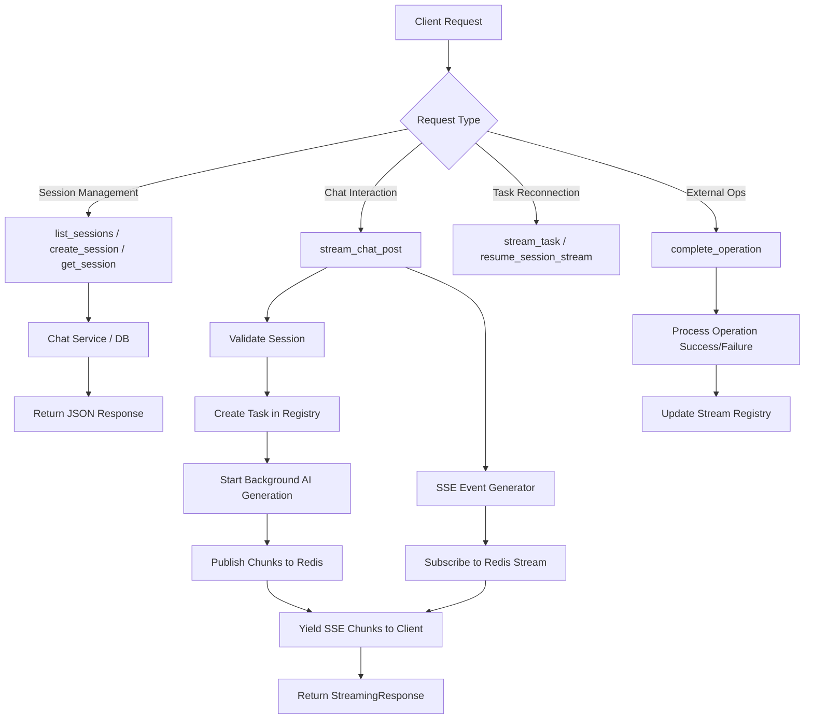
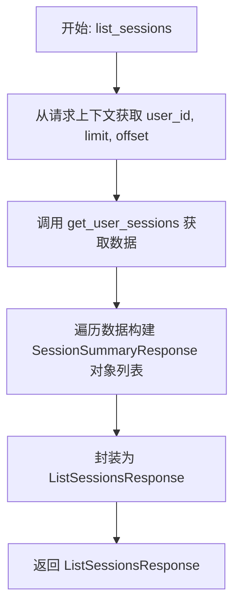
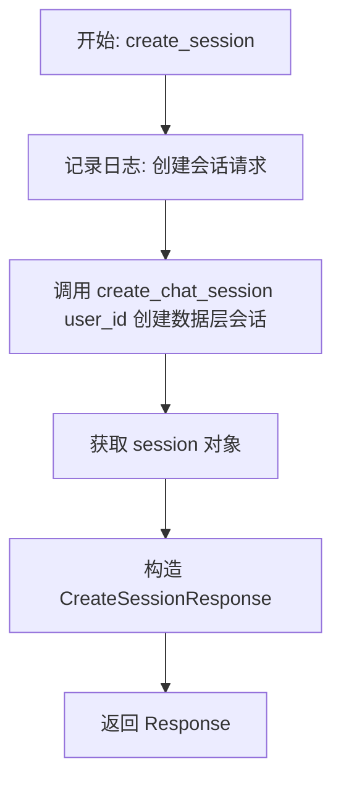
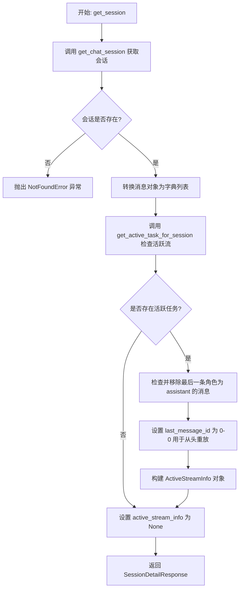
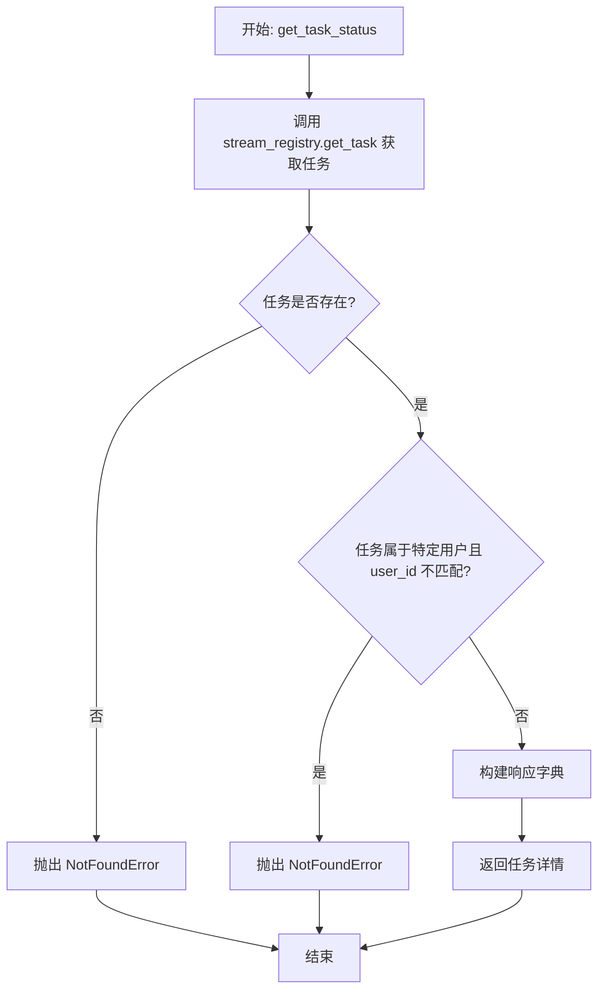
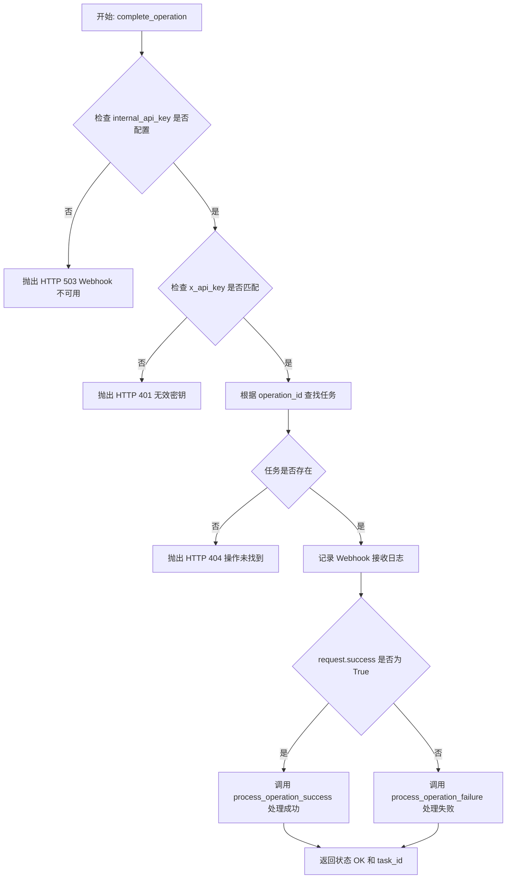
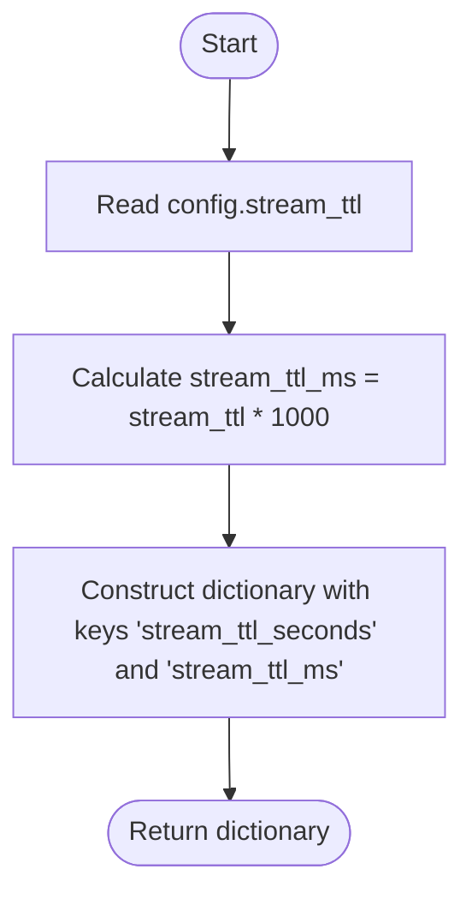
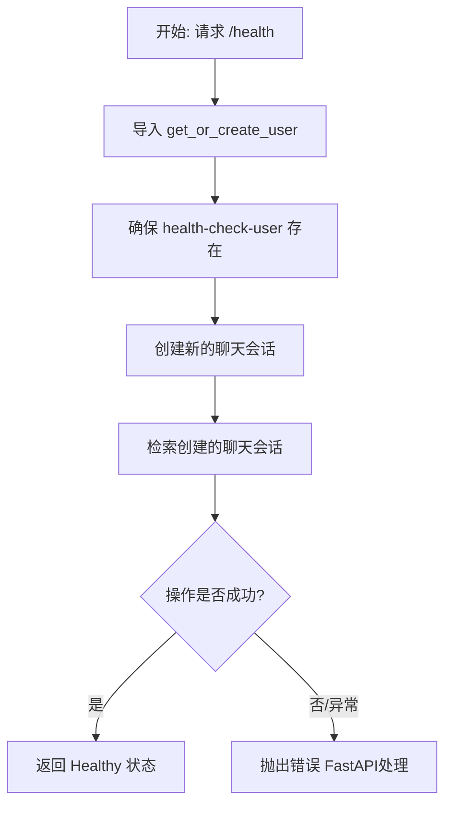
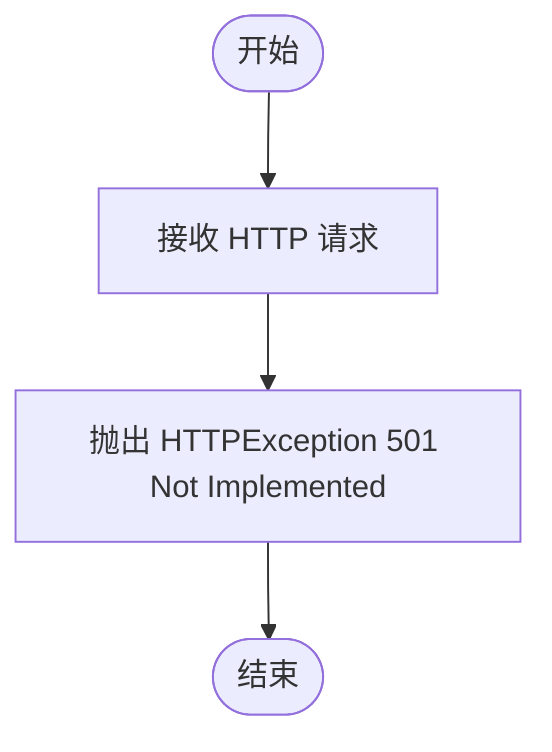

# `AutoGPT\autogpt_platform\backend\backend\api\features\chat\routes.py` 详细设计文档

This file implements FastAPI routes for managing chat sessions, streaming AI responses via Server-Sent Events (SSE), handling task reconnection, processing external operation completion webhooks, and providing service health checks.

## 整体流程



## 类结构

```
Pydantic Models (Request/Response)
├── StreamChatRequest
├── CreateSessionResponse
├── ActiveStreamInfo
├── SessionDetailResponse
├── SessionSummaryResponse
├── ListSessionsResponse
└── OperationCompleteRequest
API Routes & Handlers
├── _validate_and_get_session (Helper)
├── list_sessions
├── create_session
├── get_session
├── stream_chat_post
├── resume_session_stream
├── session_assign_user
├── stream_task
├── get_task_status
├── complete_operation
├── get_ttl_config
├── health_check
└── _tool_response_schema
```

## 全局变量及字段


### `config`
    
The configuration instance for the chat module, containing settings like TTL and API keys.

类型：`ChatConfig`
    


### `logger`
    
The logger instance for this module, used to record runtime information and errors.

类型：`logging.Logger`
    


### `router`
    
The FastAPI router instance that defines and groups the chat API endpoints.

类型：`APIRouter`
    


### `ToolResponseUnion`
    
A union type of all possible tool response models, used for OpenAPI schema export and code generation.

类型：`TypeUnion`
    


### `StreamChatRequest.message`
    
The text content of the message sent by the user in the chat interaction.

类型：`str`
    


### `StreamChatRequest.is_user_message`
    
A flag indicating whether the message originates from the user, defaulting to True.

类型：`bool`
    


### `StreamChatRequest.context`
    
An optional dictionary providing additional context (e.g., URL, content) for the chat session.

类型：`dict[str, str] | None`
    


### `CreateSessionResponse.id`
    
The unique identifier for the newly created chat session.

类型：`str`
    


### `CreateSessionResponse.created_at`
    
The ISO 8601 timestamp string indicating when the session was created.

类型：`str`
    


### `CreateSessionResponse.user_id`
    
The unique identifier of the user who owns the session, or None if anonymous.

类型：`str | None`
    


### `ActiveStreamInfo.task_id`
    
The unique ID of the background task associated with the active stream.

类型：`str`
    


### `ActiveStreamInfo.last_message_id`
    
The Redis Stream message ID used for resuming the stream from a specific point.

类型：`str`
    


### `ActiveStreamInfo.operation_id`
    
The ID of the operation being tracked for completion.

类型：`str`
    


### `ActiveStreamInfo.tool_name`
    
The name of the tool currently being executed in the stream.

类型：`str`
    


### `SessionDetailResponse.id`
    
The unique identifier of the chat session.

类型：`str`
    


### `SessionDetailResponse.created_at`
    
The ISO 8601 timestamp string for when the session was created.

类型：`str`
    


### `SessionDetailResponse.updated_at`
    
The ISO 8601 timestamp string for when the session was last updated.

类型：`str`
    


### `SessionDetailResponse.user_id`
    
The ID of the user associated with the session.

类型：`str | None`
    


### `SessionDetailResponse.messages`
    
A list of dictionaries representing the messages within the chat session.

类型：`list[dict]`
    


### `SessionDetailResponse.active_stream`
    
An object containing information about the active stream if one exists, otherwise None.

类型：`ActiveStreamInfo | None`
    


### `SessionSummaryResponse.id`
    
The unique identifier of the chat session.

类型：`str`
    


### `SessionSummaryResponse.created_at`
    
The ISO 8601 timestamp string for when the session was created.

类型：`str`
    


### `SessionSummaryResponse.updated_at`
    
The ISO 8601 timestamp string for when the session was last updated.

类型：`str`
    


### `SessionSummaryResponse.title`
    
The optional title of the chat session.

类型：`str | None`
    


### `ListSessionsResponse.sessions`
    
A list of summary objects representing the chat sessions.

类型：`list[SessionSummaryResponse]`
    


### `ListSessionsResponse.total`
    
The total count of chat sessions available for the user.

类型：`int`
    


### `OperationCompleteRequest.success`
    
A flag indicating whether the operation completed successfully.

类型：`bool`
    


### `OperationCompleteRequest.result`
    
The result payload of the operation, which can be a dictionary or string if successful.

类型：`dict | str | None`
    


### `OperationCompleteRequest.error`
    
A string containing error details if the operation failed.

类型：`str | None`
    
    

## 全局函数及方法


### `_validate_and_get_session`

验证会话是否存在并属于指定用户。如果会话不存在或用户不匹配，则抛出未找到异常。

参数：
- `session_id`：`str`，要验证的聊天会话的唯一标识符
- `user_id`：`str | None`，请求会话的用户 ID，支持 None 以处理匿名访问场景

返回值：`ChatSession`，验证通过后获取到的会话对象

#### 流程图

```mermaid
flowchart TD
    A[开始] --> B[调用 get_chat_session<br>获取会话]
    B --> C{会话是否存在?}
    C -- 否 --> D[抛出 NotFoundError<br>Session {session_id} not found]
    C -- 是 --> E[返回 session 对象]
    D --> F[结束]
    E --> F
```

#### 带注释源码

```python
async def _validate_and_get_session(
    session_id: str,
    user_id: str | None,
) -> ChatSession:
    """Validate session exists and belongs to user."""
    # 根据提供的 session_id 和 user_id 从数据库获取会话信息
    session = await get_chat_session(session_id, user_id)
    # 如果未找到会话，抛出 NotFoundError 异常
    if not session:
        raise NotFoundError(f"Session {session_id} not found.")
    # 返回获取到的有效会话对象
    return session
```


### `list_sessions`

列出认证用户的聊天会话。返回属于当前用户的聊天会话的分页列表，按最近更新时间排序。

参数：

- `user_id`：`Annotated[str, Security(auth.get_user_id)]`，认证用户的 ID。
- `limit`：`int`，要返回的最大会话数（1-100）。
- `offset`：`int`，分页时要跳过的会话数量。

返回值：`ListSessionsResponse`，包含会话摘要列表和总计数的响应对象。

#### 流程图



#### 带注释源码

```python
@router.get(
    "/sessions",
    dependencies=[Security(auth.requires_user)],
)
async def list_sessions(
    user_id: Annotated[str, Security(auth.get_user_id)],
    limit: int = Query(default=50, ge=1, le=100),
    offset: int = Query(default=0, ge=0),
) -> ListSessionsResponse:
    """
    List chat sessions for the authenticated user.

    Returns a paginated list of chat sessions belonging to the current user,
    ordered by most recently updated.

    Args:
        user_id: The authenticated user's ID.
        limit: Maximum number of sessions to return (1-100).
        offset: Number of sessions to skip for pagination.

    Returns:
        ListSessionsResponse: List of session summaries and total count.
    """
    # 调用服务层获取用户的会话数据和总数
    sessions, total_count = await get_user_sessions(user_id, limit, offset)

    # 构造响应对象，将数据库模型转换为 API 响应模型
    return ListSessionsResponse(
        sessions=[
            SessionSummaryResponse(
                id=session.session_id,
                created_at=session.started_at.isoformat(),
                updated_at=session.updated_at.isoformat(),
                title=session.title,
            )
            for session in sessions
        ],
        total=total_count,
    )
```


### `create_session`

Create a new chat session.

参数：

-  `user_id`：`Annotated[str, Depends(auth.get_user_id)]`，The authenticated user ID parsed from the JWT (required).

返回值：`CreateSessionResponse`，Details of the created session.

#### 流程图



#### 带注释源码

```python
@router.post(
    "/sessions",
)
async def create_session(
    user_id: Annotated[str, Depends(auth.get_user_id)],
) -> CreateSessionResponse:
    """
    Create a new chat session.

    Initiates a new chat session for the authenticated user.

    Args:
        user_id: The authenticated user ID parsed from the JWT (required).

    Returns:
        CreateSessionResponse: Details of the created session.

    """
    # 记录创建会话的日志，对用户ID进行脱敏处理以保护隐私
    logger.info(
        f"Creating session with user_id: "
        f"...{user_id[-8:] if len(user_id) > 8 else '<redacted>'}"
    )

    # 调用服务层创建聊天会话
    session = await create_chat_session(user_id)

    # 返回包含会话详情的响应对象
    return CreateSessionResponse(
        id=session.session_id,
        created_at=session.started_at.isoformat(),
        user_id=session.user_id,
    )
```


### `get_session`

检索特定聊天会话的详细信息。根据给定的用户（如果已通过身份验证）查找聊天会话，并返回包括消息在内的所有会话数据。如果该会话存在活跃的流，则返回用于重新连接的 task_id。

参数：

- `session_id`：`str`，所需聊天会话的唯一标识符。
- `user_id`：`str | None`，可选的经过身份验证的用户 ID，用于匿名访问则为 None。

返回值：`SessionDetailResponse`，所请求会话的详细信息，如果适用则包括 active_stream 信息。

#### 流程图



#### 带注释源码

```python
@router.get(
    "/sessions/{session_id}",
)
async def get_session(
    session_id: str,
    user_id: Annotated[str | None, Depends(auth.get_user_id)],
) -> SessionDetailResponse:
    """
    Retrieve the details of a specific chat session.

    Looks up a chat session by ID for the given user (if authenticated) and returns all session data including messages.
    If there's an active stream for this session, returns the task_id for reconnection.

    Args:
        session_id: The unique identifier for the desired chat session.
        user_id: The optional authenticated user ID, or None for anonymous access.

    Returns:
        SessionDetailResponse: Details for the requested session, including active_stream info if applicable.

    """
    # 根据session_id和user_id获取会话数据
    session = await get_chat_session(session_id, user_id)
    # 如果会话不存在，抛出404错误
    if not session:
        raise NotFoundError(f"Session {session_id} not found.")

    # 将消息列表转换为字典列表，便于序列化
    messages = [message.model_dump() for message in session.messages]

    # 检查该会话是否有活跃的流（stream）正在运行
    active_stream_info = None
    active_task, last_message_id = await stream_registry.get_active_task_for_session(
        session_id, user_id
    )
    if active_task:
        # 如果存在活跃任务，过滤掉会话响应中处于进行状态的助手消息。
        # 客户端将通过SSE流重放接收完整的助手响应，以防止内容重复。
        if messages and messages[-1].get("role") == "assistant":
            messages = messages[:-1]

        # 使用 "0-0" 作为 last_message_id 以从开始重放流。
        # 由于我们过滤掉了缓存的助手消息，客户端需要完整的流来重建响应。
        active_stream_info = ActiveStreamInfo(
            task_id=active_task.task_id,
            last_message_id="0-0",
            operation_id=active_task.operation_id,
            tool_name=active_task.tool_name,
        )

    # 构建并返回包含详细信息的响应对象
    return SessionDetailResponse(
        id=session.session_id,
        created_at=session.started_at.isoformat(),
        updated_at=session.updated_at.isoformat(),
        user_id=session.user_id or None,
        messages=messages,
        active_stream=active_stream_info,
    )
```


### `stream_chat_post`

通过 Server-Sent Events (SSE) 流式传输聊天响应。该接口验证会话，创建后台任务处理 AI 生成过程（并将数据块发布到 Redis 以支持断线重连），并返回一个流式响应，将生成的数据块实时转发给客户端。即使客户端断开连接，后台的 AI 生成任务仍会继续运行。

参数：

-  `session_id`：`str`，要关联流式消息的聊天会话标识符。
-  `request`：`StreamChatRequest`，请求体，包含消息内容、是否为用户消息的标志以及可选的上下文数据。
-  `user_id`：`str | None`，可选的已认证用户 ID。

返回值：`StreamingResponse`，SSE 格式的响应数据块，第一个数据块包含用于重连的 task_id。

#### 流程图

```mermaid
flowchart TD
    Start([Start Request]) --> LogStart[Log Start Time & Metadata]
    LogStart --> ValidateSession[Validate Session via _validate_and_get_session]
    ValidateSession --> LogValidate[Log Validation Duration]
    
    LogValidate --> GenIDs[Generate task_id & operation_id]
    GenIDs --> LogTaskCreate[Log Task Creation Start]
    LogTaskCreate --> RegisterTask[Register Task in Stream Registry]
    RegisterTask --> LogTaskCreated[Log Task Creation Duration]
    
    RegisterTask --> SpawnBgTask[Spawn Background Task: run_ai_generation]
    RegisterTask --> DefineEventGen[Define Function: event_generator]
    
    SpawnBgTask --> StreamSvc[Call chat_service.stream_chat_completion]
    StreamSvc --> LoopGen[Loop: For each chunk]
    LoopGen --> Publish[Publish Chunk to Registry]
    Publish --> CheckError{Exception?}
    CheckError -- No --> NextChunk{Has Next?}
    NextChunk -- Yes --> LoopGen
    NextChunk -- No --> MarkSuccess[Mark Task Completed: success]
    CheckError -- Yes --> MarkFailed[Mark Task Completed: failed]
    
    DefineEventGen --> Subscribe[Subscribe to Task Stream]
    Subscribe --> QueueCheck{Queue Valid?}
    QueueCheck -- No --> YieldFinish[Yield StreamFinish & DONE]
    QueueCheck -- Yes --> StreamLoop[Stream Loop]
    
    StreamLoop --> GetChunk[Get Chunk from Queue]
    GetChunk --> CheckTimeout{Timeout?}
    CheckTimeout -- Yes --> YieldHeartbeat[Yield Heartbeat]
    CheckTimeout -- No --> YieldSSE[Yield Chunk as SSE]
    YieldHeartbeat --> StreamLoop
    YieldSSE --> CheckFinish{Is StreamFinish?}
    CheckFinish -- No --> StreamLoop
    CheckFinish -- Yes --> Unsubscribe[Unsubscribe from Stream]
    Unsubscribe --> YieldDone[Yield data: [DONE]]
    
    YieldFinish --> ReturnResp[Return StreamingResponse]
    YieldDone --> ReturnResp
    
    RegisterTask --> LinkTask[Link asyncio Task to Registry]
    LinkTask --> LogSetup[Log Setup Time]
    LogSetup --> ReturnResp
```

#### 带注释源码

```python
@router.post(
    "/sessions/{session_id}/stream",
)
async def stream_chat_post(
    session_id: str,
    request: StreamChatRequest,
    user_id: str | None = Depends(auth.get_user_id),
):
    """
    Stream chat responses for a session (POST with context support).

    Streams the AI/completion responses in real time over Server-Sent Events (SSE), including:
      - Text fragments as they are generated
      - Tool call UI elements (if invoked)
      - Tool execution results

    The AI generation runs in a background task that continues even if the client disconnects.
    All chunks are written to Redis for reconnection support. If the client disconnects,
    they can reconnect using GET /tasks/{task_id}/stream to resume from where they left off.

    Args:
        session_id: The chat session identifier to associate with the streamed messages.
        request: Request body containing message, is_user_message, and optional context.
        user_id: Optional authenticated user ID.
    Returns:
        StreamingResponse: SSE-formatted response chunks. First chunk is a "start" event
        containing the task_id for reconnection.

    """
    import asyncio
    import time

    # 初始化计时和日志元数据
    stream_start_time = time.perf_counter()
    log_meta = {"component": "ChatStream", "session_id": session_id}
    if user_id:
        log_meta["user_id"] = user_id

    logger.info(
        f"[TIMING] stream_chat_post STARTED, session={session_id}, "
        f"user={user_id}, message_len={len(request.message)}",
        extra={"json_fields": log_meta},
    )

    # 验证会话是否存在且属于当前用户
    session = await _validate_and_get_session(session_id, user_id)
    logger.info(
        f"[TIMING] session validated in {(time.perf_counter() - stream_start_time)*1000:.1f}ms",
        extra={
            "json_fields": {
                **log_meta,
                "duration_ms": (time.perf_counter() - stream_start_time) * 1000,
            }
        },
    )

    # 生成任务ID和操作ID，用于追踪和重连
    task_id = str(uuid_module.uuid4())
    operation_id = str(uuid_module.uuid4())
    log_meta["task_id"] = task_id

    # 在流注册表中创建任务，以便支持重连
    task_create_start = time.perf_counter()
    await stream_registry.create_task(
        task_id=task_id,
        session_id=session_id,
        user_id=user_id,
        tool_call_id="chat_stream",  # Not a tool call, but needed for the model
        tool_name="chat",
        operation_id=operation_id,
    )
    logger.info(
        f"[TIMING] create_task completed in {(time.perf_counter() - task_create_start)*1000:.1f}ms",
        extra={
            "json_fields": {
                **log_meta,
                "duration_ms": (time.perf_counter() - task_create_start) * 1000,
            }
        },
    )

    # 后台任务：独立于 SSE 连接运行 AI 生成逻辑
    async def run_ai_generation():
        import time as time_module

        gen_start_time = time_module.perf_counter()
        logger.info(
            f"[TIMING] run_ai_generation STARTED, task={task_id}, session={session_id}, user={user_id}",
            extra={"json_fields": log_meta},
        )
        first_chunk_time, ttfc = None, None
        chunk_count = 0
        try:
            # 调用聊天服务获取流式补全，并预传 session 对象以避免重复查询
            async for chunk in chat_service.stream_chat_completion(
                session_id,
                request.message,
                is_user_message=request.is_user_message,
                user_id=user_id,
                session=session,  # Pass pre-fetched session to avoid double-fetch
                context=request.context,
                _task_id=task_id,  # Pass task_id so service emits start with taskId for reconnection
            ):
                chunk_count += 1
                if first_chunk_time is None:
                    first_chunk_time = time_module.perf_counter()
                    ttfc = first_chunk_time - gen_start_time
                    logger.info(
                        f"[TIMING] FIRST AI CHUNK at {ttfc:.2f}s, type={type(chunk).__name__}",
                        extra={
                            "json_fields": {
                                **log_meta,
                                "chunk_type": type(chunk).__name__,
                                "time_to_first_chunk_ms": ttfc * 1000,
                            }
                        },
                    )
                # 将数据块写入 Redis (订阅者将通过 XREAD 接收)
                await stream_registry.publish_chunk(task_id, chunk)

            gen_end_time = time_module.perf_counter()
            total_time = (gen_end_time - gen_start_time) * 1000
            logger.info(
                f"[TIMING] run_ai_generation FINISHED in {total_time/1000:.1f}s; "
                f"task={task_id}, session={session_id}, "
                f"ttfc={ttfc or -1:.2f}s, n_chunks={chunk_count}",
                extra={
                    "json_fields": {
                        **log_meta,
                        "total_time_ms": total_time,
                        "time_to_first_chunk_ms": (
                            ttfc * 1000 if ttfc is not None else None
                        ),
                        "n_chunks": chunk_count,
                    }
                },
            )
            # 标记任务完成
            await stream_registry.mark_task_completed(task_id, "completed")
        except Exception as e:
            # 处理生成过程中的异常
            elapsed = time_module.perf_counter() - gen_start_time
            logger.error(
                f"[TIMING] run_ai_generation ERROR after {elapsed:.2f}s: {e}",
                extra={
                    "json_fields": {
                        **log_meta,
                        "elapsed_ms": elapsed * 1000,
                        "error": str(e),
                    }
                },
            )
            await stream_registry.mark_task_completed(task_id, "failed")

    # 在后台启动 AI 生成任务
    bg_task = asyncio.create_task(run_ai_generation())
    await stream_registry.set_task_asyncio_task(task_id, bg_task)
    setup_time = (time.perf_counter() - stream_start_time) * 1000
    logger.info(
        f"[TIMING] Background task started, setup={setup_time:.1f}ms",
        extra={"json_fields": {**log_meta, "setup_time_ms": setup_time}},
    )

    # SSE 端点生成器：订阅任务流并向客户端推送数据
    async def event_generator() -> AsyncGenerator[str, None]:
        import time as time_module

        event_gen_start = time_module.perf_counter()
        logger.info(
            f"[TIMING] event_generator STARTED, task={task_id}, session={session_id}, "
            f"user={user_id}",
            extra={"json_fields": log_meta},
        )
        subscriber_queue = None
        first_chunk_yielded = False
        chunks_yielded = 0
        try:
            # 订阅任务流（这将重放现有消息 + 实时更新）
            subscriber_queue = await stream_registry.subscribe_to_task(
                task_id=task_id,
                user_id=user_id,
                last_message_id="0-0",  # 从头开始获取所有消息
            )

            if subscriber_queue is None:
                yield StreamFinish().to_sse()
                yield "data: [DONE]\n\n"
                return

            # 从订阅队列读取并 yield 到 SSE
            logger.info(
                "[TIMING] Starting to read from subscriber_queue",
                extra={"json_fields": log_meta},
            )
            while True:
                try:
                    chunk = await asyncio.wait_for(subscriber_queue.get(), timeout=30.0)
                    chunks_yielded += 1

                    if not first_chunk_yielded:
                        first_chunk_yielded = True
                        elapsed = time_module.perf_counter() - event_gen_start
                        logger.info(
                            f"[TIMING] FIRST CHUNK from queue at {elapsed:.2f}s, "
                            f"type={type(chunk).__name__}",
                            extra={
                                "json_fields": {
                                    **log_meta,
                                    "chunk_type": type(chunk).__name__,
                                    "elapsed_ms": elapsed * 1000,
                                }
                            },
                        )

                    yield chunk.to_sse()

                    # 检查结束信号
                    if isinstance(chunk, StreamFinish):
                        total_time = time_module.perf_counter() - event_gen_start
                        logger.info(
                            f"[TIMING] StreamFinish received in {total_time:.2f}s; "
                            f"n_chunks={chunks_yielded}",
                            extra={
                                "json_fields": {
                                    **log_meta,
                                    "chunks_yielded": chunks_yielded,
                                    "total_time_ms": total_time * 1000,
                                }
                            },
                        )
                        break
                except asyncio.TimeoutError:
                    # 超时发送心跳以保持连接
                    yield StreamHeartbeat().to_sse()

        except GeneratorExit:
            logger.info(
                f"[TIMING] GeneratorExit (client disconnected), chunks={chunks_yielded}",
                extra={
                    "json_fields": {
                        **log_meta,
                        "chunks_yielded": chunks_yielded,
                        "reason": "client_disconnect",
                    }
                },
            )
            pass  # 客户端断开 - 后台任务继续
        except Exception as e:
            elapsed = (time_module.perf_counter() - event_gen_start) * 1000
            logger.error(
                f"[TIMING] event_generator ERROR after {elapsed:.1f}ms: {e}",
                extra={
                    "json_fields": {**log_meta, "elapsed_ms": elapsed, "error": str(e)}
                },
            )
        finally:
            # 当客户端断开或流结束时取消订阅，防止资源泄漏
            if subscriber_queue is not:
                try:
                    await stream_registry.unsubscribe_from_task(
                        task_id, subscriber_queue
                    )
                except Exception as unsub_err:
                    logger.error(
                        f"Error unsubscribing from task {task_id}: {unsub_err}",
                        exc_info=True,
                    )
            # AI SDK 协议终止 - 即使取消订阅失败也总是 yield
            total_time = time_module.perf_counter() - event_gen_start
            logger.info(
                f"[TIMING] event_generator FINISHED in {total_time:.2f}s; "
                f"task={task_id}, session={session_id}, n_chunks={chunks_yielded}",
                extra={
                    "json_fields": {
                        **log_meta,
                        "total_time_ms": total_time * 1000,
                        "chunks_yielded": chunks_yielded,
                    }
                },
            )
            yield "data: [DONE]\n\n"

    return StreamingResponse(
        event_generator(),
        media_type="text/event-stream",
        headers={
            "Cache-Control": "no-cache",
            "Connection": "keep-alive",
            "X-Accel-Buffering": "no",  # 禁用 nginx 缓冲
            "x-vercel-ai-ui-message-stream": "v1",  # AI SDK 协议头
        },
    )
```


### `resume_session_stream`

该函数用于恢复特定会话的活动服务器发送事件（SSE）流。它检查指定会话是否存在正在进行的后台任务，如果存在，则从头开始重放该任务的完整流，以便客户端（如AI SDK的`useChat`）能够重建消息状态。如果不存在活动流，则返回204 No Content。

参数：

- `session_id`：`str`，要恢复流的聊天会话标识符。
- `user_id`：`str | None`，可选的已认证用户ID，通过依赖注入获取。

返回值：`StreamingResponse | Response`，如果存在活动流则返回包含SSE数据的`StreamingResponse`；如果不存在活动任务则返回状态码为204的`Response`。

#### 流程图

```mermaid
flowchart TD
    A([开始: resume_session_stream]) --> B[获取会话的活动任务]
    B --> C{是否存在活动任务?}
    
    C -- 否 --> D[返回 204 No Content]
    
    C -- 是 --> E[订阅任务流]
    E --> F[设置重放起始点为 '0-0']
    F --> G{订阅是否有效?}
    
    G -- 否 --> D
    
    G -- 是 --> H[定义并启动事件生成器 event_generator]
    
    subgraph Event_Generator_Loop [事件生成器循环]
        H --> I[等待获取数据块 Timeout=30s]
        I --> J{是否超时?}
        J -- 是 --> K[发送心跳包 StreamHeartbeat]
        K --> I
        
        J -- 否 --> L[记录日志与计数]
        L --> M{数据块类型是否为 StreamFinish?}
        M -- 是 --> N[跳出循环]
        M -- 否 --> O[通过 SSE Yield 数据块]
        O --> I
        
        I -- 异常/客户端断开 --> P[处理异常并记录日志]
    end
    
    N --> Q[Finally: 取消订阅任务]
    Q --> R[发送结束标记 'data: [DONE]\n\n']
    R --> S([返回 StreamingResponse])
```

#### 带注释源码

```python
@router.get(
    "/sessions/{session_id}/stream",
)
async def resume_session_stream(
    session_id: str,
    user_id: str | None = Depends(auth.get_user_id),
):
    """
    Resume an active stream for a session.

    Called by the AI SDK's ``useChat(resume: true)`` on page load.
    Checks for an active (in-progress) task on the session and either replays
    the full SSE stream or returns 204 No Content if nothing is running.

    Args:
        session_id: The chat session identifier.
        user_id: Optional authenticated user ID.

    Returns:
        StreamingResponse (SSE) when an active stream exists,
        or 204 No Content when there is nothing to resume.
    """
    import asyncio

    # 1. 尝试获取与该会话关联的正在运行的任务
    active_task, _last_id = await stream_registry.get_active_task_for_session(
        session_id, user_id
    )

    # 2. 如果没有活动任务，直接返回 204 No Content，告知客户端无需恢复
    if not active_task:
        return Response(status_code=204)

    # 3. 如果存在活动任务，订阅该任务的流
    # last_message_id 设为 "0-0" 表示从头开始重放所有历史消息，以确保客户端完整重建上下文
    subscriber_queue = await stream_registry.subscribe_to_task(
        task_id=active_task.task_id,
        user_id=user_id,
        last_message_id="0-0",  # Full replay so useChat rebuilds the message
    )

    # 4. 如果订阅失败（例如任务不存在或无权限），也返回 204
    if subscriber_queue is None:
        return Response(status_code=204)

    # 5. 定义异步生成器，用于产生 SSE 事件流
    async def event_generator() -> AsyncGenerator[str, None]:
        chunk_count = 0
        first_chunk_type: str | None = None
        try:
            while True:
                try:
                    # 从队列中获取数据块，设置 30 秒超时以保持连接活性
                    chunk = await asyncio.wait_for(subscriber_queue.get(), timeout=30.0)
                    
                    # 记录前几个块的信息用于调试
                    if chunk_count < 3:
                        logger.info(
                            "Resume stream chunk",
                            extra={
                                "session_id": session_id,
                                "chunk_type": str(chunk.type),
                            },
                        )
                    if not first_chunk_type:
                        first_chunk_type = str(chunk.type)
                    chunk_count += 1
                    
                    # 将数据块转换为 SSE 格式并 Yield 给客户端
                    yield chunk.to_sse()

                    # 检查是否收到结束信号
                    if isinstance(chunk, StreamFinish):
                        break
                except asyncio.TimeoutError:
                    # 超时则发送心跳包，防止连接断开
                    yield StreamHeartbeat().to_sse()
        except GeneratorExit:
            # 客户端断开连接，不做额外处理，直接进入 finally
            pass
        except Exception as e:
            logger.error(f"Error in resume stream for session {session_id}: {e}")
        finally:
            # 清理资源：取消订阅任务流
            try:
                await stream_registry.unsubscribe_from_task(
                    active_task.task_id, subscriber_queue
                )
            except Exception as unsub_err:
                logger.error(
                    f"Error unsubscribing from task {active_task.task_id}: {unsub_err}",
                    exc_info=True,
                )
            
            # 记录流结束日志
            logger.info(
                "Resume stream completed",
                extra={
                    "session_id": session_id,
                    "n_chunks": chunk_count,
                    "first_chunk_type": first_chunk_type,
                },
            )
            # 发送 AI SDK 协议规定的结束标记
            yield "data: [DONE]\n\n"

    # 6. 返回 StreamingResponse，设置 SSE 相关的响应头
    return StreamingResponse(
        event_generator(),
        media_type="text/event-stream",
        headers={
            "Cache-Control": "no-cache",
            "Connection": "keep-alive",
            "X-Accel-Buffering": "no",  # 禁用 nginx 缓冲
            "x-vercel-ai-ui-message-stream": "v1",  # AI SDK 协议头
        },
    )
```


### `session_assign_user`

将经过身份验证的用户分配给聊天会话。通常在用户登录后使用，用于将现有的匿名会话“认领”为当前已认证用户的会话。

参数：

- `session_id`：`str`，（先前匿名）会话的标识符。
- `user_id`：`str`，要与会话关联的已认证用户的 ID。

返回值：`dict`，分配操作的状态信息。

#### 流程图

```mermaid
flowchart TD
    Start([开始]) --> ValidateAuth[验证用户身份依赖]
    ValidateAuth --> CallService[调用 chat_service.assign_user_to_session]
    CallService --> ReturnStatus[返回 {"status": "ok"}]
    ReturnStatus --> End([结束])
```

#### 带注释源码

```python
@router.patch(
    "/sessions/{session_id}/assign-user",
    dependencies=[Security(auth.requires_user)], # 依赖项：要求用户必须已认证
    status_code=200,
)
async def session_assign_user(
    session_id: str, # 路径参数：会话 ID
    user_id: Annotated[str, Security(auth.get_user_id)], # 注入参数：从认证上下文中获取的用户 ID
) -> dict:
    """
    Assign an authenticated user to a chat session.

    Used (typically post-login) to claim an existing anonymous session as the current authenticated user.

    Args:
        session_id: The identifier for the (previously anonymous) session.
        user_id: The authenticated user's ID to associate with the session.

    Returns:
        dict: Status of the assignment.

    """
    # 调用服务层方法，执行将用户 ID 关联到会话的业务逻辑
    await chat_service.assign_user_to_session(session_id, user_id)
    # 返回操作成功的状态字典
    return {"status": "ok"}
```


### `stream_task`

重连到长时间运行任务的 SSE 流。当客户端与长连接断开时，可以使用此端点通过任务 ID 和上次接收到的消息 ID 恢复接收更新。

参数：

- `task_id`：`str`，要重连的任务 ID，对应操作开始时返回的标识符。
- `user_id`：`str | None`，用于所有权校验的已认证用户 ID。
- `last_message_id`：`str`，最后接收到的 Redis Stream 消息 ID（例如 '1706540123456-0'），默认为 '0-0' 表示从头完整重放。

返回值：`StreamingResponse`，SSE 格式的响应块，从 last_message_id 之后开始流式传输，直到任务完成或连接关闭。

#### 流程图

```mermaid
flowchart TD
    A[开始: stream_task] --> B[校验任务存在及过期信息]
    B --> C{任务是否过期?}
    C -- 是 --> D[抛出 HTTPException 410 Gone]
    C -- 否 --> E{任务是否存在?}
    E -- 否 --> F[抛出 HTTPException 404 Not Found]
    E -- 是 --> G{校验用户所有权}
    G -- 无权限 --> H[抛出 HTTPException 403 Forbidden]
    G -- 通过 --> I[订阅任务流 获取 SubscriberQueue]
    I --> J{订阅成功?}
    J -- 否 --> K[抛出 HTTPException 404 Not Found]
    J -- 是 --> L[定义 event_generator 异步生成器]
    L --> M[开始循环]
    M --> N[等待获取数据块 timeout=15s]
    N --> O{是否超时?}
    O -- 是 --> P[发送心跳包 StreamHeartbeat]
    O -- 否 --> Q[生成数据块 SSE格式]
    Q --> R{是否为 StreamFinish?}
    R -- 是 --> S[跳出循环]
    R -- 否 --> M
    S --> T[Finally: 取消订阅任务流]
    T --> U[发送终止符 data: [DONE]]
    U --> V[结束: 返回 StreamingResponse]
    
    subgraph 异常处理
    M -.-> X[捕获异常]
    X --> Y[记录错误日志]
    Y --> T
    end
```

#### 带注释源码

```python
@router.get(
    "/tasks/{task_id}/stream",
)
async def stream_task(
    task_id: str,
    user_id: str | None = Depends(auth.get_user_id),
    last_message_id: str = Query(
        default="0-0",
        description="Last Redis Stream message ID received (e.g., '1706540123456-0'). Use '0-0' for full replay.",
    ),
):
    """
    Reconnect to a long-running task's SSE stream.

    When a long-running operation (like agent generation) starts, the client
    receives a task_id. If the connection drops, the client can reconnect
    using this endpoint to resume receiving updates.

    Args:
        task_id: The task ID from the operation_started response.
        user_id: Authenticated user ID for ownership validation.
        last_message_id: Last Redis Stream message ID received ("0-0" for full replay).

    Returns:
        StreamingResponse: SSE-formatted response chunks starting after last_message_id.

    Raises:
        HTTPException: 404 if task not found, 410 if task expired, 403 if access denied.
    """
    # 1. 检查任务是否存在以及是否已过期
    task, error_code = await stream_registry.get_task_with_expiry_info(task_id)

    if error_code == "TASK_EXPIRED":
        # 任务已过期，无法重连
        raise HTTPException(
            status_code=410,
            detail={
                "code": "TASK_EXPIRED",
                "message": "This operation has expired. Please try again.",
            },
        )

    if error_code == "TASK_NOT_FOUND":
        # 任务未找到
        raise HTTPException(
            status_code=404,
            detail={
                "code": "TASK_NOT_FOUND",
                "message": f"Task {task_id} not found.",
            },
        )

    # 2. 校验任务所有权：如果任务有归属用户，请求者必须匹配
    if task and task.user_id and user_id != task.user_id:
        raise HTTPException(
            status_code=403,
            detail={
                "code": "ACCESS_DENIED",
                "message": "You do not have access to this task.",
            },
        )

    # 3. 从 Stream Registry 获取订阅队列
    subscriber_queue = await stream_registry.subscribe_to_task(
        task_id=task_id,
        user_id=user_id,
        last_message_id=last_message_id,
    )

    if subscriber_queue is None:
        # 订阅失败（可能是任务已不存在或权限问题）
        raise HTTPException(
            status_code=404,
            detail={
                "code": "TASK_NOT_FOUND",
                "message": f"Task {task_id} not found or access denied.",
            },
        )

    async def event_generator() -> AsyncGenerator[str, None]:
        import asyncio

        heartbeat_interval = 15.0  # 定义心跳间隔为15秒
        try:
            while True:
                try:
                    # 等待从队列获取下一个数据块，设置超时以发送心跳
                    chunk = await asyncio.wait_for(
                        subscriber_queue.get(), timeout=heartbeat_interval
                    )
                    # 将数据块转换为 SSE 格式并发送给客户端
                    yield chunk.to_sse()

                    # 检查是否收到结束信号
                    if isinstance(chunk, StreamFinish):
                        break
                except asyncio.TimeoutError:
                    # 超时则发送心跳包，保持连接活跃
                    yield StreamHeartbeat().to_sse()
        except Exception as e:
            # 捕获并记录流传输过程中的错误
            logger.error(f"Error in task stream {task_id}: {e}", exc_info=True)
        finally:
            # 清理资源：取消订阅，防止资源泄漏
            try:
                await stream_registry.unsubscribe_from_task(task_id, subscriber_queue)
            except Exception as unsub_err:
                logger.error(
                    f"Error unsubscribing from task {task_id}: {unsub_err}",
                    exc_info=True,
                )
            # AI SDK 协议要求：始终发送终止符，即使取消订阅失败
            yield "data: [DONE]\n\n"

    # 4. 返回 StreamingResponse，包装生成器并设置适当的 SSE 头部
    return StreamingResponse(
        event_generator(),
        media_type="text/event-stream",
        headers={
            "Cache-Control": "no-cache",
            "Connection": "keep-alive",
            "X-Accel-Buffering": "no",  # 禁用 nginx 缓冲
            "x-vercel-ai-ui-message-stream": "v1",  # AI SDK 协议头部
        },
    )
```


### `get_task_status`

根据提供的任务 ID 获取长时间运行任务的状态信息，并对请求者的所有权进行验证。

参数：

- `task_id`：`str`，要检查的任务 ID，通过路径参数传递。
- `user_id`：`str | None`，经过身份验证的用户 ID，用于验证请求者是否拥有该任务的所有权。

返回值：`dict`，包含任务详细信息的字典，其中包括 task_id、session_id、status、tool_name、operation_id 和 created_at。

#### 流程图



#### 带注释源码

```python
@router.get(
    "/tasks/{task_id}",
)
async def get_task_status(
    task_id: str,
    user_id: str | None = Depends(auth.get_user_id),
) -> dict:
    """
    Get the status of a long-running task.

    Args:
        task_id: The task ID to check.
        user_id: Authenticated user ID for ownership validation.

    Returns:
        dict: Task status including task_id, status, tool_name, and operation_id.

    Raises:
        NotFoundError: If task_id is not found or user doesn't have access.
    """
    # 从 stream_registry 获取任务对象
    task = await stream_registry.get_task(task_id)

    # 如果任务不存在，抛出 NotFoundError 异常
    if task is None:
        raise NotFoundError(f"Task {task_id} not found.")

    # 验证所有权 - 如果任务归属于某个用户，请求者必须是该用户
    if task.user_id and user_id != task.user_id:
        raise NotFoundError(f"Task {task_id} not found.")

    # 返回包含任务详细信息的字典
    return {
        "task_id": task.task_id,
        "session_id": task.session_id,
        "status": task.status,
        "tool_name": task.tool_name,
        "operation_id": task.operation_id,
        "created_at": task.created_at.isoformat(),
    }
```


### `complete_operation`

外部完成 Webhook，用于处理长时间运行操作（如 Agent 生成）的完成通知。该接口验证内部 API 密钥，查找关联的任务，并根据操作的成功或失败状态触发相应的处理逻辑，以恢复 LLM 生成流程。

参数：

- `operation_id`：`str`，需要完成的操作的唯一标识符，路径参数。
- `request`：`OperationCompleteRequest`，请求体模型，包含操作是否成功的标志、结果数据或错误信息。
- `x_api_key`：`str | None`，请求头中的内部 API 密钥，用于身份验证。

返回值：`dict`，包含操作状态和任务 ID 的字典（例如 `{"status": "ok", "task_id": "..."}`）。

#### 流程图



#### 带注释源码

```python
async def complete_operation(
    operation_id: str,
    request: OperationCompleteRequest,
    x_api_key: str | None = Header(default=None),
) -> dict:
    """
    External completion webhook for long-running operations.

    Called by Agent Generator (or other services) when an operation completes.
    This triggers the stream registry to publish completion and continue LLM generation.

    Args:
        operation_id: The operation ID to complete.
        request: Completion payload with success status and result/error.
        x_api_key: Internal API key for authentication.

    Returns:
        dict: Status of the completion.

    Raises:
        HTTPException: If API key is invalid or operation not found.
    """
    # 验证内部 API 密钥 - 如果未配置或无效则拒绝请求
    if not config.internal_api_key:
        logger.error(
            "Operation complete webhook rejected: CHAT_INTERNAL_API_KEY not configured"
        )
        raise HTTPException(
            status_code=503,
            detail="Webhook not available: internal API key not configured",
        )
    if x_api_key != config.internal_api_key:
        raise HTTPException(status_code=401, detail="Invalid API key")

    # 根据 operation_id 查找对应的任务
    task = await stream_registry.find_task_by_operation_id(operation_id)
    if task is None:
        raise HTTPException(
            status_code=404,
            detail=f"Operation {operation_id} not found",
        )

    logger.info(
        f"Received completion webhook for operation {operation_id} "
        f"(task_id={task.task_id}, success={request.success})"
    )

    # 根据请求中的 success 字段分发处理逻辑
    if request.success:
        # 处理成功情况，传递结果数据
        await process_operation_success(task, request.result)
    else:
        # 处理失败情况，传递错误信息
        await process_operation_failure(task, request.error)

    return {"status": "ok", "task_id": task.task_id}
```


### `get_ttl_config`

Get the stream TTL configuration. Returns the Time-To-Live settings for chat streams, which determines how long clients can reconnect to an active stream.

参数：

无

返回值：`dict`，TTL configuration with seconds and milliseconds values.

#### 流程图



#### 带注释源码

```python
@router.get("/config/ttl", status_code=200)
async def get_ttl_config() -> dict:
    """
    Get the stream TTL configuration.

    Returns the Time-To-Live settings for chat streams, which determines
    how long clients can reconnect to an active stream.

    Returns:
        dict: TTL configuration with seconds and milliseconds values.
    """
    # 返回包含流生存时间（TTL）配置的字典
    # stream_ttl: 从全局配置对象获取的秒数
    # stream_ttl_ms: 将秒数转换为毫秒，方便前端使用
    return {
        "stream_ttl_seconds": config.stream_ttl,
        "stream_ttl_ms": config.stream_ttl * 1000,
    }
```


### `health_check`

该函数是聊天服务的健康检查端点，通过执行完整的会话创建和检索周期测试来验证服务和数据层的运行状态。

参数：

*   无

返回值：`dict`，包含服务状态、服务名称和 API 版本的字典。

#### 流程图



#### 带注释源码

```python
@router.get("/health", status_code=200)
async def health_check() -> dict:
    """
    Health check endpoint for the chat service.

    Performs a full cycle test of session creation and retrieval. Should always return healthy
    if the service and data layer are operational.

    Returns:
        dict: A status dictionary indicating health, service name, and API version.

    """
    # 导入用户管理模块，用于处理健康检查专用的用户
    from backend.data.user import get_or_create_user

    # 确保健康检查用户存在（由于外键约束，必须有一个用户ID才能创建会话）
    health_check_user_id = "health-check-user"
    await get_or_create_user(
        {
            "sub": health_check_user_id,
            "email": "health-check@system.local",
            "user_metadata": {"name": "Health Check User"},
        }
    )

    # 创建并检索会话以验证完整的数据层读写能力
    session = await create_chat_session(health_check_user_id)
    await get_chat_session(session.session_id, health_check_user_id)

    # 返回健康状态信息
    return {
        "status": "healthy",
        "service": "chat",
        "version": "0.1.0",
    }
```


### `_tool_response_schema`

该函数是一个用于 OpenAPI 架构导出的虚拟端点。它并不在运行时被实际调用，其主要目的是通过 FastAPI 的自动文档生成机制，将 `ToolResponseUnion` 类型暴露给 OpenAPI 规范（Schema），以便前端代码生成工具（如 Orval）能够生成相应的 TypeScript 类型定义。

参数：

无参数。

返回值：`ToolResponseUnion`，包含多种工具响应模型的联合类型（如 `AgentsFoundResponse`, `AgentDetailsResponse` 等），用于描述工具可能的返回结构。

#### 流程图



#### 带注释源码

```python
@router.get(
    "/schema/tool-responses",
    response_model=ToolResponseUnion,  # 定义响应模型为联合类型 ToolResponseUnion
    include_in_schema=True,
    summary="[Dummy] Tool response type export for codegen",
    description="This endpoint is not meant to be called. It exists solely to "
    "expose tool response models in the OpenAPI schema for frontend codegen.",
)
async def _tool_response_schema() -> ToolResponseUnion:  # type: ignore[return]
    """Never called at runtime. Exists only so Orval generates TS types."""
    # 如果该端点被实际调用，直接抛出 501 错误，表明该接口未实现
    raise HTTPException(status_code=501, detail="Schema-only endpoint")
```


## 关键组件


### SSE流式传输与断连重连机制

利用Stream Registry和Redis实现Server-Sent Events (SSE)，支持客户端断线后通过任务ID或会话ID重连并恢复消息流，确保长连接的稳定性。

### 异步任务编排与后台生成

通过asyncio.create_task在后台独立运行AI生成逻辑，将生成的分块实时写入Redis供SSE消费，实现非阻塞流式响应。

### 聊天会话生命周期管理

提供创建、查询、获取详情及关联用户等接口，负责维护聊天会话的持久化状态及用户权限校验。

### 外部操作集成Webhook

提供内部API接口接收外部服务（如Agent生成器）的操作完成回调，根据执行结果成功或失败继续流处理。


## 问题及建议


### 已知问题

-   **健康检查包含副作用**：`health_check` 端点会执行 `get_or_create_user` 和 `create_chat_session` 写入数据库操作。频繁的健康检查探针可能导致数据库产生大量无效数据或竞争条件，不符合健康检查通常应为轻量级、只读操作的最佳实践。
-   **代码重复严重**：`stream_chat_post`、`resume_session_stream` 和 `stream_task` 三个路由中均包含高度相似的 `event_generator` 内部函数逻辑。这违反了 DRY（Don't Repeat Yourself）原则，增加了维护成本和出错风险。
-   **Schema 端点的类型规避**：`_tool_response_schema` 端点为了辅助 OpenAPI 代码生成，使用了 `# type: ignore[return]` 并抛出异常来绕过类型检查。这虽然在技术上可行，但破坏了类型安全性，且容易在后续重构中引入混淆。
-   **后台任务缺乏取消机制**：在 `stream_chat_post` 中，当客户端断开连接（`GeneratorExit`）时，后台的 AI 生成任务 (`bg_task`) 仍会继续运行直到完成。虽然这是为了支持离线生成，但在用户只是刷新页面的场景下，会导致不必要的资源浪费（LLM Token 消耗、计算资源）。
-   **偏移量分页性能隐患**：`list_sessions` 使用了 `offset` 和 `limit` 进行分页。在海量数据场景下，深分页（offset 很大）会导致数据库查询性能显著下降。

### 优化建议

-   **重构流式传输逻辑**：提取公共的流式传输生成器逻辑到一个独立的函数或类中，通过参数（如 `timeout`、`heartbeat_interval`、`on_finish` 回调）来差异化处理。这将显著减少代码重复并提高可维护性。
-   **优化健康检查逻辑**：将 `health_check` 改为只执行读取操作（如 ping 数据库或 Redis），或者对测试数据进行隔离/清理，避免生产数据库被健康检查产生的脏数据污染。
-   **引入游标分页**：在 `list_sessions` 接口中，建议使用基于游标（如基于 `created_at` 或 `updated_at` 和 `id`）的分页方式，替代传统的 `offset` 分页，以提高大数据量下的查询性能。
-   **细化日志级别**：`stream_chat_post` 中包含大量 `[TIMING]` 日志。这些对于性能调试非常有用，但在生产环境的高并发场景下，建议将其日志级别从 INFO 降级为 DEBUG，以避免日志系统过载。
-   **增加客户端断连时的资源控制**：在流式处理中增加客户端断连时的检测逻辑。根据业务需求，可以考虑在用户断开连接超过一定时间（或立即）后取消后台的 AI 生成任务，以节省 LLM 调用成本和服务器资源。
-   **统一代码导入风格**：代码中部分 `import` 语句位于函数内部（如 `import asyncio`, `import time`），部分位于顶部。建议统一规范，标准库或常用依赖移至文件顶部，特殊情况（如解决循环依赖）再保留在内部，以提高代码可读性。


## 其它


### 设计目标与约束

1.  **实时性与响应性**：核心目标是提供低延迟的 Server-Sent Events (SSE) 流式传输，确保 AI 生成的内容能够实时推送给前端，而非等待全部生成完毕。
2.  **断线重连机制**：设计必须支持客户端在网络波动或页面刷新后的断点续传。通过 Redis Stream 缓存消息历史，允许客户端基于 `task_id` 和 `last_message_id` 恢复连接。
3.  **异步处理解耦**：为了防止长耗时任务阻塞 HTTP 连接，系统采用 FastAPI 的 `asyncio.create_task` 将 AI 生成逻辑放入后台运行，HTTP 请求仅负责建立流式通道。
4.  **协议兼容性**：API 需严格兼容 Vercel AI SDK 协议，包括特定的 HTTP Headers（如 `x-vercel-ai-ui-message-stream`）和 SSE 事件格式（如 `data: [DONE]`）。
5.  **资源生命周期约束**：所有流式任务均有 TTL（Time-To-Live），过期后自动清理，防止 Redis 内存无限增长。

### 错误处理与异常设计

1.  **HTTP 异常映射**：
    *   **404 Not Found**：当会话 ID (`session_id`) 或任务 ID (`task_id`) 不存在或无法访问时抛出。
    *   **403 Forbidden**：当用户尝试访问不属于其本人的会话或任务时抛出（基于 `user_id` 校验）。
    *   **410 Gone**：当任务存在但已超过 TTL 过期时间时抛出，提示客户端该操作已失效不可恢复。
    *   **401/503**：在内部 Webhook 调用时，若 API Key 缺失或配置错误返回 501/503，若 Key 无效返回 401。
2.  **流传输异常处理**：
    *   **超时机制**：在 `event_generator` 中使用 `asyncio.wait_for(..., timeout=30.0)`。若 30 秒内无新数据，捕获 `TimeoutError` 并发送 `StreamHeartbeat` 心跳包，防止连接被代理（如 Nginx）或浏览器断开。
    *   **客户端断开**：捕获 `GeneratorExit` 异常，仅记录日志并取消订阅队列，不中断后台的 AI 生成任务。
3.  **后台任务容错**：后台 AI 生成任务 (`run_ai_generation`) 拥有独立的 `try-except` 块。发生任何未捕获异常时，记录错误日志并将任务状态标记为 "failed"，确保流通道能收到结束信号。

### 数据流与状态机

1.  **数据流向**：
    *   **请求阶段**：Client -> HTTP Request -> FastAPI Route。
    *   **任务创建**：Route -> Stream Registry (创建 Task 元数据) -> Redis。
    *   **后台生成**：Background Task -> Chat Service -> LLM Provider -> Stream Registry (写入 Chunks) -> Redis Streams。
    *   **响应推送**：Route -> Stream Registry (订阅 Redis) -> Queue -> `event_generator` (SSE 格式化) -> Client。
2.  **任务状态机**：
    *   **Created**：调用 `create_task` 后初始化。
    *   **Running**：后台任务启动，开始向 Redis 写入数据。
    *   **Active**：存在活跃的 SSE 订阅者正在读取数据。
    *   **Completed/Failed**：后台任务结束，调用 `mark_task_completed`，发出 `StreamFinish` 信号。
    *   **Expired**：超过 `stream_ttl` 时间，资源标记为过期，拒绝新的连接请求。

### 外部依赖与接口契约

1.  **Stream Registry (流注册中心)**：
    *   **契约**：负责管理流的生命周期和消息分发。
    *   **关键接口**：`create_task`, `publish_chunk`, `subscribe_to_task`, `unsubscribe_from_task`, `get_active_task_for_session`, `mark_task_completed`。
    *   **存储依赖**：依赖 Redis 作为底层存储，使用 Redis Streams 特性实现消息回溯。
2.  **Chat Service (聊天业务逻辑)**：
    *   **契约**：负责处理实际的 AI 生成逻辑。
    *   **关键接口**：`stream_chat_completion`。
    *   **输入**：`session_id`, `message`, `context` 等。
    *   **输出**：AsyncGenerator，产出各类响应对象（文本片段、工具调用等）。
3.  **Auth Service (认证服务)**：
    *   **契约**：依赖 `autogpt_libs.auth`。
    *   **关键接口**：`get_user_id`（解析 JWT 获取用户），`requires_user`（强制登录检查）。
4.  **Internal Webhook Consumer (外部 Webhook 消费者)**：
    *   **契约**：由外部 Agent 服务调用 `/operations/{operation_id}/complete`。
    *   **认证方式**：Header `X-API-Key`。
    *   **Payload**：JSON 格式，包含 `success` (bool), `result` (any), `error` (string)。

### 安全性设计

1.  **身份认证与隔离**：
    *   系统支持匿名用户和认证用户。对于认证用户，通过 JWT 识别 `user_id`。
    *   **数据隔离**：在 `get_session`、`stream_task` 等接口中，严格比对请求者的 `user_id` 与资源所有者的 `user_id`，防止越权访问 (IDOR)。
2.  **内部服务鉴权**：
    *   外部操作完成 Webhook (`complete_operation`) 仅允许内部可信服务调用。通过配置 `CHAT_INTERNAL_API_KEY` 进行双向鉴权，若 Header 不匹配直接拒绝。
3.  **敏感信息保护**：
    *   在日志输出中对 `user_id` 进行截断脱敏处理（仅显示后 8 位），避免日志泄露用户身份。
4.  **输入验证**：
    *   利用 Pydantic 模型（如 `StreamChatRequest`）自动校验请求体结构。
    *   对分页参数 `limit` 和 `offset` 进行范围约束（如 `limit` 最大 100），防止拒绝服务攻击。

    