# `.\AutoGPT\autogpt_platform\backend\backend\api\features\chat\service.py` 详细设计文档

The file implements a chat service that handles user interactions, integrates with OpenAI for AI-driven responses, and supports tool execution for automation tasks.

## 整体流程

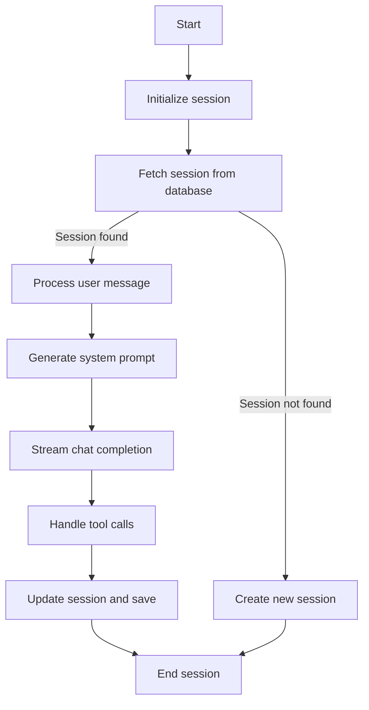

## 类结构

```
ChatService (主类)
├── ChatSession (会话类)
│   ├── messages (消息列表)
│   ├── user_id (用户ID)
│   ├── title (会话标题)
│   └── usage (使用情况)
├── ChatMessage (消息类)
│   ├── role (角色)
│   ├── content (内容)
│   └── tool_call_id (工具调用ID)
├── Usage (使用情况类)
│   ├── prompt_tokens (提示令牌)
│   ├── completion_tokens (完成令牌)
│   └── total_tokens (总令牌)
└── StreamBaseResponse (流基础响应类)
```

## 全局变量及字段


### `config`
    
Configuration object for the chat service.

类型：`ChatConfig`
    


### `settings`
    
Settings object containing application configurations.

类型：`Settings`
    


### `client`
    
OpenAI client for making API calls.

类型：`openai.AsyncOpenAI`
    


### `langfuse`
    
Langfuse client for accessing Langfuse services.

类型：`langfuse.Client`
    


### `RUNNING_OPERATION_PREFIX`
    
Prefix for Redis keys used to track running operations.

类型：`str`
    


### `DEFAULT_SYSTEM_PROMPT`
    
Default system prompt used when Langfuse is not configured.

类型：`str`
    


### `_background_tasks`
    
Set to hold strong references to background tasks to prevent garbage collection before completion.

类型：`set[asyncio.Task]`
    


### `ChatService.messages`
    
List of messages in the chat session.

类型：`list[ChatMessage]`
    


### `ChatService.user_id`
    
User ID associated with the chat session.

类型：`str`
    


### `ChatService.title`
    
Title of the chat session.

类型：`str`
    


### `ChatService.usage`
    
Usage statistics for the chat session.

类型：`list[Usage]`
    


### `ChatSession.messages`
    
List of messages in the chat session.

类型：`list[ChatMessage]`
    


### `ChatSession.user_id`
    
User ID associated with the chat session.

类型：`str`
    


### `ChatSession.title`
    
Title of the chat session.

类型：`str`
    


### `ChatSession.usage`
    
Usage statistics for the chat session.

类型：`list[Usage]`
    


### `ChatMessage.role`
    
Role of the message (e.g., 'user', 'assistant').

类型：`str`
    


### `ChatMessage.content`
    
Content of the message.

类型：`str`
    


### `ChatMessage.tool_call_id`
    
ID of the tool call associated with the message, if any.

类型：`str`
    


### `Usage.prompt_tokens`
    
Number of prompt tokens used.

类型：`int`
    


### `Usage.completion_tokens`
    
Number of completion tokens generated.

类型：`int`
    


### `Usage.total_tokens`
    
Total number of tokens used (prompt + completion).

类型：`int`
    
    

## 全局函数及方法

### `get_chat_session`

#### 描述

`get_chat_session` 函数用于获取指定会话的详细信息。如果会话不存在，则返回 `None`。

#### 参数

- `session_id`: `str`，会话的唯一标识符。
- `user_id`: `str`，可选，用户ID，用于获取特定用户的会话。

#### 返回值

- `ChatSession` 或 `None`，如果找到会话，则返回 `ChatSession` 对象；如果未找到，则返回 `None`。

#### 流程图

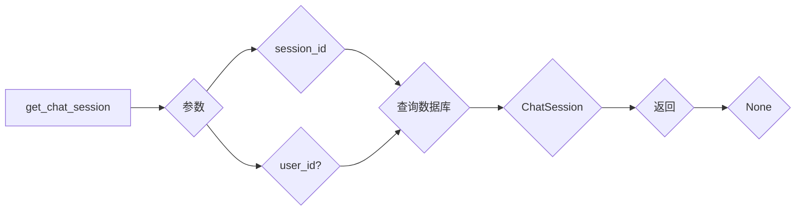

#### 带注释源码

```python
async def get_chat_session(session_id: str, user_id: str | None = None) -> ChatSession | None:
    """
    Get the chat session with the given session ID.

    Args:
        session_id: The session ID to retrieve.
        user_id: Optional user ID to filter sessions by user.

    Returns:
        ChatSession object if found, otherwise None.
    """
    session = await chat_db.get_chat_session(session_id, user_id)
    return session
```

### upsert_chat_session

#### 描述

`upsert_chat_session` 方法用于更新或插入一个聊天会话。如果会话已存在，则更新其信息；如果不存在，则创建一个新的会话。

#### 参数

- `session`: `ChatSession`，要更新或插入的会话对象。

#### 返回值

- `ChatSession`，更新或插入后的会话对象。

#### 流程图

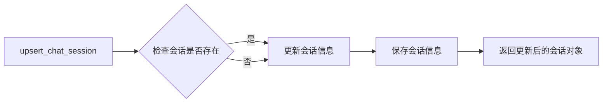

#### 带注释源码

```python
async def upsert_chat_session(session: ChatSession) -> ChatSession:
    """
    Update or insert a chat session.

    Args:
        session: ChatSession object to update or insert.

    Returns:
        ChatSession: The updated or inserted session object.
    """
    # Check if the session exists
    existing_session = await get_chat_session(session.session_id, session.user_id)
    if existing_session:
        # Update the existing session with new information
        existing_session.update(session)
    else:
        # Create a new session with the provided information
        session = await chat_db.create_chat_session(session)

    # Save the updated or inserted session to the database
    await chat_db.save_chat_session(session)

    # Return the updated or inserted session
    return session
```

### invalidate_session_cache

#### 描述

`invalidate_session_cache` 函数用于使缓存中的会话数据失效，确保下次加载时获取的是最新的数据。

#### 参数

- `session_id`：`str`，会话的唯一标识符。

#### 返回值

- 无返回值。

#### 流程图

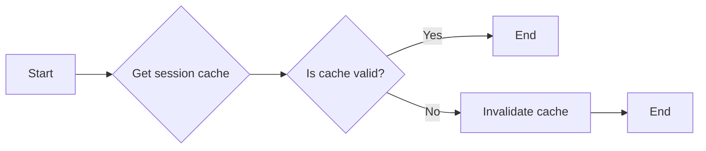

#### 带注释源码

```python
async def invalidate_session_cache(session_id: str) -> None:
    """Invalidate the session cache to ensure the next load gets fresh data."""
    # Invalidate the cache for the given session ID
    # This will force the next load to fetch data from the database
    # instead of using cached data
    # The actual cache invalidation logic depends on the caching mechanism used
    # For example, if using Redis, you might use the following code:
    # redis = await get_redis_async()
    # await redis.delete(f"chat_session:{session_id}")
    pass
```

### update_session_title

#### 描述

The `update_session_title` function updates the title of a chat session based on the first message received from the user.

#### 参数

- `session_id`: `str`，The ID of the chat session to update.
- `title`: `str`，The new title for the chat session.

#### 返回值

- `None`，The function does not return a value.

#### 流程图

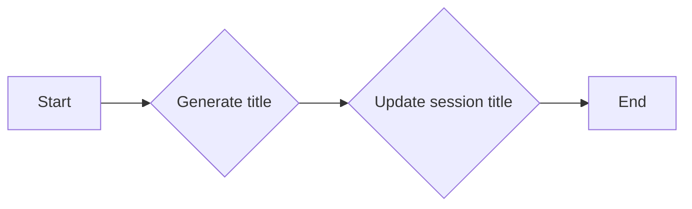

#### 带注释源码

```python
async def update_session_title(session_id: str, title: str) -> None:
    """
    Update the title of a chat session based on the first message received from the user.

    Args:
        session_id: str, The ID of the chat session to update.
        title: str, The new title for the chat session.

    Returns:
        None
    """
    # Generate a concise title for the chat session based on the first message
    title = await _generate_session_title(message=title)

    # Update the session title in the database
    await chat_db.update_session_title(session_id, title)
```

### `_mark_operation_started`

#### 描述

`_mark_operation_started` 函数用于标记一个长时间运行的操作为已开始。它通过在 Redis 中设置一个键值对来实现，如果键不存在，则设置键并返回 `True`，如果键已存在，则返回 `False`。

#### 参数

- `tool_call_id`：`str`，表示工具调用的唯一标识符。

#### 返回值

- `bool`：如果成功标记操作为开始，则返回 `True`；如果操作已开始，则返回 `False`。

#### 流程图

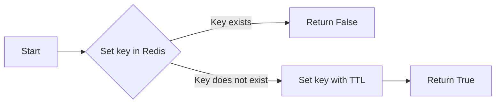

#### 带注释源码

```python
async def _mark_operation_started(tool_call_id: str) -> bool:
    """Mark a long-running operation as started (Redis-based).

    Returns True if successfully marked (operation was not already running),
    False if operation was already running (lost race condition).
    Raises exception if Redis is unavailable (fail-closed).
    """
    redis = await get_redis_async()
    key = f"{RUNNING_OPERATION_PREFIX}{tool_call_id}"
    # SETNX with TTL - atomic "set if not exists"
    result = await redis.set(key, "1", ex=config.long_running_operation_ttl, nx=True)
    return result is not None
```

### `_mark_operation_completed`

#### 描述

`_mark_operation_completed` 函数用于标记一个长时间运行的操作为已完成，通过删除 Redis 中的键来移除操作状态。

#### 参数

- `tool_call_id`：`str`，操作的唯一标识符。

#### 返回值

- 无

#### 流程图

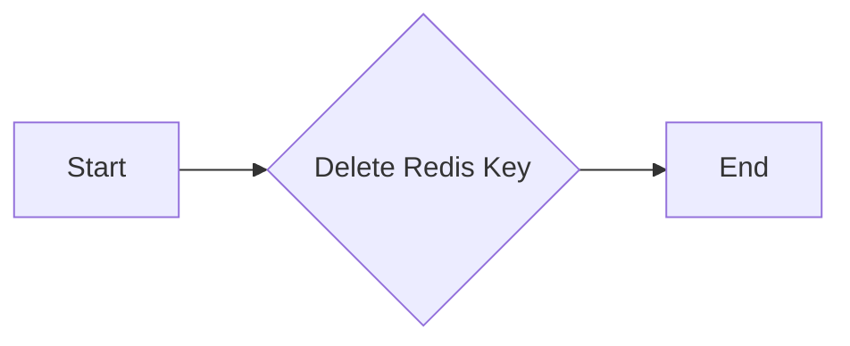

#### 带注释源码

```python
async def _mark_operation_completed(tool_call_id: str) -> None:
    """Mark a long-running operation as completed (remove Redis key).

    This is best-effort - if Redis fails, the TTL will eventually clean up.
    """
    try:
        redis = await get_redis_async()
        key = f"{RUNNING_OPERATION_PREFIX}{tool_call_id}"
        await redis.delete(key)
    except Exception as e:
        # Non-critical: TTL will clean up eventually
        logger.warning(f"Failed to delete running operation key {tool_call_id}: {e}")
```

### `_is_langfuse_configured`

#### 描述

该函数用于检查Langfuse的凭据是否已配置。

#### 参数

- 无

#### 返回值

- `bool`，如果Langfuse凭据已配置则返回`True`，否则返回`False`

#### 流程图

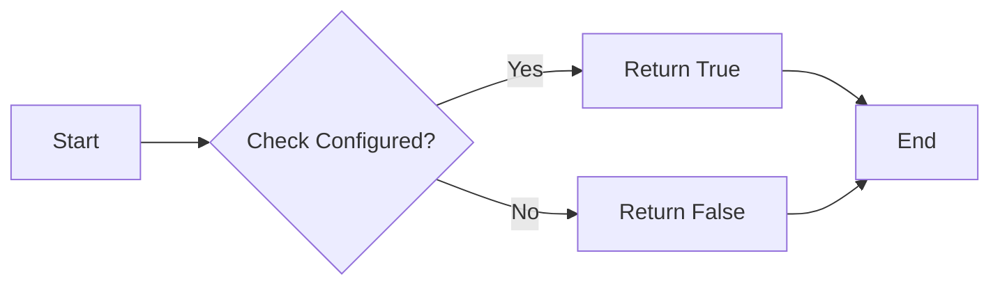

#### 带注释源码

```python
def _is_langfuse_configured() -> bool:
    """Check if Langfuse credentials are configured."""
    return bool(
        settings.secrets.langfuse_public_key and settings.secrets.langfuse_secret_key
    )
```

### `_get_system_prompt_template`

#### 描述

该函数用于获取系统提示模板，首先尝试从Langfuse获取，如果Langfuse未配置或获取失败，则使用默认系统提示。

#### 参数

- `context`：`str`，用户上下文信息，用于编译提示。

#### 返回值

- `str`：编译后的系统提示字符串。

#### 流程图

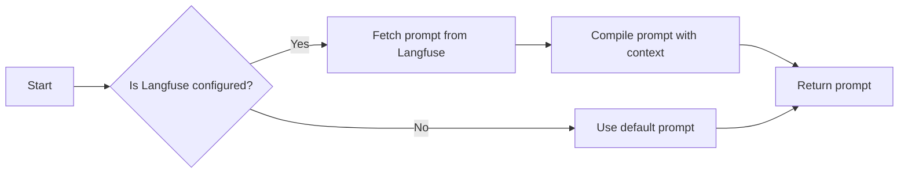

#### 带注释源码

```python
async def _get_system_prompt_template(context: str) -> str:
    """Get the system prompt, trying Langfuse first with fallback to default.

    Args:
        context: The user context/information to compile into the prompt.

    Returns:
        The compiled system prompt string.
    """
    if _is_langfuse_configured():
        try:
            # cache_ttl_seconds=0 disables SDK caching to always get the latest prompt
            # Use asyncio.to_thread to avoid blocking the event loop
            # In non-production environments, fetch the latest prompt version
            # instead of the production-labeled version for easier testing
            label = (
                None
                if settings.config.app_env == AppEnvironment.PRODUCTION
                else "latest"
            )
            prompt = await asyncio.to_thread(
                langfuse.get_prompt,
                config.langfuse_prompt_name,
                label=label,
                cache_ttl_seconds=0,
            )
            return prompt.compile(users_information=context)
        except Exception as e:
            logger.warning(f"Failed to fetch prompt from Langfuse, using default: {e}")

    # Fallback to default prompt
    return DEFAULT_SYSTEM_PROMPT.format(users_information=context)
```

### `_build_system_prompt`

#### 描述

该函数构建包含业务理解的完整系统提示，用于与用户进行对话。

#### 参数

- `user_id`: `str | None`，用户ID，用于获取业务理解。
- `context`: `str`，用户上下文信息，用于构建提示。

#### 返回值

- `tuple[str, Any]`，包含编译后的提示字符串和业务理解对象。

#### 流程图

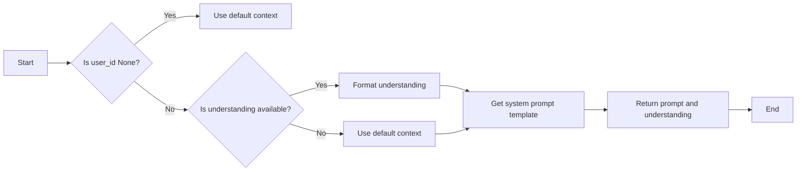

#### 带注释源码

```python
async def _build_system_prompt(user_id: str | None) -> tuple[str, Any]:
    """Build the full system prompt including business understanding if available.

    Args:
        user_id: The user ID for fetching business understanding
                     If "default" and this is the user's first session, will use "onboarding" instead.

    Returns:
        Tuple of (compiled prompt string, business understanding object)
    """
    # If user is authenticated, try to fetch their business understanding
    understanding = None
    if user_id:
        try:
            understanding = await get_business_understanding(user_id)
        except Exception as e:
            logger.warning(f"Failed to fetch business understanding: {e}")
            understanding = None

    if understanding:
        context = format_understanding_for_prompt(understanding)
    else:
        context = "This is the first time you are meeting the user. Greet them and introduce them to the platform"

    compiled = await _get_system_prompt_template(context)
    return compiled, understanding
```

### `_generate_session_title`

#### 描述

该函数根据用户的第一条消息生成一个简洁的会话标题。

#### 参数

- `message`：`str`，用户的第一条消息内容。
- `user_id`：`str | None`，用户ID，用于OpenRouter跟踪（可选）。
- `session_id`：`str | None`，会话ID，用于OpenRouter跟踪（可选）。

#### 返回值

- `str | None`，会话的简短标题（3-6个单词），或`None`如果生成失败。

#### 流程图

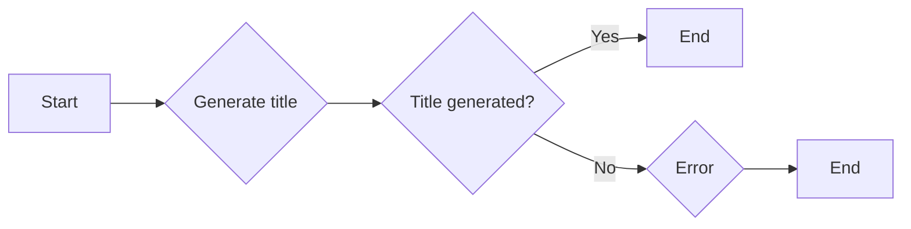

#### 带注释源码

```python
async def _generate_session_title(
    message: str,
    user_id: str | None = None,
    session_id: str | None = None,
) -> str | None:
    """Generate a concise title for a chat session based on the first message.

    Args:
        message: The first user message in the session
        user_id: User ID for OpenRouter tracing (optional)
        session_id: Session ID for OpenRouter tracing (optional)

    Returns:
        A short title (3-6 words) or None if generation fails
    """
    try:
        # Build extra_body for OpenRouter tracing and PostHog analytics
        extra_body: dict[str, Any] = {}
        if user_id:
            extra_body["user"] = user_id[:128]  # OpenRouter limit
            extra_body["posthogDistinctId"] = user_id
        if session_id:
            extra_body["session_id"] = session_id[:128]  # OpenRouter limit
        extra_body["posthogProperties"] = {
            "environment": settings.config.app_env.value,
        }

        response = await client.chat.completions.create(
            model=config.title_model,
            messages=[
                {
                    "role": "system",
                    "content": (
                        "Generate a very short title (3-6 words) for a chat conversation "
                        "based on the user's first message. The title should capture the "
                        "main topic or intent. Return ONLY the title, no quotes or punctuation."
                    ),
                },
                {"role": "user", "content": message[:500]},  # Limit input length
            ],
            max_tokens=20,
            extra_body=extra_body,
        )
        title = response.choices[0].message.content
        if title:
            # Clean up the title
            title = title.strip().strip("\"'")
            # Limit length
            if len(title) > 50:
                title = title[:47] + "..."
            return title
        return None
    except Exception as e:
        logger.warning(f"Failed to generate session title: {e}")
        return None
```

### `stream_chat_completion`

#### 描述

`stream_chat_completion` 是一个异步函数，它是聊天服务的主要入口点，用于处理聊天会话并生成聊天完成。该函数负责处理数据库操作，并将聊天完成的流式传输委托给内部函数 `_stream_chat_chunks`。

#### 参数

- `session_id`: `str`，聊天会话的 ID。
- `message`: `str` 或 `None`，用户输入的消息。
- `user_id`: `str` 或 `None`，用户 ID 用于身份验证（对于匿名用户为 `None`）。
- `session`: `ChatSession` 或 `None`，可选的预加载会话对象（用于递归调用以避免 Redis 重新获取）。
- `retry_count`: `int`，重试次数。
- `context`: `dict[str, str]` 或 `None`，包含 URL 和内容的字典。
- `_continuation_message_id`: `str` 或 `None`，内部：用于工具调用续集的消息 ID。
- `_task_id`: `str` 或 `None`，内部：任务 ID 用于 SSE 重新连接支持。

#### 返回值

- `AsyncGenerator[StreamBaseResponse, None]`，格式化为 SSE 的 `StreamBaseResponse` 对象。

#### 流程图

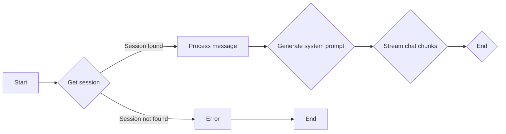

#### 带注释源码

```python
async def stream_chat_completion(
    session_id: str,
    message: str | None = None,
    user_id: str | None = None,
    session: ChatSession | None = None,
    retry_count: int = 0,
    session: ChatSession | None = None,
    context: dict[str, str] | None = None,
    _continuation_message_id: str | None = None,
    _task_id: str | None = None,
) -> AsyncGenerator[StreamBaseResponse, None]:
    # ... (省略中间代码)
    try:
        async for chunk in _stream_chat_chunks(
            session=session,
            tools=tools,
            system_prompt=system_prompt,
            text_block_id=text_block_id,
        ):
            # ... (省略中间代码)
            yield chunk
    except CancelledError:
        # ... (省略中间代码)
    except Exception as e:
        # ... (省略中间代码)
    # ... (省略中间代码)
```

#### 关键组件信息

- `ChatSession`: 聊天会话对象，包含会话历史和用户信息。
- `_stream_chat_chunks`: 内部函数，负责处理聊天完成的流式传输。
- `StreamBaseResponse`: SSE 格式的响应对象。

#### 潜在的技术债务或优化空间

- 代码中存在大量的日志记录，可能需要根据实际需要进行优化。
- 代码中使用了大量的异步操作，可能需要进一步优化以减少等待时间。
- 代码中使用了大量的全局变量和函数，可能需要进一步优化以减少耦合和增加可维护性。

### `_manage_context_window`

#### 描述

该函数管理上下文窗口，使用统一的 `compress_context` 函数。这是一个薄包装器，用于创建用于摘要的 OpenAI 客户端，并将共享的压缩逻辑委托给 `prompt.py` 中的逻辑。

#### 参数

- `messages`：`list`，包含消息的列表，格式为 OpenAI 格式。
- `model`：`str`，用于计数和摘要的模型名称。
- `api_key`：`str | None`，用于摘要调用的 API 密钥。
- `base_url`：`str | None`，用于摘要调用的基础 URL。

#### 返回值

- `CompressResult`：包含压缩消息和元数据的 `CompressResult` 对象。

#### 流程图

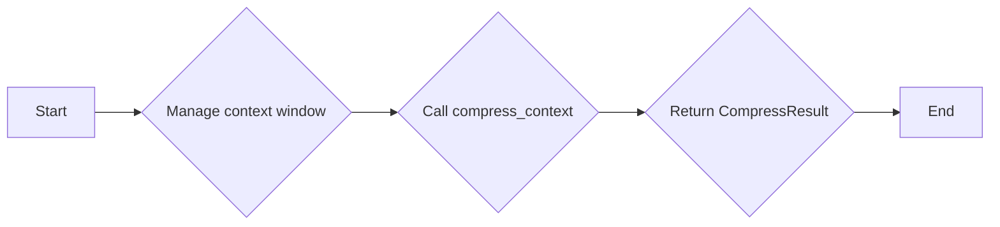

#### 带注释源码

```python
async def _manage_context_window(
    messages: list,
    model: str,
    api_key: str | None = None,
    base_url: str | None = None,
) -> "CompressResult":
    """
    Manage context window using the unified compress_context function.

    This is a thin wrapper that creates an OpenAI client for summarization
    and delegates to the shared compression logic in prompt.py.

    Args:
        messages: List of messages in OpenAI format
        model: Model name for token counting and summarization
        api_key: API key for summarization calls
        base_url: Base URL for summarization calls

    Returns:
        CompressResult with compacted messages and metadata
    """
    import openai

    from backend.util.prompt import compress_context

    # Convert messages to dict format
    messages_dict = []
    for msg in messages:
        if isinstance(msg, dict):
            msg_dict = {k: v for k, v in msg.items() if v is not None}
        else:
            msg_dict = dict(msg)
        messages_dict.append(msg_dict)

    # Only create client if api_key is provided (enables summarization)
    # Use context manager to avoid socket leaks
    if api_key:
        async with openai.AsyncOpenAI(
            api_key=api_key, base_url=base_url, timeout=30.0
        ) as client:
            return await compress_context(
                messages=messages_dict,
                model=model,
                client=client,
            )
    else:
        # No API key - use truncation-only mode
        return await compress_context(
            messages=messages_dict,
            model=model,
            client=None,
        )
```

### `stream_chat_completion`

#### 描述

`stream_chat_completion` 是一个异步函数，它是聊天服务的主要入口点，用于流式传输聊天完成。该函数处理所有数据库操作，并将流式传输委托给内部 `_stream_chat_chunks` 函数。

#### 参数

- `session_id`: `str`，聊天会话 ID。
- `message`: `str` 或 `None`，用户输入的消息。
- `tool_call_response`: `str` 或 `None`，工具调用响应。
- `is_user_message`: `bool`，指示是否为用户消息。
- `user_id`: `str` 或 `None`，用户 ID 用于身份验证（对于匿名用户为 `None`）。
- `retry_count`: `int`，重试计数。
- `session`: `ChatSession` 或 `None`，可选的预加载会话对象（用于递归调用以避免 Redis 重新获取）。
- `context`: `dict[str, str]` 或 `None`，外部依赖和接口契约。
- `_continuation_message_id`: `str` 或 `None`，内部：用于工具调用续集的消息 ID。
- `_task_id`: `str` 或 `None`，内部：任务 ID 用于 SSE 重新连接支持。

#### 返回值

- `AsyncGenerator[StreamBaseResponse, None]`，格式化后的 SSE 响应对象。

#### 流程图

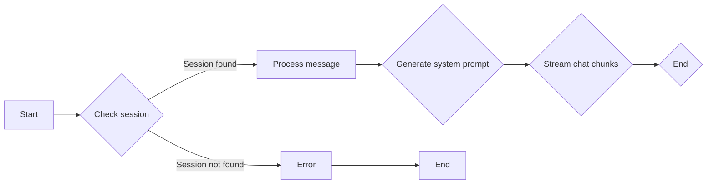

#### 带注释源码

```python
async def stream_chat_completion(
    session_id: str,
    message: str | None = None,
    tool_call_response: str | None = None,
    is_user_message: bool = True,
    user_id: str | None = None,
    retry_count: int = 0,
    session: ChatSession | None = None,
    context: dict[str, str] | None = None,
    _continuation_message_id: str | None = None,
    _task_id: str | None = None,
) -> AsyncGenerator[StreamBaseResponse, None]:
    # ... (省略中间代码)
    try:
        async for chunk in _stream_chat_chunks(
            session=session,
            tools=tools,
            system_prompt=system_prompt,
            text_block_id=text_block_id,
        ):
            # ... (省略中间代码)
            yield chunk
    except CancelledError:
        # ... (省略中间代码)
        raise
    except Exception as e:
        # ... (省略中间代码)
        raise
    # ... (省略中间代码)
```

#### 关键组件信息

- `session`: 聊天会话对象，包含会话历史和用户信息。
- `_stream_chat_chunks`: 内部函数，用于处理聊天完成和工具调用。
- `ChatSession`: 聊天会话类，用于存储会话历史和用户信息。

#### 潜在的技术债务或优化空间

- 代码中存在大量的日志记录，可能需要根据实际需要进行优化。
- 代码中使用了大量的异步操作，可能需要进一步优化以减少等待时间。
- 代码中使用了大量的全局变量和函数，可能需要进一步优化以减少耦合和增强可维护性。

### `_execute_long_running_tool`

#### 描述

该函数负责执行一个长时间运行的工具，并在操作完成后更新聊天历史记录。

#### 参数

- `tool_name`: `str`，工具名称。
- `parameters`: `dict[str, Any]`，传递给工具的参数。
- `tool_call_id`: `str`，工具调用的唯一标识符。
- `operation_id`: `str`，操作的唯一标识符。
- `session_id`: `str`，聊天会话的唯一标识符。
- `user_id`: `str | None`，用户ID，如果为None则为匿名用户。

#### 返回值

无返回值。

#### 流程图

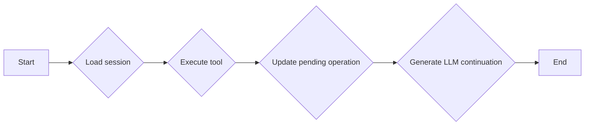

#### 带注释源码

```python
async def _execute_long_running_tool(
    tool_name: str,
    parameters: dict[str, Any],
    tool_call_id: str,
    operation_id: str,
    session_id: str,
    user_id: str | None,
) -> None:
    """Execute a long-running tool in background and update chat history with result.

    This function runs independently of the SSE connection, so the operation
    survives if the user closes their browser tab.

    NOTE: This is the legacy function without stream registry support.
    Use _execute_long_running_tool_with_streaming for new implementations.
    """
    try:
        # Load fresh session (not stale reference)
        session = await get_chat_session(session_id, user_id)
        if not session:
            logger.error(f"Session {session_id} not found for background tool")
            return

        # Execute the actual tool
        result = await execute_tool(
            tool_name=tool_name,
            parameters=parameters,
            tool_call_id=tool_call_id,
            user_id=user_id,
            session=session,
        )

        # Update the pending message with result
        await _update_pending_operation(
            session_id=session_id,
            tool_call_id=tool_call_id,
            result=(
                result.output
                if isinstance(result.output, str)
                else orjson.dumps(result.output).decode("utf-8")
            ),
        )

        logger.info(f"Background tool {tool_name} completed for session {session_id}")

        # Generate LLM continuation so user sees response when they poll/refresh
        await _generate_llm_continuation(session_id=session_id, user_id=user_id)

    except Exception as e:
        logger.error(f"Background tool {tool_name} failed: {e}", exc_info=True)
        error_response = ErrorResponse(
            message=f"Tool {tool_name} failed: {str(e)}",
        )
        await _update_pending_operation(
            session_id=session_id,
            tool_call_id=tool_call_id,
            result=error_response.model_dump_json(),
        )
        # Generate LLM continuation so user sees explanation even for errors
        try:
            await _generate_llm_continuation(session_id=session_id, user_id=user_id)
        except Exception as llm_err:
            logger.warning(f"Failed to generate LLM continuation for error: {llm_err}")
    finally:
        await _mark_operation_completed(tool_call_id)
```

### `_execute_long_running_tool_with_streaming`

#### 描述

该函数负责执行长时间运行的工具，并使用流注册表支持SSE重新连接。它允许在用户关闭浏览器标签后继续操作，并允许客户端通过GET /chat/tasks/{task_id}/stream重新连接以继续流。

#### 参数

- `tool_name`：`str`，工具名称。
- `parameters`：`dict[str, Any]`，传递给工具的参数。
- `tool_call_id`：`str`，工具调用的唯一标识符。
- `operation_id`：`str`，操作的唯一标识符。
- `task_id`：`str`，任务ID，用于SSE重新连接。
- `session_id`：`str`，会话ID。
- `user_id`：`str | None`，用户ID。

#### 返回值

无返回值。

#### 流程图

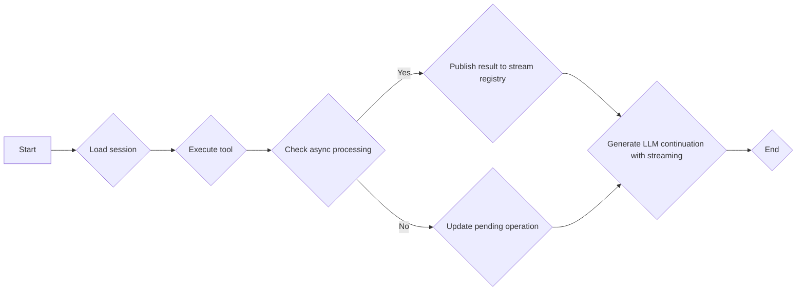

#### 带注释源码

```python
async def _execute_long_running_tool_with_streaming(
    tool_name: str,
    parameters: dict[str, Any],
    tool_call_id: str,
    operation_id: str,
    task_id: str,
    session_id: str,
    user_id: str | None,
) -> None:
    """Execute a long-running tool with stream registry support for SSE reconnection.

    This function runs independently of the SSE connection, publishes progress
    to the stream registry, and survives if the user closes their browser tab.
    Clients can reconnect via GET /chat/tasks/{task_id}/stream to resume streaming.

    If the external service returns a 202 Accepted (async), this function exits
    early and lets the Redis Streams completion consumer handle the rest.
    """
    # Track whether we delegated to async processing - if so, the Redis Streams
    # completion consumer (stream_registry / completion_consumer) will handle cleanup, not us
    delegated_to_async = False

    try:
        # Load fresh session (not stale reference)
        session = await get_chat_session(session_id, user_id)
        if not session:
            logger.error(f"Session {session_id} not found for background tool")
            await stream_registry.mark_task_completed(task_id, status="failed")
            return

        # Pass operation_id and task_id to the tool for async processing
        enriched_parameters = {
            **parameters,
            "_operation_id": operation_id,
            "_task_id": task_id,
        }

        # Execute the actual tool
        result = await execute_tool(
            tool_name=tool_name,
            parameters=enriched_parameters,
            tool_call_id=tool_call_id,
            user_id=user_id,
            session=session,
        )

        # Check if the tool result indicates async processing
        # (e.g., Agent Generator returned 202 Accepted)
        try:
            if isinstance(result.output, dict):
                result_data = result.output
            elif result.output:
                result_data = orjson.loads(result.output)
            else:
                result_data = {}
            if result_data.get("status") == "accepted":
                logger.info(
                    f"Tool {tool_name} delegated to async processing "
                    f"(operation_id={operation_id}, task_id={task_id}). "
                    f"Redis Streams completion consumer will handle the rest."
                )
                # Don't publish result, don't continue with LLM, and don't cleanup
                # The Redis Streams consumer (completion_consumer) will handle
                # everything when the external service completes via webhook
                delegated_to_async = True
                return
        except (orjson.JSONDecodeError, TypeError):
            pass  # Not JSON or not async - continue normally

        # Publish tool result to stream registry
        await stream_registry.publish_chunk(task_id, result)

        # Update the pending message with result
        result_str = (
            result.output
            if isinstance(result.output, str)
            else orjson.dumps(result.output).decode("utf-8")
        )
        await _update_pending_operation(
            session_id=session_id,
            tool_call_id=tool_call_id,
            result=result_str,
        )

        logger.info(
            f"Background tool {tool_name} completed for session {session_id} "
            f"(task_id={task_id})"
        )

        # Generate LLM continuation and stream chunks to registry
        await _generate_llm_continuation_with_streaming(
            session_id=session_id,
            user_id=user_id,
            task_id=task_id,
        )

        # Mark task as completed in stream registry
        await stream_registry.mark_task_completed(task_id

### `_update_pending_operation`

#### 描述

该函数用于更新数据库中待处理操作的最终结果。当长时间运行的工具完成时，该函数会被调用以更新数据库中的消息内容。

#### 参数

- `session_id`：`str`，会话ID，用于标识特定的会话。
- `tool_call_id`：`str`，工具调用ID，用于标识特定的工具调用。
- `result`：`str`，操作结果，通常是工具的输出或错误信息。

#### 返回值

- `None`，该函数不返回任何值。

#### 流程图

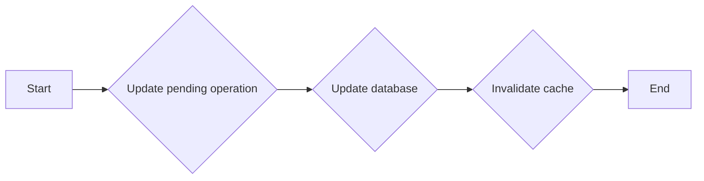

#### 带注释源码

```python
async def _update_pending_operation(
    session_id: str,
    tool_call_id: str,
    result: str,
) -> None:
    """Update the pending tool message with final result.

    This is called by background tasks when long-running operations complete.
    """
    # Update the message in database
    updated = await chat_db.update_tool_message_content(
        session_id=session_id,
        tool_call_id=tool_call_id,
        new_content=result,
    )

    if updated:
        # Invalidate Redis cache so next load gets fresh data
        # Wrap in try/except to prevent cache failures from triggering error handling
        # that would overwrite our successful DB update
        try:
            await invalidate_session_cache(session_id)
        except Exception as e:
            # Non-critical: cache will eventually be refreshed on next load
            logger.warning(f"Failed to invalidate cache for session {session_id}: {e}")
        logger.info(
            f"Updated pending operation for tool_call_id {tool_call_id} "
            f"in session {session_id}"
        )
    else:
        logger.warning(
            f"Failed to update pending operation for tool_call_id {tool_call_id} "
            f"in session {session_id}"
        )
```

### `_generate_llm_continuation`

#### 描述

该函数在长运行工具完成后生成一个LLM响应。它负责在数据库中保存响应，以便用户在刷新或轮询时看到。

#### 参数

- `session_id`：`str`，会话ID。
- `user_id`：`str`，用户ID，可选。

#### 返回值

无返回值。

#### 流程图

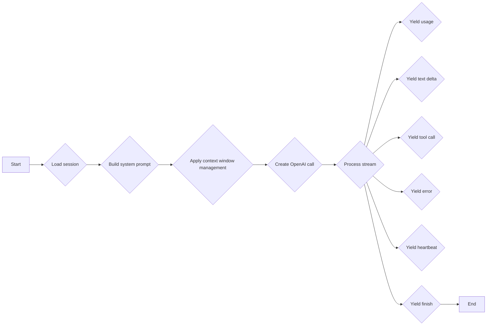

#### 带注释源码

```python
async def _generate_llm_continuation(session_id: str, user_id: str | None) -> None:
    """Generate an LLM response after a long-running tool completes.

    This is called by background tasks to continue the conversation
    after a tool result is saved. The response is saved to the database
    so users see it when they refresh or poll.
    """
    try:
        # Load fresh session from DB (bypass cache to get the updated tool result)
        await invalidate_session_cache(session_id)
        session = await get_chat_session(session_id, user_id)
        if not session:
            logger.error(f"Session {session_id} not found for LLM continuation")
            return

        # Build system prompt
        system_prompt, _ = await _build_system_prompt(user_id)

        messages = session.to_openai_messages()
        if system_prompt:
            system_message = ChatCompletionSystemMessageParam(
                role="system",
                content=system_prompt,
            )
            messages = [system_message] + messages

        # Apply context window management to prevent oversized requests
        context_result = await _manage_context_window(
            messages=messages,
            model=config.model,
            api_key=config.api_key,
            base_url=config.base_url,
        )

        if context_result.error and "System prompt dropped" not in context_result.error:
            logger.error(
                f"Context window management failed for session {session_id}: "
                f"{context_result.error} (tokens={context_result.token_count})"
            )
            return

        messages = context_result.messages
        if context_result.was_compacted:
            logger.info(
                f"Context compacted for LLM continuation: "
                f"{context_result.token_count} tokens"
            )

        # Build extra_body for tracing
        extra_body: dict[str, Any] = {
            "posthogProperties": {
                "environment": settings.config.app_env.value,
            },
        }
        if user_id:
            extra_body["user"] = user_id[:128]
            extra_body["posthogDistinctId"] = user_id
        if session_id:
            extra_body["session_id"] = session_id[:128]

        # Enable adaptive thinking for Anthropic models via OpenRouter
        if config.thinking_enabled and "anthropic" in config.model.lower():
            extra_body["reasoning"] = {"enabled": True}

        retry_count = 0
        last_error: Exception | None = None
        response = None

        while retry_count <= MAX_RETRIES:
            try:
                logger.info(
                    f"Generating LLM continuation for session {session_id}"
                    f"{f' (retry {retry_count}/{MAX_RETRIES})' if retry_count > 0 else ''}"
                )

                response = await client.chat.completions.create(
                    model=config.model,
                    messages=cast(list[ChatCompletionMessageParam], messages),
                    extra_body=extra_body,
                )
                last_error = None  # Clear any previous error on success
                break  # Success, exit retry loop
            except Exception as e:
                last_error = e
                if _is_retryable_error(e) and retry_count < MAX_RETRIES:
                    retry_count += 1
                    delay = min(
                        BASE_DELAY_SECONDS * (2 ** (retry_count - 1)),
                        MAX_DELAY_SECONDS,
                    )
                    logger.warning(
                        f"Retryable error in LLM continuation: {e!s}. "
                        f"Retrying in {delay:.1f}s (attempt {retry_count}/{MAX_RETRIES})"
                    )
                    await asyncio.sleep(delay)
                    continue
                else:
                    # Non-retryable error - log and exit gracefully
                    logger.error(
                        f"Non-retryable error in LLM continuation: {e!s}",
                        exc_info=True,
                    )
                    return

        if last_error:
            logger.error(
                f"Max retries ({MAX_RETRIES}) exceeded for L

### `_generate_llm_continuation_with_streaming`

#### 描述

该函数用于在长运行工具完成后生成一个LLM（语言模型）响应，并将结果通过流注册（stream registry）发送给客户端，以便客户端可以重新连接并接收结果。

#### 参数

- `session_id`: `str`，会话ID，用于标识特定的会话。
- `user_id`: `str`，用户ID，用于用户认证。
- `task_id`: `str`，任务ID，用于SSE（服务器端事件）重新连接支持。

#### 返回值

无返回值。

#### 流程图

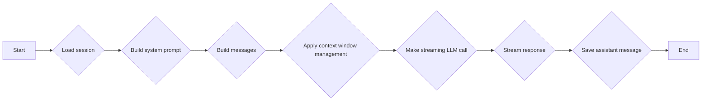

#### 带注释源码

```python
async def _generate_llm_continuation_with_streaming(
    session_id: str,
    user_id: str | None,
    task_id: str,
) -> None:
    try:
        # Load fresh session from DB (bypass cache to get the updated tool result)
        await invalidate_session_cache(session_id)
        session = await get_chat_session(session_id, user_id)
        if not session:
            logger.error(f"Session {session_id} not found for LLM continuation")
            return

        # Build system prompt
        system_prompt, _ = await _build_system_prompt(user_id)

        # Build messages in OpenAI format
        messages = session.to_openai_messages()
        if system_prompt:
            from openai.types.chat import ChatCompletionSystemMessageParam

            system_message = ChatCompletionSystemMessageParam(
                role="system",
                content=system_prompt,
            )
            messages = [system_message] + messages

        # Build extra_body for tracing
        extra_body: dict[str, Any] = {
            "posthogProperties": {
                "environment": settings.config.app_env.value,
            },
        }
        if user_id:
            extra_body["user"] = user_id[:128]
            extra_body["posthogDistinctId"] = user_id
        if session_id:
            extra_body["session_id"] = session_id[:128]

        # Enable adaptive thinking for Anthropic models via OpenRouter
        if config.thinking_enabled and "anthropic" in config.model.lower():
            extra_body["reasoning"] = {"enabled": True}

        # Make streaming LLM call (no tools - just text response)
        from typing import cast

        from openai.types.chat import ChatCompletionMessageParam

        # Generate unique IDs for AI SDK protocol
        message_id = str(uuid.uuid4())
        text_block_id = str(uuid.uuid4())

        # Publish start event
        await stream_registry.publish_chunk(task_id, StreamStart(messageId=message_id))
        await stream_registry.publish_chunk(task_id, StreamStartStep())
        await stream_registry.publish_chunk(task_id, StreamTextStart(id=text_block_id))

        # Stream the response
        stream = await client.chat.completions.create(
            model=config.model,
            messages=cast(list[ChatCompletionMessageParam], messages),
            extra_body=extra_body,
            stream=True,
        )

        assistant_content = ""
        async for chunk in stream:
            if chunk.choices and chunk.choices[0].delta.content:
                delta = chunk.choices[0].delta.content
                assistant_content += delta
                # Publish delta to stream registry
                await stream_registry.publish_chunk(
                    task_id,
                    StreamTextDelta(id=text_block_id, delta=delta),
                )

        # Publish end events
        await stream_registry.publish_chunk(task_id, StreamTextEnd(id=text_block_id))
        await stream_registry.publish_chunk(task_id, StreamFinishStep())

        if assistant_content:
            # Reload session from DB to avoid race condition with user messages
            fresh_session = await get_chat_session(session_id, user_id)
            if not fresh_session:
                logger.error(
                    f"Session {session_id} disappeared during LLM continuation"
                )
                return

            # Save assistant message to database
            assistant_message = ChatMessage(
                role="assistant",
                content=assistant_content,
            )
            fresh_session.messages.append(assistant_message)

            # Save to database (not cache) to persist the response
            await upsert_chat_session(fresh_session)

            # Invalidate cache so next poll/refresh gets fresh data
            await invalidate_session_cache(session_id)

            logger.info(
                f"Generated streaming LLM continuation for session {session_id} "
                f"(task_id={task_id}), response length: {len(assistant_content)}"
            )
        else:
            logger.warning(
                f"Streaming LLM continuation returned empty response for {session_id}"
            )

    except Exception as

### `stream_chat_completion`

#### 描述

`stream_chat_completion` 是一个异步生成器函数，它是聊天服务的主要入口点，用于处理聊天会话并流式传输聊天完成结果。该函数负责处理数据库操作，并将流式传输逻辑委托给 `_stream_chat_chunks` 函数。

#### 参数

- `session_id`: `str`，聊天会话的 ID。
- `message`: `str` 或 `None`，用户输入的消息。
- `tool_call_response`: `str` 或 `None`，工具调用的响应。
- `is_user_message`: `bool`，指示消息是否为用户消息。
- `user_id`: `str` 或 `None`，用户 ID 用于身份验证。
- `retry_count`: `int`，重试次数。
- `session`: `ChatSession` 或 `None`，可选的预加载会话对象。
- `context`: `dict[str, str]` 或 `None`，外部依赖和接口契约的上下文。
- `_continuation_message_id`: `str` 或 `None`，内部：用于工具调用续集的消息 ID。
- `_task_id`: `str` 或 `None`，内部：任务 ID 用于 SSE 重新连接支持。

#### 返回值

- `AsyncGenerator[StreamBaseResponse, None]`，格式化的 SSE 响应对象。

#### 流程图


#### 带注释源码

```python
async def stream_chat_completion(
    session_id: str,
    message: str | None = None,
    tool_call_response: str | None = None,
    is_user_message: bool = True,
    user_id: str | None = None,
    retry_count: int = 0,
    session: ChatSession | None = None,
    context: dict[str, str] | None = None,
    _continuation_message_id: str | None = None,
    _task_id: str | None = None,
) -> AsyncGenerator[StreamBaseResponse, None]:
    # ... (省略中间代码)
    try:
        async for chunk in _stream_chat_chunks(
            session=session,
            tools=tools,
            system_prompt=system_prompt,
            text_block_id=text_block_id,
        ):
            # ... (省略中间代码)
            yield chunk
    except CancelledError:
        # ... (省略中间代码)
    except Exception as e:
        # ... (省略中间代码)
    # ... (省略中间代码)
```

#### 关键组件信息

- `session`: 聊天会话对象，包含会话历史和用户信息。
- `_stream_chat_chunks`: 异步生成器函数，负责处理聊天完成逻辑和工具调用。
- `ChatCompletionChunk`: OpenAI 聊天完成响应的 chunk 对象。
- `ChatCompletionMessageParam`: OpenAI 聊天完成消息参数对象。

#### 潜在的技术债务或优化空间

- 代码中存在大量的日志记录，可能需要根据实际需要进行优化。
- `_stream_chat_chunks` 函数中使用了大量的异常处理，可能需要进一步优化以减少冗余代码。
- 代码中使用了大量的全局变量和模块级别的集合，可能需要进一步优化以减少全局状态的使用。

#### 设计目标与约束

- 设计目标：实现一个高效的聊天服务，能够处理大量的聊天会话并保持良好的用户体验。
- 约束：代码需要遵循 Python 3.8+ 的语法和标准库，并使用异步编程模型。

#### 错误处理与异常设计

- 代码中使用了大量的异常处理来处理可能出现的错误情况，例如网络错误、API 错误和数据库错误。
- 异常处理逻辑确保了代码的健壮性和稳定性。

#### 数据流与状态机

- 数据流：用户输入的消息通过 `_stream_chat_chunks` 函数处理，并生成聊天完成响应。
- 状态机：代码中使用了多个状态变量来跟踪聊天会话的状态，例如 `has_received_text`、`has_saved_assistant_message` 和 `has_yielded_end`。

#### 外部依赖与接口契约

- 代码依赖于 OpenAI API、Redis 和其他内部服务。
- 接口契约定义了与外部服务交互的规范，例如 OpenAI API 和 Redis。

### `assign_user_to_session`

#### 描述

`assign_user_to_session` 方法用于将用户分配到聊天会话中。它将用户ID设置到会话对象中，并更新数据库中的会话记录。

#### 参数

- `session_id`：`str`，会话的唯一标识符。
- `user_id`：`str`，用户的唯一标识符。

#### 返回值

- `ChatSession`：更新后的会话对象。

#### 流程图

```mermaid
graph LR
    A[Start] --> B{Get session}
    B -->|Session not found| C[Error: Session not found]
    B -->|Session found| D[Update session user_id]
    D --> E[Save session]
    E --> F[Return updated session]
    F --> G[End]
```

#### 带注释源码

```python
async def assign_user_to_session(
    session_id: str,
    user_id: str,
) -> ChatSession:
    """
    Assign a user to a chat session.
    """
    session = await get_chat_session(session_id, None)
    if not session:
        raise NotFoundError(f"Session {session_id} not found")
    session.user_id = user_id
    return await upsert_chat_session(session)
```

### `stream_chat_completion`

#### 描述

`stream_chat_completion` 方法是聊天完成的主要入口点，用于流式传输聊天完成。它处理所有数据库操作并将流式传输委托给内部 `_stream_chat_chunks` 函数。

#### 参数

- `session_id`：`str`，聊天会话的唯一标识符。
- `message`：`str`，用户输入的消息（可选）。
- `tool_call_response`：`str`，工具调用响应（可选）。
- `is_user_message`：`bool`，指示消息是否为用户消息。
- `user_id`：`str`，用户ID（可选）。
- `retry_count`：`int`，重试计数（可选）。
- `session`：`ChatSession`，可选的预加载会话对象（用于递归调用以避免Redis重新获取）。
- `context`：`dict[str, str]`，上下文信息（可选）。
- `_continuation_message_id`：`str`，内部：用于工具调用续集的消息ID（可选）。
- `_task_id`：`str`，内部：任务ID，用于SSE重新连接支持（可选）。

#### 返回值

- `AsyncGenerator[StreamBaseResponse, None]`：格式化为SSE的 `StreamBaseResponse` 对象。

#### 流程图

```mermaid
graph LR
    A[Start] --> B{Get session}
    B -->|Session not found| C[Error: Session not found]
    B -->|Session found| D{Process message}
    D -->|No message| E{Generate system prompt}
    D -->|Message present| F{Append message to session}
    E --> G{Stream chat chunks}
    G -->|Chunk processed| H{Yield chunk}
    H -->|End| I[End]
```

#### 带注释源码

```python
async def stream_chat_completion(
    session_id: str,
    message: str | None = None,
    tool_call_response: str | None = None,
    is_user_message: bool = True,
    user_id: str | None = None,
    retry_count: int = 0,
    session: ChatSession | None = None,
    context: dict[str, str] | None = None,
    _continuation_message_id: str | None = None,
    _task_id: str | None = None,
) -> AsyncGenerator[StreamBaseResponse, None]:
    # ... (代码省略，流程图中已展示)
```

### `_stream_chat_chunks`

#### 描述

`_stream_chat_chunks` 方法是 `stream_chat_completion` 的内部函数，用于处理聊天完成流。它负责与 OpenAI API 交互，处理工具调用，并生成适当的 SSE 响应。

#### 参数

- `session`：`ChatSession`，聊天会话对象。
- `tools`：`list[ChatCompletionToolParam]`，可用的工具。
- `system_prompt`：`str`，系统提示（可选）。
- `text_block_id`：`str`，文本块ID（可选）。

#### 返回值

- `AsyncGenerator[StreamBaseResponse, None]`：格式化为SSE的 `StreamBaseResponse` 对象。

#### 流程图

```mermaid
graph LR
    A[Start] --> B{Create OpenAI stream}
    B -->|Stream created| C{Process chunks}
    C -->|Chunk processed| D{Yield chunk}

### `{函数名}`

`update_session_title` 函数用于更新聊天会话的标题。

### 参数

- `session_id`：`str`，会话的唯一标识符。
- `title`：`str`，新的会话标题。

### 返回值

- `None`：函数执行成功，没有返回值。

#### 流程图

```mermaid
graph LR
A[Start] --> B{Get session}
B --> C{Check if title exists}
C -- Yes --> D[End]
C -- No --> E{Update title}
E --> F[End]
```

#### 带注释源码

```python
async def update_session_title(session_id: str, title: str) -> None:
    """
    Update the title of a chat session.

    Args:
        session_id: The unique identifier for the chat session.
        title: The new title for the chat session.

    Returns:
        None
    """
    # Get the chat session from the database
    session = await get_chat_session(session_id, None)
    if not session:
        raise NotFoundError(f"Session {session_id} not found")

    # Check if the title already exists
    if session.title == title:
        return

    # Update the title of the chat session
    session.title = title
    await upsert_chat_session(session)
```

### ChatService.upsert_chat_session

#### 描述

`upsert_chat_session` 方法用于更新或插入一个聊天会话。如果会话已存在，则更新其信息；如果不存在，则创建一个新的会话。

#### 参数

- `session`: `ChatSession`，表示要更新或插入的会话对象。

#### 返回值

- `ChatSession`：更新或插入后的会话对象。

#### 流程图

```mermaid
graph LR
A[upsert_chat_session] --> B{检查会话是否存在}
B -- 是 --> C[更新会话信息]
B -- 否 --> C
C --> D[返回更新后的会话]
```

#### 带注释源码

```python
async def upsert_chat_session(session: ChatSession) -> ChatSession:
    """
    Update or insert a chat session.

    If the session exists, update its information; if it does not exist, create a new session.

    Args:
        session: ChatSession object to update or insert.

    Returns:
        ChatSession: The updated or inserted session object.
    """
    # Check if the session exists
    existing_session = await get_chat_session(session.session_id, session.user_id)
    if existing_session:
        # Update the existing session
        existing_session.update(session)
        session = existing_session
    else:
        # Insert a new session
        session = await chat_db.insert_chat_session(session)

    # Return the updated or inserted session
    return session
```

### ChatService.invalidate_session_cache

#### 描述

该函数用于使缓存中的会话信息失效，以便下次加载时能够获取最新的数据。

#### 参数

- `session_id`: `str`，会话的唯一标识符。

#### 返回值

- 无返回值。

#### 流程图

```mermaid
graph LR
A[Start] --> B{Check cache}
B -->|Cache exists| C[Invalidate cache]
B -->|Cache does not exist| D[End]
C --> D
```

#### 带注释源码

```python
async def invalidate_session_cache(session_id: str) -> None:
    """
    Invalidate the cache for the given session ID.

    Args:
        session_id: The session ID to invalidate the cache for.
    """
    try:
        # Invalidate the cache for the session
        await chat_db.invalidate_session_cache(session_id)
        logger.info(f"Cache invalidated for session {session_id}")
    except Exception as e:
        # Log the exception if cache invalidation fails
        logger.error(f"Failed to invalidate cache for session {session_id}: {e}")
```

### ChatSession.to_openai_messages

#### 描述

`to_openai_messages` 方法是 `ChatSession` 类的一个方法，它将聊天会话中的消息转换为 OpenAI API 所需的格式。

#### 参数

- 无

#### 返回值

- `list[ChatCompletionMessageParam]`：一个包含转换后消息的列表，这些消息符合 OpenAI API 的 `ChatCompletionMessageParam` 格式。

#### 流程图

```mermaid
graph LR
A[ChatSession] --> B{to_openai_messages()}
B --> C{转换消息}
C --> D{返回转换后的消息列表}
```

#### 带注释源码

```python
def to_openai_messages(self) -> list[ChatCompletionMessageParam]:
    """
    Convert the chat session messages to the format expected by the OpenAI API.

    Returns:
        List[ChatCompletionMessageParam]: A list of messages in the format required by the OpenAI API.
    """
    messages = []
    for message in self.messages:
        messages.append(
            ChatCompletionMessageParam(
                role=message.role,
                content=message.content,
            )
        )
    return messages
```

#### 关键组件信息

- `ChatSession`：表示聊天会话的类。
- `ChatCompletionMessageParam`：OpenAI API 用于表示消息的参数类型。

## 关键组件


### 张量索引与惰性加载

张量索引与惰性加载是代码中用于高效处理大量数据的关键组件。它通过延迟加载和索引技术，优化了数据访问速度，减少了内存消耗。

### 反量化支持

反量化支持是代码中用于处理量化数据的关键组件。它能够将量化数据转换回原始数据，以便进行进一步处理和分析。

### 量化策略

量化策略是代码中用于优化模型性能的关键组件。它通过调整模型参数的精度，减少计算量，提高模型运行效率。


## 问题及建议


### 已知问题

-   **代码复杂度**：代码中存在大量的异步操作和复杂的逻辑，这可能导致代码难以理解和维护。
-   **错误处理**：错误处理机制可能不够健壮，特别是在异步操作中，可能需要更详细的错误处理逻辑。
-   **代码重复**：在代码中存在一些重复的逻辑，这可能导致维护成本增加。
-   **资源管理**：异步任务的管理可能不够高效，特别是在处理大量并发任务时。
-   **日志记录**：日志记录可能不够详细，难以追踪问题发生的原因。

### 优化建议

-   **重构代码**：对代码进行重构，简化异步操作和逻辑，提高代码的可读性和可维护性。
-   **增强错误处理**：在异步操作中增加更详细的错误处理逻辑，确保程序的健壮性。
-   **减少代码重复**：识别并消除代码中的重复逻辑，减少维护成本。
-   **优化资源管理**：改进异步任务的管理，提高资源利用率。
-   **改进日志记录**：增加更详细的日志记录，便于问题追踪和调试。
-   **性能优化**：对性能瓶颈进行优化，提高程序运行效率。
-   **代码测试**：增加单元测试和集成测试，确保代码质量。
-   **文档化**：对代码进行文档化，提高代码的可理解性。
-   **模块化**：将代码分解为更小的模块，提高代码的可复用性。
-   **使用设计模式**：在适当的地方使用设计模式，提高代码的灵活性和可扩展性。


## 其它


### 设计目标与约束

- 设计目标：
  - 实现一个高效的聊天服务，能够处理用户输入并生成相应的回复。
  - 支持工具调用，允许用户执行预定义的操作。
  - 提供错误处理和异常设计，确保系统的稳定性和可靠性。
  - 支持数据流和状态机，以处理聊天会话的动态变化。
  - 遵循最佳实践，确保代码的可维护性和可扩展性。

- 约束：
  - 限制最大上下文消息数量，以避免过大的请求。
  - 限制工具调用数量，以防止资源耗尽。
  - 限制用户消息长度，以避免过大的请求。
  - 限制工具调用响应长度，以避免过大的响应。

### 错误处理与异常设计

- 错误处理：
  - 对于可重试的错误，如API限制错误，系统将重试请求。
  - 对于不可重试的错误，如API连接错误，系统将记录错误并返回错误信息。
  - 对于工具调用错误，系统将记录错误并返回错误信息。

- 异常设计：
  - 使用try-except块来捕获和处理异常。
  - 使用日志记录异常信息，以便进行调试和监控。

### 数据流与状态机

- 数据流：
  - 用户消息通过SSE（Server-Sent Events）流式传输到客户端。
  - 工具调用结果通过SSE流式传输到客户端。
  - 长运行工具的进度通过SSE流式传输到客户端。

- 状态机：
  - 聊天会话状态包括：空闲、正在处理用户消息、正在处理工具调用、完成。

### 外部依赖与接口契约

- 外部依赖：
  - OpenAI API：用于生成聊天回复和执行工具调用。
  - Redis：用于存储会话数据和跟踪长运行操作。
  - Langfuse：用于获取系统提示。

- 接口契约：
  - OpenAI API：定义了聊天回复和工具调用的格式。
  - Redis：定义了会话数据和长运行操作的存储格式。
  - Langfuse：定义了系统提示的格式。

    