# `.\AutoGPT\autogpt_platform\backend\backend\api\features\chat\service_test.py` 详细设计文档

The code provides functionality to test the chat completion feature, which streams responses from a chat session, handling errors, tool calls, and session management.

## 整体流程

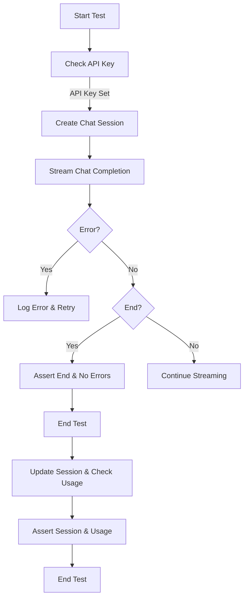

## 类结构

```
chat_service (模块)
├── test_stream_chat_completion (测试函数)
│   ├── setup_test_user (测试设置)
│   ├── test_user_id (测试用户ID)
│   ├── api_key (API密钥)
│   ├── session (会话)
│   ├── has_errors (错误标志)
│   ├── has_ended (结束标志)
│   ├── assistant_message (助手消息)
│   └── chunk (数据块)
├── test_stream_chat_completion_with_tool_calls (测试函数)
│   ├── setup_test_user (测试设置)
│   ├── test_user_id (测试用户ID)
│   ├── api_key (API密钥)
│   ├── session (会话)
│   ├── has_errors (错误标志)
│   ├── has_ended (结束标志)
│   ├── had_tool_calls (工具调用标志)
│   └── chunk (数据块)
└── logger (日志记录器)
```

## 全局变量及字段


### `api_key`
    
The API key for the OPEN_ROUTER service, used for authentication.

类型：`str | None`
    


### `has_errors`
    
Flag indicating if any errors occurred during the chat completion process.

类型：`bool`
    


### `has_ended`
    
Flag indicating if the chat completion process has ended.

类型：`bool`
    


### `assistant_message`
    
The message generated by the assistant during the chat completion process.

类型：`str`
    


### `chunk`
    
The chunk of data received from the chat completion stream.

类型：`Any`
    


### `session`
    
The chat session object representing the current chat session.

类型：`Any`
    


### `test_user_id`
    
The ID of the test user for the chat session.

类型：`Any`
    


### `setup_test_user`
    
The setup function for the test user.

类型：`Any`
    


### `logger.__name__`
    
The name of the logger instance used for logging messages.

类型：`str`
    


### `logging.getLogger.logger`
    
The logger instance used for logging messages throughout the code.

类型：`logging.Logger`
    


### `logging.getLogger.__name__`
    
The name of the logger instance, used to identify the logger in the logging configuration.

类型：`str`
    


### `logging.Logger.info`
    
Logs a message with the severity level of INFO.

类型：`Callable[[Any]], None`
    


### `logging.Logger.error`
    
Logs a message with the severity level of ERROR.

类型：`Callable[[Any]], None`
    


### `logging.Logger.warning`
    
Logs a message with the severity level of WARNING.

类型：`Callable[[Any]], None`
    


### `logging.Logger.debug`
    
Logs a message with the severity level of DEBUG.

类型：`Callable[[Any]], None`
    


### `logging.Logger.exception`
    
Logs a message with the severity level of EXCEPTION.

类型：`Callable[[Any]], None`
    
    

## 全局函数及方法


### test_stream_chat_completion

Test the `stream_chat_completion` function.

参数：

- `setup_test_user`：`None`，Setup test user function
- `test_user_id`：`int`，Unique identifier for the test user

返回值：`None`，No return value

#### 流程图

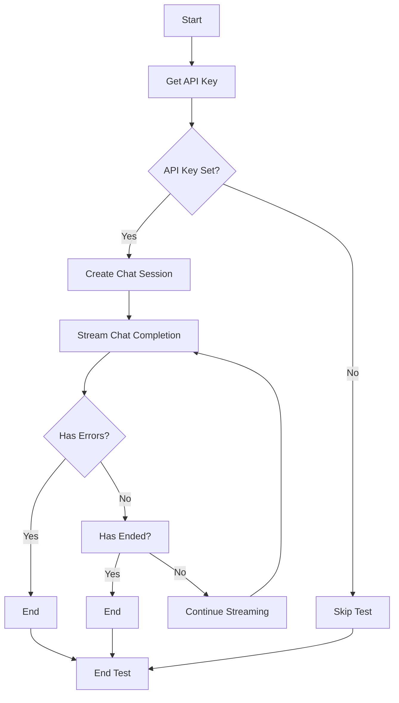

#### 带注释源码

```python
@pytest.mark.asyncio(loop_scope="session")
async def test_stream_chat_completion(setup_test_user, test_user_id):
    """
    Test the stream_chat_completion function.
    """
    api_key: str | None = getenv("OPEN_ROUTER_API_KEY")
    if not api_key:
        return pytest.skip("OPEN_ROUTER_API_KEY is not set, skipping test")

    session = await create_chat_session(test_user_id)

    has_errors = False
    has_ended = False
    assistant_message = ""
    async for chunk in chat_service.stream_chat_completion(
        session.session_id, "Hello, how are you?", user_id=session.user_id
    ):
        logger.info(chunk)
        if isinstance(chunk, StreamError):
            has_errors = True
        if isinstance(chunk, StreamTextDelta):
            assistant_message += chunk.delta
        if isinstance(chunk, StreamFinish):
            has_ended = True

    assert has_ended, "Chat completion did not end"
    assert not has_errors, "Error occurred while streaming chat completion"
    assert assistant_message, "Assistant message is empty"
```


### test_stream_chat_completion_with_tool_calls

Test the `stream_chat_completion` function with tool calls.

参数：

- `setup_test_user`：`None`，Setup test user function
- `test_user_id`：`int`，Unique identifier for the test user

返回值：`None`，No return value

#### 流程图

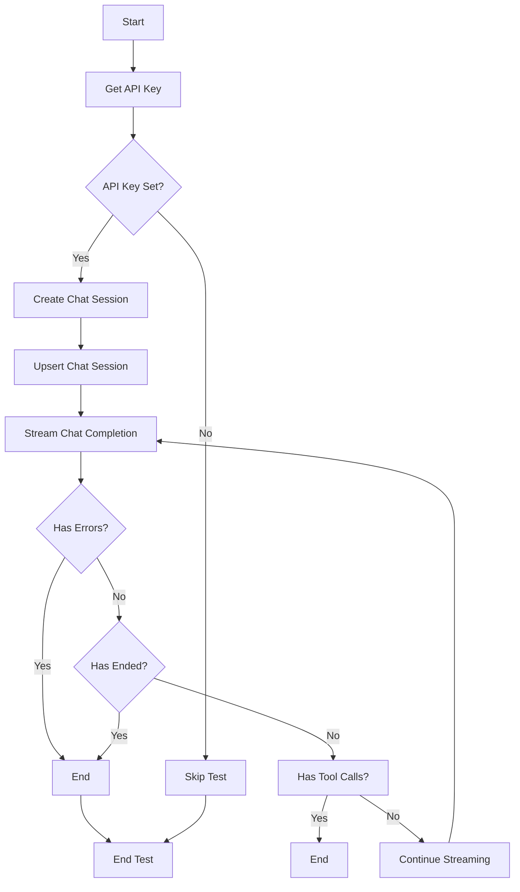

#### 带注释源码

```python
@pytest.mark.asyncio(loop_scope="session")
async def test_stream_chat_completion_with_tool_calls(setup_test_user, test_user_id):
    """
    Test the stream_chat_completion function with tool calls.
    """
    api_key: str | None = getenv("OPEN_ROUTER_API_KEY")
    if not api_key:
        return pytest.skip("OPEN_ROUTER_API_KEY is not set, skipping test")

    session = await create_chat_session(test_user_id)
    session = await upsert_chat_session(session)

    has_errors = False
    has_ended = False
    had_tool_calls = False
    async for chunk in chat_service.stream_chat_completion(
        session.session_id,
        "Please find me an agent that can help me with my business. Use the query 'moneny printing agent'",
        user_id=session.user_id,
    ):
        logger.info(chunk)
        if isinstance(chunk, StreamError):
            has_errors = True

        if isinstance(chunk, StreamFinish):
            has_ended = True
        if isinstance(chunk, StreamToolOutputAvailable):
            had_tool_calls = True

    assert has_ended, "Chat completion did not end"
    assert not has_errors, "Error occurred while streaming chat completion"
    assert had_tool_calls, "Tool calls did not occur"
    session = await get_chat_session(session.session_id)
    assert session, "Session not found"
    assert session.usage, "Usage is empty"
```


### test_stream_chat_completion_with_tool_calls

This function tests the `stream_chat_completion` function, specifically focusing on the occurrence of tool calls during the chat completion process.

参数：

- `setup_test_user`：`None`，A fixture that sets up a test user environment.
- `test_user_id`：`int`，The ID of the test user.

返回值：`None`，This function does not return any value.

#### 流程图

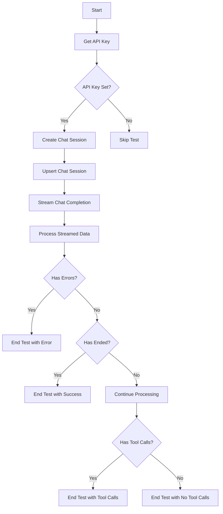

#### 带注释源码

```python
@pytest.mark.asyncio(loop_scope="session")
async def test_stream_chat_completion_with_tool_calls(setup_test_user, test_user_id):
    """
    Test the stream_chat_completion function.
    """
    api_key: str | None = getenv("OPEN_ROUTER_API_KEY")
    if not api_key:
        return pytest.skip("OPEN_ROUTER_API_KEY is not set, skipping test")

    session = await create_chat_session(test_user_id)
    session = await upsert_chat_session(session)

    has_errors = False
    has_ended = False
    had_tool_calls = False
    async for chunk in chat_service.stream_chat_completion(
        session.session_id,
        "Please find me an agent that can help me with my business. Use the query 'moneny printing agent'",
        user_id=session.user_id,
    ):
        logger.info(chunk)
        if isinstance(chunk, StreamError):
            has_errors = True

        if isinstance(chunk, StreamFinish):
            has_ended = True
        if isinstance(chunk, StreamToolOutputAvailable):
            had_tool_calls = True

    assert has_ended, "Chat completion did not end"
    assert not has_errors, "Error occurred while streaming chat completion"
    assert had_tool_calls, "Tool calls did not occur"
    session = await get_chat_session(session.session_id)
    assert session, "Session not found"
    assert session.usage, "Usage is empty"
```


### create_chat_session

创建一个新的聊天会话。

参数：

- `test_user_id`：`int`，测试用户的ID。

返回值：`ChatSession`，创建的聊天会话对象。

#### 流程图

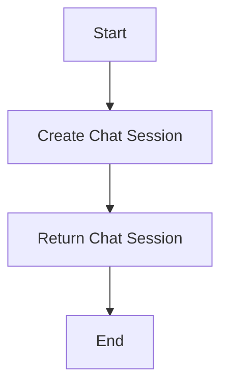

#### 带注释源码

```python
from .model import ChatSession

async def create_chat_session(test_user_id: int) -> ChatSession:
    # 创建新的聊天会话
    session = ChatSession(user_id=test_user_id)
    # 保存会话到数据库或存储系统
    await session.save()
    return session
```


### `get_chat_session`

获取指定会话ID的聊天会话信息。

参数：

- `session_id`：`str`，会话ID，用于标识特定的聊天会话。

返回值：`ChatSession`，聊天会话对象，包含会话的详细信息。

#### 流程图

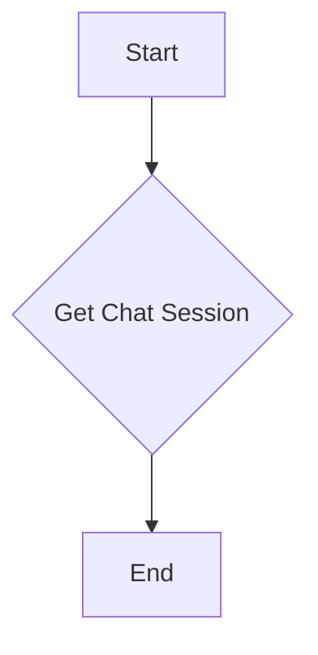

#### 带注释源码

```python
from .model import ChatSession

async def get_chat_session(session_id: str) -> ChatSession:
    # 从数据库或其他存储中获取会话信息
    session_info = await some_storage.get_chat_session(session_id)
    # 创建ChatSession对象
    session = ChatSession.from_dict(session_info)
    return session
```


### upsert_chat_session

This function updates an existing chat session or creates a new one if it does not exist.

参数：

- `session`: `ChatSession`，The chat session object to be updated or inserted.
- ...

返回值：`ChatSession`，The updated or newly created chat session object.

#### 流程图

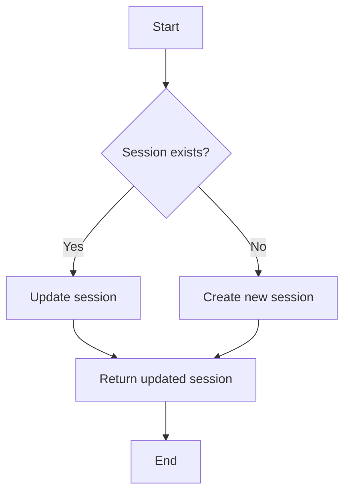

#### 带注释源码

```python
from .model import ChatSession

async def upsert_chat_session(session: ChatSession) -> ChatSession:
    # Check if the session already exists
    existing_session = await get_chat_session(session.session_id)
    if existing_session:
        # Update the existing session
        existing_session.user_id = session.user_id
        existing_session.session_id = session.session_id
        # Save the updated session
        await save_chat_session(existing_session)
        return existing_session
    else:
        # Create a new session
        new_session = create_chat_session(session.user_id, session.session_id)
        await save_chat_session(new_session)
        return new_session
```


### `chat_service.stream_chat_completion`

This function streams chat completion responses from an external service based on the provided session ID and user input.

参数：

- `session_id`：`str`，The unique identifier for the chat session.
- `input_text`：`str`，The text input provided by the user.
- `user_id`：`str`，The unique identifier for the user.

返回值：`async for`，A generator that yields `StreamTextDelta`, `StreamError`, `StreamFinish`, and `StreamToolOutputAvailable` objects.

#### 流程图

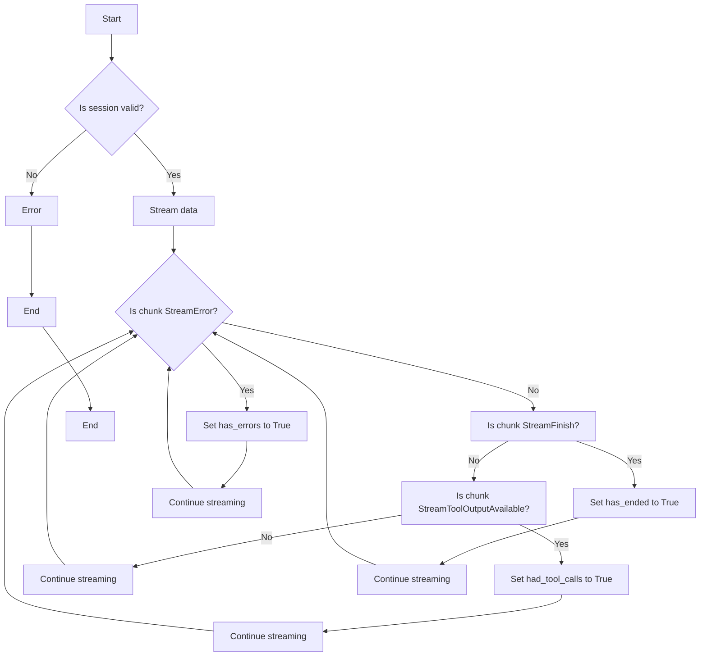

#### 带注释源码

```python
async def stream_chat_completion(session_id: str, input_text: str, user_id: str) -> None:
    # Implementation of the streaming chat completion logic
    # This is a placeholder for the actual implementation
    pass
```


### logger.info

This function logs information using the `logging` module. It is used to record the state of the program during execution, particularly when processing chunks of data from the chat completion stream.

参数：

- `chunk`：`StreamError | StreamFinish | StreamTextDelta | StreamToolOutputAvailable`，The chunk of data received from the chat completion stream. This could be an error, a message from the assistant, or a tool output.

返回值：`None`，This function does not return any value. It simply logs the information.

#### 流程图

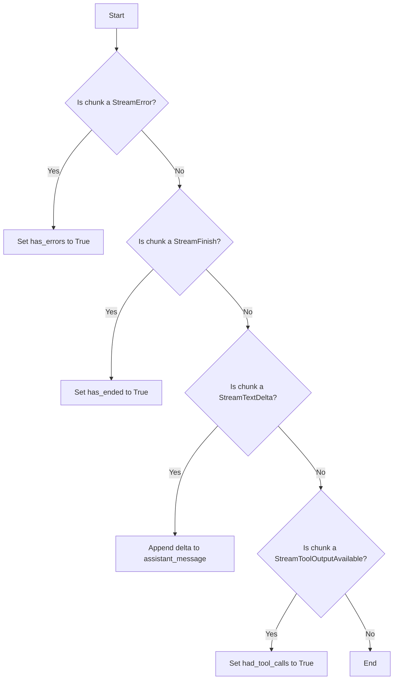

#### 带注释源码

```python
logger.info(chunk)
```


### logger.info

This function logs an informational message with the given arguments.

参数：

- `chunk`：`StreamError | StreamFinish | StreamTextDelta | StreamToolOutputAvailable`，The chunk of data received from the chat completion stream.

返回值：`None`，No return value is expected.

#### 流程图


#### 带注释源码

```python
logger.info(chunk)
```


### logger.info

This function logs a warning message to the console.

参数：

- `chunk`：`StreamError`, `StreamTextDelta`, `StreamToolOutputAvailable`，Represents the chunk of data received from the chat completion stream.

返回值：无

#### 流程图

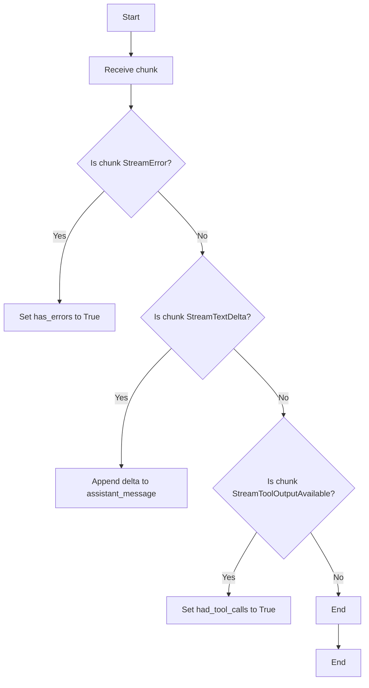

#### 带注释源码

```python
logger.info(chunk)
```


### logger.info

This function logs a message with the severity level of INFO. It is used to record informational messages that confirm the successful operation of the program.

参数：

- `chunk`：`StreamError`, `StreamFinish`, `StreamTextDelta`, `StreamToolOutputAvailable`，The chunk of data received from the chat service, which can be an error, a finish signal, text delta, or tool output availability.

返回值：无

#### 流程图


#### 带注释源码

```python
logger.info(chunk)
```


### logger.info

This function logs an info-level message to the logger.

参数：

- `chunk`：`StreamError | StreamTextDelta | StreamFinish | StreamToolOutputAvailable`，The chunk of data received from the chat completion stream.

返回值：`None`，No return value.

#### 流程图

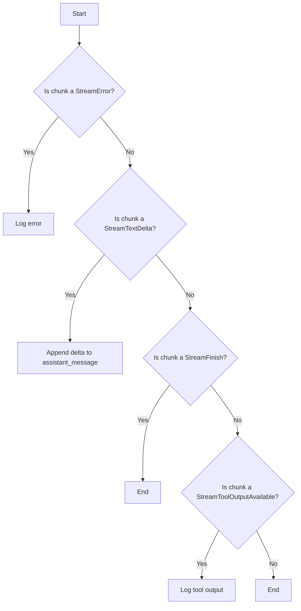

#### 带注释源码

```python
logger.info(chunk)
```


## 关键组件


### 张量索引与惰性加载

用于高效地处理和索引大型张量数据，通过延迟计算和按需加载来优化内存使用。

### 反量化支持

提供对反量化操作的支持，允许在量化过程中进行反向操作，以恢复原始数据。

### 量化策略

定义了量化策略，用于在模型训练和推理过程中对权重和激活进行量化，以减少模型大小和提高推理速度。


## 问题及建议


### 已知问题

-   **环境变量依赖**: 测试依赖于环境变量 `OPEN_ROUTER_API_KEY`，如果该环境变量未设置，测试将跳过。这可能导致测试环境与生产环境不一致。
-   **日志记录**: 日志记录仅记录了 `chunk` 的信息，没有记录测试的上下文或测试的执行状态，这可能会影响调试和问题追踪。
-   **异常处理**: 代码中没有显式的异常处理逻辑，如果 `stream_chat_completion` 函数抛出异常，测试可能会失败，但没有提供足够的错误信息。
-   **测试覆盖率**: 代码中只提供了两个测试用例，可能没有覆盖所有可能的场景和边界条件。

### 优化建议

-   **环境变量检查**: 在测试开始前检查所有必要的环境变量是否已设置，并在测试失败时提供清晰的错误信息。
-   **增强日志记录**: 增加日志记录以提供更多的上下文信息，例如测试的执行状态、测试的预期结果和实际结果。
-   **异常处理**: 在 `stream_chat_completion` 函数调用周围添加异常处理逻辑，确保在发生异常时能够捕获并记录错误信息。
-   **增加测试用例**: 增加更多的测试用例以覆盖不同的场景和边界条件，确保代码的健壮性。
-   **代码复用**: 如果 `stream_chat_completion` 函数在多个地方使用，考虑将其封装为一个类或模块，以提高代码的可维护性和可复用性。
-   **性能优化**: 如果 `stream_chat_completion` 函数需要处理大量数据，考虑使用异步编程模式来提高性能。


## 其它


### 设计目标与约束

- 设计目标：
  - 确保聊天服务能够高效、可靠地处理用户请求。
  - 提供一个易于扩展和维护的架构。
  - 确保所有功能符合安全性和隐私标准。

- 约束：
  - 必须使用异步编程模型以支持非阻塞操作。
  - 依赖外部API，如Open Router API，需要处理API限制和错误。
  - 确保测试覆盖所有关键路径。

### 错误处理与异常设计

- 错误处理：
  - 使用`StreamError`类来处理聊天过程中可能出现的错误。
  - 在测试中验证错误处理逻辑是否按预期工作。

- 异常设计：
  - 异常应被捕获并记录，同时确保用户界面不会因未处理的异常而崩溃。
  - 异常信息应包含足够的信息以便于调试。

### 数据流与状态机

- 数据流：
  - 用户请求通过API发送到聊天服务。
  - 聊天服务处理请求并生成响应，通过流式传输返回给用户。

- 状态机：
  - 聊天会话可能处于不同的状态，如创建中、活跃、结束等。
  - 状态机确保会话在正确的状态下执行相应的操作。

### 外部依赖与接口契约

- 外部依赖：
  - Open Router API：用于处理聊天请求和响应。
  - 测试框架（如pytest）：用于编写和执行测试。

- 接口契约：
  - API接口应定义清晰的输入和输出规范。
  - 接口应支持异步调用以优化性能。

### 安全性与隐私

- 安全性：
  - 确保所有数据传输都通过安全的通道进行。
  - 对敏感数据进行加密存储和传输。

- 隐私：
  - 遵守相关隐私法规，如GDPR。
  - 确保用户数据不被未经授权的第三方访问。

### 性能与可伸缩性

- 性能：
  - 确保聊天服务能够处理高并发请求。
  - 监控性能指标，如响应时间和资源利用率。

- 可伸缩性：
  - 设计应支持水平扩展以适应增长的用户需求。
  - 使用负载均衡器以优化资源分配。

### 日志记录与监控

- 日志记录：
  - 记录关键操作和错误信息以支持问题追踪和性能分析。

- 监控：
  - 实施监控系统以实时跟踪服务状态和性能指标。

### 用户界面与体验

- 用户界面：
  - 确保用户界面直观易用。

- 用户体验：
  - 提供快速响应和流畅的交互体验。

### 文档与支持

- 文档：
  - 提供详细的设计文档和用户手册。

- 支持：
  - 提供用户支持和技术支持。


    