# `.\AutoGPT\autogpt_platform\backend\backend\api\features\chat\stream_registry.py` 详细设计文档

This module provides a registry for managing reconnectable SSE streams using Redis for state management, enabling horizontal scalability and stateless pods.

## 整体流程

```mermaid
graph TD
    A[Start] --> B[Create Task]
    B --> C[Store Metadata in Redis]
    C --> D[Set TTL on Metadata]
    D --> E[Create Operation Mapping]
    E --> F[Return Task]
    F --> G[End]
    G --> H[Subscribe to Task]
    H --> I[Replay Missed Messages]
    I --> J[Start Stream Listener]
    J --> K[Listen for Live Updates]
    K --> L[End]
    L --> M[End]
    M --> N[Mark Task Completed]
    N --> O[Update Task Status]
    O --> P[Publish Finish Event]
    P --> Q[End]
    Q --> R[Find Task by Operation ID]
    R --> S[Get Task ID from Operation Mapping]
    S --> T[Get Task from Redis]
    T --> U[Return Task or None]
    U --> V[End]
    V --> W[Get Task]
    W --> X[Get Task Metadata from Redis]
    X --> Y[Return Task or None]
    Y --> Z[End]
    Z --> AA[Get Task with Expiry Info]
    AA --> BB[Check Metadata and Stream]
    BB --> CC[Return Task, Error Code or None]
    CC --> DD[End]
    DD --> EE[Get Active Task for Session]
    EE --> FF[Scan Redis for Task Metadata]
    FF --> GG[Check Task Metadata]
    GG --> HH[Get Last Message ID from Stream]
    HH --> II[Return Task and Last Message ID or None]
    II --> JJ[End]
    JJ --> KK[Reconstruct Chunk]
    KK --> LL[Map Response Type to Class]
    LL --> MM[Create Response Object]
    MM --> NN[Return Response Object or None]
    NN --> OO[End]
    OO --> PP[Set Asyncio Task]
    PP --> QQ[Store Task Reference]
    QQ --> RR[End]
    RR --> SS[Unsubscribe from Task]
    SS --> TT[Find Listener Task]
    TT --> UU[Cancel Listener Task]
    UU --> VV[End]
```

## 类结构

```
ActiveTask (数据类)
├── _local_tasks (字典)
│   ├── task_id (字符串)
│   ├── session_id (字符串)
│   ├── user_id (字符串或 None)
│   ├── tool_call_id (字符串)
│   ├── tool_name (字符串)
│   ├── operation_id (字符串)
│   ├── status (字符串)
│   └── created_at (datetime)
│       └── asyncio_task (asyncio.Task 或 None)
└── _listener_tasks (字典)
```

## 全局变量及字段


### `_local_tasks`
    
Track background tasks for this pod (just the asyncio.Task reference, not subscribers)

类型：`dict[str, asyncio.Task]`
    


### `_listener_tasks`
    
Track listener tasks per subscriber queue for cleanup

类型：`dict[int, tuple[str, asyncio.Task]]`
    


### `QUEUE_PUT_TIMEOUT`
    
Timeout for putting chunks into subscriber queues (seconds)

类型：`float`
    


### `COMPLETE_TASK_SCRIPT`
    
Lua script for atomic compare-and-swap status update (idempotent completion)

类型：`str`
    


### `ActiveTask.task_id`
    
Unique identifier for the task

类型：`str`
    


### `ActiveTask.session_id`
    
Chat session ID

类型：`str`
    


### `ActiveTask.user_id`
    
User ID (may be None for anonymous)

类型：`str | None`
    


### `ActiveTask.tool_call_id`
    
Tool call ID from the LLM

类型：`str`
    


### `ActiveTask.tool_name`
    
Name of the tool being executed

类型：`str`
    


### `ActiveTask.operation_id`
    
Operation ID for webhook callbacks

类型：`str`
    


### `ActiveTask.status`
    
Current status of the task

类型：`Literal['running', 'completed', 'failed']`
    


### `ActiveTask.created_at`
    
Timestamp when the task was created

类型：`datetime`
    


### `ActiveTask.asyncio_task`
    
Reference to the asyncio task associated with the task

类型：`asyncio.Task | None`
    
    

## 全局函数及方法


### `_get_task_meta_key`

Get Redis key for task metadata.

参数：

- `task_id`：`str`，Unique identifier for the task

返回值：`str`，Redis key for task metadata

#### 流程图

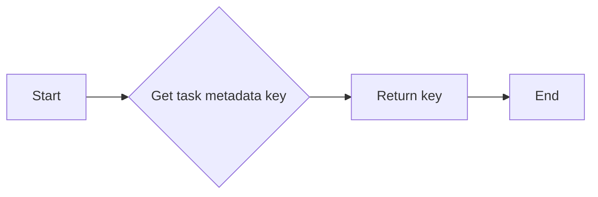

#### 带注释源码

```python
def _get_task_meta_key(task_id: str) -> str:
    """Get Redis key for task metadata."""
    return f"{config.task_meta_prefix}{task_id}"
```


### `_get_task_stream_key(task_id: str) -> str`

获取任务消息流的Redis键。

参数：

- `task_id`：`str`，任务的唯一标识符。

返回值：`str`，任务消息流的Redis键。

#### 流程图

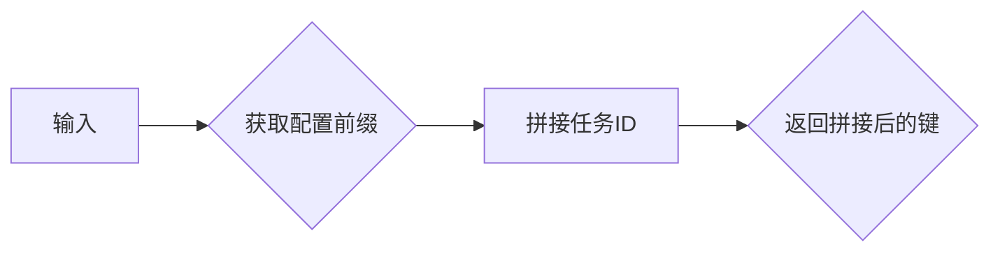

#### 带注释源码

```python
def _get_task_stream_key(task_id: str) -> str:
    """Get Redis key for task message stream."""
    return f"{config.task_stream_prefix}{task_id}"
```


### `_get_operation_mapping_key`

Get Redis key for operation_id to task_id mapping.

参数：

- `operation_id`：`str`，Operation ID for webhook callbacks

返回值：`str`，Redis key for operation_id to task_id mapping

#### 流程图

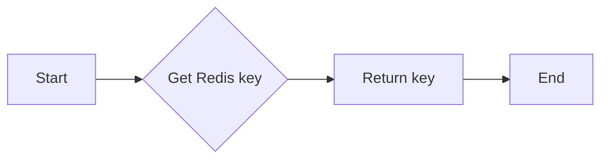

#### 带注释源码

```python
def _get_operation_mapping_key(operation_id: str) -> str:
    """Get Redis key for operation_id to task_id mapping."""
    return f"{config.task_op_prefix}{operation_id}"
```


### create_task

Create a new streaming task in Redis.

参数：

- `task_id`：`str`，Unique identifier for the task
- `session_id`：`str`，Chat session ID
- `user_id`：`str | None`，User ID (may be None for anonymous)
- `tool_call_id`：`str`，Tool call ID from the LLM
- `tool_name`：`str`，Name of the tool being executed
- `operation_id`：`str`，Operation ID for webhook callbacks

返回值：`ActiveTask`，The created ActiveTask instance (metadata only)

#### 流程图

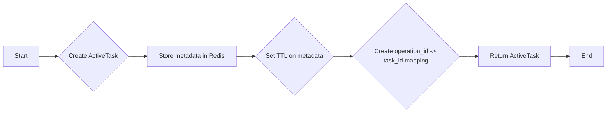

#### 带注释源码

```python
async def create_task(
    task_id: str,
    session_id: str,
    user_id: str | None,
    tool_call_id: str,
    tool_name: str,
    operation_id: str,
) -> ActiveTask:
    """Create a new streaming task in Redis.

    Args:
        task_id: Unique identifier for the task
        session_id: Chat session ID
        user_id: User ID (may be None for anonymous)
        tool_call_id: Tool call ID from the LLM
        tool_name: Name of the tool being executed
        operation_id: Operation ID for webhook callbacks

    Returns:
        The created ActiveTask instance (metadata only)
    """
    import time

    start_time = time.perf_counter()

    # Build log metadata for structured logging
    log_meta = {
        "component": "StreamRegistry",
        "task_id": task_id,
        "session_id": session_id,
    }
    if user_id:
        log_meta["user_id"] = user_id

    logger.info(
        f"[TIMING] create_task STARTED, task={task_id}, session={session_id}, user={user_id}",
        extra={"json_fields": log_meta},
    )

    task = ActiveTask(
        task_id=task_id,
        session_id=session_id,
        user_id=user_id,
        tool_call_id=tool_call_id,
        tool_name=tool_name,
        operation_id=operation_id,
    )

    # Store metadata in Redis
    redis_start = time.perf_counter()
    redis = await get_redis_async()
    redis_time = (time.perf_counter() - redis_start) * 1000
    logger.info(
        f"[TIMING] get_redis_async took {redis_time:.1f}ms",
        extra={"json_fields": {**log_meta, "duration_ms": redis_time}},
    )

    meta_key = _get_task_meta_key(task_id)
    op_key = _get_operation_mapping_key(operation_id)

    hset_start = time.perf_counter()
    await redis.hset(  # type: ignore[misc]
        meta_key,
        mapping={
            "task_id": task_id,
            "session_id": session_id,
            "user_id": user_id or "",
            "tool_call_id": tool_call_id,
            "tool_name": tool_name,
            "operation_id": operation_id,
            "status": task.status,
            "created_at": task.created_at.isoformat(),
        },
    )
    hset_time = (time.perf_counter() - hset_start) * 1000
    logger.info(
        f"[TIMING] redis.hset took {hset_time:.1f}ms",
        extra={"json_fields": {**log_meta, "duration_ms": hset_time}},
    )

    await redis.expire(meta_key, config.stream_ttl)

    # Create operation_id -> task_id mapping for webhook lookups
    await redis.set(op_key, task_id, ex=config.stream_ttl)

    total_time = (time.perf_counter() - start_time) * 1000
    logger.info(
        f"[TIMING] create_task COMPLETED in {total_time:.1f}ms; task={task_id}, session={session_id}",
        extra={"json_fields": {**log_meta, "total_time_ms": total_time}},
    )

    return task
```


### publish_chunk

Publish a chunk to Redis Stream.

参数：

- `task_id`：`str`，Unique identifier for the task
- `chunk`：`StreamBaseResponse`，The stream response chunk to publish

返回值：`str`，The Redis Stream message ID

#### 流程图

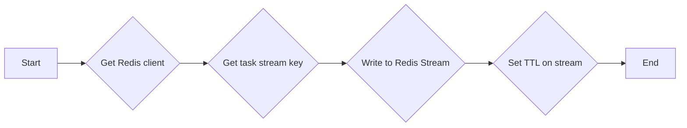

#### 带注释源码

```python
async def publish_chunk(
    task_id: str,
    chunk: StreamBaseResponse,
) -> str:
    """Publish a chunk to Redis Stream.

    All delivery is via Redis Streams - no in-memory state.

    Args:
        task_id: Task ID to publish to
        chunk: The stream response chunk to publish

    Returns:
        The Redis Stream message ID
    """
    import time

    start_time = time.perf_counter()
    chunk_type = type(chunk).__name__
    chunk_json = chunk.model_dump_json()
    message_id = "0-0"

    # Build log metadata
    log_meta = {
        "component": "StreamRegistry",
        "task_id": task_id,
        "chunk_type": chunk_type,
    }

    try:
        redis = await get_redis_async()
        stream_key = _get_task_stream_key(task_id)

        # Write to Redis Stream for persistence and real-time delivery
        xadd_start = time.perf_counter()
        raw_id = await redis.xadd(
            stream_key,
            {"data": chunk_json},
            maxlen=config.stream_max_length,
        )
        xadd_time = (time.perf_counter() - xadd_start) * 1000
        message_id = raw_id if isinstance(raw_id, str) else raw_id.decode()

        # Set TTL on stream to match task metadata TTL
        await redis.expire(stream_key, config.stream_ttl)

        total_time = (time.perf_counter() - start_time) * 1000
        # Only log timing for significant chunks or slow operations
        if (
            chunk_type
            in ("StreamStart", "StreamFinish", "StreamTextStart", "StreamTextEnd")
            or total_time > 50
        ):
            logger.info(
                f"[TIMING] publish_chunk {chunk_type} in {total_time:.1f}ms (xadd={xadd_time:.1f}ms)",
                extra={
                    "json_fields": {
                        **log_meta,
                        "total_time_ms": total_time,
                        "xadd_time_ms": xadd_time,
                        "message_id": message_id,
                    }
                },
            )
    except Exception as e:
        elapsed = (time.perf_counter() - start_time) * 1000
        logger.error(
            f"[TIMING] Failed to publish chunk {chunk_type} after {elapsed:.1f}ms: {e}",
            extra={"json_fields": {**log_meta, "elapsed_ms": elapsed, "error": str(e)}},
            exc_info=True,
        )

    return message_id
```

### subscribe_to_task

This function subscribes to a task's stream with replay of missed messages. It uses Redis Stream for replay and pub/sub for live updates.

参数：

- `task_id`：`str`，The task ID to subscribe to.
- `user_id`：`str | None`，User ID for ownership validation.
- `last_message_id`：`str`，Last Redis Stream message ID received ("0-0" for full replay).

返回值：`asyncio.Queue[StreamBaseResponse] | None`，An asyncio Queue that will receive stream chunks, or None if task not found or user doesn't have access.

#### 流程图

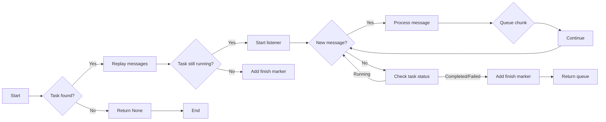

#### 带注释源码

```python
async def subscribe_to_task(
    task_id: str,
    user_id: str | None,
    last_message_id: str = "0-0",
) -> asyncio.Queue[StreamBaseResponse] | None:
    """Subscribe to a task's stream with replay of missed messages.

    This is fully stateless - uses Redis Stream for replay and pub/sub for live updates.

    Args:
        task_id: Task ID to subscribe to
        user_id: User ID for ownership validation
        last_message_id: Last Redis Stream message ID received ("0-0" for full replay)

    Returns:
        An asyncio Queue that will receive stream chunks, or None if task not found
        or user doesn't have access
    """
    import time

    start_time = time.perf_counter()

    # Build log metadata
    log_meta = {"component": "StreamRegistry", "task_id": task_id}
    if user_id:
        log_meta["user_id"] = user_id

    logger.info(
        f"[TIMING] subscribe_to_task STARTED, task={task_id}, user={user_id}, last_msg={last_message_id}",
        extra={"json_fields": {**log_meta, "last_message_id": last_message_id}},
    )

    redis_start = time.perf_counter()
    redis = await get_redis_async()
    meta_key = _get_task_meta_key(task_id)
    meta: dict[Any, Any] = await redis.hgetall(meta_key)  # type: ignore[misc]
    hgetall_time = (time.perf_counter() - redis_start) * 1000
    logger.info(
        f"[TIMING] Redis hgetall took {hgetall_time:.1f}ms",
        extra={"json_fields": {**log_meta, "duration_ms": hgetall_time}},
    )

    if not meta:
        elapsed = (time.perf_counter() - start_time) * 1000
        logger.info(
            f"[TIMING] Task not found in Redis after {elapsed:.1f}ms",
            extra={
                "json_fields": {
                    **log_meta,
                    "elapsed_ms": elapsed,
                    "reason": "task_not_found",
                }
            },
        )
        return None

    # Note: Redis client uses decode_responses=True, so keys are strings
    task_status = meta.get("status", "")
    task_user_id = meta.get("user_id", "") or None
    log_meta["session_id"] = meta.get("session_id", "")

    # Validate ownership - if task has an owner, requester must match
    if task_user_id:
        if user_id != task_user_id:
            logger.warning(
                f"[TIMING] Access denied: user {user_id} tried to access task owned by {task_user_id}",
                extra={
                    "json_fields": {
                        **log_meta,
                        "task_owner": task_user_id,
                        "reason": "access_denied",
                    }
                },
            )
            return None

    subscriber_queue: asyncio.Queue[StreamBaseResponse] = asyncio.Queue()
    stream_key = _get_task_stream_key(task_id)

    # Step 1: Replay messages from Redis Stream
    xread_start = time.perf_counter()
    messages = await redis.xread({stream_key: last_message_id}, block=0, count=1000)
    xread_time = (time.perf_counter() - xread_start) * 1000
    logger.info(
        f"[TIMING] Redis x

### _stream_listener

#### 描述

`_stream_listener` 是一个异步函数，用于监听 Redis 流中的新消息，并将这些消息放入一个异步队列中。它从指定的最后消息 ID 开始监听，并使用阻塞的 `XREAD` 命令来避免在重放和订阅之间的间隙中发生重复消息的问题。

#### 参数

- `task_id`: `str`，任务 ID，用于标识要监听的 Redis 流。
- `subscriber_queue`: `asyncio.Queue[StreamBaseResponse]`，异步队列，用于将监听到的消息传递给订阅者。
- `last_replayed_id`: `str`，最后重放的消息 ID，用于从该 ID 开始监听新消息。
- `log_meta`: `dict`，可选，用于结构化日志记录的元数据。

#### 返回值

- `None`，该函数不返回任何值。

#### 流程图

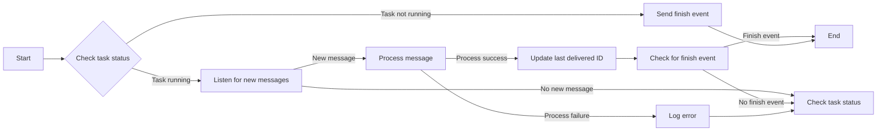

#### 带注释源码

```python
async def _stream_listener(
    task_id: str,
    subscriber_queue: asyncio.Queue[StreamBaseResponse],
    last_replayed_id: str,
    log_meta: dict | None = None,
) -> None:
    """Listen to Redis Stream for new messages using blocking XREAD.

    Args:
        task_id: Task ID to listen for
        subscriber_queue: Queue to deliver messages to
        last_replayed_id: Last message ID from replay (continue from here)
        log_meta: Structured logging metadata
    """
    import time

    start_time = time.perf_counter()

    # Use provided log_meta or build minimal one
    if log_meta is None:
        log_meta = {"component": "StreamRegistry", "task_id": task_id}

    logger.info(
        f"[TIMING] _stream_listener STARTED, task={task_id}, last_id={last_replayed_id}",
        extra={"json_fields": {**log_meta, "last_replayed_id": last_replayed_id}},
    )

    queue_id = id(subscriber_queue)
    # Track the last successfully delivered message ID for recovery hints
    last_delivered_id = last_replayed_id
    messages_delivered = 0
    first_message_time = None
    xread_count = 0

    try:
        redis = await get_redis_async()
        stream_key = _get_task_stream_key(task_id)
        current_id = last_replayed_id

        while True:
            # Block for up to 30 seconds waiting for new messages
            # This allows periodic checking if task is still running
            xread_start = time.perf_counter()
            xread_count += 1
            messages = await redis.xread(
                {stream_key: current_id}, block=30000, count=100
            )
            xread_time = (time.perf_counter() - xread_start) * 1000

            if messages:
                msg_count = sum(len(msgs) for _, msgs in messages)
                logger.info(
                    f"[TIMING] xread #{xread_count} returned {msg_count} messages in {xread_time:.1f}ms",
                    extra={
                        "json_fields": {
                            **log_meta,
                            "xread_count": xread_count,
                            "n_messages": msg_count,
                            "duration_ms": xread_time,
                        }
                    },
                )
            elif xread_time > 1000:
                # Only log timeouts (30s blocking)
                logger.info(
                    f"[TIMING] xread #{xread_count} timeout after {xread_time:.1f}ms",
                    extra={
                        "json_fields": {
                            **log_meta,
                            "xread_count": xread_count,
                            "duration_ms": xread_time,
                            "reason": "timeout",
                        }
                    },
                )

            if not messages:
                # Timeout - check if task is still running
                meta_key = _get_task_meta_key(task_id)
                status = await redis.hget(meta_key, "status")  # type: ignore[misc]
                if status and status != "running":
                    try:
                        await asyncio.wait_for(
                            subscriber_queue.put(StreamFinish()),
                            timeout=QUEUE_PUT_TIMEOUT,
                        )
                    except asyncio.TimeoutError:
                        logger.warning(
                            f"


### mark_task_completed

Mark a task as completed and publish finish event.

参数：

- `task_id`：`str`，Unique identifier for the task
- `status`：`Literal["completed", "failed"]`，Final status ("completed" or "failed")

返回值：`bool`，True if task was newly marked completed, False if already completed/failed

#### 流程图

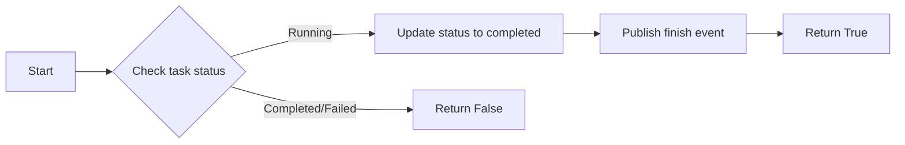

#### 带注释源码

```python
async def mark_task_completed(
    task_id: str,
    status: Literal["completed", "failed"] = "completed",
) -> bool:
    """Mark a task as completed and publish finish event.

    Args:
        task_id: Task ID to mark as completed
        status: Final status ("completed" or "failed")

    Returns:
        True if task was newly marked completed, False if already completed/failed
    """
    redis = await get_redis_async()
    meta_key = _get_task_meta_key(task_id)

    # Atomic compare-and-swap: only update if status is "running"
    # This prevents race conditions when multiple callers try to complete simultaneously
    result = await redis.eval(COMPLETE_TASK_SCRIPT, 1, meta_key, status)  # type: ignore[misc]

    if result == 0:
        logger.debug(f"Task {task_id} already completed/failed, skipping")
        return False

    # THEN publish finish event (best-effort - listeners can detect via status polling)
    try:
        await publish_chunk(task_id, StreamFinish())
    except Exception as e:
        logger.error(
            f"Failed to publish finish event for task {task_id}: {e}. "
            "Listeners will detect completion via status polling."
        )

    # Clean up local task reference if exists
    _local_tasks.pop(task_id, None)
    return True
```


### find_task_by_operation_id

Find a task by its operation ID.

参数：

- `operation_id`：`str`，The operation ID to search for

返回值：`ActiveTask` if found, `None` otherwise

#### 流程图

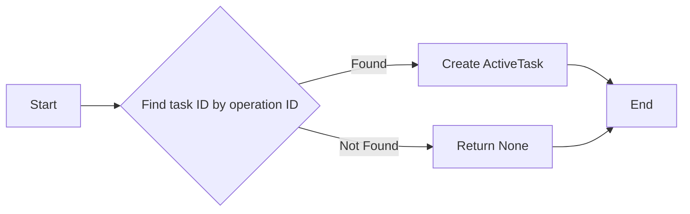

#### 带注释源码

```python
async def find_task_by_operation_id(operation_id: str) -> ActiveTask | None:
    """Find a task by its operation ID.

    Used by webhook callbacks to locate the task to update.

    Args:
        operation_id: Operation ID to search for

    Returns:
        ActiveTask if found, None otherwise
    """
    redis = await get_redis_async()
    op_key = _get_operation_mapping_key(operation_id)
    task_id = await redis.get(op_key)

    if not task_id:
        return None

    task_id_str = task_id.decode() if isinstance(task_id, bytes) else task_id
    return await get_task(task_id_str)
```


### `get_task`

Get a task by its ID from Redis.

参数：

- `task_id`：`str`，Task ID to look up

返回值：`ActiveTask or None`，ActiveTask if found, None otherwise

#### 流程图

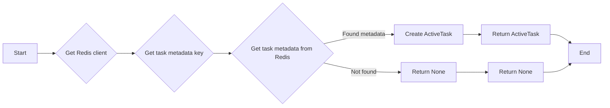

#### 带注释源码

```python
async def get_task(task_id: str) -> ActiveTask | None:
    """Get a task by its ID from Redis.

    Args:
        task_id: Task ID to look up

    Returns:
        ActiveTask if found, None otherwise
    """
    redis = await get_redis_async()
    meta_key = _get_task_meta_key(task_id)
    meta: dict[Any, Any] = await redis.hgetall(meta_key)  # type: ignore[misc]

    if not meta:
        return None

    # Note: Redis client uses decode_responses=True, so keys/values are strings
    return ActiveTask(
        task_id=meta.get("task_id", ""),
        session_id=meta.get("session_id", ""),
        user_id=meta.get("user_id", "") or None,
        tool_call_id=meta.get("tool_call_id", ""),
        tool_name=meta.get("tool_name", ""),
        operation_id=meta.get("operation_id", ""),
        status=meta.get("status", "running"),  # type: ignore[arg-type]
    )
```


### get_task_with_expiry_info

This function retrieves a task by its ID from Redis and checks for expiration. It returns the task along with an error code indicating the result of the operation.

参数：

- `task_id`：`str`，任务ID，用于在Redis中查找任务。

返回值：`tuple[ActiveTask | None, str | None]`，包含找到的任务（如果存在）和错误代码（如果存在）。

#### 流程图

```mermaid
graph LR
A[Start] --> B{Task exists?}
B -- Yes --> C[Return (task, None)}
B -- No --> D{Stream exists?}
D -- Yes --> E[Return (None, "TASK_EXPIRED")}
D -- No --> F[Return (None, "TASK_NOT_FOUND")]
F --> G[End]
```

#### 带注释源码

```python
async def get_task_with_expiry_info(task_id: str) -> tuple[ActiveTask | None, str | None]:
    """Get a task by its ID with expiration detection.

    Returns (task, error_code) where error_code is:
    - None if task found
    - "TASK_EXPIRED" if stream exists but metadata is gone (TTL expired)
    - "TASK_NOT_FOUND" if neither exists

    Args:
        task_id: Task ID to look up

    Returns:
        Tuple of (ActiveTask or None, error_code or None)
    """
    redis = await get_redis_async()
    meta_key = _get_task_meta_key(task_id)
    stream_key = _get_task_stream_key(task_id)

    meta: dict[Any, Any] = await redis.hgetall(meta_key)  # type: ignore[misc]

    if not meta:
        # Check if stream still has data (metadata expired but stream hasn't)
        stream_len = await redis.xlen(stream_key)
        if stream_len > 0:
            return None, "TASK_EXPIRED"
        return None, "TASK_NOT_FOUND"

    # Note: Redis client uses decode_responses=True, so keys/values are strings
    return (
        ActiveTask(
            task_id=meta.get("task_id", ""),
            session_id=meta.get("session_id", ""),
            user_id=meta.get("user_id", "") or None,
            tool_call_id=meta.get("tool_call_id", ""),
            tool_name=meta.get("tool_name", ""),
            operation_id=meta.get("operation_id", ""),
            status=meta.get("status", "running"),  # type: ignore[arg-type]
        ),
        None,
    )
```

### get_active_task_for_session

Get the active (running) task for a session, if any.

参数：

- `session_id`：`str`，The session ID to look up
- `user_id`：`str | None`，User ID for ownership validation (optional)

返回值：`tuple[ActiveTask | None, str]`，A tuple of (ActiveTask if found and running, last_message_id from Redis Stream)

#### 流程图

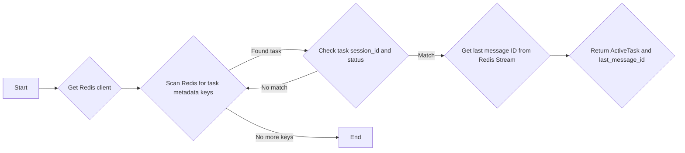

#### 带注释源码

```python
async def get_active_task_for_session(
    session_id: str,
    user_id: str | None = None,
) -> tuple[ActiveTask | None, str]:
    """Get the active (running) task for a session, if any.

    Scans Redis for tasks matching the session_id with status="running".

    Args:
        session_id: Session ID to look up
        user_id: User ID for ownership validation (optional)

    Returns:
        Tuple of (ActiveTask if found and running, last_message_id from Redis Stream)
    """

    redis = await get_redis_async()

    # Scan Redis for task metadata keys
    cursor = 0
    tasks_checked = 0

    while True:
        cursor, keys = await redis.scan(
            cursor, match=f"{config.task_meta_prefix}*", count=100
        )

        for key in keys:
            tasks_checked += 1
            meta: dict[Any, Any] = await redis.hgetall(key)  # type: ignore[misc]
            if not meta:
                continue

            # Note: Redis client uses decode_responses=True, so keys/values are strings
            task_session_id = meta.get("session_id", "")
            task_status = meta.get("status", "")
            task_user_id = meta.get("user_id", "") or None
            task_id = meta.get("task_id", "")

            if task_session_id == session_id and task_status == "running":
                # Validate ownership - if task has an owner, requester must match
                if task_user_id and user_id != task_user_id:
                    continue

                # Get the last message ID from Redis Stream
                stream_key = _get_task_stream_key(task_id)
                last_id = "0-0"
                try:
                    messages = await redis.xrevrange(stream_key, count=1)
                    if messages:
                        msg_id = messages[0][0]
                        last_id = msg_id if isinstance(msg_id, str) else msg_id.decode()
                except Exception as e:
                    logger.warning(f"Failed to get last message ID: {e}")

                return (
                    ActiveTask(
                        task_id=task_id,
                        session_id=task_session_id,
                        user_id=task_user_id,
                        tool_call_id=meta.get("tool_call_id", ""),
                        tool_name=meta.get("tool_name", ""),
                        operation_id=meta.get("operation_id", ""),
                        status="running",
                    ),
                    last_id,
                )

        if cursor == 0:
            break

    return None, "0-0"
```

### _reconstruct_chunk

#### 描述

Reconstruct a `StreamBaseResponse` from JSON data.

#### 参数

- `chunk_data`：`dict`，Parsed JSON data from Redis

#### 返回值

- `StreamBaseResponse | None`，Reconstructed response object, or `None` if unknown type

#### 流程图

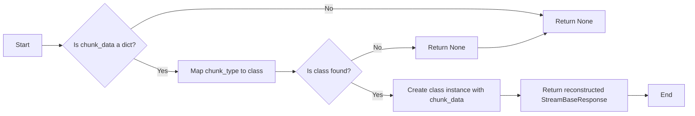

#### 带注释源码

```python
def _reconstruct_chunk(chunk_data: dict) -> StreamBaseResponse | None:
    """Reconstruct a StreamBaseResponse from JSON data.

    Args:
        chunk_data: Parsed JSON data from Redis

    Returns:
        Reconstructed response object, or None if unknown type
    """
    from .response_model import (
        ResponseType,
        StreamError,
        StreamFinish,
        StreamFinishStep,
        StreamHeartbeat,
        StreamStart,
        StreamStartStep,
        StreamTextDelta,
        StreamTextEnd,
        StreamTextStart,
        StreamToolInputAvailable,
        StreamToolInputStart,
        StreamToolOutputAvailable,
        StreamUsage,
    )

    # Map response types to their corresponding classes
    type_to_class: dict[str, type[StreamBaseResponse]] = {
        ResponseType.START.value: StreamStart,
        ResponseType.FINISH.value: StreamFinish,
        ResponseType.START_STEP.value: StreamStartStep,
        ResponseType.FINISH_STEP.value: StreamFinishStep,
        ResponseType.TEXT_START.value: StreamTextStart,
        ResponseType.TEXT_DELTA.value: StreamTextDelta,
        ResponseType.TEXT_END.value: StreamTextEnd,
        ResponseType.TOOL_INPUT_START.value: StreamToolInputStart,
        ResponseType.TOOL_INPUT_AVAILABLE.value: StreamToolInputAvailable,
        ResponseType.TOOL_OUTPUT_AVAILABLE.value: StreamToolOutputAvailable,
        ResponseType.ERROR.value: StreamError,
        ResponseType.USAGE.value: StreamUsage,
        ResponseType.HEARTBEAT.value: StreamHeartbeat,
    }

    chunk_type = chunk_data.get("type")
    chunk_class = type_to_class.get(chunk_type)  # type: ignore[arg-type]

    if chunk_class is None:
        logger.warning(f"Unknown chunk type: {chunk_type}")
        return None

    try:
        return chunk_class(**chunk_data)
    except Exception as e:
        logger.warning(f"Failed to reconstruct chunk of type {chunk_type}: {e}")
        return None
```

### set_task_asyncio_task

This function tracks the asyncio.Task for a given task ID, which is used for cleanup purposes.

#### 参数

- `task_id`：`str`，The unique identifier for the task.
- `asyncio_task`：`asyncio.Task`，The asyncio Task to track.

#### 返回值

- `None`，This function does not return any value.

#### 流程图

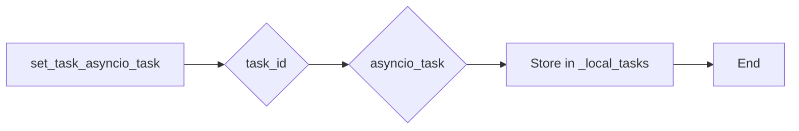

#### 带注释源码

```python
async def set_task_asyncio_task(task_id: str, asyncio_task: asyncio.Task) -> None:
    """Track the asyncio.Task for a task (local reference only).

    This is just for cleanup purposes - the task state is in Redis.

    Args:
        task_id: Task ID
        asyncio_task: The asyncio Task to track
    """
    _local_tasks[task_id] = asyncio_task
```


### unsubscribe_from_task

Clean up when a subscriber disconnects.

参数：

- `task_id`：`str`，The task ID associated with the subscriber.
- `subscriber_queue`：`asyncio.Queue[StreamBaseResponse]`，The queue used by the subscriber to receive messages.

返回值：`None`，No return value.

#### 流程图

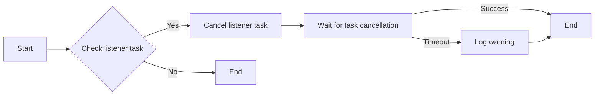

#### 带注释源码

```python
async def unsubscribe_from_task(
    task_id: str,
    subscriber_queue: asyncio.Queue[StreamBaseResponse],
) -> None:
    """Clean up when a subscriber disconnects.

    Cancels the XREAD-based listener task associated with this subscriber queue
    to prevent resource leaks.

    Args:
        task_id: Task ID
        subscriber_queue: The subscriber's queue used to look up the listener task
    """
    queue_id = id(subscriber_queue)
    listener_entry = _listener_tasks.pop(queue_id, None)

    if listener_entry is None:
        logger.debug(
            f"No listener task found for task {task_id} queue {queue_id} "
            "(may have already completed)"
        )
        return

    stored_task_id, listener_task = listener_entry

    if stored_task_id != task_id:
        logger.warning(
            f"Task ID mismatch in unsubscribe: expected {task_id}, "
            f"found {stored_task_id}"
        )

    if listener_task.done():
        logger.debug(f"Listener task for task {task_id} already completed")
        return

    # Cancel the listener task
    listener_task.cancel()

    try:
        # Wait for the task to be cancelled with a timeout
        await asyncio.wait_for(listener_task, timeout=5.0)
    except asyncio.CancelledError:
        # Expected - the task was successfully cancelled
        pass
    except asyncio.TimeoutError:
        logger.warning(
            f"Timeout waiting for listener task cancellation for task {task_id}"
        )
    except Exception as e:
        logger.error(f"Error during listener task cancellation for task {task_id}: {e}")

    logger.debug(f"Successfully unsubscribed from task {task_id}")
```


### `create_task`

Create a new streaming task in Redis.

参数：

- `task_id`：`str`，Unique identifier for the task
- `session_id`：`str`，Chat session ID
- `user_id`：`str | None`，User ID (may be None for anonymous)
- `tool_call_id`：`str`，Tool call ID from the LLM
- `tool_name`：`str`，Name of the tool being executed
- `operation_id`：`str`，Operation ID for webhook callbacks

返回值：`ActiveTask`，The created ActiveTask instance (metadata only)

#### 流程图


#### 带注释源码

```python
async def create_task(
    task_id: str,
    session_id: str,
    user_id: str | None,
    tool_call_id: str,
    tool_name: str,
    operation_id: str,
) -> ActiveTask:
    """Create a new streaming task in Redis.

    Args:
        task_id: Unique identifier for the task
        session_id: Chat session ID
        user_id: User ID (may be None for anonymous)
        tool_call_id: Tool call ID from the LLM
        tool_name: Name of the tool being executed
        operation_id: Operation ID for webhook callbacks

    Returns:
        The created ActiveTask instance (metadata only)
    """
    import time

    start_time = time.perf_counter()

    # Build log metadata for structured logging
    log_meta = {
        "component": "StreamRegistry",
        "task_id": task_id,
        "session_id": session_id,
    }
    if user_id:
        log_meta["user_id"] = user_id

    logger.info(
        f"[TIMING] create_task STARTED, task={task_id}, session={session_id}, user={user_id}",
        extra={"json_fields": log_meta},
    )

    task = ActiveTask(
        task_id=task_id,
        session_id=session_id,
        user_id=user_id,
        tool_call_id=tool_call_id,
        tool_name=tool_name,
        operation_id=operation_id,
    )

    # Store metadata in Redis
    redis_start = time.perf_counter()
    redis = await get_redis_async()
    redis_time = (time.perf_counter() - redis_start) * 1000
    logger.info(
        f"[TIMING] get_redis_async took {redis_time:.1f}ms",
        extra={"json_fields": {**log_meta, "duration_ms": redis_time}},
    )

    meta_key = _get_task_meta_key(task_id)
    op_key = _get_operation_mapping_key(operation_id)

    hset_start = time.perf_counter()
    await redis.hset(  # type: ignore[misc]
        meta_key,
        mapping={
            "task_id": task_id,
            "session_id": session_id,
            "user_id": user_id or "",
            "tool_call_id": tool_call_id,
            "tool_name": tool_name,
            "operation_id": operation_id,
            "status": task.status,
            "created_at": task.created_at.isoformat(),
        },
    )
    hset_time = (time.perf_counter() - hset_start) * 1000
    logger.info(
        f"[TIMING] redis.hset took {hset_time:.1f}ms",
        extra={"json_fields": {**log_meta, "duration_ms": hset_time}},
    )

    await redis.expire(meta_key, config.stream_ttl)

    # Create operation_id -> task_id mapping for webhook lookups
    await redis.set(op_key, task_id, ex=config.stream_ttl)

    total_time = (time.perf_counter() - start_time) * 1000
    logger.info(
        f"[TIMING] create_task COMPLETED in {total_time:.1f}ms; task={task_id}, session={session_id}",
        extra={"json_fields": {**log_meta, "total_time_ms": total_time}},
    )

    return task
```


### ActiveTask.publish_chunk

Publishes a chunk to Redis Stream.

参数：

- `task_id`：`str`，The task ID to publish to.
- `chunk`：`StreamBaseResponse`，The stream response chunk to publish.

返回值：`str`，The Redis Stream message ID.

#### 流程图


#### 带注释源码

```python
async def publish_chunk(
    task_id: str,
    chunk: StreamBaseResponse,
) -> str:
    """Publish a chunk to Redis Stream.

    All delivery is via Redis Streams - no in-memory state.

    Args:
        task_id: Task ID to publish to
        chunk: The stream response chunk to publish

    Returns:
        The Redis Stream message ID
    """
    import time

    start_time = time.perf_counter()
    chunk_type = type(chunk).__name__
    chunk_json = chunk.model_dump_json()
    message_id = "0-0"

    # Build log metadata
    log_meta = {
        "component": "StreamRegistry",
        "task_id": task_id,
        "chunk_type": chunk_type,
    }

    try:
        redis = await get_redis_async()
        stream_key = _get_task_stream_key(task_id)

        # Write to Redis Stream for persistence and real-time delivery
        xadd_start = time.perf_counter()
        raw_id = await redis.xadd(
            stream_key,
            {"data": chunk_json},
            maxlen=config.stream_max_length,
        )
        xadd_time = (time.perf_counter() - xadd_start) * 1000
        message_id = raw_id if isinstance(raw_id, str) else raw_id.decode()

        # Set TTL on stream to match task metadata TTL
        await redis.expire(stream_key, config.stream_ttl)

        total_time = (time.perf_counter() - start_time) * 1000
        # Only log timing for significant chunks or slow operations
        if (
            chunk_type
            in ("StreamStart", "StreamFinish", "StreamTextStart", "StreamTextEnd")
            or total_time > 50
        ):
            logger.info(
                f"[TIMING] publish_chunk {chunk_type} in {total_time:.1f}ms (xadd={xadd_time:.1f}ms)",
                extra={
                    "json_fields": {
                        **log_meta,
                        "total_time_ms": total_time,
                        "xadd_time_ms": xadd_time,
                        "message_id": message_id,
                    }
                },
            )
    except Exception as e:
        elapsed = (time.perf_counter() - start_time) * 1000
        logger.error(
            f"[TIMING] Failed to publish chunk {chunk_type} after {elapsed:.1f}ms: {e}",
            extra={"json_fields": {**log_meta, "elapsed_ms": elapsed, "error": str(e)}},
            exc_info=True,
        )

    return message_id
```


### ActiveTask.subscribe_to_task

Subscribe to a task's stream with replay of missed messages.

参数：

- `task_id`：`str`，The Task ID to subscribe to.
- `user_id`：`str | None`，User ID for ownership validation.
- `last_message_id`：`str`，Last Redis Stream message ID received ("0-0" for full replay).

返回值：`asyncio.Queue[StreamBaseResponse] | None`，An asyncio Queue that will receive stream chunks, or None if task not found or user doesn't have access.

#### 流程图

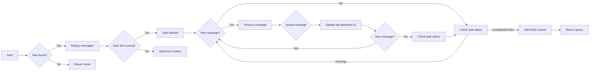

#### 带注释源码

```python
async def subscribe_to_task(
    task_id: str,
    user_id: str | None,
    last_message_id: str = "0-0",
) -> asyncio.Queue[StreamBaseResponse] | None:
    """Subscribe to a task's stream with replay of missed messages.

    Args:
        task_id: Task ID to subscribe to
        user_id: User ID for ownership validation
        last_message_id: Last Redis Stream message ID received ("0-0" for full replay)

    Returns:
        An asyncio Queue that will receive stream chunks, or None if task not found
        or user doesn't have access
    """
    import time

    start_time = time.perf_counter()

    # Build log metadata
    log_meta = {"component": "StreamRegistry", "task_id": task_id}
    if user_id:
        log_meta["user_id"] = user_id

    logger.info(
        f"[TIMING] subscribe_to_task STARTED, task={task_id}, user={user_id}, last_msg={last_message_id}",
        extra={"json_fields": {**log_meta, "last_message_id": last_message_id}},
    )

    redis_start = time.perf_counter()
    redis = await get_redis_async()
    meta_key = _get_task_meta_key(task_id)
    meta: dict[Any, Any] = await redis.hgetall(meta_key)  # type: ignore[misc]
    hgetall_time = (time.perf_counter() - redis_start) * 1000
    logger.info(
        f"[TIMING] Redis hgetall took {hgetall_time:.1f}ms",
        extra={"json_fields": {**log_meta, "duration_ms": hgetall_time}},
    )

    if not meta:
        elapsed = (time.perf_counter() - start_time) * 1000
        logger.info(
            f"[TIMING] Task not found in Redis after {elapsed:.1f}ms",
            extra={
                "json_fields": {
                    **log_meta,
                    "elapsed_ms": elapsed,
                    "reason": "task_not_found",
                }
            },
        )
        return None

    # Note: Redis client uses decode_responses=True, so keys are strings
    task_status = meta.get("status", "")
    task_user_id = meta.get("user_id", "") or None
    log_meta["session_id"] = meta.get("session_id", "")

    # Validate ownership - if task has an owner, requester must match
    if task_user_id:
        if user_id != task_user_id:
            logger.warning(
                f"[TIMING] Access denied: user {user_id} tried to access task owned by {task_user_id}",
                extra={
                    "json_fields": {
                        **log_meta,
                        "task_owner": task_user_id,
                        "reason": "access_denied",
                    }
                },
            )
            return None

    subscriber_queue: asyncio.Queue[StreamBaseResponse] = asyncio.Queue()
    stream_key = _get_task_stream_key(task_id)

    # Step 1: Replay messages from Redis Stream
    xread_start = time.perf_counter()
    messages = await redis.xread({stream_key: last_message_id}, block=0, count=1000)
    xread_time = (time.perf_counter() - xread_start) * 1000
    logger.info(
        f"[TIMING] Redis xread (replay) took {xread

### `_stream_listener`

#### 描述

`_stream_listener` 是一个异步函数，用于监听 Redis 流中的新消息，并将这些消息放入一个异步队列中。它从指定的最后消息 ID 开始监听，并使用阻塞的 `XREAD` 命令来避免在重放和订阅之间的间隙中发生重复消息的问题。

#### 参数

- `task_id`：`str`，任务 ID，用于标识要监听的 Redis 流。
- `subscriber_queue`：`asyncio.Queue[StreamBaseResponse]`，异步队列，用于将监听到的消息传递给订阅者。
- `last_replayed_id`：`str`，最后重放的消息 ID，用于从该 ID 开始监听新消息。
- `log_meta`：`dict`，可选，用于结构化日志记录的元数据。

#### 返回值

- `None`：函数没有返回值。

#### 流程图


#### 带注释源码

```python
async def _stream_listener(
    task_id: str,
    subscriber_queue: asyncio.Queue[StreamBaseResponse],
    last_replayed_id: str,
    log_meta: dict | None = None,
) -> None:
    """Listen to Redis Stream for new messages using blocking XREAD.

    Args:
        task_id: Task ID to listen for
        subscriber_queue: Queue to deliver messages to
        last_replayed_id: Last message ID from replay (continue from here)
        log_meta: Structured logging metadata
    """
    import time

    start_time = time.perf_counter()

    # Use provided log_meta or build minimal one
    if log_meta is None:
        log_meta = {"component": "StreamRegistry", "task_id": task_id}

    logger.info(
        f"[TIMING] _stream_listener STARTED, task={task_id}, last_id={last_replayed_id}",
        extra={"json_fields": {**log_meta, "last_replayed_id": last_replayed_id}},
    )

    queue_id = id(subscriber_queue)
    # Track the last successfully delivered message ID for recovery hints
    last_delivered_id = last_replayed_id
    messages_delivered = 0
    first_message_time = None
    xread_count = 0

    try:
        redis = await get_redis_async()
        stream_key = _get_task_stream_key(task_id)
        current_id = last_replayed_id

        while True:
            # Block for up to 30 seconds waiting for new messages
            # This allows periodic checking if task is still running
            xread_start = time.perf_counter()
            xread_count += 1
            messages = await redis.xread(
                {stream_key: current_id}, block=30000, count=100
            )
            xread_time = (time.perf_counter() - xread_start) * 1000

            if messages:
                msg_count = sum(len(msgs) for _, msgs in messages)
                logger.info(
                    f"[TIMING] xread #{xread_count} returned {msg_count} messages in {xread_time:.1f}ms",
                    extra={
                        "json_fields": {
                            **log_meta,
                            "xread_count": xread_count,
                            "n_messages": msg_count,
                            "duration_ms": xread_time,
                        }
                    },
                )
            elif xread_time > 1000:
                # Only log timeouts (30s blocking)
                logger.info(
                    f"[TIMING] xread #{xread_count} timeout after {xread_time:.1f}ms",
                    extra={
                        "json_fields": {
                            **log_meta,
                            "xread_count": xread_count,
                            "duration_ms": xread_time,
                            "reason": "timeout",
                        }
                    },
                )

            if not messages:
                # Timeout - check if task is still running
                meta_key = _get_task_meta_key(task_id)
                status = await redis.hget(meta_key, "status")  # type: ignore[misc]
                if status and status != "running":
                    try:
                        await asyncio.wait_for(
                            subscriber_queue.put(StreamFinish()),
                            timeout=QUEUE_PUT_TIMEOUT,
                        )
                    except asyncio.TimeoutError:
                        logger.warning(


### ActiveTask.mark_task_completed

This function marks a task as completed or failed and publishes a finish event.

参数：

- `task_id`：`str`，任务ID
- `status`：`Literal["completed", "failed"]`，任务最终状态，默认为"completed"

返回值：`bool`，如果任务被新标记为完成，则返回True，如果任务已完成/失败，则返回False

#### 流程图

```mermaid
graph LR
A[Start] --> B{Check task status}
B -->|Running| C[Update status to completed]
B -->|Completed/Failed| D[Return False]
C --> E[Publish finish event]
E --> F[Return True]
```

#### 带注释源码

```python
async def mark_task_completed(
    task_id: str,
    status: Literal["completed", "failed"] = "completed",
) -> bool:
    """Mark a task as completed and publish finish event.

    Args:
        task_id: Task ID to mark as completed
        status: Final status ("completed" or "failed")

    Returns:
        True if task was newly marked completed, False if already completed/failed
    """
    redis = await get_redis_async()
    meta_key = _get_task_meta_key(task_id)

    # Atomic compare-and-swap: only update if status is "running"
    # This prevents race conditions when multiple callers try to complete simultaneously
    result = await redis.eval(COMPLETE_TASK_SCRIPT, 1, meta_key, status)  # type: ignore[misc]

    if result == 0:
        logger.debug(f"Task {task_id} already completed/failed, skipping")
        return False

    # THEN publish finish event (best-effort - listeners can detect via status polling)
    try:
        await publish_chunk(task_id, StreamFinish())
    except Exception as e:
        logger.error(
            f"Failed to publish finish event for task {task_id}: {e}. "
            "Listeners will detect completion via status polling."
        )

    # Clean up local task reference if exists
    _local_tasks.pop(task_id, None)
    return True
```


### find_task_by_operation_id

Find a task by its operation ID.

参数：

- `operation_id`：`str`，The operation ID to search for

返回值：`ActiveTask` if found, `None` otherwise

#### 流程图

```mermaid
graph LR
A[Start] --> B{Find task by operation ID}
B -->|Found| C[Return ActiveTask]
B -->|Not found| D[Return None]
D --> E[End]
```

#### 带注释源码

```python
async def find_task_by_operation_id(operation_id: str) -> ActiveTask | None:
    """Find a task by its operation ID.

    Used by webhook callbacks to locate the task to update.

    Args:
        operation_id: Operation ID to search for

    Returns:
        ActiveTask if found, None otherwise
    """
    redis = await get_redis_async()
    op_key = _get_operation_mapping_key(operation_id)
    task_id = await redis.get(op_key)

    if not task_id:
        return None

    task_id_str = task_id.decode() if isinstance(task_id, bytes) else task_id
    return await get_task(task_id_str)
```


### ActiveTask.get_task

该函数用于根据任务ID从Redis获取任务信息。

#### 参数

- `task_id`：`str`，任务ID，用于在Redis中查找对应的任务信息。

#### 返回值

- `ActiveTask | None`，如果找到对应的任务信息，则返回`ActiveTask`对象；如果没有找到或发生错误，则返回`None`。

#### 流程图

```mermaid
graph LR
A[开始] --> B{查找任务信息}
B -->|找到| C[返回ActiveTask对象]
B -->|未找到| D[返回None]
D --> E[结束]
```

#### 带注释源码

```python
async def get_task(task_id: str) -> ActiveTask | None:
    """Get a task by its ID from Redis.

    Args:
        task_id: Task ID to look up

    Returns:
        ActiveTask if found, None otherwise
    """
    redis = await get_redis_async()
    meta_key = _get_task_meta_key(task_id)
    meta: dict[Any, Any] = await redis.hgetall(meta_key)  # type: ignore[misc]

    if not meta:
        return None

    # Note: Redis client uses decode_responses=True, so keys/values are strings
    return ActiveTask(
        task_id=meta.get("task_id", ""),
        session_id=meta.get("session_id", ""),
        user_id=meta.get("user_id", "") or None,
        tool_call_id=meta.get("tool_call_id", ""),
        tool_name=meta.get("tool_name", ""),
        operation_id=meta.get("operation_id", ""),
        status=meta.get("status", "running"),  # type: ignore[arg-type]
    )
```


### `get_task_with_expiry_info`

Get a task by its ID with expiration detection.

参数：

- `task_id`：`str`，Task ID to look up

返回值：`tuple[ActiveTask | None, str | None]`，Where error_code is:
- `None` if task found
- `"TASK_EXPIRED"` if stream exists but metadata is gone (TTL expired)
- `"TASK_NOT_FOUND"` if neither exists

#### 流程图

```mermaid
graph LR
A[Start] --> B{Task exists?}
B -- Yes --> C[Return task]
B -- No --> D{Stream exists?}
D -- Yes --> E[Return (task, "TASK_EXPIRED")}
D -- No --> F[Return (None, "TASK_NOT_FOUND")]
F --> G[End]
```

#### 带注释源码

```python
async def get_task_with_expiry_info(
    task_id: str,
) -> tuple[ActiveTask | None, str | None]:
    """Get a task by its ID with expiration detection.

    Returns (task, error_code) where error_code is:
    - None if task found
    - "TASK_EXPIRED" if stream exists but metadata is gone (TTL expired)
    - "TASK_NOT_FOUND" if neither exists

    Args:
        task_id: Task ID to look up

    Returns:
        Tuple of (ActiveTask or None, error_code or None)
    """
    redis = await get_redis_async()
    meta_key = _get_task_meta_key(task_id)
    stream_key = _get_task_stream_key(task_id)

    meta: dict[Any, Any] = await redis.hgetall(meta_key)  # type: ignore[misc]

    if not meta:
        # Check if stream still has data (metadata expired but stream hasn't)
        stream_len = await redis.xlen(stream_key)
        if stream_len > 0:
            return None, "TASK_EXPIRED"
        return None, "TASK_NOT_FOUND"

    # Note: Redis client uses decode_responses=True, so keys/values are strings
    return (
        ActiveTask(
            task_id=meta.get("task_id", ""),
            session_id=meta.get("session_id", ""),
            user_id=meta.get("user_id", "") or None,
            tool_call_id=meta.get("tool_call_id", ""),
            tool_name=meta.get("tool_name", ""),
            operation_id=meta.get("operation_id", ""),
            status=meta.get("status", "running"),  # type: ignore[arg-type]
        ),
        None,
    )
```


### `get_active_task_for_session(session_id: str, user_id: str | None = None)`

Get the active (running) task for a session, if any.

参数：

- `session_id`：`str`，The session ID to look up
- `user_id`：`str | None`，User ID for ownership validation (optional)

返回值：`tuple[ActiveTask | None, str]`，A tuple of (ActiveTask if found and running, last_message_id from Redis Stream)

#### 流程图

```mermaid
graph LR
A[Start] --> B{Get Redis client}
B --> C{Scan Redis for task metadata keys}
C -->|Found task| D{Check task session_id and status}
D -->|Match| E{Get last message ID from Redis Stream}
D -->|No match| C
E --> F{Return ActiveTask and last_message_id}
C -->|No more keys| G[End]
```

#### 带注释源码

```python
async def get_active_task_for_session(
    session_id: str,
    user_id: str | None = None,
) -> tuple[ActiveTask | None, str]:
    """Get the active (running) task for a session, if any.

    Scans Redis for tasks matching the session_id with status="running".

    Args:
        session_id: Session ID to look up
        user_id: User ID for ownership validation (optional)

    Returns:
        Tuple of (ActiveTask if found and running, last_message_id from Redis Stream)
    """

    redis = await get_redis_async()

    # Scan Redis for task metadata keys
    cursor = 0
    tasks_checked = 0

    while True:
        cursor, keys = await redis.scan(
            cursor, match=f"{config.task_meta_prefix}*", count=100
        )

        for key in keys:
            tasks_checked += 1
            meta: dict[Any, Any] = await redis.hgetall(key)  # type: ignore[misc]
            if not meta:
                continue

            # Note: Redis client uses decode_responses=True, so keys/values are strings
            task_session_id = meta.get("session_id", "")
            task_status = meta.get("status", "")
            task_user_id = meta.get("user_id", "") or None
            task_id = meta.get("task_id", "")

            if task_session_id == session_id and task_status == "running":
                # Validate ownership - if task has an owner, requester must match
                if task_user_id and user_id != task_user_id:
                    continue

                # Get the last message ID from Redis Stream
                stream_key = _get_task_stream_key(task_id)
                last_id = "0-0"
                try:
                    messages = await redis.xrevrange(stream_key, count=1)
                    if messages:
                        msg_id = messages[0][0]
                        last_id = msg_id if isinstance(msg_id, str) else msg_id.decode()
                except Exception as e:
                    logger.warning(f"Failed to get last message ID: {e}")

                return (
                    ActiveTask(
                        task_id=task_id,
                        session_id=task_session_id,
                        user_id=task_user_id,
                        tool_call_id=meta.get("tool_call_id", ""),
                        tool_name=meta.get("tool_name", ""),
                        operation_id=meta.get("operation_id", ""),
                        status="running",
                    ),
                    last_id,
                )

        if cursor == 0:
            break

    return None, "0-0"
```


### `_reconstruct_chunk`

Reconstructs a `StreamBaseResponse` object from JSON data.

参数：

- `chunk_data`：`dict`，Parsed JSON data from Redis

返回值：`StreamBaseResponse | None`，Reconstructed response object, or `None` if unknown type

#### 流程图

```mermaid
graph LR
A[Start] --> B{Is chunk_data a valid JSON?}
B -- Yes --> C[Map chunk_type to class]
B -- No --> D[Log warning and return None]
C --> E{Is class found?}
E -- Yes --> F[Create instance of class with chunk_data]
E -- No --> G[Log warning and return None]
F --> H[Return instance]
G --> I[Return None]
H --> J[End]
I --> J
```

#### 带注释源码

```python
def _reconstruct_chunk(chunk_data: dict) -> StreamBaseResponse | None:
    """Reconstruct a StreamBaseResponse from JSON data.

    Args:
        chunk_data: Parsed JSON data from Redis

    Returns:
        Reconstructed response object, or None if unknown type
    """
    from .response_model import (
        ResponseType,
        StreamError,
        StreamFinish,
        StreamFinishStep,
        StreamHeartbeat,
        StreamStart,
        StreamStartStep,
        StreamTextDelta,
        StreamTextEnd,
        StreamTextStart,
        StreamToolInputAvailable,
        StreamToolInputStart,
        StreamToolOutputAvailable,
        StreamUsage,
    )

    # Map response types to their corresponding classes
    type_to_class: dict[str, type[StreamBaseResponse]] = {
        ResponseType.START.value: StreamStart,
        ResponseType.FINISH.value: StreamFinish,
        ResponseType.START_STEP.value: StreamStartStep,
        ResponseType.FINISH_STEP.value: StreamFinishStep,
        ResponseType.TEXT_START.value: StreamTextStart,
        ResponseType.TEXT_DELTA.value: StreamTextDelta,
        ResponseType.TEXT_END.value: StreamTextEnd,
        ResponseType.TOOL_INPUT_START.value: StreamToolInputStart,
        ResponseType.TOOL_INPUT_AVAILABLE.value: StreamToolInputAvailable,
        ResponseType.TOOL_OUTPUT_AVAILABLE.value: StreamToolOutputAvailable,
        ResponseType.ERROR.value: StreamError,
        ResponseType.USAGE.value: StreamUsage,
        ResponseType.HEARTBEAT.value: StreamHeartbeat,
    }

    chunk_type = chunk_data.get("type")
    chunk_class = type_to_class.get(chunk_type)  # type: ignore[arg-type]

    if chunk_class is None:
        logger.warning(f"Unknown chunk type: {chunk_type}")
        return None

    try:
        return chunk_class(**chunk_data)
    except Exception as e:
        logger.warning(f"Failed to reconstruct chunk of type {chunk_type}: {e}")
        return None
``` 


### set_task_asyncio_task

Track the asyncio.Task for a task (local reference only).

参数：

- `task_id`：`str`，Task ID
- `asyncio_task`：`asyncio.Task`，The asyncio Task to track

返回值：`None`，No return value

#### 流程图

```mermaid
graph LR
A[Start] --> B{Set asyncio_task}
B --> C[End]
```

#### 带注释源码

```python
async def set_task_asyncio_task(task_id: str, asyncio_task: asyncio.Task) -> None:
    """Track the asyncio.Task for a task (local reference only).

    This is just for cleanup purposes - the task state is in Redis.

    Args:
        task_id: Task ID
        asyncio_task: The asyncio Task to track
    """
    _local_tasks[task_id] = asyncio_task
```


### unsubscribe_from_task

Clean up when a subscriber disconnects.

参数：

- `task_id`：`str`，The ID of the task associated with the subscriber.
- `subscriber_queue`：`asyncio.Queue[StreamBaseResponse]`，The queue used by the subscriber to receive messages.

返回值：`None`，No return value.

#### 流程图

```mermaid
graph LR
A[Start] --> B{Check listener task}
B -->|Yes| C[Cancel listener task]
B -->|No| D[End]
C --> E[Wait for task cancellation]
E -->|Success| F[End]
E -->|Timeout| G[Log warning]
G --> F
```

#### 带注释源码

```python
async def unsubscribe_from_task(
    task_id: str,
    subscriber_queue: asyncio.Queue[StreamBaseResponse],
) -> None:
    """Clean up when a subscriber disconnects.

    Cancels the XREAD-based listener task associated with this subscriber queue
    to prevent resource leaks.

    Args:
        task_id: Task ID
        subscriber_queue: The subscriber's queue used to look up the listener task
    """
    queue_id = id(subscriber_queue)
    listener_entry = _listener_tasks.pop(queue_id, None)

    if listener_entry is None:
        logger.debug(
            f"No listener task found for task {task_id} queue {queue_id} "
            "(may have already completed)"
        )
        return

    stored_task_id, listener_task = listener_entry

    if stored_task_id != task_id:
        logger.warning(
            f"Task ID mismatch in unsubscribe: expected {task_id}, "
            f"found {stored_task_id}"
        )

    if listener_task.done():
        logger.debug(f"Listener task for task {task_id} already completed")
        return

    # Cancel the listener task
    listener_task.cancel()

    try:
        # Wait for the task to be cancelled with a timeout
        await asyncio.wait_for(listener_task, timeout=5.0)
    except asyncio.CancelledError:
        # Expected - the task was successfully cancelled
        pass
    except asyncio.TimeoutError:
        logger.warning(
            f"Timeout waiting for listener task cancellation for task {task_id}"
        )
    except Exception as e:
        logger.error(f"Error during listener task cancellation for task {task_id}: {e}")

    logger.debug(f"Successfully unsubscribed from task {task_id}")
```


## 关键组件


### 张量索引与惰性加载

张量索引与惰性加载是代码中用于高效处理和访问大型数据集的关键组件。它允许在需要时才加载数据，从而减少内存消耗并提高性能。

### 反量化支持

反量化支持是代码中用于处理量化数据的关键组件。它允许在量化过程中进行反向操作，以便在需要时恢复原始数据。

### 量化策略

量化策略是代码中用于优化数据表示和存储的关键组件。它通过减少数据精度来减少内存占用，同时保持足够的精度以满足应用需求。


## 问题及建议


### 已知问题

-   **全局变量和类字段未进行适当的封装**：代码中存在多个全局变量和类字段，如 `_local_tasks` 和 `_listener_tasks`，这些变量直接暴露在模块级别，可能导致潜在的命名冲突和难以维护。
-   **异常处理不够全面**：代码中存在一些异常处理，但并非所有可能发生的异常都被捕获和处理。例如，在 `_stream_listener` 函数中，如果 `redis.xread` 超时，没有明确的异常处理逻辑。
-   **日志记录不够详细**：虽然代码中使用了日志记录，但记录的信息不够详细，难以追踪和分析问题。例如，在异常处理中，应该记录异常的具体类型和堆栈信息。
-   **代码重复**：在 `create_task` 和 `get_task` 函数中，存在重复的代码用于构建 Redis 键。可以考虑将这些逻辑提取到单独的函数中，以减少代码重复。

### 优化建议

-   **封装全局变量和类字段**：将全局变量和类字段封装到类中，以减少命名冲突和增强代码的可维护性。
-   **增强异常处理**：确保所有可能发生的异常都被捕获和处理，并提供清晰的错误信息。
-   **改进日志记录**：记录更详细的日志信息，包括异常类型、堆栈信息和关键步骤的执行时间。
-   **减少代码重复**：将重复的代码提取到单独的函数中，以减少代码冗余和提高代码的可读性。
-   **考虑使用更高级的 Redis 操作**：例如，使用 Redis 的 `XGROUP CREATE` 和 `XGROUP SETID` 命令来管理消费者组，以实现更复杂的消息处理逻辑。
-   **性能优化**：考虑使用异步编程的最佳实践，例如使用 `asyncio.gather` 来并发执行多个异步操作，以提高代码的执行效率。


## 其它


### 设计目标与约束

- **无状态设计**：所有状态管理通过Redis进行，确保Pod的无状态性和水平扩展性。
- **高可用性**：使用Redis作为状态存储，提供高可用性和持久性。
- **实时性**：通过Redis Stream实现消息的持久化和实时交付。
- **可扩展性**：设计应支持高并发和大量数据。

### 错误处理与异常设计

- **异常捕获**：所有外部调用（如Redis操作）都包含异常捕获，确保系统的健壮性。
- **日志记录**：所有异常和关键操作都记录在日志中，便于问题追踪和调试。
- **错误响应**：在发生错误时，返回适当的错误信息，并确保系统状态的一致性。

### 数据流与状态机

- **数据流**：数据通过Redis Stream进行传递，包括任务元数据和消息。
- **状态机**：任务状态通过Redis Hash进行管理，包括运行、完成和失败状态。

### 外部依赖与接口契约

- **Redis**：依赖Redis进行状态管理和消息传递。
- **异步编程**：使用asyncio进行异步编程，确保非阻塞操作。
- **JSON序列化**：使用orjson进行JSON序列化和反序列化。

### 安全性与权限

- **用户验证**：通过用户ID验证用户对任务的访问权限。
- **数据加密**：敏感数据（如用户ID）在传输和存储时进行加密。

### 性能优化

- **缓存**：使用Redis缓存频繁访问的数据，减少数据库访问次数。
- **批处理**：对于大量数据操作，使用批处理减少网络延迟。

### 可维护性与可测试性

- **代码结构**：代码结构清晰，易于维护和扩展。
- **单元测试**：提供单元测试，确保代码质量。

### 国际化与本地化

- **多语言支持**：设计应支持多语言，便于国际化。

### 可观测性与监控

- **性能监控**：监控系统性能，包括响应时间和资源使用情况。
- **日志分析**：分析日志数据，识别潜在问题。

### 用户界面与交互

- **用户友好的界面**：提供用户友好的界面，便于用户操作。

### 部署与运维

- **自动化部署**：支持自动化部署，提高部署效率。
- **运维监控**：提供运维监控工具，便于运维人员监控系统状态。

### 法律与合规

- **数据保护**：遵守数据保护法规，确保用户数据安全。
- **隐私政策**：明确隐私政策，保护用户隐私。


    