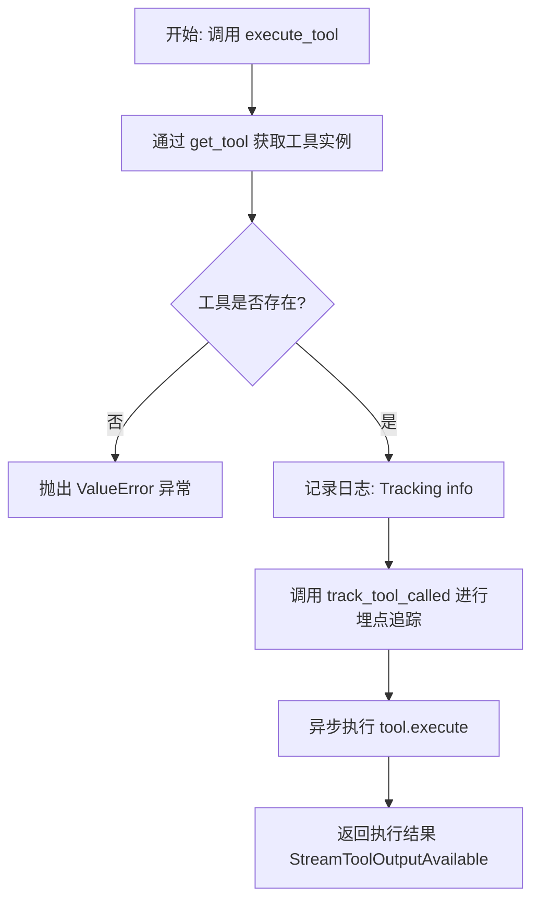
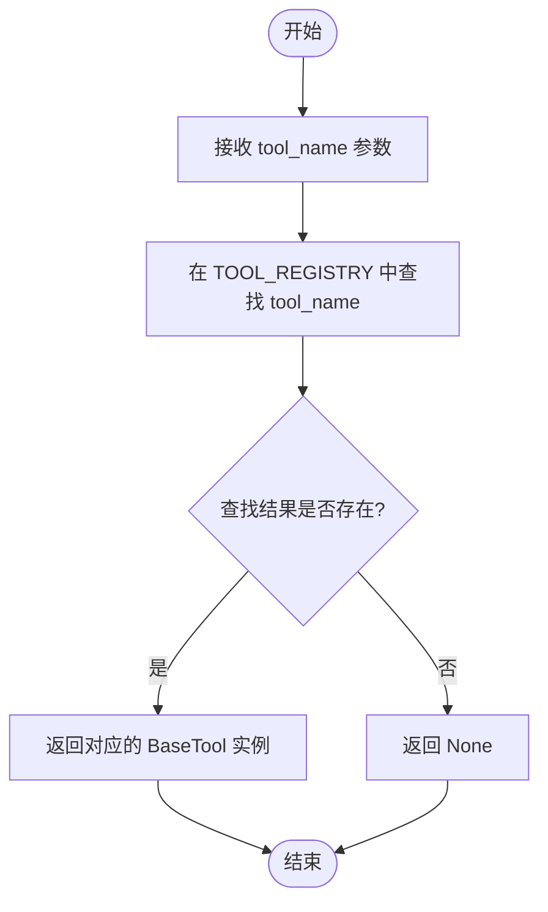
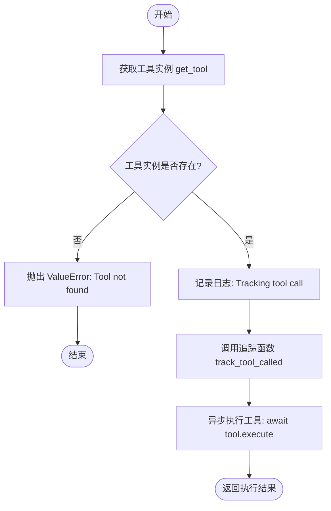
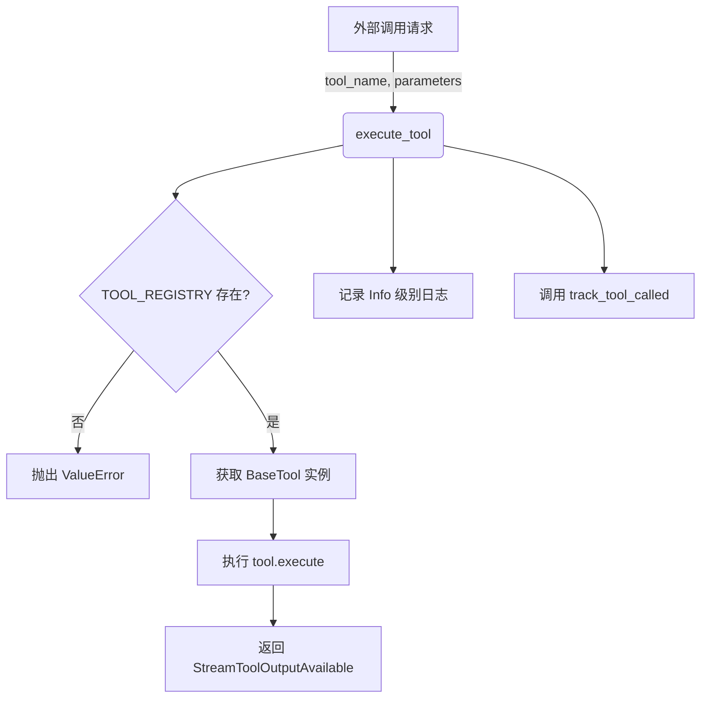

# `AutoGPT\autogpt_platform\backend\backend\api\features\chat\tools\__init__.py` 详细设计文档

该代码是AI Agent工具系统的核心注册与执行模块，负责初始化并维护所有工具实例的单一事实来源（TOOL_REGISTRY），生成兼容OpenAI API的工具定义列表，并提供了工具查找、异步执行以及调用行为追踪的统一入口。

## 整体流程



## 类结构

```
BaseTool (Imported Abstract Base)
├── AddUnderstandingTool
├── CreateAgentTool
├── CustomizeAgentTool
├── EditAgentTool
├── FindAgentTool
├── FindBlockTool
├── FindLibraryAgentTool
├── RunAgentTool
├── RunBlockTool
├── AgentOutputTool
├── SearchDocsTool
├── GetDocPageTool
├── ListWorkspaceFilesTool
├── ReadWorkspaceFileTool
├── WriteWorkspaceFileTool
└── DeleteWorkspaceFileTool
```

## 全局变量及字段


### `logger`
    
标准日志记录器实例，用于记录当前模块的运行信息和错误。

类型：`logging.Logger`
    


### `TOOL_REGISTRY`
    
所有可用工具的单一事实来源，将工具名称字符串映射到具体的 BaseTool 实例。

类型：`dict[str, BaseTool]`
    


### `find_agent_tool`
    
从注册表中提取的 FindAgentTool 实例，用于向后兼容性。

类型：`BaseTool`
    


### `run_agent_tool`
    
从注册表中提取的 RunAgentTool 实例，用于向后兼容性。

类型：`BaseTool`
    


### `tools`
    
根据注册表生成的、格式化为 OpenAI API 兼容参数的工具定义列表。

类型：`list[ChatCompletionToolParam]`
    


    

## 全局函数及方法


### `get_tool`

根据提供的工具名称，从全局工具注册表（TOOL_REGISTRY）中获取对应的工具实例。这是一个简单的工厂方法，用于按需检索预先注册的工具。

参数：

- `tool_name`：`str`，需要获取的工具的名称标识符，对应 TOOL_REGISTRY 中的键。

返回值：`BaseTool | None`，如果注册表中存在该名称，则返回对应的 BaseTool 实例；如果不存在，则返回 None。

#### 流程图



#### 带注释源码

```python
def get_tool(tool_name: str) -> BaseTool | None:
    """Get a tool instance by name."""
    # 使用字典的 get 方法尝试根据 tool_name 获取工具实例
    # 如果键不存在，默认返回 None
    return TOOL_REGISTRY.get(tool_name)
```


### `execute_tool`

该函数根据工具名称从注册表中获取对应的工具实例，在验证其存在性后，记录调用日志并通过追踪系统上报工具调用事件，最后使用提供的参数、用户上下文和会话信息异步执行该工具，返回执行结果。

参数：

-  `tool_name`：`str`，要执行的工具的名称，用于在注册表中查找对应的工具实例。
-  `parameters`：`dict[str, Any]`，执行工具所需的参数字典，将被解包传递给工具的执行方法。
-  `user_id`：`str | None`，发起工具调用的用户标识，用于权限控制或日志记录。
-  `session`：`ChatSession`，当前的聊天会话对象，包含会话状态和上下文信息。
-  `tool_call_id`：`str`，工具调用的唯一标识符，用于关联请求与响应及追踪。

返回值：`"StreamToolOutputAvailable"`，工具执行后返回的流式输出对象或结果（类型注解引用自 `StreamToolOutputAvailable`）。

#### 流程图



#### 带注释源码

```python
async def execute_tool(
    tool_name: str,
    parameters: dict[str, Any],
    user_id: str | None,
    session: ChatSession,
    tool_call_id: str,
) -> "StreamToolOutputAvailable":
    """Execute a tool by name."""
    # 1. 根据名称从全局注册表中获取工具实例
    tool = get_tool(tool_name)
    # 2. 检查工具是否存在，如果不存在则抛出异常
    if not tool:
        raise ValueError(f"Tool {tool_name} not found")

    # 3. 记录工具调用的日志信息，用于调试和监控
    logger.info(
        f"Tracking tool call: tool={tool_name}, user={user_id}, "
        f"session={session.session_id}, call_id={tool_call_id}"
    )
    # 4. 调用追踪函数（通常用于数据分析，如 PostHog），记录工具被调用的事件
    track_tool_called(
        user_id=user_id,
        session_id=session.session_id,
        tool_name=tool_name,
        tool_call_id=tool_call_id,
    )

    # 5. 异步执行具体的工具逻辑，并将参数字典解包作为关键字参数传入
    return await tool.execute(user_id, session, tool_call_id, **parameters)
```


## 关键组件


### TOOL_REGISTRY
该字典作为后端所有可用工具的单一事实来源，将工具名称（字符串）映射到其实例化的 `BaseTool` 对象，集中管理工具的生命周期和访问。

### 工具执行流 (`execute_tool`)
负责处理工具调用的核心逻辑组件，涵盖了工具实例获取、异常校验、日志记录、遥测追踪（PostHog）以及异步执行工具逻辑的完整流程。

### OpenAI 接口适配 (`tools`)
通过遍历注册表动态生成的工具列表，将内部自定义的 `BaseTool` 架构转换为 OpenAI API 兼容的 `ChatCompletionToolParam` 格式，以支持外部模型调用。

### 遥测与日志集成
集成在工具执行过程中的监控组件，通过 `track_tool_called` 函数和日志记录器捕获工具使用元数据（如用户 ID、会话 ID、工具调用 ID），用于系统监控和用户行为分析。


## 问题及建议


### 已知问题

-   **全局初始化导致导入开销及副作用**：代码在模块加载时立即实例化了所有工具类（例如 `AddUnderstandingTool()` 等），并将它们存入 `TOOL_REGISTRY`。如果工具类的构造函数涉及繁重的计算、数据库连接或文件 I/O，这将显著增加应用启动时间和模块导入延迟。
-   **扩展性受限（违反开闭原则）**：`TOOL_REGISTRY` 是一个硬编码的字典。每当需要添加新工具时，开发者必须修改此中央文件，增加了模块间的耦合度，不利于实现插件化架构或动态加载工具。
-   **“魔法字符串”导致的维护风险**：工具通过字符串名称（如 `"run_agent"`）进行索引和检索。这种方式缺乏编译时检查，容易因拼写错误导致运行时故障，且 IDE 难以提供有效的代码补全和重构支持。
-   **错误处理粒度不足**：`execute_tool` 函数仅处理了“工具未找到”的情况，未捕获工具执行逻辑（`tool.execute`）中可能抛出的具体业务异常。这导致异常传播链路不够清晰，上层调用者难以区分是系统错误、参数错误还是工具内部逻辑错误。
-   **全局变量冗余**：为了向后兼容导出了 `find_agent_tool` 和 `run_agent_tool`，这维护了多套访问同一对象的途径，增加了代码库的混乱度和维护成本。

### 优化建议

-   **实现延迟加载**：将 `TOOL_REGISTRY` 改为存储工具类或工厂函数，而非实例。仅在 `get_tool` 或 `execute_tool` 被调用时才实例化具体的工具对象，以减少应用启动时的资源消耗。
-   **引入装饰器注册机制**：设计一个装饰器（如 `@register_tool`），允许工具类在其自身定义的模块中自动注册到 `TOOL_REGISTRY`。这样可以实现工具的模块化，解耦中央注册逻辑，符合开闭原则。
-   **增强异常包装与上下文**：在 `execute_tool` 内部捕获 `tool.execute` 的所有异常，将其包装为统一的 `ToolExecutionError`（或类似自定义异常），并附加上下文信息（如 tool_name, session_id, parameters），便于上层统一处理和日志追踪。
-   **清理向后兼容代码**：建议移除直接导出实例的全局变量（如 `find_agent_tool`），统一使用 `get_tool("find_agent")` 或直接访问 `TOOL_REGISTRY` 的方式，保持接口的一致性和简洁性。
-   **增加类型常量**：定义一个 `Enum` 或常量类来管理工具名称字符串，替代代码中的硬编码字符串，提高代码的可读性和安全性。


## 其它


### 设计目标与约束

*   **集中化管理**：作为所有可用工具（Tool）的唯一事实来源，确保系统中工具定义的一致性，避免多处维护带来的同步问题。
*   **标准化接口**：所有注册的工具必须继承自 `BaseTool`，并实现 `as_openai_tool` 和 `execute` 方法，以满足 OpenAI API 调用格式及内部执行逻辑的统一契约。
*   **可观测性**：在工具执行前后集成日志记录与追踪（PostHog），确保每一次工具调用均可被审计和监控。
*   **异步执行**：支持异步工具执行（`async execute`），以适应高并发 IO 密集型场景，不阻塞主事件循环。
*   **向后兼容性**：虽然使用注册表模式，但仍需导出特定的工具实例（如 `find_agent_tool`），以兼容旧代码引用。

### 错误处理与异常设计

*   **工具查找失败**：当通过 `get_tool` 请求的工具名称不存在于 `TOOL_REGISTRY` 中时，`execute_tool` 函数将显式抛出 `ValueError`，中断执行链并向上传递错误信息。
*   **执行异常传播**：工具执行过程中发生的任何异常（由具体工具实现抛出）将直接透传给调用方，由上层逻辑（如 API 路由处理）决定如何捕获和转换错误码。
*   **日志记录**：在工具执行失败或查找失败前，`logger` 会记录关键上下文信息（如 user_id, session_id, tool_call_id），便于问题排查。

### 数据流与状态机

#### 数据流
1.  **初始化阶段**：模块加载时，实例化所有工具类并填充 `TOOL_REGISTRY`，同时生成 `tools` 列表供 OpenAI API 使用。
2.  **执行阶段**：
    *   外部请求调用 `execute_tool`，传入工具名、参数及会话上下文。
    *   系统在注册表中查找工具实例。
    *   系统调用 `track_tool_called` 发送遥测数据。
    *   系统调用具体工具的 `execute` 方法，传入参数。
    *   工具返回 `StreamToolOutputAvailable` 类型的结果。

#### Mermaid 数据流图


#### 状态机
该模块本身是无状态的。状态主要由 `ChatSession` 对象持有，具体工具的实现可能依赖或改变 `ChatSession` 中的状态。

### 外部依赖与接口契约

#### 外部依赖
*   **OpenAI Types**: 依赖 `openai.types.chat.ChatCompletionToolParam` 来定义符合 OpenAI 规范的工具 Schema。
*   **内部模块**:
    *   `backend.api.features.chat.model.ChatSession`: 提供聊天会话上下文。
    *   `backend.api.features.chat.tracking.track_tool_called`: 处理分析事件埋点。
*   **工具实现**: 依赖所有继承自 `BaseTool` 的具体工具类（如 `AddUnderstandingTool`, `RunAgentTool` 等）。

#### 接口契约
*   **`BaseTool` 子类契约**:
    *   必须实现 `as_openai_tool(self) -> ChatCompletionToolParam`：返回 OpenAI 兼容的函数定义。
    *   必须实现 `execute(self, user_id, session, tool_call_id, **parameters) -> StreamToolOutputAvailable`：处理具体的业务逻辑并返回流式输出结果。
*   **`execute_tool` 函数契约**:
    *   输入：必须包含 `tool_name` (str), `parameters` (dict), `user_id` (str|None), `session` (ChatSession), `tool_call_id` (str)。
    *   输出：返回类型必须为 `"StreamToolOutputAvailable"`（为了类型注解方便，使用了字符串形式的 Forward Reference）。

### 扩展性与维护性

*   **注册表模式**：新增工具无需修改 `execute_tool` 核心逻辑，只需创建新类并将其添加到 `TOOL_REGISTRY` 字典中即可，符合开闭原则。
*   **类型检查支持**：使用 `TYPE_CHECKING` 块导入复杂类型（如 `StreamToolOutputAvailable`），避免运行时的循环导入问题，同时保证 IDE 静态检查的准确性。
*   **向后兼容导出**：虽然推荐通过 `get_tool` 或 `TOOL_REGISTRY` 访问工具，但模块底部直接导出了 `find_agent_tool` 等实例，确保了重构过程中的平滑过渡。

### 安全性考量

*   **参数透传**：`execute_tool` 接收任意字典参数 `**parameters` 并传递给底层工具。安全性依赖于具体工具实现内部对参数的校验和清洗（如防止命令注入、路径遍历等），注册表层不做通用拦截。
*   **上下文隔离**：执行工具时强制传入 `user_id` 和 `session`，便于底层工具进行权限验证和数据隔离。

    