# `.\AutoGPT\autogpt_platform\backend\backend\api\features\chat\tools\_test_data.py` 详细设计文档

This file contains setup functions for testing various features of the backend system, including creating test users, graphs, and store submissions.

## 整体流程

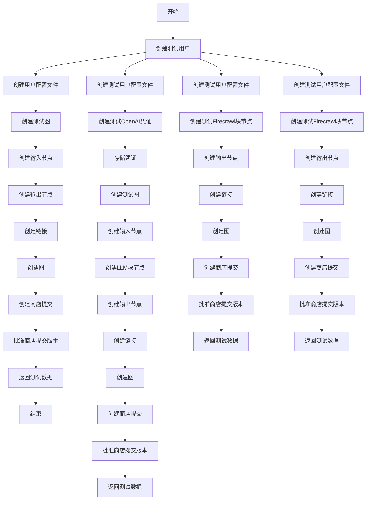

## 类结构

```
ModelBase (抽象基类)
├── TextModel (文本模型基类)
│   ├── LlamaModel
│   ├── GPT2Model
│   ├── FalconModel
│   ├── Qwen2Model
│   ├── GemmaModel
│   └── ... 
```

## 全局变量及字段


### `user_data`
    
Contains user data such as sub and email for creating a test user.

类型：`dict`
    


### `username`
    
Username derived from the user's email for creating a user profile.

类型：`str`
    


### `graph_id`
    
Unique identifier for a test graph.

类型：`str`
    


### `input_node_id`
    
Unique identifier for an input node in a test graph.

类型：`str`
    


### `output_node_id`
    
Unique identifier for an output node in a test graph.

类型：`str`
    


### `link`
    
Represents a connection between nodes in a graph.

类型：`Link`
    


### `created_graph`
    
Represents a created graph with nodes and links.

类型：`Graph`
    


### `unique_slug`
    
Unique identifier for a store submission to avoid constraint violations.

类型：`str`
    


### `store_submission`
    
Represents a store submission for an agent.

类型：`StoreSubmission`
    


### `credentials`
    
Represents API key credentials for an integration.

类型：`APIKeyCredentials`
    


### `creds_store`
    
Represents a credentials store for storing integration credentials.

类型：`IntegrationCredentialsStore`
    


### `input_block`
    
Represents an input block for an agent.

类型：`AgentInputBlock`
    


### `output_block`
    
Represents an output block for an agent.

类型：`AgentOutputBlock`
    


### `llm_block`
    
Represents an LLM block for generating text.

类型：`AITextGeneratorBlock`
    


### `firecrawl_block`
    
Represents a Firecrawl block for scraping websites.

类型：`FirecrawlScrapeBlock`
    


### `input_node`
    
Represents an input node in a graph.

类型：`Node`
    


### `output_node`
    
Represents an output node in a graph.

类型：`Node`
    


### `llm_node`
    
Represents an LLM node in a graph.

类型：`Node`
    


### `firecrawl_node`
    
Represents a Firecrawl node in a graph.

类型：`Node`
    


### `link1`
    
Represents a link between an input node and an LLM node in a graph.

类型：`Link`
    


### `link2`
    
Represents a link between an LLM node and an output node in a graph.

类型：`Link`
    


### `graph`
    
Represents a graph with nodes and links.

类型：`Graph`
    


### `store_submission`
    
Represents a store submission for an agent.

类型：`StoreSubmission`
    


### `reviewer_id`
    
Unique identifier for a reviewer of a store submission.

类型：`str`
    


### `ChatSession.session_id`
    
Unique identifier for a chat session.

类型：`str`
    


### `ChatSession.user_id`
    
Identifier for the user associated with the chat session.

类型：`str`
    


### `ChatSession.messages`
    
List of messages in the chat session.

类型：`list`
    


### `ChatSession.usage`
    
List of usage data for the chat session.

类型：`list`
    


### `ChatSession.started_at`
    
Timestamp when the chat session started.

类型：`datetime`
    


### `ChatSession.updated_at`
    
Timestamp when the chat session was last updated.

类型：`datetime`
    


### `ChatSession.successful_agent_runs`
    
Dictionary of successful agent runs in the chat session.

类型：`dict`
    


### `ChatSession.successful_agent_schedules`
    
Dictionary of successful agent schedules in the chat session.

类型：`dict`
    


### `Graph.id`
    
Unique identifier for a graph.

类型：`str`
    


### `Graph.version`
    
Version number of the graph.

类型：`int`
    


### `Graph.is_active`
    
Indicates whether the graph is active.

类型：`bool`
    


### `Graph.name`
    
Name of the graph.

类型：`str`
    


### `Graph.description`
    
Description of the graph.

类型：`str`
    


### `Graph.nodes`
    
List of nodes in the graph.

类型：`list`
    


### `Graph.links`
    
List of links in the graph.

类型：`list`
    


### `Node.id`
    
Unique identifier for a node.

类型：`str`
    


### `Node.block_id`
    
Identifier for the block associated with the node.

类型：`str`
    


### `Node.input_default`
    
Default input values for the node.

类型：`dict`
    


### `Node.metadata`
    
Metadata for the node's position and other properties.

类型：`dict`
    


### `Link.source_id`
    
Identifier for the source node of the link.

类型：`str`
    


### `Link.sink_id`
    
Identifier for the sink node of the link.

类型：`str`
    


### `Link.source_name`
    
Name of the source port of the link.

类型：`str`
    


### `Link.sink_name`
    
Name of the sink port of the link.

类型：`str`
    


### `Link.is_static`
    
Indicates whether the link is static.

类型：`bool`
    


### `APIKeyCredentials.id`
    
Unique identifier for API key credentials.

类型：`str`
    


### `APIKeyCredentials.provider`
    
Provider of the API key credentials.

类型：`str`
    


### `APIKeyCredentials.api_key`
    
API key for the integration.

类型：`SecretStr`
    


### `APIKeyCredentials.title`
    
Title of the API key credentials.

类型：`str`
    


### `APIKeyCredentials.expires_at`
    
Expiration timestamp for the API key credentials.

类型：`datetime`
    


### `ProfileCreateInput.userId`
    
Identifier for the user associated with the profile.

类型：`str`
    


### `ProfileCreateInput.username`
    
Username for the profile.

类型：`str`
    


### `ProfileCreateInput.name`
    
Name of the profile.

类型：`str`
    


### `ProfileCreateInput.description`
    
Description of the profile.

类型：`str`
    


### `ProfileCreateInput.links`
    
List of links associated with the profile.

类型：`list`
    
    

## 全局函数及方法


### make_session

创建一个新的聊天会话实例。

参数：

- `user_id`：`str`，用户ID，用于标识创建会话的用户。

返回值：`ChatSession`，新的聊天会话实例。

#### 流程图

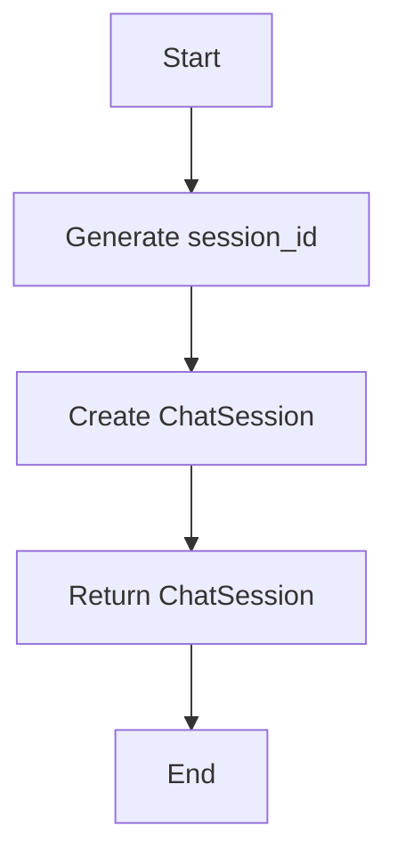

#### 带注释源码

```python
def make_session(user_id: str):
    # Generate a unique session ID using UUID
    session_id = str(uuid.uuid4())
    
    # Create a new ChatSession instance with the provided user ID
    return ChatSession(
        session_id=session_id,
        user_id=user_id,
        messages=[],
        usage=[],
        started_at=datetime.now(UTC),
        updated_at=datetime.now(UTC),
        successful_agent_runs={},
        successful_agent_schedules={},
    )
```


### setup_test_data

This function sets up test data for the `run_agent` tests by creating a user, a graph, a store listing, and approving the store listing version.

参数：

- 无

返回值：`dict`，包含用户、图和商店提交的信息

#### 流程图

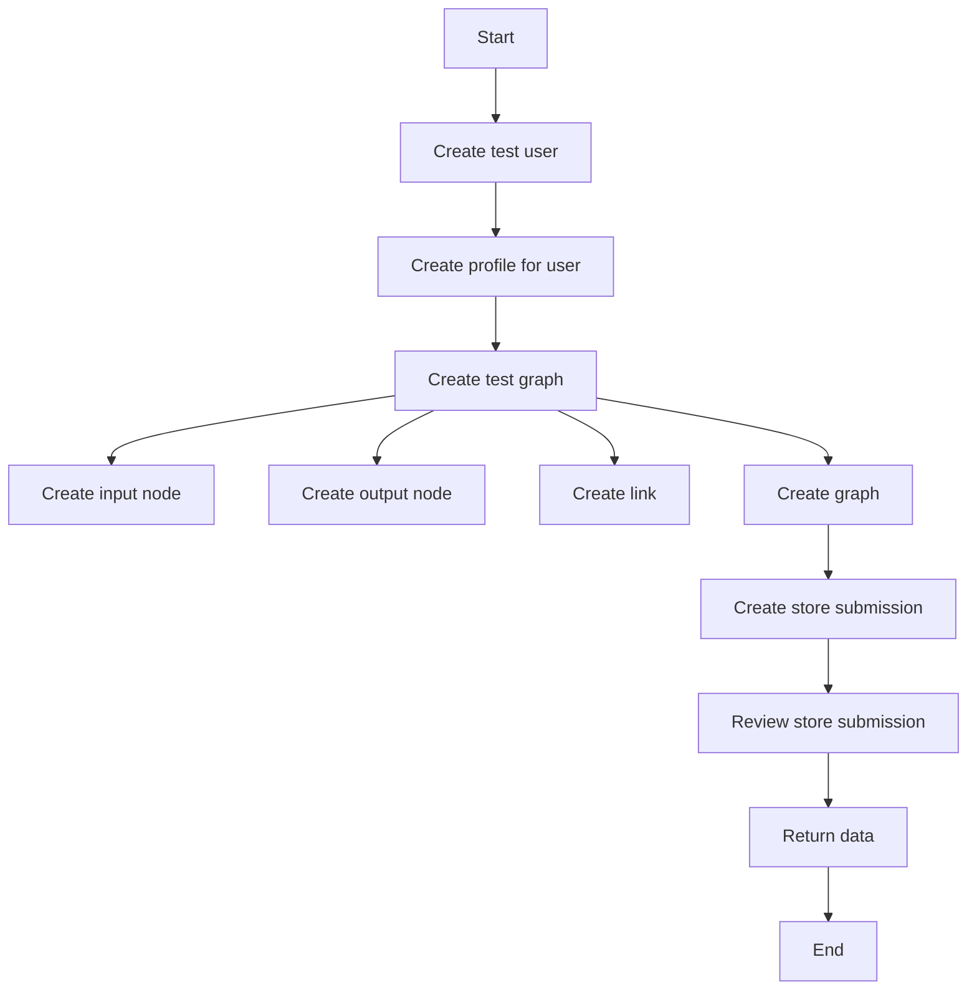

#### 带注释源码

```python
@pytest.fixture(scope="session")
async def setup_test_data():
    """
    Set up test data for run_agent tests:
    1. Create a test user
    2. Create a test graph (agent input -> agent output)
    3. Create a store listing and store listing version
    4. Approve the store listing version
    """
    # 1. Create a test user
    user_data = {
        "sub": f"test-user-{uuid.uuid4()}",
        "email": f"test-{uuid.uuid4()}@example.com",
    }
    user = await get_or_create_user(user_data)

    # 1b. Create a profile with username for the user (required for store agent lookup)
    username = user.email.split("@")[0]
    await prisma.profile.create(
        data=ProfileCreateInput(
            userId=user.id,
            username=username,
            name=f"Test User {username}",
            description="Test user profile",
            links=[],  # Required field - empty array for test profiles
        )
    )

    # 2. Create a test graph with agent input -> agent output
    graph_id = str(uuid.uuid4())

    # Create input node
    input_node_id = str(uuid.uuid4())
    input_block = AgentInputBlock()
    input_node = Node(
        id=input_node_id,
        block_id=input_block.id,
        input_default={
            "name": "test_input",
            "title": "Test Input",
            "value": "",
            "advanced": False,
            "description": "Test input field",
            "placeholder_values": [],
        },
        metadata={"position": {"x": 0, "y": 0}},
    )

    # Create output node
    output_node_id = str(uuid.uuid4())
    output_block = AgentOutputBlock()
    output_node = Node(
        id=output_node_id,
        block_id=output_block.id,
        input_default={
            "name": "test_output",
            "title": "Test Output",
            "value": "",
            "format": "",
            "advanced": False,
            "description": "Test output field",
        },
        metadata={"position": {"x": 200, "y": 0}},
    )

    # Create link from input to output
    link = Link(
        source_id=input_node_id,
        sink_id=output_node_id,
        source_name="result",
        sink_name="value",
        is_static=True,
    )

    # Create the graph
    graph = Graph(
        id=graph_id,
        version=1,
        is_active=True,
        name="Test Agent",
        description="A simple test agent for testing",
        nodes=[input_node, output_node],
        links=[link],
    )

    created_graph = await create_graph(graph, user.id)

    # 3. Create a store listing and store listing version for the agent
    # Use unique slug to avoid constraint violations
    unique_slug = f"test-agent-{str(uuid.uuid4())[:8]}"
    store_submission = await store_db.create_store_submission(
        user_id=user.id,
        agent_id=created_graph.id,
        agent_version=created_graph.version,
        slug=unique_slug,
        name="Test Agent",
        description="A simple test agent",
        sub_heading="Test agent for unit tests",
        categories=["testing"],
        image_urls=["https://example.com/image.jpg"],
    )

    assert store_submission.store_listing_version_id is not None
    # 4. Approve the store listing version
    await store_db.review_store_submission(
        store_listing_version_id=store_submission.store_listing_version_id,
        is_approved=True,
        external_comments="Approved for testing",
        internal_comments="Test approval",
        reviewer_id=user.id,
    )

    return {
        "user": user,
        "graph": created_graph,
        "store_submission": store_submission,
    }
```


### setup_llm_test_data

This function sets up test data for LLM (Language Learning Model) agent tests.

参数：

- 无

返回值：`pytest.fixture`，用于在测试中提供测试数据

#### 流程图

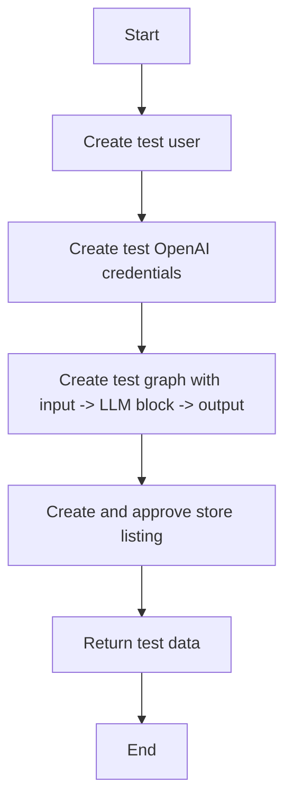

#### 带注释源码

```python
@pytest.fixture(scope="session")
async def setup_llm_test_data():
    """
    Set up test data for LLM agent tests:
    1. Create a test user
    2. Create test OpenAI credentials for the user
    3. Create a test graph with input -> LLM block -> output
    4. Create and approve a store listing
    """
    key = getenv("OPENAI_API_KEY")
    if not key:
        return pytest.skip("OPENAI_API_KEY is not set")

    # 1. Create a test user
    user_data = {
        "sub": f"test-user-{uuid.uuid4()}",
        "email": f"test-{uuid.uuid4()}@example.com",
    }
    user = await get_or_create_user(user_data)

    # 1b. Create a profile with username for the user (required for store agent lookup)
    username = user.email.split("@")[0]
    await prisma.profile.create(
        data=ProfileCreateInput(
            userId=user.id,
            username=username,
            name=f"Test User {username}",
            description="Test user profile for LLM tests",
            links=[],  # Required field - empty array for test profiles
        )
    )

    # 2. Create test OpenAI credentials for the user
    credentials = APIKeyCredentials(
        id=str(uuid.uuid4()),
        provider="openai",
        api_key=SecretStr("test-openai-api-key"),
        title="Test OpenAI API Key",
        expires_at=None,
    )

    # Store the credentials
    creds_store = IntegrationCredentialsStore()
    await creds_store.add_creds(user.id, credentials)

    # 3. Create a test graph with input -> LLM block -> output
    graph_id = str(uuid.uuid4())

    # Create input node for the prompt
    input_node_id = str(uuid.uuid4())
    input_block = AgentInputBlock()
    input_node = Node(
        id=input_node_id,
        block_id=input_block.id,
        input_default={
            "name": "user_prompt",
            "title": "User Prompt",
            "value": "",
            "advanced": False,
            "description": "Prompt for the LLM",
            "placeholder_values": [],
        },
        metadata={"position": {"x": 0, "y": 0}},
    )

    # Create LLM block node
    llm_node_id = str(uuid.uuid4())
    llm_block = AITextGeneratorBlock()
    llm_node = Node(
        id=llm_node_id,
        block_id=llm_block.id,
        input_default={
            "model": "gpt-4o-mini",
            "sys_prompt": "You are a helpful assistant.",
            "retry": 3,
            "prompt_values": {},
            "credentials": {
                "provider": "openai",
                "id": credentials.id,
                "type": "api_key",
                "title": credentials.title,
            },
        },
        metadata={"position": {"x": 300, "y": 0}},
    )

    # Create output node
    output_node_id = str(uuid.uuid4())
    output_block = AgentOutputBlock()
    output_node = Node(
        id=output_node_id,
        block_id=output_block.id,
        input_default={
            "name": "llm_response",
            "title": "LLM Response",
            "value": "",
            "format": "",
            "advanced": False,
            "description": "Response from the LLM",
        },
        metadata={"position": {"x": 600, "y": 0}},
    )

    # Create links
    # Link input.result -> llm.prompt
    link1 = Link(
        source_id=input_node_id,
        sink_id=llm_node_id,
        source_name="result",
        sink_name="prompt",
        is_static=True,
    )

    # Link llm.response -> output.value
    link2 = Link(
        source_id=llm_node_id,
        sink_id=output_node_id,
        source_name="response",
        sink_name="value",
        is_static=False,
    )

    # Create the graph
    graph = Graph(
        id=graph_id,
        version=1,
        is_active=True,
        name="LLM Test Agent",
        description="An agent that uses an LLM to process text",
        nodes=[input_node, llm_node, output_node],
        links=[link1, link2],
    )

    created_graph = await create_graph(graph, user.id)

    # 4. Create and approve a store listing
    unique_slug = f"llm-test-agent-{str(uuid.uuid4())[:8]}"
    store_submission = await store_db.create_store_submission(
        user_id=user.id,
        agent_id=created_graph.id,
        agent_version=created_graph.version,
        slug=unique_slug,
        name="LLM Test Agent",
        description="An agent with LLM capabilities",
        sub_heading="Test agent with OpenAI integration",
        categories=["testing", "ai"],
        image_urls=["https://example.com/image.jpg"],
    )
    assert store_submission.store_listing_version_id is not None
    await store_db.review_store_submission(
        store_listing_version_id=store_submission.store_listing_version_id,
        is_approved=True,
        external_comments="Approved for testing",
        internal_comments="Test approval for LLM agent",
        reviewer_id=user.id,
    )

    return {
        "user": user,
        "graph": created_graph,
        "credentials": credentials,
        "store_submission": store_submission,
    }
``` 


### `setup_firecrawl_test_data`

This function sets up test data for Firecrawl agent tests, specifically for scenarios where Firecrawl credentials are missing.

参数：

- 无

返回值：`None`，This function does not return any value but sets up the necessary test data.

#### 流程图

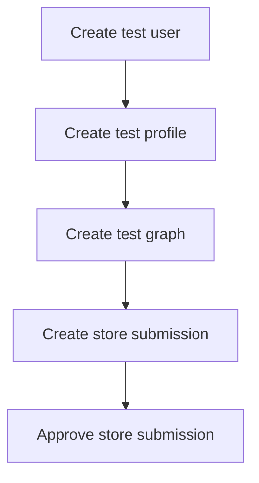

#### 带注释源码

```python
@pytest.fixture(scope="session")
async def setup_firecrawl_test_data():
    """
    Set up test data for Firecrawl agent tests (missing credentials scenario):
    1. Create a test user (WITHOUT Firecrawl credentials)
    2. Create a test graph with input -> Firecrawl block -> output
    3. Create and approve a store listing
    """
    # 1. Create a test user
    user_data = {
        "sub": f"test-user-{uuid.uuid4()}",
        "email": f"test-{uuid.uuid4()}@example.com",
    }
    user = await get_or_create_user(user_data)

    # 1b. Create a profile with username for the user (required for store agent lookup)
    username = user.email.split("@")[0]
    await prisma.profile.create(
        data=ProfileCreateInput(
            userId=user.id,
            username=username,
            name=f"Test User {username}",
            description="Test user profile for Firecrawl tests",
            links=[],  # Required field - empty array for test profiles
        )
    )

    # NOTE: We deliberately do NOT create Firecrawl credentials for this user
    # This tests the scenario where required credentials are missing

    # 2. Create a test graph with input -> Firecrawl block -> output
    graph_id = str(uuid.uuid4())

    # Create input node for the URL
    input_node_id = str(uuid.uuid4())
    input_block = AgentInputBlock()
    input_node = Node(
        id=input_node_id,
        block_id=input_block.id,
        input_default={
            "name": "url",
            "title": "URL to Scrape",
            "value": "",
            "advanced": False,
            "description": "URL for Firecrawl to scrape",
            "placeholder_values": [],
        },
        metadata={"position": {"x": 0, "y": 0}},
    )

    # Create Firecrawl block node
    firecrawl_node_id = str(uuid.uuid4())
    firecrawl_block = FirecrawlScrapeBlock()
    firecrawl_node = Node(
        id=firecrawl_node_id,
        block_id=firecrawl_block.id,
        input_default={
            "limit": 10,
            "only_main_content": True,
            "max_age": 3600000,
            "wait_for": 200,
            "formats": ["markdown"],
            "credentials": {
                "provider": "firecrawl",
                "id": "test-firecrawl-id",
                "type": "api_key",
                "title": "Firecrawl API Key",
            },
        },
        metadata={"position": {"x": 300, "y": 0}},
    )

    # Create output node
    output_node_id = str(uuid.uuid4())
    output_block = AgentOutputBlock()
    output_node = Node(
        id=output_node_id,
        block_id=output_block.id,
        input_default={
            "name": "scraped_data",
            "title": "Scraped Data",
            "value": "",
            "format": "",
            "advanced": False,
            "description": "Data scraped by Firecrawl",
        },
        metadata={"position": {"x": 600, "y": 0}},
    )

    # Create links
    # Link input.result -> firecrawl.url
    link1 = Link(
        source_id=input_node_id,
        sink_id=firecrawl_node_id,
        source_name="result",
        sink_name="url",
        is_static=True,
    )

    # Link firecrawl.markdown -> output.value
    link2 = Link(
        source_id=firecrawl_node_id,
        sink_id=output_node_id,
        source_name="markdown",
        sink_name="value",
        is_static=False,
    )

    # Create the graph
    graph = Graph(
        id=graph_id,
        version=1,
        is_active=True,
        name="Firecrawl Test Agent",
        description="An agent that uses Firecrawl to scrape websites",
        nodes=[input_node, firecrawl_node, output_node],
        links=[link1, link2],
    )

    created_graph = await create_graph(graph, user.id)

    # 3. Create and approve a store listing
    unique_slug = f"firecrawl-test-agent-{str(uuid.uuid4())[:8]}"
    store_submission = await store_db.create_store_submission(
        user_id=user.id,
        agent_id=created_graph.id,
        agent_version=created_graph.version,
        slug=unique_slug,
        name="Firecrawl Test Agent",
        description="An agent with Firecrawl integration (no credentials)",
        sub_heading="Test agent requiring Firecrawl credentials",
        categories=["testing", "scraping"],
        image_urls=["https://example.com/image.jpg"],
    )
    assert store_submission.store_listing_version_id is not None
    await store_db.review_store_submission(
        store_listing_version_id=store_submission.store_listing_version_id,
        is_approved=True,
        external_comments="Approved for testing",
        internal_comments="Test approval for Firecrawl agent",
        reviewer_id=user.id,
    )

    return {
        "user": user,
        "graph": created_graph,
        "store_submission": store_submission,
    }
``` 


### `setup_test_data`

This fixture sets up test data for the `run_agent` tests by creating a user, a graph, a store listing, and approving the store listing version.

参数：

- `scope`: `session`，Indicates that the fixture is scoped to the session and is created once per test session.

返回值：`dict`，A dictionary containing the user, graph, and store submission created during setup.

#### 流程图

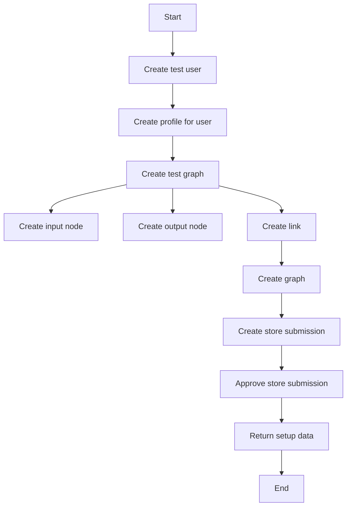

#### 带注释源码

```python
@pytest.fixture(scope="session")
async def setup_test_data():
    """
    Set up test data for run_agent tests:
    1. Create a test user
    2. Create a test graph (agent input -> agent output)
    3. Create a store listing and store listing version
    4. Approve the store listing version
    """
    # 1. Create a test user
    user_data = {
        "sub": f"test-user-{uuid.uuid4()}",
        "email": f"test-{uuid.uuid4()}@example.com",
    }
    user = await get_or_create_user(user_data)

    # 1b. Create a profile with username for the user (required for store agent lookup)
    username = user.email.split("@")[0]
    await prisma.profile.create(
        data=ProfileCreateInput(
            userId=user.id,
            username=username,
            name=f"Test User {username}",
            description="Test user profile",
            links=[],  # Required field - empty array for test profiles
        )
    )

    # 2. Create a test graph with agent input -> agent output
    graph_id = str(uuid.uuid4())

    # Create input node
    input_node_id = str(uuid.uuid4())
    input_block = AgentInputBlock()
    input_node = Node(
        id=input_node_id,
        block_id=input_block.id,
        input_default={
            "name": "test_input",
            "title": "Test Input",
            "value": "",
            "advanced": False,
            "description": "Test input field",
            "placeholder_values": [],
        },
        metadata={"position": {"x": 0, "y": 0}},
    )

    # Create output node
    output_node_id = str(uuid.uuid4())
    output_block = AgentOutputBlock()
    output_node = Node(
        id=output_node_id,
        block_id=output_block.id,
        input_default={
            "name": "test_output",
            "title": "Test Output",
            "value": "",
            "format": "",
            "advanced": False,
            "description": "Test output field",
        },
        metadata={"position": {"x": 200, "y": 0}},
    )

    # Create link from input to output
    link = Link(
        source_id=input_node_id,
        sink_id=output_node_id,
        source_name="result",
        sink_name="value",
        is_static=True,
    )

    # Create the graph
    graph = Graph(
        id=graph_id,
        version=1,
        is_active=True,
        name="Test Agent",
        description="A simple test agent for testing",
        nodes=[input_node, output_node],
        links=[link],
    )

    created_graph = await create_graph(graph, user.id)

    # 3. Create a store listing and store listing version for the agent
    # Use unique slug to avoid constraint violations
    unique_slug = f"test-agent-{str(uuid.uuid4())[:8]}"
    store_submission = await store_db.create_store_submission(
        user_id=user.id,
        agent_id=created_graph.id,
        agent_version=created_graph.version,
        slug=unique_slug,
        name="Test Agent",
        description="A simple test agent",
        sub_heading="Test agent for unit tests",
        categories=["testing"],
        image_urls=["https://example.com/image.jpg"],
    )

    assert store_submission.store_listing_version_id is not None
    # 4. Approve the store listing version
    await store_db.review_store_submission(
        store_listing_version_id=store_submission.store_listing_version_id,
        is_approved=True,
        external_comments="Approved for testing",
        internal_comments="Test approval",
        reviewer_id=user.id,
    )

    return {
        "user": user,
        "graph": created_graph,
        "store_submission": store_submission,
    }
```


### `make_session`

创建一个新的聊天会话实例。

参数：

- `user_id`：`str`，用户ID，用于标识创建的会话属于哪个用户。

返回值：`ChatSession`，一个聊天会话实例。

#### 流程图

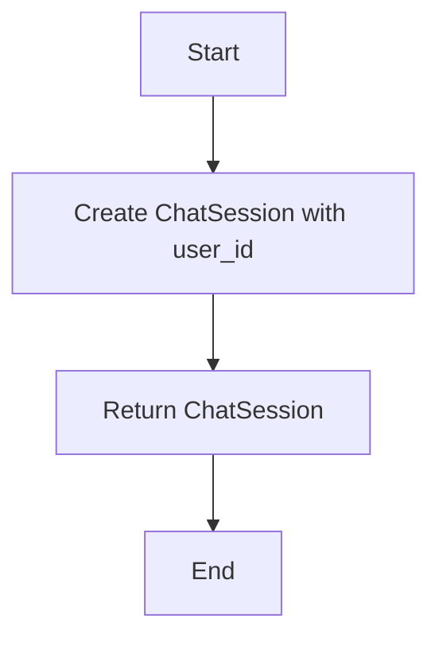

#### 带注释源码

```python
def make_session(user_id: str):
    return ChatSession(
        session_id=str(uuid.uuid4()),
        user_id=user_id,
        messages=[],
        usage=[],
        started_at=datetime.now(UTC),
        updated_at=datetime.now(UTC),
        successful_agent_runs={},
        successful_agent_schedules={},
    )
```


### `add_creds`

`IntegrationCredentialsStore.add_creds`

参数：

- `user_id`：`str`，用户ID，用于标识要添加凭证的用户
- `credentials`：`APIKeyCredentials`，API凭证对象，包含凭证的详细信息

返回值：`None`，无返回值，函数执行成功后不返回任何值

#### 流程图

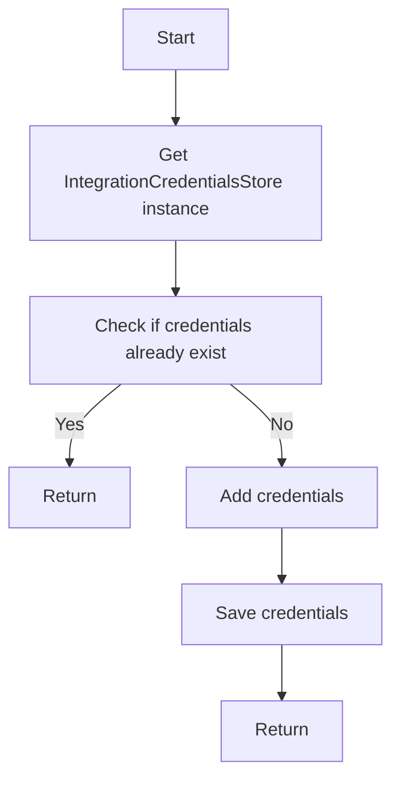

#### 带注释源码

```python
from backend.integrations.credentials_store import IntegrationCredentialsStore

async def add_creds(user_id: str, credentials: APIKeyCredentials):
    creds_store = IntegrationCredentialsStore()
    if await creds_store.creds_exists(user_id, credentials.provider):
        return  # Credentials already exist, do nothing
    await creds_store.save_credentials(user_id, credentials)
```


### `store_db.create_store_submission`

创建一个新的商店提交记录。

参数：

- `user_id`：`str`，用户ID，标识提交者。
- `agent_id`：`str`，代理ID，标识提交的代理。
- `agent_version`：`int`，代理版本，标识提交的代理版本。
- `slug`：`str`，别名，用于唯一标识商店提交。
- `name`：`str`，名称，商店提交的名称。
- `description`：`str`，描述，商店提交的描述。
- `sub_heading`：`str`，副标题，商店提交的副标题。
- `categories`：`list`，分类，商店提交的分类列表。
- `image_urls`：`list`，图片URLs，商店提交的图片URL列表。

返回值：`StoreSubmission`，商店提交记录。

#### 流程图

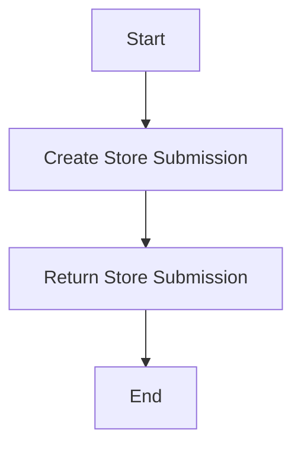

#### 带注释源码

```python
async def create_store_submission(
    user_id: str,
    agent_id: str,
    agent_version: int,
    slug: str,
    name: str,
    description: str,
    sub_heading: str,
    categories: list,
    image_urls: list,
) -> StoreSubmission:
    # Create a new store submission in the database
    submission = await prisma.store_submission.create(
        data={
            "user": {"connect": {"id": user_id}},
            "agent": {"connect": {"id": agent_id}},
            "agentVersion": agent_version,
            "slug": slug,
            "name": name,
            "description": description,
            "subHeading": sub_heading,
            "categories": {"set": categories},
            "imageUrls": {"set": image_urls},
        }
    )
    return submission
```


### review_store_submission

This function reviews a store submission, updating its status based on the approval status provided.

参数：

- `store_listing_version_id`: `str`，The unique identifier of the store listing version to be reviewed.
- `is_approved`: `bool`，Whether the store listing version is approved or not.
- `external_comments`: `str`，Comments for external stakeholders.
- `internal_comments`: `str`，Comments for internal use.
- `reviewer_id`: `str`，The unique identifier of the reviewer.

返回值：`None`，This function does not return a value.

#### 流程图

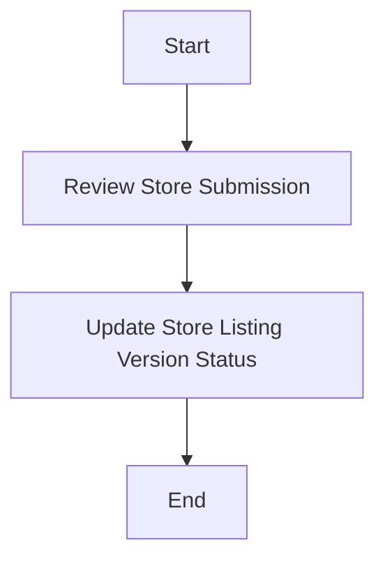

#### 带注释源码

```python
async def review_store_submission(
    store_listing_version_id: str,
    is_approved: bool,
    external_comments: str,
    internal_comments: str,
    reviewer_id: str,
):
    """
    Reviews a store submission, updating its status based on the approval status provided.

    :param store_listing_version_id: The unique identifier of the store listing version to be reviewed.
    :param is_approved: Whether the store listing version is approved or not.
    :param external_comments: Comments for external stakeholders.
    :param internal_comments: Comments for internal use.
    :param reviewer_id: The unique identifier of the reviewer.
    """
    await store_db.update_store_listing_version(
        id=store_listing_version_id,
        data={
            "is_approved": is_approved,
            "external_comments": external_comments,
            "internal_comments": internal_comments,
            "reviewer_id": reviewer_id,
        }
    )
```


### `create_graph`

创建一个新的图实例并将其存储到数据库中。

参数：

- `graph`：`Graph`，要创建的图实例
- `user_id`：`str`，创建图的用户ID

返回值：`Graph`，创建的图实例

#### 流程图

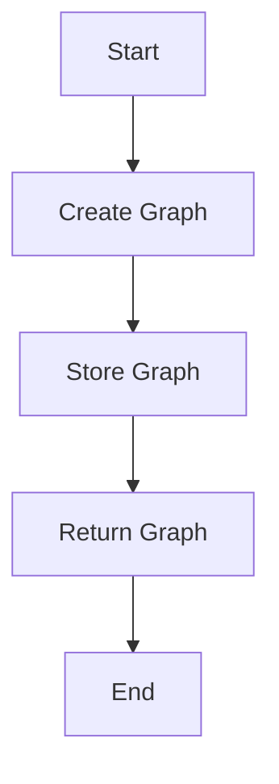

#### 带注释源码

```python
from backend.data.db import prisma

async def create_graph(graph: Graph, user_id: str) -> Graph:
    """
    Create a new graph instance and store it in the database.

    :param graph: The graph instance to create.
    :param user_id: The user ID for the graph.
    :return: The created graph instance.
    """
    created_graph = await prisma.graph.create(
        data={
            "id": graph.id,
            "version": graph.version,
            "is_active": graph.is_active,
            "name": graph.name,
            "description": graph.description,
            "nodes": {
                "connect": [node.dict() for node in graph.nodes],
            },
            "links": {
                "connect": [link.dict() for link in graph.links],
            },
            "userId": user_id,
        }
    )
    return created_graph
```


### `get_or_create_user`

该函数用于获取或创建一个用户，如果用户已存在则返回该用户，如果不存在则创建一个新的用户并返回。

参数：

- `user_data`：`dict`，包含用户信息的字典，如用户名、电子邮件等。

返回值：`User`，`User`对象，表示获取或创建的用户。

#### 流程图

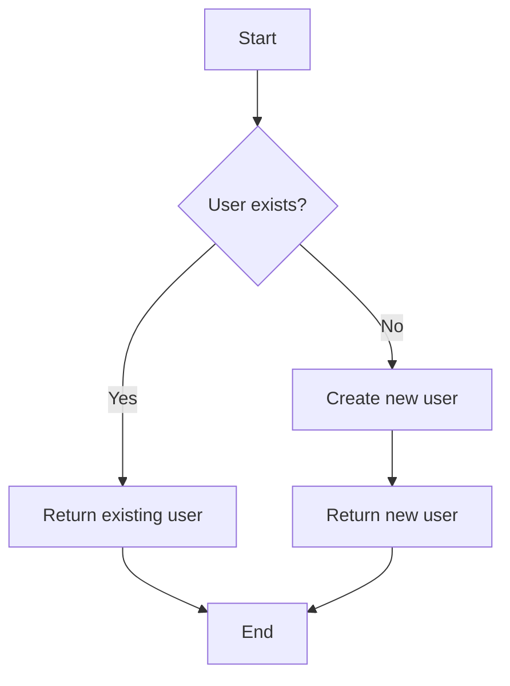

#### 带注释源码

```python
async def get_or_create_user(user_data: dict) -> User:
    # Check if user already exists
    user = await prisma.user.find_first(
        where={"email": user_data["email"]}
    )
    if user:
        return user

    # Create a new user
    user = await prisma.user.create(
        data={
            "email": user_data["email"],
            "name": user_data.get("name", ""),
            "password": user_data.get("password", ""),
            # ... other fields
        }
    )
    return user
```


### ChatSession.__init__

初始化一个ChatSession对象。

参数：

- `session_id`：`str`，会话的唯一标识符。
- `user_id`：`str`，用户的唯一标识符。
- `messages`：`list`，会话中的消息列表。
- `usage`：`list`，会话的使用记录。
- `started_at`：`datetime`，会话开始的时间。
- `updated_at`：`datetime`，会话最后更新时间。
- `successful_agent_runs`：`dict`，成功的代理运行记录。
- `successful_agent_schedules`：`dict`，成功的代理调度记录。

返回值：无

#### 流程图

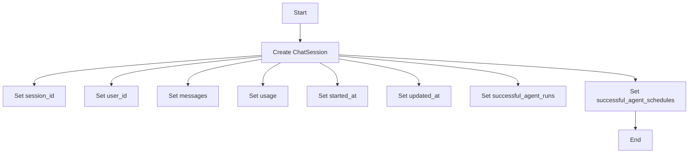

#### 带注释源码

```python
class ChatSession:
    def __init__(self, session_id: str, user_id: str, messages: list, usage: list,
                 started_at: datetime, updated_at: datetime,
                 successful_agent_runs: dict, successful_agent_schedules: dict):
        self.session_id = session_id
        self.user_id = user_id
        self.messages = messages
        self.usage = usage
        self.started_at = started_at
        self.updated_at = updated_at
        self.successful_agent_runs = successful_agent_runs
        self.successful_agent_schedules = successful_agent_schedules
```


### ChatSession.__repr__

The `__repr__` method of the `ChatSession` class provides a string representation of an instance of the `ChatSession` class, which includes the session ID, user ID, and timestamps for when the session was started and last updated.

参数：

- `self`：`ChatSession`，表示当前实例

返回值：`str`，返回一个字符串，包含实例的详细信息

#### 流程图

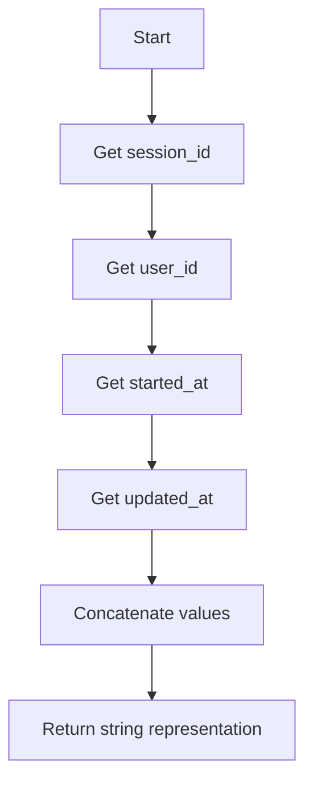

#### 带注释源码

```python
class ChatSession:
    # ... (其他类字段和方法)

    def __repr__(self):
        """
        Return a string representation of the ChatSession instance.
        """
        return f"ChatSession(session_id={self.session_id}, user_id={self.user_id}, started_at={self.started_at}, updated_at={self.updated_at})"
```


### Graph.__init__

Graph 类的构造函数。

{描述}

参数：

- `id`：`str`，图标的唯一标识符。
- `version`：`int`，图的版本号。
- `is_active`：`bool`，指示图是否处于活动状态。
- `name`：`str`，图的名称。
- `description`：`str`，图的描述。
- `nodes`：`list`，图中的节点列表。
- `links`：`list`，图中的链接列表。

返回值：无

#### 流程图

```mermaid
classDiagram
    Graph <|-- Node
    Graph <|-- Link
    Graph {
        id: str
        version: int
        is_active: bool
        name: str
        description: str
        nodes: list<Node>
        links: list<Link>
    }
    Node {
        id: str
        block_id: str
        input_default: dict
        metadata: dict
    }
    Link {
        source_id: str
        sink_id: str
        source_name: str
        sink_name: str
        is_static: bool
    }
```

#### 带注释源码

```python
class Graph:
    def __init__(self, id: str, version: int, is_active: bool, name: str, description: str, nodes: list, links: list):
        self.id = id
        self.version = version
        self.is_active = is_active
        self.name = name
        self.description = description
        self.nodes = nodes
        self.links = links
```


### Graph.__repr__

Graph类的`__repr__`方法用于返回Graph对象的字符串表示形式。

参数：

- 无

返回值：`str`，Graph对象的字符串表示形式，包含Graph的ID、版本、是否激活、名称和描述。

#### 流程图


#### 带注释源码

```python
class Graph:
    # ... (其他类字段和方法)

    def __repr__(self):
        return f"Graph(id={self.id}, version={self.version}, is_active={self.is_active}, name={self.name}, description={self.description})"
```


### Node.__init__

初始化Node对象。

参数：

- `id`：`str`，节点的唯一标识符。
- `block_id`：`str`，节点所属块的唯一标识符。
- `input_default`：`dict`，节点的默认输入参数。
- `metadata`：`dict`，节点的元数据，包括位置信息。

返回值：无

#### 流程图

```mermaid
classDiagram
    Node <|-- Node
    Node {
        id
        block_id
        input_default
        metadata
    }
```

#### 带注释源码

```python
class Node:
    def __init__(self, id: str, block_id: str, input_default: dict, metadata: dict):
        self.id = id
        self.block_id = block_id
        self.input_default = input_default
        self.metadata = metadata
```


### Node.__repr__

The `__repr__` method is a special method in Python that returns a string representation of an object. It is used primarily for debugging and logging purposes.

参数：

- 无

返回值：`str`，返回一个字符串，表示该节点的详细信息。

#### 流程图

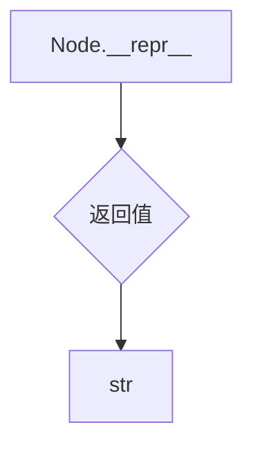

#### 带注释源码

```python
class Node:
    # ... (其他类字段和方法)

    def __repr__(self):
        return f"Node(id={self.id}, block_id={self.block_id}, input_default={self.input_default}, metadata={self.metadata})"
```


### `Link.__init__`

初始化一个链接对象。

参数：

- `source_id`：`str`，源节点的ID。
- `sink_id`：`str`，目标节点的ID。
- `source_name`：`str`，源节点在链接中的名称。
- `sink_name`：`str`，目标节点在链接中的名称。
- `is_static`：`bool`，表示链接是否是静态的。

返回值：无

#### 流程图

```mermaid
classDiagram
    Link <|-- Node
    Link {
        +source_id: str
        +sink_id: str
        +source_name: str
        +sink_name: str
        +is_static: bool
    }
    Node {
        +id: str
        +block_id: str
        +input_default: dict
        +metadata: dict
    }
    Link +-- Node : source_id
    Link +-- Node : sink_id
```

#### 带注释源码

```python
class Link:
    def __init__(self, source_id: str, sink_id: str, source_name: str, sink_name: str, is_static: bool):
        self.source_id = source_id
        self.sink_id = sink_id
        self.source_name = source_name
        self.sink_name = sink_name
        self.is_static = is_static
```


### Link.__repr__

This method provides a string representation of a Link object.

参数：

- `self`：`Link`，The Link object itself.

返回值：`str`，A string representation of the Link object.

#### 流程图

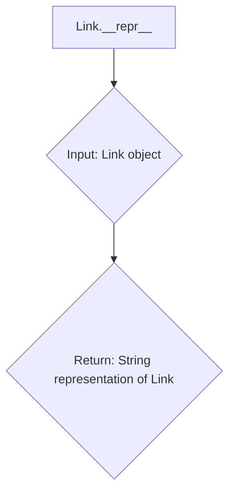

#### 带注释源码

```python
class Link:
    # ... (Other class methods and fields)

    def __repr__(self):
        """
        Return a string representation of the Link object.
        """
        return f"Link(source_id='{self.source_id}', sink_id='{self.sink_id}', source_name='{self.source_name}', sink_name='{self.sink_name}', is_static={self.is_static})"
```


### APIKeyCredentials.__init__

初始化APIKeyCredentials对象。

参数：

- `id`：`str`，API密钥的唯一标识符。
- `provider`：`str`，API密钥提供者的名称。
- `api_key`：`SecretStr`，API密钥的值，使用pydantic的SecretStr来保护敏感信息。
- `title`：`str`，API密钥的标题。
- `expires_at`：`datetime`，API密钥过期的时间。

返回值：无

#### 流程图

```mermaid
graph TD
    A[Start] --> B[Create APIKeyCredentials object]
    B --> C[Set id]
    B --> D[Set provider]
    B --> E[Set api_key]
    B --> F[Set title]
    B --> G[Set expires_at]
    G --> H[End]
```

#### 带注释源码

```python
class APIKeyCredentials:
    def __init__(self, id: str, provider: str, api_key: SecretStr, title: str, expires_at: datetime = None):
        self.id = id
        self.provider = provider
        self.api_key = api_key
        self.title = title
        self.expires_at = expires_at
```


### APIKeyCredentials.__repr__

This method provides a string representation of an APIKeyCredentials object.

参数：

- 无

返回值：`str`，返回一个字符串，包含APIKeyCredentials对象的详细信息

#### 流程图

```mermaid
graph TD
    A[Start] --> B[APIKeyCredentials.__repr__]
    B --> C[Return string representation]
    C --> D[End]
```

#### 带注释源码

```python
class APIKeyCredentials:
    # ...

    def __repr__(self):
        """
        Return a string representation of the APIKeyCredentials object.
        """
        return f"APIKeyCredentials(id='{self.id}', provider='{self.provider}', api_key='{self.api_key}', title='{self.title}', expires_at={self.expires_at})"
```


### IntegrationCredentialsStore.add_creds

This method adds credentials to the IntegrationCredentialsStore for a specific user.

参数：

- `user_id`：`str`，The unique identifier for the user to whom the credentials belong.
- `credentials`：`APIKeyCredentials`，The credentials to be stored for the user.

返回值：`None`，This method does not return a value.

#### 流程图

```mermaid
graph TD
    A[Start] --> B[Create IntegrationCredentialsStore instance]
    B --> C[Check if credentials exist for user_id]
    C -->|Yes| D[Update existing credentials]
    C -->|No| E[Create new credentials]
    E --> F[Store credentials]
    F --> G[End]
```

#### 带注释源码

```python
from backend.data.model import APIKeyCredentials

class IntegrationCredentialsStore:
    # ...

    async def add_creds(self, user_id: str, credentials: APIKeyCredentials):
        """
        Adds credentials to the IntegrationCredentialsStore for a specific user.

        :param user_id: str, The unique identifier for the user to whom the credentials belong.
        :param credentials: APIKeyCredentials, The credentials to be stored for the user.
        """
        # Check if credentials exist for the user
        existing_credentials = await self.get_creds(user_id)
        if existing_credentials:
            # Update existing credentials
            existing_credentials.api_key = credentials.api_key
            existing_credentials.provider = credentials.provider
            existing_credentials.title = credentials.title
            existing_credentials.expires_at = credentials.expires_at
        else:
            # Create new credentials
            existing_credentials = APIKeyCredentials(
                id=str(uuid.uuid4()),
                provider=credentials.provider,
                api_key=credentials.api_key,
                title=credentials.title,
                expires_at=credentials.expires_at,
            )
            # Store credentials
            await self.store_credentials(user_id, existing_credentials)
```


### IntegrationCredentialsStore.__init__

This method initializes an instance of the `IntegrationCredentialsStore` class, which is responsible for managing integration credentials.

参数：

- `self`：`IntegrationCredentialsStore`，The instance of the class being initialized.
- `credentials`：`APIKeyCredentials`，The credentials to be stored.

返回值：无

#### 流程图

```mermaid
graph TD
    A[Start] --> B[Initialize IntegrationCredentialsStore]
    B --> C[Store credentials]
    C --> D[End]
```

#### 带注释源码

```python
class IntegrationCredentialsStore:
    # ...

    async def __init__(self, credentials: APIKeyCredentials):
        """
        Initialize an instance of IntegrationCredentialsStore.

        :param credentials: APIKeyCredentials, The credentials to be stored.
        """
        self.credentials = credentials
        # Additional initialization logic can be added here
```


### ProfileCreateInput.__init__

This method initializes a `ProfileCreateInput` object, which is used to create a new profile in the Prisma database.

参数：

- `userId`：`str`，The unique identifier of the user for whom the profile is being created.
- `username`：`str`，The username for the profile.
- `name`：`str`，The name of the user.
- `description`：`str`，The description of the user profile.
- `links`：`list`，A list of links associated with the profile. It is required but can be empty for test profiles.

返回值：`None`，This method does not return any value.

#### 流程图

```mermaid
graph TD
    A[Start] --> B[Create ProfileCreateInput object]
    B --> C[Set userId]
    B --> D[Set username]
    B --> E[Set name]
    B --> F[Set description]
    B --> G[Set links]
    G --> H[End]
```

#### 带注释源码

```python
class ProfileCreateInput:
    def __init__(self, userId: str, username: str, name: str, description: str, links: list):
        self.userId = userId
        self.username = username
        self.name = name
        self.description = description
        self.links = links
```


### `store_db.create_store_submission`

创建一个新的商店提交记录。

参数：

- `user_id`：`str`，用户ID，标识提交者。
- `agent_id`：`str`，代理ID，标识提交的代理。
- `agent_version`：`int`，代理版本，标识提交的代理版本。
- `slug`：`str`，别名，用于唯一标识商店提交。
- `name`：`str`，名称，商店提交的名称。
- `description`：`str`，描述，商店提交的描述。
- `sub_heading`：`str`，副标题，商店提交的副标题。
- `categories`：`list`，分类，商店提交的分类列表。
- `image_urls`：`list`，图片URLs，商店提交的图片URL列表。

返回值：`StoreSubmission`，商店提交对象，包含商店提交的详细信息。

#### 流程图

```mermaid
graph TD
    A[Start] --> B[Create Store Submission]
    B --> C[Return Store Submission]
    C --> D[End]
```

#### 带注释源码

```python
async def create_store_submission(
    user_id: str,
    agent_id: str,
    agent_version: int,
    slug: str,
    name: str,
    description: str,
    sub_heading: str,
    categories: list,
    image_urls: list,
) -> StoreSubmission:
    # Create a new store submission in the database
    store_submission = await prisma.store_submission.create(
        data={
            "user": {"connect": {"id": user_id}},
            "agent": {"connect": {"id": agent_id}},
            "agentVersion": agent_version,
            "slug": slug,
            "name": name,
            "description": description,
            "subHeading": sub_heading,
            "categories": {"set": categories},
            "imageUrls": {"set": image_urls},
        }
    )
    return store_submission
```


### `store_db.review_store_submission`

This function reviews a store submission by updating its approval status and adding comments.

参数：

- `store_listing_version_id`：`str`，The unique identifier of the store listing version to be reviewed.
- `is_approved`：`bool`，Whether the store listing version is approved.
- `external_comments`：`str`，Comments for external review.
- `internal_comments`：`str`，Comments for internal use.
- `reviewer_id`：`str`，The unique identifier of the reviewer.

返回值：`None`，This function does not return a value.

#### 流程图

```mermaid
graph TD
    A[Start] --> B[Review Store Submission]
    B --> C[Update Approval Status]
    C --> D[Add Comments]
    D --> E[End]
```

#### 带注释源码

```python
async def review_store_submission(
    self,
    store_listing_version_id: str,
    is_approved: bool,
    external_comments: str,
    internal_comments: str,
    reviewer_id: str,
):
    """
    Reviews a store submission by updating its approval status and adding comments.

    :param store_listing_version_id: The unique identifier of the store listing version to be reviewed.
    :param is_approved: Whether the store listing version is approved.
    :param external_comments: Comments for external review.
    :param internal_comments: Comments for internal use.
    :param reviewer_id: The unique identifier of the reviewer.
    """
    store_listing_version = await prisma.storeListingVersion.findUnique({
        where: {
            id: store_listing_version_id,
        },
    })

    if not store_listing_version:
        raise ValueError("Store listing version not found")

    store_listing_version = await prisma.storeListingVersion.update({
        where: {
            id: store_listing_version_id,
        },
        data: {
            is_approved: is_approved,
            external_comments: external_comments,
            internal_comments: internal_comments,
            reviewer_id: reviewer_id,
        },
    })

    return store_listing_version
```


### `store_db.__init__`

`store_db.__init__` 是一个初始化方法，用于设置数据库连接和初始化数据库模型。

参数：

- 无

返回值：无

#### 流程图

```mermaid
graph TD
    A[Start] --> B[Initialize database connection]
    B --> C[Initialize database models]
    C --> D[End]
```

#### 带注释源码

```
# 导入必要的库
import uuid
from datetime import UTC, datetime
from os import getenv

# 导入Prisma客户端
from prisma.types import ProfileCreateInput
from pydantic import SecretStr

# 导入其他模块
from backend.api.features.chat.model import ChatSession
from backend.api.features.store import db as store_db
from backend.blocks.firecrawl.scrape import FirecrawlScrapeBlock
from backend.blocks.io import AgentInputBlock, AgentOutputBlock
from backend.blocks.llm import AITextGeneratorBlock
from backend.data.db import prisma
from backend.data.graph import Graph, Link, Node, create_graph
from backend.data.model import APIKeyCredentials
from backend.data.user import get_or_create_user
from backend.integrations.credentials_store import IntegrationCredentialsStore

# 初始化方法
def __init__(self):
    # 初始化数据库连接
    self.prisma = prisma
```


### prisma.profile.create

This function creates a new profile in the Prisma database.

参数：

- `data`：`ProfileCreateInput`，Contains the data to create the profile.

返回值：`Profile`，The created profile object.

#### 流程图

```mermaid
graph TD
    A[Start] --> B{Create Profile}
    B --> C[End]
```

#### 带注释源码

```python
# Import necessary modules
from prisma.types import ProfileCreateInput
from prisma import Prisma

# Define the function
async def create_profile(data: ProfileCreateInput) -> Profile:
    # Create a new profile in the Prisma database
    profile = await prisma.profile.create(data=data)
    return profile
```


### `create_graph`

创建一个新的图实例并将其存储在数据库中。

参数：

- `graph`：`Graph`，要创建的图实例
- `user_id`：`str`，创建图的用户ID

返回值：`Graph`，创建的图实例

#### 流程图

```mermaid
graph TD
    A[Start] --> B[Create Graph]
    B --> C[Store Graph]
    C --> D[End]
```

#### 带注释源码

```python
async def create_graph(graph: Graph, user_id: str) -> Graph:
    """
    Create a new graph instance and store it in the database.

    :param graph: The graph instance to create
    :param user_id: The ID of the user creating the graph
    :return: The created graph instance
    """
    # Store the graph in the database
    created_graph = await prisma.graph.create({
        **graph.dict(),
        "userId": user_id
    })

    return created_graph
```


### `prisma.__init__`

`prisma.__init__` 是一个初始化函数，用于设置 Prisma 数据库连接。

参数：

- 无

返回值：无

#### 流程图

```mermaid
graph TD
    A[Start] --> B[Import required modules]
    B --> C[Set up Prisma client]
    C --> D[End]
```

#### 带注释源码

```python
import uuid
from datetime import UTC, datetime
from os import getenv

import pytest
from prisma.types import ProfileCreateInput
from pydantic import SecretStr

from backend.api.features.chat.model import ChatSession
from backend.api.features.store import db as store_db
from backend.blocks.firecrawl.scrape import FirecrawlScrapeBlock
from backend.blocks.io import AgentInputBlock, AgentOutputBlock
from backend.blocks.llm import AITextGeneratorBlock
from backend.data.db import prisma
from backend.data.graph import Graph, Link, Node, create_graph
from backend.data.model import APIKeyCredentials
from backend.data.user import get_or_create_user
from backend.integrations.credentials_store import IntegrationCredentialsStore

# No parameters or return values
```


### `get_or_create_user`

`get_or_create_user` 是一个异步函数，用于获取或创建一个用户。

参数：

- `user_data`：`dict`，包含用户的基本信息，如用户名和电子邮件。

返回值：`User`，返回获取或创建的用户对象。

#### 流程图

```mermaid
graph TD
    A[Start] --> B{User exists?}
    B -- Yes --> C[Return existing user]
    B -- No --> D[Create new user]
    D --> E[Return new user]
```

#### 带注释源码

```python
from backend.data.db import prisma

async def get_or_create_user(user_data: dict):
    """
    Get or create a user in the database.

    :param user_data: dict containing user data
    :return: User object
    """
    user = await prisma.user.findUnique({
        where: {
            email: user_data["email"]
        }
    })

    if user:
        return user

    user = await prisma.user.create({
        data: {
            email: user_data["email"],
            name: user_data.get("name", ""),
            # ... other fields
        }
    })

    return user
```


### `create_graph.__init__`

创建一个图实例。

参数：

- `graph`: `Graph`，要创建的图实例。
- `user_id`: `str`，创建图的用户ID。

返回值：无

#### 流程图

```mermaid
graph TD
    A[Start] --> B{Create Graph}
    B --> C[End]
```

#### 带注释源码

```python
from backend.data.graph import Graph

class create_graph:
    def __init__(self, graph: Graph, user_id: str):
        self.graph = graph
        self.user_id = user_id
```


## 关键组件


### 张量索引与惰性加载

张量索引与惰性加载是代码中用于高效处理大规模数据集的关键组件。它们允许在需要时才加载数据，从而减少内存消耗并提高性能。

### 反量化支持

反量化支持是代码中用于处理量化数据的关键组件。它允许在量化过程中进行反向操作，以便在需要时恢复原始数据。

### 量化策略

量化策略是代码中用于优化数据表示和存储的关键组件。它通过减少数据精度来减少内存消耗和计算需求，同时保持足够的精度以满足应用需求。


## 问题及建议


### 已知问题

-   **代码重复性**：在多个测试数据设置函数中，存在大量重复的代码用于创建用户、配置节点、创建图和存储条目。这可能导致维护成本增加，并且当需要更改创建逻辑时，需要修改多个地方。
-   **硬编码**：在创建节点和链接时，存在硬编码的值，如节点名称、标题和描述。这可能导致代码难以适应不同的测试场景，并且增加了出错的可能性。
-   **环境依赖**：测试依赖于环境变量（如`OPENAI_API_KEY`），这可能导致测试在不同环境中不可重复或失败。
-   **异常处理**：代码中没有明显的异常处理逻辑，如果测试过程中出现错误，可能会导致测试失败，但没有提供清晰的错误信息。

### 优化建议

-   **提取通用函数**：将创建用户、配置节点、创建图和存储条目的通用逻辑提取到单独的函数中，减少代码重复性，并提高代码的可维护性。
-   **参数化测试数据**：使用参数化测试数据来减少硬编码，并使测试更加灵活和可扩展。
-   **环境配置管理**：使用配置文件或环境配置管理工具来管理环境变量，确保测试在不同环境中的一致性和可重复性。
-   **增加异常处理**：在关键操作中增加异常处理逻辑，确保在出现错误时能够捕获异常并提供清晰的错误信息，以便于调试和修复问题。

## 其它


### 设计目标与约束

- 设计目标：
  - 提供一个模块化的架构，允许灵活地添加和配置不同的数据处理和生成模块。
  - 确保系统的可扩展性和可维护性，以适应未来的需求变化。
  - 提供一个安全的环境，保护敏感数据不被未授权访问。
- 约束：
  - 系统必须遵守数据保护法规，如GDPR。
  - 系统必须能够处理大量的并发请求。
  - 系统必须具有高可用性和容错能力。

### 错误处理与异常设计

- 错误处理策略：
  - 使用统一的错误处理机制，确保所有错误都能被捕获并记录。
  - 对于可恢复的错误，提供重试机制。
  - 对于不可恢复的错误，提供明确的错误信息，并记录错误日志。
- 异常设计：
  - 定义自定义异常类，以区分不同类型的错误。
  - 异常类应包含错误代码、错误信息和堆栈跟踪。

### 数据流与状态机

- 数据流：
  - 用户输入通过输入节点进入系统。
  - 系统根据配置的图执行数据处理和生成。
  - 处理结果通过输出节点返回给用户。
- 状态机：
  - 系统中的每个节点和模块都有其状态，如“空闲”、“运行中”、“完成”等。
  - 状态机用于管理这些状态之间的转换。

### 外部依赖与接口契约

- 外部依赖：
  - OpenAI API
  - Firecrawl API
  - Prisma ORM
- 接口契约：
  - 定义清晰的接口规范，包括输入参数、输出参数和错误代码。
  - 确保所有外部依赖都遵循这些规范。


    