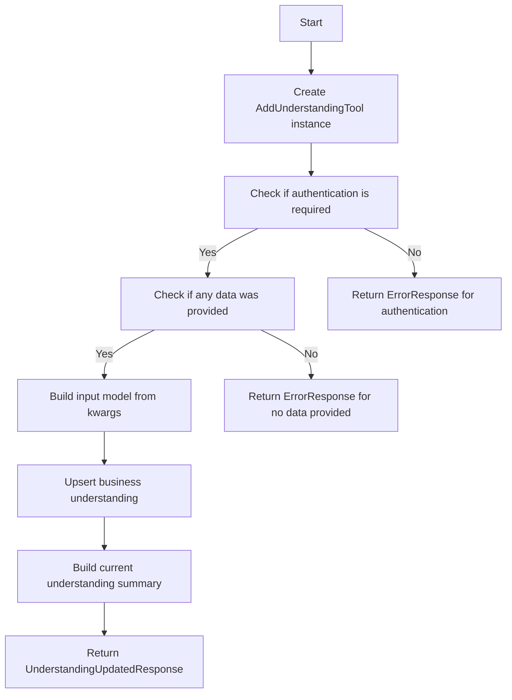
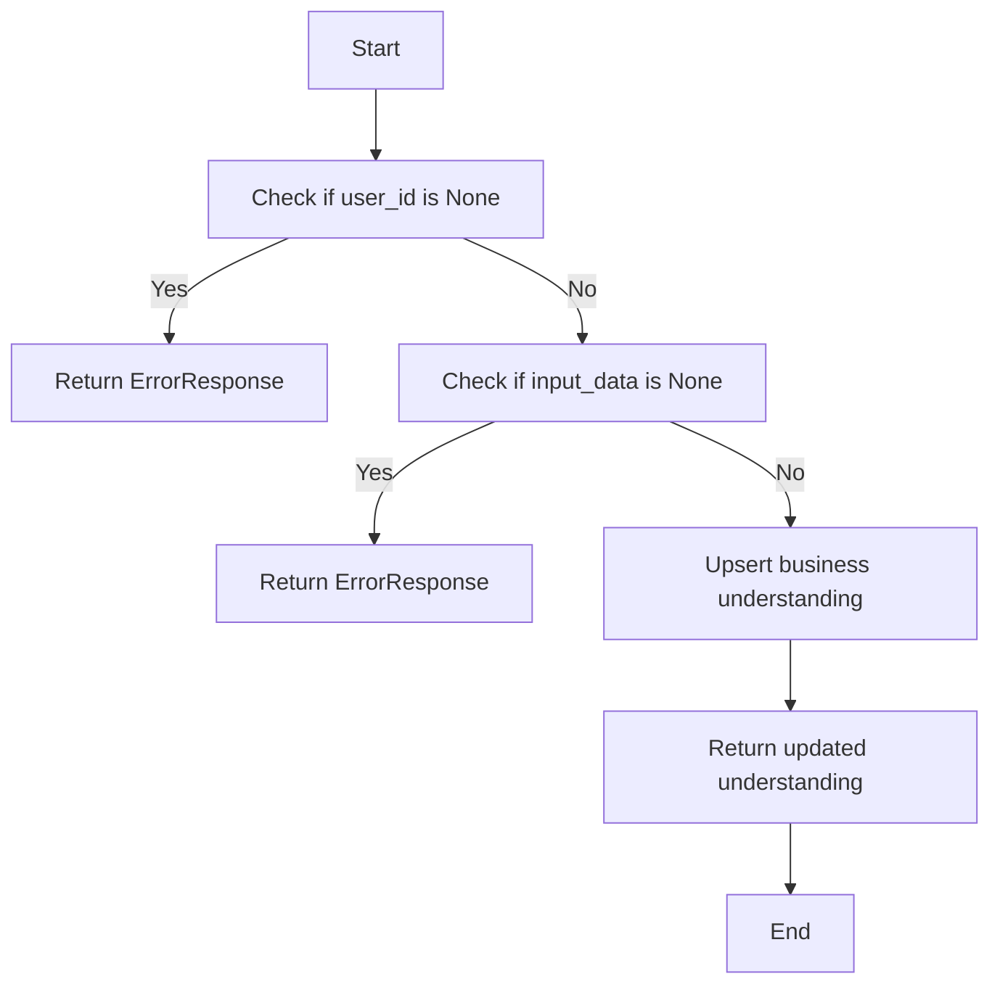
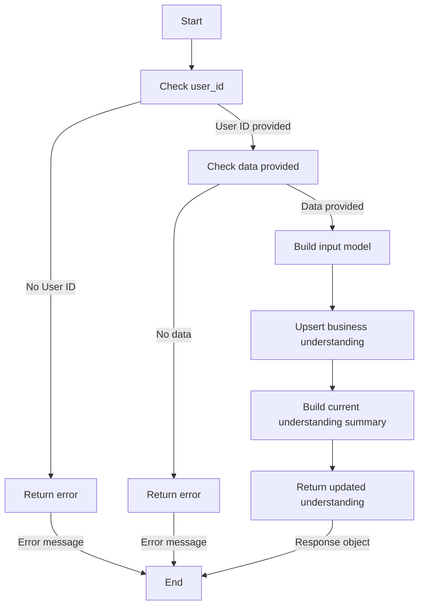

# `.\AutoGPT\autogpt_platform\backend\backend\api\features\chat\tools\add_understanding.py` 详细设计文档

The code defines a tool for capturing and storing user's business understanding incrementally, allowing for the merging of new data with existing understanding.

## 整体流程



## 类结构

```
BaseTool (父类)
├── AddUnderstandingTool (子类)
```

## 全局变量及字段


### `logger`
    
Logger instance for logging messages related to the AddUnderstandingTool class.

类型：`logging.Logger`
    


### `AddUnderstandingTool.name`
    
The name of the tool, which is 'add_understanding'.

类型：`str`
    


### `AddUnderstandingTool.description`
    
A detailed description of the tool's functionality.

类型：`str`
    


### `AddUnderstandingTool.parameters`
    
A dictionary containing the schema of the parameters expected by the tool.

类型：`dict[str, Any]`
    


### `AddUnderstandingTool.requires_auth`
    
A flag indicating whether the tool requires authentication to store user-specific data.

类型：`bool`
    
    

## 全局函数及方法


### upsert_business_understanding

This function is responsible for updating or inserting a new business understanding record for a given user.

参数：

- `user_id`：`str`，The unique identifier for the user.
- `input_data`：`BusinessUnderstandingInput`，The data to be upserted, which includes various fields about the user's business understanding.

返回值：`Understanding`，The updated or inserted business understanding record.

#### 流程图



#### 带注释源码

```python
async def upsert_business_understanding(user_id: str, input_data: BusinessUnderstandingInput) -> Understanding:
    # Implementation of the upsert logic
    # This function would interact with the database to update or insert the business understanding
    # The actual implementation details are not shown here as they depend on the specific database and ORM being used
    pass
```


### AddUnderstandingTool._execute

Capture and store business understanding incrementally.

参数：

- `user_id`：`str | None`，The unique identifier for the user. If not provided, an error response is returned.
- `session`：`ChatSession`，The chat session object containing session details.
- `**kwargs`：`Any`，Additional keyword arguments representing the business understanding data to be captured.

返回值：`ToolResponseBase`，A response object indicating the result of the operation.

#### 流程图



#### 带注释源码

```python
async def _execute(
    self,
    user_id: str | None,
    session: ChatSession,
    **kwargs,
) -> ToolResponseBase:
    """
    Capture and store business understanding incrementally.

    Each call merges new data with existing understanding:
    - String fields are overwritten if provided
    - List fields are appended (with deduplication)
    """
    session_id = session.session_id

    if not user_id:
        return ErrorResponse(
            message="Authentication required to save business understanding.",
            session_id=session_id,
        )

    # Check if any data was provided
    if not any(v is not None for v in kwargs.values()):
        return ErrorResponse(
            message="Please provide at least one field to update.",
            session_id=session_id,
        )

    # Build input model from kwargs (only include fields defined in the model)
    valid_fields = set(BusinessUnderstandingInput.model_fields.keys())
    input_data = BusinessUnderstandingInput(
        **{k: v for k, v in kwargs.items() if k in valid_fields}
    )

    # Track which fields were updated
    updated_fields = [
        k for k, v in kwargs.items() if k in valid_fields and v is not None
    ]

    # Upsert with merge
    understanding = await upsert_business_understanding(user_id, input_data)

    # Build current understanding summary (filter out empty values)
    current_understanding = {
        k: v
        for k, v in understanding.model_dump(
            exclude={"id", "user_id", "created_at", "updated_at"}
        ).items()
        if v is not None and v != [] and v != ""
    }

    return UnderstandingUpdatedResponse(
        message=f"Updated understanding with: {', '.join(updated_fields)}. "
        "I now have a better picture of your business context.",
        session_id=session_id,
        updated_fields=updated_fields,
        current_understanding=current_understanding,
    )
```


## 关键组件


### 张量索引与惰性加载

用于高效地索引和访问大型数据集，同时延迟加载数据以减少内存消耗。

### 反量化支持

提供对反量化操作的支持，允许在量化过程中进行逆量化操作。

### 量化策略

定义了量化策略，用于在模型训练和推理过程中对模型参数进行量化。

## 问题及建议


### 已知问题

-   **代码重复**：`BusinessUnderstandingInput.model_json_schema()` 和 `BusinessUnderstandingInput.model_fields.keys()` 在 `parameters` 方法中被重复调用，这可能导致性能问题，尤其是在高负载情况下。
-   **错误处理**：`ErrorResponse` 的 `message` 字段可能包含敏感信息，应该避免直接返回敏感信息。
-   **数据验证**：代码中没有显式验证 `kwargs` 中的数据是否符合 `BusinessUnderstandingInput` 模型的要求，这可能导致数据不一致或错误。
-   **异常处理**：`_execute` 方法中使用了 `await` 关键字，但没有处理可能发生的异常，这可能导致未捕获的异常。

### 优化建议

-   **减少代码重复**：将 `BusinessUnderstandingInput.model_json_schema()` 和 `BusinessUnderstandingInput.model_fields.keys()` 的调用移到类初始化时，并在需要时缓存结果。
-   **改进错误处理**：在返回错误信息时，避免返回敏感信息，可以使用通用的错误代码和消息。
-   **数据验证**：在 `kwargs` 被传递给 `BusinessUnderstandingInput` 构造函数之前，使用 Pydantic 模型进行验证，确保数据符合预期格式。
-   **异常处理**：在 `await` 调用周围添加 `try-except` 块，以捕获并处理可能发生的异常。
-   **日志记录**：增加日志记录，以便在出现问题时可以追踪和调试。
-   **性能优化**：考虑使用缓存机制来存储用户理解数据，以减少数据库操作次数。
-   **安全性**：确保所有用户输入都经过适当的清理和验证，以防止注入攻击。


## 其它


### 设计目标与约束

- 设计目标：
  - 提供一个工具，用于逐步捕获和存储用户业务理解。
  - 确保工具能够处理用户提供的业务上下文、工作流程、痛点以及自动化目标。
  - 确保工具能够与现有系统无缝集成，并支持增量更新。
- 约束：
  - 必须支持用户身份验证，以确保数据的安全性。
  - 必须能够处理空值和无效输入，并提供适当的错误响应。
  - 必须遵循现有的数据模型和API规范。

### 错误处理与异常设计

- 错误处理：
  - 当用户未提供身份验证时，返回错误响应，提示需要身份验证。
  - 当用户未提供任何字段时，返回错误响应，提示至少提供一个字段以更新。
  - 当提供的字段不在模型定义中时，忽略该字段。
  - 当发生内部错误时，记录错误并返回错误响应。
- 异常设计：
  - 使用try-except块捕获可能发生的异常，并记录异常信息。
  - 异常信息应包括错误类型、错误描述和堆栈跟踪。

### 数据流与状态机

- 数据流：
  - 用户调用工具时，提供业务理解数据。
  - 工具验证用户身份和输入数据的有效性。
  - 工具将数据存储到数据库中，并更新现有理解。
  - 工具返回更新后的理解摘要。
- 状态机：
  - 工具的状态包括：空闲、执行中、完成、错误。
  - 工具根据输入数据和系统状态在状态之间转换。

### 外部依赖与接口契约

- 外部依赖：
  - `backend.api.features.chat.model`：用于处理聊天会话。
  - `backend.data.understanding`：用于存储和更新业务理解。
  - `logging`：用于记录日志信息。
- 接口契约：
  - `BusinessUnderstandingInput`：定义了业务理解输入数据的模型。
  - `upsert_business_understanding`：用于更新或插入业务理解数据的函数。
  - `ChatSession`：定义了聊天会话的模型。
  - `ErrorResponse`：定义了错误响应的模型。
  - `ToolResponseBase`：定义了工具响应的基类。
  - `UnderstandingUpdatedResponse`：定义了理解更新响应的模型。

    