# `.\AutoGPT\autogpt_platform\backend\backend\api\features\chat\tools\agent_generator\__init__.py` 详细设计文档

The code provides a package for generating agents from natural language, including various utility functions and classes for processing and managing agent data.

## 整体流程

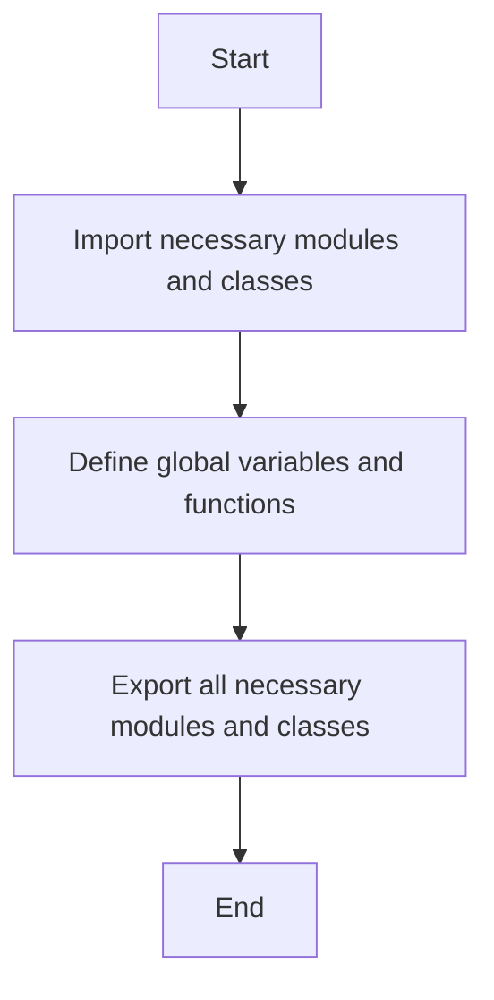
```mermaid
graph TD
    A[Start] --> B[Import necessary modules and classes]
    B --> C[Define global variables and functions]
    C --> D[Export all necessary modules and classes]
    D --> E[End]
```

## 类结构

```
AgentGeneratorPackage (根包)
├── core (核心模块)
│   ├── AgentGeneratorNotConfiguredError
│   ├── AgentJsonValidationError
│   ├── AgentSummary
│   ├── DecompositionResult
│   ├── DecompositionStep
│   ├── LibraryAgentSummary
│   ├── MarketplaceAgentSummary
│   ├── customize_template
│   ├── decompose_goal
│   ├── enrich_library_agents_from_steps
│   ├── extract_search_terms_from_steps
│   ├── extract_uuids_from_text
│   ├── generate_agent
│   ├── generate_agent_patch
│   ├── get_agent_as_json
│   ├── get_all_relevant_agents_for_generation
│   ├── get_library_agent_by_graph_id
│   ├── get_library_agent_by_id
│   ├── get_library_agents_for_generation
│   ├── graph_to_json
│   ├── json_to_graph
│   ├── save_agent_to_library
│   ├── search_marketplace_agents_for_generation
│   └── ...
├── errors (错误处理模块)
│   └── get_user_message_for_error
└── service (服务模块)
    ├── health_check (外部服务健康检查)
    └── is_external_service_configured (外部服务配置检查)
```

## 全局变量及字段


    

## 全局函数及方法


### customize_template

Customizes a template by replacing placeholders with actual values.

参数：

-  `template`：`str`，The template string containing placeholders.
-  `values`：`dict`，A dictionary of values to replace the placeholders in the template.

返回值：`str`，The customized template string with placeholders replaced.

#### 流程图

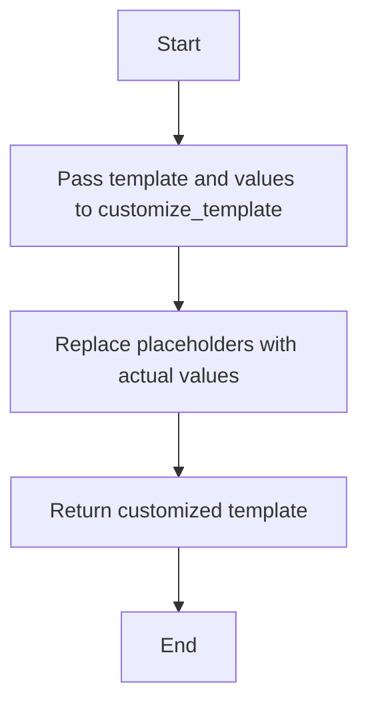
```mermaid
graph TD
    A[Start] --> B[Pass template and values to customize_template]
    B --> C[Replace placeholders with actual values]
    C --> D[Return customized template]
    D --> E[End]
```

#### 带注释源码

```python
def customize_template(template, values):
    """
    Customizes a template by replacing placeholders with actual values.

    :param template: str, The template string containing placeholders.
    :param values: dict, A dictionary of values to replace the placeholders in the template.
    :return: str, The customized template string with placeholders replaced.
    """
    # Replace placeholders with actual values
    for key, value in values.items():
        template = template.replace(f"{{{key}}}", str(value))
    return template
```


### decompose_goal

The `decompose_goal` function is responsible for breaking down a goal into smaller, manageable steps that can be used to generate an agent.

参数：

-  `goal`：`str`，The goal to be decomposed into steps. This is a natural language description of the goal.

返回值：`DecompositionResult`，A `DecompositionResult` object containing the steps that were extracted from the goal.

#### 流程图

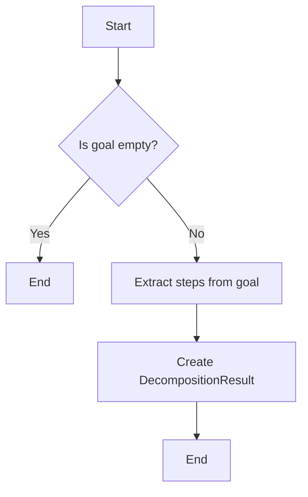
```mermaid
graph TD
    A[Start] --> B{Is goal empty?}
    B -- Yes --> C[End]
    B -- No --> D[Extract steps from goal]
    D --> E[Create DecompositionResult]
    E --> F[End]
```

#### 带注释源码

```python
def decompose_goal(goal: str) -> DecompositionResult:
    # Check if the goal is empty
    if not goal:
        raise AgentGeneratorNotConfiguredError("Goal is empty")

    # Extract steps from the goal
    steps = extract_search_terms_from_steps(goal)

    # Create a DecompositionResult object
    decomposition_result = DecompositionResult(steps=steps)

    return decomposition_result
```


### enrich_library_agents_from_steps

This function enriches library agents by adding additional information based on the provided steps.

参数：

- `steps`：`list`，A list of `DecompositionStep` objects representing the steps to be used for enriching the agents.

返回值：`list`，A list of `LibraryAgentSummary` objects representing the enriched library agents.

#### 流程图

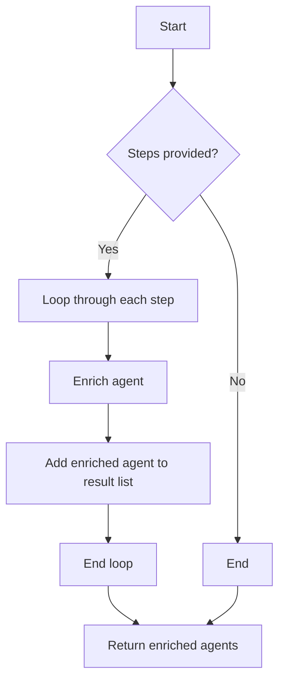
```mermaid
graph TD
    A[Start] --> B{Steps provided?}
    B -- Yes --> C[Loop through each step]
    B -- No --> D[End]
    C --> E[Enrich agent]
    E --> F[Add enriched agent to result list]
    F --> G[End loop]
    G --> H[Return enriched agents]
    D --> H
```

#### 带注释源码

```python
def enrich_library_agents_from_steps(steps):
    enriched_agents = []
    for step in steps:
        # Assuming there is a method to enrich an agent based on a step
        enriched_agent = enrich_agent_based_on_step(step)
        enriched_agents.append(enriched_agent)
    return enriched_agents
```


### extract_search_terms_from_steps

This function extracts search terms from a list of steps.

参数：

- `steps`：`list`，A list of `DecompositionStep` objects representing the steps to be analyzed.

返回值：`list`，A list of search terms extracted from the steps.

#### 流程图

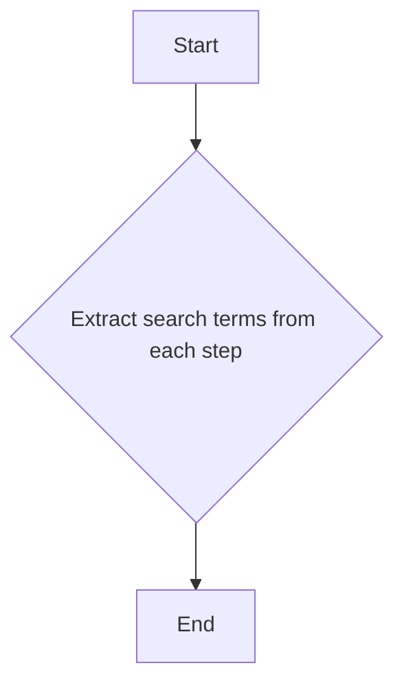
```mermaid
graph TD
    A[Start] --> B{Extract search terms from each step}
    B --> C[End]
```

#### 带注释源码

```python
def extract_search_terms_from_steps(steps):
    """
    Extracts search terms from a list of steps.

    :param steps: list of DecompositionStep objects
    :return: list of search terms
    """
    search_terms = []
    for step in steps:
        # Assuming the step object has a method 'get_search_terms' that returns a list of search terms
        search_terms.extend(step.get_search_terms())
    return search_terms
```


### extract_uuids_from_text

This function extracts UUIDs from a given text string.

参数：

- `text`: `str`，The text string from which UUIDs are to be extracted.

返回值：`list`，A list of UUIDs extracted from the text.

#### 流程图

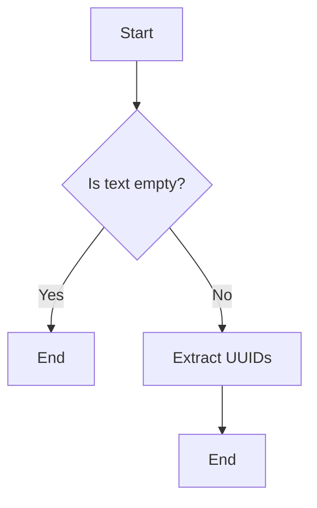
```mermaid
graph TD
    A[Start] --> B{Is text empty?}
    B -- Yes --> C[End]
    B -- No --> D[Extract UUIDs]
    D --> E[End]
```

#### 带注释源码

```python
def extract_uuids_from_text(text):
    """
    Extracts UUIDs from the given text string.

    :param text: str - The text string from which UUIDs are to be extracted.
    :return: list - A list of UUIDs extracted from the text.
    """
    # Your implementation here
    pass
```


### generate_agent

This function generates an agent from a given goal description.

参数：

- `goal_description`：`str`，The goal description from which the agent will be generated.

返回值：`AgentSummary`，A summary of the generated agent.

#### 流程图

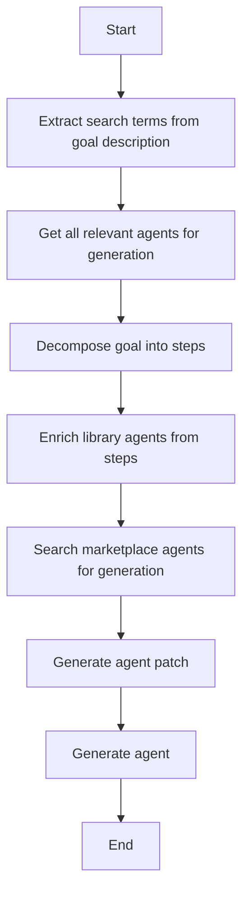
```mermaid
graph TD
    A[Start] --> B[Extract search terms from goal description]
    B --> C[Get all relevant agents for generation]
    C --> D[Decompose goal into steps]
    D --> E[Enrich library agents from steps]
    E --> F[Search marketplace agents for generation]
    F --> G[Generate agent patch]
    G --> H[Generate agent]
    H --> I[End]
```

#### 带注释源码

```python
def generate_agent(goal_description: str) -> AgentSummary:
    # Extract search terms from the goal description
    search_terms = extract_search_terms_from_steps(goal_description)
    
    # Get all relevant agents for generation
    relevant_agents = get_all_relevant_agents_for_generation(search_terms)
    
    # Decompose the goal into steps
    decomposition_result = decompose_goal(goal_description)
    
    # Enrich library agents from the steps
    enriched_agents = enrich_library_agents_from_steps(decomposition_result)
    
    # Search marketplace agents for generation
    marketplace_agents = search_marketplace_agents_for_generation(search_terms)
    
    # Generate agent patch
    agent_patch = generate_agent_patch(relevant_agents, enriched_agents, marketplace_agents)
    
    # Generate the agent
    agent_summary = generate_agent_summary(agent_patch)
    
    return agent_summary
```


### generate_agent_patch

This function generates a patch for an agent, which is a set of changes or updates to be applied to the agent.

参数：

-  `agent_summary`：`AgentSummary`，The summary of the agent that needs to be patched.
-  `patches`：`list`，A list of patches to be applied to the agent.

返回值：`AgentSummary`，The updated agent summary after applying the patches.

#### 流程图

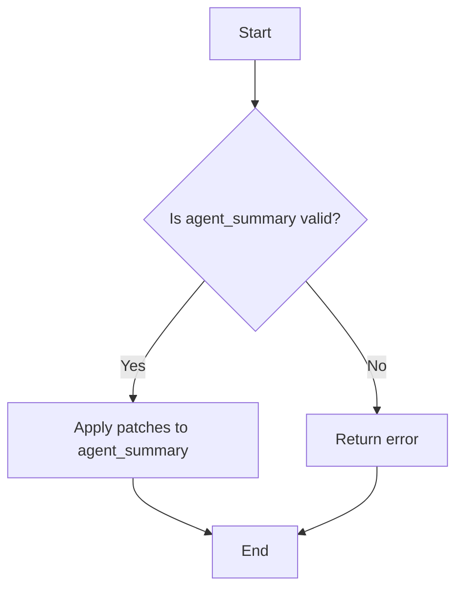
```mermaid
graph TD
    A[Start] --> B{Is agent_summary valid?}
    B -- Yes --> C[Apply patches to agent_summary]
    B -- No --> D[Return error]
    C --> E[End]
    D --> E
```

#### 带注释源码

```
def generate_agent_patch(agent_summary, patches):
    # Validate the agent_summary
    if not isinstance(agent_summary, AgentSummary):
        raise AgentJsonValidationError("Invalid agent summary provided.")
    
    # Apply patches to the agent_summary
    for patch in patches:
        # Apply each patch to the agent_summary
        # (Assuming a method apply_patch exists in AgentSummary)
        agent_summary.apply_patch(patch)
    
    # Return the updated agent_summary
    return agent_summary
```


### `get_agent_as_json`

将代理对象转换为JSON格式的字符串。

参数：

- 无

返回值：`str`，JSON格式的代理对象字符串

#### 流程图

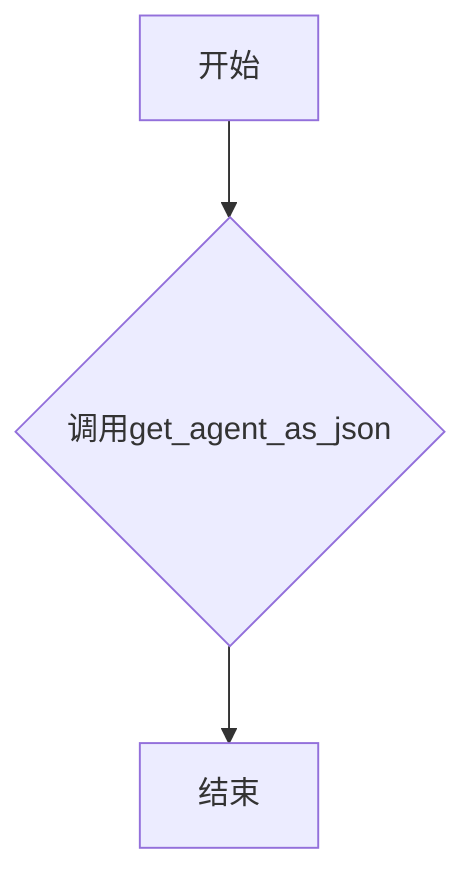
```mermaid
graph TD
    A[开始] --> B{调用get_agent_as_json}
    B --> C[结束]
```

#### 带注释源码

```
def get_agent_as_json(agent):
    """
    Convert an agent object to a JSON formatted string.

    :param agent: The agent object to convert.
    :return: A JSON formatted string representation of the agent.
    """
    # Convert the agent object to JSON
    agent_json = agent.to_json()
    # Return the JSON string
    return agent_json
```


### `get_all_relevant_agents_for_generation`

This function retrieves all relevant agents for a specific generation process.

参数：

- 无

返回值：`List[AgentSummary]`，A list of `AgentSummary` objects representing the relevant agents for the generation process.

#### 流程图

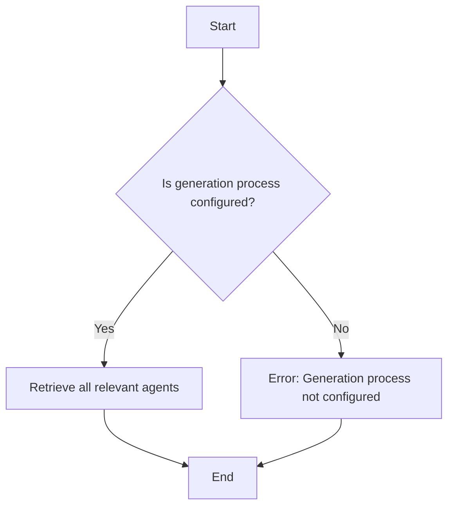
```mermaid
graph TD
    A[Start] --> B{Is generation process configured?}
    B -- Yes --> C[Retrieve all relevant agents]
    B -- No --> D[Error: Generation process not configured]
    C --> E[End]
    D --> E
```

#### 带注释源码

```
def get_all_relevant_agents_for_generation():
    """
    Retrieves all relevant agents for a specific generation process.

    Returns:
        List[AgentSummary]: A list of AgentSummary objects representing the relevant agents for the generation process.
    """
    # Check if the generation process is configured
    if not is_external_service_configured():
        raise AgentGeneratorNotConfiguredError("The generation process is not configured.")

    # Retrieve all relevant agents
    agents = get_library_agents_for_generation()

    return agents
```


### `get_library_agent_by_graph_id`

查找并返回与给定图ID关联的库代理。

参数：

- `graph_id`：`str`，图ID，用于标识特定的图

返回值：`LibraryAgentSummary`，包含代理信息的摘要

#### 流程图

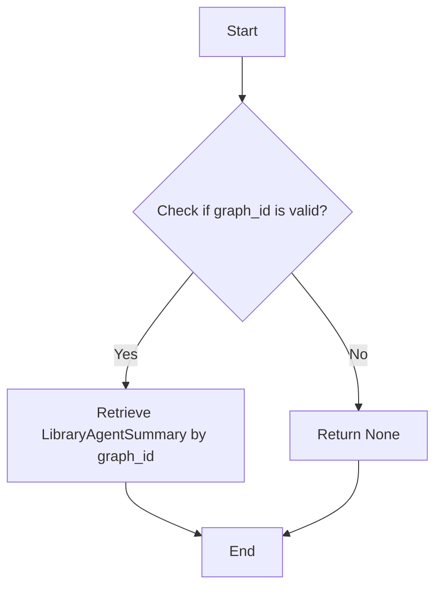
```mermaid
graph TD
    A[Start] --> B{Check if graph_id is valid?}
    B -- Yes --> C[Retrieve LibraryAgentSummary by graph_id]
    B -- No --> D[Return None]
    C --> E[End]
    D --> E
```

#### 带注释源码

```python
def get_library_agent_by_graph_id(graph_id):
    # Validate the graph_id
    if not is_valid_graph_id(graph_id):
        return None
    
    # Retrieve the LibraryAgentSummary from the database or cache
    library_agent_summary = database.get_library_agent_by_graph_id(graph_id)
    
    # Return the LibraryAgentSummary if found
    return library_agent_summary
```


### `get_library_agent_by_id`

查找并返回具有指定ID的库代理。

参数：

- `agent_id`：`str`，代理的唯一标识符

返回值：`LibraryAgentSummary`，包含代理信息的摘要

#### 流程图

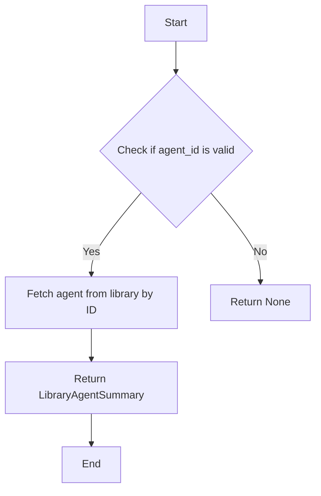
```mermaid
graph TD
    A[Start] --> B{Check if agent_id is valid}
    B -- Yes --> C[Fetch agent from library by ID]
    B -- No --> D[Return None]
    C --> E[Return LibraryAgentSummary]
    E --> F[End]
```

#### 带注释源码

```python
def get_library_agent_by_id(agent_id: str) -> LibraryAgentSummary:
    # Validate the agent_id
    if not is_valid_agent_id(agent_id):
        return None
    
    # Fetch the agent from the library by ID
    agent = _fetch_agent_from_library(agent_id)
    
    # Return the agent summary
    return LibraryAgentSummary.from_agent(agent)
```

```python
def is_valid_agent_id(agent_id: str) -> bool:
    # Placeholder for actual validation logic
    return True

def _fetch_agent_from_library(agent_id: str) -> Agent:
    # Placeholder for actual fetching logic
    return Agent()
```


### `get_library_agents_for_generation`

This function retrieves a list of library agents that are relevant for a specific generation task.

参数：

- 无

返回值：`List[LibraryAgentSummary]`，A list of `LibraryAgentSummary` objects representing the library agents.

#### 流程图

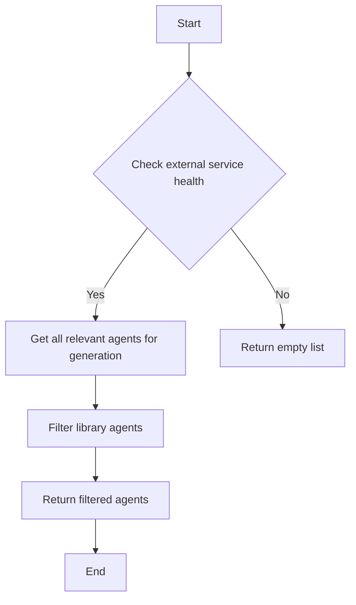
```mermaid
graph TD
    A[Start] --> B{Check external service health}
    B -- Yes --> C[Get all relevant agents for generation]
    B -- No --> D[Return empty list]
    C --> E[Filter library agents]
    E --> F[Return filtered agents]
    F --> G[End]
```

#### 带注释源码

```
# Assuming the function is defined as follows:

def get_library_agents_for_generation():
    try:
        if not is_external_service_configured():
            return []

        all_relevant_agents = get_all_relevant_agents_for_generation()
        library_agents = [agent for agent in all_relevant_agents if isinstance(agent, LibraryAgentSummary)]
        return library_agents
    except Exception as e:
        # Handle exceptions and log them
        get_user_message_for_error(e)
        return []
```


### `get_user_message_for_error`

该函数用于获取与错误相关的用户友好的消息。

参数：

- `error`：`Error`，表示发生的错误对象

返回值：`str`，用户友好的错误消息

#### 流程图

```mermaid
graph TD
    A[Start] --> B{Check Error Type}
    B -- "AgentGeneratorNotConfiguredError" --> C[Return "Agent generator not configured"]
    B -- "AgentJsonValidationError" --> D[Return "Invalid JSON for agent"]
    B -- "Other" --> E[Return "An unexpected error occurred"]
    E --> F[End]
```

#### 带注释源码

```
def get_user_message_for_error(error):
    """
    Get a user-friendly message for the given error.

    :param error: The error object that occurred.
    :return: A user-friendly error message.
    """
    if isinstance(error, AgentGeneratorNotConfiguredError):
        return "Agent generator not configured"
    elif isinstance(error, AgentJsonValidationError):
        return "Invalid JSON for agent"
    else:
        return "An unexpected error occurred"
``` 


### `graph_to_json`

Converts a graph representation of an agent into a JSON string.

参数：

- `graph`: `Graph`，The graph representation of the agent to be converted.

返回值：`str`，A JSON string representation of the graph.

#### 流程图

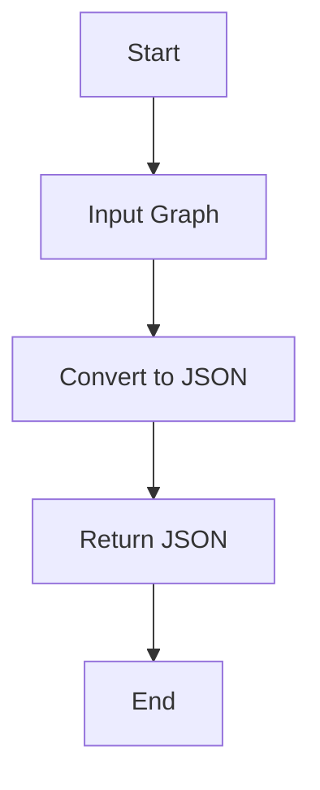
```mermaid
graph TD
    A[Start] --> B[Input Graph]
    B --> C[Convert to JSON]
    C --> D[Return JSON]
    D --> E[End]
```

#### 带注释源码

```
# graph_to_json.py
def graph_to_json(graph):
    """
    Converts a graph representation of an agent into a JSON string.

    :param graph: The graph representation of the agent to be converted.
    :return: A JSON string representation of the graph.
    """
    # Convert the graph to a JSON string
    json_str = json.dumps(graph, default=str)
    return json_str
```


### json_to_graph

Converts a JSON object into a graph representation.

参数：

- `json_data`：`dict`，The JSON data to be converted into a graph.

返回值：`Graph`，The graph representation of the JSON data.

#### 流程图

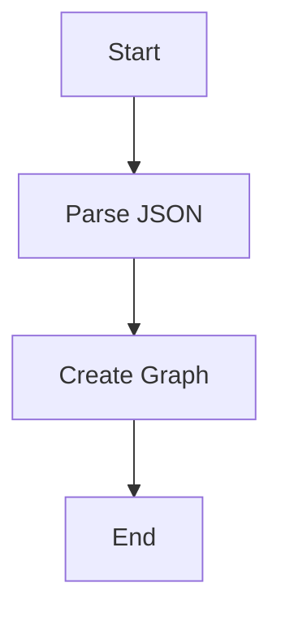
```mermaid
graph TD
    A[Start] --> B[Parse JSON]
    B --> C[Create Graph]
    C --> D[End]
```

#### 带注释源码

```python
def json_to_graph(json_data):
    # Parse JSON data
    parsed_data = json.loads(json_data)
    
    # Create graph from parsed data
    graph = create_graph(parsed_data)
    
    return graph
```


### save_agent_to_library

该函数用于将代理信息保存到库中。

参数：

- `agent_summary`：`LibraryAgentSummary`，代理摘要信息，包含代理的详细信息

返回值：`None`，无返回值

#### 流程图

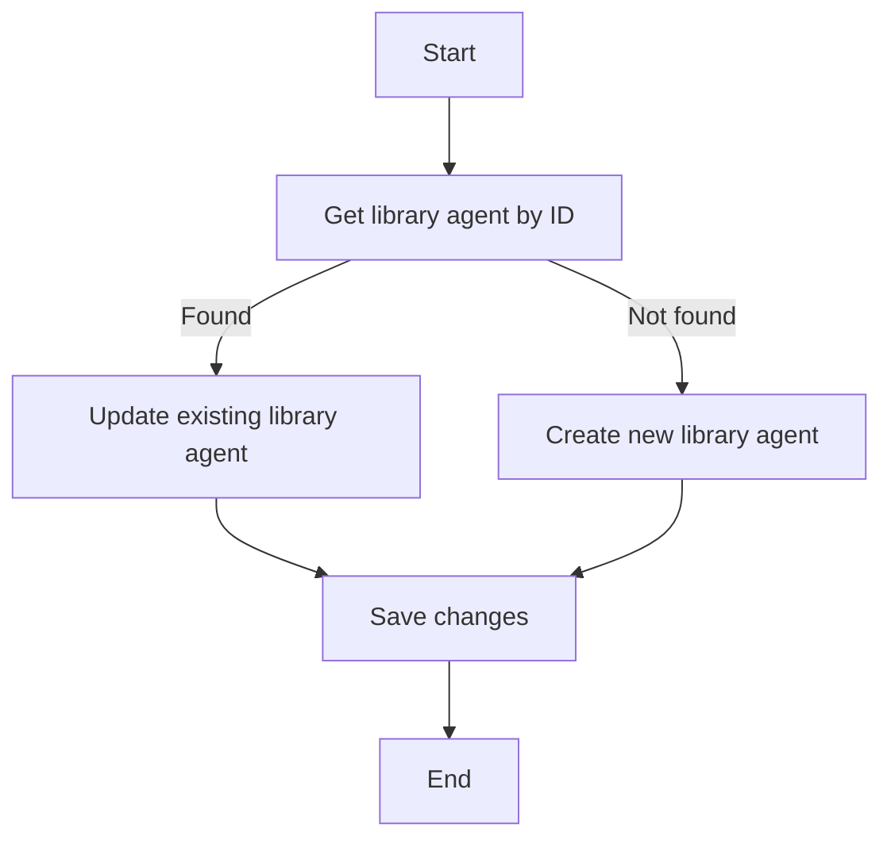
```mermaid
graph TD
    A[Start] --> B[Get library agent by ID]
    B -->|Not found| C[Create new library agent]
    B -->|Found| D[Update existing library agent]
    D --> E[Save changes]
    E --> F[End]
    C --> E
```

#### 带注释源码

```
def save_agent_to_library(agent_summary: LibraryAgentSummary) -> None:
    """
    Save an agent to the library.

    :param agent_summary: The summary of the agent to save.
    :return: None
    """
    # Retrieve the library agent by ID
    library_agent = get_library_agent_by_id(agent_summary.id)
    
    # If the library agent does not exist, create a new one
    if library_agent is None:
        library_agent = LibraryAgentSummary()
        library_agent.id = agent_summary.id
    
    # Update the library agent with the new summary
    library_agent.update_from_agent_summary(agent_summary)
    
    # Save the changes to the library
    # (Assuming there is a save method on the library agent)
    library_agent.save()
```


### search_marketplace_agents_for_generation

This function searches for marketplace agents that are relevant for a given generation task.

参数：

- 无

返回值：`MarketplaceAgentSummary`，A list of marketplace agents that match the generation criteria.

#### 流程图

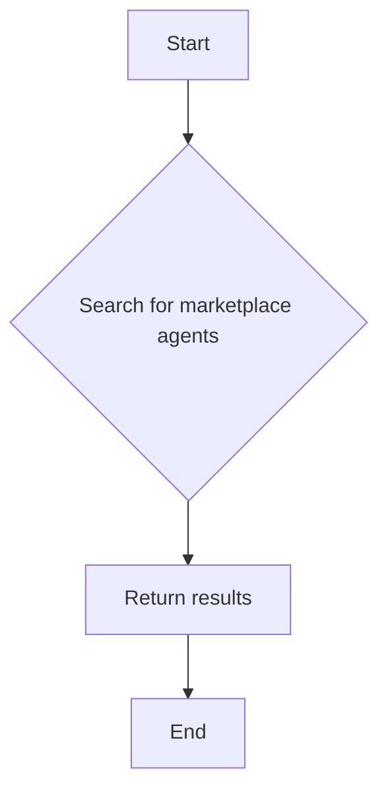
```mermaid
graph TD
    A[Start] --> B{Search for marketplace agents}
    B --> C[Return results]
    C --> D[End]
```

#### 带注释源码

```
def search_marketplace_agents_for_generation():
    # Implementation of the function would go here
    # This is a placeholder as the actual implementation is not visible in the provided code snippet
    pass
```


### `check_external_service_health`

检查外部服务的健康状态。

参数：

- 无

返回值：`None`，无返回值，但会打印服务健康状态信息。

#### 流程图

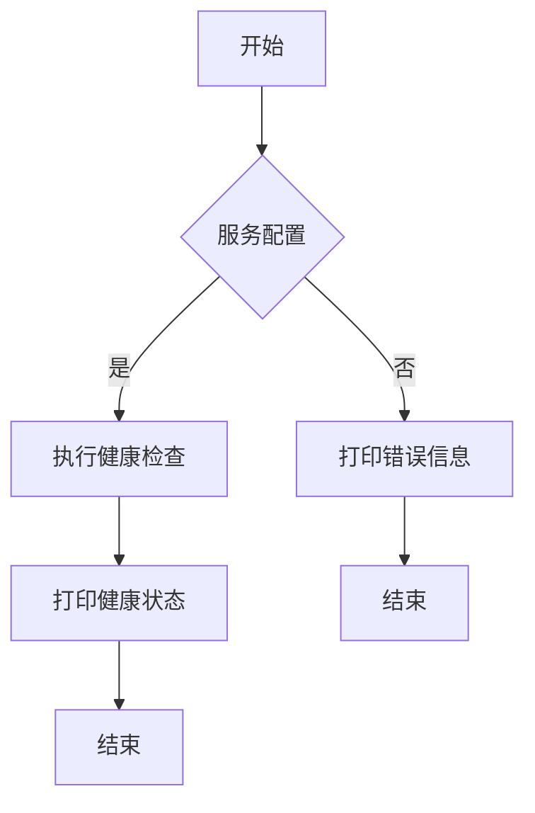
```mermaid
graph TD
    A[开始] --> B{服务配置}
    B -->|是| C[执行健康检查]
    B -->|否| D[打印错误信息]
    C --> E[打印健康状态]
    E --> F[结束]
    D --> G[结束]
```

#### 带注释源码

```
# 从 service 模块导入 health_check 函数
from .service import health_check as check_external_service_health

# check_external_service_health 函数的源码（假设如下，实际代码可能有所不同）
def check_external_service_health():
    # 检查外部服务是否已配置
    if not is_external_service_configured():
        # 如果未配置，打印错误信息
        print("External service is not configured.")
        return
    
    # 执行健康检查
    health_status = health_check_service()
    
    # 打印健康状态
    print(f"Service health status: {health_status}")
```


### `is_external_service_configured`

检查外部服务是否已配置。

参数：

- 无

返回值：`bool`，如果外部服务已配置则返回 `True`，否则返回 `False`

#### 流程图

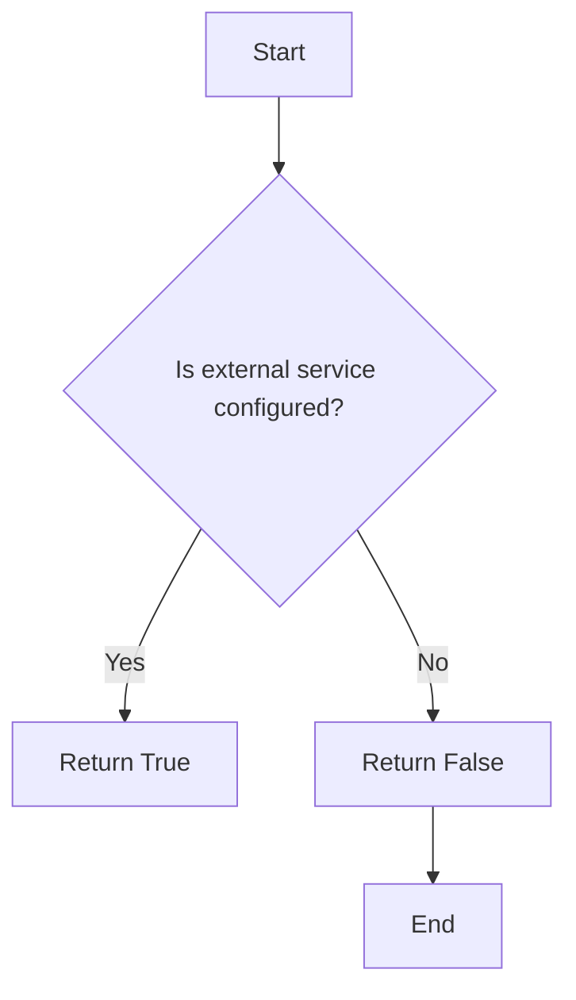
```mermaid
graph TD
    A[Start] --> B{Is external service configured?}
    B -- Yes --> C[Return True]
    B -- No --> D[Return False]
    D --> E[End]
```

#### 带注释源码

```
# is_external_service_configured.py

from .service import health_check as check_external_service_health

def is_external_service_configured():
    """
    Check if the external service is configured.

    Returns:
        bool: True if the external service is configured, False otherwise.
    """
    try:
        check_external_service_health()
        return True
    except Exception:
        return False
``` 


## 关键组件


### 张量索引与惰性加载

用于高效地索引和访问大型数据集，同时延迟加载数据以减少内存消耗。

### 反量化支持

提供对反量化操作的支持，允许在量化过程中进行反向操作。

### 量化策略

定义了量化策略，用于在模型训练过程中将浮点数权重转换为低精度表示。


## 问题及建议


### 已知问题

-   **代码复用性低**：代码中存在大量重复的函数，如`get_library_agent_by_id`和`get_library_agent_by_graph_id`，这些函数的功能相似，只是参数不同。
-   **错误处理不统一**：错误处理依赖于`errors`模块中的`get_user_message_for_error`函数，但没有明确的错误处理策略或模式。
-   **外部服务依赖性**：代码依赖于外部服务，如`check_external_service_health`和`is_external_service_configured`，但没有详细说明这些服务的配置和依赖管理。

### 优化建议

-   **提高代码复用性**：通过提取公共逻辑或使用策略模式来减少重复代码。
-   **统一错误处理**：定义一个清晰的错误处理策略，包括自定义异常类和错误日志记录。
-   **外部服务管理**：实现一个服务配置管理器，以集中管理外部服务的配置和依赖。
-   **文档和注释**：增加代码的文档和注释，以提高代码的可读性和可维护性。
-   **单元测试**：编写单元测试来确保代码的稳定性和可靠性。
-   **性能优化**：分析代码的性能瓶颈，并实施相应的优化措施。


## 其它


### 设计目标与约束

- 设计目标：该代码旨在提供一个高效、可扩展的代理生成器，能够从自然语言中创建代理。
- 约束：代码必须遵循模块化设计原则，确保易于维护和扩展。

### 错误处理与异常设计

- 错误处理：代码应能够捕获和处理各种异常，如配置错误、数据验证错误等。
- 异常设计：定义自定义异常类，如`AgentGeneratorNotConfiguredError`和`AgentJsonValidationError`，以提供清晰的错误信息。

### 数据流与状态机

- 数据流：描述数据在系统中的流动路径，包括输入、处理和输出。
- 状态机：如果适用，描述系统中的状态转换和事件触发。

### 外部依赖与接口契约

- 外部依赖：列出所有外部依赖项，如数据库、API等。
- 接口契约：定义与外部系统交互的接口规范，包括请求和响应格式。

### 安全性与权限管理

- 安全性：描述代码中的安全措施，如数据加密、认证和授权。
- 权限管理：如果适用，描述用户权限和角色管理。

### 性能优化

- 性能优化：讨论代码中的性能瓶颈和可能的优化措施。

### 测试与质量保证

- 测试策略：描述代码的测试策略，包括单元测试、集成测试和系统测试。
- 质量保证：讨论代码的质量保证措施，如代码审查和静态分析。

### 文档与维护

- 文档：描述代码的文档结构，包括API文档、用户手册和开发文档。
- 维护：讨论代码的维护策略，包括版本控制和依赖管理。


    