# `AutoGPT\autogpt_platform\backend\backend\api\features\chat\tools\agent_generator\core.py` 详细设计文档

该文件核心功能是作为代理生成系统的编排层，负责将用户的目标请求分解为可执行的步骤，从用户的私有库或公开市场中检索相关的现有代理作为上下文，调用外部 AI 服务生成新的代理逻辑或将现有代理转换为内部图结构，并处理这些代理的验证、序列化及在数据库中的持久化存储。

## 整体流程

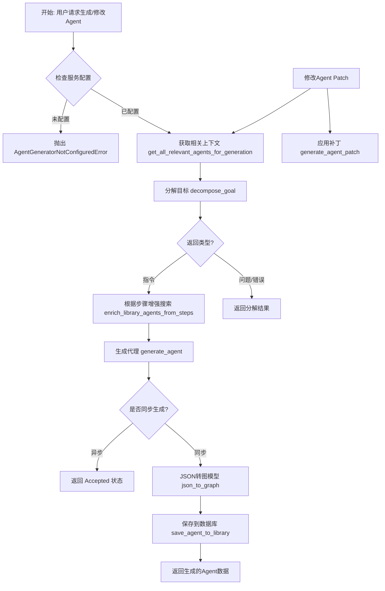

## 类结构

```
Exception
├── AgentGeneratorNotConfiguredError
└── AgentJsonValidationError
TypedDict
├── ExecutionSummary
├── LibraryAgentSummary
├── MarketplaceAgentSummary
├── DecompositionStep
└── DecompositionResult
```

## 全局变量及字段


### `logger`
    
The standard logger instance used for recording runtime information and debugging within the module.

类型：`logging.Logger`
    


### `_UUID_PATTERN`
    
A compiled regular expression pattern used to match and extract UUID v4 strings from input text.

类型：`re.Pattern[str]`
    


### `get_library_agent_by_graph_id`
    
An alias for the function get_library_agent_by_id, used to fetch a library agent by its graph ID or library agent ID.

类型：`Coroutine`
    


### `ExecutionSummary.status`
    
The status string indicating the outcome of the execution.

类型：`str`
    


### `ExecutionSummary.correctness_score`
    
An optional score between 0 and 1 representing the quality or correctness of the execution.

类型：`float`
    


### `ExecutionSummary.activity_summary`
    
An optional text summary describing the activities performed during the execution.

类型：`str`
    


### `LibraryAgentSummary.graph_id`
    
The unique identifier of the agent graph.

类型：`str`
    


### `LibraryAgentSummary.graph_version`
    
The version number of the agent graph.

类型：`int`
    


### `LibraryAgentSummary.name`
    
The name of the library agent.

类型：`str`
    


### `LibraryAgentSummary.description`
    
A description of the library agent's functionality.

类型：`str`
    


### `LibraryAgentSummary.input_schema`
    
The schema defining the expected input data structure for the agent.

类型：`dict[str, Any]`
    


### `LibraryAgentSummary.output_schema`
    
The schema defining the output data structure returned by the agent.

类型：`dict[str, Any]`
    


### `LibraryAgentSummary.recent_executions`
    
An optional list of recent execution summaries used to assess agent quality.

类型：`list[ExecutionSummary]`
    


### `MarketplaceAgentSummary.name`
    
The name of the marketplace agent.

类型：`str`
    


### `MarketplaceAgentSummary.description`
    
The description of the marketplace agent.

类型：`str`
    


### `MarketplaceAgentSummary.sub_heading`
    
The sub-heading text for the marketplace agent.

类型：`str`
    


### `MarketplaceAgentSummary.creator`
    
The name or identifier of the creator of the marketplace agent.

类型：`str`
    


### `MarketplaceAgentSummary.is_marketplace_agent`
    
A flag indicating if the agent is from the marketplace.

类型：`bool`
    


### `DecompositionStep.description`
    
A description of the specific decomposition step.

类型：`str`
    


### `DecompositionStep.action`
    
The action to be performed in this decomposition step.

类型：`str`
    


### `DecompositionStep.block_name`
    
The name of the block associated with this step.

类型：`str`
    


### `DecompositionStep.tool`
    
The tool to be used for the action in this step.

类型：`str`
    


### `DecompositionStep.name`
    
The name identifier for the decomposition step.

类型：`str`
    


### `DecompositionResult.type`
    
The type of decomposition result, such as 'instructions', 'clarifying_questions', or 'error'.

类型：`str`
    


### `DecompositionResult.steps`
    
A list of decomposed instruction steps.

类型：`list[DecompositionStep]`
    


### `DecompositionResult.questions`
    
A list of clarifying questions for the user.

类型：`list[dict[str, Any]]`
    


### `DecompositionResult.error`
    
The error message describing what went wrong.

类型：`str`
    


### `DecompositionResult.error_type`
    
The type or category of the error that occurred.

类型：`str`
    
    

## 全局函数及方法


### `_to_dict_list`

将类型化的代理摘要（AgentSummary 对象或字典）转换为纯字典列表，用于外部服务调用。

参数：

-  `agents`：`list[AgentSummary] | list[dict[str, Any]] | None`，待转换的代理摘要列表或字典列表，可能为 None。

返回值：`list[dict[str, Any]] | None`，转换后的字典列表，若输入为 None 则返回 None。

#### 流程图

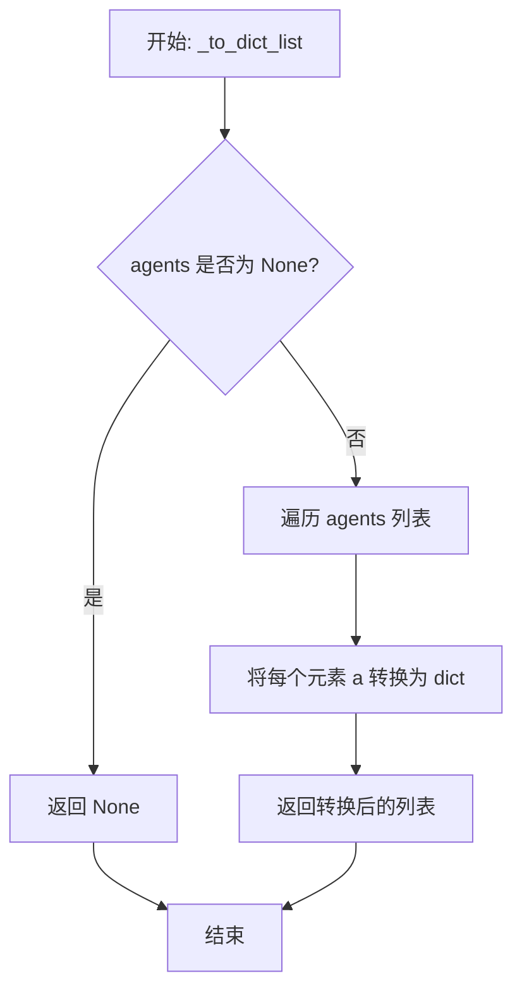

#### 带注释源码

```python
def _to_dict_list(
    agents: list[AgentSummary] | list[dict[str, Any]] | None,
) -> list[dict[str, Any]] | None:
    """Convert typed agent summaries to plain dicts for external service calls."""
    # 检查输入是否为 None
    if agents is None:
        return None
    # 遍历列表并将每个元素转换为字典
    return [dict(a) for a in agents]
```


### `_check_service_configured`

检查外部 Agent Generator 服务是否已配置。

参数：

- 无

返回值：`None`，无返回值。

#### 流程图

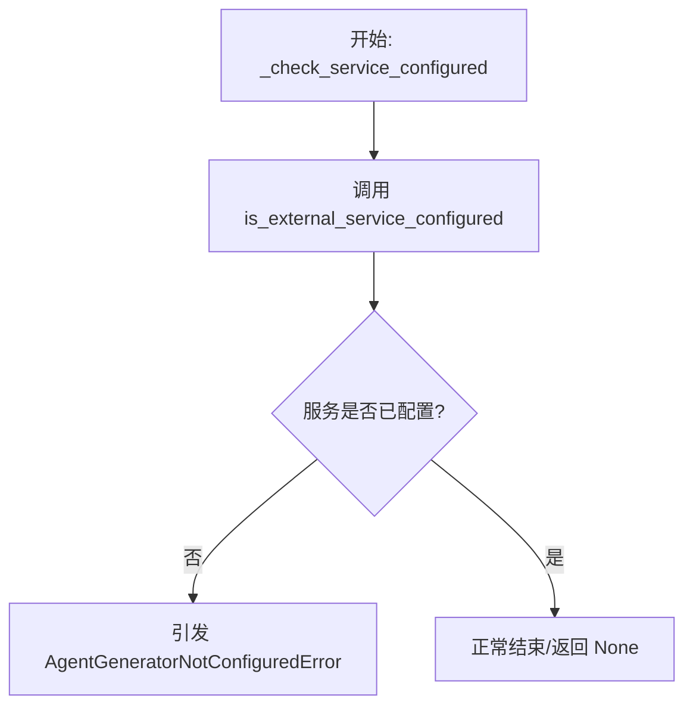

#### 带注释源码

```python
def _check_service_configured() -> None:
    """Check if the external Agent Generator service is configured.

    Raises:
        AgentGeneratorNotConfiguredError: If the service is not configured.
    """
    # 调用外部服务检查函数，判断服务是否可用
    if not is_external_service_configured():
        # 如果未配置，抛出自定义异常，终止流程并提示用户设置环境变量
        raise AgentGeneratorNotConfiguredError(
            "Agent Generator service is not configured. "
            "Set AGENTGENERATOR_HOST environment variable to enable agent generation."
        )
```


### `extract_uuids_from_text`

从文本字符串中提取所有符合 UUID v4 格式的唯一字符串。

参数：

-  `text`：`str`，可能包含 UUID 的文本（例如，用户的 goal description）

返回值：`list[str]`，在文本中找到的唯一 UUID 列表（小写格式）

#### 流程图

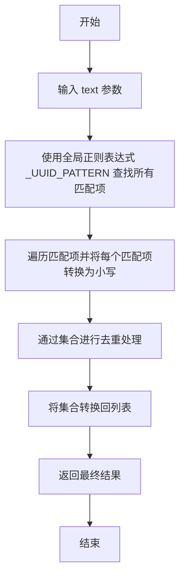

#### 带注释源码

```python
def extract_uuids_from_text(text: str) -> list[str]:
    """Extract all UUID v4 strings from text.

    Args:
        text: Text that may contain UUIDs (e.g., user's goal description)

    Returns:
        List of unique UUIDs found in the text (lowercase)
    """
    # 使用预编译的正则表达式 _UUID_PATTERN 在文本中查找所有匹配项
    matches = _UUID_PATTERN.findall(text)
    
    # 使用集合推导式将找到的 UUID 转换为小写并自动去重，然后转换为列表返回
    return list({m.lower() for m in matches})
```


### `get_library_agent_by_id`

通过代理 ID（graph_id 或库代理 ID）获取特定的库代理，首先尝试通过 graph_id 查找，如果未找到则回退到库代理 ID 查找。

参数：

- `user_id`：`str`，执行操作的用户 ID。
- `agent_id`：`str`，要查找的 ID（可以是 graph_id 或库代理 ID）。

返回值：`LibraryAgentSummary | None`，如果找到则返回 `LibraryAgentSummary`，否则返回 `None`。

#### 流程图

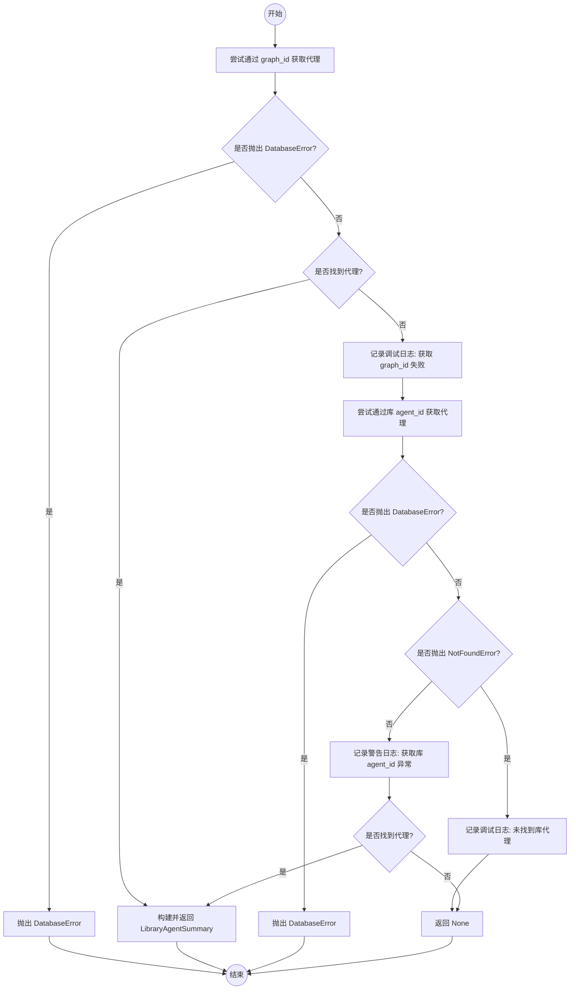

#### 带注释源码

```python
async def get_library_agent_by_id(
    user_id: str, agent_id: str
) -> LibraryAgentSummary | None:
    """Fetch a specific library agent by its ID (library agent ID or graph_id).

    This function tries multiple lookup strategies:
    1. First tries to find by graph_id (AgentGraph primary key)
    2. If not found, tries to find by library agent ID (LibraryAgent primary key)

    This handles both cases:
    - User provides graph_id (e.g., from AgentExecutorBlock)
    - User provides library agent ID (e.g., from library URL)

    Args:
        user_id: The user ID
        agent_id: The ID to look up (can be graph_id or library agent ID)

    Returns:
        LibraryAgentSummary if found, None otherwise
    """
    try:
        # 第一步：尝试使用 graph_id 查找代理
        agent = await library_db.get_library_agent_by_graph_id(user_id, agent_id)
        if agent:
            logger.debug(f"Found library agent by graph_id: {agent.name}")
            return LibraryAgentSummary(
                graph_id=agent.graph_id,
                graph_version=agent.graph_version,
                name=agent.name,
                description=agent.description,
                input_schema=agent.input_schema,
                output_schema=agent.output_schema,
            )
    except DatabaseError:
        # 数据库错误直接抛出
        raise
    except Exception as e:
        # 其他异常记录日志，继续尝试下一种查找方式
        logger.debug(f"Could not fetch library agent by graph_id {agent_id}: {e}")

    try:
        # 第二步：如果 graph_id 未找到，尝试使用库代理 ID (library agent ID) 查找
        agent = await library_db.get_library_agent(agent_id, user_id)
        if agent:
            logger.debug(f"Found library agent by library_id: {agent.name}")
            return LibraryAgentSummary(
                graph_id=agent.graph_id,
                graph_version=agent.graph_version,
                name=agent.name,
                description=agent.description,
                input_schema=agent.input_schema,
                output_schema=agent.output_schema,
            )
    except NotFoundError:
        # 未找到资源记录日志
        logger.debug(f"Library agent not found by library_id: {agent_id}")
    except DatabaseError:
        # 数据库错误直接抛出
        raise
    except Exception as e:
        # 其他异常记录警告日志
        logger.warning(
            f"Could not fetch library agent by library_id {agent_id}: {e}",
            exc_info=True,
        )

    # 两种方式均未找到，返回 None
    return None
```


### `get_library_agents_for_generation`

获取用于 Agent Generator 的用户库代理。使用基于搜索的获取方式返回相关代理，而非全部代理。包含 `recent_executions` 列表以帮助 LLM 评估代理质量。

参数：

-  `user_id`：`str`，用户 ID
-  `search_query`：`str | None`，用于查找相关代理的可选搜索词（用户的目标/描述）
-  `exclude_graph_id`：`str | None`，可选的图 ID，用于排除特定代理（防止循环引用）
-  `max_results`：`int`，要返回的最大代理数量（默认为 15）

返回值：`list[LibraryAgentSummary]`，包含用于子代理组合的 schema 和最近执行的 LibraryAgentSummary 列表

#### 流程图

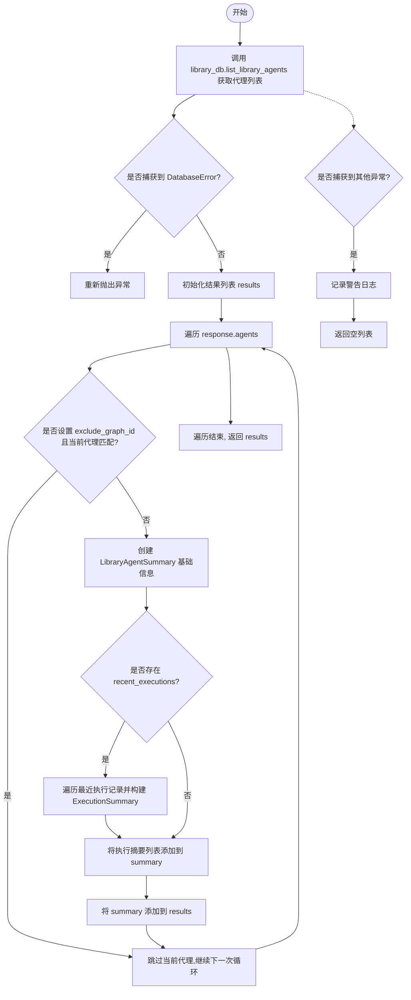

#### 带注释源码

```python
async def get_library_agents_for_generation(
    user_id: str,
    search_query: str | None = None,
    exclude_graph_id: str | None = None,
    max_results: int = 15,
) -> list[LibraryAgentSummary]:
    """Fetch user's library agents formatted for Agent Generator.

    Uses search-based fetching to return relevant agents instead of all agents.
    This is more scalable for users with large libraries.

    Includes recent_executions list to help the LLM assess agent quality:
    - Each execution has status, correctness_score (0-1), and activity_summary
    - This gives the LLM concrete examples of recent performance

    Args:
        user_id: The user ID
        search_query: Optional search term to find relevant agents (user's goal/description)
        exclude_graph_id: Optional graph ID to exclude (prevents circular references)
        max_results: Maximum number of agents to return (default 15)

    Returns:
        List of LibraryAgentSummary with schemas and recent executions for sub-agent composition
    """
    try:
        # 调用数据库接口获取库代理列表，包含执行信息
        response = await library_db.list_library_agents(
            user_id=user_id,
            search_term=search_query,
            page=1,
            page_size=max_results,
            include_executions=True,
        )

        results: list[LibraryAgentSummary] = []
        # 遍历返回的代理列表
        for agent in response.agents:
            # 如果指定了排除ID且当前代理匹配，则跳过
            if exclude_graph_id is not None and agent.graph_id == exclude_graph_id:
                continue

            # 构建基础的代理摘要信息
            summary = LibraryAgentSummary(
                graph_id=agent.graph_id,
                graph_version=agent.graph_version,
                name=agent.name,
                description=agent.description,
                input_schema=agent.input_schema,
                output_schema=agent.output_schema,
            )
            
            # 处理最近的执行记录，用于质量评估
            if agent.recent_executions:
                exec_summaries: list[ExecutionSummary] = []
                for ex in agent.recent_executions:
                    exec_sum = ExecutionSummary(status=ex.status)
                    if ex.correctness_score is not None:
                        exec_sum["correctness_score"] = ex.correctness_score
                    if ex.activity_summary:
                        exec_sum["activity_summary"] = ex.activity_summary
                    exec_summaries.append(exec_sum)
                summary["recent_executions"] = exec_summaries
            results.append(summary)
        return results
    except DatabaseError:
        # 数据库错误直接抛出
        raise
    except Exception as e:
        # 其他异常记录日志并返回空列表
        logger.warning(f"Failed to fetch library agents: {e}")
        return []
```


### `search_marketplace_agents_for_generation`

搜索并格式化 Marketplace 代理，供 Agent Generator 使用。该函数获取 Marketplace 代理及其完整的架构定义（schemas），以便它们可以用作生成工作流中的子代理。

参数：

- `search_query`：`str`，用于查找相关公共代理的搜索词
- `max_results`：`int`，返回的代理最大数量（默认为 10）

返回值：`list[LibraryAgentSummary]`，包含完整输入/输出架构的 LibraryAgentSummary 列表

#### 流程图

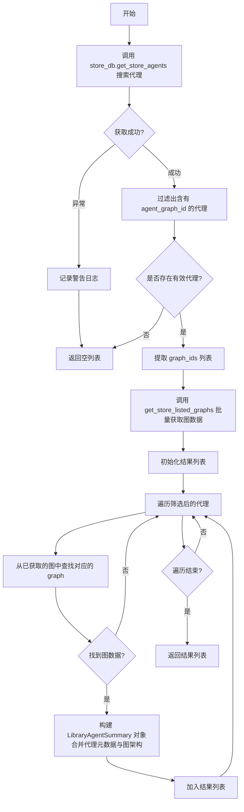

#### 带注释源码

```python
async def search_marketplace_agents_for_generation(
    search_query: str,
    max_results: int = 10,
) -> list[LibraryAgentSummary]:
    """Search marketplace agents formatted for Agent Generator.

    Fetches marketplace agents and their full schemas so they can be used
    as sub-agents in generated workflows.

    Args:
        search_query: Search term to find relevant public agents
        max_results: Maximum number of agents to return (default 10)

    Returns:
        List of LibraryAgentSummary with full input/output schemas
    """
    try:
        # 调用 store_db 获取市场代理列表
        response = await store_db.get_store_agents(
            search_query=search_query,
            page=1,
            page_size=max_results,
        )

        # 过滤出真正包含关联 Graph ID 的代理
        # 这确保了我们后续能获取到完整的输入/输出架构
        agents_with_graphs = [
            agent for agent in response.agents if agent.agent_graph_id
        ]

        # 如果没有找到关联了 Graph 的代理，直接返回空列表
        if not agents_with_graphs:
            return []

        # 提取所有 Graph ID，准备批量获取图详情
        graph_ids = [agent.agent_graph_id for agent in agents_with_graphs]
        graphs = await get_store_listed_graphs(*graph_ids)

        results: list[LibraryAgentSummary] = []
        # 遍历代理，将其基本信息与 Graph 的架构信息合并
        for agent in agents_with_graphs:
            graph_id = agent.agent_graph_id
            # 确保获取到了对应的 Graph 数据
            if graph_id and graph_id in graphs:
                graph = graphs[graph_id]
                # 构造统一的 LibraryAgentSummary 结构
                results.append(
                    LibraryAgentSummary(
                        graph_id=graph.id,
                        graph_version=graph.version,
                        name=agent.agent_name,       # 来自代理记录的名称
                        description=agent.description, # 来自代理记录的描述
                        input_schema=graph.input_schema,   # 来自 Graph 的输入架构
                        output_schema=graph.output_schema, # 来自 Graph 的输出架构
                    )
                )
        return results
    except Exception as e:
        # 异常处理：记录警告并返回空列表，防止上游流程中断
        logger.warning(f"Failed to search marketplace agents: {e}")
        return []
```


### `get_all_relevant_agents_for_generation`

从用户的库和/或市场获取相关代理。该函数通过聚合多个来源的代理来辅助代理生成过程：首先，它解析搜索查询中显式提到的特定图形 ID（UUID）并精确查找；其次，它根据搜索词搜索用户的私人库；第三，它搜索公共市场。它维护一个已见图形 ID 的集合以确保最终结果中没有重复项，并支持排除特定图形 ID 以防止循环引用。

参数：

- `user_id`：`str`，用户 ID
- `search_query`：`str | None`，用于查找相关代理的搜索词（例如用户的目标/描述）
- `exclude_graph_id`：`str | None`，要排除的可选图形 ID（防止循环引用）
- `include_library`：`bool`，是否搜索用户的库（默认 True）
- `include_marketplace`：`bool`，是否同时搜索市场（默认 True）
- `max_library_results`：`int`，要返回的最大库代理数（默认 15）
- `max_marketplace_results`：`int`，要返回的最大市场代理数（默认 10）

返回值：`list[AgentSummary]`，包含完整架构的代理摘要列表（包括库和市场代理）

#### 流程图

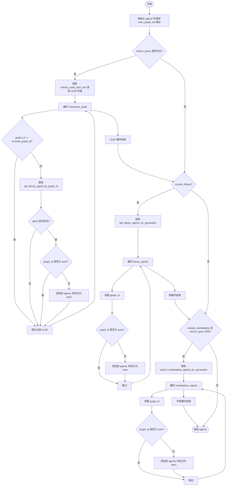

#### 带注释源码

```python
async def get_all_relevant_agents_for_generation(
    user_id: str,
    search_query: str | None = None,
    exclude_graph_id: str | None = None,
    include_library: bool = True,
    include_marketplace: bool = True,
    max_library_results: int = 15,
    max_marketplace_results: int = 10,
) -> list[AgentSummary]:
    """Fetch relevant agents from library and/or marketplace.

    Searches both user's library and marketplace by default.
    Explicitly mentioned UUIDs in the search query are always looked up.

    Args:
        user_id: The user ID
        search_query: Search term to find relevant agents (user's goal/description)
        exclude_graph_id: Optional graph ID to exclude (prevents circular references)
        include_library: Whether to search user's library (default True)
        include_marketplace: Whether to also search marketplace (default True)
        max_library_results: Max library agents to return (default 15)
        max_marketplace_results: Max marketplace agents to return (default 10)

    Returns:
        List of AgentSummary with full schemas (both library and marketplace agents)
    """
    # 初始化结果列表和用于去重的已见ID集合
    agents: list[AgentSummary] = []
    seen_graph_ids: set[str] = set()

    # 步骤 1: 如果搜索查询中包含显式的UUID，优先查找这些特定代理
    if search_query:
        mentioned_uuids = extract_uuids_from_text(search_query)
        for graph_id in mentioned_uuids:
            # 跳过需要排除的ID
            if graph_id == exclude_graph_id:
                continue
            # 尝试通过ID获取库代理
            agent = await get_library_agent_by_graph_id(user_id, graph_id)
            agent_graph_id = agent.get("graph_id") if agent else None
            # 如果代理存在且未被添加过，则加入结果
            if agent and agent_graph_id and agent_graph_id not in seen_graph_ids:
                agents.append(agent)
                seen_graph_ids.add(agent_graph_id)
                logger.debug(
                    f"Found explicitly mentioned agent: {agent.get('name') or 'Unknown'}"
                )

    # 步骤 2: 如果允许，搜索用户库中的代理
    if include_library:
        library_agents = await get_library_agents_for_generation(
            user_id=user_id,
            search_query=search_query,
            exclude_graph_id=exclude_graph_id,
            max_results=max_library_results,
        )
        # 遍历库代理结果，去重后添加
        for agent in library_agents:
            graph_id = agent.get("graph_id")
            if graph_id and graph_id not in seen_graph_ids:
                agents.append(agent)
                seen_graph_ids.add(graph_id)

    # 步骤 3: 如果允许且有搜索词，搜索市场中的代理
    if include_marketplace and search_query:
        marketplace_agents = await search_marketplace_agents_for_generation(
            search_query=search_query,
            max_results=max_marketplace_results,
        )
        # 遍历市场代理结果，去重后添加
        for agent in marketplace_agents:
            graph_id = agent.get("graph_id")
            if graph_id and graph_id not in seen_graph_ids:
                agents.append(agent)
                seen_graph_ids.add(graph_id)

    return agents
```


### `extract_search_terms_from_steps`

该函数用于从分解后的指令步骤中提取搜索关键词。它分析分解结果，识别出步骤中预定义字段（如描述、动作、工具名称等）的内容，作为后续检索库代理时的搜索词。函数会过滤掉过短的字符串，并对结果进行去重处理。

参数：

-  `decomposition_result`：`DecompositionResult | dict[str, Any]`，来自 `decompose_goal` 的结果对象，包含分解后的步骤信息。

返回值：`list[str]`，从步骤中提取的唯一搜索词列表。

#### 流程图

```mermaid
flowchart TD
    A[开始: extract_search_terms_from_steps] --> B[初始化 search_terms 列表]
    B --> C{检查 decomposition_result type 是否为 'instructions'}
    C -- 否 --> D[返回空列表]
    C -- 是 --> E[获取 steps 列表]
    E --> F{steps 是否为空?}
    F -- 是 --> D
    F -- 否 --> G[定义 step_keys: description, action, block_name, tool, name]
    G --> H[遍历每个 step]
    H --> I[遍历每个 key]
    I --> J{value 是字符串且长度 > 3?}
    J -- 是 --> K[将 value 添加到 search_terms]
    J -- 否 --> L[继续下一个 key]
    K --> L
    L --> M{是否遍历完所有 keys?}
    M -- 否 --> I
    M -- 是 --> N{是否遍历完所有 steps?}
    N -- 否 --> H
    N -- 是 --> O[对 search_terms 进行去重处理 (基于 lower() 判断)]
    O --> P[返回唯一的 unique_terms 列表]
```

#### 带注释源码

```python
def extract_search_terms_from_steps(
    decomposition_result: DecompositionResult | dict[str, Any],
) -> list[str]:
    """Extract search terms from decomposed instruction steps.

    Analyzes the decomposition result to extract relevant keywords
    for additional library agent searches.

    Args:
        decomposition_result: Result from decompose_goal containing steps

    Returns:
        List of unique search terms extracted from steps
    """
    # 初始化搜索词列表
    search_terms: list[str] = []

    # 检查分解结果的类型是否为 "instructions"，如果不是则无法提取步骤
    if decomposition_result.get("type") != "instructions":
        return search_terms

    # 获取步骤列表
    steps = decomposition_result.get("steps", [])
    # 如果没有步骤，直接返回
    if not steps:
        return search_terms

    # 定义需要提取字段名称的键列表
    step_keys: list[str] = ["description", "action", "block_name", "tool", "name"]

    # 遍历每个步骤
    for step in steps:
        # 遍历每个预定义的键
        for key in step_keys:
            # 获取当前键对应的值
            value = step.get(key)  # type: ignore[union-attr]
            # 如果值是字符串且长度大于3，则视为有效的搜索词
            if isinstance(value, str) and len(value) > 3:
                search_terms.append(value)

    # 对搜索词进行去重处理
    seen: set[str] = set()
    unique_terms: list[str] = []
    for term in search_terms:
        # 将搜索词转为小写以进行不区分大小写的去重比较
        term_lower = term.lower()
        if term_lower not in seen:
            seen.add(term_lower)
            unique_terms.append(term)

    return unique_terms
```


### `enrich_library_agents_from_steps`

通过基于分解后的步骤执行额外的搜索，来丰富库智能体列表。该函数实现了两阶段搜索：在分解后，根据识别出的具体步骤搜索额外的相关智能体。

参数：

-  `user_id`：`str`，用户 ID
-  `decomposition_result`：`DecompositionResult | dict[str, Any]`，来自 `decompose_goal` 的结果，包含步骤信息
-  `existing_agents`：`list[AgentSummary] | list[dict[str, Any]]`，从初始搜索中获取的已存在的库智能体列表
-  `exclude_graph_id`：`str | None`，可选，要排除的图 ID（防止循环引用）
-  `include_marketplace`：`bool`，是否也搜索智能体市场
-  `max_additional_results`：`int`，每次搜索查询返回的最大额外智能体数（默认为 10）

返回值：`list[AgentSummary] | list[dict[str, Any]]`，合并后的库智能体列表（包含初始智能体和新发现的智能体）

#### 流程图

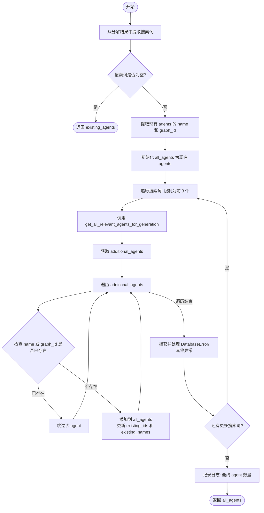

#### 带注释源码

```python
async def enrich_library_agents_from_steps(
    user_id: str,
    decomposition_result: DecompositionResult | dict[str, Any],
    existing_agents: list[AgentSummary] | list[dict[str, Any]],
    exclude_graph_id: str | None = None,
    include_marketplace: bool = True,
    max_additional_results: int = 10,
) -> list[AgentSummary] | list[dict[str, Any]]:
    # 1. 从分解结果中提取搜索词
    search_terms = extract_search_terms_from_steps(decomposition_result)

    # 如果没有搜索词，直接返回现有的智能体列表
    if not search_terms:
        return existing_agents

    # 2. 初始化用于去重的集合 (基于 name 和 graph_id)
    existing_ids: set[str] = set()
    existing_names: set[str] = set()

    for agent in existing_agents:
        # 提取并标准化名称为小写
        agent_name = agent.get("name")
        if agent_name and isinstance(agent_name, str):
            existing_names.add(agent_name.lower())
        
        # 提取 graph_id
        graph_id = agent.get("graph_id")  # type: ignore[call-overload]
        if graph_id and isinstance(graph_id, str):
            existing_ids.add(graph_id)

    # 初始化最终结果列表，包含现有的智能体
    all_agents: list[AgentSummary] | list[dict[str, Any]] = list(existing_agents)

    # 3. 遍历搜索词 (限制为前 3 个，防止过多请求)
    for term in search_terms[:3]:
        try:
            # 调用函数获取与当前词相关的额外智能体
            additional_agents = await get_all_relevant_agents_for_generation(
                user_id=user_id,
                search_query=term,
                exclude_graph_id=exclude_graph_id,
                include_marketplace=include_marketplace,
                max_library_results=max_additional_results,
                max_marketplace_results=5,
            )

            # 4. 遍历新获取的智能体并进行去重添加
            for agent in additional_agents:
                agent_name = agent.get("name")
                if not agent_name or not isinstance(agent_name, str):
                    continue
                agent_name_lower = agent_name.lower()

                # 如果名称已存在，跳过
                if agent_name_lower in existing_names:
                    continue

                # 获取 graph_id
                graph_id = agent.get("graph_id")  # type: ignore[call-overload]
                
                # 如果 ID 已存在，跳过
                if graph_id and graph_id in existing_ids:
                    continue

                # 添加新智能体到结果列表，并更新去重集合
                all_agents.append(agent)
                existing_names.add(agent_name_lower)
                if graph_id and isinstance(graph_id, str):
                    existing_ids.add(graph_id)

        # 数据库错误需要抛出
        except DatabaseError:
            logger.error(f"Database error searching for agents with term '{term}'")
            raise
        # 其他错误仅记录警告，继续处理其他搜索词
        except Exception as e:
            logger.warning(
                f"Failed to search for additional agents with term '{term}': {e}"
            )

    # 记录最终统计日志
    logger.debug(
        f"Enriched library agents: {len(existing_agents)} initial + "
        f"{len(all_agents) - len(existing_agents)} additional = {len(all_agents)} total"
    )

    return all_agents
```


### `decompose_goal`

该函数负责通过调用外部服务将自然语言描述的目标分解为结构化的执行步骤，或在信息不足时返回澄清问题，同时支持传入用户的库代理列表以辅助子代理的组合规划。

参数：

- `description`：`str`，自然语言目标描述
- `context`：`str`，额外上下文（例如，对之前问题的回答）
- `library_agents`：`list[AgentSummary] | None`，可用于子代理组合的用户库代理

返回值：`DecompositionResult | None`，包含澄清问题或指令步骤的分解结果对象，若发生错误则返回 None。

#### 流程图

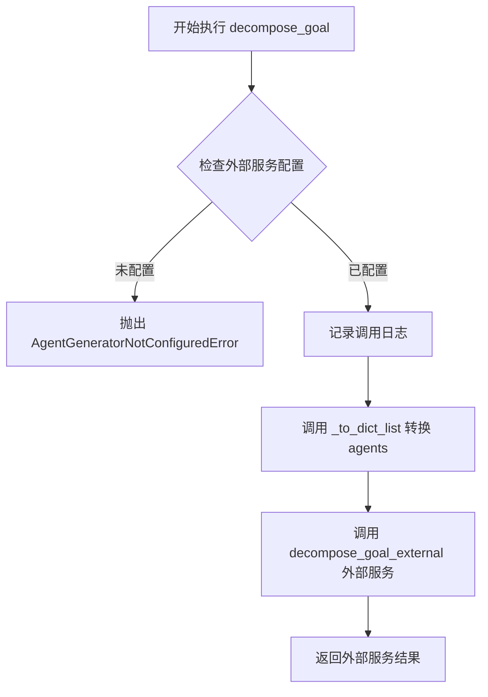

#### 带注释源码

```python
async def decompose_goal(
    description: str,
    context: str = "",
    library_agents: list[AgentSummary] | None = None,
) -> DecompositionResult | None:
    """Break down a goal into steps or return clarifying questions.

    Args:
        description: Natural language goal description
        context: Additional context (e.g., answers to previous questions)
        library_agents: User's library agents available for sub-agent composition

    Returns:
        DecompositionResult with either:
        - {"type": "clarifying_questions", "questions": [...]}
        - {"type": "instructions", "steps": [...]}
        Or None on error

    Raises:
        AgentGeneratorNotConfiguredError: If the external service is not configured.
    """
    # 检查外部 Agent Generator 服务是否已正确配置，若未配置则抛出异常
    _check_service_configured()
    
    # 记录日志，表明正在调用外部服务进行目标分解
    logger.info("Calling external Agent Generator service for decompose_goal")
    
    # 调用外部服务接口，传入目标描述、上下文以及转换后的代理字典列表
    result = await decompose_goal_external(
        description, context, _to_dict_list(library_agents)
    )
    
    # 返回外部服务处理后的结果（忽略返回值类型检查）
    return result  # type: ignore[return-value]
```


### `generate_agent`

Generate agent JSON from instructions. This function coordinates with an external Agent Generator service to construct an agent based on provided instructions and optional library agents. It handles both synchronous and asynchronous processing modes, and ensures the returned JSON contains necessary metadata fields like ID, version, and active status. If the request is asynchronous, it returns an acknowledgment status.

参数：

-  `instructions`：`DecompositionResult | dict[str, Any]`，Structured instructions obtained from the decompose_goal function.
-  `library_agents`：`list[AgentSummary] | list[dict[str, Any]] | None`，User's library agents available for sub-agent composition.
-  `operation_id`：`str | None`，Operation ID for async processing (enables Redis Streams completion notification).
-  `task_id`：`str | None`，Task ID for async processing (enables Redis Streams persistence and SSE delivery).

返回值：`dict[str, Any] | None`，Returns the generated Agent JSON dict, `{"status": "accepted"}` for async operations, an error dict `{"type": "error", ...}`, or None if an error occurs.

#### 流程图

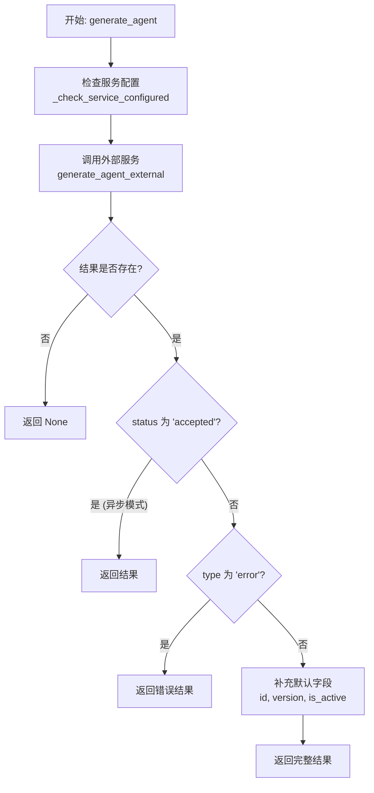

#### 带注释源码

```python
async def generate_agent(
    instructions: DecompositionResult | dict[str, Any],
    library_agents: list[AgentSummary] | list[dict[str, Any]] | None = None,
    operation_id: str | None = None,
    task_id: str | None = None,
) -> dict[str, Any] | None:
    """Generate agent JSON from instructions.

    Args:
        instructions: Structured instructions from decompose_goal
        library_agents: User's library agents available for sub-agent composition
        operation_id: Operation ID for async processing (enables Redis Streams
            completion notification)
        task_id: Task ID for async processing (enables Redis Streams persistence
            and SSE delivery)

    Returns:
        Agent JSON dict, {"status": "accepted"} for async, error dict {"type": "error", ...}, or None on error

    Raises:
        AgentGeneratorNotConfiguredError: If the external service is not configured.
    """
    # 1. 检查外部服务配置状态
    _check_service_configured()
    logger.info("Calling external Agent Generator service for generate_agent")
    
    # 2. 调用外部服务进行代理生成
    result = await generate_agent_external(
        dict(instructions), _to_dict_list(library_agents), operation_id, task_id
    )

    # 3. 如果是异步处理响应，直接返回，不做修改
    # Don't modify async response
    if result and result.get("status") == "accepted":
        return result

    # 4. 处理同步生成结果或错误
    if result:
        # 如果是外部返回的错误字典，直接返回
        if isinstance(result, dict) and result.get("type") == "error":
            return result
        # 补充缺失的必要字段
        if "id" not in result:
            result["id"] = str(uuid.uuid4())
        if "version" not in result:
            result["version"] = 1
        if "is_active" not in result:
            result["is_active"] = True
    return result
```


### `json_to_graph`

将代理 JSON 字典转换为 Graph 模型对象。该函数主要负责验证输入的 JSON 数据结构的完整性，特别是节点和链接的必填字段，并将原始字典数据转换为强类型的 Node、Link 和 Graph 实体。

参数：

- `agent_json`: `dict[str, Any]`，包含节点和链接定义的代理 JSON 字典。通常由外部服务生成或从前端传入。

返回值：`Graph`，经过验证和转换后的 Graph 对象，准备好进行数据库保存。

#### 流程图

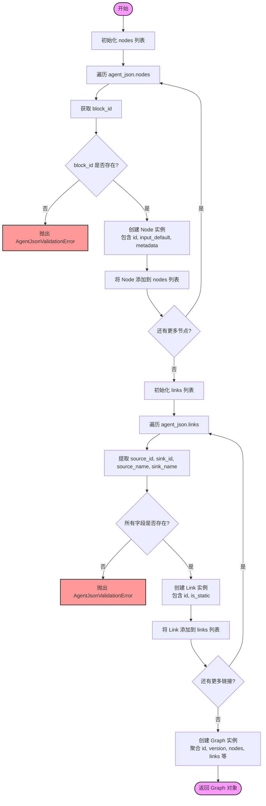

#### 带注释源码

```python
def json_to_graph(agent_json: dict[str, Any]) -> Graph:
    """Convert agent JSON dict to Graph model.

    Args:
        agent_json: Agent JSON with nodes and links

    Returns:
        Graph ready for saving

    Raises:
        AgentJsonValidationError: If required fields are missing from nodes or links
    """
    # 初始化节点列表
    nodes = []
    # 遍历 JSON 中的节点数据
    for idx, n in enumerate(agent_json.get("nodes", [])):
        # 获取 block_id，这是节点的核心标识
        block_id = n.get("block_id")
        if not block_id:
            # 如果没有 block_id，获取节点 ID（如果存在）用于错误提示
            node_id = n.get("id", f"index_{idx}")
            # 抛出验证异常，提示缺少必填字段
            raise AgentJsonValidationError(
                f"Node '{node_id}' is missing required field 'block_id'"
            )
        # 创建 Node 对象，设置默认值为 UUID（如果未提供），并保留默认输入和元数据
        node = Node(
            id=n.get("id", str(uuid.uuid4())),
            block_id=block_id,
            input_default=n.get("input_default", {}),
            metadata=n.get("metadata", {}),
        )
        nodes.append(node)

    # 初始化链接列表
    links = []
    # 遍历 JSON 中的链接数据
    for idx, link_data in enumerate(agent_json.get("links", [])):
        # 提取链接的关键字段
        source_id = link_data.get("source_id")
        sink_id = link_data.get("sink_id")
        source_name = link_data.get("source_name")
        sink_name = link_data.get("sink_name")

        # 检查是否有缺失的字段
        missing_fields = []
        if not source_id:
            missing_fields.append("source_id")
        if not sink_id:
            missing_fields.append("sink_id")
        if not source_name:
            missing_fields.append("source_name")
        if not sink_name:
            missing_fields.append("sink_name")

        # 如果有缺失字段，抛出验证异常
        if missing_fields:
            link_id = link_data.get("id", f"index_{idx}")
            raise AgentJsonValidationError(
                f"Link '{link_id}' is missing required fields: {', '.join(missing_fields)}"
            )

        # 创建 Link 对象，设置默认值为 UUID（如果未提供），并保留静态标志
        link = Link(
            id=link_data.get("id", str(uuid.uuid4())),
            source_id=source_id,
            sink_id=sink_id,
            source_name=source_name,
            sink_name=sink_name,
            is_static=link_data.get("is_static", False),
        )
        links.append(link)

    # 创建并返回最终的 Graph 对象，填充所有通用属性和转换后的 nodes/links
    return Graph(
        id=agent_json.get("id", str(uuid.uuid4())),
        version=agent_json.get("version", 1),
        is_active=agent_json.get("is_active", True),
        name=agent_json.get("name", "Generated Agent"),
        description=agent_json.get("description", ""),
        nodes=nodes,
        links=links,
    )
```


### `save_agent_to_library`

Save agent to database and user's library.

参数：

-  `agent_json`：`dict[str, Any]`，Agent JSON dict
-  `user_id`：`str`，User ID
-  `is_update`：`bool`，Whether this is an update to an existing agent

返回值：`tuple[Graph, Any]`，Tuple of (created Graph, LibraryAgent)

#### 流程图

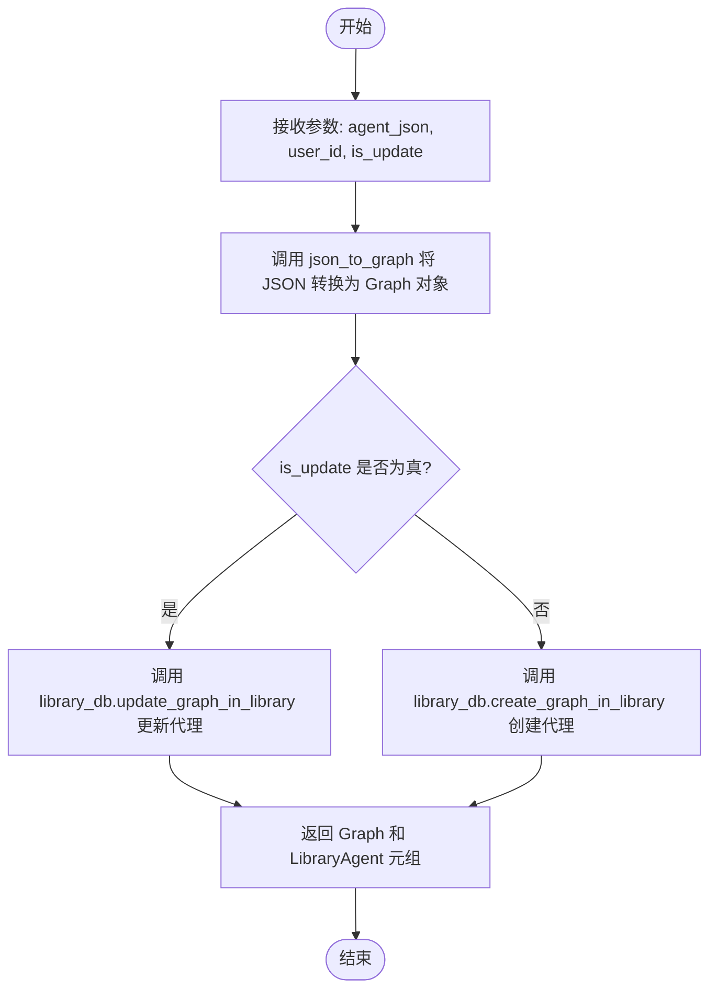

#### 带注释源码

```python
async def save_agent_to_library(
    agent_json: dict[str, Any], user_id: str, is_update: bool = False
) -> tuple[Graph, Any]:
    """Save agent to database and user's library.

    Args:
        agent_json: Agent JSON dict
        user_id: User ID
        is_update: Whether this is an update to an existing agent

    Returns:
        Tuple of (created Graph, LibraryAgent)
    """
    # 将输入的 JSON 数据转换为 Graph 对象模型
    graph = json_to_graph(agent_json)

    # 根据 is_update 标志决定是更新现有代理还是创建新代理
    if is_update:
        # 更新数据库和库中的现有图
        return await library_db.update_graph_in_library(graph, user_id)
    
    # 在数据库和库中创建新图
    return await library_db.create_graph_in_library(graph, user_id)
```


### `graph_to_json`

将 Graph 对象转换为 JSON 格式，以便用于代理生成器或 API 响应。

参数：

-  `graph`：`Graph`，要转换的 Graph 对象

返回值：`dict[str, Any]`，包含代理节点、链接及元数据的 JSON 字典

#### 流程图

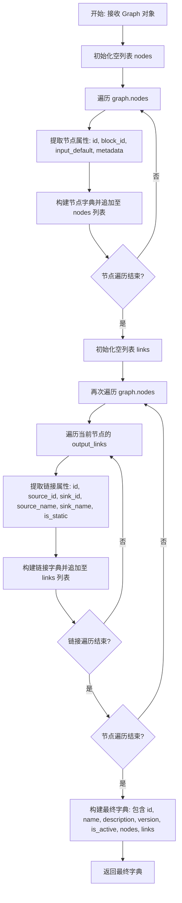

#### 带注释源码

```python
def graph_to_json(graph: Graph) -> dict[str, Any]:
    """Convert a Graph object to JSON format for the agent generator.

    Args:
        graph: Graph object to convert

    Returns:
        Agent as JSON dict
    """
    # 初始化节点列表
    nodes = []
    # 遍历图中的所有节点，将其转换为字典格式
    for node in graph.nodes:
        nodes.append(
            {
                "id": node.id,
                "block_id": node.block_id,
                "input_default": node.input_default,
                "metadata": node.metadata,
            }
        )

    # 初始化链接列表
    links = []
    # 再次遍历图中的节点，通过访问节点的 output_links 来收集所有链接
    for node in graph.nodes:
        for link in node.output_links:
            links.append(
                {
                    "id": link.id,
                    "source_id": link.source_id,
                    "sink_id": link.sink_id,
                    "source_name": link.source_name,
                    "sink_name": link.sink_name,
                    "is_static": link.is_static,
                }
            )

    # 返回组装好的完整字典，包含图的基本信息和节点/链表列表
    return {
        "id": graph.id,
        "name": graph.name,
        "description": graph.description,
        "version": graph.version,
        "is_active": graph.is_active,
        "nodes": nodes,
        "links": links,
    }
```


### `get_agent_as_json`

Fetch an agent and convert to JSON format for editing.

参数：

- `agent_id`：`str`，Graph ID or library agent ID
- `user_id`：`str | None`，User ID

返回值：`dict[str, Any] | None`，Agent as JSON dict or None if not found

#### 流程图

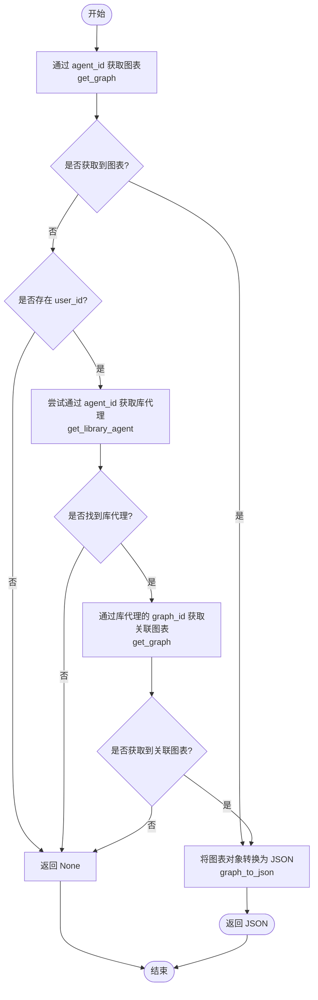

#### 带注释源码

```python
async def get_agent_as_json(
    agent_id: str, user_id: str | None
) -> dict[str, Any] | None:
    """Fetch an agent and convert to JSON format for editing.

    Args:
        agent_id: Graph ID or library agent ID
        user_id: User ID

    Returns:
        Agent as JSON dict or None if not found
    """
    # 尝试直接使用提供的 ID 获取 Graph 对象
    graph = await get_graph(agent_id, version=None, user_id=user_id)

    # 如果直接获取失败，且提供了 user_id，则尝试将其作为 library agent ID 查找
    if not graph and user_id:
        try:
            # 尝试从库中获取代理记录，以获取其对应的真实 graph_id
            library_agent = await library_db.get_library_agent(agent_id, user_id)
            # 使用库代理记录中的 graph_id 再次获取 Graph 对象
            graph = await get_graph(
                library_agent.graph_id, version=None, user_id=user_id
            )
        except NotFoundError:
            # 如果库中也不存在该代理，则捕获异常并继续
            pass

    # 如果最终仍未找到 Graph 对象，则返回 None
    if not graph:
        return None

    # 将 Graph 对象转换为可序列化的 JSON 格式字典并返回
    return graph_to_json(graph)
```


### `generate_agent_patch`

使用自然语言更新现有智能体。该函数通过调用外部服务来处理补丁生成、应用、修复和验证过程。

参数：

- `update_request`：`str`，变更的自然语言描述
- `current_agent`：`dict[str, Any]`，当前智能体的 JSON 数据
- `library_agents`：`list[AgentSummary] | None`，用户库中可用于子智能体组合的智能体列表
- `operation_id`：`str | None`，用于异步处理的操作 ID（启用 Redis Streams 回调）
- `task_id`：`str | None`，用于异步处理的任务 ID（启用 Redis Streams 回调）

返回值：`dict[str, Any] | None`，返回更新后的智能体 JSON、澄清问题字典 `{"type": "clarifying_questions", ...}`、用于异步处理的 `{"status": "accepted"}`、错误字典 `{"type": "error", ...}`，或者在发生错误时返回 `None`。

#### 流程图

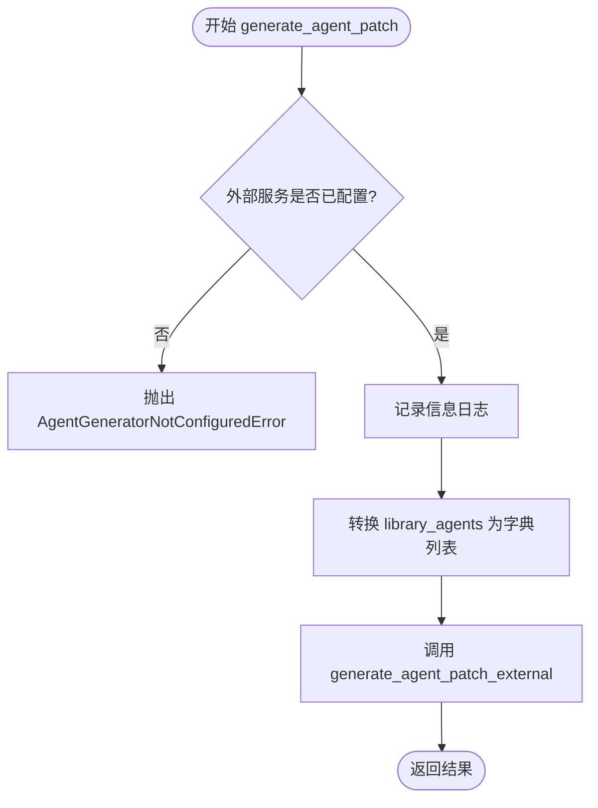

#### 带注释源码

```python
async def generate_agent_patch(
    update_request: str,
    current_agent: dict[str, Any],
    library_agents: list[AgentSummary] | None = None,
    operation_id: str | None = None,
    task_id: str | None = None,
) -> dict[str, Any] | None:
    """Update an existing agent using natural language.

    The external Agent Generator service handles:
    - Generating the patch
    - Applying the patch
    - Fixing and validating the result

    Args:
        update_request: Natural language description of changes
        current_agent: Current agent JSON
        library_agents: User's library agents available for sub-agent composition
        operation_id: Operation ID for async processing (enables Redis Streams callback)
        task_id: Task ID for async processing (enables Redis Streams callback)

    Returns:
        Updated agent JSON, clarifying questions dict {"type": "clarifying_questions", ...},
        {"status": "accepted"} for async, error dict {"type": "error", ...}, or None on error

    Raises:
        AgentGeneratorNotConfiguredError: If the external service is not configured.
    """
    # 检查外部服务是否已配置，如果未配置则抛出异常
    _check_service_configured()
    
    # 记录调用外部服务的信息日志
    logger.info("Calling external Agent Generator service for generate_agent_patch")
    
    # 调用外部服务生成智能体补丁，并传入更新请求、当前智能体、转换后的库智能体列表以及操作/任务ID
    return await generate_agent_patch_external(
        update_request,
        current_agent,
        _to_dict_list(library_agents),  # 将类型化的智能体摘要转换为普通字典列表
        operation_id,
        task_id,
    )
```


### `customize_template`

使用自然语言自定义模板或市场智能体。该函数用于用户希望修改模板或市场智能体以适应其特定需求并将其添加到库中的场景。它通过检查外部服务配置，然后调用外部智能体生成器服务来处理请求、应用更改并验证结果，最终返回自定义后的智能体数据。

参数：

-  `template_agent`：`dict[str, Any]`，需要自定义的模板智能体 JSON 数据。
-  `modification_request`：`str`，描述自定义内容的自然语言请求。
-  `context`：`str`，附加的上下文信息（例如，对先前问题的回答）。

返回值：`dict[str, Any] | None`，返回自定义后的智能体 JSON、包含澄清问题的字典（`{"type": "clarifying_questions", ...}`）、错误字典（`{"type": "error", ...}`），或者在发生意外错误时返回 `None`。

#### 流程图

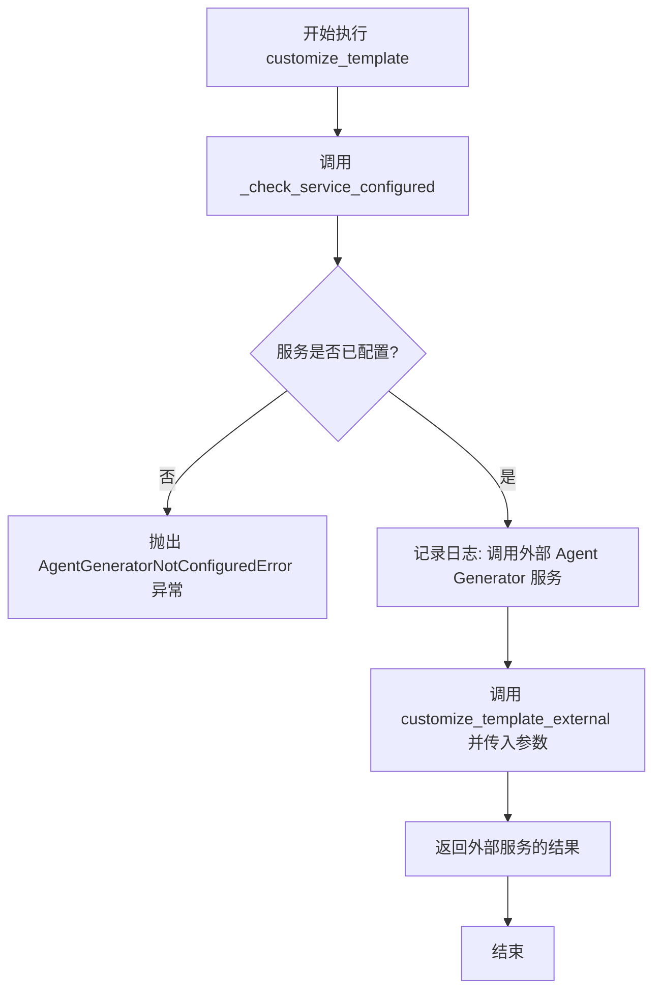

#### 带注释源码

```python
async def customize_template(
    template_agent: dict[str, Any],
    modification_request: str,
    context: str = "",
) -> dict[str, Any] | None:
    """Customize a template/marketplace agent using natural language.

    This is used when users want to modify a template or marketplace agent
    to fit their specific needs before adding it to their library.

    The external Agent Generator service handles:
    - Understanding the modification request
    - Applying changes to the template
    - Fixing and validating the result

    Args:
        template_agent: The template agent JSON to customize
        modification_request: Natural language description of customizations
        context: Additional context (e.g., answers to previous questions)

    Returns:
        Customized agent JSON, clarifying questions dict {"type": "clarifying_questions", ...},
        error dict {"type": "error", ...}, or None on unexpected error

    Raises:
        AgentGeneratorNotConfiguredError: If the external service is not configured.
    """
    # 检查外部 Agent Generator 服务是否已正确配置，若未配置则抛出异常
    _check_service_configured()
    
    # 记录日志，指示正在调用外部服务执行 customize_template 操作
    logger.info("Calling external Agent Generator service for customize_template")
    
    # 调用外部服务执行实际的定制逻辑，并返回结果
    return await customize_template_external(
        template_agent, modification_request, context
    )
```


## 关键组件


### External Service Integration
Manages interactions with an external Agent Generator service, including configuration checks and delegating requests for goal decomposition, agent generation, patching, and template customization.

### Agent Retrieval and Search
Handles the fetching, searching, and formatting of agents from both the user's private library and the public marketplace, incorporating execution history and schema information to provide context for generation.

### Data Transformation and Serialization
Provides conversion logic between internal `Graph` domain models and JSON-compatible dictionaries, ensuring data integrity and structure validation during agent creation and storage.

### Workflow Orchestration
Coordinates the complex logic of the agent generation pipeline, including parsing text for UUIDs, extracting search terms from decomposed steps to enrich context, and managing asynchronous operations.


## 问题及建议


### 已知问题

-   **串行异步调用导致性能瓶颈**：在 `enrich_library_agents_from_steps` 函数中，循环调用 `get_all_relevant_agents_for_generation` 时使用了串行的 `await`，导致每个搜索词的查询必须等待前一个完成后才能开始，显著增加了总延迟。
-   **泛捕获异常掩盖潜在错误**：在 `get_library_agents_for_generation` 和 `search_marketplace_agents_for_generation` 等函数中，使用了 `except Exception as e` 并仅记录日志后返回空列表。这种做法会掩盖非预期的逻辑错误或网络异常，使得系统在部分功能降级时难以排查根本原因。
-   **重复的去重逻辑**：在 `get_all_relevant_agents_for_generation` 和 `enrich_library_agents_from_steps` 中均手动实现了基于 `graph_id` 和 `name` 的去重逻辑。代码重复增加了维护成本，且手动管理 `seen` 集合容易在后续迭代中引入漏判或性能问题。
-   **函数副作用风险**：`generate_agent` 函数直接修改了外部服务返回的 `result` 字典（如添加 `id`, `version` 等）。这种在外部函数返回值上进行就地修改的做法具有副作用，假设了返回值总是可变字典，若外部服务契约变更可能导致不可预知的错误。

### 优化建议

-   **并行化外部搜索请求**：建议在 `enrich_library_agents_from_steps` 中使用 `asyncio.gather` 来并行执行针对不同搜索词的 Agent 查询请求，从而显著降低接口响应的总耗时。
-   **引入配置常量管理**：建议将代码中散落的魔术数字（如 `max_results=15`, `max_additional_results=10`, `search_terms[:3]`）提取为模块级别的配置常量或通过配置文件注入，以提高代码的可配置性和可读性。
-   **统一数据验证机制**：建议使用 Pydantic 或类似的数据验证库替代 `json_to_graph` 中手动的字段存在性检查和异常抛出。结构化验证能提供更清晰的错误信息，并自动处理类型转换，减少样板代码。
-   **封装去重逻辑**：建议将 Agent 列表的去重逻辑（包括 ID 和 Name 的唯一性检查）封装为一个独立的辅助函数或类方法，确保在合并 Library 和 Marketplace Agent 列表时行为的一致性。


## 其它


### 设计目标与约束

**设计目标：**
1.  **智能体生成编排**：作为核心编排层，负责连接数据库（用户库、应用市场）与外部智能体生成服务，实现从自然语言描述到可执行智能体图的转换。
2.  **上下文感知增强**：通过检索用户私有库和应用市场中的相关智能体，利用其 Schema 和历史执行数据作为上下文，提高生成结果的准确性和复用性。
3.  **异步流程支持**：支持通过 `operation_id` 和 `task_id` 与外部服务交互，以适配长耗时生成任务（如 Redis Streams 异步通知机制）。
4.  **两阶段搜索策略**：实现初步搜索与基于分解步骤的二次搜索（`enrich_library_agents_from_steps`），以发现更多潜在的相关子智能体。

**约束：**
1.  **外部服务依赖**：核心生成逻辑（分解、生成、打补丁、定制）完全依赖外部 Agent Generator 服务。如果未配置 `AGENTGENERATOR_HOST`，所有生成功能将不可用。
2.  **数据格式严格性**：与外部服务交互及内部处理时，必须严格遵循 `TypedDict` 定义的 Schema（如 `LibraryAgentSummary`, `DecompositionResult`），生成的 JSON 必须通过 `json_to_graph` 的严格校验（如必须包含 `block_id`）。
3.  **性能限制**：在检索库和市场智能体时，必须限制返回数量（如 `max_results`），防止大量数据拖慢生成请求或超出 Token 限制。
4.  **去重机制**：在获取相关智能体时，必须通过 `graph_id` 进行去重，防止在列表中重复引用同一个智能体。

### 错误处理与异常设计

**自定义异常：**
1.  **`AgentGeneratorNotConfiguredError`**：
    *   **触发条件**：当外部 Agent Generator 服务的主机地址未配置时，在调用任何生成相关函数前抛出。
    *   **处理策略**：阻断请求执行，向调用方提示需要配置环境变量。
2.  **`AgentJsonValidationError`**：
    *   **触发条件**：在 `json_to_graph` 转换过程中，发现生成的 JSON 缺少关键字段（如 Node 的 `block_id` 或 Link 的 `source_id`/`sink_id`）。
    *   **处理策略**：阻断数据入库，防止损坏的数据写入数据库，提示具体的缺失字段信息。

**异常传播与容错：**
1.  **数据库异常**：
    *   `DatabaseError`：通常直接向上抛出，由上层全局处理器处理事务回滚。
    *   `NotFoundError`：在获取单个智能体（如 `get_library_agent_by_id`）时被视为预期行为的一部分，返回 `None` 而非抛出异常，以支持多策略查找（先查 graph_id，再查 agent_id）。
2.  **外部服务错误**：
    *   外部服务返回的错误字典（`{"type": "error", ...}`）会被透传给调用方，而非抛出异常。
    *   异步响应（`{"status": "accepted"}`）也直接透传，不进行修改。
3.  **通用异常捕获**：
    *   在搜索和获取智能体的函数中（如 `search_marketplace_agents_for_generation`），捕获 `Exception` 并记录 Warning 日志，通常返回空列表 `[]`，确保部分功能的失败（如市场搜索挂了）不会完全阻塞主流程（如只生成不使用市场智能体）。

### 数据流与状态机

**数据流：**
1.  **输入阶段**：接收用户的自然语言目标（`description`）或修改请求（`update_request`）。
2.  **上下文检索阶段**：
    *   解析输入中的 UUID。
    *   并行或串行查询用户库 (`get_library_agents_for_generation`) 和应用市场 (`search_marketplace_agents_for_generation`)。
    *   可选阶段：若调用 `decompose_goal`，解析返回的 Steps，提取关键词进行二次检索，扩充候选智能体列表。
3.  **生成/处理阶段**：将上下文和指令发送给外部服务。
    *   流程 A (Goal -> Agent): `decompose_goal` -> `generate_agent`。
    *   流程 B (Edit Agent): `generate_agent_patch`。
    *   流程 C (Template): `customize_template`。
4.  **转换与持久化阶段**：
    *   接收外部服务返回的 JSON 字典。
    *   `json_to_graph` 将字典转换为内部领域模型 `Graph`，并进行严格校验。
    *   `save_agent_to_library` 将 `Graph` 持久化到数据库。

**状态机（逻辑状态）：**
虽然代码未显式定义状态机类，但 `DecompositionResult` 类型隐含了生成流程的状态分支：
1.  **状态：`clarifying_questions`**（澄清问题）
    *   含义：外部服务认为信息不足，生成问题列表。
    *   动作：停止生成，返回问题等待用户回答。
2.  **状态：`instructions`**（指令）
    *   含义：外部服务已将目标拆解为可执行的 Steps。
    *   动作：进入下一步 `generate_agent` 或进行二次搜索。
3.  **状态：`error`**（错误）
    *   含义：生成过程中发生逻辑错误。
    *   动作：终止流程，返回错误信息。
4.  **状态：`accepted`**（已接受）
    *   含义：请求已进入异步处理队列。
    *   动作：立即返回，由后台通过 Redis Streams 完成后续处理。

### 外部依赖与接口契约

**外部依赖：**
1.  **`backend.api.features.library.db`**：
    *   依赖项：`get_library_agent`, `get_library_agent_by_graph_id`, `list_library_agents`, `create_graph_in_library`, `update_graph_in_library`。
    *   用途：用户私有智能体的元数据、Schema 及历史执行记录的读写。
2.  **`backend.api.features.store.db`**：
    *   依赖项：`get_store_agents`。
    *   用途：检索应用市场中的公共智能体信息。
3.  **`backend.data.graph`**：
    *   依赖项：`Graph`, `Link`, `Node`, `get_graph`, `get_store_listed_graphs`。
    *   用途：提供图数据结构定义及底层图数据获取。
4.  **`.service` (External Service Wrapper)**：
    *   依赖项：`decompose_goal_external`, `generate_agent_external`, `generate_agent_patch_external`, `customize_template_external`, `is_external_service_configured`。
    *   用途：与远程 LLM 服务通信，执行核心的推理和生成逻辑。

**接口契约：**
1.  **数据契约**：
    *   **输入**：外部服务函数通常接受 `dict` 类型的指令和 `list[dict]` 类型的智能体列表。本模块负责将内部的 TypedDict（如 `LibraryAgentSummary`）转换为 `dict` (`_to_dict_list`)。
    *   **输出**：外部服务返回 `dict[str, Any]`。本模块约定若包含 `{"type": "error"}` 则为错误响应，若包含 `{"status": "accepted"}` 则为异步响应。
2.  **异步契约**：
    *   `operation_id` 和 `task_id` 是可选参数。如果提供，外部服务承诺使用这些 ID 进行异步状态更新（如通过 Redis Pub/Sub 或 Streams），本模块仅负责透传。
3.  **Schema 契约**：
    *   `json_to_graph` 要求输入的 Agent JSON 必须包含拓扑结构明确的 Nodes 和 Links。Node 必须有 `block_id`（对应可执行代码块），Link 必须有源和 sink 的 ID 及名称。这是确保生成的图可以被执行引擎运行的关键约束。

    