# `AutoGPT\autogpt_platform\backend\backend\api\features\chat\tools\agent_generator\service.py` 详细设计文档

该模块提供了一个用于与外部 Agent Generator 微服务进行通信的客户端，封装了目标分解、Agent 生成与更新、模板定制及资源获取等功能，并包含连接管理和标准化的错误处理机制。

## 整体流程

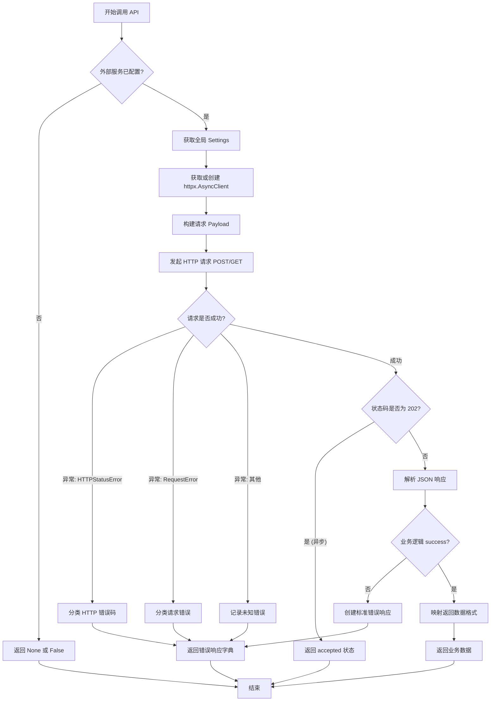

## 类结构

```
No Classes Defined
├── Global Variables
│   ├── logger
│   ├── _client
│   └── _settings
└── Global Functions
    ├── _create_error_response
    ├── _classify_http_error
    ├── _classify_request_error
    ├── _get_settings
    ├── is_external_service_configured
    ├── _get_base_url
    ├── _get_client
    ├── decompose_goal_external
    ├── generate_agent_external
    ├── generate_agent_patch_external
    ├── customize_template_external
    ├── get_blocks_external
    ├── health_check
    └── close_client
```

## 全局变量及字段


### `logger`
    
日志记录器实例，用于记录模块级别的日志信息。

类型：`logging.Logger`
    


### `_client`
    
单例异步 HTTP 客户端，用于与外部 Agent Generator 服务进行通信。

类型：`httpx.AsyncClient | None`
    


### `_settings`
    
单例配置对象，用于存储和检索 Agent Generator 的连接设置。

类型：`Settings | None`
    


    

## 全局函数及方法


### `_create_error_response`

创建一个标准化的错误响应字典。

参数：

-  `error_message`：`str`，人类可读的错误消息
-  `error_type`：`str`，机器可读的错误类型
-  `details`：`dict[str, Any] | None`，可选的额外错误详情

返回值：`dict[str, Any]`，包含 type="error" 和错误详情的错误字典

#### 流程图

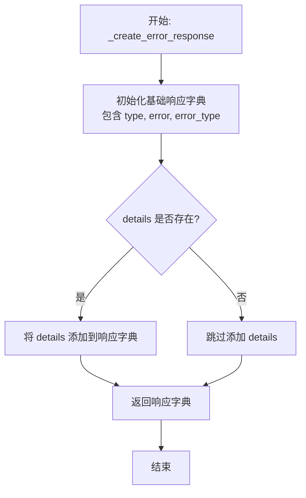

#### 带注释源码

```python
def _create_error_response(
    error_message: str,
    error_type: str = "unknown",
    details: dict[str, Any] | None = None,
) -> dict[str, Any]:
    """Create a standardized error response dict.

    Args:
        error_message: Human-readable error message
        error_type: Machine-readable error type
        details: Optional additional error details

    Returns:
        Error dict with type="error" and error details
    """
    # 初始化标准错误响应字典，包含类型标识、错误信息和错误类型
    response: dict[str, Any] = {
        "type": "error",
        "error": error_message,
        "error_type": error_type,
    }
    
    # 如果提供了额外的详情信息，将其添加到响应字典中
    if details:
        response["details"] = details
        
    # 返回构造好的错误字典
    return response
```


### `_classify_http_error`

Classify an HTTP error into error_type and message.

参数：

- `e`：`httpx.HTTPStatusError`，The HTTP status error

返回值：`tuple[str, str]`，Tuple of (error_type, error_message)

#### 流程图

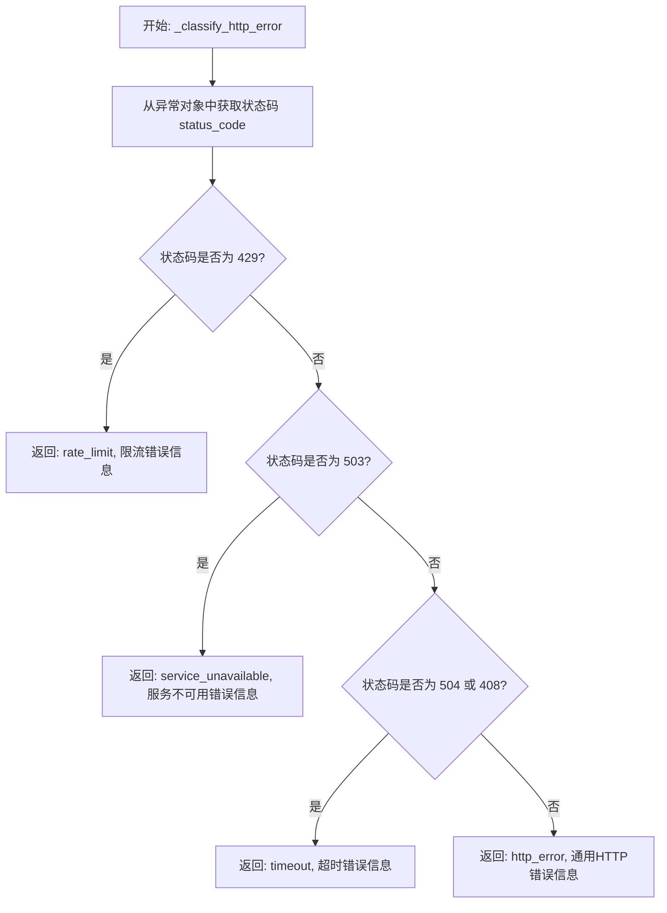

#### 带注释源码

```python
def _classify_http_error(e: httpx.HTTPStatusError) -> tuple[str, str]:
    """Classify an HTTP error into error_type and message.

    Args:
        e: The HTTP status error

    Returns:
        Tuple of (error_type, error_message)
    """
    # 提取 HTTP 响应状态码
    status = e.response.status_code
    
    # 判断是否为 429 Too Many Requests (限流)
    if status == 429:
        return "rate_limit", f"Agent Generator rate limited: {e}"
    
    # 判断是否为 503 Service Unavailable (服务不可用)
    elif status == 503:
        return "service_unavailable", f"Agent Generator unavailable: {e}"
    
    # 判断是否为 504 Gateway Timeout 或 408 Request Timeout (超时)
    elif status == 504 or status == 408:
        return "timeout", f"Agent Generator timed out: {e}"
    
    # 其他未明确处理的 HTTP 错误
    else:
        return "http_error", f"HTTP error calling Agent Generator: {e}"
```


### `_classify_request_error`

将请求错误归类为错误类型和消息。

参数：

- `e`：`httpx.RequestError`，需要分类的请求错误对象

返回值：`tuple[str, str]`，包含两个元素的元组：(error_type, error_message)

#### 流程图

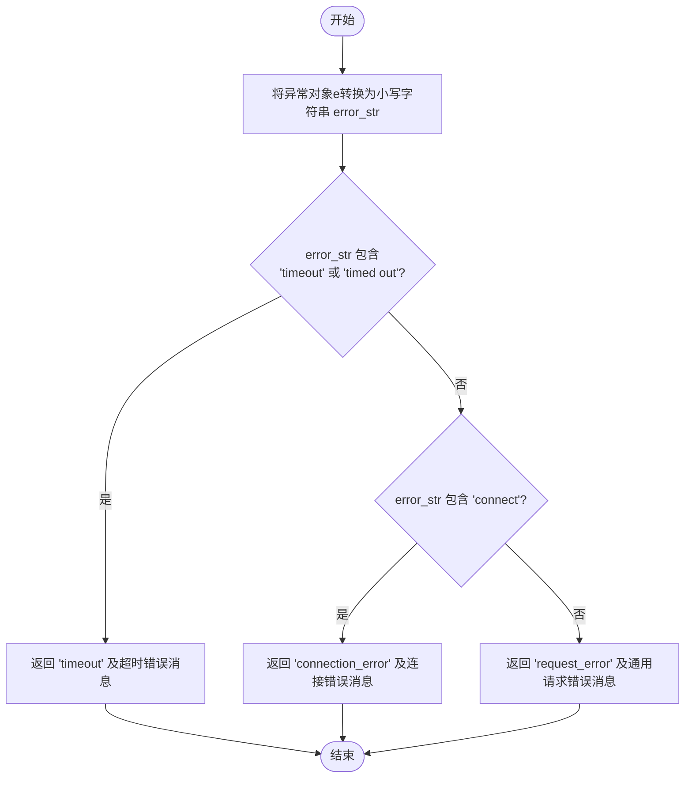

#### 带注释源码

```python
def _classify_request_error(e: httpx.RequestError) -> tuple[str, str]:
    """将请求错误归类为错误类型和消息。

    Args:
        e: 请求错误

    Returns:
        包含 (error_type, error_message) 的元组
    """
    # 将异常对象转换为小写字符串，以便进行不区分大小写的关键字匹配
    error_str = str(e).lower()
    
    # 检查错误字符串中是否包含超时相关的关键词
    if "timeout" in error_str or "timed out" in error_str:
        return "timeout", f"Agent Generator request timed out: {e}"
    # 检查错误字符串中是否包含连接相关的关键词
    elif "connect" in error_str:
        return "connection_error", f"Could not connect to Agent Generator: {e}"
    # 如果不属于上述特定类型，则归类为通用请求错误
    else:
        return "request_error", f"Request error calling Agent Generator: {e}"
```


### `_get_settings`

获取或创建全局唯一的设置实例，用于实现配置的单例模式管理。

参数：

无

返回值：`Settings`，包含应用程序配置信息的全局单例对象。

#### 流程图

```mermaid
flowchart TD
    A[开始: _get_settings] --> B[声明引用全局变量 _settings]
    B --> C{判断 _settings 是否为 None}
    C -- 是 --> D[调用 Settings() 进行实例化]
    D --> E[将实例赋值给 _settings]
    E --> F[返回 _settings]
    C -- 否 --> F
```

#### 带注释源码

```python
def _get_settings() -> Settings:
    """Get or create settings singleton."""  # 获取或创建设置单例
    global _settings                         # 声明使用模块级全局变量 _settings
    if _settings is None:                    # 检查变量是否尚未初始化（延迟加载）
        _settings = Settings()               # 如果为空，则创建 Settings 实例
    return _settings                         # 返回全局设置实例
```


### `is_external_service_configured`

检查外部 Agent Generator 服务是否已配置。具体而言，该函数通过验证配置中是否存在有效的 `agentgenerator_host` 来判断系统是否应该委托给外部微服务。

参数：

- 无

返回值：`bool`，如果配置项 `agentgenerator_host` 存在且非空，则返回 `True`；否则返回 `False`。

#### 流程图

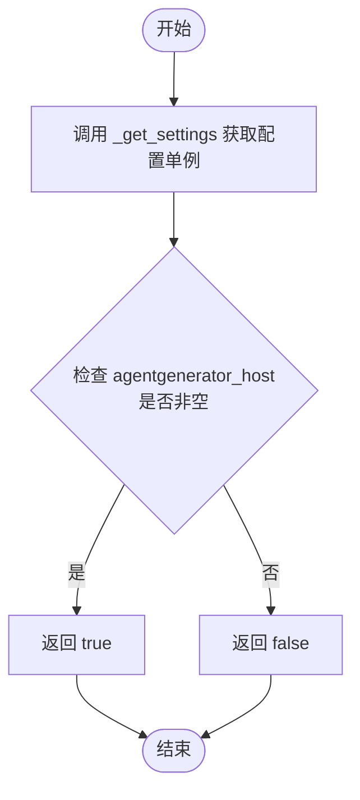

#### 带注释源码

```python
def is_external_service_configured() -> bool:
    """Check if external Agent Generator service is configured."""
    # 获取全局配置对象
    settings = _get_settings()
    # 检查配置中的 agentgenerator_host 是否存在
    # bool() 函数会将非空字符串转换为 True，空字符串或 None 转换为 False
    return bool(settings.config.agentgenerator_host)
```


### `_get_base_url`

获取配置中的主机和端口信息，并将其组合成外部 Agent Generator 服务的完整基础 HTTP URL。

参数：

- `无`

返回值：`str`，格式为 `http://{host}:{port}` 的外部服务基础 URL 字符串。

#### 流程图

```mermaid
flowchart TD
    A[开始: _get_base_url] --> B[调用 _get_settings 获取配置实例]
    B --> C[读取配置项 agentgenerator_host]
    C --> D[读取配置项 agentgenerator_port]
    D --> E[格式化字符串 f'http://{host}:{port}']
    E --> F[返回构建好的 URL]
```

#### 带注释源码

```python
def _get_base_url() -> str:
    """Get the base URL for the external service."""
    # 获取全局设置单例实例
    settings = _get_settings()
    # 从配置中获取 Agent Generator 服务的主机地址
    host = settings.config.agentgenerator_host
    # 从配置中获取 Agent Generator 服务的端口号
    port = settings.config.agentgenerator_port
    # 拼接主机和端口，返回完整的 HTTP 基础 URL
    return f"http://{host}:{port}"
```


### `_get_client`

获取或创建用于与外部 Agent Generator 服务通信的异步 HTTP 客户端实例。该函数实现了单例模式（延迟初始化），在首次调用时根据配置创建 `httpx.AsyncClient` 并缓存，后续调用直接返回该实例，以确保连接复用和资源管理。

参数：

无参数

返回值：`httpx.AsyncClient`，已配置好的异步 HTTP 客户端实例，用于发起网络请求。

#### 流程图

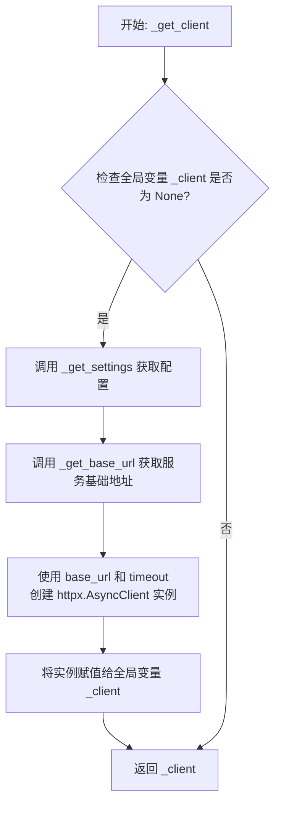

#### 带注释源码

```python
def _get_client() -> httpx.AsyncClient:
    """Get or create the HTTP client for the external service."""
    global _client  # 声明使用全局变量 _client，用于在多次调用间保持单例状态
    if _client is None:  # 检查客户端是否已初始化（延迟初始化）
        settings = _get_settings()  # 获取全局配置对象 Settings
        _client = httpx.AsyncClient(  # 如果未初始化，则创建新的异步 HTTP 客户端
            base_url=_get_base_url(),  # 设置请求的基础 URL，来源于配置的主机和端口
            timeout=httpx.Timeout(settings.config.agentgenerator_timeout),  # 设置请求超时时间，来源于配置
        )
    return _client  # 返回客户端实例（如果是首次调用则返回新创建的，否则返回缓存的实例）
```


### `decompose_goal_external`

Call the external service to decompose a goal.

参数：

-   `description`：`str`，Natural language goal description
-   `context`：`str`，Additional context (e.g., answers to previous questions)
-   `library_agents`：`list[dict[str, Any]] | None`，User's library agents available for sub-agent composition

返回值：`dict[str, Any] | None`，Dict with either: {"type": "clarifying_questions", "questions": [...]} or {"type": "instructions", "steps": [...]} or {"type": "unachievable_goal", ...} or {"type": "vague_goal", ...} or {"type": "error", "error": "...", "error_type": "..."} on error. Or None on unexpected error.

#### 流程图

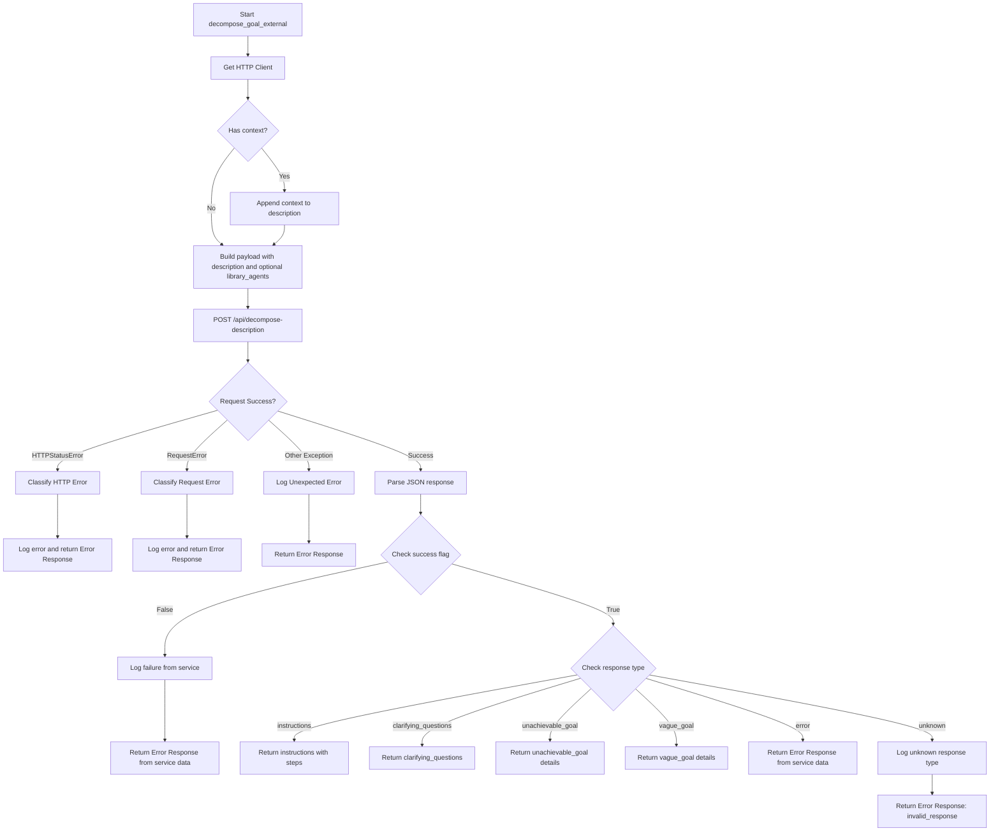

#### 带注释源码

```python
async def decompose_goal_external(
    description: str,
    context: str = "",
    library_agents: list[dict[str, Any]] | None = None,
) -> dict[str, Any] | None:
    """Call the external service to decompose a goal.

    Args:
        description: Natural language goal description
        context: Additional context (e.g., answers to previous questions)
        library_agents: User's library agents available for sub-agent composition

    Returns:
        Dict with either:
        - {"type": "clarifying_questions", "questions": [...]}
        - {"type": "instructions", "steps": [...]}
        - {"type": "unachievable_goal", ...}
        - {"type": "vague_goal", ...}
        - {"type": "error", "error": "...", "error_type": "..."} on error
        Or None on unexpected error
    """
    # 获取或初始化 HTTP 客户端
    client = _get_client()

    # 如果提供了上下文，将其追加到描述中
    if context:
        description = f"{description}\n\nAdditional context from user:\n{context}"

    # 构建请求载荷
    payload: dict[str, Any] = {"description": description}
    if library_agents:
        payload["library_agents"] = library_agents

    try:
        # 发送 POST 请求到外部服务的分解接口
        response = await client.post("/api/decompose-description", json=payload)
        response.raise_for_status()
        data = response.json()

        # 检查服务端返回的业务逻辑是否成功
        if not data.get("success"):
            error_msg = data.get("error", "Unknown error from Agent Generator")
            error_type = data.get("error_type", "unknown")
            logger.error(
                f"Agent Generator decomposition failed: {error_msg} "
                f"(type: {error_type})"
            )
            return _create_error_response(error_msg, error_type)

        # 根据响应类型映射到内部标准格式
        response_type = data.get("type")
        if response_type == "instructions":
            return {"type": "instructions", "steps": data.get("steps", [])}
        elif response_type == "clarifying_questions":
            return {
                "type": "clarifying_questions",
                "questions": data.get("questions", []),
            }
        elif response_type == "unachievable_goal":
            return {
                "type": "unachievable_goal",
                "reason": data.get("reason"),
                "suggested_goal": data.get("suggested_goal"),
            }
        elif response_type == "vague_goal":
            return {
                "type": "vague_goal",
                "suggested_goal": data.get("suggested_goal"),
            }
        elif response_type == "error":
            # 透传服务端的错误
            return _create_error_response(
                data.get("error", "Unknown error"),
                data.get("error_type", "unknown"),
            )
        else:
            # 处理未知的响应类型
            logger.error(
                f"Unknown response type from external service: {response_type}"
            )
            return _create_error_response(
                f"Unknown response type from Agent Generator: {response_type}",
                "invalid_response",
            )

    # 捕获 HTTP 状态码错误 (如 404, 500)
    except httpx.HTTPStatusError as e:
        error_type, error_msg = _classify_http_error(e)
        logger.error(error_msg)
        return _create_error_response(error_msg, error_type)
    # 捕获网络请求错误 (如连接超时)
    except httpx.RequestError as e:
        error_type, error_msg = _classify_request_error(e)
        logger.error(error_msg)
        return _create_error_response(error_msg, error_type)
    # 捕获其他未知异常
    except Exception as e:
        error_msg = f"Unexpected error calling Agent Generator: {e}"
        logger.error(error_msg)
        return _create_error_response(error_msg, "unexpected_error")
```


### `generate_agent_external`

该函数负责调用外部 Agent Generator 微服务的 `/api/generate-agent` 接口，根据提供的结构化指令生成 Agent，支持同步返回结果或异步处理模式，并具备完善的错误处理机制。

参数：

-   `instructions`：`dict[str, Any]`，来自 `decompose_goal` 的结构化指令，用于描述 Agent 的生成逻辑。
-   `library_agents`：`list[dict[str, Any]] | None`，用户库中可用于子 Agent 组合的现有 Agent 列表。
-   `operation_id`：`str | None`，用于异步处理的操作 ID（启用 Redis Streams 回调）。
-   `task_id`：`str | None`，用于异步处理的任务 ID（启用 Redis Streams 回调）。

返回值：`dict[str, Any] | None`，返回生成的 Agent JSON 字典，若为异步处理则返回 `{"status": "accepted"}`，发生错误时返回包含 `{"type": "error", ...}` 的错误字典。

#### 流程图

```mermaid
flowchart TD
    A[开始: generate_agent_external] --> B[获取 HTTP Client]
    B --> C[构建请求 Payload<br/>包含 instructions, library_agents 等]
    C --> D[尝试发起 POST 请求<br/>至 /api/generate-agent]
    D --> E{响应状态码是否为 202?}
    E -- 是 (异步) --> F[记录异步接受日志]
    F --> G[返回 {status: accepted}]
    E -- 否 (同步) --> H[检查 HTTP 状态错误<br/>raise_for_status]
    H --> I[解析 JSON 响应体]
    I --> J{success 字段是否为 False?}
    J -- 是 (业务错误) --> K[记录服务端错误日志]
    K --> L[构造并返回错误响应字典]
    J -- 否 --> M[返回 data.agent_json]
    
    D -- HTTPStatusError --> N[捕获 HTTP 状态错误]
    N --> O[分类错误并记录日志]
    O --> L

    D -- RequestError --> P[捕获请求错误]
    P --> Q[分类错误并记录日志]
    Q --> L

    D -- Exception --> R[捕获其他未预期异常]
    R --> S[记录意外错误日志]
    S --> L
```

#### 带注释源码

```python
async def generate_agent_external(
    instructions: dict[str, Any],
    library_agents: list[dict[str, Any]] | None = None,
    operation_id: str | None = None,
    task_id: str | None = None,
) -> dict[str, Any] | None:
    """Call the external service to generate an agent from instructions.

    Args:
        instructions: Structured instructions from decompose_goal
        library_agents: User's library agents available for sub-agent composition
        operation_id: Operation ID for async processing (enables Redis Streams callback)
        task_id: Task ID for async processing (enables Redis Streams callback)

    Returns:
        Agent JSON dict, {"status": "accepted"} for async, or error dict {"type": "error", ...} on error
    """
    # 获取全局 HTTP 客户端实例
    client = _get_client()

    # 构建请求载荷
    payload: dict[str, Any] = {"instructions": instructions}
    if library_agents:
        payload["library_agents"] = library_agents
    # 如果提供了 operation_id 和 task_id，则加入载荷以支持异步回调
    if operation_id and task_id:
        payload["operation_id"] = operation_id
        payload["task_id"] = task_id

    try:
        # 发送 POST 请求到外部服务
        response = await client.post("/api/generate-agent", json=payload)

        # 处理 202 Accepted 状态码，表示请求已接受进行异步处理
        if response.status_code == 202:
            logger.info(
                f"Agent Generator accepted async request "
                f"(operation_id={operation_id}, task_id={task_id})"
            )
            return {
                "status": "accepted",
                "operation_id": operation_id,
                "task_id": task_id,
            }

        # 如果不是 202，检查是否为 4xx 或 5xx 错误，如果是则抛出 HTTPStatusError
        response.raise_for_status()
        data = response.json()

        # 检查业务逻辑层面的 success 标志
        if not data.get("success"):
            error_msg = data.get("error", "Unknown error from Agent Generator")
            error_type = data.get("error_type", "unknown")
            logger.error(
                f"Agent Generator generation failed: {error_msg} (type: {error_type})"
            )
            return _create_error_response(error_msg, error_type)

        # 成功则返回 Agent JSON 数据
        return data.get("agent_json")

    # 捕获 HTTP 状态码错误（如 404, 500 等）
    except httpx.HTTPStatusError as e:
        error_type, error_msg = _classify_http_error(e)
        logger.error(error_msg)
        return _create_error_response(error_msg, error_type)
    # 捕获网络请求错误（如连接超时、DNS 解析失败）
    except httpx.RequestError as e:
        error_type, error_msg = _classify_request_error(e)
        logger.error(error_msg)
        return _create_error_response(error_msg, error_type)
    # 捕获其他未预期的异常
    except Exception as e:
        error_msg = f"Unexpected error calling Agent Generator: {e}"
        logger.error(error_msg)
        return _create_error_response(error_msg, "unexpected_error")
```


### `generate_agent_patch_external`

调用外部 Agent Generator 服务以生成针对现有 Agent 的补丁（更新）。

参数：

-  `update_request`：`str`，描述变更的自然语言请求
-  `current_agent`：`dict[str, Any]`，当前 Agent 的 JSON 数据
-  `library_agents`：`list[dict[str, Any]] | None`，用户库中的可用 Agents，用于子 Agent 组合
-  `operation_id`：`str | None`，用于异步处理的操作 ID（启用 Redis Streams 回调）
-  `task_id`：`str | None`，用于异步处理的任务 ID（启用 Redis Streams 回调）

返回值：`dict[str, Any] | None`，更新后的 Agent JSON、澄清问题字典、异步状态 {"status": "accepted"}，或发生错误时的错误字典。

#### 流程图

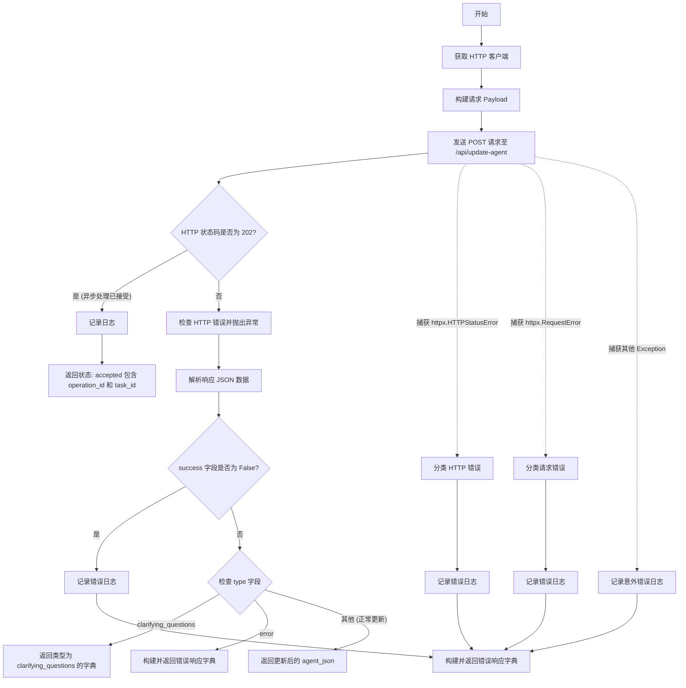

#### 带注释源码

```python
async def generate_agent_patch_external(
    update_request: str,
    current_agent: dict[str, Any],
    library_agents: list[dict[str, Any]] | None = None,
    operation_id: str | None = None,
    task_id: str | None = None,
) -> dict[str, Any] | None:
    """Call the external service to generate a patch for an existing agent.

    Args:
        update_request: Natural language description of changes
        current_agent: Current agent JSON
        library_agents: User's library agents available for sub-agent composition
        operation_id: Operation ID for async processing (enables Redis Streams callback)
        task_id: Task ID for async processing (enables Redis Streams callback)

    Returns:
        Updated agent JSON, clarifying questions dict, {"status": "accepted"} for async, or error dict on error
    """
    # 获取单例 HTTP 客户端
    client = _get_client()

    # 构建请求 Payload
    payload: dict[str, Any] = {
        "update_request": update_request,
        "current_agent_json": current_agent,
    }
    # 如果提供了库 Agents，添加到 Payload
    if library_agents:
        payload["library_agents"] = library_agents
    # 如果提供了异步处理所需的 ID，添加到 Payload
    if operation_id and task_id:
        payload["operation_id"] = operation_id
        payload["task_id"] = task_id

    try:
        # 向外部服务的 /api/update-agent 端点发送 POST 请求
        response = await client.post("/api/update-agent", json=payload)

        # 处理 202 Accepted 状态码，表示请求已接受进行异步处理
        if response.status_code == 202:
            logger.info(
                f"Agent Generator accepted async update request "
                f"(operation_id={operation_id}, task_id={task_id})"
            )
            return {
                "status": "accepted",
                "operation_id": operation_id,
                "task_id": task_id,
            }

        # 如果不是 202，检查是否有 HTTP 错误状态码
        response.raise_for_status()
        # 解析返回的 JSON 数据
        data = response.json()

        # 检查业务逻辑层面是否成功 (success 字段)
        if not data.get("success"):
            error_msg = data.get("error", "Unknown error from Agent Generator")
            error_type = data.get("error_type", "unknown")
            logger.error(
                f"Agent Generator patch generation failed: {error_msg} "
                f"(type: {error_type})"
            )
            return _create_error_response(error_msg, error_type)

        # 检查响应类型是否为澄清问题
        if data.get("type") == "clarifying_questions":
            return {
                "type": "clarifying_questions",
                "questions": data.get("questions", []),
            }

        # 检查响应类型是否为错误（透传服务端的错误）
        if data.get("type") == "error":
            return _create_error_response(
                data.get("error", "Unknown error"),
                data.get("error_type", "unknown"),
            )

        # 默认情况：返回更新后的 Agent JSON
        return data.get("agent_json")

    # 捕获并处理 HTTP 状态码错误（如 404, 500 等）
    except httpx.HTTPStatusError as e:
        error_type, error_msg = _classify_http_error(e)
        logger.error(error_msg)
        return _create_error_response(error_msg, error_type)
    # 捕获并处理网络请求错误（如连接超时、DNS 解析失败）
    except httpx.RequestError as e:
        error_type, error_msg = _classify_request_error(e)
        logger.error(error_msg)
        return _create_error_response(error_msg, error_type)
    # 捕获其他未预期的异常
    except Exception as e:
        error_msg = f"Unexpected error calling Agent Generator: {e}"
        logger.error(error_msg)
        return _create_error_response(error_msg, "unexpected_error")
```


### `customize_template_external`

该函数用于调用外部 Agent Generator 微服务，根据用户的修改请求和上下文信息，对给定的模板/市场代理进行定制化生成。

参数：

- `template_agent`：`dict[str, Any]`，待自定义的模板代理的 JSON 数据。
- `modification_request`：`str`，描述定制化内容的自然语言请求。
- `context`：`str`，额外的上下文信息（例如，对之前问题的回答），默认为空字符串。

返回值：`dict[str, Any] | None`，返回包含定制后代理 JSON 的字典、包含澄清问题的字典，或者在发生错误时返回包含错误详情的字典（理论上也可能返回 None，取决于异常处理分支，尽管代码中主要返回字典）。

#### 流程图

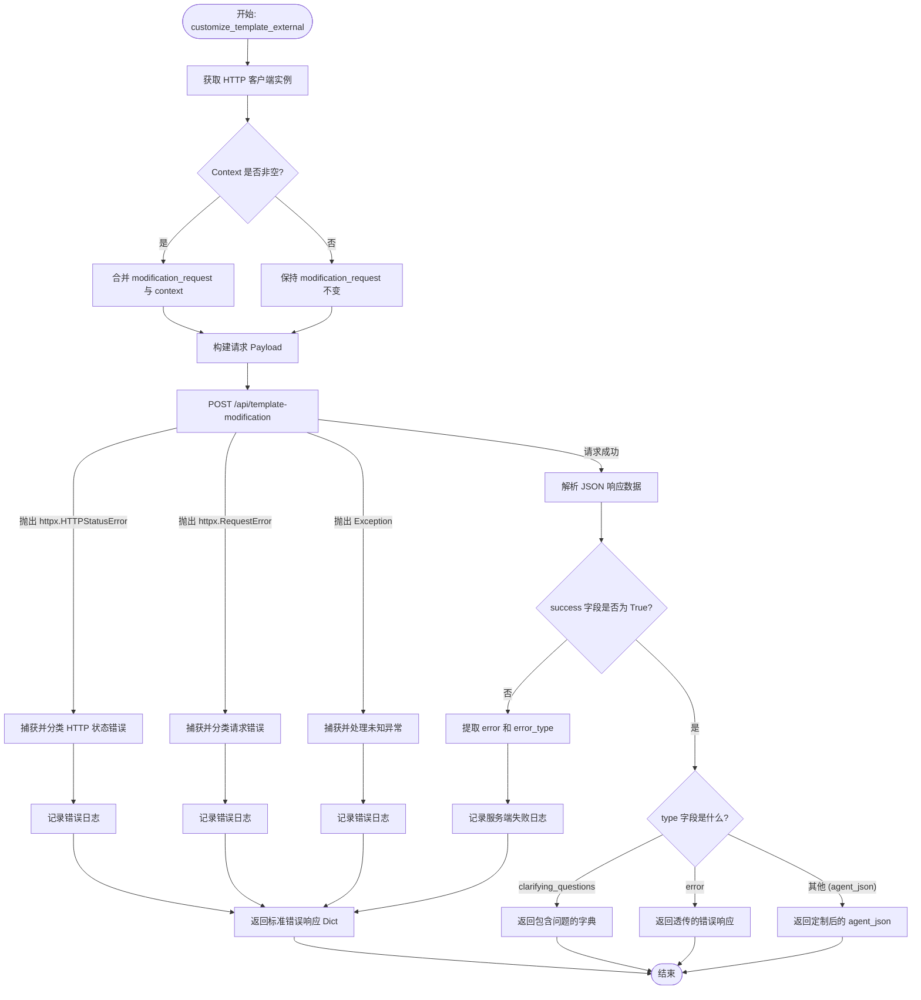

#### 带注释源码

```python
async def customize_template_external(
    template_agent: dict[str, Any],
    modification_request: str,
    context: str = "",
) -> dict[str, Any] | None:
    """Call the external service to customize a template/marketplace agent.

    Args:
        template_agent: The template agent JSON to customize
        modification_request: Natural language description of customizations
        context: Additional context (e.g., answers to previous questions)

    Returns:
        Customized agent JSON, clarifying questions dict, or error dict on error
    """
    # 获取全局 HTTP 客户端实例
    client = _get_client()

    # 如果存在额外上下文，将其追加到修改请求中
    request = modification_request
    if context:
        request = f"{modification_request}\n\nAdditional context from user:\n{context}"

    # 构建发送给外部服务的 Payload 载荷
    payload: dict[str, Any] = {
        "template_agent_json": template_agent,
        "modification_request": request,
    }

    try:
        # 向外部服务的 /api/template-modification 端点发送 POST 请求
        response = await client.post("/api/template-modification", json=payload)
        # 如果响应状态码表示错误 (4xx, 5xx)，抛出 HTTPStatusError
        response.raise_for_status()
        # 解析响应体为 JSON
        data = response.json()

        # 检查业务逻辑上的 success 标志
        if not data.get("success"):
            error_msg = data.get("error", "Unknown error from Agent Generator")
            error_type = data.get("error_type", "unknown")
            logger.error(
                f"Agent Generator template customization failed: {error_msg} "
                f"(type: {error_type})"
            )
            # 业务逻辑失败，返回标准化错误响应
            return _create_error_response(error_msg, error_type)

        # 检查响应类型是否为澄清问题
        if data.get("type") == "clarifying_questions":
            return {
                "type": "clarifying_questions",
                "questions": data.get("questions", []),
            }

        # 检查响应类型是否为错误透传
        if data.get("type") == "error":
            return _create_error_response(
                data.get("error", "Unknown error"),
                data.get("error_type", "unknown"),
            )

        # 默认情况：返回定制后的 Agent JSON
        return data.get("agent_json")

    # 捕获 HTTP 状态码错误 (如 404, 500 等)
    except httpx.HTTPStatusError as e:
        error_type, error_msg = _classify_http_error(e)
        logger.error(error_msg)
        return _create_error_response(error_msg, error_type)
    # 捕获网络请求错误 (如连接超时、DNS 解析失败等)
    except httpx.RequestError as e:
        error_type, error_msg = _classify_request_error(e)
        logger.error(error_msg)
        return _create_error_response(error_msg, error_type)
    # 捕获其他未预期的异常
    except Exception as e:
        error_msg = f"Unexpected error calling Agent Generator: {e}"
        logger.error(error_msg)
        return _create_error_response(error_msg, "unexpected_error")
```


### `get_blocks_external`

该函数用于从外部 Agent Generator 服务异步获取可用的块列表。

参数：

*   无

返回值：`list[dict[str, Any]] | None`，返回包含可用块信息的字典列表，如果发生错误则返回 None。

#### 流程图

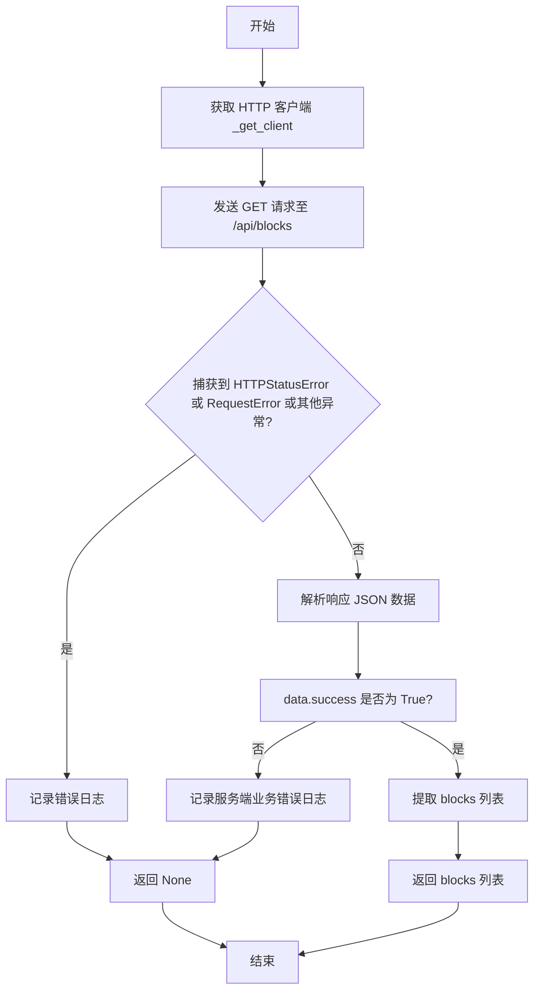

#### 带注释源码

```python
async def get_blocks_external() -> list[dict[str, Any]] | None:
    """Get available blocks from the external service.

    Returns:
        List of block info dicts or None on error
    """
    # 获取全局单例 HTTP 客户端
    client = _get_client()

    try:
        # 向外部服务的 /api/blocks 端点发送 GET 请求
        response = await client.get("/api/blocks")
        # 如果响应状态码表示错误（4xx 或 5xx），则抛出异常
        response.raise_for_status()
        # 解析返回的 JSON 数据
        data = response.json()

        # 检查业务逻辑是否成功
        if not data.get("success"):
            logger.error("External service returned error getting blocks")
            return None

        # 返回 blocks 列表，如果不存在则返回空列表
        return data.get("blocks", [])

    # 捕获 HTTP 状态码错误（如 404, 500）
    except httpx.HTTPStatusError as e:
        logger.error(f"HTTP error getting blocks from external service: {e}")
        return None
    # 捕获网络请求错误（如连接超时、断开）
    except httpx.RequestError as e:
        logger.error(f"Request error getting blocks from external service: {e}")
        return None
    # 捕获其他未预料到的异常
    except Exception as e:
        logger.error(f"Unexpected error getting blocks from external service: {e}")
        return None
```


### `health_check`

检查外部 Agent Generator 服务是否健康运行且已加载必要的资源块。

参数：

无

返回值：`bool`，如果服务已配置、连接成功、状态为 "healthy" 且资源块已加载，则返回 `True`，否则返回 `False`。

#### 流程图

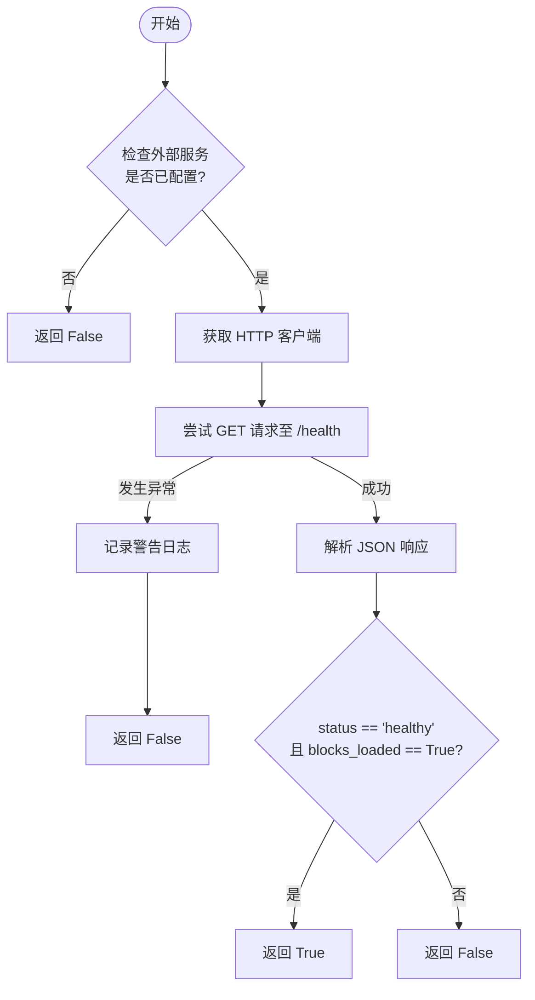

#### 带注释源码

```python
async def health_check() -> bool:
    """Check if the external service is healthy.

    Returns:
        True if healthy, False otherwise
    """
    # 第一步：检查系统配置中是否启用了外部 Agent Generator 服务
    if not is_external_service_configured():
        return False

    # 第二步：获取 HTTP 客户端单例
    client = _get_client()

    try:
        # 第三步：向服务的 /health 端点发送 GET 请求
        response = await client.get("/health")
        
        # 第四步：检查 HTTP 状态码，如果错误则抛出异常
        response.raise_for_status()
        
        # 第五步：解析响应 JSON 数据
        data = response.json()
        
        # 第六步：验证服务状态是否为 "healthy" 且资源块是否已加载
        return data.get("status") == "healthy" and data.get("blocks_loaded", False)
    except Exception as e:
        # 异常处理：捕获连接错误、超时或其他意外错误，记录警告并返回 False
        logger.warning(f"External agent generator health check failed: {e}")
        return False
```


### `close_client`

该函数用于关闭全局的 HTTP 客户端连接。它会检查全局变量 `_client` 是否存在，如果存在则调用 `aclose` 方法释放网络资源，并将全局变量置为 `None`。

参数：

-   无

返回值：`None`，无返回值。

#### 流程图

```mermaid
flowchart TD
    A[开始执行 close_client] --> B{全局变量 _client 是否不为 None?}
    B -- 否 --> C[结束]
    B -- 是 --> D[调用 _client.aclose() 异步关闭连接]
    D --> E[将 _client 置为 None]
    E --> C
```

#### 带注释源码

```python
async def close_client() -> None:
    """Close the HTTP client."""
    global _client  # 声明使用全局变量 _client
    if _client is not None:  # 检查客户端实例是否存在
        await _client.aclose()  # 如果存在，异步关闭客户端以释放资源
        _client = None  # 将全局变量重置为 None，防止后续误用或标记为已关闭
```


## 关键组件


### 配置与客户端生命周期管理
管理配置设置和异步 HTTP 客户端的全局单例，以处理与外部 Agent Generator 服务的连接。

### 错误分类与响应标准化
将底层网络和 HTTP 异常分类为特定的错误类型（如超时、速率限制）并构造标准化的错误响应字典。

### 目标分解逻辑
处理调用外部服务以将自然语言目标分解为结构化步骤或生成澄清问题的过程。

### 代理生成与更新逻辑
促进代理创建和更新请求的执行，支持通过操作 ID 的同步处理和异步任务排队。

### 模板自定义与资源获取
提供用于通过外部服务自定义模板代理和检索可用构建块的功能。


## 问题及建议


### 已知问题

-   **全局状态管理与测试隔离性差**：代码使用模块级全局变量 `_client` 和 `_settings` 管理单例状态。这种模式在单元测试中难以 Mock 和重置，且在高并发或复用导入场景下可能引入不可预期的状态共享问题。
-   **硬编码的通信协议**：`_get_base_url` 方法中强制拼接了 `http://` 协议，缺乏对 HTTPS 的支持，限制了在生产环境通过配置启用安全通信的能力。
-   **错误处理返回值不一致**：部分函数（如 `get_blocks_external`）在发生错误时返回 `None`，而其他业务函数（如 `decompose_goal_external`）返回包含 `type: "error"` 的字典。这种不一致性迫使调用方必须处理多种类型，增加了代码复杂度和类型安全隐患。
-   **基于字符串匹配的错误分类逻辑脆弱**：`_classify_request_error` 函数通过将异常对象转换为小写字符串并匹配关键词（如 "timeout", "connect"）来判断错误类型。这种逻辑高度依赖底层库的错误消息文本，一旦 `httpx` 库更新错误措辞，分类逻辑将失效。
-   **缺乏重试机制**：对于网络抖动、服务短暂不可用（如 503 状态码）等瞬态故障，代码直接捕获错误并返回，未实现任何自动重试或退避策略，降低了系统的容错能力。
-   **资源清理依赖手动调用**：`_client` 是一个全局异步资源，虽然提供了 `close_client`，但在异步应用生命周期结束时（如 Web 服务关闭），若无框架级（如 FastAPI lifespan）的自动挂载，极易导致连接未正确关闭，从而引发资源泄露或警告。

### 优化建议

-   **引入依赖注入模式**：建议将 `httpx.AsyncClient` 和配置对象通过构造函数或函数参数注入，而不是依赖全局变量。这将显著提升代码的可测试性，并使得每个请求可以使用独立的客户端配置（如不同的超时时间）。
-   **使用 Pydantic 模型定义接口契约**：使用 Pydantic BaseModel 替代裸字典（`dict[str, Any]`）作为请求参数和返回值。这将提供运行时数据校验、自动序列化/反序列化以及 IDE 友好的类型提示，减少因字段拼写错误导致的 Bug。
-   **统一异常处理策略**：建议定义具体的业务异常类（如 `AgentGeneratorClientError`），并在客户端内部统一抛出异常，而不是返回错误字典或 `None`。或者统一使用 `Result` 类型封装成功或失败状态，以便上层代码能以一致的方式处理结果。
-   **增强配置灵活性**：在 `Settings` 中增加协议字段（如 `scheme`），允许根据环境变量配置 `http` 或 `https`，移除硬编码的协议前缀。
-   **实现智能重试机制**：集成如 `tenacity` 等重试库，针对特定类型的网络错误（如连接超时、5xx 服务器错误）实施指数退避重试策略，提高服务调用的成功率。
-   **利用对象封装管理客户端生命周期**：将当前的全局函数和客户端封装为一个类（如 `AgentGeneratorClient`），实现 Python 上下文管理器协议（`__aenter__`, `__aexit__`），确保资源的初始化和清理过程自动化且安全。


## 其它


### 设计目标与约束

**设计目标**
1.  **解耦与委托**：将核心的 Agent 生成、目标分解和模板定制逻辑从主应用中剥离，通过网络请求委托给外部微服务处理，从而降低主应用的负载并简化维护。
2.  **透明性**：为上层业务逻辑提供统一且透明的调用接口，使其无需感知底层是通过内部 LLM 还是外部 HTTP 服务实现的。
3.  **连接复用**：通过全局单例管理 `httpx.AsyncClient`，实现 TCP 连接的复用，减少建立连接的开销，提高高频调用时的性能。
4.  **标准化响应**：无论外部服务返回何种数据或发生何种错误，客户端均将其转换为统一的内部字典格式，便于上层统一处理。

**设计约束**
1.  **环境依赖**：该模块仅在配置了 `AGENTGENERATOR_HOST` 时生效，否则外部服务调用将不可用（通过 `is_external_service_configured` 判断）。
2.  **异步上下文**：所有接口函数均为异步（`async`），必须在支持 `async/await` 的上下文中调用。
3.  **超时限制**：所有对外部服务的请求都受到配置中超时时间的限制，防止因服务无响应导致线程永久阻塞。
4.  **无状态设计**：除了全局的单例客户端和设置对象外，函数本身不维护调用间的状态，每次调用都是独立的。

### 错误处理与异常设计

**错误处理策略**
本模块采用“捕获并转换”的策略，不向调用者抛出原始的 HTTP 异常，而是返回标准化的错误字典。

**异常分类映射**
1.  **HTTPStatusError (httpx.HTTPStatusError)**：
    *   `429`: 映射为 `rate_limit` (限流)。
    *   `503`: 映射为 `service_unavailable` (服务不可用)。
    *   `504` 或 `408`: 映射为 `timeout` (超时)。
    *   其他状态码: 映射为 `http_error`。
2.  **RequestError (httpx.RequestError)**：
    *   包含 "timeout" 或 "timed out": 映射为 `timeout` (请求超时)。
    *   包含 "connect": 映射为 `connection_error` (连接错误)。
    *   其他: 映射为 `request_error`。
3.  **业务逻辑错误**：
    *   外部服务返回 JSON 中 `"success": false` 时，提取其中的 `"error"` 和 `"error_type"` 并封装返回。
    *   外部服务返回未知的响应类型时，映射为 `invalid_response`。
4.  **通用异常**：
    *   捕获 `Exception` 作为最后防线，映射为 `unexpected_error`。

**错误响应格式**
所有错误情况下，函数均返回如下格式的字典：
```python
{
    "type": "error",
    "error": "Human-readable error message",
    "error_type": "machine_readable_error_type",
    "details": {}  # 可选
}
```
若发生意外严重错误（如 `get_blocks_external` 中的部分异常），可能返回 `None`。

### 数据流与状态机

**数据流**
1.  **输入阶段**：业务层调用函数并传入参数（如 `description`, `instructions` 等）。
2.  **预处理阶段**：
    *   检查并初始化全局客户端 (`_get_client`)。
    *   根据业务逻辑组装 Payload 字典（例如拼接 `context` 到 `description`）。
3.  **传输阶段**：使用 `httpx.AsyncClient` 发起 POST/GET 请求到外部服务的指定端点。
4.  **响应处理阶段**：
    *   **成功**：解析 JSON，根据 `success` 字段或特定的 `type` 字段（如 `instructions`, `clarifying_questions`）提取核心数据并重新组装为内部格式返回。
    *   **异步接受**：若状态码为 202 Accepted，返回 `{"status": "accepted"}`。
    *   **失败**：捕获异常，通过分类器生成错误字典并返回。

**全局客户端状态机**
全局变量 `_client` 的生命周期包含以下状态：
1.  **Uninitialized (未初始化)**：模块加载时或调用 `close_client` 后的状态。此时 `_client` 为 `None`。
2.  **Initialized (已初始化)**：首次调用 `_get_client()` 时，根据配置创建 `httpx.AsyncClient` 实例并赋值给 `_client`。此状态持续存在直到应用关闭或显式清理。
3.  **Closed (已关闭)**：调用 `close_client()` 后，客户端的 `aclose()` 方法被调用，连接池关闭，`_client` 重置为 `None`。

### 外部依赖与接口契约

**外部依赖**
1.  **库依赖**：
    *   `httpx`：用于发起异步 HTTP 请求。
    *   `backend.util.settings.Settings`：用于读取微服务的 Host、Port 和 Timeout 配置。
    *   `logging`：用于记录错误日志。
2.  **服务依赖**：
    *   **Agent Generator Microservice**：一个必须运行在可配置的 `host:port` 上的外部 HTTP 服务。

**接口契约**
客户端期望外部服务提供以下 RESTful API 接口，并遵循特定的请求/响应格式：

| 端点路径 | 方法 | 功能描述 | 关键请求参数 | 关键响应格式 |
| :--- | :--- | :--- | :--- | :--- |
| `/api/decompose-description` | POST | 将自然语言目标分解为步骤或问题 | `description` (str), `context` (str), `library_agents` (list) | `{"success": bool, "type": "instructions"|"clarifying_questions"|..., "steps"?: [...], "questions"?: [...]}` |
| `/api/generate-agent` | POST | 根据指令生成 Agent 配置 | `instructions` (dict), `library_agents` (list), `operation_id`, `task_id` | `202 Accepted` 或 `{"success": bool, "agent_json": dict}` |
| `/api/update-agent` | POST | 生成现有 Agent 的更新补丁 | `update_request` (str), `current_agent_json` (dict), `library_agents` (list) | `202 Accepted` 或 `{"success": bool, "agent_json": dict, "type": "clarifying_questions"}` |
| `/api/template-modification` | POST | 定制模板 Agent | `template_agent_json` (dict), `modification_request` (str), `context` (str) | `{"success": bool, "agent_json": dict, "type": "clarifying_questions"}` |
| `/api/blocks` | GET | 获取可用的构建块 | N/A | `{"success": bool, "blocks": [...]}` |
| `/health` | GET | 健康检查 | N/A | `{"status": "healthy", "blocks_loaded": bool}` |

**契约规范**
*   **通用响应结构**：所有 JSON 响应主体建议包含 `success` (bool) 字段以显式指示业务层面的成功与失败。若 `success` 为 false，需包含 `error` (str) 和 `error_type` (str) 字段。
*   **异步处理契约**：对于耗时较长的生成任务，服务应立即返回 HTTP 202 状态码，并在响应体（如果有）或通过 ID 确认接收。客户端需识别此状态码并返回特定的 "accepted" 字典结构。
*   **超时契约**：服务必须在 `Settings.config.agentgenerator_timeout` 定义的时间内返回响应或进入异步处理状态。

    