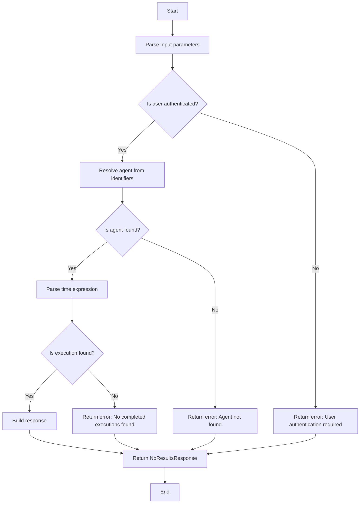
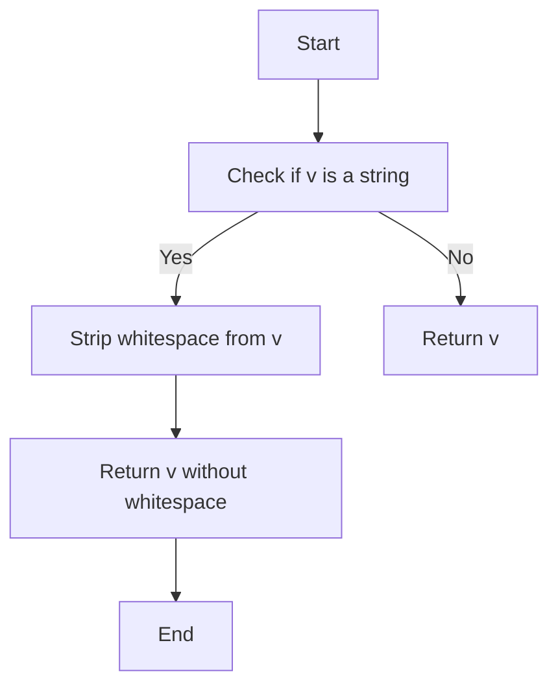
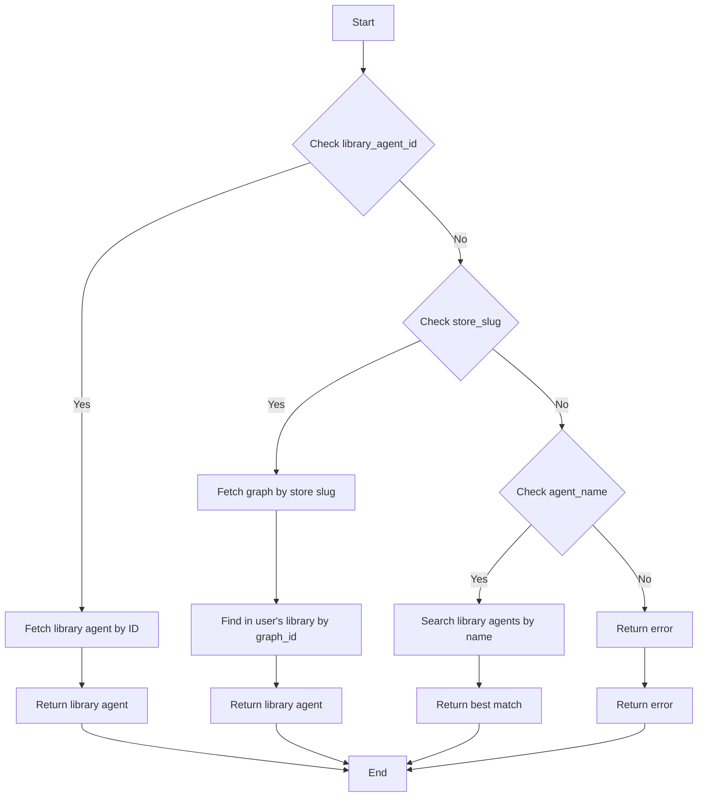
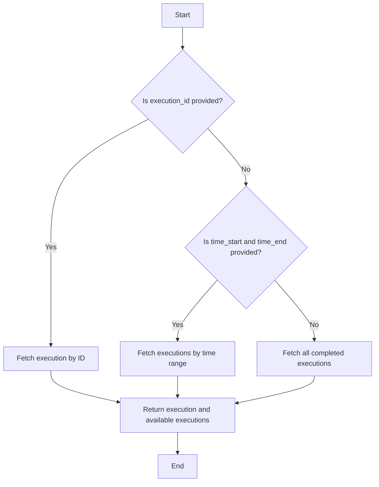
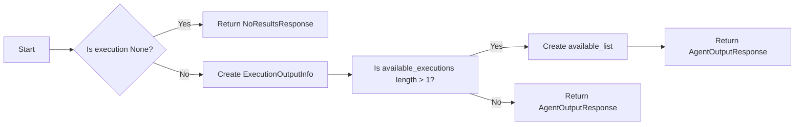

# `.\AutoGPT\autogpt_platform\backend\backend\api\features\chat\tools\agent_output.py` 详细设计文档

The code provides a tool for retrieving execution outputs from user's library agents, allowing users to specify an agent by name, ID, or store slug, and retrieve specific or latest execution outputs.

## 整体流程



## 类结构

```
AgentOutputTool (工具类)
├── AgentOutputInput (数据模型类)
├── ErrorResponse (错误响应类)
├── ExecutionOutputInfo (执行输出信息类)
├── NoResultsResponse (无结果响应类)
└── ToolResponseBase (工具响应基类)
```

## 全局变量及字段


### `logger`
    
Logger instance for logging messages.

类型：`logging.Logger`
    


### `AgentOutputInput`
    
Input parameters for the agent_output tool.

类型：`pydantic.BaseModel`
    


### `AgentOutputTool`
    
Tool for retrieving execution outputs from user's library.

类型：`AgentOutputTool`
    


### `ErrorResponse`
    
Error response object.

类型：`ErrorResponse`
    


### `ExecutionOutputInfo`
    
Execution output information object.

类型：`ExecutionOutputInfo`
    


### `NoResultsResponse`
    
No results response object.

类型：`NoResultsResponse`
    


### `ToolResponseBase`
    
Base response object for tool responses.

类型：`ToolResponseBase`
    


### `ChatSession`
    
Chat session object.

类型：`ChatSession`
    


### `LibraryAgent`
    
Library agent object.

类型：`LibraryAgent`
    


### `GraphExecution`
    
Graph execution object.

类型：`GraphExecution`
    


### `GraphExecutionMeta`
    
Graph execution metadata object.

类型：`GraphExecutionMeta`
    


### `ExecutionStatus`
    
Execution status enumeration.

类型：`ExecutionStatus`
    


### `ExecutionOutputInfo`
    
Execution output information object.

类型：`ExecutionOutputInfo`
    


### `AgentOutputResponse`
    
Agent output response object.

类型：`AgentOutputResponse`
    


### `ExecutionStatus`
    
Execution status enumeration.

类型：`ExecutionStatus`
    


### `GraphExecution`
    
Graph execution object.

类型：`GraphExecution`
    


### `GraphExecutionMeta`
    
Graph execution metadata object.

类型：`GraphExecutionMeta`
    


### `ExecutionStatus`
    
Execution status enumeration.

类型：`ExecutionStatus`
    


### `LibraryAgent`
    
Library agent object.

类型：`LibraryAgent`
    


### `ChatSession`
    
Chat session object.

类型：`ChatSession`
    


### `AgentOutputInput.agent_name`
    
Agent name to search for in user's library (fuzzy match).

类型：`str`
    


### `AgentOutputInput.library_agent_id`
    
Exact library agent ID.

类型：`str`
    


### `AgentOutputInput.store_slug`
    
Marketplace identifier: 'username/agent-slug'.

类型：`str`
    


### `AgentOutputInput.execution_id`
    
Specific execution ID to retrieve.

类型：`str`
    


### `AgentOutputInput.run_time`
    
Time filter: 'latest', 'yesterday', 'last week', or 'YYYY-MM-DD'.

类型：`str`
    


### `AgentOutputTool.name`
    
Name of the tool.

类型：`str`
    


### `AgentOutputTool.description`
    
Description of the tool.

类型：`str`
    


### `AgentOutputTool.parameters`
    
Parameters required by the tool.

类型：`dict[str, Any]`
    


### `AgentOutputTool.requires_auth`
    
Indicates if the tool requires authentication.

类型：`bool`
    


### `ErrorResponse.message`
    
Error message.

类型：`str`
    


### `ErrorResponse.error`
    
Error description.

类型：`str`
    


### `ErrorResponse.session_id`
    
Session ID associated with the error.

类型：`str`
    


### `ExecutionOutputInfo.execution_id`
    
Execution ID.

类型：`str`
    


### `ExecutionOutputInfo.status`
    
Execution status.

类型：`str`
    


### `ExecutionOutputInfo.started_at`
    
Execution start time.

类型：`datetime`
    


### `ExecutionOutputInfo.ended_at`
    
Execution end time.

类型：`datetime`
    


### `ExecutionOutputInfo.outputs`
    
Execution outputs.

类型：`dict`
    


### `ExecutionOutputInfo.inputs_summary`
    
Execution inputs summary.

类型：`Any`
    


### `NoResultsResponse.message`
    
Message indicating no results were found.

类型：`str`
    


### `NoResultsResponse.session_id`
    
Session ID associated with the response.

类型：`str`
    


### `NoResultsResponse.suggestions`
    
Suggestions for resolving the issue.

类型：`list[str]`
    


### `ToolResponseBase.message`
    
Message associated with the response.

类型：`str`
    


### `ToolResponseBase.session_id`
    
Session ID associated with the response.

类型：`str`
    
    

## 全局函数及方法


### parse_time_expression

Parse time expression into datetime range (start, end).

参数：

- `time_expr`：`str | None`，Time expression to parse. Supports: "latest", "yesterday", "today", "last week", "last 7 days", "last month", "last 30 days", ISO date "YYYY-MM-DD", ISO datetime.

返回值：`tuple[datetime | None, datetime | None]`，Datetime range (start, end).

#### 流程图

```mermaid
graph TD
    A[Start] --> B{Is time_expr None?}
    B -- Yes --> C[Return (None, None)]
    B -- No --> D[Is time_expr "latest"?]
    D -- Yes --> E[Return (None, None)]
    D -- No --> F[Is time_expr in relative_times?]
    F -- Yes --> G[Return relative_times[time_expr]]
    F -- No --> H[Is time_expr a valid ISO date?]
    H -- Yes --> I[Return (datetime.fromisoformat(time_expr.replace("Z", "+00:00")) - timedelta(hours=1), datetime.fromisoformat(time_expr.replace("Z", "+00:00")) + timedelta(hours=1))]
    H -- No --> J[Return (None, None)]
```

#### 带注释源码

```python
def parse_time_expression(
    time_expr: str | None,
) -> tuple[datetime | None, datetime | None]:
    """
    Parse time expression into datetime range (start, end).

    Supports: "latest", "yesterday", "today", "last week", "last 7 days",
    "last month", "last 30 days", ISO date "YYYY-MM-DD", ISO datetime.
    """
    if not time_expr or time_expr.lower() == "latest":
        return None, None

    now = datetime.now(timezone.utc)
    today_start = now.replace(hour=0, minute=0, second=0, microsecond=0)
    expr = time_expr.lower().strip()

    # Relative time expressions lookup
    relative_times: dict[str, tuple[datetime, datetime]] = {
        "yesterday": (today_start - timedelta(days=1), today_start),
        "today": (today_start, now),
        "last week": (now - timedelta(days=7), now),
        "last 7 days": (now - timedelta(days=7), now),
        "last month": (now - timedelta(days=30), now),
        "last 30 days": (now - timedelta(days=30), now),
    }
    if expr in relative_times:
        return relative_times[expr]

    # Try ISO date format (YYYY-MM-DD)
    date_match = re.match(r"^(\d{4})-(\d{2})-(\d{2})$", expr)
    if date_match:
        try:
            year, month, day = map(int, date_match.groups())
            start = datetime(year, month, day, 0, 0, 0, tzinfo=timezone.utc)
            return start, start + timedelta(days=1)
        except ValueError:
            # Invalid date components (e.g., month=13, day=32)
            pass

    # Try ISO datetime
    try:
        parsed = datetime.fromisoformat(expr.replace("Z", "+00:00"))
        if parsed.tzinfo is None:
            parsed = parsed.replace(tzinfo=timezone.utc)
        return parsed - timedelta(hours=1), parsed + timedelta(hours=1)
    except ValueError:
        return None, None
```


### `AgentOutputInput.strip_strings`

Strip whitespace from string fields.

参数：

- `v`：`Any`，The value to be stripped of whitespace if it is a string.

返回值：`Any`，The value with whitespace stripped if it was a string, otherwise the original value.

#### 流程图



#### 带注释源码

```python
@field_validator(
    "agent_name",
    "library_agent_id",
    "store_slug",
    "execution_id",
    "run_time",
    mode="before",
)
@classmethod
def strip_strings(cls, v: Any) -> Any:
    """Strip whitespace from string fields."""
    return v.strip() if isinstance(v, str) else v
```


### AgentOutputTool._resolve_agent

Resolve agent from provided identifiers.

参数：

- `user_id`：`str`，User's unique identifier.
- `agent_name`：`str | None`，Agent name to search for in user's library (fuzzy match).
- `library_agent_id`：`str | None`，Exact library agent ID.
- `store_slug`：`str | None`，Marketplace identifier: 'username/agent-name'.

返回值：`tuple[LibraryAgent | None, str | None]`，Returns a tuple containing the resolved `LibraryAgent` object or `None` if not found, and an `error_message` or `None` if no error occurred.

#### 流程图



#### 带注释源码

```python
async def _resolve_agent(
    self,
    user_id: str,
    agent_name: str | None,
    library_agent_id: str | None,
    store_slug: str | None,
) -> tuple[LibraryAgent | None, str | None]:
    """
    Resolve agent from provided identifiers.
    Returns (library_agent, error_message).
    """
    # Priority 1: Exact library agent ID
    if library_agent_id:
        try:
            agent = await library_db.get_library_agent(library_agent_id, user_id)
            return agent, None
        except Exception as e:
            logger.warning(f"Failed to get library agent by ID: {e}")
            return None, f"Library agent '{library_agent_id}' not found"

    # Priority 2: Store slug (username/agent-name)
    if store_slug and "/" in store_slug:
        username, agent_slug = store_slug.split("/", 1)
        graph, _ = await fetch_graph_from_store_slug(username, agent_slug)
        if not graph:
            return None, f"Agent '{store_slug}' not found in marketplace"

        # Find in user's library by graph_id
        agent = await library_db.get_library_agent_by_graph_id(user_id, graph.id)
        if not agent:
            return (
                None,
                f"Agent '{store_slug}' is not in your library. "
                "Add it first to see outputs.",
            )
        return agent, None

    # Priority 3: Fuzzy name search in library
    if agent_name:
        try:
            response = await library_db.list_library_agents(
                user_id=user_id,
                search_term=agent_name,
                page_size=5,
            )
            if not response.agents:
                return (
                    None,
                    f"No agents matching '{agent_name}' found in your library",
                )

            # Return best match (first result from search)
            return response.agents[0], None
        except Exception as e:
            logger.error(f"Error searching library agents: {e}")
            return None, f"Error searching for agent: {e}"

    return (
        None,
        "Please specify an agent name, library_agent_id, or store_slug",
    )
```


### AgentOutputTool._get_execution

Fetch execution(s) based on filters.

参数：

- `user_id`：`str`，User ID for authentication.
- `graph_id`：`str`，Graph ID of the agent.
- `execution_id`：`str | None`，Specific execution ID to retrieve.
- `time_start`：`datetime | None`，Start time for filtering executions.
- `time_end`：`datetime | None`，End time for filtering executions.

返回值：`tuple[GraphExecution | None, list[GraphExecutionMeta], str | None]`，Returns a tuple containing the fetched execution, a list of available executions, and an error message.

#### 流程图



#### 带注释源码

```python
async def _get_execution(
    self,
    user_id: str,
    graph_id: str,
    execution_id: str | None,
    time_start: datetime | None,
    time_end: datetime | None,
) -> tuple[GraphExecution | None, list[GraphExecutionMeta], str | None]:
    """
    Fetch execution(s) based on filters.
    Returns (single_execution, available_executions_meta, error_message).
    """
    # If specific execution_id provided, fetch it directly
    if execution_id:
        execution = await execution_db.get_graph_execution(
            user_id=user_id,
            execution_id=execution_id,
            include_node_executions=False,
        )
        if not execution:
            return None, [], f"Execution '{execution_id}' not found"
        return execution, [], None

    # Get completed executions with time filters
    executions = await execution_db.get_graph_executions(
        graph_id=graph_id,
        user_id=user_id,
        statuses=[ExecutionStatus.COMPLETED],
        created_time_gte=time_start,
        created_time_lte=time_end,
        limit=10,
    )

    if not executions:
        return None, [], None  # No error, just no executions

    # If only one execution, fetch full details
    if len(executions) == 1:
        full_execution = await execution_db.get_graph_execution(
            user_id=user_id,
            execution_id=executions[0].id,
            include_node_executions=False,
        )
        return full_execution, [], None

    # Multiple executions - return latest with full details, plus list of available
    full_execution = await execution_db.get_graph_execution(
        user_id=user_id,
        execution_id=executions[0].id,
        include_node_executions=False,
    )
    return full_execution, executions, None
``` 


### AgentOutputTool._build_response

Build the response based on execution data.

参数：

- `agent`：`LibraryAgent`，The agent for which the execution outputs are being retrieved.
- `execution`：`GraphExecution | None`，The specific execution to retrieve outputs for.
- `available_executions`：`list[GraphExecutionMeta]`，List of available executions for the agent.
- `session_id`：`str | None`，The session ID for the request.

返回值：`AgentOutputResponse`，The response object containing the execution outputs and other relevant information.

#### 流程图



#### 带注释源码

```python
def _build_response(
    self,
    agent: LibraryAgent,
    execution: GraphExecution | None,
    available_executions: list[GraphExecutionMeta],
    session_id: str | None,
) -> AgentOutputResponse:
    """Build the response based on execution data."""
    library_agent_link = f"/library/agents/{agent.id}"

    if not execution:
        return AgentOutputResponse(
            message=f"No completed executions found for agent '{agent.name}'",
            session_id=session_id,
            agent_name=agent.name,
            agent_id=agent.graph_id,
            library_agent_id=agent.id,
            library_agent_link=library_agent_link,
            total_executions=0,
        )

    execution_info = ExecutionOutputInfo(
        execution_id=execution.id,
        status=execution.status.value,
        started_at=execution.started_at,
        ended_at=execution.ended_at,
        outputs=dict(execution.outputs),
        inputs_summary=execution.inputs if execution.inputs else None,
    )

    available_list = None
    if len(available_executions) > 1:
        available_list = [
            {
                "id": e.id,
                "status": e.status.value,
                "started_at": e.started_at.isoformat() if e.started_at else None,
            }
            for e in available_executions[:5]
        ]

    message = f"Found execution outputs for agent '{agent.name}'"
    if len(available_executions) > 1:
        message += f". Showing latest of {len(available_executions)} matching executions."

    return AgentOutputResponse(
        message=message,
        session_id=session_id,
        agent_name=agent.name,
        agent_id=agent.graph_id,
        library_agent_id=agent.id,
        library_agent_link=library_agent_link,
        execution=execution_info,
        available_executions=available_list,
        total_executions=len(available_executions) if available_executions else 1,
    )
```


### AgentOutputTool._execute

Execute the agent_output tool.

参数：

- `user_id`：`str`，User ID for authentication.
- `session`：`ChatSession`，Chat session object containing session details.
- `**kwargs`：`Any`，Additional keyword arguments for the tool.

返回值：`ToolResponseBase`，Response object containing the result of the tool execution.

#### 流程图

```mermaid
graph TD
    A[Start] --> B[Parse and validate input]
    B -->|Invalid input| C[Return ErrorResponse]
    B -->|Valid input| D[Ensure user_id is present]
    D -->|User ID missing| E[Return ErrorResponse]
    D -->|User ID present| F[Check if at least one identifier is provided]
    F -->|No identifiers provided| G[Return ErrorResponse]
    F -->|Identifiers provided| H[If only execution_id provided] --> I[Fetch execution directly]
    I -->|Execution found| J[Find library agent by graph_id] --> K[Return _build_response]
    I -->|Execution not found| L[Return ErrorResponse]
    H -->|Other identifiers provided| M[Resolve agent from identifiers] --> N[Agent found] --> O[_build_response]
    M -->|Agent not found| P[Return NoResultsResponse]
    N -->|Parse time expression| Q[Fetch execution(s)] --> R[Return _build_response]
    Q -->|Error| S[Return ErrorResponse]
    Q -->|No executions| T[Return NoResultsResponse]
    Q -->|Executions found| U[Return _build_response]
```

#### 带注释源码

```python
async def _execute(self, user_id: str | None, session: ChatSession, **kwargs) -> ToolResponseBase:
    session_id = session.session_id

    # Parse and validate input
    try:
        input_data = AgentOutputInput(**kwargs)
    except Exception as e:
        logger.error(f"Invalid input: {e}")
        return ErrorResponse(
            message="Invalid input parameters",
            error=str(e),
            session_id=session_id,
        )

    # Ensure user_id is present (should be guaranteed by requires_auth)
    if not user_id:
        return ErrorResponse(
            message="User authentication required",
            session_id=session_id,
        )

    # Check if at least one identifier is provided
    if not any(
        [
            input_data.agent_name,
            input_data.library_agent_id,
            input_data.store_slug,
            input_data.execution_id,
        ]
    ):
        return ErrorResponse(
            message=(
                "Please specify at least one of: agent_name, "
                "library_agent_id, store_slug, or execution_id"
            ),
            session_id=session_id,
        )

    # If only execution_id provided, we need to find the agent differently
    if (
        input_data.execution_id
        and not input_data.agent_name
        and not input_data.library_agent_id
        and not input_data.store_slug
    ):
        # Fetch execution directly to get graph_id
        execution = await execution_db.get_graph_execution(
            user_id=user_id,
            execution_id=input_data.execution_id,
            include_node_executions=False,
        )
        if not execution:
            return ErrorResponse(
                message=f"Execution '{input_data.execution_id}' not found",
                session_id=session_id,
            )

        # Find library agent by graph_id
        agent = await library_db.get_library_agent_by_graph_id(
            user_id, execution.graph_id
        )
        if not agent:
            return NoResultsResponse(
                message=(
                    f"Execution found but agent not in your library. "
                    f"Graph ID: {execution.graph_id}"
                ),
                session_id=session_id,
                suggestions=["Add the agent to your library to see more details"],
            )

        return self._build_response(agent, execution, [], session_id)

    # Resolve agent from identifiers
    agent, error = await self._resolve_agent(
        user_id=user_id,
        agent_name=input_data.agent_name or None,
        library_agent_id=input_data.library_agent_id or None,
        store_slug=input_data.store_slug or None,
    )

    if error or not agent:
        return NoResultsResponse(
            message=error or "Agent not found",
            session_id=session_id,
            suggestions=[
                "Check the agent name or ID",
                "Make sure the agent is in your library",
            ],
        )

    # Parse time expression
    time_start, time_end = parse_time_expression(input_data.run_time)

    # Fetch execution(s)
    execution, available_executions, exec_error = await self._get_execution(
        user_id=user_id,
        graph_id=agent.graph_id,
        execution_id=input_data.execution_id or None,
        time_start=time_start,
        time_end=time_end,
    )

    if exec_error:
        return ErrorResponse(
            message=exec_error,
            session_id=session_id,
        )

    return self._build_response(agent, execution, available_executions, session_id)
```


## 关键组件


### 张量索引与惰性加载

用于高效地索引和访问大型张量数据，同时延迟加载数据以减少内存消耗。

### 反量化支持

提供对反量化操作的支持，允许在量化过程中进行反向操作，以恢复原始浮点数值。

### 量化策略

定义了不同的量化策略，用于将浮点数转换为固定点数表示，以优化模型性能和存储空间。


## 问题及建议


### 已知问题

-   **代码重复**：在 `_resolve_agent` 和 `_get_execution` 方法中，存在大量的代码重复，特别是在处理错误和日志记录方面。这可以通过提取公共逻辑来减少。
-   **错误处理**：错误处理主要集中在日志记录和返回错误消息，但没有提供详细的错误信息，这可能会影响调试和用户理解。
-   **时间表达式解析**：`parse_time_expression` 函数支持多种时间表达式，但解析逻辑可能不够健壮，例如，对于非标准的ISO日期格式可能无法正确处理。
-   **性能问题**：在处理大量执行记录时，`_get_execution` 方法可能会遇到性能瓶颈，特别是当需要获取多个执行记录时。

### 优化建议

-   **提取公共逻辑**：将 `_resolve_agent` 和 `_get_execution` 中的公共错误处理和日志记录逻辑提取到单独的函数中，以减少代码重复。
-   **增强错误处理**：在错误处理中提供更详细的错误信息，包括错误代码和可能的解决方案，以便于用户和开发者理解。
-   **优化时间表达式解析**：增强 `parse_time_expression` 函数，使其能够处理更多非标准的日期格式，并提供更清晰的错误消息。
-   **性能优化**：考虑使用索引和分页来优化数据库查询，特别是在处理大量执行记录时。
-   **代码重构**：考虑将工具的某些部分重构为更模块化的设计，以便于维护和扩展。


## 其它


### 设计目标与约束

- **设计目标**:
  - 提供一个工具，用于从用户的库中检索代理执行输出。
  - 确保工具能够处理不同的输入参数，如代理名称、库代理ID、存储slug和执行ID。
  - 支持时间过滤，允许用户检索特定时间范围内的执行输出。
  - 提供清晰的错误消息和响应，以帮助用户理解执行失败的原因。

- **约束**:
  - 工具必须与现有的数据库和API接口兼容。
  - 工具必须能够处理大量的数据，同时保持高性能。
  - 工具必须易于使用，并提供良好的用户体验。

### 错误处理与异常设计

- **错误处理**:
  - 对于无效的输入参数，工具将返回一个包含错误消息的`ErrorResponse`。
  - 如果无法解析时间表达式，将返回一个包含错误消息的`ErrorResponse`。
  - 如果无法找到代理或执行，将返回一个包含错误消息的`NoResultsResponse`。

- **异常设计**:
  - 使用try-except块来捕获和处理可能发生的异常。
  - 对于每个异常，记录错误日志并返回相应的错误响应。

### 数据流与状态机

- **数据流**:
  - 用户输入参数被解析并验证。
  - 根据输入参数，代理被解析和检索。
  - 根据时间表达式，执行被检索。
  - 执行输出被构建并返回给用户。

- **状态机**:
  - 工具的状态包括：初始化、解析输入、解析时间表达式、检索代理、检索执行、构建响应和返回响应。

### 外部依赖与接口契约

- **外部依赖**:
  - `pydantic`用于数据验证。
  - `logging`用于记录日志。
  - `re`用于正则表达式匹配。
  - `datetime`用于日期和时间处理。
  - `typing`用于类型注解。

- **接口契约**:
  - `AgentOutputInput`类定义了输入参数的契约。
  - `AgentOutputTool`类定义了工具的接口契约，包括参数、方法和返回类型。
  - `library_db`和`execution_db`提供了与数据库的接口契约。
  - `fetch_graph_from_store_slug`函数提供了与市场接口的契约。


    