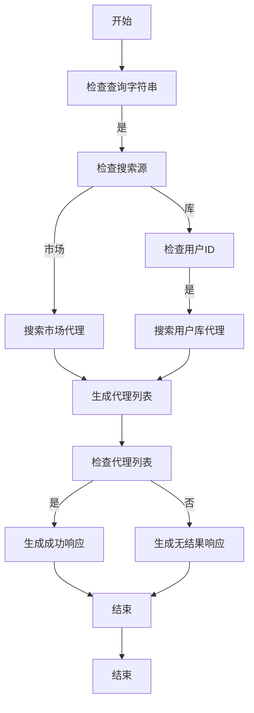
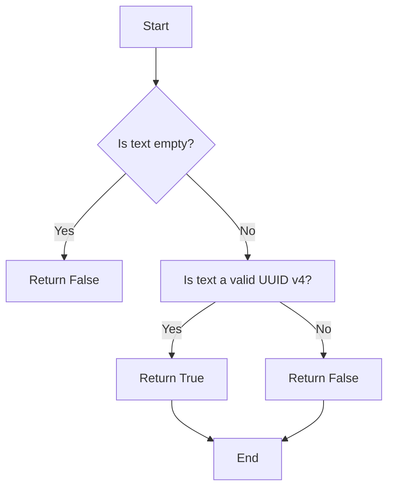
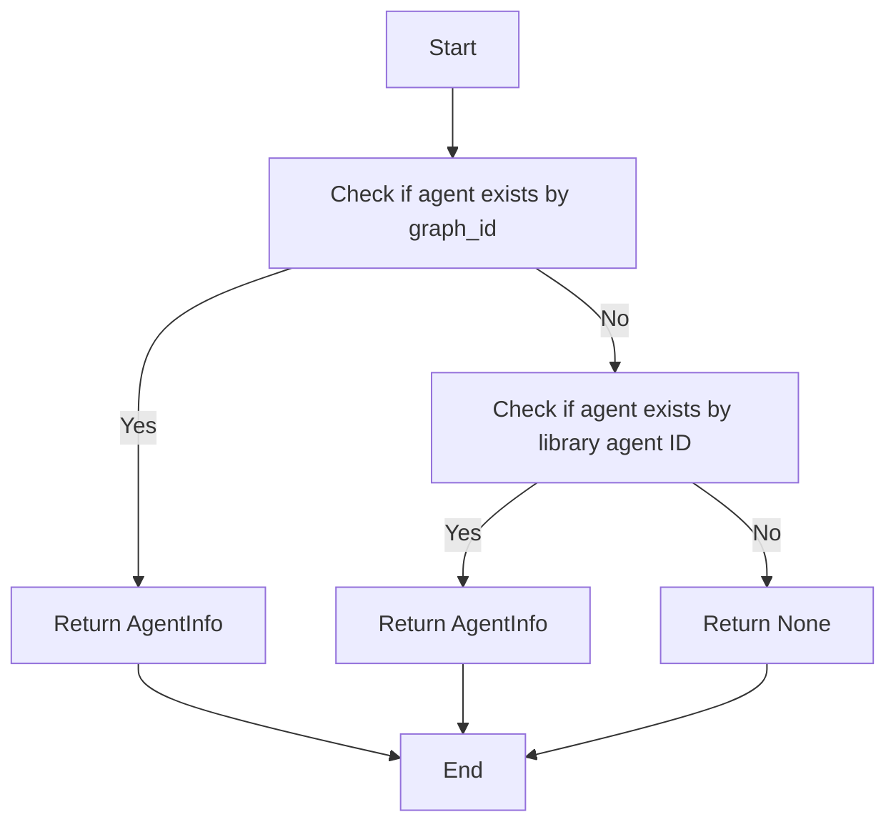
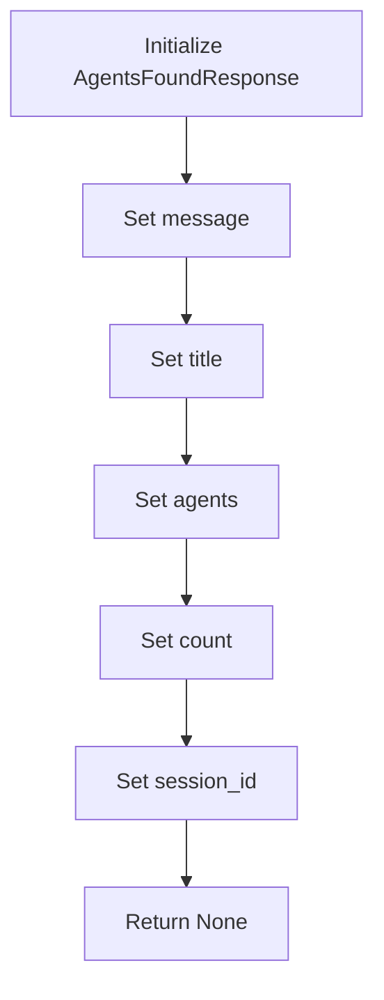
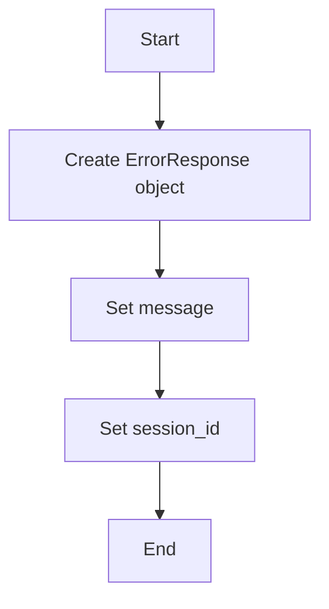
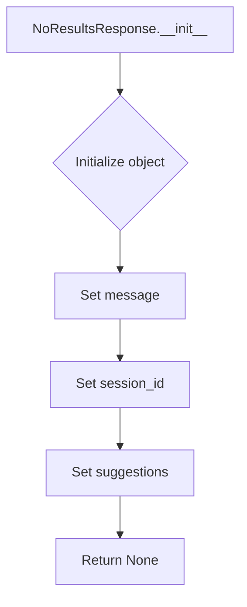

# `.\AutoGPT\autogpt_platform\backend\backend\api\features\chat\tools\agent_search.py` 详细设计文档

The code provides shared search functionality for finding agents in a marketplace or a user's library, handling search queries, fetching agent information, and generating responses.

## 整体流程



## 类结构

```
SharedAgentSearch (主类)
├── AgentInfo (代理信息类)
├── AgentsFoundResponse (代理找到响应类)
├── ErrorResponse (错误响应类)
└── NoResultsResponse (无结果响应类)
```

## 全局变量及字段


### `logger`
    
Logger instance for logging messages.

类型：`logging.Logger`
    


### `_UUID_PATTERN`
    
Regular expression pattern for validating UUID v4 format.

类型：`re.Pattern`
    


### `SearchSource`
    
Type alias for search source options.

类型：`Literal['marketplace', 'library']`
    


### `AgentInfo`
    
Type alias for AgentInfo class.

类型：`type`
    


### `AgentsFoundResponse`
    
Type alias for AgentsFoundResponse class.

类型：`type`
    


### `ErrorResponse`
    
Type alias for ErrorResponse class.

类型：`type`
    


### `NoResultsResponse`
    
Type alias for NoResultsResponse class.

类型：`type`
    


### `ToolResponseBase`
    
Type alias for ToolResponseBase class.

类型：`type`
    


### `user_id`
    
User ID for library search.

类型：`str`
    


### `agent_id`
    
Agent ID for lookup.

类型：`str`
    


### `query`
    
Search query string.

类型：`str`
    


### `source`
    
Search source option (marketplace or library).

类型：`SearchSource`
    


### `session_id`
    
Chat session ID.

类型：`str`
    


### `agents`
    
List of AgentInfo objects found during search.

类型：`list[AgentInfo]`
    


### `results`
    
Results object from database query.

类型：`type`
    


### `agent`
    
AgentInfo object fetched from database.

类型：`AgentInfo | None`
    


### `message`
    
Error or response message.

类型：`str`
    


### `error`
    
Error message if an error occurred.

类型：`str`
    


### `suggestions`
    
List of suggestions for the user.

类型：`list[str]`
    


### `title`
    
Title for the response message.

类型：`str`
    


### `count`
    
Count of agents found or error count.

类型：`int`
    


### `session_id`
    
Session ID for the response message.

类型：`str`
    


### `AgentInfo.id`
    
Unique identifier for the agent.

类型：`str`
    


### `AgentInfo.name`
    
Name of the agent.

类型：`str`
    


### `AgentInfo.description`
    
Description of the agent.

类型：`str`
    


### `AgentInfo.source`
    
Source of the agent (marketplace or library).

类型：`str`
    


### `AgentInfo.in_library`
    
Indicates if the agent is in the library.

类型：`bool`
    


### `AgentInfo.creator`
    
Creator of the agent.

类型：`str`
    


### `AgentInfo.status`
    
Status of the agent.

类型：`str`
    


### `AgentInfo.can_access_graph`
    
Indicates if the agent can access the graph.

类型：`bool`
    


### `AgentInfo.has_external_trigger`
    
Indicates if the agent has an external trigger.

类型：`bool`
    


### `AgentInfo.new_output`
    
Indicates if the agent has a new output.

类型：`bool`
    


### `AgentInfo.graph_id`
    
Graph ID of the agent.

类型：`str`
    


### `AgentsFoundResponse.message`
    
Response message to the user.

类型：`str`
    


### `AgentsFoundResponse.title`
    
Title for the response message.

类型：`str`
    


### `AgentsFoundResponse.agents`
    
List of agents found during the search.

类型：`list[AgentInfo]`
    


### `AgentsFoundResponse.count`
    
Count of agents found.

类型：`int`
    


### `AgentsFoundResponse.session_id`
    
Session ID for the response message.

类型：`str`
    


### `ErrorResponse.message`
    
Error message to the user.

类型：`str`
    


### `ErrorResponse.error`
    
Detailed error message.

类型：`str`
    


### `ErrorResponse.session_id`
    
Session ID for the response message.

类型：`str`
    


### `NoResultsResponse.message`
    
Message to the user when no results are found.

类型：`str`
    


### `NoResultsResponse.session_id`
    
Session ID for the response message.

类型：`str`
    


### `NoResultsResponse.suggestions`
    
List of suggestions for the user.

类型：`list[str]`
    


### `ToolResponseBase.message`
    
Base message for all tool responses.

类型：`str`
    


### `ToolResponseBase.session_id`
    
Session ID for the response message.

类型：`str`
    
    

## 全局函数及方法


### `_is_uuid`

Check if text is a valid UUID v4.

参数：

- `text`：`str`，The text to check for a valid UUID v4 format.

返回值：`bool`，`True` if the text is a valid UUID v4, `False` otherwise.

#### 流程图



#### 带注释源码

```python
def _is_uuid(text: str) -> bool:
    """Check if text is a valid UUID v4."""
    return bool(_UUID_PATTERN.match(text.strip()))
```


### `_get_library_agent_by_id`

Fetch a library agent by ID (library agent ID or graph_id).

参数：

- `user_id`：`str`，The user ID
- `agent_id`：`str`，The ID to look up (can be graph_id or library agent ID)

返回值：`AgentInfo | None`，AgentInfo if found, None otherwise

#### 流程图



#### 带注释源码

```python
async def _get_library_agent_by_id(user_id: str, agent_id: str) -> AgentInfo | None:
    """Fetch a library agent by ID (library agent ID or graph_id).

    Tries multiple lookup strategies:
    1. First by graph_id (AgentGraph primary key)
    2. Then by library agent ID (LibraryAgent primary key)

    Args:
        user_id: The user ID
        agent_id: The ID to look up (can be graph_id or library agent ID)

    Returns:
        AgentInfo if found, None otherwise
    """
    try:
        agent = await library_db.get_library_agent_by_graph_id(user_id, agent_id)
        if agent:
            logger.debug(f"Found library agent by graph_id: {agent.name}")
            return AgentInfo(
                id=agent.id,
                name=agent.name,
                description=agent.description or "",
                source="library",
                in_library=True,
                creator=agent.creator_name,
                status=agent.status.value,
                can_access_graph=agent.can_access_graph,
                has_external_trigger=agent.has_external_trigger,
                new_output=agent.new_output,
                graph_id=agent.graph_id,
            )
    except DatabaseError:
        raise
    except Exception as e:
        logger.warning(
            f"Could not fetch library agent by graph_id {agent_id}: {e}",
            exc_info=True,
        )

    try:
        agent = await library_db.get_library_agent(agent_id, user_id)
        if agent:
            logger.debug(f"Found library agent by library_id: {agent.name}")
            return AgentInfo(
                id=agent.id,
                name=agent.name,
                description=agent.description or "",
                source="library",
                in_library=True,
                creator=agent.creator_name,
                status=agent.status.value,
                can_access_graph=agent.can_access_graph,
                has_external_trigger=agent.has_external_trigger,
                new_output=agent.new_output,
                graph_id=agent.graph_id,
            )
    except NotFoundError:
        logger.debug(f"Library agent not found by library_id: {agent_id}")
    except DatabaseError:
        raise
    except Exception as e:
        logger.warning(
            f"Could not fetch library agent by library_id {agent_id}: {e}",
            exc_info=True,
        )

    return None
```


### search_agents

Search for agents in marketplace or user library.

参数：

- `query`：`str`，Search query string
- `source`：`SearchSource`，"marketplace" or "library"
- `session_id`：`str | None`，Chat session ID
- `user_id`：`str | None`，User ID (required for library search)

返回值：`ToolResponseBase`，AgentsFoundResponse, NoResultsResponse, or ErrorResponse

#### 流程图

```mermaid
graph TD
    A[Start] --> B{Is query empty?}
    B -- Yes --> C[Return ErrorResponse]
    B -- No --> D{Is source "library"?}
    D -- Yes --> E{Is user_id provided?}
    E -- No --> F[Return ErrorResponse]
    E -- Yes --> G[Search library agents]
    D -- No --> H[Search marketplace agents]
    G --> I[Check results]
    H --> I
    I -- No results --> J[Return NoResultsResponse]
    I -- Results found --> K[Create AgentsFoundResponse]
    K --> L[Return AgentsFoundResponse]
```

#### 带注释源码

```python
async def search_agents(
    query: str,
    source: SearchSource,
    session_id: str | None,
    user_id: str | None = None,
) -> ToolResponseBase:
    """
    Search for agents in marketplace or user library.

    Args:
        query: Search query string
        source: "marketplace" or "library"
        session_id: Chat session ID
        user_id: User ID (required for library search)

    Returns:
        AgentsFoundResponse, NoResultsResponse, or ErrorResponse
    """
    if not query:
        return ErrorResponse(
            message="Please provide a search query", session_id=session_id
        )

    if source == "library" and not user_id:
        return ErrorResponse(
            message="User authentication required to search library",
            session_id=session_id,
        )

    agents: list[AgentInfo] = []
    try:
        if source == "marketplace":
            logger.info(f"Searching marketplace for: {query}")
            results = await store_db.get_store_agents(search_query=query, page_size=5)
            for agent in results.agents:
                agents.append(
                    AgentInfo(
                        id=f"{agent.creator}/{agent.slug}",
                        name=agent.agent_name,
                        description=agent.description or "",
                        source="marketplace",
                        in_library=False,
                        creator=agent.creator,
                        category="general",
                        rating=agent.rating,
                        runs=agent.runs,
                        is_featured=False,
                    )
                )
        else:
            if _is_uuid(query):
                logger.info(f"Query looks like UUID, trying direct lookup: {query}")
                agent = await _get_library_agent_by_id(user_id, query)  # type: ignore[arg-type]
                if agent:
                    agents.append(agent)
                    logger.info(f"Found agent by direct ID lookup: {agent.name}")

            if not agents:
                logger.info(f"Searching user library for: {query}")
                results = await library_db.list_library_agents(
                    user_id=user_id,  # type: ignore[arg-type]
                    search_term=query,
                    page_size=10,
                )
                for agent in results.agents:
                    agents.append(
                        AgentInfo(
                            id=agent.id,
                            name=agent.name,
                            description=agent.description or "",
                            source="library",
                            in_library=True,
                            creator=agent.creator_name,
                            status=agent.status.value,
                            can_access_graph=agent.can_access_graph,
                            has_external_trigger=agent.has_external_trigger,
                            new_output=agent.new_output,
                            graph_id=agent.graph_id,
                        )
                    )
        logger.info(f"Found {len(agents)} agents in {source}")
    except NotFoundError:
        pass
    except DatabaseError as e:
        logger.error(f"Error searching {source}: {e}", exc_info=True)
        return ErrorResponse(
            message=f"Failed to search {source}. Please try again.",
            error=str(e),
            session_id=session_id,
        )

    if not agents:
        suggestions = (
            [
                "Try more general terms",
                "Browse categories in the marketplace",
                "Check spelling",
            ]
            if source == "marketplace"
            else [
                "Try different keywords",
                "Use find_agent to search the marketplace",
                "Check your library at /library",
            ]
        )
        no_results_msg = (
            f"No agents found matching '{query}'. Let the user know they can try different keywords or browse the marketplace. Also let them know you can create a custom agent for them based on their needs."
            if source == "marketplace"
            else f"No agents matching '{query}' found in your library. Let the user know you can create a custom agent for them based on their needs."
        )
        return NoResultsResponse(
            message=no_results_msg, session_id=session_id, suggestions=suggestions
        )

    title = f"Found {len(agents)} agent{'s' if len(agents) != 1 else ''} "
    title += (
        f"for '{query}'"
        if source == "marketplace"
        else f"in your library for '{query}'"
    )

    message = (
        "Now you have found some options for the user to choose from. "
        "You can add a link to a recommended agent at: /marketplace/agent/agent_id "
        "Please ask the user if they would like to use any of these agents. Let the user know we can create a custom agent for them based on their needs."
        if source == "marketplace"
        else "Found agents in the user's library. You can provide a link to view an agent at: "
        "/library/agents/{agent_id}. Use agent_output to get execution results, or run_agent to execute. Let the user know we can create a custom agent for them based on their needs."
    )

    return AgentsFoundResponse(
        message=message,
        title=title,
        agents=agents,
        count=len(agents),
        session_id=session_id,
    )
```


### AgentInfo.__init__

This method initializes an instance of the `AgentInfo` class with various attributes related to an agent.

参数：

- `id`：`str`，The unique identifier for the agent.
- `name`：`str`，The name of the agent.
- `description`：`str`，The description of the agent.
- `source`：`str`，The source of the agent (e.g., "marketplace" or "library").
- `in_library`：`bool`，Indicates whether the agent is in the library.
- `creator`：`str`，The creator of the agent.
- `status`：`str`，The status of the agent.
- `can_access_graph`：`bool`，Indicates whether the agent can access the graph.
- `has_external_trigger`：`bool`，Indicates whether the agent has an external trigger.
- `new_output`：`str`，The new output of the agent.
- `graph_id`：`str`，The graph ID of the agent.

返回值：`None`，This method does not return a value.

#### 流程图

```mermaid
classDiagram
    AgentInfo <|-- AgentInfo
    AgentInfo {
        +str id
        +str name
        +str description
        +str source
        +bool in_library
        +str creator
        +str status
        +bool can_access_graph
        +bool has_external_trigger
        +str new_output
        +str graph_id
        +AgentInfo.__init__(id: str, name: str, description: str, source: str, in_library: bool, creator: str, status: str, can_access_graph: bool, has_external_trigger: bool, new_output: str, graph_id: str)
    }
```

#### 带注释源码

```python
class AgentInfo:
    def __init__(self, id: str, name: str, description: str, source: str, in_library: bool, creator: str, status: str, can_access_graph: bool, has_external_trigger: bool, new_output: str, graph_id: str):
        self.id = id
        self.name = name
        self.description = description
        self.source = source
        self.in_library = in_library
        self.creator = creator
        self.status = status
        self.can_access_graph = can_access_graph
        self.has_external_trigger = has_external_trigger
        self.new_output = new_output
        self.graph_id = graph_id
```


### AgentsFoundResponse.__init__

This method initializes an instance of the `AgentsFoundResponse` class, which is used to construct a response containing found agents.

参数：

- `message`: `str`，A message to include in the response.
- `title`: `str`，A title for the response.
- `agents`: `list[AgentInfo]`，A list of `AgentInfo` objects representing the found agents.
- `count`: `int`，The total number of found agents.
- `session_id`: `str | None`，An optional session ID associated with the response.

返回值：`None`，This method does not return a value; it initializes the object.

#### 流程图



#### 带注释源码

```python
class AgentsFoundResponse(ToolResponseBase):
    def __init__(self, message: str, title: str, agents: list[AgentInfo], count: int, session_id: str | None = None):
        super().__init__(session_id)
        self.message = message
        self.title = title
        self.agents = agents
        self.count = count
```


### ErrorResponse.__init__

This method initializes an ErrorResponse object.

参数：

- `message`：`str`，The error message to be returned.
- `session_id`：`str | None`，The session ID associated with the error.

返回值：`None`

#### 流程图



#### 带注释源码

```python
class ErrorResponse(ToolResponseBase):
    def __init__(self, message: str, session_id: str | None = None):
        super().__init__(session_id=session_id)
        self.message = message
```


### NoResultsResponse.__init__

This method initializes a NoResultsResponse object, which is used to indicate that no results were found for a search query.

参数：

- `message`: `str`，The message to display to the user indicating that no results were found.
- `session_id`: `str | None`，The session ID associated with the search request.
- `suggestions`: `list[str] | None`，A list of suggestions to provide to the user to help refine their search.

返回值：`None`

#### 流程图



#### 带注释源码

```python
class NoResultsResponse(ToolResponseBase):
    def __init__(self, message: str, session_id: str | None = None, suggestions: list[str] | None = None):
        super().__init__(session_id)
        self.message = message
        self.suggestions = suggestions
```


### search_agents

Search for agents in marketplace or user library.

参数：

- `query`：`str`，The search query string.
- `source`：`SearchSource`，"marketplace" or "library".
- `session_id`：`str | None`，Chat session ID.
- `user_id`：`str | None`，User ID (required for library search).

返回值：`ToolResponseBase`，An instance of `AgentsFoundResponse`, `NoResultsResponse`, or `ErrorResponse`.

#### 流程图

```mermaid
graph TD
    A[Start] --> B{Is query empty?}
    B -- Yes --> C[Return ErrorResponse]
    B -- No --> D{Is source "library"?}
    D -- Yes --> E{Is user_id provided?}
    E -- No --> F[Return ErrorResponse]
    E -- Yes --> G[Search in library]
    D -- No --> H[Search in marketplace]
    G --> I[Process results]
    H --> I
    I --> J{Are results empty?}
    J -- Yes --> K[Return NoResultsResponse]
    J -- No --> L[Return AgentsFoundResponse]
```

#### 带注释源码

```python
async def search_agents(
    query: str,
    source: SearchSource,
    session_id: str | None,
    user_id: str | None = None,
) -> ToolResponseBase:
    """
    Search for agents in marketplace or user library.

    Args:
        query: Search query string
        source: "marketplace" or "library"
        session_id: Chat session ID
        user_id: User ID (required for library search)

    Returns:
        AgentsFoundResponse, NoResultsResponse, or ErrorResponse
    """
    if not query:
        return ErrorResponse(
            message="Please provide a search query", session_id=session_id
        )

    if source == "library" and not user_id:
        return ErrorResponse(
            message="User authentication required to search library",
            session_id=session_id,
        )

    agents: list[AgentInfo] = []
    try:
        if source == "marketplace":
            logger.info(f"Searching marketplace for: {query}")
            results = await store_db.get_store_agents(search_query=query, page_size=5)
            for agent in results.agents:
                agents.append(
                    AgentInfo(
                        id=f"{agent.creator}/{agent.slug}",
                        name=agent.agent_name,
                        description=agent.description or "",
                        source="marketplace",
                        in_library=False,
                        creator=agent.creator,
                        category="general",
                        rating=agent.rating,
                        runs=agent.runs,
                        is_featured=False,
                    )
                )
        else:
            if _is_uuid(query):
                logger.info(f"Query looks like UUID, trying direct lookup: {query}")
                agent = await _get_library_agent_by_id(user_id, query)  # type: ignore[arg-type]
                if agent:
                    agents.append(agent)
                    logger.info(f"Found agent by direct ID lookup: {agent.name}")

            if not agents:
                logger.info(f"Searching user library for: {query}")
                results = await library_db.list_library_agents(
                    user_id=user_id,  # type: ignore[arg-type]
                    search_term=query,
                    page_size=10,
                )
                for agent in results.agents:
                    agents.append(
                        AgentInfo(
                            id=agent.id,
                            name=agent.name,
                            description=agent.description or "",
                            source="library",
                            in_library=True,
                            creator=agent.creator_name,
                            status=agent.status.value,
                            can_access_graph=agent.can_access_graph,
                            has_external_trigger=agent.has_external_trigger,
                            new_output=agent.new_output,
                            graph_id=agent.graph_id,
                        )
                    )
        logger.info(f"Found {len(agents)} agents in {source}")
    except NotFoundError:
        pass
    except DatabaseError as e:
        logger.error(f"Error searching {source}: {e}", exc_info=True)
        return ErrorResponse(
            message=f"Failed to search {source}. Please try again.",
            error=str(e),
            session_id=session_id,
        )

    if not agents:
        suggestions = (
            [
                "Try more general terms",
                "Browse categories in the marketplace",
                "Check spelling",
            ]
            if source == "marketplace"
            else [
                "Try different keywords",
                "Use find_agent to search the marketplace",
                "Check your library at /library",
            ]
        )
        no_results_msg = (
            f"No agents found matching '{query}'. Let the user know they can try different keywords or browse the marketplace. Also let them know you can create a custom agent for them based on their needs."
            if source == "marketplace"
            else f"No agents matching '{query}' found in your library. Let the user know you can create a custom agent for them based on their needs."
        )
        return NoResultsResponse(
            message=no_results_msg, session_id=session_id, suggestions=suggestions
        )

    title = f"Found {len(agents)} agent{'s' if len(agents) != 1 else ''} "
    title += (
        f"for '{query}'"
        if source == "marketplace"
        else f"in your library for '{query}'"
    )

    message = (
        "Now you have found some options for the user to choose from. "
        "You can add a link to a recommended agent at: /marketplace/agent/agent_id "
        "Please ask the user if they would like to use any of these agents. Let the user know we can create a custom agent for them based on their needs."
        if source == "marketplace"
        else "Found agents in the user's library. You can provide a link to view an agent at: "
        "/library/agents/{agent_id}. Use agent_output to get execution results, or run_agent to execute. Let the user know we can create a custom agent for them based on their needs."
    )

    return AgentsFoundResponse(
        message=message,
        title=title,
        agents=agents,
        count=len(agents),
        session_id=session_id,
    )
```


## 关键组件


### 张量索引与惰性加载

用于高效地索引和加载张量数据，减少内存占用和提高查询速度。

### 反量化支持

提供对反量化操作的支持，允许在量化过程中进行反向操作。

### 量化策略

定义了不同的量化策略，用于在模型训练和推理过程中进行量化处理。


## 问题及建议


### 已知问题

-   **代码重复**：在 `_get_library_agent_by_id` 函数中，对于 `library_db.get_library_agent_by_graph_id` 和 `library_db.get_library_agent` 的调用逻辑几乎相同，存在代码重复。
-   **异常处理**：在 `_get_library_agent_by_id` 和 `search_agents` 函数中，异常处理较为简单，可能需要更详细的异常处理逻辑来处理特定类型的数据库错误。
-   **日志记录**：日志记录较为基础，可能需要更详细的日志记录来帮助调试和监控。
-   **参数验证**：在 `search_agents` 函数中，对于 `user_id` 和 `session_id` 的验证不够严格，可能需要添加额外的验证逻辑。
-   **代码风格**：代码风格不一致，例如在 `AgentInfo` 构造函数中，有些字段使用了 `or ""`，而有些字段没有，这可能导致代码的可读性降低。

### 优化建议

-   **代码重构**：将 `_get_library_agent_by_id` 函数中的重复代码提取出来，创建一个新的函数来减少代码重复。
-   **异常处理**：在异常处理中，根据不同的异常类型提供更详细的错误信息，并考虑是否需要将异常向上抛出或处理。
-   **日志记录**：增加更详细的日志记录，包括请求参数、响应结果、异常信息等，以便于调试和监控。
-   **参数验证**：在 `search_agents` 函数中，对 `user_id` 和 `session_id` 进行验证，确保它们不为空且符合预期格式。
-   **代码风格**：统一代码风格，例如在构造 `AgentInfo` 对象时，对于所有字段都使用 `or ""` 来处理可能的 `None` 值。
-   **性能优化**：在 `search_agents` 函数中，考虑使用缓存来存储已搜索的结果，以减少数据库的访问次数，提高性能。
-   **代码测试**：编写单元测试来确保代码的正确性和稳定性。


## 其它


### 设计目标与约束

- 设计目标：
  - 提供一个统一的搜索接口，用于在市场或用户库中搜索代理。
  - 确保搜索功能能够处理各种类型的查询，包括UUID和普通文本。
  - 提供清晰的错误消息和结果反馈，以增强用户体验。
- 约束：
  - 必须支持异步操作，以适应可能的数据库查询延迟。
  - 需要处理可能的数据库错误和查询结果为空的情况。
  - 应确保用户身份验证对于库搜索是必需的。

### 错误处理与异常设计

- 错误处理：
  - 使用`DatabaseError`和`NotFoundError`异常来处理数据库相关错误。
  - 对于无效的查询或缺少用户身份验证，返回相应的错误响应。
- 异常设计：
  - 使用`try-except`块捕获并处理可能发生的异常。
  - 记录异常信息，以便进行调试和问题追踪。

### 数据流与状态机

- 数据流：
  - 用户发起搜索请求，包含查询字符串、搜索源和可选的用户ID。
  - 根据搜索源和查询类型，执行相应的数据库查询。
  - 处理查询结果，构建响应对象并返回给用户。
- 状态机：
  - 无需状态机，因为流程是线性的，从接收请求到返回响应。

### 外部依赖与接口契约

- 外部依赖：
  - `backend.api.features.library.db`：用于与库数据库交互。
  - `backend.api.features.store.db`：用于与市场数据库交互。
  - `backend.util.exceptions`：用于处理自定义异常。
- 接口契约：
  - `AgentInfo`：定义代理信息的结构。
  - `ToolResponseBase`：定义工具响应的基本结构。
  - `AgentsFoundResponse`、`ErrorResponse`、`NoResultsResponse`：定义特定类型的响应结构。


    