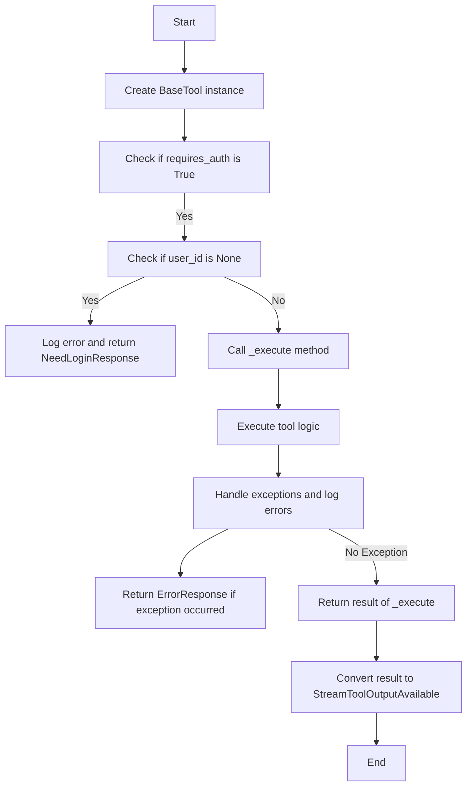
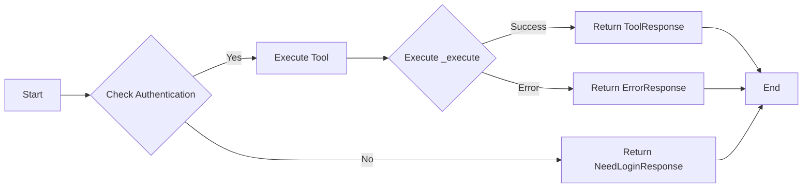
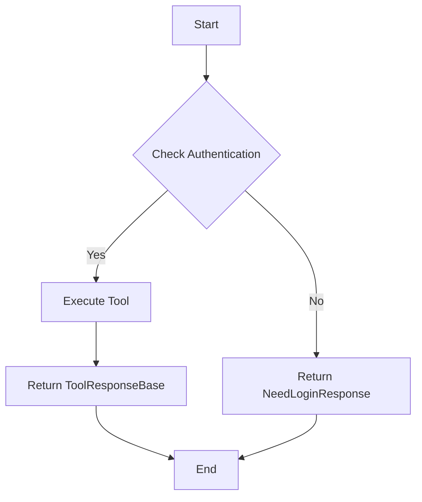
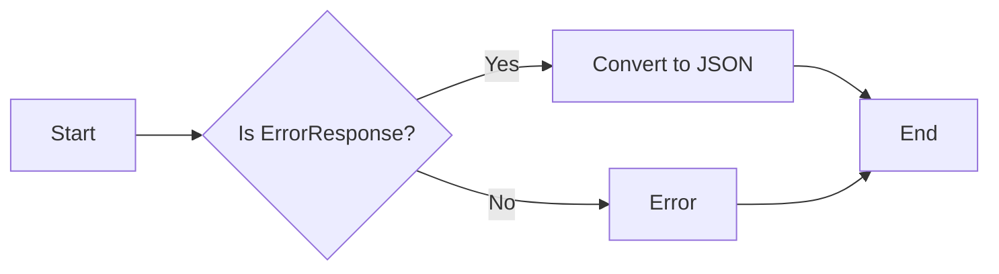
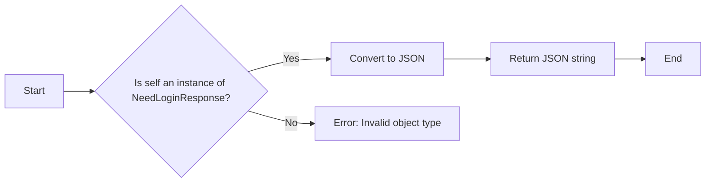
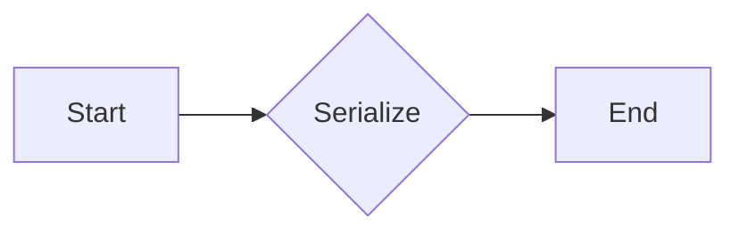

# `.\AutoGPT\autogpt_platform\backend\backend\api\features\chat\tools\base.py` 详细设计文档

This file defines a base class for chat tools, providing common functionality and structure for implementing various chat tools.

## 整体流程



## 类结构

```
BaseTool (抽象基类)
├── ChatCompletionToolParam (OpenAI工具参数)
├── ChatSession (聊天会话)
├── StreamToolOutputAvailable (工具输出)
├── ErrorResponse (错误响应)
├── NeedLoginResponse (需要登录响应)
└── ToolResponseBase (工具响应基类)
```

## 全局变量及字段


### `logger`
    
Logger instance for logging messages.

类型：`logging.Logger`
    


### `ChatCompletionToolParam`
    
Class representing the OpenAI tool format.

类型：`ChatCompletionToolParam`
    


### `ChatSession`
    
Class representing a chat session.

类型：`ChatSession`
    


### `StreamToolOutputAvailable`
    
Class representing the output of a tool call.

类型：`StreamToolOutputAvailable`
    


### `ErrorResponse`
    
Class representing an error response.

类型：`ErrorResponse`
    


### `NeedLoginResponse`
    
Class representing a need login response.

类型：`NeedLoginResponse`
    


### `ToolResponseBase`
    
Base class for tool responses.

类型：`ToolResponseBase`
    


### `user_id`
    
User ID for authentication.

类型：`str | None`
    


### `session`
    
Chat session object.

类型：`ChatSession`
    


### `tool_call_id`
    
Unique identifier for the tool call.

类型：`str`
    


### `kwargs`
    
Additional keyword arguments for the tool.

类型：`dict[str, Any]`
    


### `result`
    
Result of the tool execution.

类型：`ToolResponseBase`
    


### `e`
    
Exception raised during tool execution.

类型：`Exception`
    


### `BaseTool.name`
    
Name of the tool for OpenAI function calling.

类型：`str`
    


### `BaseTool.description`
    
Description of the tool for OpenAI.

类型：`str`
    


### `BaseTool.parameters`
    
Parameters schema for OpenAI.

类型：`dict[str, Any]`
    


### `BaseTool.requires_auth`
    
Indicates whether the tool requires authentication.

类型：`bool`
    


### `BaseTool.is_long_running`
    
Indicates whether the tool is long-running and should execute in the background.

类型：`bool`
    


### `ChatCompletionToolParam.type`
    
Type of the OpenAI tool.

类型：`str`
    


### `ChatCompletionToolParam.function`
    
Function details of the OpenAI tool.

类型：`dict[str, Any]`
    


### `ChatSession.session_id`
    
Unique identifier for the chat session.

类型：`str`
    


### `StreamToolOutputAvailable.toolCallId`
    
Unique identifier for the tool call.

类型：`str`
    


### `StreamToolOutputAvailable.toolName`
    
Name of the tool.

类型：`str`
    


### `StreamToolOutputAvailable.output`
    
Output of the tool call.

类型：`str`
    


### `StreamToolOutputAvailable.success`
    
Indicates whether the tool call was successful.

类型：`bool`
    


### `ErrorResponse.message`
    
Error message.

类型：`str`
    


### `ErrorResponse.error`
    
Error details.

类型：`str`
    


### `ErrorResponse.session_id`
    
Unique identifier for the chat session.

类型：`str`
    


### `NeedLoginResponse.message`
    
Login message.

类型：`str`
    


### `NeedLoginResponse.session_id`
    
Unique identifier for the chat session.

类型：`str`
    
    

## 全局函数及方法


### BaseTool.as_openai_tool

Converts the tool to OpenAI tool format.

参数：

- 无

返回值：`ChatCompletionToolParam`，Represents the OpenAI tool format.

#### 流程图

```mermaid
graph LR
A[BaseTool.as_openai_tool] --> B[Create ChatCompletionToolParam]
B --> C[Set type to "function"]
C --> D[Set function name to self.name]
D --> E[Set function description to self.description]
E --> F[Set function parameters to self.parameters]
F --> G[Return ChatCompletionToolParam]
```

#### 带注释源码

```python
def as_openai_tool(self) -> ChatCompletionToolParam:
    """Convert to OpenAI tool format."""
    return ChatCompletionToolParam(
        type="function",
        function={
            "name": self.name,
            "description": self.description,
            "parameters": self.parameters,
        },
    )
```


### BaseTool.execute

This method is responsible for executing a chat tool with an authentication check. It handles the execution logic, error handling, and returns a Pydantic response object.

参数：

- `user_id`：`str | None`，The user ID (may be anonymous like "anon_123")
- `session`：`ChatSession`，The chat session object
- `tool_call_id`：`str`，The ID of the tool call
- `**kwargs`：Additional keyword arguments specific to the tool

返回值：`StreamToolOutputAvailable`，A Pydantic response object containing the tool's output

#### 流程图



#### 带注释源码

```python
async def execute(
    self,
    user_id: str | None,
    session: ChatSession,
    tool_call_id: str,
    **kwargs,
) -> StreamToolOutputAvailable:
    """Execute the tool with authentication check.

    Args:
        user_id: User ID (may be anonymous like "anon_123")
        session_id: Chat session ID
        **kwargs: Tool-specific parameters

    Returns:
        Pydantic response object

    """
    if self.requires_auth and not user_id:
        logger.error(
            f"Attempted tool call for {self.name} but user not authenticated"
        )
        return StreamToolOutputAvailable(
            toolCallId=tool_call_id,
            toolName=self.name,
            output=NeedLoginResponse(
                message=f"Please sign in to use {self.name}",
                session_id=session.session_id,
            ).model_dump_json(),
            success=False,
        )

    try:
        result = await self._execute(user_id, session, **kwargs)
        return StreamToolOutputAvailable(
            toolCallId=tool_call_id,
            toolName=self.name,
            output=result.model_dump_json(),
        )
    except Exception as e:
        logger.error(f"Error in {self.name}: {e}", exc_info=True)
        return StreamToolOutputAvailable(
            toolCallId=tool_call_id,
            toolName=self.name,
            output=ErrorResponse(
                message=f"An error occurred while executing {self.name}",
                error=str(e),
                session_id=session.session_id,
            ).model_dump_json(),
            success=False,
        )
``` 


### BaseTool._execute

Internal execution logic to be implemented by subclasses.

参数：

- `user_id`：`str | None`，User ID (authenticated or anonymous)
- `session`：`ChatSession`，Chat session ID
- `**kwargs`：`Any`，Tool-specific parameters

返回值：`ToolResponseBase`，Pydantic response object

#### 流程图



#### 带注释源码

```python
async def _execute(
    self,
    user_id: str | None,
    session: ChatSession,
    **kwargs,
) -> ToolResponseBase:
    """Internal execution logic to be implemented by subclasses.

    Args:
        user_id: User ID (authenticated or anonymous)
        session_id: Chat session ID
        **kwargs: Tool-specific parameters

    Returns:
        Pydantic response object

    """
    raise NotImplementedError
```


### ErrorResponse.model_dump_json

This method converts an ErrorResponse object into a JSON string.

参数：

- `self`：`ErrorResponse`，The ErrorResponse object to be converted.
- `**kwargs`：`Any`，Additional keyword arguments that may be used for future extensions.

返回值：`str`，A JSON string representation of the ErrorResponse object.

#### 流程图



#### 带注释源码

```python
from pydantic import BaseModel
from typing import Any

class ErrorResponse(BaseModel):
    """Error response model."""
    message: str
    error: str
    session_id: str | None = None

    def model_dump_json(self) -> str:
        """Converts the ErrorResponse object to a JSON string."""
        return self.json()
```


### NeedLoginResponse.model_dump_json

This function converts a NeedLoginResponse object into a JSON string.

参数：

-  `self`：`NeedLoginResponse`，The NeedLoginResponse object to be converted.
-  ...

返回值：`str`，A JSON string representation of the NeedLoginResponse object.

#### 流程图



#### 带注释源码

```python
class NeedLoginResponse(ToolResponseBase):
    """Response model for when a user needs to log in."""

    message: str
    session_id: str

    @classmethod
    def model_dump_json(cls, obj: ToolResponseBase) -> str:
        """Convert a ToolResponseBase object to a JSON string.

        Args:
            obj: ToolResponseBase object to convert.

        Returns:
            str: JSON string representation of the object.
        """
        if not isinstance(obj, NeedLoginResponse):
            raise ValueError("Invalid object type")

        return obj.json()
```


### ToolResponseBase.model_dump_json

This method is a part of the `ToolResponseBase` class and is used to serialize the response object into a JSON string.

参数：

- 无

返回值：`str`，返回一个JSON格式的字符串，包含响应对象的数据

#### 流程图



#### 带注释源码

```python
class ToolResponseBase:
    # ... other class members ...

    def model_dump_json(self) -> str:
        """Serialize the response object to a JSON string."""
        return self.json()
```


## 关键组件


### 张量索引与惰性加载

张量索引与惰性加载是用于高效处理大型数据集的关键技术，它允许在需要时才加载数据，从而减少内存消耗和提高性能。

### 反量化支持

反量化支持是针对量化模型的一种技术，它允许模型在量化后仍然保持较高的精度，从而在保持性能的同时减少模型大小。

### 量化策略

量化策略是用于优化模型性能和减少模型大小的技术，它通过将模型的权重和激活值从浮点数转换为低精度整数来实现。


## 问题及建议


### 已知问题

-   **抽象层次过高**：`BaseTool` 类定义了大量的抽象方法（如 `name`, `description`, `parameters` 等），这可能导致子类实现这些方法时需要编写大量的样板代码。
-   **异常处理**：`execute` 方法中的异常处理较为简单，仅记录错误并返回错误响应。可能需要更详细的异常处理逻辑，以便更好地诊断问题。
-   **依赖注入**：代码中直接使用了 `logger` 和 `ChatSession`，这可能导致代码难以测试和重用。考虑使用依赖注入来改善这一点。

### 优化建议

-   **实现模板方法模式**：对于 `BaseTool` 中的抽象方法，可以考虑实现一个模板方法，为子类提供一些默认实现，减少样板代码。
-   **增强异常处理**：在 `execute` 方法中，可以增加对不同类型的异常的处理，例如区分业务逻辑错误和系统错误，并返回更具体的错误信息。
-   **使用依赖注入**：通过依赖注入来管理 `logger` 和 `ChatSession`，使得代码更加灵活和可测试。
-   **代码重构**：考虑将 `as_openai_tool` 和 `_execute` 方法中的逻辑分离到不同的类或模块中，以提高代码的可读性和可维护性。
-   **文档和注释**：增加对类和方法文档字符串的详细描述，以便其他开发者更好地理解代码的功能和用法。


## 其它


### 设计目标与约束

- 设计目标：
  - 提供一个通用的工具类，用于封装与OpenAI API交互的逻辑。
  - 确保工具类易于扩展，以支持新的聊天工具。
  - 确保工具类具有良好的错误处理机制，能够处理认证失败和执行错误。

- 约束：
  - 工具类必须遵循OpenAI API的规范。
  - 工具类必须支持异步执行，以适应长运行任务的需求。

### 错误处理与异常设计

- 错误处理：
  - 当用户未认证时，返回`NeedLoginResponse`。
  - 当执行过程中发生异常时，返回`ErrorResponse`。

- 异常设计：
  - 使用`try-except`块捕获执行过程中的异常。
  - 记录异常信息，并返回相应的错误响应。

### 数据流与状态机

- 数据流：
  - 用户发起工具调用请求。
  - 工具类执行工具逻辑。
  - 工具类返回执行结果或错误信息。

- 状态机：
  - 工具类在执行过程中可能处于以下状态：未认证、执行中、执行成功、执行失败。

### 外部依赖与接口契约

- 外部依赖：
  - OpenAI API
  - Pydantic

- 接口契约：
  - `ChatCompletionToolParam`：OpenAI工具参数格式。
  - `ChatSession`：聊天会话信息。
  - `StreamToolOutputAvailable`：工具输出响应。
  - `ErrorResponse`：错误响应。
  - `NeedLoginResponse`：需要登录响应。
  - `ToolResponseBase`：工具响应基类。


    