# `.\AutoGPT\autogpt_platform\backend\backend\api\features\chat\tools\create_agent.py` 详细设计文档

The file implements a tool for creating agents from natural language descriptions, providing a workflow for decomposition, generation, preview, and saving to a library.

## 整体流程

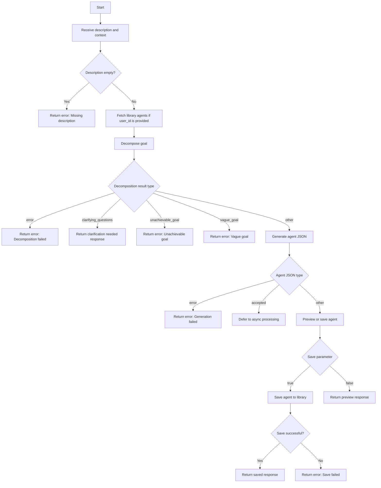

## 类结构

```
CreateAgentTool (Class)
├── BaseTool (Base Class)
│   ├── _execute (Method)
│   ├── name (Property)
│   ├── description (Property)
│   ├── requires_auth (Property)
│   └── is_long_running (Property)
└── ChatSession (Class)
```

## 全局变量及字段


### `logger`
    
Logger instance for logging messages.

类型：`logging.Logger`
    


### `description`
    
Description of the CreateAgentTool.

类型：`str`
    


### `requires_auth`
    
Indicates if the tool requires authentication.

类型：`bool`
    


### `is_long_running`
    
Indicates if the tool is a long-running operation.

类型：`bool`
    


### `name`
    
Name of the CreateAgentTool.

类型：`str`
    


### `parameters`
    
Parameters required for the tool.

类型：`dict[str, Any]`
    


### `user_id`
    
User ID for the current session.

类型：`str | None`
    


### `session`
    
Chat session object.

类型：`ChatSession`
    


### `operation_id`
    
Operation ID for async processing.

类型：`str | None`
    


### `task_id`
    
Task ID for async processing.

类型：`str | None`
    


### `description`
    
Natural language description of the agent to be created.

类型：`str`
    


### `context`
    
Additional context or answers to previous clarifying questions.

类型：`str`
    


### `save`
    
Indicates if the agent should be saved to the library.

类型：`bool`
    


### `session_id`
    
Session ID for the current session.

类型：`str | None`
    


### `library_agents`
    
List of relevant agents for sub-agent composition.

类型：`list`
    


### `decomposition_result`
    
Result of decomposing the goal.

类型：`dict`
    


### `agent_json`
    
JSON representation of the generated agent.

类型：`dict`
    


### `created_graph`
    
Response object for saved agent.

类型：`AgentSavedResponse`
    


### `library_agent`
    
Response object for library agent.

类型：`AgentSavedResponse`
    


### `CreateAgentTool.name`
    
Name of the tool.

类型：`str`
    


### `CreateAgentTool.description`
    
Description of the tool.

类型：`str`
    


### `CreateAgentTool.requires_auth`
    
Indicates if the tool requires authentication.

类型：`bool`
    


### `CreateAgentTool.is_long_running`
    
Indicates if the tool is a long-running operation.

类型：`bool`
    


### `CreateAgentTool.parameters`
    
Parameters required for the tool.

类型：`dict[str, Any]`
    


### `BaseTool.user_id`
    
User ID for the current session.

类型：`str | None`
    


### `ChatSession.session`
    
Chat session object.

类型：`ChatSession`
    


### `CreateAgentTool.operation_id`
    
Operation ID for async processing.

类型：`str | None`
    


### `CreateAgentTool.task_id`
    
Task ID for async processing.

类型：`str | None`
    


### `CreateAgentTool.description`
    
Natural language description of the agent to be created.

类型：`str`
    


### `CreateAgentTool.context`
    
Additional context or answers to previous clarifying questions.

类型：`str`
    


### `CreateAgentTool.save`
    
Indicates if the agent should be saved to the library.

类型：`bool`
    


### `CreateAgentTool.session_id`
    
Session ID for the current session.

类型：`str | None`
    


### `CreateAgentTool.library_agents`
    
List of relevant agents for sub-agent composition.

类型：`list`
    


### `CreateAgentTool.decomposition_result`
    
Result of decomposing the goal.

类型：`dict`
    


### `CreateAgentTool.agent_json`
    
JSON representation of the generated agent.

类型：`dict`
    


### `CreateAgentTool.created_graph`
    
Response object for saved agent.

类型：`AgentSavedResponse`
    


### `CreateAgentTool.library_agent`
    
Response object for library agent.

类型：`AgentSavedResponse`
    
    

## 全局函数及方法


### `decompose_goal`

This function takes a natural language description and additional context, and attempts to decompose the goal into actionable steps. It may return clarifying questions if more information is needed.

参数：

- `description`：`str`，The natural language description of the goal.
- `context`：`str`，Additional context or answers to previous clarifying questions.
- `library_agents`：`list`，Optional list of existing agents that may be relevant to the goal decomposition.

返回值：`Any`，The result of the goal decomposition, which can be a dictionary with different types of responses such as "error", "clarifying_questions", "unachievable_goal", "vague_goal", or "steps".

#### 流程图

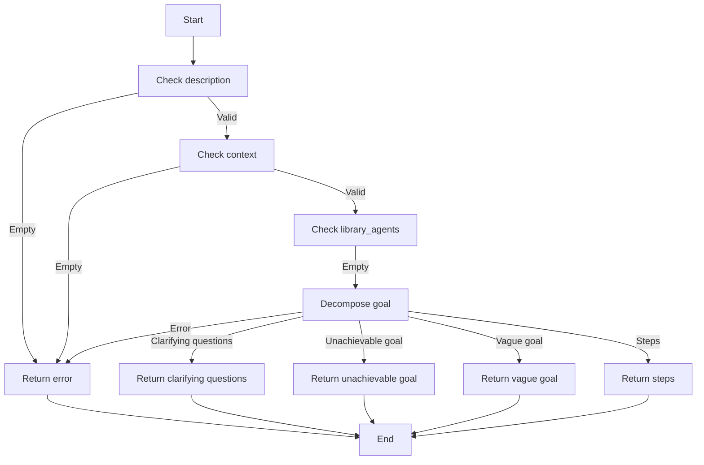

#### 带注释源码

```python
async def decompose_goal(description: str, context: str, library_agents: list = None):
    # ... (source code implementation) ...
```


### enrich_library_agents_from_steps

This function enriches the library of agents by adding new agents based on the given decomposition result and existing agents.

参数：

- `user_id`：`str`，The ID of the user for whom the library is being enriched.
- `decomposition_result`：`Any`，The result of decomposing the goal into steps.
- `existing_agents`：`list`，The existing agents in the library.
- `include_marketplace`：`bool`，Whether to include agents from the marketplace.

返回值：`list`，The enriched list of agents.

#### 流程图

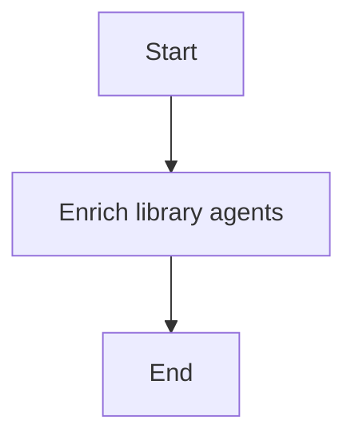

#### 带注释源码

```python
def enrich_library_agents_from_steps(
    user_id: str,
    decomposition_result: Any,
    existing_agents: list,
    include_marketplace: bool,
) -> list:
    try:
        # Logic to enrich the library agents
        # ...
        return enriched_agents
    except Exception as e:
        logger.warning(f"Failed to enrich library agents from steps: {e}")
        raise
```


### `generate_agent`

This function generates an agent JSON from a decomposition result and library agents.

参数：

- `decomposition_result`：`AgentPreviewResponse`，The result of decomposing the goal.
- `library_agents`：`list`，The list of library agents to be used for sub-agent composition.
- `operation_id`：`str`，The operation ID for async processing.
- `task_id`：`str`，The task ID for async processing.

返回值：`dict`，The JSON representation of the generated agent.

#### 流程图

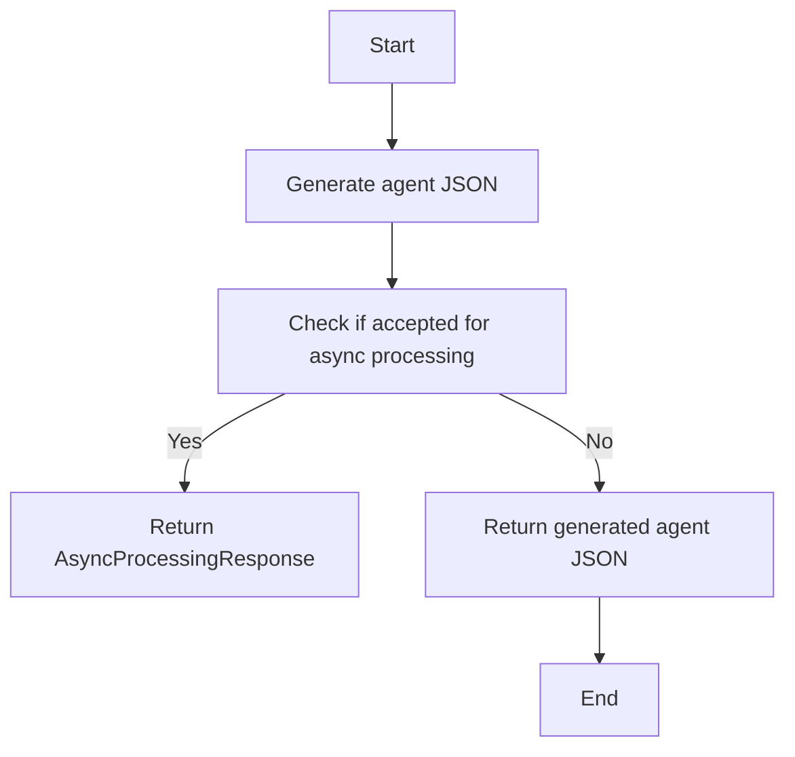

#### 带注释源码

```python
def generate_agent(
    decomposition_result: AgentPreviewResponse,
    library_agents: list,
    operation_id: str = None,
    task_id: str = None,
) -> dict:
    try:
        agent_json = await generate_agent(
            decomposition_result,
            library_agents,
            operation_id=operation_id,
            task_id=task_id,
        )
    except AgentGeneratorNotConfiguredError:
        return ErrorResponse(
            message=(
                "Agent generation is not available. "
                "The Agent Generator service is not configured."
            ),
            error="service_not_configured",
            session_id=session_id,
        )

    if agent_json is None:
        return ErrorResponse(
            message="Failed to generate the agent. The agent generation service may be unavailable. Please try again.",
            error="generation_failed",
            details={"description": description[:100]},
            session_id=session_id,
        )

    if isinstance(agent_json, dict) and agent_json.get("type") == "error":
        error_msg = agent_json.get("error", "Unknown error")
        error_type = agent_json.get("error_type", "unknown")
        user_message = get_user_message_for_error(
            error_type,
            operation="generate the agent",
            llm_parse_message="The AI had trouble generating the agent. Please try again or simplify your goal.",
            validation_message=(
                "I wasn't able to create a valid agent for this request. "
                "The generated workflow had some structural issues. "
                "Please try simplifying your goal or breaking it into smaller steps."
            ),
            error_details=error_msg,
        )
        return ErrorResponse(
            message=user_message,
            error=f"generation_failed:{error_type}",
            details={
                "description": description[:100],
                "service_error": error_msg,
                "error_type": error_type,
            },
            session_id=session_id,
        )

    return agent_json
```


### `get_all_relevant_agents_for_generation`

Retrieves all relevant agents for generation based on the user ID and search query.

参数：

- `user_id`：`str`，The unique identifier for the user.
- `search_query`：`str`，The search query to find relevant agents.
- `include_marketplace`：`bool`，Whether to include agents from the marketplace.

返回值：`list`，A list of relevant agents.

#### 流程图

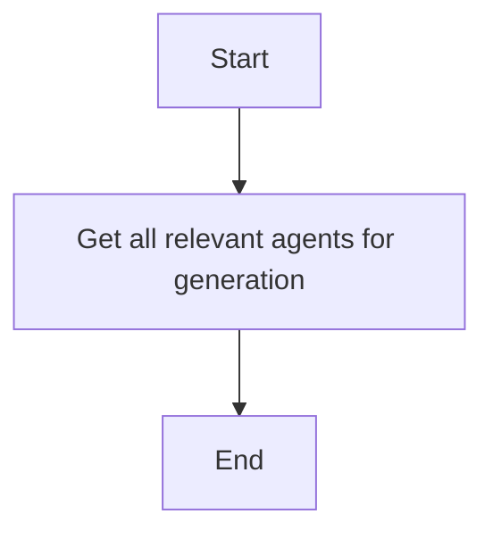

#### 带注释源码

```python
def get_all_relevant_agents_for_generation(
    user_id: str,
    search_query: str,
    include_marketplace: bool = True,
) -> list:
    # Implementation of the function to retrieve relevant agents
    pass
```


### `get_user_message_for_error`

This function generates a user-friendly error message based on the error type.

参数：

- `error_type`：`str`，The type of error that occurred.
- `operation`：`str`，The operation that was being performed when the error occurred.
- `llm_parse_message`：`str`，A message to display if the error is related to the AI's understanding of the request.
- `validation_message`：`str`，A message to display if the error is related to the validation of the generated agent.
- `error_details`：`str`，Additional details about the error.

返回值：`str`，A user-friendly error message.

#### 流程图

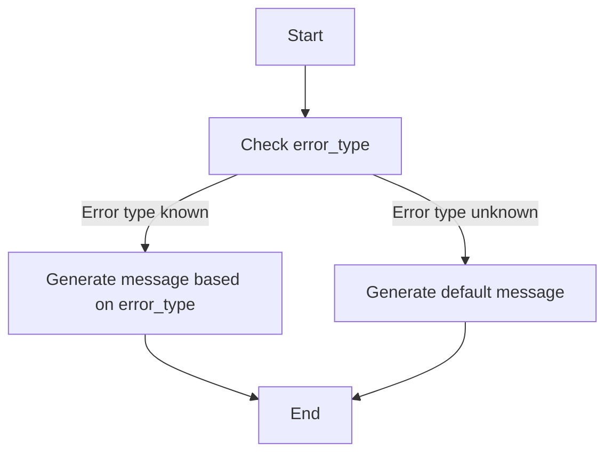

#### 带注释源码

```python
def get_user_message_for_error(
    error_type: str,
    operation: str,
    llm_parse_message: str,
    validation_message: str,
    error_details: str,
) -> str:
    """
    Generate a user-friendly error message based on the error type.

    :param error_type: The type of error that occurred.
    :param operation: The operation that was being performed when the error occurred.
    :param llm_parse_message: A message to display if the error is related to the AI's understanding of the request.
    :param validation_message: A message to display if the error is related to the validation of the generated agent.
    :param error_details: Additional details about the error.
    :return: A user-friendly error message.
    """
    if error_type == "parse_error":
        return llm_parse_message
    elif error_type == "validation_error":
        return validation_message
    else:
        return f"An error occurred while {operation}: {error_details}"
```


### save_agent_to_library

Saves the generated agent to the user's library.

参数：

- `agent_json`：`dict`，The JSON representation of the agent to be saved.
- `user_id`：`str`，The ID of the user to whom the agent belongs.

返回值：`tuple`，A tuple containing the created graph and the library agent.

#### 流程图

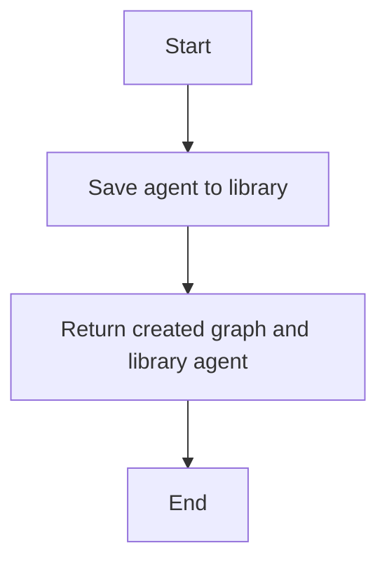

#### 带注释源码

```python
# Save the generated agent to the user's library.
async def save_agent_to_library(agent_json: dict, user_id: str) -> tuple:
    try:
        created_graph, library_agent = await self._save_agent_to_library(
            agent_json, user_id
        )
        return created_graph, library_agent
    except Exception as e:
        logger.error(f"Failed to save the agent: {e}")
        raise
```


### `_execute`

执行创建代理工具。

参数：

- `user_id`：`str | None`，用户ID，用于获取用户库中的代理。
- `session`：`ChatSession`，聊天会话对象，包含会话ID等信息。
- `**kwargs`：`dict[str, Any]`，额外的关键字参数，包括描述、上下文和保存代理到库的标志。

返回值：`ToolResponseBase`，工具响应基类，包含错误响应、澄清问题响应、异步处理响应、代理预览响应和代理保存响应。

#### 流程图

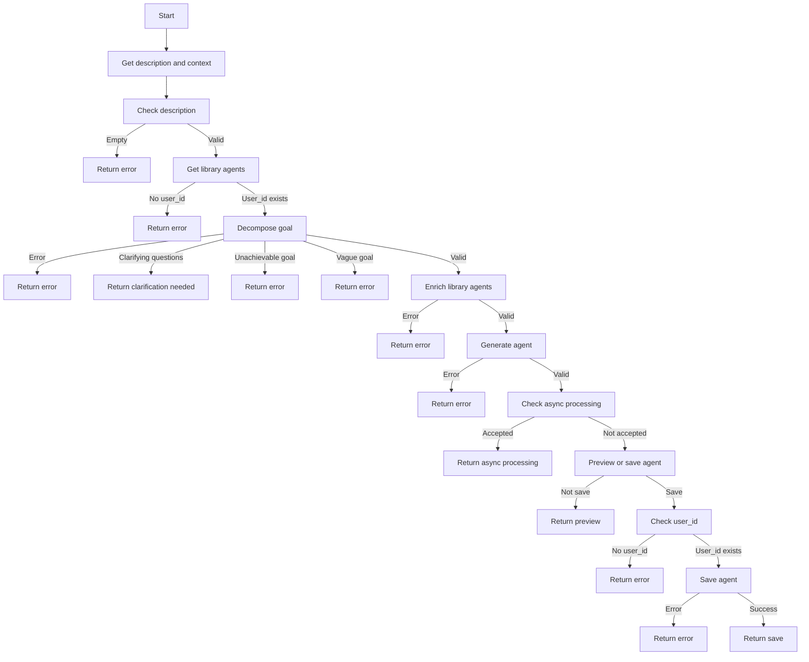

#### 带注释源码

```python
async def _execute(self, user_id: str | None, session: ChatSession, **kwargs) -> ToolResponseBase:
    """Execute the create_agent tool.

    Flow:
    1. Decompose the description into steps (may return clarifying questions)
    2. Generate agent JSON (external service handles fixing and validation)
    3. Preview or save based on the save parameter
    """
    description = kwargs.get("description", "").strip()
    context = kwargs.get("context", "")
    save = kwargs.get("save", True)
    session_id = session.session_id if session else None

    # Extract async processing params (passed by long-running tool handler)
    operation_id = kwargs.get("_operation_id")
    task_id = kwargs.get("_task_id")

    if not description:
        return ErrorResponse(
            message="Please provide a description of what the agent should do.",
            error="Missing description parameter",
            session_id=session_id,
        )

    library_agents = None
    if user_id:
        try:
            library_agents = await get_all_relevant_agents_for_generation(
                user_id=user_id,
                search_query=description,
                include_marketplace=True,
            )
            logger.debug(
                f"Found {len(library_agents)} relevant agents for sub-agent composition"
            )
        except Exception as e:
            logger.warning(f"Failed to fetch library agents: {e}")

    try:
        decomposition_result = await decompose_goal(
            description, context, library_agents
        )
    except AgentGeneratorNotConfiguredError:
        return ErrorResponse(
            message=(
                "Agent generation is not available. "
                "The Agent Generator service is not configured."
            ),
            error="service_not_configured",
            session_id=session_id,
        )

    if decomposition_result is None:
        return ErrorResponse(
            message="Failed to analyze the goal. The agent generation service may be unavailable. Please try again.",
            error="decomposition_failed",
            details={"description": description[:100]},
            session_id=session_id,
        )

    if decomposition_result.get("type") == "error":
        error_msg = decomposition_result.get("error", "Unknown error")
        error_type = decomposition_result.get("error_type", "unknown")
        user_message = get_user_message_for_error(
            error_type,
            operation="analyze the goal",
            llm_parse_message="The AI had trouble understanding this request. Please try rephrasing your goal.",
        )
        return ErrorResponse(
            message=user_message,
            error=f"decomposition_failed:{error_type}",
            details={
                "description": description[:100],
                "service_error": error_msg,
                "error_type": error_type,
            },
            session_id=session_id,
        )

    if decomposition_result.get("type") == "clarifying_questions":
        questions = decomposition_result.get("questions", [])
        return ClarificationNeededResponse(
            message=(
                "I need some more information to create this agent. "
                "Please answer the following questions:"
            ),
            questions=[
                ClarifyingQuestion(
                    question=q.get("question", ""),
                    keyword=q.get("keyword", ""),
                    example=q.get("example"),
                )
                for q in questions
            ],
            session_id=session_id,
        )

    if decomposition_result.get("type") == "unachievable_goal":
        suggested = decomposition_result.get("suggested_goal", "")
        reason = decomposition_result.get("reason", "")
        return ErrorResponse(
            message=(
                f"This goal cannot be accomplished with the available blocks. "
                f"{reason} "
                f"Suggestion: {suggested}"
            ),
            error="unachievable_goal",
            details={"suggested_goal": suggested, "reason": reason},
            session_id=session_id,
        )

    if decomposition_result.get("type") == "vague_goal":
        suggested = decomposition_result.get("suggested_goal", "")
        return ErrorResponse(
            message=(
                f"The goal is too vague to create a specific workflow. "
                f"Suggestion: {suggested}"
            ),
            error="vague_goal",
            details={"suggested_goal": suggested},
            session_id=session_id,
        )

    if user_id and library_agents is not None:
        try:
            library_agents = await enrich_library_agents_from_steps(
                user_id=user_id,
                decomposition_result=decomposition_result,
                existing_agents=library_agents,
                include_marketplace=True,
            )
            logger.debug(
                f"After enrichment: {len(library_agents)} total agents for sub-agent composition"
            )
        except Exception as e:
            logger.warning(f"Failed to enrich library agents from steps: {e}")

    try:
        agent_json = await generate_agent(
            decomposition_result,
            library_agents,
            operation_id=operation_id,
            task_id=task_id,
        )
    except AgentGeneratorNotConfiguredError:
        return ErrorResponse(
            message=(
                "Agent generation is not available. "
                "The Agent Generator service is not configured."
            ),
            error="service_not_configured",
            session_id=session_id,
        )

    if agent_json is None:
        return ErrorResponse(
            message="Failed to generate the agent. The agent generation service may be unavailable. Please try again.",
            error="generation_failed",
            details={"description": description[:100]},
            session_id=session_id,
        )

    if isinstance(agent_json, dict) and agent_json.get("type") == "error":
        error_msg = agent_json.get("error", "Unknown error")
        error_type = agent_json.get("error_type", "unknown")
        user_message = get_user_message_for_error(
            error_type,
            operation="generate the agent",
            llm_parse_message="The AI had trouble generating the agent. Please try again or simplify your goal.",
            validation_message=(
                "I wasn't able to create a valid agent for this request. "
                "The generated workflow had some structural issues. "
                "Please try simplifying your goal or breaking it into smaller steps."
            ),
            error_details=error_msg,
        )
        return ErrorResponse(
            message=user_message,
            error=f"generation_failed:{error_type}",
            details={
                "description": description[:100],
                "service_error": error_msg,
                "error_type": error_type,
            },
            session_id=session_id,
        )

    # Check if Agent Generator accepted for async processing
    if agent_json.get("status") == "accepted":
        logger.info(
            f"Agent generation delegated to async processing "
            f"(operation_id={operation_id}, task_id={task_id})"
        )
        return AsyncProcessingResponse(
            message="Agent generation started. You'll be notified when it's complete.",
            operation_id=operation_id,
            task_id=task_id,
            session_id=session_id,
        )

    agent_name = agent_json.get("name", "Generated Agent")
    agent_description = agent_json.get("description", "")
    node_count = len(agent_json.get("nodes", []))
    link_count = len(agent_json.get("links", []))

    if not save:
        return AgentPreviewResponse(
            message=(
                f"I've generated an agent called '{agent_name}' with {node_count} blocks. "
                f"Review it and call create_agent with save=true to save it to your library."
            ),
            agent_json=agent_json,
            agent_name=agent_name,
            description=agent_description,
            node_count=node_count,
            link_count=link_count,
            session_id=session_id,
        )

    if not user_id:
        return ErrorResponse(
            message="You must be logged in to save agents.",
            error="auth_required",
            session_id=session_id,
        )

    try:
        created_graph, library_agent = await save_agent_to_library(
            agent_json, user_id
        )

        return AgentSavedResponse(
            message=f"Agent '{created_graph.name}' has been saved to your library!",
            agent_id=created_graph.id,
            agent_name=created_graph.name,
            library_agent_id=library_agent.id,
            library_agent_link=f"/library/agents/{library_agent.id}",
            agent_page_link=f"/build?flowID={created_graph.id}",
            session_id=session_id,
        )
    except Exception as e:
        return ErrorResponse(
            message=f"Failed to save the agent: {str(e)}",
            error="save_failed",
            details={"exception": str(e)},
            session_id=session_id,
        )
```


### BaseTool._execute

Execute the create_agent tool.

参数：

- `user_id`：`str | None`，The user ID for the agent creation process.
- `session`：`ChatSession`，The chat session object associated with the user.
- `**kwargs`：`Any`，Additional keyword arguments for the tool execution.

返回值：`ToolResponseBase`，The response object containing the result of the tool execution.

#### 流程图

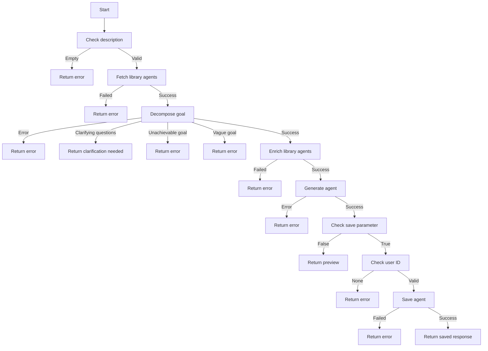

#### 带注释源码

```python
async def _execute(
    self,
    user_id: str | None,
    session: ChatSession,
    **kwargs,
) -> ToolResponseBase:
    """Execute the create_agent tool.

    Flow:
    1. Decompose the description into steps (may return clarifying questions)
    2. Generate agent JSON (external service handles fixing and validation)
    3. Preview or save based on the save parameter
    """
    description = kwargs.get("description", "").strip()
    context = kwargs.get("context", "")
    save = kwargs.get("save", True)
    session_id = session.session_id if session else None

    # Extract async processing params (passed by long-running tool handler)
    operation_id = kwargs.get("_operation_id")
    task_id = kwargs.get("_task_id")

    if not description:
        return ErrorResponse(
            message="Please provide a description of what the agent should do.",
            error="Missing description parameter",
            session_id=session_id,
        )

    library_agents = None
    if user_id:
        try:
            library_agents = await get_all_relevant_agents_for_generation(
                user_id=user_id,
                search_query=description,
                include_marketplace=True,
            )
            logger.debug(
                f"Found {len(library_agents)} relevant agents for sub-agent composition"
            )
        except Exception as e:
            logger.warning(f"Failed to fetch library agents: {e}")

    try:
        decomposition_result = await decompose_goal(
            description, context, library_agents
        )
    except AgentGeneratorNotConfiguredError:
        return ErrorResponse(
            message=(
                "Agent generation is not available. "
                "The Agent Generator service is not configured."
            ),
            error="service_not_configured",
            session_id=session_id,
        )

    # ... (rest of the code follows the same structure as the flowchart)
```


### BaseTool.name

该函数返回创建代理工具的名称。

参数：

- 无

返回值：`str`，返回创建代理工具的名称 "create_agent"

#### 流程图

```mermaid
graph TD
    A[Start] --> B[Return "create_agent"]
    B --> C[End]
```

#### 带注释源码

```python
class CreateAgentTool(BaseTool):
    """Tool for creating agents from natural language descriptions."""

    @property
    def name(self) -> str:
        return "create_agent"
```


### `CreateAgentTool.description`

`CreateAgentTool.description` 返回创建代理工具的描述。

参数：

- 无

返回值：`str`，描述创建代理工具的功能和流程。

#### 流程图

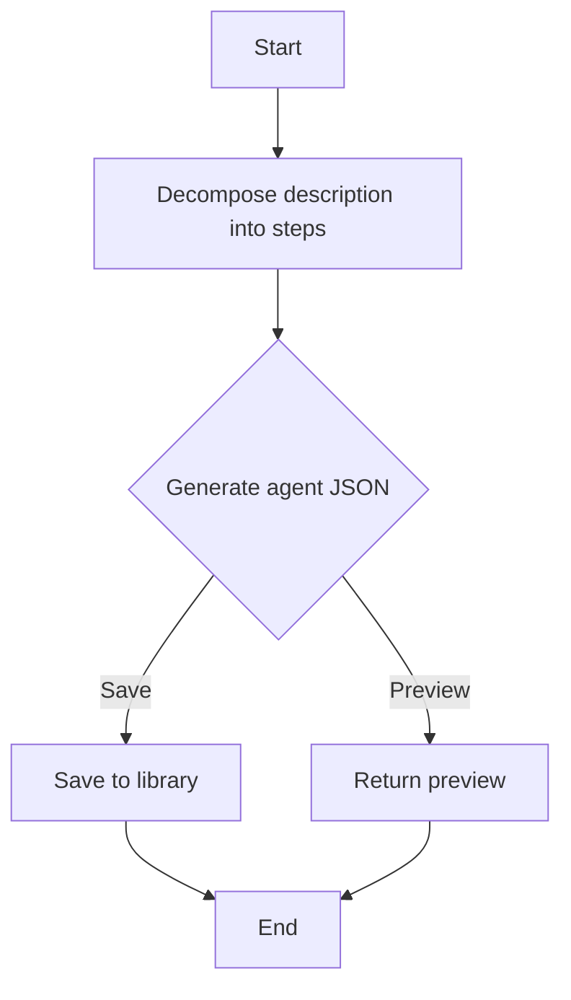

#### 带注释源码

```python
    @property
    def description(self) -> str:
        return (
            "Create a new agent workflow from a natural language description. "
            "First generates a preview, then saves to library if save=true."
        )
```


### `CreateAgentTool.requires_auth`

This method checks if authentication is required for the `CreateAgentTool`.

参数：

- 无

返回值：`bool`，Indicates whether authentication is required.

#### 流程图

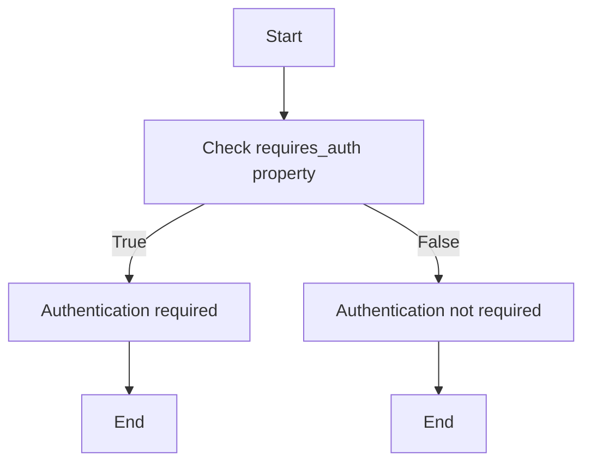

#### 带注释源码

```python
    @property
    def requires_auth(self) -> bool:
        return True
```


### BaseTool.is_long_running

`BaseTool.is_long_running` 是一个属性方法，用于判断创建代理工具是否为长时间运行的任务。

参数：

- 无

返回值：`bool`，表示是否为长时间运行的任务。

#### 流程图

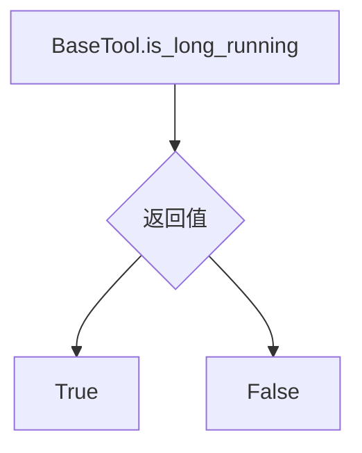

#### 带注释源码

```python
    @property
    def is_long_running(self) -> bool:
        return True
```


## 关键组件


### 张量索引与惰性加载

张量索引与惰性加载是用于高效处理大规模数据集的关键技术，它允许在需要时才加载数据，从而减少内存消耗和提高性能。

### 反量化支持

反量化支持是针对量化模型的一种技术，它允许模型在量化过程中保持较高的精度，从而在降低模型大小和计算量的同时，保持模型性能。

### 量化策略

量化策略是用于模型压缩的一种方法，它通过减少模型中权重和激活值的精度来减小模型大小，从而提高模型在资源受限设备上的运行效率。


## 问题及建议


### 已知问题

-   **错误处理**: 代码中存在多个错误处理场景，但错误消息的详细程度不一致。例如，在`get_user_message_for_error`函数中，错误消息可能不够具体，难以帮助用户理解问题所在。
-   **日志记录**: 代码中使用了`logger.warning`和`logger.debug`，但没有使用`logger.error`来记录可能影响系统稳定性的错误。建议在关键错误处理中使用`logger.error`。
-   **异常处理**: 代码中使用了`try-except`块来捕获异常，但没有对所有可能抛出的异常进行处理。建议捕获所有可能的异常，并记录相应的错误信息。
-   **代码重复**: 在处理错误消息时，存在代码重复。建议使用函数或类来封装重复的代码，以提高代码的可维护性。

### 优化建议

-   **错误消息**: 建议在错误处理中提供更详细的错误消息，包括错误类型、错误原因和可能的解决方案。
-   **日志记录**: 建议在关键错误处理中使用`logger.error`，并记录错误堆栈信息，以便于问题追踪和调试。
-   **异常处理**: 建议捕获所有可能的异常，并记录相应的错误信息。对于已知异常，可以提供具体的处理逻辑；对于未知异常，可以记录异常堆栈信息。
-   **代码重构**: 建议对重复的代码进行重构，使用函数或类来封装，以提高代码的可读性和可维护性。
-   **异步处理**: 代码中使用了异步处理，但异步代码的执行流程不够清晰。建议使用`asyncio`库中的工具，如`asyncio.gather`或`asyncio.wait_for`，来管理异步任务，并确保异步代码的执行顺序。
-   **代码测试**: 建议编写单元测试和集成测试，以确保代码的正确性和稳定性。


## 其它


### 设计目标与约束

- 设计目标：
  - 提供一个用户友好的界面，允许用户通过自然语言描述创建智能代理。
  - 确保代理生成的流程清晰、高效，并能处理复杂的任务。
  - 保证代理生成的结果可验证和可维护。
- 约束：
  - 代理生成服务必须配置正确且可用。
  - 用户必须登录才能保存代理到个人库。
  - 代理生成的流程应尽可能自动化，减少人工干预。

### 错误处理与异常设计

- 错误处理：
  - 缺少描述参数时返回错误响应。
  - 代理生成服务不可用时返回错误响应。
  - 代理生成失败时返回错误响应，并提供详细的错误信息。
  - 保存代理失败时返回错误响应，并提供异常信息。
- 异常设计：
  - 使用统一的错误响应类来处理所有错误情况。
  - 记录详细的错误日志，便于问题追踪和调试。

### 数据流与状态机

- 数据流：
  - 用户输入描述和上下文。
  - 系统分解描述，生成代理预览或保存到库。
  - 用户确认或修改代理。
  - 系统处理代理生成请求。
- 状态机：
  - 初始状态：用户输入描述。
  - 分解描述状态：系统分析描述并可能提出澄清问题。
  - 生成代理状态：系统生成代理JSON。
  - 预览或保存状态：用户确认代理并保存到库。

### 外部依赖与接口契约

- 外部依赖：
  - 代理生成服务。
  - 用户库服务。
  - 日志服务。
- 接口契约：
  - 代理生成服务接口：提供代理生成功能。
  - 用户库服务接口：提供代理保存功能。
  - 日志服务接口：提供日志记录功能。

    