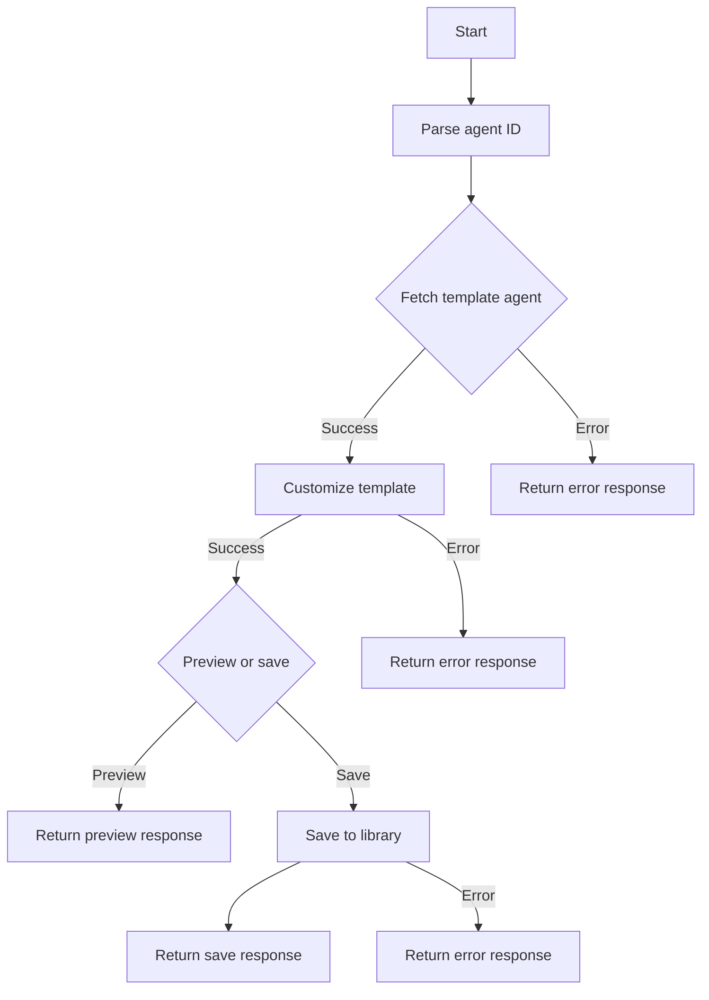
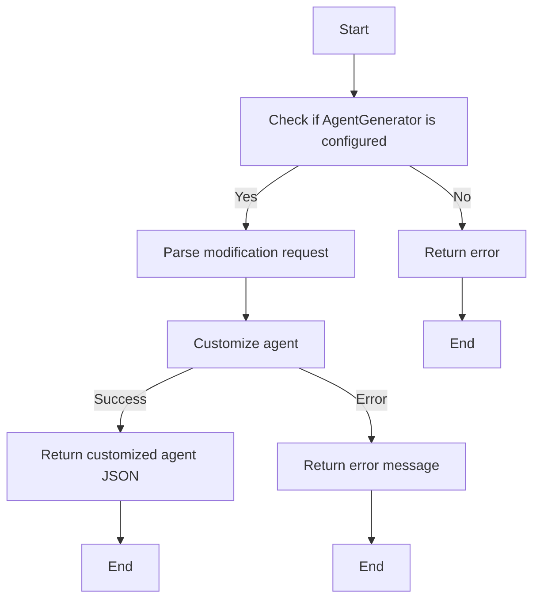
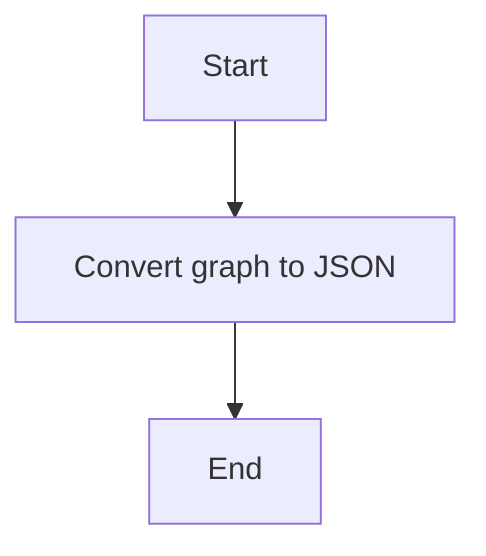
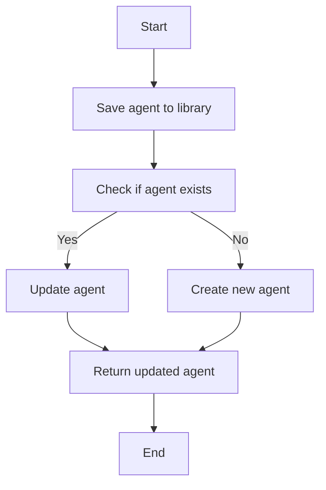
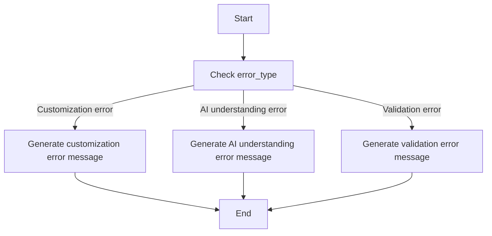
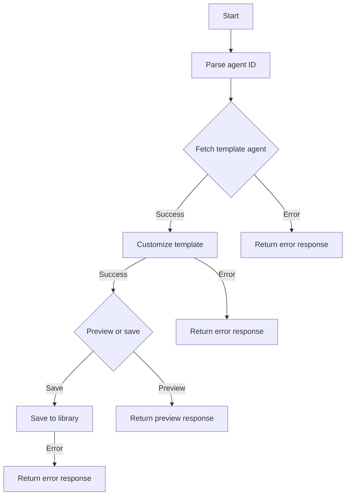
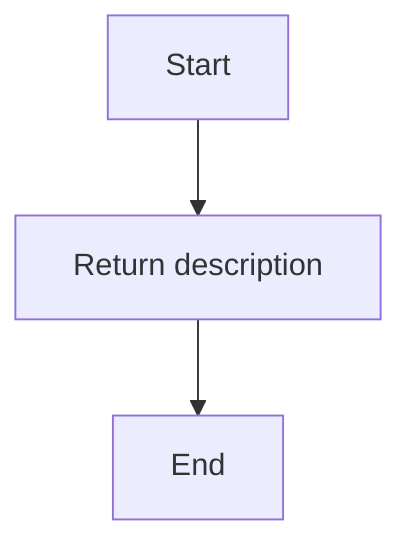
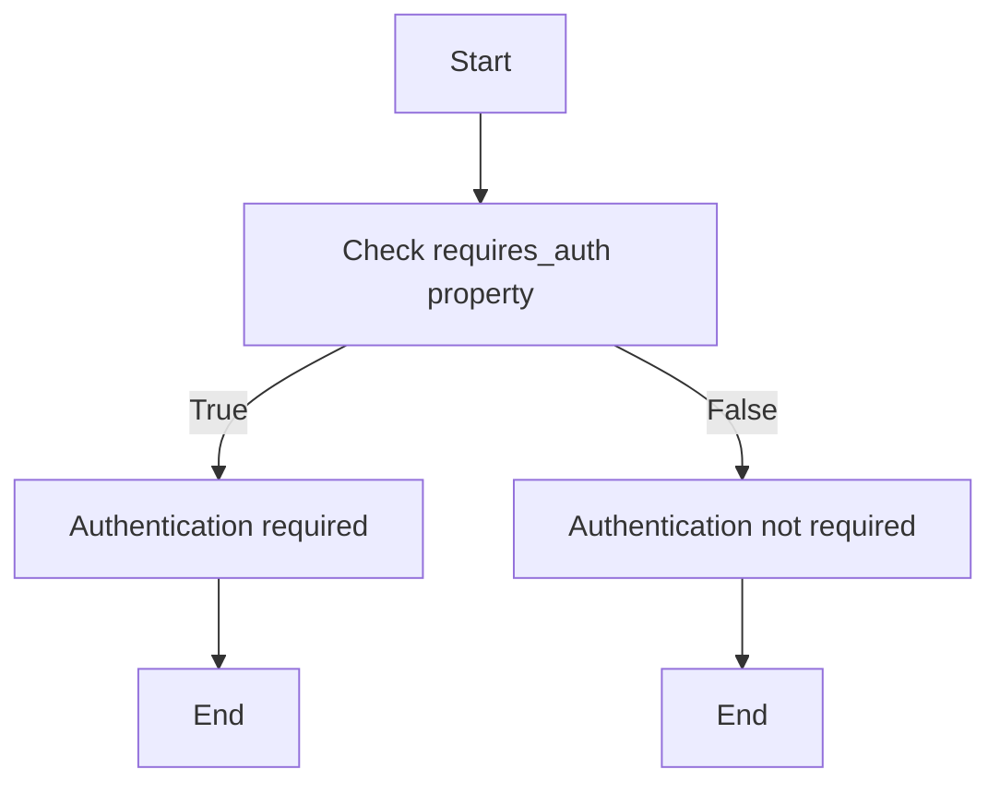
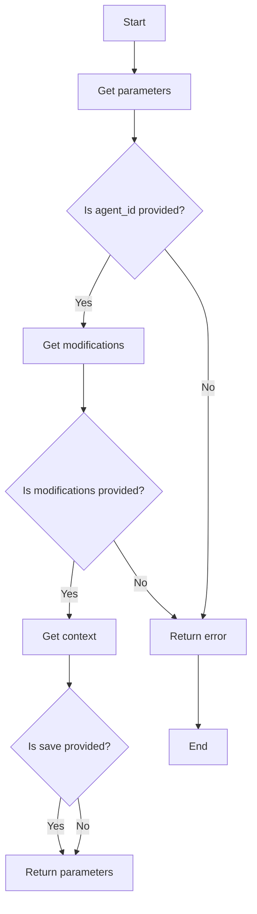
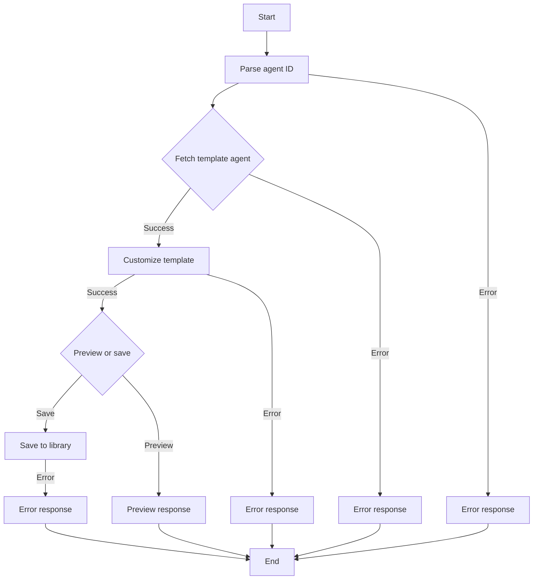

# `.\AutoGPT\autogpt_platform\backend\backend\api\features\chat\tools\customize_agent.py` 详细设计文档

The CustomizeAgentTool module customizes marketplace or template agents using natural language, allowing users to modify existing agents based on their requirements and save them to their library.

## 整体流程



## 类结构

```
CustomizeAgentTool (类)
├── BaseTool (基类)
│   ├── ... (其他基类方法)
└── ... (其他类)
```

## 全局变量及字段


### `logger`
    
Logger instance for logging messages.

类型：`logging.Logger`
    


### `CustomizeAgentTool.name`
    
Name of the CustomizeAgentTool class.

类型：`str`
    


### `CustomizeAgentTool.description`
    
Description of the CustomizeAgentTool class.

类型：`str`
    


### `CustomizeAgentTool.requires_auth`
    
Indicates if authentication is required for the tool.

类型：`bool`
    


### `CustomizeAgentTool.is_long_running`
    
Indicates if the tool is a long-running operation.

类型：`bool`
    


### `CustomizeAgentTool.parameters`
    
Parameters required for the tool.

类型：`dict[str, Any]`
    


### `BaseTool`
    
Base class for tools, with unspecified fields and methods.

类型：`class`
    


### `CustomizeAgentTool.name`
    
Name of the CustomizeAgentTool instance.

类型：`str`
    


### `CustomizeAgentTool.description`
    
Description of the CustomizeAgentTool instance.

类型：`str`
    


### `CustomizeAgentTool.requires_auth`
    
Indicates if authentication is required for the CustomizeAgentTool instance.

类型：`bool`
    


### `CustomizeAgentTool.is_long_running`
    
Indicates if the CustomizeAgentTool instance is a long-running operation.

类型：`bool`
    


### `CustomizeAgentTool.parameters`
    
Parameters required for the CustomizeAgentTool instance.

类型：`dict[str, Any]`
    


### `CustomizeAgentTool.agent_id`
    
Marketplace agent ID in format 'creator/slug'.

类型：`str`
    


### `CustomizeAgentTool.modifications`
    
Natural language description of how to customize the agent.

类型：`str`
    


### `CustomizeAgentTool.context`
    
Additional context or answers to previous clarifying questions.

类型：`str`
    


### `CustomizeAgentTool.save`
    
Whether to save the customized agent to the user's library.

类型：`bool`
    


### `CustomizeAgentTool.session_id`
    
Session ID for the current chat session.

类型：`str`
    


### `CustomizeAgentTool.creator_username`
    
Username of the creator of the agent.

类型：`str`
    


### `CustomizeAgentTool.agent_slug`
    
Slug of the agent.

类型：`str`
    


### `CustomizeAgentTool.agent_details`
    
Details of the fetched marketplace agent.

类型：`Any`
    


### `CustomizeAgentTool.graph`
    
Full agent graph fetched from the database.

类型：`Any`
    


### `CustomizeAgentTool.template_agent`
    
JSON representation of the template agent.

类型：`Any`
    


### `CustomizeAgentTool.result`
    
Result from the customize_template function.

类型：`Any`
    


### `CustomizeAgentTool.customized_agent`
    
Customized agent JSON.

类型：`Any`
    


### `CustomizeAgentTool.agent_name`
    
Name of the customized agent.

类型：`str`
    


### `CustomizeAgentTool.agent_description`
    
Description of the customized agent.

类型：`str`
    


### `CustomizeAgentTool.nodes`
    
Nodes of the customized agent.

类型：`list`
    


### `CustomizeAgentTool.links`
    
Links of the customized agent.

类型：`list`
    


### `CustomizeAgentTool.node_count`
    
Count of nodes in the customized agent.

类型：`int`
    


### `CustomizeAgentTool.link_count`
    
Count of links in the customized agent.

类型：`int`
    


### `CustomizeAgentTool.user_id`
    
User ID for the current user.

类型：`str`
    


### `CustomizeAgentTool.created_graph`
    
Graph object created after saving the customized agent.

类型：`Any`
    


### `CustomizeAgentTool.library_agent`
    
Library agent object after saving the customized agent.

类型：`Any`
    
    

## 全局函数及方法


### customize_template

Customizes a template agent using natural language.

参数：

- `template_agent`：`dict`，The JSON representation of the template agent.
- `modification_request`：`str`，Natural language description of how to customize the agent.
- `context`：`str`，Additional context or answers to previous clarifying questions.

返回值：`dict`，The customized agent JSON or an error message.

#### 流程图



#### 带注释源码

```python
# Call customize_template
try:
    result = await customize_template(
        template_agent=template_agent,
        modification_request=modifications,
        context=context,
    )
except AgentGeneratorNotConfiguredError:
    return ErrorResponse(
        message=(
            "Agent customization is not available. "
            "The Agent Generator service is not configured."
        ),
        error="service_not_configured",
        session_id=session_id,
    )
except Exception as e:
    logger.error(f"Error calling customize_template for {agent_id}: {e}")
    return ErrorResponse(
        message=(
            "Failed to customize the agent due to a service error. "
            "Please try again."
        ),
        error="customization_service_error",
        session_id=session_id,
    )

if result is None:
    return ErrorResponse(
        message=(
            "Failed to customize the agent. "
            "The agent generation service may be unavailable or timed out. "
            "Please try again."
        ),
        error="customization_failed",
        session_id=session_id,
    )

# Handle error response
if isinstance(result, dict) and result.get("type") == "error":
    error_msg = result.get("error", "Unknown error")
    error_type = result.get("error_type", "unknown")
    user_message = get_user_message_for_error(
        error_type,
        operation="customize the agent",
        llm_parse_message=(
            "The AI had trouble customizing the agent. "
            "Please try again or simplify your request."
        ),
        validation_message=(
            "The customized agent failed validation. "
            "Please try rephrasing your request."
        ),
        error_details=error_msg,
    )
    return ErrorResponse(
        message=user_message,
        error=f"customization_failed:{error_type}",
        session_id=session_id,
    )

# Handle clarifying questions
if isinstance(result, dict) and result.get("type") == "clarifying_questions":
    questions = result.get("questions") or []
    if not isinstance(questions, list):
        logger.error(
            f"Unexpected clarifying questions format: {type(questions)}"
        )
        questions = []
    return ClarificationNeededResponse(
        message=(
            "I need some more information to customize this agent. "
            "Please answer the following questions:"
        ),
        questions=[
            ClarifyingQuestion(
                question=q.get("question", ""),
                keyword=q.get("keyword", ""),
                example=q.get("example"),
            )
            for q in questions
            if isinstance(q, dict)
        ],
        session_id=session_id,
    )

# Result should be the customized agent JSON
if not isinstance(result, dict):
    logger.error(f"Unexpected customize_template response type: {type(result)}")
    return ErrorResponse(
        message="Failed to customize the agent due to an unexpected response.",
        error="unexpected_response_type",
        session_id=session_id,
    )

customized_agent = result
```


### `graph_to_json`

Converts an agent graph to a JSON representation.

参数：

- `graph`：`Any`，The agent graph to convert.

返回值：`dict`，The JSON representation of the agent graph.

#### 流程图



#### 带注释源码

```python
def graph_to_json(graph: Any) -> dict:
    # Convert the agent graph to a JSON representation
    # This function is assumed to be implemented elsewhere in the codebase
    # and is used here to convert the agent graph to a JSON format for further processing.
    return json.dumps(graph)
```


### `save_agent_to_library`

Saves the customized agent to the user's library.

参数：

- `customized_agent`：`dict`，The JSON representation of the customized agent.
- `user_id`：`str`，The ID of the user who is saving the agent.
- `is_update`：`bool`，Indicates whether the agent is being updated (True) or added for the first time (False).

返回值：`tuple`，A tuple containing the created graph and the library agent.

#### 流程图



#### 带注释源码

```python
# save_agent_to_library function
async def save_agent_to_library(customized_agent: dict, user_id: str, is_update: bool = False) -> tuple:
    try:
        if is_update:
            # Update the existing agent
            updated_agent = await store_db.update_agent(customized_agent, user_id)
        else:
            # Create a new agent
            created_graph, library_agent = await store_db.create_agent(customized_agent, user_id)
        return created_graph, library_agent
    except Exception as e:
        logger.error(f"Error saving customized agent: {e}")
        raise
```


### `get_user_message_for_error`

This function generates a user-friendly error message based on the error type encountered during the customization of an agent.

参数：

- `error_type`：`str`，The type of error encountered.
- `operation`：`str`，The operation being performed when the error occurred.
- `llm_parse_message`：`str`，A message to display if the error is related to the AI's understanding of the request.
- `validation_message`：`str`，A message to display if the error is related to the validation of the customized agent.
- `error_details`：`str`，Additional details about the error.

返回值：`str`，A user-friendly error message.

#### 流程图



#### 带注释源码

```python
def get_user_message_for_error(
    error_type: str,
    operation: str,
    llm_parse_message: str,
    validation_message: str,
    error_details: str,
) -> str:
    """
    Generate a user-friendly error message based on the error type encountered.

    :param error_type: The type of error encountered.
    :param operation: The operation being performed when the error occurred.
    :param llm_parse_message: A message to display if the error is related to the AI's understanding of the request.
    :param validation_message: A message to display if the error is related to the validation of the customized agent.
    :param error_details: Additional details about the error.
    :return: A user-friendly error message.
    """
    if error_type == "customization_failed":
        return f"Failed to {operation}. {llm_parse_message} {error_details}"
    elif error_type == "service_not_configured":
        return f"{operation} is not available. The Agent Generator service is not configured."
    elif error_type == "customization_service_error":
        return f"Failed to {operation} due to a service error. Please try again."
    elif error_type == "unexpected_response_type":
        return f"Failed to {operation} due to an unexpected response."
    elif error_type == "agent_not_found":
        return f"Could not find the marketplace agent. Please check the agent ID and try again."
    elif error_type == "invalid_agent_id_format":
        return f"Invalid agent ID format. Expected format is 'creator/agent-name' (e.g., 'autogpt/newsletter-writer')."
    elif error_type == "no_version_available":
        return f"The agent does not have an available version. Please try a different agent."
    elif error_type == "fetch_error":
        return "Failed to fetch the marketplace agent. Please try again."
    elif error_type == "graph_fetch_error":
        return "Failed to fetch the agent configuration. Please try again."
    elif error_type == "auth_required":
        return "You must be logged in to save agents."
    elif error_type == "save_failed":
        return "Failed to save the customized agent. Please try again."
    else:
        return f"An unexpected error occurred: {error_details}"
```


### `_execute`

执行 `customize_agent` 工具。

参数：

- `user_id`：`str | None`，用户ID，如果未提供，则为 `None`。
- `session`：`ChatSession`，聊天会话对象。
- `**kwargs`：`Any`，额外的关键字参数。

返回值：`ToolResponseBase`，工具响应对象。

#### 流程图



#### 带注释源码

```python
async def _execute(
    self,
    user_id: str | None,
    session: ChatSession,
    **kwargs,
) -> ToolResponseBase:
    """Execute the customize_agent tool.

    Flow:
    1. Parse the agent ID to get creator/slug
    2. Fetch the template agent from the marketplace
    3. Call customize_template with the modification request
    4. Preview or save based on the save parameter
    """
    # ... (省略中间代码以节省空间)
```


### CustomizeAgentTool.name

This function returns the name of the CustomizeAgentTool class.

参数：

- 无

返回值：`str`，返回工具的名称 "customize_agent"

#### 流程图

```mermaid
graph TD
    A[Start] --> B[Return "customize_agent"]
    B --> C[End]
```

#### 带注释源码

```python
class CustomizeAgentTool(BaseTool):
    # ... other methods and properties ...

    @property
    def name(self) -> str:
        return "customize_agent"
```


### CustomizeAgentTool.description

返回工具的描述。

参数：

- 无

返回值：`str`，工具的描述

#### 流程图



#### 带注释源码

```python
    @property
    def description(self) -> str:
        return (
            "Customize a marketplace or template agent using natural language. "
            "Takes an existing agent from the marketplace and modifies it based on "
            "the user's requirements before adding to their library."
        )
```


### CustomizeAgentTool.requires_auth

此方法用于检查是否需要认证。

参数：

- 无

返回值：`bool`，表示是否需要认证。

#### 流程图



#### 带注释源码

```python
    @property
    def requires_auth(self) -> bool:
        return True
```


### CustomizeAgentTool.is_long_running

返回一个布尔值，指示`CustomizeAgentTool`是否是一个长时间运行的工具。

参数：

- 无

返回值：

- `bool`，指示工具是否是长时间运行的。

#### 流程图

```mermaid
graph TD
    A[Start] --> B{is_long_running()}
    B -- True --> C[End]
    B -- False --> D[End]
```

#### 带注释源码

```python
    @property
    def is_long_running(self) -> bool:
        return True
```


### CustomizeAgentTool.parameters

This function returns the parameters required for the CustomizeAgentTool class.

参数：

- `agent_id`：`string`，The marketplace agent ID in format 'creator/slug' (e.g., 'autogpt/newsletter-writer'). Get this from find_agent results.
- `modifications`：`string`，Natural language description of how to customize the agent. Be specific about what changes you want to make.
- `context`：`string`，Additional context or answers to previous clarifying questions.
- `save`：`boolean`，Whether to save the customized agent to the user's library. Default is true. Set to false for preview only.

返回值：`dict[str, Any]`，A dictionary containing the parameters and their descriptions.

#### 流程图



#### 带注释源码

```python
    @property
    def parameters(self) -> dict[str, Any]:
        return {
            "type": "object",
            "properties": {
                "agent_id": {
                    "type": "string",
                    "description": (
                        "The marketplace agent ID in format 'creator/slug' "
                        "(e.g., 'autogpt/newsletter-writer'). "
                        "Get this from find_agent results."
                    ),
                },
                "modifications": {
                    "type": "string",
                    "description": (
                        "Natural language description of how to customize the agent. "
                        "Be specific about what changes you want to make."
                    ),
                },
                "context": {
                    "type": "string",
                    "description": (
                        "Additional context or answers to previous clarifying questions."
                    ),
                },
                "save": {
                    "type": "boolean",
                    "description": (
                        "Whether to save the customized agent to the user's library. "
                        "Default is true. Set to false for preview only."
                    ),
                    "default": True,
                },
            },
            "required": ["agent_id", "modifications"],
        }
``` 


### `_execute`

执行 `customize_agent` 工具。

参数：

- `user_id`：`str | None`，用户ID，如果未提供，则为 None。
- `session`：`ChatSession`，聊天会话对象。
- `**kwargs`：`Any`，额外的关键字参数。

返回值：`ToolResponseBase`，工具响应对象。

#### 流程图



#### 带注释源码

```python
async def _execute(
    self,
    user_id: str | None,
    session: ChatSession,
    **kwargs,
) -> ToolResponseBase:
    """Execute the customize_agent tool.

    Flow:
    1. Parse the agent ID to get creator/slug
    2. Fetch the template agent from the marketplace
    3. Call customize_template with the modification request
    4. Preview or save based on the save parameter
    """
    # ... (代码省略，流程图中的步骤对应代码块)
```


## 关键组件


### 张量索引与惰性加载

张量索引与惰性加载是用于高效处理大规模数据集的关键技术，它允许在需要时才加载数据，从而减少内存消耗和提高性能。

### 反量化支持

反量化支持是针对量化模型的一种技术，它允许模型在量化过程中保持较高的精度，从而在降低模型大小和计算量的同时，保持模型性能。

### 量化策略

量化策略是用于模型压缩和加速的一种方法，它通过减少模型中权重和激活值的精度来降低模型的复杂度，从而提高模型的运行速度和降低功耗。


## 问题及建议


### 已知问题

-   **错误处理**: 代码中使用了多个 `except Exception as e` 来捕获异常，但没有对不同的异常进行区分处理。这可能导致一些特定的错误信息被通用的错误信息覆盖，使得调试和用户理解问题变得困难。
-   **日志记录**: 代码中使用了 `logger.error` 来记录错误信息，但没有记录一些关键步骤的信息，如成功获取数据或处理请求。这可能导致在问题发生时难以追踪问题的根源。
-   **代码重复**: 在处理错误响应时，存在代码重复。例如，多个地方都使用了 `ErrorResponse` 类来创建错误响应，这可以通过创建一个通用的错误处理函数来避免。
-   **异常处理**: 在 `customize_template` 函数调用中，如果出现 `AgentGeneratorNotConfiguredError`，则直接返回错误响应。这可能忽略了其他潜在的错误，导致错误信息不完整。

### 优化建议

-   **细化异常处理**: 对不同类型的异常进行区分处理，提供更具体的错误信息，以便于调试和用户理解。
-   **增强日志记录**: 在关键步骤添加日志记录，记录成功和失败的信息，以便于问题追踪和系统监控。
-   **减少代码重复**: 创建通用的错误处理函数，减少代码重复，提高代码可维护性。
-   **优化错误响应**: 在处理 `customize_template` 函数的返回值时，检查所有可能的异常情况，并返回相应的错误信息。
-   **代码审查**: 定期进行代码审查，以发现潜在的问题和改进空间。
-   **性能优化**: 检查数据库查询和API调用，确保它们是高效的，特别是在处理大量数据时。
-   **安全性检查**: 确保代码中没有安全漏洞，如SQL注入或跨站脚本攻击。


## 其它


### 设计目标与约束

- 设计目标：
  - 提供一个用户友好的界面，允许用户使用自然语言定制市场或模板代理。
  - 确保定制过程高效且易于理解。
  - 保证定制后的代理能够被保存到用户的库中，以便后续使用。

- 约束：
  - 代理定制服务必须与现有的市场数据库兼容。
  - 用户必须通过身份验证才能使用此工具。
  - 代理定制过程可能需要较长时间，因此工具应支持长时间运行任务。

### 错误处理与异常设计

- 错误处理：
  - 对于无效的输入，如无效的代理ID格式或缺失的参数，应返回适当的错误消息。
  - 在数据库操作或服务调用失败时，应记录错误并返回错误消息。
  - 对于服务不可用或超时的情况，应提供重试建议。

- 异常设计：
  - 使用自定义异常类来处理特定错误情况，如`AgentNotFoundError`和`AgentGeneratorNotConfiguredError`。
  - 异常处理逻辑应确保用户得到清晰的错误信息。

### 数据流与状态机

- 数据流：
  - 用户输入代理ID和定制描述。
  - 系统解析输入并从市场数据库中检索代理信息。
  - 系统调用定制模板服务以生成定制后的代理。
  - 根据用户选择，系统将定制后的代理保存到用户库中或返回预览。

- 状态机：
  - 状态包括：初始化、解析输入、检索代理、定制代理、保存代理、错误处理。
  - 状态转换基于用户输入和系统操作的结果。

### 外部依赖与接口契约

- 外部依赖：
  - 市场数据库API用于检索代理信息。
  - 定制模板服务API用于生成定制后的代理。
  - 用户库API用于保存定制后的代理。

- 接口契约：
  - 定义了API的输入和输出格式，包括请求和响应的数据结构。
  - 确保所有外部依赖都遵循相同的契约，以保持系统的稳定性。


    