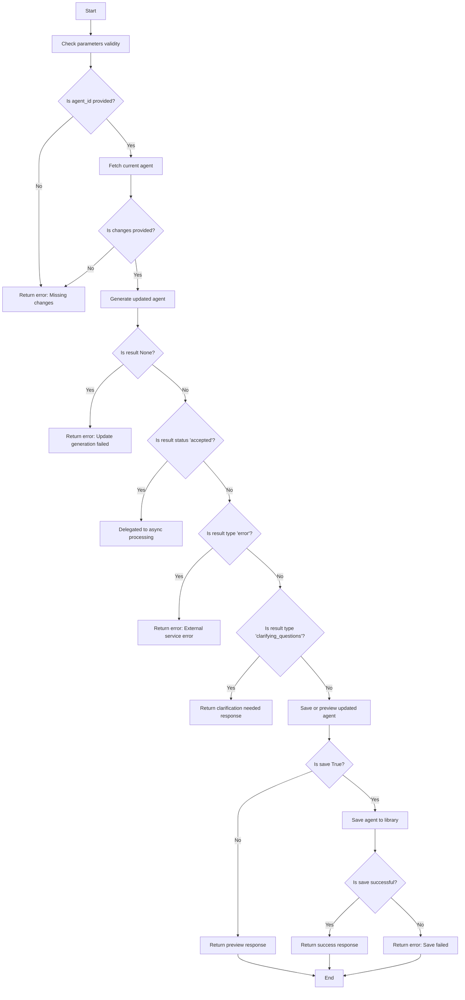
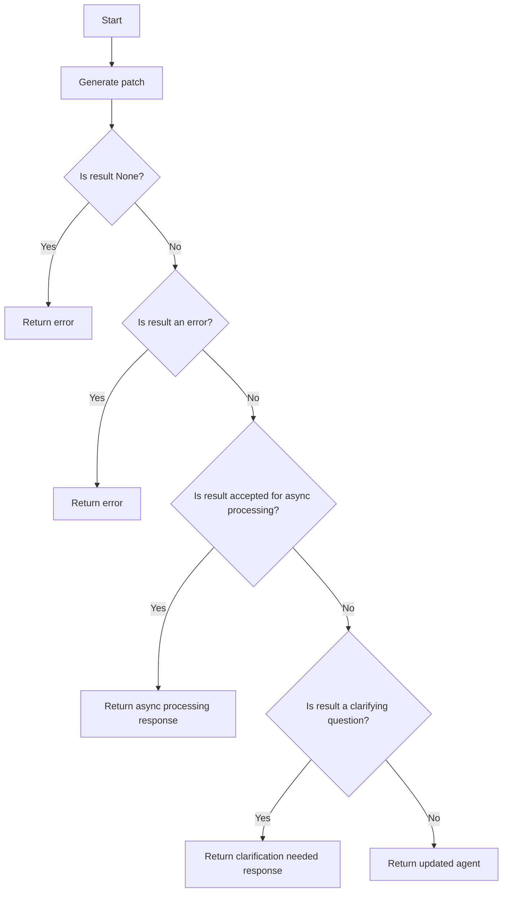
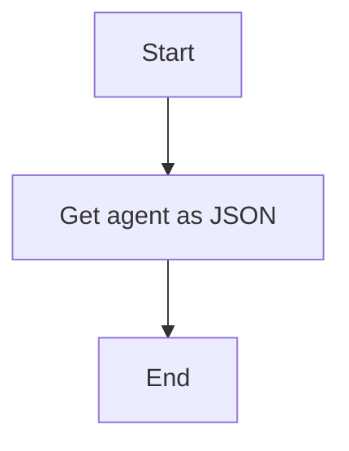
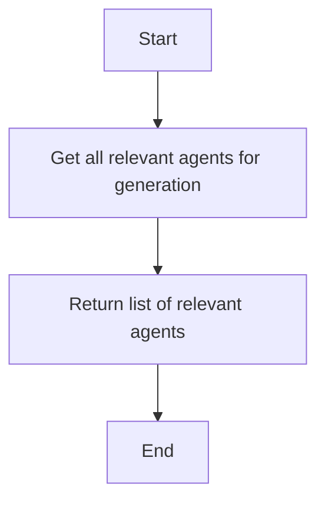
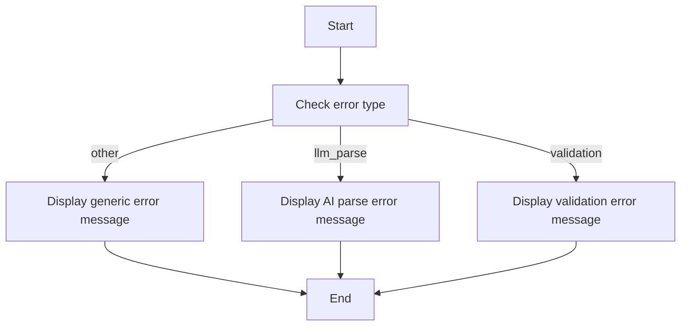
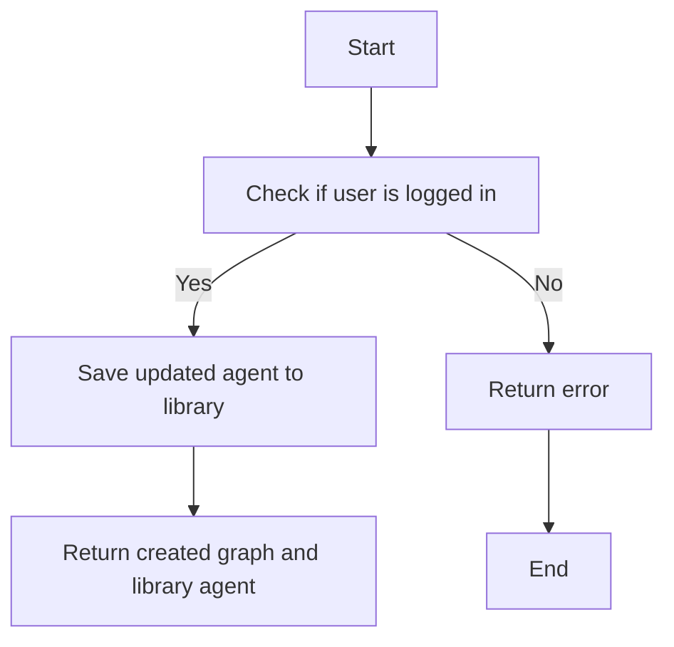
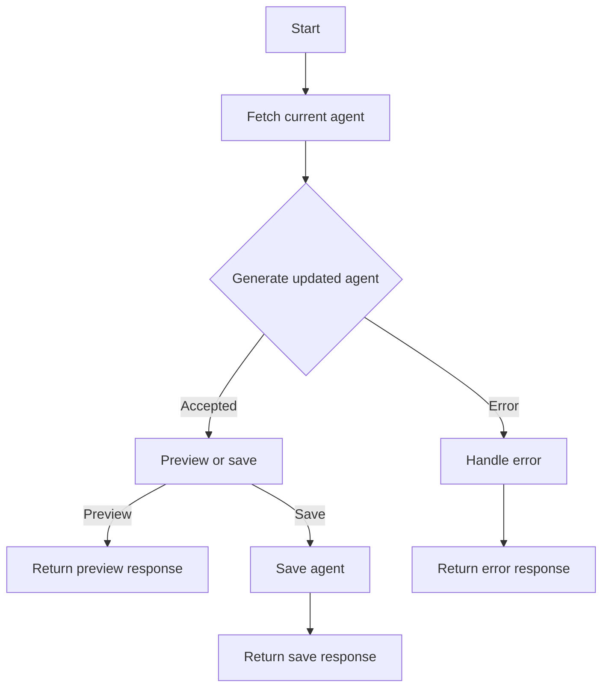

# `.\AutoGPT\autogpt_platform\backend\backend\api\features\chat\tools\edit_agent.py` 详细设计文档

The code provides a tool for editing existing agents using natural language, generating updates while preserving unchanged parts, and saving or previewing the changes.

## 整体流程



## 类结构

```
EditAgentTool (Concrete Tool)
├── BaseTool (Base class)
│   ├── ... (Other methods and properties)
│   └── _execute (Async method for executing the tool)
```

## 全局变量及字段


### `logger`
    
Logger instance for logging messages within the EditAgentTool class.

类型：`logging.Logger`
    


### `EditAgentTool.name`
    
The name of the tool, which is 'edit_agent'.

类型：`str`
    


### `EditAgentTool.description`
    
The description of the tool, which explains its functionality.

类型：`str`
    


### `EditAgentTool.requires_auth`
    
Indicates whether the tool requires authentication.

类型：`bool`
    


### `EditAgentTool.is_long_running`
    
Indicates whether the tool's operation is long-running.

类型：`bool`
    


### `EditAgentTool.parameters`
    
The parameters required by the tool, including their types and descriptions.

类型：`dict[str, Any]`
    
    

## 全局函数及方法


### `generate_agent_patch`

Generates a patch for an existing agent based on the provided changes and context.

参数：

- `update_request`：`str`，A natural language description of what changes to make.
- `current_agent`：`dict`，The current state of the agent in JSON format.
- `library_agents`：`list`，Optional list of relevant agents from the user's library for sub-agent composition.
- `operation_id`：`str`，Optional operation ID for tracking asynchronous processing.
- `task_id`：`str`，Optional task ID for tracking asynchronous processing.

返回值：`Any`，The result of the agent patch generation process, which can be a dictionary with the updated agent, a list of clarifying questions, or an error message.

#### 流程图



#### 带注释源码

```python
try:
    result = await generate_agent_patch(
        update_request,
        current_agent,
        library_agents,
        operation_id=operation_id,
        task_id=task_id,
    )
except AgentGeneratorNotConfiguredError:
    return ErrorResponse(
        message=(
            "Agent editing is not available. "
            "The Agent Generator service is not configured."
        ),
        error="service_not_configured",
        session_id=session_id,
    )
```


### `get_agent_as_json`

获取指定ID的代理的JSON表示。

参数：

- `agent_id`：`str`，代理的ID，可以是图形ID或库代理ID。
- `user_id`：`str`，可选，用户ID。

返回值：`Any`，代理的JSON表示。

#### 流程图



#### 带注释源码

```python
async def get_agent_as_json(agent_id: str, user_id: str | None = None) -> Any:
    # ... (省略中间代码)
    current_agent = await get_agent_as_json(agent_id, user_id)
    # ... (省略中间代码)
```


### `get_all_relevant_agents_for_generation`

This function retrieves all relevant agents for generation based on a search query and user ID, excluding a specific graph ID and including agents from the marketplace.

参数：

- `user_id`：`str`，The ID of the user for whom to search for relevant agents.
- `search_query`：`str`，The search query to use for finding relevant agents.
- `exclude_graph_id`：`str`，The ID of the graph to exclude from the search results.
- `include_marketplace`：`bool`，Whether to include agents from the marketplace in the search results.

返回值：`list`，A list of relevant agents.

#### 流程图



#### 带注释源码

```python
def get_all_relevant_agents_for_generation(
    user_id: str,
    search_query: str,
    exclude_graph_id: str,
    include_marketplace: bool,
) -> list:
    # Implementation of the function to retrieve relevant agents
    pass
```


### `get_user_message_for_error`

This function generates a user-friendly message for an error encountered during the generation of changes to an agent.

参数：

- `error_type`：`str`，The type of error encountered.
- `operation`：`str`，The operation that was being performed when the error occurred.
- `llm_parse_message`：`str`，A message to display if the error is related to the AI's difficulty in parsing the request.
- `validation_message`：`str`，A message to display if the error is related to the validation of the generated changes.
- `error_details`：`str`，Additional details about the error.

返回值：`str`，A user-friendly message for the error.

#### 流程图



#### 带注释源码

```python
def get_user_message_for_error(
    error_type: str,
    operation: str,
    llm_parse_message: str,
    validation_message: str,
    error_details: str,
) -> str:
    """
    Generate a user-friendly message for an error encountered during the generation of changes to an agent.

    :param error_type: The type of error encountered.
    :param operation: The operation that was being performed when the error occurred.
    :param llm_parse_message: A message to display if the error is related to the AI's difficulty in parsing the request.
    :param validation_message: A message to display if the error is related to the validation of the generated changes.
    :param error_details: Additional details about the error.
    :return: A user-friendly message for the error.
    """
    if error_type == "llm_parse":
        return llm_parse_message
    elif error_type == "validation":
        return validation_message
    else:
        return f"An error occurred while {operation}: {error_details}"
```


### `save_agent_to_library`

Saves the updated agent to the user's library.

参数：

- `updated_agent`：`dict`，The updated agent data to be saved.
- `user_id`：`str`，The ID of the user who is saving the agent.
- `is_update`：`bool`，Indicates whether the operation is an update to an existing agent.

返回值：`tuple`，A tuple containing the created graph and the library agent.

返回值描述：The created graph and the library agent that was saved.

#### 流程图



#### 带注释源码

```python
try:
    created_graph, library_agent = await save_agent_to_library(
        updated_agent, user_id, is_update=True
    )
    return AgentSavedResponse(
        message=f"Updated agent '{created_graph.name}' has been saved to your library!",
        agent_id=created_graph.id,
        agent_name=created_graph.name,
        library_agent_id=library_agent.id,
        library_agent_link=f"/library/agents/{library_agent.id}",
        agent_page_link=f"/build?flowID={created_graph.id}",
        session_id=session_id,
    )
except Exception as e:
    return ErrorResponse(
        message=f"Failed to save the updated agent: {str(e)}",
        error="save_failed",
        details={"exception": str(e)},
        session_id=session_id,
    )
```


### EditAgentTool._execute

Execute the edit_agent tool.

参数：

- `user_id`：`str | None`，The ID of the user making the request.
- `session`：`ChatSession`，The current chat session.
- `agent_id`：`str`，The ID of the agent to edit. Can be a graph ID or library agent ID.
- `changes`：`str`，Natural language description of what changes to make. Be specific about what to add, remove, or modify.
- `context`：`str`，Additional context or answers to previous clarifying questions.
- `save`：`bool`，Whether to save the changes. Default is true. Set to false for preview only.

返回值：`ToolResponseBase`，The response object containing the result of the tool execution.

#### 流程图



#### 带注释源码

```python
async def _execute(
    self,
    user_id: str | None,
    session: ChatSession,
    **kwargs,
) -> ToolResponseBase:
    """Execute the edit_agent tool.

    Flow:
    1. Fetch the current agent
    2. Generate updated agent (external service handles fixing and validation)
    3. Preview or save based on the save parameter
    """
    # ... (rest of the method implementation)
```


### EditAgentTool._execute

Execute the edit_agent tool.

参数：

- `user_id`：`str | None`，The ID of the user making the request.
- `session`：`ChatSession`，The current chat session.
- `agent_id`：`str`，The ID of the agent to edit. Can be a graph ID or library agent ID.
- `changes`：`str`，Natural language description of what changes to make. Be specific about what to add, remove, or modify.
- `context`：`str`，Additional context or answers to previous clarifying questions.
- `save`：`bool`，Whether to save the changes. Default is true. Set to false for preview only.

返回值：`ToolResponseBase`，The response object containing the result of the tool execution.

#### 流程图


#### 带注释源码

```python
async def _execute(
    self,
    user_id: str | None,
    session: ChatSession,
    **kwargs,
) -> ToolResponseBase:
    """Execute the edit_agent tool.

    Flow:
    1. Fetch the current agent
    2. Generate updated agent (external service handles fixing and validation)
    3. Preview or save based on the save parameter
    """
    # ... (rest of the code)
```


## 关键组件


### 张量索引与惰性加载

用于高效地索引和访问大型数据集，同时延迟加载数据以减少内存消耗。

### 反量化支持

提供对量化策略的反量化支持，允许在量化过程中进行逆操作。

### 量化策略

定义了量化过程中的具体策略，包括量化精度、量化方法等。


## 问题及建议


### 已知问题

-   **参数验证不足**：代码中缺少对输入参数的详细验证，例如`agent_id`和`changes`参数的格式和内容验证。
-   **错误处理不够全面**：虽然代码中包含了一些错误处理，但对于外部服务调用失败或数据格式错误等情况的处理不够全面。
-   **异步处理机制不明确**：代码中提到了异步处理，但没有详细说明异步处理的具体机制和状态管理。
-   **日志记录不够详细**：日志记录主要集中在错误和调试信息，缺少对关键步骤和状态的记录。

### 优化建议

-   **增强参数验证**：在执行任何操作之前，对输入参数进行详细的验证，确保它们符合预期的格式和内容。
-   **改进错误处理**：增加对各种潜在错误的处理，包括外部服务调用失败、数据格式错误、权限问题等，并返回清晰的错误信息。
-   **明确异步处理机制**：详细说明异步处理的具体机制，包括状态管理、通知机制和错误处理。
-   **完善日志记录**：增加对关键步骤和状态的日志记录，以便于问题追踪和性能分析。
-   **代码重构**：考虑将一些重复的代码片段或逻辑抽象成函数或类，以提高代码的可读性和可维护性。
-   **单元测试**：编写单元测试来验证代码的功能和错误处理，确保代码的稳定性和可靠性。
-   **性能优化**：分析代码的性能瓶颈，并进行相应的优化，以提高代码的执行效率。


## 其它


### 设计目标与约束

- 设计目标：
  - 提供一个用户友好的界面，允许用户使用自然语言编辑现有智能体。
  - 确保编辑过程高效且易于理解。
  - 保证智能体的编辑不会破坏其核心功能。
  - 提供异步处理选项，以便用户可以在后台进行编辑。

- 约束：
  - 必须与现有的后端API兼容。
  - 必须处理可能的异常和错误，如服务不可用或输入错误。
  - 必须遵守数据保护法规，确保用户数据的安全。

### 错误处理与异常设计

- 错误处理：
  - 对于所有可能的错误情况，提供清晰的错误消息。
  - 使用统一的错误响应格式，以便前端可以一致地处理错误。
  - 记录所有错误和异常，以便进行调试和监控。

- 异常设计：
  - 使用try-except块来捕获和处理可能发生的异常。
  - 定义自定义异常类，以便更精确地描述错误情况。

### 数据流与状态机

- 数据流：
  - 用户输入编辑请求。
  - 系统获取当前智能体。
  - 系统生成更新后的智能体。
  - 用户可以选择预览或保存更改。
  - 如果保存，系统将更新后的智能体保存到库中。

- 状态机：
  - 初始状态：等待用户输入。
  - 编辑状态：处理编辑请求。
  - 预览状态：显示更新后的智能体。
  - 保存状态：保存更新后的智能体。
  - 异常状态：处理错误和异常。

### 外部依赖与接口契约

- 外部依赖：
  - 后端API：用于获取和保存智能体。
  - 外部服务：用于生成更新后的智能体。

- 接口契约：
  - 定义清晰的API接口规范。
  - 确保所有外部依赖都遵循相同的接口规范。
  - 提供文档，说明如何使用外部依赖和接口。


    