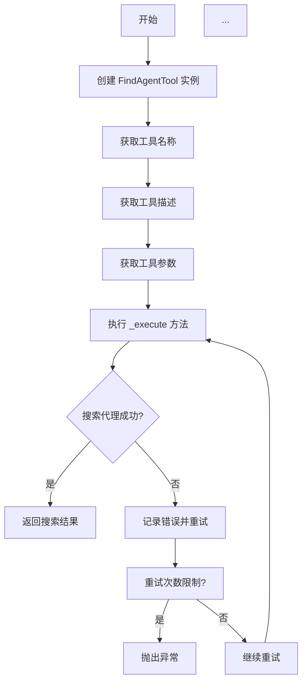
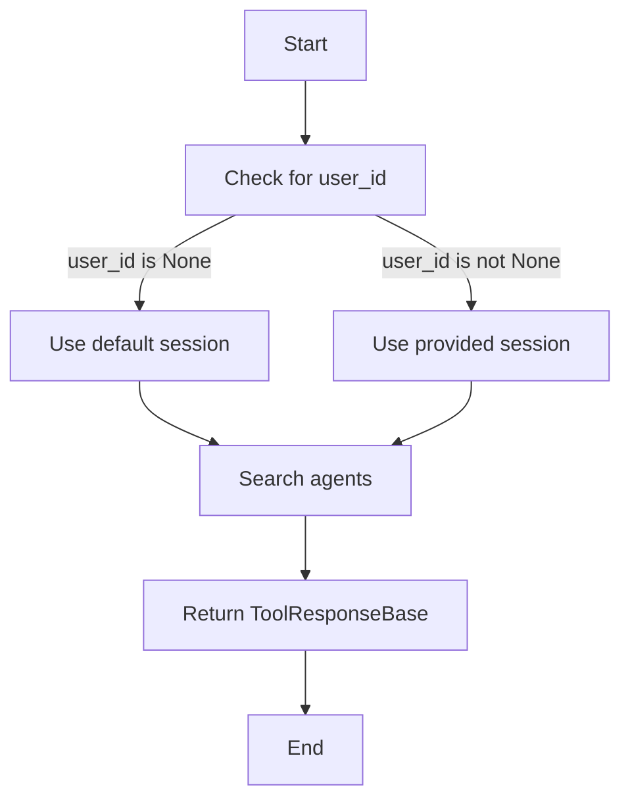

# `.\AutoGPT\autogpt_platform\backend\backend\api\features\chat\tools\find_agent.py` 详细设计文档

The code defines a tool for discovering agents from a marketplace based on user queries.

## 整体流程



## 类结构

```
BaseTool (基类)
├── FindAgentTool (工具类)
```

## 全局变量及字段


### `FindAgentTool.name`
    
The name of the tool, which is 'find_agent'.

类型：`str`
    


### `FindAgentTool.description`
    
A description of the tool's functionality, which is 'Discover agents from the marketplace based on capabilities and user needs.'

类型：`str`
    


### `FindAgentTool.parameters`
    
A dictionary defining the parameters required by the tool, including a 'query' string for the search.

类型：`dict[str, Any]`
    


### `FindAgentTool.user_id`
    
The user ID, which can be None.

类型：`str | None`
    


### `FindAgentTool.session`
    
The chat session object.

类型：`ChatSession`
    


### `FindAgentTool.query`
    
The search query describing what the user wants to accomplish.

类型：`str`
    


### `FindAgentTool.source`
    
The source of the search, which is 'marketplace'.

类型：`str`
    


### `FindAgentTool.session_id`
    
The session ID of the chat session.

类型：`str`
    


### `FindAgentTool.ToolResponseBase`
    
The base class for tool responses.

类型：`ToolResponseBase`
    
    

## 全局函数及方法


### `_execute`

This method is responsible for executing the search for agents from the marketplace based on the provided query and user information.

参数：

- `user_id`：`str | None`，The unique identifier for the user initiating the search. It can be `None` if not provided.
- `session`：`ChatSession`，The current chat session object containing session details.
- `**kwargs`：`Any`，Additional keyword arguments that may be passed to the search function.

返回值：`ToolResponseBase`，A response object containing the results of the agent search.

#### 流程图



#### 带注释源码

```python
async def _execute(
    self, user_id: str | None, session: ChatSession, **kwargs
) -> ToolResponseBase:
    # Determine the session to use based on the user_id
    if user_id is None:
        # Use the default session if user_id is not provided
        session_id = session.session_id
    else:
        # Use the provided session if user_id is provided
        session_id = session.session_id

    # Execute the search for agents using the provided query and session details
    return await search_agents(
        query=kwargs.get("query", "").strip(),
        source="marketplace",
        session_id=session_id,
        user_id=user_id,
    )
```


## 关键组件


### 张量索引与惰性加载

用于高效地索引和访问大型数据集，同时延迟加载数据以减少内存消耗。

### 反量化支持

提供对反量化操作的支持，允许在量化过程中进行逆量化处理。

### 量化策略

定义了量化策略，用于在模型训练和推理过程中对模型参数进行量化。


## 问题及建议


### 已知问题

-   {问题1}：代码中使用了 `**kwargs` 来接收额外的参数，但没有对 `kwargs` 进行验证，这可能导致未预期的参数被传递到 `_execute` 方法中。
-   {问题2}：`search_agents` 函数的调用中使用了 `kwargs.get("query", "").strip()`，这可能会覆盖掉 `query` 参数的默认值，如果 `query` 参数在 `kwargs` 中不存在的话。
-   {问题3}：`search_agents` 函数的调用没有提供足够的错误处理机制，如果搜索失败或出现异常，可能会影响到整个工具的稳定性。

### 优化建议

-   {建议1}：在 `_execute` 方法中添加对 `kwargs` 的验证，确保只接收预期的参数。
-   {建议2}：在调用 `search_agents` 函数之前，检查 `query` 参数是否存在于 `kwargs` 中，如果不存在，则使用默认值。
-   {建议3}：在调用 `search_agents` 函数时添加异常处理，确保在出现错误时能够给出清晰的错误信息，并采取适当的错误恢复措施。
-   {建议4}：考虑将 `search_agents` 函数的调用封装在一个单独的类或模块中，以便更好地管理和维护。
-   {建议5}：对于 `ChatSession` 类的使用，确保其线程安全，特别是在异步环境中。
-   {建议6}：对于 `ToolResponseBase` 类，考虑实现一个统一的错误响应机制，以便在出现错误时能够返回一致的错误信息格式。


## 其它


### 设计目标与约束

- 设计目标：实现一个高效、可扩展的代理发现工具，能够根据用户需求从市场中发现合适的代理。
- 约束条件：工具必须能够处理大量的查询请求，同时保持响应时间在可接受范围内。

### 错误处理与异常设计

- 错误处理：当查询参数无效或搜索过程中出现错误时，工具应返回适当的错误信息。
- 异常设计：使用try-except块捕获可能发生的异常，并记录错误信息。

### 数据流与状态机

- 数据流：用户输入查询 -> 工具处理查询 -> 搜索代理 -> 返回结果。
- 状态机：工具在执行过程中可能处于以下状态：空闲、处理查询、搜索代理、返回结果。

### 外部依赖与接口契约

- 外部依赖：工具依赖于`search_agents`函数和`ChatSession`类。
- 接口契约：`search_agents`函数接收查询参数、数据源、会话ID和用户ID，并返回搜索结果。

    