# `.\AutoGPT\autogpt_platform\backend\backend\api\features\chat\tools\find_block.py` 详细设计文档

The code defines a tool for searching and retrieving information about available blocks in a system, which are reusable components that perform specific tasks. It provides functionality to search for blocks by name or description, retrieve detailed information about them, and handle errors and exceptions during the search process.

## 整体流程

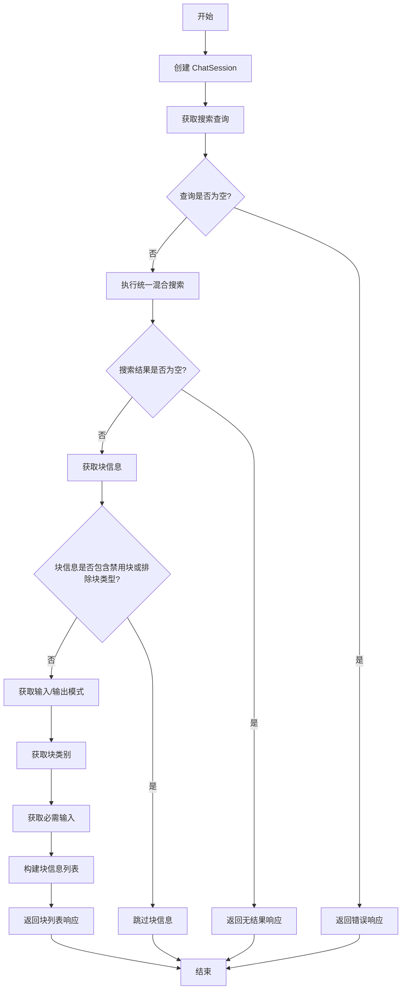

## 类结构

```
BaseTool (基类)
├── FindBlockTool (搜索块工具类)
```

## 全局变量及字段


### `_TARGET_RESULTS`
    
The number of target results to return from the search.

类型：`int`
    


### `_OVERFETCH_PAGE_SIZE`
    
The over-fetch page size to compensate for post-hoc filtering of graph-only blocks.

类型：`int`
    


### `COPILOT_EXCLUDED_BLOCK_TYPES`
    
Set of block types that are excluded from CoPilot.

类型：`set`
    


### `COPILOT_EXCLUDED_BLOCK_IDS`
    
Set of specific block IDs excluded from CoPilot.

类型：`set`
    


### `logger`
    
Logger instance for logging messages.

类型：`logging.Logger`
    


### `BaseTool.name`
    
The name of the tool.

类型：`str`
    


### `BaseTool.description`
    
The description of the tool.

类型：`str`
    


### `BaseTool.parameters`
    
The parameters required by the tool.

类型：`dict[str, Any]`
    


### `BaseTool.requires_auth`
    
Whether the tool requires authentication.

类型：`bool`
    


### `FindBlockTool.name`
    
The name of the tool.

类型：`str`
    


### `FindBlockTool.description`
    
The description of the tool.

类型：`str`
    


### `FindBlockTool.parameters`
    
The parameters required by the tool.

类型：`dict[str, Any]`
    


### `FindBlockTool.requires_auth`
    
Whether the tool requires authentication.

类型：`bool`
    


### `FindBlockTool.user_id`
    
The user ID for the current session.

类型：`str | None`
    


### `FindBlockTool.session`
    
The chat session object.

类型：`ChatSession`
    


### `FindBlockTool.query`
    
The search query for blocks.

类型：`str`
    


### `FindBlockTool.results`
    
The search results from the hybrid search.

类型：`list[dict]`
    


### `FindBlockTool.total`
    
The total number of search results.

类型：`int`
    


### `FindBlockTool.blocks`
    
The list of blocks found that match the query.

类型：`list[BlockInfoSummary]`
    


### `FindBlockTool.input_schema`
    
The input schema of the block.

类型：`dict`
    


### `FindBlockTool.output_schema`
    
The output schema of the block.

类型：`dict`
    


### `FindBlockTool.required_inputs`
    
The required inputs for the block.

类型：`list[BlockInputFieldInfo]`
    
    

## 全局函数及方法


### unified_hybrid_search

This function performs a hybrid search to find content that matches the given query.

参数：

- `query`：`str`，The search query to find content.
- `content_types`：`list[ContentType]`，The content types to search for.
- `page`：`int`，The page number of the search results.
- `page_size`：`int`，The number of results per page.

返回值：`tuple[list[Any], int]`，A tuple containing the search results and the total number of results.

#### 流程图

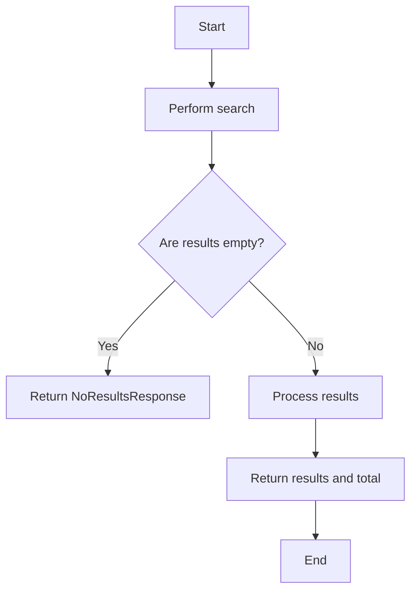

#### 带注释源码

```python
async def unified_hybrid_search(
    query: str,
    content_types: list[ContentType],
    page: int = 1,
    page_size: int = _OVERFETCH_PAGE_SIZE,
) -> tuple[list[Any], int]:
    # Perform search using the hybrid search API
    results, total = await hybrid_search(
        query=query,
        content_types=content_types,
        page=page,
        page_size=page_size,
    )
    return results, total
```


### get_block

获取指定ID的块信息。

参数：

- `block_id`：`str`，块的唯一标识符。

返回值：`BlockInfoSummary`，包含块的详细信息。

#### 流程图

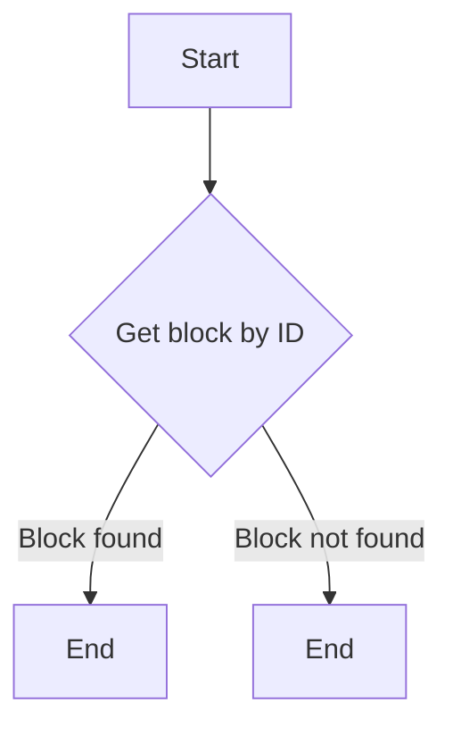

#### 带注释源码

```python
def get_block(block_id: str) -> BlockInfoSummary:
    # Get block information from the database or other data source
    block = database.get_block_by_id(block_id)

    # Return block information as a BlockInfoSummary object
    return BlockInfoSummary(
        id=block.id,
        name=block.name,
        description=block.description,
        categories=block.categories,
        input_schema=block.input_schema,
        output_schema=block.output_schema,
        required_inputs=block.required_inputs,
    )
```


### BlockInputFieldInfo

BlockInputFieldInfo is a class used to represent the input fields of a block.

参数：

- `name`：`str`，The name of the input field.
- `type`：`str`，The type of the input field.
- `description`：`str`，A description of the input field.
- `required`：`bool`，Whether the input field is required.
- `default`：`Any`，The default value of the input field if provided.

返回值：`BlockInputFieldInfo`，An instance of BlockInputFieldInfo representing the input field.

#### 流程图

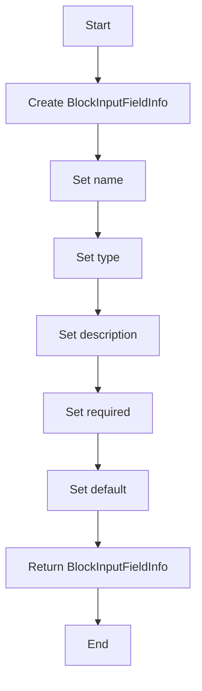

#### 带注释源码

```python
class BlockInputFieldInfo:
    def __init__(self, name: str, type: str, description: str, required: bool, default: Any = None):
        self.name = name
        self.type = type
        self.description = description
        self.required = required
        self.default = default
```


### `FindBlockTool._execute`

This method searches for blocks matching the provided query and returns a list of matching blocks with their details.

参数：

- `user_id`: `str | None`，User ID (required)
- `session`: `ChatSession`，Chat session
- `query`: `str`，Search query

返回值：`ToolResponseBase`，List of matching blocks or error response

#### 流程图

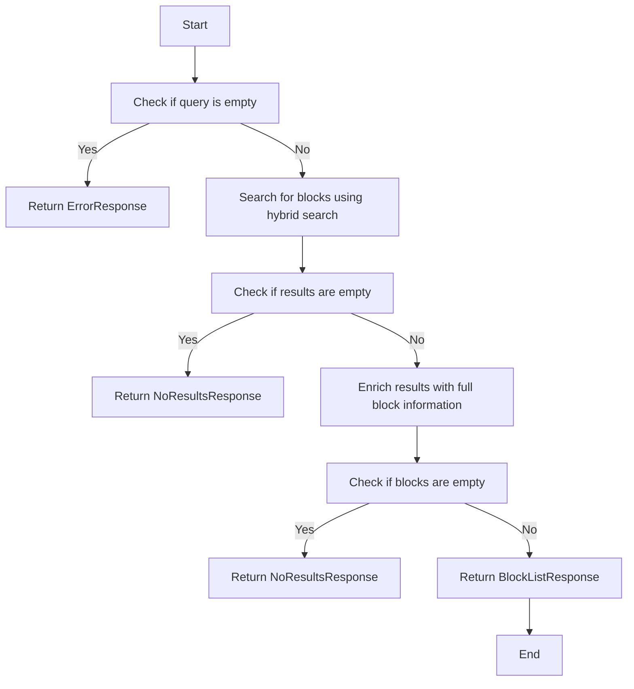

#### 带注释源码

```python
async def _execute(
    self,
    user_id: str | None,
    session: ChatSession,
    **kwargs,
) -> ToolResponseBase:
    """Search for blocks matching the query.

    Args:
        user_id: User ID (required)
        session: Chat session
        query: Search query

    Returns:
        BlockListResponse: List of matching blocks
        NoResultsResponse: No blocks found
        ErrorResponse: Error message
    """
    query = kwargs.get("query", "").strip()
    session_id = session.session_id

    if not query:
        return ErrorResponse(
            message="Please provide a search query",
            session_id=session_id,
        )

    try:
        # Search for blocks using hybrid search
        results, total = await unified_hybrid_search(
            query=query,
            content_types=[ContentType.BLOCK],
            page=1,
            page_size=_OVERFETCH_PAGE_SIZE,
        )

        if not results:
            return NoResultsResponse(
                message=f"No blocks found for '{query}'",
                suggestions=[
                    "Try broader keywords like 'email', 'http', 'text', 'ai'",
                    "Check spelling of technical terms",
                ],
                session_id=session_id,
            )

        # Enrich results with full block information
        blocks: list[BlockInfoSummary] = []
        for result in results:
            block_id = result["content_id"]
            block = get_block(block_id)

            # Skip disabled blocks
            if not block or block.disabled:
                continue

            # Skip blocks excluded from CoPilot (graph-only blocks)
            if (
                block.block_type in COPILOT_EXCLUDED_BLOCK_TYPES
                or block.id in COPILOT_EXCLUDED_BLOCK_IDS
            ):
                continue

            # Get input/output schemas
            input_schema = {}
            output_schema = {}
            try:
                input_schema = block.input_schema.jsonschema()
            except Exception as e:
                logger.debug(
                    "Failed to generate input schema for block %s: %s",
                    block_id,
                    e,
                )
            try:
                output_schema = block.output_schema.jsonschema()
            except Exception as e:
                logger.debug(
                    "Failed to generate output schema for block %s: %s",
                    block_id,
                    e,
                )

            # Get categories from block instance
            categories = []
            if hasattr(block, "categories") and block.categories:
                categories = [cat.value for cat in block.categories]

            # Extract required inputs for easier use
            required_inputs: list[BlockInputFieldInfo] = []
            if input_schema:
                properties = input_schema.get("properties", {})
                required_fields = set(input_schema.get("required", []))
                # Get credential field names to exclude from required inputs
                credentials_fields = set(
                    block.input_schema.get_credentials_fields().keys()
                )

                for field_name, field_schema in properties.items():
                    # Skip credential fields - they're handled separately
                    if field_name in credentials_fields:
                        continue

                    required_inputs.append(
                        BlockInputFieldInfo(
                            name=field_name,
                            type=field_schema.get("type", "string"),
                            description=field_schema.get("description", ""),
                            required=field_name in required_fields,
                            default=field_schema.get("default"),
                        )
                    )

                blocks.append(
                    BlockInfoSummary(
                        id=block_id,
                        name=block.name,
                        description=block.description or "",
                        categories=categories,
                        input_schema=input_schema,
                        output_schema=output_schema,
                        required_inputs=required_inputs,
                    )
                )

                if len(blocks) >= _TARGET_RESULTS:
                    break

        if blocks and len(blocks) < _TARGET_RESULTS:
            logger.debug(
                "find_block returned %d/%d results for query '%s' "
                "(filtered %d excluded/disabled blocks)",
                len(blocks),
                _TARGET_RESULTS,
                query,
                len(results) - len(blocks),
            )

        if not blocks:
            return NoResultsResponse(
                message=f"No blocks found for '{query}'",
                suggestions=[
                    "Try broader keywords like 'email', 'http', 'text', 'ai'",
                ],
                session_id=session_id,
            )

        return BlockListResponse(
            message=(
                f"Found {len(blocks)} block(s) matching '{query}'. "
                "To execute a block, use run_block with the block's 'id' field "
                "and provide 'input_data' matching the block's input_schema."
            ),
            blocks=blocks,
            count=len(blocks),
            query=query,
            session_id=session_id,
        )

    except Exception as e:
        logger.error(f"Error searching blocks: {e}", exc_info=True)
        return ErrorResponse(
            message="Failed to search blocks",
            error=str(e),
            session_id=session_id,
        )
```


### `BlockListResponse`

This function returns a list of blocks that match the given search query. It includes the block's ID, name, description, categories, input schema, output schema, and required inputs.

参数：

- `message`：`str`，A message describing the search results or any errors that occurred.
- `blocks`：`list[BlockInfoSummary]`，A list of block summaries that match the search query.
- `count`：`int`，The total number of blocks that match the search query.
- `query`：`str`，The search query used to find the blocks.
- `session_id`：`str`，The session ID associated with the request.

返回值：`BlockListResponse`，A response object containing the search results and any additional information.

#### 流程图

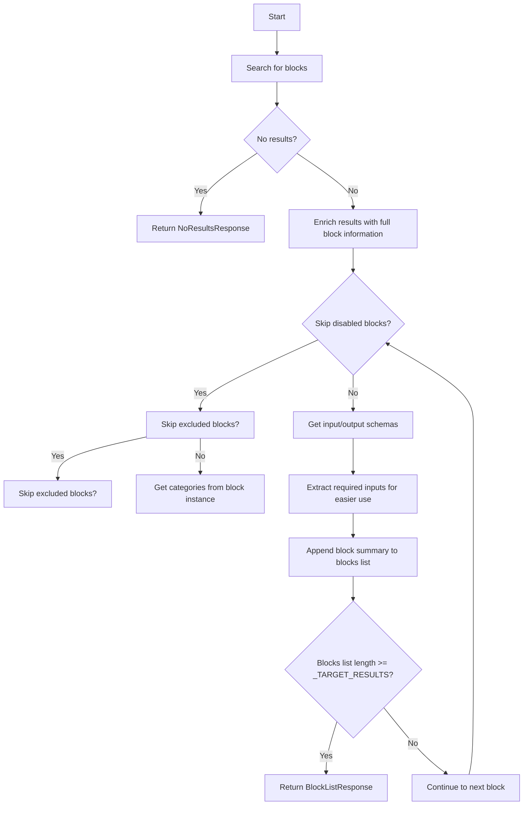

#### 带注释源码

```python
class BlockListResponse(ToolResponseBase):
    """Response object for a list of blocks matching a search query."""

    def __init__(self, message: str, blocks: list[BlockInfoSummary], count: int, query: str, session_id: str):
        super().__init__(message, session_id)
        self.blocks = blocks
        self.count = count
        self.query = query
```


### ErrorResponse

This function is used to create an error response object with a specified message and session ID.

参数：

- `message`：`str`，The error message to be included in the response.
- `session_id`：`str`，The session ID associated with the error.

返回值：`ToolResponseBase`，An error response object containing the error message and session ID.

#### 流程图

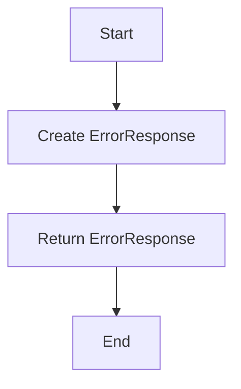

#### 带注释源码

```python
from backend.api.features.chat.tools.models import ErrorResponse

def ErrorResponse(message: str, session_id: str) -> ToolResponseBase:
    return ErrorResponse(message=message, session_id=session_id)
```


### NoResultsResponse

NoResultsResponse is a class used to represent a response when no results are found for a given search query.

参数：

- `message`：`str`，A message indicating that no results were found.
- `suggestions`：`list[str]`，A list of suggestions to help the user refine their search.
- `session_id`：`str`，The session ID associated with the request.

返回值：`NoResultsResponse`，An instance of NoResultsResponse with the provided message, suggestions, and session ID.

#### 流程图

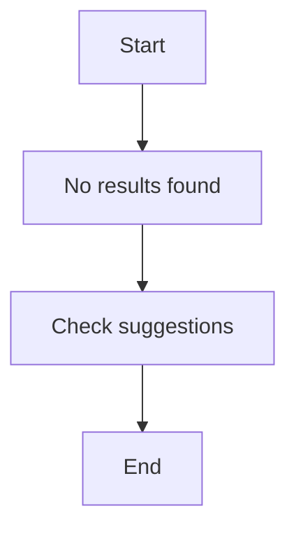

#### 带注释源码

```python
class NoResultsResponse(ToolResponseBase):
    """Response when no results are found for a search query."""

    def __init__(self, message: str, suggestions: list[str], session_id: str):
        super().__init__(session_id=session_id)
        self.message = message
        self.suggestions = suggestions
```


### BaseTool.name

This method returns the name of the `BaseTool` class.

参数：

- 无

返回值：`str`，返回工具的名称

#### 流程图

```mermaid
graph TD
    A[Start] --> B[Return "find_block"]
    B --> C[End]
```

#### 带注释源码

```python
class BaseTool:
    # ...

    @property
    def name(self) -> str:
        return "find_block"
```


### BaseTool.description

返回工具的描述信息。

参数：

- 无

返回值：`str`，工具的描述信息

#### 流程图

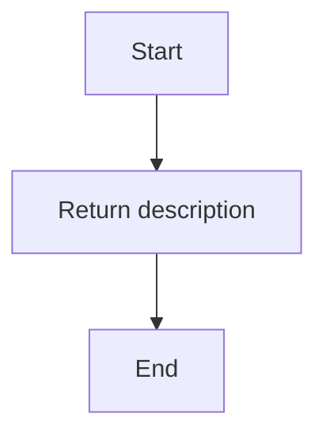

#### 带注释源码

```python
    @property
    def description(self) -> str:
        return (
            "Search for available blocks by name or description. "
            "Blocks are reusable components that perform specific tasks like "
            "sending emails, making API calls, processing text, etc. "
            "IMPORTANT: Use this tool FIRST to get the block's 'id' before calling run_block. "
            "The response includes each block's id, required_inputs, and input_schema."
        )
```


### BaseTool.parameters

This method defines the parameters required for the `FindBlockTool` class, which is used to search for available blocks.

参数：

- `query`：`string`，Search query to find blocks by name or description. Use keywords like 'email', 'http', 'text', 'ai', etc.

返回值：`dict[str, Any]`，A dictionary defining the parameters for the `FindBlockTool` class.

#### 流程图

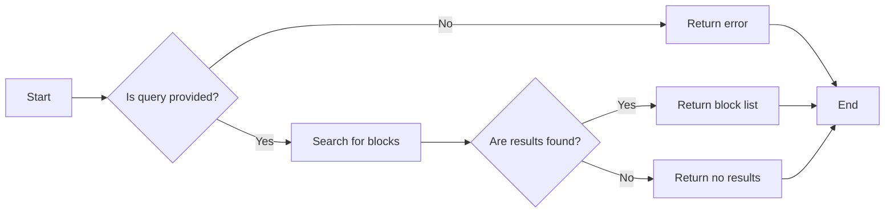

#### 带注释源码

```python
    @property
    def parameters(self) -> dict[str, Any]:
        return {
            "type": "object",
            "properties": {
                "query": {
                    "type": "string",
                    "description": (
                        "Search query to find blocks by name or description. "
                        "Use keywords like 'email', 'http', 'text', 'ai', etc."
                    ),
                },
            },
            "required": ["query"],
        }
```


### BaseTool.requires_auth

This method determines whether authentication is required for a tool.

参数：

- 无

返回值：`bool`，Indicates whether authentication is required for the tool.

#### 流程图

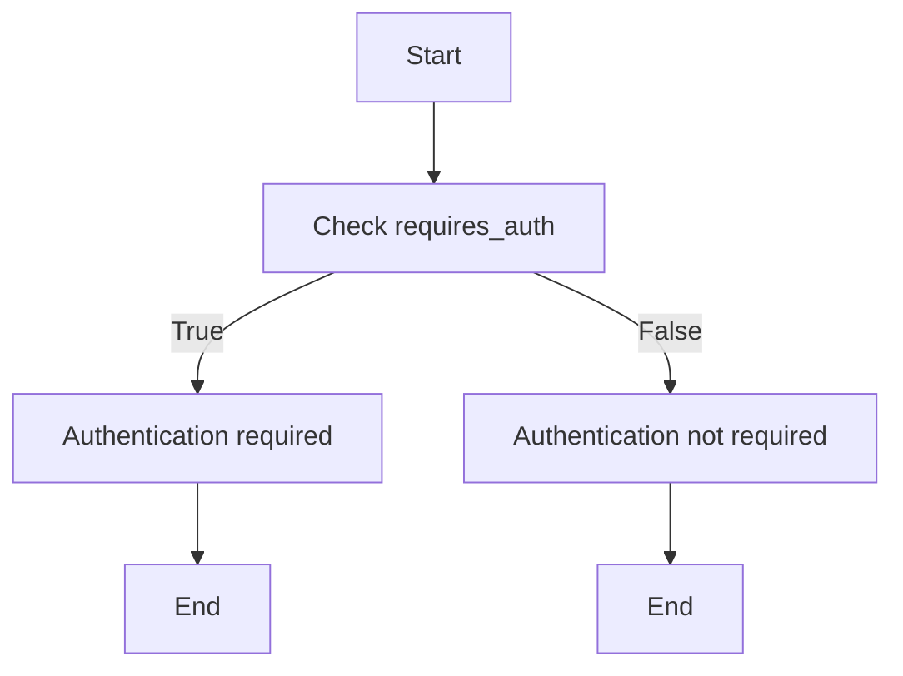

#### 带注释源码

```python
    @property
    def requires_auth(self) -> bool:
        return True
```


### FindBlockTool._execute

Search for blocks matching the query.

参数：

- `user_id`：`str | None`，User ID (required)
- `session`：`ChatSession`，Chat session
- `**kwargs`：`Any`，Additional keyword arguments for search query

返回值：`ToolResponseBase`，List of matching blocks, No results, or error message

#### 流程图


#### 带注释源码

```python
async def _execute(
    self,
    user_id: str | None,
    session: ChatSession,
    **kwargs,
) -> ToolResponseBase:
    """Search for blocks matching the query.

    Args:
        user_id: User ID (required)
        session: Chat session
        query: Search query

    Returns:
        BlockListResponse: List of matching blocks
        NoResultsResponse: No blocks found
        ErrorResponse: Error message
    """
    query = kwargs.get("query", "").strip()
    session_id = session.session_id

    if not query:
        return ErrorResponse(
            message="Please provide a search query",
            session_id=session_id,
        )

    try:
        # Search for blocks using hybrid search
        results, total = await unified_hybrid_search(
            query=query,
            content_types=[ContentType.BLOCK],
            page=1,
            page_size=_OVERFETCH_PAGE_SIZE,
        )

        if not results:
            return NoResultsResponse(
                message=f"No blocks found for '{query}'",
                suggestions=[
                    "Try broader keywords like 'email', 'http', 'text', 'ai'",
                    "Check spelling of technical terms",
                ],
                session_id=session_id,
            )

        # Enrich results with full block information
        blocks: list[BlockInfoSummary] = []
        for result in results:
            block_id = result["content_id"]
            block = get_block(block_id)

            # Skip disabled blocks
            if not block or block.disabled:
                continue

            # Skip blocks excluded from CoPilot (graph-only blocks)
            if (
                block.block_type in COPILOT_EXCLUDED_BLOCK_TYPES
                or block.id in COPILOT_EXCLUDED_BLOCK_IDS
            ):
                continue

            # Get input/output schemas
            input_schema = {}
            output_schema = {}
            try:
                input_schema = block.input_schema.jsonschema()
            except Exception as e:
                logger.debug(
                    "Failed to generate input schema for block %s: %s",
                    block_id,
                    e,
                )
            try:
                output_schema = block.output_schema.jsonschema()
            except Exception as e:
                logger.debug(
                    "Failed to generate output schema for block %s: %s",
                    block_id,
                    e,
                )

            # Get categories from block instance
            categories = []
            if hasattr(block, "categories") and block.categories:
                categories = [cat.value for cat in block.categories]

            # Extract required inputs for easier use
            required_inputs: list[BlockInputFieldInfo] = []
            if input_schema:
                properties = input_schema.get("properties", {})
                required_fields = set(input_schema.get("required", []))
                # Get credential field names to exclude from required inputs
                credentials_fields = set(
                    block.input_schema.get_credentials_fields().keys()
                )

                for field_name, field_schema in properties.items():
                    # Skip credential fields - they're handled separately
                    if field_name in credentials_fields:
                        continue

                    required_inputs.append(
                        BlockInputFieldInfo(
                            name=field_name,
                            type=field_schema.get("type", "string"),
                            description=field_schema.get("description", ""),
                            required=field_name in required_fields,
                            default=field_schema.get("default"),
                        )
                    )

                blocks.append(
                    BlockInfoSummary(
                        id=block_id,
                        name=block.name,
                        description=block.description or "",
                        categories=categories,
                        input_schema=input_schema,
                        output_schema=output_schema,
                        required_inputs=required_inputs,
                    )
                )

                if len(blocks) >= _TARGET_RESULTS:
                    break

        if blocks and len(blocks) < _TARGET_RESULTS:
            logger.debug(
                "find_block returned %d/%d results for query '%s' "
                "(filtered %d excluded/disabled blocks)",
                len(blocks),
                _TARGET_RESULTS,
                query,
                len(results) - len(blocks),
            )

        if not blocks:
            return NoResultsResponse(
                message=f"No blocks found for '{query}'",
                suggestions=[
                    "Try broader keywords like 'email', 'http', 'text', 'ai'",
                ],
                session_id=session_id,
            )

        return BlockListResponse(
            message=(
                f"Found {len(blocks)} block(s) matching '{query}'. "
                "To execute a block, use run_block with the block's 'id' field "
                "and provide 'input_data' matching the block's input_schema."
            ),
            blocks=blocks,
            count=len(blocks),
            query=query,
            session_id=session_id,
        )

    except Exception as e:
        logger.error(f"Error searching blocks: {e}", exc_info=True)
        return ErrorResponse(
            message="Failed to search blocks",
            error=str(e),
            session_id=session_id,
        )
```


### FindBlockTool.name

This method returns the name of the `FindBlockTool` class.

参数：

- 无

返回值：`str`，返回工具的名称 "find_block"

#### 流程图

```mermaid
graph TD
    A[Start] --> B[Return "find_block"]
    B --> C[End]
```

#### 带注释源码

```python
class FindBlockTool(BaseTool):
    """Tool for searching available blocks."""

    @property
    def name(self) -> str:
        return "find_block"
```


### FindBlockTool.description

This function returns the description of the `FindBlockTool` class, which is a tool for searching available blocks.

参数：

- 无

返回值：`str`，The description of the `FindBlockTool` class, which includes information about the functionality of the tool.

#### 流程图

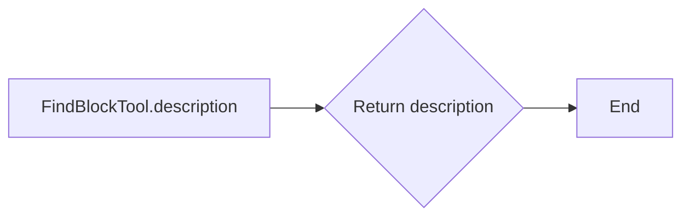

#### 带注释源码

```python
    @property
    def description(self) -> str:
        return (
            "Search for available blocks by name or description. "
            "Blocks are reusable components that perform specific tasks like "
            "sending emails, making API calls, processing text, etc. "
            "IMPORTANT: Use this tool FIRST to get the block's 'id' before calling run_block. "
            "The response includes each block's id, required_inputs, and input_schema."
        )
```


### FindBlockTool.parameters

This method returns the parameters required for the `FindBlockTool` class.

参数：

- `query`：`string`，Search query to find blocks by name or description. Use keywords like 'email', 'http', 'text', 'ai', etc.

返回值：`dict[str, Any]`，A dictionary containing the parameters and their descriptions.

#### 流程图

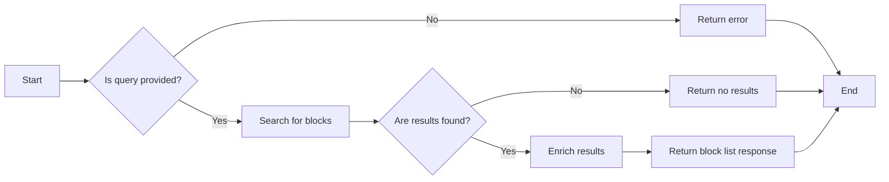

#### 带注释源码

```python
    @property
    def parameters(self) -> dict[str, Any]:
        return {
            "type": "object",
            "properties": {
                "query": {
                    "type": "string",
                    "description": (
                        "Search query to find blocks by name or description. "
                        "Use keywords like 'email', 'http', 'text', 'ai', etc."
                    ),
                },
            },
            "required": ["query"],
        }
``` 


### FindBlockTool.requires_auth

This method determines whether authentication is required for the `FindBlockTool`.

参数：

- 无

返回值：`bool`，Indicates whether authentication is required.

#### 流程图


#### 带注释源码

```python
    @property
    def requires_auth(self) -> bool:
        return True
```


## 关键组件


### 张量索引与惰性加载

用于高效地索引和加载张量数据，以减少内存占用和提高查询速度。

### 反量化支持

提供对反量化操作的支持，允许在量化过程中进行逆量化，以恢复原始数据。

### 量化策略

定义了不同的量化策略，用于在模型训练和推理过程中对权重和激活进行量化，以减少模型大小和提高推理速度。


## 问题及建议


### 已知问题

-   **全局变量和类字段未进行封装**：代码中存在多个全局变量，如 `_TARGET_RESULTS`、`_OVERFETCH_PAGE_SIZE`、`COPILOT_EXCLUDED_BLOCK_TYPES` 和 `COPILOT_EXCLUDED_BLOCK_IDS`，这些变量没有封装在类中，可能导致代码难以维护和理解。
-   **异常处理不够详细**：在 `_execute` 方法中，异常处理主要是捕获所有异常并返回一个 `ErrorResponse`，没有针对不同类型的异常进行区分处理。
-   **日志记录不够详细**：日志记录主要集中在错误信息，对于一些重要的操作步骤，如搜索结果过滤、数据转换等，没有足够的日志记录。

### 优化建议

-   **封装全局变量**：将全局变量封装在类中，或者使用配置文件等方式进行管理，提高代码的可维护性。
-   **细化异常处理**：针对不同类型的异常进行区分处理，例如，对于搜索失败的情况，可以返回一个特定的错误响应，而不是通用的错误响应。
-   **增加详细的日志记录**：对于重要的操作步骤，如搜索结果过滤、数据转换等，增加详细的日志记录，有助于问题的调试和追踪。
-   **代码复用性**：考虑将一些重复的代码，如获取输入/输出模式，封装成函数或类，提高代码的复用性。
-   **性能优化**：在搜索结果过滤时，可以考虑使用更高效的算法，减少不必要的计算，提高代码的执行效率。


## 其它


### 设计目标与约束

- 设计目标：
  - 提供一个高效且易于使用的工具，用于搜索和发现可用的块。
  - 确保搜索结果准确无误，并排除禁用或不符合条件的块。
  - 提供详细的块信息，包括名称、描述、输入/输出模式等。
  - 确保工具具有良好的性能和可扩展性。

- 约束：
  - 必须与现有的API和数据库接口兼容。
  - 必须遵守安全性和隐私性要求。
  - 必须在CoPilot环境中有效运行。

### 错误处理与异常设计

- 错误处理：
  - 对于无效的查询，返回错误消息并提示用户。
  - 对于搜索过程中发生的异常，记录错误并返回错误消息。
  - 对于无法找到匹配块的查询，返回无结果响应。

- 异常设计：
  - 使用try-except块捕获可能发生的异常。
  - 使用日志记录异常信息，以便进行调试和问题追踪。

### 数据流与状态机

- 数据流：
  - 用户发起搜索请求。
  - 搜索请求通过API传递到后端服务。
  - 后端服务执行搜索并返回结果。
  - 前端显示搜索结果。

- 状态机：
  - 初始状态：等待用户输入搜索查询。
  - 搜索状态：执行搜索并处理结果。
  - 结果状态：显示搜索结果或错误消息。

### 外部依赖与接口契约

- 外部依赖：
  - Prisma ORM：用于数据库操作。
  - logging：用于日志记录。
  - typing：用于类型注解。

- 接口契约：
  - `unified_hybrid_search`：用于执行搜索查询。
  - `get_block`：用于获取块信息。
  - `BlockInfoSummary`：用于表示搜索结果。
  - `BlockInputFieldInfo`：用于表示输入字段信息。
  - `BlockListResponse`：用于表示块列表响应。
  - `ErrorResponse`：用于表示错误响应。
  - `NoResultsResponse`：用于表示无结果响应。

    