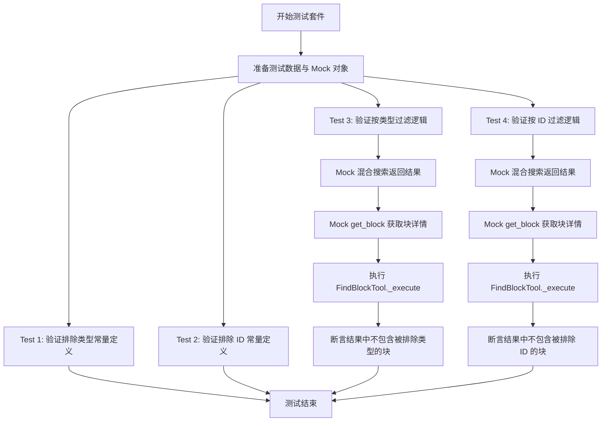
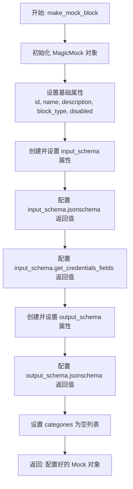
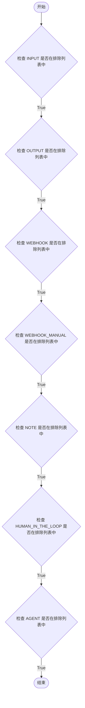
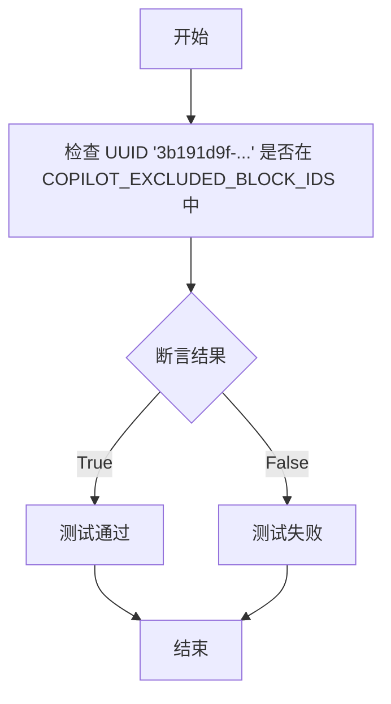
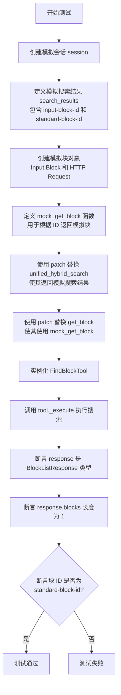

# `AutoGPT\autogpt_platform\backend\backend\api\features\chat\tools\find_block_test.py` 详细设计文档

该代码文件定义了一套针对 FindBlockTool 的单元测试，主要用于验证块过滤逻辑的正确性，确保特定的块类型（如输入、输出块）和特定的块 ID（如智能决策块）能够按照预定义的排除规则从搜索结果中被正确过滤。

## 整体流程



## 类结构

```
TestFindBlockFiltering (测试类)
├── test_excluded_block_types_contains_expected_types (方法)
├── test_excluded_block_ids_contains_smart_decision_maker (方法)
├── test_excluded_block_type_filtered_from_results (异步方法)
└── test_excluded_block_id_filtered_from_results (异步方法)
make_mock_block (全局函数)
_TEST_USER_ID (全局变量)
```

## 全局变量及字段


### `_TEST_USER_ID`
    
用于在测试过程中模拟用户ID的全局常量。

类型：`str`
    


    

## 全局函数及方法


### `make_mock_block`

用于测试目的，创建一个具有指定属性（如ID、名称、类型等）和预设模式行为的模拟块对象。

参数：

-   `block_id`：`str`，模拟块的唯一标识符。
-   `name`：`str`，模拟块的显示名称。
-   `block_type`：`BlockType`，模拟块的类型枚举值（例如 `BlockType.INPUT` 或 `BlockType.STANDARD`）。
-   `disabled`：`bool`，指示模拟块是否处于禁用状态，默认为 `False`。

返回值：`MagicMock`，配置完成后的模拟块对象，包含所需的属性及嵌套的 Mock 方法。

#### 流程图



#### 带注释源码

```python
def make_mock_block(
    block_id: str, name: str, block_type: BlockType, disabled: bool = False
):
    """Create a mock block for testing."""
    # 创建一个 MagicMock 对象作为基础 Mock
    mock = MagicMock()
    
    # 设置基础属性
    mock.id = block_id
    mock.name = name
    mock.description = f"{name} description"
    mock.block_type = block_type
    mock.disabled = disabled
    
    # 配置 input_schema 模拟对象
    mock.input_schema = MagicMock()
    # 设置 jsonschema 方法的返回值为包含空属性和必填项的字典
    mock.input_schema.jsonschema.return_value = {"properties": {}, "required": []}
    # 设置 get_credentials_fields 方法的返回值为空字典
    mock.input_schema.get_credentials_fields.return_value = {}
    
    # 配置 output_schema 模拟对象
    mock.output_schema = MagicMock()
    # 设置 jsonschema 方法的返回值为空字典
    mock.output_schema.jsonschema.return_value = {}
    
    # 设置分类列表为空
    mock.categories = []
    
    # 返回配置好的 Mock 对象
    return mock
```


### `TestFindBlockFiltering.test_excluded_block_types_contains_expected_types`

该测试方法用于验证常量 `COPILOT_EXCLUDED_BLOCK_TYPES` 是否包含了所有预期的、仅用于图结构而非工具搜索的块类型（如 INPUT, OUTPUT, WEBHOOK 等）。这确保了 CoPilot 的搜索功能能够正确识别并排除这些特定的块类型。

参数：

-   无

返回值：`None`，该函数为测试方法，不返回具体数值，通过断言验证逻辑正确性。

#### 流程图



#### 带注释源码

```python
def test_excluded_block_types_contains_expected_types(self):
    """Verify COPILOT_EXCLUDED_BLOCK_TYPES contains all graph-only types."""
    # 验证输入块类型是否在排除列表中
    assert BlockType.INPUT in COPILOT_EXCLUDED_BLOCK_TYPES
    # 验证输出块类型是否在排除列表中
    assert BlockType.OUTPUT in COPILOT_EXCLUDED_BLOCK_TYPES
    # 验证 Webhook 块类型是否在排除列表中
    assert BlockType.WEBHOOK in COPILOT_EXCLUDED_BLOCK_TYPES
    # 验证手动 Webhook 块类型是否在排除列表中
    assert BlockType.WEBHOOK_MANUAL in COPILOT_EXCLUDED_BLOCK_TYPES
    # 验证笔记块类型是否在排除列表中
    assert BlockType.NOTE in COPILOT_EXCLUDED_BLOCK_TYPES
    # 验证人工干预块类型是否在排除列表中
    assert BlockType.HUMAN_IN_THE_LOOP in COPILOT_EXCLUDED_BLOCK_TYPES
    # 验证代理块类型是否在排除列表中
    assert BlockType.AGENT in COPILOT_EXCLUDED_BLOCK_TYPES
```


### `TestFindBlockFiltering.test_excluded_block_ids_contains_smart_decision_maker`

验证 SmartDecisionMakerBlock 的特定 ID 是否包含在 `COPILOT_EXCLUDED_BLOCK_IDS` 排除列表中。

参数：

- `self`：`TestFindBlockFiltering`，测试类实例。

返回值：`None`，无返回值。

#### 流程图



#### 带注释源码

```python
    def test_excluded_block_ids_contains_smart_decision_maker(self):
        # 文档字符串：验证 SmartDecisionMakerBlock 是否在 COPILOT_EXCLUDED_BLOCK_IDS 中
        """Verify SmartDecisionMakerBlock is in COPILOT_EXCLUDED_BLOCK_IDS."""
        # 断言：检查特定的 UUID 是否存在于全局排除块 ID 列表中
        assert "3b191d9f-356f-482d-8238-ba04b6d18381" in COPILOT_EXCLUDED_BLOCK_IDS
```


### `TestFindBlockFiltering.test_excluded_block_type_filtered_from_results`

该测试方法用于验证 `FindBlockTool` 在执行搜索时，能够正确地根据块类型（BlockType）过滤掉被排除的块（例如 `INPUT` 类型），确保搜索结果中仅包含允许的块类型。

参数：

- `self`：`TestFindBlockFiltering`，测试类的实例，由 pytest 框架隐式传递。

返回值：`None`，该函数为测试方法，无显式返回值，通过断言验证结果。

#### 流程图



#### 带注释源码

```python
@pytest.mark.asyncio(loop_scope="session")
async def test_excluded_block_type_filtered_from_results(self):
    """Verify blocks with excluded BlockTypes are filtered from search results."""
    # 1. 准备测试环境，创建模拟会话
    session = make_session(user_id=_TEST_USER_ID)

    # 2. 模拟搜索服务返回的原始结果，包含一个 INPUT 类型块（应被排除）和一个 STANDARD 类型块（应保留）
    search_results = [
        {"content_id": "input-block-id", "score": 0.9},
        {"content_id": "standard-block-id", "score": 0.8},
    ]

    # 3. 创建具体的块对象数据
    input_block = make_mock_block("input-block-id", "Input Block", BlockType.INPUT)
    standard_block = make_mock_block(
        "standard-block-id", "HTTP Request", BlockType.STANDARD
    )

    # 4. 定义一个辅助函数，根据 ID 返回对应的模拟块对象
    def mock_get_block(block_id):
        return {
            "input-block-id": input_block,
            "standard-block-id": standard_block,
        }.get(block_id)

    # 5. 使用 patch 替换掉真实的混合搜索函数，使其直接返回预设的 search_results
    with patch(
        "backend.api.features.chat.tools.find_block.unified_hybrid_search",
        new_callable=AsyncMock,
        return_value=(search_results, 2),
    ):
        # 6. 使用 patch 替换掉真实的获取块函数，使其返回预设的 mock 对象
        with patch(
            "backend.api.features.chat.tools.find_block.get_block",
            side_effect=mock_get_block,
        ):
            # 7. 初始化工具并执行异步查询
            tool = FindBlockTool()
            response = await tool._execute(
                user_id=_TEST_USER_ID, session=session, query="test"
            )

    # 8. 验证阶段：检查返回的结果
    # 断言返回类型正确
    assert isinstance(response, BlockListResponse)
    # 断言结果中只包含 1 个块（INPUT 类型块已被过滤）
    assert len(response.blocks) == 1
    # 断言剩下的块是 STANDARD 类型块，而不是 INPUT 类型块
    assert response.blocks[0].id == "standard-block-id"
```


### `TestFindBlockFiltering.test_excluded_block_id_filtered_from_results`

该测试方法用于验证 `FindBlockTool` 的块过滤功能，确保特定的块 ID（特别是 SmartDecisionMakerBlock）即使其类型不在排除类型列表中，也能根据 ID 被正确地从搜索结果中过滤掉。

参数：

-   `self`：`TestFindBlockFiltering`，测试类的实例，用于访问测试上下文和断言方法。

返回值：`None`，该方法作为单元测试，主要进行断言验证，无显式返回值。

#### 流程图

```mermaid
graph TD
    A[开始: test_excluded_block_id_filtered_from_results] --> B[创建模拟 Session]
    B --> C[定义 excluded_block_id 和 search_results]
    C --> D[创建 smart_block 和 normal_block 模拟对象]
    D --> E[定义 mock_get_block 辅助函数]
    E --> F[打补丁 unified_hybrid_search 返回模拟结果]
    F --> G[打补丁 get_block 返回模拟块对象]
    G --> H[实例化 FindBlockTool]
    H --> I[调用 tool._execute 执行查询]
    I --> J[断言: response 是 BlockListResponse]
    J --> K[断言: response.blocks 长度为 1]
    K --> L[断言: response.blocks[0].id 为 normal-block-id]
    L --> M[测试结束]
```

#### 带注释源码

```python
    @pytest.mark.asyncio(loop_scope="session")
    async def test_excluded_block_id_filtered_from_results(self):
        """Verify SmartDecisionMakerBlock is filtered from search results."""
        # 1. 准备测试环境，创建模拟 Session
        session = make_session(user_id=_TEST_USER_ID)

        # 2. 定义需要被排除的 Smart Decision Maker Block 的 ID
        smart_decision_id = "3b191d9f-356f-482d-8238-ba04b6d18381"
        
        # 3. 构造模拟搜索结果，包含排除ID和正常ID
        search_results = [
            {"content_id": smart_decision_id, "score": 0.9},
            {"content_id": "normal-block-id", "score": 0.8},
        ]

        # 4. 创建模拟块对象
        # SmartDecisionMakerBlock 虽然是 STANDARD 类型，但应该被 ID 过滤掉
        smart_block = make_mock_block(
            smart_decision_id, "Smart Decision Maker", BlockType.STANDARD
        )
        normal_block = make_mock_block(
            "normal-block-id", "Normal Block", BlockType.STANDARD
        )

        # 5. 定义辅助函数用于根据 ID 返回模拟块
        def mock_get_block(block_id):
            return {
                smart_decision_id: smart_block,
                "normal-block-id": normal_block,
            }.get(block_id)

        # 6. 使用 patch 替换外部依赖
        with patch(
            "backend.api.features.chat.tools.find_block.unified_hybrid_search",
            new_callable=AsyncMock,
            return_value=(search_results, 2),
        ):
            with patch(
                "backend.api.features.chat.tools.find_block.get_block",
                side_effect=mock_get_block,
            ):
                # 7. 初始化工具并执行查询
                tool = FindBlockTool()
                response = await tool._execute(
                    user_id=_TEST_USER_ID, session=session, query="decision"
                )

        # 8. 验证结果：只应返回 normal block，SmartDecisionMakerBlock 应被过滤
        assert isinstance(response, BlockListResponse)
        assert len(response.blocks) == 1
        assert response.blocks[0].id == "normal-block-id"
```


## 关键组件


### FindBlockTool

用于查找和过滤代码块的核心工具，负责执行查询并根据配置规则过滤不合规的块。

### COPILOT_EXCLUDED_BLOCK_TYPES

全局配置变量，定义了在 Copilot 辅助场景下需要从搜索结果中排除的块类型集合（如 INPUT、OUTPUT 等）。

### COPILOT_EXCLUDED_BLOCK_IDS

全局配置变量，定义了在 Copilot 辅助场景下需要从搜索结果中排除的特定块 ID 集合（如 SmartDecisionMakerBlock）。

### Block Filtering Mechanism

隐含的过滤逻辑组件，在获取搜索结果后，依据 `COPILOT_EXCLUDED_BLOCK_TYPES` 和 `COPILOT_EXCLUDED_BLOCK_IDS` 对返回的块列表进行二次筛选。

### Mock Block Factory

测试辅助组件（`make_mock_block` 函数），用于快速生成模拟的 Block 对象以隔离测试环境，支持自定义 ID、名称、类型及 Schema。


## 问题及建议


### 已知问题
-   **常量同步的脆弱性**：测试方法 `test_excluded_block_types_contains_expected_types` 和 `test_excluded_block_ids_contains_smart_decision_maker` 直接硬编码了期望的常量值。这导致测试与源代码中的常量定义强耦合，如果源代码常量更新而测试未同步更新，或者需要调整过滤策略时，这些测试反而会成为重构的阻碍（表现为测试而非行为驱动）。
-   **魔法字符串维护风险**：测试中直接使用了硬编码的 UUID（如 `"3b191d9f-356f-482d-8238-ba04b6d18381"`）作为测试数据。这种做法降低了代码的可读性，且如果该 ID 在上游代码中发生变化，测试将难以定位并修复，增加了维护成本。
-   **Mock 对象构建冗余**：`make_mock_block` 函数构建了包含 `input_schema` 和 `output_schema` 等复杂嵌套 Mock 的对象。如果 `FindBlockTool` 的过滤逻辑仅依赖于 `block_type` 和 `id`，那么构建这些未使用的 Mock 属性属于冗余操作，增加了测试代码的复杂度和理解负担。

### 优化建议
-   **引入 Pytest Fixture**：建议将 `_TEST_USER_ID` 和 `make_mock_block` 转换为 `@pytest.fixture`，利用 Pytest 的依赖注入机制管理测试数据和模拟对象，从而减少测试代码中的重复逻辑，并使作用域管理更加灵活。
-   **使用参数化测试**：对于 `test_excluded_block_types_contains_expected_types`，建议使用 `@pytest.mark.parametrize` 将多种 `BlockType` 作为参数传入，避免编写多个重复的 `assert` 语句，提高测试代码的简洁性和可读性。
-   **增加边界条件测试用例**：当前测试主要关注过滤逻辑的有效性，建议增加对边界情况的覆盖，例如：搜索结果为空列表、所有结果均被过滤导致返回空列表等场景，以确保代码在极端情况下的健壮性。
-   **抽象 Mock 工厂类**：如果 `make_mock_block` 的逻辑在多个测试文件中复用，建议将其迁移至共享的测试工具模块（如 `tests/conftest.py` 或 `tests/utils/factories.py`），并考虑使用 `factory_boy` 等库来标准化测试数据的生成。


## 其它


### 设计目标与约束

本测试模块的设计目标是确保 `FindBlockTool` 的 `_execute` 方法能够严格执行针对块类型（如 INPUT、OUTPUT 等）和特定块 ID（如 SmartDecisionMakerBlock）的过滤逻辑。主要约束包括：
1. **异步测试环境**：测试必须运行在异步事件循环中，使用 `@pytest.mark.asyncio` 标记。
2. **隔离性**：必须通过 Mock 对象完全隔离外部依赖（如数据库搜索、存储层），确保测试仅关注过滤逻辑本身。
3. **Mock 结构一致性**：Mock 的 Block 对象必须至少包含 `id`、`name`、`block_type`、`disabled` 等字段，以满足 `FindBlockTool` 内部逻辑的最小需求。

### 外部依赖与接口契约

本模块依赖于以下外部库和内部模块：
1. **测试框架**：`pytest` (用于测试管理和断言)、`unittest.mock` (用于模拟对象)。
2. **内部模块**：
   - `backend.api.features.chat.tools.find_block`：包含被测的 `FindBlockTool` 及常量。
   - `backend.data.block`：定义了 `BlockType` 枚举。
   - `backend.api.features.chat.tools.models`：包含响应模型 `BlockListResponse`。

**接口契约**：
- **`unified_hybrid_search` (Mock)**：契约规定其必须被调用，并返回一个元组 `(search_results, total_count)`，其中 `search_results` 是包含 `content_id` 和 `score` 的字典列表。
- **`get_block` (Mock)**：契约规定其接受 `block_id` 作为参数，并返回一个类似 Block 的对象（具有 `id`, `block_type` 等属性）。
- **`FindBlockTool._execute`**：输入参数必须包含 `user_id` (str), `session` (Session), `query` (str)，返回值必须是 `BlockListResponse` 实例。

### 测试数据与Mock策略

测试采用工厂模式和补丁策略来构建隔离环境：
1. **工厂函数 `make_mock_block`**：用于动态生成具有指定 ID、名称和类型的 Block Mock 对象。该 Mock 对象模拟了真实的 Block 行为，例如 `input_schema.jsonschema()` 返回空字典。
2. **补丁**：使用 `patch` 上下文管理器临时替换 `find_block` 模块中的 `unified_hybrid_search` 和 `get_block` 函数。
   - `unified_hybrid_search` 被替换为 `AsyncMock`，模拟异步搜索行为。
   - `get_block` 使用 `side_effect` 参数配置，根据输入的 ID 返回预定义的 Mock Block 对象。
3. **Session Mock**：通过 `_test_data.make_session` 生成用户会话，模拟登录用户上下文。

### 测试场景覆盖

测试模块覆盖了以下关键场景，确保过滤逻辑的健壮性：
1. **常量完整性验证**：
   - 验证 `COPILOT_EXCLUDED_BLOCK_TYPES` 包含所有预期的仅限图操作的类型（如 INPUT, OUTPUT, WEBHOOK 等）。
   - 验证 `COPILOT_EXCLUDED_BLOCK_IDS` 包含特定的排除 ID（如 SmartDecisionMakerBlock 的 ID）。
2. **基于类型的过滤**：
   - 构造混合搜索结果（包含排除的 INPUT 类型和包含的 STANDARD 类型），验证 `_execute` 结果中仅包含 STANDARD 类型的块。
3. **基于 ID 的过滤**：
   - 构造搜索结果（包含被排除 ID 的块和普通块），即使被排除 ID 的块类型是 STANDARD，也必须被过滤掉，结果中仅保留普通块。

### 数据流与状态机

测试执行过程中的数据流向如下：
1. **初始化状态**：设置测试用户 ID (`_TEST_USER_ID`) 和 Mock 会话。
2. **输入流**：构造包含“干扰项”（需排除的块）和“目标项”（需保留的块）的搜索结果列表。
3. **处理流**：
   - 调用 `tool._execute`，触发内部逻辑。
   - 逻辑调用被 Mock 的 `unified_hybrid_search` 获取 ID 列表。
   - 逻辑调用被 Mock 的 `get_block` 获取对象详情。
   - 逻辑应用内部过滤器（比对 `COPILOT_EXCLUDED_BLOCK_TYPES` 和 `COPILOT_EXCLUDED_BLOCK_IDS`）。
4. **输出流与状态验证**：生成 `BlockListResponse` 对象。测试通过 `assert` 检查返回列表的长度和具体的 Block ID，验证过滤状态是否符合预期（即只包含非排除项）。

    