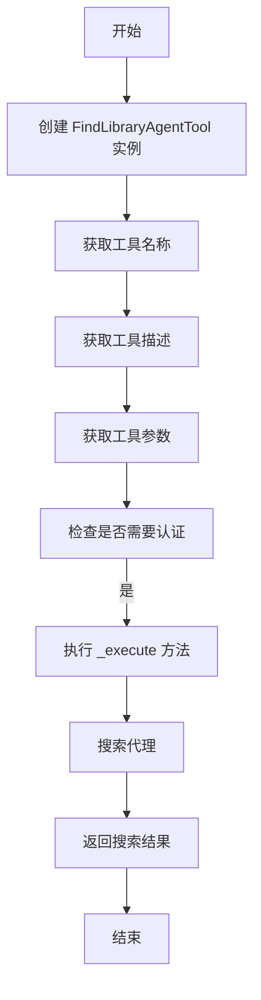
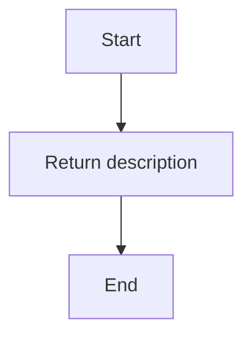
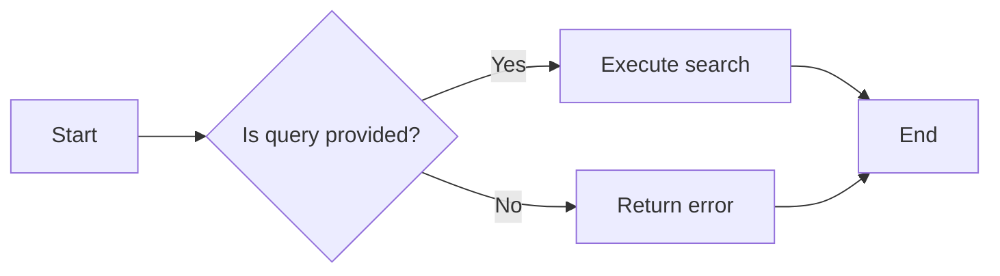
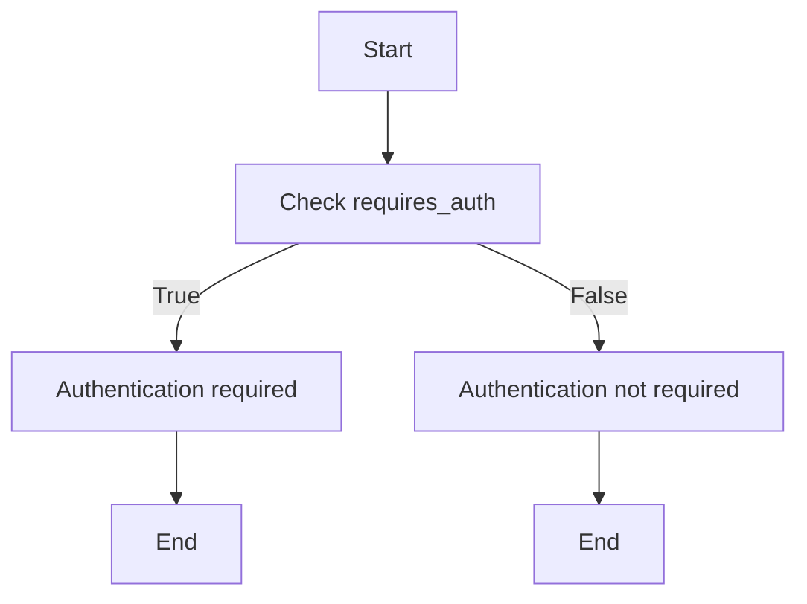
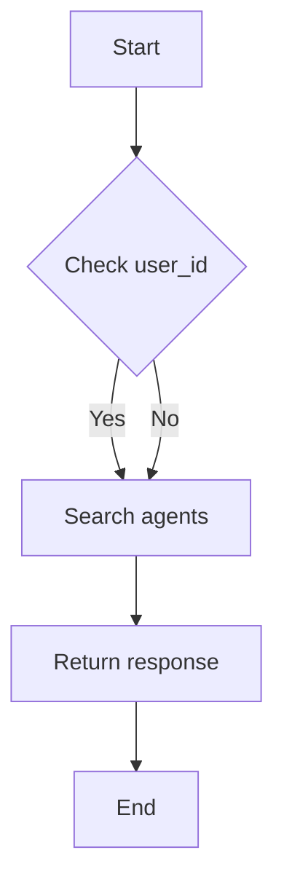

# `.\AutoGPT\autogpt_platform\backend\backend\api\features\chat\tools\find_library_agent.py` 详细设计文档

The code provides a tool for searching agents in a user's library, allowing users to find agents by name or description.

## 整体流程



## 类结构

```
BaseTool (基类)
├── FindLibraryAgentTool (工具类)
```

## 全局变量及字段


### `FindLibraryAgentTool.name`
    
The name of the tool, which is 'find_library_agent'.

类型：`str`
    


### `FindLibraryAgentTool.description`
    
A description of the tool's functionality.

类型：`str`
    


### `FindLibraryAgentTool.parameters`
    
A dictionary defining the parameters required by the tool.

类型：`dict[str, Any]`
    


### `FindLibraryAgentTool.requires_auth`
    
Indicates whether the tool requires authentication to execute.

类型：`bool`
    


### `FindLibraryAgentTool.user_id`
    
The user ID for which the search is performed, if provided.

类型：`str | None`
    


### `FindLibraryAgentTool.session`
    
The chat session object associated with the user.

类型：`ChatSession`
    


### `FindLibraryAgentTool.query`
    
The search query to find agents by name or description.

类型：`str`
    


### `FindLibraryAgentTool.source`
    
The source of the search, which is 'library' in this case.

类型：`str`
    


### `FindLibraryAgentTool.session_id`
    
The session ID associated with the chat session.

类型：`str`
    


### `FindLibraryAgentTool.ToolResponseBase`
    
The base class for tool responses.

类型：`class`
    


### `FindLibraryAgentTool.search_agents`
    
The function used to search for agents in the user's library.

类型：`function`
    
    

## 全局函数及方法


### FindLibraryAgentTool.name

This function returns the name of the `FindLibraryAgentTool` class.

参数：

- 无参数

返回值：`str`，返回工具的名称

#### 流程图

```mermaid
graph TD
    A[Start] --> B{Is name property accessed?}
    B -- Yes --> C[Return "find_library_agent"]
    B -- No --> D[End]
```

#### 带注释源码

```python
class FindLibraryAgentTool(BaseTool):
    """Tool for searching agents in the user's library."""

    @property
    def name(self) -> str:
        # Return the name of the tool
        return "find_library_agent"
```


### FindLibraryAgentTool.description

This function returns the description of the `FindLibraryAgentTool` class, which is a tool for searching agents in the user's library.

参数：

- 无参数

返回值：`str`，The description of the `FindLibraryAgentTool` class, which includes information about its functionality and usage.

#### 流程图



#### 带注释源码

```
    @property
    def description(self) -> str:
        return (
            "Search for agents in the user's library. Use this to find agents "
            "the user has already added to their library, including agents they "
            "created or added from the marketplace."
        )
```


### FindLibraryAgentTool.parameters

This function returns the parameters required for the `FindLibraryAgentTool` class.

参数：

- `query`：`string`，Search query to find agents by name or description.

返回值：`dict[str, Any]`，A dictionary containing the parameters for the tool.

#### 流程图



#### 带注释源码

```python
    @property
    def parameters(self) -> dict[str, Any]:
        return {
            "type": "object",
            "properties": {
                "query": {
                    "type": "string",
                    "description": "Search query to find agents by name or description.",
                },
            },
            "required": ["query"],
        }
```


### FindLibraryAgentTool.requires_auth

This method determines whether authentication is required for the `FindLibraryAgentTool` tool.

参数：

-  `None`：无参数，此方法不接收任何参数。

返回值：`bool`，A boolean value indicating whether authentication is required.

#### 流程图



#### 带注释源码

```
    @property
    def requires_auth(self) -> bool:
        return True
```


### FindLibraryAgentTool._execute

This method is responsible for executing the search for agents in the user's library based on a given query.

参数：

- `user_id`：`str | None`，The unique identifier for the user. This parameter is optional.
- `session`：`ChatSession`，The current chat session object containing session details.
- `**kwargs`：`Any`，Additional keyword arguments that may be passed to the method.

返回值：`ToolResponseBase`，The response object containing the search results.

#### 流程图



#### 带注释源码

```
async def _execute(
    self, user_id: str | None, session: ChatSession, **kwargs
) -> ToolResponseBase:
    # Retrieve the query from the keyword arguments, defaulting to an empty string if not provided
    query = kwargs.get("query", "").strip()
    
    # Call the search_agents function to perform the search
    return await search_agents(
        query=query,
        source="library",
        session_id=session.session_id,
        user_id=user_id,
    )
```


## 关键组件


### 张量索引与惰性加载

用于高效地索引和加载用户库中的代理，以减少内存占用和提高搜索效率。

### 反量化支持

提供对代理反量化的支持，允许在搜索过程中动态调整代理的量化参数。

### 量化策略

实现量化策略，用于优化代理的搜索性能，通过调整量化参数来平衡搜索速度和准确性。


## 问题及建议


### 已知问题

-   **异步执行依赖**：代码中使用了异步方法 `_execute`，但没有明确说明该方法的调用者是否也使用了异步调用。如果调用者不是异步的，可能会导致运行时错误。
-   **错误处理**：代码中没有显示错误处理逻辑，如果搜索过程中出现异常，可能会导致整个工具失败，没有提供恢复或通知用户的机制。
-   **参数验证**：虽然 `parameters` 属性定义了参数类型和描述，但没有在代码中实现实际的参数验证逻辑。
-   **全局变量和函数**：代码中没有使用全局变量或函数，但如果有，需要确保它们不会引起命名冲突或意外的副作用。

### 优化建议

-   **异步调用一致性**：确保所有调用 `_execute` 方法的代码都是异步的，或者使用 `run_in_executor` 来处理同步调用。
-   **增加错误处理**：在 `_execute` 方法中添加异常处理逻辑，确保在出现错误时能够优雅地处理，并返回适当的错误信息。
-   **参数验证**：实现参数验证逻辑，确保传入的参数符合预期格式和类型。
-   **日志记录**：增加日志记录，以便于调试和监控工具的运行情况。
-   **文档和注释**：为代码添加更详细的文档和注释，特别是对于复杂的逻辑和异步操作。
-   **性能优化**：如果搜索操作非常耗时，可以考虑使用缓存或异步IO来提高性能。


## 其它


### 设计目标与约束

- 设计目标：确保工具能够高效、准确地搜索用户库中的智能体，同时提供良好的用户体验。
- 约束条件：工具必须支持异步操作，以避免阻塞主线程；必须确保用户隐私和数据安全。

### 错误处理与异常设计

- 错误处理：在搜索过程中，如果出现网络错误、数据库查询错误或无效输入，应捕获异常并返回相应的错误信息。
- 异常设计：定义自定义异常类，以区分不同类型的错误，并确保异常信息对用户友好。

### 数据流与状态机

- 数据流：用户发起搜索请求，工具接收请求并调用后端API进行搜索，然后将结果返回给用户。
- 状态机：定义工具的状态转换图，包括空闲、搜索中、完成和错误等状态。

### 外部依赖与接口契约

- 外部依赖：工具依赖于后端API进行智能体搜索，需要确保API的稳定性和可靠性。
- 接口契约：定义与后端API交互的接口规范，包括请求参数、响应格式和错误代码。


    