# `.\AutoGPT\autogpt_platform\backend\backend\api\features\chat\tools\get_doc_page.py` 详细设计文档

The code defines a tool for fetching the full content of a documentation page from a specified path.

## 整体流程

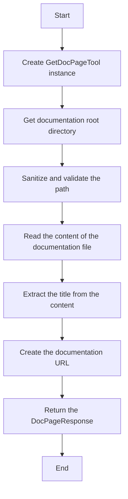

## 类结构

```
GetDocPageTool (子类, 继承自 BaseTool)
├── BaseTool (父类)
```

## 全局变量及字段


### `logger`
    
Logger instance for logging messages.

类型：`logging.Logger`
    


### `DOCS_BASE_URL`
    
Base URL for the documentation pages.

类型：`str`
    


### `GetDocPageTool.name`
    
Name of the tool, which is 'get_doc_page'.

类型：`str`
    


### `GetDocPageTool.description`
    
Description of the tool's functionality.

类型：`str`
    


### `GetDocPageTool.parameters`
    
Dictionary describing the parameters required by the tool.

类型：`dict[str, Any]`
    


### `GetDocPageTool.requires_auth`
    
Flag indicating if the tool requires authentication to access its functionality.

类型：`bool`
    


### `GetDocPageTool.name`
    
Name of the tool instance.

类型：`str`
    


### `GetDocPageTool.description`
    
Description of the tool's functionality.

类型：`str`
    


### `GetDocPageTool.parameters`
    
Dictionary describing the parameters required by the tool.

类型：`dict[str, Any]`
    


### `GetDocPageTool.requires_auth`
    
Flag indicating if the tool requires authentication to access its functionality.

类型：`bool`
    
    

## 全局函数及方法


### `_execute`

Fetch full content of a documentation page.

参数：

- `user_id`：`str | None`，User ID (not required for docs)
- `session`：`ChatSession`，Chat session
- `path`：`str`，Path to the documentation file

返回值：`ToolResponseBase`，Full document content or error message

#### 流程图

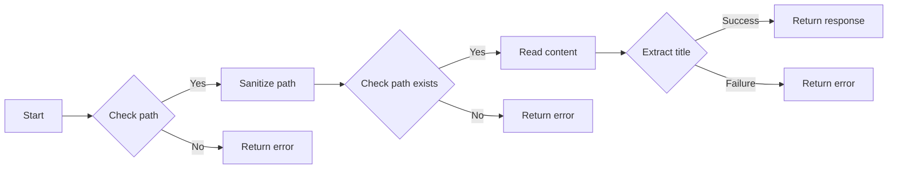

#### 带注释源码

```python
async def _execute(
    self,
    user_id: str | None,
    session: ChatSession,
    **kwargs,
) -> ToolResponseBase:
    path = kwargs.get("path", "").strip()
    session_id = session.session_id if session else None

    if not path:
        return ErrorResponse(
            message="Please provide a documentation path.",
            error="Missing path parameter",
            session_id=session_id,
        )

    # Sanitize path to prevent directory traversal
    if ".." in path or path.startswith("/"):
        return ErrorResponse(
            message="Invalid documentation path.",
            error="invalid_path",
            session_id=session_id,
        )

    docs_root = self._get_docs_root()
    full_path = docs_root / path

    if not full_path.exists():
        return ErrorResponse(
            message=f"Documentation page not found: {path}",
            error="not_found",
            session_id=session_id,
        )

    # Ensure the path is within docs root
    try:
        full_path.resolve().relative_to(docs_root.resolve())
    except ValueError:
        return ErrorResponse(
            message="Invalid documentation path.",
            error="invalid_path",
            session_id=session_id,
        )

    try:
        content = full_path.read_text(encoding="utf-8")
        title = self._extract_title(content, path)

        return DocPageResponse(
            message=f"Retrieved documentation page: {title}",
            title=title,
            path=path,
            content=content,
            doc_url=self._make_doc_url(path),
            session_id=session_id,
        )

    except Exception as e:
        logger.error(f"Failed to read documentation page {path}: {e}")
        return ErrorResponse(
            message=f"Failed to read documentation page: {str(e)}",
            error="read_failed",
            session_id=session_id,
        )
```


### `_execute`

Fetch full content of a documentation page.

参数：

- `user_id`：`str | None`，User ID (not required for docs)
- `session`：`ChatSession`，Chat session
- `path`：`str`，Path to the documentation file

返回值：`ToolResponseBase`，Full document content or error message

#### 流程图

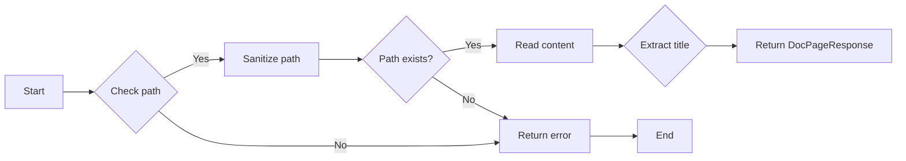

#### 带注释源码

```python
async def _execute(
    self,
    user_id: str | None,
    session: ChatSession,
    **kwargs,
) -> ToolResponseBase:
    """Fetch full content of a documentation page.

    Args:
        user_id: User ID (not required for docs)
        session: Chat session
        path: Path to the documentation file

    Returns:
        DocPageResponse: Full document content
        ErrorResponse: Error message
    """
    path = kwargs.get("path", "").strip()
    session_id = session.session_id if session else None

    if not path:
        return ErrorResponse(
            message="Please provide a documentation path.",
            error="Missing path parameter",
            session_id=session_id,
        )

    # Sanitize path to prevent directory traversal
    if ".." in path or path.startswith("/"):
        return ErrorResponse(
            message="Invalid documentation path.",
            error="invalid_path",
            session_id=session_id,
        )

    docs_root = self._get_docs_root()
    full_path = docs_root / path

    if not full_path.exists():
        return ErrorResponse(
            message=f"Documentation page not found: {path}",
            error="not_found",
            session_id=session_id,
        )

    # Ensure the path is within docs root
    try:
        full_path.resolve().relative_to(docs_root.resolve())
    except ValueError:
        return ErrorResponse(
            message="Invalid documentation path.",
            error="invalid_path",
            session_id=session_id,
        )

    try:
        content = full_path.read_text(encoding="utf-8")
        title = self._extract_title(content, path)

        return DocPageResponse(
            message=f"Retrieved documentation page: {title}",
            title=title,
            path=path,
            content=content,
            doc_url=self._make_doc_url(path),
            session_id=session_id,
        )

    except Exception as e:
        logger.error(f"Failed to read documentation page {path}: {e}")
        return ErrorResponse(
            message=f"Failed to read documentation page: {str(e)}",
            error="read_failed",
            session_id=session_id,
        )
```


### `_make_doc_url`

Create a URL for a documentation page.

参数：

- `path`：`str`，The path to the documentation file, as returned by search_docs. Example: 'platform/block-sdk-guide.md'

返回值：`str`，The URL for the documentation page.

#### 流程图

```mermaid
graph LR
A[Start] --> B{Check if path contains "."}
B -- Yes --> C[Remove last segment and append "/"]
B -- No --> C
C --> D[Concatenate with DOCS_BASE_URL]
D --> E[Return URL]
E --> F[End]
```

#### 带注释源码

```python
def _make_doc_url(self, path: str) -> str:
    """Create a URL for a documentation page."""
    url_path = path.rsplit(".", 1)[0] if "." in path else path
    return f"{DOCS_BASE_URL}/{url_path}"
```


### `_execute`

Fetch full content of a documentation page.

参数：

- `user_id`：`str | None`，User ID (not required for docs)
- `session`：`ChatSession`，Chat session
- `path`：`str`，Path to the documentation file

返回值：`ToolResponseBase`，Full document content or error message

#### 流程图


#### 带注释源码

```python
async def _execute(
    self,
    user_id: str | None,
    session: ChatSession,
    **kwargs,
) -> ToolResponseBase:
    """Fetch full content of a documentation page.

    Args:
        user_id: User ID (not required for docs)
        session: Chat session
        path: Path to the documentation file

    Returns:
        DocPageResponse: Full document content
        ErrorResponse: Error message
    """
    path = kwargs.get("path", "").strip()
    session_id = session.session_id if session else None

    if not path:
        return ErrorResponse(
            message="Please provide a documentation path.",
            error="Missing path parameter",
            session_id=session_id,
        )

    # Sanitize path to prevent directory traversal
    if ".." in path or path.startswith("/"):
        return ErrorResponse(
            message="Invalid documentation path.",
            error="invalid_path",
            session_id=session_id,
        )

    docs_root = self._get_docs_root()
    full_path = docs_root / path

    if not full_path.exists():
        return ErrorResponse(
            message=f"Documentation page not found: {path}",
            error="not_found",
            session_id=session_id,
        )

    # Ensure the path is within docs root
    try:
        full_path.resolve().relative_to(docs_root.resolve())
    except ValueError:
        return ErrorResponse(
            message="Invalid documentation path.",
            error="invalid_path",
            session_id=session_id,
        )

    try:
        content = full_path.read_text(encoding="utf-8")
        title = self._extract_title(content, path)

        return DocPageResponse(
            message=f"Retrieved documentation page: {title}",
            title=title,
            path=path,
            content=content,
            doc_url=self._make_doc_url(path),
            session_id=session_id,
        )

    except Exception as e:
        logger.error(f"Failed to read documentation page {path}: {e}")
        return ErrorResponse(
            message=f"Failed to read documentation page: {str(e)}",
            error="read_failed",
            session_id=session_id,
        )
```


### `_execute`

Fetch full content of a documentation page.

参数：

- `user_id`：`str | None`，User ID (not required for docs)
- `session`：`ChatSession`，Chat session
- `path`：`str`，Path to the documentation file

返回值：`ToolResponseBase`，Full document content or error message

#### 流程图


#### 带注释源码

```python
async def _execute(
    self,
    user_id: str | None,
    session: ChatSession,
    **kwargs,
) -> ToolResponseBase:
    path = kwargs.get("path", "").strip()
    session_id = session.session_id if session else None

    if not path:
        return ErrorResponse(
            message="Please provide a documentation path.",
            error="Missing path parameter",
            session_id=session_id,
        )

    # Sanitize path to prevent directory traversal
    if ".." in path or path.startswith("/"):
        return ErrorResponse(
            message="Invalid documentation path.",
            error="invalid_path",
            session_id=session_id,
        )

    docs_root = self._get_docs_root()
    full_path = docs_root / path

    if not full_path.exists():
        return ErrorResponse(
            message=f"Documentation page not found: {path}",
            error="not_found",
            session_id=session_id,
        )

    # Ensure the path is within docs root
    try:
        full_path.resolve().relative_to(docs_root.resolve())
    except ValueError:
        return ErrorResponse(
            message="Invalid documentation path.",
            error="invalid_path",
            session_id=session_id,
        )

    try:
        content = full_path.read_text(encoding="utf-8")
        title = self._extract_title(content, path)

        return DocPageResponse(
            message=f"Retrieved documentation page: {title}",
            title=title,
            path=path,
            content=content,
            doc_url=self._make_doc_url(path),
            session_id=session_id,
        )

    except Exception as e:
        logger.error(f"Failed to read documentation page {path}: {e}")
        return ErrorResponse(
            message=f"Failed to read documentation page: {str(e)}",
            error="read_failed",
            session_id=session_id,
        )
```


### `_execute`

Fetch full content of a documentation page.

参数：

- `user_id`：`str | None`，User ID (not required for docs)
- `session`：`ChatSession`，Chat session
- `path`：`str`，Path to the documentation file

返回值：`ToolResponseBase`，Full document content or error message

#### 流程图


#### 带注释源码

```python
async def _execute(
    self,
    user_id: str | None,
    session: ChatSession,
    **kwargs,
) -> ToolResponseBase:
    """Fetch full content of a documentation page.

    Args:
        user_id: User ID (not required for docs)
        session: Chat session
        path: Path to the documentation file

    Returns:
        DocPageResponse: Full document content
        ErrorResponse: Error message
    """
    path = kwargs.get("path", "").strip()
    session_id = session.session_id if session else None

    if not path:
        return ErrorResponse(
            message="Please provide a documentation path.",
            error="Missing path parameter",
            session_id=session_id,
        )

    # Sanitize path to prevent directory traversal
    if ".." in path or path.startswith("/"):
        return ErrorResponse(
            message="Invalid documentation path.",
            error="invalid_path",
            session_id=session_id,
        )

    docs_root = self._get_docs_root()
    full_path = docs_root / path

    if not full_path.exists():
        return ErrorResponse(
            message=f"Documentation page not found: {path}",
            error="not_found",
            session_id=session_id,
        )

    # Ensure the path is within docs root
    try:
        full_path.resolve().relative_to(docs_root.resolve())
    except ValueError:
        return ErrorResponse(
            message="Invalid documentation path.",
            error="invalid_path",
            session_id=session_id,
        )

    try:
        content = full_path.read_text(encoding="utf-8")
        title = self._extract_title(content, path)

        return DocPageResponse(
            message=f"Retrieved documentation page: {title}",
            title=title,
            path=path,
            content=content,
            doc_url=self._make_doc_url(path),
            session_id=session_id,
        )

    except Exception as e:
        logger.error(f"Failed to read documentation page {path}: {e}")
        return ErrorResponse(
            message=f"Failed to read documentation page: {str(e)}",
            error="read_failed",
            session_id=session_id,
        )
```


### `logging.getLogger`

`logging.getLogger` 是一个全局函数，用于获取或创建一个日志记录器。

描述：

获取或创建一个日志记录器，用于记录日志信息。

参数：

- `name`：`str`，指定日志记录器的名称。

返回值：`logging.Logger`，返回获取或创建的日志记录器对象。

#### 流程图

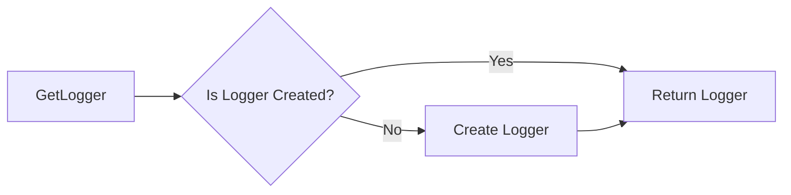

#### 带注释源码

```python
import logging

logger = logging.getLogger(__name__)
```


### `GetDocPageTool`

`GetDocPageTool` 是一个类，用于获取文档页面的完整内容。

描述：

`GetDocPageTool` 类继承自 `BaseTool` 类，用于获取文档页面的完整内容。

参数：

- 无

返回值：无

#### 流程图

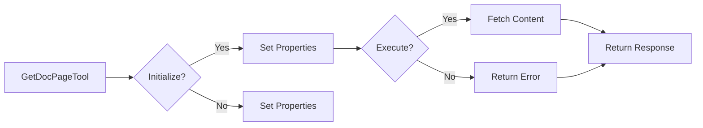

#### 带注释源码

```python
class GetDocPageTool(BaseTool):
    """Tool for fetching full content of a documentation page."""

    @property
    def name(self) -> str:
        return "get_doc_page"

    @property
    def description(self) -> str:
        return (
            "Get the full content of a documentation page by its path. "
            "Use this after search_docs to read the complete content of a relevant page."
        )

    @property
    def parameters(self) -> dict[str, Any]:
        return {
            "type": "object",
            "properties": {
                "path": {
                    "type": "string",
                    "description": (
                        "The path to the documentation file, as returned by search_docs. "
                        "Example: 'platform/block-sdk-guide.md'"
                    ),
                },
            },
            "required": ["path"],
        }

    @property
    def requires_auth(self) -> bool:
        return False  # Documentation is public

    def _get_docs_root(self) -> Path:
        """Get the documentation root directory."""
        this_file = Path(__file__)
        project_root = this_file.parent.parent.parent.parent.parent.parent.parent.parent
        return project_root / "docs"

    def _extract_title(self, content: str, fallback: str) -> str:
        """Extract title from markdown content."""
        lines = content.split("\n")
        for line in lines:
            if line.startswith("# "):
                return line[2:].strip()
        return fallback

    def _make_doc_url(self, path: str) -> str:
        """Create a URL for a documentation page."""
        url_path = path.rsplit(".", 1)[0] if "." in path else path
        return f"{DOCS_BASE_URL}/{url_path}"

    async def _execute(
        self,
        user_id: str | None,
        session: ChatSession,
        **kwargs,
    ) -> ToolResponseBase:
        """Fetch full content of a documentation page.

        Args:
            user_id: User ID (not required for docs)
            session: Chat session
            path: Path to the documentation file

        Returns:
            DocPageResponse: Full document content
            ErrorResponse: Error message
        """
        path = kwargs.get("path", "").strip()
        session_id = session.session_id if session else None

        if not path:
            return ErrorResponse(
                message="Please provide a documentation path.",
                error="Missing path parameter",
                session_id=session_id,
            )

        # Sanitize path to prevent directory traversal
        if ".." in path or path.startswith("/"):
            return ErrorResponse(
                message="Invalid documentation path.",
                error="invalid_path",
                session_id=session_id,
            )

        docs_root = self._get_docs_root()
        full_path = docs_root / path

        if not full_path.exists():
            return ErrorResponse(
                message=f"Documentation page not found: {path}",
                error="not_found",
                session_id=session_id,
            )

        # Ensure the path is within docs root
        try:
            full_path.resolve().relative_to(docs_root.resolve())
        except ValueError:
            return ErrorResponse(
                message="Invalid documentation path.",
                error="invalid_path",
                session_id=session_id,
            )

        try:
            content = full_path.read_text(encoding="utf-8")
            title = self._extract_title(content, path)

            return DocPageResponse(
                message=f"Retrieved documentation page: {title}",
                title=title,
                path=path,
                content=content,
                doc_url=self._make_doc_url(path),
                session_id=session_id,
            )

        except Exception as e:
            logger.error(f"Failed to read documentation page {path}: {e}")
            return ErrorResponse(
                message=f"Failed to read documentation page: {str(e)}",
                error="read_failed",
                session_id=session_id,
            )
```


### `_get_docs_root`

`_get_docs_root` 是 `GetDocPageTool` 类的一个私有方法，用于获取文档根目录。

描述：

获取文档根目录的路径。

参数：

- 无

返回值：`pathlib.Path`，返回文档根目录的路径。

#### 流程图

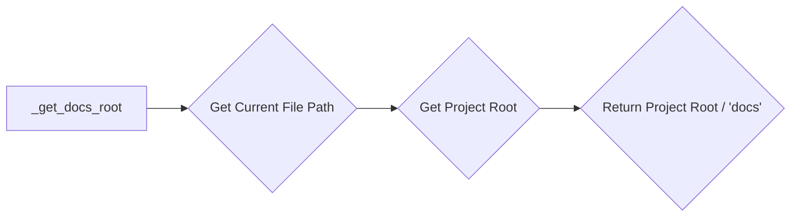

#### 带注释源码

```python
def _get_docs_root(self) -> Path:
    """Get the documentation root directory."""
    this_file = Path(__file__)
    project_root = this_file.parent.parent.parent.parent.parent.parent.parent.parent
    return project_root / "docs"
```


### `_extract_title`

`_extract_title` 是 `GetDocPageTool` 类的一个私有方法，用于从 Markdown 内容中提取标题。

描述：

从 Markdown 内容中提取标题，如果未找到标题，则返回一个后备标题。

参数：

- `content`：`str`，Markdown 内容。
- `fallback`：`str`，后备标题。

返回值：`str`，提取的标题或后备标题。

#### 流程图

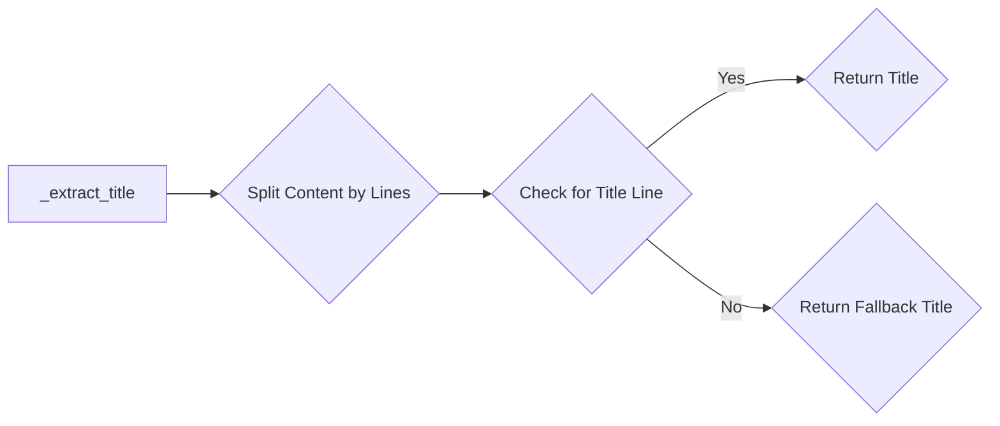

#### 带注释源码

```python
def _extract_title(self, content: str, fallback: str) -> str:
    """Extract title from markdown content."""
    lines = content.split("\n")
    for line in lines:
        if line.startswith("# "):
            return line[2:].strip()
    return fallback
```


### `_make_doc_url`

`_make_doc_url` 是 `GetDocPageTool` 类的一个私有方法，用于创建文档页面的 URL。

描述：

创建文档页面的 URL，根据提供的路径。

参数：

- `path`：`str`，文档页面的路径。

返回值：`str`，文档页面的 URL。

#### 流程图

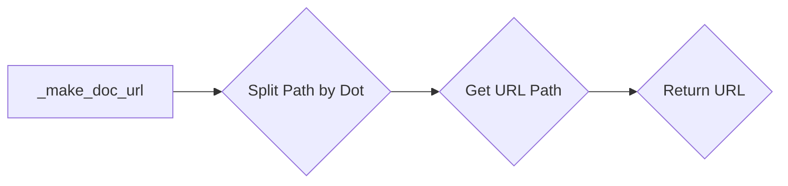

#### 带注释源码

```python
def _make_doc_url(self, path: str) -> str:
    """Create a URL for a documentation page."""
    url_path = path.rsplit(".", 1)[0] if "." in path else path
    return f"{DOCS_BASE_URL}/{url_path}"
```


### `_execute`

`_execute` 是 `GetDocPageTool` 类的一个异步方法，用于获取文档页面的完整内容。

描述：

异步方法，用于获取文档页面的完整内容。如果路径无效或文件不存在，将返回错误响应。

参数：

- `user_id`：`str | None`，用户 ID。
- `session`：`ChatSession`，聊天会话。
- `**kwargs`：`Any`，额外的关键字参数。

返回值：`ToolResponseBase`，返回文档内容或错误信息。

#### 流程图

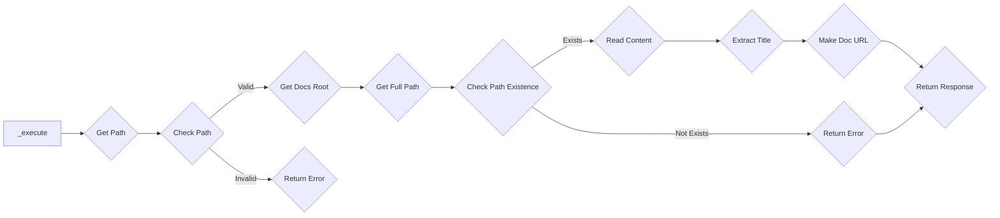

#### 带注释源码

```python
async def _execute(
    self,
    user_id: str | None,
    session: ChatSession,
    **kwargs,
) -> ToolResponseBase:
    """Fetch full content of a documentation page.

    Args:
        user_id: User ID (not required for docs)
        session: Chat session
        path: Path to the documentation file

    Returns:
        DocPageResponse: Full document content
        ErrorResponse: Error message
    """
    path = kwargs.get("path", "").strip()
    session_id = session.session_id if session else None

    if not path:
        return ErrorResponse(
            message="Please provide a documentation path.",
            error="Missing path parameter",
            session_id=session_id,
        )

    # Sanitize path to prevent directory traversal
    if ".." in path or path.startswith("/"):
        return ErrorResponse(
            message="Invalid documentation path.",
            error="invalid_path",
            session_id=session_id,
        )

    docs_root = self._get_docs_root()
    full_path = docs_root / path

    if not full_path.exists():
        return ErrorResponse(
            message=f"Documentation page not found: {path}",
            error="not_found",
            session_id=session_id,
        )

    # Ensure the path is within docs root
    try:
        full_path.resolve().relative_to(docs_root.resolve())
    except ValueError:
        return ErrorResponse(
            message="Invalid documentation path.",
            error="invalid_path",
            session_id=session_id,
        )

    try:
        content = full_path.read_text(encoding="utf-8")
        title = self._extract_title(content, path)

        return DocPageResponse(
            message=f"Retrieved documentation page: {title}",
            title=title,
            path=path,
            content=content,
            doc_url=self._make_doc_url(path),
            session_id=session_id,
        )

    except Exception as e:
        logger.error(f"Failed to read documentation page {path}: {e}")
        return ErrorResponse(
            message=f"Failed to read documentation page: {str(e)}",
            error="read_failed",
            session_id=session_id,
        )
```


### `_get_docs_root`

Get the documentation root directory.

参数：

- 无

返回值：`Path`，The documentation root directory

#### 流程图

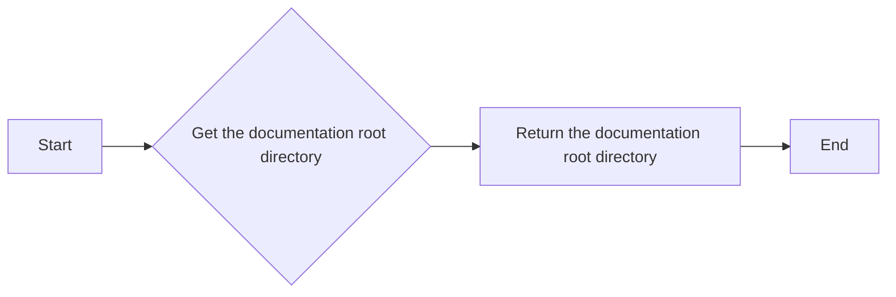

#### 带注释源码

```python
def _get_docs_root(self) -> Path:
    """Get the documentation root directory."""
    this_file = Path(__file__)
    project_root = this_file.parent.parent.parent.parent.parent.parent.parent.parent
    return project_root / "docs"
```


### `_extract_title`

Extract title from markdown content.

参数：

- `content`：`str`，Markdown content from which to extract the title.
- `fallback`：`str`，Fallback title to return if no title is found in the content.

返回值：`str`，Extracted title from the markdown content or the fallback title.

#### 流程图

```mermaid
graph LR
A[Start] --> B{Check if line starts with "# "}
B -- Yes --> C[Extract title from line]
B -- No --> D[Return fallback title]
C --> E[End]
D --> E
```

#### 带注释源码

```python
def _extract_title(self, content: str, fallback: str) -> str:
    """Extract title from markdown content."""
    lines = content.split("\n")
    for line in lines:
        if line.startswith("# "):
            return line[2:].strip()
    return fallback
```


### `_make_doc_url`

Create a URL for a documentation page.

参数：

- `path`：`str`，The path to the documentation file, as returned by search_docs. Example: 'platform/block-sdk-guide.md'

返回值：`str`，The URL for the documentation page.

#### 流程图

```mermaid
graph LR
A[Start] --> B{Check if path contains "."}
B -- Yes --> C[Remove file extension]
B -- No --> C
C --> D[Concatenate base URL with path]
D --> E[Return URL]
E --> F[End]
```

#### 带注释源码

```python
def _make_doc_url(self, path: str) -> str:
    """Create a URL for a documentation page."""
    url_path = path.rsplit(".", 1)[0] if "." in path else path
    return f"{DOCS_BASE_URL}/{url_path}"
```


### `_execute`

Fetch full content of a documentation page.

参数：

- `user_id`：`str | None`，User ID (not required for docs)
- `session`：`ChatSession`，Chat session
- `path`：`str`，Path to the documentation file

返回值：`ToolResponseBase`，Full document content or error message

#### 流程图

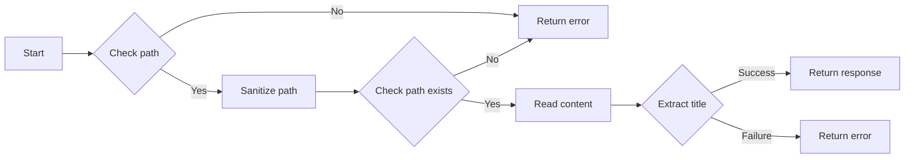

#### 带注释源码

```python
async def _execute(
    self,
    user_id: str | None,
    session: ChatSession,
    **kwargs,
) -> ToolResponseBase:
    """Fetch full content of a documentation page.

    Args:
        user_id: User ID (not required for docs)
        session: Chat session
        path: Path to the documentation file

    Returns:
        DocPageResponse: Full document content
        ErrorResponse: Error message
    """
    path = kwargs.get("path", "").strip()
    session_id = session.session_id if session else None

    if not path:
        return ErrorResponse(
            message="Please provide a documentation path.",
            error="Missing path parameter",
            session_id=session_id,
        )

    # Sanitize path to prevent directory traversal
    if ".." in path or path.startswith("/"):
        return ErrorResponse(
            message="Invalid documentation path.",
            error="invalid_path",
            session_id=session_id,
        )

    docs_root = self._get_docs_root()
    full_path = docs_root / path

    if not full_path.exists():
        return ErrorResponse(
            message=f"Documentation page not found: {path}",
            error="not_found",
            session_id=session_id,
        )

    # Ensure the path is within docs root
    try:
        full_path.resolve().relative_to(docs_root.resolve())
    except ValueError:
        return ErrorResponse(
            message="Invalid documentation path.",
            error="invalid_path",
            session_id=session_id,
        )

    try:
        content = full_path.read_text(encoding="utf-8")
        title = self._extract_title(content, path)

        return DocPageResponse(
            message=f"Retrieved documentation page: {title}",
            title=title,
            path=path,
            content=content,
            doc_url=self._make_doc_url(path),
            session_id=session_id,
        )

    except Exception as e:
        logger.error(f"Failed to read documentation page {path}: {e}")
        return ErrorResponse(
            message=f"Failed to read documentation page: {str(e)}",
            error="read_failed",
            session_id=session_id,
        )
```


## 关键组件


### 张量索引与惰性加载

用于在文档页面内容中实现高效的索引和延迟加载机制。

### 反量化支持

提供对量化策略的反量化支持，以优化性能和资源使用。

### 量化策略

定义了量化策略，用于调整文档内容的呈现和检索方式。


## 问题及建议


### 已知问题

-   **全局变量 `DOCS_BASE_URL`**：该变量硬编码了文档的基础URL，如果文档服务器的地址需要更改，则需要修改代码中的这个值。建议使用配置文件或环境变量来管理此类配置，以便于维护和扩展。
-   **路径处理**：代码中存在多个对路径的处理，包括获取文档根目录、创建文档URL和验证路径。这些操作可以封装成单独的方法，以提高代码的可读性和可维护性。
-   **异常处理**：代码中使用了通用的 `Exception` 来捕获所有可能的异常，这可能导致难以调试的问题。建议捕获更具体的异常类型，并记录详细的错误信息。
-   **日志记录**：日志记录仅记录了错误信息，建议增加对关键步骤的日志记录，以便于问题追踪和性能分析。

### 优化建议

-   **配置管理**：使用配置文件或环境变量来管理 `DOCS_BASE_URL` 和其他配置，以便于灵活配置和部署。
-   **路径处理封装**：将路径处理逻辑封装成单独的方法，如 `_validate_path`、`_get_full_path` 等，以提高代码的模块化和可读性。
-   **异常处理细化**：针对不同的操作捕获更具体的异常类型，例如 `FileNotFoundError`、`PermissionError` 等，并记录详细的错误信息。
-   **日志记录增强**：增加对关键步骤的日志记录，例如文档读取前后的路径、处理结果等，以便于问题追踪和性能分析。
-   **异步操作**：如果文档内容很大，异步读取文件可能会提高性能。可以考虑使用异步文件读取方法来优化性能。
-   **单元测试**：编写单元测试来验证代码的功能，确保代码的稳定性和可靠性。


## 其它


### 设计目标与约束

- 设计目标：
  - 提供一个工具，用于从文档中获取完整内容。
  - 确保工具能够处理文档路径的验证和错误处理。
  - 确保工具能够处理文档内容的读取和异常情况。

- 约束：
  - 文档路径必须符合特定的格式。
  - 文档内容必须以UTF-8编码读取。
  - 工具必须能够处理文件不存在或路径无效的情况。

### 错误处理与异常设计

- 错误处理：
  - 当路径参数缺失时，返回错误响应。
  - 当路径包含非法字符时，返回错误响应。
  - 当文件不存在时，返回错误响应。
  - 当读取文件时发生异常时，记录错误并返回错误响应。

- 异常设计：
  - 使用`try-except`块捕获可能发生的异常，并记录错误信息。

### 数据流与状态机

- 数据流：
  - 用户输入文档路径。
  - 工具验证路径的有效性。
  - 工具读取文档内容。
  - 工具返回文档内容或错误响应。

- 状态机：
  - 无状态机，因为工具的操作是线性的。

### 外部依赖与接口契约

- 外部依赖：
  - `logging`：用于记录错误信息。
  - `pathlib`：用于处理文件路径。
  - `typing`：用于类型注解。
  - `backend.api.features.chat.model`：用于处理聊天会话。
  - `backend.api.features.chat.tools.base`：用于工具基类。
  - `backend.api.features.chat.tools.models`：用于工具响应模型。

- 接口契约：
  - `BaseTool`：工具基类，定义了工具的基本行为。
  - `ChatSession`：聊天会话模型，用于存储会话信息。
  - `DocPageResponse`：文档页面响应模型，用于返回文档内容。
  - `ErrorResponse`：错误响应模型，用于返回错误信息。
  - `ToolResponseBase`：工具响应基类，定义了工具响应的基本结构。

    