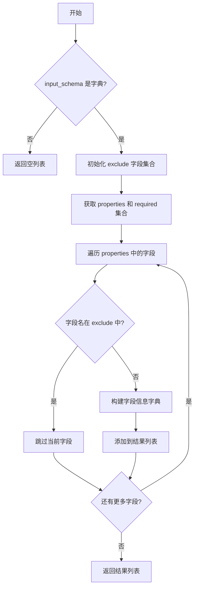

# `AutoGPT\autogpt_platform\backend\backend\api\features\chat\tools\helpers.py` 详细设计文档

该代码模块提供了一个辅助函数，用于从 JSON Schema 中提取和格式化输入字段的元数据（如名称、类型、描述及是否必填），并支持排除特定字段。

## 整体流程



## 类结构

```
Module: chat_tools
└── Functions
    └── get_inputs_from_schema
```

## 全局变量及字段


    

## 全局函数及方法


### `get_inputs_from_schema`

从 JSON schema 中提取输入字段信息，根据排除列表过滤并标准化字段属性。

参数：

- `input_schema`：`dict[str, Any]`，表示输入定义结构的 JSON schema 字典。
- `exclude_fields`：`set[str] | None`，一个可选的字段名称集合，用于从结果中排除，默认为 None。

返回值：`list[dict[str, Any]]`，包含提取的输入字段详细信息（如名称、标题、类型、描述、是否必填、默认值）的字典列表。如果输入不是字典则返回空列表。

#### 流程图

```mermaid
flowchart TD
    A[开始: get_inputs_from_schema] --> B{input_schema 是否为 dict 类型?}
    B -- 否 --> C[返回空列表 []]
    B -- 是 --> D[初始化 exclude 集合<br/>若为 None 则设为空集]
    D --> E[获取 schema 中的 properties]
    E --> F[获取 schema 中的 required<br/>并转为集合]
    F --> G[遍历 properties 中的每一项]
    G --> H{当前字段名是否在 exclude 中?}
    H -- 是 --> I[跳过该字段]
    H -- 否 --> J[构建字段字典<br/>包含 name, title, type 等]
    J --> K[将字典加入结果列表]
    I --> L[继续下一项]
    K --> L
    L --> M{是否遍历完所有字段?}
    M -- 否 --> G
    M -- 是 --> N[返回结果列表]
```

#### 带注释源码

```python
def get_inputs_from_schema(
    input_schema: dict[str, Any],
    exclude_fields: set[str] | None = None,
) -> list[dict[str, Any]]:
    """Extract input field info from JSON schema."""
    # 校验输入类型，如果不是字典则直接返回空列表
    if not isinstance(input_schema, dict):
        return []

    # 初始化排除集合，如果未提供则默认为空集合
    exclude = exclude_fields or set()
    # 从 schema 中获取属性定义对象
    properties = input_schema.get("properties", {})
    # 从 schema 中获取必填字段列表并转换为集合以便快速查找
    required = set(input_schema.get("required", []))

    # 使用列表推导式处理每个属性，生成标准化的字段信息列表
    return [
        {
            "name": name,                           # 字段名称
            "title": schema.get("title", name),     # 字段标题，默认使用 name
            "type": schema.get("type", "string"),   # 字段类型，默认为 string
            "description": schema.get("description", ""), # 字段描述
            "required": name in required,           # 是否为必填项
            "default": schema.get("default"),       # 字段默认值
        }
        # 遍历 properties 字典中的每个字段名和对应的 schema
        for name, schema in properties.items()
        # 过滤条件：排除掉在 exclude 集合中的字段
        if name not in exclude
    ]
```


## 关键组件


### get_inputs_from_schema

核心函数，负责解析 JSON Schema 定义，提取并格式化输入字段的元数据（包括名称、标题、类型、描述、是否必填及默认值），同时支持排除特定字段。

### Exclusion Filter（排除过滤器）

通过参数 `exclude_fields` 实现的逻辑组件，用于在处理 Schema 属性时过滤掉不需要出现在最终结果中的字段名称。

### Field Mapper（字段映射器）

通过列表推导式实现的转换逻辑，将原始 JSON Schema 中的属性定义映射为统一格式的字典列表，处理数据类型的默认值设置和必填状态的判定。


## 问题及建议


### 已知问题

-   不支持嵌套对象，仅能提取第一层属性，无法处理包含子对象的复杂 JSON Schema 结构。
-   当 Schema 中未定义 `type` 字段时，默认回退到 `"string"` 类型，这种静默猜测可能导致对复杂类型（如 Object 或 Array）的解析错误或下游处理逻辑的误判。
-   对输入参数的校验不够严谨，例如未检查 `required` 字段是否为列表类型，如果传入非标准格式的 Schema 可能导致运行时异常。
-   返回结果中的 `default` 字段在 Schema 未定义时会被赋值为 `None`，这可能与显式设置为 `null` 的情况混淆，且增加了返回数据的冗余度。

### 优化建议

-   引入递归逻辑或配置化深度选项，以支持提取嵌套对象或数组元素中的 Schema 信息，增强函数的通用性。
-   增强类型解析逻辑，增加对 `enum`、`oneOf`、`anyOf` 以及数组项 `items` 等高级 JSON Schema 特性的识别与处理。
-   优化返回字典的结构，仅在 Schema 中显式定义了 `default` 值时才将该字段加入结果字典，减少无意义的数据传输。
-   使用 Pydantic 模型或 TypedDict 替代 `dict[str, Any]` 作为返回类型，为提取的字段信息提供更强的类型约束和代码提示。
-   在文档字符串中明确说明该函数兼容的 JSON Schema 规范版本（如 Draft 7、2020-12 等），以及具体的字段提取优先级规则。


## 其它


### 设计目标与约束

**设计目标**：
提供一个轻量级、标准化的工具函数，用于将 JSON Schema 格式的输入定义转换为聊天工具所需的结构化列表。该函数旨在简化前端参数录入界面的构建过程，确保生成的字段元数据（如标题、类型、描述、是否必填等）符合预期格式。

**约束**：
1. **输入兼容性**：必须兼容符合 JSON Schema 标准的字典结构，但能优雅处理缺失字段（如 `required` 或 `title`）的情况。
2. **无副作用**：函数设计为纯函数，不修改输入参数，不产生外部副作用，仅基于输入计算返回值。
3. **零依赖**：除 Python 标准库 `typing` 外，不引入任何第三方库，保持轻量级。
4. **防御性编程**：当输入非字典类型时，不应抛出异常，而是返回空列表以维持系统稳定性。

### 错误处理与异常设计

**错误处理策略**：
采用防御性编程策略，避免因输入数据格式问题导致程序崩溃。

1. **输入类型校验**：函数首先检查 `input_schema` 是否为 `dict` 类型。如果不是，直接返回空列表 `[]`，而不是抛出 `TypeError`，这允许调用方在数据流中无需额外 try-catch 即可安全处理脏数据。
2. **缺失键处理**：使用 `dict.get()` 方法访问 `properties`、`required`、`title`、`type` 等键。若键不存在，返回预定义的默认值（如空集合、空字符串或 `"string"`），防止 `KeyError`。
3. **异常传播**：函数内部不主动捕获或处理所有潜在的运行时异常（如字典键对应值的类型错误导致的 `.items()` 失败），但在常规 JSON Schema 数据下预期不会触发。

**异常设计**：
本函数不定义或抛出特定的自定义异常。

### 数据流与状态机

**数据流**：
1. **输入阶段**：接收原始 JSON Schema 字典 (`input_schema`) 和需要排除的字段名集合 (`exclude_fields`)。
2. **解析阶段**：
   * 提取 `properties` 字典，作为遍历的数据源。
   * 提取 `required` 列表并转换为集合，用于后续的必填校验。
3. **转换与过滤阶段**（列表推导式）：
   * 遍历 `properties` 中的每一项。
   * 检查字段名是否在 `exclude_fields` 中，若在则跳过（过滤）。
   * 从 Schema 字典中提取元数据（title, type, description 等），并应用默认值（转换）。
   * 判断字段名是否存在于 `required` 集合中，生成布尔值。
4. **输出阶段**：返回包含标准化字段字典的列表。

**状态机**：
本模块为无状态函数，不存在内部状态转换或状态机设计。

### 外部依赖与接口契约

**外部依赖**：
*   `typing.Any`：Python 3.5+ 标准库类型提示模块，用于静态类型检查，无运行时依赖。

**接口契约**：

*   **输入参数 `input_schema`**：
  *   **类型**：`dict[str, Any]`
  *   **契约**：期望符合 JSON Schema 规范的字典对象。通常应包含 `properties` 键（值为字典），可选包含 `required` 键（值为字符串列表）。如果传入 `None` 或非字典对象，函数视为无效输入。
*   **输入参数 `exclude_fields`**：
  *   **类型**：`set[str] | None`
  *   **契约**：可选参数。提供时，应为一个字符串集合，包含需要从结果中剔除的字段名称。
*   **返回值**：
  *   **类型**：`list[dict[str, Any]]`
  *   **契约**：返回一个字典列表。每个字典代表一个输入字段，必须包含以下键：`name` (str), `title` (str), `type` (str), `description` (str), `required` (bool), `default` (Any)。如果输入无效，返回空列表。

### 线程安全与并发性

**线程安全**：
本模块仅包含纯函数（无状态函数），不依赖或修改任何共享的全局变量或外部资源。所有变量均在栈内存中分配。因此，该函数在多线程或多并发环境下调用是绝对安全的，无需加锁或其他同步机制。

**并发性**：
由于计算逻辑简单且无阻塞 I/O 操作，适合在高并发场景下调用。
    