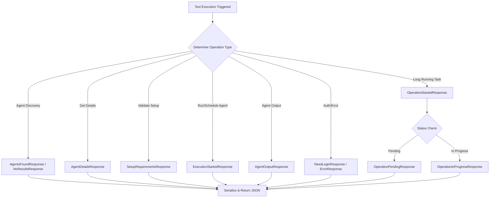

# `AutoGPT\autogpt_platform\backend\backend\api\features\chat\tools\models.py` 详细设计文档

定义了一套全面的 Pydantic 模型，用于规范化 AI Agent 平台内各类工具（如 Agent 发现、执行、文档搜索、长耗时任务等）的交互响应格式。该文件通过继承基类和枚举类型，实现了响应数据的结构化、类型安全和标准化，支持操作状态反馈、错误处理及结果展示。

## 整体流程



## 类结构

```
ResponseType (Enum)
ToolResponseBase (Abstract Base)
├── Agent Discovery
│   ├── AgentsFoundResponse
│   └── NoResultsResponse
├── Agent Details
│   └── AgentDetailsResponse
├── Setup & Validation
│   └── SetupRequirementsResponse
├── Execution
│   ├── ExecutionStartedResponse
│   └── AgentOutputResponse
├── Auth & Error
│   ├── NeedLoginResponse
│   ├── ErrorResponse
│   └── InputValidationErrorResponse
├── Business Understanding
│   ├── UnderstandingUpdatedResponse
│   ├── ClarificationNeededResponse
│   ├── AgentPreviewResponse
│   └── AgentSavedResponse
├── Documentation
│   ├── DocSearchResultsResponse
│   └── DocPageResponse
├── Block Operations
│   ├── BlockListResponse
│   └── BlockOutputResponse
└── Async Operations
    ├── OperationStartedResponse
    ├── OperationPendingResponse
    ├── OperationInProgressResponse
    └── AsyncProcessingResponse

Supporting Models (Non-Response)
├── AgentInfo
├── InputField
├── ExecutionOptions
├── AgentDetails
├── UserReadiness
├── SetupInfo
├── ExecutionOutputInfo
├── ClarifyingQuestion
├── DocSearchResult
├── BlockInputFieldInfo
└── BlockInfoSummary
```

## 全局变量及字段


### `ResponseType.AGENTS_FOUND`
    
Indicates that a search for agents returned results.

类型：`str`
    


### `ResponseType.AGENT_DETAILS`
    
Indicates a response containing detailed information about an agent.

类型：`str`
    


### `ResponseType.SETUP_REQUIREMENTS`
    
Indicates a response listing the setup requirements for an agent.

类型：`str`
    


### `ResponseType.EXECUTION_STARTED`
    
Indicates that the execution of an agent has been initiated.

类型：`str`
    


### `ResponseType.NEED_LOGIN`
    
Indicates that user authentication is required to proceed.

类型：`str`
    


### `ResponseType.ERROR`
    
Indicates that an error occurred during processing.

类型：`str`
    


### `ResponseType.NO_RESULTS`
    
Indicates that no results were found for the given query.

类型：`str`
    


### `ResponseType.AGENT_OUTPUT`
    
Indicates a response containing the output from an agent execution.

类型：`str`
    


### `ResponseType.UNDERSTANDING_UPDATED`
    
Indicates that the agent's understanding or context has been updated.

类型：`str`
    


### `ResponseType.AGENT_PREVIEW`
    
Indicates a response containing a preview of a generated agent.

类型：`str`
    


### `ResponseType.AGENT_SAVED`
    
Indicates that an agent has been successfully saved to the library.

类型：`str`
    


### `ResponseType.CLARIFICATION_NEEDED`
    
Indicates that the LLM needs more information from the user to proceed.

类型：`str`
    


### `ResponseType.BLOCK_LIST`
    
Indicates a response containing a list of available blocks.

类型：`str`
    


### `ResponseType.BLOCK_OUTPUT`
    
Indicates a response containing the output from a block execution.

类型：`str`
    


### `ResponseType.DOC_SEARCH_RESULTS`
    
Indicates a response containing results from a documentation search.

类型：`str`
    


### `ResponseType.DOC_PAGE`
    
Indicates a response containing the content of a specific documentation page.

类型：`str`
    


### `ResponseType.WORKSPACE_FILE_LIST`
    
Indicates a response containing a list of files in the workspace.

类型：`str`
    


### `ResponseType.WORKSPACE_FILE_CONTENT`
    
Indicates a response containing the content of a specific workspace file.

类型：`str`
    


### `ResponseType.WORKSPACE_FILE_METADATA`
    
Indicates a response containing metadata for a specific workspace file.

类型：`str`
    


### `ResponseType.WORKSPACE_FILE_WRITTEN`
    
Indicates that a file has been successfully written to the workspace.

类型：`str`
    


### `ResponseType.WORKSPACE_FILE_DELETED`
    
Indicates that a file has been successfully deleted from the workspace.

类型：`str`
    


### `ResponseType.OPERATION_STARTED`
    
Indicates that a long-running operation has been started.

类型：`str`
    


### `ResponseType.OPERATION_PENDING`
    
Indicates that a long-running operation is currently pending.

类型：`str`
    


### `ResponseType.OPERATION_IN_PROGRESS`
    
Indicates that a long-running operation is currently in progress.

类型：`str`
    


### `ResponseType.INPUT_VALIDATION_ERROR`
    
Indicates that there was an error validating the input fields provided.

类型：`str`
    


### `ToolResponseBase.type`
    
The type of the tool response, indicating what kind of data is being returned.

类型：`ResponseType`
    


### `ToolResponseBase.message`
    
A human-readable message associated with the response.

类型：`str`
    


### `ToolResponseBase.session_id`
    
An optional identifier for the session associated with this response.

类型：`str | None`
    


### `AgentInfo.id`
    
The unique identifier for the agent.

类型：`str`
    


### `AgentInfo.name`
    
The name of the agent.

类型：`str`
    


### `AgentInfo.description`
    
A description of what the agent does.

类型：`str`
    


### `AgentInfo.source`
    
The source of the agent, e.g., 'marketplace' or 'library'.

类型：`str`
    


### `AgentInfo.in_library`
    
Indicates whether the agent is in the user's library.

类型：`bool`
    


### `AgentInfo.creator`
    
The creator of the agent, if available.

类型：`str | None`
    


### `AgentInfo.category`
    
The category the agent belongs to.

类型：`str | None`
    


### `AgentInfo.rating`
    
The rating of the agent, if available.

类型：`float | None`
    


### `AgentInfo.runs`
    
The number of times the agent has been run, if available.

类型：`int | None`
    


### `AgentInfo.is_featured`
    
Indicates whether the agent is featured.

类型：`bool | None`
    


### `AgentInfo.status`
    
The status of the agent.

类型：`str | None`
    


### `AgentInfo.can_access_graph`
    
Indicates whether the user can access the agent's graph.

类型：`bool | None`
    


### `AgentInfo.has_external_trigger`
    
Indicates whether the agent has an external trigger.

类型：`bool | None`
    


### `AgentInfo.new_output`
    
Indicates if there is new output available for the agent.

类型：`bool | None`
    


### `AgentInfo.graph_id`
    
The unique identifier for the agent's graph.

类型：`str | None`
    


### `AgentInfo.inputs`
    
The input schema for the agent, including field names, types, and defaults.

类型：`dict[str, Any] | None`
    


### `AgentsFoundResponse.type`
    
The type of the response, fixed to AGENTS_FOUND.

类型：`ResponseType`
    


### `AgentsFoundResponse.title`
    
The title for the list of agents found.

类型：`str`
    


### `AgentsFoundResponse.agents`
    
A list of agent information objects found in the search.

类型：`list[AgentInfo]`
    


### `AgentsFoundResponse.count`
    
The number of agents found.

类型：`int`
    


### `AgentsFoundResponse.name`
    
The name of the response.

类型：`str`
    


### `NoResultsResponse.type`
    
The type of the response, fixed to NO_RESULTS.

类型：`ResponseType`
    


### `NoResultsResponse.suggestions`
    
A list of suggestions for the user when no results are found.

类型：`list[str]`
    


### `NoResultsResponse.name`
    
The name of the response.

类型：`str`
    


### `InputField.name`
    
The name of the input field.

类型：`str`
    


### `InputField.type`
    
The data type of the input field.

类型：`str`
    


### `InputField.description`
    
A description of the input field.

类型：`str`
    


### `InputField.required`
    
Indicates whether the input field is required.

类型：`bool`
    


### `InputField.default`
    
The default value for the input field.

类型：`Any | None`
    


### `InputField.options`
    
A list of valid options for the input field.

类型：`list[Any] | None`
    


### `InputField.format`
    
The format of the input field.

类型：`str | None`
    


### `ExecutionOptions.manual`
    
Indicates whether the agent can be executed manually.

类型：`bool`
    


### `ExecutionOptions.scheduled`
    
Indicates whether the agent can be scheduled for execution.

类型：`bool`
    


### `ExecutionOptions.webhook`
    
Indicates whether the agent can be triggered via a webhook.

类型：`bool`
    


### `AgentDetails.id`
    
The unique identifier for the agent.

类型：`str`
    


### `AgentDetails.name`
    
The name of the agent.

类型：`str`
    


### `AgentDetails.description`
    
A description of what the agent does.

类型：`str`
    


### `AgentDetails.in_library`
    
Indicates whether the agent is in the user's library.

类型：`bool`
    


### `AgentDetails.inputs`
    
The input schema for the agent.

类型：`dict[str, Any]`
    


### `AgentDetails.credentials`
    
A list of credentials required by the agent.

类型：`list[CredentialsMetaInput]`
    


### `AgentDetails.execution_options`
    
The available execution options for the agent.

类型：`ExecutionOptions`
    


### `AgentDetails.trigger_info`
    
Information about the agent's triggers.

类型：`dict[str, Any] | None`
    


### `AgentDetailsResponse.type`
    
The type of the response, fixed to AGENT_DETAILS.

类型：`ResponseType`
    


### `AgentDetailsResponse.agent`
    
Detailed information about the agent.

类型：`AgentDetails`
    


### `AgentDetailsResponse.user_authenticated`
    
Indicates whether the user is authenticated.

类型：`bool`
    


### `AgentDetailsResponse.graph_id`
    
The unique identifier for the agent's graph.

类型：`str | None`
    


### `AgentDetailsResponse.graph_version`
    
The version of the agent's graph.

类型：`int | None`
    


### `UserReadiness.has_all_credentials`
    
Indicates whether the user has all required credentials.

类型：`bool`
    


### `UserReadiness.missing_credentials`
    
A dictionary of missing credentials.

类型：`dict[str, Any]`
    


### `UserReadiness.ready_to_run`
    
Indicates whether the user is ready to run the agent.

类型：`bool`
    


### `SetupInfo.agent_id`
    
The unique identifier for the agent.

类型：`str`
    


### `SetupInfo.agent_name`
    
The name of the agent.

类型：`str`
    


### `SetupInfo.requirements`
    
A dictionary of setup requirements, including credentials, inputs, and execution modes.

类型：`dict[str, list[Any]]`
    


### `SetupInfo.user_readiness`
    
The user's readiness status for running the agent.

类型：`UserReadiness`
    


### `SetupRequirementsResponse.type`
    
The type of the response, fixed to SETUP_REQUIREMENTS.

类型：`ResponseType`
    


### `SetupRequirementsResponse.setup_info`
    
Complete setup information for the agent.

类型：`SetupInfo`
    


### `SetupRequirementsResponse.graph_id`
    
The unique identifier for the agent's graph.

类型：`str | None`
    


### `SetupRequirementsResponse.graph_version`
    
The version of the agent's graph.

类型：`int | None`
    


### `ExecutionStartedResponse.type`
    
The type of the response, fixed to EXECUTION_STARTED.

类型：`ResponseType`
    


### `ExecutionStartedResponse.execution_id`
    
The unique identifier for the execution.

类型：`str`
    


### `ExecutionStartedResponse.graph_id`
    
The unique identifier for the agent's graph.

类型：`str`
    


### `ExecutionStartedResponse.graph_name`
    
The name of the agent's graph.

类型：`str`
    


### `ExecutionStartedResponse.library_agent_id`
    
The unique identifier for the library agent, if applicable.

类型：`str | None`
    


### `ExecutionStartedResponse.library_agent_link`
    
A link to the library agent, if applicable.

类型：`str | None`
    


### `ExecutionStartedResponse.status`
    
The status of the execution.

类型：`str`
    


### `NeedLoginResponse.type`
    
The type of the response, fixed to NEED_LOGIN.

类型：`ResponseType`
    


### `NeedLoginResponse.agent_info`
    
Information about the agent requiring login.

类型：`dict[str, Any] | None`
    


### `ErrorResponse.type`
    
The type of the response, fixed to ERROR.

类型：`ResponseType`
    


### `ErrorResponse.error`
    
A description of the error.

类型：`str | None`
    


### `ErrorResponse.details`
    
Additional details about the error.

类型：`dict[str, Any] | None`
    


### `InputValidationErrorResponse.type`
    
The type of the response, fixed to INPUT_VALIDATION_ERROR.

类型：`ResponseType`
    


### `InputValidationErrorResponse.unrecognized_fields`
    
A list of input field names that were not recognized.

类型：`list[str]`
    


### `InputValidationErrorResponse.inputs`
    
The agent's valid input schema for reference.

类型：`dict[str, Any]`
    


### `InputValidationErrorResponse.graph_id`
    
The unique identifier for the agent's graph.

类型：`str | None`
    


### `InputValidationErrorResponse.graph_version`
    
The version of the agent's graph.

类型：`int | None`
    


### `ExecutionOutputInfo.execution_id`
    
The unique identifier for the execution.

类型：`str`
    


### `ExecutionOutputInfo.status`
    
The status of the execution.

类型：`str`
    


### `ExecutionOutputInfo.started_at`
    
The timestamp when the execution started.

类型：`datetime | None`
    


### `ExecutionOutputInfo.ended_at`
    
The timestamp when the execution ended.

类型：`datetime | None`
    


### `ExecutionOutputInfo.outputs`
    
The outputs of the execution.

类型：`dict[str, list[Any]]`
    


### `ExecutionOutputInfo.inputs_summary`
    
A summary of the inputs provided for the execution.

类型：`dict[str, Any] | None`
    


### `AgentOutputResponse.type`
    
The type of the response, fixed to AGENT_OUTPUT.

类型：`ResponseType`
    


### `AgentOutputResponse.agent_name`
    
The name of the agent.

类型：`str`
    


### `AgentOutputResponse.agent_id`
    
The unique identifier for the agent.

类型：`str`
    


### `AgentOutputResponse.library_agent_id`
    
The unique identifier for the library agent, if applicable.

类型：`str | None`
    


### `AgentOutputResponse.library_agent_link`
    
A link to the library agent, if applicable.

类型：`str | None`
    


### `AgentOutputResponse.execution`
    
Summary information about a specific execution.

类型：`ExecutionOutputInfo | None`
    


### `AgentOutputResponse.available_executions`
    
A list of available executions for the agent.

类型：`list[dict[str, Any]] | None`
    


### `AgentOutputResponse.total_executions`
    
The total number of executions for the agent.

类型：`int`
    


### `UnderstandingUpdatedResponse.type`
    
The type of the response, fixed to UNDERSTANDING_UPDATED.

类型：`ResponseType`
    


### `UnderstandingUpdatedResponse.updated_fields`
    
A list of fields that were updated in the agent's understanding.

类型：`list[str]`
    


### `UnderstandingUpdatedResponse.current_understanding`
    
The current state of the agent's understanding.

类型：`dict[str, Any]`
    


### `ClarifyingQuestion.question`
    
The question that needs user clarification.

类型：`str`
    


### `ClarifyingQuestion.keyword`
    
A keyword associated with the clarifying question.

类型：`str`
    


### `ClarifyingQuestion.example`
    
An example answer to the clarifying question.

类型：`str | None`
    


### `AgentPreviewResponse.type`
    
The type of the response, fixed to AGENT_PREVIEW.

类型：`ResponseType`
    


### `AgentPreviewResponse.agent_json`
    
The JSON representation of the generated agent.

类型：`dict[str, Any]`
    


### `AgentPreviewResponse.agent_name`
    
The name of the generated agent.

类型：`str`
    


### `AgentPreviewResponse.description`
    
A description of the generated agent.

类型：`str`
    


### `AgentPreviewResponse.node_count`
    
The number of nodes in the generated agent's graph.

类型：`int`
    


### `AgentPreviewResponse.link_count`
    
The number of links (edges) in the generated agent's graph.

类型：`int`
    


### `AgentSavedResponse.type`
    
The type of the response, fixed to AGENT_SAVED.

类型：`ResponseType`
    


### `AgentSavedResponse.agent_id`
    
The unique identifier for the saved agent.

类型：`str`
    


### `AgentSavedResponse.agent_name`
    
The name of the saved agent.

类型：`str`
    


### `AgentSavedResponse.library_agent_id`
    
The unique identifier for the library agent.

类型：`str`
    


### `AgentSavedResponse.library_agent_link`
    
A link to the library agent.

类型：`str`
    


### `AgentSavedResponse.agent_page_link`
    
A link to the agent builder/editor page.

类型：`str`
    


### `ClarificationNeededResponse.type`
    
The type of the response, fixed to CLARIFICATION_NEEDED.

类型：`ResponseType`
    


### `ClarificationNeededResponse.questions`
    
A list of questions that need user clarification.

类型：`list[ClarifyingQuestion]`
    


### `DocSearchResult.title`
    
The title of the documentation search result.

类型：`str`
    


### `DocSearchResult.path`
    
The path to the documentation page.

类型：`str`
    


### `DocSearchResult.section`
    
The section of the documentation page.

类型：`str`
    


### `DocSearchResult.snippet`
    
A short excerpt from the documentation page for UI display.

类型：`str`
    


### `DocSearchResult.score`
    
The relevance score of the search result.

类型：`float`
    


### `DocSearchResult.doc_url`
    
The URL to the documentation page.

类型：`str | None`
    


### `DocSearchResultsResponse.type`
    
The type of the response, fixed to DOC_SEARCH_RESULTS.

类型：`ResponseType`
    


### `DocSearchResultsResponse.results`
    
A list of documentation search results.

类型：`list[DocSearchResult]`
    


### `DocSearchResultsResponse.count`
    
The number of search results.

类型：`int`
    


### `DocSearchResultsResponse.query`
    
The search query that generated the results.

类型：`str`
    


### `DocPageResponse.type`
    
The type of the response, fixed to DOC_PAGE.

类型：`ResponseType`
    


### `DocPageResponse.title`
    
The title of the documentation page.

类型：`str`
    


### `DocPageResponse.path`
    
The path to the documentation page.

类型：`str`
    


### `DocPageResponse.content`
    
The full content of the documentation page.

类型：`str`
    


### `DocPageResponse.doc_url`
    
The URL to the documentation page.

类型：`str | None`
    


### `BlockInputFieldInfo.name`
    
The name of the block input field.

类型：`str`
    


### `BlockInputFieldInfo.type`
    
The data type of the block input field.

类型：`str`
    


### `BlockInputFieldInfo.description`
    
A description of the block input field.

类型：`str`
    


### `BlockInputFieldInfo.required`
    
Indicates whether the block input field is required.

类型：`bool`
    


### `BlockInputFieldInfo.default`
    
The default value for the block input field.

类型：`Any | None`
    


### `BlockInfoSummary.id`
    
The unique identifier for the block.

类型：`str`
    


### `BlockInfoSummary.name`
    
The name of the block.

类型：`str`
    


### `BlockInfoSummary.description`
    
A description of what the block does.

类型：`str`
    


### `BlockInfoSummary.categories`
    
A list of categories the block belongs to.

类型：`list[str]`
    


### `BlockInfoSummary.input_schema`
    
The input schema for the block.

类型：`dict[str, Any]`
    


### `BlockInfoSummary.output_schema`
    
The output schema for the block.

类型：`dict[str, Any]`
    


### `BlockInfoSummary.required_inputs`
    
A list of required input fields for the block.

类型：`list[BlockInputFieldInfo]`
    


### `BlockListResponse.type`
    
The type of the response, fixed to BLOCK_LIST.

类型：`ResponseType`
    


### `BlockListResponse.blocks`
    
A list of block information summaries.

类型：`list[BlockInfoSummary]`
    


### `BlockListResponse.count`
    
The number of blocks found.

类型：`int`
    


### `BlockListResponse.query`
    
The search query that generated the results.

类型：`str`
    


### `BlockListResponse.usage_hint`
    
A hint on how to execute a block from the list.

类型：`str`
    


### `BlockOutputResponse.type`
    
The type of the response, fixed to BLOCK_OUTPUT.

类型：`ResponseType`
    


### `BlockOutputResponse.block_id`
    
The unique identifier for the block.

类型：`str`
    


### `BlockOutputResponse.block_name`
    
The name of the block.

类型：`str`
    


### `BlockOutputResponse.outputs`
    
The outputs of the block execution.

类型：`dict[str, list[Any]]`
    


### `BlockOutputResponse.success`
    
Indicates whether the block execution was successful.

类型：`bool`
    


### `OperationStartedResponse.type`
    
The type of the response, fixed to OPERATION_STARTED.

类型：`ResponseType`
    


### `OperationStartedResponse.operation_id`
    
The unique identifier for the operation.

类型：`str`
    


### `OperationStartedResponse.tool_name`
    
The name of the tool that started the operation.

类型：`str`
    


### `OperationStartedResponse.task_id`
    
The unique identifier for the task, used for SSE reconnection.

类型：`str | None`
    


### `OperationPendingResponse.type`
    
The type of the response, fixed to OPERATION_PENDING.

类型：`ResponseType`
    


### `OperationPendingResponse.operation_id`
    
The unique identifier for the operation.

类型：`str`
    


### `OperationPendingResponse.tool_name`
    
The name of the tool associated with the operation.

类型：`str`
    


### `OperationInProgressResponse.type`
    
The type of the response, fixed to OPERATION_IN_PROGRESS.

类型：`ResponseType`
    


### `OperationInProgressResponse.tool_call_id`
    
The unique identifier for the tool call.

类型：`str`
    


### `AsyncProcessingResponse.type`
    
The type of the response, fixed to OPERATION_STARTED.

类型：`ResponseType`
    


### `AsyncProcessingResponse.status`
    
The status of the response, specifically 'accepted'.

类型：`str`
    


### `AsyncProcessingResponse.operation_id`
    
The unique identifier for the operation.

类型：`str | None`
    


### `AsyncProcessingResponse.task_id`
    
The unique identifier for the task.

类型：`str | None`
    
    

## 全局函数及方法


## 关键组件


### 响应类型枚举
定义了系统中所有工具响应的唯一类型标识符，用于区分不同场景下的返回消息。

### 基础响应模型
作为所有响应数据的基类，封装了通用的响应字段如类型、消息和会话ID，确保接口的一致性。

### Agent 业务模型
定义了与 Agent 相关的数据结构，包括发现、详情、输入输出、设置要求及执行结果等信息。

### 文档检索模型
封装了文档搜索结果及文档页面内容的结构，用于支持文档查询和展示功能。

### 代码块执行模型
定义了代码块列表信息及执行后输出结果的数据格式，支持代码块的查找与运行。

### 异步操作模型
定义了长时间运行任务的状态响应结构，支持操作启动、挂起、进行中及异步委托等场景的状态追踪。


## 问题及建议


### 已知问题

-   **类型定义混淆导致多态解析困难**：`AsyncProcessingResponse` 和 `OperationStartedResponse` 共享相同的 `type` 枚举值 (`OPERATION_STARTED`)，尽管它们的语义（内部后台任务 vs 外部异步接受）和用途不同。这会导致客户端在仅根据 `type` 字段进行分发处理时产生歧义。
-   **业务逻辑硬编码在数据模型中**：`BlockListResponse` 中的 `usage_hint` 字段直接硬编码了较长的说明字符串。这种做法违反了关注点分离原则，不仅使得模型臃肿，也不利于后续的国际化（i18n）或文案修改。
-   **类型安全性不足**：代码中大量使用了 `dict[str, Any]` 类型（如 `AgentInfo.inputs`、`ErrorResponse.details`、`AgentInfo.trigger_info`）。这种做法虽然提供了灵活性，但牺牲了静态类型检查的优势，增加了运行时因键名拼写错误或类型不匹配而出错的风险。
-   **字段命名缺乏一致性**：在不同的响应模型中，ID 字段的命名存在不一致，例如 `AgentOutputResponse` 使用 `agent_id`，而 `ExecutionStartedResponse` 使用 `graph_id`，同时部分模型还包含 `library_agent_id`。缺乏统一的命名约定增加了理解和使用这些模型的认知负担。

### 优化建议

-   **引入独立的枚举类型**：建议在 `ResponseType` 枚举中新增 `OPERATION_ACCEPTED` 或类似的值，专门用于 `AsyncProcessingResponse`，将其与常规后台启动的 `OPERATION_STARTED` 区分开，以确保类型判定的准确性。
-   **提取硬编码文本至配置层**：将 `BlockListResponse` 中的 `usage_hint` 字符串提取到项目的常量文件、配置文件或专门的 i18n 资源文件中，模型类应仅通过引用加载该文本。
-   **细化数据模型结构**：针对泛型字典字段（如 `inputs`、`details` 等），定义具体的 Pydantic 子模型（例如创建 `AgentInputSchema` 或 `ErrorDetail` 类）。这不仅能利用 Pydantic 的自动校验功能，还能显著提高代码的可读性和 IDE 的智能提示支持。
-   **规范 ID 字段的语义与命名**：统一审查所有模型中的 ID 字段，明确定义 `graph_id`（指运行实例/图）、`agent_id`（指代理实体）和 `library_agent_id`（指市场/库引用）的具体用途，确保命名在全局范围内保持一致和清晰。


## 其它


### 设计目标与约束

本模块旨在定义一套统一、类型安全且结构化的数据传输对象（DTO），用于标准化系统中所有工具交互的响应格式。

*   **统一性**：所有具体的工具响应必须继承自 `ToolResponseBase`，确保包含核心字段（如 `type`、`message`、`session_id`），便于前端进行通用的错误处理和会话追踪。
*   **强类型约束**：利用 Pydantic 框架进行严格的运行时数据类型验证，确保序列化/反序列化过程中的数据完整性和正确性，防止因字段类型不匹配导致的下游系统错误。
*   **JSON 序列化兼容**：所有模型必须兼容 JSON 格式，字段类型需为基础类型或可被 JSON 序列化的复杂类型，以支持 HTTP 通信和持久化存储。
*   **扩展性约束**：新增响应类型必须在 `ResponseType` 枚举中定义唯一标识，且对应的 Pydantic 模型应保持向后兼容，避免破坏现有客户端的解析逻辑。

### 错误处理与异常设计

本模块通过特定的数据模型和 Pydantic 的验证机制，构建了多层级的错误处理体系：

*   **数据验证层**：依赖 Pydantic 的自动验证机制。当传入数据不符合模型定义的类型或约束时（例如将字符串赋值给整型字段），Pydantic 会在实例化时抛出 `ValidationError`。这通常被视为系统级异常，应由全局异常处理器捕获并转化为通用的 HTTP 400 错误响应。
*   **业务逻辑错误层**：
    *   **通用错误**：使用 `ErrorResponse` 模型封装业务执行过程中发生的非预期错误，包含 `error`（错误信息）和 `details`（详细上下文）。
    *   **输入验证错误**：使用 `InputValidationErrorResponse` 模型专门处理工具输入参数不符合预期的情况，明确指出未识别的字段 (`unrecognized_fields`) 并提供正确的输入模式 (`inputs`)，辅助前端修正用户输入。
    *   **授权错误**：使用 `NeedLoginResponse` 模型处理未认证场景，提示用户进行身份验证。
*   **异步操作错误处理**：对于长时间运行的操作，设计了 `OperationPendingResponse` 和 `OperationInProgressResponse`。这些模型本身不代表错误，而是代表一种“处理中”的状态，用于避免客户端超时，允许错误在后续的异步轮询或 SSE 流中传递。

### 数据流与状态机

虽然本模块主要定义静态数据结构，但其 `ResponseType` 枚举和相关模型隐含定义了 Agent 交互的生命周期状态流转：

1.  **发现阶段**：
    *   状态：`AGENTS_FOUND` (发现可用 Agent) -> `NO_RESULTS` (无结果)
    *   数据流：`AgentsFoundResponse` 包含 Agent 列表，用户选择特定 Agent 后进入详情阶段。
2.  **配置与验证阶段**：
    *   状态：`AGENT_DETAILS` (获取详情) -> `SETUP_REQUIREMENTS` (检查依赖)
    *   数据流：`SetupRequirementsResponse` 评估用户凭证 (`UserReadiness`) 和输入需求，决定是否可以直接执行或需要登录 (`NEED_LOGIN`)。
3.  **执行阶段**：
    *   状态：`EXECUTION_STARTED` (执行开始) -> `OPERATION_PENDING` (异步挂起) / `AGENT_OUTPUT` (同步输出)
    *   数据流：对于同步执行，直接返回 `AgentOutputResponse`；对于长耗时任务，先返回 `OperationStartedResponse`，系统转入后台处理，状态变为 `PENDING`。客户端可通过 `task_id` 查询进度，直到最终转为 `AGENT_OUTPUT` 或 `ERROR`。
4.  **生成与交互阶段**：
    *   状态：`CLARIFICATION_NEEDED` (需要澄清) -> `AGENT_PREVIEW` (预览) -> `AGENT_SAVED` (保存)
    *   数据流：在 Agent 生成流程中，若信息不足返回 `ClarificationNeededResponse`；确认无误后返回 `AgentPreviewResponse`；最终保存成功返回 `AgentSavedResponse`。

### 外部依赖与接口契约

本模块作为系统接口层的数据定义核心，依赖于以下外部组件，并隐式定义了与其他服务的接口契约：

*   **外部依赖库**：
    *   **Pydantic (v2)**：核心依赖，负责数据模型的定义、验证和序列化。系统必须安装 `pydantic` 库。
    *   **Python 标准库**：`datetime`（时间处理）、`enum`（枚举定义）、`typing`（类型注解）。
*   **内部依赖**：
    *   **`backend.data.model.CredentialsMetaInput`**：模块引用了内部定义的凭证元数据模型。这意味着本模块与用户认证/凭证管理模块存在强耦合，任何 `CredentialsMetaInput` 的变更都会影响 `AgentDetails` 等相关模型的结构。
*   **接口契约**：
    *   **API 契约**：本模块中的每个 Pydantic 模型类直接对应后端 API 返回的 JSON Schema 契约。前端或客户端必须遵循此 Schema 解析响应。例如，接收到 `type: "agents_found"` 的消息时，必须预期包含 `agents`（数组）和 `count`（整数）字段。
    *   **SSE 流契约**：对于 `OperationStartedResponse` 和 `AsyncProcessingResponse`，其中的 `task_id` 字段是 SSE (Server-Sent Events) 重连机制的契约关键，客户端需使用该 ID 构造重连请求 (`GET /chat/tasks/{task_id}/stream`)。

### 扩展性设计

为了适应未来功能的快速迭代，本模块在设计上预留了扩展空间：

*   **基于枚举的扩展**：新增业务功能时，只需在 `ResponseType` 枚举中添加新的类型常量，并创建继承自 `ToolResponseBase` 的新模型类，无需修改现有的消息分发逻辑（只要分发逻辑是基于 `type` 字段动态路由的）。
*   **灵活的字典字段**：在多个模型中使用了 `dict[str, Any]` 类型（如 `AgentInfo.inputs`, `ErrorResponse.details`），这种设计允许在不修改 Pydantic 模型结构的情况下，容纳动态变化或自定义的业务数据，提供了极大的灵活性。
*   **默认工厂模式**：对于复杂对象字段（如 `ExecutionOptions`, `UserReadiness`），使用了 `Field(default_factory=...)`。这确保了在实例化父对象时，即使未显式传递子对象，也能获得结构正确的默认实例，避免了 `None` 引用错误，同时也便于未来为这些默认对象添加新的默认属性。


    