# `AutoGPT\autogpt_platform\backend\backend\api\features\chat\tools\run_agent.py` 详细设计文档

该代码实现了一个名为 RunAgentTool 的智能工具，用于统一处理 Agent 的执行和调度。它能够根据输入参数自动检测状态，验证用户身份，获取 Agent 配置（通过 ID 或 Slug），检查凭证匹配，验证输入数据，并决定是立即执行 Agent 还是通过 Cron 表达式进行调度，同时包含完善的错误处理和响应机制。

## 整体流程

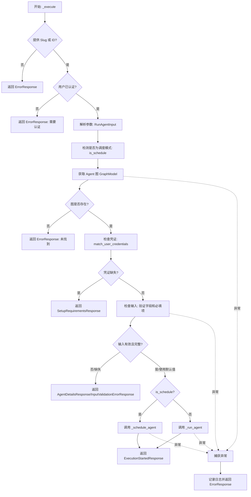

## 类结构

```
BaseModel (Pydantic)
└── RunAgentInput
BaseTool
└── RunAgentTool
```

## 全局变量及字段


### `logger`
    
Logger instance for recording module-level events and errors.

类型：`logging.Logger`
    


### `config`
    
Configuration object containing chat feature settings, such as rate limits.

类型：`ChatConfig`
    


### `MSG_DO_NOT_RUN_AGAIN`
    
Message indicating the agent should not be executed again unless explicitly requested.

类型：`str`
    


### `MSG_DO_NOT_SCHEDULE_AGAIN`
    
Message indicating the agent should not be scheduled again unless explicitly requested.

类型：`str`
    


### `MSG_ASK_USER_FOR_VALUES`
    
Message prompting the user to provide input values or confirm using defaults.

类型：`str`
    


### `MSG_WHAT_VALUES_TO_USE`
    
Message asking the user what values to use or if they want to proceed with defaults.

类型：`str`
    


### `RunAgentInput.username_agent_slug`
    
Identifier for the marketplace agent in the format 'username/agent-name'.

类型：`str`
    


### `RunAgentInput.library_agent_id`
    
Identifier for an agent saved in the user's personal library.

类型：`str`
    


### `RunAgentInput.inputs`
    
Dictionary containing the input values to pass to the agent for execution.

类型：`dict[str, Any]`
    


### `RunAgentInput.use_defaults`
    
Flag indicating whether to run the agent using default input values.

类型：`bool`
    


### `RunAgentInput.schedule_name`
    
Name assigned to the scheduled execution task.

类型：`str`
    


### `RunAgentInput.cron`
    
Cron expression defining the frequency and timing of the scheduled execution.

类型：`str`
    


### `RunAgentInput.timezone`
    
IANA timezone string for the schedule, defaulting to 'UTC'.

类型：`str`
    
    

## 全局函数及方法


### `RunAgentInput.strip_strings`

该方法是 `RunAgentInput` 类的一个 Pydantic 字段验证器，用于在模型验证之前去除指定字符串字段首尾的空白字符，以确保输入数据的规范性。

参数：

-   `cls`：`type`，类方法隐含的类参数，指代 `RunAgentInput` 类本身。
-   `v`：`Any`，待验证和处理的输入字段值。

返回值：`Any`，如果输入值 `v` 是字符串类型，则返回去除首尾空格后的字符串；否则原样返回 `v`。

#### 流程图

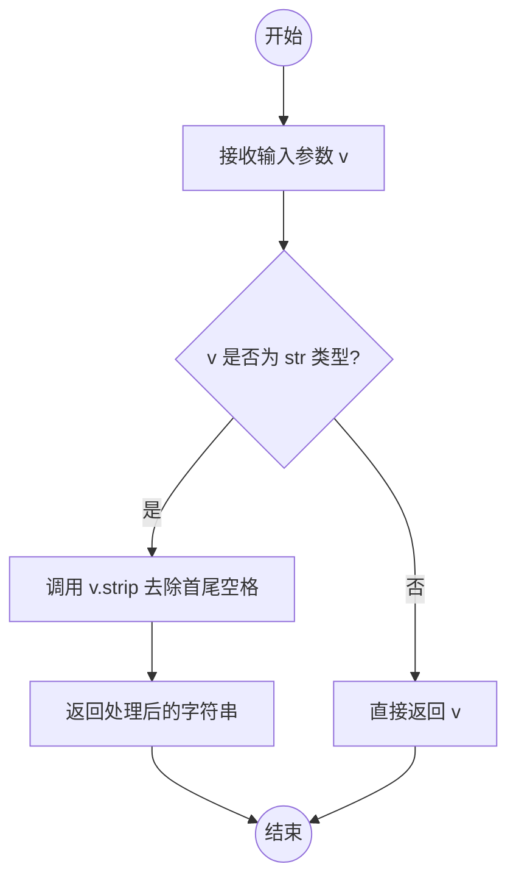

#### 带注释源码

```python
    @classmethod
    def strip_strings(cls, v: Any) -> Any:
        """Strip whitespace from string fields."""
        # 使用三元表达式检查输入值 v 是否为字符串类型
        # 如果是字符串，调用 strip() 去除首尾空白
        # 如果不是字符串（如 None 或数字），则原样返回，避免抛出异常
        return v.strip() if isinstance(v, str) else v
```


### `RunAgentTool.name`

RunAgentTool 类的属性方法，用于返回该工具的名称标识符。

参数：

- `self`：`RunAgentTool`，类实例本身，通过属性装饰器隐式传递。

返回值：`str`，返回固定的字符串 "run_agent"，作为该工具的唯一名称标识。

#### 流程图

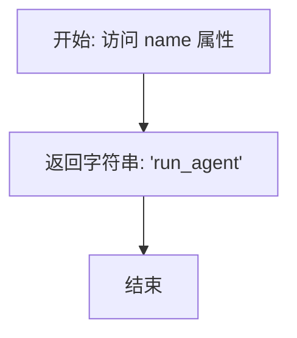

#### 带注释源码

```python
@property
def name(self) -> str:
    # 定义工具的名称标识符
    return "run_agent"
```


### `RunAgentTool.description`

该属性是一个 Python 装饰器方法（`@property`），用于返回 `RunAgentTool` 工具的功能描述字符串。它详细说明了该工具如何运行或调度智能体，以及如何处理缺失的输入或凭据等情况。

参数：

-  无

返回值：`str`，包含工具详细使用说明的多行字符串，涵盖了工具的核心功能、自动处理流程、智能体标识方式及调度所需参数。

#### 流程图

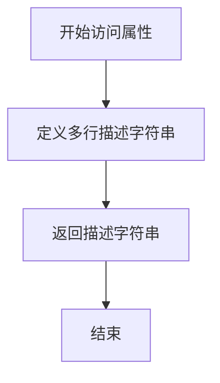

#### 带注释源码

```python
@property
def description(self) -> str:
    # 返回工具的详细功能描述，用于告知使用者（如LLM）该工具的作用和使用方式
    return """Run or schedule an agent from the marketplace or user's library.

    The tool automatically handles the setup flow:
    - Returns missing inputs if required fields are not provided
    - Returns missing credentials if user needs to configure them
    - Executes immediately if all requirements are met
    - Schedules execution if cron expression is provided

    Identify the agent using either:
    - username_agent_slug: Marketplace format 'username/agent-name'
    - library_agent_id: ID of an agent in the user's library

    For scheduled execution, provide: schedule_name, cron, and optionally timezone."""
```


### `RunAgentTool.parameters`

定义并返回 `run_agent` 工具的参数 JSON Schema，包含所有支持的字段如代理标识、输入、执行选项及调度配置。

参数：

*   无 (该方法为属性 getter，无输入参数)

返回值：`dict[str, Any]`，包含参数定义的字典，遵循 JSON Schema 格式，描述了工具所需的输入结构。

#### 流程图

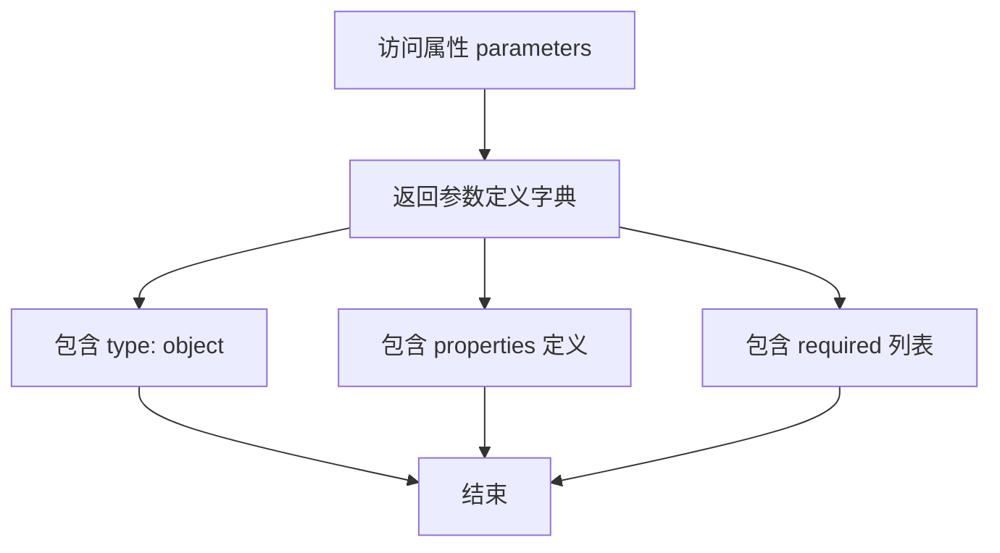

#### 带注释源码

```python
@property
def parameters(self) -> dict[str, Any]:
    # 返回符合 JSON Schema 规范的字典，用于定义工具的参数结构
    return {
        "type": "object",
        "properties": {
            # 市场中的代理标识符，格式为 'username/agent-name'
            "username_agent_slug": {
                "type": "string",
                "description": "Agent identifier in format 'username/agent-name'",
            },
            # 用户库中的代理 ID
            "library_agent_id": {
                "type": "string",
                "description": "Library agent ID from user's library",
            },
            # 运行代理所需的输入数据对象
            "inputs": {
                "type": "object",
                "description": "Input values for the agent",
                "additionalProperties": True,
            },
            # 布尔值，指示是否使用默认值运行
            "use_defaults": {
                "type": "boolean",
                "description": "Set to true to run with default values (user must confirm)",
            },
            # 调度任务的名称（提供此字段将触发调度模式）
            "schedule_name": {
                "type": "string",
                "description": "Name for scheduled execution (triggers scheduling mode)",
            },
            # Cron 表达式，用于定义调度时间
            "cron": {
                "type": "string",
                "description": "Cron expression (5 fields: min hour day month weekday)",
            },
            # IANA 时区标识符，用于调度时间的解释，默认为 UTC
            "timezone": {
                "type": "string",
                "description": "IANA timezone for schedule (default: UTC)",
            },
        },
        # 必填字段列表，当前为空表示所有字段都是可选的
        "required": [],
    }
```


### `RunAgentTool.requires_auth`

该属性方法用于指示当前工具是否需要进行身份验证。由于 `RunAgentTool` 的核心功能涉及运行或调度属于特定用户的 Agent，所有操作均受权限保护，因此该方法固定返回 True，强制要求调用者必须已认证。

参数：

-  `self`：`RunAgentTool`，类实例自身的引用。

返回值：`bool`，返回值固定为 `True`，表示必须进行身份验证。

#### 流程图

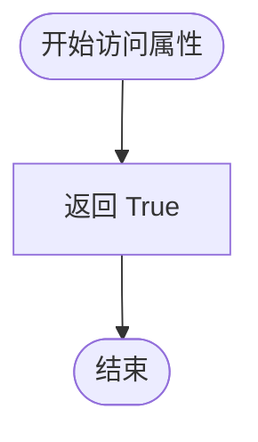

#### 带注释源码

```python
    @property
    def requires_auth(self) -> bool:
        """All operations require authentication."""
        # 固定返回 True，表明该工具的任何执行都需要有效的用户身份
        return True
```


### `RunAgentTool._execute`

Execute the tool with automatic state detection, handling agent fetching, credential validation, input checking, and either immediate execution or scheduling based on the provided parameters.

参数：

-   `user_id`：`str | None`，The unique identifier of the user initiating the request.
-   `session`：`ChatSession`，The current chat session object containing session-specific state (e.g., rate limits).
-   `**kwargs`：`Any`，Additional keyword arguments encapsulating the tool input parameters (e.g., `username_agent_slug`, `library_agent_id`, `inputs`, `schedule_name`, `cron`).

返回值：`ToolResponseBase`，A response object indicating the outcome, which could be an `ErrorResponse` for failures, `SetupRequirementsResponse` or `AgentDetailsResponse` for missing info, or `ExecutionStartedResponse` upon success.

#### 流程图

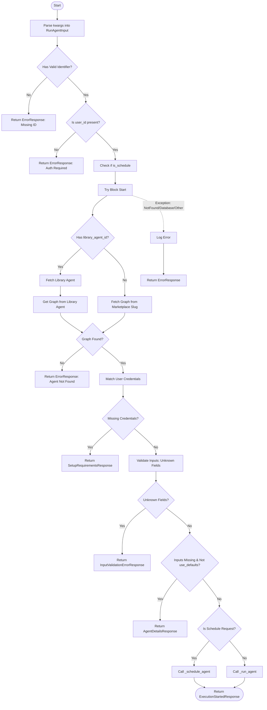

#### 带注释源码

```python
    async def _execute(
        self,
        user_id: str | None,
        session: ChatSession,
        **kwargs,
    ) -> ToolResponseBase:
        """Execute the tool with automatic state detection."""
        # Parse and validate the incoming keyword arguments against the RunAgentInput schema
        params = RunAgentInput(**kwargs)
        session_id = session.session_id

        # Validate at least one identifier is provided (slug or library ID)
        has_slug = params.username_agent_slug and "/" in params.username_agent_slug
        has_library_id = bool(params.library_agent_id)

        if not has_slug and not has_library_id:
            return ErrorResponse(
                message=(
                    "Please provide either a username_agent_slug "
                    "(format 'username/agent-name') or a library_agent_id"
                ),
                session_id=session_id,
            )

        # Ensure the user is authenticated
        if not user_id:
            return ErrorResponse(
                message="Authentication required. Please sign in to use this tool.",
                session_id=session_id,
            )

        # Determine if the request is for scheduling or immediate execution
        is_schedule = bool(params.schedule_name or params.cron)

        try:
            # Step 1: Fetch agent details
            graph: GraphModel | None = None
            library_agent = None

            # Priority: use library_agent_id if provided
            if has_library_id:
                library_agent = await library_db.get_library_agent(
                    params.library_agent_id, user_id
                )
                if not library_agent:
                    return ErrorResponse(
                        message=f"Library agent '{params.library_agent_id}' not found",
                        session_id=session_id,
                    )
                # Retrieve the graph structure associated with the library agent
                from backend.data.graph import get_graph

                graph = await get_graph(
                    library_agent.graph_id,
                    library_agent.graph_version,
                    user_id=user_id,
                )
            else:
                # Otherwise, fetch from the marketplace using the slug
                username, agent_name = params.username_agent_slug.split("/", 1)
                graph, _ = await fetch_graph_from_store_slug(username, agent_name)

            # Verify that a graph was successfully retrieved
            if not graph:
                identifier = (
                    params.library_agent_id
                    if has_library_id
                    else params.username_agent_slug
                )
                return ErrorResponse(
                    message=f"Agent '{identifier}' not found",
                    session_id=session_id,
                )

            # Step 2: Check credentials
            # Match available user credentials against what the graph requires
            graph_credentials, missing_creds = await match_user_credentials_to_graph(
                user_id, graph
            )

            if missing_creds:
                # If credentials are missing, return details on what is needed
                requirements_creds_dict = build_missing_credentials_from_graph(
                    graph, None
                )
                missing_credentials_dict = build_missing_credentials_from_graph(
                    graph, graph_credentials
                )
                requirements_creds_list = list(requirements_creds_dict.values())

                return SetupRequirementsResponse(
                    message=self._build_inputs_message(graph, MSG_WHAT_VALUES_TO_USE),
                    session_id=session_id,
                    setup_info=SetupInfo(
                        agent_id=graph.id,
                        agent_name=graph.name,
                        user_readiness=UserReadiness(
                            has_all_credentials=False,
                            missing_credentials=missing_credentials_dict,
                            ready_to_run=False,
                        ),
                        requirements={
                            "credentials": requirements_creds_list,
                            "inputs": get_inputs_from_schema(graph.input_schema),
                            "execution_modes": self._get_execution_modes(graph),
                        },
                    ),
                    graph_id=graph.id,
                    graph_version=graph.version,
                )

            # Step 3: Check inputs
            # Extract input schema properties and required fields
            input_properties = graph.input_schema.get("properties", {})
            required_fields = set(graph.input_schema.get("required", []))
            provided_inputs = set(params.inputs.keys())
            valid_fields = set(input_properties.keys())

            # Check for fields that do not exist in the schema
            unrecognized_fields = provided_inputs - valid_fields
            if unrecognized_fields:
                return InputValidationErrorResponse(
                    message=(
                        f"Unknown input field(s) provided: {', '.join(sorted(unrecognized_fields))}. "
                        f"Agent was not executed. Please use the correct field names from the schema."
                    ),
                    session_id=session_id,
                    unrecognized_fields=sorted(unrecognized_fields),
                    inputs=graph.input_schema,
                    graph_id=graph.id,
                    graph_version=graph.version,
                )

            # If inputs are required but none were provided (and use_defaults is false),
            # ask the user to provide them.
            if input_properties and not provided_inputs and not params.use_defaults:
                credentials = extract_credentials_from_schema(
                    graph.credentials_input_schema
                )
                return AgentDetailsResponse(
                    message=self._build_inputs_message(graph, MSG_ASK_USER_FOR_VALUES),
                    session_id=session_id,
                    agent=self._build_agent_details(graph, credentials),
                    user_authenticated=True,
                    graph_id=graph.id,
                    graph_version=graph.version,
                )

            # Check for missing required inputs (if not using defaults)
            missing_inputs = required_fields - provided_inputs

            if missing_inputs and not params.use_defaults:
                # Return details indicating which inputs are missing
                credentials = extract_credentials_from_schema(
                    graph.credentials_input_schema
                )
                return AgentDetailsResponse(
                    message=(
                        f"Agent '{graph.name}' is missing required inputs: "
                        f"{', '.join(missing_inputs)}. "
                        "Please provide these values to run the agent."
                    ),
                    session_id=session_id,
                    agent=self._build_agent_details(graph, credentials),
                    user_authenticated=True,
                    graph_id=graph.id,
                    graph_version=graph.version,
                )

            # Step 4: Execute or Schedule
            if is_schedule:
                return await self._schedule_agent(
                    user_id=user_id,
                    session=session,
                    graph=graph,
                    graph_credentials=graph_credentials,
                    inputs=params.inputs,
                    schedule_name=params.schedule_name,
                    cron=params.cron,
                    timezone=params.timezone,
                )
            else:
                return await self._run_agent(
                    user_id=user_id,
                    session=session,
                    graph=graph,
                    graph_credentials=graph_credentials,
                    inputs=params.inputs,
                )

        except NotFoundError as e:
            return ErrorResponse(
                message=f"Agent '{params.username_agent_slug}' not found",
                error=str(e) if str(e) else "not_found",
                session_id=session_id,
            )
        except DatabaseError as e:
            logger.error(f"Database error: {e}", exc_info=True)
            return ErrorResponse(
                message=f"Failed to process request: {e!s}",
                error=str(e),
                session_id=session_id,
            )
        except Exception as e:
            logger.error(f"Error processing agent request: {e}", exc_info=True)
            return ErrorResponse(
                message=f"Failed to process request: {e!s}",
                error=str(e),
                session_id=session_id,
            )
```


### `RunAgentTool._get_execution_modes`

该方法用于根据代理的触发器配置信息，判断该代理支持的运行模式。如果代理配置了特定的触发器（如Webhook），则仅支持Webhook模式；否则支持手动运行和定时调度模式。

参数：

-  `graph`：`GraphModel`，包含代理配置信息的图模型对象，用于检查触发器设置。

返回值：`list[str]`，包含支持的运行模式字符串的列表，可能的值为 "manual", "scheduled" 或 "webhook"。

#### 流程图

```mermaid
flowchart TD
    A[开始: _get_execution_modes] --> B[获取 graph.trigger_setup_info]
    B --> C{trigger_setup_info 是否为 None?}
    C -- 是 (无特定触发器) --> D[返回 ['manual', 'scheduled']]
    C -- 否 (存在触发器配置) --> E[返回 ['webhook']]
```

#### 带注释源码

```python
def _get_execution_modes(self, graph: GraphModel) -> list[str]:
    """Get available execution modes for the graph."""
    # 获取图对象中的触发器设置信息
    trigger_info = graph.trigger_setup_info
    
    # 如果触发器信息为空，说明该代理不是专门为外部触发设计的
    # 因此支持手动执行和定时调度执行
    if trigger_info is None:
        return ["manual", "scheduled"]
    
    # 如果存在触发器信息（通常指Webhook配置），则该代理仅支持Webhook触发模式
    return ["webhook"]
```


### `RunAgentTool._build_inputs_message`

根据代理的输入Schema构建描述可用输入的提示信息，区分必填和可选字段。

参数：

-  `graph`：`GraphModel`，包含输入定义的代理图模型对象。
-  `suffix`：`str`，追加到消息末尾的后缀文本（通常是提示用户提供值的操作指令）。

返回值：`str`，构建好的描述输入参数的字符串消息。

#### 流程图

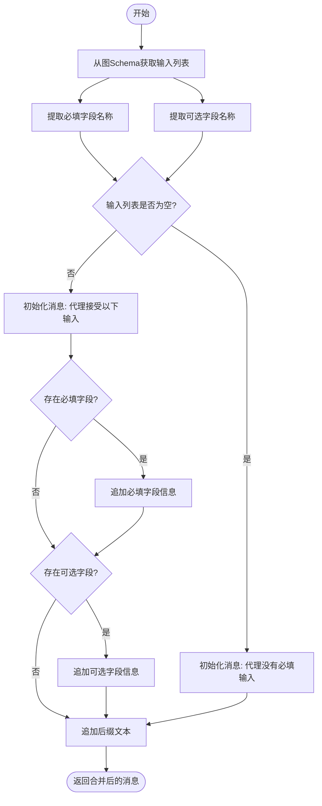

#### 带注释源码

```python
def _build_inputs_message(
    self,
    graph: GraphModel,
    suffix: str,
) -> str:
    """Build a message describing available inputs for an agent."""
    # 从图的输入Schema中提取标准化的输入列表
    inputs_list = get_inputs_from_schema(graph.input_schema)
    # 筛选出所有标记为必填的字段名称
    required_names = [i["name"] for i in inputs_list if i["required"]]
    # 筛选出所有标记为可选的字段名称（非必填）
    optional_names = [i["name"] for i in inputs_list if not i["required"]]

    # 初始化消息列表，起始内容为代理名称
    message_parts = [f"Agent '{graph.name}' accepts the following inputs:"]
    
    # 如果存在必填字段，将其添加到消息中
    if required_names:
        message_parts.append(f"Required: {', '.join(required_names)}.")
    
    # 如果存在可选字段，将其添加到消息中
    if optional_names:
        message_parts.append(
            f"Optional (have defaults): {', '.join(optional_names)}."
        )
    
    # 如果没有任何输入字段，则重置消息内容为提示无必填输入
    if not inputs_list:
        message_parts = [f"Agent '{graph.name}' has no required inputs."]
    
    # 将传入的后缀（通常是操作提示）追加到消息末尾
    message_parts.append(suffix)

    # 将所有消息部分用空格连接并返回
    return " ".join(message_parts)
```


### `RunAgentTool._build_agent_details`

该方法负责将底层的 `GraphModel` 对象转换为统一的 `AgentDetails` 数据结构，用于在前端展示或响应中描述代理的配置信息。它聚合了代理的基本信息、输入模式、凭据需求以及支持的执行模式。

参数：

-  `graph`：`GraphModel`，包含代理元数据、输入模式及触发器配置的图模型对象。
-  `credentials`：`list[CredentialsMetaInput]`，该代理所需的凭据元数据列表。

返回值：`AgentDetails`，包含代理ID、名称、描述、输入定义、凭据及执行选项的详细信息对象。

#### 流程图

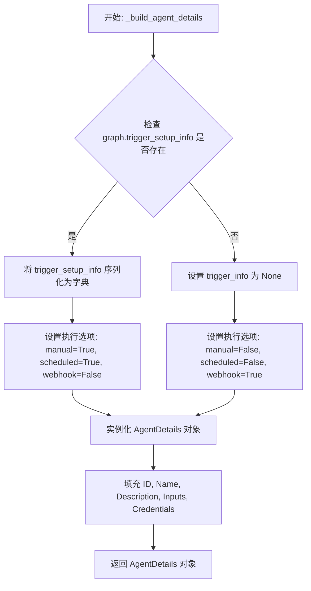

#### 带注释源码

```python
    def _build_agent_details(
        self,
        graph: GraphModel,
        credentials: list[CredentialsMetaInput],
    ) -> AgentDetails:
        """Build AgentDetails from a graph."""
        # 检查图中是否包含触发器设置信息。
        # 如果存在，将其转换为字典格式；否则设为 None。
        trigger_info = (
            graph.trigger_setup_info.model_dump() if graph.trigger_setup_info else None
        )
        
        # 构建并返回 AgentDetails 实例。
        # 包含代理的基本属性、输入Schema、凭据信息以及执行选项。
        return AgentDetails(
            id=graph.id,                      # 代理的唯一标识符
            name=graph.name,                  # 代理的显示名称
            description=graph.description,    # 代理的功能描述
            inputs=graph.input_schema,        # 代理所需的输入数据结构定义
            credentials=credentials,          # 代理所需的凭据列表
            execution_options=ExecutionOptions(
                # 如果没有触发器信息，则支持手动执行和定时执行
                manual=trigger_info is None,
                scheduled=trigger_info is None,
                # 如果有触发器信息，则支持 Webhook 执行
                webhook=trigger_info is not None,
            ),
            trigger_info=trigger_info,        # 触发器的具体配置信息（可能为空）
        )
```


### `RunAgentTool._run_agent`

立即执行一个代理。

参数：

-   `user_id`：`str`，执行操作的用户的唯一标识符。
-   `session`：`ChatSession`，当前的聊天会话对象，包含会话状态和ID。
-   `graph`：`GraphModel`，待执行的代理图模型数据。
-   `graph_credentials`：`dict[str, CredentialsMetaInput]`，代理所需的已验证凭证字典。
-   `inputs`：`dict[str, Any]`，传递给代理执行时的输入数据。

返回值：`ToolResponseBase`，包含执行开始后的详情（如执行ID、链接等）的响应对象，如果达到速率限制则返回错误响应。

#### 流程图

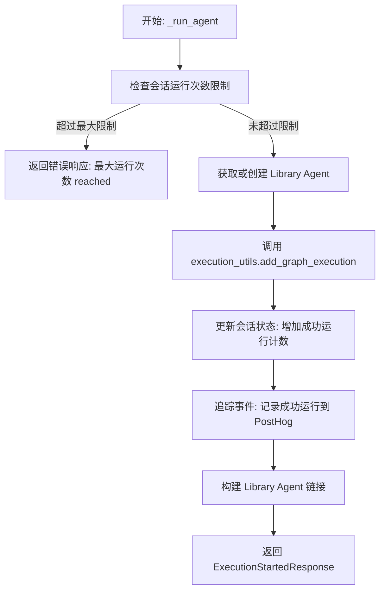

#### 带注释源码

```python
    async def _run_agent(
        self,
        user_id: str,
        session: ChatSession,
        graph: GraphModel,
        graph_credentials: dict[str, CredentialsMetaInput],
        inputs: dict[str, Any],
    ) -> ToolResponseBase:
        """Execute an agent immediately."""
        session_id = session.session_id

        # 检查速率限制：防止在单个会话中过度运行同一代理
        if session.successful_agent_runs.get(graph.id, 0) >= config.max_agent_runs:
            return ErrorResponse(
                message="Maximum agent runs reached for this session. Please try again later.",
                session_id=session_id,
            )

        # 获取或创建库中的代理记录
        # 这确保了执行上下文中有一个关联的库条目
        library_agent = await get_or_create_library_agent(graph, user_id)

        # 执行代理图
        # 将输入和凭证传递给执行工具
        execution = await execution_utils.add_graph_execution(
            graph_id=library_agent.graph_id,
            user_id=user_id,
            inputs=inputs,
            graph_credentials_inputs=graph_credentials,
        )

        # 更新会话状态，记录此次成功运行
        session.successful_agent_runs[library_agent.graph_id] = (
            session.successful_agent_runs.get(library_agent.graph_id, 0) + 1
        )

        # 追踪分析数据（如 PostHog），记录代理运行成功的指标
        track_agent_run_success(
            user_id=user_id,
            session_id=session_id,
            graph_id=library_agent.graph_id,
            graph_name=library_agent.name,
            execution_id=execution.id,
            library_agent_id=library_agent.id,
        )

        # 生成用户可访问的库代理链接
        library_agent_link = f"/library/agents/{library_agent.id}"

        # 返回执行开始的响应，包含执行详情和提示信息
        return ExecutionStartedResponse(
            message=(
                f"Agent '{library_agent.name}' execution started successfully. "
                f"View at {library_agent_link}. "
                f"{MSG_DO_NOT_RUN_AGAIN}"
            ),
            session_id=session_id,
            execution_id=execution.id,
            graph_id=library_agent.graph_id,
            graph_name=library_agent.name,
            library_agent_id=library_agent.id,
            library_agent_link=library_agent_link,
        )
```


### `RunAgentTool._schedule_agent`

Set up scheduled execution for an agent. This method validates the necessary scheduling parameters, checks rate limits within the current session, ensures the agent exists in the user's library, creates the schedule via the scheduler client, and tracks the event.

参数：

-  `user_id`：`str`，执行调度操作的用户 ID
-  `session`：`ChatSession`，当前的聊天会话对象，用于状态跟踪和速率限制
-  `graph`：`GraphModel`，要调度的 Agent 的图模型
-  `graph_credentials`：`dict[str, CredentialsMetaInput]`，图执行所需的凭据映射
-  `inputs`：`dict[str, Any]`，传递给 Agent 的输入数据
-  `schedule_name`：`str`，调度任务的名称
-  `cron`：`str`，Cron 表达式字符串，定义执行时间
-  `timezone`：`str`，时区字符串

返回值：`ToolResponseBase`，包含调度成功详情的响应对象，具体为 `ExecutionStartedResponse`

#### 流程图

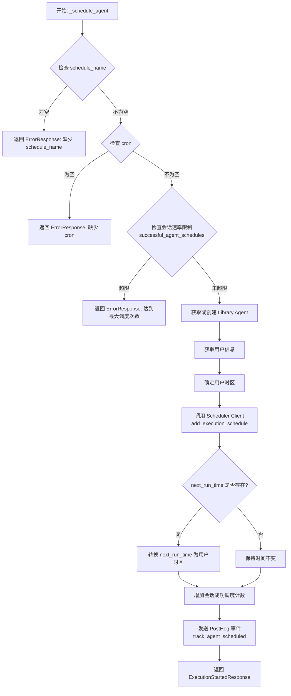

#### 带注释源码

```python
    async def _schedule_agent(
        self,
        user_id: str,
        session: ChatSession,
        graph: GraphModel,
        graph_credentials: dict[str, CredentialsMetaInput],
        inputs: dict[str, Any],
        schedule_name: str,
        cron: str,
        timezone: str,
    ) -> ToolResponseBase:
        """Set up scheduled execution for an agent."""
        session_id = session.session_id

        # 验证调度参数：必须提供 schedule_name
        if not schedule_name:
            return ErrorResponse(
                message="schedule_name is required for scheduled execution",
                session_id=session_id,
            )
        # 验证调度参数：必须提供 cron 表达式
        if not cron:
            return ErrorResponse(
                message="cron expression is required for scheduled execution",
                session_id=session_id,
            )

        # 检查速率限制：当前会话对该 Agent 的调度次数是否已达到上限
        if (
            session.successful_agent_schedules.get(graph.id, 0)
            >= config.max_agent_schedules
        ):
            return ErrorResponse(
                message="Maximum agent schedules reached for this session.",
                session_id=session_id,
            )

        # 确保该 Agent 存在于用户的库中，如果不存在则创建
        library_agent = await get_or_create_library_agent(graph, user_id)

        # 获取用户信息以确定时区偏好
        user = await get_user_by_id(user_id)
        user_timezone = get_user_timezone_or_utc(user.timezone if user else timezone)

        # 调用调度器客户端创建执行计划
        result = await get_scheduler_client().add_execution_schedule(
            user_id=user_id,
            graph_id=library_agent.graph_id,
            graph_version=library_agent.graph_version,
            name=schedule_name,
            cron=cron,
            input_data=inputs,
            input_credentials=graph_credentials,
            user_timezone=user_timezone,
        )

        # 如果调度结果包含下次运行时间，将其转换为用户所在时区以便显示
        if result.next_run_time:
            result.next_run_time = convert_utc_time_to_user_timezone(
                result.next_run_time, user_timezone
            )

        # 更新会话状态：增加该 Agent 的成功调度计数
        session.successful_agent_schedules[library_agent.graph_id] = (
            session.successful_agent_schedules.get(library_agent.graph_id, 0) + 1
        )

        # 数据埋点：记录调度成功事件到 PostHog
        track_agent_scheduled(
            user_id=user_id,
            session_id=session_id,
            graph_id=library_agent.graph_id,
            graph_name=library_agent.name,
            schedule_id=result.id,
            schedule_name=schedule_name,
            cron=cron,
            library_agent_id=library_agent.id,
        )

        # 构建返回链接
        library_agent_link = f"/library/agents/{library_agent.id}"
        # 返回执行开始响应
        return ExecutionStartedResponse(
            message=(
                f"Agent '{library_agent.name}' scheduled successfully as '{schedule_name}'. "
                f"View at {library_agent_link}. "
                f"{MSG_DO_NOT_SCHEDULE_AGAIN}"
            ),
            session_id=session_id,
            execution_id=result.id,
            graph_id=library_agent.graph_id,
            graph_name=library_agent.name,
            library_agent_id=library_agent.id,
            library_agent_link=library_agent_link,
        )
```


## 关键组件


### RunAgentTool
统一处理代理运行与调度的核心工具类，支持自动状态检测、凭证验证和输入校验，决定是执行代理、调度任务还是返回缺失配置信息。

### RunAgentInput
输入参数数据模型，封装了代理标识符、运行输入、默认值开关以及调度相关的 Cron 和时区配置，并包含字符串字段清洗逻辑。

### Automatic State Detection Logic
自动状态检测逻辑，依据代理的凭证完备性和输入参数的有效性，自动判定当前应处于配置信息展示、立即执行还是定时调度状态。

### Input Validation and Schema Processing
输入验证与模式处理组件，负责验证用户提供的输入字段是否符合 Graph Schema 的定义，识别未知字段或缺失的必填字段。

### Agent Execution Workflow
代理执行工作流，管理代理的即时运行过程，包含会话级频率限制检查、库代理同步以及执行成功后的遥测跟踪。

### Agent Scheduling Workflow
代理调度工作流，管理代理的定时任务设置，包含 Cron 表达式校验、用户时区处理以及与调度客户端的交互。

### Telemetry and Tracking System
遥测与追踪系统，集成行为跟踪功能，在代理成功执行或调度时记录关键事件和会话状态，用于后续分析。


## 问题及建议


### 已知问题

-   **_execute 方法职责过重**：`_execute` 方法包含了参数校验、权限检查、Agent 获取、凭证校验、输入校验、执行路由等多种逻辑，代码行数过长，违反了单一职责原则，导致代码难以维护和测试。
-   **内存级限流机制**：当前限流逻辑基于 `ChatSession` 对象中的内存变量（`successful_agent_runs` 等），在多实例部署或服务重启时状态会丢失，且在并发场景下可能存在线程安全问题。
-   **函数内部引入依赖**：在 `_execute` 方法内部使用了 `from backend.data.graph import get_graph`，这种局部导入通常用于解决循环依赖，但也暗示了模块间耦合度过高，结构不够清晰。
-   **Cron 表达式缺乏校验**：`RunAgentInput` 中仅检查 `cron` 字段是否非空，未对其语法合法性进行校验，无效的 Cron 表达式只有在最终调用调度器时才会报错，导致反馈滞后。
-   **同步阻塞的埋点调用**：`track_agent_run_success` 和 `track_agent_scheduled` 等埋点逻辑若涉及网络 I/O，直接在主流程中调用会增加响应延迟，影响用户体验。

### 优化建议

-   **重构 _execute 方法**：建议采用责任链模式或状态机模式将 `_execute` 拆解为多个独立的处理步骤（如 `AgentResolver`、`CredentialValidator`、`InputValidator`、`ExecutionDispatcher`），以提升代码可读性和可测试性。
-   **引入分布式限流**：建议将限流计数器迁移至 Redis 等外部缓存中，确保在分布式环境下限流数据的准确性和持久性，并利用原子操作保证并发安全。
-   **依赖注入重构**：将 `ChatConfig`、`get_scheduler_client` 等外部依赖通过构造函数注入，而非直接在方法内部引用或使用全局变量，以便于进行单元测试时的 Mock。
-   **增强输入验证**：在 `RunAgentInput` 中使用 Pydantic 的 `field_validator` 对 `cron` 表达式进行格式校验，确保在业务逻辑执行前就能拦截非法输入。
-   **异步化埋点与日志**：将埋点追踪操作放入后台任务或消息队列中异步执行，与主业务流程解耦，降低接口响应时间。
-   **常量集中管理**：将 `MSG_DO_NOT_RUN_AGAIN` 等提示语常量抽取到独立的配置文件或常量类中，便于统一管理和国际化支持。


## 其它


### 设计目标与约束

**设计目标**
1.  **统一操作入口**：提供一个统一的 `RunAgentTool` 接口，处理 Agent 的立即执行和定时调度两种模式，简化调用方的逻辑。
2.  **自动状态检测**：工具能够自动检测执行流程中的前置条件状态（如 Agent 是否存在、用户是否具备所需凭证、输入参数是否完整），并根据当前状态智能决定下一步操作（返回错误、提示输入、提示配置凭证或执行）。
3.  **灵活的 Agent 定位**：支持通过 Marketplace 的 `username_agent_slug` 或用户个人库的 `library_agent_id` 来定位 Agent，适应不同的使用场景。
4.  **用户体验优化**：在缺少必要信息（凭证或输入）时，返回详细的配置要求和字段提示，引导用户完成设置，而非直接报错。

**设计约束**
1.  **认证强制**：所有的操作均要求用户身份认证（`requires_auth = True`），未认证的请求将直接拒绝。
2.  **速率限制**：为了防止滥用，单个 ChatSession 内对 Agent 的执行次数和调度次数有上限限制（由 `ChatConfig` 中的 `max_agent_runs` 和 `max_agent_schedules` 控制）。
3.  **输入校验严格性**：所有输入字段必须符合 Agent 定义的 Schema，未定义的字段将被拒绝（`InputValidationErrorResponse`）。
4.  **幂等性提示**：在响应消息中包含如 `MSG_DO_NOT_RUN_AGAIN` 等提示，指导 LLM 或调用端避免重复触发同一操作。

### 错误处理与异常设计

**错误处理策略**
系统采用“返回详细错误响应而非抛出未捕获异常”的策略，确保调用方（通常是 LLM）能根据结构化错误进行自我修正。

1.  **验证类错误**：
    *   **参数缺失/无效**：如果缺少 Agent 标识或参数格式错误，返回 `ErrorResponse`。
    *   **输入字段验证失败**：如果提供了 Agent Schema 中不存在的字段，返回 `InputValidationErrorResponse`，包含具体的未知字段列表和正确的 Schema。
2.  **状态类错误（软错误）**：
    *   **缺失凭证**：不视为硬性错误，而是返回 `SetupRequirementsResponse`，详细列出缺失的凭证类型和配置要求，引导用户配置。
    *   **缺失输入**：如果未提供必需输入且未启用默认值，返回 `AgentDetailsResponse`，提示用户具体的缺失字段。
3.  **系统类异常**：
    *   **资源未找到**：捕获 `NotFoundError`（如 Agent 不存在），转换为 `ErrorResponse`。
    *   **数据库异常**：捕获 `DatabaseError`，记录日志并返回 `ErrorResponse`，避免暴露底层 DB 错误细节。
    *   **通用异常**：捕获所有未预期的 `Exception`，记录详细堆栈，返回通用的服务不可用或处理失败消息。

**异常映射**
*   `NotFoundError` -> `ErrorResponse` (Message: Agent not found)
*   `DatabaseError` -> `ErrorResponse` (Message: Failed to process request)
*   `Exception` -> `ErrorResponse` (Message: Failed to process request)

### 数据流与状态机

**整体状态机**
工具的执行过程是一个线性的状态流转，每个阶段都有明确的退出条件。

1.  **初始状态**
    *   检查认证 (`user_id`) -> 若失败，返回 `ErrorResponse`。
    *   检查 Agent 标识符 (`slug` 或 `id`) -> 若失败，返回 `ErrorResponse`。
2.  **Agent 获取状态**
    *   根据 ID 或 Slug 获取 Graph 数据。
    *   若获取失败，返回 `ErrorResponse`。
3.  **凭证检查状态**
    *   匹配用户凭证与 Graph 所需凭证。
    *   若有缺失，流转至 **[需配置凭证]**，返回 `SetupRequirementsResponse`。
4.  **输入检查状态**
    *   验证输入字段合法性。
    *   若字段非法，流转至 **[输入验证失败]**，返回 `InputValidationErrorResponse`。
    *   若缺少必填且非默认模式，流转至 **[需补充输入]**，返回 `AgentDetailsResponse`。
5.  **执行模式判定状态**
    *   根据 `schedule_name` 或 `cron` 判定是“立即执行”还是“定时调度”。
6.  **速率限制检查状态**
    *   检查 Session 内的计数器。
    *   若超限，返回 `ErrorResponse`。
7.  **最终执行状态**
    *   调用执行器或调度器服务。
    *   成功后返回 `ExecutionStartedResponse`。

**核心数据流**
1.  **输入数据**：`kwargs` -> `RunAgentInput` (Pydantic Model)。
2.  **上下文数据**：`ChatSession` (携带会话状态), `user_id`。
3.  **读取数据**：`GraphModel` (从 DB/Store), `CredentialsMetaInput` (用户凭证)。
4.  **处理数据**：构建 `SetupInfo`, `AgentDetails`, `ExecutionOptions` 等中间数据结构。
5.  **输出数据**：`ToolResponseBase` (及其子类，如 `ExecutionStartedResponse`)。

### 外部依赖与接口契约

**核心外部依赖**
1.  **数据层**：
    *   `backend.data.graph`: 提供 `GraphModel` 数据获取，依赖 `get_graph` 接口。
    *   `backend.api.features.library.db`: 提供用户私有 Agent 数据，依赖 `get_library_agent` 接口。
    *   `backend.data.user`: 提供用户信息，依赖 `get_user_by_id` 接口。
2.  **执行层**：
    *   `backend.executor.utils`: 核心执行逻辑，依赖 `add_graph_execution` 接口。
    *   `backend.util.clients`: 调度服务客户端，依赖 `get_scheduler_client().add_execution_schedule` 接口。
3.  **辅助模块**：
    *   `backend.util.exceptions`: 定义了标准异常类。
    *   `backend.util.timezone_utils`: 处理时区转换。

**接口契约**
1.  **`add_graph_execution`**:
    *   输入: `graph_id`, `user_id`, `inputs` (dict), `graph_credentials_inputs` (dict)。
    *   输出: Execution 对象 (包含 `id`)。
    *   契约: 必须成功持久化执行记录并返回唯一 ID。
2.  **`add_execution_schedule`**:
    *   输入: `user_id`, `graph_id`, `graph_version`, `name`, `cron`, `input_data`, `input_credentials`, `user_timezone`。
    *   输出: Schedule 结果对象 (包含 `id`, `next_run_time`)。
    *   契约: 验证 Cron 表达式有效性，计算下一次执行时间。

### 安全性与权限控制

1.  **身份认证与授权**：
    *   所有方法强制要求 `user_id`，禁止匿名访问 Agent 操作。
    *   获取 Library Agent 时，强制校验 `user_id` 匹配，确保用户只能访问自己库中的 Agent。
2.  **数据隔离**：
    *   凭证处理通过 `match_user_credentials_to_graph` 进行隔离，确保不会将用户的凭证泄露给其他用户或越权使用。
    *   输入数据 `inputs` 直接透传给执行器，但在本层进行严格的 Schema 验证，防止注入非法数据结构。
3.  **输入清洗**：
    *   `RunAgentInput` 使用 Pydantic 的 `field_validator` 对所有字符串字段进行 `strip` 操作，防止因首尾空格导致的匹配失败或注入风险。
4.  **敏感信息保护**：
    *   日志记录 (`logger.error`) 时会捕获异常，但应确保日志中不打印敏感的 `inputs` 或 `credentials` 明文（代码中使用了 `exc_info=True` 但未打印敏感字段，符合最佳实践）。

    