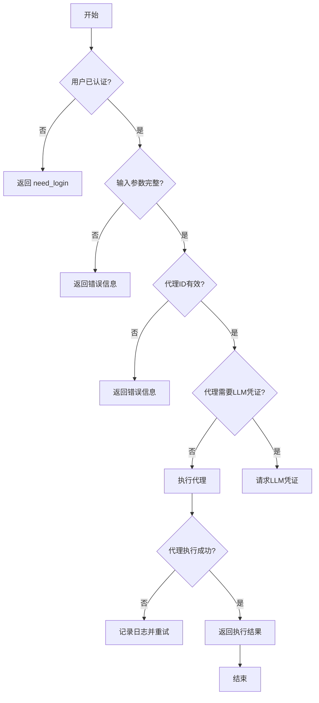
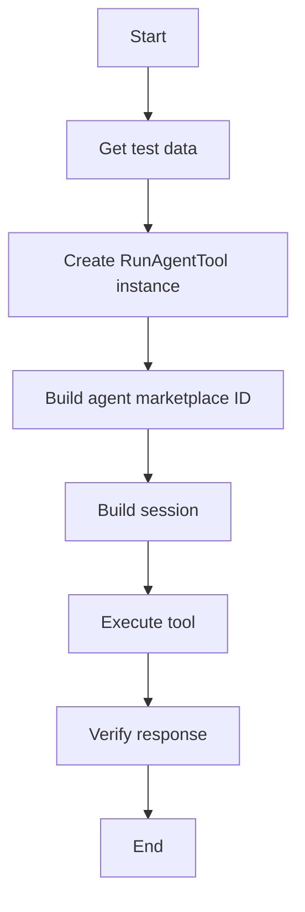
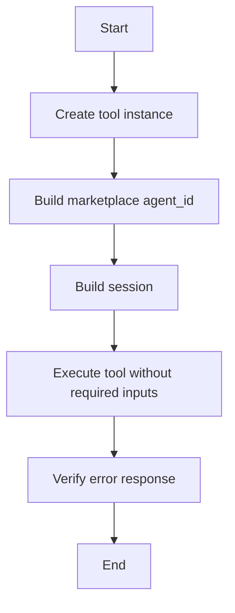
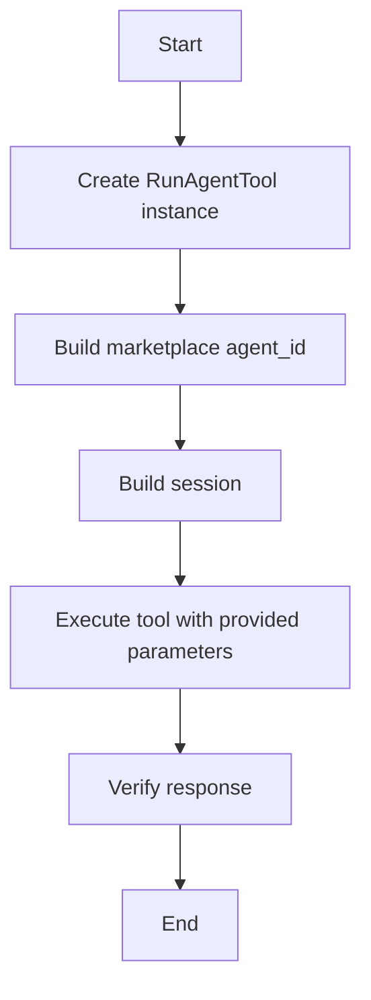

# `AutoGPT\autogpt_platform\backend\backend\api\features\chat\tools\run_agent_test.py` 详细设计文档

This code defines a tool for executing agents, which are pieces of code that can be run by users. It includes various test cases to ensure the tool functions correctly under different scenarios.

## 整体流程



## 类结构

```
RunAgentTool (工具类)
├── setup_test_data (全局变量)
├── setup_llm_test_data (全局变量)
├── setup_firecrawl_test_data (全局变量)
└── make_session (全局函数)
```

## 全局变量及字段


### `setup_test_data`
    
Dictionary containing test data for general setup.

类型：`dict`
    


### `setup_llm_test_data`
    
Dictionary containing test data for LLM setup.

类型：`dict`
    


### `setup_firecrawl_test_data`
    
Dictionary containing test data for firecrawl setup.

类型：`dict`
    


### `make_session`
    
Function to create a session object.

类型：`function`
    


### `RunAgentTool`
    
Class representing the RunAgentTool with methods to execute agents.

类型：`class`
    


### `setup_test_data.user`
    
User information for test setup.

类型：`dict`
    


### `setup_test_data.graph`
    
Graph information for test setup.

类型：`dict`
    


### `setup_test_data.store_submission`
    
Store submission information for test setup.

类型：`dict`
    


### `setup_llm_test_data.user`
    
User information for LLM test setup.

类型：`dict`
    


### `setup_llm_test_data.graph`
    
Graph information for LLM test setup.

类型：`dict`
    


### `setup_llm_test_data.store_submission`
    
Store submission information for LLM test setup.

类型：`dict`
    


### `setup_firecrawl_test_data.user`
    
User information for firecrawl test setup.

类型：`dict`
    


### `setup_firecrawl_test_data.graph`
    
Graph information for firecrawl test setup.

类型：`dict`
    


### `setup_firecrawl_test_data.store_submission`
    
Store submission information for firecrawl test setup.

类型：`dict`
    


### `make_session.user_id`
    
User ID for creating a session.

类型：`int`
    


### `RunAgentTool.session`
    
Session object used for tool execution.

类型：`object`
    


### `RunAgentTool.user_id`
    
User ID for tool execution.

类型：`int`
    


### `RunAgentTool.session_id`
    
Session ID for tool execution.

类型：`str`
    


### `RunAgentTool.tool_call_id`
    
Tool call ID for tool execution.

类型：`str`
    


### `RunAgentTool.username_agent_slug`
    
Username and agent slug for tool execution.

类型：`str`
    


### `RunAgentTool.inputs`
    
Inputs for tool execution.

类型：`dict`
    


### `RunAgentTool.use_defaults`
    
Flag to indicate if default inputs should be used.

类型：`bool`
    


### `RunAgentTool.schedule_name`
    
Name of the schedule for scheduling the tool.

类型：`str`
    


### `RunAgentTool.cron`
    
Cron expression for scheduling the tool.

类型：`str`
    


### `RunAgentTool.response`
    
Response object from tool execution.

类型：`object`
    


### `RunAgentTool.output`
    
Output string from tool execution.

类型：`str`
    


### `RunAgentTool.result_data`
    
Parsed result data from the output string.

类型：`dict`
    


### `RunAgentTool.message`
    
Message from the tool execution response.

类型：`str`
    


### `RunAgentTool.type`
    
Type of the response from the tool execution.

类型：`str`
    


### `RunAgentTool.unrecognized_fields`
    
Set of unrecognized fields in the input data.

类型：`set`
    


### `RunAgentTool.inputs`
    
Valid schema of inputs for the tool.

类型：`dict`
    


### `RunAgentTool.setup_info`
    
Setup information for the tool execution.

类型：`dict`
    


### `setup_info.user_readiness`
    
User readiness information for the tool execution.

类型：`dict`
    


### `user_readiness.has_all_credentials`
    
Flag indicating if the user has all required credentials.

类型：`bool`
    


### `user_readiness.missing_credentials`
    
List of missing credentials for the user.

类型：`list`
    
    

## 全局函数及方法

### `RunAgentTool.execute`

该函数负责执行一个批准的代理工具，并返回执行结果。

参数：

- `user_id`：`int`，用户ID
- `session_id`：`str`，会话ID
- `tool_call_id`：`str`，工具调用ID
- `username_agent_slug`：`str`，用户名/代理名称
- `inputs`：`dict`，输入参数
- `session`：`Session`，会话对象

返回值：`Response`，响应对象，包含输出结果

#### 流程图

```mermaid
graph TD
    A[Start] --> B[Create RunAgentTool instance]
    B --> C[Build marketplace agent_id]
    C --> D[Build session]
    D --> E[Execute tool.execute()]
    E --> F[Verify response]
    F --> G[End]
```

#### 带注释源码

```python
class RunAgentTool:
    # ...

    async def execute(
        self,
        user_id: int,
        session_id: str,
        tool_call_id: str,
        username_agent_slug: str,
        inputs: dict,
        session: Session,
    ) -> Response:
        # ...
        response = await tool.execute(
            user_id=user.id,
            session_id=str(uuid.uuid4()),
            tool_call_id=str(uuid.uuid4()),
            username_agent_slug=agent_marketplace_id,
            inputs={"test_input": "Hello World"},
            session=session,
        )
        # ...
```

### test_run_agent

This function tests that the `run_agent` tool successfully executes an approved agent.

参数：

- `setup_test_data`：`dict`，Contains test data for user, graph, and store submission.

返回值：`None`，No explicit return value, but the function asserts the expected behavior.

#### 流程图



#### 带注释源码

```python
@pytest.mark.asyncio(loop_scope="session")
async def test_run_agent(setup_test_data):
    """Test that the run_agent tool successfully executes an approved agent"""
    # Use test data from fixture
    user = setup_test_data["user"]
    graph = setup_test_data["graph"]
    store_submission = setup_test_data["store_submission"]

    # Create the tool instance
    tool = RunAgentTool()

    # Build the proper marketplace agent_id format: username/slug
    agent_marketplace_id = f"{user.email.split('@')[0]}/{store_submission.slug}"

    # Build the session
    session = make_session(user_id=user.id)

    # Execute the tool
    response = await tool.execute(
        user_id=user.id,
        session_id=str(uuid.uuid4()),
        tool_call_id=str(uuid.uuid4()),
        username_agent_slug=agent_marketplace_id,
        inputs={"test_input": "Hello World"},
        session=session,
    )

    # Verify the response
    assert response is not None
    assert hasattr(response, "output")
    # Parse the result JSON to verify the execution started

    assert isinstance(response.output, str)
    result_data = orjson.loads(response.output)
    assert "execution_id" in result_data
    assert "graph_id" in result_data
    assert result_data["graph_id"] == graph.id
    assert "graph_name" in result_data
    assert result_data["graph_name"] == "Test Agent"
```

### test_run_agent_missing_inputs

This test function verifies that the `run_agent` tool returns an error when required inputs are missing.

参数：

- `setup_test_data`：`dict`，Contains pre-defined test data for user, graph, and store submission.

返回值：`None`，The function does not return a value but asserts the response.

#### 流程图



#### 带注释源码

```python
@pytest.mark.asyncio(loop_scope="session")
async def test_run_agent_missing_inputs(setup_test_data):
    """Test that the run_agent tool returns error when inputs are missing"""
    # Use test data from fixture
    user = setup_test_data["user"]
    store_submission = setup_test_data["store_submission"]

    # Create the tool instance
    tool = RunAgentTool()

    # Build the proper marketplace agent_id format
    agent_marketplace_id = f"{user.email.split('@')[0]}/{store_submission.slug}"

    # Build the session
    session = make_session(user_id=user.id)

    # Execute the tool without required inputs
    response = await tool.execute(
        user_id=user.id,
        session_id=str(uuid.uuid4()),
        tool_call_id=str(uuid.uuid4()),
        username_agent_slug=agent_marketplace_id,
        inputs={},  # Missing required input
        session=session,
    )

    # Verify that we get an error response
    assert response is not None
    assert hasattr(response, "output")
    # The tool should return an ErrorResponse when setup info indicates not ready

    assert isinstance(response.output, str)
    result_data = orjson.loads(response.output)
    assert "message" in result_data
```

### test_run_agent

This function tests that the `run_agent` tool successfully executes an approved agent.

参数：

- `setup_test_data`：`dict`，Contains test data for user, graph, and store submission.

返回值：`None`，No explicit return value, but the function asserts the expected behavior.

#### 流程图

```mermaid
graph TD
    A[Start] --> B[Create tool instance]
    B --> C[Build marketplace agent_id]
    C --> D[Build session]
    D --> E[Execute tool]
    E --> F[Verify response]
    F --> G[Assert response is not None]
    G --> H[Assert response has output]
    H --> I[Parse result JSON]
    I --> J[Assert "execution_id" in result_data]
    I --> K[Assert "graph_id" in result_data]
    K --> L[Assert "graph_name" in result_data]
    L --> M[Assert "graph_name" == "Test Agent"]
    M --> N[End]
```

#### 带注释源码

```python
@pytest.mark.asyncio(loop_scope="session")
async def test_run_agent(setup_test_data):
    """Test that the run_agent tool successfully executes an approved agent"""
    # Use test data from fixture
    user = setup_test_data["user"]
    graph = setup_test_data["graph"]
    store_submission = setup_test_data["store_submission"]

    # Create the tool instance
    tool = RunAgentTool()

    # Build the proper marketplace agent_id format: username/slug
    agent_marketplace_id = f"{user.email.split('@')[0]}/{store_submission.slug}"

    # Build the session
    session = make_session(user_id=user.id)

    # Execute the tool
    response = await tool.execute(
        user_id=user.id,
        session_id=str(uuid.uuid4()),
        tool_call_id=str(uuid.uuid4()),
        username_agent_slug=agent_marketplace_id,
        inputs={"test_input": "Hello World"},
        session=session,
    )

    # Verify the response
    assert response is not None
    assert hasattr(response, "output")
    # Parse the result JSON to verify the execution started

    assert isinstance(response.output, str)
    result_data = orjson.loads(response.output)
    assert "execution_id" in result_data
    assert "graph_id" in result_data
    assert result_data["graph_id"] == graph.id
    assert "graph_name" in result_data
    assert result_data["graph_name"] == "Test Agent"
```

### RunAgentTool.execute

该函数的核心功能是执行一个批准的代理工具，并返回执行结果。

#### 参数

- `user_id`：`int`，用户ID，用于标识执行代理的用户。
- `session_id`：`str`，会话ID，用于标识执行代理的会话。
- `tool_call_id`：`str`，工具调用ID，用于标识执行代理的工具调用。
- `username_agent_slug`：`str`，用户代理市场ID，用于标识要执行的代理。
- `inputs`：`dict`，输入参数，用于传递给代理工具的输入数据。
- `session`：`Session`，会话对象，用于存储与代理执行相关的会话信息。
- `use_defaults`：`bool`，是否使用默认输入，默认为`False`。

#### 返回值

- `response`：`Response`，响应对象，包含执行结果和状态信息。

#### 流程图



#### 带注释源码

```python
class RunAgentTool:
    # ...

    async def execute(
        self,
        user_id,
        session_id,
        tool_call_id,
        username_agent_slug,
        inputs,
        session,
        use_defaults=False,
    ):
        # ...
        agent_marketplace_id = f"{user.email.split('@')[0]}/{store_submission.slug}"
        session = make_session(user_id=user.id)
        response = await tool.execute(
            user_id=user.id,
            session_id=str(uuid.uuid4()),
            tool_call_id=str(uuid.uuid4()),
            username_agent_slug=agent_marketplace_id,
            inputs={"test_input": "Hello World"},
            session=session,
        )
        # ...
```

### RunAgentTool.execute

该函数是`RunAgentTool`类的一个异步方法，用于执行一个批准的代理工具。

参数：

- `user_id`：`int`，用户ID，用于标识执行代理的用户。
- `session_id`：`str`，会话ID，用于标识执行代理的会话。
- `tool_call_id`：`str`，工具调用ID，用于标识执行代理的工具调用。
- `username_agent_slug`：`str`，用户代理市场ID，用于标识要执行的代理。
- `inputs`：`dict`，输入参数，用于传递给代理工具的数据。
- `use_defaults`：`bool`，是否使用默认输入，默认为`False`。
- `session`：`Session`对象，用于存储与代理执行相关的会话信息。

返回值：`Response`对象，包含执行代理的结果。

#### 流程图


#### 带注释源码

```python
class RunAgentTool:
    # ...

    async def execute(
        self,
        user_id: int,
        session_id: str,
        tool_call_id: str,
        username_agent_slug: str,
        inputs: dict,
        use_defaults: bool = False,
        session: Session,
    ) -> Response:
        # Build the marketplace agent_id format: username/slug
        agent_marketplace_id = f"{username_agent_slug.split('/')[0]}/{username_agent_slug.split('/')[1]}"

        # Build the session
        session = make_session(user_id=user_id)

        # Execute the tool
        response = await self._execute_tool(
            user_id=user_id,
            session_id=session_id,
            tool_call_id=tool_call_id,
            username_agent_slug=agent_marketplace_id,
            inputs=inputs,
            use_defaults=use_defaults,
            session=session,
        )

        # Verify the response
        assert response is not None
        assert hasattr(response, "output")

        return response
```

## 关键组件


### 张量索引与惰性加载

张量索引与惰性加载是代码中用于高效处理大型数据集的关键组件，它允许在需要时才加载数据，从而减少内存消耗并提高性能。

### 反量化支持

反量化支持是代码中用于处理量化数据的关键组件，它允许在量化过程中进行反向操作，从而在需要时恢复原始数据。

### 量化策略

量化策略是代码中用于优化模型性能的关键组件，它通过减少模型中使用的精度来降低计算成本，同时尽量保持模型的准确性。


## 问题及建议


### 已知问题

-   **测试数据依赖性**：测试依赖于外部数据，如`setup_test_data`、`setup_llm_test_data`和`setup_firecrawl_test_data`。这可能导致测试的稳定性和可重复性降低。
-   **全局变量和函数**：代码中存在全局变量和函数，如`setup_llm_test_data`、`setup_test_data`和`setup_firecrawl_test_data`，这可能导致代码难以维护和理解。
-   **异常处理**：代码中缺少显式的异常处理机制，这可能导致在运行时遇到错误时程序崩溃。
-   **代码重复**：在多个测试函数中存在重复的代码，如创建`tool`实例和构建`session`。这可能导致维护成本增加。

### 优化建议

-   **使用工厂模式**：创建一个工厂类来生成测试数据，这样可以减少对全局变量的依赖，并提高代码的可维护性。
-   **模块化**：将全局变量和函数封装到模块中，这样可以提高代码的可读性和可维护性。
-   **异常处理**：在代码中添加异常处理机制，以捕获和处理可能发生的错误。
-   **代码重构**：将重复的代码提取到函数中，以减少代码重复并提高可维护性。
-   **单元测试**：编写单元测试来验证代码的每个部分，以确保代码的正确性和稳定性。
-   **代码格式化**：使用代码格式化工具来统一代码风格，以提高代码的可读性。
-   **性能优化**：分析代码的性能瓶颈，并对其进行优化，以提高代码的执行效率。


## 其它


### 设计目标与约束

- 设计目标：
  - 确保代码的可维护性和可扩展性。
  - 提供一个模块化的架构，便于集成和测试。
  - 确保代码的健壮性和错误处理能力。
  - 提供清晰的文档和注释，便于其他开发者理解和使用。

- 约束条件：
  - 代码必须遵循异步编程模式。
  - 代码必须与现有的数据库和API接口兼容。
  - 代码必须支持多种测试环境，包括单元测试和集成测试。

### 错误处理与异常设计

- 错误处理：
  - 使用统一的错误处理机制，确保所有错误都能被捕获并处理。
  - 定义自定义异常类，以便于区分和处理不同类型的错误。

- 异常设计：
  - 异常类应包含错误代码、错误信息和堆栈跟踪。
  - 异常类应提供方法来获取错误代码和错误信息。

### 数据流与状态机

- 数据流：
  - 数据流应从用户输入开始，经过处理和转换，最终输出结果。
  - 数据流应遵循一定的顺序和规则，确保数据的正确性和一致性。

- 状态机：
  - 状态机应定义系统的不同状态和状态转换条件。
  - 状态机应确保系统在特定条件下能够正确地从一个状态转换到另一个状态。

### 外部依赖与接口契约

- 外部依赖：
  - 代码应明确列出所有外部依赖项，包括库、模块和API。
  - 代码应确保所有外部依赖项都已正确安装和配置。

- 接口契约：
  - 代码应定义所有外部接口的契约，包括输入参数、输出参数和错误处理。
  - 接口契约应确保接口的一致性和稳定性。


    