# `.\AutoGPT\autogpt_platform\backend\backend\api\features\chat\tools\run_block.py` 详细设计文档

This file defines a tool for executing a specific block with provided input data, handling authentication, credential resolution, and execution context setup.

## 整体流程

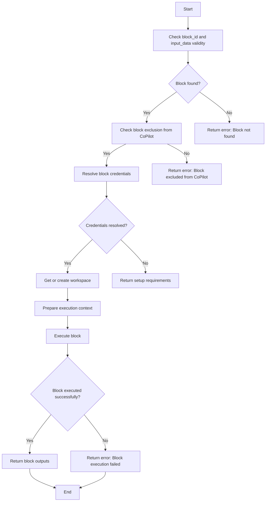

## 类结构

```
RunBlockTool (具体工具类)
├── BaseTool (基类)
│   ├── ... (其他基类方法)
└── ... (其他类)
```

## 全局变量及字段


### `logger`
    
Logger for the RunBlockTool class.

类型：`logging.Logger`
    


### `COPILOT_EXCLUDED_BLOCK_IDS`
    
Set of block IDs excluded from CoPilot.

类型：`set[str]`
    


### `COPILOT_EXCLUDED_BLOCK_TYPES`
    
Set of block types excluded from CoPilot.

类型：`set[str]`
    


### `PydanticUndefined`
    
Undefined value from Pydantic for default values in schemas.

类型：`PydanticUndefined`
    


### `RunBlockTool.name`
    
Name of the RunBlockTool class.

类型：`str`
    


### `RunBlockTool.description`
    
Description of the RunBlockTool class.

类型：`str`
    


### `RunBlockTool.parameters`
    
Parameters required by the RunBlockTool class.

类型：`dict[str, Any]`
    


### `RunBlockTool.requires_auth`
    
Indicates if authentication is required for the RunBlockTool class.

类型：`bool`
    


### `BaseTool`
    
Base class for the RunBlockTool class.

类型：`BaseTool`
    


### `RunBlockTool.name`
    
Name of the RunBlockTool instance.

类型：`str`
    


### `RunBlockTool.description`
    
Description of the RunBlockTool instance.

类型：`str`
    


### `RunBlockTool.parameters`
    
Parameters required by the RunBlockTool instance.

类型：`dict[str, Any]`
    


### `RunBlockTool.requires_auth`
    
Indicates if authentication is required for the RunBlockTool instance.

类型：`bool`
    


### `RunBlockTool.user_id`
    
User ID for the current session.

类型：`str | None`
    


### `RunBlockTool.session`
    
Chat session object.

类型：`ChatSession`
    


### `RunBlockTool.block_id`
    
Block ID to execute.

类型：`str`
    


### `RunBlockTool.input_data`
    
Input data for the block.

类型：`dict[str, Any]`
    


### `RunBlockTool.session_id`
    
Session ID for the current session.

类型：`str`
    


### `RunBlockTool.block`
    
Block object to execute.

类型：`AnyBlockSchema`
    


### `RunBlockTool.creds_manager`
    
Credentials manager for the integration.

类型：`IntegrationCredentialsManager`
    


### `RunBlockTool.matched_credentials`
    
Matched credentials for the block.

类型：`dict[str, CredentialsMetaInput]`
    


### `RunBlockTool.missing_credentials`
    
Missing credentials for the block.

类型：`list[CredentialsMetaInput]`
    


### `RunBlockTool.workspace`
    
User's workspace for file operations.

类型：`Workspace`
    


### `RunBlockTool.synthetic_graph_id`
    
Synthetic graph ID for the CoPilot context.

类型：`str`
    


### `RunBlockTool.synthetic_graph_exec_id`
    
Synthetic graph execution ID for the CoPilot context.

类型：`str`
    


### `RunBlockTool.synthetic_node_id`
    
Synthetic node ID for the CoPilot context.

类型：`str`
    


### `RunBlockTool.synthetic_node_exec_id`
    
Synthetic node execution ID for the CoPilot context.

类型：`str`
    


### `RunBlockTool.execution_context`
    
Execution context for the block.

类型：`ExecutionContext`
    


### `RunBlockTool.exec_kwargs`
    
Keyword arguments for block execution.

类型：`dict[str, Any]`
    


### `RunBlockTool.outputs`
    
Block execution outputs.

类型：`dict[str, list[Any]]`
    


### `RunBlockTool.error`
    
Error message if block execution fails.

类型：`str`
    


### `RunBlockTool.credentials_fields_info`
    
Credentials fields information from the block schema.

类型：`dict[str, CredentialsFieldInfo]`
    


### `RunBlockTool.resolved`
    
Resolved credentials fields information.

类型：`dict[str, CredentialsFieldInfo]`
    


### `RunBlockTool.effective_field_info`
    
Effective credentials field information after applying discriminator logic.

类型：`CredentialsFieldInfo`
    
    

## 全局函数及方法

### get_block

该函数用于获取指定ID的块信息。

参数：

- `block_id`：`str`，块的ID。
- `**kwargs`：其他可选参数。

返回值：`AnyBlockSchema`，块信息。

#### 流程图

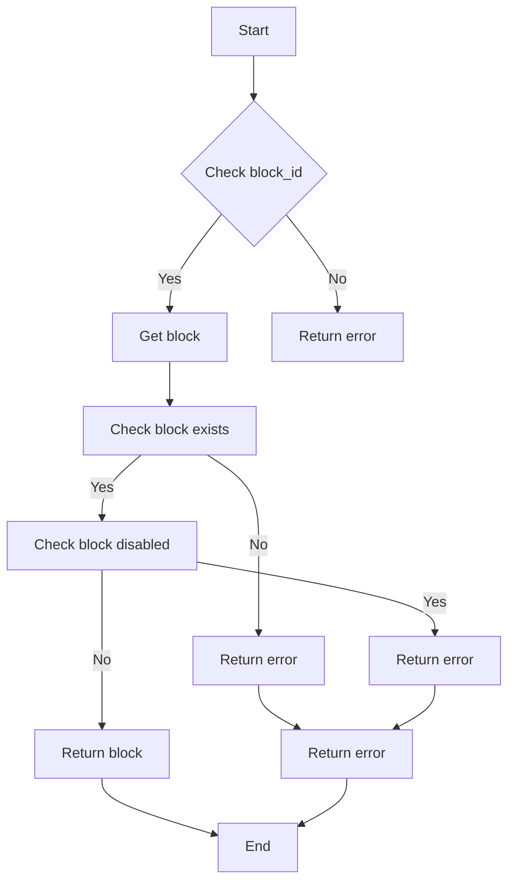

#### 带注释源码

```python
def get_block(block_id: str, **kwargs) -> AnyBlockSchema:
    # Get the block
    block = get_block(block_id)
    if not block:
        return ErrorResponse(
            message=f"Block '{block_id}' not found",
            session_id=session_id,
        )
    if block.disabled:
        return ErrorResponse(
            message=f"Block '{block_id}' is disabled",
            session_id=session_id,
        )
    return block
```


### `get_or_create_workspace`

获取或创建用户的 workspace。

参数：

- `user_id`：`str`，用户 ID。

返回值：`Workspace`，用户的 workspace 对象。

#### 流程图

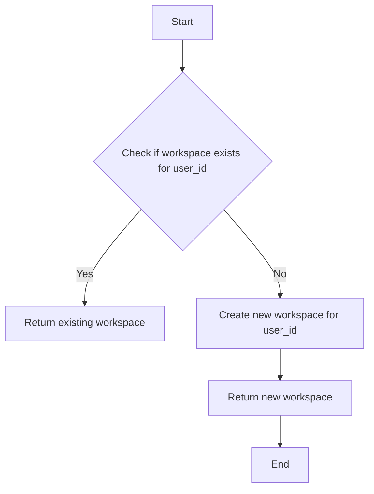

#### 带注释源码

```python
# backend.data.workspace.py

from backend.data.model import Workspace
from backend.util.exceptions import WorkspaceError

async def get_or_create_workspace(user_id: str) -> Workspace:
    """
    Get or create workspace for the given user_id.

    Args:
        user_id: User ID

    Returns:
        Workspace: Workspace object for the user.

    Raises:
        WorkspaceError: If workspace creation fails.
    """
    # Check if workspace exists for user_id
    workspace = await Workspace.query.filter_by(user_id=user_id).first()
    if workspace:
        # Return existing workspace
        return workspace

    # Create new workspace for user_id
    new_workspace = Workspace(user_id=user_id)
    await new_workspace.save()
    return new_workspace
```


### `build_missing_credentials_from_field_info`

Generate a dictionary of missing credentials based on field information.

参数：

- `credentials_fields_info`：`dict[str, CredentialsFieldInfo]`，The field information for credentials.
- `matched_credentials`：`set[str]`，The set of matched credentials.

返回值：`dict[str, str]`，A dictionary of missing credentials.

#### 流程图

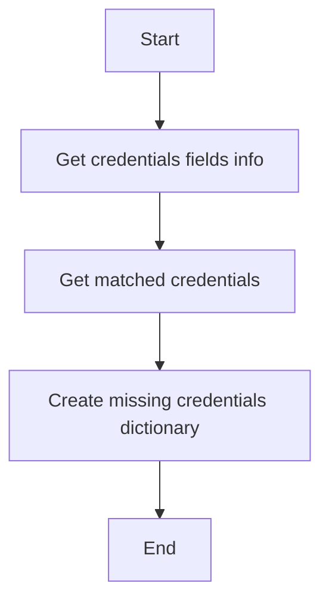

#### 带注释源码

```python
def build_missing_credentials_from_field_info(
    credentials_fields_info: dict[str, CredentialsFieldInfo],
    matched_credentials: set[str],
) -> dict[str, str]:
    """
    Generate a dictionary of missing credentials based on field information.

    Args:
        credentials_fields_info: The field information for credentials.
        matched_credentials: The set of matched credentials.

    Returns:
        A dictionary of missing credentials.
    """
    missing_credentials_dict = {}
    for field_name, field_info in credentials_fields_info.items():
        if field_name not in matched_credentials:
            missing_credentials_dict[field_name] = field_info.provider
    return missing_credentials_dict
```


### match_credentials_to_requirements

Resolve credentials for a block by matching user's available credentials.

参数：

- `user_id`：`str`，User ID
- `requirements`：`dict[str, CredentialsFieldInfo]`，Credential requirements for the block

返回值：`tuple[dict[str, CredentialsMetaInput], list[CredentialsMetaInput]]`，A tuple containing matched credentials and missing credentials

#### 流程图

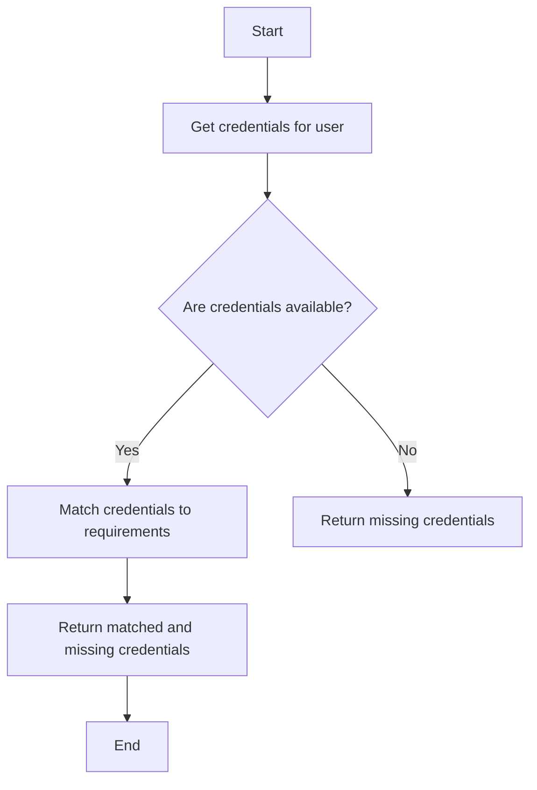

#### 带注释源码

```python
async def match_credentials_to_requirements(user_id: str, requirements: dict[str, CredentialsFieldInfo]) -> tuple[dict[str, CredentialsMetaInput], list[CredentialsMetaInput]]:
    """
    Resolve credentials for a block by matching user's available credentials.

    Args:
        user_id: User ID
        requirements: Credential requirements for the block

    Returns:
        tuple of (matched_credentials, missing_credentials) - matched credentials
        are used for block execution, missing ones indicate setup requirements.
    """
    # Get credentials for the user
    creds_manager = IntegrationCredentialsManager()
    available_credentials = await creds_manager.get_credentials(user_id)

    # Match credentials to requirements
    matched_credentials = {}
    missing_credentials = []

    for field_name, field_info in requirements.items():
        if field_info.id in available_credentials:
            matched_credentials[field_name] = available_credentials[field_info.id]
        else:
            missing_credentials.append(field_info)

    return matched_credentials, missing_credentials
``` 


### `RunBlockTool.execute`

执行一个特定块并返回其输出。

参数：

- `user_id`：`str`，用户ID（必需）
- `session`：`ChatSession`，聊天会话
- `block_id`：`str`，要执行的块的UUID
- `input_data`：`dict`，块所需的输入值

返回值：`ToolResponseBase`，块执行输出、缺少的凭据或错误消息

#### 流程图

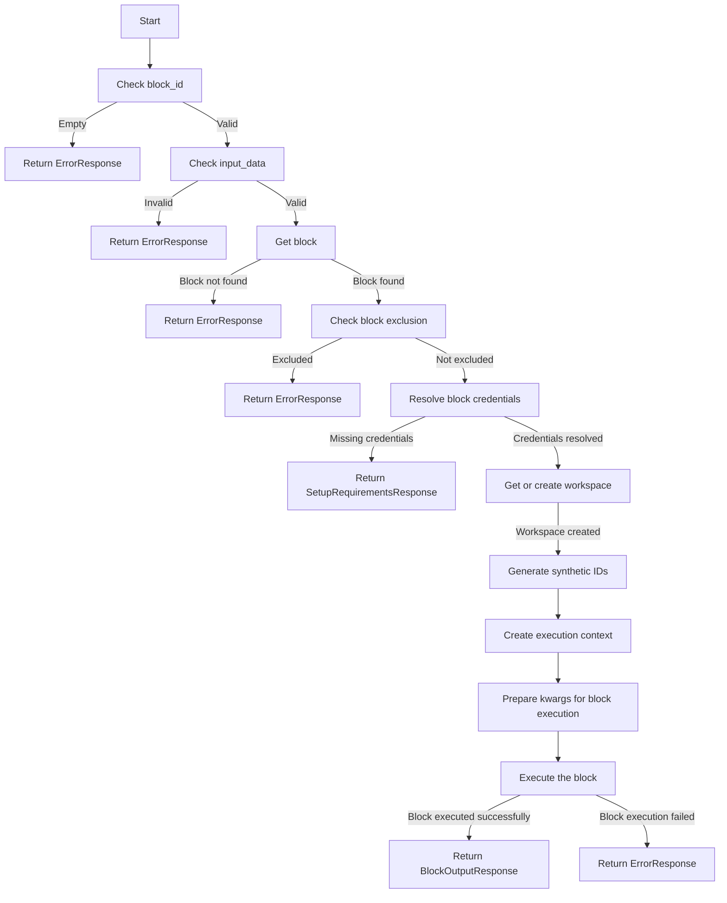

#### 带注释源码

```python
async def _execute(
    self,
    user_id: str | None,
    session: ChatSession,
    **kwargs,
) -> ToolResponseBase:
    # ... (省略中间代码)
    try:
        # ... (省略中间代码)
        # Execute the block and collect outputs
        outputs: dict[str, list[Any]] = defaultdict(list)
        async for output_name, output_data in block.execute(
            input_data,
            **exec_kwargs,
        ):
            outputs[output_name].append(output_data)
        # ... (省略中间代码)
    except BlockError as e:
        # ... (省略中间代码)
    except Exception as e:
        # ... (省略中间代码)
```


### RunBlockTool._execute

Execute a block with the given input data.

参数：

- `user_id`：`str | None`，User ID (required)
- `session`：`ChatSession`，Chat session
- `block_id`：`str`，Block UUID to execute
- `input_data`：`dict[str, Any]`，Input values for the block

返回值：`ToolResponseBase`，Block execution outputs, SetupRequirementsResponse, ErrorResponse

#### 流程图

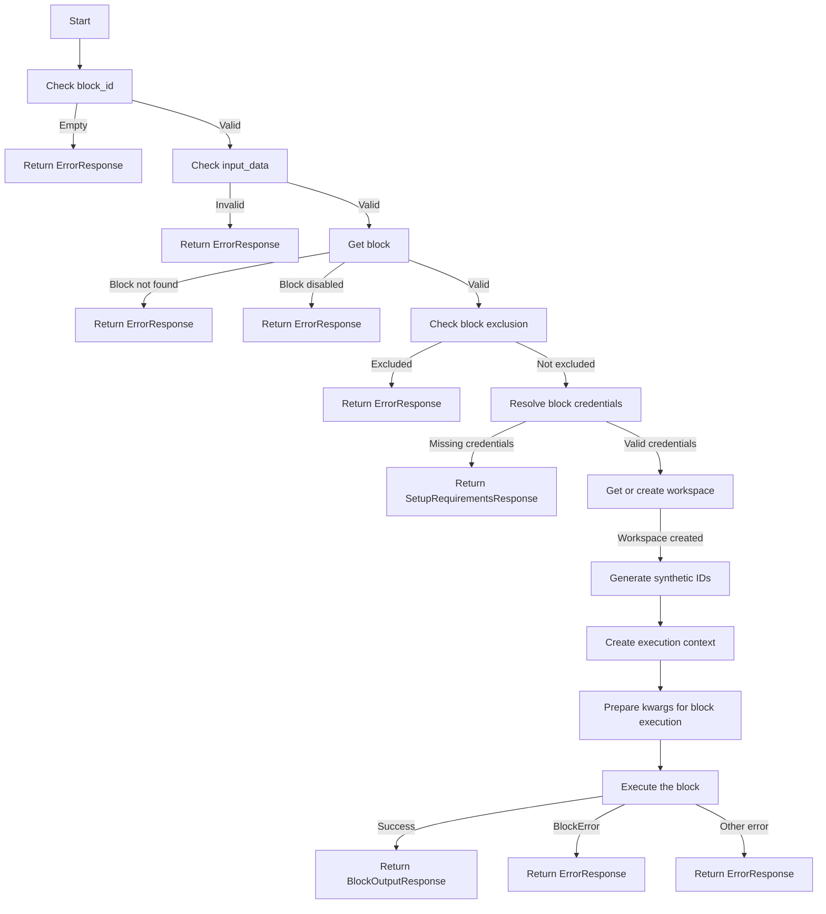

#### 带注释源码

```python
async def _execute(
    self,
    user_id: str | None,
    session: ChatSession,
    **kwargs,
) -> ToolResponseBase:
    block_id = kwargs.get("block_id", "").strip()
    input_data = kwargs.get("input_data", {})
    session_id = session.session_id

    if not block_id:
        return ErrorResponse(
            message="Please provide a block_id",
            session_id=session_id,
        )

    if not isinstance(input_data, dict):
        return ErrorResponse(
            message="input_data must be an object",
            session_id=session_id,
        )

    if not user_id:
        return ErrorResponse(
            message="Authentication required",
            session_id=session_id,
        )

    # Get the block
    block = get_block(block_id)
    if not block:
        return ErrorResponse(
            message=f"Block '{block_id}' not found",
            session_id=session_id,
        )
    if block.disabled:
        return ErrorResponse(
            message=f"Block '{block_id}' is disabled",
            session_id=session_id,
        )

    # Check if block is excluded from CoPilot (graph-only blocks)
    if (
        block.block_type in COPILOT_EXCLUDED_BLOCK_TYPES
        or block.id in COPILOT_EXCLUDED_BLOCK_IDS
    ):
        return ErrorResponse(
            message=(
                f"Block '{block.name}' cannot be run directly in CoPilot. "
                "This block is designed for use within graphs only."
            ),
            session_id=session_id,
        )

    logger.info(f"Executing block {block.name} ({block_id}) for user {user_id}")

    creds_manager = IntegrationCredentialsManager()
    matched_credentials, missing_credentials = (
        await self._resolve_block_credentials(user_id, block, input_data)
    )

    if missing_credentials:
        # Return setup requirements response with missing credentials
        credentials_fields_info = block.input_schema.get_credentials_fields_info()
        missing_creds_dict = build_missing_credentials_from_field_info(
            credentials_fields_info, set(matched_credentials.keys())
        )
        missing_creds_list = list(missing_creds_dict.values())

        return SetupRequirementsResponse(
            message=(
                f"Block '{block.name}' requires credentials that are not configured. "
                "Please set up the required credentials before running this block."
            ),
            session_id=session_id,
            setup_info=SetupInfo(
                agent_id=block_id,
                agent_name=block.name,
                user_readiness=UserReadiness(
                    has_all_credentials=False,
                    missing_credentials=missing_creds_dict,
                    ready_to_run=False,
                ),
                requirements={
                    "credentials": missing_creds_list,
                    "inputs": self._get_inputs_list(block),
                    "execution_modes": ["immediate"],
                },
            ),
            graph_id=None,
            graph_version=None,
        )

    try:
        # Get or create user's workspace for CoPilot file operations
        workspace = await get_or_create_workspace(user_id)

        # Generate synthetic IDs for CoPilot context
        synthetic_graph_id = f"copilot-session-{session.session_id}"
        synthetic_graph_exec_id = f"copilot-session-{session.session_id}"
        synthetic_node_id = f"copilot-node-{block_id}"
        synthetic_node_exec_id = (
            f"copilot-{session.session_id}-{uuid.uuid4().hex[:8]}"
        )

        # Create unified execution context with all required fields
        execution_context = ExecutionContext(
            user_id=user_id,
            graph_id=synthetic_graph_id,
            graph_exec_id=synthetic_graph_exec_id,
            graph_version=1,  # Versions are 1-indexed
            node_id=synthetic_node_id,
            node_exec_id=synthetic_node_exec_id,
            workspace_id=workspace.id,
            session_id=session.session_id,
        )

        # Prepare kwargs for block execution
        exec_kwargs: dict[str, Any] = {
            "user_id": user_id,
            "execution_context": execution_context,
            "workspace_id": workspace.id,
            "graph_exec_id": synthetic_graph_exec_id,
            "node_exec_id": synthetic_node_exec_id,
            "node_id": synthetic_node_id,
            "graph_version": 1,  # Versions are 1-indexed
            "graph_id": synthetic_graph_id,
        }

        for field_name, cred_meta in matched_credentials.items():
            # Inject metadata into input_data (for validation)
            if field_name not in input_data:
                input_data[field_name] = cred_meta.model_dump()

            # Fetch actual credentials and pass as kwargs (for execution)
            actual_credentials = await creds_manager.get(
                user_id, cred_meta.id, lock=False
            )
            if actual_credentials:
                exec_kwargs[field_name] = actual_credentials
            else:
                return ErrorResponse(
                    message=f"Failed to retrieve credentials for {field_name}",
                    session_id=session_id,
                )

        # Execute the block and collect outputs
        outputs: dict[str, list[Any]] = defaultdict(list)
        async for output_name, output_data in block.execute(
            input_data,
            **exec_kwargs,
        ):
            outputs[output_name].append(output_data)

        return BlockOutputResponse(
            message=f"Block '{block.name}' executed successfully",
            block_id=block_id,
            block_name=block.name,
            outputs=dict(outputs),
            success=True,
            session_id=session_id,
        )

    except BlockError as e:
        logger.warning(f"Block execution failed: {e}")
        return ErrorResponse(
            message=f"Block execution failed: {e}",
            error=str(e),
            session_id=session_id,
        )
    except Exception as e:
        logger.error(f"Unexpected error executing block: {e}", exc_info=True)
        return ErrorResponse(
            message=f"Failed to execute block: {str(e)}",
            error=str(e),
            session_id=session_id,
        )
```


### `_resolve_block_credentials`

Resolve credentials for a block by matching user's available credentials.

参数：

- `user_id`：`str`，User ID
- `block`：`AnyBlockSchema`，Block to resolve credentials for
- `input_data`：`dict[str, Any] | None`，Input data for the block (used to determine provider via discriminator)

返回值：`tuple[dict[str, CredentialsMetaInput], list[CredentialsMetaInput]]`，Matched credentials are used for block execution, missing ones indicate setup requirements.

#### 流程图

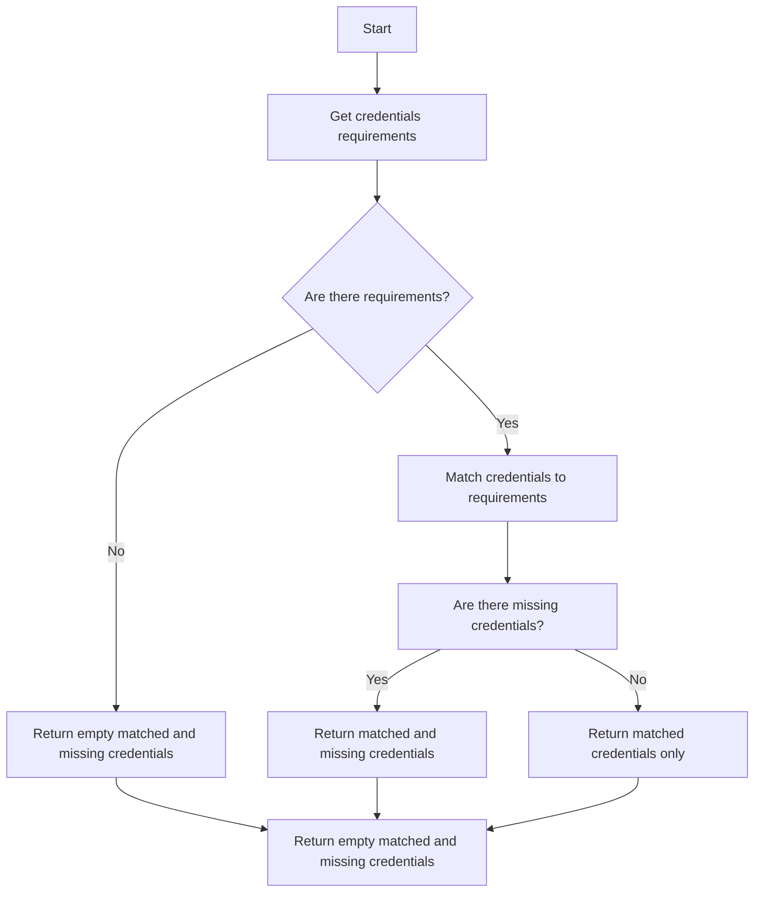

#### 带注释源码

```python
async def _resolve_block_credentials(
    self,
    user_id: str,
    block: AnyBlockSchema,
    input_data: dict[str, Any] | None = None,
) -> tuple[dict[str, CredentialsMetaInput], list[CredentialsMetaInput]]:
    """
    Resolve credentials for a block by matching user's available credentials.

    Args:
        user_id: User ID
        block: Block to resolve credentials for
        input_data: Input data for the block (used to determine provider via discriminator)

    Returns:
        tuple of (matched_credentials, missing_credentials) - matched credentials
        are used for block execution, missing ones indicate setup requirements.
    """
    input_data = input_data or {}
    requirements = self._resolve_discriminated_credentials(block, input_data)

    if not requirements:
        return {}, []

    return await match_credentials_to_requirements(user_id, requirements)
```


### `_get_inputs_list`

Extract non-credential inputs from block schema.

参数：

- `block`：`AnyBlockSchema`，Block schema from which to extract non-credential inputs.

返回值：`list[dict[str, Any]]`，List of dictionaries representing non-credential inputs.

#### 流程图

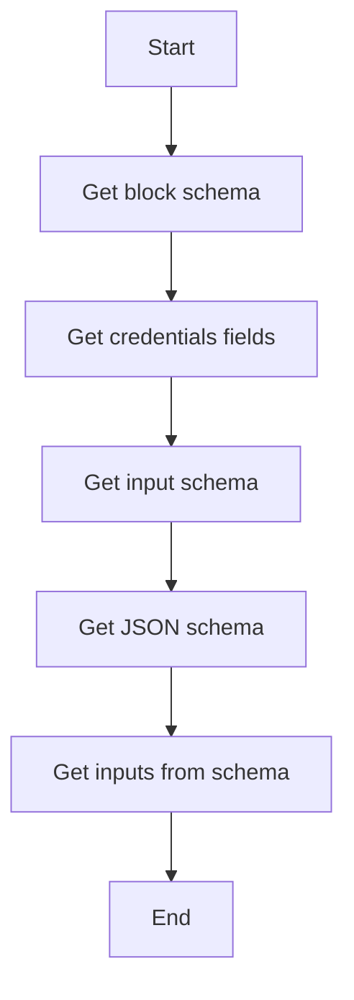

#### 带注释源码

```python
def _get_inputs_list(self, block: AnyBlockSchema) -> list[dict[str, Any]]:
    """Extract non-credential inputs from block schema."""
    schema = block.input_schema.jsonschema()
    credentials_fields = set(block.input_schema.get_credentials_fields().keys())
    return get_inputs_from_schema(schema, exclude_fields=credentials_fields)
``` 


### RunBlockTool._resolve_discriminated_credentials

This method resolves credential requirements for a block by applying discriminator logic to match user's available credentials.

参数：

- `block`: `AnyBlockSchema`，The block to resolve credentials for.
- `input_data`: `dict[str, Any]`，Input data for the block (used to determine provider via discriminator).

返回值：`dict[str, CredentialsFieldInfo]`，A dictionary of resolved credential requirements.

#### 流程图

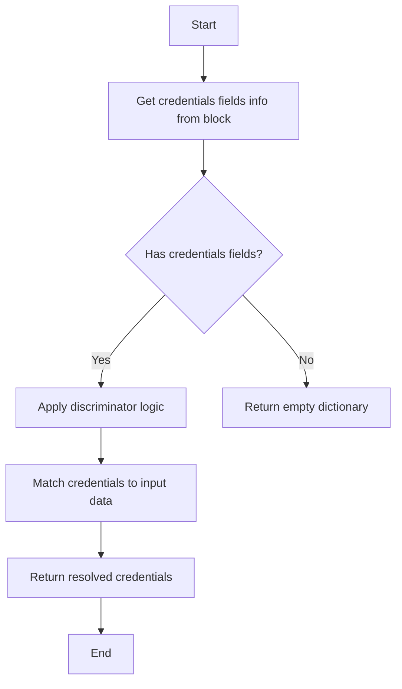

#### 带注释源码

```python
def _resolve_discriminated_credentials(
    self,
    block: AnyBlockSchema,
    input_data: dict[str, Any],
) -> dict[str, CredentialsFieldInfo]:
    """
    Resolve credential requirements, applying discriminator logic where needed.

    Args:
        block: Block to resolve credentials for
        input_data: Input data for the block (used to determine provider via discriminator)

    Returns:
        dict[str, CredentialsFieldInfo]: A dictionary of resolved credential requirements.
    """
    credentials_fields_info = block.input_schema.get_credentials_fields_info()
    if not credentials_fields_info:
        return {}

    resolved: dict[str, CredentialsFieldInfo] = {}

    for field_name, field_info in credentials_fields_info.items():
        effective_field_info = field_info

        if field_info.discriminator and field_info.discriminator_mapping:
            discriminator_value = input_data.get(field_info.discriminator)
            if discriminator_value is None:
                field = block.input_schema.model_fields.get(
                    field_info.discriminator
                )
                if field and field.default is not PydanticUndefined:
                    discriminator_value = field.default

            if (
                discriminator_value
                and discriminator_value in field_info.discriminator_mapping
            ):
                effective_field_info = field_info.discriminate(discriminator_value)
                # For host-scoped credentials, add the discriminator value
                # (e.g., URL) so _credential_is_for_host can match it
                effective_field_info.discriminator_values.add(discriminator_value)
                logger.debug(
                    f"Discriminated provider for {field_name}: "
                    f"{discriminator_value} -> {effective_field_info.provider}"
                )

        resolved[field_name] = effective_field_info

    return resolved
```


### RunBlockTool._execute

执行一个特定块并返回其输出。

参数：

- `user_id`：`str | None`，用户ID（必需）
- `session`：`ChatSession`，聊天会话
- `block_id`：`str`，要执行的块的UUID
- `input_data`：`dict[str, Any]`，块所需的输入值

返回值：`ToolResponseBase`，块执行输出、缺少的凭据或错误消息

#### 流程图

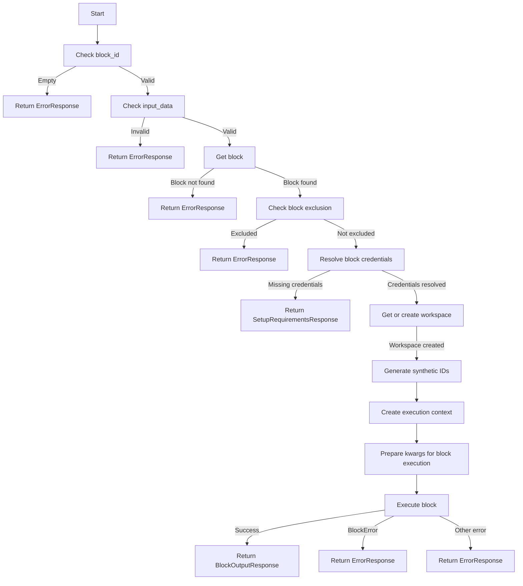

#### 带注释源码

```python
async def _execute(
    self,
    user_id: str | None,
    session: ChatSession,
    **kwargs,
) -> ToolResponseBase:
    block_id = kwargs.get("block_id", "").strip()
    input_data = kwargs.get("input_data", {})
    session_id = session.session_id

    if not block_id:
        return ErrorResponse(
            message="Please provide a block_id",
            session_id=session_id,
        )

    if not isinstance(input_data, dict):
        return ErrorResponse(
            message="input_data must be an object",
            session_id=session_id,
        )

    if not user_id:
        return ErrorResponse(
            message="Authentication required",
            session_id=session_id,
        )

    # Get the block
    block = get_block(block_id)
    if not block:
        return ErrorResponse(
            message=f"Block '{block_id}' not found",
            session_id=session_id,
        )
    if block.disabled:
        return ErrorResponse(
            message=f"Block '{block_id}' is disabled",
            session_id=session_id,
        )

    # Check if block is excluded from CoPilot (graph-only blocks)
    if (
        block.block_type in COPILOT_EXCLUDED_BLOCK_TYPES
        or block.id in COPILOT_EXCLUDED_BLOCK_IDS
    ):
        return ErrorResponse(
            message=(
                f"Block '{block.name}' cannot be run directly in CoPilot. "
                "This block is designed for use within graphs only."
            ),
            session_id=session_id,
        )

    logger.info(f"Executing block {block.name} ({block_id}) for user {user_id}")

    creds_manager = IntegrationCredentialsManager()
    matched_credentials, missing_credentials = (
        await self._resolve_block_credentials(user_id, block, input_data)
    )

    if missing_credentials:
        # Return setup requirements response with missing credentials
        credentials_fields_info = block.input_schema.get_credentials_fields_info()
        missing_creds_dict = build_missing_credentials_from_field_info(
            credentials_fields_info, set(matched_credentials.keys())
        )
        missing_creds_list = list(missing_creds_dict.values())

        return SetupRequirementsResponse(
            message=(
                f"Block '{block.name}' requires credentials that are not configured. "
                "Please set up the required credentials before running this block."
            ),
            session_id=session_id,
            setup_info=SetupInfo(
                agent_id=block_id,
                agent_name=block.name,
                user_readiness=UserReadiness(
                    has_all_credentials=False,
                    missing_credentials=missing_creds_dict,
                    ready_to_run=False,
                ),
                requirements={
                    "credentials": missing_creds_list,
                    "inputs": self._get_inputs_list(block),
                    "execution_modes": ["immediate"],
                },
            ),
            graph_id=None,
            graph_version=None,
        )

    try:
        # Get or create user's workspace for CoPilot file operations
        workspace = await get_or_create_workspace(user_id)

        # Generate synthetic IDs for CoPilot context
        synthetic_graph_id = f"copilot-session-{session.session_id}"
        synthetic_graph_exec_id = f"copilot-session-{session.session_id}"
        synthetic_node_id = f"copilot-node-{block_id}"
        synthetic_node_exec_id = (
            f"copilot-{session.session_id}-{uuid.uuid4().hex[:8]}"
        )

        # Create unified execution context with all required fields
        execution_context = ExecutionContext(
            user_id=user_id,
            graph_id=synthetic_graph_id,
            graph_exec_id=synthetic_graph_exec_id,
            graph_version=1,  # Versions are 1-indexed
            node_id=synthetic_node_id,
            node_exec_id=synthetic_node_exec_id,
            workspace_id=workspace.id,
            session_id=session.session_id,
        )

        # Prepare kwargs for block execution
        exec_kwargs: dict[str, Any] = {
            "user_id": user_id,
            "execution_context": execution_context,
            "workspace_id": workspace.id,
            "graph_exec_id": synthetic_graph_exec_id,
            "node_exec_id": synthetic_node_exec_id,
            "node_id": synthetic_node_id,
            "graph_version": 1,  # Versions are 1-indexed
            "graph_id": synthetic_graph_id,
        }

        for field_name, cred_meta in matched_credentials.items():
            # Inject metadata into input_data (for validation)
            if field_name not in input_data:
                input_data[field_name] = cred_meta.model_dump()

            # Fetch actual credentials and pass as kwargs (for execution)
            actual_credentials = await creds_manager.get(
                user_id, cred_meta.id, lock=False
            )
            if actual_credentials:
                exec_kwargs[field_name] = actual_credentials
            else:
                return ErrorResponse(
                    message=f"Failed to retrieve credentials for {field_name}",
                    session_id=session_id,
                )

        # Execute the block and collect outputs
        outputs: dict[str, list[Any]] = defaultdict(list)
        async for output_name, output_data in block.execute(
            input_data,
            **exec_kwargs,
        ):
            outputs[output_name].append(output_data)

        return BlockOutputResponse(
            message=f"Block '{block.name}' executed successfully",
            block_id=block_id,
            block_name=block.name,
            outputs=dict(outputs),
            success=True,
            session_id=session_id,
        )

    except BlockError as e:
        logger.warning(f"Block execution failed: {e}")
        return ErrorResponse(
            message=f"Block execution failed: {e}",
            error=str(e),
            session_id=session_id,
        )
    except Exception as e:
        logger.error(f"Unexpected error executing block: {e}", exc_info=True)
        return ErrorResponse(
            message=f"Failed to execute block: {str(e)}",
            error=str(e),
            session_id=session_id,
        )
```


## 关键组件


### 张量索引与惰性加载

用于在执行块时对张量进行索引和惰性加载，以提高性能和资源利用率。

### 反量化支持

提供对反量化操作的支持，允许在执行过程中动态调整量化参数。

### 量化策略

实现量化策略，用于优化模型性能和减少计算资源消耗。


## 问题及建议


### 已知问题

-   **代码重复性**：`_get_inputs_list` 方法在多个地方被调用，可以考虑将其移动到工具类或模块中，以减少代码重复。
-   **错误处理**：代码中使用了多个 `ErrorResponse`，但错误消息的格式和内容可能需要进一步标准化，以便于调试和用户理解。
-   **日志记录**：日志记录可能需要更详细的级别，例如区分信息和警告，以及更具体的错误信息。
-   **异常处理**：代码中捕获了 `BlockError` 和 `Exception`，但没有对 `Exception` 进行更具体的处理，可能需要根据异常类型进行不同的处理。
-   **全局变量**：`COPILOT_EXCLUDED_BLOCK_IDS` 和 `COPILOT_EXCLUDED_BLOCK_TYPES` 是全局变量，它们可能需要更好的文档说明和访问控制。

### 优化建议

-   **代码重构**：将重复的代码片段提取为函数或类，以减少代码冗余并提高可维护性。
-   **错误处理**：实现一个统一的错误处理机制，确保所有错误都被适当地记录和处理。
-   **日志记录**：使用更详细的日志记录，包括错误堆栈跟踪和上下文信息。
-   **异常处理**：对 `Exception` 进行更具体的处理，以便于识别和修复潜在的问题。
-   **全局变量**：将全局变量移动到配置文件或环境变量中，以便于管理和更新。
-   **代码测试**：增加单元测试和集成测试，以确保代码质量和功能正确性。
-   **性能优化**：分析代码性能瓶颈，进行必要的优化，例如减少数据库访问次数或使用缓存。
-   **代码风格**：遵循一致的代码风格指南，以提高代码可读性和可维护性。


## 其它


### 设计目标与约束

- 设计目标：
  - 提供一个工具，用于执行特定块并返回其输出。
  - 确保块执行的安全性，包括身份验证和权限检查。
  - 提供清晰的错误消息，以便用户了解执行失败的原因。
  - 支持块执行所需的凭证管理。
- 约束：
  - 块的ID必须通过`find_block`函数获取，不能手动猜测。
  - 输入数据必须与块的`required_inputs`字段匹配。
  - 块执行必须在用户认证后进行。

### 错误处理与异常设计

- 错误处理：
  - 如果用户未提供`block_id`，返回错误消息。
  - 如果`input_data`不是对象，返回错误消息。
  - 如果用户未认证，返回错误消息。
  - 如果块不存在或已禁用，返回错误消息。
  - 如果块被CoPilot排除，返回错误消息。
  - 如果无法检索凭证，返回错误消息。
  - 如果块执行失败，返回错误消息。
- 异常设计：
  - 使用`try-except`块捕获可能的异常，并返回相应的错误消息。

### 数据流与状态机

- 数据流：
  - 用户请求执行块。
  - 系统验证用户身份和权限。
  - 系统获取块信息。
  - 系统解析输入数据。
  - 系统获取和解析凭证。
  - 系统执行块并收集输出。
  - 系统返回块输出或错误消息。
- 状态机：
  - 初始状态：用户请求执行块。
  - 验证状态：系统验证用户身份和权限。
  - 获取块状态：系统获取块信息。
  - 解析输入状态：系统解析输入数据。
  - 获取凭证状态：系统获取和解析凭证。
  - 执行状态：系统执行块并收集输出。
  - 返回结果状态：系统返回块输出或错误消息。

### 外部依赖与接口契约

- 外部依赖：
  - `pydantic_core`：用于数据验证。
  - `uuid`：用于生成唯一ID。
  - `collections`：用于数据结构。
  - `backend`模块：包含块执行、凭证管理和工作空间管理等功能。
- 接口契约：
  - `BaseTool`类：定义工具的基本接口。
  - `ChatSession`类：定义聊天会话信息。
  - `AnyBlockSchema`类：定义块信息。
  - `CredentialsFieldInfo`类：定义凭证字段信息。
  - `CredentialsMetaInput`类：定义凭证元数据输入。
  - `IntegrationCredentialsManager`类：定义凭证管理器接口。
  - `BlockError`类：定义块执行错误。


    