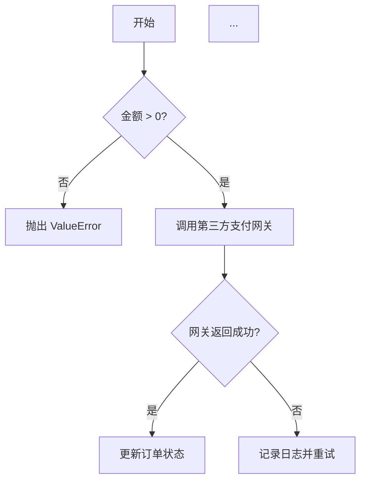
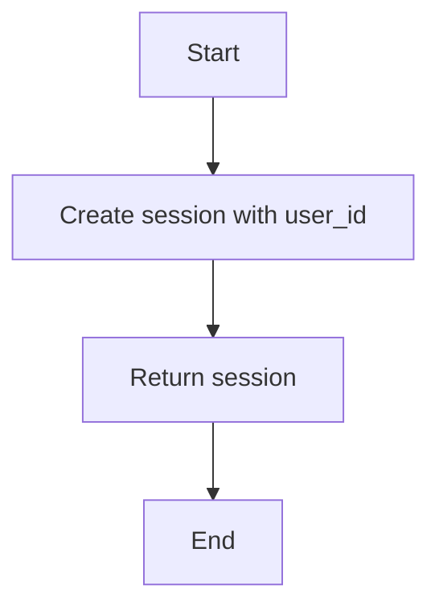
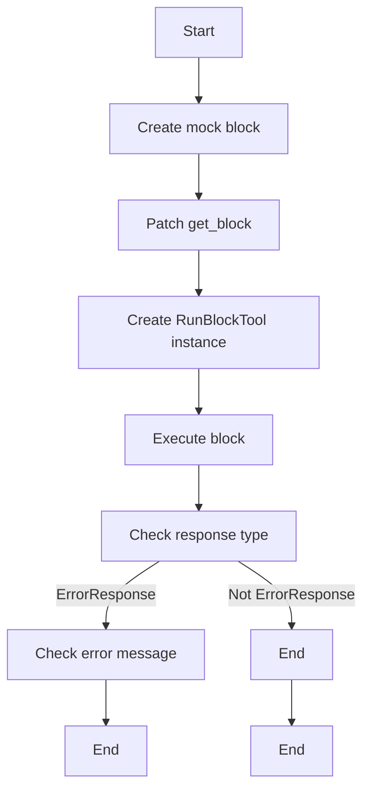
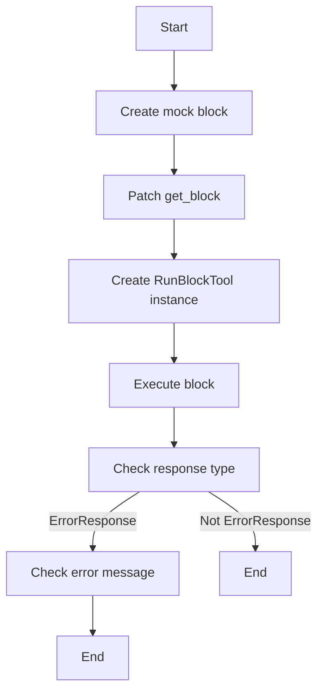
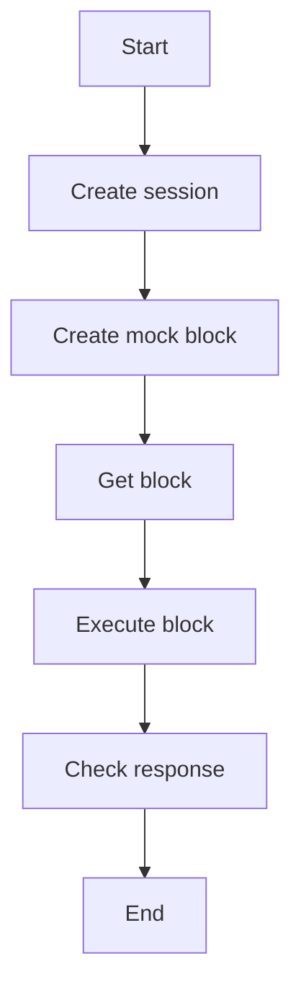

# `.\AutoGPT\autogpt_platform\backend\backend\api\features\chat\tools\run_block_test.py` 详细设计文档

The code provides a testing framework for the RunBlockTool class, which is responsible for executing blocks within a CoPilot environment, including handling errors and filtering based on block type and ID.

## 整体流程



## 类结构

```
TestRunBlockFiltering (测试类)
├── test_excluded_block_type_returns_error (测试方法)
├── test_excluded_block_id_returns_error (测试方法)
└── test_non_excluded_block_passes_guard (测试方法)
```

## 全局变量及字段


### `_TEST_USER_ID`
    
A constant string representing the test user ID used in the tests.

类型：`str`
    


    

## 全局函数及方法


### `make_mock_block`

Create a mock block for testing.

参数：

- `block_id`：`str`，The unique identifier for the block.
- `name`：`str`，The name of the block.
- `block_type`：`BlockType`，The type of the block.
- `disabled`：`bool`，Optional; whether the block is disabled. Defaults to `False`.

返回值：`MagicMock`，A mock object representing the block.

#### 流程图

```mermaid
graph TD
    A[Start] --> B[Create MagicMock object]
    B --> C[Set mock.id to block_id]
    C --> D[Set mock.name to name]
    D --> E[Set mock.block_type to block_type]
    E --> F[Set mock.disabled to disabled]
    F --> G[Create mock.input_schema]
    G --> H[Set mock.input_schema.jsonschema to {"properties": {}, "required": []}]
    H --> I[Set mock.input_schema.get_credentials_fields_info to []]
    I --> J[Return mock]
    J --> K[End]
```

#### 带注释源码

```python
def make_mock_block(
    block_id: str, name: str, block_type: BlockType, disabled: bool = False
):
    """Create a mock block for testing."""
    mock = MagicMock()
    mock.id = block_id
    mock.name = name
    mock.block_type = block_type
    mock.disabled = disabled
    mock.input_schema = MagicMock()
    mock.input_schema.jsonschema.return_value = {"properties": {}, "required": []}
    mock.input_schema.get_credentials_fields_info.return_value = []
    return mock
```


### `make_session(user_id)`

This function creates a session for a user with the specified user ID.

参数：

- `user_id`：`str`，The user ID for which the session is to be created.

返回值：`session`，`session` is a placeholder for the actual session object that represents the user's session.

#### 流程图



#### 带注释源码

```python
def make_session(user_id: str):
    # Placeholder for the actual session creation logic
    session = "session"  # This should be replaced with the actual session object
    return session
```


### TestRunBlockFiltering.test_excluded_block_type_returns_error

This function tests that attempting to execute a block with an excluded BlockType returns an error.

参数：

- `input_block`：`Mock`，A mock block object representing the input block to be tested.
- `block_id`：`str`，The ID of the block to be tested.
- `name`：`str`，The name of the block to be tested.
- `block_type`：`BlockType`，The type of the block to be tested.
- `disabled`：`bool`，Optional; whether the block is disabled (default is `False`).

返回值：`None`，This function does not return a value.

#### 流程图



#### 带注释源码

```python
@patch(
    "backend.api.features.chat.tools.run_block.get_block",
    return_value=input_block,
)
async def test_excluded_block_type_returns_error(self, mock_get_block):
    """Attempting to execute a block with excluded BlockType returns error."""
    session = make_session(user_id=_TEST_USER_ID)

    input_block = make_mock_block("input-block-id", "Input Block", BlockType.INPUT)

    with patch(
        "backend.api.features.chat.tools.run_block.get_block",
        return_value=input_block,
    ):
        tool = RunBlockTool()
        response = await tool._execute(
            user_id=_TEST_USER_ID,
            session=session,
            block_id="input-block-id",
            input_data={},
        )

    assert isinstance(response, ErrorResponse)
    assert "cannot be run directly in CoPilot" in response.message
    assert "designed for use within graphs only" in response.message
```


### test_excluded_block_id_returns_error

This function tests that attempting to execute a block with an excluded block ID returns an error.

参数：

- `smart_decision_id`：`str`，The ID of the block to be tested.
- `smart_block`：`MagicMock`，A mock block object representing the SmartDecisionMakerBlock.

返回值：`ErrorResponse`，An error response object containing the error message.

#### 流程图



#### 带注释源码

```python
@patch(
    "backend.api.features.chat.tools.run_block.get_block",
    return_value=smart_block,
)
async def test_excluded_block_id_returns_error(self, mock_get_block):
    """Attempting to execute SmartDecisionMakerBlock returns error."""
    session = make_session(user_id=_TEST_USER_ID)

    smart_decision_id = "3b191d9f-356f-482d-8238-ba04b6d18381"
    smart_block = make_mock_block(
        smart_decision_id, "Smart Decision Maker", BlockType.STANDARD
    )

    with patch(
        "backend.api.features.chat.tools.run_block.get_block",
        return_value=smart_block,
    ):
        tool = RunBlockTool()
        response = await tool._execute(
            user_id=_TEST_USER_ID,
            session=session,
            block_id=smart_decision_id,
            input_data={},
        )

    assert isinstance(response, ErrorResponse)
    assert "cannot be run directly in CoPilot" in response.message
``` 


### test_non_excluded_block_passes_guard

This function tests that non-excluded blocks pass the filtering guard, meaning they are not blocked by the exclusion criteria.

参数：

- `session`：`Session`，A session object representing the user's session.
- `standard_block`：`Mock`，A mock block object representing a standard block that is not excluded.

返回值：`Response`，The response from executing the block.

#### 流程图



#### 带注释源码

```python
@patch(
    "backend.api.features.chat.tools.run_block.get_block",
    return_value=standard_block,
)
async def test_non_excluded_block_passes_guard(self, mock_get_block):
    """Non-excluded blocks pass the filtering guard (may fail later for other reasons)."""
    session = make_session(user_id=_TEST_USER_ID)

    standard_block = make_mock_block(
        "standard-id", "HTTP Request", BlockType.STANDARD
    )

    tool = RunBlockTool()
    response = await tool._execute(
        user_id=_TEST_USER_ID,
        session=session,
        block_id="standard-id",
        input_data={},
    )

    # Should NOT be an ErrorResponse about CoPilot exclusion
    # (may be other errors like missing credentials, but not the exclusion guard)
    if isinstance(response, ErrorResponse):
        assert "cannot be run directly in CoPilot" not in response.message
``` 


## 关键组件


### 张量索引与惰性加载

用于在执行过程中按需加载和索引张量，以优化内存使用和性能。

### 反量化支持

提供对反量化操作的支持，允许在量化过程中进行反向操作。

### 量化策略

定义了量化策略，用于在模型训练和推理过程中进行量化处理。


## 问题及建议


### 已知问题

-   **测试覆盖率不足**：代码中只包含了对特定情况的测试，例如排除的块类型和ID。没有涵盖所有可能的块类型和ID，以及它们在执行过程中的不同组合。
-   **异常处理**：代码中没有显示对潜在异常的处理，例如`get_block`函数可能抛出的异常。
-   **全局变量**：`_TEST_USER_ID`是一个全局变量，它可能在不同测试之间共享，这可能导致测试之间的状态污染。
-   **代码重复**：`make_mock_block`函数被多次调用，这可能导致代码重复和维护困难。

### 优化建议

-   **增加测试覆盖率**：编写更多的测试用例，以覆盖所有可能的块类型和ID，以及它们在执行过程中的不同组合。
-   **改进异常处理**：在调用`get_block`函数时添加异常处理，以确保在出现错误时能够优雅地处理异常。
-   **避免全局变量**：使用函数参数或类属性来代替全局变量，以避免测试之间的状态污染。
-   **重构代码**：将`make_mock_block`函数提取到一个单独的模块或类中，以减少代码重复并提高可维护性。
-   **使用更具体的错误消息**：在`ErrorResponse`中提供更具体的错误消息，以便于调试和用户理解错误原因。
-   **考虑异步操作**：如果`get_block`函数是异步的，确保测试用例正确处理异步操作。


## 其它


### 设计目标与约束

- 设计目标：
  - 确保代码能够有效地执行块执行守卫，以防止在CoPilot中直接运行某些类型的块。
  - 确保测试能够覆盖不同类型的块，包括被排除和未被排除的块。
  - 确保测试能够处理错误响应，并在必要时返回适当的错误消息。

- 约束：
  - 代码必须遵循现有的API和模型结构。
  - 测试必须使用模拟对象来避免对实际数据库的依赖。
  - 测试必须异步执行，以模拟实际的生产环境。

### 错误处理与异常设计

- 错误处理：
  - 使用`ErrorResponse`类来处理错误情况，并返回包含错误消息的响应。
  - 在测试中验证错误消息是否正确。

- 异常设计：
  - 异常应该被捕获并转换为`ErrorResponse`，以便于测试和用户理解。

### 数据流与状态机

- 数据流：
  - 用户请求执行一个块。
  - `RunBlockTool`根据块类型和ID执行相应的操作。
  - 如果块被排除，则返回错误响应。
  - 如果块未被排除，则继续执行（可能失败，但不是由于排除守卫）。

- 状态机：
  - 无需状态机，因为测试流程是线性的。

### 外部依赖与接口契约

- 外部依赖：
  - `unittest.mock`用于模拟对象。
  - `pytest`用于编写和运行测试。
  - `backend.api.features.chat.tools.run_block`包含执行块的逻辑。
  - `backend.data.block`包含块类型定义。

- 接口契约：
  - `RunBlockTool`类应该有一个`_execute`方法，它接受用户ID、会话、块ID和输入数据作为参数，并返回一个响应。
  - `ErrorResponse`类应该有一个`message`属性，用于存储错误消息。
  - `BlockType`枚举定义了不同的块类型。


    