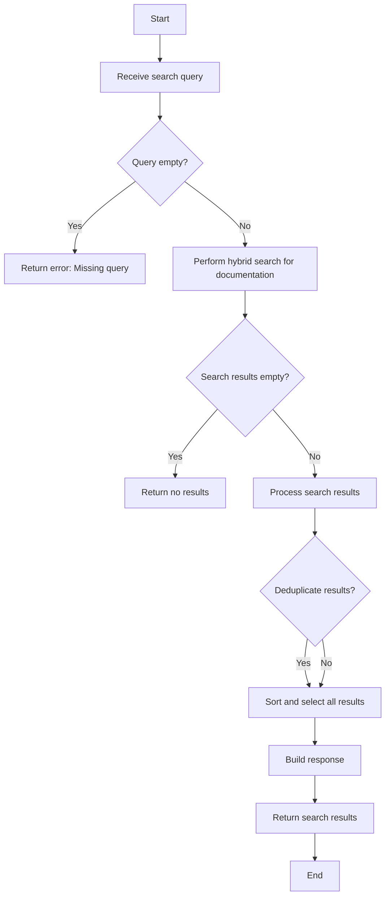
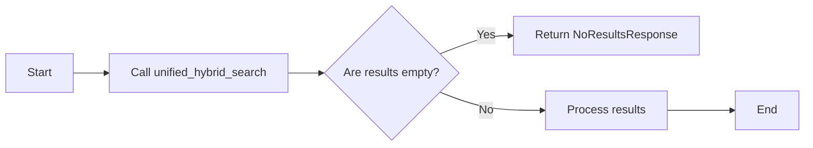
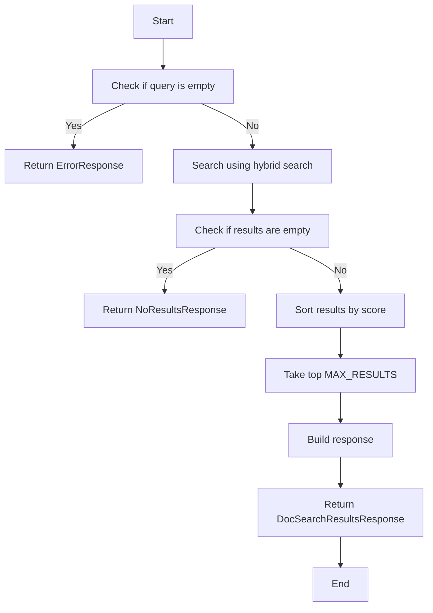
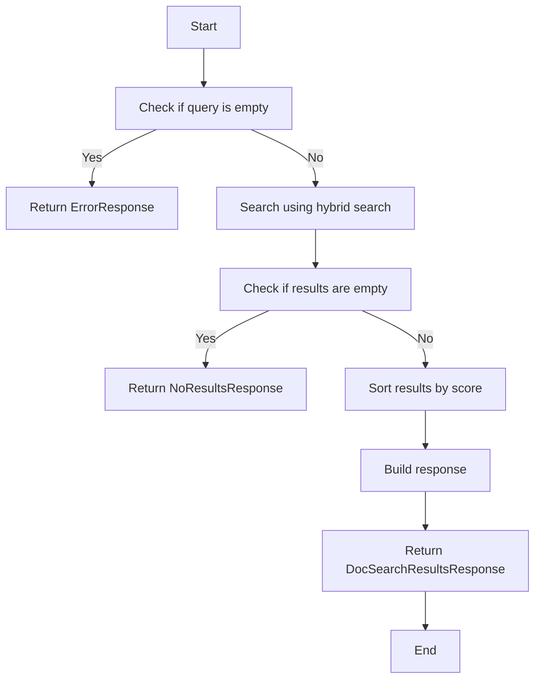

# `.\AutoGPT\autogpt_platform\backend\backend\api\features\chat\tools\search_docs.py` 详细设计文档

The SearchDocsTool module provides functionality to search the AutoGPT platform documentation using a hybrid search approach, returning relevant sections and snippets.

## 整体流程



## 类结构

```
SearchDocsTool (Class)
├── BaseTool (Base Class)
│   ├── _execute (Method)
│   ├── name (Property)
│   ├── description (Property)
│   ├── parameters (Property)
│   └── requires_auth (Property)
└── _create_snippet (Method)
    ├── _make_doc_url (Method)
```

## 全局变量及字段


### `logger`
    
Logger instance for logging messages.

类型：`logging.Logger`
    


### `DOCS_BASE_URL`
    
Base URL for documentation.

类型：`str`
    


### `MAX_RESULTS`
    
Maximum number of results to return.

类型：`int`
    


### `SNIPPET_LENGTH`
    
Length of snippet for preview.

类型：`int`
    


### `name`
    
Name of the tool.

类型：`str`
    


### `description`
    
Description of the tool.

类型：`str`
    


### `parameters`
    
Parameters required by the tool.

类型：`dict[str, Any]`
    


### `requires_auth`
    
Indicates if the tool requires authentication.

类型：`bool`
    


### `name`
    
Name of the base tool class.

类型：`str`
    


### `description`
    
Description of the base tool class.

类型：`str`
    


### `parameters`
    
Parameters required by the base tool class.

类型：`dict[str, Any]`
    


### `requires_auth`
    
Indicates if the base tool class requires authentication.

类型：`bool`
    


### `SearchDocsTool.name`
    
Name of the SearchDocsTool class.

类型：`str`
    


### `SearchDocsTool.description`
    
Description of the SearchDocsTool class.

类型：`str`
    


### `SearchDocsTool.parameters`
    
Parameters required by the SearchDocsTool class.

类型：`dict[str, Any]`
    


### `SearchDocsTool.requires_auth`
    
Indicates if the SearchDocsTool requires authentication.

类型：`bool`
    


### `BaseTool.name`
    
Name of the BaseTool class.

类型：`str`
    


### `BaseTool.description`
    
Description of the BaseTool class.

类型：`str`
    


### `BaseTool.parameters`
    
Parameters required by the BaseTool class.

类型：`dict[str, Any]`
    


### `BaseTool.requires_auth`
    
Indicates if the BaseTool requires authentication.

类型：`bool`
    
    

## 全局函数及方法


### unified_hybrid_search

Searches for content using a hybrid search approach.

参数：

- `query`：`str`，The search query to find relevant content.
- `content_types`：`list[ContentType]`，The content types to search within.
- `page`：`int`，The page number of the search results.
- `page_size`：`int`，The number of results to return per page.
- `min_score`：`float`，The minimum score required for a result to be included.

返回值：`tuple[list[dict[str, Any]], int]`，A tuple containing the list of search results and the total number of results.

#### 流程图



#### 带注释源码

```python
async def unified_hybrid_search(
    query: str,
    content_types: list[ContentType],
    page: int = 1,
    page_size: int = 10,
    min_score: float = 0.0,
) -> tuple[list[dict[str, Any]], int]:
    # Implementation of the hybrid search logic
    # This is a placeholder for the actual search logic
    # For the purpose of this example, we will return a dummy response
    dummy_results = [
        {"metadata": {"path": "example_path", "doc_title": "Example Title", "section_title": "Example Section", "combined_score": 0.9}},
        {"metadata": {"path": "example_path_2", "doc_title": "Another Example Title", "section_title": "Another Example Section", "combined_score": 0.8}},
    ]
    total_results = len(dummy_results)
    filtered_results = [result for result in dummy_results if result.get("combined_score", 0) >= min_score]
    return filtered_results, total_results
```


### `_create_snippet`

Create a short snippet from content for preview.

参数：

- `content`：`str`，The content from which to create a snippet.
- `max_length`：`int`，The maximum length of the snippet. Defaults to `SNIPPET_LENGTH`.

返回值：`str`，A short snippet of the content.

#### 流程图

```mermaid
graph LR
A[Start] --> B{Is content length <= max_length?}
B -- Yes --> C[Return clean_content]
B -- No --> D[Truncate at word boundary]
D --> E[Return truncated + "..."]
C --> F[End]
E --> F
```

#### 带注释源码

```python
def _create_snippet(self, content: str, max_length: int = SNIPPET_LENGTH) -> str:
    """Create a short snippet from content for preview."""
    # Remove markdown formatting for cleaner snippet
    clean_content = content.replace("#", "").replace("*", "").replace("`", "")
    # Remove extra whitespace
    clean_content = " ".join(clean_content.split())

    if len(clean_content) <= max_length:
        return clean_content

    # Truncate at word boundary
    truncated = clean_content[:max_length]
    last_space = truncated.rfind(" ")
    if last_space > max_length // 2:
        truncated = truncated[:last_space]

    return truncated + "..."
```


### `_make_doc_url`

Create a URL for a documentation page.

参数：

- `path`：`str`，The path to the documentation page without the file extension.

返回值：`str`，The full URL for the documentation page.

#### 流程图

```mermaid
graph LR
A[Start] --> B{Check if path contains "."}
B -- Yes --> C[Remove file extension]
B -- No --> C
C --> D[Concatenate base URL and path]
D --> E[Return URL]
E --> F[End]
```

#### 带注释源码

```python
def _make_doc_url(self, path: str) -> str:
    """Create a URL for a documentation page."""
    # Remove file extension for URL
    url_path = path.rsplit(".", 1)[0] if "." in path else path
    return f"{DOCS_BASE_URL}/{url_path}"
```


### `_execute`

Search documentation and return relevant sections.

参数：

- `user_id`：`str | None`，User ID (not required for docs)
- `session`：`ChatSession`，Chat session
- `**kwargs`：`Any`，Additional keyword arguments

返回值：`ToolResponseBase`，List of matching documentation sections, No results found, or Error message

#### 流程图



#### 带注释源码

```python
async def _execute(
    self,
    user_id: str | None,
    session: ChatSession,
    **kwargs,
) -> ToolResponseBase:
    """Search documentation and return relevant sections.

    Args:
        user_id: User ID (not required for docs)
        session: Chat session
        query: Search query

    Returns:
        DocSearchResultsResponse: List of matching documentation sections
        NoResultsResponse: No results found
        ErrorResponse: Error message
    """
    query = kwargs.get("query", "").strip()
    session_id = session.session_id if session else None

    if not query:
        return ErrorResponse(
            message="Please provide a search query.",
            error="Missing query parameter",
            session_id=session_id,
        )

    try:
        # Search using hybrid search for DOCUMENTATION content type only
        results, total = await unified_hybrid_search(
            query=query,
            content_types=[ContentType.DOCUMENTATION],
            page=1,
            page_size=MAX_RESULTS * 2,  # Fetch extra for deduplication
            min_score=0.1,  # Lower threshold for docs
        )

        if not results:
            return NoResultsResponse(
                message=f"No documentation found for '{query}'.",
                suggestions=[
                    "Try different keywords",
                    "Use more general terms",
                    "Check for typos in your query",
                ],
                session_id=session_id,
            )

        # Deduplicate by document path (keep highest scoring section per doc)
        seen_docs: dict[str, dict[str, Any]] = {}
        for result in results:
            metadata = result.get("metadata", {})
            doc_path = metadata.get("path", "")

            if not doc_path:
                continue

            # Keep the highest scoring result for each document
            if doc_path not in seen_docs:
                seen_docs[doc_path] = result
            elif result.get("combined_score", 0) > seen_docs[doc_path].get(
                "combined_score", 0
            ):
                seen_docs[doc_path] = result

        # Sort by score and take top MAX_RESULTS
        deduplicated = sorted(
            seen_docs.values(),
            key=lambda x: x.get("combined_score", 0),
            reverse=True,
        )[:MAX_RESULTS]

        if not deduplicated:
            return NoResultsResponse(
                message=f"No documentation found for '{query}'.",
                suggestions=[
                    "Try different keywords",
                    "Use more general terms",
                ],
                session_id=session_id,
            )

        # Build response
        doc_results: list[DocSearchResult] = []
        for result in deduplicated:
            metadata = result.get("metadata", {})
            doc_path = metadata.get("path", "")
            doc_title = metadata.get("doc_title", "")
            section_title = metadata.get("section_title", "")
            searchable_text = result.get("searchable_text", "")
            score = result.get("combined_score", 0)

            doc_results.append(
                DocSearchResult(
                    title=doc_title or section_title or doc_path,
                    path=doc_path,
                    section=section_title,
                    snippet=self._create_snippet(searchable_text),
                    score=round(score, 3),
                    doc_url=self._make_doc_url(doc_path),
                )
            )

        return DocSearchResultsResponse(
            message=f"Found {len(doc_results)} relevant documentation sections.",
            results=doc_results,
            count=len(doc_results),
            query=query,
            session_id=session_id,
        )

    except Exception as e:
        logger.error(f"Documentation search failed: {e}")
        return ErrorResponse(
            message=f"Failed to search documentation: {str(e)}",
            error="search_failed",
            session_id=session_id,
        )
```


### `_execute`

Search documentation and return relevant sections.

参数：

- `user_id`：`str | None`，User ID (not required for docs)
- `session`：`ChatSession`，Chat session
- `**kwargs`：`Any`，Additional keyword arguments

返回值：`ToolResponseBase`，List of matching documentation sections, No results found, or Error message

#### 流程图



#### 带注释源码

```python
async def _execute(
    self,
    user_id: str | None,
    session: ChatSession,
    **kwargs,
) -> ToolResponseBase:
    """Search documentation and return relevant sections.

    Args:
        user_id: User ID (not required for docs)
        session: Chat session
        query: Search query

    Returns:
        DocSearchResultsResponse: List of matching documentation sections
        NoResultsResponse: No results found
        ErrorResponse: Error message
    """
    query = kwargs.get("query", "").strip()
    session_id = session.session_id if session else None

    if not query:
        return ErrorResponse(
            message="Please provide a search query.",
            error="Missing query parameter",
            session_id=session_id,
        )

    try:
        # Search using hybrid search for DOCUMENTATION content type only
        results, total = await unified_hybrid_search(
            query=query,
            content_types=[ContentType.DOCUMENTATION],
            page=1,
            page_size=MAX_RESULTS * 2,  # Fetch extra for deduplication
            min_score=0.1,  # Lower threshold for docs
        )

        if not results:
            return NoResultsResponse(
                message=f"No documentation found for '{query}'.",
                suggestions=[
                    "Try different keywords",
                    "Use more general terms",
                    "Check for typos in your query",
                ],
                session_id=session_id,
            )

        # Deduplicate by document path (keep highest scoring section per doc)
        seen_docs: dict[str, dict[str, Any]] = {}
        for result in results:
            metadata = result.get("metadata", {})
            doc_path = metadata.get("path", "")

            if not doc_path:
                continue

            # Keep the highest scoring result for each document
            if doc_path not in seen_docs:
                seen_docs[doc_path] = result
            elif result.get("combined_score", 0) > seen_docs[doc_path].get(
                "combined_score", 0
            ):
                seen_docs[doc_path] = result

        # Sort by score and take top MAX_RESULTS
        deduplicated = sorted(
            seen_docs.values(),
            key=lambda x: x.get("combined_score", 0),
            reverse=True,
        )[:MAX_RESULTS]

        if not deduplicated:
            return NoResultsResponse(
                message=f"No documentation found for '{query}'.",
                suggestions=[
                    "Try different keywords",
                    "Use more general terms",
                ],
                session_id=session_id,
            )

        # Build response
        doc_results: list[DocSearchResult] = []
        for result in deduplicated:
            metadata = result.get("metadata", {})
            doc_path = metadata.get("path", "")
            doc_title = metadata.get("doc_title", "")
            section_title = metadata.get("section_title", "")
            searchable_text = result.get("searchable_text", "")
            score = result.get("combined_score", 0)

            doc_results.append(
                DocSearchResult(
                    title=doc_title or section_title or doc_path,
                    path=doc_path,
                    section=section_title,
                    snippet=self._create_snippet(searchable_text),
                    score=round(score, 3),
                    doc_url=self._make_doc_url(doc_path),
                )
            )

        return DocSearchResultsResponse(
            message=f"Found {len(doc_results)} relevant documentation sections.",
            results=doc_results,
            count=len(doc_results),
            query=query,
            session_id=session_id,
        )

    except Exception as e:
        logger.error(f"Documentation search failed: {e}")
        return ErrorResponse(
            message=f"Failed to search documentation: {str(e)}",
            error="search_failed",
            session_id=session_id,
        )
```


## 关键组件


### 张量索引与惰性加载

用于高效地索引和检索文档内容，支持延迟加载以优化性能。

### 反量化支持

提供对量化策略的反量化支持，以适应不同的量化需求。

### 量化策略

定义了量化策略，用于优化文档搜索的性能和准确性。


## 问题及建议


### 已知问题

-   **全局变量配置**：`DOCS_BASE_URL`、`MAX_RESULTS` 和 `SNIPPET_LENGTH` 作为全局变量，可能更适合作为类属性或配置文件的一部分，以便于管理和修改。
-   **错误处理**：异常处理中捕获了所有异常，但没有针对特定异常进行区分处理，可能导致调试困难。
-   **代码重复**：在处理搜索结果时，存在重复的代码用于构建 `DocSearchResult` 对象，可以考虑使用循环或工厂模式来减少代码重复。
-   **性能优化**：在搜索时，使用了 `MAX_RESULTS * 2` 来获取结果，这可能导致不必要的性能开销，可以考虑根据实际需求调整。

### 优化建议

-   **配置管理**：将全局变量移至配置文件或类属性中，以便于管理和修改。
-   **异常处理**：针对可能发生的特定异常进行分类处理，提高代码的可读性和可维护性。
-   **代码重构**：对重复的代码进行重构，例如使用循环或工厂模式来创建 `DocSearchResult` 对象。
-   **性能优化**：根据实际需求调整搜索结果的数量，避免不必要的性能开销。
-   **日志记录**：增加更详细的日志记录，以便于问题追踪和调试。
-   **单元测试**：编写单元测试来确保代码的稳定性和可靠性。


## 其它


### 设计目标与约束

- 设计目标：
  - 提供一个高效、准确的文档搜索工具。
  - 确保搜索结果的相关性和准确性。
  - 提供友好的用户界面和易于使用的API。
- 约束：
  - 限制返回结果的最大数量。
  - 需要处理异常情况，如查询参数缺失或搜索失败。

### 错误处理与异常设计

- 错误处理：
  - 当查询参数缺失时，返回错误响应。
  - 当搜索失败时，记录错误并返回错误响应。
  - 当没有找到相关文档时，返回无结果响应。
- 异常设计：
  - 使用try-except块捕获可能发生的异常。
  - 使用日志记录错误信息。

### 数据流与状态机

- 数据流：
  - 用户发起搜索请求。
  - 工具处理请求，执行搜索。
  - 返回搜索结果或错误响应。
- 状态机：
  - 搜索状态：包括搜索中、搜索完成、搜索失败等。

### 外部依赖与接口契约

- 外部依赖：
  - Prisma ORM库用于数据库操作。
  - logging库用于日志记录。
  - typing库用于类型注解。
- 接口契约：
  - `unified_hybrid_search`函数用于执行搜索。
  - `DocSearchResult`、`DocSearchResultsResponse`、`ErrorResponse`、`NoResultsResponse`等类用于定义响应格式。

    