# `AutoGPT\autogpt_platform\backend\backend\api\features\chat\tools\utils.py` 详细设计文档

该文件提供了一套共享的异步和同步工具函数，用于处理聊天工具中的图模型获取、凭证元数据提取及凭证匹配逻辑，核心功能包括从商店获取图数据、解析凭证输入模式、将用户的可用凭证与图节点的凭证需求进行匹配，以及管理用户的代理库实例创建。

## 整体流程

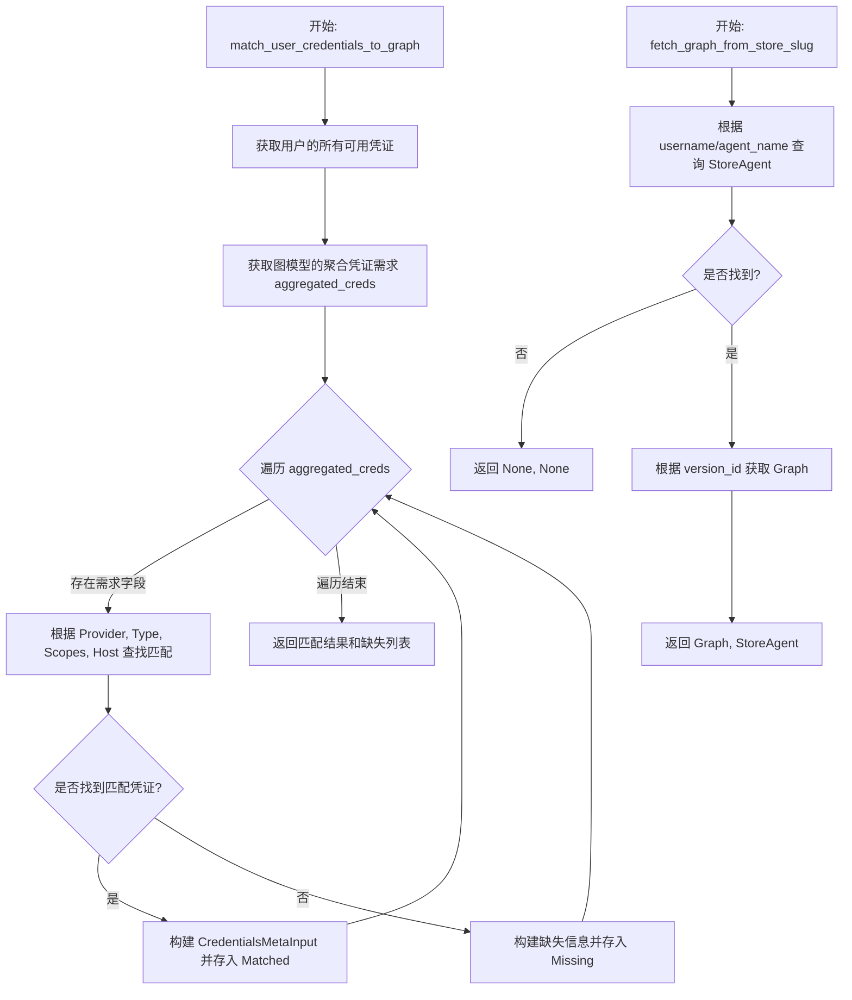

## 类结构

```
No classes defined in this file.
```

## 全局变量及字段


### `logger`
    
Logger instance for recording module events, errors, and debug information.

类型：`logging.Logger`
    


    

## 全局函数及方法


### `fetch_graph_from_store_slug`

Fetch graph from store by username/agent_name slug.

参数：

-  `username`：`str`，Creator's username
-  `agent_name`：`str`，Agent name/slug

返回值：`tuple[GraphModel | None, Any | None]`，The graph and store agent details, or (None, None) if not found.

#### 流程图

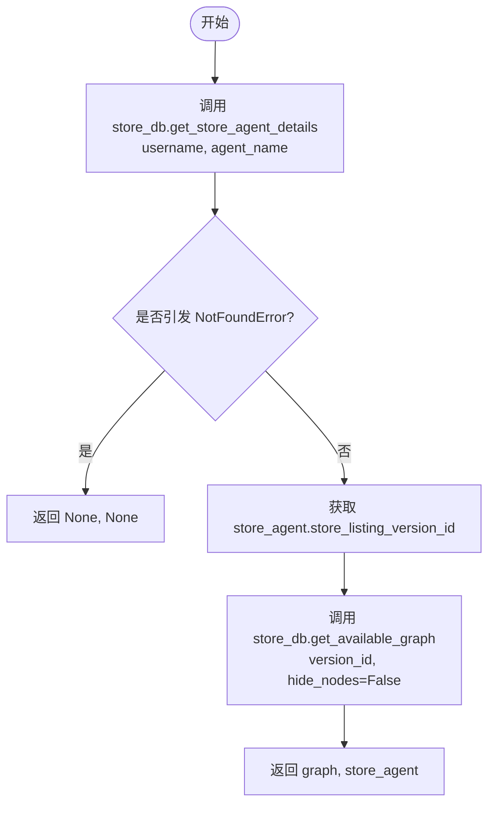

#### 带注释源码

```python
async def fetch_graph_from_store_slug(
    username: str,
    agent_name: str,
) -> tuple[GraphModel | None, Any | None]:
    """
    Fetch graph from store by username/agent_name slug.

    Args:
        username: Creator's username
        agent_name: Agent name/slug

    Returns:
        tuple[Graph | None, StoreAgentDetails | None]: The graph and store agent details,
        or (None, None) if not found.

    Raises:
        DatabaseError: If there's a database error during lookup.
    """
    try:
        # 尝试根据用户名和代理名称获取商店代理详情
        store_agent = await store_db.get_store_agent_details(username, agent_name)
    except NotFoundError:
        # 如果未找到，返回 None, None
        return None, None

    # 从商店列表版本中获取图表
    graph = await store_db.get_available_graph(
        store_agent.store_listing_version_id, hide_nodes=False
    )
    return graph, store_agent
```


### `extract_credentials_from_schema`

Extract credential requirements from graph's credentials_input_schema. This consolidates duplicated logic from get_agent_details.py and setup_agent.py.

参数：

-  `credentials_input_schema`：`dict[str, Any] | None`，The credentials_input_schema from a Graph object
-  ...

返回值：`list[CredentialsMetaInput]`，List of CredentialsMetaInput with provider and type info

#### 流程图

```mermaid
flowchart TD
    A([开始]) --> B[初始化空列表 credentials]
    B --> C{credentials_input_schema 是否为字典且包含 'properties'?}
    C -- 否 --> D([返回空列表 credentials])
    C -- 是 --> E[遍历 credentials_input_schema['properties'] 的每一项]
    E --> F[调用 _extract_provider_from_schema 提取 provider]
    F --> G[调用 _extract_credential_type_from_schema 提取 type]
    G --> H[创建 CredentialsMetaInput 对象]
    H --> I[追加到 credentials 列表]
    I --> E
    E -- 遍历结束 --> J([返回 credentials])
```

#### 带注释源码

```python
def extract_credentials_from_schema(
    credentials_input_schema: dict[str, Any] | None,
) -> list[CredentialsMetaInput]:
    """
    Extract credential requirements from graph's credentials_input_schema.

    This consolidates duplicated logic from get_agent_details.py and setup_agent.py.

    Args:
        credentials_input_schema: The credentials_input_schema from a Graph object

    Returns:
        List of CredentialsMetaInput with provider and type info
    """
    # 初始化一个空列表，用于存储提取出的凭据元数据
    credentials: list[CredentialsMetaInput] = []

    # 检查输入是否为字典且包含 'properties' 键
    # 如果输入格式不符合预期，直接返回空列表
    if (
        not isinstance(credentials_input_schema, dict)
        or "properties" not in credentials_input_schema
    ):
        return credentials

    # 遍历 properties 中的每一项，每一项代表一个凭据字段的定义
    for cred_name, cred_schema in credentials_input_schema["properties"].items():
        # 从 schema 中提取 provider 信息
        provider = _extract_provider_from_schema(cred_schema)
        # 从 schema 中提取凭据类型信息
        cred_type = _extract_credential_type_from_schema(cred_schema)

        # 创建 CredentialsMetaInput 对象并存入列表
        credentials.append(
            CredentialsMetaInput(
                id=cred_name,
                title=cred_schema.get("title", cred_name),
                provider=provider,  # type: ignore
                type=cred_type,  # type: ignore
            )
        )

    return credentials
```


### `_serialize_missing_credential`

将凭据字段信息转换为可序列化的字典，保留所有支持的凭据类型（例如 api_key + oauth2），以便 UI 可以提供多个选项。

参数：

-  `field_key`：`str`，凭据字段的标识符（键名）。
-  `field_info`：`CredentialsFieldInfo`，包含凭据字段详细信息的对象，如支持的类型、提供者和所需权限范围。

返回值：`dict[str, Any]`，包含序列化后的凭据元数据的字典，格式化为适合前端 UI 使用的结构。

#### 流程图

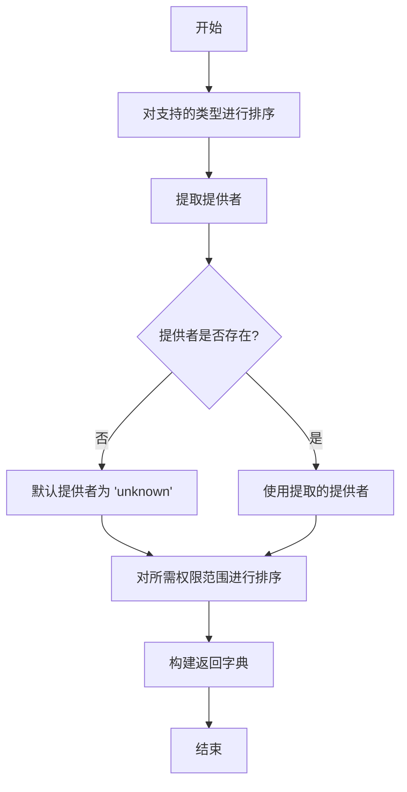

#### 带注释源码

```python
def _serialize_missing_credential(
    field_key: str, field_info: CredentialsFieldInfo
) -> dict[str, Any]:
    """
    Convert credential field info into a serializable dict that preserves all supported
    credential types (e.g., api_key + oauth2) so the UI can offer multiple options.
    """
    # 对支持的类型列表进行排序，确保输出的一致性
    supported_types = sorted(field_info.supported_types)
    
    # 从 provider 集合中获取第一个元素，如果为空则默认为 "unknown"
    provider = next(iter(field_info.provider), "unknown")
    
    # 对所需权限范围进行排序，如果为 None 则默认为空列表
    scopes = sorted(field_info.required_scopes or [])

    # 返回格式化后的字典
    return {
        "id": field_key,
        # 将下划线命名转换为标题格式用于显示
        "title": field_key.replace("_", " ").title(),
        "provider": provider,
        "provider_name": provider.replace("_", " ").title(),
        # 如果没有支持的类型，默认显示 "api_key"
        "type": supported_types[0] if supported_types else "api_key",
        # 包含所有支持的类型，供 UI 展示多个选项
        "types": supported_types,
        "scopes": scopes,
    }
```


### `build_missing_credentials_from_graph`

该函数通过比较图表所需的聚合凭证输入与用户已提供的凭证，构建一个缺失凭证的映射字典。此过程旨在识别并格式化那些用户尚未匹配的凭证字段，同时保留这些字段所支持的所有凭证类型（如 api_key 或 oauth2），以便前端能够向用户展示完整的选项。

参数：

-  `graph`：`GraphModel`，包含节点和边信息的图表模型对象，用于聚合所有凭证输入要求。
-  `matched_credentials`：`dict[str, CredentialsMetaInput] | None`，用户当前已匹配的凭证字典，键为凭证字段名称。如果为 None，则视为没有匹配的凭证。

返回值：`dict[str, Any]`，包含缺失凭证信息的字典。键是缺失凭证的字段名，值是序列化后的详细信息（如提供商、支持类型、作用域等）。

#### 流程图

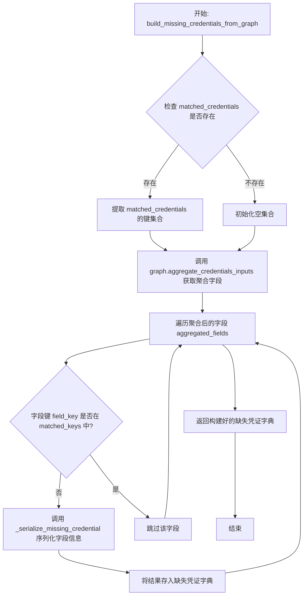

#### 带注释源码

```python
def build_missing_credentials_from_graph(
    graph: GraphModel, matched_credentials: dict[str, CredentialsMetaInput] | None
) -> dict[str, Any]:
    """
    Build a missing_credentials mapping from a graph's aggregated credentials inputs,
    preserving all supported credential types for each field.
    """
    # 提取已匹配凭证的键名集合，如果未提供匹配项则默认为空集合
    matched_keys = set(matched_credentials.keys()) if matched_credentials else set()
    
    # 从图表对象中获取聚合后的所有凭证输入字段要求
    # aggregated_fields 通常是一个字典，值包含 (field_info, _, _) 元组
    aggregated_fields = graph.aggregate_credentials_inputs()

    # 构建并返回缺失凭证的字典
    # 逻辑：遍历所有聚合字段，筛选出那些不在 matched_keys 中的字段
    # 对筛选出的字段，调用 _serialize_missing_credential 进行格式化
    return {
        field_key: _serialize_missing_credential(field_key, field_info)
        for field_key, (field_info, _, _) in aggregated_fields.items()
        if field_key not in matched_keys
    }
```


### `build_missing_credentials_from_field_info`

该函数用于根据凭据字段信息字典和已匹配的键集合，构建一个包含缺失凭据信息的映射字典。它会过滤掉已经匹配成功的凭据字段，将剩余的缺失凭据字段序列化为前端可用的格式。

参数：

-  `credential_fields`：`dict[str, CredentialsFieldInfo]`，包含所有需要检查的凭据字段信息的字典，键为字段名称，值为字段详细信息。
-  `matched_keys`：`set[str]`，已经成功匹配到凭据的字段名称集合。

返回值：`dict[str, Any]`，包含缺失凭据字段及其序列化信息（如 provider, type, scopes 等）的字典。

#### 流程图

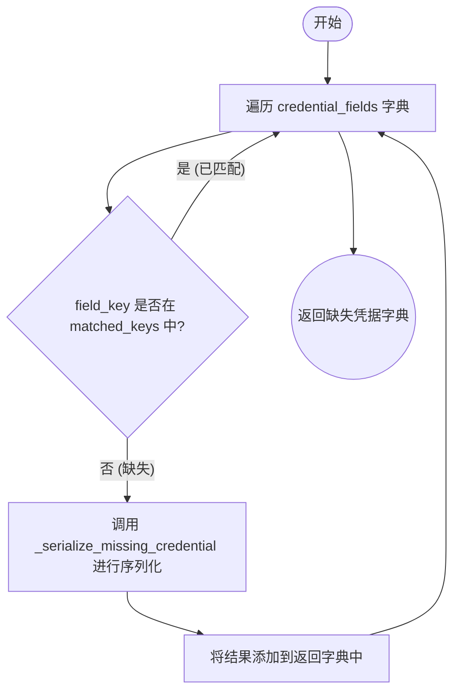

#### 带注释源码

```python
def build_missing_credentials_from_field_info(
    credential_fields: dict[str, CredentialsFieldInfo],
    matched_keys: set[str],
) -> dict[str, Any]:
    """
    Build missing_credentials mapping from a simple credentials field info dictionary.
    """
    # 使用字典推导式构建返回结果
    return {
        # 对每个字段键和字段信息进行序列化处理
        field_key: _serialize_missing_credential(field_key, field_info)
        # 遍历输入的所有凭据字段
        for field_key, field_info in credential_fields.items()
        # 条件判断：仅处理那些不在已匹配键集合中的字段（即缺失的凭据）
        if field_key not in matched_keys
    }
```


### `extract_credentials_as_dict`

Extract credential requirements as a dict keyed by field name.

参数：

- `credentials_input_schema`：`dict[str, Any] | None`，The credentials_input_schema from a Graph object

返回值：`dict[str, CredentialsMetaInput]`，Dict mapping field name to CredentialsMetaInput

#### 流程图

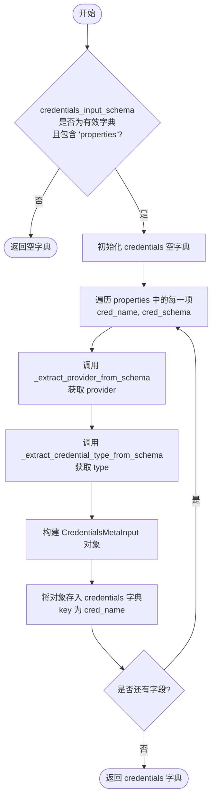

#### 带注释源码

```python
def extract_credentials_as_dict(
    credentials_input_schema: dict[str, Any] | None,
) -> dict[str, CredentialsMetaInput]:
    """
    Extract credential requirements as a dict keyed by field name.

    Args:
        credentials_input_schema: The credentials_input_schema from a Graph object

    Returns:
        Dict mapping field name to CredentialsMetaInput
    """
    # 初始化一个空字典用于存储提取出的凭据元数据
    credentials: dict[str, CredentialsMetaInput] = {}

    # 检查输入的 schema 是否为字典且包含 'properties' 键，如果不是则直接返回空字典
    if (
        not isinstance(credentials_input_schema, dict)
        or "properties" not in credentials_input_schema
    ):
        return credentials

    # 遍历 properties 字典中的每个凭据定义
    for cred_name, cred_schema in credentials_input_schema["properties"].items():
        # 从凭据 schema 中提取 provider 信息
        provider = _extract_provider_from_schema(cred_schema)
        # 从凭据 schema 中提取 type 信息
        cred_type = _extract_credential_type_from_schema(cred_schema)

        # 构造 CredentialsMetaInput 对象并存入结果字典
        credentials[cred_name] = CredentialsMetaInput(
            id=cred_name,
            title=cred_schema.get("title", cred_name), # 优先使用 schema 中的 title，否则使用字段名
            provider=provider,  # type: ignore
            type=cred_type,  # type: ignore
        )

    return credentials
```


### `_extract_provider_from_schema`

从凭据模式字典中提取提供者名称。函数首先检查是否存在非空的 `credentials_provider` 列表，若存在则返回其第一个元素；否则检查 `properties` 中是否存在 `provider` 常量；如果两者均不存在，则默认返回 "unknown"。

参数：

-  `cred_schema`：`dict[str, Any]`，包含凭据定义的模式字典

返回值：`str`，提取到的提供者名称字符串，若无法确定则返回 "unknown"

#### 流程图

```mermaid
flowchart TD
    A[开始: extract_provider_from_schema] --> B{cred_schema 中是否存在 'credentials_provider' 且非空?}
    B -- 是 --> C[返回 cred_schema['credentials_provider'][0]]
    B -- 否 --> D{cred_schema 中是否存在 'properties' 且包含 'provider'?}
    D -- 是 --> E[返回 cred_schema['properties']['provider'].get('const', 'unknown')]
    D -- 否 --> F[返回 'unknown']
```

#### 带注释源码

```python
def _extract_provider_from_schema(cred_schema: dict[str, Any]) -> str:
    """Extract provider from credential schema."""
    # 检查是否存在 'credentials_provider' 键，并且其对应的列表不为空
    if "credentials_provider" in cred_schema and cred_schema["credentials_provider"]:
        # 如果存在，直接返回列表中的第一个元素（通常就是 provider 名称）
        return cred_schema["credentials_provider"][0]
    
    # 如果第一种方式未找到，检查是否存在 'properties' 键，且其中包含 'provider' 键
    if "properties" in cred_schema and "provider" in cred_schema["properties"]:
        # 尝试从嵌套的 properties 中获取 provider 的常量值，如果没有 const 则默认为 'unknown'
        return cred_schema["properties"]["provider"].get("const", "unknown")
    
    # 如果以上两种逻辑分支均未匹配，返回默认值 'unknown'
    return "unknown"
```


### `_extract_credential_type_from_schema`

从给定的凭据模式字典中提取凭据类型。该函数会按优先级检查特定的键值结构，若未找到明确的类型定义，则返回默认类型。

参数：

- `cred_schema`：`dict[str, Any]`，包含凭据定义的字典结构。

返回值：`str`，提取到的凭据类型字符串（例如 "api_key", "oauth2"），默认返回 "api_key"。

#### 流程图

```mermaid
graph TD
    A[开始: _extract_credential_type_from_schema] --> B{cred_schema 包含 'credentials_types' 且非空?}
    B -- 是 --> C[返回 cred_schema['credentials_types'][0]]
    B -- 否 --> D{cred_schema 包含 'properties' 且 properties 包含 'type'?}
    D -- 是 --> E[获取 properties['type'] 中的 'const']
    E --> F[返回 'const' 值或默认 'api_key']
    D -- 否 --> G[返回默认值 'api_key']
```

#### 带注释源码

```python
def _extract_credential_type_from_schema(cred_schema: dict[str, Any]) -> str:
    """Extract credential type from credential schema."""
    # 优先检查是否存在 'credentials_types' 字段并且该字段不为空
    if "credentials_types" in cred_schema and cred_schema["credentials_types"]:
        # 如果存在，返回该列表中的第一个类型
        return cred_schema["credentials_types"][0]
    # 其次检查是否存在嵌套的 'properties' 结构且其中包含 'type' 字段
    if "properties" in cred_schema and "type" in cred_schema["properties"]:
        # 尝试从 'type' 属性对象中获取 'const' 常量值，
        # 如果 'const' 不存在，则使用 .get 方法的默认值 'api_key'
        return cred_schema["properties"]["type"].get("const", "api_key")
    # 如果上述特定结构均不存在，返回默认的凭据类型 'api_key'
    return "api_key"
```


### `get_or_create_library_agent`

该函数用于根据给定的图模型和用户ID，获取现有的库代理；如果不存在，则创建一个新的库代理实例并返回。

参数：

- `graph`：`GraphModel`，需要添加到库中的图模型对象。
- `user_id`：`str`，用户的唯一标识符。

返回值：`library_model.LibraryAgent`，返回已存在的库代理实例或新创建的库代理实例。

#### 流程图

```mermaid
flowchart TD
    Start([开始]) --> GetExist[调用 library_db.get_library_agent_by_graph_id<br>获取现有库代理]
    GetExist --> CheckExist{existing 是否存在?}
    CheckExist -- 是 --> ReturnExist[返回 existing]
    CheckExist -- 否 --> CreateAgent[调用 library_db.create_library_agent<br>创建新库代理]
    CreateAgent --> AssertLen[断言创建列表长度为 1]
    AssertLen --> ReturnNew[返回 library_agents[0]]
    ReturnExist --> End([结束])
    ReturnNew --> End
```

#### 带注释源码

```python
async def get_or_create_library_agent(
    graph: GraphModel,
    user_id: str,
) -> library_model.LibraryAgent:
    """
    Get existing library agent or create new one.

    This consolidates duplicated logic from run_agent.py and setup_agent.py.

    Args:
        graph: The Graph to add to library
        user_id: The user's ID

    Returns:
        LibraryAgent instance
    """
    # 尝试根据 graph_id 和 user_id 从数据库获取现有的库代理
    existing = await library_db.get_library_agent_by_graph_id(
        graph_id=graph.id, user_id=user_id
    )
    # 如果存在，直接返回
    if existing:
        return existing

    # 如果不存在，则创建新的库代理
    # create_library_agents_for_sub_graphs 设置为 False，表示不为其子图创建代理
    library_agents = await library_db.create_library_agent(
        graph=graph,
        user_id=user_id,
        create_library_agents_for_sub_graphs=False,
    )
    # 断言确保只创建了一个代理，这是一个预期的行为约束
    assert len(library_agents) == 1, "Expected 1 library agent to be created"
    # 返回新创建的库代理
    return library_agents[0]
```


### `match_credentials_to_requirements`

该函数用于将用户的现有凭证与给定的凭证需求进行匹配。它是图凭证匹配和块凭证匹配的核心逻辑，通过对比用户拥有的凭证与需求的提供者、类型和作用域，将需求分类为“已匹配”或“缺失”。

参数：

- `user_id`：`str`，用户的唯一标识符，用于获取该用户的可用凭证
- `requirements`：`dict[str, CredentialsFieldInfo]`，凭证需求字典，键为字段名，值为包含提供者、支持类型和作用域要求的字段信息对象

返回值：`tuple[dict[str, CredentialsMetaInput], list[CredentialsMetaInput]]`，包含两个元素的元组：第一个元素是匹配成功的凭证字典（键为字段名，值为凭证元数据），第二个元素是缺失凭证的元数据列表。

#### 流程图

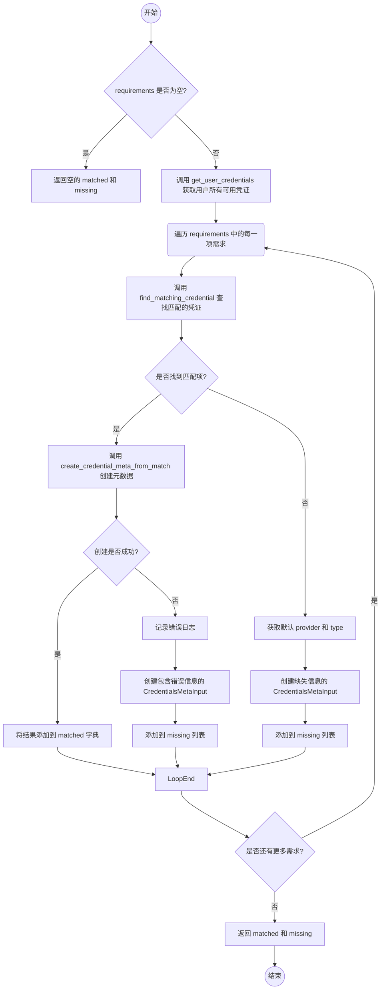

#### 带注释源码

```python
async def match_credentials_to_requirements(
    user_id: str,
    requirements: dict[str, CredentialsFieldInfo],
) -> tuple[dict[str, CredentialsMetaInput], list[CredentialsMetaInput]]:
    """
    Match user's credentials against a dictionary of credential requirements.

    This is the core matching logic shared by both graph and block credential matching.
    """
    # 初始化匹配成功和缺失的字典/列表
    matched: dict[str, CredentialsMetaInput] = {}
    missing: list[CredentialsMetaInput] = []

    # 如果没有需求，直接返回空结果
    if not requirements:
        return matched, missing

    # 异步获取用户的所有可用凭证
    available_creds = await get_user_credentials(user_id)

    # 遍历每一个凭证需求字段
    for field_name, field_info in requirements.items():
        # 在用户可用凭证中查找符合当前字段要求的凭证
        matching_cred = find_matching_credential(available_creds, field_info)

        if matching_cred:
            try:
                # 如果找到匹配项，尝试创建凭证元数据并加入 matched 字典
                matched[field_name] = create_credential_meta_from_match(matching_cred)
            except Exception as e:
                # 如果创建元数据过程中发生异常（例如验证失败），记录错误并视为缺失
                logger.error(
                    f"Failed to create CredentialsMetaInput for field '{field_name}': "
                    f"provider={matching_cred.provider}, type={matching_cred.type}, "
                    f"credential_id={matching_cred.id}",
                    exc_info=True,
                )
                # 获取默认的 provider 和 type 用于构建缺失项信息
                provider = next(iter(field_info.provider), "unknown")
                cred_type = next(iter(field_info.supported_types), "api_key")
                missing.append(
                    CredentialsMetaInput(
                        id=field_name,
                        provider=provider,  # type: ignore
                        type=cred_type,  # type: ignore
                        title=f"{field_name} (validation failed: {e})",
                    )
                )
        else:
            # 如果没有找到匹配项，将其视为缺失
            provider = next(iter(field_info.provider), "unknown")
            cred_type = next(iter(field_info.supported_types), "api_key")
            missing.append(
                CredentialsMetaInput(
                    id=field_name,
                    provider=provider,  # type: ignore
                    type=cred_type,  # type: ignore
                    title=field_name.replace("_", " ").title(),
                )
            )

    return matched, missing
```


### `get_user_credentials`

获取指定用户的所有可用凭据。

参数：

-  `user_id`：`str`，用户的唯一标识符

返回值：`list[Credentials]`，该用户拥有的凭据列表

#### 流程图

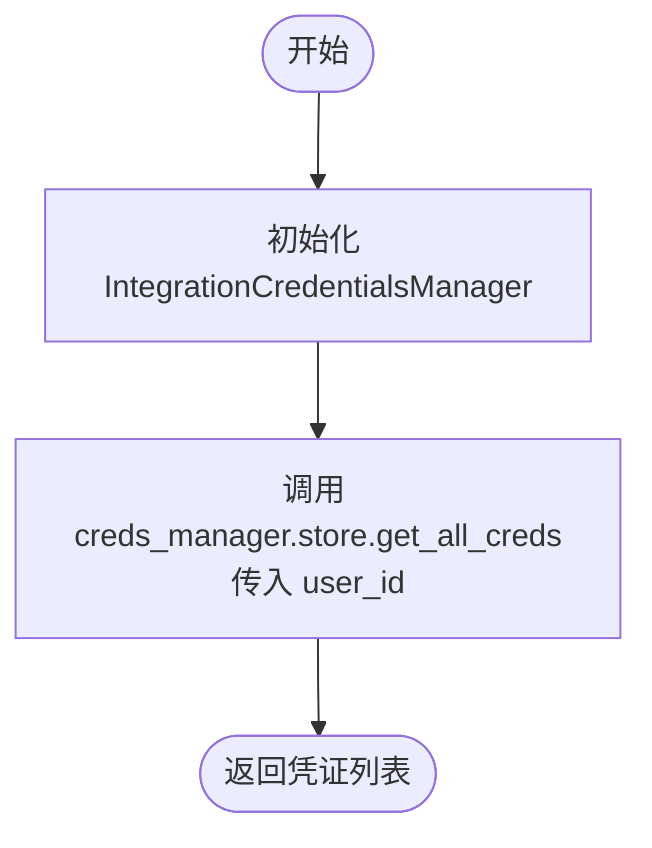

#### 带注释源码

```python
async def get_user_credentials(user_id: str) -> list[Credentials]:
    """Get all available credentials for a user."""
    # 实例化集成凭据管理器
    creds_manager = IntegrationCredentialsManager()
    # 从存储中异步获取指定用户的所有凭据
    return await creds_manager.store.get_all_creds(user_id)
```


### `find_matching_credential`

该函数用于从给定的可用凭证列表中，查找并返回第一个满足特定条件的凭证对象。匹配条件包括提供者（provider）、类型（type）、OAuth2作用域（scopes）以及主机范围（host），确保凭证符合字段的特定要求。

参数：

- `available_creds`：`list[Credentials]`，可供选择的用户凭证列表
- `field_info`：`CredentialsFieldInfo`，包含字段要求的凭证元信息（如支持的提供者、类型、作用域等）

返回值：`Credentials | None`，如果找到匹配的凭证则返回该凭证对象，否则返回 None

#### 流程图

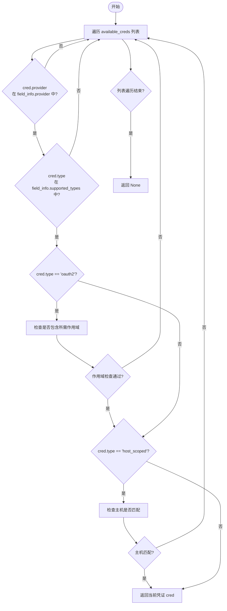

#### 带注释源码

```python
def find_matching_credential(
    available_creds: list[Credentials],
    field_info: CredentialsFieldInfo,
) -> Credentials | None:
    """Find a credential that matches the required provider, type, scopes, and host."""
    # 遍历所有可用的凭证对象
    for cred in available_creds:
        # 检查 1: 凭证的提供者必须在字段要求的提供者集合中
        if cred.provider not in field_info.provider:
            continue
        
        # 检查 2: 凭证的类型必须在字段支持的类型列表中
        if cred.type not in field_info.supported_types:
            continue
        
        # 检查 3: 如果凭证类型是 OAuth2，必须包含所有请求的作用域
        if cred.type == "oauth2" and not _credential_has_required_scopes(
            cred, field_info
        ):
            continue
        
        # 检查 4: 如果凭证类型是主机限定，必须匹配目标主机
        if cred.type == "host_scoped" and not _credential_is_for_host(cred, field_info):
            continue
        
        # 如果所有条件均满足，返回该凭证
        return cred
    
    # 遍历结束后仍未找到匹配项，返回 None
    return None
```


### `create_credential_meta_from_match`

该函数用于将匹配到的 `Credentials` 对象转换为 `CredentialsMetaInput` 对象，主要用于提取和封装凭证的核心元数据信息，以便在 API 响应或前端展示中使用。

参数：

- `matching_cred`：`Credentials`，已经匹配成功的用户凭证对象，包含 ID、提供商、类型和标题等信息。

返回值：`CredentialsMetaInput`，包含凭证元数据的输入对象，用于后续的凭证匹配验证或返回给客户端。

#### 流程图

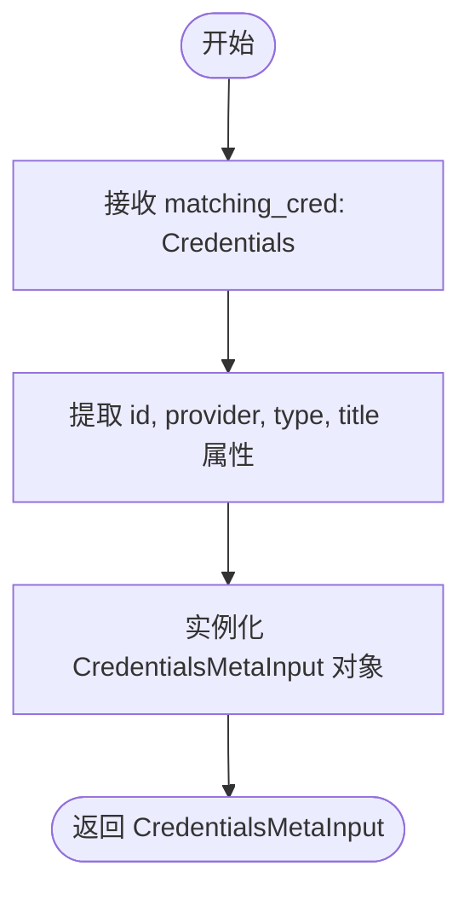

#### 带注释源码

```python
def create_credential_meta_from_match(
    matching_cred: Credentials,
) -> CredentialsMetaInput:
    """Create a CredentialsMetaInput from a matched credential."""
    # 基于匹配到的凭证对象，构建并返回一个凭证元数据输入对象
    # 主要映射字段包括：ID、提供商、类型和标题
    return CredentialsMetaInput(
        id=matching_cred.id,              # 凭证的唯一标识符
        provider=matching_cred.provider,  # 凭证的服务提供商（如 'openai', 'anthropic'）
        type=matching_cred.type,          # 凭证的认证类型（如 'api_key', 'oauth2'）
        title=matching_cred.title,        # 凭证的显示标题
    )
```


### `match_user_credentials_to_graph`

将用户可用的凭据与图形所需的凭据进行匹配。该函数利用 `graph.aggregate_credentials_inputs()` 处理来自多个节点的凭据，并使用 frozensets 进行提供者匹配，返回已匹配的凭据字典和缺失凭据的描述列表。

参数：

-  `user_id`：`str`，用户的 ID
-  `graph`：`GraphModel`，包含凭据需求的 Graph 对象

返回值：`tuple[dict[str, CredentialsMetaInput], list[str]]`，包含已匹配凭据字典（键为凭据字段名）和缺失凭据描述列表的元组

#### 流程图

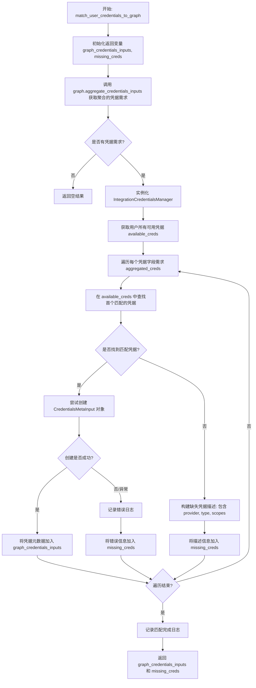

#### 带注释源码

```python
async def match_user_credentials_to_graph(
    user_id: str,
    graph: GraphModel,
) -> tuple[dict[str, CredentialsMetaInput], list[str]]:
    """
    Match user's available credentials against graph's required credentials.

    Uses graph.aggregate_credentials_inputs() which handles credentials from
    multiple nodes and uses frozensets for provider matching.

    Args:
        user_id: The user's ID
        graph: The Graph with credential requirements

    Returns:
        tuple[matched_credentials dict, missing_credential_descriptions list]
    """
    # 初始化返回结果：匹配到的凭据字典和缺失凭据的错误信息列表
    graph_credentials_inputs: dict[str, CredentialsMetaInput] = {}
    missing_creds: list[str] = []

    # 从 Graph 模型中获取聚合后的凭据输入需求
    # aggregate_credentials_inputs 处理来自多个节点的凭据并合并 provider
    aggregated_creds = graph.aggregate_credentials_inputs()
    logger.debug(
        f"Matching credentials for graph {graph.id}: {len(aggregated_creds)} required"
    )

    # 如果没有凭据需求，直接返回空结果
    if not aggregated_creds:
        return graph_credentials_inputs, missing_creds

    # 初始化凭据管理器并获取用户的所有可用凭据
    creds_manager = IntegrationCredentialsManager()
    available_creds = await creds_manager.store.get_all_creds(user_id)

    # 遍历每个聚合后的凭据字段需求
    # aggregated_creds 的值是一个元组: (credential_requirements, _, _)
    for credential_field_name, (
        credential_requirements,
        _,
        _,
    ) in aggregated_creds.items():
        # 在用户可用凭据中查找第一个满足条件的凭据
        # 条件包括：provider 匹配、type 匹配、OAuth2 scopes 匹配、Host 匹配
        matching_cred = next(
            (
                cred
                for cred in available_creds
                if cred.provider in credential_requirements.provider
                and cred.type in credential_requirements.supported_types
                and (
                    cred.type != "oauth2"
                    or _credential_has_required_scopes(cred, credential_requirements)
                )
                and (
                    cred.type != "host_scoped"
                    or _credential_is_for_host(cred, credential_requirements)
                )
            ),
            None,
        )

        if matching_cred:
            try:
                # 如果找到匹配凭据，构建 CredentialsMetaInput 并存入结果字典
                graph_credentials_inputs[credential_field_name] = CredentialsMetaInput(
                    id=matching_cred.id,
                    provider=matching_cred.provider,  # type: ignore
                    type=matching_cred.type,
                    title=matching_cred.title,
                )
            except Exception as e:
                # 捕获构建过程中的异常，记录日志并视为缺失
                logger.error(
                    f"Failed to create CredentialsMetaInput for field '{credential_field_name}': "
                    f"provider={matching_cred.provider}, type={matching_cred.type}, "
                    f"credential_id={matching_cred.id}",
                    exc_info=True,
                )
                missing_creds.append(
                    f"{credential_field_name} (validation failed: {e})"
                )
        else:
            # 未找到匹配凭据，构建详细的错误描述信息
            # 包含 provider, type 和 scopes 等需求信息，以便用户知晓为何缺失
            error_parts = [
                f"provider in {list(credential_requirements.provider)}",
                f"type in {list(credential_requirements.supported_types)}",
            ]
            if credential_requirements.required_scopes:
                error_parts.append(
                    f"scopes including {list(credential_requirements.required_scopes)}"
                )
            missing_creds.append(
                f"{credential_field_name} (requires {', '.join(error_parts)})"
            )

    # 记录匹配结果的统计信息
    logger.info(
        f"Credential matching complete: {len(graph_credentials_inputs)}/{len(aggregated_creds)} matched"
    )

    return graph_credentials_inputs, missing_creds
```


### `_credential_has_required_scopes`

检查 OAuth2 凭证是否具有输入要求的所有作用域。

参数：

- `credential`：`OAuth2Credentials`，待检查的 OAuth2 凭证对象
- `requirements`：`CredentialsFieldInfo`，包含所需作用域等信息的凭证字段要求对象

返回值：`bool`，如果凭证包含所有所需作用域（或不需要作用域）则返回 True，否则返回 False

#### 流程图

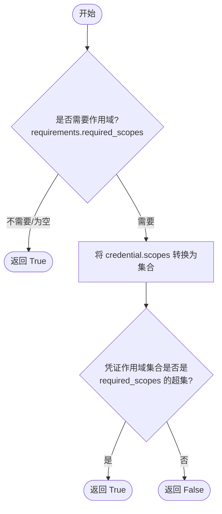

#### 带注释源码

```python
def _credential_has_required_scopes(
    credential: OAuth2Credentials,
    requirements: CredentialsFieldInfo,
) -> bool:
    """Check if an OAuth2 credential has all the scopes required by the input."""
    # 如果没有要求作用域，则任何凭证都匹配
    if not requirements.required_scopes:
        return True
    # 检查凭证的作用域集合是否是所需作用域的超集
    return set(credential.scopes).issuperset(requirements.required_scopes)
```


### `_credential_is_for_host`

检查主机范围凭据是否与输入要求所需的主机匹配。如果没有指定鉴别器值（意味着没有特定的主机要求），则默认为匹配。

参数：

-  `credential`：`HostScopedCredentials`，待检查的主机范围凭据对象。
-  `requirements`：`CredentialsFieldInfo`，包含凭据字段要求信息的对象，其中可能包含目标主机的鉴别器值。

返回值：`bool`，如果凭据匹配要求的主机或未指定主机要求，则返回 `True`，否则返回 `False`。

#### 流程图

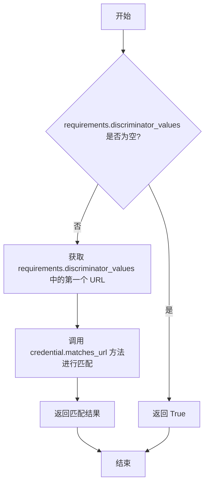

#### 带注释源码

```python
def _credential_is_for_host(
    credential: HostScopedCredentials,
    requirements: CredentialsFieldInfo,
) -> bool:
    """Check if a host-scoped credential matches the host required by the input."""
    # We need to know the host to match host-scoped credentials to.
    # Graph.aggregate_credentials_inputs() adds the node's set URL value (if any)
    # to discriminator_values. No discriminator_values -> no host to match against.
    if not requirements.discriminator_values:
        return True

    # Check that credential host matches required host.
    # Host-scoped credential inputs are grouped by host, so any item from the set works.
    return credential.matches_url(list(requirements.discriminator_values)[0])
```


### `check_user_has_required_credentials`

检查用户是否拥有列表中指定的所有必要凭据，并返回用户缺失的凭据列表。

参数：

-  `user_id`：`str`，用户的唯一标识符
-  `required_credentials`：`list[CredentialsMetaInput]`，所需的凭据元数据列表

返回值：`list[CredentialsMetaInput]`，用户缺失的凭据列表（如果用户拥有所有凭据则为空列表）

#### 流程图

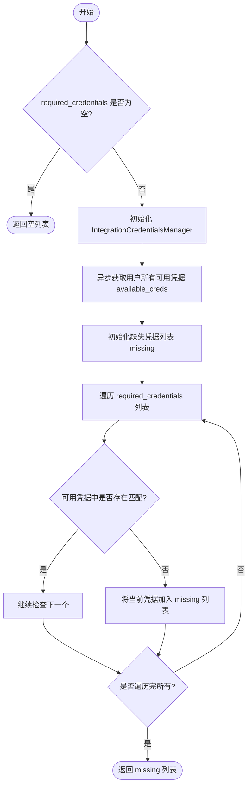

#### 带注释源码

```python
async def check_user_has_required_credentials(
    user_id: str,
    required_credentials: list[CredentialsMetaInput],
) -> list[CredentialsMetaInput]:
    """
    Check which required credentials the user is missing.

    Args:
        user_id: The user's ID
        required_credentials: List of required credentials

    Returns:
        List of missing credentials (empty if user has all)
    """
    # 如果没有要求任何凭据，直接返回空列表，无需查询数据库
    if not required_credentials:
        return []

    # 初始化凭据管理器，用于访问用户凭据存储
    creds_manager = IntegrationCredentialsManager()
    # 异步获取该用户ID下的所有可用凭据
    available_creds = await creds_manager.store.get_all_creds(user_id)

    missing: list[CredentialsMetaInput] = []
    # 遍历每一个所需凭据
    for required in required_credentials:
        # 检查用户的可用凭据中是否存在 provider 和 type 都匹配的项
        has_matching = any(
            cred.provider == required.provider and cred.type == required.type
            for cred in available_creds
        )
        # 如果找不到匹配项，将其标记为缺失
        if not has_matching:
            missing.append(required)

    return missing
```


## 关键组件


### Graph Retrieval & Loading
负责根据用户名和代理名称从外部数据源中获取图定义数据，处理未找到的情况及版本获取逻辑。

### Credential Metadata Extraction
负责解析图对象的凭证输入 JSON Schema，提取结构化的元数据，包括凭证提供商、类型和标题，以便后续处理和匹配。

### Credential Matching Engine
核心凭证匹配逻辑，负责将用户可用的凭证与图或节点的具体要求进行匹配，处理 API Key、OAuth2（含 Scope 校验）及 Host Scoped 等多种凭证类型，并区分已匹配和缺失的凭证。

### Library Agent Lifecycle Management
管理库中代理实例的生命周期，负责检查用户是否已拥有指定图的代理实例，若不存在则创建新实例并返回。

### Missing Credential Serialization
将未满足的凭证需求转换为标准化的字典格式，供前端 UI 使用，以清晰展示缺失的凭证及其具体要求（如支持的类型、提供商、作用域等）。


## 问题及建议


### 已知问题

-   **代码重复**：`match_credentials_to_requirements` 和 `match_user_credentials_to_graph` 两个函数包含大量重复的凭据匹配逻辑（获取凭据、遍历、比对 provider、type、scopes 和 host）。维护两套相似逻辑增加了出错风险和维护成本。
-   **返回类型不一致**：`match_credentials_to_requirements` 返回的缺失凭据列表类型为 `list[CredentialsMetaInput]`，而 `match_user_credentials_to_graph` 返回的是 `list[str]`（描述信息）。这种不一致性增加了调用方的处理复杂度。
-   **使用 `assert` 进行业务逻辑检查**：在 `get_or_create_library_agent` 函数中使用了 `assert len(library_agents) == 1`。在 Python 生产环境（特别是使用 `-O` 优化标志）中，断言可能会被忽略，且断言失败通常抛出的 `AssertionError` 不适合作为业务异常处理。
-   **凭据检查逻辑不完整**：`check_user_has_required_credentials` 函数仅基于 `provider` 和 `type` 检查用户是否拥有凭据，完全忽略了 `OAuth2` 的 `scopes` 和 `HostScopedCredentials` 的主机要求。这可能导致系统误判用户拥有符合权限要求的凭据。
-   **异常捕获过于宽泛**：在 `match_credentials_to_requirements` 中使用了 `except Exception` 来捕获创建 `CredentialsMetaInput` 时的异常。虽然记录了日志，但这种宽泛捕获可能会掩盖非预期的程序逻辑错误。
-   **硬编码的依赖实例化**：函数内部直接实例化 `IntegrationCredentialsManager()`（如 `get_user_credentials` 和 `match_user_credentials_to_graph`），导致难以进行依赖注入和单元测试（Mock 困难）。

### 优化建议

-   **重构匹配逻辑**：将凭据匹配的核心逻辑提取到一个独立的私有函数或服务类中（例如 `_perform_credential_matching`），统一处理 provider、type、scopes 和 host 的校验，消除 `match_credentials_to_requirements` 和 `match_user_credentials_to_graph` 之间的代码重复。
-   **统一返回接口**：统一匹配函数的返回类型，建议均返回结构化的对象（如 `CredentialsMetaInput` 或自定义的 Result 对象），由调用方决定是否将其序列化为字符串描述，以保持 API 的一致性。
-   **替换断言**：将 `get_or_create_library_agent` 中的 `assert` 替换为显式的异常抛出（如 `ValueError` 或自定义的业务异常），确保在任何环境下都能正确捕获并处理数据库返回不一致的异常情况。
-   **增强凭据检查完整性**：修改 `check_user_has_required_credentials`，使其能够处理更复杂的凭据校验规则（如 scopes），或者明确文档说明该函数仅做基础类型检查，避免在需要严格权限校验的场景下使用。
-   **引入依赖注入**：将 `IntegrationCredentialsManager` 或其底层的 Store 作为参数传递给需要使用凭据的函数，而不是在函数内部实例化。这样可以提高代码的可测试性，并便于在测试时注入 Mock 对象。
-   **提取字符串格式化逻辑**：将代码中多次出现的 `field_name.replace("_", " ").title()` 等字符串格式化逻辑提取为独立的工具函数（例如 `format_field_title`），以确保显示逻辑的一致性和复用性。


## 其它


### 设计目标与约束

**设计目标：**
1.  **代码复用与去重**：核心目标是将分散在 `get_agent_details.py` 和 `setup_agent.py` 等模块中的重复逻辑（如凭证提取、凭证匹配、库代理创建）集中管理，提供单一的真实数据源。
2.  **凭证匹配标准化**：建立统一的凭证匹配机制，能够处理多种类型的凭证（API Key, OAuth2, HostScoped），并支持对 Provider、Type、OAuth Scopes 及 Host 范围的严格校验。
3.  **模块解耦**：将业务逻辑与数据存储（DB）分离，通过异步函数提供清晰的服务接口，便于上层业务调用。

**约束：**
1.  **异步执行**：所有涉及数据库或存储访问的操作必须使用 `async/await` 语法，以适应异步 I/O 密集型的应用环境。
2.  **依赖强类型**：代码严重依赖于 `GraphModel`、`Credentials` 及其子类的具体结构，假设 Schema 中包含特定的字段（如 `properties`, `credentials_provider`）。
3.  **无状态性**：工具函数设计为无状态，不维护任何全局缓存或会话信息，每次调用独立处理。

### 错误处理与异常设计

**错误处理策略：**
1.  **Soft Failure（软失败）**：在获取资源时（如 `fetch_graph_from_store_slug`），如果资源不存在（抛出 `NotFoundError`），代码选择捕获异常并返回 `(None, None)`，而不是向上层抛出错误，允许调用者根据“未找到”的状态执行降级逻辑。
2.  **错误转译与降级**：在凭证匹配过程中（如 `match_credentials_to_requirements`），如果构建凭证元数据失败（`create_credential_meta_from_match` 抛出异常），系统会捕获该错误，记录详细的日志，并将该凭证标记为“缺失”或“验证失败”，而不是中断整个匹配流程。
3.  **日志记录**：使用 `logging` 模块记录关键操作和异常信息（特别是凭证匹配失败的具体原因），便于运维排查，同时避免敏感信息泄露。

**异常传播：**
1.  **数据库异常**：除 `NotFoundError` 外，其他底层数据库错误（如连接超时、查询语法错误）通常不在此层拦截，而是向上传播至全局异常处理器。
2.  **断言保护**：在 `get_or_create_library_agent` 中使用 `assert` 确保数据库操作符合预期（如仅创建一个代理），若违反则触发 `AssertionError`，属于代码层面的逻辑保护。

### 数据流与状态机

**数据流：**
1.  **图数据获取流**：
    *   输入：`username`, `agent_name` (Slug)。
    *   处理：查询 Store DB 获取 Agent 详情 -> 获取版本 ID -> 查询 Store DB 获取 Graph 数据。
    *   输出：`GraphModel` 对象及 Agent 详情。
2.  **凭证匹配流**：
    *   输入：`user_id`, `graph` (包含凭证需求 Schema)。
    *   处理：聚合 Graph 的凭证需求 -> 查询用户的凭证库 -> 遍历需求进行匹配（Provider -> Type -> Scopes/Host 校验）。
    *   输出：已匹配凭证字典、缺失凭证列表。

**状态机：**
*   本模块为工具函数集合，不涉及复杂的内部状态机。业务逻辑属于“请求-响应”模式，处理流程是线性的，不维护跨调用的状态转换。

### 外部依赖与接口契约

**外部依赖：**
1.  **Store DB (`backend.api.features.store.db`)**：
    *   `get_store_agent_details(username, agent_name)`: 异步接口，根据 Slug 获取代理详情。
    *   `get_available_graph(version_id, hide_nodes)`: 异步接口，获取图数据。
2.  **Library DB (`backend.api.features.library.db`)**：
    *   `get_library_agent_by_graph_id(graph_id, user_id)`: 异步接口，查询用户库中是否存在该图。
    *   `create_library_agent(graph, user_id, ...)`: 异步接口，创建库代理记录。
3.  **Integration Credentials Manager (`backend.integrations.creds_manager`)**：
    *   `store.get_all_creds(user_id)`: 异步接口，获取用户的所有有效凭证。
4.  **Data Models (`backend.data.model` & `backend.data.graph`)**：
    *   `GraphModel`: 必须实现 `aggregate_credentials_inputs()` 方法。
    *   `Credentials` 及其子类 (`OAuth2Credentials`, `HostScopedCredentials`): 必须包含 `provider`, `type`, `scopes`, `title` 等属性。

**接口契约：**
1.  **Schema 契约**：输入的 `credentials_input_schema` 必须遵循特定的 JSON Schema 格式，包含 `properties` 节点，且节点内需包含 `credentials_provider` 或 `credentials_types` 字段用于提取元数据。
2.  **返回值契约**：
    *   异步函数均返回 Future 对象。
    *   `match_*` 系列函数约定返回元组，格式为 `(matched_dict, missing_list)`，其中 `matched_dict` 的 Key 为字段名，Value 为凭证元数据。

    