# `.\AutoGPT\autogpt_platform\backend\backend\api\features\chat\tools\workspace_files.py` 详细设计文档

This code provides a set of tools for managing workspace files, including listing, reading, writing, and deleting files within a user's workspace.

## 整体流程

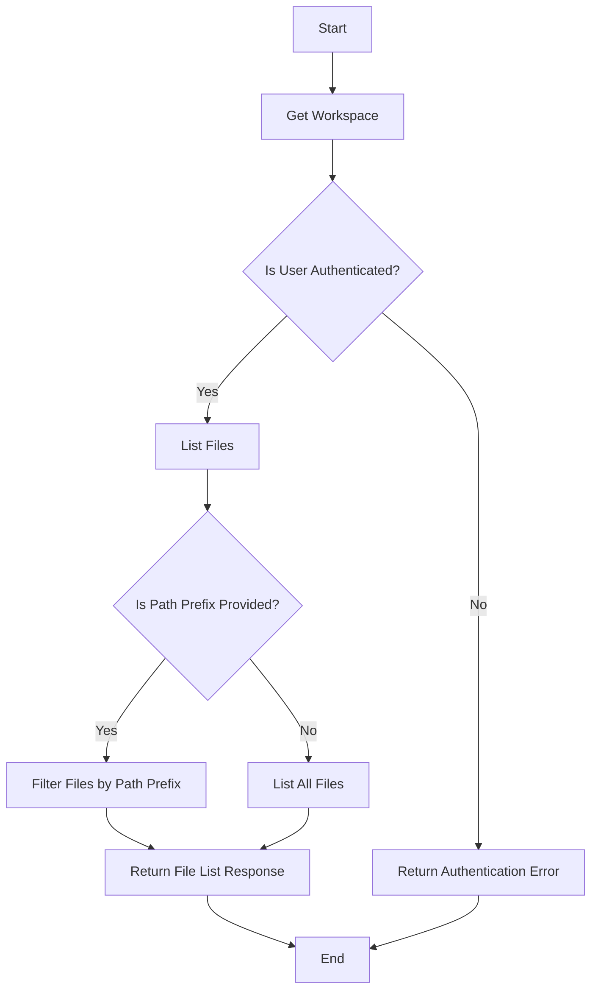

## 类结构

```
BaseTool (抽象基类)
├── ListWorkspaceFilesTool
│   ├── WorkspaceFileInfoData
│   ├── WorkspaceFileListResponse
│   ├── WorkspaceFileContentResponse
│   ├── WorkspaceFileMetadataResponse
│   ├── WorkspaceWriteResponse
│   └── WorkspaceDeleteResponse
├── ReadWorkspaceFileTool
├── WriteWorkspaceFileTool
└── DeleteWorkspaceFileTool
```

## 全局变量及字段


### `logger`
    
Logger instance for logging messages.

类型：`logging.Logger`
    


### `MAX_INLINE_SIZE_BYTES`
    
Maximum size in bytes for inline file content.

类型：`int`
    


### `PREVIEW_SIZE`
    
Preview size for text files in bytes.

类型：`int`
    


### `Config`
    
Configuration class for file size limits.

类型：`backend.util.settings.Config`
    


### `WorkspaceFileInfoData.file_id`
    
Unique identifier for the workspace file.

类型：`str`
    


### `WorkspaceFileInfoData.name`
    
Name of the workspace file.

类型：`str`
    


### `WorkspaceFileInfoData.path`
    
Path of the workspace file.

类型：`str`
    


### `WorkspaceFileInfoData.mime_type`
    
MIME type of the workspace file.

类型：`str`
    


### `WorkspaceFileInfoData.size_bytes`
    
Size of the workspace file in bytes.

类型：`int`
    


### `WorkspaceFileListResponse.type`
    
Type of the response.

类型：`ResponseType`
    


### `WorkspaceFileListResponse.files`
    
List of workspace files.

类型：`list[WorkspaceFileInfoData]`
    


### `WorkspaceFileListResponse.total_count`
    
Total count of files in the workspace.

类型：`int`
    


### `WorkspaceFileContentResponse.file_id`
    
Unique identifier for the workspace file.

类型：`str`
    


### `WorkspaceFileContentResponse.name`
    
Name of the workspace file.

类型：`str`
    


### `WorkspaceFileContentResponse.path`
    
Path of the workspace file.

类型：`str`
    


### `WorkspaceFileContentResponse.mime_type`
    
MIME type of the workspace file.

类型：`str`
    


### `WorkspaceFileContentResponse.content_base64`
    
Base64-encoded content of the workspace file.

类型：`str`
    


### `WorkspaceFileMetadataResponse.type`
    
Type of the response.

类型：`ResponseType`
    


### `WorkspaceFileMetadataResponse.file_id`
    
Unique identifier for the workspace file.

类型：`str`
    


### `WorkspaceFileMetadataResponse.name`
    
Name of the workspace file.

类型：`str`
    


### `WorkspaceFileMetadataResponse.path`
    
Path of the workspace file.

类型：`str`
    


### `WorkspaceFileMetadataResponse.mime_type`
    
MIME type of the workspace file.

类型：`str`
    


### `WorkspaceFileMetadataResponse.size_bytes`
    
Size of the workspace file in bytes.

类型：`int`
    


### `WorkspaceFileMetadataResponse.download_url`
    
URL to download the workspace file.

类型：`str`
    


### `WorkspaceFileMetadataResponse.preview`
    
Preview text for text files.

类型：`str | None`
    


### `WorkspaceWriteResponse.type`
    
Type of the response.

类型：`ResponseType`
    


### `WorkspaceWriteResponse.file_id`
    
Unique identifier for the workspace file.

类型：`str`
    


### `WorkspaceWriteResponse.name`
    
Name of the workspace file.

类型：`str`
    


### `WorkspaceWriteResponse.path`
    
Path of the workspace file.

类型：`str`
    


### `WorkspaceWriteResponse.size_bytes`
    
Size of the workspace file in bytes.

类型：`int`
    


### `WorkspaceDeleteResponse.type`
    
Type of the response.

类型：`ResponseType`
    


### `WorkspaceDeleteResponse.file_id`
    
Unique identifier for the workspace file.

类型：`str`
    


### `WorkspaceDeleteResponse.success`
    
Indicates if the file was successfully deleted.

类型：`bool`
    


### `WorkspaceFileListResponse.message`
    
Message associated with the response.

类型：`str`
    


### `WorkspaceFileListResponse.session_id`
    
Session identifier for the request.

类型：`str`
    


### `WorkspaceFileContentResponse.message`
    
Message associated with the response.

类型：`str`
    


### `WorkspaceFileContentResponse.session_id`
    
Session identifier for the request.

类型：`str`
    


### `WorkspaceFileMetadataResponse.message`
    
Message associated with the response.

类型：`str`
    


### `WorkspaceFileMetadataResponse.session_id`
    
Session identifier for the request.

类型：`str`
    


### `WorkspaceWriteResponse.message`
    
Message associated with the response.

类型：`str`
    


### `WorkspaceWriteResponse.session_id`
    
Session identifier for the request.

类型：`str`
    


### `WorkspaceDeleteResponse.message`
    
Message associated with the response.

类型：`str`
    


### `WorkspaceDeleteResponse.session_id`
    
Session identifier for the request.

类型：`str`
    
    

## 全局函数及方法


### `get_or_create_workspace`

获取或创建用户的工作空间。

参数：

- `user_id`：`str`，用户ID，用于标识用户的工作空间。

返回值：`Optional[Workspace]`，工作空间对象，如果成功则返回，否则为None。

#### 流程图

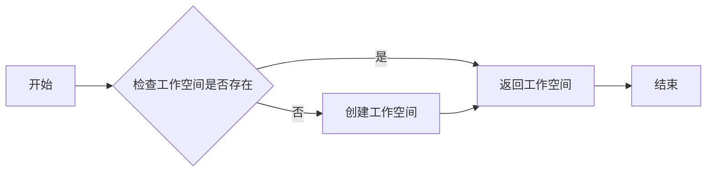

#### 带注释源码

```python
async def get_or_create_workspace(user_id: str) -> Optional[Workspace]:
    # 检查工作空间是否存在
    workspace = await Workspace.get_by_user_id(user_id)
    if workspace:
        # 返回已存在的工作空间
        return workspace
    else:
        # 创建新的工作空间
        workspace = Workspace(user_id=user_id)
        await workspace.save()
        return workspace
```


### `scan_content_safe`

This function is used to safely scan the content of a file for potential viruses or malicious code.

参数：

- `content`：`bytes`，The content of the file to be scanned.
- `filename`：`str`，The name of the file being scanned. This is used for logging and reporting purposes.

返回值：`None`，If the content is safe, the function returns `None`. If the content is found to be unsafe, it raises an exception.

#### 流程图

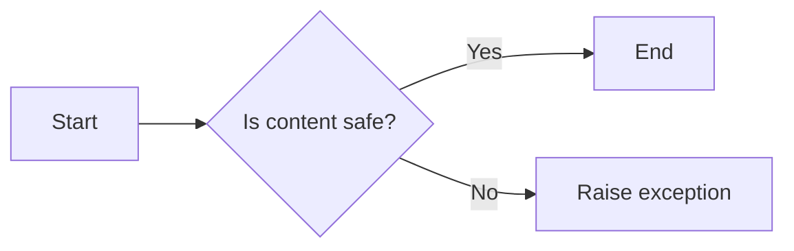

#### 带注释源码

```python
from backend.util.virus_scanner import VirusScanner

async def scan_content_safe(content: bytes, filename: str) -> None:
    # Instantiate the virus scanner
    scanner = VirusScanner()

    # Scan the content
    await scanner.scan(content, filename=filename)

    # If the content is safe, return None
    if scanner.is_safe:
        return
    # If the content is not safe, raise an exception
    raise Exception(f"Virus detected in file: {filename}")
```


### list_files

#### 描述

`list_files` 方法用于列出用户工作空间中的文件。它可以根据提供的路径前缀进行过滤，并可以指定返回文件的最大数量。此外，还可以选择是否列出所有会话的文件。

#### 参数

- `path_prefix`：`Optional[str]`，可选的路径前缀，用于过滤文件。
- `limit`：`Optional[int]`，可选的最大文件数量，默认为 50，最大为 100。
- `include_all_sessions`：`Optional[bool]`，可选的布尔值，如果为 `True`，则列出所有会话的文件。

#### 返回值

- `list[WorkspaceFileInfoData]`，包含文件信息的列表。
- `int`，文件总数。

#### 流程图

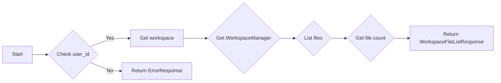

#### 带注释源码

```python
async def list_files(
    self,
    path_prefix: Optional[str] = None,
    limit: int = 50,
    include_all_sessions: bool = False,
) -> list[WorkspaceFileInfoData]:
    # ... (省略中间代码)
    try:
        workspace = await get_or_create_workspace(user_id)
        manager = WorkspaceManager(user_id, workspace.id, session_id)
        files = await manager.list_files(
            path=path_prefix,
            limit=limit,
            include_all_sessions=include_all_sessions,
        )
        total = await manager.get_file_count(
            path=path_prefix,
            include_all_sessions=include_all_sessions,
        )
        file_infos = [
            WorkspaceFileInfoData(
                file_id=f.id,
                name=f.name,
                path=f.path,
                mime_type=f.mimeType,
                size_bytes=f.sizeBytes,
            )
            for f in files
        ]
        return file_infos, total
    except Exception as e:
        logger.error(f"Error listing workspace files: {e}", exc_info=True)
        return ErrorResponse(
            message=f"Failed to list workspace files: {str(e)}",
            error=str(e),
            session_id=session_id,
        )
```


### `get_file_info`

获取指定文件的信息。

参数：

- `file_id`：`str`，文件的唯一ID。
- `path`：`str`，文件的虚拟路径。

返回值：`Optional[WorkspaceFileInfoData]`，包含文件信息的`WorkspaceFileInfoData`对象。

#### 流程图

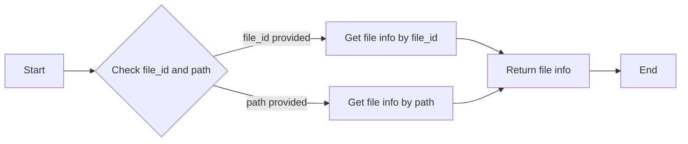

#### 带注释源码

```python
async def get_file_info(self, file_id: str, path: str) -> Optional[WorkspaceFileInfoData]:
    # Get file info
    if file_id:
        file_info = await self._get_file_info_by_id(file_id)
        if file_info is None:
            return None
        target_file_id = file_id
    else:
        # path is guaranteed to be non-None here due to the check above
        assert path is not None
        file_info = await self._get_file_info_by_path(path)
        if file_info is None:
            return None
        target_file_id = file_info.id

    return file_info
```


### `get_file_info_by_path`

获取指定路径的文件信息。

参数：

- `path`：`str`，指定要获取信息的文件路径。

返回值：`Optional[WorkspaceFileInfoData]`，包含文件信息的`WorkspaceFileInfoData`对象，如果没有找到文件则返回`None`。

#### 流程图


#### 带注释源码

```python
# 获取指定路径的文件信息
async def get_file_info_by_path(self, path: str) -> Optional[WorkspaceFileInfoData]:
    # 查找文件
    file_info = await self._get_file_info(path)
    return file_info
```


### `read_workspace_file`

Read a file from the user's workspace. Specify either file_id or path to identify the file. For small text files, returns content directly. For large or binary files, returns metadata and a download URL. Paths are scoped to the current session by default. Use /sessions/<session_id>/... for cross-session access.

参数：

- `file_id`：`str`，The file's unique ID (from list_workspace_files)
- `path`：`str`，The virtual file path (e.g., '/documents/report.pdf'). Scoped to current session by default.
- `force_download_url`：`bool`，If true, always return metadata+URL instead of inline content. Default is false (auto-selects based on file size/type).

返回值：`ToolResponseBase`，The response object containing file information or content.

#### 流程图

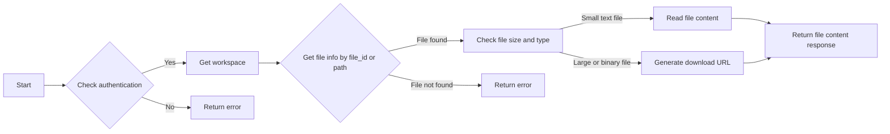

#### 带注释源码

```python
async def _execute(
    self,
    user_id: str | None,
    session: ChatSession,
    **kwargs,
) -> ToolResponseBase:
    session_id = session.session_id

    if not user_id:
        return ErrorResponse(
            message="Authentication required",
            session_id=session_id,
        )

    file_id: Optional[str] = kwargs.get("file_id")
    path: Optional[str] = kwargs.get("path")
    force_download_url: bool = kwargs.get("force_download_url", False)

    if not file_id and not path:
        return ErrorResponse(
            message="Please provide either file_id or path",
            session_id=session_id,
        )

    try:
        workspace = await get_or_create_workspace(user_id)
        # Pass session_id for session-scoped file access
        manager = WorkspaceManager(user_id, workspace.id, session_id)

        # Get file info
        if file_id:
            file_info = await manager.get_file_info(file_id)
            if file_info is None:
                return ErrorResponse(
                    message=f"File not found: {file_id}",
                    session_id=session_id,
                )
            target_file_id = file_id
        else:
            # path is guaranteed to be non-None here due to the check above
            assert path is not None
            file_info = await manager.get_file_info_by_path(path)
            if file_info is None:
                return ErrorResponse(
                    message=f"File not found at path: {path}",
                    session_id=session_id,
                )
            target_file_id = file_info.id

        # Decide whether to return inline content or metadata+URL
        is_small_file = file_info.sizeBytes <= self.MAX_INLINE_SIZE_BYTES
        is_text_file = self._is_text_mime_type(file_info.mimeType)

        # Return inline content for small text files (unless force_download_url)
        if is_small_file and is_text_file and not force_download_url:
            content = await manager.read_file_by_id(target_file_id)
            content_b64 = base64.b64encode(content).decode("utf-8")

            return WorkspaceFileContentResponse(
                file_id=file_info.id,
                name=file_info.name,
                path=file_info.path,
                mime_type=file_info.mimeType,
                content_base64=content_b64,
                message=f"Successfully read file: {file_info.name}",
                session_id=session_id,
            )

        # Return metadata + workspace:// reference for large or binary files
        # This prevents context bloat (100KB file = ~133KB as base64)
        # Use workspace:// format so frontend urlTransform can add proxy prefix
        download_url = f"workspace://{target_file_id}"

        # Generate preview for text files
        preview: str | None = None
        if is_text_file:
            try:
                content = await manager.read_file_by_id(target_file_id)
                preview_text = content[: self.PREVIEW_SIZE].decode(
                    "utf-8", errors="replace"
                )
                if len(content) > self.PREVIEW_SIZE:
                    preview_text += "..."
                preview = preview_text
            except Exception:
                pass  # Preview is optional

        return WorkspaceFileMetadataResponse(
            file_id=file_info.id,
            name=file_info.name,
            path=file_info.path,
            mime_type=file_info.mimeType,
            size_bytes=file_info.sizeBytes,
            download_url=download_url,
            preview=preview,
            message=f"File: {file_info.name} ({file_info.sizeBytes} bytes). Use download_url to retrieve content.",
            session_id=session_id,
        )

    except FileNotFoundError as e:
        return ErrorResponse(
            message=str(e),
            session_id=session_id,
        )
    except Exception as e:
        logger.error(f"Error reading workspace file: {e}", exc_info=True)
        return ErrorResponse(
            message=f"Failed to read workspace file: {str(e)}",
            error=str(e),
            session_id=session_id,
        )
```


### write_workspace_file

Write or create a file in the user's workspace. Provide the content as a base64-encoded string. Maximum file size is {Config().max_file_size_mb}MB. Files are saved to the current session's folder by default. Use /sessions/<session_id>/... for cross-session access.

参数：

- `filename`：`str`，Name for the file (e.g., 'report.pdf')
- `content_base64`：`str`，Base64-encoded file content
- `path`：`Optional[str]`，Optional virtual path where to save the file (e.g., '/documents/report.pdf'). Defaults to '/{filename}'. Scoped to current session.
- `mime_type`：`Optional[str]`，Optional MIME type of the file. Auto-detected from filename if not provided.
- `overwrite`：`bool`，Whether to overwrite if file exists at path (default: false)

返回值：`WorkspaceWriteResponse`，Response after writing a file to workspace.

#### 流程图

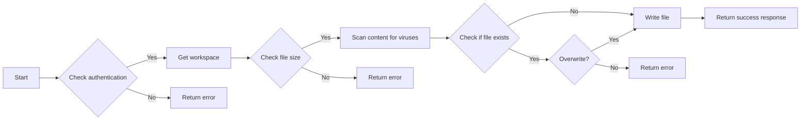

#### 带注释源码

```python
async def _execute(
    self,
    user_id: str | None,
    session: ChatSession,
    **kwargs,
) -> ToolResponseBase:
    session_id = session.session_id

    if not user_id:
        return ErrorResponse(
            message="Authentication required",
            session_id=session_id,
        )

    filename: str = kwargs.get("filename", "")
    content_b64: str = kwargs.get("content_base64", "")
    path: Optional[str] = kwargs.get("path")
    mime_type: Optional[str] = kwargs.get("mime_type")
    overwrite: bool = kwargs.get("overwrite", False)

    if not filename:
        return ErrorResponse(
            message="Please provide a filename",
            session_id=session_id,
        )

    if not content_b64:
        return ErrorResponse(
            message="Please provide content_base64",
            session_id=session_id,
        )

    # Decode content
    try:
        content = base64.b64decode(content_b64)
    except Exception:
        return ErrorResponse(
            message="Invalid base64-encoded content",
            session_id=session_id,
        )

    # Check size
    max_file_size = Config().max_file_size_mb * 1024 * 1024
    if len(content) > max_file_size:
        return ErrorResponse(
            message=f"File too large. Maximum size is {Config().max_file_size_mb}MB",
            session_id=session_id,
        )

    try:
        # Virus scan
        await scan_content_safe(content, filename=filename)

        workspace = await get_or_create_workspace(user_id)
        # Pass session_id for session-scoped file access
        manager = WorkspaceManager(user_id, workspace.id, session_id)

        file_record = await manager.write_file(
            content=content,
            filename=filename,
            path=path,
            mime_type=mime_type,
            overwrite=overwrite,
        )

        return WorkspaceWriteResponse(
            file_id=file_record.id,
            name=file_record.name,
            path=file_record.path,
            size_bytes=file_record.sizeBytes,
            message=f"Successfully wrote file: {file_record.name}",
            session_id=session_id,
        )

    except ValueError as e:
        return ErrorResponse(
            message=str(e),
            session_id=session_id,
        )
    except Exception as e:
        logger.error(f"Error writing workspace file: {e}", exc_info=True)
        return ErrorResponse(
            message=f"Failed to write workspace file: {str(e)}",
            error=str(e),
            session_id=session_id,
        )
```


### delete_workspace_file

Delete a file from the user's workspace.

参数：

- `file_id`：`string`，The file's unique ID (from list_workspace_files)
- `path`：`string`，The virtual file path (e.g., '/documents/report.pdf'). Scoped to current session by default.

返回值：`bool`，Indicates whether the file was deleted successfully

#### 流程图

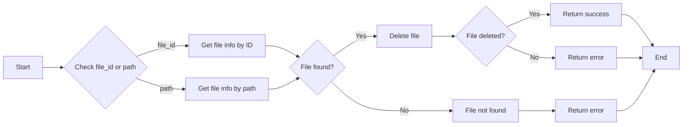

#### 带注释源码

```python
async def _execute(
    self,
    user_id: str | None,
    session: ChatSession,
    **kwargs,
) -> ToolResponseBase:
    session_id = session.session_id

    if not user_id:
        return ErrorResponse(
            message="Authentication required",
            session_id=session_id,
        )

    file_id: Optional[str] = kwargs.get("file_id")
    path: Optional[str] = kwargs.get("path")

    if not file_id and not path:
        return ErrorResponse(
            message="Please provide either file_id or path",
            session_id=session_id,
        )

    try:
        workspace = await get_or_create_workspace(user_id)
        # Pass session_id for session-scoped file access
        manager = WorkspaceManager(user_id, workspace.id, session_id)

        # Determine the file_id to delete
        target_file_id: str
        if file_id:
            target_file_id = file_id
        else:
            # path is guaranteed to be non-None here due to the check above
            assert path is not None
            file_info = await manager.get_file_info_by_path(path)
            if file_info is None:
                return ErrorResponse(
                    message=f"File not found at path: {path}",
                    session_id=session_id,
                )
            target_file_id = file_info.id

        success = await manager.delete_file(target_file_id)

        if not success:
            return ErrorResponse(
                message=f"File not found: {target_file_id}",
                session_id=session_id,
            )

        return WorkspaceDeleteResponse(
            file_id=target_file_id,
            success=True,
            message="File deleted successfully",
            session_id=session_id,
        )

    except Exception as e:
        logger.error(f"Error deleting workspace file: {e}", exc_info=True)
        return ErrorResponse(
            message=f"Failed to delete workspace file: {str(e)}",
            error=str(e),
            session_id=session_id,
        )
```


### `_is_text_mime_type`

Check if the MIME type is a text-based type.

参数：

- `mime_type`：`str`，The MIME type to check.

返回值：`bool`，Returns `True` if the MIME type is text-based, otherwise `False`.

#### 流程图


#### 带注释源码

```python
def _is_text_mime_type(self, mime_type: str) -> bool:
    """Check if the MIME type is a text-based type."""
    text_types = [
        "text/",
        "application/json",
        "application/xml",
        "application/javascript",
        "application/x-python",
        "application/x-sh",
    ]
    return any(mime_type.startswith(t) for t in text_types)
```


### BaseTool._execute

#### 描述

The `_execute` method is a private method of the `BaseTool` class. It is responsible for executing the tool's functionality, which includes handling authentication, accessing workspace files, and generating responses.

#### 参数

- `user_id`: `str | None`，The unique identifier for the user.
- `session`: `ChatSession`，The current chat session object.
- `**kwargs`: `Any`，Additional keyword arguments specific to the tool.

#### 返回值

- `ToolResponseBase`，A response object containing the result of the tool's execution.

#### 流程图

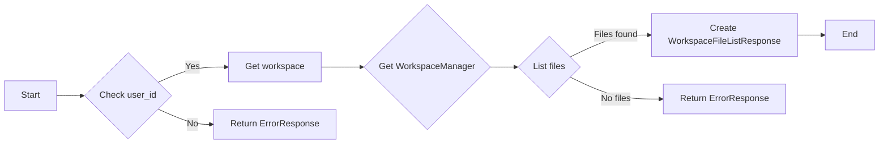

#### 带注释源码

```python
async def _execute(
    self,
    user_id: str | None,
    session: ChatSession,
    **kwargs,
) -> ToolResponseBase:
    session_id = session.session_id

    if not user_id:
        return ErrorResponse(
            message="Authentication required",
            session_id=session_id,
        )

    try:
        workspace = await get_or_create_workspace(user_id)
        manager = WorkspaceManager(user_id, workspace.id, session_id)

        files = await manager.list_files(
            path=path_prefix,
            limit=limit,
            include_all_sessions=include_all_sessions,
        )
        total = await manager.get_file_count(
            path=path_prefix,
            include_all_sessions=include_all_sessions,
        )

        file_infos = [
            WorkspaceFileInfoData(
                file_id=f.id,
                name=f.name,
                path=f.path,
                mime_type=f.mimeType,
                size_bytes=f.sizeBytes,
            )
            for f in files
        ]

        scope_msg = "all sessions" if include_all_sessions else "current session"
        return WorkspaceFileListResponse(
            files=file_infos,
            total_count=total,
            message=f"Found {len(files)} files in workspace ({scope_msg})",
            session_id=session_id,
        )

    except Exception as e:
        logger.error(f"Error listing workspace files: {e}", exc_info=True)
        return ErrorResponse(
            message=f"Failed to list workspace files: {str(e)}",
            error=str(e),
            session_id=session_id,
        )
```


### ListWorkspaceFilesTool.name

This method returns the name of the `ListWorkspaceFilesTool` class, which is used for listing files in a user's workspace.

参数：

- 无

返回值：`str`，The name of the tool, which is "list_workspace_files".

#### 流程图

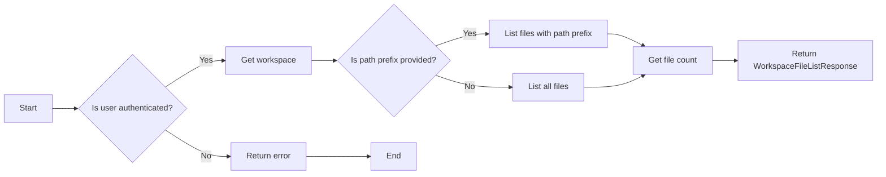

#### 带注释源码

```python
class ListWorkspaceFilesTool(BaseTool):
    """Tool for listing files in user's workspace."""

    @property
    def name(self) -> str:
        return "list_workspace_files"
```


### ListWorkspaceFilesTool.description

This method returns a description of the `ListWorkspaceFilesTool` class, which is a tool for listing files in a user's workspace.

参数：

- `None`：`None`，No parameters are passed to this method as it is a property that returns the description string.

返回值：`str`，The method returns a string describing the functionality of the `ListWorkspaceFilesTool` class.

#### 流程图

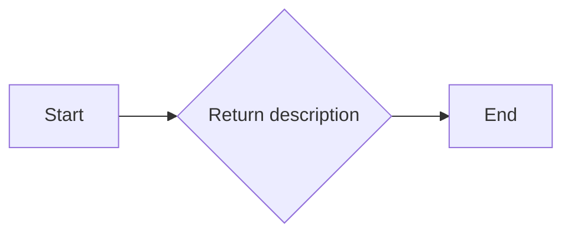

#### 带注释源码

```python
    @property
    def description(self) -> str:
        return (
            "List files in the user's workspace. "
            "Returns file names, paths, sizes, and metadata. "
            "Optionally filter by path prefix."
        )
```


### ListWorkspaceFilesTool.parameters

This function returns the parameters for the `ListWorkspaceFilesTool` class, which is used to list files in a user's workspace.

**描述**

The `parameters` function returns a dictionary containing the details of the parameters required by the `ListWorkspaceFilesTool`.

**参数**

- `path_prefix`：`string`，Optional path prefix to filter files (e.g., '/documents/' to list only files in documents folder). By default, only files from the current session are listed.
- `limit`：`integer`，Maximum number of files to return (default 50, max 100).
- `include_all_sessions`：`boolean`，If true, list files from all sessions. Default is false (only current session's files).

**返回值**

- `dict[str, Any]`：A dictionary containing the parameter details.

#### 流程图


#### 带注释源码

```python
@property
def parameters(self) -> dict[str, Any]:
    return {
        "type": "object",
        "properties": {
            "path_prefix": {
                "type": "string",
                "description": (
                    "Optional path prefix to filter files "
                    "(e.g., '/documents/' to list only files in documents folder). "
                    "By default, only files from the current session are listed."
                ),
            },
            "limit": {
                "type": "integer",
                "description": "Maximum number of files to return (default 50, max 100)",
                "minimum": 1,
                "maximum": 100,
            },
            "include_all_sessions": {
                "type": "boolean",
                "description": (
                    "If true, list files from all sessions. "
                    "Default is false (only current session's files)."
                ),
            },
        },
        "required": [],
    }
```


### ListWorkspaceFilesTool.requires_auth

This method checks if authentication is required for the `ListWorkspaceFilesTool`.

参数：

- `None`：`None`，No parameters are passed to this method as it is a property that returns a boolean value.

返回值：`bool`，Returns `True` if authentication is required, otherwise `False`.

#### 流程图

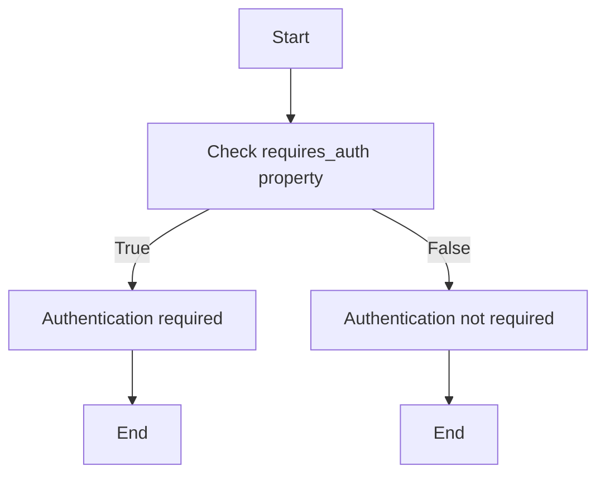

#### 带注释源码

```python
class ListWorkspaceFilesTool(BaseTool):
    # ... other class members ...

    @property
    def requires_auth(self) -> bool:
        return True
```


### ListWorkspaceFilesTool._execute

List files in the user's workspace. Returns file names, paths, sizes, and metadata. Optionally filter by path prefix.

参数：

- `user_id`：`str | None`，User ID for workspace access
- `session`：`ChatSession`，Current chat session object
- `path_prefix`：`Optional[str]`，Optional path prefix to filter files
- `limit`：`int`，Maximum number of files to return
- `include_all_sessions`：`bool`，If true, list files from all sessions

返回值：`ToolResponseBase`，Response containing list of workspace files or error

#### 流程图

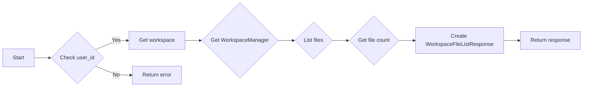

#### 带注释源码

```python
async def _execute(
    self,
    user_id: str | None,
    session: ChatSession,
    **kwargs,
) -> ToolResponseBase:
    session_id = session.session_id

    if not user_id:
        return ErrorResponse(
            message="Authentication required",
            session_id=session_id,
        )

    path_prefix: Optional[str] = kwargs.get("path_prefix")
    limit = min(kwargs.get("limit", 50), 100)
    include_all_sessions: bool = kwargs.get("include_all_sessions", False)

    try:
        workspace = await get_or_create_workspace(user_id)
        manager = WorkspaceManager(user_id, workspace.id, session_id)

        files = await manager.list_files(
            path=path_prefix,
            limit=limit,
            include_all_sessions=include_all_sessions,
        )
        total = await manager.get_file_count(
            path=path_prefix,
            include_all_sessions=include_all_sessions,
        )

        file_infos = [
            WorkspaceFileInfoData(
                file_id=f.id,
                name=f.name,
                path=f.path,
                mime_type=f.mimeType,
                size_bytes=f.sizeBytes,
            )
            for f in files
        ]

        scope_msg = "all sessions" if include_all_sessions else "current session"
        return WorkspaceFileListResponse(
            files=file_infos,
            total_count=total,
            message=f"Found {len(files)} files in workspace ({scope_msg})",
            session_id=session_id,
        )

    except Exception as e:
        logger.error(f"Error listing workspace files: {e}", exc_info=True)
        return ErrorResponse(
            message=f"Failed to list workspace files: {str(e)}",
            error=str(e),
            session_id=session_id,
        )
```


### ReadWorkspaceFileTool._execute

This method reads a file from the user's workspace. It accepts either a file ID or a file path to identify the file. For small text files, it returns the content directly. For large or binary files, it returns metadata and a download URL.

参数：

- `user_id`：`str`，The unique identifier for the user.
- `session`：`ChatSession`，The current chat session object.
- `file_id`：`Optional[str]`，The unique ID of the file (from list_workspace_files).
- `path`：`Optional[str]`，The virtual file path (e.g., '/documents/report.pdf').
- `force_download_url`：`Optional[bool]`，If true, always return metadata+URL instead of inline content.

返回值：`ToolResponseBase`，A response object containing the file content or metadata and a download URL.

#### 流程图

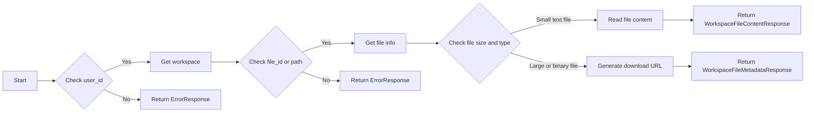

#### 带注释源码

```python
async def _execute(
    self,
    user_id: str | None,
    session: ChatSession,
    **kwargs,
) -> ToolResponseBase:
    session_id = session.session_id

    if not user_id:
        return ErrorResponse(
            message="Authentication required",
            session_id=session_id,
        )

    file_id: Optional[str] = kwargs.get("file_id")
    path: Optional[str] = kwargs.get("path")
    force_download_url: bool = kwargs.get("force_download_url", False)

    if not file_id and not path:
        return ErrorResponse(
            message="Please provide either file_id or path",
            session_id=session_id,
        )

    try:
        workspace = await get_or_create_workspace(user_id)
        manager = WorkspaceManager(user_id, workspace.id, session_id)

        if file_id:
            file_info = await manager.get_file_info(file_id)
            if file_info is None:
                return ErrorResponse(
                    message=f"File not found: {file_id}",
                    session_id=session_id,
                )
            target_file_id = file_id
        else:
            assert path is not None
            file_info = await manager.get_file_info_by_path(path)
            if file_info is None:
                return ErrorResponse(
                    message=f"File not found at path: {path}",
                    session_id=session_id,
                )
            target_file_id = file_info.id

        is_small_file = file_info.sizeBytes <= self.MAX_INLINE_SIZE_BYTES
        is_text_file = self._is_text_mime_type(file_info.mimeType)

        if is_small_file and is_text_file and not force_download_url:
            content = await manager.read_file_by_id(target_file_id)
            content_b64 = base64.b64encode(content).decode("utf-8")

            return WorkspaceFileContentResponse(
                file_id=file_info.id,
                name=file_info.name,
                path=file_info.path,
                mime_type=file_info.mimeType,
                content_base64=content_b64,
                message=f"Successfully read file: {file_info.name}",
                session_id=session_id,
            )

        download_url = f"workspace://{target_file_id}"

        preview: str | None = None
        if is_text_file:
            try:
                content = await manager.read_file_by_id(target_file_id)
                preview_text = content[: self.PREVIEW_SIZE].decode(
                    "utf-8", errors="replace"
                )
                if len(content) > self.PREVIEW_SIZE:
                    preview_text += "..."
                preview = preview_text
            except Exception:
                pass  # Preview is optional

        return WorkspaceFileMetadataResponse(
            file_id=file_info.id,
            name=file_info.name,
            path=file_info.path,
            mime_type=file_info.mimeType,
            size_bytes=file_info.sizeBytes,
            download_url=download_url,
            preview=preview,
            message=f"File: {file_info.name} ({file_info.sizeBytes} bytes). Use download_url to retrieve content.",
            session_id=session_id,
        )

    except FileNotFoundError as e:
        return ErrorResponse(
            message=str(e),
            session_id=session_id,
        )
    except Exception as e:
        logger.error(f"Error reading workspace file: {e}", exc_info=True)
        return ErrorResponse(
            message=f"Failed to read workspace file: {str(e)}",
            error=str(e),
            session_id=session_id,
        )
```


### ReadWorkspaceFileTool.description

This method returns a description of the `ReadWorkspaceFileTool` class, which is a tool for reading file content from the user's workspace.

参数：

- `user_id`：`str`，The unique identifier for the user.
- `session`：`ChatSession`，The current chat session object.

返回值：`str`，The description of the `ReadWorkspaceFileTool` class.

#### 流程图

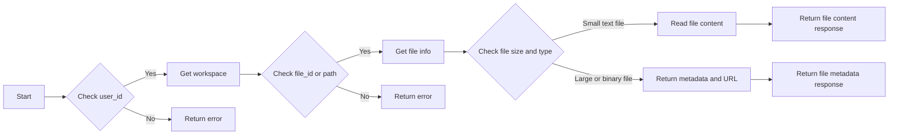

#### 带注释源码

```python
class ReadWorkspaceFileTool(BaseTool):
    # ... (other class members)

    @property
    def description(self) -> str:
        return (
            "Read a file from the user's workspace. "
            "Specify either file_id or path to identify the file. "
            "For small text files, returns content directly. "
            "For large or binary files, returns metadata and a download URL. "
            "Paths are scoped to the current session by default. "
            "Use /sessions/<session_id>/... for cross-session access."
        )
```


### ReadWorkspaceFileTool._execute

Read a file from the user's workspace. Specify either file_id or path to identify the file. For small text files, returns content directly. For large or binary files, returns metadata and a download URL. Paths are scoped to the current session by default. Use /sessions/<session_id>/... for cross-session access.

参数：

- `user_id`：`str`，User ID for authentication.
- `session`：`ChatSession`，Chat session object.
- `file_id`：`Optional[str]`，The file's unique ID (from list_workspace_files).
- `path`：`Optional[str]`，The virtual file path (e.g., '/documents/report.pdf'). Scoped to current session by default.
- `force_download_url`：`Optional[bool]`，If true, always return metadata+URL instead of inline content. Default is false (auto-selects based on file size/type).

返回值：`ToolResponseBase`，Response containing file content or metadata and download URL.

#### 流程图

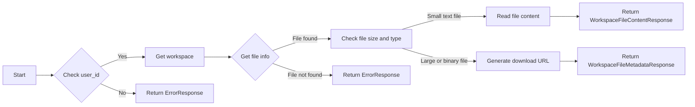

#### 带注释源码

```python
async def _execute(
    self,
    user_id: str | None,
    session: ChatSession,
    **kwargs,
) -> ToolResponseBase:
    session_id = session.session_id

    if not user_id:
        return ErrorResponse(
            message="Authentication required",
            session_id=session_id,
        )

    file_id: Optional[str] = kwargs.get("file_id")
    path: Optional[str] = kwargs.get("path")
    force_download_url: bool = kwargs.get("force_download_url", False)

    if not file_id and not path:
        return ErrorResponse(
            message="Please provide either file_id or path",
            session_id=session_id,
        )

    try:
        workspace = await get_or_create_workspace(user_id)
        # Pass session_id for session-scoped file access
        manager = WorkspaceManager(user_id, workspace.id, session_id)

        # Get file info
        if file_id:
            file_info = await manager.get_file_info(file_id)
            if file_info is None:
                return ErrorResponse(
                    message=f"File not found: {file_id}",
                    session_id=session_id,
                )
            target_file_id = file_id
        else:
            # path is guaranteed to be non-None here due to the check above
            assert path is not None
            file_info = await manager.get_file_info_by_path(path)
            if file_info is None:
                return ErrorResponse(
                    message=f"File not found at path: {path}",
                    session_id=session_id,
                )
            target_file_id = file_info.id

        # Decide whether to return inline content or metadata+URL
        is_small_file = file_info.sizeBytes <= self.MAX_INLINE_SIZE_BYTES
        is_text_file = self._is_text_mime_type(file_info.mimeType)

        # Return inline content for small text files (unless force_download_url)
        if is_small_file and is_text_file and not force_download_url:
            content = await manager.read_file_by_id(target_file_id)
            content_b64 = base64.b64encode(content).decode("utf-8")

            return WorkspaceFileContentResponse(
                file_id=file_info.id,
                name=file_info.name,
                path=file_info.path,
                mime_type=file_info.mimeType,
                content_base64=content_b64,
                message=f"Successfully read file: {file_info.name}",
                session_id=session_id,
            )

        # Return metadata + workspace:// reference for large or binary files
        # This prevents context bloat (100KB file = ~133KB as base64)
        # Use workspace:// format so frontend urlTransform can add proxy prefix
        download_url = f"workspace://{target_file_id}"

        # Generate preview for text files
        preview: str | None = None
        if is_text_file:
            try:
                content = await manager.read_file_by_id(target_file_id)
                preview_text = content[: self.PREVIEW_SIZE].decode(
                    "utf-8", errors="replace"
                )
                if len(content) > self.PREVIEW_SIZE:
                    preview_text += "..."
                preview = preview_text
            except Exception:
                pass  # Preview is optional

        return WorkspaceFileMetadataResponse(
            file_id=file_info.id,
            name=file_info.name,
            path=file_info.path,
            mime_type=file_info.mimeType,
            size_bytes=file_info.sizeBytes,
            download_url=download_url,
            preview=preview,
            message=f"File: {file_info.name} ({file_info.sizeBytes} bytes). Use download_url to retrieve content.",
            session_id=session_id,
        )

    except FileNotFoundError as e:
        return ErrorResponse(
            message=str(e),
            session_id=session_id,
        )
    except Exception as e:
        logger.error(f"Error reading workspace file: {e}", exc_info=True)
        return ErrorResponse(
            message=f"Failed to read workspace file: {str(e)}",
            error=str(e),
            session_id=session_id,
        )
```


### `ReadWorkspaceFileTool.requires_auth`

This method checks if authentication is required for the `ReadWorkspaceFileTool`.

参数：

- `None`：`None`，No parameters are passed to this method as it is a property that returns a boolean value.

返回值：`bool`，Returns `True` if authentication is required, otherwise `False`.

#### 流程图


#### 带注释源码

```python
class ReadWorkspaceFileTool(BaseTool):
    # ... other class members ...

    @property
    def requires_auth(self) -> bool:
        return True
```


### ReadWorkspaceFileTool._execute

Read a file from the user's workspace. Specify either file_id or path to identify the file. For small text files, returns content directly. For large or binary files, returns metadata and a download URL. Paths are scoped to the current session by default. Use /sessions/<session_id>/... for cross-session access.

参数：

- `user_id`：`str | None`，User ID for authentication.
- `session`：`ChatSession`，Chat session object.
- `file_id`：`Optional[str]`，The file's unique ID (from list_workspace_files).
- `path`：`Optional[str]`，The virtual file path (e.g., '/documents/report.pdf').
- `force_download_url`：`Optional[bool]`，If true, always return metadata+URL instead of inline content.

返回值：`ToolResponseBase`，Response containing file content or metadata.

#### 流程图

```mermaid
graph LR
A[Start] --> B{Check user_id}
B -->|Yes| C[Get workspace]
B -->|No| D[Return ErrorResponse]
C --> E{Get file info}
E -->|File found| F[Check file size and type]
E -->|File not found| G[Return ErrorResponse]
F -->|Small text file| H[Read file content]
F -->|Large or binary file| I[Generate download URL]
H --> J[Return WorkspaceFileContentResponse]
I --> K[Return WorkspaceFileMetadataResponse]
```

#### 带注释源码

```python
async def _execute(
    self,
    user_id: str | None,
    session: ChatSession,
    **kwargs,
) -> ToolResponseBase:
    session_id = session.session_id

    if not user_id:
        return ErrorResponse(
            message="Authentication required",
            session_id=session_id,
        )

    file_id: Optional[str] = kwargs.get("file_id")
    path: Optional[str] = kwargs.get("path")
    force_download_url: bool = kwargs.get("force_download_url", False)

    if not file_id and not path:
        return ErrorResponse(
            message="Please provide either file_id or path",
            session_id=session_id,
        )

    try:
        workspace = await get_or_create_workspace(user_id)
        manager = WorkspaceManager(user_id, workspace.id, session_id)

        # Get file info
        if file_id:
            file_info = await manager.get_file_info(file_id)
            if file_info is None:
                return ErrorResponse(
                    message=f"File not found: {file_id}",
                    session_id=session_id,
                )
            target_file_id = file_id
        else:
            assert path is not None
            file_info = await manager.get_file_info_by_path(path)
            if file_info is None:
                return ErrorResponse(
                    message=f"File not found at path: {path}",
                    session_id=session_id,
                )
            target_file_id = file_info.id

        # Decide whether to return inline content or metadata+URL
        is_small_file = file_info.sizeBytes <= self.MAX_INLINE_SIZE_BYTES
        is_text_file = self._is_text_mime_type(file_info.mimeType)

        # Return inline content for small text files (unless force_download_url)
        if is_small_file and is_text_file and not force_download_url:
            content = await manager.read_file_by_id(target_file_id)
            content_b64 = base64.b64encode(content).decode("utf-8")

            return WorkspaceFileContentResponse(
                file_id=file_info.id,
                name=file_info.name,
                path=file_info.path,
                mime_type=file_info.mimeType,
                content_base64=content_b64,
                message=f"Successfully read file: {file_info.name}",
                session_id=session_id,
            )

        # Return metadata + workspace:// reference for large or binary files
        download_url = f"workspace://{target_file_id}"

        # Generate preview for text files
        preview: str | None = None
        if is_text_file:
            try:
                content = await manager.read_file_by_id(target_file_id)
                preview_text = content[: self.PREVIEW_SIZE].decode(
                    "utf-8", errors="replace"
                )
                if len(content) > self.PREVIEW_SIZE:
                    preview_text += "..."
                preview = preview_text
            except Exception:
                pass  # Preview is optional

        return WorkspaceFileMetadataResponse(
            file_id=file_info.id,
            name=file_info.name,
            path=file_info.path,
            mime_type=file_info.mimeType,
            size_bytes=file_info.sizeBytes,
            download_url=download_url,
            preview=preview,
            message=f"File: {file_info.name} ({file_info.sizeBytes} bytes). Use download_url to retrieve content.",
            session_id=session_id,
        )

    except FileNotFoundError as e:
        return ErrorResponse(
            message=str(e),
            session_id=session_id,
        )
    except Exception as e:
        logger.error(f"Error reading workspace file: {e}", exc_info=True)
        return ErrorResponse(
            message=f"Failed to read workspace file: {str(e)}",
            error=str(e),
            session_id=session_id,
        )
```


### WriteWorkspaceFileTool.name

This method returns the name of the `WriteWorkspaceFileTool` class, which is used for writing or creating files in the user's workspace.

参数：

- `filename`：`str`，文件名（例如，'report.pdf'）
- `content_base64`：`str`，Base64编码的文件内容
- `path`：`Optional[str]`，可选的虚拟路径，用于保存文件（例如，'/documents/report.pdf'）。默认为`'/filename'`。作用域为当前会话。
- `mime_type`：`Optional[str]`，可选的文件MIME类型。如果没有提供，将自动从文件名中检测。
- `overwrite`：`bool`，是否在路径存在文件时覆盖它（默认：false）

返回值：`str`，`WriteWorkspaceFileTool`类的名称

#### 流程图

```mermaid
graph LR
A[WriteWorkspaceFileTool] --> B{参数}
B --> C[filename: str]
B --> D[content_base64: str]
B --> E[Optional[path: str]]
B --> F[Optional[mime_type: str]]
B --> G[Optional[overwrite: bool]]
C --> H[解码Base64内容]
D --> H
H --> I[检查文件大小]
I -->|文件大小合适| J[病毒扫描内容]
I -->|文件大小不合适| K[错误响应]
J --> L[写入文件到工作区]
L --> M[返回写入响应]
K --> N[错误响应]
```

#### 带注释源码

```python
class WriteWorkspaceFileTool(BaseTool):
    # ... (其他代码)

    @property
    def name(self) -> str:
        return "write_workspace_file"

    # ... (其他代码)
```


### WriteWorkspaceFileTool.description

This method returns a string that describes the functionality of the `WriteWorkspaceFileTool` class.

{描述}

参数：

- 无

返回值：`str`，返回描述 `WriteWorkspaceFileTool` 类功能的字符串

#### 流程图

```mermaid
graph LR
A[WriteWorkspaceFileTool.description] --> B{Return description}
B --> C[End]
```

#### 带注释源码

```python
class WriteWorkspaceFileTool(BaseTool):
    # ... (other class members)

    @property
    def description(self) -> str:
        return (
            "Write or create a file in the user's workspace. "
            "Provide the content as a base64-encoded string. "
            f"Maximum file size is {Config().max_file_size_mb}MB. "
            "Files are saved to the current session's folder by default. "
            "Use /sessions/<session_id>/... for cross-session access."
        )
```


### WriteWorkspaceFileTool.parameters

This method defines the parameters required for the `WriteWorkspaceFileTool` class to write or create a file in the user's workspace.

#### 描述

The `parameters` method returns a dictionary describing the expected parameters for the `write_workspace_file` tool.

#### 参数

- `filename`：`string`，The name for the file (e.g., 'report.pdf')
- `content_base64`：`string`，Base64-encoded file content
- `path`：`string`，Optional virtual path where to save the file (e.g., '/documents/report.pdf'). Defaults to '/{filename}'. Scoped to current session.
- `mime_type`：`string`，Optional MIME type of the file. Auto-detected from filename if not provided.
- `overwrite`：`boolean`，Whether to overwrite if file exists at path (default: false)

#### 返回值

- `dict[str, Any]`，A dictionary containing the parameter definitions.

#### 流程图

```mermaid
graph LR
A[Start] --> B{Check filename}
B -->|Yes| C[Check content_base64]
B -->|No| D[Return error]
C -->|Yes| E{Check path}
C -->|No| F[Return error]
E -->|Present| G[Check mime_type]
E -->|Absent| H[Check overwrite]
G -->|Present| I[Write file]
G -->|Absent| J[Write file]
H -->|Yes| K[Write file]
H -->|No| L[Write file]
I --> M[Return success response]
J --> M
K --> M
L --> M
D --> M
F --> M
```

#### 带注释源码

```python
@property
def parameters(self) -> dict[str, Any]:
    return {
        "type": "object",
        "properties": {
            "filename": {
                "type": "string",
                "description": "Name for the file (e.g., 'report.pdf')"
            },
            "content_base64": {
                "type": "string",
                "description": "Base64-encoded file content"
            },
            "path": {
                "type": "string",
                "description": (
                    "Optional virtual path where to save the file "
                    "(e.g., '/documents/report.pdf'). "
                    "Defaults to '/{filename}'. Scoped to current session."
                )
            },
            "mime_type": {
                "type": "string",
                "description": (
                    "Optional MIME type of the file. "
                    "Auto-detected from filename if not provided."
                )
            },
            "overwrite": {
                "type": "boolean",
                "description": "Whether to overwrite if file exists at path (default: false)"
            },
        },
        "required": ["filename", "content_base64"],
    }
```


### WriteWorkspaceFileTool.requires_auth

This method checks if authentication is required for the `write_workspace_file` tool.

参数：

- `user_id`：`str`，The unique identifier for the user.
- `session`：`ChatSession`，The current chat session object.

返回值：`bool`，Indicates whether authentication is required.

#### 流程图

```mermaid
graph TD
    A[Start] --> B[Check user_id]
    B -->|Yes| C[Return True]
    B -->|No| D[Check session]
    D -->|Yes| C[Return True]
    D -->|No| E[Return False]
    C --> F[End]
    E --> F
```

#### 带注释源码

```python
    @property
    def requires_auth(self) -> bool:
        return True
```


### WriteWorkspaceFileTool._execute

Write a file to the user's workspace.

参数：

- `user_id`：`str`，User ID for authentication.
- `session`：`ChatSession`，Chat session object for context.
- `filename`：`str`，Name for the file to be written.
- `content_base64`：`str`，Base64-encoded file content.
- `path`：`Optional[str]`，Optional virtual path where to save the file.
- `mime_type`：`Optional[str]`，Optional MIME type of the file.
- `overwrite`：`Optional[bool]`，Whether to overwrite if file exists at path.

返回值：`ToolResponseBase`，Response object indicating success or error.

#### 流程图

```mermaid
graph TD
    A[Start] --> B[Check user_id]
    B -->|No| C[Return ErrorResponse]
    B -->|Yes| D[Check filename and content_base64]
    D -->|No| E[Return ErrorResponse]
    D -->|Yes| F[Decode content_base64]
    F -->|Failed| G[Return ErrorResponse]
    F -->|Success| H[Check file size]
    H -->|Too large| I[Return ErrorResponse]
    H -->|OK| J[Scan content for viruses]
    J -->|Failed| K[Return ErrorResponse]
    J -->|Success| L[Get or create workspace]
    L -->|Failed| M[Return ErrorResponse]
    L -->|Success| N[Write file to workspace]
    N -->|Failed| O[Return ErrorResponse]
    N -->|Success| P[Return WorkspaceWriteResponse]
    P --> Q[End]
```

#### 带注释源码

```python
async def _execute(
    self,
    user_id: str | None,
    session: ChatSession,
    **kwargs,
) -> ToolResponseBase:
    session_id = session.session_id

    if not user_id:
        return ErrorResponse(
            message="Authentication required",
            session_id=session_id,
        )

    filename: str = kwargs.get("filename", "")
    content_b64: str = kwargs.get("content_base64", "")
    path: Optional[str] = kwargs.get("path")
    mime_type: Optional[str] = kwargs.get("mime_type")
    overwrite: bool = kwargs.get("overwrite", False)

    if not filename:
        return ErrorResponse(
            message="Please provide a filename",
            session_id=session_id,
        )

    if not content_b64:
        return ErrorResponse(
            message="Please provide content_base64",
            session_id=session_id,
        )

    # Decode content
    try:
        content = base64.b64decode(content_b64)
    except Exception:
        return ErrorResponse(
            message="Invalid base64-encoded content",
            session_id=session_id,
        )

    # Check size
    max_file_size = Config().max_file_size_mb * 1024 * 1024
    if len(content) > max_file_size:
        return ErrorResponse(
            message=f"File too large. Maximum size is {Config().max_file_size_mb}MB",
            session_id=session_id,
        )

    try:
        # Virus scan
        await scan_content_safe(content, filename=filename)

        workspace = await get_or_create_workspace(user_id)
        # Pass session_id for session-scoped file access
        manager = WorkspaceManager(user_id, workspace.id, session_id)

        file_record = await manager.write_file(
            content=content,
            filename=filename,
            path=path,
            mime_type=mime_type,
            overwrite=overwrite,
        )

        return WorkspaceWriteResponse(
            file_id=file_record.id,
            name=file_record.name,
            path=file_record.path,
            size_bytes=file_record.sizeBytes,
            message=f"Successfully wrote file: {file_record.name}",
            session_id=session_id,
        )

    except ValueError as e:
        return ErrorResponse(
            message=str(e),
            session_id=session_id,
        )
    except Exception as e:
        logger.error(f"Error writing workspace file: {e}", exc_info=True)
        return ErrorResponse(
            message=f"Failed to write workspace file: {str(e)}",
            error=str(e),
            session_id=session_id,
        )
```


### DeleteWorkspaceFileTool._execute

This method is responsible for deleting a file from the user's workspace. It accepts either a file ID or a file path to identify the file to be deleted.

参数：

- `user_id`：`str`，The unique identifier for the user.
- `session`：`ChatSession`，The session object containing session details.
- `file_id`：`Optional[str]`，The unique ID of the file to be deleted.
- `path`：`Optional[str]`，The virtual file path of the file to be deleted.

返回值：`ToolResponseBase`，A response object indicating the success or failure of the operation.

#### 流程图

```mermaid
graph LR
A[Start] --> B{Check user_id}
B -->|Yes| C[Get workspace]
B -->|No| D[Return error]
C --> E{Check file_id or path}
E -->|Yes| F[Get file info]
E -->|No| G[Return error]
F --> H{Delete file}
H -->|Yes| I[Return success response]
H -->|No| J[Return error response]
```

#### 带注释源码

```python
async def _execute(
    self,
    user_id: str | None,
    session: ChatSession,
    **kwargs,
) -> ToolResponseBase:
    session_id = session.session_id

    if not user_id:
        return ErrorResponse(
            message="Authentication required",
            session_id=session_id,
        )

    file_id: Optional[str] = kwargs.get("file_id")
    path: Optional[str] = kwargs.get("path")

    if not file_id and not path:
        return ErrorResponse(
            message="Please provide either file_id or path",
            session_id=session_id,
        )

    try:
        workspace = await get_or_create_workspace(user_id)
        # Pass session_id for session-scoped file access
        manager = WorkspaceManager(user_id, workspace.id, session_id)

        # Determine the file_id to delete
        target_file_id: str
        if file_id:
            target_file_id = file_id
        else:
            # path is guaranteed to be non-None here due to the check above
            assert path is not None
            file_info = await manager.get_file_info_by_path(path)
            if file_info is None:
                return ErrorResponse(
                    message=f"File not found at path: {path}",
                    session_id=session_id,
                )
            target_file_id = file_info.id

        success = await manager.delete_file(target_file_id)

        if not success:
            return ErrorResponse(
                message=f"File not found: {target_file_id}",
                session_id=session_id,
            )

        return WorkspaceDeleteResponse(
            file_id=target_file_id,
            success=True,
            message="File deleted successfully",
            session_id=session_id,
        )

    except Exception as e:
        logger.error(f"Error deleting workspace file: {e}", exc_info=True)
        return ErrorResponse(
            message=f"Failed to delete workspace file: {str(e)}",
            error=str(e),
            session_id=session_id,
        )
```


### DeleteWorkspaceFileTool._execute

删除用户工作空间中的文件。

参数：

- `user_id`：`str`，用户ID。
- `session`：`ChatSession`，聊天会话对象。
- `file_id`：`Optional[str]`，文件的唯一ID。
- `path`：`Optional[str]`，文件的虚拟路径。

返回值：`ToolResponseBase`，删除文件的结果。

#### 流程图

```mermaid
graph LR
A[开始] --> B{检查认证}
B -->|认证成功| C[获取工作空间]
B -->|认证失败| D[返回错误]
C --> E{检查文件ID或路径}
E -->|有文件ID或路径| F[获取文件信息]
E -->|无文件ID或路径| G[返回错误]
F --> H{删除文件}
H -->|删除成功| I[返回成功响应]
H -->|删除失败| J[返回错误]
```

#### 带注释源码

```python
async def _execute(
    self,
    user_id: str | None,
    session: ChatSession,
    **kwargs,
) -> ToolResponseBase:
    session_id = session.session_id

    if not user_id:
        return ErrorResponse(
            message="Authentication required",
            session_id=session_id,
        )

    file_id: Optional[str] = kwargs.get("file_id")
    path: Optional[str] = kwargs.get("path")

    if not file_id and not path:
        return ErrorResponse(
            message="Please provide either file_id or path",
            session_id=session_id,
        )

    try:
        workspace = await get_or_create_workspace(user_id)
        # Pass session_id for session-scoped file access
        manager = WorkspaceManager(user_id, workspace.id, session_id)

        # Determine the file_id to delete
        target_file_id: str
        if file_id:
            target_file_id = file_id
        else:
            # path is guaranteed to be non-None here due to the check above
            assert path is not None
            file_info = await manager.get_file_info_by_path(path)
            if file_info is None:
                return ErrorResponse(
                    message=f"File not found at path: {path}",
                    session_id=session_id,
                )
            target_file_id = file_info.id

        success = await manager.delete_file(target_file_id)

        if not success:
            return ErrorResponse(
                message=f"File not found: {target_file_id}",
                session_id=session_id,
            )

        return WorkspaceDeleteResponse(
            file_id=target_file_id,
            success=True,
            message="File deleted successfully",
            session_id=session_id,
        )

    except Exception as e:
        logger.error(f"Error deleting workspace file: {e}", exc_info=True)
        return ErrorResponse(
            message=f"Failed to delete workspace file: {str(e)}",
            error=str(e),
            session_id=session_id,
        )
```


### DeleteWorkspaceFileTool._execute

删除用户工作空间中的文件。

参数：

- `user_id`：`str`，用户ID。
- `session`：`ChatSession`，聊天会话对象。
- `file_id`：`Optional[str]`，文件的唯一ID。
- `path`：`Optional[str]`，文件的虚拟路径。

返回值：`ToolResponseBase`，删除文件的结果。

#### 流程图

```mermaid
graph LR
A[开始] --> B{检查认证}
B -->|认证失败| C[返回错误]
B -->|认证成功| D{检查参数}
D -->|参数不完整| E[返回错误]
D -->|参数完整| F{获取工作空间}
F -->|获取失败| G[返回错误]
F -->|获取成功| H{删除文件}
H -->|删除成功| I[返回成功]
H -->|删除失败| J[返回错误]
I --> K[结束]
J --> K
G --> K
E --> K
C --> K
```

#### 带注释源码

```python
async def _execute(
    self,
    user_id: str | None,
    session: ChatSession,
    **kwargs,
) -> ToolResponseBase:
    session_id = session.session_id

    if not user_id:
        return ErrorResponse(
            message="Authentication required",
            session_id=session_id,
        )

    file_id: Optional[str] = kwargs.get("file_id")
    path: Optional[str] = kwargs.get("path")

    if not file_id and not path:
        return ErrorResponse(
            message="Please provide either file_id or path",
            session_id=session_id,
        )

    try:
        workspace = await get_or_create_workspace(user_id)
        # Pass session_id for session-scoped file access
        manager = WorkspaceManager(user_id, workspace.id, session_id)

        # Determine the file_id to delete
        target_file_id: str
        if file_id:
            target_file_id = file_id
        else:
            # path is guaranteed to be non-None here due to the check above
            assert path is not None
            file_info = await manager.get_file_info_by_path(path)
            if file_info is None:
                return ErrorResponse(
                    message=f"File not found at path: {path}",
                    session_id=session_id,
                )
            target_file_id = file_info.id

        success = await manager.delete_file(target_file_id)

        if not success:
            return ErrorResponse(
                message=f"File not found: {target_file_id}",
                session_id=session_id,
            )

        return WorkspaceDeleteResponse(
            file_id=target_file_id,
            success=True,
            message="File deleted successfully",
            session_id=session_id,
        )

    except Exception as e:
        logger.error(f"Error deleting workspace file: {e}", exc_info=True)
        return ErrorResponse(
            message=f"Failed to delete workspace file: {str(e)}",
            error=str(e),
            session_id=session_id,
        )
```


### DeleteWorkspaceFileTool.requires_auth

This method checks if authentication is required for the delete workspace file operation.

参数：

- `user_id`：`str`，The unique identifier for the user.
- `session`：`ChatSession`，The current chat session object.

返回值：`bool`，Indicates whether authentication is required.

#### 流程图

```mermaid
graph LR
A[Start] --> B{Check user_id}
B -->|Yes| C[Create Workspace]
B -->|No| D[Return ErrorResponse]
C --> E{Check session}
E -->|Valid| F[Return True]
E -->|Invalid| G[Return ErrorResponse]
```

#### 带注释源码

```python
@property
def requires_auth(self) -> bool:
    return True
```


### DeleteWorkspaceFileTool._execute

This method executes the delete workspace file operation.

参数：

- `user_id`：`str`，The unique identifier for the user.
- `session`：`ChatSession`，The current chat session object.
- `kwargs`：`dict`，Additional keyword arguments for the operation.

返回值：`ToolResponseBase`，The response object indicating the result of the operation.

#### 流程图

```mermaid
graph LR
A[Start] --> B{Check user_id}
B -->|No| C[Return ErrorResponse]
B --> D{Create Workspace}
D --> E{Check session}
E -->|Valid| F{Get file info}
E -->|Invalid| G[Return ErrorResponse]
F --> H{Check file_id or path}
H -->|Yes| I{Delete file}
H -->|No| J[Return ErrorResponse]
I --> K{Check success}
K -->|Yes| L[Return WorkspaceDeleteResponse]
K -->|No| M[Return ErrorResponse]
```

#### 带注释源码

```python
async def _execute(
    self,
    user_id: str | None,
    session: ChatSession,
    **kwargs,
) -> ToolResponseBase:
    session_id = session.session_id

    if not user_id:
        return ErrorResponse(
            message="Authentication required",
            session_id=session_id,
        )

    file_id: Optional[str] = kwargs.get("file_id")
    path: Optional[str] = kwargs.get("path")

    if not file_id and not path:
        return ErrorResponse(
            message="Please provide either file_id or path",
            session_id=session_id,
        )

    try:
        workspace = await get_or_create_workspace(user_id)
        # Pass session_id for session-scoped file access
        manager = WorkspaceManager(user_id, workspace.id, session_id)

        # Determine the file_id to delete
        target_file_id: str
        if file_id:
            target_file_id = file_id
        else:
            # path is guaranteed to be non-None here due to the check above
            assert path is not None
            file_info = await manager.get_file_info_by_path(path)
            if file_info is None:
                return ErrorResponse(
                    message=f"File not found at path: {path}",
                    session_id=session_id,
                )
            target_file_id = file_info.id

        success = await manager.delete_file(target_file_id)

        if not success:
            return ErrorResponse(
                message=f"File not found: {target_file_id}",
                session_id=session_id,
            )

        return WorkspaceDeleteResponse(
            file_id=target_file_id,
            success=True,
            message="File deleted successfully",
            session_id=session_id,
        )

    except Exception as e:
        logger.error(f"Error deleting workspace file: {e}", exc_info=True)
        return ErrorResponse(
            message=f"Failed to delete workspace file: {str(e)}",
            error=str(e),
            session_id=session_id,
        )
```


### DeleteWorkspaceFileTool._execute

This method is responsible for deleting a file from the user's workspace. It accepts either a file ID or a file path to identify the file to be deleted.

参数：

- `user_id`：`str`，The unique identifier for the user.
- `session`：`ChatSession`，The current chat session object.
- `file_id`：`Optional[str]`，The unique ID of the file to be deleted.
- `path`：`Optional[str]`，The virtual file path of the file to be deleted.

返回值：`ToolResponseBase`，A response object indicating the success or failure of the operation.

#### 流程图

```mermaid
graph LR
A[Start] --> B{Check user_id}
B -->|Yes| C[Get workspace]
B -->|No| D[Return error]
C --> E{Check file_id or path}
E -->|Yes| F[Get file info]
E -->|No| G[Return error]
F --> H{Delete file}
H -->|Yes| I[Return success response]
H -->|No| J[Return error response]
```

#### 带注释源码

```python
async def _execute(
    self,
    user_id: str | None,
    session: ChatSession,
    **kwargs,
) -> ToolResponseBase:
    session_id = session.session_id

    if not user_id:
        return ErrorResponse(
            message="Authentication required",
            session_id=session_id,
        )

    file_id: Optional[str] = kwargs.get("file_id")
    path: Optional[str] = kwargs.get("path")

    if not file_id and not path:
        return ErrorResponse(
            message="Please provide either file_id or path",
            session_id=session_id,
        )

    try:
        workspace = await get_or_create_workspace(user_id)
        # Pass session_id for session-scoped file access
        manager = WorkspaceManager(user_id, workspace.id, session_id)

        # Determine the file_id to delete
        target_file_id: str
        if file_id:
            target_file_id = file_id
        else:
            # path is guaranteed to be non-None here due to the check above
            assert path is not None
            file_info = await manager.get_file_info_by_path(path)
            if file_info is None:
                return ErrorResponse(
                    message=f"File not found at path: {path}",
                    session_id=session_id,
                )
            target_file_id = file_info.id

        success = await manager.delete_file(target_file_id)

        if not success:
            return ErrorResponse(
                message=f"File not found: {target_file_id}",
                session_id=session_id,
            )

        return WorkspaceDeleteResponse(
            file_id=target_file_id,
            success=True,
            message="File deleted successfully",
            session_id=session_id,
        )

    except Exception as e:
        logger.error(f"Error deleting workspace file: {e}", exc_info=True)
        return ErrorResponse(
            message=f"Failed to delete workspace file: {str(e)}",
            error=str(e),
            session_id=session_id,
        )
```


## 关键组件


### 张量索引与惰性加载

用于高效地索引和访问大型数据集，通过延迟加载数据来减少内存消耗。

### 反量化支持

支持对模型进行反量化处理，以减少模型大小和提高推理速度。

### 量化策略

提供多种量化策略，包括全精度量化、定点量化等，以适应不同的应用场景。


## 问题及建议


### 已知问题

-   **全局变量和函数依赖**: 代码中存在多个全局变量和函数，如 `logger`, `Config()`, `scan_content_safe`, 和 `get_or_create_workspace`，这些可能增加代码的耦合性和维护难度。
-   **异常处理**: 异常处理主要集中在捕获异常并返回错误响应，但没有对特定异常进行详细的分类处理，这可能导致调试困难。
-   **代码重复**: 在 `ListWorkspaceFilesTool`, `ReadWorkspaceFileTool`, `WriteWorkspaceFileTool`, 和 `DeleteWorkspaceFileTool` 中存在相似的错误处理和文件操作逻辑，这可以通过提取公共方法来减少代码重复。
-   **文件操作安全性**: 文件操作过程中没有明确的安全检查，例如文件路径注入攻击的防护。

### 优化建议

-   **减少全局依赖**: 尽量减少全局变量和函数的使用，通过类成员变量或方法参数传递来替代。
-   **细化异常处理**: 对不同类型的异常进行分类处理，提供更详细的错误信息，便于调试和用户理解。
-   **提取公共方法**: 将重复的代码片段提取为公共方法，减少代码重复，提高代码的可维护性。
-   **增强文件操作安全性**: 在文件操作过程中增加安全检查，例如验证文件路径的有效性，防止路径注入攻击。
-   **代码注释和文档**: 增加代码注释和文档，提高代码的可读性和可维护性。
-   **单元测试**: 编写单元测试来确保代码的正确性和稳定性。
-   **性能优化**: 对文件操作进行性能优化，例如使用异步IO操作来提高效率。


## 其它


### 设计目标与约束

- 设计目标：
  - 提供一个用户友好的文件操作工具集，允许用户在个人工作空间中创建、读取、更新和删除文件。
  - 确保文件操作的安全性，包括对上传文件进行病毒扫描。
  - 提供灵活的文件访问控制，允许用户根据需要访问当前会话或所有会话的文件。
  - 确保文件操作的高效性和性能，特别是对于大文件的处理。

- 约束：
  - 文件大小限制为最大文件大小配置值。
  - 文件操作必须通过认证进行。
  - 文件路径和ID必须符合命名规范。
  - 文件操作必须处理异常情况，如文件不存在或文件大小超过限制。

### 错误处理与异常设计

- 错误处理：
  - 使用`ErrorResponse`类来返回错误信息。
  - 错误信息包括错误消息、错误详情和会话ID。
  - 对于不同的错误情况，返回相应的错误代码和描述。

- 异常设计：
  - 使用try-except块来捕获和处理可能发生的异常。
  - 对于文件操作相关的异常，记录错误信息并返回相应的错误响应。

### 数据流与状态机

- 数据流：
  - 用户请求文件操作（如读取、写入、删除）。
  - 请求通过API路由到相应的工具类。
  - 工具类与工作空间管理器交互，执行文件操作。
  - 结果返回给用户。

- 状态机：
  - 文件操作可能处于以下状态之一：待处理、处理中、成功、失败。
  - 状态机根据操作的结果和异常情况更新文件的状态。

### 外部依赖与接口契约

- 外部依赖：
  - `pydantic`用于数据验证和模型定义。
  - `base64`用于编码和解码文件内容。
  - `logging`用于记录日志信息。
  - `Config`用于获取配置信息。
  - `scan_content_safe`用于病毒扫描。
  - `WorkspaceManager`用于文件操作。

- 接口契约：
  - 工具类定义了API接口，包括参数和返回类型。
  - `BaseTool`类定义了工具类的基类，包括工具名称、描述和认证要求。
  - `ToolResponseBase`类定义了工具响应的基类，包括响应类型和会话ID。

    