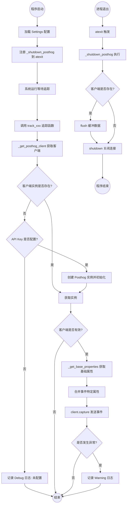
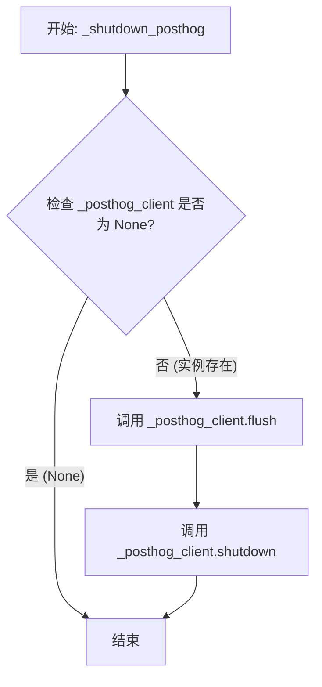
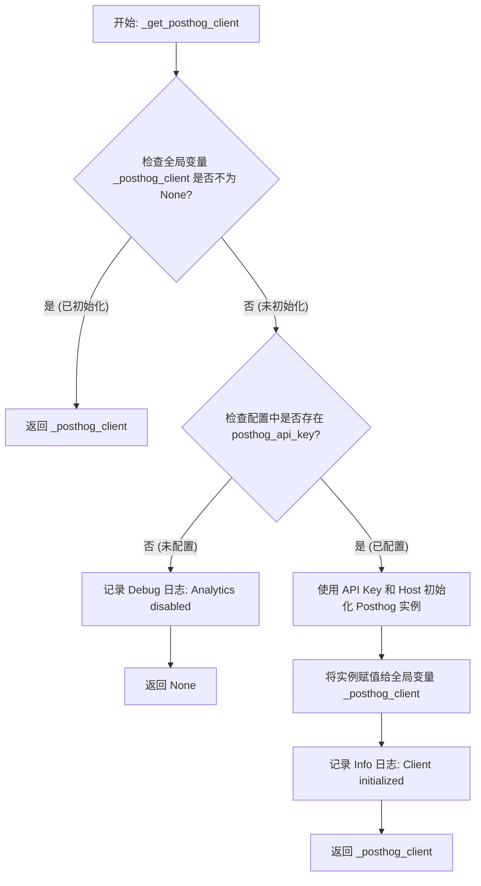
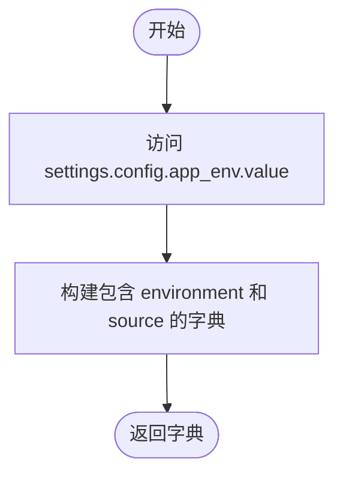
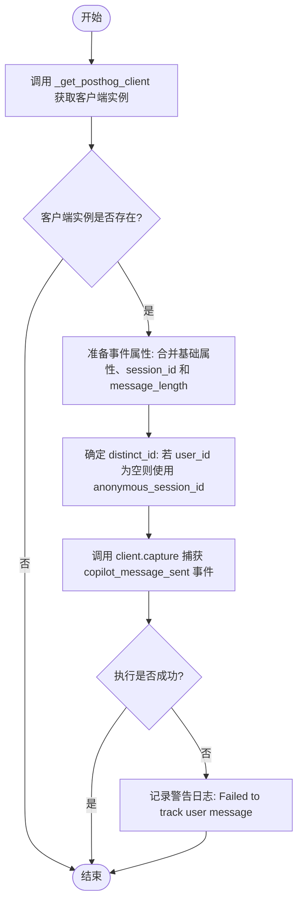
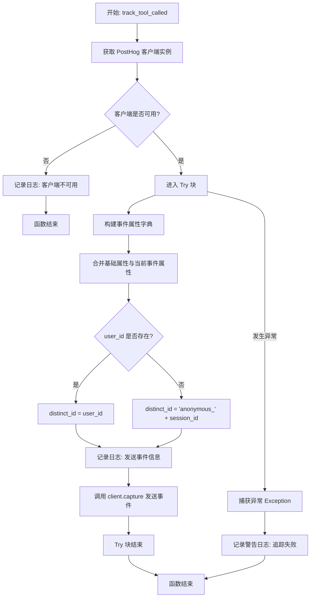
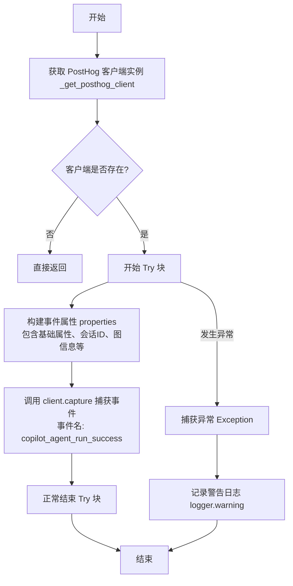
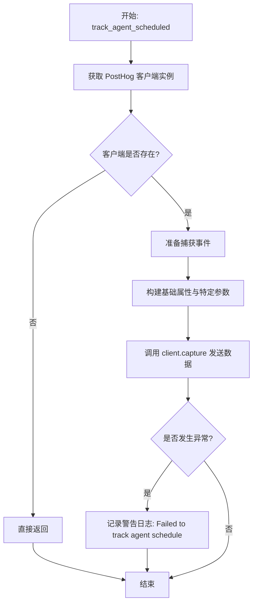
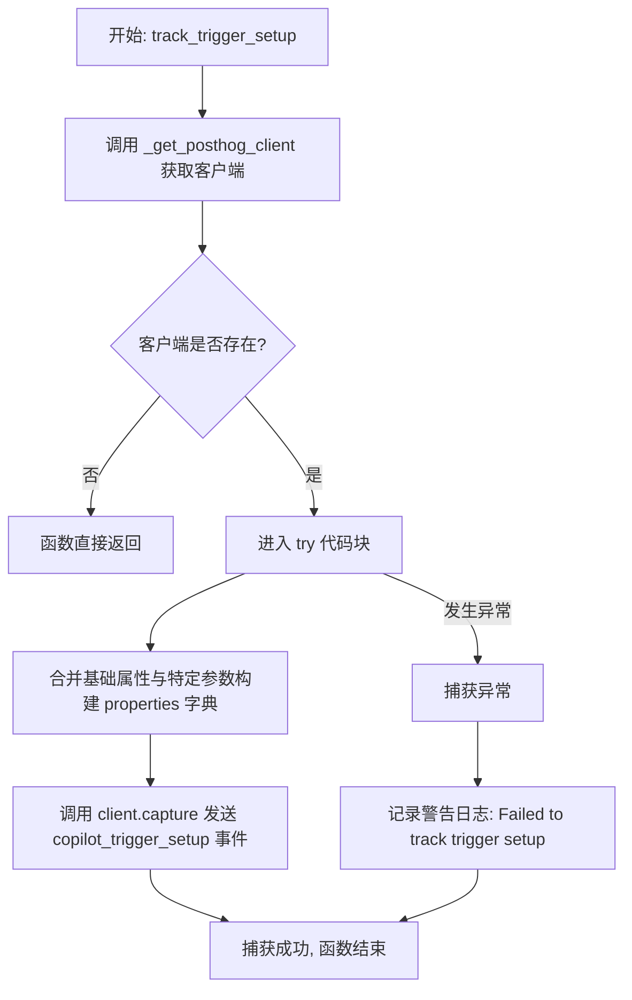

# `AutoGPT\autogpt_platform\backend\backend\api\features\chat\tracking.py` 详细设计文档

该代码模块为聊天系统集成了 PostHog 分析功能，封装了客户端的懒加载初始化、生命周期管理（退出时的刷新与关闭），并提供了用于追踪用户消息发送、工具调用、代理执行成功、代理调度以及触发器设置等关键事件的接口函数。

## 整体流程



## 类结构

```
Module: posthog.py
├── Global Variables
│   ├── logger
│   ├── settings
│   └── _posthog_client
└── Functions
    ├── _shutdown_posthog
    ├── _get_posthog_client
    ├── _get_base_properties
    ├── track_user_message
    ├── track_tool_called
    ├── track_agent_run_success
    ├── track_agent_scheduled
    └── track_trigger_setup
```

## 全局变量及字段


### `logger`
    
Standard logger instance for recording events and errors within this module.

类型：`logging.Logger`
    


### `settings`
    
Global application settings object containing configuration and secrets.

类型：`Settings`
    


### `_posthog_client`
    
Lazy-loaded singleton instance of the PostHog client for analytics tracking.

类型：`Posthog | None`
    


    

## 全局函数及方法


### `_shutdown_posthog`

在进程退出时刷新并关闭 PostHog 客户端实例，以确保内存中所有排队的分析事件都能被发送到服务器。

参数：

-  无

返回值：`None`，无返回值。

#### 流程图



#### 带注释源码

```python
def _shutdown_posthog() -> None:
    """Flush and shutdown PostHog client on process exit."""
    # 检查全局变量 _posthog_client 是否已被实例化
    if _posthog_client is not None:
        # 刷新缓冲区，强制将所有待发送的事件发送到 PostHog 服务器
        _posthog_client.flush()
        # 关闭客户端，清理网络连接和资源
        _posthog_client.shutdown()
```


### `_get_posthog_client`

获取或创建 PostHog 客户端实例。该函数采用单例模式（Singleton Pattern）和延迟初始化（Lazy Initialization）策略，确保在进程生命周期内只创建一个客户端实例，并在未配置 API 密钥时返回 None。

参数：

无

返回值：`Posthog | None`，返回已初始化的 PostHog 客户端实例；如果未配置 API 密钥或初始化失败（此处未显式捕获异常，依赖外部处理），则返回 None。

#### 流程图



#### 带注释源码

```python
def _get_posthog_client() -> Posthog | None:
    """Get or create the PostHog client instance."""
    # 声明引用全局变量，以便在函数内部修改它
    global _posthog_client
    
    # 检查是否已经存在客户端实例（单例检查）
    if _posthog_client is not None:
        return _posthog_client

    # 如果尚未初始化，检查是否配置了 PostHog API Key
    if not settings.secrets.posthog_api_key:
        logger.debug("PostHog API key not configured, analytics disabled")
        return None

    # 使用配置中的 API Key 和 Host 创建新的 PostHog 客户端实例
    _posthog_client = Posthog(
        settings.secrets.posthog_api_key,
        host=settings.secrets.posthog_host,
    )
    
    # 记录初始化成功的日志
    logger.info(
        f"PostHog client initialized with host: {settings.secrets.posthog_host}"
    )
    
    # 返回新创建的客户端实例
    return _posthog_client
```


### `_get_base_properties`

获取包含在所有事件中的基础属性。

参数：

-   无

返回值：`dict[str, Any]`，包含基础属性（如运行环境和来源标识）的字典。

#### 流程图



#### 带注释源码

```python
def _get_base_properties() -> dict[str, Any]:
    """Get base properties included in all events."""
    # 返回一个字典，包含所有分析事件共有的基础属性
    # "environment": 从全局设置中获取当前应用运行环境的值（如 production, development）
    # "source": 固定标识事件来源为 "chat_copilot"
    return {
        "environment": settings.config.app_env.value,
        "source": "chat_copilot",
    }
```


### `track_user_message`

Track when a user sends a message in chat.

参数：

-  `user_id`：`str | None`，The user's ID (or None for anonymous)
-  `session_id`：`str`，The chat session ID
-  `message_length`：`int`，Length of the user's message

返回值：`None`，无返回值

#### 流程图



#### 带注释源码

```python
def track_user_message(
    user_id: str | None,
    session_id: str,
    message_length: int,
) -> None:
    """Track when a user sends a message in chat.

    Args:
        user_id: The user's ID (or None for anonymous)
        session_id: The chat session ID
        message_length: Length of the user's message
    """
    # 获取 PostHog 客户端实例
    client = _get_posthog_client()
    # 如果客户端未初始化或配置不可用，则直接返回
    if not client:
        return

    try:
        # 构建事件属性，合并基础属性与特定消息属性
        properties = {
            **_get_base_properties(),
            "session_id": session_id,
            "message_length": message_length,
        }
        # 捕获事件，处理匿名用户 ID 逻辑
        client.capture(
            distinct_id=user_id or f"anonymous_{session_id}",
            event="copilot_message_sent",
            properties=properties,
        )
    except Exception as e:
        # 捕获异常并记录警告，防止追踪逻辑影响主业务流程
        logger.warning(f"Failed to track user message: {e}")
```


### `track_tool_called`

该函数用于在聊天系统中跟踪和记录工具调用的事件，将相关数据发送至 PostHog 进行分析。

参数：

- `user_id`：`str | None`，用户的 ID（如果是匿名用户则为 None）
- `session_id`：`str`，聊天会话的 ID
- `tool_name`：`str`，被调用工具的名称
- `tool_call_id`：`str`，工具调用的唯一标识 ID

返回值：`None`，无返回值（void 函数）

#### 流程图



#### 带注释源码

```python
def track_tool_called(
    user_id: str | None,
    session_id: str,
    tool_name: str,
    tool_call_id: str,
) -> None:
    """Track when a tool is called in chat.

    Args:
        user_id: The user's ID (or None for anonymous)
        session_id: The chat session ID
        tool_name: Name of the tool being called
        tool_call_id: Unique ID of the tool call
    """
    # 获取 PostHog 客户端单例，如果未初始化或未配置则返回 None
    client = _get_posthog_client()
    if not client:
        # 如果客户端不可用（例如未配置 API Key），记录信息并直接返回
        logger.info("PostHog client not available for tool tracking")
        return

    try:
        # 构建事件属性，包含基础属性（如环境、来源）和本次工具调用的特定信息
        properties = {
            **_get_base_properties(),
            "session_id": session_id,
            "tool_name": tool_name,
            "tool_call_id": tool_call_id,
        }
        # 确定用户标识符：如果有 user_id 则使用，否则基于 session_id 生成匿名标识
        distinct_id = user_id or f"anonymous_{session_id}"
        # 记录日志，表明正在准备发送事件
        logger.info(
            f"Sending copilot_tool_called event to PostHog: distinct_id={distinct_id}, "
            f"tool_name={tool_name}"
        )
        # 调用 PostHog 客户端捕获并发送事件
        client.capture(
            distinct_id=distinct_id,
            event="copilot_tool_called",
            properties=properties,
        )
    except Exception as e:
        # 捕获发送过程中的任何异常，记录警告日志，防止影响主业务流程
        logger.warning(f"Failed to track tool call: {e}")
```


### `track_agent_run_success`

Track when an agent is successfully run.

参数：

-  `user_id`：`str`，The user's ID
-  `session_id`：`str`，The chat session ID
-  `graph_id`：`str`，ID of the agent graph
-  `graph_name`：`str`，Name of the agent
-  `execution_id`：`str`，ID of the execution
-  `library_agent_id`：`str`，ID of the library agent

返回值：`None`，该方法不返回任何值，仅执行记录操作。

#### 流程图



#### 带注释源码

```python
def track_agent_run_success(
    user_id: str,
    session_id: str,
    graph_id: str,
    graph_name: str,
    execution_id: str,
    library_agent_id: str,
) -> None:
    """Track when an agent is successfully run.

    Args:
        user_id: The user's ID
        session_id: The chat session ID
        graph_id: ID of the agent graph
        graph_name: Name of the agent
        execution_id: ID of the execution
        library_agent_id: ID of the library agent
    """
    # 获取 PostHog 客户端单例，如果未配置则返回 None
    client = _get_posthog_client()
    if not client:
        return

    try:
        # 组合基础属性（环境、来源）与当前事件的特定属性
        properties = {
            **_get_base_properties(),
            "session_id": session_id,
            "graph_id": graph_id,
            "graph_name": graph_name,
            "execution_id": execution_id,
            "library_agent_id": library_agent_id,
        }
        # 调用 PostHog 客户端发送事件数据
        client.capture(
            distinct_id=user_id,
            event="copilot_agent_run_success",
            properties=properties,
        )
    except Exception as e:
        # 捕获并记录任何在追踪过程中发生的异常，防止影响主流程
        logger.warning(f"Failed to track agent run: {e}")
```


### `track_agent_scheduled`

Track when an agent is successfully scheduled.

参数：

- `user_id`：`str`，The user's ID
- `session_id`：`str`，The chat session ID
- `graph_id`：`str`，ID of the agent graph
- `graph_name`：`str`，Name of the agent
- `schedule_id`：`str`，ID of the schedule
- `schedule_name`：`str`，Name of the schedule
- `cron`：`str`，Cron expression for the schedule
- `library_agent_id`：`str`，ID of the library agent

返回值：`None`，无返回值

#### 流程图



#### 带注释源码

```python
def track_agent_scheduled(
    user_id: str,
    session_id: str,
    graph_id: str,
    graph_name: str,
    schedule_id: str,
    schedule_name: str,
    cron: str,
    library_agent_id: str,
) -> None:
    """Track when an agent is successfully scheduled.

    Args:
        user_id: The user's ID
        session_id: The chat session ID
        graph_id: ID of the agent graph
        graph_name: Name of the agent
        schedule_id: ID of the schedule
        schedule_name: Name of the schedule
        cron: Cron expression for the schedule
        library_agent_id: ID of the library agent
    """
    # 获取 PostHog 客户端实例
    client = _get_posthog_client()
    # 如果客户端未初始化或配置不可用，则中止跟踪
    if not client:
        return

    try:
        # 合并基础属性与当前事件特定的属性
        properties = {
            **_get_base_properties(),
            "session_id": session_id,
            "graph_id": graph_id,
            "graph_name": graph_name,
            "schedule_id": schedule_id,
            "schedule_name": schedule_name,
            "cron": cron,
            "library_agent_id": library_agent_id,
        }
        # 捕获并发送 'copilot_agent_scheduled' 事件到 PostHog
        client.capture(
            distinct_id=user_id,
            event="copilot_agent_scheduled",
            properties=properties,
        )
    except Exception as e:
        # 捕获并记录任何在发送过程中发生的异常，防止影响主流程
        logger.warning(f"Failed to track agent schedule: {e}")
```


### `track_trigger_setup`

跟踪何时为代理设置了触发器。

参数：

-  `user_id`：`str`，用户的 ID
-  `session_id`：`str`，聊天会话 ID
-  `graph_id`：`str`，代理图的 ID
-  `graph_name`：`str`，代理的名称
-  `trigger_type`：`str`，触发器类型（例如，'webhook'）
-  `library_agent_id`：`str`，库代理的 ID

返回值：`None`，无返回值

#### 流程图



#### 带注释源码

```python
def track_trigger_setup(
    user_id: str,
    session_id: str,
    graph_id: str,
    graph_name: str,
    trigger_type: str,
    library_agent_id: str,
) -> None:
    """Track when a trigger is set up for an agent.

    Args:
        user_id: The user's ID
        session_id: The chat session ID
        graph_id: ID of the agent graph
        graph_name: Name of the agent
        trigger_type: Type of trigger (e.g., 'webhook')
        library_agent_id: ID of the library agent
    """
    # 获取 PostHog 客户端实例
    client = _get_posthog_client()
    # 如果客户端不可用（例如未配置 API Key），则直接返回
    if not client:
        return

    try:
        # 构建事件属性字典，包含基础属性和本次事件的特定属性
        properties = {
            **_get_base_properties(),
            "session_id": session_id,
            "graph_id": graph_id,
            "graph_name": graph_name,
            "trigger_type": trigger_type,
            "library_agent_id": library_agent_id,
        }
        # 调用 PostHog 客户端发送 'copilot_trigger_setup' 事件
        client.capture(
            distinct_id=user_id,
            event="copilot_trigger_setup",
            properties=properties,
        )
    except Exception as e:
        # 捕获并记录发送过程中的异常，避免影响主流程
        logger.warning(f"Failed to track trigger setup: {e}")
```


## 关键组件


### PostHog 客户端惰性加载与生命周期管理
通过全局变量 `_posthog_client` 实现惰性初始化，仅在首次调用 `_get_posthog_client` 时创建实例；利用 `atexit` 注册进程退出时的清理逻辑（`_shutdown_posthog`），确保缓冲数据被刷新并优雅关闭。

### 事件追踪包装器
提供了一系列封装函数（如 `track_user_message`, `track_tool_called` 等）用于捕获特定业务事件。这些函数统一包含异常捕获逻辑，将具体的业务参数聚合为事件属性，防止追踪失败影响主流程。

### 基础属性注入
通过 `_get_base_properties` 函数集中提取环境（`app_env`）和来源（`source`）等元数据，并在所有追踪函数中通过解包操作将其注入事件，确保所有上报的事件都包含标准化的基础上下文信息。


## 问题及建议


### 已知问题

-   **全局状态管理**: `_posthog_client` 是一个模块级全局变量。这种设计使得单元测试变得困难（需要模拟全局状态），并且在复杂的应用生命周期管理中容易导致状态不一致或竞态条件。
-   **日志记录不一致**: `track_tool_called` 函数在客户端不可用时记录 `INFO` 级别日志，而其他追踪函数（如 `track_user_message`）则直接静默返回。这种不一致性增加了运维监控的复杂度。
-   **进程退出阻塞风险**: `_shutdown_posthog` 通过 `atexit` 注册，调用了 `flush()` 和 `shutdown()`。如果此时网络发生拥塞或 PostHog 服务端响应缓慢，这两个同步阻塞调用可能会导致应用程序退出时间显著延长，甚至卡死。
-   **代码重复**: `distinct_id` 的生成逻辑（`user_id or f"anonymous_{session_id}"`）在多个函数中重复出现，违反了 DRY（Don't Repeat Yourself）原则，增加了维护成本。
-   **宽泛的异常捕获**: 所有的追踪函数都使用了 `except Exception as e`。虽然为了不影响主业务流程而忽略追踪错误是合理的，但这种“吞没”异常的方式使得无法区分网络错误、认证失败或数据格式错误，不利于排查具体的集成问题。

### 优化建议

-   **重构为类与依赖注入**: 将全局函数和变量重构为一个 `AnalyticsService` 或 `PosthogTracker` 类。通过依赖注入的方式在 Chat 系统中使用该服务实例。这不仅能消除全局状态，还能显著提升代码的可测试性和生命周期管理的清晰度。
-   **引入异步支持**: 鉴于这是一个聊天系统，主线程通常对延迟非常敏感。建议确保分析数据的发送是异步的（例如在后台线程中执行，或者如果主应用是异步框架，使用 `asyncio.to_thread` 或非阻塞客户端），以避免追踪逻辑阻塞用户交互。
-   **统一错误处理与监控**: 建立统一的日志策略，并考虑将追踪失败的异常（而非仅仅是警告日志）上报至系统的错误监控中心（如 Sentry），以便及时发现分析系统的配置或网络问题。
-   **提取通用逻辑**: 提取 `_get_distinct_id(user_id, session_id)` 辅助函数，统一处理匿名用户的 ID 生成逻辑，消除代码重复。
-   **配置前置校验**: 将 API Key 和 Host 的配置校验逻辑从运行时的 `_get_posthog_client` 移至应用启动时的配置加载阶段（Settings 初始化时）。这样可以实现“Fail Fast”机制，在应用启动时就告知运维人员配置缺失，而不是等到用户产生行为后才报错。


## 其它


### 设计目标与约束

1.  **非侵入性与高可用性**：核心设计目标是确保分析模块的存在不会影响主业务逻辑的运行稳定性。所有数据上报操作均采用异步或非阻塞方式，且禁止分析代码抛出异常导致系统中断。
2.  **优雅降级**：当配置缺失（如未配置 API Key）或外部服务不可用时，系统应自动禁用跟踪功能，静默失败或仅记录日志，而不是报错。
3.  **懒加载**：PostHog 客户端实例仅在首次调用跟踪方法时初始化，以减少应用启动时的开销和资源占用。
4.  **环境感知**：支持通过配置（`app_env`）区分不同环境的事件数据，便于在生产与开发环境中隔离分析数据。
5.  **匿名用户支持**：系统设计需兼容无用户 ID（`None`）的场景，自动生成匿名标识符以保证数据连续性。

### 错误处理与异常设计

1.  **全局捕获策略**：所有的 `track_*` 函数内部均实现了 `try-except Exception` 块。
2.  **异常吞噬与日志记录**：捕获到任何异常（如网络错误、序列化错误、SDK 错误）时，不会向上层抛出，而是通过 `logger.warning` 记录错误信息。这确保了分析功能故障不会传导至业务逻辑。
3.  **客户端初始化失败处理**：若 `Posthog` 客户端初始化失败（例如密钥无效），`_get_posthog_client` 返回 `None`，后续所有跟踪操作会提前返回，避免空指针异常。
4.  **退出处理安全**：`_shutdown_posthog` 函数在 `atexit` 注册时检查了客户端是否为 `None`，防止在未初始化的情况下调用 shutdown 方法导致错误。

### 数据流与状态机

1.  **PostHog 客户端状态机**：
    *   **Uninitialized (未初始化)**：进程启动后，全局变量 `_posthog_client` 初始为 `None`。
    *   **Initializing (初始化中)**：首次调用 `_get_posthog_client()`，检查配置并尝试实例化。
    *   **Active (活跃)**：实例化成功，客户端变量持有 `Posthog` 对象，可以发送事件。
    *   **Disabled (禁用)**：配置缺失，显式返回 `None`，保持在“未初始化”状态。
    *   **Shutdown (已关闭)**：进程退出时，`atexit` 触发 `_shutdown_posthog`，执行 `flush` 和 `shutdown`，释放资源。

2.  **事件数据流**：
    *   **输入**：业务代码调用 `track_*` 函数，传入业务上下文参数（如 `user_id`, `session_id`）。
    *   **预处理**：调用 `_get_posthog_client()` 确保客户端可用；调用 `_get_base_properties()` 获取全局环境属性。
    *   **合并**：使用字典解包（`**`）将全局属性与事件特定属性合并。
    *   **ID 处理**：对 `user_id` 进行判空处理，若为空则使用 `session_id` 生成匿名 ID。
    *   **输出**：调用 `client.capture()` 将数据发送至 PostHog 服务端。

### 外部依赖与接口契约

1.  **外部库依赖**：
    *   **`posthog`**：PostHog 官方 Python SDK。
        *   *契约*：提供 `capture(distinct_id, event, properties)` 方法用于事件上报；提供 `flush()` 和 `shutdown()` 方法用于资源清理。
2.  **内部模块依赖**：
    *   **`backend.util.settings.Settings`**：应用配置管理类。
        *   *契约*：必须包含 `secrets.posthog_api_key` (str) 和 `secrets.posthog_host` (str) 属性；必须包含 `config.app_env` (Enum) 属性用于环境区分。
3.  **环境契约**：
    *   需要操作系统支持 `atexit` 注册机制（标准 Python 环境）。
    *   需要网络访问权限以连接 `posthog_host` 指定的端点。

### 配置管理

1.  **配置来源**：配置项通过全局单例 `Settings()` 加载，通常来源于环境变量或配置文件。
2.  **关键配置项**：
    *   `secrets.posthog_api_key`：用于身份验证的密钥。若为空或未设置，整个分析模块功能禁用。
    *   `secrets.posthog_host`：PostHog 事件接收服务器的地址（例如自建实例地址）。
3.  **配置校验**：校验逻辑被推迟到客户端首次初始化时（`_get_posthog_client`），实现“按需检查”。

    