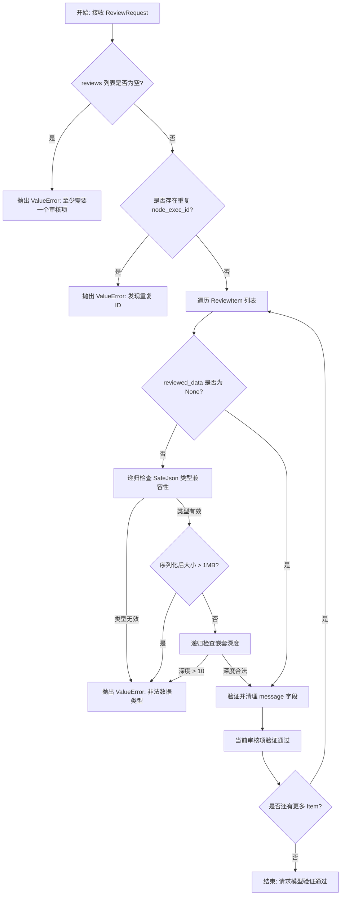
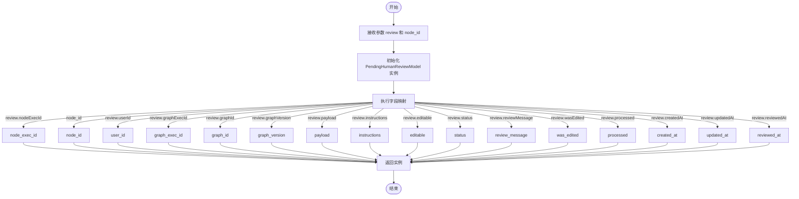
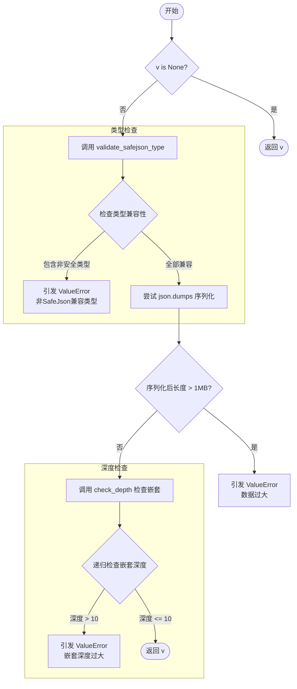
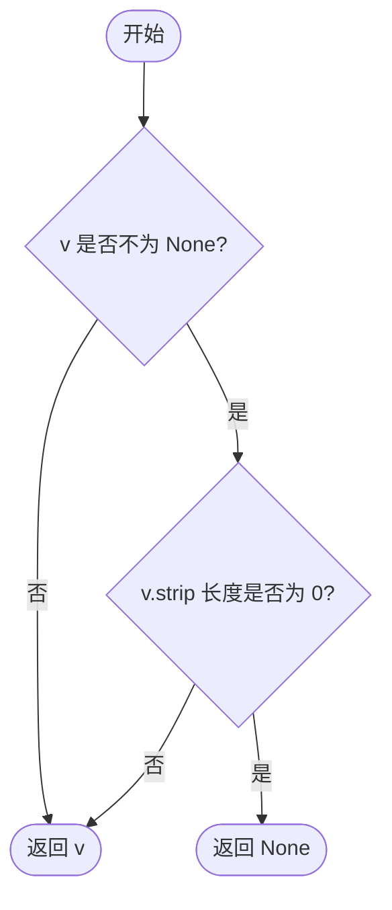
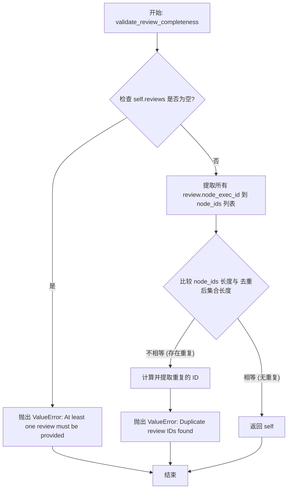

# `AutoGPT\autogpt_platform\backend\backend\api\features\executions\review\model.py` 详细设计文档

该代码定义了用于 Human-in-the-Loop（人工介入）审核流程的 Pydantic 数据模型，包括待审核数据模型、审核提交项、批量审核请求及响应结构，并集成了对审核数据安全性（类型、大小、嵌套深度）和完整性的验证逻辑。

## 整体流程



## 类结构

```
BaseModel (Pydantic)
├── PendingHumanReviewModel
├── ReviewItem
├── ReviewRequest
└── ReviewResponse
```

## 全局变量及字段


### `SafeJsonData`
    
SafeJson-compatible type alias for review data

类型：`Union[Dict[str, Any], List[Any], str, int, float, bool, None]`
    


### `PendingHumanReviewModel.node_exec_id`
    
Node execution ID (primary key)

类型：`str`
    


### `PendingHumanReviewModel.node_id`
    
Node definition ID (for grouping)

类型：`str`
    


### `PendingHumanReviewModel.user_id`
    
User ID associated with the review

类型：`str`
    


### `PendingHumanReviewModel.graph_exec_id`
    
Graph execution ID

类型：`str`
    


### `PendingHumanReviewModel.graph_id`
    
Graph ID

类型：`str`
    


### `PendingHumanReviewModel.graph_version`
    
Graph version

类型：`int`
    


### `PendingHumanReviewModel.payload`
    
The actual data payload awaiting review

类型：`SafeJsonData`
    


### `PendingHumanReviewModel.instructions`
    
Instructions or message for the reviewer

类型：`str | None`
    


### `PendingHumanReviewModel.editable`
    
Whether the reviewer can edit the data

类型：`bool`
    


### `PendingHumanReviewModel.status`
    
Review status

类型：`ReviewStatus`
    


### `PendingHumanReviewModel.review_message`
    
Optional message from the reviewer

类型：`str | None`
    


### `PendingHumanReviewModel.was_edited`
    
Whether the data was modified during review

类型：`bool | None`
    


### `PendingHumanReviewModel.processed`
    
Whether the review result has been processed by the execution engine

类型：`bool`
    


### `PendingHumanReviewModel.created_at`
    
When the review was created

类型：`datetime`
    


### `PendingHumanReviewModel.updated_at`
    
When the review was last updated

类型：`datetime | None`
    


### `PendingHumanReviewModel.reviewed_at`
    
When the review was completed

类型：`datetime | None`
    


### `ReviewItem.node_exec_id`
    
Node execution ID to review

类型：`str`
    


### `ReviewItem.approved`
    
Whether this review is approved (True) or rejected (False)

类型：`bool`
    


### `ReviewItem.message`
    
Optional review message

类型：`str | None`
    


### `ReviewItem.reviewed_data`
    
Optional edited data (ignored if approved=False)

类型：`SafeJsonData | None`
    


### `ReviewItem.auto_approve_future`
    
If true and this review is approved, future executions of this same block (node) will be automatically approved. This only affects approved reviews.

类型：`bool`
    


### `ReviewRequest.reviews`
    
All reviews with their approval status, data, and messages

类型：`List[ReviewItem]`
    


### `ReviewResponse.approved_count`
    
Number of reviews successfully approved

类型：`int`
    


### `ReviewResponse.rejected_count`
    
Number of reviews successfully rejected

类型：`int`
    


### `ReviewResponse.failed_count`
    
Number of reviews that failed processing

类型：`int`
    


### `ReviewResponse.error`
    
Error message if operation failed

类型：`str | None`
    
    

## 全局函数及方法


### `PendingHumanReviewModel.from_db`

将数据库模型转换为响应模型。使用新的扁平化数据库结构（包含 payload、instructions 和 editable 的单独列），并通过使用安全默认值来优雅地处理无效数据。

参数：

- `review`：`PendingHumanReview`，数据库审查对象。
- `node_id`：`str`，节点定义 ID（从 NodeExecution 获取）。

返回值：`PendingHumanReviewModel`，基于数据库记录填充的 `PendingHumanReviewModel` 实例。

#### 流程图



#### 带注释源码

```python
@classmethod
def from_db(
    cls, review: "PendingHumanReview", node_id: str
) -> "PendingHumanReviewModel":
    """
    Convert a database model to a response model.

    Uses the new flat database structure with separate columns for
    payload, instructions, and editable flag.

    Handles invalid data gracefully by using safe defaults.

    Args:
        review: Database review object
        node_id: Node definition ID (fetched from NodeExecution)
    """
    # 实例化 cls（即 PendingHumanReviewModel）并将数据库对象的属性映射到 Pydantic 模型字段
    return cls(
        node_exec_id=review.nodeExecId,   # 映射节点执行 ID
        node_id=node_id,                  # 使用传入的节点定义 ID
        user_id=review.userId,            # 映射用户 ID
        graph_exec_id=review.graphExecId, # 映射图执行 ID
        graph_id=review.graphId,          # 映射图 ID
        graph_version=review.graphVersion,# 映射图版本
        payload=review.payload,           # 映射数据负载
        instructions=review.instructions, # 映射指令
        editable=review.editable,         # 映射是否可编辑
        status=review.status,             # 映射状态
        review_message=review.reviewMessage, # 映射审查消息
        was_edited=review.wasEdited,      # 映射是否被编辑过
        processed=review.processed,       # 映射处理状态
        created_at=review.createdAt,      # 映射创建时间
        updated_at=review.updatedAt,      # 映射更新时间
        reviewed_at=review.reviewedAt,    # 映射审查完成时间
    )
```


### `ReviewItem.validate_reviewed_data`

这是一个用于 `reviewed_data` 字段的 Pydantic 类方法验证器。它的核心功能是确保传入的数据结构仅包含安全的 JSON 兼容类型（如字典、列表、基本类型），检查序列化后的数据大小是否超过 1MB 以防止 DoS 攻击，并递归检查数据嵌套深度是否超过 10 层以防止堆栈溢出。

参数：

- `v`：`SafeJsonData | None`，待验证的 `reviewed_data` 字段值，可以是字典、列表、字符串、数字、布尔值或 None。

返回值：`SafeJsonData | None`，如果验证通过，返回原始值 `v`；如果验证失败，抛出 `ValueError` 异常。

#### 流程图



#### 带注释源码

```python
    @field_validator("reviewed_data")
    @classmethod
    def validate_reviewed_data(cls, v):
        """Validate that reviewed_data is safe and properly structured."""
        # 如果值为空，直接返回，无需验证
        if v is None:
            return v

        # 定义内部函数：验证 SafeJson 兼容类型
        def validate_safejson_type(obj):
            """Ensure object only contains SafeJson compatible types."""
            if obj is None:
                return True
            elif isinstance(obj, (str, int, float, bool)):
                return True
            elif isinstance(obj, dict):
                # 递归检查字典的键和值，键必须是字符串，值也必须是安全类型
                return all(
                    isinstance(k, str) and validate_safejson_type(v)
                    for k, v in obj.items()
                )
            elif isinstance(obj, list):
                # 递归检查列表中的每一项
                return all(validate_safejson_type(item) for item in obj)
            else:
                return False

        # 执行类型验证，失败则抛出异常
        if not validate_safejson_type(v):
            raise ValueError("reviewed_data contains non-SafeJson compatible types")

        # 验证数据大小以防止 DoS 攻击
        try:
            json_str = json.dumps(v)
            # 限制大小为 1MB
            if len(json_str) > 1000000:  # 1MB limit
                raise ValueError("reviewed_data is too large (max 1MB)")
        except (TypeError, ValueError) as e:
            raise ValueError(f"reviewed_data must be JSON serializable: {str(e)}")

        # 定义内部函数：检查嵌套深度，防止无限递归导致的栈溢出
        def check_depth(obj, max_depth=10, current_depth=0):
            """Recursively check object nesting depth to prevent stack overflow attacks."""
            if current_depth > max_depth:
                raise ValueError("reviewed_data has excessive nesting depth")

            if isinstance(obj, dict):
                for value in obj.values():
                    check_depth(value, max_depth, current_depth + 1)
            elif isinstance(obj, list):
                for item in obj:
                    check_depth(item, max_depth, current_depth + 1)

        # 执行深度检查
        check_depth(v)
        return v
```


### `ReviewItem.validate_message`

验证并清理审查消息。该函数检查输入的消息值，如果输入不为 None 但仅包含空白字符，则将其标准化为 None，以确保数据的一致性和清洁度。

参数：

-  `v`：`str | None`，待验证的消息内容。

返回值：`str | None`，清洗后的消息内容，若输入为空字符串则返回 None。

#### 流程图



#### 带注释源码

```python
    @field_validator("message")
    @classmethod
    def validate_message(cls, v):
        """验证并清理审查消息。"""
        # 检查 v 是否不为 None 且去除首尾空格后长度为 0
        if v is not None and len(v.strip()) == 0:
            # 如果是纯空白字符串，将其标准化为 None
            return None
        # 否则返回原始值
        return v
```


### `ReviewRequest.validate_review_completeness`

该方法是一个 Pydantic 模型验证器，用于验证 `ReviewRequest` 实例的完整性。它确保请求中至少包含一个审核项，并且检查所有的节点执行 ID（`node_exec_id`）是否唯一，防止出现重复提交的审核。

参数：

- `self`：`ReviewRequest`，待验证的模型实例，包含需要处理的审核列表。

返回值：`ReviewRequest`，验证通过的模型实例。

#### 流程图



#### 带注释源码

```python
    @model_validator(mode="after")
    def validate_review_completeness(self):
        """Validate that we have at least one review to process and no duplicates."""
        # 检查审核列表是否为空，确保至少有一个审核项需要处理
        if not self.reviews:
            raise ValueError("At least one review must be provided")

        # 提取所有审核项中的节点执行 ID (node_exec_id)
        node_ids = [review.node_exec_id for review in self.reviews]
        
        # 检查 ID 列表长度与去重后的集合长度是否一致
        # 如果不一致，说明列表中存在重复的 ID
        if len(node_ids) != len(set(node_ids)):
            # 遍历集合，找出在原列表中出现次数大于 1 的 ID
            duplicates = [nid for nid in set(node_ids) if node_ids.count(nid) > 1]
            # 抛出包含具体重复 ID 的错误信息
            raise ValueError(f"Duplicate review IDs found: {', '.join(duplicates)}")

        # 验证通过，返回实例自身
        return self
```


## 关键组件


### 待审查数据模型
用于表示和管理人机交互系统中待审查请求的数据结构，包含审查的唯一标识、关联的图执行信息、待审查的数据负载以及审查状态等核心字段，并提供了从数据库模型到响应模型的转换方法。

### 单项审查处理与安全验证
负责处理单次审查操作的输入与验证，包含批准或拒绝的决策逻辑、可选的编辑数据以及自动批准未来执行的设置；实现了对编辑数据的严格安全检查，包括 JSON 兼容性、大小限制（1MB）和递归深度限制，以防止 DoS 攻击。

### 批量审查请求与响应协议
定义了批量处理多个审查项的请求与响应契约，确保请求包含所有必要的待审查项且无重复，汇总处理结果（批准、拒绝、失败的数量）并返回统一的响应格式。


## 问题及建议


### 已知问题

-   `PendingHumanReviewModel` 中的 `node_id` 字段默认为空字符串并明确标记为“Temporary default for test compatibility”，这种将测试逻辑硬编码在生产数据模型中的做法是典型的技术债务，可能导致生产环境数据校验逻辑被绕过或产生歧义。
-   `ReviewRequest` 中的 `validate_review_completeness` 方法在检查重复 ID 时使用了 `list.count()`，导致时间复杂度为 O(N^2)，在待审核列表较长时会导致性能下降。
-   `ReviewItem` 的验证器中硬编码了魔术数字（如数据大小限制 `1000000`、嵌套深度 `10`），这些值散落在代码逻辑中，缺乏统一管理，难以适应业务规则的变化。
-   `ReviewItem.validate_reviewed_data` 中手动实现了递归类型检查 `validate_safejson_type`，这部分逻辑与 `json.dumps` 的功能存在重叠，且手动递归在 Python 中效率较低，代码冗余。

### 优化建议

-   移除 `PendingHumanReviewModel.node_id` 的默认空字符串，将其恢复为必填字段，并将测试数据的构造逻辑移至测试用例或测试工厂函数中，确保生产代码的严谨性。
-   优化 `ReviewRequest` 中的重复 ID 检查算法。建议利用集合的特性（`len(node_ids) != len(set(node_ids))`）将时间复杂度降至 O(N)，仅在确实需要列出具体重复 ID 时才进行遍历。
-   将 `ReviewItem` 中的数据大小限制（1MB）、嵌套深度限制（10）和消息长度限制（2000）提取为模块级别的常量（如 `MAX_PAYLOAD_SIZE`, `MAX_NESTING_DEPTH`），或通过配置文件进行管理，提高代码的可维护性。
-   简化 `ReviewItem.validate_reviewed_data` 的验证逻辑。利用 Python 的 `json.dumps` 方法直接验证数据是否可序列化（自动处理类型兼容性），仅保留手写的嵌套深度检查逻辑，减少代码量并提升执行效率。
-   考虑使用 Pydantic 的 `BeforeValidator` 或 `AfterValidator` 结合 `Annotated` 类型来封装 `SafeJsonData` 的验证逻辑，从而复用该类型定义，避免在多处重复编写验证代码。


## 其它


### 设计目标与约束

**设计目标：**
1.  **数据安全性**：确保所有传入的审核数据（`reviewed_data`）都是可序列化为 JSON 的安全类型（SafeJson），防止代码注入或不安全数据的存储。
2.  **系统稳定性**：通过限制数据大小和嵌套深度，防止恶意或异常的大数据包导致服务拒绝（DoS）或栈溢出。
3.  **类型安全**：利用 Pydantic 模型进行严格的类型检查和验证，确保数据在进入业务逻辑层前的完整性。
4.  **人机交互完整性**：准确捕获用户在审核过程中的意图（批准/拒绝）、修改痕迹以及反馈信息。

**约束条件：**
1.  **数据体积限制**：单次审核的 `reviewed_data` 序列化后的 JSON 字符串长度不得超过 1MB。
2.  **嵌套深度限制**：`reviewed_data` 的嵌套层级深度不得超过 10 层。
3.  **数据结构**：`reviewed_data` 必须符合 `SafeJsonData` 定义，即仅包含 `Dict`, `List`, `str`, `int`, `float`, `bool`, `None` 类型。
4.  **业务逻辑约束**：`ReviewRequest` 必须包含至少一个审核项，且同一批次内不得包含重复的 `node_exec_id`。

### 错误处理与异常设计

本模块主要依赖 Pydantic 的 `ValidationError` 进行输入校验，未直接捕获底层异常，而是依赖框架处理。

1.  **数据结构异常**：
    *   当 `reviewed_data` 包含非基本类型（如自定义类、函数指针等）时，抛出 `ValueError("reviewed_data contains non-SafeJson compatible types")`。
    *   当数据无法被 `json.dumps` 序列化时，抛出 `ValueError("reviewed_data must be JSON serializable...")`。

2.  **资源限制异常**：
    *   当 JSON 字符串长度超过 1,000,000 字符时，抛出 `ValueError("reviewed_data is too large (max 1MB)")`。
    *   当数据嵌套深度超过 10 层时，抛出 `ValueError("reviewed_data has excessive nesting depth")`。

3.  **业务逻辑异常**：
    *   当提交的 `reviews` 列表为空时，抛出 `ValueError("At least one review must be provided")`。
    *   当提交的 `reviews` 中存在重复的 `node_exec_id` 时，抛出 `ValueError("Duplicate review IDs found: ...")`。
    *   当 `message` 字段为空字符串或仅包含空白字符时，自动将其清洗为 `None`，而非抛出异常。

### 数据流与状态机

**数据流：**
1.  **数据获取**：从数据库（Prisma ORM）读取 `PendingHumanReview` 原始记录。
2.  **模型转换**：通过 `PendingHumanReviewModel.from_db()` 方法，将数据库对象转换为 API 层使用的 Pydantic 模型，补充 `node_id` 等关联信息。
3.  **用户交互**：前端展示 `PendingHumanReviewModel`，用户填写审核结果并构造 `ReviewItem`。
4.  **批量提交**：前端将多个 `ReviewItem` 封装进 `ReviewRequest` 发送至后端。
5.  **结果处理**：后端验证通过后执行审核逻辑，并返回 `ReviewResponse` 统计结果。

**状态机：**
虽然代码中未显式定义状态机类，但 `ReviewStatus` 枚举隐含了审核对象的状态流转：
*   **WAITING**：初始状态，等待用户审核。
*   **APPROVED**：审核通过，工作流继续执行。
*   **REJECTED**：审核拒绝，工作流可能终止或回滚。
*   **注**：`processed` 字段（Bool）是一个辅助标记，用于表示审核结果是否已被执行引擎消费，状态从 `False` 变为 `True`。

### 外部依赖与接口契约

**外部依赖：**
1.  **Prisma ORM**：
    *   `prisma.enums.ReviewStatus`：依赖外部枚举定义审核状态。
    *   `prisma.models.PendingHumanReview`：依赖数据库模型作为数据源，要求该模型必须包含 `nodeExecId`, `userId`, `payload` 等字段。
2.  **Pydantic (V2)**：
    *   依赖 `BaseModel`, `Field` 进行数据建模。
    *   依赖 `field_validator`, `model_validator` 进行自定义验证逻辑。
3.  **Python Standard Library**：
    *   `json`：用于数据序列化和大小检查。
    *   `datetime`：用于时间戳处理。
    *   `typing`：用于类型提示。

**接口契约：**
1.  **数据库契约**：`PendingHumanReview` 对象必须遵循驼峰命名法（CamelCase），例如 `nodeExecId`, `createdAt`，转换方法中直接访问了这些属性。
2.  **API 契约**：
    *   `ReviewRequest` 接口要求一次性传入指定图执行（Graph Execution）下的**所有**待审核项，不支持部分提交。
    *   `ReviewItem` 中的 `reviewed_data` 仅在 `approved=True` 时有效，若 `approved=False`，该字段将被忽略。

### 安全性与性能考量

**安全性：**
1.  **防 DoS 攻击**：通过 `validate_reviewed_data` 中的 1MB 大小限制和递归深度检查，有效防止了恶意构造的超大 JSON 或超深嵌套结构消耗服务器资源。
2.  **数据净化**：对 `reviewed_data` 进行严格的类型白名单检查，确保存储的数据不包含可执行代码或非预期对象。
3.  **输入清洗**：`validate_message` 方法自动去除空白消息，防止存储无意义的空字符串。

**性能：**
1.  **序列化开销**：每次验证 `reviewed_data` 时都会进行 `json.dumps()`，这会产生一定的 CPU 和内存开销。对于大包数据，这是必要的性能代价。
2.  **递归检查**：深度检查使用递归实现，虽然限制了最大深度（10层），但在极限情况下仍可能消耗调用栈资源。

    