# `AutoGPT\autogpt_platform\backend\backend\api\features\executions\review\review_routes_test.py` 详细设计文档

该文件是一个基于 pytest 的异步测试套件，旨在验证人工审核 API 的各项功能，包括获取待审核列表、执行审核操作（批准/拒绝）、自动批准逻辑以及错误处理机制。

## 整体流程

```mermaid
graph TD
    A[开始] --> B[导入依赖库与模块]
    B --> C[定义全局常量 FIXED_NOW]
    C --> D[定义 Fixture: client (HTTP客户端)]
    D --> E[定义 Fixture: sample_pending_review (测试样本)]
    E --> F[测试组: 获取待审核列表]
    E --> G[测试组: 获取特定执行审核]
    E --> H[测试组: 执行审核动作 (批准/拒绝)]
    E --> I[测试组: 错误处理与异常场景]
    E --> J[测试组: 自动批准功能]
    F --> K[结束]
    G --> K
    H --> K
    I --> K
    J --> K
```

## 类结构

```
无自定义类定义 (仅包含测试函数和 Fixture)
```

## 全局变量及字段


### `FIXED_NOW`
    
A fixed timestamp set to January 1, 2023, UTC, used to ensure reproducibility of test data involving dates and times.

类型：`datetime.datetime`
    


    

## 全局函数及方法


### `client`

这是一个用于测试的异步HTTP客户端Fixture，它配置了模拟的JWT认证依赖，允许测试代码在无需真实登录的情况下访问受保护的API端点。

参数：

-   `server`：`Any`，测试服务器实例（通常由conftest.py提供）。
-   `mock_jwt_user`：`Dict[str, Any]`，包含模拟用户信息和JWT Payload获取函数的字典。

返回值：`AsyncGenerator[httpx.AsyncClient, None]`，生成一个初始化好的异步HTTP客户端对象。

#### 流程图

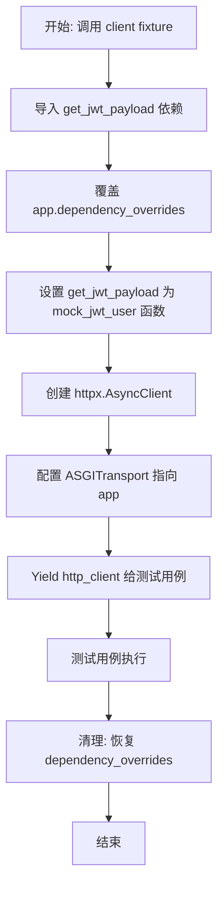

#### 带注释源码

```python
@pytest_asyncio.fixture(loop_scope="session")
async def client(server, mock_jwt_user) -> AsyncGenerator[httpx.AsyncClient, None]:
    """Create async HTTP client with auth overrides"""
    # 导入需要被覆盖的JWT依赖获取函数
    from autogpt_libs.auth.jwt_utils import get_jwt_payload

    # 覆盖FastAPI应用的依赖项：
    # 将原本验证真实JWT的逻辑替换为测试提供的模拟用户逻辑
    app.dependency_overrides[get_jwt_payload] = mock_jwt_user["get_jwt_payload"]

    # 创建异步HTTP客户端，使用ASGI传输直接连接到FastAPI应用实例
    async with httpx.AsyncClient(
        transport=httpx.ASGITransport(app=app),
        base_url="http://test",
    ) as http_client:
        # 将客户端交给测试函数使用
        yield http_client

    # 清理操作：
    # 测试结束后移除依赖覆盖，避免影响其他测试或后续状态
    app.dependency_overrides.pop(get_jwt_payload, None)
```


### `sample_pending_review`

这是一个 pytest fixture，用于创建并返回一个预配置的 `PendingHumanReviewModel` 实例，以便在测试中模拟一个处于待人工审核状态的数据对象。

参数：

-   `test_user_id`：`str`，用于设置待审核记录所属的用户ID，通常由其他 fixture 注入。

返回值：`PendingHumanReviewModel`，返回一个包含完整测试数据（如节点ID、执行ID、负载、状态为WAITING等）的审核模型对象。

#### 流程图

```mermaid
graph TD
    A[开始] --> B[接收 test_user_id 参数]
    B --> C[实例化 PendingHumanReviewModel]
    C --> D[填充预设测试字段 (ID, Payload, Status 等)]
    D --> E[设置状态为 ReviewStatus.WAITING]
    E --> F[返回构建的模型对象]
    F --> G[结束]
```

#### 带注释源码

```python
@pytest.fixture
def sample_pending_review(test_user_id: str) -> PendingHumanReviewModel:
    """Create a sample pending review for testing"""
    # 实例化并返回一个 PendingHumanReviewModel 对象，填充固定的测试数据
    return PendingHumanReviewModel(
        node_exec_id="test_node_123",      # 模拟的节点执行ID
        node_id="test_node_def_456",       # 模拟的节点定义ID
        user_id=test_user_id,              # 使用传入的测试用户ID
        graph_exec_id="test_graph_exec_456", # 模拟的图执行ID
        graph_id="test_graph_789",         # 模拟的图ID
        graph_version=1,                   # 模拟的图版本
        payload={"data": "test payload", "value": 42}, # 模拟的负载数据
        instructions="Please review this data", # 模拟的审核说明
        editable=True,                     # 标记数据可编辑
        status=ReviewStatus.WAITING,       # 核心状态：设置为等待审核
        review_message=None,              # 初始无审核消息
        was_edited=None,                   # 初始未编辑
        processed=False,                   # 标记为未处理
        created_at=FIXED_NOW,              # 使用全局固定时间戳
        updated_at=None,                   # 初始无更新时间
        reviewed_at=None,                  # 初始无审核时间
    )
```


### `test_get_pending_reviews_empty`

该测试函数用于验证当系统中不存在待处理的审核项目时，API 端点 `/api/review/pending` 能够正确返回状态码 200 和一个空列表。通过模拟后端的数据获取函数返回空结果，断言 HTTP 响应的正确性及底层函数调用的参数。

参数：

-  `client`：`httpx.AsyncClient`，用于发送模拟 HTTP 请求的异步测试客户端。
-  `mocker`：`pytest_mock.MockerFixture`，Pytest 的 mock fixture，用于替换后端逻辑以进行隔离测试。
-  `snapshot`：`Snapshot`，用于快照测试的 fixture（本例中传入但未直接使用）。
-  `test_user_id`：`str`，测试上下文中的用户 ID，用于验证调用参数。

返回值：`None`，该函数为测试用例，不返回业务数据，仅执行断言。

#### 流程图

```mermaid
graph TD
    A[Start Test] --> B[Mock get_pending_reviews_for_user]
    B -->|Set return_value = []| C[Send GET Request to /api/review/pending]
    C --> D[Receive Response]
    D --> E[Assert status_code == 200]
    E --> F[Assert response.json == []]
    F --> G[Assert mock called with: test_user_id, 1, 25]
    G --> H[End Test]
```

#### 带注释源码

```python
@pytest.mark.asyncio(loop_scope="session")
async def test_get_pending_reviews_empty(
    client: httpx.AsyncClient,
    mocker: pytest_mock.MockerFixture,
    snapshot: Snapshot,
    test_user_id: str,
) -> None:
    """Test getting pending reviews when none exist"""
    # 模拟后端路由中的 get_pending_reviews_for_user 函数
    mock_get_reviews = mocker.patch(
        "backend.api.features.executions.review.routes.get_pending_reviews_for_user"
    )
    # 设置模拟函数的返回值为空列表，模拟没有待处理审核的场景
    mock_get_reviews.return_value = []

    # 使用测试客户端向 /api/review/pending 发送 GET 请求
    response = await client.get("/api/review/pending")

    # 断言响应状态码为 200，表示请求成功
    assert response.status_code == 200
    # 断言响应的 JSON 体为空列表 []
    assert response.json() == []
    # 验证 mock 函数被正确调用了一次，且参数为 test_user_id，默认页码 1 和默认页大小 25
    mock_get_reviews.assert_called_once_with(test_user_id, 1, 25)
```


### `test_get_pending_reviews_with_data`

该测试函数用于验证当存在待处理的人工审核数据时，API端点能否正确返回用户的待审核列表，并确保分页参数被正确传递和处理。

参数：

- `client`：`httpx.AsyncClient`，用于发起异步HTTP请求的测试客户端，已注入认证信息。
- `mocker`：`pytest_mock.MockerFixture`，用于模拟（Mock）后端依赖函数行为的pytest fixture。
- `sample_pending_review`：`PendingHumanReviewModel`，一个预先定义好的样本审核数据对象，用于模拟数据库返回的记录。
- `snapshot`：`Snapshot`，用于快照测试的fixture（本测试中未直接使用）。
- `test_user_id`：`str`，当前测试用户的ID，用于验证调用参数。

返回值：`None`，该函数为测试用例，不返回实际业务数据，仅通过断言验证行为。

#### 流程图

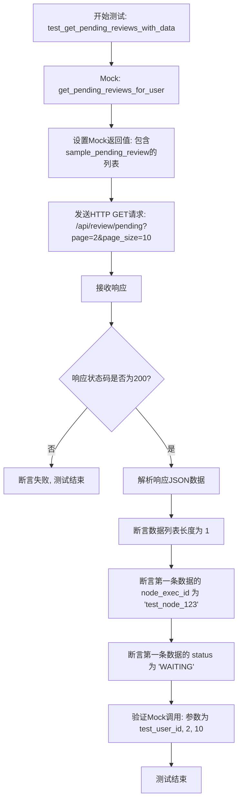

#### 带注释源码

```python
@pytest.mark.asyncio(loop_scope="session")
async def test_get_pending_reviews_with_data(
    client: httpx.AsyncClient,
    mocker: pytest_mock.MockerFixture,
    sample_pending_review: PendingHumanReviewModel,
    snapshot: Snapshot,
    test_user_id: str,
) -> None:
    """Test getting pending reviews with data"""
    # 1. 模拟后端路由中获取待审核用户的函数
    mock_get_reviews = mocker.patch(
        "backend.api.features.executions.review.routes.get_pending_reviews_for_user"
    )
    # 设置模拟函数的返回值，包含一个样本审核数据
    mock_get_reviews.return_value = [sample_pending_review]

    # 2. 发送GET请求，并在URL中指定分页参数 (page=2, page_size=10)
    response = await client.get("/api/review/pending?page=2&page_size=10")

    # 3. 断言HTTP状态码为 200 OK
    assert response.status_code == 200
    # 获取响应体中的JSON数据
    data = response.json()
    
    # 4. 验证返回数据的结构：列表长度为1
    assert len(data) == 1
    # 验证返回数据的字段内容是否与样本数据一致
    assert data[0]["node_exec_id"] == "test_node_123"
    assert data[0]["status"] == "WAITING"
    
    # 5. 验证后端逻辑函数被正确调用，且传递了正确的分页参数 (页码2, 每页10条)
    mock_get_reviews.assert_called_once_with(test_user_id, 2, 10)
```


### `test_get_pending_reviews_for_execution_success`

测试成功获取特定执行 ID 的待审核列表。该函数通过模拟后端依赖项，验证 API 端点在用户有权访问特定图执行（Graph Execution）时，能够正确返回该执行下的待审核记录。

参数：

-   `client`：`httpx.AsyncClient`，用于发送异步 HTTP 请求的测试客户端，已预先配置好认证信息。
-   `mocker`：`pytest_mock.MockerFixture`，Pytest 的模拟工具，用于替换后端业务逻辑以控制测试环境。
-   `sample_pending_review`：`PendingHumanReviewModel`，预先定义的待审核模型实例，作为模拟返回的测试数据。
-   `snapshot`：`Snapshot`，快照测试工具，用于捕捉输出（当前函数中未显式使用，但作为参数传入）。
-   `test_user_id`：`str`，测试用户的 ID 字符串。

返回值：`None`，该函数为测试用例，无返回值，通过断言（Assert）验证结果。

#### 流程图

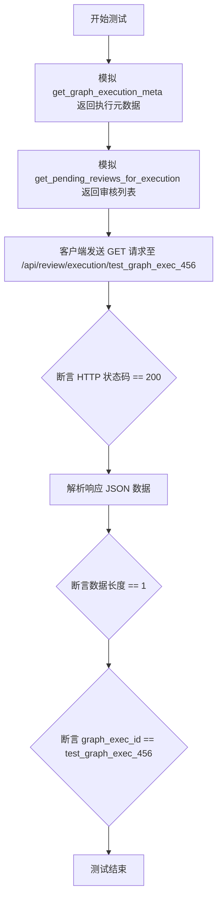

#### 带注释源码

```python
@pytest.mark.asyncio(loop_scope="session")
async def test_get_pending_reviews_for_execution_success(
    client: httpx.AsyncClient,
    mocker: pytest_mock.MockerFixture,
    sample_pending_review: PendingHumanReviewModel,
    snapshot: Snapshot,
    test_user_id: str,
) -> None:
    """Test getting pending reviews for specific execution"""
    # 模拟获取图执行元数据的后端函数，返回表示执行存在且属于当前用户的数据
    mock_get_graph_execution = mocker.patch(
        "backend.api.features.executions.review.routes.get_graph_execution_meta"
    )
    mock_get_graph_execution.return_value = {
        "id": "test_graph_exec_456",
        "user_id": test_user_id,
    }

    # 模拟获取特定执行待审核列表的后端函数，返回包含示例审核数据的列表
    mock_get_reviews = mocker.patch(
        "backend.api.features.executions.review.routes.get_pending_reviews_for_execution"
    )
    mock_get_reviews.return_value = [sample_pending_review]

    # 使用测试客户端向获取待审核列表的 API 端点发送 GET 请求
    response = await client.get("/api/review/execution/test_graph_exec_456")

    # 验证 HTTP 响应状态码是否为 200 (OK)
    assert response.status_code == 200
    data = response.json()
    # 验证返回的数据列表中包含 1 条记录
    assert len(data) == 1
    # 验证返回的记录关联的图执行 ID 是否与请求的一致
    assert data[0]["graph_exec_id"] == "test_graph_exec_456"
```


### `test_get_pending_reviews_for_execution_not_available`

该函数用于测试当用户尝试获取特定执行（execution）的待审核评论，但该执行不存在或用户无权访问时，API 是否能正确返回 404 Not Found 错误。通过模拟元数据获取返回空值，验证系统的权限校验和错误处理逻辑。

参数：

-  `client`：`httpx.AsyncClient`，用于发送异步 HTTP 请求的测试客户端。
-  `mocker`：`pytest_mock.MockerFixture`，用于模拟（mock）后端依赖行为的 fixture。

返回值：`None`，该函数为测试用例，无返回值，主要通过断言验证行为。

#### 流程图

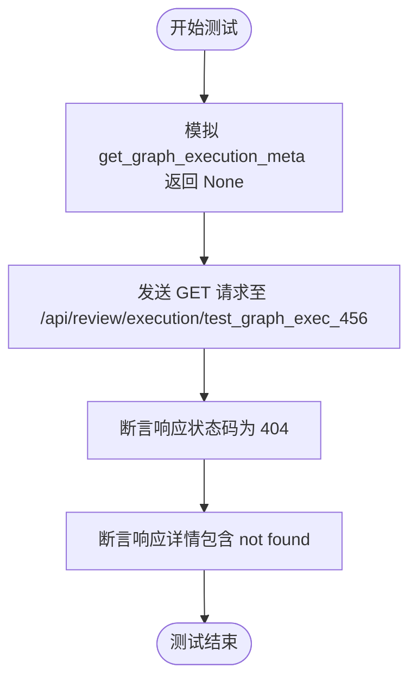

#### 带注释源码

```python
@pytest.mark.asyncio(loop_scope="session")
async def test_get_pending_reviews_for_execution_not_available(
    client: httpx.AsyncClient,
    mocker: pytest_mock.MockerFixture,
) -> None:
    """Test access denied when user doesn't own the execution"""
    # 模拟后端路由中获取图执行元数据的函数，使其返回 None
    # 这模拟了执行不存在或用户无权访问该执行的情况
    mock_get_graph_execution = mocker.patch(
        "backend.api.features.executions.review.routes.get_graph_execution_meta"
    )
    mock_get_graph_execution.return_value = None

    # 使用测试客户端向获取特定执行的待审核评论接口发送 GET 请求
    response = await client.get("/api/review/execution/test_graph_exec_456")

    # 断言 HTTP 响应状态码为 404，表示资源未找到
    assert response.status_code == 404
    # 断言响应 JSON 数据中的 detail 字段包含 "not found" 字样，验证错误信息正确
    assert "not found" in response.json()["detail"]
```


### `test_process_review_action_approve_success`

测试通过 API 成功批准人工审核操作的流程，包括模拟后端服务调用、发送批准请求以及验证响应数据的正确性。

参数：

- `client`：`httpx.AsyncClient`，用于发送异步 HTTP 请求的测试客户端。
- `mocker`：`pytest_mock.MockerFixture`，用于模拟（Mock）后端函数和依赖项的 fixture。
- `sample_pending_review`：`PendingHumanReviewModel`，待审核的示例数据对象，用于模拟数据库返回结果。
- `test_user_id`：`str`，测试用户的 ID 字符串。

返回值：`None`，该函数为测试函数，主要进行断言验证，无返回值。

#### 流程图

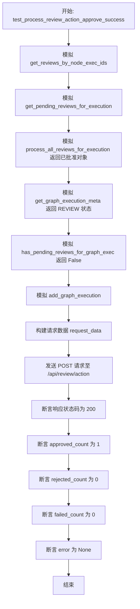

#### 带注释源码

```python
@pytest.mark.asyncio(loop_scope="session")
async def test_process_review_action_approve_success(
    client: httpx.AsyncClient,
    mocker: pytest_mock.MockerFixture,
    sample_pending_review: PendingHumanReviewModel,
    test_user_id: str,
) -> None:
    """Test successful review approval"""
    # Mock the route functions

    # Mock get_reviews_by_node_exec_ids (called to find the graph_exec_id)
    # 模拟根据节点执行 ID 获取审核记录，返回示例数据
    mock_get_reviews_for_user = mocker.patch(
        "backend.api.features.executions.review.routes.get_reviews_by_node_exec_ids"
    )
    mock_get_reviews_for_user.return_value = {"test_node_123": sample_pending_review}

    mock_get_reviews_for_execution = mocker.patch(
        "backend.api.features.executions.review.routes.get_pending_reviews_for_execution"
    )
    mock_get_reviews_for_execution.return_value = [sample_pending_review]

    mock_process_all_reviews = mocker.patch(
        "backend.api.features.executions.review.routes.process_all_reviews_for_execution"
    )
    # 创建一个已批准的审核对象用于模拟返回值
    approved_review = PendingHumanReviewModel(
        node_exec_id="test_node_123",
        user_id=test_user_id,
        graph_exec_id="test_graph_exec_456",
        graph_id="test_graph_789",
        graph_version=1,
        payload={"data": "modified payload", "value": 50},
        instructions="Please review this data",
        editable=True,
        status=ReviewStatus.APPROVED,
        review_message="Looks good",
        was_edited=True,
        processed=False,
        created_at=FIXED_NOW,
        updated_at=FIXED_NOW,
        reviewed_at=FIXED_NOW,
    )
    mock_process_all_reviews.return_value = {"test_node_123": approved_review}

    # Mock get_graph_execution_meta to return execution in REVIEW status
    # 模拟获取图执行元数据，返回状态为 REVIEW
    mock_get_graph_exec = mocker.patch(
        "backend.api.features.executions.review.routes.get_graph_execution_meta"
    )
    mock_graph_exec_meta = mocker.Mock()
    mock_graph_exec_meta.status = ExecutionStatus.REVIEW
    mock_get_graph_exec.return_value = mock_graph_exec_meta

    # 模拟检查是否还有待处理的审核，返回 False
    mock_has_pending = mocker.patch(
        "backend.api.features.executions.review.routes.has_pending_reviews_for_graph_exec"
    )
    mock_has_pending.return_value = False

    # 模拟添加图执行记录
    mocker.patch("backend.api.features.executions.review.routes.add_graph_execution")

    # 构造请求数据，包含批准操作和相关修改数据
    request_data = {
        "reviews": [
            {
                "node_exec_id": "test_node_123",
                "approved": True,
                "message": "Looks good",
                "reviewed_data": {"data": "modified payload", "value": 50},
            }
        ]
    }

    # 发送 POST 请求处理审核动作
    response = await client.post("/api/review/action", json=request_data)

    # 验证响应状态码为 200
    assert response.status_code == 200
    data = response.json()
    # 验证响应体中的统计数据
    assert data["approved_count"] == 1
    assert data["rejected_count"] == 0
    assert data["failed_count"] == 0
    assert data["error"] is None
```


### `test_process_review_action_reject_success`

测试当用户成功拒绝一项审查时的API端点行为。该测试模拟了数据库层返回的待审查数据，并验证通过`/api/review/action`接口提交拒绝操作后，系统能正确处理并返回包含已拒绝计数的响应。

参数：

-  `client`：`httpx.AsyncClient`，用于发送 HTTP 请求的异步测试客户端。
-  `mocker`：`pytest_mock.MockerFixture`，Pytest 提供的模拟工具，用于替换后端逻辑以进行隔离测试。
-  `sample_pending_review`：`PendingHumanReviewModel`，预置的待审查数据模型对象，作为测试的基础数据。
-  `test_user_id`：`str`，当前测试上下文中的用户 ID。

返回值：`None`，该函数为测试用例，不返回实际业务数据，通过断言验证行为正确性。

#### 流程图

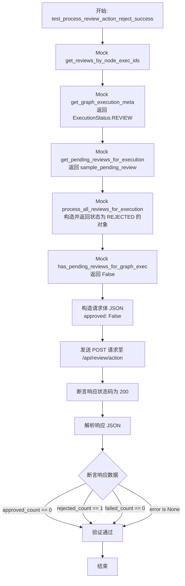

#### 带注释源码

```python
@pytest.mark.asyncio(loop_scope="session")
async def test_process_review_action_reject_success(
    client: httpx.AsyncClient,
    mocker: pytest_mock.MockerFixture,
    sample_pending_review: PendingHumanReviewModel,
    test_user_id: str,
) -> None:
    """Test successful review rejection"""
    # Mock the route functions

    # Mock get_reviews_by_node_exec_ids (called to find the graph_exec_id)
    # 模拟根据节点执行ID获取审查详情，返回示例数据
    mock_get_reviews_for_user = mocker.patch(
        "backend.api.features.executions.review.routes.get_reviews_by_node_exec_ids"
    )
    mock_get_reviews_for_user.return_value = {"test_node_123": sample_pending_review}

    # Mock get_graph_execution_meta to return execution in REVIEW status
    # 模拟获取图执行元数据，确保状态处于 REVIEW
    mock_get_graph_exec = mocker.patch(
        "backend.api.features.executions.review.routes.get_graph_execution_meta"
    )
    mock_graph_exec_meta = mocker.Mock()
    mock_graph_exec_meta.status = ExecutionStatus.REVIEW
    mock_get_graph_exec.return_value = mock_graph_exec_meta

    mock_get_reviews_for_execution = mocker.patch(
        "backend.api.features.executions.review.routes.get_pending_reviews_for_execution"
    )
    mock_get_reviews_for_execution.return_value = [sample_pending_review]

    # Mock process_all_reviews_for_execution
    # 模拟处理所有审查的逻辑，此处返回一个状态为 REJECTED 的审查对象，模拟拒绝操作后的状态
    mock_process_all_reviews = mocker.patch(
        "backend.api.features.executions.review.routes.process_all_reviews_for_execution"
    )
    rejected_review = PendingHumanReviewModel(
        node_exec_id="test_node_123",
        user_id=test_user_id,
        graph_exec_id="test_graph_exec_456",
        graph_id="test_graph_789",
        graph_version=1,
        payload={"data": "test payload"},
        instructions="Please review",
        editable=True,
        status=ReviewStatus.REJECTED, # 关键点：设置为已拒绝
        review_message="Rejected by user",
        was_edited=False,
        processed=False,
        created_at=FIXED_NOW,
        updated_at=None,
        reviewed_at=FIXED_NOW,
    )
    mock_process_all_reviews.return_value = {"test_node_123": rejected_review}

    # Mock has_pending_reviews_for_graph_exec
    # 模拟检查是否还有待处理的审查，返回 False 表示没有待处理项
    mock_has_pending = mocker.patch(
        "backend.api.features.executions.review.routes.has_pending_reviews_for_graph_exec"
    )
    mock_has_pending.return_value = False

    # 构造请求数据，包含 node_exec_id 和 approved=False 表示拒绝
    request_data = {
        "reviews": [
            {
                "node_exec_id": "test_node_123",
                "approved": False,
                "message": None,
            }
        ]
    }

    # 发送 POST 请求到审查动作接口
    response = await client.post("/api/review/action", json=request_data)

    # 断言 HTTP 状态码为 200 (成功)
    assert response.status_code == 200
    
    # 获取响应 JSON 数据
    data = response.json()
    
    # 断言响应中的统计数据符合预期：0个批准，1个拒绝，0个失败，无错误
    assert data["approved_count"] == 0
    assert data["rejected_count"] == 1
    assert data["failed_count"] == 0
    assert data["error"] is None
```


### `test_process_review_action_mixed_success`

测试在单个请求中成功处理混合的批准和拒绝操作。该测试模拟了包含两个审查项的请求：一个被批准，另一个被拒绝，验证API能否正确返回处理结果和统计数据。

参数：

-  `client`：`httpx.AsyncClient`，用于发起HTTP请求的异步测试客户端。
-  `mocker`：`pytest_mock.MockerFixture`，用于Mock后端依赖项的Fixture。
-  `sample_pending_review`：`PendingHumanReviewModel`，用于测试的示例待审查模型实例。
-  `test_user_id`：`str`，测试用户的ID。

返回值：`None`，该函数为测试函数，不返回直接值，主要通过断言验证行为。

#### 流程图

```mermaid
flowchart TD
    A[开始: test_process_review_action_mixed_success] --> B[创建第二个审查对象 second_review]
    B --> C[Mock get_reviews_by_node_exec_ids<br/>返回两个审查对象]
    C --> D[Mock get_pending_reviews_for_execution<br/>返回两个审查对象列表]
    D --> E[Mock process_all_reviews_for_execution<br/>返回处理后的一批(批准/拒绝)对象]
    E --> F[Mock get_graph_execution_meta<br/>返回 REVIEW 状态]
    F --> G[Mock has_pending_reviews_for_graph_exec<br/>返回 False]
    G --> H[准备请求数据<br/>包含批准和拒绝的操作]
    H --> I[发送 POST 请求至 /api/review/action]
    I --> J{断言检查}
    J -->|Status Code == 200| K[检查 approved_count == 1]
    J -->|Status Code != 200| Z[测试失败]
    K --> L[检查 rejected_count == 1]
    L --> M[检查 failed_count == 0]
    M --> N[检查 error is None]
    N --> O[测试结束]
```

#### 带注释源码

```python
@pytest.mark.asyncio(loop_scope="session")
async def test_process_review_action_mixed_success(
    client: httpx.AsyncClient,
    mocker: pytest_mock.MockerFixture,
    sample_pending_review: PendingHumanReviewModel,
    test_user_id: str,
) -> None:
    """Test mixed approve/reject operations"""
    # 创建第二个待审查对象，用于模拟混合操作场景
    second_review = PendingHumanReviewModel(
        node_exec_id="test_node_456",
        user_id=test_user_id,
        graph_exec_id="test_graph_exec_456",
        graph_id="test_graph_789",
        graph_version=1,
        payload={"data": "second payload"},
        instructions="Second review",
        editable=False,
        status=ReviewStatus.WAITING,
        review_message=None,
        was_edited=None,
        processed=False,
        created_at=FIXED_NOW,
        updated_at=None,
        reviewed_at=None,
    )

    # Mock the route functions

    # Mock get_reviews_by_node_exec_ids (called to find the graph_exec_id)
    # 模拟根据节点执行ID获取审查记录，返回包含两个审查的字典
    mock_get_reviews_for_user = mocker.patch(
        "backend.api.features.executions.review.routes.get_reviews_by_node_exec_ids"
    )
    mock_get_reviews_for_user.return_value = {
        "test_node_123": sample_pending_review,
        "test_node_456": second_review,
    }

    # Mock get_pending_reviews_for_execution
    # 模拟获取指定执行的所有待审查记录
    mock_get_reviews_for_execution = mocker.patch(
        "backend.api.features.executions.review.routes.get_pending_reviews_for_execution"
    )
    mock_get_reviews_for_execution.return_value = [sample_pending_review, second_review]

    # Mock process_all_reviews_for_execution
    # 模拟批量处理审查逻辑，这里模拟一个批准，一个拒绝的结果
    mock_process_all_reviews = mocker.patch(
        "backend.api.features.executions.review.routes.process_all_reviews_for_execution"
    )
    # Create approved version of first review
    approved_review = PendingHumanReviewModel(
        node_exec_id="test_node_123",
        user_id=test_user_id,
        graph_exec_id="test_graph_exec_456",
        graph_id="test_graph_789",
        graph_version=1,
        payload={"data": "modified"},
        instructions="Please review",
        editable=True,
        status=ReviewStatus.APPROVED, # 状态设为批准
        review_message="Approved",
        was_edited=True,
        processed=False,
        created_at=FIXED_NOW,
        updated_at=None,
        reviewed_at=FIXED_NOW,
    )
    # Create rejected version of second review
    rejected_review = PendingHumanReviewModel(
        node_exec_id="test_node_456",
        user_id=test_user_id,
        graph_exec_id="test_graph_exec_456",
        graph_id="test_graph_789",
        graph_version=1,
        payload={"data": "second payload"},
        instructions="Second review",
        editable=False,
        status=ReviewStatus.REJECTED, # 状态设为拒绝
        review_message="Rejected by user",
        was_edited=False,
        processed=False,
        created_at=FIXED_NOW,
        updated_at=None,
        reviewed_at=FIXED_NOW,
    )
    mock_process_all_reviews.return_value = {
        "test_node_123": approved_review,
        "test_node_456": rejected_review,
    }

    # Mock get_graph_execution_meta to return execution in REVIEW status
    # 模拟获取图执行元数据，状态为 REVIEW
    mock_get_graph_exec = mocker.patch(
        "backend.api.features.executions.review.routes.get_graph_execution_meta"
    )
    mock_graph_exec_meta = mocker.Mock()
    mock_graph_exec_meta.status = ExecutionStatus.REVIEW
    mock_get_graph_exec.return_value = mock_graph_exec_meta

    # Mock has_pending_reviews_for_graph_exec
    # 模拟检查是否还有待审查记录，返回 False 表示已处理完
    mock_has_pending = mocker.patch(
        "backend.api.features.executions.review.routes.has_pending_reviews_for_graph_exec"
    )
    mock_has_pending.return_value = False

    # 构造包含混合操作（一个批准，一个拒绝）的请求数据
    request_data = {
        "reviews": [
            {
                "node_exec_id": "test_node_123",
                "approved": True,  # 批准
                "message": "Approved",
                "reviewed_data": {"data": "modified"},
            },
            {
                "node_exec_id": "test_node_456",
                "approved": False, # 拒绝
                "message": None,
            },
        ]
    }

    # 发送 POST 请求
    response = await client.post("/api/review/action", json=request_data)

    # 验证响应状态码为 200 OK
    assert response.status_code == 200
    data = response.json()
    # 验证响应数据中的统计信息
    assert data["approved_count"] == 1
    assert data["rejected_count"] == 1
    assert data["failed_count"] == 0
    assert data["error"] is None
```


### `test_process_review_action_empty_request`

该测试函数用于验证当用户提交的评审请求中不包含任何评审项（即 `reviews` 列表为空）时，API 端点能够正确返回 HTTP 422（Unprocessable Entity）状态码以及相应的验证错误信息。

参数：

- `client`：`httpx.AsyncClient`，用于发送异步 HTTP 请求的测试客户端。
- `mocker`：`pytest_mock.MockerFixture`，Pytest-mock 提供的 fixture，用于模拟对象（尽管本函数内未直接使用，但属于测试签名的一部分）。
- `test_user_id`：`str`，测试用户的 ID（尽管本函数内未直接使用，但属于测试签名的一部分）。

返回值：`None`，该函数为异步测试函数，没有返回值。

#### 流程图

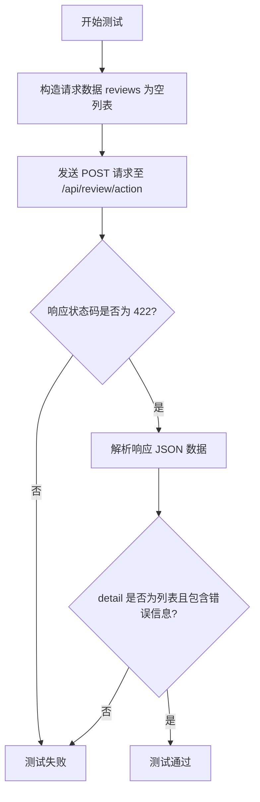

#### 带注释源码

```python
@pytest.mark.asyncio(loop_scope="session")
async def test_process_review_action_empty_request(
    client: httpx.AsyncClient,
    mocker: pytest_mock.MockerFixture,
    test_user_id: str,
) -> None:
    """Test error when no reviews provided"""
    # 准备请求数据，其中 reviews 列表为空
    request_data = {"reviews": []}

    # 向评审操作接口发送 POST 请求
    response = await client.post("/api/review/action", json=request_data)

    # 断言响应状态码为 422（无法处理的实体），表示请求体验证失败
    assert response.status_code == 422
    response_data = response.json()
    
    # 验证响应体中包含 Pydantic 验证错误格式的细节列表
    assert isinstance(response_data["detail"], list)
    assert len(response_data["detail"]) > 0
    
    # 验证具体的错误消息内容，确保提示至少需要提供一个评审
    assert "At least one review must be provided" in response_data["detail"][0]["msg"]
```


### `test_process_review_action_review_not_found`

测试当尝试处理对不存在的审核项（review）的操作时，API端点能够正确返回404错误。

参数：

- `client`：`httpx.AsyncClient`，用于发送HTTP请求的异步测试客户端。
- `mocker`：`pytest_mock.MockerFixture`，用于模拟（mock）后端依赖项和函数行为的Fixture。
- `sample_pending_review`：`PendingHumanReviewModel`，待审核模型的样本数据（本测试中虽传入但在Mock中被覆盖模拟为未找到）。
- `test_user_id`：`str`，当前测试用户的ID。

返回值：`None`，该函数为测试函数，主要执行断言逻辑，不返回具体值。

#### 流程图

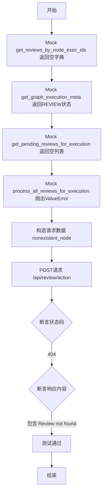

#### 带注释源码

```python
@pytest.mark.asyncio(loop_scope="session")
async def test_process_review_action_review_not_found(
    client: httpx.AsyncClient,
    mocker: pytest_mock.MockerFixture,
    sample_pending_review: PendingHumanReviewModel,
    test_user_id: str,
) -> None:
    """Test error when review is not found"""
    # Mock get_reviews_by_node_exec_ids (called to find the graph_exec_id)
    # 模拟根据节点执行ID获取审核的函数，返回空字典以模拟审核不存在的情况
    mock_get_reviews_for_user = mocker.patch(
        "backend.api.features.executions.review.routes.get_reviews_by_node_exec_ids"
    )
    # Return empty dict to simulate review not found
    mock_get_reviews_for_user.return_value = {}

    # Mock get_graph_execution_meta to return execution in REVIEW status
    # 模拟获取图执行元数据的函数，返回一个处于 REVIEW 状态的 Mock 对象
    mock_get_graph_exec = mocker.patch(
        "backend.api.features.executions.review.routes.get_graph_execution_meta"
    )
    mock_graph_exec_meta = mocker.Mock()
    mock_graph_exec_meta.status = ExecutionStatus.REVIEW
    mock_get_graph_exec.return_value = mock_graph_exec_meta

    # Mock the functions that extract graph execution ID from the request
    # 模拟获取特定执行挂起的审核，返回空列表
    mock_get_reviews_for_execution = mocker.patch(
        "backend.api.features.executions.review.routes.get_pending_reviews_for_execution"
    )
    mock_get_reviews_for_execution.return_value = []  # No reviews found

    # Mock process_all_reviews to simulate not finding reviews
    # 模拟处理所有审核的函数，使其抛出 ValueError，模拟处理失败（未找到）的内部逻辑
    mock_process_all_reviews = mocker.patch(
        "backend.api.features.executions.review.routes.process_all_reviews_for_execution"
    )
    # This should raise a ValueError with "Reviews not found" message based on the data/human_review.py logic
    mock_process_all_reviews.side_effect = ValueError(
        "Reviews not found or access denied for IDs: nonexistent_node"
    )

    # 构造请求数据，包含一个不存在的节点执行ID
    request_data = {
        "reviews": [
            {
                "node_exec_id": "nonexistent_node",
                "approved": True,
                "message": "Test",
            }
        ]
    }

    # 发送 POST 请求到审核操作端点
    response = await client.post("/api/review/action", json=request_data)

    # 断言响应状态码为 404 Not Found
    assert response.status_code == 404
    # 断言响应体包含 "Review(s) not found" 错误信息
    assert "Review(s) not found" in response.json()["detail"]
```


### `test_process_review_action_partial_failure`

该测试函数用于验证当处理人工审核操作时，如果后端逻辑抛出验证错误（模拟部分失败场景），API 端点能否正确地捕获异常并返回 HTTP 400 状态码及错误详情。

参数：

-  `client`：`httpx.AsyncClient`，用于发起 HTTP 请求的异步测试客户端。
-  `mocker`：`pytest_mock.MockerFixture`，用于模拟（patch）后端函数和行为。
-  `sample_pending_review`：`PendingHumanReviewModel`，预置的待审核记录模型，作为测试数据。
-  `test_user_id`：`str`，当前测试用户的 ID。

返回值：`None`，该函数为测试用例，不返回具体数值，通过断言验证结果。

#### 流程图

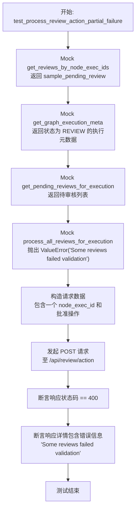

#### 带注释源码

```python
@pytest.mark.asyncio(loop_scope="session")
async def test_process_review_action_partial_failure(
    client: httpx.AsyncClient,
    mocker: pytest_mock.MockerFixture,
    sample_pending_review: PendingHumanReviewModel,
    test_user_id: str,
) -> None:
    """Test handling of partial failures in review processing"""
    # Mock get_reviews_by_node_exec_ids (called to find the graph_exec_id)
    # 模拟根据节点执行ID获取审核记录，返回示例数据，确保能找到对应的审核
    mock_get_reviews_for_user = mocker.patch(
        "backend.api.features.executions.review.routes.get_reviews_by_node_exec_ids"
    )
    mock_get_reviews_for_user.return_value = {"test_node_123": sample_pending_review}

    # Mock get_graph_execution_meta to return execution in REVIEW status
    # 模拟获取图执行元数据，确保状态为 REVIEW，这是进行审核操作的前提
    mock_get_graph_exec = mocker.patch(
        "backend.api.features.executions.review.routes.get_graph_execution_meta"
    )
    mock_graph_exec_meta = mocker.Mock()
    mock_graph_exec_meta.status = ExecutionStatus.REVIEW
    mock_get_graph_exec.return_value = mock_graph_exec_meta

    # Mock the route functions
    # 模拟获取特定执行下的待审核列表
    mock_get_reviews_for_execution = mocker.patch(
        "backend.api.features.executions.review.routes.get_pending_reviews_for_execution"
    )
    mock_get_reviews_for_execution.return_value = [sample_pending_review]

    # Mock partial failure in processing
    # 模拟处理审核时发生部分失败，抛出 ValueError，模拟后端逻辑校验不通过的情况
    mock_process_all_reviews = mocker.patch(
        "backend.api.features.executions.review.routes.process_all_reviews_for_execution"
    )
    mock_process_all_reviews.side_effect = ValueError("Some reviews failed validation")

    # 准备请求数据
    request_data = {
        "reviews": [
            {
                "node_exec_id": "test_node_123",
                "approved": True,
                "message": "Test",
            }
        ]
    }

    # 发送 POST 请求处理审核动作
    response = await client.post("/api/review/action", json=request_data)

    # 验证状态码是否为 400 Bad Request，表示客户端请求虽有数据但服务端处理失败（逻辑错误）
    assert response.status_code == 400
    # 验证返回的错误详情中包含预设的异常信息
    assert "Some reviews failed validation" in response.json()["detail"]
```


### `test_process_review_action_invalid_node_exec_id`

测试当尝试使用无效或不存在的节点执行ID处理审核时，API端点是否能正确返回404错误及相应的错误信息。

参数：

- `client`：`httpx.AsyncClient`，用于发送异步HTTP请求的测试客户端。
- `mocker`：`pytest_mock.MockerFixture`，用于模拟（Mock）外部依赖和函数调用的pytest夹具。
- `sample_pending_review`：`PendingHumanReviewModel`，一个示例的待审核模型对象（虽然在此特定测试逻辑中未直接使用其数据，但作为夹具传入）。
- `test_user_id`：`str`，当前测试用户的ID。

返回值：`None`，该函数是一个测试用例，没有返回值，主要通过断言验证行为。

#### 流程图

```mermaid
flowchart TD
    A[开始测试] --> B[Mock get_reviews_by_node_exec_ids<br/>返回空字典 {}]
    B --> C[Mock get_graph_execution_meta<br/>返回状态为 REVIEW 的对象]
    C --> D[构造请求数据<br/>包含无效的 node_exec_id]
    D --> E[发送 POST 请求至 /api/review/action]
    E --> F{断言响应状态码}
    F -- 状态码为 404 --> G[断言响应详情包含<br/>'Review(s) not found']
    G --> H[测试通过]
    F -- 状态码非 404 --> I[测试失败]
```

#### 带注释源码

```python
@pytest.mark.asyncio(loop_scope="session")
async def test_process_review_action_invalid_node_exec_id(
    client: httpx.AsyncClient,
    mocker: pytest_mock.MockerFixture,
    sample_pending_review: PendingHumanReviewModel,
    test_user_id: str,
) -> None:
    """Test failure when trying to process review with invalid node execution ID"""
    # Mock get_reviews_by_node_exec_ids (called to find the graph_exec_id)
    # 模拟数据库查询函数，使其返回空字典，以此模拟找不到对应审核记录的情况
    mock_get_reviews_for_user = mocker.patch(
        "backend.api.features.executions.review.routes.get_reviews_by_node_exec_ids"
    )
    # Return empty dict to simulate review not found
    mock_get_reviews_for_user.return_value = {}

    # Mock get_graph_execution_meta to return execution in REVIEW status
    # 模拟获取图执行元数据的函数，返回一个处于 REVIEW 状态的模拟对象
    mock_get_graph_exec = mocker.patch(
        "backend.api.features.executions.review.routes.get_graph_execution_meta"
    )
    mock_graph_exec_meta = mocker.Mock()
    mock_graph_exec_meta.status = ExecutionStatus.REVIEW
    mock_get_graph_exec.return_value = mock_graph_exec_meta

    # 准备请求数据，包含一个格式无效或ID不存在的 node_exec_id
    request_data = {
        "reviews": [
            {
                "node_exec_id": "invalid-node-format",
                "approved": True,
                "message": "Test",
            }
        ]
    }

    # 发送 POST 请求进行审核操作
    response = await client.post("/api/review/action", json=request_data)

    # Returns 404 when review is not found
    # 断言响应状态码为 404 Not Found
    assert response.status_code == 404
    # 断言响应JSON中的 detail 字段包含 "Review(s) not found" 错误信息
    assert "Review(s) not found" in response.json()["detail"]
```


### `test_process_review_action_auto_approve_creates_auto_approval_records`

测试在审核操作中设置 `auto_approve_future` 标志为 True 时，是否会正确触发自动审核记录的创建，并验证相关的图设置和执行上下文是否被正确加载和传递。

参数：

-  `client`：`httpx.AsyncClient`，用于发送模拟 HTTP 请求的异步测试客户端。
-  `mocker`：`pytest_mock.MockerFixture`，用于模拟（mock）后端逻辑和依赖项的 pytest fixture。
-  `sample_pending_review`：`PendingHumanReviewModel`，用于模拟待审核记录的测试数据模型。
-  `test_user_id`：`str`，当前测试用户的 ID。

返回值：`None`，该函数为测试用例，不返回具体数值，主要通过断言验证行为。

#### 流程图

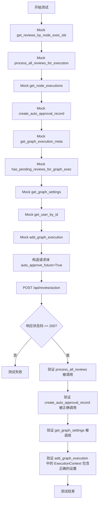

#### 带注释源码

```python
@pytest.mark.asyncio(loop_scope="session")
async def test_process_review_action_auto_approve_creates_auto_approval_records(
    client: httpx.AsyncClient,
    mocker: pytest_mock.MockerFixture,
    sample_pending_review: PendingHumanReviewModel,
    test_user_id: str,
) -> None:
    """Test that auto_approve_future_actions flag creates auto-approval records"""
    # Mock get_reviews_by_node_exec_ids (called to find the graph_exec_id)
    # 模拟获取当前用户的审核记录，用于定位 graph_exec_id
    mock_get_reviews_for_user = mocker.patch(
        "backend.api.features.executions.review.routes.get_reviews_by_node_exec_ids"
    )
    mock_get_reviews_for_user.return_value = {"test_node_123": sample_pending_review}

    # Mock process_all_reviews
    # 模拟处理所有审核的逻辑，返回一个已批准状态的审核记录
    mock_process_all_reviews = mocker.patch(
        "backend.api.features.executions.review.routes.process_all_reviews_for_execution"
    )
    approved_review = PendingHumanReviewModel(
        node_exec_id="test_node_123",
        user_id=test_user_id,
        graph_exec_id="test_graph_exec_456",
        graph_id="test_graph_789",
        graph_version=1,
        payload={"data": "test payload"},
        instructions="Please review",
        editable=True,
        status=ReviewStatus.APPROVED,
        review_message="Approved",
        was_edited=False,
        processed=False,
        created_at=FIXED_NOW,
        updated_at=FIXED_NOW,
        reviewed_at=FIXED_NOW,
    )
    mock_process_all_reviews.return_value = {"test_node_123": approved_review}

    # Mock get_node_executions to return node_id mapping
    # 模拟获取节点执行详情，提供 node_id 用于创建自动审核记录
    mock_get_node_executions = mocker.patch(
        "backend.data.execution.get_node_executions"
    )
    mock_node_exec = mocker.Mock(spec=NodeExecutionResult)
    mock_node_exec.node_exec_id = "test_node_123"
    mock_node_exec.node_id = "test_node_def_456"
    mock_get_node_executions.return_value = [mock_node_exec]

    # Mock create_auto_approval_record
    // 模拟创建自动审核记录的函数，用于验证是否被正确调用
    mock_create_auto_approval = mocker.patch(
        "backend.api.features.executions.review.routes.create_auto_approval_record"
    )

    # Mock get_graph_execution_meta to return execution in REVIEW status
    // 模拟获取图执行元数据，返回状态为 REVIEW
    mock_get_graph_exec = mocker.patch(
        "backend.api.features.executions.review.routes.get_graph_execution_meta"
    )
    mock_graph_exec_meta = mocker.Mock()
    mock_graph_exec_meta.status = ExecutionStatus.REVIEW
    mock_get_graph_exec.return_value = mock_graph_exec_meta

    # Mock has_pending_reviews_for_graph_exec
    // 模拟检查是否还有待审核的记录，返回 False 表示所有审核已处理
    mock_has_pending = mocker.patch(
        "backend.api.features.executions.review.routes.has_pending_reviews_for_graph_exec"
    )
    mock_has_pending.return_value = False

    # Mock get_graph_settings to return custom settings
    // 模拟获取图设置，返回特定的安全模式配置
    mock_get_settings = mocker.patch(
        "backend.api.features.executions.review.routes.get_graph_settings"
    )
    mock_get_settings.return_value = GraphSettings(
        human_in_the_loop_safe_mode=True,
        sensitive_action_safe_mode=True,
    )

    # Mock get_user_by_id to prevent database access
    // 模拟获取用户信息，避免真实数据库访问
    mock_get_user = mocker.patch(
        "backend.api.features.executions.review.routes.get_user_by_id"
    )
    mock_user = mocker.Mock()
    mock_user.timezone = "UTC"
    mock_get_user.return_value = mock_user

    # Mock add_graph_execution
    // 模拟添加图执行记录，用于验证 Execution Context 的正确性
    mock_add_execution = mocker.patch(
        "backend.api.features.executions.review.routes.add_graph_execution"
    )

    // 准备请求数据，包含 auto_approve_future: True
    request_data = {
        "reviews": [
            {
                "node_exec_id": "test_node_123",
                "approved": True,
                "message": "Approved",
                "auto_approve_future": True, // 关键标志位
            }
        ],
    }

    // 发送 POST 请求到审核接口
    response = await client.post("/api/review/action", json=request_data)

    // 断言响应状态码为 200
    assert response.status_code == 200

    // 验证 process_all_reviews_for_execution 被调用
    mock_process_all_reviews.assert_called_once()

    // 验证 create_auto_approval_record 是否被调用，且参数正确
    mock_create_auto_approval.assert_called_once_with(
        user_id=test_user_id,
        graph_exec_id="test_graph_exec_456",
        graph_id="test_graph_789",
        graph_version=1,
        node_id="test_node_def_456",
        payload={"data": "test payload"},
    )

    // 验证 get_graph_settings 被调用且参数正确
    mock_get_settings.assert_called_once_with(
        user_id=test_user_id, graph_id="test_graph_789"
    )

    // 验证 add_graph_execution 被调用，并检查传递的 ExecutionContext 是否包含了正确的设置
    mock_add_execution.assert_called_once()
    call_kwargs = mock_add_execution.call_args.kwargs
    execution_context = call_kwargs["execution_context"]

    assert isinstance(execution_context, ExecutionContext)
    assert execution_context.human_in_the_loop_safe_mode is True
    assert execution_context.sensitive_action_safe_mode is True
```


### `test_process_review_action_without_auto_approve_still_loads_settings`

该测试函数用于验证在处理人工审查请求时，即使用户未启用“自动批准未来操作”功能（`auto_approve_future` 为 False），系统仍需正确加载图配置（GraphSettings），并根据这些配置创建包含相应安全模式设置的执行上下文（ExecutionContext），以确保执行环境配置的正确性。

参数：

-  `client`：`httpx.AsyncClient`，用于发送模拟 HTTP 请求的异步测试客户端。
-  `mocker`：`pytest_mock.MockerFixture`，用于模拟后端依赖服务和数据库操作的 Mock 工具。
-  `sample_pending_review`：`PendingHumanReviewModel`，预设的待审查数据模型实例，用于模拟数据库中的待处理记录。
-  `test_user_id`：`str`，当前测试用户的 ID，用于鉴权和数据关联。

返回值：`None`，该函数为测试用例，无返回值，主要通过断言验证行为。

#### 流程图

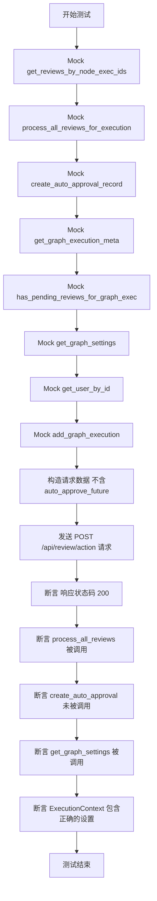

#### 带注释源码

```python
@pytest.mark.asyncio(loop_scope="session")
async def test_process_review_action_without_auto_approve_still_loads_settings(
    client: httpx.AsyncClient,
    mocker: pytest_mock.MockerFixture,
    sample_pending_review: PendingHumanReviewModel,
    test_user_id: str,
) -> None:
    """Test that execution context is created with settings even without auto-approve"""
    # 模拟根据节点执行ID获取审查信息，用于查找 graph_exec_id
    mock_get_reviews_for_user = mocker.patch(
        "backend.api.features.executions.review.routes.get_reviews_by_node_exec_ids"
    )
    mock_get_reviews_for_user.return_value = {"test_node_123": sample_pending_review}

    # 模拟处理所有审查逻辑，返回一个已批准的审查对象
    mock_process_all_reviews = mocker.patch(
        "backend.api.features.executions.review.routes.process_all_reviews_for_execution"
    )
    approved_review = PendingHumanReviewModel(
        node_exec_id="test_node_123",
        user_id=test_user_id,
        graph_exec_id="test_graph_exec_456",
        graph_id="test_graph_789",
        graph_version=1,
        payload={"data": "test payload"},
        instructions="Please review",
        editable=True,
        status=ReviewStatus.APPROVED,
        review_message="Approved",
        was_edited=False,
        processed=False,
        created_at=FIXED_NOW,
        updated_at=FIXED_NOW,
        reviewed_at=FIXED_NOW,
    )
    mock_process_all_reviews.return_value = {"test_node_123": approved_review}

    # 模拟创建自动批准记录函数
    # 关键点：验证当 auto_approve_future 为 False 时，此函数不应被调用
    mock_create_auto_approval = mocker.patch(
        "backend.api.features.executions.review.routes.create_auto_approval_record"
    )

    # 模拟获取图执行元数据，返回状态为 REVIEW
    mock_get_graph_exec = mocker.patch(
        "backend.api.features.executions.review.routes.get_graph_execution_meta"
    )
    mock_graph_exec_meta = mocker.Mock()
    mock_graph_exec_meta.status = ExecutionStatus.REVIEW
    mock_get_graph_exec.return_value = mock_graph_exec_meta

    # 模拟检查是否有待处理审查，返回 False
    mock_has_pending = mocker.patch(
        "backend.api.features.executions.review.routes.has_pending_reviews_for_graph_exec"
    )
    mock_has_pending.return_value = False

    # 模拟获取图设置，启用 sensitive_action_safe_mode
    # 关键点：测试重点是验证即使没有自动批准，设置也会被加载
    mock_get_settings = mocker.patch(
        "backend.api.features.executions.review.routes.get_graph_settings"
    )
    mock_get_settings.return_value = GraphSettings(
        human_in_the_loop_safe_mode=False,
        sensitive_action_safe_mode=True,  # 设置敏感操作安全模式为 True
    )

    # 模拟获取用户信息，避免数据库访问
    mock_get_user = mocker.patch(
        "backend.api.features.executions.review.routes.get_user_by_id"
    )
    mock_user = mocker.Mock()
    mock_user.timezone = "UTC"
    mock_get_user.return_value = mock_user

    # 模拟添加图执行，用于验证传入的 ExecutionContext
    mock_add_execution = mocker.patch(
        "backend.api.features.executions.review.routes.add_graph_execution"
    )

    # 构造请求数据，不包含 auto_approve_future 字段（默认为 False）
    request_data = {
        "reviews": [
            {
                "node_exec_id": "test_node_123",
                "approved": True,
                "message": "Approved",
                # auto_approve_future defaults to False
            }
        ],
    }

    # 发送 POST 请求处理审查
    response = await client.post("/api/review/action", json=request_data)

    # 验证请求成功
    assert response.status_code == 200

    # 验证处理逻辑被调用
    mock_process_all_reviews.assert_called_once()

    # 验证自动批准记录未被创建（因为没有请求自动批准）
    mock_create_auto_approval.assert_not_called()

    # 验证图设置被加载
    mock_get_settings.assert_called_once()

    # 验证 ExecutionContext 被正确创建并包含设置
    mock_add_execution.assert_called_once()
    call_kwargs = mock_add_execution.call_args.kwargs
    execution_context = call_kwargs["execution_context"]

    assert isinstance(execution_context, ExecutionContext)
    # 断言上下文中的设置与 Mock 返回的 GraphSettings 一致
    assert execution_context.human_in_the_loop_safe_mode is False
    assert execution_context.sensitive_action_safe_mode is True
```


### `test_process_review_action_auto_approve_only_applies_to_approved_reviews`

验证自动审批记录仅对已批准的评审生成，即使被拒绝的评审在请求中设置了 `auto_approve_future=True`，也不应为其创建自动审批记录。

参数：

-  `client`：`httpx.AsyncClient`，用于发送 HTTP 请求的测试客户端。
-  `mocker`：`pytest_mock.MockerFixture`，用于模拟和修补外部依赖及数据库调用的工具。
-  `test_user_id`：`str`，当前测试用户的 ID。

返回值：`None`，该函数为测试用例，无返回值。

#### 流程图

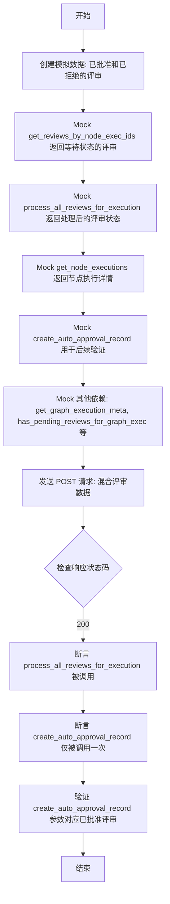

#### 带注释源码

```python
@pytest.mark.asyncio(loop_scope="session")
async def test_process_review_action_auto_approve_only_applies_to_approved_reviews(
    client: httpx.AsyncClient,
    mocker: pytest_mock.MockerFixture,
    test_user_id: str,
) -> None:
    """Test that auto_approve record is created only for approved reviews"""
    # 创建两个评审对象：一个将被批准，一个将被拒绝
    approved_review = PendingHumanReviewModel(
        node_exec_id="node_exec_approved",
        user_id=test_user_id,
        graph_exec_id="test_graph_exec_456",
        graph_id="test_graph_789",
        graph_version=1,
        payload={"data": "approved"},
        instructions="Review",
        editable=True,
        status=ReviewStatus.APPROVED,
        review_message=None,
        was_edited=False,
        processed=False,
        created_at=FIXED_NOW,
        updated_at=FIXED_NOW,
        reviewed_at=FIXED_NOW,
    )
    rejected_review = PendingHumanReviewModel(
        node_exec_id="node_exec_rejected",
        user_id=test_user_id,
        graph_exec_id="test_graph_exec_456",
        graph_id="test_graph_789",
        graph_version=1,
        payload={"data": "rejected"},
        instructions="Review",
        editable=True,
        status=ReviewStatus.REJECTED,
        review_message="Rejected",
        was_edited=False,
        processed=False,
        created_at=FIXED_NOW,
        updated_at=FIXED_NOW,
        reviewed_at=FIXED_NOW,
    )

    # Mock get_reviews_by_node_exec_ids：返回处理前的 WAITING 状态评审
    mock_get_reviews_for_user = mocker.patch(
        "backend.api.features.executions.review.routes.get_reviews_by_node_exec_ids"
    )
    approved_review_waiting = PendingHumanReviewModel(
        node_exec_id="node_exec_approved",
        user_id=test_user_id,
        graph_exec_id="test_graph_exec_456",
        graph_id="test_graph_789",
        graph_version=1,
        payload={"data": "approved"},
        instructions="Review",
        editable=True,
        status=ReviewStatus.WAITING,
        review_message=None,
        was_edited=False,
        processed=False,
        created_at=FIXED_NOW,
    )
    rejected_review_waiting = PendingHumanReviewModel(
        node_exec_id="node_exec_rejected",
        user_id=test_user_id,
        graph_exec_id="test_graph_exec_456",
        graph_id="test_graph_789",
        graph_version=1,
        payload={"data": "rejected"},
        instructions="Review",
        editable=True,
        status=ReviewStatus.WAITING,
        review_message=None,
        was_edited=False,
        processed=False,
        created_at=FIXED_NOW,
    )
    mock_get_reviews_for_user.return_value = {
        "node_exec_approved": approved_review_waiting,
        "node_exec_rejected": rejected_review_waiting,
    }

    # Mock process_all_reviews：返回处理后的 APPROVED 和 REJECTED 状态
    mock_process_all_reviews = mocker.patch(
        "backend.api.features.executions.review.routes.process_all_reviews_for_execution"
    )
    mock_process_all_reviews.return_value = {
        "node_exec_approved": approved_review,
        "node_exec_rejected": rejected_review,
    }

    # Mock get_node_executions：返回节点执行详情（用于后续创建 auto-approval record）
    mock_get_node_executions = mocker.patch(
        "backend.data.execution.get_node_executions"
    )
    mock_node_exec = mocker.Mock(spec=NodeExecutionResult)
    mock_node_exec.node_exec_id = "node_exec_approved"
    mock_node_exec.node_id = "test_node_def_approved"
    mock_get_node_executions.return_value = [mock_node_exec]

    # Mock create_auto_approval_record：关键验证点
    mock_create_auto_approval = mocker.patch(
        "backend.api.features.executions.review.routes.create_auto_approval_record"
    )

    # Mock get_graph_execution_meta：返回处于 REVIEW 状态的图执行元数据
    mock_get_graph_exec = mocker.patch(
        "backend.api.features.executions.review.routes.get_graph_execution_meta"
    )
    mock_graph_exec_meta = mocker.Mock()
    mock_graph_exec_meta.status = ExecutionStatus.REVIEW
    mock_get_graph_exec.return_value = mock_graph_exec_meta

    # Mock has_pending_reviews_for_graph_exec：返回 False（无待处理评审）
    mock_has_pending = mocker.patch(
        "backend.api.features.executions.review.routes.has_pending_reviews_for_graph_exec"
    )
    mock_has_pending.return_value = False

    # Mock get_graph_settings：返回默认设置
    mock_get_settings = mocker.patch(
        "backend.api.features.executions.review.routes.get_graph_settings"
    )
    mock_get_settings.return_value = GraphSettings()

    # Mock get_user_by_id：防止数据库访问，返回模拟用户
    mock_get_user = mocker.patch(
        "backend.api.features.executions.review.routes.get_user_by_id"
    )
    mock_user = mocker.Mock()
    mock_user.timezone = "UTC"
    mock_get_user.return_value = mock_user

    # Mock add_graph_execution：模拟继续执行
    mock_add_execution = mocker.patch(
        "backend.api.features.executions.review.routes.add_graph_execution"
    )

    # 构造请求数据：包含一个批准和一个拒绝的评审，且都设置了 auto_approve_future=True
    request_data = {
        "reviews": [
            {
                "node_exec_id": "node_exec_approved",
                "approved": True,
                "auto_approve_future": True,
            },
            {
                "node_exec_id": "node_exec_rejected",
                "approved": False,
                "auto_approve_future": True,  # 尽管被拒绝，但也请求了自动批准
            },
        ],
    }

    response = await client.post("/api/review/action", json=request_data)

    assert response.status_code == 200

    # 验证 process_all_reviews_for_execution 被调用
    mock_process_all_reviews.assert_called_once()

    # 核心断言：验证 create_auto_approval_record 仅被调用了一次（仅为批准的评审）
    # 而不是两次（包括拒绝的评审）
    mock_create_auto_approval.assert_called_once_with(
        user_id=test_user_id,
        graph_exec_id="test_graph_exec_456",
        graph_id="test_graph_789",
        graph_version=1,
        node_id="test_node_def_approved",
        payload={"data": "approved"},
    )

    # 验证 get_node_executions 被调用以批量获取节点数据
    mock_get_node_executions.assert_called_once()

    # 验证 ExecutionContext 被正确创建
    call_kwargs = mock_add_execution.call_args.kwargs
    execution_context = call_kwargs["execution_context"]
    assert isinstance(execution_context, ExecutionContext)
```


### `test_process_review_action_per_review_auto_approve_granularity`

该函数是一个测试用例，旨在验证“自动批准未来操作”的功能是否支持基于单个评审条目的细粒度控制。它测试在包含多个评审的批量请求中，只有被显式标记为 `auto_approve_future: True` 且状态为已批准的评审才会创建自动批准记录，而标记为 `False` 的评审则会被忽略。

参数：

-  `client`：`httpx.AsyncClient`，用于向测试应用发起 HTTP 请求的异步客户端。
-  `mocker`：`pytest_mock.MockerFixture`，Pytest 提供的模拟工具，用于替换实际的函数调用以控制测试环境。
-  `sample_pending_review`：`PendingHumanReviewModel`，测试用的待评审模型实例（虽然在此函数体中未直接引用，但作为 pytest fixture 注入）。
-  `test_user_id`：`str`，用于测试的用户 ID。

返回值：`None`，该函数不返回值，主要通过断言验证逻辑正确性。

#### 流程图

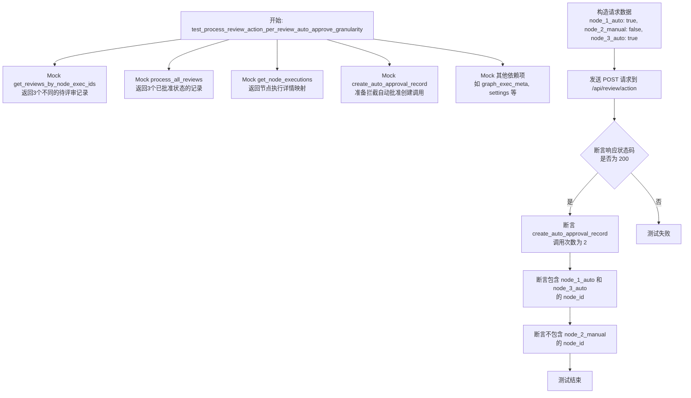

#### 带注释源码

```python
@pytest.mark.asyncio(loop_scope="session")
async def test_process_review_action_per_review_auto_approve_granularity(
    client: httpx.AsyncClient,
    mocker: pytest_mock.MockerFixture,
    sample_pending_review: PendingHumanReviewModel,
    test_user_id: str,
) -> None:
    """Test that auto-approval can be set per-review (granular control)"""
    # 模拟获取评审详情，返回三个不同的评审对象
    mock_get_reviews_for_user = mocker.patch(
        "backend.api.features.executions.review.routes.get_reviews_by_node_exec_ids"
    )

    # 定义三个评审对象的映射：两个计划自动批准，一个不自动批准
    review_map = {
        "node_1_auto": PendingHumanReviewModel(
            node_exec_id="node_1_auto",
            user_id=test_user_id,
            graph_exec_id="test_graph_exec",
            graph_id="test_graph",
            graph_version=1,
            payload={"data": "node1"},
            instructions="Review 1",
            editable=True,
            status=ReviewStatus.WAITING,
            review_message=None,
            was_edited=False,
            processed=False,
            created_at=FIXED_NOW,
        ),
        "node_2_manual": PendingHumanReviewModel(
            node_exec_id="node_2_manual",
            user_id=test_user_id,
            graph_exec_id="test_graph_exec",
            graph_id="test_graph",
            graph_version=1,
            payload={"data": "node2"},
            instructions="Review 2",
            editable=True,
            status=ReviewStatus.WAITING,
            review_message=None,
            was_edited=False,
            processed=False,
            created_at=FIXED_NOW,
        ),
        "node_3_auto": PendingHumanReviewModel(
            node_exec_id="node_3_auto",
            user_id=test_user_id,
            graph_exec_id="test_graph_exec",
            graph_id="test_graph",
            graph_version=1,
            payload={"data": "node3"},
            instructions="Review 3",
            editable=True,
            status=ReviewStatus.WAITING,
            review_message=None,
            was_edited=False,
            processed=False,
            created_at=FIXED_NOW,
        ),
    }

    # 配置 mock 返回值
    mock_get_reviews_for_user.return_value = review_map

    # 模拟处理所有评审，返回已批准状态的评审对象
    mock_process_all_reviews = mocker.patch(
        "backend.api.features.executions.review.routes.process_all_reviews_for_execution"
    )
    mock_process_all_reviews.return_value = {
        "node_1_auto": PendingHumanReviewModel(
            node_exec_id="node_1_auto",
            user_id=test_user_id,
            graph_exec_id="test_graph_exec",
            graph_id="test_graph",
            graph_version=1,
            payload={"data": "node1"},
            instructions="Review 1",
            editable=True,
            status=ReviewStatus.APPROVED,
            review_message=None,
            was_edited=False,
            processed=False,
            created_at=FIXED_NOW,
            updated_at=FIXED_NOW,
            reviewed_at=FIXED_NOW,
        ),
        "node_2_manual": PendingHumanReviewModel(
            node_exec_id="node_2_manual",
            user_id=test_user_id,
            graph_exec_id="test_graph_exec",
            graph_id="test_graph",
            graph_version=1,
            payload={"data": "node2"},
            instructions="Review 2",
            editable=True,
            status=ReviewStatus.APPROVED,
            review_message=None,
            was_edited=False,
            processed=False,
            created_at=FIXED_NOW,
            updated_at=FIXED_NOW,
            reviewed_at=FIXED_NOW,
        ),
        "node_3_auto": PendingHumanReviewModel(
            node_exec_id="node_3_auto",
            user_id=test_user_id,
            graph_exec_id="test_graph_exec",
            graph_id="test_graph",
            graph_version=1,
            payload={"data": "node3"},
            instructions="Review 3",
            editable=True,
            status=ReviewStatus.APPROVED,
            review_message=None,
            was_edited=False,
            processed=False,
            created_at=FIXED_NOW,
            updated_at=FIXED_NOW,
            reviewed_at=FIXED_NOW,
        ),
    }

    # 模拟获取节点执行详情，用于获取 node_id
    mock_get_node_executions = mocker.patch(
        "backend.data.execution.get_node_executions"
    )
    mock_node_execs = []
    for node_exec_id in ["node_1_auto", "node_2_manual", "node_3_auto"]:
        mock_node = mocker.Mock(spec=NodeExecutionResult)
        mock_node.node_exec_id = node_exec_id
        mock_node.node_id = f"node_def_{node_exec_id}"
        mock_node_execs.append(mock_node)
    mock_get_node_executions.return_value = mock_node_execs

    # 模拟创建自动批准记录，这是验证的核心目标
    mock_create_auto_approval = mocker.patch(
        "backend.api.features.executions.review.routes.create_auto_approval_record"
    )

    # 模拟其他必要的辅助函数
    mock_get_graph_exec = mocker.patch(
        "backend.api.features.executions.review.routes.get_graph_execution_meta"
    )
    mock_graph_exec_meta = mocker.Mock()
    mock_graph_exec_meta.status = ExecutionStatus.REVIEW
    mock_get_graph_exec.return_value = mock_graph_exec_meta

    mock_has_pending = mocker.patch(
        "backend.api.features.executions.review.routes.has_pending_reviews_for_graph_exec"
    )
    mock_has_pending.return_value = False

    mock_get_settings = mocker.patch(
        "backend.api.features.executions.review.routes.get_graph_settings"
    )
    mock_get_settings.return_value = GraphSettings(
        human_in_the_loop_safe_mode=False, sensitive_action_safe_mode=False
    )

    mocker.patch("backend.api.features.executions.review.routes.add_graph_execution")
    mocker.patch("backend.api.features.executions.review.routes.get_user_by_id")

    # 构造请求负载：
    # - node_1_auto: auto_approve_future=True
    # - node_2_manual: auto_approve_future=False (明确设为 false)
    # - node_3_auto: auto_approve_future=True
    request_data = {
        "reviews": [
            {
                "node_exec_id": "node_1_auto",
                "approved": True,
                "auto_approve_future": True,
            },
            {
                "node_exec_id": "node_2_manual",
                "approved": True,
                "auto_approve_future": False,  # 不自动批准
            },
            {
                "node_exec_id": "node_3_auto",
                "approved": True,
                "auto_approve_future": True,
            },
        ],
    }

    # 发送 POST 请求
    response = await client.post("/api/review/action", json=request_data)

    # 验证响应成功
    assert response.status_code == 200

    # 验证 create_auto_approval_record 仅被调用了两次 (node_1 和 node_3)
    assert mock_create_auto_approval.call_count == 2

    # 验证具体参数：确认包含了 node_1 和 node_3 的 node_id
    call_args_list = [call.kwargs for call in mock_create_auto_approval.call_args_list]
    node_ids_with_auto_approval = [args["node_id"] for args in call_args_list]

    assert "node_def_node_1_auto" in node_ids_with_auto_approval
    assert "node_def_node_3_auto" in node_ids_with_auto_approval
    
    # 验证 node_2 被排除，因为它设置了 auto_approve_future=False
    assert "node_def_node_2_manual" not in node_ids_with_auto_approval
```


## 关键组件


### Review API Client Fixture
An asynchronous HTTP client fixture configured with JWT authentication overrides to facilitate isolated testing of review endpoints.

### Pending Human Review Model
A data model representing a review task in a waiting state, encapsulating node execution details, user payloads, and current status.

### Review Action Route Handler
The API logic component responsible for validating requests and orchestrating the processing of user approval or rejection actions.

### Auto-Approval Record Manager
A functional component that enables users to define rules for automatically bypassing future reviews for specific node payloads.

### Graph Execution Metadata Manager
A component that verifies the existence and ownership of graph executions while tracking their status during the review lifecycle.

### Mock Dependency Layer
A testing infrastructure layer utilizing patches and fixtures to simulate database interactions and external service dependencies.


## 问题及建议


### 已知问题

-   **Mock 路径硬编码**：测试代码中大量使用字符串字面量（如 `"backend.api.features.executions.review.routes..."`）来指定 Mock 对象的路径。这种硬编码方式不仅冗长，而且当项目结构或导入路径发生重构时，极易导致大规模的测试失败，增加了维护成本。
-   **测试实现细节而非行为**：测试用例通过 Mock 底层的数据库访问函数（如 `get_graph_execution_meta`, `get_pending_reviews_for_execution`）来控制流程，这表明测试过于耦合于当前的内部实现细节。如果代码重构改变了内部调用逻辑但保持了 API 行为不变，这些测试将会失效，违背了黑盒测试的原则。
-   **脆弱的错误断言**：在 `test_process_review_action_empty_request` 等测试中，断言检查了具体的错误信息字符串（如 `"At least one review must be provided"`）。这种断言依赖于 Pydantic 或 Web 框架的具体错误消息格式，一旦框架版本升级导致错误文案或结构变化，测试将无法通过。

### 优化建议

-   **引入参数化测试**：`test_process_review_action_approve_success` 和 `test_process_review_action_reject_success` 等测试用例的逻辑结构高度相似，仅是输入数据和预期结果不同。建议使用 `@pytest.mark.parametrize` 装饰器将它们合并，以大幅减少代码重复，提高测试的可读性和维护性。
-   **封装 Mock 配置**：针对重复出现的 Mock 设置（例如模拟 Graph Execution 状态、模拟用户权限检查），建议将其抽取为专门的 Pytest Fixture 或辅助函数（如 `setup_review_mocks`）。这样可以统一管理 Mock 逻辑，简化单个测试用例的代码量。
-   **采用工厂模式生成测试数据**：目前的 `sample_pending_review` Fixture 比较固定。建议引入轻量级的工厂函数或使用 `factory_boy` 库，以便在测试中动态生成具有不同状态（如已编辑、已拒绝、不同 Payload）的 `PendingHumanReviewModel` 实例，增强测试覆盖场景的灵活性。


## 其它


### 设计目标与约束

**设计目标**
1.  **全面覆盖**：确保对人工审核相关的 API 端点进行全面测试，包括成功场景、失败场景、边界条件以及分页逻辑。
2.  **逻辑验证**：重点验证审核状态的转换逻辑（从 `WAITING` 到 `APPROVED` 或 `REJECTED`）以及自动批准机制的行为。
3.  **隔离性**：通过 Mock 外部依赖（数据库访问、认证、执行引擎），确保测试单元的独立性和稳定性，不受外部环境影响。

**约束条件**
1.  **异步环境**：测试代码必须在 `asyncio` 环境下运行，使用 `pytest_asyncio` 进行异步测试管理和 `httpx.AsyncClient` 进行异步 HTTP 请求。
2.  **数据一致性**：使用固定的 `FIXED_NOW` 时间戳（2023-01-01），确保涉及时间比较的测试结果具有可复现性。
3.  **模拟认证**：必须覆盖 FastAPI 的依赖注入，使用 `app.dependency_overrides` 模拟 JWT 用户认证，确保每个测试都在特定的用户上下文中运行。
4.  **会话作用域**：HTTP 客户端 Fixtures 使用 `loop_scope="session"`，以优化测试性能，避免为每个测试用例重新创建客户端。

### 错误处理与异常设计

**错误处理策略**
测试代码验证了 API 层对多种异常情况的处理机制，确保错误信息清晰且符合 HTTP 标准。

1.  **验证错误 (422 Unprocessable Entity)**
    *   **场景**：当请求数据不符合 Pydantic 模型定义时（例如提交空的 `reviews` 列表）。
    *   **预期行为**：API 返回 422 状态码，响应体中的 `detail` 字段包含具体的验证错误信息，如 "At least one review must be provided"。

2.  **资源未找到 (404 Not Found)**
    *   **场景**：
        *   尝试获取一个不存在的或当前用户无权访问的 Graph Execution 的审核列表。
        *   尝试处理一个不存在的 `node_exec_id` 对应的审核。
    *   **预期行为**：API 返回 404 状态码，响应体包含 "not found" 或 "Review(s) not found" 的描述信息。

3.  **业务逻辑错误 (400 Bad Request)**
    *   **场景**：当审核处理过程中发生逻辑错误或部分失败时（例如数据库操作失败或数据校验不通过，模拟为 `ValueError`）。
    *   **预期行为**：API 返回 400 状态码，并将具体的错误信息（如 "Some reviews failed validation"）传递给客户端。

**异常传播**
代码模拟了底层业务逻辑抛出异常（如 `ValueError`）的情况，并验证这些异常是否被 API 层正确捕获并转换为相应的 HTTP 错误响应，而不是导致服务崩溃。

### 数据流与状态机

**数据流**
1.  **请求阶段**：测试客户端构造包含审核操作指令（批准/拒绝）和可选数据（`reviewed_data`, `auto_approve_future`）的 JSON 请求体，通过 POST 请求发送至 `/api/review/action`。
2.  **验证阶段**：API 接收请求后，首先进行 Pydantic 模型验证，确保数据格式正确。
3.  **查询阶段**：系统根据 `node_exec_id` 查询数据库（Mock 层获取），获取当前的待审核记录 (`PendingHumanReviewModel`)，并验证用户权限。
4.  **处理阶段**：
    *   调用业务逻辑层更新审核状态（`APPROVED`/`REJECTED`）。
    *   如果包含 `auto_approve_future=True` 且状态为 `APPROVED`，系统将触发自动批准记录的创建流程。
    *   检查是否还有待处理的审核，以决定是否更新 Graph Execution 的状态。
5.  **响应阶段**：API 汇总处理结果（批准数、拒绝数、失败数），构造 JSON 响应体返回给客户端。

**状态机**
测试代码主要围绕 `PendingHumanReviewModel` 的 `status` 字段进行状态流转验证：

*   **初始状态**：`WAITING`（表示待审核）。
*   **批准流转**：
    *   用户提交批准请求 -> 状态变更为 `APPROVED`。
    *   副作用：设置 `reviewed_at` 时间戳，更新 `review_message`，若设置了 `auto_approve_future`，则生成自动批准规则。
*   **拒绝流转**：
    *   用户提交拒绝请求 -> 状态变更为 `REJECTED`。
    *   副作用：设置 `reviewed_at` 时间戳，即使设置了 `auto_approve_future`，也不会生成自动批准规则（仅对批准生效）。

### 外部依赖与接口契约

**外部依赖**
1.  **测试框架**：
    *   `pytest` / `pytest_asyncio`：提供测试运行环境和异步循环管理。
    *   `httpx`：用于模拟 HTTP 客户端发送请求。
    *   `pytest_snapshot`：用于快照测试（部分测试引入，但代码中主要使用断言）。
    *   `pytest_mock`：用于 Mock 对象和方法补丁。
2.  **业务模块**：
    *   `backend.api.rest_api.app`：被测试的 FastAPI 应用实例。
    *   `backend.data.execution`：提供执行上下文和节点执行结果的数据模型。
    *   `prisma.enums`：提供枚举类型（如 `ReviewStatus`）。
    *   `autogpt_libs.auth`：提供 JWT 工具，用于模拟认证依赖。

**接口契约**
1.  **GET /api/review/pending**
    *   **查询参数**：`page` (int, 默认1), `page_size` (int, 默认25)。
    *   **响应**：200 OK，返回 JSON 数组，包含待审核的 `PendingHumanReviewModel` 列表。
2.  **GET /api/review/execution/{graph_exec_id}**
    *   **路径参数**：`graph_exec_id`。
    *   **响应**：200 OK（返回审核列表）或 404 Not Found（执行不存在或无权访问）。
3.  **POST /api/review/action**
    *   **请求体**：JSON 对象，包含 `reviews` 列表。每个元素需包含：
        *   `node_exec_id` (str): 节点执行 ID。
        *   `approved` (bool): 是否批准。
        *   `message` (str, optional): 审核留言。
        *   `reviewed_data` (dict, optional): 修改后的数据。
        *   `auto_approve_future` (bool, optional): 是否创建自动批准规则。
    *   **响应**：
        *   200 OK：返回 JSON 对象，包含 `approved_count`, `rejected_count`, `failed_count`, `error`。
        *   422 Unprocessable Entity：请求体校验失败。
        *   404 Not Found：审核对象不存在。
        *   400 Bad Request：处理过程中发生业务逻辑错误。

    