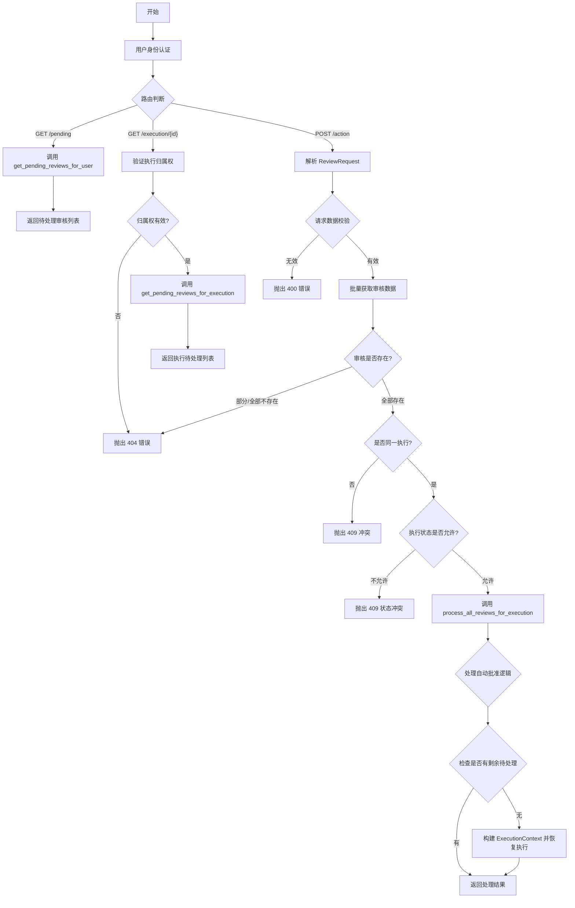
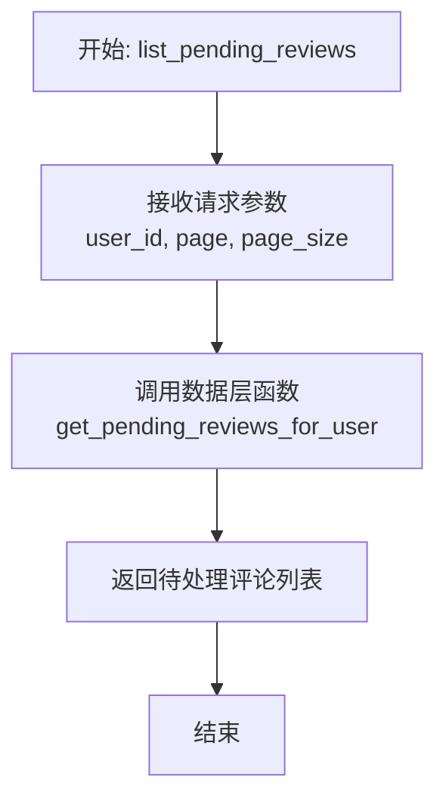
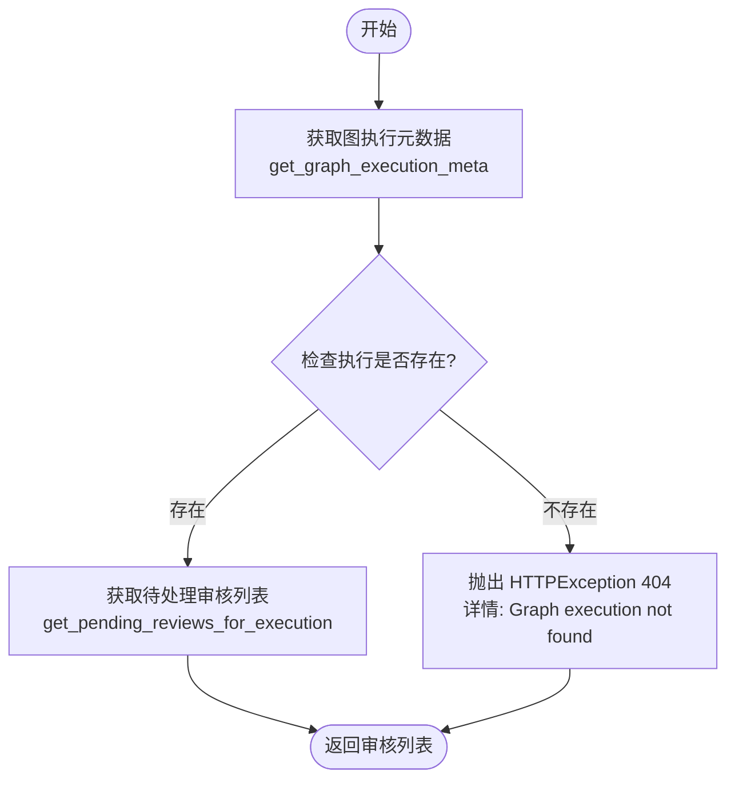
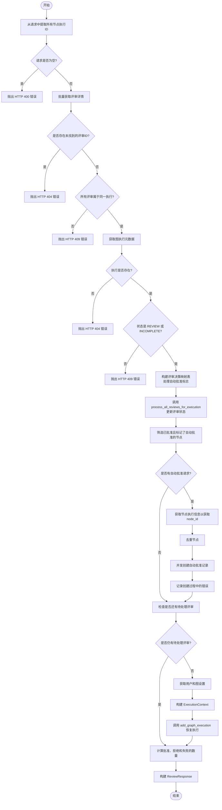

# `AutoGPT\autogpt_platform\backend\backend\api\features\executions\review\routes.py` 详细设计文档

该代码实现了一个 FastAPI 路由器，用于管理 AutoGPT 后端系统中的人工审核工作流，支持获取当前用户或特定执行挂起的审核列表，并处理包含批准/拒绝决策的审核动作，同时支持自动批准设置及处理完毕后的执行恢复逻辑。

## 整体流程



## 类结构

```
Router (APIRouter)
├── list_pending_reviews (GET /pending)
├── list_pending_reviews_for_execution (GET /execution/{graph_exec_id})
└── process_review_action (POST /action)
    └── create_auto_approval_for_node (Nested Helper)
```

## 全局变量及字段


### `logger`
    
日志记录器实例，用于记录模块运行时的信息和错误。

类型：`logging.Logger`
    


### `router`
    
FastAPI 路由器，用于定义和分组与人工审核相关的 API 端点。

类型：`APIRouter`
    


### `ReviewRequest.reviews`
    
包含具体审核项（包含节点 ID、批准状态等）的列表。

类型：`List[ReviewRequest.Item (Inferred)]`
    


### `ReviewRequest.Item (Inferred).node_exec_id`
    
节点执行 ID，用于唯一标识待审核的节点执行记录。

类型：`str`
    


### `ReviewRequest.Item (Inferred).approved`
    
审核决定标志，True 表示批准，False 表示拒绝。

类型：`bool`
    


### `ReviewRequest.Item (Inferred).auto_approve_future`
    
是否将当前审核决定保存为自动批准规则，以便后续自动处理相同节点。

类型：`bool`
    


### `ReviewRequest.Item (Inferred).reviewed_data`
    
审核后修改或确认的数据内容，如果设置了 auto_approve_future 则该项应为 None。

类型：`Any`
    


### `ReviewRequest.Item (Inferred).message`
    
与审核相关的消息或备注信息。

类型：`Optional[str]`
    


### `ReviewResponse.approved_count`
    
本次请求中被批准的审核项总数。

类型：`int`
    


### `ReviewResponse.rejected_count`
    
本次请求中被拒绝的审核项总数。

类型：`int`
    


### `ReviewResponse.failed_count`
    
创建自动批准记录失败的数量。

类型：`int`
    


### `ReviewResponse.error`
    
处理过程中发生的错误详情信息，若无错误则为 null。

类型：`Optional[str]`
    


### `PendingHumanReviewModel.node_exec_id`
    
待审核节点的执行实例唯一标识符。

类型：`str`
    


### `PendingHumanReviewModel.graph_exec_id`
    
节点所属图执行的唯一标识符。

类型：`str`
    


### `PendingHumanReviewModel.status`
    
当前审核状态（如 WAITING）。

类型：`ReviewStatus`
    


### `PendingHumanReviewModel.created_at`
    
审核记录创建的时间戳。

类型：`datetime`
    


### `PendingHumanReviewModel.reviewed_data`
    
待审核的节点执行数据。

类型：`Any`
    


### `PendingHumanReviewModel.message`
    
与待审核记录关联的额外消息或上下文。

类型：`Optional[str]`
    
    

## 全局函数及方法


### `list_pending_reviews`

检索当前用户的所有待处理评论。获取属于已认证用户、状态为 "WAITING" 的评论。结果按创建时间排序（最新的在前）。

参数：

- `user_id`：`str`，已认证用户 ID，来自安全依赖
- `page`：`int`，页码（从 1 开始索引）
- `page_size`：`int`，每页的评论数量

返回值：`List[PendingHumanReviewModel]`，待处理评论对象列表，其中状态已转换为类型化字面量

#### 流程图



#### 带注释源码

```python
async def list_pending_reviews(
    user_id: str = Security(autogpt_auth_lib.get_user_id),
    page: int = Query(1, ge=1, description="Page number (1-indexed)"),
    page_size: int = Query(25, ge=1, le=100, description="Number of reviews per page"),
) -> List[PendingHumanReviewModel]:
    """Get all pending reviews for the current user.

    Retrieves all reviews with status "WAITING" that belong to the authenticated user.
    Results are ordered by creation time (newest first).

    Args:
        user_id: Authenticated user ID from security dependency

    Returns:
        List of pending review objects with status converted to typed literals

    Raises:
        HTTPException: If authentication fails or database error occurs

    Note:
        Reviews with invalid status values are logged as warnings but excluded
        from results rather than failing the entire request.
    """

    # 调用后端数据层函数，根据用户ID和分页参数获取待处理的审核列表
    return await get_pending_reviews_for_user(user_id, page, page_size)
```


### `list_pending_reviews_for_execution`

获取特定图执行的所有待处理审核，按创建时间排序（最早的在前），并仅返回属于已认证用户的审核。

参数：

- `graph_exec_id`: `str`, 需要获取审核的图执行 ID
- `user_id`: `str`, 从安全依赖项中获取的已认证用户 ID

返回值：`List[PendingHumanReviewModel]`, 指定执行的待处理审核对象列表

#### 流程图



#### 带注释源码

```python
async def list_pending_reviews_for_execution(
    graph_exec_id: str,
    user_id: str = Security(autogpt_auth_lib.get_user_id),
) -> List[PendingHumanReviewModel]:
    """Get all pending reviews for a specific graph execution.

    Retrieves all reviews with status "WAITING" for the specified graph execution
    that belong to the authenticated user. Results are ordered by creation time
    (oldest first) to preserve review order within the execution.

    Args:
        graph_exec_id: ID of the graph execution to get reviews for
        user_id: Authenticated user ID from security dependency

    Returns:
        List of pending review objects for the specified execution

    Raises:
        HTTPException:
            - 404: If the graph execution doesn't exist or isn't owned by this user
            - 500: If authentication fails or database error occurs

    Note:
        Only returns reviews owned by the authenticated user for security.
        Reviews with invalid status are excluded with warning logs.
    """

    # 验证用户是否拥有该图执行，确保数据安全性
    graph_exec = await get_graph_execution_meta(
        user_id=user_id, execution_id=graph_exec_id
    )
    # 如果未找到图执行（可能不存在或无权访问），抛出 404 错误
    if not graph_exec:
        raise HTTPException(
            status_code=status.HTTP_404_NOT_FOUND,
            detail=f"Graph execution #{graph_exec_id} not found",
        )

    # 获取该图执行下所有的待处理审核并返回
    return await get_pending_reviews_for_execution(graph_exec_id, user_id)
```


### `process_review_action`

处理人工评审的审批或拒绝操作，更新评审状态，处理自动批准设置，并在所有待处理评审完成后恢复图执行流程。

参数：

-  `request`：`ReviewRequest`，包含待处理的评审列表，每个评审包含节点执行ID、审批结果、评审数据以及是否自动批准未来的标志。
-  `user_id`：`str`，从安全上下文中获取的当前认证用户ID。

返回值：`ReviewResponse`，包含本次操作中已批准、已拒绝和失败的评审数量统计，以及可能的错误信息。

#### 流程图



#### 带注释源码

```python
@router.post("/action", response_model=ReviewResponse)
async def process_review_action(
    request: ReviewRequest,
    user_id: str = Security(autogpt_auth_lib.get_user_id),
) -> ReviewResponse:
    """Process reviews with approve or reject actions."""

    # 从请求中收集所有节点执行ID
    all_request_node_ids = {review.node_exec_id for review in request.reviews}

    # 校验请求不为空
    if not all_request_node_ids:
        raise HTTPException(
            status_code=status.HTTP_400_BAD_REQUEST,
            detail="At least one review must be provided",
        )

    # 批量获取所有请求的评审（无论状态如何，用于幂等处理）
    reviews_map = await get_reviews_by_node_exec_ids(
        list(all_request_node_ids), user_id
    )

    # 校验所有评审是否存在
    missing_ids = all_request_node_ids - set(reviews_map.keys())
    if missing_ids:
        raise HTTPException(
            status_code=status.HTTP_404_NOT_FOUND,
            detail=f"Review(s) not found: {', '.join(missing_ids)}",
        )

    # 校验所有评审是否属于同一个图执行
    graph_exec_ids = {review.graph_exec_id for review in reviews_map.values()}
    if len(graph_exec_ids) > 1:
        raise HTTPException(
            status_code=status.HTTP_409_CONFLICT,
            detail="All reviews in a single request must belong to the same execution.",
        )

    graph_exec_id = next(iter(graph_exec_ids))

    # 在处理评审前校验执行状态
    graph_exec_meta = await get_graph_execution_meta(
        user_id=user_id, execution_id=graph_exec_id
    )

    if not graph_exec_meta:
        raise HTTPException(
            status_code=status.HTTP_404_NOT_FOUND,
            detail=f"Graph execution #{graph_exec_id} not found",
        )

    # 仅当执行处于暂停等待评审或不完整状态时才允许处理
    if graph_exec_meta.status not in (
        ExecutionStatus.REVIEW,
        ExecutionStatus.INCOMPLETE,
    ):
        raise HTTPException(
            status_code=status.HTTP_409_CONFLICT,
            detail=f"Cannot process reviews while execution status is {graph_exec_meta.status}. "
            f"Reviews can only be processed when execution is paused (REVIEW status). "
            f"Current status: {graph_exec_meta.status}",
        )

    # 构建评审决策映射，并跟踪哪些评审请求了自动批准
    # 自动批准的评审使用原始数据（不允许修改）
    review_decisions = {}
    auto_approve_requests = {}  # Map node_exec_id -> auto_approve_future flag

    for review in request.reviews:
        review_status = (
            ReviewStatus.APPROVED if review.approved else ReviewStatus.REJECTED
        )
        # 如果评审请求了自动批准，则不允许数据修改
        reviewed_data = None if review.auto_approve_future else review.reviewed_data
        review_decisions[review.node_exec_id] = (
            review_status,
            reviewed_data,
            review.message,
        )
        auto_approve_requests[review.node_exec_id] = review.auto_approve_future

    # 处理所有评审
    updated_reviews = await process_all_reviews_for_execution(
        user_id=user_id,
        review_decisions=review_decisions,
    )

    # 为请求了自动批准且已批准的评审创建自动批准记录
    # 按 node_id 去重以避免并行处理同一节点的多个评审时出现竞态条件
    async def create_auto_approval_for_node(
        node_id: str, review_result
    ) -> tuple[str, bool]:
        """
        Create auto-approval record for a node.
        Returns (node_id, success) tuple for tracking failures.
        """
        try:
            await create_auto_approval_record(
                user_id=user_id,
                graph_exec_id=review_result.graph_exec_id,
                graph_id=review_result.graph_id,
                graph_version=review_result.graph_version,
                node_id=node_id,
                payload=review_result.payload,
            )
            return (node_id, True)
        except Exception as e:
            logger.error(
                f"Failed to create auto-approval record for node {node_id}",
                exc_info=e,
            )
            return (node_id, False)

    # 收集需要自动批准的 node_exec_ids
    node_exec_ids_needing_auto_approval = [
        node_exec_id
        for node_exec_id, review_result in updated_reviews.items()
        if review_result.status == ReviewStatus.APPROVED
        and auto_approve_requests.get(node_exec_id, False)
    ]

    # 批量获取节点执行信息以获取 node_ids
    nodes_needing_auto_approval: dict[str, Any] = {}
    if node_exec_ids_needing_auto_approval:
        from backend.data.execution import get_node_executions

        node_execs = await get_node_executions(
            graph_exec_id=graph_exec_id, include_exec_data=False
        )
        node_exec_map = {node_exec.node_exec_id: node_exec for node_exec in node_execs}

        for node_exec_id in node_exec_ids_needing_auto_approval:
            node_exec = node_exec_map.get(node_exec_id)
            if node_exec:
                review_result = updated_reviews[node_exec_id]
                # 使用此节点的第一个已批准评审（按 node_id 去重）
                if node_exec.node_id not in nodes_needing_auto_approval:
                    nodes_needing_auto_approval[node_exec.node_id] = review_result
            else:
                logger.error(
                    f"Failed to create auto-approval record for {node_exec_id}: "
                    f"Node execution not found. This may indicate a race condition "
                    f"or data inconsistency."
                )

    # 并行执行所有自动批准记录的创建（按 node_id 去重）
    auto_approval_results = await asyncio.gather(
        *[
            create_auto_approval_for_node(node_id, review_result)
            for node_id, review_result in nodes_needing_auto_approval.items()
        ],
        return_exceptions=True,
    )

    # 统计自动批准失败的数量
    auto_approval_failed_count = 0
    for result in auto_approval_results:
        if isinstance(result, Exception):
            # 自动批准创建过程中的意外异常
            auto_approval_failed_count += 1
            logger.error(
                f"Unexpected exception during auto-approval creation: {result}"
            )
        elif isinstance(result, tuple) and len(result) == 2 and not result[1]:
            # 自动批准创建失败（返回 False）
            auto_approval_failed_count += 1

    # 统计结果数量
    approved_count = sum(
        1
        for review in updated_reviews.values()
        if review.status == ReviewStatus.APPROVED
    )
    rejected_count = sum(
        1
        for review in updated_reviews.values()
        if review.status == ReviewStatus.REJECTED
    )

    # 仅当该执行的所有待处理评审都已处理完毕时才恢复执行
    if updated_reviews:
        still_has_pending = await has_pending_reviews_for_graph_exec(graph_exec_id)

        if not still_has_pending:
            # 从任意已处理的评审中获取 graph_id
            first_review = next(iter(updated_reviews.values()))

            try:
                # 获取用户和设置以构建完整的执行上下文
                user = await get_user_by_id(user_id)
                settings = await get_graph_settings(
                    user_id=user_id, graph_id=first_review.graph_id
                )

                # 恢复执行时保留用户的时区偏好
                user_timezone = (
                    user.timezone if user.timezone != USER_TIMEZONE_NOT_SET else "UTC"
                )

                execution_context = ExecutionContext(
                    human_in_the_loop_safe_mode=settings.human_in_the_loop_safe_mode,
                    sensitive_action_safe_mode=settings.sensitive_action_safe_mode,
                    user_timezone=user_timezone,
                )

                await add_graph_execution(
                    graph_id=first_review.graph_id,
                    user_id=user_id,
                    graph_exec_id=graph_exec_id,
                    execution_context=execution_context,
                )
                logger.info(f"Resumed execution {graph_exec_id}")
            except Exception as e:
                logger.error(f"Failed to resume execution {graph_exec_id}: {str(e)}")

    # 如果自动批准失败，构建错误消息
    error_message = None
    if auto_approval_failed_count > 0:
        error_message = (
            f"{auto_approval_failed_count} auto-approval setting(s) could not be saved. "
            f"You may need to manually approve these reviews in future executions."
        )

    return ReviewResponse(
        approved_count=approved_count,
        rejected_count=rejected_count,
        failed_count=auto_approval_failed_count,
        error=error_message,
    )
```


### `create_auto_approval_for_node`

该函数是一个嵌套在处理审核操作流程中的异步辅助函数，负责根据审核结果为特定节点创建自动审批记录。如果操作失败，它会捕获异常并记录错误日志，而不是中断主流程。

参数：

- `node_id`：`str`，需要创建自动审批记录的节点 ID。
- `review_result`：`Any`（隐式类型），包含执行元数据（如 graph_exec_id, graph_id 等）和负载数据的审核结果对象。

返回值：`tuple[str, bool]`，返回一个元组，包含节点 ID 和操作是否成功的布尔标志（True 表示成功，False 表示失败）。

#### 流程图

```mermaid
flowchart TD
    A([开始]) --> B[尝试调用 create_auto_approval_record]
    B --> C{执行是否成功?}
    C -- 是 --> D[返回元组: (node_id, True)]
    C -- 否/抛出异常 --> E[捕获异常并记录错误日志]
    E --> F[返回元组: (node_id, False)]
    D --> G([结束])
    F --> G
```

#### 带注释源码

```python
    async def create_auto_approval_for_node(
        node_id: str, review_result
    ) -> tuple[str, bool]:
        """
        Create auto-approval record for a node.
        Returns (node_id, success) tuple for tracking failures.
        """
        try:
            # 调用数据层方法创建自动审批记录
            # 传入用户ID、执行ID、图ID、版本、节点ID以及负载数据
            await create_auto_approval_record(
                user_id=user_id,
                graph_exec_id=review_result.graph_exec_id,
                graph_id=review_result.graph_id,
                graph_version=review_result.graph_version,
                node_id=node_id,
                payload=review_result.payload,
            )
            # 成功则返回节点ID和True
            return (node_id, True)
        except Exception as e:
            # 捕获任何异常，记录错误日志，防止影响主流程
            logger.error(
                f"Failed to create auto-approval record for node {node_id}",
                exc_info=e,
            )
            # 失败则返回节点ID和False
            return (node_id, False)
```


## 关键组件


### Pending Review Query Service
负责检索待处理的人工审查任务，支持按用户分页获取列表以及按特定图执行ID筛选，同时强制执行所有权验证以确保数据安全。

### Review Processing Orchestration
处理接受或拒绝审查的核心业务逻辑，包括验证执行状态、确保批量操作的原子性、管理审查状态转换以及处理用户输入的审查数据和评论。

### Auto-Approval Rule Management
实现将用户批准偏好持久化为未来执行自动批准规则的逻辑，处理按节点ID的去重、记录的异步批量创建以及对规则设置失败的错误跟踪和记录。

### Execution Lifecycle Controller
监控特定图执行中审查任务的完成状态，并在所有审查完成后触发工作流恢复，包括重建执行上下文（如时区设置和安全模式）并调用执行器。

### Security & Access Control
通过 FastAPI 依赖注入强制执行所有端点的身份验证和授权，验证用户身份并确保用户只能访问属于其自己的执行记录和审查任务。


## 问题及建议


### 已知问题

-   **函数内部导入导致的性能与可维护性问题**：在 `process_review_action` 函数内部使用了 `from backend.data.execution import get_node_executions`。这种做法通常用于解决循环依赖问题，但会增加函数调用的开销，降低代码的可读性，并掩盖潜在的架构设计缺陷。
-   **执行恢复失败被静默处理（Zombie State 风险）**：在 `process_review_action` 中，调用 `add_graph_execution` 恢复执行的代码被包裹在 `try-except Exception` 块中。如果恢复失败（例如调度服务不可用），仅记录日志，但 API 仍向客户端返回成功状态。这将导致评论状态已更新但执行流停止的“僵尸”状态，用户无法感知执行已中断。
-   **潜在的数据获取性能瓶颈**：为了获取 `node_id` 以创建自动批准记录，代码调用了 `get_node_executions` 获取特定图执行下的**所有**节点。如果该图执行包含成千上万个节点，而只需要更新极少数节点的自动批准设置，这将造成严重的内存浪费和延迟。
-   **类型定义不严格**：代码中使用了 `dict[str, Any]` 来定义 `nodes_needing_auto_approval`，失去了类型检查的优势，容易在后续开发中引入字段名拼写错误或类型不匹配的问题。

### 优化建议

-   **拆分 `process_review_action` 函数**：该函数承担了过多的职责（参数校验、业务逻辑处理、副作用处理、执行编排）。建议将其重构为服务层（Service Layer）模式，将自动批准逻辑、校验逻辑和执行恢复逻辑拆分为独立的私有函数或类方法，以提高代码的可测试性和可读性。
-   **优化数据查询以减少负载**：在获取节点 ID 映射时，应避免全量拉取节点执行数据。建议在数据层（DAL）增加一个方法，仅根据 `node_exec_id` 列表查询所需的 `node_id` 和 `graph_version` 等字段，或者确保 `get_node_executions` 支持按 ID 列表过滤。
-   **引入更健壮的恢复机制**：对于执行恢复失败的情况，不应仅仅记录日志。建议引入重试机制，或者在响应中明确标记恢复状态，使客户端感知到需要手动介入或重试。同时，考虑使用事务或 Saga 模式确保数据一致性。
-   **解决循环依赖或调整导入结构**：重构模块依赖关系，将共享的数据模型或工具函数移至独立的底层模块，从而消除对函数内部导入的依赖，使代码结构符合 Python 最佳实践。
-   **使用精确的类型注解**：将 `Any` 类型替换为具体的 Pydantic 模型或 TypedDict，例如定义 `AutoApprovalPayload` 类型，以增强代码的健壮性和 IDE 提示支持。


## 其它


### 设计目标与约束

**设计目标：**
1.  **安全性：** 确保用户只能查看和操作属于其自身的审核记录，防止越权访问。
2.  **原子性与一致性：** 在处理审核动作时，确保审核状态更新与自动批准记录创建的逻辑关联正确。
3.  **异步非阻塞：** 利用 `asyncio` 并发处理自动批准记录的创建，避免因单次记录创建失败阻塞主流程响应。
4.  **幂等性：** 支持对同一组审核请求进行重复处理（特别是在处理不同状态下的重复提交时保持稳定）。
5.  **流程恢复：** 能够在所有挂起的审核处理完毕后，自动触发图执行的恢复。

**约束：**
1.  **状态约束：** 仅当图执行处于 `REVIEW`（审核中）或 `INCOMPLETE`（未完成）状态时，才允许处理审核操作。
2.  **批量约束：** 单次请求中的所有审核必须属于同一个图执行 (`graph_exec_id`)。
3.  **数据约束：** 请求自动批准未来的审核时，不允许修改该次审核的数据 (`reviewed_data`)。
4.  **分页约束：** 获取待审核列表时强制分页，防止大数据量导致内存溢出。

### 错误处理与异常设计

本模块采用标准的 HTTP 状态码结合业务异常信息的错误处理策略：

1.  **认证与授权失败：**
    *   依赖 `autogpt_libs.auth` 安全依赖，若用户未认证或 Token 无效，由框架直接拦截返回 401 或 403。

2.  **客户端请求错误 (4xx)：**
    *   **400 Bad Request：** 请求体中未包含任何审核数据；或请求数据格式不符合模型定义。
    *   **404 Not Found：** 查询特定的图执行 (`graph_exec_id`) 不存在，或请求处理的审核 ID (`node_exec_id`) 在数据库中不存在。
    *   **409 Conflict：**
        *   请求中的审核属于多个不同的图执行。
        *   尝试处理审核时，当前的图执行状态不允许操作（例如状态为 `RUNNING` 或 `SUCCESS`）。

3.  **服务端错误 (5xx)：**
    *   **500 Internal Server Error：** 数据库连接失败、非预期的异常或内部逻辑错误。
    *   **部分失败处理策略：** 在 `process_review_action` 中，如果创建“自动批准记录”失败，系统**不会**回滚已成功的审核状态更新，而是记录错误日志，并在响应消息中提示用户部分设置未保存 (`failed_count` 和 `error` 字段)。这保证了核心业务流程（审核通过/拒绝）的高可用性。

### 数据流与状态机

**状态机设计：**
1.  **审核状态：**
    *   `WAITING`: 初始状态，等待用户操作。
    *   `APPROVED`: 用户批准。
    *   `REJECTED`: 用户拒绝。
    *   *流转：* `WAITING` -> (`APPROVED` | `REJECTED`)。流转由 `process_review_action` 触发。

2.  **执行状态：**
    *   `REVIEW`: 执行暂停，等待人工干预。
    *   `INCOMPLETE`: 执行部分完成，存在遗留问题或审核。
    *   `RUNNING`: 执行正在运行。
    *   *流转：*
        *   执行进入审核点：`...` -> `REVIEW`。
        *   所有审核处理完毕且状态为 `APPROVED`：`REVIEW` -> `RUNNING` (通过 `add_graph_execution` 触发)。
        *   存在拒绝：通常执行会终止或流转至失败状态（具体由执行器处理，本接口仅更新审核状态）。

**数据流：**
1.  **读取流：**
    *   客户端请求 (`GET`) -> 身份验证 -> 查询参数校验 -> 数据库查询 -> 数据转换 (`PendingHumanReviewModel`) -> 响应。
2.  **写入/处理流：**
    *   客户端提交 (`POST`) -> 解析 `ReviewRequest` -> 校验审核所有权与归属一致性 -> 校验图执行状态 ->
    *   批量更新审核状态 (`process_all_reviews_for_execution`) ->
    *   (并行) 尝试创建自动批准记录 (`create_auto_approval_record`) ->
    *   检查是否仍有挂起审核 (`has_pending_reviews_for_graph_exec`) ->
    *   (若无挂起) 构建上下文 (`ExecutionContext`) -> 恢复执行 (`add_graph_execution`) ->
    *   汇总结果 -> 返回 `ReviewResponse`。

### 外部依赖与接口契约

本模块依赖以下外部服务和内部模块，其接口契约如下：

1.  **`autogpt_libs.auth` (外部库)**
    *   `requires_user`: 安全依赖，用于保护路由，确保请求包含有效的用户凭证。
    *   `get_user_id`: 依赖函数，从请求上下文中提取 `user_id`。

2.  **`backend.data.graph` (内部数据层)**
    *   `get_graph_execution_meta(user_id, execution_id)`: 获取执行元数据。
        *   *契约：* 若执行不存在或不属于用户，返回 `None`。

3.  **`backend.data.human_review` (内部业务逻辑层)**
    *   `get_pending_reviews_for_user(...)`: 分页获取用户的待审核列表。
    *   `get_reviews_by_node_exec_ids(...)`: 批量获取特定节点的审核详情，用于预检。
    *   `process_all_reviews_for_execution(...)`: 核心事务操作，原子性地更新审核状态。
    *   `has_pending_reviews_for_graph_exec(graph_exec_id)`: 检查指定执行是否还有待处理项。

4.  **`backend.executor.utils` (内部执行器)**
    *   `add_graph_execution(...)`: 用于恢复暂停的执行。
        *   *契约：* 接收 `graph_id`, `user_id`, `graph_exec_id` 和 `ExecutionContext`，异步调度执行器继续工作。

5.  **`backend.data.user` (内部用户层)**
    *   `get_user_by_id(user_id)`: 获取用户信息，主要是为了读取 `timezone` 配置。

6.  **`backend.data.execution` (内部执行数据层)**
    *   `get_node_executions(...)`: 批量获取节点执行实例，用于映射 `node_exec_id` 到 `node_id` 以支持自动批准功能。

    