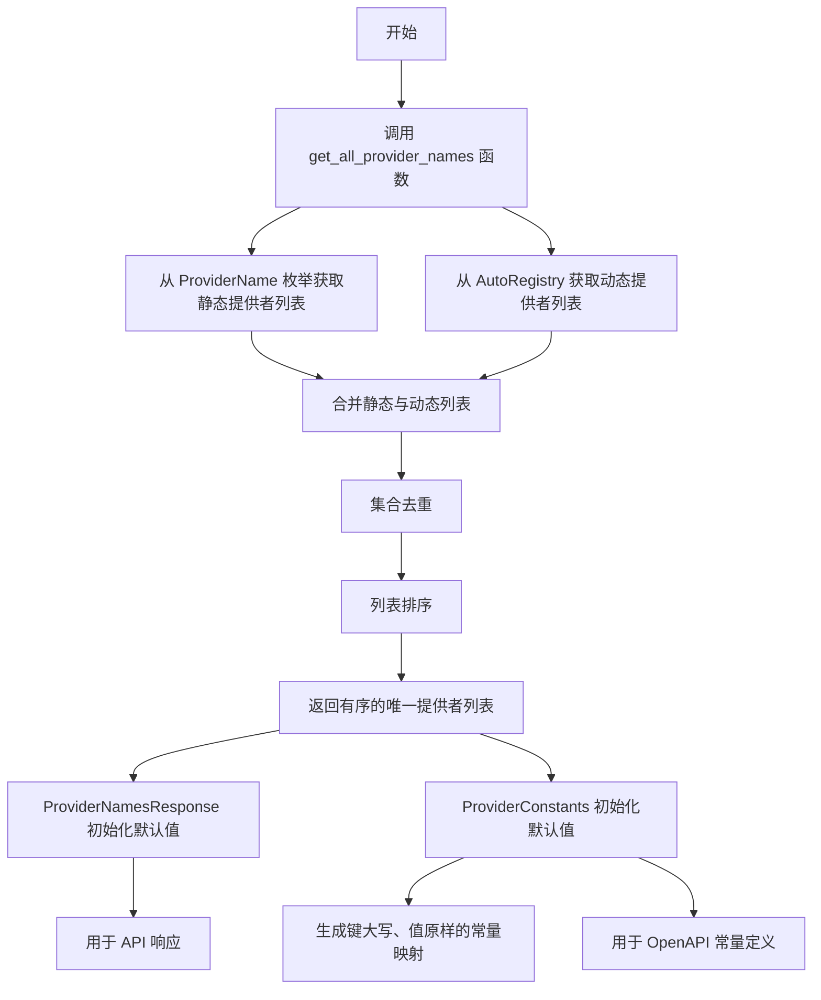
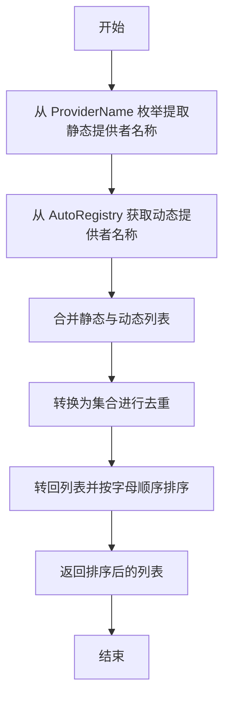

# `AutoGPT\autogpt_platform\backend\backend\api\features\integrations\models.py` 详细设计文档

该模块定义了用于集成相关的Pydantic数据模型，旨在通过OpenAPI schema暴露给前端。它聚合了静态枚举和动态注册表中的提供者名称，生成供TypeScript代码生成器（如Orval）使用的响应结构和常量映射。

## 整体流程



## 类结构

```
BaseModel (pydantic)
├── ProviderNamesResponse
└── ProviderConstants
```

## 全局变量及字段


### `ProviderNamesResponse.providers`
    
List of all available provider names

类型：`list[str]`
    


### `ProviderConstants.PROVIDER_NAMES`
    
All available provider names as a constant mapping

类型：`dict[str, str]`
    
    

## 全局函数及方法


### `get_all_provider_names`

该函数的核心功能是整合系统中的所有提供者名称。它首先从枚举 `ProviderName` 中提取静态定义的提供者名称，然后从 `AutoRegistry` 中获取运行时动态注册的提供者名称。最后，将这两部分名称合并、去重并按字母顺序排序后返回。

参数：

- 无

返回值：`list[str]`，包含所有可用提供者名称（静态与动态合并后）的唯一排序列表。

#### 流程图



#### 带注释源码

```python
def get_all_provider_names() -> list[str]:
    """
    Collect all provider names from both ProviderName enum and AutoRegistry.

    This function should be called at runtime to ensure we get all
    dynamically registered providers.

    Returns:
        A sorted list of unique provider names.
    """
    # 从枚举中获取静态定义的提供者
    # 提取 ProviderName 枚举中所有成员的值
    static_providers = [member.value for member in ProviderName]

    # 从注册表中获取动态注册的提供者
    # 调用 AutoRegistry 的方法获取运行时添加的提供者名称
    dynamic_providers = AutoRegistry.get_all_provider_names()

    # 合并列表并去重
    # 将静态和动态列表相加，通过 set() 去除重复项，再转回 list
    all_providers = list(set(static_providers + dynamic_providers))
    
    # 对最终列表进行排序
    all_providers.sort()

    return all_providers
```


## 关键组件


### get_all_provider_names

Aggregates provider identifiers from both the static `ProviderName` enum and the dynamic `AutoRegistry`, providing a consolidated, deduplicated, and sorted list of unique provider names.

### ProviderNamesResponse

A Pydantic `BaseModel` acting as the API response schema that exposes a dynamic list of all available provider names to the frontend via OpenAPI.

### ProviderConstants

A Pydantic `BaseModel` designed to export a constant dictionary mapping of provider names (formatted for TypeScript compatibility) into the OpenAPI schema, facilitating type generation by frontend tools like Orval.


## 问题及建议


### 已知问题

-   **命名冲突导致数据丢失风险**：在 `ProviderConstants` 类的 `PROVIDER_NAMES` 字段生成逻辑中，使用了 `name.upper().replace("-", "_")` 将名称转换为大写蛇形命名法。如果存在名为 "example-service" 和 "example_service" 的提供者，它们都会映射为键 "EXAMPLE_SERVICE"，导致字典覆盖，进而丢失数据。
-   **OpenAPI Schema 生成时的静态性缺失**：`ProviderConstants` 旨在为 Orval 等工具生成 TypeScript 常量，但其使用了 `default_factory`。大多数 OpenAPI 生成器在分析 Schema 时不会执行 Python 代码（工厂函数），导致生成的 Schema 中 `default` 字段可能为空，前端无法获取实际的提供者列表。
-   **模型层职责过重**：该模块作为 Models 层，直接依赖了 `AutoRegistry` 进行业务逻辑查询（获取动态提供者），违反了分层架构原则，增加了模块间的耦合度，使得模型层难以复用和测试。

### 优化建议

-   **解耦数据获取与模型定义**：移除 `Field(default_factory=...)` 中的直接调用。建议在 API 视图层或服务层调用 `get_all_provider_names` 获取数据，然后显式传递给模型实例。这样既便于控制缓存策略，也能确保在需要时（如生成文档）可以准确地注入数据。
-   **改进键值生成策略以防止冲突**：修改 `ProviderConstants` 中 `PROVIDER_NAMES` 的生成逻辑，确保转换后的键具有唯一性。可以引入校验机制，或者在发生冲突时添加后缀（如 `EXAMPLE_SERVICE_1`），或者严格限制输入名称的格式规范。
-   **增加结果缓存机制**：由于提供者列表在应用运行期间通常保持不变，建议对 `get_all_provider_names` 的返回结果进行缓存（例如使用 `functools.lru_cache` 或应用级单例），避免在每次请求处理或模型实例化时都重新执行集合合并与排序操作。


## 其它


### 设计目标与约束

**设计目标：**
1. **自动化契约生成**：核心目标是通过 OpenAPI 规范自动同步后端 Python 数据结构与前端 TypeScript 类型，消除手动维护接口类型定义的开销，确保前后端契约的一致性。
2. **动态架构适配**：设计必须支持运行时动态注册的提供者，而不仅限于编译时定义的静态枚举，以适应插件化或可扩展的集成架构。
3. **工具链兼容**：生成的数据结构需严格兼容 Orval 等前端代码生成工具，使其能够正确推导出 TypeScript 常量、类型别名和接口。

**设计约束：**
1. **框架依赖**：强制依赖 Pydantic (V2) 进行模型定义和序列化，利用其 `Field` 和 `default_factory` 机制处理动态数据。
2. **初始化时序**：模块的执行依赖于 `AutoRegistry` 在 `default_factory` 调用之前已完成所有提供者的加载和注册。如果注册表尚未准备就绪，生成的 Schema 将不完整或为空。
3. **命名转换规则**：为了适应 TypeScript 的常量命名习惯，必须在生成过程中将提供者名称转换为大写并替换连字符（例如将 `example-service` 转换为 `EXAMPLE_SERVICE`）。

### 外部依赖与接口契约

**1. `backend.sdk.registry.AutoRegistry`**
*   **依赖类型**：核心依赖（动态数据源）
*   **接口契约**：
    *   **方法调用**：`AutoRegistry.get_all_provider_names()`
    *   **返回类型**：`list[str]`
    *   **契约描述**：该函数必须返回当前系统中所有通过插件机制动态注册的提供者名称列表。调用方假设返回的列表中的每个元素都是有效的字符串标识符，且不包含 `None` 值。

**2. `backend.integrations.providers.ProviderName`**
*   **依赖类型**：核心依赖（静态数据源）
*   **接口契约**：
    *   **数据结构**：Python `Enum` 类型
    *   **契约描述**：该枚举包含了系统内置的、硬编码的提供者名称。契约要求枚举成员必须包含 `value` 属性，且该值为字符串类型（如 `ProviderName.OPENAI.value`）。

### 数据流与状态机

**数据流过程：**
1. **采集阶段**：
   *   **静态源**：遍历 `ProviderName` 枚举，提取所有成员的 `value` 值。
   *   **动态源**：调用 `AutoRegistry` 获取运行时注册的提供者列表。
2. **合并与去重**：
   *   将静态列表和动态列表拼接。
   *   使用 Python `set` 数据结构对合并后的列表进行去重处理，消除可能存在于静态枚举和动态注册表中的重复项。
3. **排序与转换**：
   *   对去重后的列表进行字母顺序排序，确保生成的 Schema 稳定且可预测。
   *   在 `ProviderConstants` 模型中，将排序后的列表转换为字典格式，并对键名执行大写和连字符替换操作。
4. **输出阶段**：
   *   Pydantic 读取字段定义，执行 `default_factory` 函数。
   *   处理后的数据被嵌入到 OpenAPI Schema JSON 中。
   *   前端工具解析 JSON 并生成对应的 TypeScript 代码。

**状态管理：**
*   本模块本身是无状态的。
*   **外部状态依赖**：系统的"完整提供者列表"状态由 `AutoRegistry` 维护。本模块相当于该状态的一个快照读取器。快照的生成时机取决于 Pydantic 生成 Schema 的时机（通常是应用启动时）。

### 错误处理与异常设计

**1. 异常传播策略：**
*   `get_all_provider_names` 函数本身不包含显式的 `try-except` 块。
*   **设计意图**：采用"快速失败"（Fail Fast）原则。如果 `AutoRegistry` 抛出异常（例如未初始化、配置错误）或 `ProviderName` 定义损坏，异常将向上传播至应用启动层。这可以防止生成包含不完整或错误数据的 OpenAPI Schema。

**2. 数据完整性保障：**
*   **去重处理**：逻辑中隐含了对重复数据的容错机制。如果同一个提供者同时存在于静态枚举和动态注册表中，`set()` 操作会自动过滤重复项，确保输出数据的唯一性，防止前端生成重复的类型定义。

**3. 类型验证：**
*   利用 Pydantic 的类型系统作为最后一道防线。如果 `default_factory` 返回的数据不符合 `list[str]` 或 `dict[str, str]` 的类型注解，Pydantic 将在模型实例化时抛出 `ValidationError`，提示开发者数据结构存在异常。

    