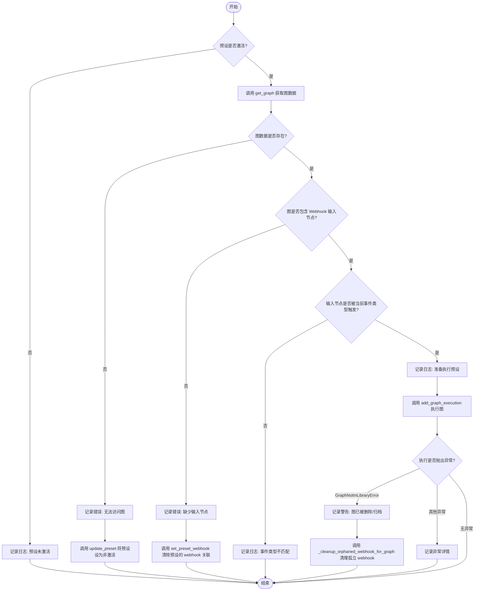

# `AutoGPT\autogpt_platform\backend\backend\api\features\integrations\router.py` 详细设计文档

该文件实现了一个 FastAPI 路由模块，用于管理第三方服务集成。核心功能包括处理 OAuth2 登录流程与回调交换令牌、用户凭证的增删改查、Webhook 事件接收与触发工作流执行（节点和预设）、Ayrshare 社交媒体 SSO 生成，以及集成服务提供商的枚举与发现。

## 整体流程


## 类结构

```
BaseModel (Pydantic)
├── LoginResponse
├── CredentialsMetaResponse
├── CredentialsDeletionResponse
├── CredentialsDeletionNeedsConfirmationResponse
├── AyrshareSSOResponse
└── ProviderEnumResponse
```

## 全局变量及字段


### `logger`
    
用于记录应用日志和调试信息的标准日志记录器实例。

类型：`logging.Logger`
    


### `settings`
    
应用全局配置和设置对象，包含环境变量和系统参数。

类型：`Settings`
    


### `router`
    
FastAPI 的 API 路由器，用于组织和注册集成相关的 API 端点。

类型：`APIRouter`
    


### `creds_manager`
    
集成凭证管理器，负责处理用户凭证的存储、检索和生命周期管理。

类型：`IntegrationCredentialsManager`
    


### `LoginResponse.login_url`
    
OAuth 提供商的登录 URL，用户需重定向至该地址进行授权。

类型：`str`
    


### `LoginResponse.state_token`
    
用于防止 CSRF 攻击的安全随机令牌，同时也用于关联回调请求。

类型：`str`
    


### `CredentialsMetaResponse.id`
    
凭证的唯一标识符。

类型：`str`
    


### `CredentialsMetaResponse.provider`
    
关联的集成服务提供商名称（如 'google', 'github'）。

类型：`str`
    


### `CredentialsMetaResponse.type`
    
凭证的类型，例如 OAuth2 或 API Key。

类型：`CredentialsType`
    


### `CredentialsMetaResponse.title`
    
用户为该凭证设置的显示标题或昵称。

类型：`str | None`
    


### `CredentialsMetaResponse.scopes`
    
该凭证被授予的权限范围列表。

类型：`list[str] | None`
    


### `CredentialsMetaResponse.username`
    
与该凭证关联的用户名（通常用于 OAuth2 凭证）。

类型：`str | None`
    


### `CredentialsMetaResponse.host`
    
特定于主机的凭证匹配模式。

类型：`str | None`
    


### `CredentialsDeletionResponse.deleted`
    
指示凭证已被成功删除的标志。

类型：`Literal[True]`
    


### `CredentialsDeletionResponse.revoked`
    
指示提供商端的访问令牌是否已被撤销，若不适用则为 null。

类型：`bool | None`
    


### `CredentialsDeletionNeedsConfirmationResponse.deleted`
    
指示凭证未被删除的标志。

类型：`Literal[False]`
    


### `CredentialsDeletionNeedsConfirmationResponse.need_confirmation`
    
指示删除操作需要用户进一步确认的标志。

类型：`Literal[True]`
    


### `CredentialsDeletionNeedsConfirmationResponse.message`
    
解释为何需要确认才能删除凭证的详细原因。

类型：`str`
    


### `AyrshareSSOResponse.sso_url`
    
用于 Ayrshare 社交媒体集成的单点登录 (SSO) URL。

类型：`str`
    


### `AyrshareSSOResponse.expires_at`
    
SSO URL 过期的 ISO 8601 格式时间戳。

类型：`datetime`
    


### `ProviderEnumResponse.provider`
    
来自完整提供商列表中的示例提供商名称。

类型：`str`
    
    

## 全局函数及方法


### `login`

该函数用于初始化指定提供商的 OAuth2 认证流程，通过生成安全的随机状态令牌（state token）和代码挑战（code challenge）来构建并返回登录 URL。

参数：

- `provider`: `ProviderName`, 要为其启动 OAuth 流程的提供商名称。
- `user_id`: `str`, 当前认证用户的 ID，通过 FastAPI Security 依赖自动获取。
- `request`: `Request`, FastAPI 的请求对象，用于辅助获取处理器信息。
- `scopes`: `str`, 逗号分隔的授权范围列表，用于指定请求的权限级别。

返回值：`LoginResponse`, 包含用于前端重定向的 `login_url` 和用于防 CSRF 的 `state_token`。

#### 流程图


#### 带注释源码

```python
@router.get("/{provider}/login", summary="Initiate OAuth flow")
async def login(
    provider: Annotated[
        ProviderName, Path(title="The provider to initiate an OAuth flow for")
    ],
    user_id: Annotated[str, Security(get_user_id)],
    request: Request,
    scopes: Annotated[
        str, Query(title="Comma-separated list of authorization scopes")
    ] = "",
) -> LoginResponse:
    # 根据请求和提供商名称获取对应的 OAuth 处理器
    handler = _get_provider_oauth_handler(request, provider)

    # 如果提供了 scopes 参数，将其按逗号分割为列表；否则使用空列表
    requested_scopes = scopes.split(",") if scopes else []

    # 生成并存储一个安全的随机状态令牌（state token）和代码挑战（code challenge）
    # 这对于防止 CSRF 攻击和增强 PKCE 安全流程至关重要
    state_token, code_challenge = await creds_manager.store.store_state_token(
        user_id, provider, requested_scopes
    )
    
    # 利用处理器生成最终的登录 URL，包含请求的 scopes、state token 和 code challenge
    login_url = handler.get_login_url(
        requested_scopes, state_token, code_challenge=code_challenge
    )

    # 返回包含登录 URL 和状态令牌的响应对象
    return LoginResponse(login_url=login_url, state_token=state_token)
```


### `callback`

该函数是 OAuth 2.0 认证流程中的回调处理端点，负责将用户登录后获取的授权码交换为访问令牌。它验证防 CSRF 的 state token，处理权限范围，通过特定提供商的处理器完成令牌交换，并将凭证持久化存储，最后返回凭证的元数据。

参数：

-  `provider`：`ProviderName`，目标 OAuth 提供商的名称。
-  `code`：`str`，用户登录后获得的授权码。
-  `state_token`：`str`，用于防止跨站请求伪造（CSRF）的随机令牌。
-  `user_id`：`str`，当前发起请求的用户 ID。
-  `request`：`Request`，FastAPI 请求对象。

返回值：`CredentialsMetaResponse`，包含新创建凭证的 ID、提供商、类型、标题、权限范围、用户名和主机信息。

#### 流程图


#### 带注释源码

```python
@router.post("/{provider}/callback", summary="Exchange OAuth code for tokens")
async def callback(
    provider: Annotated[
        ProviderName, Path(title="The target provider for this OAuth exchange")
    ],
    code: Annotated[str, Body(title="Authorization code acquired by user login")],
    state_token: Annotated[str, Body(title="Anti-CSRF nonce")],
    user_id: Annotated[str, Security(get_user_id)],
    request: Request,
) -> CredentialsMetaResponse:
    logger.debug(f"Received OAuth callback for provider: {provider}")
    # 获取特定提供商的 OAuth 处理器
    handler = _get_provider_oauth_handler(request, provider)

    # 验证 state token 以防止 CSRF 攻击
    valid_state = await creds_manager.store.verify_state_token(
        user_id, state_token, provider
    )

    if not valid_state:
        logger.warning(f"Invalid or expired state token for user {user_id}")
        raise HTTPException(
            status_code=status.HTTP_400_BAD_REQUEST,
            detail="Invalid or expired state token",
        )
    try:
        scopes = valid_state.scopes
        logger.debug(f"Retrieved scopes from state token: {scopes}")

        # 处理默认的 scopes
        scopes = handler.handle_default_scopes(scopes)

        # 使用授权码交换访问令牌
        credentials = await handler.exchange_code_for_tokens(
            code, scopes, valid_state.code_verifier
        )

        logger.debug(f"Received credentials with final scopes: {credentials.scopes}")

        # 特殊处理：Linear 返回的 scopes 是单个带空格的字符串，需要分割
        # TODO: 在 OAuth 处理器中绕过这部分逻辑
        if len(credentials.scopes) == 1 and " " in credentials.scopes[0]:
            credentials.scopes = credentials.scopes[0].split(" ")

        # 检查授予的权限范围是否满足请求的权限范围
        if not set(scopes).issubset(set(credentials.scopes)):
            # 目前仅记录警告并继续
            logger.warning(
                f"Granted scopes {credentials.scopes} for provider {provider.value} "
                f"do not include all requested scopes {scopes}"
            )

    except Exception as e:
        logger.error(
            f"OAuth2 Code->Token exchange failed for provider {provider.value}: {e}"
        )
        raise HTTPException(
            status_code=status.HTTP_400_BAD_REQUEST,
            detail=f"OAuth2 callback failed to exchange code for tokens: {str(e)}",
        )

    # TODO: 允许指定 `title` 设置在 `credentials` 上
    # 持久化存储凭证
    await creds_manager.create(user_id, credentials)

    logger.debug(
        f"Successfully processed OAuth callback for user {user_id} "
        f"and provider {provider.value}"
    )

    # 返回凭证元数据
    return CredentialsMetaResponse(
        id=credentials.id,
        provider=credentials.provider,
        type=credentials.type,
        title=credentials.title,
        scopes=credentials.scopes,
        username=credentials.username,
        host=(
            credentials.host if isinstance(credentials, HostScopedCredentials) else None
        ),
    )
```


### `list_credentials`

获取当前认证用户的所有凭证，并将其以列表形式返回。

参数：

- `user_id`：`str`，从安全上下文中提取的当前认证用户的唯一标识符。

返回值：`list[CredentialsMetaResponse]`，包含用户所有凭证元数据的列表。

#### 流程图


#### 带注释源码

```python
@router.get("/credentials", summary="List Credentials")
async def list_credentials(
    # 使用 FastAPI 的 Security 依赖注入获取当前用户 ID
    user_id: Annotated[str, Security(get_user_id)],
) -> list[CredentialsMetaResponse]:
    # 从凭证管理器的存储层中获取该用户的所有凭证对象
    credentials = await creds_manager.store.get_all_creds(user_id)

    # 将原始凭证对象转换为 API 响应模型列表
    return [
        CredentialsMetaResponse(
            id=cred.id,
            provider=cred.provider,
            type=cred.type,
            title=cred.title,
            # 仅当凭证是 OAuth2 类型时才包含 scopes
            scopes=cred.scopes if isinstance(cred, OAuth2Credentials) else None,
            # 仅当凭证是 OAuth2 类型时才包含 username
            username=cred.username if isinstance(cred, OAuth2Credentials) else None,
            # 仅当凭证是 HostScoped 类型时才包含 host
            host=cred.host if isinstance(cred, HostScopedCredentials) else None,
        )
        for cred in credentials
    ]
```


### `list_credentials_by_provider`

该函数是一个FastAPI路由处理函数，用于根据指定的提供商（Provider）获取当前用户在该提供商下的所有凭证元数据列表。

参数：

- `provider`: `Annotated[ProviderName, Path(...)]`，目标提供商的名称，通过URL路径参数获取。
- `user_id`: `Annotated[str, Security(get_user_id)]`，当前请求用户的ID，通过FastAPI的Security依赖注入自动获取。

返回值：`list[CredentialsMetaResponse]`，包含特定提供商凭证信息的列表，每个元素包含ID、提供商、类型、标题、权限范围、用户名和主机信息。

#### 流程图


#### 带注释源码

```python
@router.get("/{provider}/credentials")
async def list_credentials_by_provider(
    provider: Annotated[
        ProviderName, Path(title="The provider to list credentials for")
    ],
    user_id: Annotated[str, Security(get_user_id)],
) -> list[CredentialsMetaResponse]:
    # 1. 从凭证管理器的存储层中，根据用户ID和提供商名称获取凭证列表
    credentials = await creds_manager.store.get_creds_by_provider(user_id, provider)

    # 2. 将获取到的凭证模型转换为API响应模型
    return [
        CredentialsMetaResponse(
            id=cred.id,
            provider=cred.provider,
            type=cred.type,
            title=cred.title,
            # 如果凭证是OAuth2类型，则包含权限范围(scopes)信息，否则为None
            scopes=cred.scopes if isinstance(cred, OAuth2Credentials) else None,
            # 如果凭证是OAuth2类型，则包含用户名信息，否则为None
            username=cred.username if isinstance(cred, OAuth2Credentials) else None,
            # 如果凭证是主机范围类型，则包含主机信息，否则为None
            host=cred.host if isinstance(cred, HostScopedCredentials) else None,
        )
        for cred in credentials
    ]
```


### `get_credential`

根据用户ID和凭证ID获取特定凭证，并验证其是否存在以及是否属于指定的提供者。

参数：

-  `provider`：`Annotated[ProviderName, Path(...)]`，要检索凭证的提供者名称
-  `cred_id`：`Annotated[str, Path(...)]`，要检索的凭证的ID
-  `user_id`：`Annotated[str, Security(get_user_id)]`，当前请求用户的ID，通过安全认证获取

返回值：`Credentials`，返回找到的凭证对象详细信息

#### 流程图


#### 带注释源码

```python
@router.get(
    "/{provider}/credentials/{cred_id}", summary="Get Specific Credential By ID"
)
async def get_credential(
    provider: Annotated[
        ProviderName, Path(title="The provider to retrieve credentials for")
    ],
    cred_id: Annotated[str, Path(title="The ID of the credentials to retrieve")],
    user_id: Annotated[str, Security(get_user_id)],
) -> Credentials:
    # 使用凭证管理器根据用户ID和凭证ID获取凭证对象
    credential = await creds_manager.get(user_id, cred_id)
    
    # 如果凭证不存在，抛出404未找到异常
    if not credential:
        raise HTTPException(
            status_code=status.HTTP_404_NOT_FOUND, detail="Credentials not found"
        )
    
    # 检查获取到的凭证提供者是否与路径参数中的提供者一致
    if credential.provider != provider:
        raise HTTPException(
            status_code=status.HTTP_404_NOT_FOUND,
            detail="Credentials do not match the specified provider",
        )
    
    # 返回验证通过的凭证对象
    return credential
```


### `create_credentials`

该函数是一个 FastAPI 端点处理器，用于接收并存储用户提供的特定服务商凭证。它将路径参数中的提供商信息赋值给凭证对象，并通过凭证管理器将其持久化存储。

参数：

-   `user_id`：`str`，通过安全认证获取的当前用户 ID。
-   `provider`：`ProviderName`，路径参数，指定要创建凭证的服务提供商名称。
-   `credentials`：`Credentials`，请求体，包含凭证具体信息的模型对象。

返回值：`Credentials`，返回已创建成功的凭证对象。

#### 流程图


#### 带注释源码

```python
@router.post("/{provider}/credentials", status_code=201, summary="Create Credentials")
async def create_credentials(
    user_id: Annotated[str, Security(get_user_id)],
    provider: Annotated[
        ProviderName, Path(title="The provider to create credentials for")
    ],
    credentials: Credentials,
) -> Credentials:
    # 将 URL 路径中的 provider 参数赋值给 credentials 对象的 provider 属性
    credentials.provider = provider
    
    try:
        # 调用凭证管理器异步存储凭证
        await creds_manager.create(user_id, credentials)
    except Exception as e:
        # 如果存储过程中发生异常，抛出 HTTP 500 错误
        raise HTTPException(
            status_code=status.HTTP_500_INTERNAL_SERVER_ERROR,
            detail=f"Failed to store credentials: {str(e)}",
        )
    
    # 成功后返回凭证对象
    return credentials
```


### `delete_credentials`

删除指定用户的特定凭据。该过程包括验证凭据的存在性及其提供商匹配度，处理关联的 Webhook（如果处于活跃状态可能需要强制删除），并可选地撤销 OAuth 令牌。

参数：

- `request`：`Request`，FastAPI 请求对象。
- `provider`：`ProviderName`，要删除凭据的提供商。
- `cred_id`：`str`，要删除的凭据的 ID。
- `user_id`：`str`，通过身份验证的用户 ID。
- `force`：`bool`，如果关联的 Webhook 仍在使用中，是否继续删除（默认为 False）。

返回值：`CredentialsDeletionResponse | CredentialsDeletionNeedsConfirmationResponse`，如果删除成功，返回包含撤销状态的 `CredentialsDeletionResponse`；如果需要用户确认（例如 Webhook 仍在使用且未强制），返回 `CredentialsDeletionNeedsConfirmationResponse`。

#### 流程图


#### 带注释源码

```python
@router.delete("/{provider}/credentials/{cred_id}")
async def delete_credentials(
    request: Request,
    provider: Annotated[
        ProviderName, Path(title="The provider to delete credentials for")
    ],
    cred_id: Annotated[str, Path(title="The ID of the credentials to retrieve")],
    user_id: Annotated[str, Security(get_user_id)],
    force: Annotated[
        bool, Query(title="Whether to proceed if any linked webhooks are still in use")
    ] = False,
) -> CredentialsDeletionResponse | CredentialsDeletionNeedsConfirmationResponse:
    # 从存储中获取用户指定的凭据
    creds = await creds_manager.store.get_creds_by_id(user_id, cred_id)
    if not creds:
        # 如果凭据不存在，返回 404 错误
        raise HTTPException(
            status_code=status.HTTP_404_NOT_FOUND, detail="Credentials not found"
        )
    if creds.provider != provider:
        # 如果凭据的提供商与路径参数中的提供商不匹配，返回 404 错误
        raise HTTPException(
            status_code=status.HTTP_404_NOT_FOUND,
            detail="Credentials do not match the specified provider",
        )

    try:
        # 尝试移除与该凭据关联的所有 webhook
        # 如果 webhook 正在使用中且 force 为 False，将抛出 NeedConfirmation 异常
        await remove_all_webhooks_for_credentials(user_id, creds, force)
    except NeedConfirmation as e:
        # 如果需要确认（例如有活跃的 webhook），返回需要确认的响应对象
        return CredentialsDeletionNeedsConfirmationResponse(message=str(e))

    # 从凭据管理器中删除凭据
    await creds_manager.delete(user_id, cred_id)

    tokens_revoked = None
    # 如果凭据是 OAuth2 类型，尝试在提供商端撤销令牌
    if isinstance(creds, OAuth2Credentials):
        handler = _get_provider_oauth_handler(request, provider)
        tokens_revoked = await handler.revoke_tokens(creds)

    # 返回删除成功的响应，包含令牌是否被撤销的状态
    return CredentialsDeletionResponse(revoked=tokens_revoked)
```


### `webhook_ingress_generic`

该函数是处理外部提供商（如 GitHub, Slack 等）传入 Webhook 请求的通用入口点。它负责验证请求载荷，将其转换为内部事件模型进行发布，并根据 Webhook 的配置异步触发关联的图节点或预设的执行。

参数：

- `request`：`Request`，包含 headers 和 body 的传入 HTTP 请求对象。
- `provider`：`ProviderName`，发起 Webhook 的提供商名称（从 URL 路径中提取）。
- `webhook_id`：`str`，系统中该 Webhook 资源的唯一标识符。

返回值：`None`，无直接返回值，成功时 FastAPI 默认返回 HTTP 200 OK 状态码。

#### 流程图


#### 带注释源码

```python
@router.post("/{provider}/webhooks/{webhook_id}/ingress")
async def webhook_ingress_generic(
    request: Request,
    provider: Annotated[
        ProviderName, Path(title="Provider where the webhook was registered")
    ],
    webhook_id: Annotated[str, Path(title="Our ID for the webhook")],
):
    # 记录接收到 Webhook 请求的日志，用于调试和追踪
    logger.debug(f"Received {provider.value} webhook ingress for ID {webhook_id}")
    
    # 根据提供商名称获取对应的 Webhook 管理器，用于处理特定于提供商的逻辑（如签名验证）
    webhook_manager = get_webhook_manager(provider)
    
    try:
        # 从数据库中获取 Webhook 的详细信息，包含关联的节点和预设
        webhook = await get_webhook(webhook_id, include_relations=True)
        user_id = webhook.user_id
        
        # 如果 Webhook 配置了凭证 ID，则获取对应的用户凭证（用于验证签名）
        credentials = (
            await creds_manager.get(user_id, webhook.credentials_id)
            if webhook.credentials_id
            else None
        )
    except NotFoundError as e:
        # 如果找不到对应的 Webhook 记录，记录警告并返回 404 错误
        logger.warning(f"Webhook payload received for unknown webhook #{webhook_id}")
        raise HTTPException(status_code=status.HTTP_404_NOT_FOUND, detail=str(e))
    
    logger.debug(f"Webhook #{webhook_id}: {webhook}")
    
    # 使用管理器验证请求载荷（检查签名、格式等），并提取事件类型和标准化后的载荷
    payload, event_type = await webhook_manager.validate_payload(
        webhook, request, credentials
    )
    
    logger.debug(
        f"Validated {provider.value} {webhook.webhook_type} {event_type} event "
        f"with payload {payload}"
    )

    # 构造内部 Webhook 事件对象
    webhook_event = WebhookEvent(
        provider=provider,
        webhook_id=webhook_id,
        event_type=event_type,
        payload=payload,
    )
    
    # 将事件发布到消息队列或事件总线，供其他服务或监听者消费
    await publish_webhook_event(webhook_event)
    logger.debug(f"Webhook event published: {webhook_event}")

    # 检查该 Webhook 是否配置了触发器（节点或预设）
    if not (webhook.triggered_nodes or webhook.triggered_presets):
        return

    # 如果这是用户首次成功触发 Webhook，标记相应的引导步骤为已完成
    await complete_onboarding_step(user_id, OnboardingStep.TRIGGER_WEBHOOK)

    # 准备并发执行所有触发任务以提高性能
    tasks = []
    
    # 为所有关联的节点添加异步执行任务
    tasks.extend(
        _execute_webhook_node_trigger(node, webhook, webhook_id, event_type, payload)
        for node in webhook.triggered_nodes
    )
    
    # 为所有关联的预设添加异步执行任务
    tasks.extend(
        _execute_webhook_preset_trigger(
            preset, webhook, webhook_id, event_type, payload
        )
        for preset in webhook.triggered_presets
    )

    # 如果存在任务，则并发执行它们
    # 使用 return_exceptions=True 确保单个任务的失败不会中断其他任务的执行
    if tasks:
        await asyncio.gather(*tasks, return_exceptions=True)
```


### `webhook_ping`

用于测试指定 Webhook 连通性的端点。它通过触发一个 ping 事件并等待系统确认收到该事件，来验证 Webhook 是否正常工作。

参数：

-  `webhook_id`：`str`，要进行连通性测试的 Webhook 的内部 ID。
-  `user_id`：`str`，当前发起请求的已认证用户 ID。

返回值：`bool`，如果 Webhook 成功触发并收到 ping 事件则返回 `True`；如果该功能未实现则返回 `False`；如果超时则抛出异常。

#### 流程图

```mermaid
flowchart TD
    A[开始: webhook_ping] --> B[根据 webhook_id 获取 Webhook 信息]
    B --> C[获取对应 Provider 的 WebhookManager]
    C --> D[尝试获取关联的 Credentials]
    D --> E[调用 webhook_manager.trigger_ping]
    E --> F{触发是否抛出 NotImplementedError?}
    F -- 是 --> G[返回 False]
    F -- 否 --> H[等待 'ping' 事件 (超时 10秒)]
    H --> I{是否收到事件?}
    I -- 否 (超时) --> J[抛出 HTTPException: 504 Gateway Timeout]
    I -- 是 --> K[返回 True]
```

#### 带注释源码

```python
@router.post("/webhooks/{webhook_id}/ping")
async def webhook_ping(
    webhook_id: Annotated[str, Path(title="Our ID for the webhook")],
    user_id: Annotated[str, Security(get_user_id)],  # require auth
):
    # 根据 ID 获取 webhook 配置信息
    webhook = await get_webhook(webhook_id)
    # 获取该 webhook 对应的 provider 的管理器，用于执行 provider 相关的操作
    webhook_manager = get_webhook_manager(webhook.provider)

    # 如果 webhook 配置中包含凭证 ID，则获取用户的凭证信息
    credentials = (
        await creds_manager.get(user_id, webhook.credentials_id)
        if webhook.credentials_id
        else None
    )
    try:
        # 尝试通过 provider 的管理器触发一个 ping 请求
        await webhook_manager.trigger_ping(webhook, credentials)
    except NotImplementedError:
        # 如果该 provider 不支持 ping 操作，直接返回 False
        return False

    # 等待系统内部捕获并发布由该 ping 触发的事件
    # 超时时间设置为 10 秒
    if not await wait_for_webhook_event(webhook_id, event_type="ping", timeout=10):
        # 如果在超时时间内未收到事件，抛出 504 网关超时异常
        raise HTTPException(
            status_code=status.HTTP_504_GATEWAY_TIMEOUT, detail="Webhook ping timed out"
        )

    # 成功收到事件，返回 True
    return True
```


### `_execute_webhook_node_trigger`

该函数负责处理由Webhook事件触发的特定节点的执行逻辑。它首先验证传入的节点是否配置为响应当前的事件类型，如果验证通过，则尝试启动关联图的执行。如果遇到图不存在于库中的错误，它会触发清理逻辑以移除失效的Webhook钩子。

参数：

- `node`：`NodeModel`，代表被Webhook触发的图节点模型，包含图ID和版本信息。
- `webhook`：`WebhookWithRelations`，包含Webhook及其关联信息（如用户ID）的对象。
- `webhook_id`：`str`，触发该执行的Webhook的唯一标识符。
- `event_type`：`str`，从Webhook事件中提取的具体事件类型（如 `issue_created`）。
- `payload`：`dict`，Webhook携带的原始负载数据，将作为输入传递给图节点。

返回值：`None`，该函数为异步执行，无直接返回值，主要产生副作用（触发图执行或日志记录）。

#### 流程图


#### 带注释源码

```python
async def _execute_webhook_node_trigger(
    node: NodeModel,
    webhook: WebhookWithRelations,
    webhook_id: str,
    event_type: str,
    payload: dict,
) -> None:
    """Execute a webhook-triggered node."""
    # 记录正在处理的节点信息，便于调试追踪
    logger.debug(f"Webhook-attached node: {node}")
    
    # 检查节点配置是否包含对当前事件类型的监听
    if not node.is_triggered_by_event_type(event_type):
        logger.debug(f"Node #{node.id} doesn't trigger on event {event_type}")
        return
    
    # 记录正在执行的图和节点ID
    logger.debug(f"Executing graph #{node.graph_id} node #{node.id}")
    
    try:
        # 调用执行器工具，添加图执行任务
        # 将 payload 作为输入传递给特定的节点 ID
        await add_graph_execution(
            user_id=webhook.user_id,
            graph_id=node.graph_id,
            graph_version=node.graph_version,
            nodes_input_masks={node.id: {"payload": payload}},
        )
    except GraphNotInLibraryError as e:
        # 捕获图已删除或归档的异常
        logger.warning(
            f"Webhook #{webhook_id} execution blocked for "
            f"deleted/archived graph #{node.graph_id} (node #{node.id}): {e}"
        )
        # 清理与已删除图关联的孤立 Webhook 触发器
        await _cleanup_orphaned_webhook_for_graph(
            node.graph_id, webhook.user_id, webhook_id
        )
    except Exception:
        # 捕获其他未知异常，记录错误堆栈
        # 确保单个节点的失败不会中断整个 Webhook 处理流程的鲁棒性
        logger.exception(
            f"Failed to execute graph #{node.graph_id} via webhook #{webhook_id}"
        )
        # Continue processing - webhook should be resilient to individual failures
```


### `_execute_webhook_preset_trigger`

该函数用于处理由 webhook 事件触发的预设代理执行逻辑。它负责验证预设的激活状态、获取关联的图结构、检查触发条件，并最终异步启动图的执行，同时包含完善的错误处理和清理机制。

参数：

-  `preset`：`LibraryAgentPreset`，包含待执行的代理预设配置信息，如图 ID、版本、输入参数等。
-  `webhook`：`WebhookWithRelations`，包含触发该预设的 webhook 详细信息及其关联关系（如用户 ID）。
-  `webhook_id`：`str`，触发操作的 webhook 唯一标识符，主要用于日志记录和后续的清理操作。
-  `event_type`：`str`，webhook 事件的类型，用于判断是否满足预设的触发条件。
-  `payload`：`dict`，webhook 事件携带的具体数据载荷，将作为输入传递给图执行流程。

返回值：`None`，无返回值。

#### 流程图



#### 带注释源码

```python
async def _execute_webhook_preset_trigger(
    preset: LibraryAgentPreset,
    webhook: WebhookWithRelations,
    webhook_id: str,
    event_type: str,
    payload: dict,
) -> None:
    """Execute a webhook-triggered preset."""
    logger.debug(f"Webhook-attached preset: {preset}")
    
    # 1. 检查预设是否处于激活状态，如果未激活则直接返回
    if not preset.is_active:
        logger.debug(f"Preset #{preset.id} is inactive")
        return

    # 2. 尝试获取预设对应的图数据
    graph = await get_graph(
        preset.graph_id, preset.graph_version, user_id=webhook.user_id
    )
    
    # 3. 如果图不存在（可能被删除或无权访问），停用预设并返回
    if not graph:
        logger.error(
            f"User #{webhook.user_id} has preset #{preset.id} for graph "
            f"#{preset.graph_id} v{preset.graph_version}, "
            "but no access to the graph itself."
        )
        logger.info(f"Automatically deactivating broken preset #{preset.id}")
        await update_preset(preset.user_id, preset.id, is_active=False)
        return
    
    # 4. 检查图中是否有配置的 Webhook 输入节点
    if not (trigger_node := graph.webhook_input_node):
        # NOTE: this should NEVER happen, but we log and handle it gracefully
        logger.error(
            f"Preset #{preset.id} is triggered by webhook #{webhook.id}, but graph "
            f"#{preset.graph_id} v{preset.graph_version} has no webhook input node"
        )
        # 清理预设上无效的 webhook 关联
        await set_preset_webhook(preset.user_id, preset.id, None)
        return
    
    # 5. 检查输入节点配置的触发条件是否与当前事件类型匹配
    if not trigger_node.block.is_triggered_by_event_type(preset.inputs, event_type):
        logger.debug(f"Preset #{preset.id} doesn't trigger on event {event_type}")
        return
    
    logger.debug(f"Executing preset #{preset.id} for webhook #{webhook.id}")

    try:
        # 6. 执行图：将预设配置、凭证和 webhook payload 合并作为输入
        await add_graph_execution(
            user_id=webhook.user_id,
            graph_id=preset.graph_id,
            preset_id=preset.id,
            graph_version=preset.graph_version,
            graph_credentials_inputs=preset.credentials,
            nodes_input_masks={trigger_node.id: {**preset.inputs, "payload": payload}},
        )
    except GraphNotInLibraryError as e:
        # 7. 异常处理：如果图不在库中（被删除或归档），记录警告并清理孤立的 webhook 触发器
        logger.warning(
            f"Webhook #{webhook_id} execution blocked for "
            f"deleted/archived graph #{preset.graph_id} (preset #{preset.id}): {e}"
        )
        # Clean up orphaned webhook trigger for this graph
        await _cleanup_orphaned_webhook_for_graph(
            preset.graph_id, webhook.user_id, webhook_id
        )
    except Exception:
        # 8. 异常处理：捕获其他所有异常，记录错误但不中断整个 webhook 处理流程（保证弹性）
        logger.exception(
            f"Failed to execute preset #{preset.id} via webhook #{webhook_id}"
        )
        # Continue processing - webhook should be resilient to individual failures
```


### `remove_all_webhooks_for_credentials`

移除并注销使用给定凭据注册的所有 Webhook。该函数会首先检查这些 Webhook 是否仍被节点或预设使用，如果在使用中且未开启强制模式，则抛出异常。若通过检查，则解除节点与预设的关联，并尝试在服务提供商端修剪（删除）这些 Webhook。

参数：

-  `user_id`：`str`，拥有凭据和 Webhook 的用户 ID。
-  `credentials`：`Credentials`，需要移除其关联 Webhook 的凭据对象。
-  `force`：`bool`，如果任何 Webhook 仍处于活动状态（被触发），是否继续执行移除操作。默认为 False。

返回值：`None`，无返回值。

#### 流程图


#### 带注释源码

```python
async def remove_all_webhooks_for_credentials(
    user_id: str, credentials: Credentials, force: bool = False
) -> None:
    """
    Remove and deregister all webhooks that were registered using the given credentials.

    Params:
        user_id: The ID of the user who owns the credentials and webhooks.
        credentials: The credentials for which to remove the associated webhooks.
        force: Whether to proceed if any of the webhooks are still in use.

    Raises:
        NeedConfirmation: If any of the webhooks are still in use and `force` is `False`
    """
    # 获取与指定凭据 ID 关联的所有 Webhook，包含其关联的节点和预设信息
    webhooks = await get_all_webhooks_by_creds(
        user_id, credentials.id, include_relations=True
    )
    
    # 检查是否存在仍在使用的 Webhook（即有关联的节点或预设）
    # 如果存在活跃 Webhook 且未开启强制模式，则抛出 NeedConfirmation 异常
    if any(w.triggered_nodes or w.triggered_presets for w in webhooks) and not force:
        raise NeedConfirmation(
            "Some webhooks linked to these credentials are still in use by an agent"
        )
    
    # 遍历所有需要移除的 Webhook
    for webhook in webhooks:
        # 解除所有关联节点与该 Webhook 的绑定
        for node in webhook.triggered_nodes:
            await set_node_webhook(node.id, None)
        
        # 解除所有关联预设与该 Webhook 的绑定
        for preset in webhook.triggered_presets:
            await set_preset_webhook(user_id, preset.id, None)

        # 获取对应服务提供商的 Webhook 管理器
        webhook_manager = get_webhook_manager(ProviderName(credentials.provider))
        
        # 尝试在提供商端修剪（删除）已无本地关联的 Webhook
        success = await webhook_manager.prune_webhook_if_dangling(
            user_id, webhook.id, credentials
        )
        
        # 如果修剪失败，记录警告日志
        if not success:
            logger.warning(f"Webhook #{webhook.id} failed to prune")
```


### `_cleanup_orphaned_webhook_for_graph`

清理当图执行失败（例如图被删除或存档）时的孤儿 webhook 连接。该函数会移除指定 webhook 中与特定图 ID 关联的节点和预设触发器，并在 webhook 无任何剩余触发器时尝试将其剪枝（删除）。

参数：

- `graph_id`：`str`，导致执行失败的已删除或归档的图的 ID。
- `user_id`：`str`，拥有该 webhook 的用户 ID。
- `webhook_id`：`str`，需要清理的 webhook ID。

返回值：`None`，无返回值。

#### 流程图


#### 带注释源码

```python
async def _cleanup_orphaned_webhook_for_graph(
    graph_id: str, user_id: str, webhook_id: str
) -> None:
    """
    Clean up orphaned webhook connections for a specific graph when execution fails with GraphNotAccessibleError.
    This happens when an agent is pulled from the Marketplace or deleted
    but webhook triggers still exist.
    """
    try:
        # 1. 获取 webhook 详情，验证其是否存在且属于该用户
        webhook = await get_webhook(webhook_id, include_relations=True)
        if not webhook or webhook.user_id != user_id:
            logger.warning(
                f"Webhook {webhook_id} not found or doesn't belong to user {user_id}"
            )
            return

        nodes_removed = 0
        presets_removed = 0

        # 2. 遍历并移除属于该图（graph_id）的节点触发器
        for node in webhook.triggered_nodes:
            if node.graph_id == graph_id:
                try:
                    # 将节点的 webhook_id 设置为 None，解除关联
                    await set_node_webhook(node.id, None)
                    nodes_removed += 1
                    logger.info(
                        f"Removed orphaned webhook trigger from node {node.id} "
                        f"in deleted/archived graph {graph_id}"
                    )
                except Exception:
                    logger.exception(
                        f"Failed to remove webhook trigger from node {node.id}"
                    )

        # 3. 遍历并移除属于该图（graph_id）的预设触发器
        for preset in webhook.triggered_presets:
            if preset.graph_id == graph_id:
                try:
                    # 将预设的 webhook_id 设置为 None，解除关联
                    await set_preset_webhook(user_id, preset.id, None)
                    presets_removed += 1
                    logger.info(
                        f"Removed orphaned webhook trigger from preset {preset.id} "
                        f"for deleted/archived graph {graph_id}"
                    )
                except Exception:
                    logger.exception(
                        f"Failed to remove webhook trigger from preset {preset.id}"
                    )

        # 4. 如果有移除任何触发器，检查该 webhook 是否还有其他触发器
        if nodes_removed > 0 or presets_removed > 0:
            logger.info(
                f"Cleaned up orphaned webhook #{webhook_id}: "
                f"removed {nodes_removed} nodes and {presets_removed} presets "
                f"for deleted/archived graph #{graph_id}"
            )

            # 重新获取 webhook 以获取最新状态
            updated_webhook = await get_webhook(webhook_id, include_relations=True)
            
            # 如果 webhook 没有任何剩余的触发器，则尝试剪枝（物理删除）
            if (
                not updated_webhook.triggered_nodes
                and not updated_webhook.triggered_presets
            ):
                try:
                    webhook_manager = get_webhook_manager(
                        ProviderName(webhook.provider)
                    )
                    credentials = (
                        await creds_manager.get(user_id, webhook.credentials_id)
                        if webhook.credentials_id
                        else None
                    )
                    # 调用 provider 的逻辑删除远程 webhook
                    success = await webhook_manager.prune_webhook_if_dangling(
                        user_id, webhook.id, credentials
                    )
                    if success:
                        logger.info(
                            f"Pruned orphaned webhook #{webhook_id} "
                            f"with no remaining triggers"
                        )
                    else:
                        logger.warning(
                            f"Failed to prune orphaned webhook #{webhook_id}"
                        )
                except Exception:
                    logger.exception(f"Failed to prune orphaned webhook #{webhook_id}")

    except Exception:
        # 捕获所有未处理的异常并记录，防止主流程崩溃
        logger.exception(
            f"Failed to cleanup orphaned webhook #{webhook_id} for graph #{graph_id}"
        )
```


### `_get_provider_oauth_handler`

根据给定的提供程序名称获取并初始化对应的OAuth处理器。该函数负责加载相关的区块以支持SDK提供程序，从环境变量或系统配置中检索必要的客户端凭据（ID和Secret），并验证配置是否完整，最终返回一个配置好的OAuth处理器实例以用于处理认证流程。

参数：

-  `req`：`Request`，FastAPI的请求对象（当前函数体内部未直接使用，保留用于接口一致性）。
-  `provider_name`：`ProviderName`，目标OAuth提供程序的名称标识。

返回值：`"BaseOAuthHandler"`，初始化完成的OAuth处理器实例，包含客户端ID、密钥及回调地址。

#### 流程图


#### 带注释源码

```python
def _get_provider_oauth_handler(
    req: Request, provider_name: ProviderName
) -> "BaseOAuthHandler":
    # 1. 确保区块已加载，以便SDK提供程序可用
    try:
        from backend.blocks import load_all_blocks

        load_all_blocks()  # 这会被缓存，所以只运行一次
    except Exception as e:
        logger.warning(f"Failed to load blocks: {e}")

    # 2. 将provider_name转换为字符串以进行查找
    provider_key = (
        provider_name.value if hasattr(provider_name, "value") else str(provider_name)
    )

    # 3. 检查提供程序是否支持OAuth
    if provider_key not in HANDLERS_BY_NAME:
        raise HTTPException(
            status_code=status.HTTP_404_NOT_FOUND,
            detail=f"Provider '{provider_key}' does not support OAuth",
        )

    # 4. 检查此提供程序是否有自定义的OAuth凭据（通常用于SDK提供程序）
    oauth_credentials = CREDENTIALS_BY_PROVIDER.get(provider_key)

    if oauth_credentials and not oauth_credentials.use_secrets:
        # 5a. 使用自定义环境变量的SDK提供程序
        import os

        client_id = (
            os.getenv(oauth_credentials.client_id_env_var)
            if oauth_credentials.client_id_env_var
            else None
        )
        client_secret = (
            os.getenv(oauth_credentials.client_secret_env_var)
            if oauth_credentials.client_secret_env_var
            else None
        )
    else:
        # 5b. 使用settings.secrets的原始提供程序
        client_id = getattr(settings.secrets, f"{provider_name.value}_client_id", None)
        client_secret = getattr(
            settings.secrets, f"{provider_name.value}_client_secret", None
        )

    # 6. 验证凭据是否存在
    if not (client_id and client_secret):
        logger.error(
            f"Attempt to use unconfigured {provider_name.value} OAuth integration"
        )
        raise HTTPException(
            status_code=status.HTTP_501_NOT_IMPLEMENTED,
            detail={
                "message": f"Integration with provider '{provider_name.value}' is not configured.",
                "hint": "Set client ID and secret in the application's deployment environment",
            },
        )

    # 7. 获取处理程序类并配置重定向URI
    handler_class = HANDLERS_BY_NAME[provider_key]
    frontend_base_url = settings.config.frontend_base_url

    if not frontend_base_url:
        raise HTTPException(
            status_code=status.HTTP_500_INTERNAL_SERVER_ERROR,
            detail="Frontend base URL is not configured",
        )

    # 8. 实例化并返回处理器
    return handler_class(
        client_id=client_id,
        client_secret=client_secret,
        redirect_uri=f"{frontend_base_url}/auth/integrations/oauth_callback",
    )
```


### `get_ayrshare_sso_url`

为Ayrshare社交媒体集成生成SSO URL。该函数负责检查用户是否已存在Ayrshare配置文件，如果不存在则创建一个新的配置文件并保存凭证。随后，它利用生成的配置文件密钥和系统私钥生成一个包含特定社交平台权限的JWT令牌，并返回用于单点登录的URL及其过期时间。

参数：

-  `user_id`：`Annotated[str, Security(get_user_id)]`，当前发起请求的用户ID，用于检索用户的集成信息和凭证。

返回值：`AyrshareSSOResponse`，包含生成的SSO登录链接（`sso_url`）和该链接的过期时间戳（`expires_at`）。

#### 流程图


#### 带注释源码

```python
@router.get("/ayrshare/sso_url")
async def get_ayrshare_sso_url(
    user_id: Annotated[str, Security(get_user_id)],
) -> AyrshareSSOResponse:
    """
    Generate an SSO URL for Ayrshare social media integration.

    Returns:
        dict: Contains the SSO URL for Ayrshare integration
    """
    # 尝试初始化 Ayrshare 客户端
    try:
        client = AyrshareClient()
    except MissingConfigError:
        # 如果配置缺失（如API Key未设置），抛出500错误
        raise HTTPException(
            status_code=HTTP_500_INTERNAL_SERVER_ERROR,
            detail="Ayrshare integration is not configured",
        )

    # 获取用户的集成信息，查找是否已有 Ayrshare profile key
    user_integrations: UserIntegrations = await get_user_integrations(user_id)
    profile_key = user_integrations.managed_credentials.ayrshare_profile_key

    # 如果用户没有 profile key，则创建一个新的 Ayrshare profile
    if not profile_key:
        logger.debug(f"Creating new Ayrshare profile for user {user_id}")
        try:
            profile = await client.create_profile(
                title=f"User {user_id}", messaging_active=True
            )
            # 获取新创建的 profile key
            profile_key = profile.profileKey
            # 将 profile key 存储到用户的凭证库中以便后续复用
            await creds_manager.store.set_ayrshare_profile_key(user_id, profile_key)
        except Exception as e:
            logger.error(f"Error creating Ayrshare profile for user {user_id}: {e}")
            raise HTTPException(
                status_code=HTTP_502_BAD_GATEWAY,
                detail="Failed to create Ayrshare profile",
            )
    else:
        logger.debug(f"Using existing Ayrshare profile for user {user_id}")

    # 处理 profile_key 类型（如果是 SecretStr 则获取其值）
    profile_key_str = (
        profile_key.get_secret_value()
        if isinstance(profile_key, SecretStr)
        else str(profile_key)
    )

    # 获取用于签名的私钥
    private_key = settings.secrets.ayrshare_jwt_key
    # 设置 JWT 的最大有效期为 48 小时 (2880 分钟)
    max_expiry_minutes = 2880
    
    try:
        logger.debug(f"Generating Ayrshare JWT for user {user_id}")
        # 生成 JWT 令牌，并指定允许的社交平台
        jwt_response = await client.generate_jwt(
            private_key=private_key,
            profile_key=profile_key_str,
            allowed_social=[
                # 逐步启用平台以加快开发速度
                # SocialPlatform.FACEBOOK,
                SocialPlatform.TWITTER,
                SocialPlatform.LINKEDIN,
                SocialPlatform.INSTAGRAM,
                SocialPlatform.YOUTUBE,
                # SocialPlatform.REDDIT,
                # SocialPlatform.TELEGRAM,
                # SocialPlatform.GOOGLE_MY_BUSINESS,
                # SocialPlatform.PINTEREST,
                SocialPlatform.TIKTOK,
                # SocialPlatform.BLUESKY,
                # SocialPlatform.SNAPCHAT,
                # SocialPlatform.THREADS,
            ],
            expires_in=max_expiry_minutes,
            verify=True,
        )
    except Exception as e:
        logger.error(f"Error generating Ayrshare JWT for user {user_id}: {e}")
        raise HTTPException(
            status_code=HTTP_502_BAD_GATEWAY, detail="Failed to generate JWT"
        )

    # 计算过期时间戳（UTC时间）
    expires_at = datetime.now(timezone.utc) + timedelta(minutes=max_expiry_minutes)
    # 返回包含 SSO URL 和过期时间的响应对象
    return AyrshareSSOResponse(sso_url=jwt_response.url, expires_at=expires_at)
```


### `list_providers`

获取所有可用提供程序名称的列表。该列表包括静态定义的提供程序（来自 ProviderName 枚举）和通过 SDK 装饰器动态注册的提供程序。

参数：

- 无参数

返回值：`List[str]`，包含所有可用提供程序名称的列表。

#### 流程图


#### 带注释源码

```python
@router.get("/providers", response_model=List[str])
async def list_providers() -> List[str]:
    """
    Get a list of all available provider names.

    Returns both statically defined providers (from ProviderName enum)
    and dynamically registered providers (from SDK decorators).

    Note: The complete list of provider names is also available as a constant
    in the generated TypeScript client via PROVIDER_NAMES.
    """
    # Get all providers at runtime
    # 在运行时获取所有提供程序名称（包括静态定义和动态注册的）
    all_providers = get_all_provider_names()
    return all_providers
```


### `list_system_providers`

Get a list of providers that have platform credits (system credentials) available. These providers can be used without the user providing their own API keys.

参数：

-  无

返回值：`List[str]`，包含具有平台信用（系统凭证）的提供商名称的列表。

#### 流程图


#### 带注释源码

```python
@router.get("/providers/system", response_model=List[str])
async def list_system_providers() -> List[str]:
    """
    Get a list of providers that have platform credits (system credentials) available.

    These providers can be used without the user providing their own API keys.
    """
    # 导入存储系统凭证提供商的常量
    from backend.integrations.credentials_store import SYSTEM_PROVIDERS

    # 将系统提供商集合转换为列表并返回
    return list(SYSTEM_PROVIDERS)
```


### `get_provider_names`

该函数是一个 FastAPI 端点，用于获取所有提供商名称的结构化格式。其主要目的是将提供商名称暴露在 OpenAPI 模式中，以便代码生成器（如 Orval）能够生成相应的 TypeScript 常量。

参数：

*   无

返回值：`ProviderNamesResponse`，包含所有可用提供商名称的结构化响应对象。

#### 流程图


#### 带注释源码

```python
@router.get("/providers/names", response_model=ProviderNamesResponse)
async def get_provider_names() -> ProviderNamesResponse:
    """
    获取所有提供商名称的结构化格式。

    此端点专门设计用于在 OpenAPI 模式中公开提供商名称，
    以便像 Orval 这样的代码生成器可以创建适当的 TypeScript 常量。
    """
    # 直接实例化并返回响应模型
    # ProviderNamesResponse 的定义中已包含了所有提供商的名称逻辑
    return ProviderNamesResponse()
```


### `get_provider_constants`

获取提供商名称常量的API端点，该函数实例化并返回一个包含所有可用提供商名称的响应模型，主要用于OpenAPI规范生成，以便前端代码生成工具（如Orval）能够创建对应的TypeScript常量。

参数：

-  无参数

返回值：`ProviderConstants`，包含提供商名称作为常量的响应模型对象，用于代码生成。

#### 流程图


#### 带注释源码

```python
@router.get("/providers/constants", response_model=ProviderConstants)
async def get_provider_constants() -> ProviderConstants:
    """
    Get provider names as constants.

    This endpoint returns a model with provider names as constants,
    specifically designed for OpenAPI code generation tools to create
    TypeScript constants.
    """
    # 实例化并返回 ProviderConstants 模型，
    # 该模型内部包含了所有提供商的名称定义
    return ProviderConstants()
```


### `get_provider_enum_example`

该端点是一个示例接口，旨在通过返回包含提供商枚举值的响应，强制将 `CompleteProviderNames` 枚举类型包含在 OpenAPI 模式中，以确保 Orval 等客户端代码生成工具能够生成对应的 TypeScript 枚举或常量。

参数：
- 无

返回值：`ProviderEnumResponse`，包含一个示例提供商名称的响应对象，用于展示枚举结构。

#### 流程图

```mermaid
flowchart TD
    Start([开始]) --> GetProviders[调用 get_all_provider_names 获取提供商列表]
    GetProviders --> CheckList{列表是否为空?}
    CheckList -- 是 --> SetDefault[设置 provider 为 'openai']
    CheckList -- 否 --> SetFirst[设置 provider 为 all_providers[0]]
    SetDefault --> CreateResponse[实例化 ProviderEnumResponse]
    SetFirst --> CreateResponse
    CreateResponse --> End([返回 ProviderEnumResponse 对象])
```

#### 带注释源码

```python
@router.get("/providers/enum-example", response_model=ProviderEnumResponse)
async def get_provider_enum_example() -> ProviderEnumResponse:
    """
    Example endpoint that uses the CompleteProviderNames enum.

    This endpoint exists to ensure that the CompleteProviderNames enum is included
    in the OpenAPI schema, which will cause Orval to generate it as a
    TypeScript enum/constant.
    """
    # 获取所有可用的提供商名称列表
    all_providers = get_all_provider_names()
    
    # 返回一个响应对象，如果列表不为空则取第一个，否则默认返回 "openai"
    # 这样做是为了在 OpenAPI 规范中暴露枚举类型
    return ProviderEnumResponse(
        provider=all_providers[0] if all_providers else "openai"
    )
```


## 关键组件


### OAuth 流程管理
管理 OAuth2 认证流程，包括初始化登录请求、生成状态令牌、处理回调交换授权码为令牌，以及在删除凭证时撤销令牌。

### 凭证管理接口
提供用于存储、检索、列出和删除用户凭证（OAuth 和 API 密钥）的 API 端点，与底层的 IntegrationCredentialsManager 交互。

### Webhook 接入与分发
处理来自外部提供商的入站 Webhook 请求，通过 WebhookManager 验证签名和负载，将事件发布到事件总线，并触发关联的执行任务。

### 执行触发逻辑
编排由 Webhook 事件触发的图或预设的执行，包括检查事件类型匹配性、处理输入掩码以及通过 add_graph_execution 调度执行。

### 提供程序发现服务
向客户端暴露可用的集成提供商，区分标准提供商和具有平台凭证（系统凭证）的提供商，并生成用于客户端使用的常量。

### Ayrshare SSO 集成
处理 Ayrshare 提供商的具体逻辑，包括用户配置文件管理、使用私钥生成用于社交登录的 JWT 以及创建 SSO URL。

### Webhook 生命周期管理
管理 Webhook 连接的健康状况，包括在图被删除时清理孤立触发器，以及当关联凭证被移除时修剪未使用的 Webhook。


## 问题及建议


### 已知问题

-   **OAuth回调中存在特定提供商的硬编码逻辑**：在`callback`函数中，针对Linear提供商的Scope处理使用了硬编码的字符串分割逻辑（`if len(credentials.scopes) == 1 and " " in credentials.scopes[0]`），这违反了通用处理原则，代码中也标记了TODO。
-   **配置管理策略不统一**：在`_get_provider_oauth_handler`函数中，同时处理了基于环境变量（`os.getenv`）和基于Settings对象（`settings.secrets`）的两种配置获取方式，导致逻辑复杂且不易维护。
-   **Ayrshare业务逻辑耦合在路由层**：`get_ayrshare_sso_url`函数中包含了创建Ayrshare Profile、生成JWT等复杂的业务逻辑，这些逻辑应当被封装在专门的服务层，而非直接写在API路由处理函数中。
-   **凭据创建时缺少标题指定**：代码中标记了`# TODO: Allow specifying 'title' to set on 'credentials'`，当前在创建凭据时无法由用户指定有意义的标题，可能导致凭据管理困难。
-   **Webhook触发异常处理过于宽泛**：在`webhook_ingress_generic`中使用`asyncio.gather(..., return_exceptions=True)`执行触发任务，虽然保证了整体流程不中断，但忽略了具体任务的异常细节，可能导致某些自动化任务静默失败。
-   **代码中包含大量注释掉的代码**：在`get_ayrshare_sso_url`中存在大量被注释掉的社交平台列表，增加了代码阅读成本，应当移除或通过配置管理。

### 优化建议

-   **引入服务层解耦业务逻辑**：建议将Webhook的执行逻辑（`_execute_webhook_node_trigger`等）和Ayrshare的业务处理逻辑抽取到独立的服务类（如`WebhookService`、`AyrshareService`）中，使路由层仅负责HTTP请求与响应的转换。
-   **实现OAuth处理的策略模式**：针对不同OAuth提供商的特殊处理（如Linear的Scope处理），建议在各自的Handler类中实现统一的接口方法（如`normalize_scopes`），消除路由层的条件判断。
-   **增强Webhook处理的幂等性**：在`webhook_ingress_generic`中增加对已处理事件的去重检查（例如基于事件ID或时间戳），防止因网络重试等原因导致的重复执行。
-   **统一依赖注入与配置管理**：利用FastAPI的`Depends`机制注入`creds_manager`和配置对象，而不是直接使用全局变量。同时统一配置来源，建议在应用启动时加载所有配置到统一的配置对象中。
-   **清理代码与配置外部化**：移除被注释的代码片段；将Ayrshare允许的社交平台列表移至配置文件中，以便在无需修改代码的情况下动态调整。
-   **细化异常处理与日志记录**：在Webhook触发失败时，记录更详细的上下文信息（如节点ID、Preset ID、具体的Payload片段），并考虑将错误推送到监控系统，而不是仅记录通用日志。


## 其它


### 设计目标与约束

本模块旨在提供一个统一、安全且可扩展的后端 API，用于管理第三方服务集成、OAuth 认证流程以及 Webhook 事件处理。

1.  **安全性约束**：
    *   **CSRF 防护**：OAuth 流程必须使用 `state_token` 和 PKCE (`code_challenge`/`code_verifier`) 机制来防止跨站请求伪造攻击。
    *   **凭证隔离**：所有凭证操作必须通过 `user_id` 进行严格的隔离，确保用户只能访问自己的凭证。
    *   **敏感数据处理**：使用 `SecretStr` 类型处理 API 密钥和 Token，避免日志泄露。

2.  **性能与并发**：
    *   **异步非阻塞**：所有 I/O 操作（数据库访问、外部 API 请求）均使用 `async/await`，以避免阻塞事件循环。
    *   **并发执行**：在 Webhook 触发阶段，使用 `asyncio.gather` 并发执行多个关联的节点或预设任务，以提高响应速度，但需设置异常捕获策略以防止单个任务失败影响整体流程。

3.  **可扩展性**：
    *   **动态提供者支持**：系统设计需同时支持内置的枚举定义提供者和通过 SDK 动态加载的提供者（`load_all_blocks`），无需修改核心代码即可集成新的服务。
    *   **模块化 Webhook 处理**：Webhook 的验证逻辑委托给特定提供者的 `WebhookManager`，解耦核心路由与具体验证逻辑。

### 错误处理与异常设计

模块采用分层错误处理策略，将业务逻辑异常转换为适当的 HTTP 响应，并确保系统在部分组件失败时仍能保持鲁棒性。

1.  **客户端错误 (4xx)**：
    *   **验证失败**：当 OAuth `state_token` 无效或过期时，抛出 `HTTPException` (400 Bad Request)。
    *   **资源不存在**：当请求的凭证、Webhook 或提供者不存在时，抛出 `HTTPException` (404 Not Found)。
    *   **操作确认**：当尝试删除仍在使用的凭证时，不直接报错，而是返回 `CredentialsDeletionNeedsConfirmationResponse`，要求客户端显式确认 (`force=true`)，防止误操作。

2.  **服务端错误 (5xx)**：
    *   **配置缺失**：如果提供者的 Client ID/Secret 未配置，返回 501 Not Implemented 或 500 Internal Server Error。
    *   **上游依赖失败**：当调用第三方 API（如 Ayrshare 创建 Profile）失败时，捕获异常并记录日志，返回 502 Bad Gateway。

3.  **容错与降级**：
    *   **Webhook 处理容错**：在 `webhook_ingress_generic` 中，执行触发任务时使用 `return_exceptions=True`。即使某个节点或预设执行失败（如 `GraphNotInLibraryError`），也会捕获异常并记录日志，同时继续处理其他任务，确保 Webhook 请求能成功返回 200 OK，避免提供者重试导致的风控。
    *   **自动化清理**：当检测到孤立的 Webhook 触发器（关联的图或预设已被删除），系统自动清理无效的关联，保持数据一致性。

### 数据流与状态机

模块涉及两个主要的核心流程：OAuth 认证状态流转和 Webhook 事件处理流。

1.  **OAuth 认证状态机**：
    *   **Init (初始状态)**: 客户端请求 `/{provider}/login`。系统生成 `state_token` 和 `code_challenge`，持久化状态，并返回 `login_url`。
    *   **Pending (等待授权)**: 用户在第三方平台完成授权，重定向回 `/{provider}/callback` 并携带 `code`。
    *   **Exchanging (交换令牌)**: 系统验证 `state_token`，使用 `code` 和 `code_verifier` 向提供者换取 Access Token。
    *   **Completed (完成)**: 凭证保存至数据库，返回元数据给客户端。状态结束。

2.  **Webhook 事件处理数据流**：
    *   **Ingress (接收)**: `/{provider}/webhooks/{webhook_id}/ingress` 接收 HTTP POST 请求。
    *   **Validation (验证)**: 查询 Webhook 配置及关联凭证，调用特定 `WebhookManager` 验证请求签名和来源合法性。
    *   **Publish (发布)**: 验证通过后，构造 `WebhookEvent` 并发布到内部事件总线（`publish_webhook_event`）。
    *   **Dispatch (分发)**: 根据 Webhook 配置查找关联的 `triggered_nodes` 和 `triggered_presets`。
    *   **Execution (执行)**: 并发触发相应的图执行（`add_graph_execution`）或预设执行。
    *   **Ack (确认)**: 返回 200 OK 给调用方。

### 外部依赖与接口契约

本模块依赖于多个内部服务和外部系统，通过定义清晰的接口契约进行交互。

1.  **内部服务依赖**：
    *   **IntegrationCredentialsManager**:
        *   **契约**: 提供凭证的增删改查（CRUD）及状态 Token 管理方法。
        *   **关键方法**: `create`, `delete`, `get`, `store_state_token`, `verify_state_token`。
    *   **WebhooksManager (由 `get_webhook_manager` 获取)**:
        *   **契约**: 负责特定提供者的 Webhook 验证、Ping 触发和资源清理。
        *   **关键方法**: `validate_payload`, `trigger_ping`, `prune_webhook_if_dangling`。
    *   **Executor Service (通过 `add_graph_execution`)**:
        *   **契约**: 接收图 ID 和输入数据，异步执行图逻辑。
    *   **Data Layer (Graph, Node, Webhook models)**:
        *   **契约**: 提供对数据库中图结构、节点和 Webhook 配置的持久化访问。

2.  **外部第三方依赖**：
    *   **OAuth Providers (e.g., Google, GitHub)**:
        *   **契约**: 遵循标准 OAuth 2.0 协议，提供授权端点和 Token 交换端点。
    *   **Ayrshare API**:
        *   **契约**: 提供 Social Media SSO 相关的 API，包括创建 Profile (`create_profile`) 和生成 JWT (`generate_jwt`)。

3.  **接口契约 (API 层)**：
    *   **输入**: 使用 Pydantic 模型（如 `Credentials`, `LoginResponse`）定义严格的数据结构验证。
    *   **输出**: 统一返回 Pydantic 模型或 JSON 响应，确保 OpenAPI 文档的自动生成和类型安全。

    