# `.\AutoGPT\autogpt_platform\backend\backend\api\features\library\db.py` 详细设计文档

The code provides functionality to manage library agents, including listing, retrieving, creating, updating, and deleting agents, as well as managing associated graphs and presets.

## 整体流程

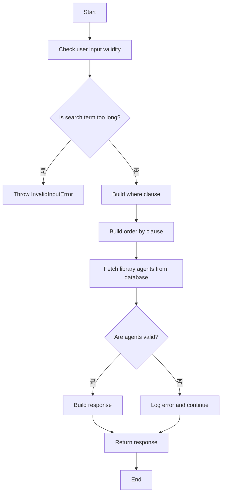
```mermaid
graph TD
    A[Start] --> B[Check user input validity]
    B --> C{Is search term too long?}
    C -- 是 --> D[Throw InvalidInputError]
    C -- 否 --> E[Build where clause]
    E --> F[Build order by clause]
    F --> G[Fetch library agents from database]
    G --> H{Are agents valid?}
    H -- 是 --> I[Build response]
    H -- 否 --> J[Log error and continue]
    I --> K[Return response]
    J --> K
    K --> L[End]
```

## 类结构

```
LibraryAgent (类)
├── LibraryAgentResponse (类)
├── LibraryAgentSort (枚举)
└── Pagination (类)
```

## 全局变量及字段


### `logger`
    
Logger instance for logging messages.

类型：`logging.Logger`
    


### `config`
    
Configuration settings for the application.

类型：`backend.util.settings.Config`
    


### `integration_creds_manager`
    
Manager for integration credentials.

类型：`backend.integrations.creds_manager.IntegrationCredentialsManager`
    


### `LibraryAgent.id`
    
Unique identifier for the LibraryAgent.

类型：`str`
    


### `LibraryAgent.userId`
    
User ID associated with the LibraryAgent.

类型：`str`
    


### `LibraryAgent.agentGraphId`
    
ID of the associated AgentGraph.

类型：`str`
    


### `LibraryAgent.agentGraphVersion`
    
Version of the associated AgentGraph.

类型：`int`
    


### `LibraryAgent.isDeleted`
    
Flag indicating if the LibraryAgent is deleted.

类型：`bool`
    


### `LibraryAgent.isArchived`
    
Flag indicating if the LibraryAgent is archived.

类型：`bool`
    


### `LibraryAgent.isFavorite`
    
Flag indicating if the LibraryAgent is a favorite.

类型：`bool`
    


### `LibraryAgent.settings`
    
User-specific settings for the LibraryAgent.

类型：`SafeJson`
    


### `LibraryAgent.imageUrl`
    
URL to the image of the LibraryAgent.

类型：`str`
    


### `LibraryAgentResponse.agents`
    
List of LibraryAgent instances.

类型：`list[library_model.LibraryAgent]`
    


### `LibraryAgentResponse.pagination`
    
Pagination details for the response.

类型：`Pagination`
    


### `Pagination.total_items`
    
Total number of items in the dataset.

类型：`int`
    


### `Pagination.total_pages`
    
Total number of pages in the dataset.

类型：`int`
    


### `Pagination.current_page`
    
Current page number.

类型：`int`
    


### `Pagination.page_size`
    
Number of items per page.

类型：`int`
    


### `library_model.LibraryAgent.LibraryAgent`
    
Model representing a library agent.

类型：`library_model.LibraryAgent`
    


### `library_model.LibraryAgentResponse.LibraryAgentResponse`
    
Response model for a list of library agents.

类型：`library_model.LibraryAgentResponse`
    


### `backend.util.models.Pagination.Pagination`
    
Pagination model for datasets.

类型：`backend.util.models.Pagination`
    
    

## 全局函数及方法

### list_library_agents

Retrieves a paginated list of LibraryAgent records for a given user.

参数：

- `user_id`：`str`，The ID of the user whose LibraryAgents we want to retrieve.
- `search_term`：`Optional[str]`，Optional string to filter agents by name/description.
- `sort_by`：`library_model.LibraryAgentSort`，Sorting field (createdAt, updatedAt, isFavorite, isCreatedByUser).
- `page`：`int`，Current page (1-indexed).
- `page_size`：`int`，Number of items per page.
- `include_executions`：`bool`，Whether to include execution data for status calculation. Defaults to False for performance (UI fetches status separately). Set to True when accurate status/metrics are needed (e.g., agent generator).

返回值：`library_model.LibraryAgentResponse`，A LibraryAgentResponse containing the list of agents and pagination details.

#### 流程图

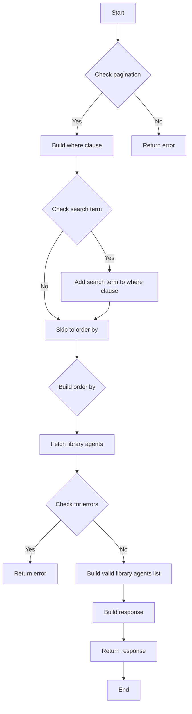
```mermaid
graph TD
    A[Start] --> B{Check pagination}
    B -->|Yes| C[Build where clause]
    B -->|No| D[Return error]
    C --> E{Check search term}
    E -->|Yes| F[Add search term to where clause]
    E -->|No| G[Skip to order by]
    F --> G
    G --> H{Build order by}
    H --> I[Fetch library agents]
    I --> J{Check for errors}
    J -->|Yes| K[Return error]
    J -->|No| L[Build valid library agents list]
    L --> M[Build response]
    M --> N[Return response]
    N --> O[End]
```

#### 带注释源码

```python
async def list_library_agents(
    user_id: str,
    search_term: Optional[str] = None,
    sort_by: library_model.LibraryAgentSort = library_model.LibraryAgentSort.UPDATED_AT,
    page: int = 1,
    page_size: int = 50,
    include_executions: bool = False,
) -> library_model.LibraryAgentResponse:
    """
    Retrieves a paginated list of LibraryAgent records for a given user.
    """
    # ... (rest of the function)
```


### list_favorite_library_agents

Retrieves a paginated list of favorite LibraryAgent records for a given user.

参数：

- `user_id`：`str`，The ID of the user whose favorite LibraryAgents we want to retrieve.
- `page`：`int`，Current page (1-indexed).
- `page_size`：`int`，Number of items per page.

返回值：`library_model.LibraryAgentResponse`，A LibraryAgentResponse containing the list of favorite agents and pagination details.

#### 流程图

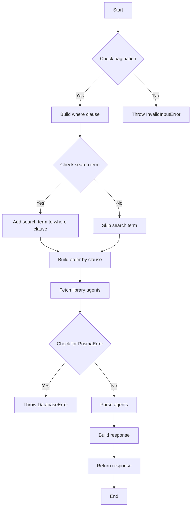
```mermaid
graph TD
    A[Start] --> B{Check pagination}
    B -->|Yes| C[Build where clause]
    B -->|No| D[Throw InvalidInputError]
    C --> E{Check search term}
    E -->|Yes| F[Add search term to where clause]
    E -->|No| G[Skip search term]
    F --> H[Build order by clause]
    G --> H
    H --> I[Fetch library agents]
    I --> J{Check for PrismaError}
    J -->|Yes| K[Throw DatabaseError]
    J -->|No| L[Parse agents]
    L --> M[Build response]
    M --> N[Return response]
    N --> O[End]
```

#### 带注释源码

```python
async def list_favorite_library_agents(
    user_id: str,
    page: int = 1,
    page_size: int = 50,
) -> library_model.LibraryAgentResponse:
    """
    Retrieves a paginated list of favorite LibraryAgent records for a given user.

    Args:
        user_id: The ID of the user whose favorite LibraryAgents we want to retrieve.
        page: Current page (1-indexed).
        page_size: Number of items per page.

    Returns:
        A LibraryAgentResponse containing the list of favorite agents and pagination details.

    Raises:
        DatabaseError: If there is an issue fetching from Prisma.
    """
    logger.debug(
        f"Fetching favorite library agents for user_id={user_id}, "
        f"page={page}, page_size={page_size}"
    )

    if page < 1 or page_size < 1:
        logger.warning(f"Invalid pagination: page={page}, page_size={page_size}")
        raise InvalidInputError("Invalid pagination input")

    where_clause: prisma.types.LibraryAgentWhereInput = {
        "userId": user_id,
        "isDeleted": False,
        "isArchived": False,
        "isFavorite": True,  # Only fetch favorites
    }

    # Sort favorites by updated date descending
    order_by: prisma.types.LibraryAgentOrderByInput = {"updatedAt": "desc"}

    try:
        library_agents = await prisma.models.LibraryAgent.prisma().find_many(
            where=where_clause,
            include=library_agent_include(
                user_id, include_nodes=False, include_executions=False
            ),
            order=order_by,
            skip=(page - 1) * page_size,
            take=page_size,
        )
        agent_count = await prisma.models.LibraryAgent.prisma().count(
            where=where_clause
        )

        logger.debug(
            f"Retrieved {len(library_agents)} favorite library agents for user #{user_id}"
        )

        # Only pass valid agents to the response
        valid_library_agents: list[library_model.LibraryAgent] = []

        for agent in library_agents:
            try:
                library_agent = library_model.LibraryAgent.from_db(agent)
                valid_library_agents.append(library_agent)
            except Exception as e:
                # Skip this agent if there was an error
                logger.error(
                    f"Error parsing LibraryAgent #{agent.id} from DB item: {e}"
                )
                continue

        # Return the response with only valid agents
        return library_model.LibraryAgentResponse(
            agents=valid_library_agents,
            pagination=Pagination(
                total_items=agent_count,
                total_pages=(agent_count + page_size - 1) // page_size,
                current_page=page,
                page_size=page_size,
            ),
        )

    except prisma.errors.PrismaError as e:
        logger.error(f"Database error fetching favorite library agents: {e}")
        raise DatabaseError("Failed to fetch favorite library agents") from e
```


### get_library_agent

Get a specific agent from the user's library.

参数：

- `id`：`str`，The ID of the library agent to retrieve.
- `user_id`：`str`，ID of the authenticated user.

返回值：`library_model.LibraryAgent`，The requested LibraryAgent.

#### 流程图

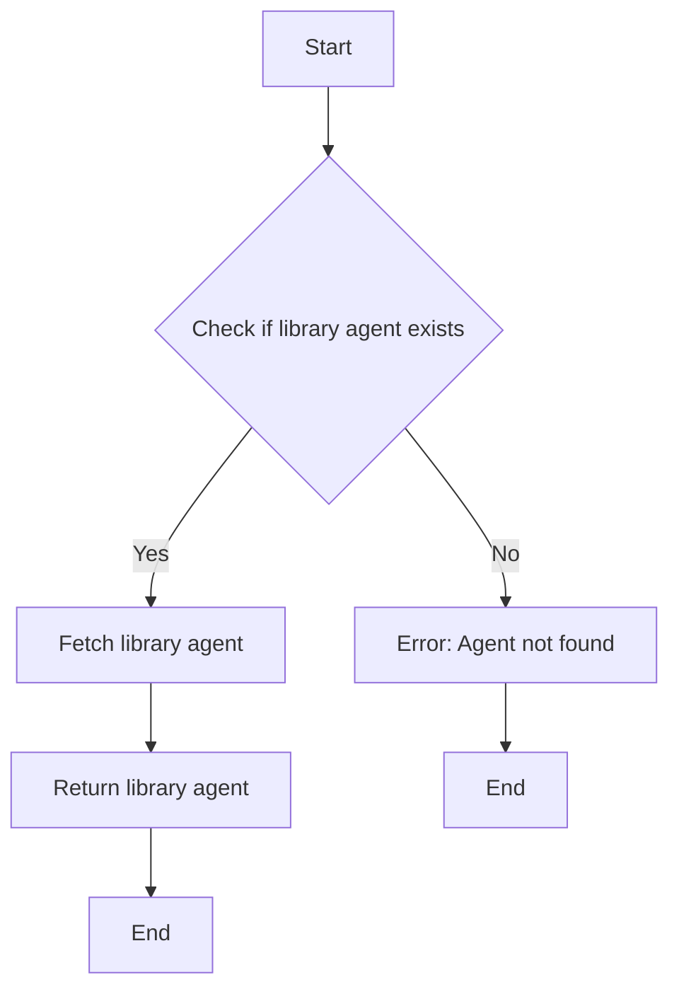
```mermaid
graph TD
    A[Start] --> B{Check if library agent exists}
    B -- Yes --> C[Fetch library agent]
    B -- No --> D[Error: Agent not found]
    C --> E[Return library agent]
    D --> F[End]
    E --> G[End]
```

#### 带注释源码

```python
async def get_library_agent(id: str, user_id: str) -> library_model.LibraryAgent:
    """
    Get a specific agent from the user's library.

    Args:
        id: ID of the library agent to retrieve.
        user_id: ID of the authenticated user.

    Returns:
        The requested LibraryAgent.

    Raises:
        AgentNotFoundError: If the specified agent does not exist.
        DatabaseError: If there's an error during retrieval.
    """
    try:
        library_agent = await prisma.models.LibraryAgent.prisma().find_first(
            where={
                "id": id,
                "userId": user_id,
                "isDeleted": False,
            },
            include=library_agent_include(user_id),
        )

        if not library_agent:
            raise NotFoundError(f"Library agent #{id} not found")

        # Fetch marketplace listing if the agent has been published
        store_listing = None
        profile = None
        if library_agent.AgentGraph:
            store_listing = await prisma.models.StoreListing.prisma().find_first(
                where={
                    "agentGraphId": library_agent.AgentGraph.id,
                    "isDeleted": False,
                    "hasApprovedVersion": True,
                },
                include={
                    "ActiveVersion": True,
                },
            )
            if (
                store_listing
                and store_listing.ActiveVersion
                and store_listing.owningUserId
            ):
                # Fetch Profile separately since User doesn't have a direct Profile relation
                profile = await prisma.models.Profile.prisma().find_first(
                    where={"userId": store_listing.owningUserId}
                )

        return library_model.LibraryAgent.from_db(
            library_agent,
            sub_graphs=(
                await graph_db.get_sub_graphs(library_agent.AgentGraph)
                if library_agent.AgentGraph
                else None
            ),
            store_listing=store_listing,
            profile=profile,
        )

    except prisma.errors.PrismaError as e:
        logger.error(f"Database error fetching library agent: {e}")
        raise DatabaseError("Failed to fetch library agent") from e
```


### `get_library_agent_by_store_version_id`

Get the library agent metadata for a given store listing version ID and user ID.

参数：

- `store_listing_version_id`：`str`，The ID of the store listing version for which to retrieve the library agent metadata.
- `user_id`：`str`，The ID of the user for which to retrieve the library agent metadata.

返回值：`library_model.LibraryAgent | None`，The requested LibraryAgent if found, otherwise None.

#### 流程图

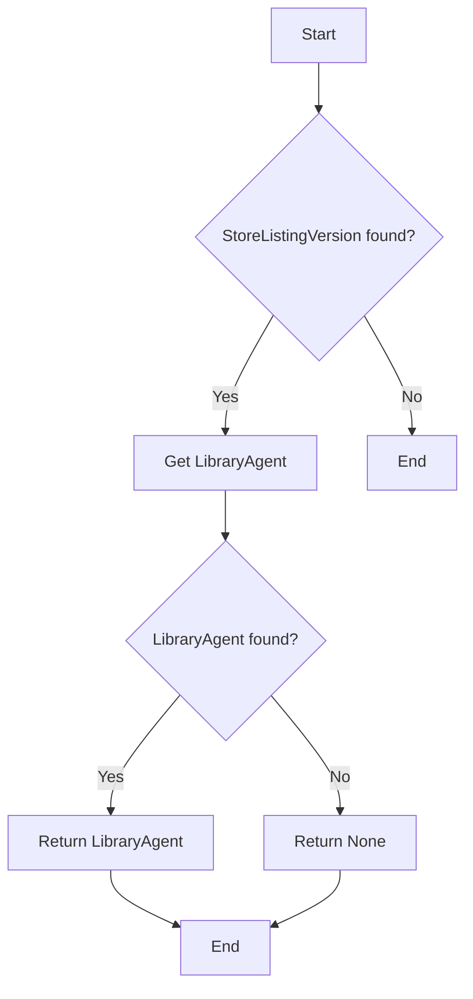
```mermaid
graph TD
    A[Start] --> B{StoreListingVersion found?}
    B -- Yes --> C[Get LibraryAgent]
    B -- No --> D[End]
    C --> E{LibraryAgent found?}
    E -- Yes --> F[Return LibraryAgent]
    E -- No --> G[Return None]
    F --> H[End]
    G --> H[End]
```

#### 带注释源码

```python
async def get_library_agent_by_store_version_id(
    store_listing_version_id: str,
    user_id: str,
) -> library_model.LibraryAgent | None:
    """
    Get the library agent metadata for a given store listing version ID and user ID.
    """
    logger.debug(
        f"Getting library agent for store listing ID: {store_listing_version_id}"
    )

    store_listing_version = (
        await prisma.models.StoreListingVersion.prisma().find_unique(
            where={"id": store_listing_version_id},
        )
    )
    if not store_listing_version:
        logger.warning(f"Store listing version not found: {store_listing_version_id}")
        raise NotFoundError(
            f"Store listing version {store_listing_version_id} not found or invalid"
        )

    # Check if user already has this agent
    agent = await prisma.models.LibraryAgent.prisma().find_first(
        where={
            "userId": user_id,
            "agentGraphId": store_listing_version.agentGraphId,
            "agentGraphVersion": store_listing_version.agentGraphVersion,
            "isDeleted": False,
        },
        include=library_agent_include(user_id),
    )
    return library_model.LibraryAgent.from_db(agent) if agent else None
```


### get_library_agent_by_graph_id

Get a specific agent from the user's library by its graph ID.

参数：

- `user_id`：`str`，The ID of the authenticated user.
- `graph_id`：`str`，ID of the graph associated with the library agent.
- `graph_version`：`Optional[int]`，Optional version of the graph associated with the library agent.

返回值：`library_model.LibraryAgent | None`，The requested LibraryAgent or None if not found.

#### 流程图

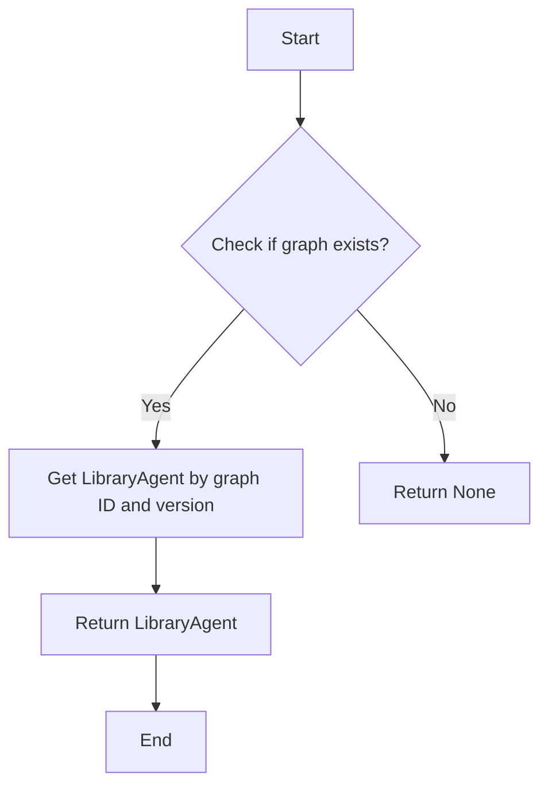
```mermaid
graph TD
    A[Start] --> B{Check if graph exists?}
    B -- Yes --> C[Get LibraryAgent by graph ID and version]
    B -- No --> D[Return None]
    C --> E[Return LibraryAgent]
    E --> F[End]
```

#### 带注释源码

```python
async def get_library_agent_by_graph_id(
    user_id: str,
    graph_id: str,
    graph_version: Optional[int] = None,
) -> library_model.LibraryAgent | None:
    try:
        filter: prisma.types.LibraryAgentWhereInput = {
            "agentGraphId": graph_id,
            "userId": user_id,
            "isDeleted": False,
        }
        if graph_version is not None:
            filter["agentGraphVersion"] = graph_version

        agent = await prisma.models.LibraryAgent.prisma().find_first(
            where=filter,
            include=library_agent_include(user_id),
        )
        if not agent:
            return None

        assert agent.AgentGraph  # make type checker happy
        # Include sub-graphs so we can make a full credentials input schema
        sub_graphs = await graph_db.get_sub_graphs(agent.AgentGraph)
        return library_model.LibraryAgent.from_db(agent, sub_graphs=sub_graphs)
    except prisma.errors.PrismaError as e:
        logger.error(f"Database error fetching library agent by graph ID: {e}")
        raise DatabaseError("Failed to fetch library agent") from e
```


### add_generated_agent_image

Generates an image for the specified LibraryAgent and updates its record.

参数：

- `graph`：`graph_db.GraphBaseMeta`，The graph metadata for which the agent image is to be generated.
- `user_id`：`str`，The ID of the user for whom the agent image is being generated.
- `library_agent_id`：`str`，The ID of the LibraryAgent whose image is to be generated.

返回值：`Optional[prisma.models.LibraryAgent]`，The updated LibraryAgent record if the image generation and update are successful, otherwise None.

#### 流程图

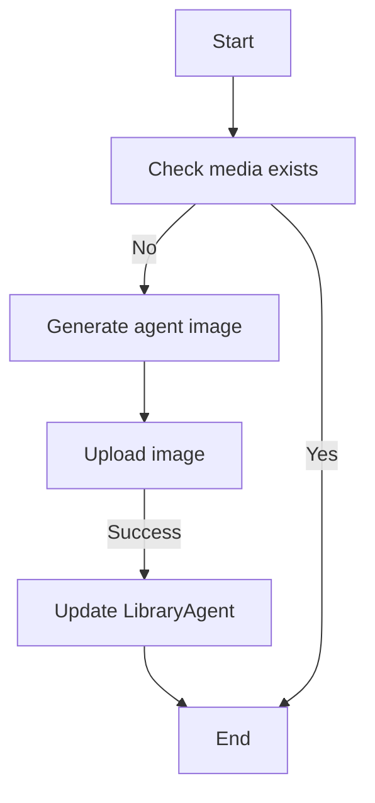
```mermaid
graph TD
    A[Start] --> B[Check media exists]
    B -->|No| C[Generate agent image]
    C --> D[Upload image]
    D -->|Success| E[Update LibraryAgent]
    E --> F[End]
    B -->|Yes| F
```

#### 带注释源码

```python
async def add_generated_agent_image(
    graph: graph_db.GraphBaseMeta,
    user_id: str,
    library_agent_id: str,
) -> Optional[prisma.models.LibraryAgent]:
    graph_id = graph.id

    # Use .jpeg here since we are generating JPEG images
    filename = f"agent_{graph_id}.jpeg"
    try:
        if not (image_url := await store_media.check_media_exists(user_id, filename)):
            # Generate agent image as JPEG
            image = await store_image_gen.generate_agent_image(graph)

            # Create UploadFile with the correct filename and content_type
            image_file = fastapi.UploadFile(file=image, filename=filename)

            image_url = await store_media.upload_media(
                user_id=user_id, file=image_file, use_file_name=True
            )
    except Exception as e:
        logger.warning(f"Error generating and uploading agent image: {e}")
        return None

    return await prisma.models.LibraryAgent.prisma().update(
        where={"id": library_agent_id},
        data={"imageUrl": image_url},
    )
```


### create_library_agent

This function adds an agent to the user's library (LibraryAgent table).

参数：

- `graph`：`graph_db.GraphModel`，The agent/Graph to add to the library.
- `user_id`：`str`，The user to whom the agent will be added.
- `hitl_safe_mode`：`bool`，Whether HITL blocks require manual review (default True).
- `sensitive_action_safe_mode`：`bool`，Whether sensitive action blocks require review.
- `create_library_agents_for_sub_graphs`：`bool`，If True, creates LibraryAgent records for sub-graphs as well.

返回值：`list[library_model.LibraryAgent]`，The newly created LibraryAgent records. If the graph has sub-graphs, the parent graph will always be the first entry in the list.

#### 流程图

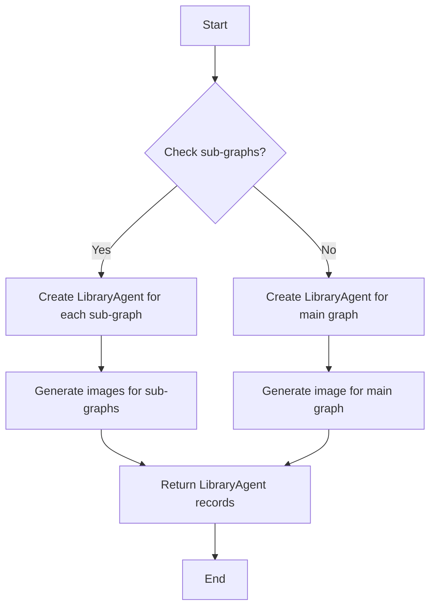
```mermaid
graph TD
    A[Start] --> B{Check sub-graphs?}
    B -- Yes --> C[Create LibraryAgent for each sub-graph]
    B -- No --> D[Create LibraryAgent for main graph]
    C --> E[Generate images for sub-graphs]
    D --> F[Generate image for main graph]
    E & F --> G[Return LibraryAgent records]
    G --> H[End]
```

#### 带注释源码

```python
async def create_library_agent(
    graph: graph_db.GraphModel,
    user_id: str,
    hitl_safe_mode: bool = True,
    sensitive_action_safe_mode: bool = False,
    create_library_agents_for_sub_graphs: bool = True,
) -> list[library_model.LibraryAgent]:
    """
    Adds an agent to the user's library (LibraryAgent table).

    Args:
        agent: The agent/Graph to add to the library.
        user_id: The user to whom the agent will be added.
        hitl_safe_mode: Whether HITL blocks require manual review (default True).
        sensitive_action_safe_mode: Whether sensitive action blocks require review.
        create_library_agents_for_sub_graphs: If True, creates LibraryAgent records for sub-graphs as well.

    Returns:
        The newly created LibraryAgent records.
        If the graph has sub-graphs, the parent graph will always be the first entry in the list.

    Raises:
        AgentNotFoundError: If the specified agent does not exist.
        DatabaseError: If there's an error during creation or if image generation fails.
    """
    logger.info(
        f"Creating library agent for graph #{graph.id} v{graph.version}; user:<redacted>"
    )
    graph_entries = (
        [graph, *graph.sub_graphs] if create_library_agents_for_sub_graphs else [graph]
    )

    async with transaction() as tx:
        library_agents = await asyncio.gather(
            *(
                prisma.models.LibraryAgent.prisma(tx).create(
                    data=prisma.types.LibraryAgentCreateInput(
                        isCreatedByUser=(user_id == user_id),
                        useGraphIsActiveVersion=True,
                        User={"connect": {"id": user_id}},
                        # Creator={"connect": {"id": user_id}},
                        AgentGraph={
                            "connect": {
                                "graphVersionId": {
                                    "id": graph_entry.id,
                                    "version": graph_entry.version,
                                }
                            }
                        },
                        settings=SafeJson(
                            GraphSettings.from_graph(
                                graph_entry,
                                hitl_safe_mode=hitl_safe_mode,
                                sensitive_action_safe_mode=sensitive_action_safe_mode,
                            ).model_dump()
                        ),
                    ),
                    include=library_agent_include(
                        user_id, include_nodes=False, include_executions=False
                    ),
                )
                for graph_entry in graph_entries
            )
        )

    # Generate images for the main graph and sub-graphs
    for agent, graph in zip(library_agents, graph_entries):
        asyncio.create_task(add_generated_agent_image(graph, user_id, agent.id))

    return [library_model.LibraryAgent.from_db(agent) for agent in library_agents]
```

### update_agent_version_in_library

**描述**

更新用户库中任何用户拥有的代理的版本。

**参数**

- `user_id`：`str`，代理所有者的用户ID。
- `agent_graph_id`：`str`，要更新的代理图ID。
- `agent_graph_version`：`int`，代理图的新版本。

**返回值**

- `library_model.LibraryAgent`，更新的代理。

**流程图**

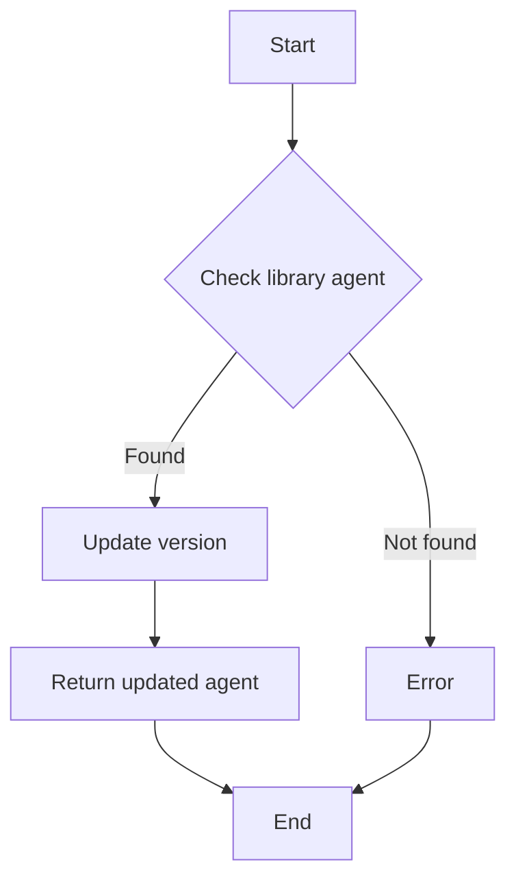
```mermaid
graph TD
    A[Start] --> B{Check library agent}
    B -->|Found| C[Update version]
    B -->|Not found| D[Error]
    C --> E[Return updated agent]
    E --> F[End]
    D --> F
```

#### 带注释源码

```python
async def update_agent_version_in_library(
    user_id: str,
    agent_graph_id: str,
    agent_graph_version: int,
) -> library_model.LibraryAgent:
    """
    Updates the agent version in the library for any agent owned by the user.

    Args:
        user_id: Owner of the LibraryAgent.
        agent_graph_id: The agent graph's ID to update.
        agent_graph_version: The new version of the agent graph.

    Raises:
        DatabaseError: If there's an error with the update.
        NotFoundError: If no library agent is found for this user and agent.
    """
    logger.debug(
        f"Updating agent version in library for user #{user_id}, "
        f"agent #{agent_graph_id} v{agent_graph_version}"
    )
    async with transaction() as tx:
        library_agent = await prisma.models.LibraryAgent.prisma(tx).find_first_or_raise(
            where={
                "userId": user_id,
                "agentGraphId": agent_graph_id,
            },
        )

        # Delete any conflicting LibraryAgent for the target version
        await prisma.models.LibraryAgent.prisma(tx).delete_many(
            where={
                "userId": user_id,
                "agentGraphId": agent_graph_id,
                "agentGraphVersion": agent_graph_version,
                "id": {"not": library_agent.id},
            }
        )

        lib = await prisma.models.LibraryAgent.prisma(tx).update(
            where={"id": library_agent.id},
            data={
                "AgentGraph": {
                    "connect": {
                        "graphVersionId": {
                            "id": agent_graph_id,
                            "version": agent_graph_version,
                        }
                    },
                },
            },
            include={"AgentGraph": True},
        )

    if lib is None:
        raise NotFoundError(
            f"Failed to update library agent for {agent_graph_id} v{agent_graph_version}"
        )

    return library_model.LibraryAgent.from_db(lib)
```

### create_graph_in_library

**描述**

创建一个新的图形并将其添加到用户的库中。

**参数**

- `graph`：`graph_db.Graph`，要添加到库中的图形。
- `user_id`：`str`，用户ID。

**返回值**

- `tuple[graph_db.GraphModel, library_model.LibraryAgent]`，包含创建的图形模型和库中的图形代理。

#### 流程图

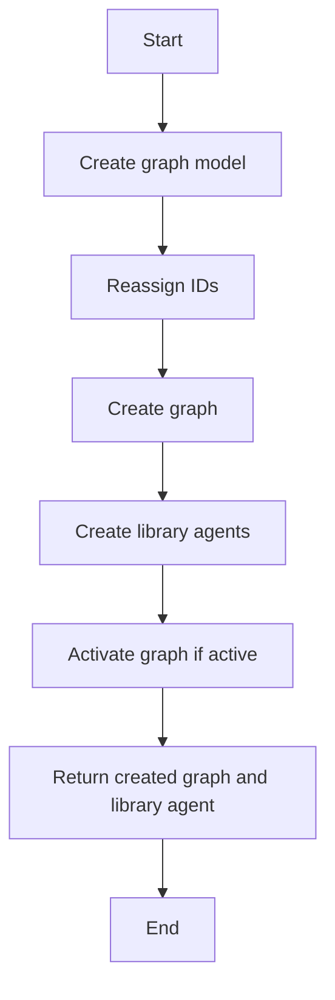
```mermaid
graph TD
    A[Start] --> B[Create graph model]
    B --> C[Reassign IDs]
    C --> D[Create graph]
    D --> E[Create library agents]
    E --> F[Activate graph if active]
    F --> G[Return created graph and library agent]
    G --> H[End]
```

#### 带注释源码

```python
async def create_graph_in_library(
    graph: graph_db.Graph,
    user_id: str,
) -> tuple[graph_db.GraphModel, library_model.LibraryAgent]:
    """Create a new graph and add it to the user's library."""
    graph.version = 1
    graph_model = graph_db.make_graph_model(graph, user_id)
    graph_model.reassign_ids(user_id=user_id, reassign_graph_id=True)

    created_graph = await graph_db.create_graph(graph_model, user_id)

    library_agents = await create_library_agent(
        graph=created_graph,
        user_id=user_id,
        sensitive_action_safe_mode=True,
        create_library_agents_for_sub_graphs=False,
    )

    if created_graph.is_active:
        created_graph = await on_graph_activate(created_graph, user_id=user_id)

    return created_graph, library_agents[0]
```

### update_graph_in_library

This function creates a new version of an existing graph and updates the library entry accordingly.

#### 参数

- `graph`：`graph_db.Graph`，The graph object to update.
- `user_id`：`str`，The ID of the user who owns the graph.

#### 返回值

- `tuple[graph_db.GraphModel, library_model.LibraryAgent]`，A tuple containing the updated graph and the corresponding library agent.

#### 流程图

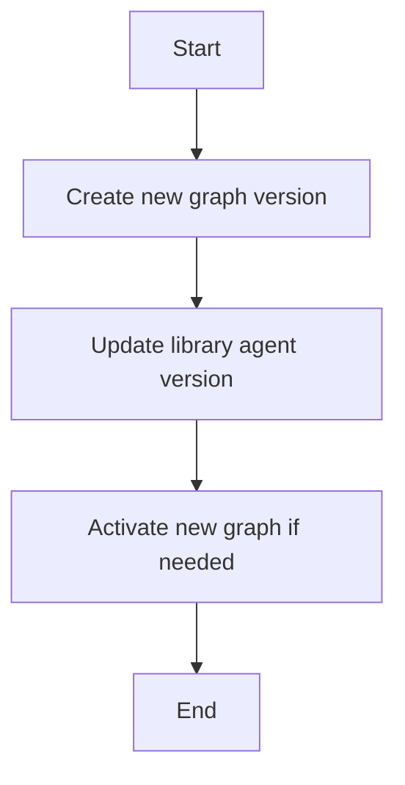
```mermaid
graph TD
    A[Start] --> B[Create new graph version]
    B --> C[Update library agent version]
    C --> D[Activate new graph if needed]
    D --> E[End]
```

#### 带注释源码

```python
async def update_graph_in_library(
    graph: graph_db.Graph,
    user_id: str,
) -> tuple[graph_db.GraphModel, library_model.LibraryAgent]:
    """Create a new version of an existing graph and update the library entry."""
    existing_versions = await graph_db.get_graph_all_versions(graph.id, user_id)
    current_active_version = (
        next((v for v in existing_versions if v.is_active), None)
        if existing_versions
        else None
    )
    graph.version = (
        max(v.version for v in existing_versions) + 1 if existing_versions else 1
    )

    graph_model = graph_db.make_graph_model(graph, user_id)
    graph_model.reassign_ids(user_id=user_id, reassign_graph_id=False)

    created_graph = await graph_db.create_graph(graph_model, user_id)

    library_agent = await get_library_agent_by_graph_id(user_id, created_graph.id)
    if not library_agent:
        raise NotFoundError(f"Library agent not found for graph {created_graph.id}")

    library_agent = await update_library_agent_version_and_settings(
        user_id, created_graph
    )

    if created_graph.is_active:
        created_graph = await on_graph_activate(created_graph, user_id=user_id)
        await graph_db.set_graph_active_version(
            graph_id=created_graph.id,
            version=created_graph.version,
            user_id=user_id,
        )
        if current_active_version:
            await on_graph_deactivate(current_active_version, user_id=user_id)

    return created_graph, library_agent
```

### update_library_agent_version_and_settings

This function updates the library agent to point to a new graph version and synchronizes settings.

#### 参数

- `user_id`: `str`，The ID of the user who owns the library agent.
- `agent_graph`: `graph_db.GraphModel`，The new graph model for the library agent.

#### 返回值

- `library_model.LibraryAgent`，The updated library agent.

#### 流程图

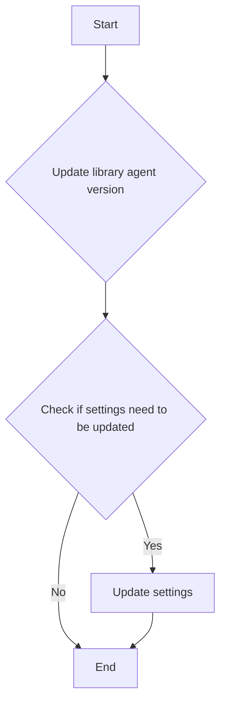
```mermaid
graph TD
    A[Start] --> B{Update library agent version}
    B --> C{Check if settings need to be updated}
    C -->|Yes| D[Update settings]
    C -->|No| E[End]
    D --> E
```

#### 带注释源码

```python
async def update_library_agent_version_and_settings(
    user_id: str, agent_graph: graph_db.GraphModel
) -> library_model.LibraryAgent:
    """Update library agent to point to new graph version and sync settings."""
    library = await update_agent_version_in_library(
        user_id, agent_graph.id, agent_graph.version
    )
    updated_settings = GraphSettings.from_graph(
        graph=agent_graph,
        hitl_safe_mode=library.settings.human_in_the_loop_safe_mode,
        sensitive_action_safe_mode=library.settings.sensitive_action_safe_mode,
    )
    if updated_settings != library.settings:
        library = await update_library_agent(
            library_agent_id=library.id,
            user_id=user_id,
            settings=updated_settings,
        )
    return library
```

### update_library_agent

This function updates the specified LibraryAgent record with new information.

参数：

- `library_agent_id`：`str`，The ID of the LibraryAgent to update.
- `user_id`：`str`，The owner of this LibraryAgent.
- `auto_update_version`：`Optional[bool]`，Whether the agent should auto-update to active version.
- `graph_version`：`Optional[int]`，Specific graph version to update to.
- `is_favorite`：`Optional[bool]`，Whether this agent is marked as a favorite.
- `is_archived`：`Optional[bool]`，Whether this agent is archived.
- `is_deleted`：`Optional[Literal[False]]`，Whether this agent is deleted.
- `settings`：`Optional[GraphSettings]`，User-specific settings for this library agent.

返回值：`library_model.LibraryAgent`，The updated LibraryAgent.

#### 流程图

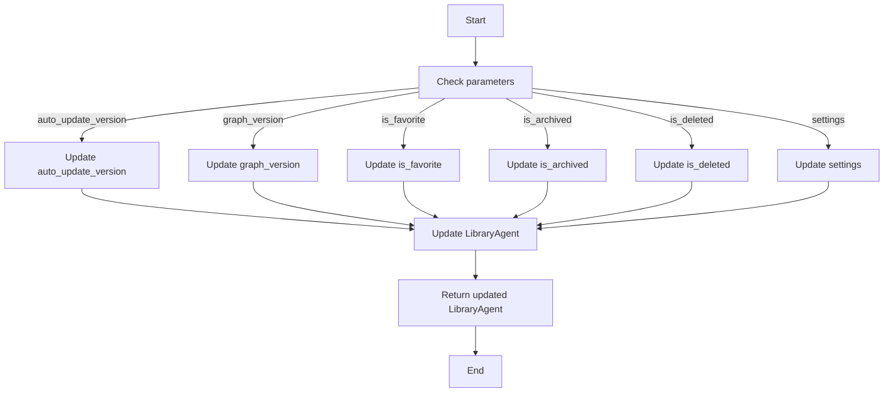
```mermaid
graph TD
    A[Start] --> B[Check parameters]
    B -->|auto_update_version| C[Update auto_update_version]
    B -->|graph_version| D[Update graph_version]
    B -->|is_favorite| E[Update is_favorite]
    B -->|is_archived| F[Update is_archived]
    B -->|is_deleted| G[Update is_deleted]
    B -->|settings| H[Update settings]
    C --> I[Update LibraryAgent]
    D --> I
    E --> I
    F --> I
    G --> I
    H --> I
    I --> J[Return updated LibraryAgent]
    J --> K[End]
```

#### 带注释源码

```python
async def update_library_agent(
    library_agent_id: str,
    user_id: str,
    auto_update_version: Optional[bool] = None,
    graph_version: Optional[int] = None,
    is_favorite: Optional[bool] = None,
    is_archived: Optional[bool] = None,
    is_deleted: Optional[Literal[False]] = None,
    settings: Optional[GraphSettings] = None,
) -> library_model.LibraryAgent:
    """
    Updates the specified LibraryAgent record.

    Args:
        library_agent_id: The ID of the LibraryAgent to update.
        user_id: The owner of this LibraryAgent.
        auto_update_version: Whether the agent should auto-update to active version.
        graph_version: Specific graph version to update to.
        is_favorite: Whether this agent is marked as a favorite.
        is_archived: Whether this agent is archived.
        is_deleted: Whether this agent is deleted.
        settings: User-specific settings for this library agent.

    Returns:
        The updated LibraryAgent.

    Raises:
        NotFoundError: If the specified LibraryAgent does not exist.
        DatabaseError: If there's an error in the update operation.
    """
    logger.debug(
        f"Updating library agent {library_agent_id} for user {user_id} with "
        f"auto_update_version={auto_update_version}, graph_version={graph_version}, "
        f"is_favorite={is_favorite}, is_archived={is_archived}, settings={settings}"
    )
    update_fields: prisma.types.LibraryAgentUpdateManyMutationInput = {}
    if auto_update_version is not None:
        update_fields["useGraphIsActiveVersion"] = auto_update_version
    if is_favorite is not None:
        update_fields["isFavorite"] = is_favorite
    if is_archived is not None:
        update_fields["isArchived"] = is_archived
    if is_deleted is not None:
        if is_deleted is True:
            raise RuntimeError(
                "Use delete_library_agent() to (soft-)delete library agents"
            )
        update_fields["isDeleted"] = is_deleted
    if settings is not None:
        existing_agent = await get_library_agent(id=library_agent_id, user_id=user_id)
        current_settings_dict = (
            existing_agent.settings.model_dump() if existing_agent.settings else {}
        )
        new_settings = settings.model_dump(exclude_unset=True)
        merged_settings = {**current_settings_dict, **new_settings}
        update_fields["settings"] = SafeJson(merged_settings)

    try:
        # If graph_version is provided, update to that specific version
        if graph_version is not None:
            # Get the current agent to find its graph_id
            agent = await get_library_agent(id=library_agent_id, user_id=user_id)
            # Update to the specified version using existing function
            return await update_agent_version_in_library(
                user_id=user_id,
                agent_graph_id=agent.graph_id,
                agent_graph_version=graph_version,
            )

        # Otherwise, just update the simple fields
        if not update_fields:
            raise ValueError("No values were passed to update")

        n_updated = await prisma.models.LibraryAgent.p

### delete_library_agent

删除用户库中的指定库代理。

#### 描述

该函数用于删除用户库中的指定库代理。如果指定了 `soft_delete` 参数为 `True`，则代理将被标记为已删除，而不是从数据库中实际删除。这允许在将来恢复代理。

#### 参数

- `library_agent_id`：`str`，库代理的 ID。
- `user_id`：`str`，库代理所属用户的 ID。
- `soft_delete`：`bool`，可选，默认为 `True`。如果为 `True`，则代理将被标记为已删除，而不是从数据库中实际删除。

#### 返回值

- `None`：函数成功执行后返回 `None`。

#### 流程图

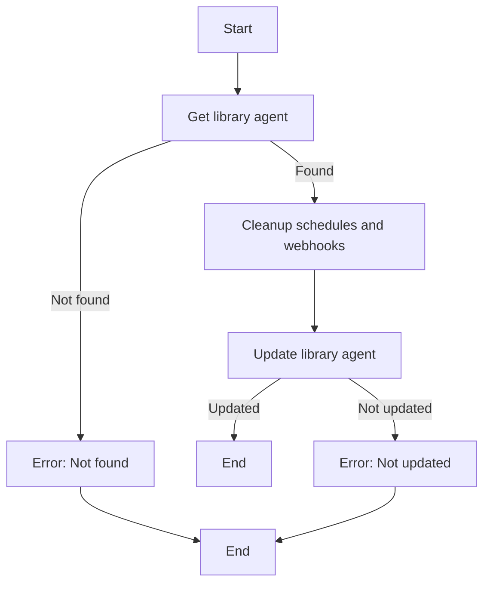
```mermaid
graph TD
    A[Start] --> B[Get library agent]
    B -->|Found| C[Cleanup schedules and webhooks]
    B -->|Not found| D[Error: Not found]
    C --> E[Update library agent]
    E -->|Updated| F[End]
    E -->|Not updated| G[Error: Not updated]
    D --> H[End]
    G --> H
```

#### 带注释源码

```python
async def delete_library_agent(
    library_agent_id: str, user_id: str, soft_delete: bool = True
) -> None:
    # First get the agent to find the graph_id for cleanup
    library_agent = await prisma.models.LibraryAgent.prisma().find_unique(
        where={"id": library_agent_id}, include={"AgentGraph": True}
    )

    if not library_agent or library_agent.userId != user_id:
        raise NotFoundError(f"Library agent #{library_agent_id} not found")

    graph_id = library_agent.agentGraphId

    # Clean up associated schedules and webhooks BEFORE deleting the agent
    # This prevents executions from starting after agent deletion
    await _cleanup_schedules_for_graph(graph_id=graph_id, user_id=user_id)
    await _cleanup_webhooks_for_graph(graph_id=graph_id, user_id=user_id)

    # Delete the library agent after cleanup
    if soft_delete:
        deleted_count = await prisma.models.LibraryAgent.prisma().update_many(
            where={"id": library_agent_id, "userId": user_id},
            data={"isDeleted": True},
        )
    else:
        deleted_count = await prisma.models.LibraryAgent.prisma().delete_many(
            where={"id": library_agent_id, "userId": user_id}
        )

    if deleted_count < 1:
        raise NotFoundError(f"Library agent #{library_agent_id} not found")
```


### `_cleanup_schedules_for_graph`

Clean up all schedules for a specific graph and user.

参数：

- `graph_id`：`str`，The ID of the graph
- `user_id`：`str`，The ID of the user

返回值：`None`，No return value

#### 流程图

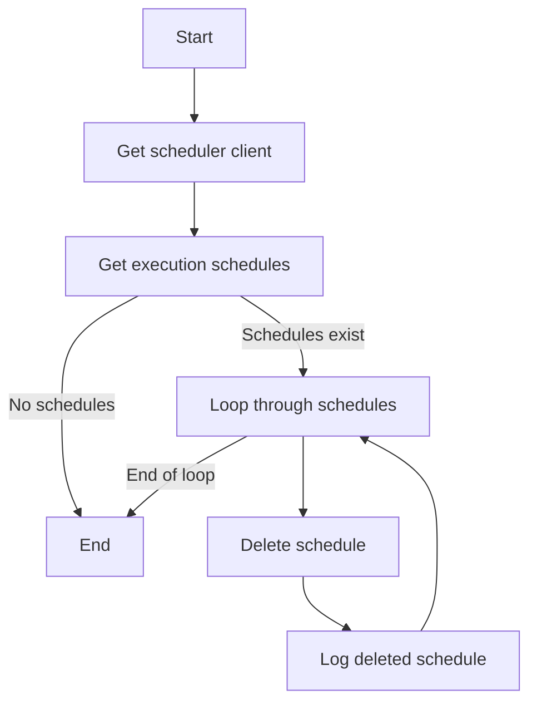
```mermaid
graph TD
    A[Start] --> B[Get scheduler client]
    B --> C[Get execution schedules]
    C -->|Schedules exist| D[Loop through schedules]
    C -->|No schedules| E[End]
    D --> F[Delete schedule]
    F --> G[Log deleted schedule]
    G --> D
    D -->|End of loop| E
```

#### 带注释源码

```python
async def _cleanup_schedules_for_graph(graph_id: str, user_id: str) -> None:
    """
    Clean up all schedules for a specific graph and user.

    Args:
        graph_id: The ID of the graph
        user_id: The ID of the user
    """
    scheduler_client = get_scheduler_client()
    schedules = await scheduler_client.get_execution_schedules(
        graph_id=graph_id, user_id=user_id
    )

    for schedule in schedules:
        try:
            await scheduler_client.delete_schedule(
                schedule_id=schedule.id, user_id=user_id
            )
            logger.info(f"Deleted schedule {schedule.id} for graph {graph_id}")
        except Exception:
            logger.exception(
                f"Failed to delete schedule {schedule.id} for graph {graph_id}"
            )
```


### _cleanup_webhooks_for_graph

#### 描述

清理与特定图形和用户关联的webhook连接。如果该图形没有其他触发器，则删除webhook。

#### 参数

- `graph_id`: `str`，图形的ID。
- `user_id`: `str`，用户的ID。

#### 返回值

无返回值。

#### 流程图

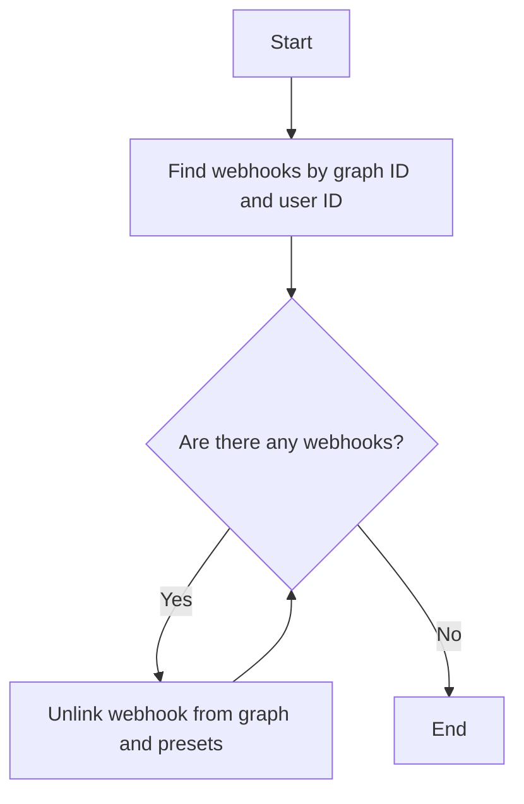
```mermaid
graph TD
    A[Start] --> B[Find webhooks by graph ID and user ID]
    B --> C{Are there any webhooks?}
    C -- Yes --> D[Unlink webhook from graph and presets]
    C -- No --> E[End]
    D --> C
```

#### 带注释源码

```python
async def _cleanup_webhooks_for_graph(graph_id: str, user_id: str) -> None:
    """
    Clean up webhook connections for a specific graph and user.
    Unlinks webhooks from this graph and deletes them if no other triggers remain.

    Args:
        graph_id: The ID of the graph
        user_id: The ID of the user
    """
    # Find all webhooks that trigger nodes in this graph
    webhooks = await integrations_db.find_webhooks_by_graph_id(
        graph_id=graph_id, user_id=user_id
    )

    for webhook in webhooks:
        try:
            # Unlink webhook from this graph's nodes and presets
            await integrations_db.unlink_webhook_from_graph(
                webhook_id=webhook.id, graph_id=graph_id, user_id=user_id
            )
            logger.info(f"Unlinked webhook {webhook.id} from graph {graph_id}")
        except Exception:
            logger.exception(
                f"Failed to unlink webhook {webhook.id} from graph {graph_id}"
            )
```

### delete_library_agent_by_graph_id(graph_id: str, user_id: str) -> None

删除给定用户库中的特定图ID的库代理。

参数：

- `graph_id`：`str`，库代理的图ID。
- `user_id`：`str`，库代理所属用户的ID。

返回值：`None`

#### 流程图

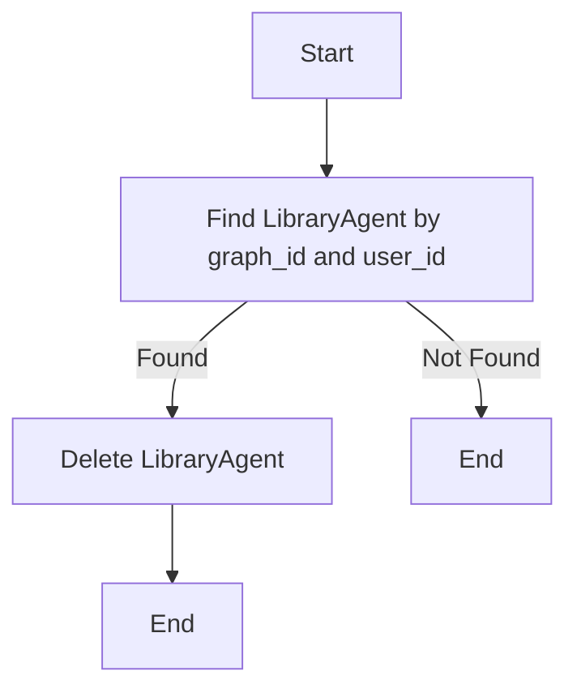
```mermaid
graph TD
    A[Start] --> B[Find LibraryAgent by graph_id and user_id]
    B -->|Found| C[Delete LibraryAgent]
    B -->|Not Found| D[End]
    C --> E[End]
```

#### 带注释源码

```python
async def delete_library_agent_by_graph_id(graph_id: str, user_id: str) -> None:
    """
    Deletes a library agent for the given user
    """
    try:
        await prisma.models.LibraryAgent.prisma().delete_many(
            where={"agentGraphId": graph_id, "userId": user_id}
        )
    except prisma.errors.PrismaError as e:
        logger.error(f"Database error deleting library agent: {e}")
        raise DatabaseError("Failed to delete library agent") from e
```


### add_store_agent_to_library

Adds an agent from a store listing version to the user's library if they don't already have it.

参数：

- `store_listing_version_id`：`str`，The ID of the store listing version containing the agent.
- `user_id`：`str`，The user’s library to which the agent is being added.

返回值：`library_model.LibraryAgent`，The newly created LibraryAgent if successfully added, the existing corresponding one if any.

#### 流程图

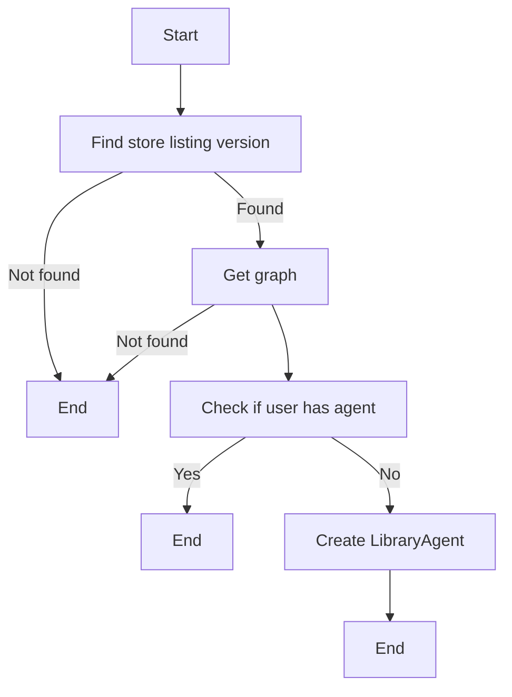
```mermaid
graph TD
    A[Start] --> B[Find store listing version]
    B -->|Not found| C[End]
    B -->|Found| D[Get graph]
    D -->|Not found| C[End]
    D --> E[Check if user has agent]
    E -->|Yes| F[End]
    E -->|No| G[Create LibraryAgent]
    G --> H[End]
```

#### 带注释源码

```python
async def add_store_agent_to_library(
    store_listing_version_id: str, user_id: str
) -> library_model.LibraryAgent:
    """
    Adds an agent from a store listing version to the user's library if they don't already have it.

    Args:
        store_listing_version_id: The ID of the store listing version containing the agent.
        user_id: The user’s library to which the agent is being added.

    Returns:
        The newly created LibraryAgent if successfully added, the existing corresponding one if any.

    Raises:
        AgentNotFoundError: If the store listing or associated agent is not found.
        DatabaseError: If there's an issue creating the LibraryAgent record.
    """
    logger.debug(
        f"Adding agent from store listing version #{store_listing_version_id} "
        f"to library for user #{user_id}"
    )

    try:
        store_listing_version = (
            await prisma.models.StoreListingVersion.prisma().find_unique(
                where={"id": store_listing_version_id}, include={"AgentGraph": True}
            )
        )
        if not store_listing_version or not store_listing_version.AgentGraph:
            logger.warning(
                f"Store listing version not found: {store_listing_version_id}"
            )
            raise store_exceptions.AgentNotFoundError(
                f"Store listing version {store_listing_version_id} not found or invalid"
            )

        graph = store_listing_version.AgentGraph

        # Convert to GraphModel to check for HITL blocks
        graph_model = await graph_db.get_graph(
            graph_id=graph.id,
            version=graph.version,
            user_id=user_id,
            include_subgraphs=False,
        )
        if not graph_model:
            raise store_exceptions.AgentNotFoundError(
                f"Graph #{graph.id} v{graph.version} not found or accessible"
            )

        # Check if user already has this agent
        existing_library_agent = await prisma.models.LibraryAgent.prisma().find_unique(
            where={
                "userId_agentGraphId_agentGraphVersion": {
                    "userId": user_id,
                    "agentGraphId": graph.id,
                    "agentGraphVersion": graph.version,
                }
            },
            include={"AgentGraph": True},
        )
        if existing_library_agent:
            if existing_library_agent.isDeleted:
                # Even if agent exists it needs to be marked as not deleted
                await update_library_agent(
                    existing_library_agent.id, user_id, is_deleted=False
                )
            else:
                logger.debug(
                    f"User #{user_id} already has graph #{graph.id} "
                    f"v{graph.version} in their library"
                )
            return library_model.LibraryAgent.from_db(existing_library_agent)

        # Create LibraryAgent entry
        added_agent = await prisma.models.LibraryAgent.prisma().create(
            data={
                "User": {"connect": {"id": user_id}},
                "AgentGraph": {
                    "connect": {
                        "graphVersionId": {"id": graph.id, "version": graph.version}
                    }
                },
                "isCreatedByUser": False,
                "useGraphIsActiveVersion": False,
                "settings": SafeJson(
                    GraphSettings.from_graph(graph_model).model_dump()
                ),
            },
            include=library_agent_include(
                user_id, include_nodes=False, include_executions=False
            ),
        )
        logger.debug(
            f"Added graph #{graph.id} v{graph.version}"
            f"for store listing version #{store_listing_version.id} "
            f"to library for user #{user_id}"
        )
        return library_model.LibraryAgent.from_db(added_agent)
    except store_exceptions.AgentNotFoundError:
        # Reraise for external handling.
        raise
    except prisma.errors.PrismaError as e:
        logger.error(f"Database error adding agent to library: {e}")
        raise DatabaseError("Failed to add agent to library") from e
``

### list_presets

Retrieves a paginated list of AgentPresets for the specified user.

参数：

- `user_id`：`str`，The user ID whose presets are being retrieved.
- `page`：`int`，The current page index (1-based).
- `page_size`：`int`，Number of items to retrieve per page.
- `graph_id`：`Optional[str]`，Agent Graph ID to filter by.

返回值：`library_model.LibraryAgentPresetResponse`，A LibraryAgentPresetResponse containing a list of presets and pagination info.

#### 流程图

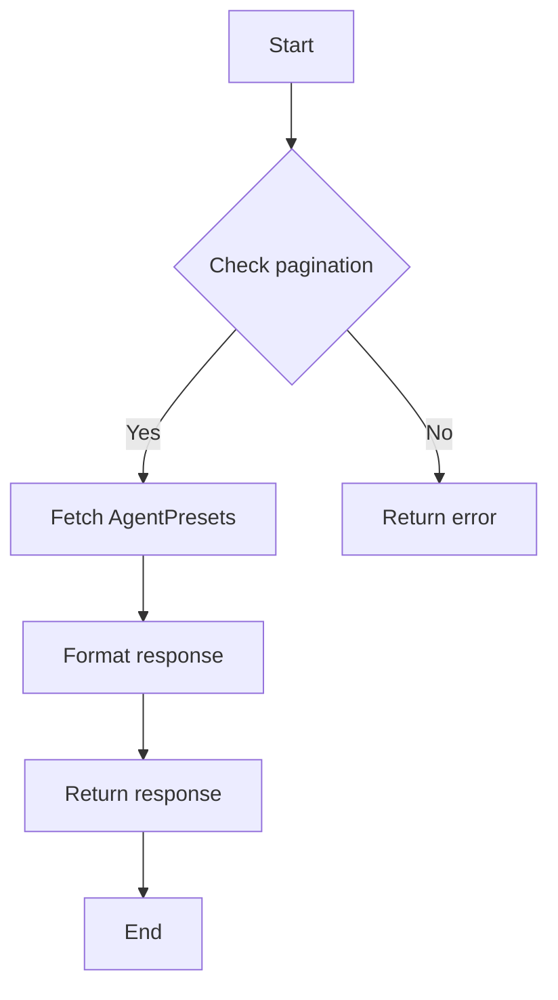
```mermaid
graph TD
    A[Start] --> B{Check pagination}
    B -->|Yes| C[Fetch AgentPresets]
    B -->|No| D[Return error]
    C --> E[Format response]
    E --> F[Return response]
    F --> G[End]
```

#### 带注释源码

```python
async def list_presets(
    user_id: str, page: int, page_size: int, graph_id: Optional[str] = None
) -> library_model.LibraryAgentPresetResponse:
    """
    Retrieves a paginated list of AgentPresets for the specified user.

    Args:
        user_id: The user ID whose presets are being retrieved.
        page: The current page index (1-based).
        page_size: Number of items to retrieve per page.
        graph_id: Agent Graph ID to filter by.

    Returns:
        A LibraryAgentPresetResponse containing a list of presets and pagination info.

    Raises:
        DatabaseError: If there's a database error during the operation.
    """
    logger.debug(
        f"Fetching presets for user #{user_id}, page={page}, page_size={page_size}"
    )

    if page < 1 or page_size < 1:
        logger.warning(
            "Invalid pagination input: page=%d, page_size=%d", page, page_size
        )
        raise DatabaseError("Invalid pagination parameters")

    query_filter: prisma.types.AgentPresetWhereInput = {
        "userId": user_id,
        "isDeleted": False,
    }
    if graph_id:
        query_filter["agentGraphId"] = graph_id

    try:
        presets_records = await prisma.models.AgentPreset.prisma().find_many(
            where=query_filter,
            skip=(page - 1) * page_size,
            take=page_size,
            include=AGENT_PRESET_INCLUDE,
        )
        total_items = await prisma.models.AgentPreset.prisma().count(where=query_filter)
        total_pages = (total_items + page_size - 1) // page_size

        presets = [
            library_model.LibraryAgentPreset.from_db(preset)
            for preset in presets_records
        ]

        return library_model.LibraryAgentPresetResponse(
            presets=presets,
            pagination=Pagination(
                total_items=total_items,
                total_pages=total_pages,
                current_page=page,
                page_size=page_size,
            ),
        )

    except prisma.errors.PrismaError as e:
        logger.error(f"Database error getting presets: {e}")
        raise DatabaseError("Failed to fetch presets") from e
```

### get_preset

Retrieves a single AgentPreset by its ID for a given user.

参数：

- `user_id`：`str`，The user that owns the preset.
- `preset_id`：`str`，The ID of the preset.

返回值：`library_model.LibraryAgentPreset`，A LibraryAgentPreset if it exists and matches the user, otherwise None.

#### 流程图

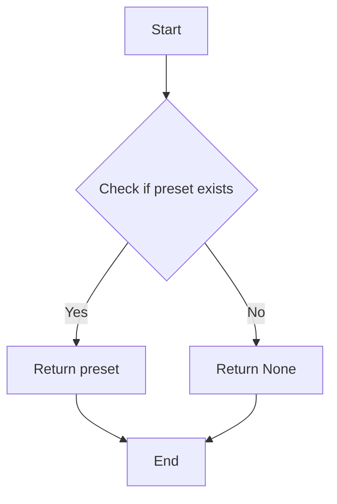
```mermaid
graph TD
    A[Start] --> B{Check if preset exists}
    B -- Yes --> C[Return preset]
    B -- No --> D[Return None]
    C --> E[End]
    D --> E
```

#### 带注释源码

```python
async def get_preset(
    user_id: str, preset_id: str
) -> library_model.LibraryAgentPreset | None:
    """
    Retrieves a single AgentPreset by its ID for a given user.

    Args:
        user_id: The user that owns the preset.
        preset_id: The ID of the preset.

    Returns:
        A LibraryAgentPreset if it exists and matches the user, otherwise None.

    Raises:
        DatabaseError: If there's a database error during the fetch.
    """
    logger.debug(f"Fetching preset #{preset_id} for user #{user_id}")
    try:
        preset = await prisma.models.AgentPreset.prisma().find_unique(
            where={"id": preset_id},
            include=AGENT_PRESET_INCLUDE,
        )
        if not preset or preset.userId != user_id or preset.isDeleted:
            return None
        return library_model.LibraryAgentPreset.from_db(preset)
    except prisma.errors.PrismaError as e:
        logger.error(f"Database error getting preset: {e}")
        raise DatabaseError("Failed to fetch preset") from e
```

### create_preset

This function creates a new AgentPreset for a user.

参数：

- `user_id`：`str`，The ID of the user creating the preset.
- `preset`：`library_model.LibraryAgentPresetCreatable`，The preset data used for creation.

返回值：`library_model.LibraryAgentPreset`，The newly created LibraryAgentPreset.

#### 流程图

```mermaid
graph TD
    A[Start] --> B{Check user_id and preset}
    B -->|Yes| C[Create AgentPreset]
    C --> D[Return created preset]
    B -->|No| E[Error: Invalid input]
    D --> F[End]
    E --> G[End]
```

#### 带注释源码

```python
async def create_preset(
    user_id: str,
    preset: library_model.LibraryAgentPresetCreatable,
) -> library_model.LibraryAgentPreset:
    """
    Creates a new AgentPreset for a user.

    Args:
        user_id: The ID of the user creating the preset.
        preset: The preset data used for creation.

    Returns:
        The newly created LibraryAgentPreset.

    Raises:
        DatabaseError: If there's a database error in creating the preset.
    """
    logger.debug(
        f"Creating preset ({repr(preset.name)}) for user #{user_id}",
    )
    try:
        new_preset = await prisma.models.AgentPreset.prisma().create(
            data=prisma.types.AgentPresetCreateInput(
                userId=user_id,
                name=preset.name,
                description=preset.description,
                agentGraphId=preset.graph_id,
                agentGraphVersion=preset.graph_version,
                isActive=preset.is_active,
                webhookId=preset.webhook_id,
                InputPresets={
                    "create": [
                        prisma.types.AgentNodeExecutionInputOutputCreateWithoutRelationsInput(  # noqa
                            name=name, data=SafeJson(data)
                        )
                        for name, data in {
                            **preset.inputs,
                            **preset.credentials,
                        }.items()
                    ]
                },
            ),
            include=AGENT_PRESET_INCLUDE,
        )
        return library_model.LibraryAgentPreset.from_db(new_preset)
    except prisma.errors.PrismaError as e:
        logger.error(f"Database error creating preset: {e}")
        raise DatabaseError("Failed to create preset") from e
```


### create_preset_from_graph_execution

This function creates a new AgentPreset from an AgentGraphExecution.

参数：

- `user_id`：`str`，The ID of the user creating the preset.
- `create_request`：`library_model.LibraryAgentPresetCreatableFromGraphExecution`，The data used for creation.

返回值：`library_model.LibraryAgentPreset`，The newly created LibraryAgentPreset.

#### 流程图

```mermaid
graph TD
    A[Start] --> B{Get graph execution}
    B -->|Graph execution found| C[Create preset]
    B -->|Graph execution not found| D[Error]
    C --> E[Return preset]
    D --> F[Error]
    E --> G[End]
    F --> G
```

#### 带注释源码

```python
async def create_preset_from_graph_execution(
    user_id: str,
    create_request: library_model.LibraryAgentPresetCreatableFromGraphExecution,
) -> library_model.LibraryAgentPreset:
    """
    Creates a new AgentPreset from an AgentGraphExecution.

    Params:
        user_id: The ID of the user creating the preset.
        create_request: The data used for creation.

    Returns:
        The newly created LibraryAgentPreset.

    Raises:
        DatabaseError: If there's a database error in creating the preset.
    """
    graph_exec_id = create_request.graph_execution_id
    graph_execution = await get_graph_execution(user_id, graph_exec_id)
    if not graph_execution:
        raise NotFoundError(f"Graph execution #{graph_exec_id} not found")

    # Sanity check: credential inputs must be available if required for this preset
    if graph_execution.credential_inputs is None:
        graph = await graph_db.get_graph(
            graph_id=graph_execution.graph_id,
            version=graph_execution.graph_version,
            user_id=graph_execution.user_id,
            include_subgraphs=True,
        )
        if not graph:
            raise NotFoundError(
                f"Graph #{graph_execution.graph_id} not found or accessible"
            )
        elif len(graph.aggregate_credentials_inputs()) > 0:
            raise ValueError(
                f"Graph execution #{graph_exec_id} can't be turned into a preset "
                "because it was run before this feature existed "
                "and so the input credentials were not saved."
            )

    logger.debug(
        f"Creating preset for user #{user_id} from graph execution #{graph_exec_id}",
    )
    return await create_preset(
        user_id=user_id,
        preset=library_model.LibraryAgentPresetCreatable(
            inputs=graph_execution.inputs,
            credentials=graph_execution.credential_inputs or {},
            graph_id=graph_execution.graph_id,
            graph_version=graph_execution.graph_version,
            name=create_request.name,
            description=create_request.description,
            is_active=create_request.is_active,
        ),
    )
```


### update_preset

Updates an existing AgentPreset for a user.

参数：

- `user_id`：`str`，The ID of the user updating the preset.
- `preset_id`：`str`，The ID of the preset to update.
- `inputs`：`Optional[BlockInput]`，New inputs object to set on the preset.
- `credentials`：`Optional[dict[str, CredentialsMetaInput]]`，New credentials to set on the preset.
- `name`：`Optional[str]`，New name for the preset.
- `description`：`Optional[str]`，New description for the preset.
- `is_active`：`Optional[bool]`，New active status for the preset.

返回值：`library_model.LibraryAgentPreset`，The updated LibraryAgentPreset.

#### 流程图

```mermaid
graph TD
    A[Start] --> B[Get current preset]
    B -->|Preset not found| C[Error: Not found]
    B -->|Preset found| D[Update preset data]
    D --> E[Update inputs and credentials]
    E -->|No inputs or credentials| F[Update name, description, and active status]
    F --> G[Update preset in database]
    G --> H[Return updated preset]
    H --> I[End]
```

#### 带注释源码

```python
async def update_preset(
    user_id: str,
    preset_id: str,
    inputs: Optional[BlockInput] = None,
    credentials: Optional[dict[str, CredentialsMetaInput]] = None,
    name: Optional[str] = None,
    description: Optional[str] = None,
    is_active: Optional[bool] = None,
) -> library_model.LibraryAgentPreset:
    current = await get_preset(user_id, preset_id)  # assert ownership
    if not current:
        raise NotFoundError(f"Preset #{preset_id} not found for user #{user_id}")
    logger.debug(
        f"Updating preset #{preset_id} ({repr(current.name)}) for user #{user_id}",
    )
    try:
        async with transaction() as tx:
            update_data: prisma.types.AgentPresetUpdateInput = {}
            if name:
                update_data["name"] = name
            if description:
                update_data["description"] = description
            if is_active is not None:
                update_data["isActive"] = is_active
            if inputs or credentials:
                if not (inputs and credentials):
                    raise ValueError(
                        "Preset inputs and credentials must be provided together"
                    )
                update_data["InputPresets"] = {
                    "create": [
                        prisma.types.AgentNodeExecutionInputOutputCreateWithoutRelationsInput(  # noqa
                            name=name, data=SafeJson(data)
                        )
                        for name, data in {
                            **inputs,
                            **{
                                key: creds_meta.model_dump(exclude_none=True)
                                for key, creds_meta in credentials.items()
                            },
                        }.items()
                    ],
                }
                # Existing InputPresets must be deleted, in a separate query
                await prisma.models.AgentNodeExecutionInputOutput.prisma(
                    tx
                ).delete_many(where={"agentPresetId": preset_id})

            updated = await prisma.models.AgentPreset.prisma(tx).update(
                where={"id": preset_id},
                data=update_data,
                include=AGENT_PRESET_INCLUDE,
            )
        if not updated:
            raise RuntimeError(f"AgentPreset #{preset_id} vanished while updating")
        return library_model.LibraryAgentPreset.from_db(updated)
    except prisma.errors.PrismaError as e:
        logger.error(f"Database error updating preset: {e}")
        raise DatabaseError("Failed to update preset") from e
```

### set_preset_webhook

This function updates an existing AgentPreset by setting or disconnecting a webhook associated with it.

参数：

- `user_id`：`str`，The ID of the user that owns the preset.
- `preset_id`：`str`，The ID of the preset to update.
- `webhook_id`：`str | None`，The ID of the webhook to connect to the preset. If `None`, the webhook is disconnected.

返回值：`library_model.LibraryAgentPreset`，The updated LibraryAgentPreset.

#### 流程图

```mermaid
graph TD
    A[Start] --> B{Check if preset exists?}
    B -- Yes --> C[Update preset with webhook ID]
    B -- No --> D[Return error]
    C --> E[Return updated preset]
    E --> F[End]
    D --> F
```

#### 带注释源码

```python
async def set_preset_webhook(
    user_id: str, preset_id: str, webhook_id: str | None
) -> library_model.LibraryAgentPreset:
    current = await prisma.models.AgentPreset.prisma().find_unique(
        where={"id": preset_id},
        include=AGENT_PRESET_INCLUDE,
    )
    if not current or current.userId != user_id:
        raise NotFoundError(f"Preset #{preset_id} not found")

    updated = await prisma.models.AgentPreset.prisma().update(
        where={"id": preset_id},
        data=(
            {"Webhook": {"connect": {"id": webhook_id}}}
            if webhook_id
            else {"Webhook": {"disconnect": True}}
        ),
        include=AGENT_PRESET_INCLUDE,
    )
    if not updated:
        raise RuntimeError(f"AgentPreset #{preset_id} vanished while updating")
    return library_model.LibraryAgentPreset.from_db(updated)
```

### delete_preset

Soft-deletes a preset by marking it as isDeleted = True.

参数：

- `user_id`：`str`，The user that owns the preset.
- `preset_id`：`str`，The ID of the preset to delete.

返回值：`None`，No return value, the operation is a void function.

#### 流程图

```mermaid
graph TD
    A[Start] --> B[Check if preset exists]
    B -->|Yes| C[Update preset isDeleted to True]
    B -->|No| D[Error: Preset not found]
    C --> E[End]
    D --> E
```

#### 带注释源码

```python
async def delete_preset(user_id: str, preset_id: str) -> None:
    """
    Soft-deletes a preset by marking it as isDeleted = True.

    Args:
        user_id: The user that owns the preset.
        preset_id: The ID of the preset to delete.

    Raises:
        DatabaseError: If there's a database error during deletion.
    """
    logger.debug(f"Setting preset #{preset_id} for user #{user_id} to deleted")
    try:
        await prisma.models.AgentPreset.prisma().update_many(
            where={"id": preset_id, "userId": user_id},
            data={"isDeleted": True},
        )
    except prisma.errors.PrismaError as e:
        logger.error(f"Database error deleting preset: {e}")
        raise DatabaseError("Failed to delete preset") from e
```


### fork_library_agent

Clones a library agent and its underlying graph and nodes (with new ids) for the given user.

参数：

- `library_agent_id`：`str`，The ID of the library agent to fork.
- `user_id`：`str`，The ID of the user who owns the library agent.

返回值：`library_model.LibraryAgent`，The forked parent (if it has sub-graphs) LibraryAgent.

#### 流程图

```mermaid
graph TD
    A[Start] --> B[Fetch original agent]
    B --> C{Check ownership}
    C -- Yes --> D[Fetch underlying graph and nodes]
    D --> E[Create new graph]
    E --> F[Create library agent]
    F --> G[End]
    C -- No --> H[Error]
    H --> G
```

#### 带注释源码

```python
async def fork_library_agent(
    library_agent_id: str, user_id: str
) -> library_model.LibraryAgent:
    """
    Clones a library agent and its underlying graph and nodes (with new ids) for the given user.

    Args:
        library_agent_id: The ID of the library agent to fork.
        user_id: The ID of the user who owns the library agent.

    Returns:
        The forked parent (if it has sub-graphs) LibraryAgent.

    Raises:
        DatabaseError: If there's an error during the forking process.
    """
    logger.debug(f"Forking library agent {library_agent_id} for user {user_id}")
    try:
        # Fetch the original agent
        original_agent = await get_library_agent(library_agent_id, user_id)

        # Check if user owns the library agent
        # TODO: once we have open/closed sourced agents this needs to be enabled ~kcze
        # + update library/agents/[id]/page.tsx agent actions
        # if not original_agent.can_access_graph:
        #     raise DatabaseError(
        #         f"User {user_id} cannot access library agent graph {library_agent_id}"
        #     )

        # Fork the underlying graph and nodes
        new_graph = await graph_db.fork_graph(
            original_agent.graph_id, original_agent.graph_version, user_id
        )
        new_graph = await on_graph_activate(new_graph, user_id=user_id)

        # Create a library agent for the new graph, preserving safe mode settings
        return (
            await create_library_agent(
                new_graph,
                user_id,
                hitl_safe_mode=original_agent.settings.human_in_the_loop_safe_mode,
                sensitive_action_safe_mode=original_agent.settings.sensitive_action_safe_mode,
            )
        )[0]
    except prisma.errors.PrismaError as e:
        logger.error(f"Database error cloning library agent: {e}")
        raise DatabaseError("Failed to fork library agent") from e
```


### LibraryAgent.from_db

This function converts a Prisma database record into a `LibraryAgent` object.

#### 参数

- `agent`：`prisma.models.LibraryAgent`，The Prisma database record representing a LibraryAgent.

#### 返回值

- `library_model.LibraryAgent`，The `LibraryAgent` object created from the database record.

#### 流程图

```mermaid
graph TD
    A[Start] --> B{Is agent valid?}
    B -- Yes --> C[Create LibraryAgent]
    B -- No --> D[End]
    C --> E[Return LibraryAgent]
    D --> E
```

#### 带注释源码

```python
def from_db(agent: prisma.models.LibraryAgent) -> library_model.LibraryAgent:
    """
    Converts a Prisma database record into a LibraryAgent object.

    Args:
        agent: The Prisma database record representing a LibraryAgent.

    Returns:
        The LibraryAgent object created from the database record.
    """
    # Create a LibraryAgent object from the database record
    library_agent = library_model.LibraryAgent(
        id=agent.id,
        name=agent.name,
        description=agent.description,
        graph_id=agent.agentGraphId,
        graph_version=agent.agentGraphVersion,
        is_favorite=agent.isFavorite,
        is_archived=agent.isArchived,
        is_deleted=agent.isDeleted,
        settings=SafeJson.loads(agent.settings),
        created_at=agent.createdAt,
        updated_at=agent.updatedAt,
    )
    return library_agent
```

### LibraryAgent.to_db

This function converts a `LibraryAgent` object from the database into a `LibraryAgent` object.

#### 参数

- `agent`: `prisma.models.LibraryAgent`，The database record of the LibraryAgent.

#### 返回值

- `library_model.LibraryAgent`，The converted `LibraryAgent` object.

#### 流程图

```mermaid
graph TD
    A[Start] --> B{Is agent valid?}
    B -- Yes --> C[Convert to LibraryAgent]
    B -- No --> D[End]
    C --> E[Return LibraryAgent]
    D --> E
```

#### 带注释源码

```python
class LibraryAgent:
    # ... other methods ...

    @staticmethod
    async def from_db(agent: prisma.models.LibraryAgent) -> "LibraryAgent":
        """
        Converts a database record of a LibraryAgent into a LibraryAgent object.

        Args:
            agent: The database record of the LibraryAgent.

        Returns:
            A LibraryAgent object.
        """
        # ... conversion logic ...
```

## 关键组件


### 张量索引与惰性加载

张量索引与惰性加载是代码中用于高效处理大规模数据集的关键组件。它允许在需要时才加载数据，从而减少内存消耗并提高性能。

### 反量化支持

反量化支持是代码中用于处理量化数据的关键组件。它允许对量化数据进行反量化处理，以便进行进一步的分析或操作。

### 量化策略

量化策略是代码中用于优化模型性能的关键组件。它通过减少模型参数的精度来降低模型的复杂度，从而提高模型的运行速度和降低内存消耗。


## 问题及建议


### 已知问题

-   **代码重复**：`library_agent_include` 函数在多个地方被调用，这可能导致维护困难。建议将其定义为类方法或全局函数，并在需要的地方调用。
-   **异常处理**：代码中存在多个 `try-except` 块，但异常处理逻辑不够清晰。建议为每种异常定义明确的处理逻辑，并使用更具体的异常类型。
-   **日志记录**：日志记录不够详细，难以追踪问题。建议在关键步骤添加更多日志信息，包括错误信息和调试信息。
-   **代码结构**：代码结构较为复杂，难以阅读和理解。建议使用更清晰的命名规范和代码组织结构，以提高代码的可读性和可维护性。

### 优化建议

-   **重构 `library_agent_include` 函数**：将其定义为类方法或全局函数，并在需要的地方调用，以减少代码重复。
-   **改进异常处理**：为每种异常定义明确的处理逻辑，并使用更具体的异常类型，以提高代码的健壮性。
-   **增强日志记录**：在关键步骤添加更多日志信息，包括错误信息和调试信息，以便于问题追踪和调试。
-   **优化代码结构**：使用更清晰的命名规范和代码组织结构，以提高代码的可读性和可维护性。
-   **使用异步编程的最佳实践**：确保异步代码的正确性和效率，例如使用 `asyncio.gather` 来并发执行异步操作。
-   **代码审查**：定期进行代码审查，以发现潜在的问题和改进空间。


## 其它


### 设计目标与约束

- 设计目标：
  - 提供一个高效、可扩展的库，用于管理用户库中的图和代理。
  - 支持对图和代理进行增删改查操作，包括版本控制和状态管理。
  - 提供对预设的创建、更新、删除和检索功能。
  - 确保数据的一致性和完整性。
- 约束：
  - 使用 Prisma ORM 进行数据库操作，以提供高效的查询和事务管理。
  - 使用异步编程模式，以支持高并发处理。
  - 遵循 RESTful API 设计原则，以提供清晰、一致的接口。

### 错误处理与异常设计

- 错误处理：
  - 使用自定义异常类来处理特定错误情况，例如 `DatabaseError`、`InvalidInputError` 和 `NotFoundError`。
  - 在数据库操作中捕获 `prisma.errors.PrismaError` 并转换为自定义异常。
  - 在输入验证中捕获异常并抛出 `InvalidInputError`。
  - 在资源未找到时抛出 `NotFoundError`。
- 异常设计：
  - 异常类应提供清晰的错误信息和堆栈跟踪，以便于调试和错误追踪。
  - 异常类应遵循命名约定，以便于识别和处理不同类型的错误。

### 数据流与状态机

- 数据流：
  - 用户请求通过 API 接口发送到后端服务。
  - 后端服务根据请求类型执行相应的操作，例如创建、更新或删除图和代理。
  - 数据库操作通过 Prisma ORM 进行，以确保数据的一致性和完整性。
  - 操作结果返回给用户。
- 状态机：
  - 图和代理可以处于不同的状态，例如创建中、激活、停用和删除。
  - 状态转换由业务逻辑控制，例如激活图或停用图。

### 外部依赖与接口契约

- 外部依赖：
  - Prisma ORM：用于数据库操作。
  - FastAPI：用于构建 API 服务。
  - Pydantic：用于数据验证和序列化。
  - Asyncio：用于异步编程。
- 接口契约：
  - API 接口应遵循 RESTful 设计原则，包括使用 HTTP 方法、路径和状态码。
  - 接口应提供清晰的文档，包括请求和响应格式。
  - 接口应支持身份验证和授权，以确保安全性。


    