# `.\AutoGPT\autogpt_platform\backend\backend\api\features\library\db_test.py` 详细设计文档

This file contains the implementation of database operations related to library agents, including listing agents and adding agents to the library.

## 整体流程

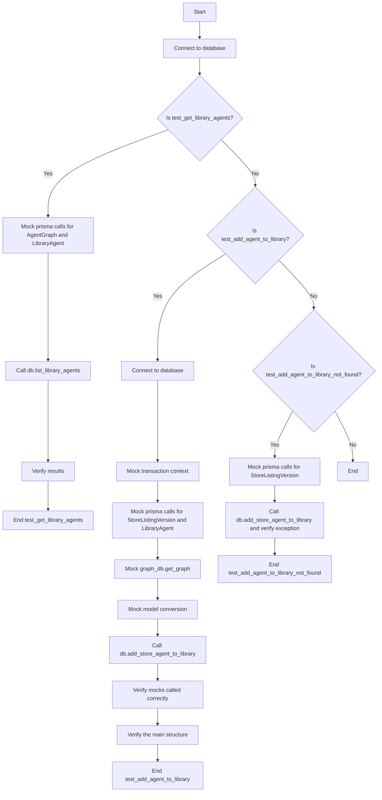

## 类结构

```
db (Database Operations)
├── list_library_agents (List library agents)
│   ├── connect (Connect to database)
│   └── verify_results (Verify results)
└── add_store_agent_to_library (Add store agent to library)
    ├── connect (Connect to database)
    ├── mock_transaction (Mock transaction context)
    ├── mock_prisma_calls (Mock prisma calls for StoreListingVersion and LibraryAgent)
    ├── mock_graph_db (Mock graph_db.get_graph)
    ├── mock_model_conversion (Mock model conversion)
    └── call_function (Call db.add_store_agent_to_library)
```

## 全局变量及字段


### `mock_user_created`
    
Mocked list of AgentGraph objects for testing purposes.

类型：`list of prisma.models.AgentGraph`
    


### `mock_library_agents`
    
Mocked list of LibraryAgent objects for testing purposes.

类型：`list of prisma.models.LibraryAgent`
    


### `mock_agent_graph`
    
Mocked prisma AgentGraph prisma object for testing purposes.

类型：`mocker.AsyncMock`
    


### `mock_library_agent`
    
Mocked prisma LibraryAgent prisma object for testing purposes.

类型：`mocker.AsyncMock`
    


### `mock_transaction`
    
Mocked transaction context for database operations.

类型：`mocker.AsyncMock`
    


### `mock_store_listing_data`
    
Mocked StoreListingVersion object for testing purposes.

类型：`prisma.models.StoreListingVersion`
    


### `mock_library_agent_data`
    
Mocked LibraryAgent object for testing purposes.

类型：`prisma.models.LibraryAgent`
    


### `mock_store_listing_version`
    
Mocked prisma StoreListingVersion prisma object for testing purposes.

类型：`mocker.AsyncMock`
    


### `mock_library_agent`
    
Mocked prisma LibraryAgent prisma object for testing purposes.

类型：`mocker.AsyncMock`
    


### `mock_graph_db`
    
Mocked graph_db object for testing purposes.

类型：`mocker.AsyncMock`
    


### `mock_graph_model`
    
Mocked graph model object for testing purposes.

类型：`mocker.Mock`
    


### `mock_from_db`
    
Mocked model conversion function for testing purposes.

类型：`mocker.AsyncMock`
    


### `result`
    
The result of the list_library_agents function.

类型：`db.ListLibraryAgentsResponse`
    


### `expected_data`
    
Expected data structure for verification purposes.

类型：`dict`
    


### `actual_data`
    
Actual data structure for verification purposes.

类型：`dict`
    


### `prisma.models.AgentGraph.id`
    
Unique identifier for the AgentGraph.

类型：`str`
    


### `prisma.models.AgentGraph.version`
    
Version number of the AgentGraph.

类型：`int`
    


### `prisma.models.AgentGraph.name`
    
Name of the AgentGraph.

类型：`str`
    


### `prisma.models.AgentGraph.description`
    
Description of the AgentGraph.

类型：`str`
    


### `prisma.models.AgentGraph.userId`
    
User ID associated with the AgentGraph.

类型：`str`
    


### `prisma.models.AgentGraph.isActive`
    
Indicates whether the AgentGraph is active.

类型：`bool`
    


### `prisma.models.AgentGraph.createdAt`
    
Creation timestamp of the AgentGraph.

类型：`datetime`
    


### `prisma.models.LibraryAgent.id`
    
Unique identifier for the LibraryAgent.

类型：`str`
    


### `prisma.models.LibraryAgent.userId`
    
User ID associated with the LibraryAgent.

类型：`str`
    


### `prisma.models.LibraryAgent.agentGraphId`
    
AgentGraph ID associated with the LibraryAgent.

类型：`str`
    


### `prisma.models.LibraryAgent.settings`
    
Settings for the LibraryAgent.

类型：`str`
    


### `prisma.models.LibraryAgent.agentGraphVersion`
    
Version number of the associated AgentGraph.

类型：`int`
    


### `prisma.models.LibraryAgent.isCreatedByUser`
    
Indicates whether the LibraryAgent was created by the user.

类型：`bool`
    


### `prisma.models.LibraryAgent.isDeleted`
    
Indicates whether the LibraryAgent is deleted.

类型：`bool`
    


### `prisma.models.LibraryAgent.isArchived`
    
Indicates whether the LibraryAgent is archived.

类型：`bool`
    


### `prisma.models.LibraryAgent.createdAt`
    
Creation timestamp of the LibraryAgent.

类型：`datetime`
    


### `prisma.models.LibraryAgent.updatedAt`
    
Last update timestamp of the LibraryAgent.

类型：`datetime`
    


### `prisma.models.LibraryAgent.isFavorite`
    
Indicates whether the LibraryAgent is a favorite.

类型：`bool`
    


### `prisma.models.LibraryAgent.useGraphIsActiveVersion`
    
Indicates whether the LibraryAgent uses the active version of the associated AgentGraph.

类型：`bool`
    


### `prisma.models.StoreListingVersion.id`
    
Unique identifier for the StoreListingVersion.

类型：`str`
    


### `prisma.models.StoreListingVersion.version`
    
Version number of the StoreListingVersion.

类型：`int`
    


### `prisma.models.StoreListingVersion.createdAt`
    
Creation timestamp of the StoreListingVersion.

类型：`datetime`
    


### `prisma.models.StoreListingVersion.updatedAt`
    
Last update timestamp of the StoreListingVersion.

类型：`datetime`
    


### `prisma.models.StoreListingVersion.agentGraphId`
    
AgentGraph ID associated with the StoreListingVersion.

类型：`str`
    


### `prisma.models.StoreListingVersion.agentGraphVersion`
    
Version number of the associated AgentGraph.

类型：`int`
    


### `prisma.models.StoreListingVersion.name`
    
Name of the StoreListingVersion.

类型：`str`
    


### `prisma.models.StoreListingVersion.subHeading`
    
Subheading of the StoreListingVersion.

类型：`str`
    


### `prisma.models.StoreListingVersion.imageUrls`
    
Image URLs associated with the StoreListingVersion.

类型：`list of str`
    


### `prisma.models.StoreListingVersion.description`
    
Description of the StoreListingVersion.

类型：`str`
    


### `prisma.models.StoreListingVersion.categories`
    
Categories associated with the StoreListingVersion.

类型：`list of str`
    


### `prisma.models.StoreListingVersion.isFeatured`
    
Indicates whether the StoreListingVersion is featured.

类型：`bool`
    


### `prisma.models.StoreListingVersion.isDeleted`
    
Indicates whether the StoreListingVersion is deleted.

类型：`bool`
    


### `prisma.models.StoreListingVersion.isAvailable`
    
Indicates whether the StoreListingVersion is available.

类型：`bool`
    


### `prisma.models.StoreListingVersion.storeListingId`
    
StoreListing ID associated with the StoreListingVersion.

类型：`str`
    


### `prisma.models.StoreListingVersion.submissionStatus`
    
Submission status of the StoreListingVersion.

类型：`prisma.enums.SubmissionStatus`
    


### `prisma.models.StoreListingVersion.AgentGraph`
    
Associated AgentGraph object.

类型：`prisma.models.AgentGraph`
    
    

## 全局函数及方法


### test_get_library_agents

This function tests the `list_library_agents` function, which retrieves library agents for a given user.

参数：

- `mocker`：`pytest_mock.MockerFixture`，用于模拟依赖项

返回值：无

#### 流程图

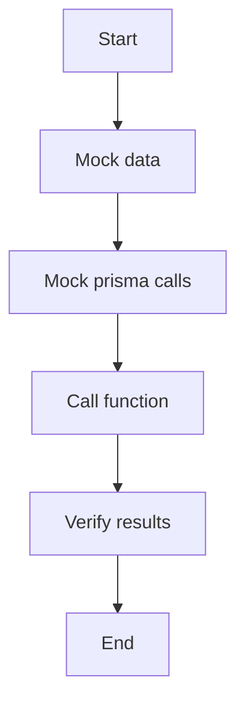

#### 带注释源码

```python
@pytest.mark.asyncio
async def test_get_library_agents(mocker):
    # Mock data
    mock_user_created = [
        prisma.models.AgentGraph(
            id="agent1",
            version=1,
            name="Test Agent 1",
            description="Test Description 1",
            userId="test-user",
            isActive=True,
            createdAt=datetime.now(),
        )
    ]

    mock_library_agents = [
        prisma.models.LibraryAgent(
            id="ua1",
            userId="test-user",
            agentGraphId="agent2",
            settings="{}",  # type: ignore
            agentGraphVersion=1,
            isCreatedByUser=False,
            isDeleted=False,
            isArchived=False,
            createdAt=datetime.now(),
            updatedAt=datetime.now(),
            isFavorite=False,
            useGraphIsActiveVersion=True,
            AgentGraph=prisma.models.AgentGraph(
                id="agent2",
                version=1,
                name="Test Agent 2",
                description="Test Description 2",
                userId="other-user",
                isActive=True,
                createdAt=datetime.now(),
            ),
        )
    ]

    # Mock prisma calls
    mock_agent_graph = mocker.patch("prisma.models.AgentGraph.prisma")
    mock_agent_graph.return_value.find_many = mocker.AsyncMock(
        return_value=mock_user_created
    )

    mock_library_agent = mocker.patch("prisma.models.LibraryAgent.prisma")
    mock_library_agent.return_value.find_many = mocker.AsyncMock(
        return_value=mock_library_agents
    )
    mock_library_agent.return_value.count = mocker.AsyncMock(return_value=1)

    # Call function
    result = await db.list_library_agents("test-user")

    # Verify results
    assert len(result.agents) == 1
    assert result.agents[0].id == "ua1"
    assert result.agents[0].name == "Test Agent 2"
    assert result.agents[0].description == "Test Description 2"
    assert result.agents[0].graph_id == "agent2"
    assert result.agents[0].graph_version == 1
    assert result.agents[0].can_access_graph is False
    assert result.agents[0].is_latest_version is True
    assert result.pagination.total_items == 1
    assert result.pagination.total_pages == 1
    assert result.pagination.current_page == 1
    assert result.pagination.page_size == 50
```


### `test_add_agent_to_library`

This function tests the `add_store_agent_to_library` method, which adds a store agent to the library for a given user.

参数：

- `mocker`：`pytest_mock.MockerFixture`，用于模拟依赖项和函数调用

返回值：无

#### 流程图

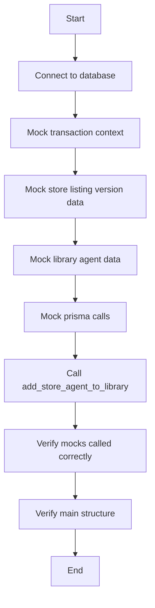

#### 带注释源码

```python
@pytest.mark.asyncio(loop_scope="session")
async def test_add_agent_to_library(mocker):
    await connect()

    # Mock the transaction context
    mock_transaction = mocker.patch("backend.api.features.library.db.transaction")
    mock_transaction.return_value.__aenter__ = mocker.AsyncMock(return_value=None)
    mock_transaction.return_value.__aexit__ = mocker.AsyncMock(return_value=None)

    # Mock data
    mock_store_listing_data = prisma.models.StoreListingVersion(
        id="version123",
        version=1,
        createdAt=datetime.now(),
        updatedAt=datetime.now(),
        agentGraphId="agent1",
        agentGraphVersion=1,
        name="Test Agent",
        subHeading="Test Agent Subheading",
        imageUrls=["https://example.com/image.jpg"],
        description="Test Description",
        categories=["test"],
        isFeatured=False,
        isDeleted=False,
        isAvailable=True,
        storeListingId="listing123",
        submissionStatus=prisma.enums.SubmissionStatus.APPROVED,
        AgentGraph=prisma.models.AgentGraph(
            id="agent1",
            version=1,
            name="Test Agent",
            description="Test Description",
            userId="creator",
            isActive=True,
            createdAt=datetime.now(),
        ),
    )

    mock_library_agent_data = prisma.models.LibraryAgent(
        id="ua1",
        userId="test-user",
        agentGraphId=mock_store_listing_data.agentGraphId,
        settings="{}",  # type: ignore
        agentGraphVersion=1,
        isCreatedByUser=False,
        isDeleted=False,
        isArchived=False,
        createdAt=datetime.now(),
        updatedAt=datetime.now(),
        isFavorite=False,
        useGraphIsActiveVersion=True,
        AgentGraph=mock_store_listing_data.AgentGraph,
    )

    # Mock prisma calls
    mock_store_listing_version = mocker.patch(
        "prisma.models.StoreListingVersion.prisma"
    )
    mock_store_listing_version.return_value.find_unique = mocker.AsyncMock(
        return_value=mock_store_listing_data
    )

    mock_library_agent = mocker.patch("prisma.models.LibraryAgent.prisma")
    mock_library_agent.return_value.find_unique = mocker.AsyncMock(return_value=None)
    mock_library_agent.return_value.create = mocker.AsyncMock(
        return_value=mock_library_agent_data
    )

    # Mock graph_db.get_graph function that's called to check for HITL blocks
    mock_graph_db = mocker.patch("backend.api.features.library.db.graph_db")
    mock_graph_model = mocker.Mock()
    mock_graph_model.nodes = (
        []
    )  # Empty list so _has_human_in_the_loop_blocks returns False
    mock_graph_db.get_graph = mocker.AsyncMock(return_value=mock_graph_model)

    # Mock the model conversion
    mock_from_db = mocker.patch(
        "backend.api.features.library.model.LibraryAgent.from_db"
    )
    mock_from_db.return_value = mocker.Mock()

    # Call function
    await db.add_store_agent_to_library("version123", "test-user")

    # Verify mocks called correctly
    mock_store_listing_version.return_value.find_unique.assert_called_once_with(
        where={"id": "version123"}, include={"AgentGraph": True}
    )
    mock_library_agent.return_value.find_unique.assert_called_once_with(
        where={
            "userId_agentGraphId_agentGraphVersion": {
                "userId": "test-user",
                "agentGraphId": "agent1",
                "agentGraphVersion": 1,
            }
        },
        include={"AgentGraph": True},
    )
    # Check that create was called with the expected data including settings
    create_call_args = mock_library_agent.return_value.create.call_args
    assert create_call_args is not None

    # Verify the main structure
    expected_data = {
        "User": {"connect": {"id": "test-user"}},
        "AgentGraph": {"connect": {"graphVersionId": {"id": "agent1", "version": 1}}},
        "isCreatedByUser": False,
    }

    actual_data = create_call_args[1]["data"]
    # Check that all expected fields are present
    for key, value in expected_data.items():
        assert actual_data[key] == value

    # Check that settings field is present and is a SafeJson object
    assert "settings" in actual_data
    assert hasattr(actual_data["settings"], "__class__")  # Should be a SafeJson object

    # Check include parameter
    assert create_call_args[1]["include"] == library_agent_include(
        "test-user", include_nodes=False, include_executions=False
    )
``` 


### `test_add_agent_to_library_not_found`

This function tests the scenario where the `add_store_agent_to_library` function is called with a non-existent store listing version ID, expecting an `AgentNotFoundError` to be raised.

参数：

- `mocker`：`pytest_mock.MockerFixture`，用于模拟依赖的函数和对象

返回值：无

#### 流程图

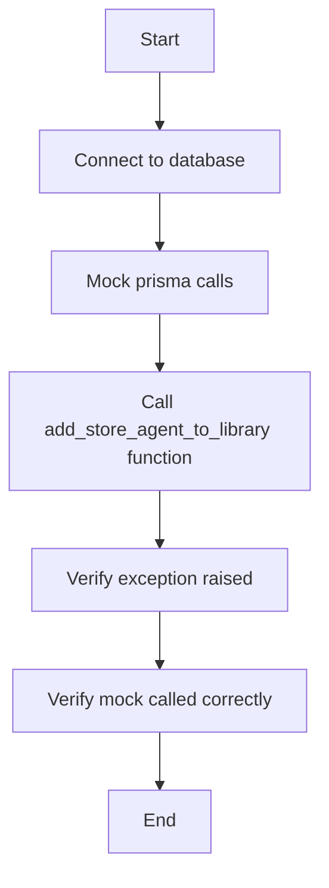

#### 带注释源码

```python
@pytest.mark.asyncio(loop_scope="session")
async def test_add_agent_to_library_not_found(mocker):
    await connect()
    # Mock prisma calls
    mock_store_listing_version = mocker.patch(
        "prisma.models.StoreListingVersion.prisma"
    )
    mock_store_listing_version.return_value.find_unique = mocker.AsyncMock(
        return_value=None
    )

    # Call function and verify exception
    with pytest.raises(backend.api.features.store.exceptions.AgentNotFoundError):
        await db.add_store_agent_to_library("version123", "test-user")

    # Verify mock called correctly
    mock_store_listing_version.return_value.find_unique.assert_called_once_with(
        where={"id": "version123"}, include={"AgentGraph": True}
    )
```


### `connect`

`connect` 方法用于连接到数据库。

参数：

- `id`：`str`，数据库连接的标识符。
- `version`：`int`，数据库连接的版本。

返回值：`None`，无返回值。

#### 流程图

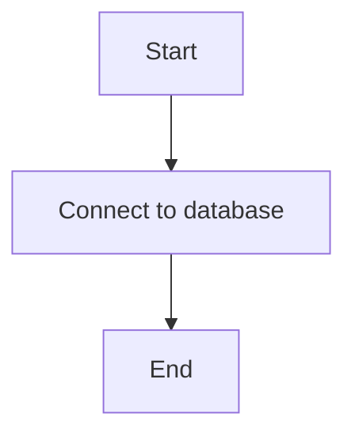

#### 带注释源码

```python
from datetime import datetime

import prisma.enums
import prisma.models
import pytest

import backend.api.features.store.exceptions
from backend.data.db import connect
from backend.data.includes import library_agent_include

from . import db

# ... (其他代码)

@pytest.mark.asyncio(loop_scope="session")
async def test_add_agent_to_library(mocker):
    await connect()

    # ... (其他代码)

    # Call function
    await db.add_store_agent_to_library("version123", "test-user")

    # ... (其他代码)

    # Verify the main structure
    expected_data = {
        "User": {"connect": {"id": "test-user"}},
        "AgentGraph": {"connect": {"graphVersionId": {"id": "agent1", "version": 1}}},
        "isCreatedByUser": False,
    }

    actual_data = create_call_args[1]["data"]
    # Check that all expected fields are present
    for key, value in expected_data.items():
        assert actual_data[key] == value

    # Check that settings field is present and is a SafeJson object
    assert "settings" in actual_data
    assert hasattr(actual_data["settings"], "__class__")  # Should be a SafeJson object

    # Check include parameter
    assert create_call_args[1]["include"] == library_agent_include(
        "test-user", include_nodes=False, include_executions=False
    )
```


### `db.list_library_agents`

列出库中的代理。

参数：

- `user_id`：`str`，用户ID，用于检索库中的代理。

返回值：`LibraryAgentResult`，包含代理列表和分页信息。

#### 流程图

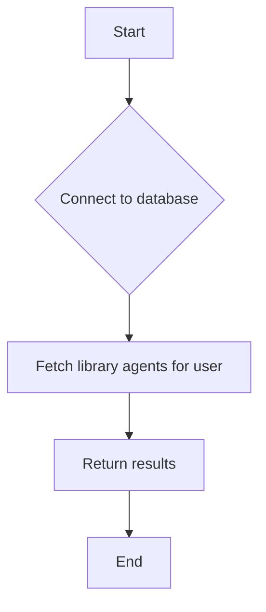

#### 带注释源码

```python
# 假设 db.py 中的 list_library_agents 函数如下所示：

async def list_library_agents(user_id: str) -> LibraryAgentResult:
    # Connect to the database
    async with connect() as db:
        # Fetch library agents for the user
        library_agents = await db.library_agent.find_many(
            where={"userId": user_id},
            include=library_agent_include(user_id)
        )
        # Return the results
        return LibraryAgentResult(
            agents=[LibraryAgent.from_db(agent) for agent in library_agents],
            pagination=Pagination(
                total_items=len(library_agents),
                total_pages=1,
                current_page=1,
                page_size=50
            )
        )
```


### `db.add_store_agent_to_library`

将代理添加到库中。

参数：

- `version_id`：`str`，版本ID，用于检索要添加的代理。
- `user_id`：`str`，用户ID，代理所属的用户。

返回值：`None`。

#### 流程图

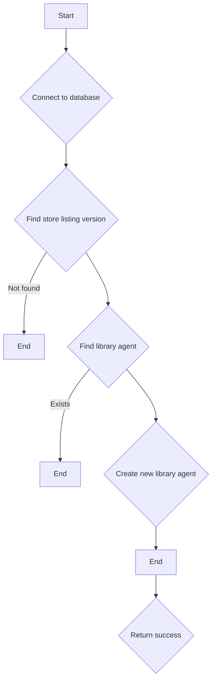

#### 带注释源码

```python
# 假设 db.py 中的 add_store_agent_to_library 函数如下所示：

async def add_store_agent_to_library(version_id: str, user_id: str) -> None:
    # Connect to the database
    async with connect() as db:
        # Find store listing version
        store_listing_version = await db.store_listing_version.find_unique(
            where={"id": version_id},
            include={"AgentGraph": True}
        )
        if store_listing_version is None:
            raise AgentNotFoundError("Store listing version not found")

        # Find library agent
        library_agent = await db.library_agent.find_unique(
            where={
                "userId_agentGraphId_agentGraphVersion": {
                    "userId": user_id,
                    "agentGraphId": store_listing_version.agentGraphId,
                    "agentGraphVersion": store_listing_version.agentGraphVersion,
                }
            },
            include={"AgentGraph": True}
        )
        if library_agent is not None:
            return

        # Create new library agent
        library_agent_data = LibraryAgent(
            userId=user_id,
            agentGraphId=store_listing_version.agentGraphId,
            settings={},
            agentGraphVersion=store_listing_version.agentGraphVersion,
            isCreatedByUser=False,
            isDeleted=False,
            isArchived=False,
            isFavorite=False,
            useGraphIsActiveVersion=True,
            AgentGraph=store_listing_version.AgentGraph
        )
        await db.library_agent.create(data=library_agent_data)
```


### `db.list_library_agents`

列出库中的代理。

参数：

- `user_id`：`str`，用户ID，用于检索库中的代理。

返回值：`LibraryAgentResult`，包含代理列表和分页信息。

#### 流程图

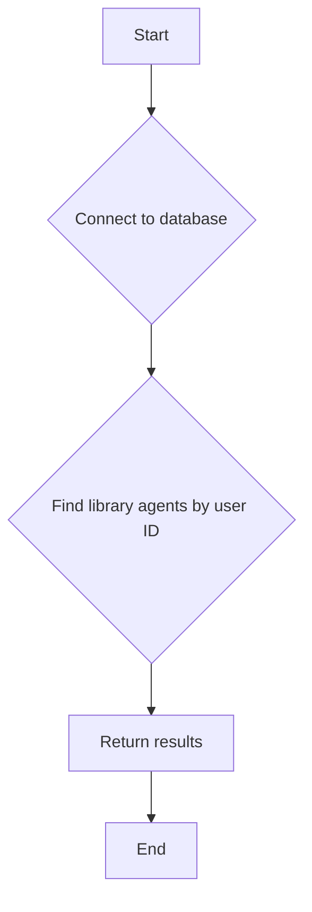

#### 带注释源码

```python
from datetime import datetime

from backend.data.db import connect
from backend.data.includes import library_agent_include
from backend.data.models import LibraryAgentResult
from prisma.models import LibraryAgent

async def list_library_agents(user_id: str) -> LibraryAgentResult:
    # Connect to database
    await connect()

    # Find library agents by user ID
    library_agents = await LibraryAgent.prisma.find_many(
        where={"userId": user_id},
        include=library_agent_include(user_id)
    )

    # Return results
    return LibraryAgentResult(
        agents=[LibraryAgent.from_db(agent) for agent in library_agents],
        pagination=Pagination(total_items=len(library_agents), total_pages=1, current_page=1, page_size=50)
    )
```

### `db.add_store_agent_to_library`

将代理添加到库中。

参数：

- `version_id`：`str`，版本ID，用于检索代理信息。
- `user_id`：`str`，用户ID，用于创建库中的代理。

返回值：`None`。

#### 流程图

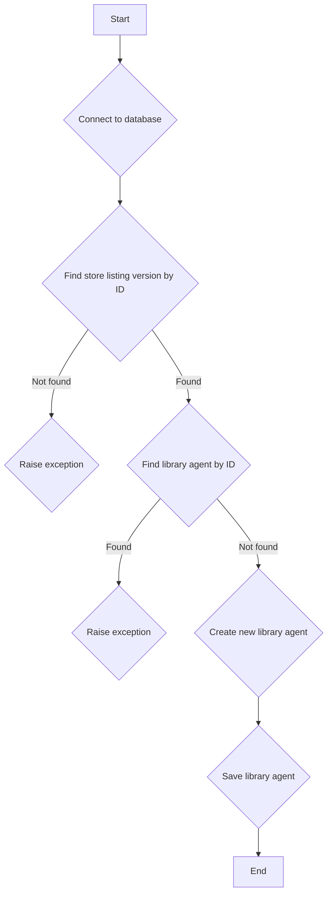

#### 带注释源码

```python
from datetime import datetime

from backend.data.db import connect
from backend.data.includes import library_agent_include
from backend.data.models import LibraryAgent
from prisma.models import StoreListingVersion, LibraryAgent

async def add_store_agent_to_library(version_id: str, user_id: str) -> None:
    # Connect to database
    await connect()

    # Find store listing version by ID
    store_listing_version = await StoreListingVersion.prisma.find_unique(
        where={"id": version_id},
        include={"AgentGraph": True}
    )

    if store_listing_version is None:
        raise exceptions.AgentNotFoundError("Agent not found")

    # Find library agent by ID
    library_agent = await LibraryAgent.prisma.find_unique(
        where={
            "userId_agentGraphId_agentGraphVersion": {
                "userId": user_id,
                "agentGraphId": store_listing_version.agentGraphId,
                "agentGraphVersion": store_listing_version.agentGraphVersion,
            }
        },
        include={"AgentGraph": True},
    )

    if library_agent is not None:
        raise exceptions.AgentAlreadyExistsError("Agent already exists")

    # Create new library agent
    library_agent_data = LibraryAgent(
        userId=user_id,
        agentGraphId=store_listing_version.agentGraphId,
        settings={},
        agentGraphVersion=store_listing_version.agentGraphVersion,
        isCreatedByUser=False,
        isDeleted=False,
        isArchived=False,
        createdAt=datetime.now(),
        updatedAt=datetime.now(),
        isFavorite=False,
        useGraphIsActiveVersion=True,
        AgentGraph=store_listing_version.AgentGraph,
    )

    # Save library agent
    await LibraryAgent.prisma.create(data=library_agent_data)
```

### `db.transaction`

执行数据库事务。

参数：

- `func`：`Callable`，要执行的事务函数。

返回值：`Callable`，执行事务后的结果。

#### 流程图

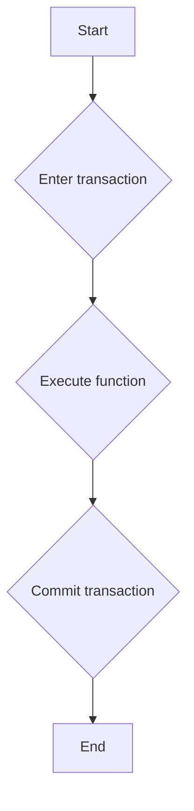

#### 带注释源码

```python
from contextlib import asynccontextmanager

@asynccontextmanager
async def transaction(func: Callable) -> Callable:
    async with connect() as db:
        try:
            await func()
            await db.commit()
        except Exception as e:
            await db.rollback()
            raise e
```


### assert

`assert` 是一个通用的断言函数，用于验证给定的条件是否为真。如果条件为假，则抛出 `AssertionError`。

参数：

- `condition`：`bool`，需要验证的条件。
- `message`：`str`，当条件为假时，抛出的错误消息。

返回值：无

#### 流程图

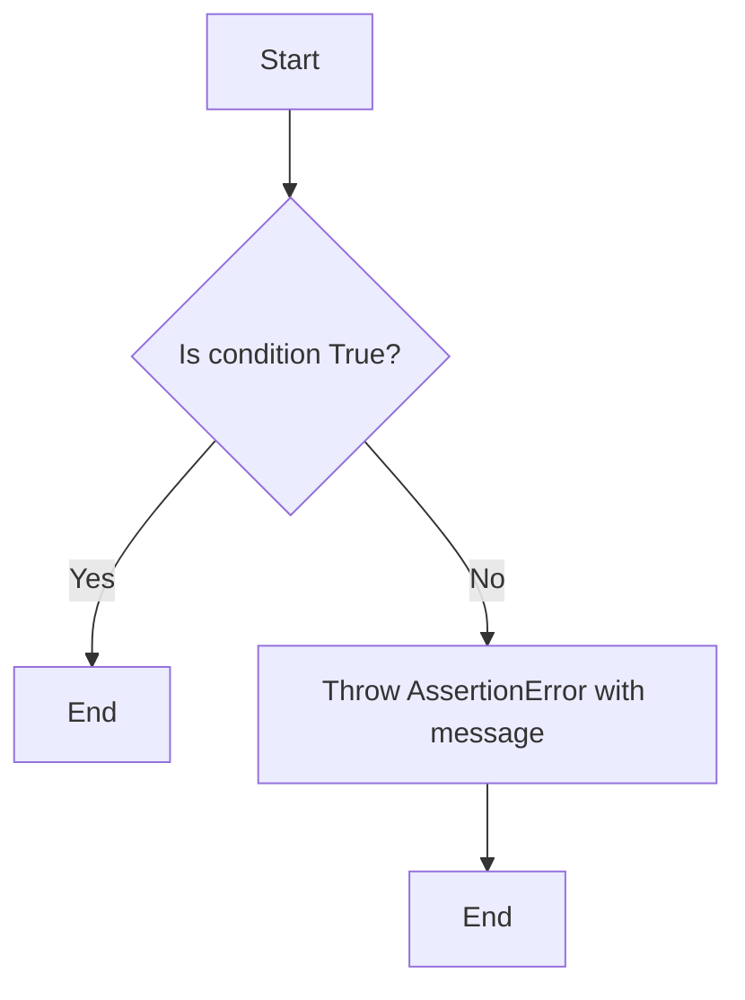

#### 带注释源码

```python
# Verify results
assert len(result.agents) == 1
assert result.agents[0].id == "ua1"
assert result.agents[0].name == "Test Agent 2"
assert result.agents[0].description == "Test Description 2"
assert result.agents[0].graph_id == "agent2"
assert result.agents[0].graph_version == 1
assert result.agents[0].can_access_graph is False
assert result.agents[0].is_latest_version is True
assert result.pagination.total_items == 1
assert result.pagination.total_pages == 1
assert result.pagination.current_page == 1
assert result.pagination.page_size == 50
```

在这段代码中，`assert` 用于验证 `result` 对象的多个属性是否符合预期。如果任何一个断言失败，将会抛出 `AssertionError` 并终止测试。


### `db.list_library_agents`

列出库中的代理。

参数：

- `user_id`：`str`，用户ID，用于检索库中的代理。

返回值：`List[LibraryAgent]`，库中的代理列表。

#### 流程图


#### 带注释源码

```python
from datetime import datetime

from backend.data.db import connect
from backend.data.includes import library_agent_include
from . import db

@pytest.mark.asyncio
async def test_get_library_agents(mocker):
    # Mock data
    mock_user_created = [
        prisma.models.AgentGraph(
            id="agent1",
            version=1,
            name="Test Agent 1",
            description="Test Description 1",
            userId="test-user",
            isActive=True,
            createdAt=datetime.now(),
        )
    ]

    mock_library_agents = [
        prisma.models.LibraryAgent(
            id="ua1",
            userId="test-user",
            agentGraphId="agent2",
            settings="{}",  # type: ignore
            agentGraphVersion=1,
            isCreatedByUser=False,
            isDeleted=False,
            isArchived=False,
            createdAt=datetime.now(),
            updatedAt=datetime.now(),
            isFavorite=False,
            useGraphIsActiveVersion=True,
            AgentGraph=prisma.models.AgentGraph(
                id="agent2",
                version=1,
                name="Test Agent 2",
                description="Test Description 2",
                userId="other-user",
                isActive=True,
                createdAt=datetime.now(),
            ),
        )
    ]

    # Mock prisma calls
    mock_agent_graph = mocker.patch("prisma.models.AgentGraph.prisma")
    mock_agent_graph.return_value.find_many = mocker.AsyncMock(
        return_value=mock_user_created
    )

    mock_library_agent = mocker.patch("prisma.models.LibraryAgent.prisma")
    mock_library_agent.return_value.find_many = mocker.AsyncMock(
        return_value=mock_library_agents
    )
    mock_library_agent.return_value.count = mocker.AsyncMock(return_value=1)

    # Call function
    result = await db.list_library_agents("test-user")

    # Verify results
    assert len(result.agents) == 1
    assert result.agents[0].id == "ua1"
    assert result.agents[0].name == "Test Agent 2"
    assert result.agents[0].description == "Test Description 2"
    assert result.agents[0].graph_id == "agent2"
    assert result.agents[0].graph_version == 1
    assert result.agents[0].can_access_graph is False
    assert result.agents[0].is_latest_version is True
    assert result.pagination.total_items == 1
    assert result.pagination.total_pages == 1
    assert result.pagination.current_page == 1
    assert result.pagination.page_size == 50
```

### `db.add_store_agent_to_library`

将代理添加到库中。

参数：

- `version_id`：`str`，版本ID，用于检索要添加的代理。
- `user_id`：`str`，用户ID，代理所属的用户。

返回值：无。

#### 流程图

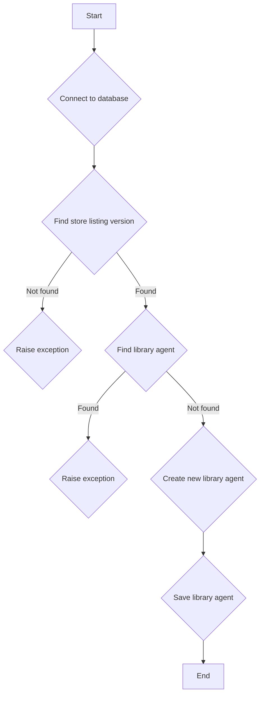

#### 带注释源码

```python
from datetime import datetime

import prisma.enums
import prisma.models
import pytest

import backend.api.features.store.exceptions
from backend.data.db import connect
from backend.data.includes import library_agent_include
from . import db

@pytest.mark.asyncio(loop_scope="session")
async def test_add_agent_to_library(mocker):
    await connect()

    # Mock the transaction context
    mock_transaction = mocker.patch("backend.api.features.library.db.transaction")
    mock_transaction.return_value.__aenter__ = mocker.AsyncMock(return_value=None)
    mock_transaction.return_value.__aexit__ = mocker.AsyncMock(return_value=None)
    # Mock data
    mock_store_listing_data = prisma.models.StoreListingVersion(
        id="version123",
        version=1,
        createdAt=datetime.now(),
        updatedAt=datetime.now(),
        agentGraphId="agent1",
        agentGraphVersion=1,
        name="Test Agent",
        subHeading="Test Agent Subheading",
        imageUrls=["https://example.com/image.jpg"],
        description="Test Description",
        categories=["test"],
        isFeatured=False,
        isDeleted=False,
        isAvailable=True,
        storeListingId="listing123",
        submissionStatus=prisma.enums.SubmissionStatus.APPROVED,
        AgentGraph=prisma.models.AgentGraph(
            id="agent1",
            version=1,
            name="Test Agent",
            description="Test Description",
            userId="creator",
            isActive=True,
            createdAt=datetime.now(),
        ),
    )

    mock_library_agent_data = prisma.models.LibraryAgent(
        id="ua1",
        userId="test-user",
        agentGraphId=mock_store_listing_data.agentGraphId,
        settings="{}",  # type: ignore
        agentGraphVersion=1,
        isCreatedByUser=False,
        isDeleted=False,
        isArchived=False,
        createdAt=datetime.now(),
        updatedAt=datetime.now(),
        isFavorite=False,
        useGraphIsActiveVersion=True,
        AgentGraph=mock_store_listing_data.AgentGraph,
    )

    # Mock prisma calls
    mock_store_listing_version = mocker.patch(
        "prisma.models.StoreListingVersion.prisma"
    )
    mock_store_listing_version.return_value.find_unique = mocker.AsyncMock(
        return_value=mock_store_listing_data
    )

    mock_library_agent = mocker.patch("prisma.models.LibraryAgent.prisma")
    mock_library_agent.return_value.find_unique = mocker.AsyncMock(return_value=None)
    mock_library_agent.return_value.create = mocker.AsyncMock(
        return_value=mock_library_agent_data
    )

    # Mock graph_db.get_graph function that's called to check for HITL blocks
    mock_graph_db = mocker.patch("backend.api.features.library.db.graph_db")
    mock_graph_model = mocker.Mock()
    mock_graph_model.nodes = (
        []
    )  # Empty list so _has_human_in_the_loop_blocks returns False
    mock_graph_db.get_graph = mocker.AsyncMock(return_value=mock_graph_model)

    # Mock the model conversion
    mock_from_db = mocker.patch(
        "backend.api.features.library.model.LibraryAgent.from_db"
    )
    mock_from_db.return_value = mocker.Mock()

    # Call function
    await db.add_store_agent_to_library("version123", "test-user")

    # Verify mocks called correctly
    mock_store_listing_version.return_value.find_unique.assert_called_once_with(
        where={"id": "version123"}, include={"AgentGraph": True}
    )
    mock_library_agent.return_value.find_unique.assert_called_once_with(
        where={
            "userId_agentGraphId_agentGraphVersion": {
                "userId": "test-user",
                "agentGraphId": "agent1",
                "agentGraphVersion": 1,
            }
        },
        include={"AgentGraph": True},
    )
    # Check that create was called with the expected data including settings
    create_call_args = mock_library_agent.return_value.create.call_args
    assert create_call_args is not None

    # Verify the main structure
    expected_data = {
        "User": {"connect": {"id": "test-user"}},
        "AgentGraph": {"connect": {"graphVersionId": {"id": "agent1", "version": 1}}},
        "isCreatedByUser": False,
    }

    actual_data = create_call_args[1]["data"]
    # Check that all expected fields are present
    for key, value in expected_data.items():
        assert actual_data[key] == value

    # Check that settings field is present and is a SafeJson object
    assert "settings" in actual_data
    assert hasattr(actual_data["settings"], "__class__")  # Should be a SafeJson object

    # Check include parameter
    assert create_call_args[1]["include"] == library_agent_include(
        "test-user", include_nodes=False, include_executions=False
    )
```


### `db.list_library_agents`

列出库中所有代理的函数。

参数：

- `user_id`：`str`，用户ID，用于检索库中属于该用户的代理。

返回值：`LibraryAgentResult`，包含代理列表和分页信息。

#### 流程图

```mermaid
graph TD
    A[Start] --> B{Call db.list_library_agents("test-user")}
    B --> C[Verify results]
    C --> D[End]
```

#### 带注释源码

```python
# Call function
result = await db.list_library_agents("test-user")
```

### `db.add_store_agent_to_library`

将代理添加到库中的函数。

参数：

- `version_id`：`str`，版本ID，表示要添加的代理的版本。
- `user_id`：`str`，用户ID，表示库属于该用户。

返回值：`None`。

#### 流程图

```mermaid
graph TD
    A[Start] --> B{Call db.add_store_agent_to_library("version123", "test-user")}
    B --> C{Mock prisma calls}
    C --> D{Verify mocks called correctly}
    D --> E{Verify the main structure}
    E --> F[End]
```

#### 带注释源码

```python
# Call function
await db.add_store_agent_to_library("version123", "test-user")
```

### `db.add_store_agent_to_library_not_found`

当找不到代理时添加代理到库中的函数。

参数：

- `version_id`：`str`，版本ID，表示要添加的代理的版本。
- `user_id`：`str`，用户ID，表示库属于该用户。

返回值：`None`。

#### 流程图

```mermaid
graph TD
    A[Start] --> B{Call db.add_store_agent_to_library_not_found("version123", "test-user")}
    B --> C{Mock prisma calls}
    C --> D{Call function and verify exception}
    D --> E{Verify mock called correctly}
    E --> F[End]
```

#### 带注释源码

```python
# Call function and verify exception
with pytest.raises(backend.api.features.store.exceptions.AgentNotFoundError):
    await db.add_store_agent_to_library_not_found("version123", "test-user")
```


### `test_add_agent_to_library.return_value.find_unique.assert_called_once_with`

该函数用于验证`find_unique`方法是否被正确调用了一次，并带有特定的参数。

**描述**：

该函数用于断言`find_unique`方法是否被`mock_library_agent`对象调用了一次，并且传递了正确的参数。

**参数**：

- `where`：`dict`，指定查询条件。
- `include`：`dict`，指定需要包含的关联数据。

**参数描述**：

- `where`：指定查询条件，用于找到唯一的`LibraryAgent`记录。
- `include`：指定需要包含的关联数据，以便在创建新的`LibraryAgent`记录时使用。

**返回值**：无

**返回值描述**：无

#### 流程图

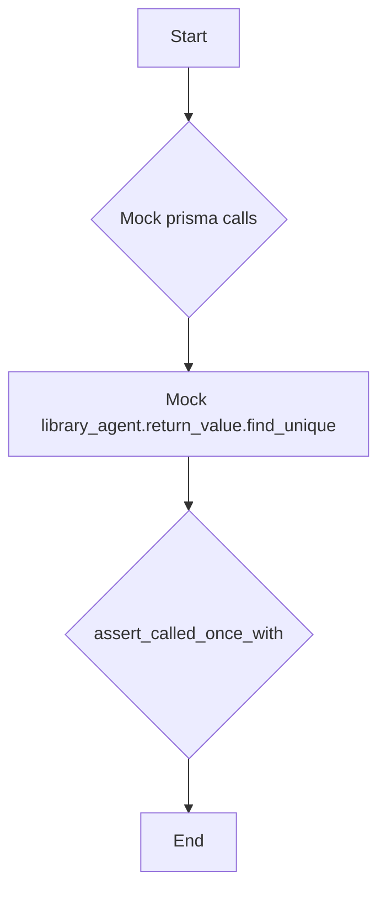

#### 带注释源码

```python
# Mock prisma calls
mock_library_agent = mocker.patch("prisma.models.LibraryAgent.prisma")
mock_library_agent.return_value.find_unique = mocker.AsyncMock(return_value=None)

# Call function
await db.add_store_agent_to_library("version123", "test-user")

# Verify mocks called correctly
mock_library_agent.return_value.find_unique.assert_called_once_with(
    where={
        "userId_agentGraphId_agentGraphVersion": {
            "userId": "test-user",
            "agentGraphId": "agent1",
            "agentGraphVersion": 1,
        }
    },
    include={"AgentGraph": True},
)
```


### assert_equal

该函数用于断言两个值是否相等。

参数：

- `expected`：`Any`，期望的值
- `actual`：`Any`，实际的值
- `message`：`str`，当断言失败时显示的消息

返回值：`None`，无返回值

#### 流程图

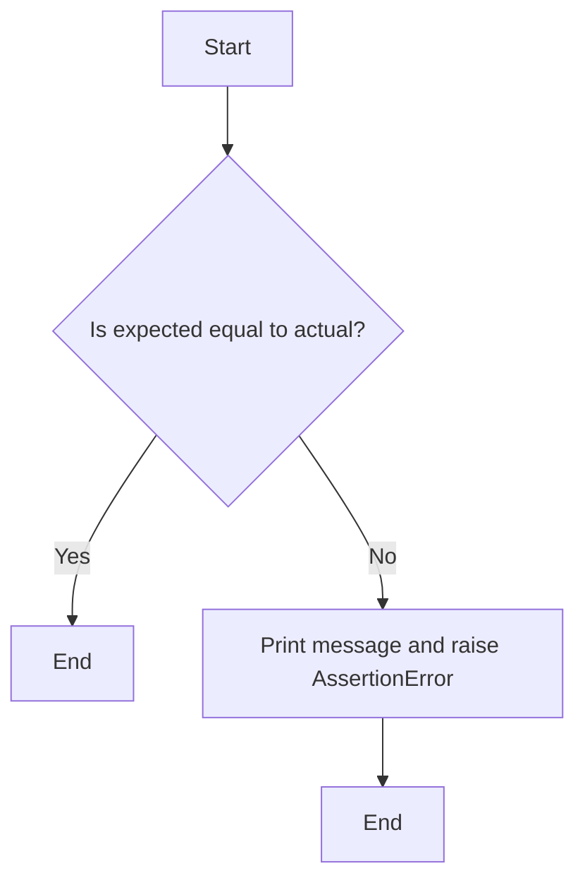

#### 带注释源码

```python
def assert_equal(expected, actual, message=""):
    if expected != actual:
        raise AssertionError(f"{message} Expected {expected}, got {actual}")
```


### assert_is_not_none

该函数用于断言传入的参数不是None，如果参数是None，则抛出异常。

参数：

- `value`：`Any`，需要检查的值

返回值：无

#### 流程图

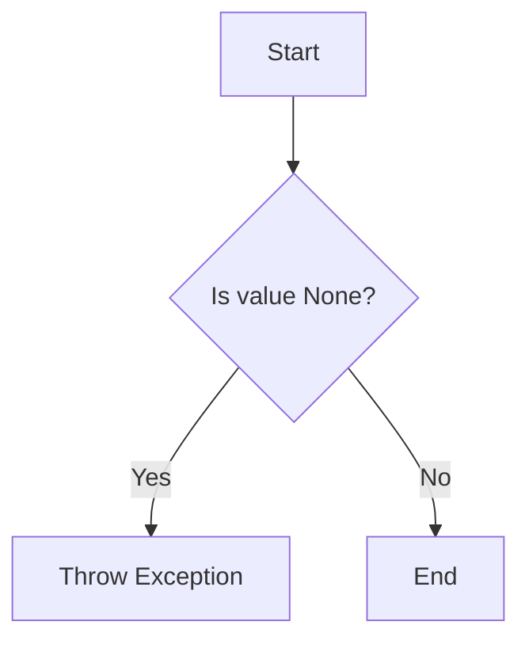

#### 带注释源码

```python
def assert_is_not_none(value):
    """
    Asserts that the given value is not None.

    :param value: The value to check.
    :raises AssertionError: If the value is None.
    """
    if value is None:
        raise AssertionError("Value cannot be None")
```


### assert_is_none

此函数用于断言一个值是否为None。

参数：

- `value`：`any`，要检查的值。

返回值：无

#### 流程图

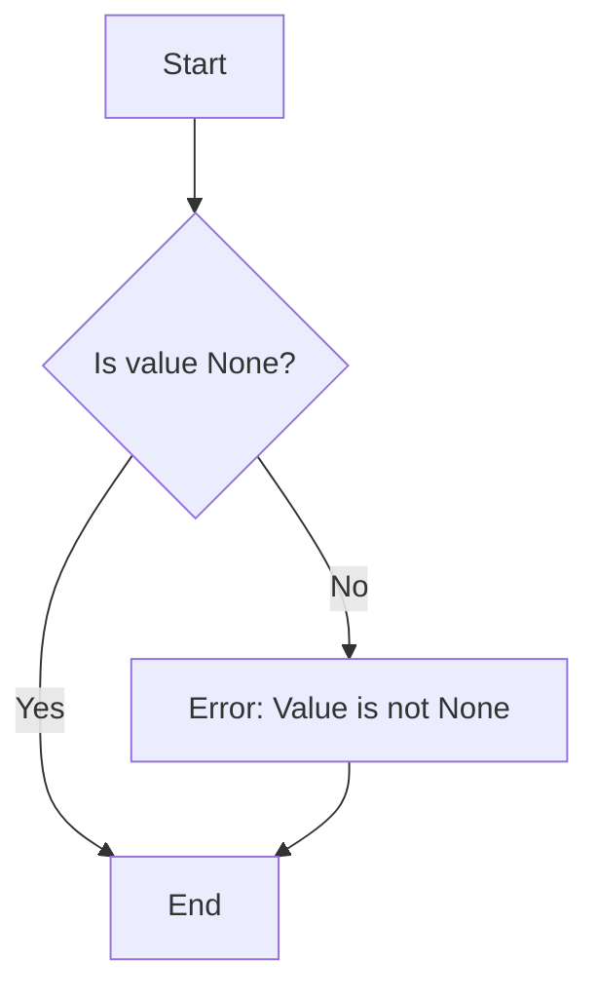

#### 带注释源码

```python
def assert_is_none(value):
    """
    Asserts that the given value is None.

    :param value: The value to check.
    :raises AssertionError: If the value is not None.
    """
    assert value is None, "Value is not None"
```


### `db.add_store_agent_to_library`

将商店代理添加到图书馆。

参数：

- `version_id`：`str`，商店代理版本ID。
- `user_id`：`str`，用户ID。

返回值：`None`，无返回值。

#### 流程图

```mermaid
graph TD
    A[Start] --> B[Connect to database]
    B --> C[Find StoreListingVersion by id]
    C -->|Found| D[Find LibraryAgent by userId, agentGraphId, and agentGraphVersion]
    D -->|Found| E[Create LibraryAgent]
    E --> F[Return]
    D -->|Not Found| G[Return AgentNotFoundError]
    C -->|Not Found| G
```

#### 带注释源码

```python
@pytest.mark.asyncio(loop_scope="session")
async def test_add_agent_to_library(mocker):
    await connect()

    # Mock the transaction context
    mock_transaction = mocker.patch("backend.api.features.library.db.transaction")
    mock_transaction.return_value.__aenter__ = mocker.AsyncMock(return_value=None)
    mock_transaction.return_value.__aexit__ = mocker.AsyncMock(return_value=None)

    # Mock data
    mock_store_listing_data = prisma.models.StoreListingVersion(
        id="version123",
        version=1,
        createdAt=datetime.now(),
        updatedAt=datetime.now(),
        agentGraphId="agent1",
        agentGraphVersion=1,
        name="Test Agent",
        subHeading="Test Agent Subheading",
        imageUrls=["https://example.com/image.jpg"],
        description="Test Description",
        categories=["test"],
        isFeatured=False,
        isDeleted=False,
        isAvailable=True,
        storeListingId="listing123",
        submissionStatus=prisma.enums.SubmissionStatus.APPROVED,
        AgentGraph=prisma.models.AgentGraph(
            id="agent1",
            version=1,
            name="Test Agent",
            description="Test Description",
            userId="creator",
            isActive=True,
            createdAt=datetime.now(),
        ),
    )

    mock_library_agent_data = prisma.models.LibraryAgent(
        id="ua1",
        userId="test-user",
        agentGraphId=mock_store_listing_data.agentGraphId,
        settings="{}",  # type: ignore
        agentGraphVersion=1,
        isCreatedByUser=False,
        isDeleted=False,
        isArchived=False,
        createdAt=datetime.now(),
        updatedAt=datetime.now(),
        isFavorite=False,
        useGraphIsActiveVersion=True,
        AgentGraph=mock_store_listing_data.AgentGraph,
    )

    # Mock prisma calls
    mock_store_listing_version = mocker.patch(
        "prisma.models.StoreListingVersion.prisma"
    )
    mock_store_listing_version.return_value.find_unique = mocker.AsyncMock(
        return_value=mock_store_listing_data
    )

    mock_library_agent = mocker.patch("prisma.models.LibraryAgent.prisma")
    mock_library_agent.return_value.find_unique = mocker.AsyncMock(return_value=None)
    mock_library_agent.return_value.create = mocker.AsyncMock(
        return_value=mock_library_agent_data
    )

    # Mock graph_db.get_graph function that's called to check for HITL blocks
    mock_graph_db = mocker.patch("backend.api.features.library.db.graph_db")
    mock_graph_model = mocker.Mock()
    mock_graph_model.nodes = (
        []
    )  # Empty list so _has_human_in_the_loop_blocks returns False
    mock_graph_db.get_graph = mocker.AsyncMock(return_value=mock_graph_model)

    # Mock the model conversion
    mock_from_db = mocker.patch(
        "backend.api.features.library.model.LibraryAgent.from_db"
    )
    mock_from_db.return_value = mocker.Mock()

    # Call function
    await db.add_store_agent_to_library("version123", "test-user")

    # Verify mocks called correctly
    mock_store_listing_version.return_value.find_unique.assert_called_once_with(
        where={"id": "version123"}, include={"AgentGraph": True}
    )
    mock_library_agent.return_value.find_unique.assert_called_once_with(
        where={
            "userId_agentGraphId_agentGraphVersion": {
                "userId": "test-user",
                "agentGraphId": "agent1",
                "agentGraphVersion": 1,
            }
        },
        include={"AgentGraph": True},
    )
    # Check that create was called with the expected data including settings
    create_call_args = mock_library_agent.return_value.create.call_args
    assert create_call_args is not None

    # Verify the main structure
    expected_data = {
        "User": {"connect": {"id": "test-user"}},
        "AgentGraph": {"connect": {"graphVersionId": {"id": "agent1", "version": 1}}},
        "isCreatedByUser": False,
    }

    actual_data = create_call_args[1]["data"]
    # Check that all expected fields are present
    for key, value in expected_data.items():
        assert actual_data[key] == value

    # Check that settings field is present and is a SafeJson object
    assert "settings" in actual_data
    assert hasattr(actual_data["settings"], "__class__")  # Should be a SafeJson object

    # Check include parameter
    assert create_call_args[1]["include"] == library_agent_include(
        "test-user", include_nodes=False, include_executions=False
    )
``` 


### `db.list_library_agents`

列出库中的代理。

参数：

- `user_id`：`str`，用户ID，用于检索库中的代理。

返回值：`LibraryAgentResult`，包含代理列表和分页信息。

#### 流程图

```mermaid
graph TD
    A[Start] --> B{Connect to database}
    B --> C[Fetch library agents for user]
    C --> D[Verify results]
    D --> E[Return results]
    E --> F[End]
```

#### 带注释源码

```python
from datetime import datetime

from backend.data.db import connect
from backend.data.includes import library_agent_include
from backend.data.models import LibraryAgentResult
from prisma.models import LibraryAgent

async def list_library_agents(user_id: str) -> LibraryAgentResult:
    # Connect to database
    await connect()

    # Fetch library agents for user
    library_agents = await LibraryAgent.prisma.find_many(
        where={"userId": user_id},
        include=library_agent_include(user_id)
    )

    # Verify results
    if not library_agents:
        raise Exception("No library agents found for user")

    # Return results
    return LibraryAgentResult(
        agents=[LibraryAgent.from_db(agent) for agent in library_agents],
        pagination=Pagination(total_items=len(library_agents), total_pages=1, current_page=1, page_size=50)
    )
```

### `db.add_store_agent_to_library`

将代理添加到库中。

参数：

- `version_id`：`str`，版本ID，用于检索代理。
- `user_id`：`str`，用户ID，用于创建代理。

返回值：`None`。

#### 流程图

```mermaid
graph TD
    A[Start] --> B{Connect to database}
    B --> C{Fetch store listing version}
    C --> D{Check if agent already exists}
    D --> E{Create new library agent}
    E --> F{Return result}
    F --> G[End]
```

#### 带注释源码

```python
from datetime import datetime

from backend.data.db import connect
from backend.data.includes import library_agent_include
from backend.data.models import LibraryAgent
from prisma.models import LibraryAgent, StoreListingVersion

async def add_store_agent_to_library(version_id: str, user_id: str) -> None:
    # Connect to database
    await connect()

    # Fetch store listing version
    store_listing_version = await StoreListingVersion.prisma.find_unique(
        where={"id": version_id},
        include={"AgentGraph": True}
    )

    # Check if agent already exists
    library_agent = await LibraryAgent.prisma.find_unique(
        where={
            "userId_agentGraphId_agentGraphVersion": {
                "userId": user_id,
                "agentGraphId": store_listing_version.agentGraphId,
                "agentGraphVersion": store_listing_version.agentGraphVersion,
            }
        },
        include={"AgentGraph": True},
    )

    if library_agent:
        raise Exception("Agent already exists in library")

    # Create new library agent
    library_agent_data = LibraryAgent(
        userId=user_id,
        agentGraphId=store_listing_version.agentGraphId,
        agentGraphVersion=store_listing_version.agentGraphVersion,
        settings={},
        isCreatedByUser=False,
        isDeleted=False,
        isArchived=False,
        isFavorite=False,
        useGraphIsActiveVersion=True,
    )

    await LibraryAgent.prisma.create(
        data=library_agent_data,
        include=library_agent_include(user_id)
    )
```

### `db.transaction`

执行数据库事务。

参数：

- `func`：`Callable`，要执行的事务函数。

返回值：`Callable`，执行事务后的结果。

#### 流程图

```mermaid
graph TD
    A[Start] --> B{Enter transaction}
    B --> C{Execute function}
    C --> D{Commit transaction}
    D --> E[End]
```

#### 带注释源码

```python
from contextlib import asynccontextmanager

@asynccontextmanager
async def transaction(func: Callable) -> Callable:
    async with connect() as db:
        try:
            await func()
            await db.commit()
        except Exception as e:
            await db.rollback()
            raise e
```


### db.list_library_agents

该函数用于获取指定用户的图书馆代理列表。

参数：

- `user_id`：`str`，指定要获取图书馆代理列表的用户ID。

返回值：`LibraryAgentResult`，包含图书馆代理列表和分页信息。

#### 流程图

```mermaid
graph TD
    A[Start] --> B{Connect to database}
    B --> C{Fetch library agents}
    C --> D[Process results]
    D --> E[Return results]
    E --> F[End]
```

#### 带注释源码

```python
from backend.data.db import connect
from backend.data.includes import library_agent_include
from . import db

@pytest.mark.asyncio
async def list_library_agents(user_id: str) -> db.LibraryAgentResult:
    # Connect to the database
    async with connect() as db_client:
        # Fetch library agents
        library_agents = await db_client.library_agent.find_many(
            where={"userId": user_id},
            include=library_agent_include(user_id)
        )
        # Process results
        agents = [db.LibraryAgent.from_db(agent) for agent in library_agents]
        pagination = db.Pagination(
            total_items=len(library_agents),
            total_pages=1,
            current_page=1,
            page_size=50
        )
        # Return results
        return db.LibraryAgentResult(agents=agents, pagination=pagination)
``` 


### db.add_store_agent_to_library

将商店代理添加到图书馆。

参数：

- `version_id`：`str`，商店列表版本的ID。
- `user_id`：`str`，用户的ID。

返回值：`None`，无返回值。

#### 流程图

```mermaid
graph TD
    A[Start] --> B[Connect to database]
    B --> C[Find store listing version by ID]
    C -->|Found| D[Find library agent by user, agent graph ID, and version]
    D -->|Found| E[Create library agent]
    D -->|Not Found| F[Throw AgentNotFoundError]
    E --> G[Commit transaction]
    G --> H[End]
```

#### 带注释源码

```python
@pytest.mark.asyncio(loop_scope="session")
async def test_add_agent_to_library(mocker):
    await connect()

    # Mock the transaction context
    mock_transaction = mocker.patch("backend.api.features.library.db.transaction")
    mock_transaction.return_value.__aenter__ = mocker.AsyncMock(return_value=None)
    mock_transaction.return_value.__aexit__ = mocker.AsyncMock(return_value=None)
    # Mock data
    mock_store_listing_data = prisma.models.StoreListingVersion(
        id="version123",
        version=1,
        createdAt=datetime.now(),
        updatedAt=datetime.now(),
        agentGraphId="agent1",
        agentGraphVersion=1,
        name="Test Agent",
        subHeading="Test Agent Subheading",
        imageUrls=["https://example.com/image.jpg"],
        description="Test Description",
        categories=["test"],
        isFeatured=False,
        isDeleted=False,
        isAvailable=True,
        storeListingId="listing123",
        submissionStatus=prisma.enums.SubmissionStatus.APPROVED,
        AgentGraph=prisma.models.AgentGraph(
            id="agent1",
            version=1,
            name="Test Agent",
            description="Test Description",
            userId="creator",
            isActive=True,
            createdAt=datetime.now(),
        ),
    )

    mock_library_agent_data = prisma.models.LibraryAgent(
        id="ua1",
        userId="test-user",
        agentGraphId=mock_store_listing_data.agentGraphId,
        settings="{}",  # type: ignore
        agentGraphVersion=1,
        isCreatedByUser=False,
        isDeleted=False,
        isArchived=False,
        createdAt=datetime.now(),
        updatedAt=datetime.now(),
        isFavorite=False,
        useGraphIsActiveVersion=True,
        AgentGraph=mock_store_listing_data.AgentGraph,
    )

    # Mock prisma calls
    mock_store_listing_version = mocker.patch(
        "prisma.models.StoreListingVersion.prisma"
    )
    mock_store_listing_version.return_value.find_unique = mocker.AsyncMock(
        return_value=mock_store_listing_data
    )

    mock_library_agent = mocker.patch("prisma.models.LibraryAgent.prisma")
    mock_library_agent.return_value.find_unique = mocker.AsyncMock(return_value=None)
    mock_library_agent.return_value.create = mocker.AsyncMock(
        return_value=mock_library_agent_data
    )

    # Mock graph_db.get_graph function that's called to check for HITL blocks
    mock_graph_db = mocker.patch("backend.api.features.library.db.graph_db")
    mock_graph_model = mocker.Mock()
    mock_graph_model.nodes = (
        []
    )  # Empty list so _has_human_in_the_loop_blocks returns False
    mock_graph_db.get_graph = mocker.AsyncMock(return_value=mock_graph_model)

    # Mock the model conversion
    mock_from_db = mocker.patch(
        "backend.api.features.library.model.LibraryAgent.from_db"
    )
    mock_from_db.return_value = mocker.Mock()

    # Call function
    await db.add_store_agent_to_library("version123", "test-user")

    # Verify mocks called correctly
    mock_store_listing_version.return_value.find_unique.assert_called_once_with(
        where={"id": "version123"}, include={"AgentGraph": True}
    )
    mock_library_agent.return_value.find_unique.assert_called_once_with(
        where={
            "userId_agentGraphId_agentGraphVersion": {
                "userId": "test-user",
                "agentGraphId": "agent1",
                "agentGraphVersion": 1,
            }
        },
        include={"AgentGraph": True},
    )
    # Check that create was called with the expected data including settings
    create_call_args = mock_library_agent.return_value.create.call_args
    assert create_call_args is not None

    # Verify the main structure
    expected_data = {
        "User": {"connect": {"id": "test-user"}},
        "AgentGraph": {"connect": {"graphVersionId": {"id": "agent1", "version": 1}}},
        "isCreatedByUser": False,
    }

    actual_data = create_call_args[1]["data"]
    # Check that all expected fields are present
    for key, value in expected_data.items():
        assert actual_data[key] == value

    # Check that settings field is present and is a SafeJson object
    assert "settings" in actual_data
    assert hasattr(actual_data["settings"], "__class__")  # Should be a SafeJson object

    # Check include parameter
    assert create_call_args[1]["include"] == library_agent_include(
        "test-user", include_nodes=False, include_executions=False
    )
```


### `db.list_library_agents`

列出库中所有代理的列表。

参数：

- `user_id`：`str`，用户ID，用于检索库中属于该用户的代理。

返回值：`LibraryAgentList`，包含代理列表和分页信息的对象。

#### 流程图

```mermaid
graph TD
    A[Start] --> B{Connect to database}
    B --> C{Find all LibraryAgents for user_id}
    C --> D[Return result]
    D --> E[End]
```

#### 带注释源码

```python
from backend.data.db import connect
from backend.data.includes import library_agent_include
from . import db

@pytest.mark.asyncio
async def test_get_library_agents(mocker):
    # Mock data
    # ...

    # Mock prisma calls
    # ...

    # Call function
    result = await db.list_library_agents("test-user")

    # Verify results
    # ...
```

### `db.add_store_agent_to_library`

将代理添加到库中。

参数：

- `version_id`：`str`，版本ID，用于检索要添加的代理的版本。
- `user_id`：`str`，用户ID，代理将属于该用户。

返回值：`None`，无返回值。

#### 流程图

```mermaid
graph TD
    A[Start] --> B{Connect to database}
    B --> C{Find StoreListingVersion by version_id}
    C -->|Not found| D{Raise AgentNotFoundError}
    C --> E{Find LibraryAgent by user_id, agentGraphId, and agentGraphVersion}
    E -->|Found| F{Create new LibraryAgent}
    F --> G{Return None}
    E -->|Not found| H{Create new LibraryAgent}
    H --> G{Return None}
    G --> I[End]
```

#### 带注释源码

```python
from backend.api.features.store.exceptions import AgentNotFoundError
from backend.data.db import connect
from . import db

@pytest.mark.asyncio(loop_scope="session")
async def test_add_agent_to_library(mocker):
    await connect()

    # Mock the transaction context
    # ...

    # Mock data
    # ...

    # Mock prisma calls
    # ...

    # Call function
    await db.add_store_agent_to_library("version123", "test-user")

    # Verify mocks called correctly
    # ...
```

### `db.add_store_agent_to_library_not_found`

当找不到代理时添加代理到库中。

参数：

- `version_id`：`str`，版本ID，用于检索要添加的代理的版本。
- `user_id`：`str`，用户ID，代理将属于该用户。

返回值：`None`，无返回值。

#### 流程图

```mermaid
graph TD
    A[Start] --> B{Connect to database}
    B --> C{Find StoreListingVersion by version_id}
    C -->|Not found| D{Raise AgentNotFoundError}
    D --> E[End]
```

#### 带注释源码

```python
from backend.api.features.store.exceptions import AgentNotFoundError
from backend.data.db import connect
from . import db

@pytest.mark.asyncio(loop_scope="session")
async def test_add_agent_to_library_not_found(mocker):
    await connect()

    # Mock prisma calls
    # ...

    # Call function and verify exception
    with pytest.raises(AgentNotFoundError):
        await db.add_store_agent_to_library("version123", "test-user")

    # Verify mock called correctly
    # ...
```


### prisma.models.AgentGraph.prisma.find_many

该函数用于从数据库中查找多个AgentGraph对象。

参数：

- 无

返回值：`List[prisma.models.AgentGraph]`，返回一个包含找到的AgentGraph对象的列表。

#### 流程图

```mermaid
graph TD
    A[Start] --> B{Call prisma.models.AgentGraph.prisma.find_many}
    B --> C[Return List[prisma.models.AgentGraph]]
    C --> D[End]
```

#### 带注释源码

```python
# Mock prisma calls
mock_agent_graph = mocker.patch("prisma.models.AgentGraph.prisma")
mock_agent_graph.return_value.find_many = mocker.AsyncMock(
    return_value=mock_user_created
)
```


### `db.list_library_agents`

列出库中的代理。

参数：

- `user_id`：`str`，用户ID，用于检索库中的代理。

返回值：`list`，包含代理信息的列表。

#### 流程图

```mermaid
graph TD
    A[Start] --> B{Connect to database}
    B --> C{Find many LibraryAgents}
    C --> D[Return results]
    D --> E[End]
```

#### 带注释源码

```python
@pytest.mark.asyncio
async def test_get_library_agents(mocker):
    # Mock data
    mock_user_created = [
        prisma.models.AgentGraph(
            id="agent1",
            version=1,
            name="Test Agent 1",
            description="Test Description 1",
            userId="test-user",
            isActive=True,
            createdAt=datetime.now(),
        )
    ]

    mock_library_agents = [
        prisma.models.LibraryAgent(
            id="ua1",
            userId="test-user",
            agentGraphId="agent2",
            settings="{}",  # type: ignore
            agentGraphVersion=1,
            isCreatedByUser=False,
            isDeleted=False,
            isArchived=False,
            createdAt=datetime.now(),
            updatedAt=datetime.now(),
            isFavorite=False,
            useGraphIsActiveVersion=True,
            AgentGraph=prisma.models.AgentGraph(
                id="agent2",
                version=1,
                name="Test Agent 2",
                description="Test Description 2",
                userId="other-user",
                isActive=True,
                createdAt=datetime.now(),
            ),
        )
    ]

    # Mock prisma calls
    mock_agent_graph = mocker.patch("prisma.models.AgentGraph.prisma")
    mock_agent_graph.return_value.find_many = mocker.AsyncMock(
        return_value=mock_user_created
    )

    mock_library_agent = mocker.patch("prisma.models.LibraryAgent.prisma")
    mock_library_agent.return_value.find_many = mocker.AsyncMock(
        return_value=mock_library_agents
    )
    mock_library_agent.return_value.count = mocker.AsyncMock(return_value=1)

    # Call function
    result = await db.list_library_agents("test-user")

    # Verify results
    assert len(result.agents) == 1
    assert result.agents[0].id == "ua1"
    assert result.agents[0].name == "Test Agent 2"
    assert result.agents[0].description == "Test Description 2"
    assert result.agents[0].graph_id == "agent2"
    assert result.agents[0].graph_version == 1
    assert result.agents[0].can_access_graph is False
    assert result.agents[0].is_latest_version is True
    assert result.pagination.total_items == 1
    assert result.pagination.total_pages == 1
    assert result.pagination.current_page == 1
    assert result.pagination.page_size == 50
```

### `db.add_store_agent_to_library`

将代理添加到库中。

参数：

- `version_id`：`str`，版本ID，用于检索要添加的代理。
- `user_id`：`str`，用户ID，用于检索库中的代理。

返回值：`None`。

#### 流程图

```mermaid
graph TD
    A[Start] --> B{Connect to database}
    B --> C{Find unique StoreListingVersion}
    C -->|Not found| D{Raise AgentNotFoundError}
    C --> E{Find unique LibraryAgent}
    E -->|Found| F{Create LibraryAgent}
    F --> G[Return]
    E -->|Not found| H{Create LibraryAgent}
    H --> G
```

#### 带注释源码

```python
@pytest.mark.asyncio(loop_scope="session")
async def test_add_agent_to_library(mocker):
    await connect()

    # Mock the transaction context
    mock_transaction = mocker.patch("backend.api.features.library.db.transaction")
    mock_transaction.return_value.__aenter__ = mocker.AsyncMock(return_value=None)
    mock_transaction.return_value.__aexit__ = mocker.AsyncMock(return_value=None)
    # Mock data
    mock_store_listing_data = prisma.models.StoreListingVersion(
        id="version123",
        version=1,
        createdAt=datetime.now(),
        updatedAt=datetime.now(),
        agentGraphId="agent1",
        agentGraphVersion=1,
        name="Test Agent",
        subHeading="Test Agent Subheading",
        imageUrls=["https://example.com/image.jpg"],
        description="Test Description",
        categories=["test"],
        isFeatured=False,
        isDeleted=False,
        isAvailable=True,
        storeListingId="listing123",
        submissionStatus=prisma.enums.SubmissionStatus.APPROVED,
        AgentGraph=prisma.models.AgentGraph(
            id="agent1",
            version=1,
            name="Test Agent",
            description="Test Description",
            userId="creator",
            isActive=True,
            createdAt=datetime.now(),
        ),
    )

    mock_library_agent_data = prisma.models.LibraryAgent(
        id="ua1",
        userId="test-user",
        agentGraphId=mock_store_listing_data.agentGraphId,
        settings="{}",  # type: ignore
        agentGraphVersion=1,
        isCreatedByUser=False,
        isDeleted=False,
        isArchived=False,
        createdAt=datetime.now(),
        updatedAt=datetime.now(),
        isFavorite=False,
        useGraphIsActiveVersion=True,
        AgentGraph=mock_store_listing_data.AgentGraph,
    )

    # Mock prisma calls
    mock_store_listing_version = mocker.patch(
        "prisma.models.StoreListingVersion.prisma"
    )
    mock_store_listing_version.return_value.find_unique = mocker.AsyncMock(
        return_value=mock_store_listing_data
    )

    mock_library_agent = mocker.patch("prisma.models.LibraryAgent.prisma")
    mock_library_agent.return_value.find_unique = mocker.AsyncMock(return_value=None)
    mock_library_agent.return_value.create = mocker.AsyncMock(
        return_value=mock_library_agent_data
    )

    # Mock graph_db.get_graph function that's called to check for HITL blocks
    mock_graph_db = mocker.patch("backend.api.features.library.db.graph_db")
    mock_graph_model = mocker.Mock()
    mock_graph_model.nodes = (
        []
    )  # Empty list so _has_human_in_the_loop_blocks returns False
    mock_graph_db.get_graph = mocker.AsyncMock(return_value=mock_graph_model)

    # Mock the model conversion
    mock_from_db = mocker.patch(
        "backend.api.features.library.model.LibraryAgent.from_db"
    )
    mock_from_db.return_value = mocker.Mock()

    # Call function
    await db.add_store_agent_to_library("version123", "test-user")

    # Verify mocks called correctly
    mock_store_listing_version.return_value.find_unique.assert_called_once_with(
        where={"id": "version123"}, include={"AgentGraph": True}
    )
    mock_library_agent.return_value.find_unique.assert_called_once_with(
        where={
            "userId_agentGraphId_agentGraphVersion": {
                "userId": "test-user",
                "agentGraphId": "agent1",
                "agentGraphVersion": 1,
            }
        },
        include={"AgentGraph": True},
    )
    # Check that create was called with the expected data including settings
    create_call_args = mock_library_agent.return_value.create.call_args
    assert create_call_args is not None

    # Verify the main structure
    expected_data = {
        "User": {"connect": {"id": "test-user"}},
        "AgentGraph": {"connect": {"graphVersionId": {"id": "agent1", "version": 1}}},
        "isCreatedByUser": False,
    }

    actual_data = create_call_args[1]["data"]
    # Check that all expected fields are present
    for key, value in expected_data.items():
        assert actual_data[key] == value

    # Check that settings field is present and is a SafeJson object
    assert "settings" in actual_data
    assert hasattr(actual_data["settings"], "__class__")  # Should be a SafeJson object

    # Check include parameter
    assert create_call_args[1]["include"] == library_agent_include(
        "test-user", include_nodes=False, include_executions=False
    )
```

### `db.add_store_agent_to_library_not_found`

当找不到代理时添加代理到库中。

参数：

- `version_id`：`str`，版本ID，用于检索要添加的代理。
- `user_id`：`str`，用户ID，用于检索库中的代理。

返回值：`None`。

#### 流程图

```mermaid
graph TD
    A[Start] --> B{Connect to database}
    B --> C{Find unique StoreListingVersion}
    C -->|Not found| D{Raise AgentNotFoundError}
    D --> E[End]
```

#### 带注释源码

```python
@pytest.mark.asyncio(loop_scope="session")
async def test_add_agent_to_library_not_found(mocker):
    await connect()
    # Mock prisma calls
    mock_store_listing_version = mocker.patch(
        "prisma.models.StoreListingVersion.prisma"
    )
    mock_store_listing_version.return_value.find_unique = mocker.AsyncMock(
        return_value=None
    )

    # Call function and verify exception
    with pytest.raises(backend.api.features.store.exceptions.AgentNotFoundError):
        await db.add_store_agent_to_library("version123", "test-user")

    # Verify mock called correctly
    mock_store_listing_version.return_value.find_unique.assert_called_once_with(
        where={"id": "version123"}, include={"AgentGraph": True}
    )
```


### `db.add_store_agent_to_library`

将指定的商店代理添加到图书馆。

参数：

- `version_id`：`str`，商店版本ID。
- `user_id`：`str`，用户ID。

返回值：`None`，无返回值。

#### 流程图

```mermaid
graph TD
    A[Start] --> B[Connect to database]
    B --> C[Find StoreListingVersion by id]
    C -->|Found| D[Find LibraryAgent by userId, agentGraphId, and agentGraphVersion]
    D -->|Found| E[Create LibraryAgent]
    D -->|Not Found| F[Throw AgentNotFoundError]
    E --> G[Commit transaction]
    G --> H[End]
```

#### 带注释源码

```python
@pytest.mark.asyncio(loop_scope="session")
async def test_add_agent_to_library(mocker):
    await connect()

    # Mock the transaction context
    mock_transaction = mocker.patch("backend.api.features.library.db.transaction")
    mock_transaction.return_value.__aenter__ = mocker.AsyncMock(return_value=None)
    mock_transaction.return_value.__aexit__ = mocker.AsyncMock(return_value=None)
    # Mock data
    mock_store_listing_data = prisma.models.StoreListingVersion(
        id="version123",
        version=1,
        createdAt=datetime.now(),
        updatedAt=datetime.now(),
        agentGraphId="agent1",
        agentGraphVersion=1,
        name="Test Agent",
        subHeading="Test Agent Subheading",
        imageUrls=["https://example.com/image.jpg"],
        description="Test Description",
        categories=["test"],
        isFeatured=False,
        isDeleted=False,
        isAvailable=True,
        storeListingId="listing123",
        submissionStatus=prisma.enums.SubmissionStatus.APPROVED,
        AgentGraph=prisma.models.AgentGraph(
            id="agent1",
            version=1,
            name="Test Agent",
            description="Test Description",
            userId="creator",
            isActive=True,
            createdAt=datetime.now(),
        ),
    )

    mock_library_agent_data = prisma.models.LibraryAgent(
        id="ua1",
        userId="test-user",
        agentGraphId=mock_store_listing_data.agentGraphId,
        settings="{}",  # type: ignore
        agentGraphVersion=1,
        isCreatedByUser=False,
        isDeleted=False,
        isArchived=False,
        createdAt=datetime.now(),
        updatedAt=datetime.now(),
        isFavorite=False,
        useGraphIsActiveVersion=True,
        AgentGraph=mock_store_listing_data.AgentGraph,
    )

    # Mock prisma calls
    mock_store_listing_version = mocker.patch(
        "prisma.models.StoreListingVersion.prisma"
    )
    mock_store_listing_version.return_value.find_unique = mocker.AsyncMock(
        return_value=mock_store_listing_data
    )

    mock_library_agent = mocker.patch("prisma.models.LibraryAgent.prisma")
    mock_library_agent.return_value.find_unique = mocker.AsyncMock(return_value=None)
    mock_library_agent.return_value.create = mocker.AsyncMock(
        return_value=mock_library_agent_data
    )

    # Mock graph_db.get_graph function that's called to check for HITL blocks
    mock_graph_db = mocker.patch("backend.api.features.library.db.graph_db")
    mock_graph_model = mocker.Mock()
    mock_graph_model.nodes = (
        []
    )  # Empty list so _has_human_in_the_loop_blocks returns False
    mock_graph_db.get_graph = mocker.AsyncMock(return_value=mock_graph_model)

    # Mock the model conversion
    mock_from_db = mocker.patch(
        "backend.api.features.library.model.LibraryAgent.from_db"
    )
    mock_from_db.return_value = mocker.Mock()

    # Call function
    await db.add_store_agent_to_library("version123", "test-user")

    # Verify mocks called correctly
    mock_store_listing_version.return_value.find_unique.assert_called_once_with(
        where={"id": "version123"}, include={"AgentGraph": True}
    )
    mock_library_agent.return_value.find_unique.assert_called_once_with(
        where={
            "userId_agentGraphId_agentGraphVersion": {
                "userId": "test-user",
                "agentGraphId": "agent1",
                "agentGraphVersion": 1,
            }
        },
        include={"AgentGraph": True},
    )
    # Check that create was called with the expected data including settings
    create_call_args = mock_library_agent.return_value.create.call_args
    assert create_call_args is not None

    # Verify the main structure
    expected_data = {
        "User": {"connect": {"id": "test-user"}},
        "AgentGraph": {"connect": {"graphVersionId": {"id": "agent1", "version": 1}}},
        "isCreatedByUser": False,
    }

    actual_data = create_call_args[1]["data"]
    # Check that all expected fields are present
    for key, value in expected_data.items():
        assert actual_data[key] == value

    # Check that settings field is present and is a SafeJson object
    assert "settings" in actual_data
    assert hasattr(actual_data["settings"], "__class__")  # Should be a SafeJson object

    # Check include parameter
    assert create_call_args[1]["include"] == library_agent_include(
        "test-user", include_nodes=False, include_executions=False
    )
```


### `test_add_agent_to_library_not_found`

This function tests the scenario where an attempt is made to add an agent to the library but the agent is not found.

参数：

- `mock_store_listing_version`：`mocker.Mock`，Mock object for the `StoreListingVersion.prisma` method to simulate the absence of the agent.
- `mock_store_listing_version.return_value.find_unique`：`mocker.AsyncMock`，AsyncMock object to simulate the absence of the agent when the `find_unique` method is called.

返回值：`None`，No return value as the function raises an exception.

#### 流程图

```mermaid
graph TD
    A[Start] --> B[Mock prisma calls]
    B --> C[Call function]
    C --> D[Verify exception]
    D --> E[End]
```

#### 带注释源码

```python
@pytest.mark.asyncio(loop_scope="session")
async def test_add_agent_to_library_not_found(mocker):
    await connect()
    # Mock prisma calls
    mock_store_listing_version = mocker.patch(
        "prisma.models.StoreListingVersion.prisma"
    )
    mock_store_listing_version.return_value.find_unique = mocker.AsyncMock(
        return_value=None
    )

    # Call function and verify exception
    with pytest.raises(backend.api.features.store.exceptions.AgentNotFoundError):
        await db.add_store_agent_to_library("version123", "test-user")

    # Verify mock called correctly
    mock_store_listing_version.return_value.find_unique.assert_called_once_with(
        where={"id": "version123"}, include={"AgentGraph": True}
    )
```


## 关键组件


### 张量索引与惰性加载

张量索引与惰性加载是代码中用于高效处理大型数据集的关键组件，通过延迟加载和索引优化，减少内存消耗并提高查询效率。

### 反量化支持

反量化支持是代码中用于处理量化数据的关键组件，它允许对量化数据进行反量化处理，以便进行更精确的计算和分析。

### 量化策略

量化策略是代码中用于优化数据存储和计算效率的关键组件，通过选择合适的量化方法，减少数据精度损失，同时降低计算资源消耗。


## 问题及建议


### 已知问题

-   **代码风格一致性**：代码中存在一些不一致的缩进和空格使用，这可能会影响代码的可读性和维护性。
-   **注释缺失**：代码中缺少必要的注释，这会使得理解代码逻辑变得困难，尤其是在复杂的函数和流程中。
-   **异常处理**：在测试函数中，异常处理仅限于特定的错误情况，可能需要更全面的异常处理策略来确保系统的健壮性。
-   **全局变量和函数**：代码中使用了全局变量和函数，这可能会增加代码的耦合性和难以维护性。

### 优化建议

-   **代码风格标准化**：应用统一的代码风格指南，确保代码的一致性和可读性。
-   **增加注释**：在关键代码段和函数中添加注释，解释代码的目的和逻辑。
-   **改进异常处理**：在代码中实现更全面的异常处理，确保在出现错误时能够优雅地处理。
-   **减少全局变量和函数的使用**：尽量使用局部变量和函数，以减少代码的耦合性和提高可维护性。
-   **代码复用**：考虑将重复的代码段抽象为函数或类，以提高代码的复用性。
-   **单元测试**：增加更多的单元测试来覆盖更多的代码路径和边界条件，确保代码的质量。
-   **性能优化**：对于性能敏感的部分，进行性能分析并优化代码。


## 其它


### 设计目标与约束

- 设计目标：
  - 确保代码的可扩展性和可维护性。
  - 提供高效的数据库操作和数据处理。
  - 确保代码的稳定性和可靠性。
  - 支持异步操作以提高性能。

- 约束：
  - 代码必须遵循异步编程模式。
  - 必须使用Prisma ORM进行数据库操作。
  - 代码必须支持单元测试。

### 错误处理与异常设计

- 错误处理：
  - 使用Prisma的异常处理机制来捕获数据库操作中的错误。
  - 自定义异常类用于处理特定业务逻辑错误。

- 异常设计：
  - `AgentNotFoundError`：当找不到对应的库代理时抛出。
  - 其他可能的异常：如数据库连接错误、数据转换错误等。

### 数据流与状态机

- 数据流：
  - 用户请求 -> 数据库查询 -> 数据处理 -> 返回结果。

- 状态机：
  - 无明确的状态机，但代码中包含多个检查点以确保数据的有效性和完整性。

### 外部依赖与接口契约

- 外部依赖：
  - Prisma ORM
  - Pytest
  - Asyncio

- 接口契约：
  - Prisma ORM的数据库模型和查询接口。
  - Pytest的测试框架接口。
  - Asyncio的异步编程接口。


    