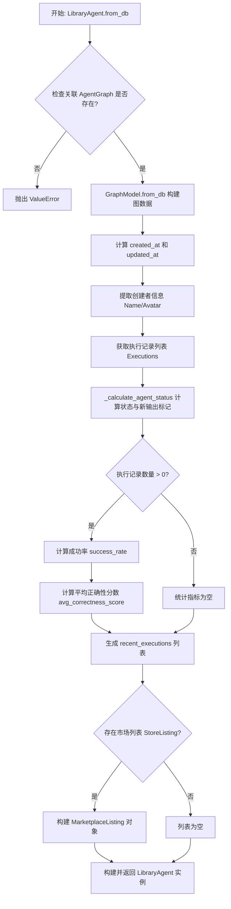
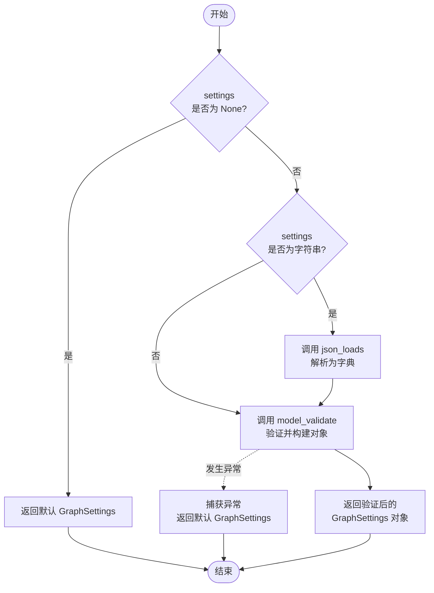
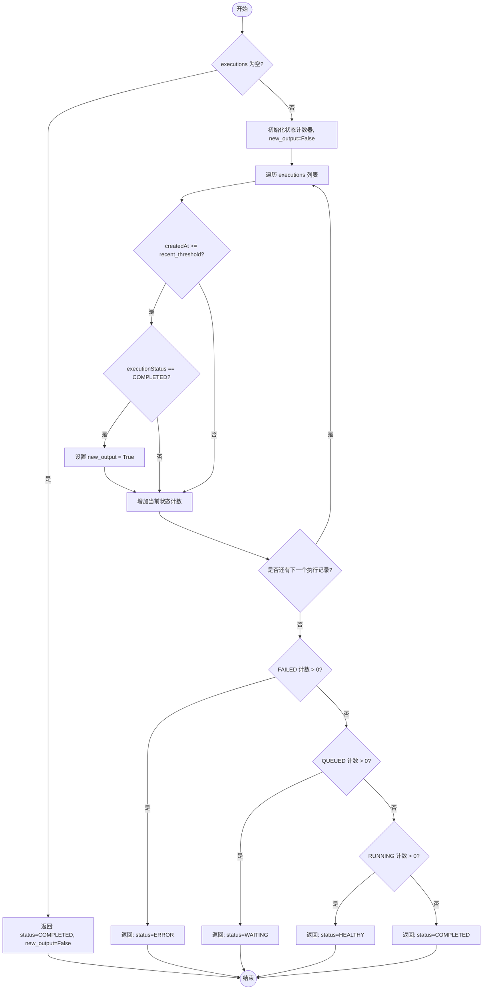
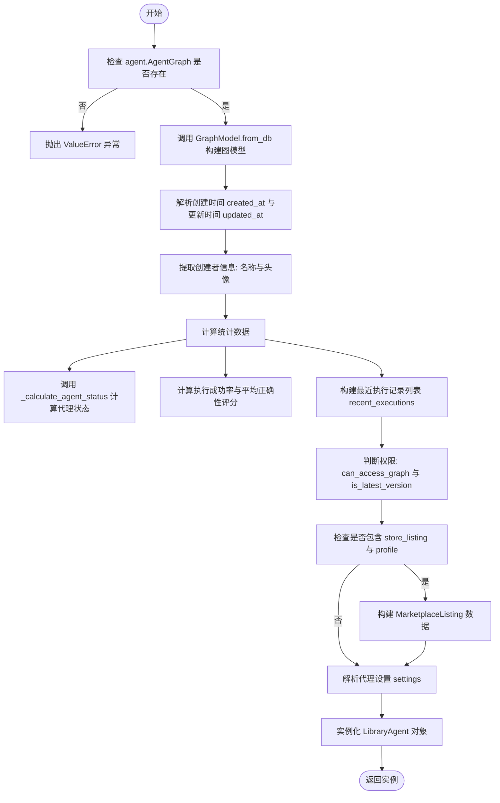
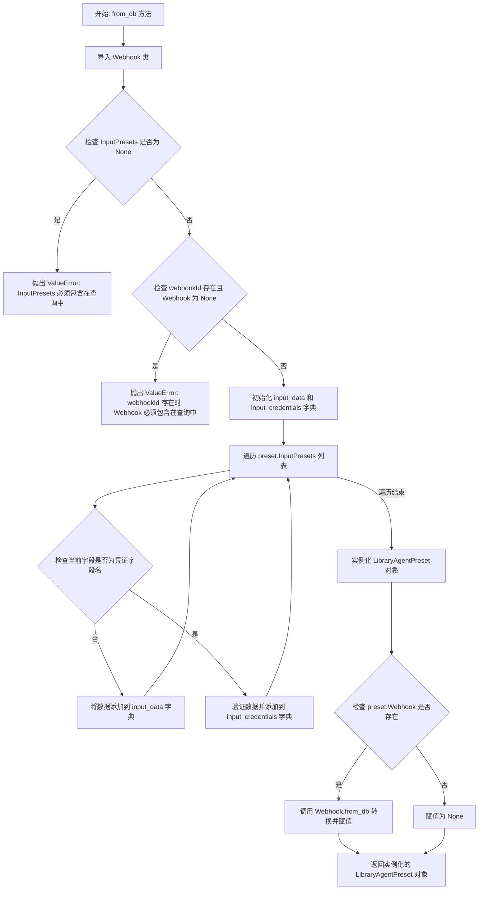

# `AutoGPT\autogpt_platform\backend\backend\api\features\library\model.py` 详细设计文档

该代码定义了用于表示和管理“库代理”及其相关预设、市场列表信息的 Pydantic 数据模型。它包含了从数据库模型（Prisma）到应用模型的转换逻辑、代理状态与运行统计数据的计算（如成功率、正确性评分）、以及处理预设创建和更新的请求/响应模式。

## 整体流程



## 类结构

```
LibraryAgentStatus (Enum)
MarketplaceListingCreator
MarketplaceListing
RecentExecution
LibraryAgent (核心模型)
AgentStatusResult
LibraryAgentResponse
LibraryAgentPresetCreatable
LibraryAgentPresetCreatableFromGraphExecution
LibraryAgentPresetUpdatable
TriggeredPresetSetupRequest
LibraryAgentPreset (预设模型)
LibraryAgentPresetResponse
LibraryAgentFilter (Enum)
LibraryAgentSort (Enum)
LibraryAgentUpdateRequest
```

## 全局变量及字段


### `MarketplaceListingCreator.name`
    
The name of the creator.

类型：`str`
    


### `MarketplaceListingCreator.id`
    
The unique identifier of the creator.

类型：`str`
    


### `MarketplaceListingCreator.slug`
    
The slug for the creator's profile URL.

类型：`str`
    


### `MarketplaceListing.id`
    
The unique identifier of the marketplace listing.

类型：`str`
    


### `MarketplaceListing.name`
    
The name of the agent listing.

类型：`str`
    


### `MarketplaceListing.slug`
    
The slug for the listing's URL.

类型：`str`
    


### `MarketplaceListing.creator`
    
Information about the creator of the listing.

类型：`MarketplaceListingCreator`
    


### `RecentExecution.status`
    
The status of the execution.

类型：`str`
    


### `RecentExecution.correctness_score`
    
The score evaluating the correctness of the execution.

类型：`float | None`
    


### `RecentExecution.activity_summary`
    
A summary of the execution's activity.

类型：`str | None`
    


### `LibraryAgent.id`
    
The unique identifier for the library agent.

类型：`str`
    


### `LibraryAgent.graph_id`
    
The ID of the associated graph.

类型：`str`
    


### `LibraryAgent.graph_version`
    
The version number of the associated graph.

类型：`int`
    


### `LibraryAgent.owner_user_id`
    
The user ID of the owner of the agent.

类型：`str`
    


### `LibraryAgent.image_url`
    
The URL of the agent's avatar or logo.

类型：`str | None`
    


### `LibraryAgent.creator_name`
    
The name of the agent's creator.

类型：`str`
    


### `LibraryAgent.creator_image_url`
    
The URL of the creator's avatar.

类型：`str`
    


### `LibraryAgent.status`
    
The current status of the library agent.

类型：`LibraryAgentStatus`
    


### `LibraryAgent.created_at`
    
The timestamp when the agent was created.

类型：`datetime.datetime`
    


### `LibraryAgent.updated_at`
    
The timestamp when the agent was last updated.

类型：`datetime.datetime`
    


### `LibraryAgent.name`
    
The name of the agent.

类型：`str`
    


### `LibraryAgent.description`
    
A description of what the agent does.

类型：`str`
    


### `LibraryAgent.instructions`
    
Instructions on how to use or interact with the agent.

类型：`str | None`
    


### `LibraryAgent.input_schema`
    
The JSON schema defining the agent's input.

类型：`dict[str, Any]`
    


### `LibraryAgent.output_schema`
    
The JSON schema defining the agent's output.

类型：`dict[str, Any]`
    


### `LibraryAgent.credentials_input_schema`
    
Schema for credentials required by the agent.

类型：`dict[str, Any] | None`
    


### `LibraryAgent.has_external_trigger`
    
Indicates if the agent uses external triggers (e.g., webhooks).

类型：`bool`
    


### `LibraryAgent.has_human_in_the_loop`
    
Indicates if the agent requires human interaction.

类型：`bool`
    


### `LibraryAgent.has_sensitive_action`
    
Indicates if the agent performs sensitive actions.

类型：`bool`
    


### `LibraryAgent.trigger_setup_info`
    
Information regarding the trigger setup.

类型：`Optional[GraphTriggerInfo]`
    


### `LibraryAgent.new_output`
    
Flag indicating if there is new output from recent executions.

类型：`bool`
    


### `LibraryAgent.execution_count`
    
The total number of times the agent has been executed.

类型：`int`
    


### `LibraryAgent.success_rate`
    
The percentage of successful executions.

类型：`float | None`
    


### `LibraryAgent.avg_correctness_score`
    
The average correctness score across executions.

类型：`float | None`
    


### `LibraryAgent.recent_executions`
    
A list of recent execution summaries.

类型：`list[RecentExecution]`
    


### `LibraryAgent.can_access_graph`
    
Flag indicating if the current user can access the graph.

类型：`bool`
    


### `LibraryAgent.is_latest_version`
    
Indicates if this is the latest version of the agent.

类型：`bool`
    


### `LibraryAgent.is_favorite`
    
Indicates if the agent is marked as a favorite by the user.

类型：`bool`
    


### `LibraryAgent.recommended_schedule_cron`
    
The recommended cron schedule for running the agent.

类型：`str | None`
    


### `LibraryAgent.settings`
    
User-specific settings for the library agent.

类型：`GraphSettings`
    


### `LibraryAgent.marketplace_listing`
    
Information about the marketplace listing if applicable.

类型：`Optional[MarketplaceListing]`
    


### `AgentStatusResult.status`
    
The calculated status of the agent.

类型：`LibraryAgentStatus`
    


### `AgentStatusResult.new_output`
    
Whether there has been recent completed execution.

类型：`bool`
    


### `LibraryAgentResponse.agents`
    
The list of library agents.

类型：`list[LibraryAgent]`
    


### `LibraryAgentResponse.pagination`
    
Pagination information for the list of agents.

类型：`Pagination`
    


### `LibraryAgentPresetCreatable.graph_id`
    
The ID of the graph the preset is for.

类型：`str`
    


### `LibraryAgentPresetCreatable.graph_version`
    
The version of the graph the preset is for.

类型：`int`
    


### `LibraryAgentPresetCreatable.inputs`
    
The input values for the preset.

类型：`BlockInput`
    


### `LibraryAgentPresetCreatable.credentials`
    
The credentials required for the preset.

类型：`dict[str, CredentialsMetaInput]`
    


### `LibraryAgentPresetCreatable.name`
    
The name of the preset.

类型：`str`
    


### `LibraryAgentPresetCreatable.description`
    
A description of the preset.

类型：`str`
    


### `LibraryAgentPresetCreatable.is_active`
    
Whether the preset is currently active.

类型：`bool`
    


### `LibraryAgentPresetCreatable.webhook_id`
    
The associated webhook ID for the preset.

类型：`Optional[str]`
    


### `LibraryAgentPresetCreatableFromGraphExecution.graph_execution_id`
    
The ID of the execution to create the preset from.

类型：`str`
    


### `LibraryAgentPresetCreatableFromGraphExecution.name`
    
The name of the preset.

类型：`str`
    


### `LibraryAgentPresetCreatableFromGraphExecution.description`
    
A description of the preset.

类型：`str`
    


### `LibraryAgentPresetCreatableFromGraphExecution.is_active`
    
Whether the preset is currently active.

类型：`bool`
    


### `LibraryAgentPresetUpdatable.inputs`
    
The input values to update.

类型：`Optional[BlockInput]`
    


### `LibraryAgentPresetUpdatable.credentials`
    
The credentials to update.

类型：`Optional[dict[str, CredentialsMetaInput]]`
    


### `LibraryAgentPresetUpdatable.name`
    
The name to update.

类型：`Optional[str]`
    


### `LibraryAgentPresetUpdatable.description`
    
The description to update.

类型：`Optional[str]`
    


### `LibraryAgentPresetUpdatable.is_active`
    
The active status to update.

类型：`Optional[bool]`
    


### `TriggeredPresetSetupRequest.name`
    
The name of the triggered preset.

类型：`str`
    


### `TriggeredPresetSetupRequest.description`
    
A description of the triggered preset.

类型：`str`
    


### `TriggeredPresetSetupRequest.graph_id`
    
The ID of the graph for the preset.

类型：`str`
    


### `TriggeredPresetSetupRequest.graph_version`
    
The version of the graph.

类型：`int`
    


### `TriggeredPresetSetupRequest.trigger_config`
    
The configuration for the trigger.

类型：`dict[str, Any]`
    


### `TriggeredPresetSetupRequest.agent_credentials`
    
The credentials for the agent.

类型：`dict[str, CredentialsMetaInput]`
    


### `LibraryAgentPreset.id`
    
The unique identifier of the preset.

类型：`str`
    


### `LibraryAgentPreset.user_id`
    
The ID of the user who owns the preset.

类型：`str`
    


### `LibraryAgentPreset.created_at`
    
The timestamp when the preset was created.

类型：`datetime.datetime`
    


### `LibraryAgentPreset.updated_at`
    
The timestamp when the preset was last updated.

类型：`datetime.datetime`
    


### `LibraryAgentPreset.webhook`
    
The associated webhook object if any.

类型：`Webhook | None`
    


### `LibraryAgentPresetResponse.presets`
    
The list of agent presets.

类型：`list[LibraryAgentPreset]`
    


### `LibraryAgentPresetResponse.pagination`
    
Pagination information for the list of presets.

类型：`Pagination`
    


### `LibraryAgentUpdateRequest.auto_update_version`
    
Flag to enable auto-update of the agent version.

类型：`Optional[bool]`
    


### `LibraryAgentUpdateRequest.graph_version`
    
The specific graph version to update to.

类型：`Optional[int]`
    


### `LibraryAgentUpdateRequest.is_favorite`
    
Flag to mark or unmark the agent as favorite.

类型：`Optional[bool]`
    


### `LibraryAgentUpdateRequest.is_archived`
    
Flag to archive or unarchive the agent.

类型：`Optional[bool]`
    


### `LibraryAgentUpdateRequest.settings`
    
User-specific settings to update.

类型：`Optional[GraphSettings]`
    
    

## 全局函数及方法


### `_parse_settings`

Parse settings from database, handling both dict and string formats.

参数：

- `settings`：`dict | str | None`，来自数据库的设置，可以是字典、JSON字符串或None。

返回值：`GraphSettings`，解析后的GraphSettings对象，若输入无效则返回默认实例。

#### 流程图



#### 带注释源码

```python
def _parse_settings(settings: dict | str | None) -> GraphSettings:
    """Parse settings from database, handling both dict and string formats."""
    # 检查 settings 是否为 None，如果是，直接返回一个空的 GraphSettings 对象
    if settings is None:
        return GraphSettings()
    
    try:
        # 如果 settings 是字符串类型，说明是存储的 JSON 字符串，需要反序列化为字典
        if isinstance(settings, str):
            settings = json_loads(settings)
        
        # 将字典解析并验证为 GraphSettings 模型实例
        return GraphSettings.model_validate(settings)
    except Exception:
        # 如果在解析 JSON 或验证模型时发生任何错误，捕获异常并返回默认的空对象
        return GraphSettings()
```


### `_calculate_agent_status`

该函数用于根据代理的历史执行记录计算其当前状态，并判断是否存在最近时间窗口内的成功执行输出。

参数：

- `executions`：`list[prisma.models.AgentGraphExecution]`，包含代理图执行记录的列表。
- `recent_threshold`：`datetime.datetime`，用于判定“新输出”的时间阈值，任何在此时间之后的执行被视为最近执行。

返回值：`AgentStatusResult`，包含计算出的代理状态（`LibraryAgentStatus`）和布尔值标志（指示是否有新输出）。

#### 流程图



#### 带注释源码

```python
def _calculate_agent_status(
    executions: list[prisma.models.AgentGraphExecution],
    recent_threshold: datetime.datetime,
) -> AgentStatusResult:
    """
    Helper function to determine the overall agent status and whether there
    is new output (i.e., completed runs within the recent threshold).

    :param executions: A list of AgentGraphExecution objects.
    :param recent_threshold: A datetime; any execution after this indicates new output.
    :return: (AgentStatus, new_output_flag)
    """

    # 如果执行记录为空，则默认状态为 COMPLETED 且无新输出
    if not executions:
        return AgentStatusResult(status=LibraryAgentStatus.COMPLETED, new_output=False)

    # 初始化所有可能执行状态的计数器
    status_counts = {status: 0 for status in prisma.enums.AgentExecutionStatus}
    new_output = False

    # 遍历所有的执行记录以统计状态并检查新输出
    for execution in executions:
        # 检查执行时间是否在最近的时间阈值内
        if execution.createdAt >= recent_threshold:
            # 如果是最近时间内的执行且状态为已完成，则标记为有新输出
            if execution.executionStatus == prisma.enums.AgentExecutionStatus.COMPLETED:
                new_output = True
        # 增加对应状态的计数
        status_counts[execution.executionStatus] += 1

    # 优先级逻辑判断状态：失败 > 等待中 > 运行中 > 已完成
    # 1. 如果存在失败的执行，状态为 ERROR
    if status_counts[prisma.enums.AgentExecutionStatus.FAILED] > 0:
        return AgentStatusResult(status=LibraryAgentStatus.ERROR, new_output=new_output)
    # 2. 如果存在排队中的执行，状态为 WAITING
    elif status_counts[prisma.enums.AgentExecutionStatus.QUEUED] > 0:
        return AgentStatusResult(
            status=LibraryAgentStatus.WAITING, new_output=new_output
        )
    # 3. 如果存在运行中的执行，状态为 HEALTHY
    elif status_counts[prisma.enums.AgentExecutionStatus.RUNNING] > 0:
        return AgentStatusResult(
            status=LibraryAgentStatus.HEALTHY, new_output=new_output
        )
    # 4. 默认状态（全部成功或其他），状态为 COMPLETED
    else:
        return AgentStatusResult(
            status=LibraryAgentStatus.COMPLETED, new_output=new_output
        )
```


### `LibraryAgent.from_db`

这是一个静态工厂方法，用于将数据库中的原始 Prisma 模型（`prisma.models.LibraryAgent`）及其关联数据（如子图、市场列表、用户档案）转换为业务领域的 `LibraryAgent` 实例。该方法负责聚合数据、计算执行统计信息（如成功率、正确性评分）、解析时间戳以及构建复杂的嵌套对象。

参数：

- `agent`：`prisma.models.LibraryAgent`，数据库中的 LibraryAgent 原始记录对象，包含代理的基础信息。
- `sub_graphs`：`Optional[list[prisma.models.AgentGraph]]`，与该代理关联的子图列表，用于构建 GraphModel 及解析凭据架构。
- `store_listing`：`Optional[prisma.models.StoreListing]`，可选的市场列表信息，用于填充代理的市场展示数据。
- `profile`：`Optional[prisma.models.Profile]`，可选的创建者档案信息，用于填充创建者的姓名和头像等详情。

返回值：`LibraryAgent`，经过数据转换和业务逻辑处理后的 `LibraryAgent` 领域模型实例。

#### 流程图



#### 带注释源码

```python
    @staticmethod
    def from_db(
        agent: prisma.models.LibraryAgent,
        sub_graphs: Optional[list[prisma.models.AgentGraph]] = None,
        store_listing: Optional[prisma.models.StoreListing] = None,
        profile: Optional[prisma.models.Profile] = None,
    ) -> "LibraryAgent":
        """
        Factory method that constructs a LibraryAgent from a Prisma LibraryAgent
        model instance.
        """
        # 1. 校验：确保关联的 AgentGraph 存在，否则抛出异常
        if not agent.AgentGraph:
            raise ValueError("Associated Agent record is required.")

        # 2. 构建核心 GraphModel 对象，传入子图数据
        graph = GraphModel.from_db(agent.AgentGraph, sub_graphs=sub_graphs)

        # 3. 确定创建时间
        created_at = agent.createdAt

        # 4. 确定更新时间：取代理本身和关联图的更新时间中的较新者
        agent_updated_at = agent.AgentGraph.updatedAt
        lib_agent_updated_at = agent.updatedAt

        updated_at = (
            max(agent_updated_at, lib_agent_updated_at)
            if agent_updated_at
            else lib_agent_updated_at
        )

        # 5. 提取并处理创建者信息，处理可能的空值
        creator_name = "Unknown"
        creator_image_url = ""
        if agent.Creator:
            creator_name = agent.Creator.name or "Unknown"
            creator_image_url = agent.Creator.avatarUrl or ""

        # 6. 计算代理状态：定义一周前的时间点作为"最近"的阈值
        week_ago = datetime.datetime.now(datetime.timezone.utc) - datetime.timedelta(
            days=7
        )
        executions = agent.AgentGraph.Executions or []
        
        # 调用辅助函数计算状态和是否有新输出
        status_result = _calculate_agent_status(executions, week_ago)
        status = status_result.status
        new_output = status_result.new_output

        # 7. 计算执行统计信息
        execution_count = len(executions)
        success_rate: float | None = None
        avg_correctness_score: float | None = None
        
        if execution_count > 0:
            # 计算成功率 (COMPLETED 状态的数量 / 总数)
            success_count = sum(
                1
                for e in executions
                if e.executionStatus == prisma.enums.AgentExecutionStatus.COMPLETED
            )
            success_rate = (success_count / execution_count) * 100

            # 计算平均正确性评分
            correctness_scores = []
            for e in executions:
                if e.stats and isinstance(e.stats, dict):
                    score = e.stats.get("correctness_score")
                    if score is not None and isinstance(score, (int, float)):
                        correctness_scores.append(float(score))
            if correctness_scores:
                avg_correctness_score = sum(correctness_scores) / len(
                    correctness_scores
                )

        # 8. 构建最近执行记录列表，用于 LLM 参考
        recent_executions: list[RecentExecution] = []
        for e in executions:
            exec_score: float | None = None
            exec_summary: str | None = None
            if e.stats and isinstance(e.stats, dict):
                score = e.stats.get("correctness_score")
                if score is not None and isinstance(score, (int, float)):
                    exec_score = float(score)
                summary = e.stats.get("activity_status")
                if summary is not None and isinstance(summary, str):
                    exec_summary = summary
            exec_status = (
                e.executionStatus.value
                if hasattr(e.executionStatus, "value")
                else str(e.executionStatus)
            )
            recent_executions.append(
                RecentExecution(
                    status=exec_status,
                    correctness_score=exec_score,
                    activity_summary=exec_summary,
                )
            )

        # 9. 判断访问权限和版本状态
        can_access_graph = agent.AgentGraph.userId == agent.userId
        is_latest_version = True

        # 10. 处理市场列表数据
        marketplace_listing_data = None
        if store_listing and store_listing.ActiveVersion and profile:
            creator_data = MarketplaceListingCreator(
                name=profile.name,
                id=profile.id,
                slug=profile.username,
            )
            marketplace_listing_data = MarketplaceListing(
                id=store_listing.id,
                name=store_listing.ActiveVersion.name,
                slug=store_listing.slug,
                creator=creator_data,
            )

        # 11. 实例化并返回最终的 LibraryAgent 对象
        return LibraryAgent(
            id=agent.id,
            graph_id=agent.agentGraphId,
            graph_version=agent.agentGraphVersion,
            owner_user_id=agent.userId,
            image_url=agent.imageUrl,
            creator_name=creator_name,
            creator_image_url=creator_image_url,
            status=status,
            created_at=created_at,
            updated_at=updated_at,
            name=graph.name,
            description=graph.description,
            instructions=graph.instructions,
            input_schema=graph.input_schema,
            output_schema=graph.output_schema,
            credentials_input_schema=(
                graph.credentials_input_schema if sub_graphs is not None else None
            ),
            has_external_trigger=graph.has_external_trigger,
            has_human_in_the_loop=graph.has_human_in_the_loop,
            has_sensitive_action=graph.has_sensitive_action,
            trigger_setup_info=graph.trigger_setup_info,
            new_output=new_output,
            execution_count=execution_count,
            success_rate=success_rate,
            avg_correctness_score=avg_correctness_score,
            recent_executions=recent_executions,
            can_access_graph=can_access_graph,
            is_latest_version=is_latest_version,
            is_favorite=agent.isFavorite,
            recommended_schedule_cron=agent.AgentGraph.recommendedScheduleCron,
            settings=_parse_settings(agent.settings),
            marketplace_listing=marketplace_listing_data,
        )
```


### `LibraryAgentPreset.from_db`

这是一个工厂类方法，用于将数据库中的 Prisma 模型对象 (`prisma.models.AgentPreset`) 转换为应用程序领域的 `LibraryAgentPreset` 模型实例。该方法负责提取预设数据，区分普通输入与凭证输入，处理关联的 Webhook 数据，并进行必要的完整性校验。

参数：

-  `preset`：`prisma.models.AgentPreset`，从数据库查询获取的代理预设原始数据模型。

返回值：`LibraryAgentPreset`，转换后的领域模型对象，包含了解析后的输入、凭证及关联的 Webhook 信息。

#### 流程图



#### 带注释源码

```python
    @classmethod
    def from_db(cls, preset: prisma.models.AgentPreset) -> "LibraryAgentPreset":
        # 局部导入 Webhook 类以处理可能的循环依赖或按需加载
        from backend.data.integrations import Webhook

        # 校验：确保输入预设数据包含在查询结果中，否则无法解析
        if preset.InputPresets is None:
            raise ValueError("InputPresets must be included in AgentPreset query")
        
        # 校验：如果预设关联了 Webhook ID，则必须同时查询出 Webhook 实体
        if preset.webhookId and preset.Webhook is None:
            raise ValueError(
                "Webhook must be included in AgentPreset query when webhookId is set"
            )

        # 初始化容器，分别存储普通输入数据和凭证元数据
        input_data: BlockInput = {}
        input_credentials: dict[str, CredentialsMetaInput] = {}

        # 遍历数据库中的预设输入列表
        for preset_input in preset.InputPresets:
            # 根据字段名判断该输入是否为凭证字段
            if not is_credentials_field_name(preset_input.name):
                # 普通输入：直接存入 input_data
                input_data[preset_input.name] = preset_input.data
            else:
                # 凭证输入：使用 Pydantic 模型验证并转换为 CredentialsMetaInput
                input_credentials[preset_input.name] = (
                    CredentialsMetaInput.model_validate(preset_input.data)
                )

        # 构造并返回 LibraryAgentPreset 实例
        return cls(
            id=preset.id,
            user_id=preset.userId,
            created_at=preset.createdAt,
            updated_at=preset.updatedAt,
            graph_id=preset.agentGraphId,
            graph_version=preset.agentGraphVersion,
            name=preset.name,
            description=preset.description,
            is_active=preset.isActive,
            inputs=input_data,              # 填充解析后的普通输入
            credentials=input_credentials,  # 填充解析后的凭证
            webhook_id=preset.webhookId,
            # 如果存在 Webhook 记录，则调用其 from_db 方法进行转换，否则为 None
            webhook=Webhook.from_db(preset.Webhook) if preset.Webhook else None,
        )
```


## 关键组件


### Library Agent Data Model & Transformation

The central component defining the `LibraryAgent` structure, responsible for aggregating agent metadata, graph details, and execution statistics, while providing factory logic to transform database records into domain models.

### Agent Preset Management

Defines the data models (`LibraryAgentPreset`, `LibraryAgentPresetCreatable`, `LibraryAgentPresetUpdatable`, etc.) for creating, updating, and representing predefined configurations of agents, including handling of input data, credential schemas, and webhook associations.

### Marketplace Listing Representation

Provides the structure for marketplace-related data, such as `MarketplaceListing` and `MarketplaceListingCreator`, to display agents in a public marketplace context, linking agents to their creators and store listings.

### Execution Status & Health Calculation

Encapsulates the logic (`_calculate_agent_status`, `AgentStatusResult`) and result structures for determining an agent's operational status (e.g., Healthy, Error, Waiting) and identifying if new output has been generated based on its execution history.

### API Contract & Utility Models

A set of Pydantic schemas that define the external API interfaces, including request models for updates (`LibraryAgentUpdateRequest`), response wrappers with pagination (`LibraryAgentResponse`, `LibraryAgentPresetResponse`), and utility Enums for filtering and sorting agents.


## 问题及建议


### 已知问题

-   **静默异常处理风险**：`_parse_settings` 函数中捕获了所有 `Exception` 并在发生错误时返回默认的 `GraphSettings()`。这种“吞没”异常的做法会掩盖配置解析中的潜在错误（如 JSON 格式错误或字段不匹配），使得排查问题变得困难。
-   **违反单一职责原则**：`LibraryAgent.from_db` 方法承担了过多的职责，包括数据库模型转换、日期时间计算、状态统计（成功率、平均分）、最近执行记录处理以及市场列表数据的组装。该方法过于庞大，降低了代码的可读性和可测试性。
-   **内存计算性能瓶颈**：在 `LibraryAgent.from_db` 中，执行记录的统计逻辑（如 `success_rate`、`avg_correctness_score`）是在 Python 内存中对遍历列表进行的。如果关联的执行记录数量很大，这将消耗大量内存和 CPU 资源，且无法利用数据库的索引和聚合优化。
-   **硬编码的业务逻辑**：在计算代理状态时，时间阈值被硬编码为 `datetime.timedelta(days=7)`。这种硬编码降低了代码的灵活性，如果未来需要调整“最近”的定义，必须修改代码。

### 优化建议

-   **重构工厂方法**：建议将 `LibraryAgent.from_db` 中的复杂逻辑拆分为多个私有辅助方法，例如 `_calculate_agent_metrics`（计算指标）、_`determine_agent_status`（确定状态）、`_build_marketplace_listing`（构建市场信息），以提高代码的模块化程度和可维护性。
-   **迁移聚合计算至数据库层**：建议将成功率、平均正确性分数等统计计算逻辑移至数据库查询层（如 SQL 的聚合函数或 Prisma 的聚合查询），而不是在 Python 内存中处理。这可以显著减少数据传输量并提高查询性能。
-   **改进错误处理与日志记录**：在 `_parse_settings` 中，建议捕获具体的异常类型（如 `json.JSONDecodeError` 或 `pydantic.ValidationError`），并添加适当的日志记录（Logging），以便在配置解析失败时能够追踪原因，而不是静默失败。
-   **参数化配置常量**：将硬编码的 `days=7` 提取为类常量、配置项或函数参数，使得时间阈值的定义更加灵活，便于后续调整或在不同上下文中复用。


## 其它


### 设计目标与约束

1. **抽象层分离**：该模块旨在定义清晰的数据传输对象（DTO），作为数据库模型（Prisma）与API接口之间的抽象层，隐藏底层数据库结构的复杂性，对外提供标准化的数据模型。
2. **数据验证与完整性**：利用 Pydantic 进行严格的数据类型校验和序列化，确保所有传入和传出的数据符合预期的格式（如 `CredentialsMetaInput`, `BlockInput`）。
3. **业务逻辑封装**：将代理状态计算、成功率统计等聚合逻辑封装在模型层（如 `LibraryAgent.from_db`），而不是分散在控制器或查询层中，以提高代码的可维护性和复用性。
4. **向后兼容性与扩展性**：模型设计大量使用 `Optional` 类型和默认工厂函数，以适应数据库 schema 的演进。例如，`marketplace_listing` 和 `trigger_setup_info` 为可选字段，允许在不破坏现有功能的情况下新增特性。

### 数据流与状态机

1. **代理状态流转**：
    `LibraryAgentStatus` 的状态判定遵循优先级状态机逻辑，基于最近的执行记录列表 (`AgentGraphExecution`) 进行判断：
    *   **ERROR**：如果存在任何执行状态为 `FAILED` 的记录。
    *   **WAITING**：如果没有 `FAILED`，但存在任何执行状态为 `QUEUED` 的记录。
    *   **HEALTHY**：如果上述均未满足，但存在任何执行状态为 `RUNNING` 的记录。
    *   **COMPLETED**：如果上述均未满足（即所有执行均已完成或列表为空）。
    *   **新产出标记**：如果存在任何执行完成时间 (`createdAt`) 晚于给定阈值（`recent_threshold`，通常为一周前），则标记 `new_output` 为 `True`。

2. **数据转换流**：
    数据流向遵循以下路径：**数据库原始数据** -> **工厂方法/辅助函数** -> **Pydantic 领域模型**。
    *   输入：通过 Prisma 查询获取的原始数据库对象（如 `prisma.models.LibraryAgent`），包含关联的 `AgentGraph`, `Executions`, `StoreListing` 等数据。
    *   处理：
        *   `GraphModel.from_db` 负责解析核心图数据。
        *   `_calculate_agent_status` 负责聚合执行数据以确定状态。
        *   `_parse_settings` 负责清洗和格式化配置数据。
    *   输出：填充完整并经过计算的 `LibraryAgent` 或 `LibraryAgentPreset` 实例，可直接用于 API 响应。

### 外部依赖与接口契约

1. **数据库模型依赖**：
    *   **Prisma Models**：本模块严重依赖 `prisma.models` 中的结构（如 `LibraryAgent`, `AgentGraph`, `AgentPreset`）。工厂方法假设传入的对象是有效的 Prisma 实例，且包含必要的关联数据（例如 `LibraryAgent.from_db` 要求传入的 `agent` 对象必须包含 `AgentGraph` 关联，否则抛出 `ValueError`）。
    *   **枚举契约**：直接引用 `prisma.enums`（如 `AgentExecutionStatus`）以匹配数据库中的状态值。

2. **内部模块契约**：
    *   **GraphModel**：依赖 `backend.data.graph.GraphModel.from_db` 方法来转换图相关的元数据（如 `input_schema`, `description`），这要求 `GraphModel` 能够处理从数据库加载的子图 (`sub_graphs`)。
    *   **Webhook**：`LibraryAgentPreset` 依赖 `backend.data.integrations.Webhook.from_db` 来转换 Webhook 数据。如果预设关联了 Webhook (`webhookId` 不为空)，则必须包含 `Webhook` 关联数据。

3. **JSON 处理契约**：
    *   依赖 `backend.util.json.loads` 来解析存储在数据库中的 JSON 字符串（如 `settings` 字段）。假设该函数能够处理标准 JSON 格式。

### 错误处理与异常设计

1. **防御性解析**：
    *   在 `_parse_settings` 函数中，使用了 `try-except Exception` 块来捕获解析过程中的所有异常（无论是 JSON 解析错误还是 Pydantic 验证错误）。当解析失败时，函数不会抛出异常中断流程，而是返回一个默认的 `GraphSettings()` 实例，确保系统的健壮性。

2. **关键数据缺失校验**：
    *   在工厂方法（如 `LibraryAgent.from_db` 和 `LibraryAgentPreset.from_db`）中，对关键业务数据进行显式检查。如果核心关联对象缺失（例如 `LibraryAgent` 没有 `AgentGraph`，或 `AgentPreset` 没有 `InputPresets`），代码会主动抛出 `ValueError`。这是一种“快速失败”策略，旨在防止因数据不完整导致的逻辑错误或运行时意外。

3. **空值与类型安全处理**：
    *   对于可能为空的可选字段（如 `correctness_score`），在统计计算时进行了显式的 `None` 检查和类型过滤（`isinstance(score, (int, float))`），防止在计算平均值时出现类型错误。
    *   使用 `getattr` 或安全访问模式（如 `e.stats.get("correctness_score") if e.stats else None`）来避免因关联数据缺失导致的 `AttributeError`。
    