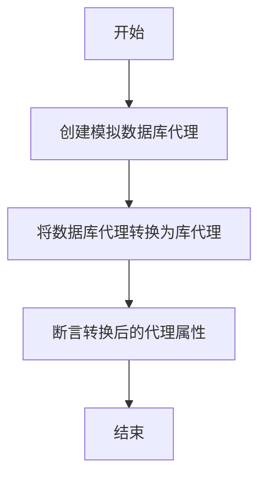
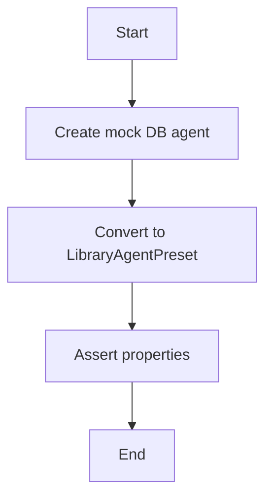
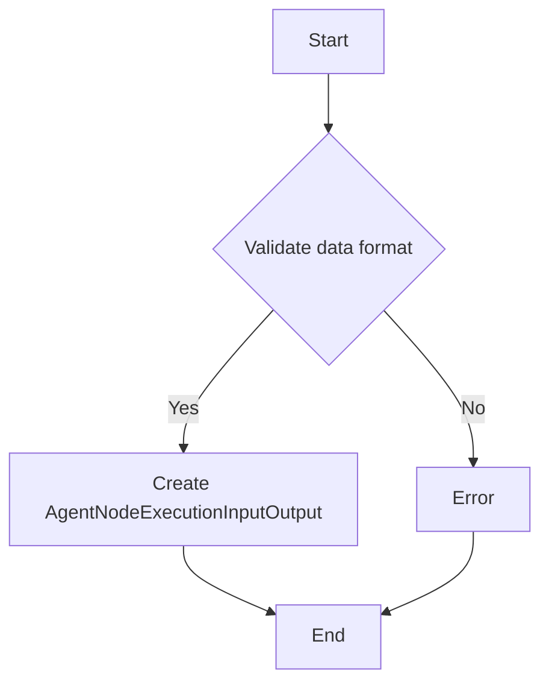
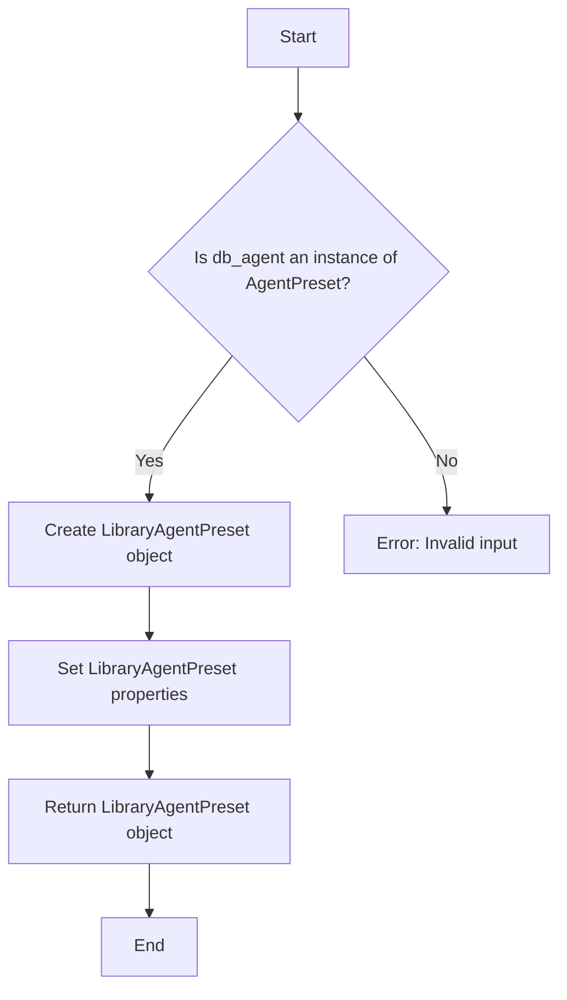

# `.\AutoGPT\autogpt_platform\backend\backend\api\features\library\model_test.py` 详细设计文档

The code defines a test function that verifies the conversion of a Prisma database model to a library model for an agent preset, ensuring that the conversion maintains the integrity of the data.

## 整体流程



## 类结构

```
test_agent_preset_from_db.py (测试文件)
├── prisma.models (Prisma模型)
│   ├── AgentPreset (数据库代理预设模型)
│   └── AgentNodeExecutionInputOutput (代理节点执行输入输出模型)
├── pytest (测试框架)
├── datetime (日期和时间模块)
└── . (当前目录，包含library_model模块)
```

## 全局变量及字段


### `test_user_id`
    
Unique identifier for the test user.

类型：`str`
    


### `db_agent`
    
Database agent object representing the preset.

类型：`AgentPreset`
    


### `agent`
    
Library agent object converted from the database agent.

类型：`LibraryAgentPreset`
    


### `AgentPreset.id`
    
Unique identifier for the agent preset.

类型：`str`
    


### `AgentPreset.createdAt`
    
Timestamp when the agent preset was created.

类型：`datetime.datetime`
    


### `AgentPreset.updatedAt`
    
Timestamp when the agent preset was last updated.

类型：`datetime.datetime`
    


### `AgentPreset.agentGraphId`
    
Identifier for the agent graph associated with the preset.

类型：`str`
    


### `AgentPreset.agentGraphVersion`
    
Version number of the agent graph associated with the preset.

类型：`int`
    


### `AgentPreset.name`
    
Name of the agent preset.

类型：`str`
    


### `AgentPreset.description`
    
Description of the agent preset.

类型：`str`
    


### `AgentPreset.isActive`
    
Flag indicating if the agent preset is active.

类型：`bool`
    


### `AgentPreset.userId`
    
Identifier for the user who owns the agent preset.

类型：`str`
    


### `AgentPreset.isDeleted`
    
Flag indicating if the agent preset has been deleted.

类型：`bool`
    


### `AgentPreset.InputPresets`
    
List of input presets associated with the agent preset.

类型：`list of AgentNodeExecutionInputOutput`
    
    

## 全局函数及方法


### test_agent_preset_from_db

This function tests the conversion of a Prisma AgentPreset model to a LibraryAgentPreset object.

参数：

- `test_user_id`：`str`，The user ID associated with the agent preset.

返回值：`None`，This function does not return a value.

#### 流程图



#### 带注释源码

```python
import datetime
import prisma.models
import pytest
from . import model as library_model

@pytest.mark.asyncio
async def test_agent_preset_from_db(test_user_id: str):
    # Create mock DB agent
    db_agent = prisma.models.AgentPreset(
        id="test-agent-123",
        createdAt=datetime.datetime.now(),
        updatedAt=datetime.datetime.now(),
        agentGraphId="agent-123",
        agentGraphVersion=1,
        name="Test Agent",
        description="Test agent description",
        isActive=True,
        userId=test_user_id,
        isDeleted=False,
        InputPresets=[
            prisma.models.AgentNodeExecutionInputOutput.model_validate(
                {
                    "id": "input-123",
                    "time": datetime.datetime.now(),
                    "name": "input1",
                    "data": '{"type": "string", "value": "test value"}',
                }
            )
        ],
    )

    # Convert to LibraryAgentPreset
    agent = library_model.LibraryAgentPreset.from_db(db_agent)

    assert agent.id == "test-agent-123"
    assert agent.graph_version == 1
    assert agent.is_active is True
    assert agent.name == "Test Agent"
    assert agent.description == "Test agent description"
    assert agent.inputs == {"input1": {"type": "string", "value": "test value"}}
``` 


### `AgentNodeExecutionInputOutput.model_validate`

该函数用于验证和转换输入数据，确保其符合预期的格式和类型。

参数：

- `data`：`dict`，包含输入数据的字典，其中应包含`id`、`time`、`name`和`data`键。

返回值：`AgentNodeExecutionInputOutput`，验证后的输入对象。

#### 流程图



#### 带注释源码

```python
from . import model as library_model

@pytest.mark.asyncio
async def test_agent_preset_from_db(test_user_id: str):
    # Create mock DB agent
    db_agent = prisma.models.AgentPreset(
        id="test-agent-123",
        createdAt=datetime.datetime.now(),
        updatedAt=datetime.datetime.now(),
        agentGraphId="agent-123",
        agentGraphVersion=1,
        name="Test Agent",
        description="Test agent description",
        isActive=True,
        userId=test_user_id,
        isDeleted=False,
        InputPresets=[
            prisma.models.AgentNodeExecutionInputOutput.model_validate(
                {
                    "id": "input-123",
                    "time": datetime.datetime.now(),
                    "name": "input1",
                    "data": '{"type": "string", "value": "test value"}',
                }
            )
        ],
    )

    # Convert to LibraryAgentPreset
    agent = library_model.LibraryAgentPreset.from_db(db_agent)

    assert agent.id == "test-agent-123"
    assert agent.graph_version == 1
    assert agent.is_active is True
    assert agent.name == "Test Agent"
    assert agent.description == "Test agent description"
    assert agent.inputs == {"input1": {"type": "string", "value": "test value"}}
```


### `LibraryAgentPreset.from_db`

将 Prisma 模型 `AgentPreset` 转换为 `LibraryAgentPreset` 对象。

参数：

- `db_agent`：`prisma.models.AgentPreset`，Prisma 模型对象，包含数据库中存储的代理预设信息。

返回值：`library_model.LibraryAgentPreset`，`LibraryAgentPreset` 对象，包含转换后的代理预设信息。

#### 流程图



#### 带注释源码

```python
from . import model as library_model

@pytest.mark.asyncio
async def test_agent_preset_from_db(test_user_id: str):
    # Create mock DB agent
    db_agent = prisma.models.AgentPreset(
        id="test-agent-123",
        createdAt=datetime.datetime.now(),
        updatedAt=datetime.datetime.now(),
        agentGraphId="agent-123",
        agentGraphVersion=1,
        name="Test Agent",
        description="Test agent description",
        isActive=True,
        userId=test_user_id,
        isDeleted=False,
        InputPresets=[
            prisma.models.AgentNodeExecutionInputOutput.model_validate(
                {
                    "id": "input-123",
                    "time": datetime.datetime.now(),
                    "name": "input1",
                    "data": '{"type": "string", "value": "test value"}',
                }
            )
        ],
    )

    # Convert to LibraryAgentPreset
    agent = library_model.LibraryAgentPreset.from_db(db_agent)

    assert agent.id == "test-agent-123"
    assert agent.graph_version == 1
    assert agent.is_active is True
    assert agent.name == "Test Agent"
    assert agent.description == "Test agent description"
    assert agent.inputs == {"input1": {"type": "string", "value": "test value"}}
```


## 关键组件


### 张量索引与惰性加载

张量索引与惰性加载是处理大型数据集时提高性能的关键技术，它允许在需要时才加载数据，从而减少内存消耗和提高处理速度。

### 反量化支持

反量化支持是针对量化计算的一种优化技术，它通过将量化操作转换为非量化操作来提高计算效率。

### 量化策略

量化策略是用于优化计算资源使用的一种方法，它通过减少数据类型的大小来降低内存和计算需求。


## 问题及建议


### 已知问题

-   **测试依赖性**：测试函数依赖于外部库 `pytest` 和 `prisma`，这可能导致测试的可移植性和可维护性降低。
-   **时间依赖性**：测试中使用了 `datetime.datetime.now()`，这可能导致测试结果在不同时间执行时不同，影响测试的稳定性。
-   **硬编码**：测试中使用了硬编码的字符串和数字，如 `"test-agent-123"` 和 `"input-123"`，这降低了代码的可读性和可维护性。

### 优化建议

-   **使用固定时间**：在测试中使用固定的 `datetime` 时间戳，以确保测试结果的一致性。
-   **参数化测试**：将硬编码的值作为参数传递给测试函数，以提高代码的可读性和可维护性。
-   **模拟数据库交互**：使用模拟或存根来代替实际的数据库交互，以提高测试的独立性和可重用性。
-   **代码审查**：进行代码审查，确保代码遵循最佳实践，如避免硬编码和过度依赖外部库。
-   **单元测试**：编写更全面的单元测试，覆盖更多的代码路径和边界条件，以提高代码的质量和可靠性。


## 其它


### 设计目标与约束

- 设计目标：确保代码能够高效、准确地从数据库中读取和转换数据，同时保证测试的稳定性和可靠性。
- 约束条件：遵循异步编程模式，确保数据库操作不会阻塞主线程。

### 错误处理与异常设计

- 异常处理：在数据库操作和数据处理过程中，应捕获并处理可能出现的异常，如数据库连接失败、数据格式错误等。
- 错误日志：记录异常信息和堆栈跟踪，便于问题定位和调试。

### 数据流与状态机

- 数据流：数据从数据库读取，经过转换后存储在内存中，最后通过断言验证数据正确性。
- 状态机：无状态机设计，数据流线性执行。

### 外部依赖与接口契约

- 外部依赖：prisma ORM库用于数据库操作，pytest用于测试。
- 接口契约：通过断言验证数据库转换后的数据是否符合预期。

### 测试用例设计

- 测试用例：包括数据库连接、数据读取、数据转换和断言验证等步骤。
- 测试覆盖率：确保测试用例覆盖关键代码路径和边界条件。

### 性能优化

- 数据库查询优化：使用索引和合理的查询语句提高查询效率。
- 内存优化：合理管理内存使用，避免内存泄漏。

### 安全性

- 数据验证：确保输入数据符合预期格式，防止SQL注入等安全风险。
- 权限控制：根据用户角色和权限限制数据库操作。

### 代码风格与规范

- 代码风格：遵循PEP 8编码规范，保持代码可读性和可维护性。
- 注释：对关键代码和复杂逻辑进行注释，便于他人理解和维护。

### 代码复用

- 代码复用：将通用的数据库操作和数据处理逻辑封装成函数或类，提高代码复用性。

### 代码维护

- 代码维护：定期进行代码审查和重构，确保代码质量。
- 文档更新：及时更新设计文档和代码注释，保持文档与代码的一致性。


    