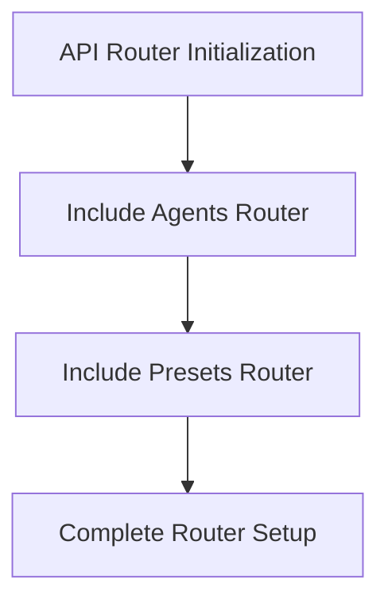
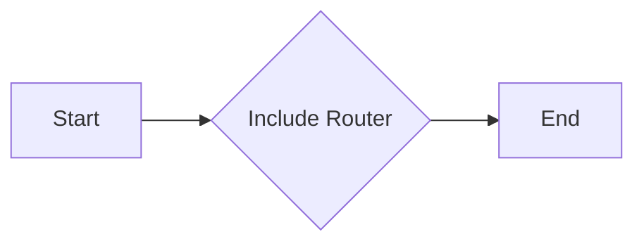
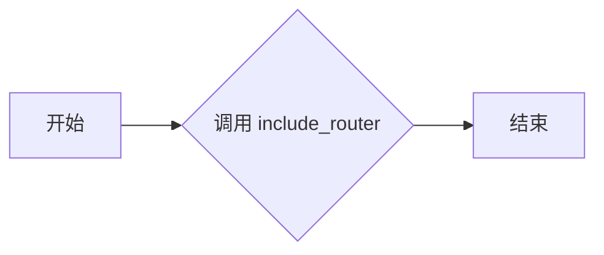

# `.\AutoGPT\autogpt_platform\backend\backend\api\features\library\routes\__init__.py` 详细设计文档

This code defines a FastAPI router that includes sub-routers for agents and presets, enabling the integration of different functionalities into a single API endpoint.

## 整体流程



## 类结构

```
APIRouter (FastAPI Router)
```

## 全局变量及字段


### `router`
    
The main router instance that includes sub-routers for presets and agents.

类型：`fastapi.APIRouter`
    


### `APIRouter.router`
    
The main router instance that includes sub-routers for presets and agents.

类型：`fastapi.APIRouter`
    
    

## 全局函数及方法


### router.include_router

该函数用于将子路由器添加到主路由器中。

参数：

- `router`：`APIRouter`，子路由器对象，用于添加到主路由器中。

返回值：无，该函数不返回任何值。

#### 流程图



#### 带注释源码

```python
import fastapi

from .agents import router as agents_router
from .presets import router as presets_router

router = fastapi.APIRouter()

# 将子路由器添加到主路由器中
router.include_router(presets_router)
router.include_router(agents_router)
```


### `APIRouter.include_router`

`APIRouter.include_router` 是一个方法，用于将另一个路由器（`router`）的路径和视图函数包含到当前的路由器中。

参数：

- `router`：`fastapi.APIRouter`，表示要包含的路由器对象。它是一个路由器实例，包含了路径和视图函数的映射。

返回值：无，该方法不返回任何值。

#### 流程图



#### 带注释源码

```python
import fastapi

from .agents import router as agents_router
from .presets import router as presets_router

router = fastapi.APIRouter()

# 将 presets 路由器包含到当前路由器中
router.include_router(presets_router)

# 将 agents 路由器包含到当前路由器中
router.include_router(agents_router)
```


## 关键组件


### 张量索引与惰性加载

支持对张量的索引操作，并在需要时才加载张量数据，以优化内存使用和性能。

### 反量化支持

提供对反量化操作的支持，允许在量化过程中进行逆量化处理。

### 量化策略

实现多种量化策略，以适应不同的应用场景和性能需求。


## 问题及建议


### 已知问题

-   {问题1}：代码中使用了硬编码的模块路径，这可能导致模块之间的依赖关系难以维护和扩展。
-   {问题2}：代码没有进行错误处理，如果`agents`或`presets`模块中的路由器加载失败，整个API可能会崩溃。
-   {问题3}：代码没有进行日志记录，难以追踪和调试问题。

### 优化建议

-   {建议1}：使用相对导入或配置文件来管理模块路径，以便于维护和扩展。
-   {建议2}：在加载路由器时添加异常处理，确保即使某个模块加载失败，API也能继续运行。
-   {建议3}：添加日志记录功能，以便于问题追踪和调试。
-   {建议4}：考虑使用依赖注入来管理路由器的实例，以便于单元测试和测试驱动开发。
-   {建议5}：如果`agents`和`presets`模块很大，可以考虑将它们拆分成更小的模块，以提高代码的可维护性。


## 其它


### 设计目标与约束

- 设计目标：确保API路由的灵活性和可扩展性，同时保持代码的整洁和易于维护。
- 约束条件：遵循FastAPI框架的最佳实践，确保路由配置的模块化和可重用性。

### 错误处理与异常设计

- 异常处理：定义全局异常处理器来捕获和处理未预料到的错误。
- 错误返回：确保错误信息清晰，便于前端识别和调试。

### 数据流与状态机

- 数据流：API请求通过路由器处理，数据在各个组件之间流动。
- 状态机：无状态设计，每个请求独立处理，无会话状态。

### 外部依赖与接口契约

- 外部依赖：依赖于FastAPI框架和路由器。
- 接口契约：通过FastAPI的路由定义明确的接口契约。

### 安全性与认证

- 安全性：确保API的安全性，可能包括HTTPS、认证和授权机制。
- 认证机制：根据需要实现用户认证和授权。

### 性能优化

- 性能监控：监控API性能，如响应时间和资源消耗。
- 优化策略：根据监控结果实施优化措施，如缓存、异步处理等。

### 测试与文档

- 测试策略：编写单元测试和集成测试，确保代码质量。
- 文档编写：提供详细的API文档，包括路由、参数和返回值。

### 版本控制与部署

- 版本控制：使用版本控制系统管理代码变更。
- 部署流程：定义部署流程，包括自动化部署和版本更新。


    