# `.\AutoGPT\autogpt_platform\backend\backend\api\features\library\routes\agents.py` 详细设计文档

This code defines an API router for managing library agents, including listing, getting, adding, updating, and deleting agents, as well as handling favorites and marketplace integration.

## 整体流程

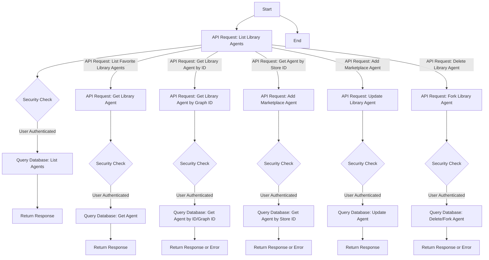

## 类结构

```
APIRouter (FastAPI Router)
├── list_library_agents
│   ├── user_id
│   ├── search_term
│   ├── sort_by
│   ├── page
│   └── page_size
├── list_favorite_library_agents
│   ├── user_id
│   ├── page
│   └── page_size
├── get_library_agent
│   ├── library_agent_id
│   └── user_id
├── get_library_agent_by_graph_id
│   ├── graph_id
│   ├── version
│   └── user_id
├── get_library_agent_by_store_listing_version_id
│   ├── store_listing_version_id
│   └── user_id
├── add_marketplace_agent_to_library
│   ├── store_listing_version_id
│   ├── source
│   └── user_id
├── update_library_agent
│   ├── library_agent_id
│   ├── payload
│   └── user_id
├── delete_library_agent
│   ├── library_agent_id
│   └── user_id
└── fork_library_agent
    ├── library_agent_id
    └── user_id
```

## 全局变量及字段


### `router`
    
The API router for the library agents.

类型：`APIRouter`
    


### `library_db`
    
The database module for library operations.

类型：`module`
    


### `library_model`
    
The model module for library data structures.

类型：`module`
    


### `APIRouter.prefix`
    
The prefix for the API router endpoints.

类型：`str`
    


### `APIRouter.tags`
    
The tags for the API router endpoints.

类型：`list`
    


### `APIRouter.dependencies`
    
The dependencies for the API router endpoints.

类型：`list`
    


### `LibraryAgentResponse`
    
The response model for library agents.

类型：`module`
    


### `LibraryAgent`
    
The model for library agents.

类型：`module`
    


### `LibraryAgentUpdateRequest.auto_update_version`
    
The auto update version of the library agent.

类型：`Optional[int]`
    


### `LibraryAgentUpdateRequest.graph_version`
    
The graph version of the library agent.

类型：`Optional[int]`
    


### `LibraryAgentUpdateRequest.is_favorite`
    
Whether the library agent is marked as favorite.

类型：`Optional[bool]`
    


### `LibraryAgentUpdateRequest.is_archived`
    
Whether the library agent is archived.

类型：`Optional[bool]`
    


### `LibraryAgentUpdateRequest.settings`
    
The settings of the library agent.

类型：`Optional[dict]`
    


### `APIRouter.prefix`
    
The prefix for the API router endpoints.

类型：`str`
    


### `APIRouter.tags`
    
The tags for the API router endpoints.

类型：`list`
    


### `APIRouter.dependencies`
    
The dependencies for the API router endpoints.

类型：`list`
    


### `LibraryAgentResponse.LibraryAgentResponse`
    
The response model for library agents.

类型：`module`
    


### `LibraryAgent.LibraryAgent`
    
The model for library agents.

类型：`module`
    


### `LibraryAgentUpdateRequest.auto_update_version`
    
The auto update version of the library agent.

类型：`Optional[int]`
    


### `LibraryAgentUpdateRequest.graph_version`
    
The graph version of the library agent.

类型：`Optional[int]`
    


### `LibraryAgentUpdateRequest.is_favorite`
    
Whether the library agent is marked as favorite.

类型：`Optional[bool]`
    


### `LibraryAgentUpdateRequest.is_archived`
    
Whether the library agent is archived.

类型：`Optional[bool]`
    


### `LibraryAgentUpdateRequest.settings`
    
The settings of the library agent.

类型：`Optional[dict]`
    
    

## 全局函数及方法


### list_library_agents

Get all agents in the user's library (both created and saved).

参数：

- `user_id`：`str`，The unique identifier for the user.
- `search_term`：`Optional[str]`，The search term to filter agents. Defaults to None.
- `sort_by`：`library_model.LibraryAgentSort`，The criteria to sort results by. Defaults to `library_model.LibraryAgentSort.UPDATED_AT`.
- `page`：`int`，The page number to retrieve. Must be >= 1. Defaults to 1.
- `page_size`：`int`，The number of agents per page. Must be >= 1. Defaults to 15.

返回值：`library_model.LibraryAgentResponse`，A response containing the list of library agents.

#### 流程图

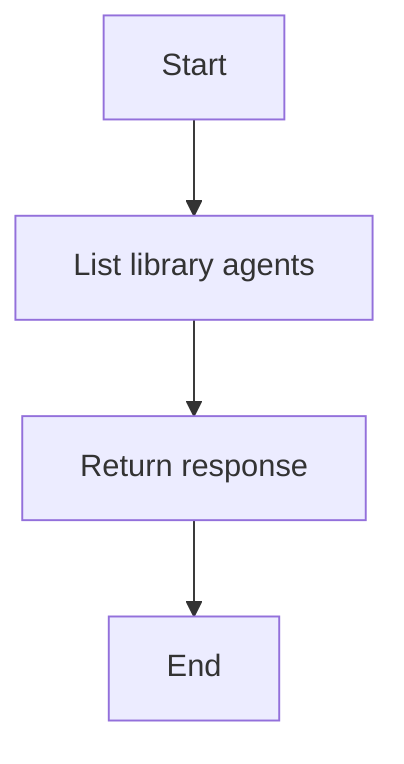

#### 带注释源码

```python
@router.get(
    "",
    summary="List Library Agents",
    response_model=library_model.LibraryAgentResponse,
)
async def list_library_agents(
    user_id: str = Security(autogpt_auth_lib.get_user_id),
    search_term: Optional[str] = Query(
        None, description="Search term to filter agents"
    ),
    sort_by: library_model.LibraryAgentSort = Query(
        library_model.LibraryAgentSort.UPDATED_AT,
        description="Criteria to sort results by",
    ),
    page: int = Query(
        1,
        ge=1,
        description="Page number to retrieve (must be >= 1)",
    ),
    page_size: int = Query(
        15,
        ge=1,
        description="Number of agents per page (must be >= 1)",
    ),
) -> library_model.LibraryAgentResponse:
    """
    Get all agents in the user's library (both created and saved).
    """
    return await library_db.list_library_agents(
        user_id=user_id,
        search_term=search_term,
        sort_by=sort_by,
        page=page,
        page_size=page_size,
    )
```


### list_favorite_library_agents

Get all favorite agents in the user's library.

参数：

- `user_id`：`str`，The unique identifier for the user.
- `page`：`int`，The page number to retrieve (must be >= 1).
- `page_size`：`int`，The number of agents per page (must be >= 1).

返回值：`library_model.LibraryAgentResponse`，A response object containing the list of favorite library agents.

#### 流程图

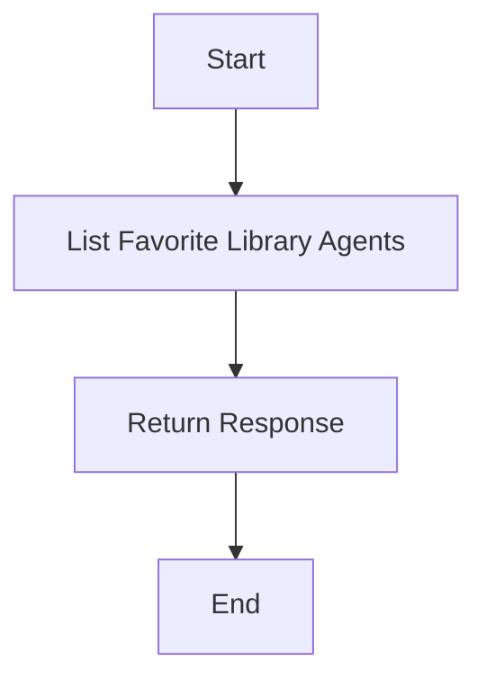

#### 带注释源码

```python
@router.get(
    "/favorites",
    summary="List Favorite Library Agents",
)
async def list_favorite_library_agents(
    user_id: str = Security(autogpt_auth_lib.get_user_id),
    page: int = Query(
        1,
        ge=1,
        description="Page number to retrieve (must be >= 1)",
    ),
    page_size: int = Query(
        15,
        ge=1,
        description="Number of agents per page (must be >= 1)",
    ),
) -> library_model.LibraryAgentResponse:
    """
    Get all favorite agents in the user's library.
    """
    return await library_db.list_favorite_library_agents(
        user_id=user_id,
        page=page,
        page_size=page_size,
    )
```


### `get_library_agent`

Get Library Agent

参数：

- `library_agent_id`：`str`，The unique identifier of the library agent to retrieve.
- `user_id`：`str`，The unique identifier of the user who owns the library agent.

返回值：`library_model.LibraryAgent`，The library agent with the specified ID.

#### 流程图

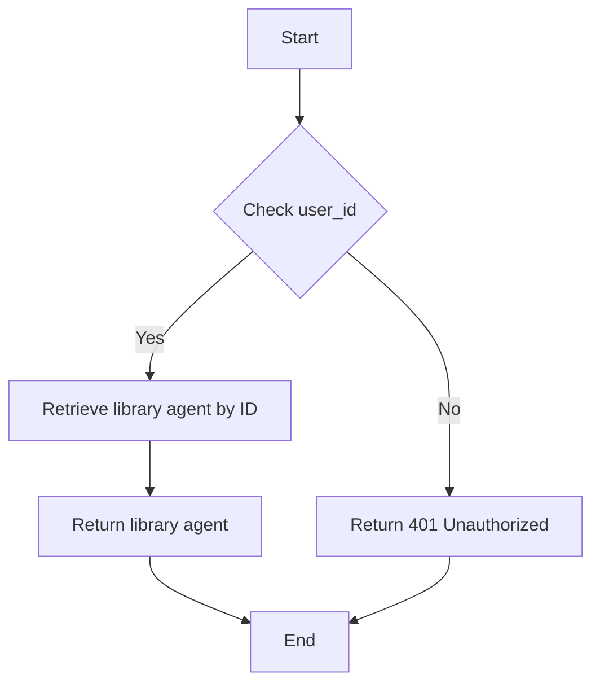

#### 带注释源码

```python
@router.get("/{library_agent_id}", summary="Get Library Agent")
async def get_library_agent(
    library_agent_id: str,
    user_id: str = Security(autogpt_auth_lib.get_user_id),
) -> library_model.LibraryAgent:
    return await library_db.get_library_agent(id=library_agent_id, user_id=user_id)
```


### get_library_agent_by_graph_id

Get the library agent associated with a specific graph ID.

参数：

- `graph_id`：`str`，The unique identifier of the graph associated with the library agent.
- `version`：`Optional[int]`，The version of the library agent (optional).
- `user_id`：`str`，The unique identifier of the user who owns the library agent.

返回值：`library_model.LibraryAgent`，The library agent associated with the graph ID.

#### 流程图

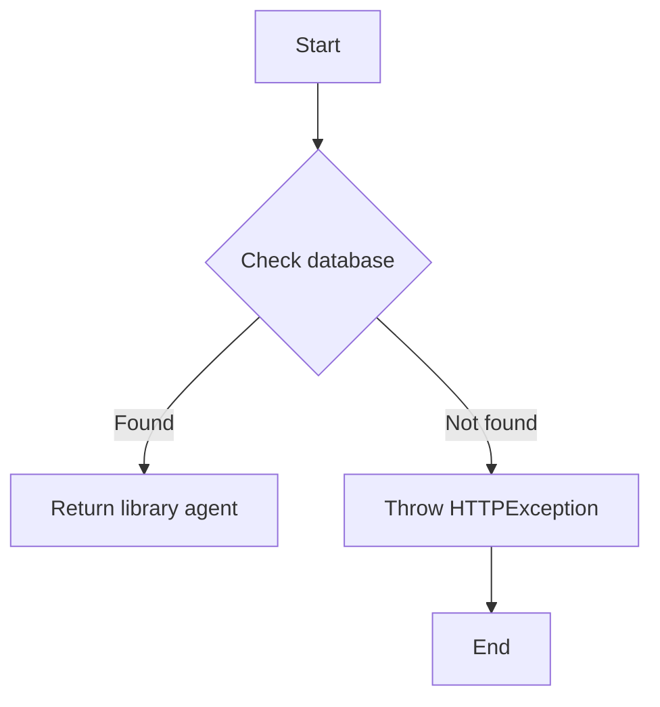

#### 带注释源码

```python
@router.get("/by-graph/{graph_id}")
async def get_library_agent_by_graph_id(
    graph_id: str,
    version: Optional[int] = Query(default=None),
    user_id: str = Security(autogpt_auth_lib.get_user_id),
) -> library_model.LibraryAgent:
    library_agent = await library_db.get_library_agent_by_graph_id(
        user_id, graph_id, version
    )
    if not library_agent:
        raise HTTPException(
            status_code=status.HTTP_404_NOT_FOUND,
            detail=f"Library agent for graph #{graph_id} and user #{user_id} not found",
        )
    return library_agent
```


### get_library_agent_by_store_listing_version_id

Get Library Agent from Store Listing Version ID.

参数：

- `store_listing_version_id`：`str`，The unique identifier for the store listing version.
- `user_id`：`str`，The unique identifier for the user.

返回值：`library_model.LibraryAgent | None`，The Library Agent object if found, otherwise None.

#### 流程图

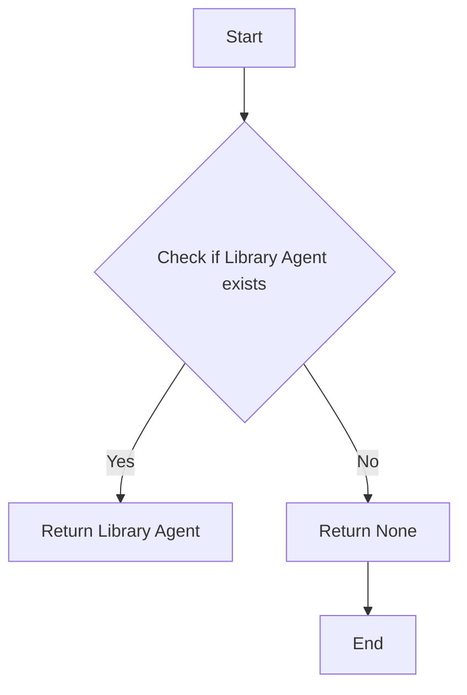

#### 带注释源码

```python
@router.get(
    "/marketplace/{store_listing_version_id}",
    summary="Get Agent By Store ID",
    tags=["store", "library"],
    response_model=library_model.LibraryAgent | None,
)
async def get_library_agent_by_store_listing_version_id(
    store_listing_version_id: str,
    user_id: str = Security(autogpt_auth_lib.get_user_id),
) -> library_model.LibraryAgent | None:
    """
    Get Library Agent from Store Listing Version ID.
    """
    return await library_db.get_library_agent_by_store_version_id(
        store_listing_version_id, user_id
    )
```


### `add_marketplace_agent_to_library`

Add an agent from the marketplace to the user's library.

参数：

- `store_listing_version_id`：`str`，The ID of the store listing version of the agent to be added.
- `source`：`Literal["onboarding", "marketplace"]`，The source of the agent addition, either "onboarding" or "marketplace".
- `user_id`：`str`，The ID of the user to whom the agent is being added.

返回值：`library_model.LibraryAgent`，The added library agent.

#### 流程图

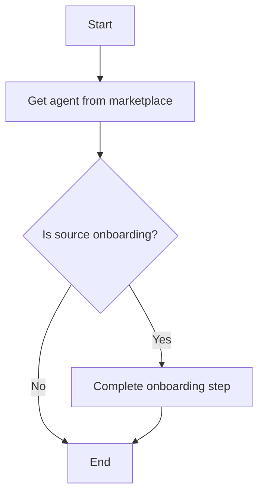

#### 带注释源码

```python
@router.post(
    "",
    summary="Add Marketplace Agent",
    status_code=status.HTTP_201_CREATED,
)
async def add_marketplace_agent_to_library(
    store_listing_version_id: str = Body(embed=True),
    source: Literal["onboarding", "marketplace"] = Body(
        default="marketplace", embed=True
    ),
    user_id: str = Security(autogpt_auth_lib.get_user_id),
) -> library_model.LibraryAgent:
    """
    Add an agent from the marketplace to the user's library.
    """
    agent = await library_db.add_store_agent_to_library(
        store_listing_version_id=store_listing_version_id,
        user_id=user_id,
    )
    if source != "onboarding":
        await complete_onboarding_step(user_id, OnboardingStep.MARKETPLACE_ADD_AGENT)
    return agent
```


### update_library_agent

Update the library agent with the given fields.

参数：

- `library_agent_id`：`str`，The ID of the library agent to update.
- `payload`：`library_model.LibraryAgentUpdateRequest`，The update request payload containing the fields to update.
- `user_id`：`str`，The ID of the user performing the update.

返回值：`library_model.LibraryAgent`，The updated library agent.

#### 流程图

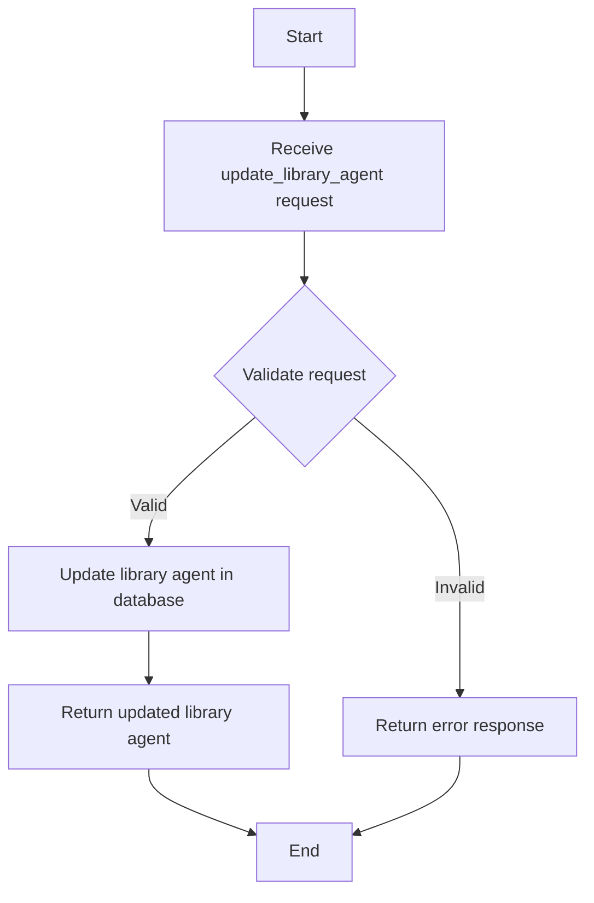

#### 带注释源码

```python
@router.patch(
    "/{library_agent_id}",
    summary="Update Library Agent",
)
async def update_library_agent(
    library_agent_id: str,
    payload: library_model.LibraryAgentUpdateRequest,
    user_id: str = Security(autogpt_auth_lib.get_user_id),
) -> library_model.LibraryAgent:
    """
    Update the library agent with the given fields.
    """
    return await library_db.update_library_agent(
        library_agent_id=library_agent_id,
        user_id=user_id,
        auto_update_version=payload.auto_update_version,
        graph_version=payload.graph_version,
        is_favorite=payload.is_favorite,
        is_archived=payload.is_archived,
        settings=payload.settings,
    )
```


### delete_library_agent

Soft-delete the specified library agent.

参数：

- `library_agent_id`：`str`，The ID of the library agent to be deleted.
- `user_id`：`str`，The ID of the user performing the deletion.

返回值：`Response`，A response with status code 204 No Content.

#### 流程图

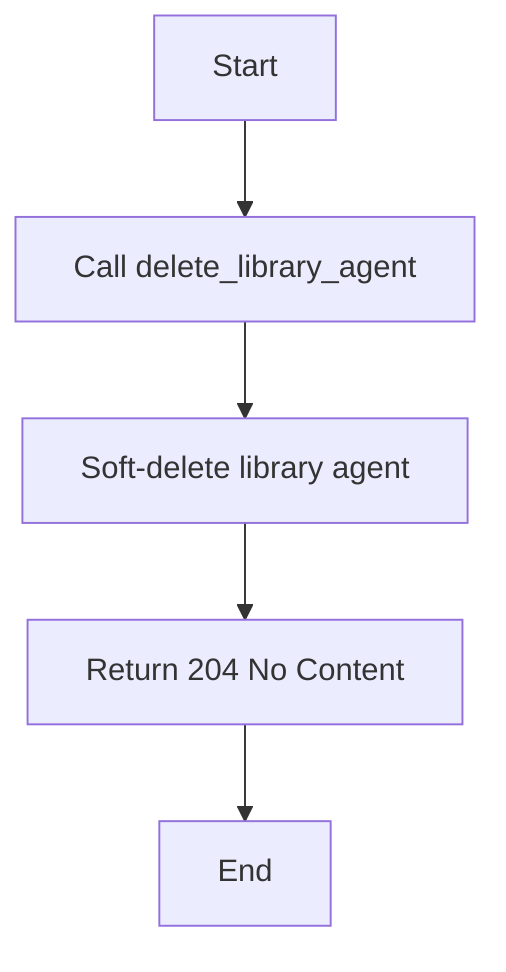

#### 带注释源码

```python
@router.delete(
    "/{library_agent_id}",
    summary="Delete Library Agent",
)
async def delete_library_agent(
    library_agent_id: str,
    user_id: str = Security(autogpt_auth_lib.get_user_id),
) -> Response:
    """
    Soft-delete the specified library agent.
    """
    await library_db.delete_library_agent(
        library_agent_id=library_agent_id, user_id=user_id
    )
    return Response(status_code=status.HTTP_204_NO_CONTENT)
```


### fork_library_agent

Fork a library agent, creating a new agent based on the specified agent.

参数：

- `library_agent_id`：`str`，The ID of the library agent to fork.
- `user_id`：`str`，The ID of the user performing the fork.

返回值：`library_model.LibraryAgent`，The new library agent created from the fork.

#### 流程图

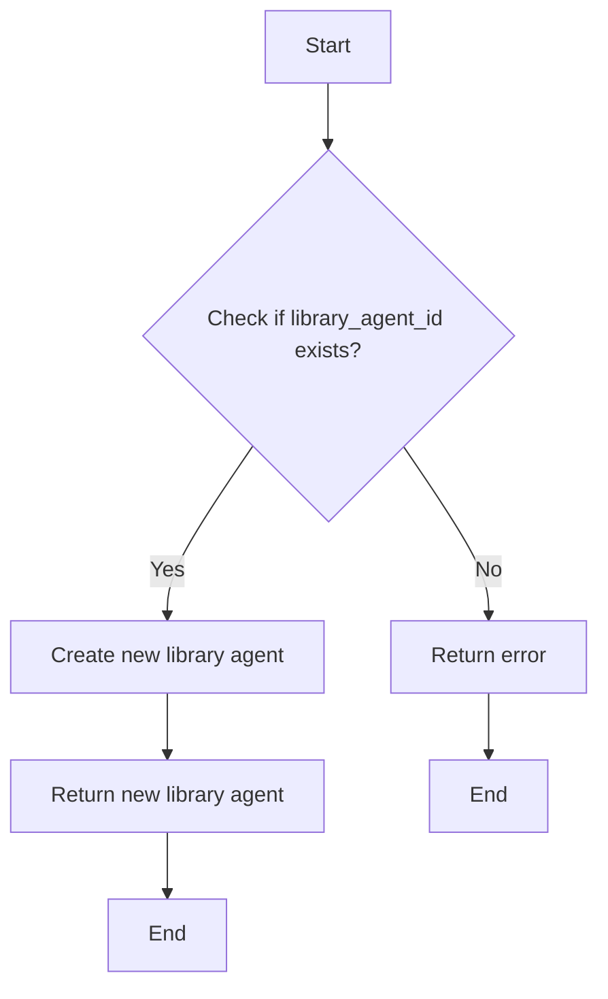

#### 带注释源码

```python
@router.post("/{library_agent_id}/fork", summary="Fork Library Agent")
async def fork_library_agent(
    library_agent_id: str,
    user_id: str = Security(autogpt_auth_lib.get_user_id),
) -> library_model.LibraryAgent:
    return await library_db.fork_library_agent(
        library_agent_id=library_agent_id,
        user_id=user_id,
    )
```


### `list_library_agents`

Get all agents in the user's library (both created and saved).

参数：

- `user_id`：`str`，The unique identifier for the user.
- `search_term`：`Optional[str]`，Search term to filter agents. Defaults to None.
- `sort_by`：`library_model.LibraryAgentSort`，Criteria to sort results by. Defaults to `library_model.LibraryAgentSort.UPDATED_AT`.
- `page`：`int`，Page number to retrieve (must be >= 1). Defaults to 1.
- `page_size`：`int`，Number of agents per page (must be >= 1). Defaults to 15.

返回值：`library_model.LibraryAgentResponse`，A response object containing the list of library agents.

#### 流程图


#### 带注释源码

```python
@router.get(
    "",
    summary="List Library Agents",
    response_model=library_model.LibraryAgentResponse,
)
async def list_library_agents(
    user_id: str = Security(autogpt_auth_lib.get_user_id),
    search_term: Optional[str] = Query(
        None, description="Search term to filter agents"
    ),
    sort_by: library_model.LibraryAgentSort = Query(
        library_model.LibraryAgentSort.UPDATED_AT,
        description="Criteria to sort results by",
    ),
    page: int = Query(
        1,
        ge=1,
        description="Page number to retrieve (must be >= 1)",
    ),
    page_size: int = Query(
        15,
        ge=1,
        description="Number of agents per page (must be >= 1)",
    ),
) -> library_model.LibraryAgentResponse:
    """
    Get all agents in the user's library (both created and saved).
    """
    return await library_db.list_library_agents(
        user_id=user_id,
        search_term=search_term,
        sort_by=sort_by,
        page=page,
        page_size=page_size,
    )
```


### `add_marketplace_agent_to_library`

Add an agent from the marketplace to the user's library.

参数：

- `store_listing_version_id`：`str`，The ID of the store listing version for the agent to be added.
- `source`：`Literal["onboarding", "marketplace"]`，The source of the agent addition, either "onboarding" or "marketplace".
- `user_id`：`str`，The ID of the user to whom the agent is being added.

返回值：`library_model.LibraryAgent`，The added library agent.

#### 流程图

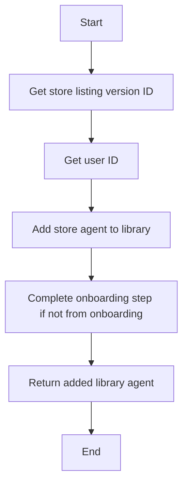

#### 带注释源码

```python
@router.post(
    "",
    summary="Add Marketplace Agent",
    status_code=status.HTTP_201_CREATED,
)
async def add_marketplace_agent_to_library(
    store_listing_version_id: str = Body(embed=True),
    source: Literal["onboarding", "marketplace"] = Body(default="marketplace", embed=True),
    user_id: str = Security(autogpt_auth_lib.get_user_id),
) -> library_model.LibraryAgent:
    """
    Add an agent from the marketplace to the user's library.
    """
    agent = await library_db.add_store_agent_to_library(
        store_listing_version_id=store_listing_version_id,
        user_id=user_id,
    )
    if source != "onboarding":
        await complete_onboarding_step(user_id, OnboardingStep.MARKETPLACE_ADD_AGENT)
    return agent
```


### `update_library_agent`

Update the library agent with the given fields.

参数：

- `library_agent_id`：`str`，The ID of the library agent to update.
- `payload`：`library_model.LibraryAgentUpdateRequest`，The update request containing the fields to update.
- `user_id`：`str`，The ID of the user performing the update.

返回值：`library_model.LibraryAgent`，The updated library agent.

#### 流程图

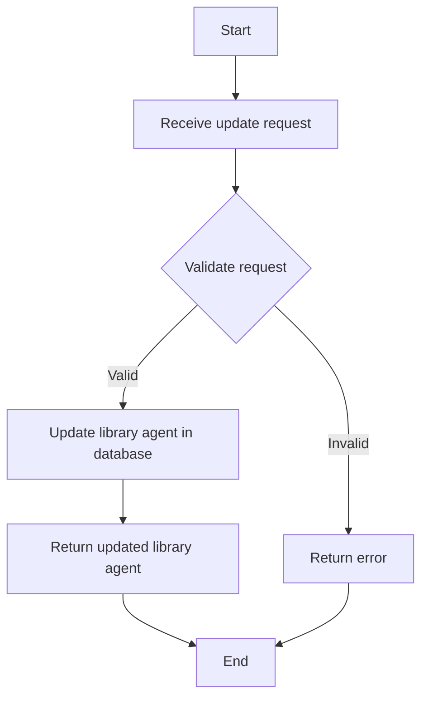

#### 带注释源码

```python
@router.patch(
    "/{library_agent_id}",
    summary="Update Library Agent",
)
async def update_library_agent(
    library_agent_id: str,
    payload: library_model.LibraryAgentUpdateRequest,
    user_id: str = Security(autogpt_auth_lib.get_user_id),
) -> library_model.LibraryAgent:
    """
    Update the library agent with the given fields.
    """
    return await library_db.update_library_agent(
        library_agent_id=library_agent_id,
        user_id=user_id,
        auto_update_version=payload.auto_update_version,
        graph_version=payload.graph_version,
        is_favorite=payload.is_favorite,
        is_archived=payload.is_archived,
        settings=payload.settings,
    )
```


### `delete_library_agent`

Soft-delete the specified library agent.

参数：

- `library_agent_id`：`str`，The ID of the library agent to be deleted.
- `user_id`：`str`，The ID of the user performing the deletion.

返回值：`Response`，A response object indicating the deletion was successful.

#### 流程图

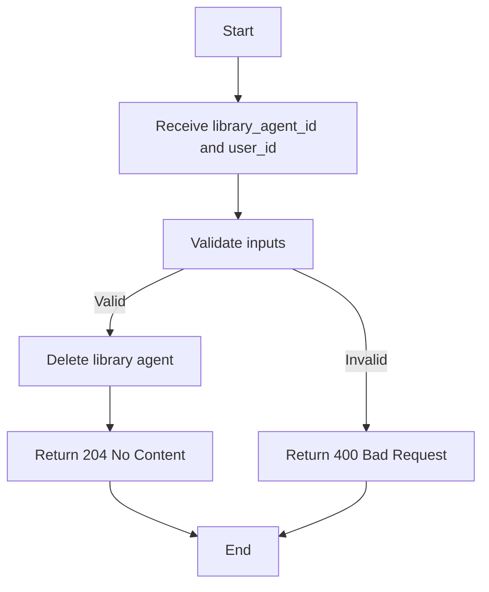

#### 带注释源码

```python
@router.delete(
    "/{library_agent_id}",
    summary="Delete Library Agent",
)
async def delete_library_agent(
    library_agent_id: str,
    user_id: str = Security(autogpt_auth_lib.get_user_id),
) -> Response:
    """
    Soft-delete the specified library agent.
    """
    await library_db.delete_library_agent(
        library_agent_id=library_agent_id, user_id=user_id
    )
    return Response(status_code=status.HTTP_204_NO_CONTENT)
```


### `list_library_agents`

Get all agents in the user's library (both created and saved).

参数：

- `user_id`：`str`，The unique identifier for the user.
- `search_term`：`Optional[str]`，Search term to filter agents.
- `sort_by`：`library_model.LibraryAgentSort`，Criteria to sort results by.
- `page`：`int`，Page number to retrieve (must be >= 1).
- `page_size`：`int`，Number of agents per page (must be >= 1).

返回值：`library_model.LibraryAgentResponse`，A response object containing the list of library agents.

#### 流程图

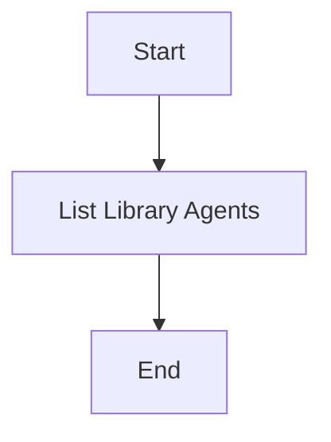

#### 带注释源码

```python
@router.get(
    "",
    summary="List Library Agents",
    response_model=library_model.LibraryAgentResponse,
)
async def list_library_agents(
    user_id: str = Security(autogpt_auth_lib.get_user_id),
    search_term: Optional[str] = Query(
        None, description="Search term to filter agents"
    ),
    sort_by: library_model.LibraryAgentSort = Query(
        library_model.LibraryAgentSort.UPDATED_AT,
        description="Criteria to sort results by",
    ),
    page: int = Query(
        1,
        ge=1,
        description="Page number to retrieve (must be >= 1)",
    ),
    page_size: int = Query(
        15,
        ge=1,
        description="Number of agents per page (must be >= 1)",
    ),
) -> library_model.LibraryAgentResponse:
    """
    Get all agents in the user's library (both created and saved).
    """
    return await library_db.list_library_agents(
        user_id=user_id,
        search_term=search_term,
        sort_by=sort_by,
        page=page,
        page_size=page_size,
    )
```


### `list_library_agents`

Get all agents in the user's library (both created and saved).

参数：

- `user_id`：`str`，The unique identifier for the user.
- `search_term`：`Optional[str]`，Search term to filter agents.
- `sort_by`：`library_model.LibraryAgentSort`，Criteria to sort results by.
- `page`：`int`，Page number to retrieve (must be >= 1).
- `page_size`：`int`，Number of agents per page (must be >= 1).

返回值：`library_model.LibraryAgentResponse`，A response containing the list of library agents.

#### 流程图


#### 带注释源码

```python
@router.get(
    "",
    summary="List Library Agents",
    response_model=library_model.LibraryAgentResponse,
)
async def list_library_agents(
    user_id: str = Security(autogpt_auth_lib.get_user_id),
    search_term: Optional[str] = Query(
        None, description="Search term to filter agents"
    ),
    sort_by: library_model.LibraryAgentSort = Query(
        library_model.LibraryAgentSort.UPDATED_AT,
        description="Criteria to sort results by",
    ),
    page: int = Query(
        1,
        ge=1,
        description="Page number to retrieve (must be >= 1)",
    ),
    page_size: int = Query(
        15,
        ge=1,
        description="Number of agents per page (must be >= 1)",
    ),
) -> library_model.LibraryAgentResponse:
    """
    Get all agents in the user's library (both created and saved).
    """
    return await library_db.list_library_agents(
        user_id=user_id,
        search_term=search_term,
        sort_by=sort_by,
        page=page,
        page_size=page_size,
    )
```


### `update_library_agent`

Update the library agent with the given fields.

参数：

- `library_agent_id`：`str`，The ID of the library agent to update.
- `payload`：`library_model.LibraryAgentUpdateRequest`，The request payload containing the fields to update.
- `user_id`：`str`，The ID of the user performing the update.

返回值：`library_model.LibraryAgent`，The updated library agent.

#### 流程图


#### 带注释源码

```python
@router.patch(
    "/{library_agent_id}",
    summary="Update Library Agent",
)
async def update_library_agent(
    library_agent_id: str,
    payload: library_model.LibraryAgentUpdateRequest,
    user_id: str = Security(autogpt_auth_lib.get_user_id),
) -> library_model.LibraryAgent:
    """
    Update the library agent with the given fields.
    """
    return await library_db.update_library_agent(
        library_agent_id=library_agent_id,
        user_id=user_id,
        auto_update_version=payload.auto_update_version,
        graph_version=payload.graph_version,
        is_favorite=payload.is_favorite,
        is_archived=payload.is_archived,
        settings=payload.settings,
    )
```


## 关键组件


### 张量索引与惰性加载

张量索引与惰性加载是用于高效处理大规模数据集的关键组件，通过延迟计算和索引优化，减少内存消耗和提高处理速度。

### 反量化支持

反量化支持是针对量化模型进行优化，通过反向量化技术，提高模型的准确性和效率。

### 量化策略

量化策略是用于模型压缩和加速的关键组件，通过将浮点数转换为低精度数值，减少模型大小和计算量。


## 问题及建议


### 已知问题

-   **依赖注入不足**：代码中使用了大量的全局变量和函数，如`router`、`library_db`和`library_model`，这可能导致代码难以测试和维护。
-   **错误处理**：虽然使用了`HTTPException`来处理404错误，但代码中缺少对其他潜在错误的处理，如数据库查询失败或参数验证错误。
-   **代码重复**：在多个路由处理函数中，存在对`Security(autogpt_auth_lib.get_user_id)`的重复调用，这可能导致代码冗余。
-   **文档不足**：代码注释较少，对于一些关键操作和函数的描述不够详细，这可能会影响其他开发者对代码的理解。

### 优化建议

-   **使用依赖注入**：将全局变量和函数替换为依赖注入，以提高代码的可测试性和可维护性。
-   **增强错误处理**：添加更多的错误处理逻辑，以处理各种潜在的错误情况，并返回适当的错误信息。
-   **减少代码重复**：通过提取公共逻辑到单独的函数或类中，减少代码重复。
-   **增加文档注释**：为关键操作和函数添加详细的注释，以提高代码的可读性和可维护性。
-   **性能优化**：考虑对数据库查询进行优化，例如使用索引或缓存结果，以提高性能。
-   **安全性考虑**：确保所有用户输入都经过适当的验证和清理，以防止SQL注入等安全漏洞。


## 其它


### 设计目标与约束

- 设计目标：
  - 提供一个RESTful API来管理图书馆代理。
  - 支持用户对代理进行搜索、排序、分页、添加、更新、删除和分支操作。
  - 确保API的安全性，通过用户身份验证来保护敏感操作。
- 约束：
  - API必须遵循RESTful设计原则。
  - 使用FastAPI框架进行开发，以提供高性能和易于维护的API。
  - 与数据库交互时，确保数据的一致性和完整性。

### 错误处理与异常设计

- 错误处理：
  - 使用HTTP状态码来表示不同的错误情况。
  - 对于数据库查询错误，返回404状态码和相应的错误信息。
  - 对于权限不足的操作，返回403状态码。
- 异常设计：
  - 使用FastAPI的异常处理机制来捕获和处理异常。
  - 定义自定义异常类，以便于更好地管理错误。

### 数据流与状态机

- 数据流：
  - 用户请求API，API处理请求并从数据库获取或更新数据。
  - 数据库操作完成后，API返回相应的响应。
- 状态机：
  - 代理的状态可能包括创建、更新、删除和分支。
  - 状态机用于跟踪和管理代理的生命周期。

### 外部依赖与接口契约

- 外部依赖：
  - FastAPI框架
  - Prisma ORM
  - autogpt_libs库
- 接口契约：
  - API接口定义了请求和响应的数据结构。
  - 使用Pydantic模型来验证和序列化请求和响应数据。
  - 使用OpenAPI规范来描述API的接口契约。


    