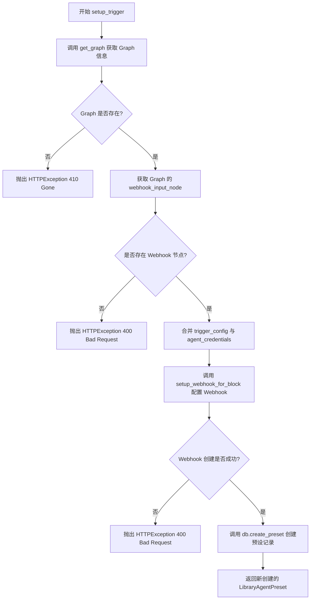

# `AutoGPT\autogpt_platform\backend\backend\api\features\library\routes\presets.py` 详细设计文档

该文件定义了一个用于管理 Agent 预设的 FastAPI 路由模块，提供了预设的创建、查询、更新、删除（CRUD）操作，支持基于 Webhook 的触发器配置以及预设图的执行功能，并与数据库、凭证管理器和集成服务进行交互。

## 整体流程

```mermaid
graph TD
    A[HTTP Request] --> B{Route Match}
    B -->|GET /presets| C[list_presets]
    B -->|GET /presets/{preset_id}| D[get_preset]
    B -->|POST /presets| E[create_preset]
    B -->|POST /presets/setup-trigger| F[setup_trigger]
    B -->|PATCH /presets/{preset_id}| G[update_preset]
    B -->|DELETE /presets/{preset_id}| H[delete_preset]
    B -->|POST /presets/{preset_id}/execute| I[execute_preset]

    subgraph Database & External Services
    DB[(Database)]
    WM[(Webhook Manager)]
    CM[(Credentials Manager)]
    END

    C --> DB
    D --> DB
    E --> DB
    F --> DB
    F --> WM
    F --> CM
    G --> DB
    G --> WM
    H --> DB
    H --> WM
    H --> CM
    I --> DB

    DB --> J[HTTP Response]
    WM --> J
    CM --> J
```

## 类结构

```
PresetRouter (APIRouter)
├── list_presets (Function)
├── get_preset (Function)
├── create_preset (Function)
├── setup_trigger (Function)
├── update_preset (Function)
├── delete_preset (Function)
└── execute_preset (Function)
```

## 全局变量及字段


### `logger`
    
模块级别的日志记录器，用于记录运行时的信息和错误。

类型：`logging.Logger`
    


### `credentials_manager`
    
集成凭证管理器实例，用于处理用户凭证的获取与管理。

类型：`IntegrationCredentialsManager`
    


### `router`
    
FastAPI 路由器实例，用于定义预设相关的 API 端点。

类型：`APIRouter`
    


    

## 全局函数及方法


### `list_presets`

该接口用于检索当前经过身份验证用户的预设列表，支持分页查询，并可以根据特定的 Agent Graph ID 进行筛选。

参数：

-  `user_id`：`str`，经过身份验证的用户 ID，由安全依赖项自动提取。
-  `page`：`int`，分页页码，默认为 1，必须大于等于 1。
-  `page_size`：`int`，每页显示的项目数量，默认为 10，必须大于等于 1。
-  `graph_id`：`Optional[str]`，可选参数，用于筛选属于特定 Agent Graph 的预设。

返回值：`models.LibraryAgentPresetResponse`，包含预设列表及分页信息的响应对象。

#### 流程图


#### 带注释源码

```python
@router.get(
    "/presets",
    summary="List presets",
    description="Retrieve a paginated list of presets for the current user.",
)
async def list_presets(
    # 从安全上下文中获取用户 ID
    user_id: str = Security(autogpt_auth_lib.get_user_id),
    # 获取分页页码，默认第1页，最小值为1
    page: int = Query(default=1, ge=1),
    # 获取每页大小，默认10条，最小值为1
    page_size: int = Query(default=10, ge=1),
    # 获取筛选用的 graph_id，可选参数
    graph_id: Optional[str] = Query(
        description="Allows to filter presets by a specific agent graph"
    ),
) -> models.LibraryAgentPresetResponse:
    """
    Retrieve a paginated list of presets for the current user.

    Args:
        user_id (str): ID of the authenticated user.
        page (int): Page number for pagination.
        page_size (int): Number of items per page.
        graph_id: Allows to filter presets by a specific agent graph.

    Returns:
        models.LibraryAgentPresetResponse: A response containing the list of presets.
    """
    try:
        # 调用数据库层方法查询预设列表
        return await db.list_presets(
            user_id=user_id,
            graph_id=graph_id,
            page=page,
            page_size=page_size,
        )
    except Exception as e:
        # 捕获异常并记录详细日志
        logger.exception("Failed to list presets for user %s: %s", user_id, e)
        # 向客户端返回 500 内部服务器错误
        raise HTTPException(
            status_code=status.HTTP_500_INTERNAL_SERVER_ERROR, detail=str(e)
        )
```


### `get_preset`

通过其 ID 为当前认证用户检索特定的预设详情。

参数：

-  `preset_id`：`str`，要检索的预设 ID。
-  `user_id`：`str`，认证用户的 ID。

返回值：`models.LibraryAgentPreset`，包含预设详细信息的对象。

#### 流程图


#### 带注释源码

```python
async def get_preset(
    preset_id: str,
    user_id: str = Security(autogpt_auth_lib.get_user_id),
) -> models.LibraryAgentPreset:
    """
    Retrieve details for a specific preset by its ID.

    Args:
        preset_id (str): ID of the preset to retrieve.
        user_id (str): ID of the authenticated user.

    Returns:
        models.LibraryAgentPreset: The preset details.

    Raises:
        HTTPException: If the preset is not found or an error occurs.
    """
    try:
        # 尝试从数据库中获取指定用户和ID的预设数据
        preset = await db.get_preset(user_id, preset_id)
    except Exception as e:
        # 如果在数据库查询过程中发生异常，记录错误信息
        logger.exception(
            "Error retrieving preset %s for user %s: %s", preset_id, user_id, e
        )
        # 抛出 HTTP 500 内部服务器错误，并附带异常详情
        raise HTTPException(
            status_code=status.HTTP_500_INTERNAL_SERVER_ERROR, detail=str(e)
        )

    # 检查获取到的预设对象是否存在
    if not preset:
        # 如果预设不存在，抛出 HTTP 404 未找到错误
        raise HTTPException(
            status_code=status.HTTP_404_NOT_FOUND,
            detail=f"Preset #{preset_id} not found",
        )
    # 返回找到的预设对象
    return preset
```


### `create_preset`

创建一个新的库代理预设。如果需要，会自动更正节点输入格式。

参数：

-  `preset`：`models.LibraryAgentPresetCreatable | models.LibraryAgentPresetCreatableFromGraphExecution`，要创建的预设数据。
-  `user_id`：`str`，经过身份验证的用户 ID。

返回值：`models.LibraryAgentPreset`，创建好的预设。

#### 流程图


#### 带注释源码

```python
@router.post(
    "/presets",
    summary="Create a new preset",
    description="Create a new preset for the current user.",
)
async def create_preset(
    preset: (
        models.LibraryAgentPresetCreatable
        | models.LibraryAgentPresetCreatableFromGraphExecution
    ),
    user_id: str = Security(autogpt_auth_lib.get_user_id),
) -> models.LibraryAgentPreset:
    """
    Create a new library agent preset. Automatically corrects node_input format if needed.

    Args:
        preset (models.LibraryAgentPresetCreatable): The preset data to create.
        user_id (str): ID of the authenticated user.

    Returns:
        models.LibraryAgentPreset: The created preset.

    Raises:
        HTTPException: If an error occurs while creating the preset.
    """
    try:
        # 根据传入的预设类型判断是直接创建还是从执行记录创建
        if isinstance(preset, models.LibraryAgentPresetCreatable):
            # 直接调用数据库方法创建标准预设
            return await db.create_preset(user_id, preset)
        else:
            # 从图执行记录中生成预设
            return await db.create_preset_from_graph_execution(user_id, preset)
    except NotFoundError as e:
        # 处理资源未找到的情况（例如关联的图不存在）
        raise HTTPException(status_code=status.HTTP_404_NOT_FOUND, detail=str(e))
    except Exception as e:
        # 处理其他未知异常，记录日志并返回服务器错误
        logger.exception("Preset creation failed for user %s: %s", user_id, e)
        raise HTTPException(
            status_code=status.HTTP_500_INTERNAL_SERVER_ERROR, detail=str(e)
        )
```


### `setup_trigger`

Sets up a webhook-triggered `LibraryAgentPreset` for a `LibraryAgent`. Returns the correspondingly created `LibraryAgentPreset` with `webhook_id` set.

参数：

-  `params`：`models.TriggeredPresetSetupRequest`，包含设置触发预设所需的参数，如图ID、版本、名称、描述、触发配置及代理凭证。
-  `user_id`：`str`，当前通过认证的用户ID。

返回值：`models.LibraryAgentPreset`，创建完成的预设对象，其中包含已生成的 `webhook_id`。

#### 流程图



#### 带注释源码

```python
@router.post("/presets/setup-trigger")
async def setup_trigger(
    params: models.TriggeredPresetSetupRequest = Body(),
    user_id: str = Security(autogpt_auth_lib.get_user_id),
) -> models.LibraryAgentPreset:
    """
    Sets up a webhook-triggered `LibraryAgentPreset` for a `LibraryAgent`.
    Returns the correspondingly created `LibraryAgentPreset` with `webhook_id` set.
    """
    # 1. 根据 graph_id 和 version 获取对应的图数据，并验证用户权限
    graph = await get_graph(
        params.graph_id, version=params.graph_version, user_id=user_id
    )
    if not graph:
        # 如果图不存在或无法访问，抛出 410 Gone 异常
        raise HTTPException(
            status.HTTP_410_GONE,
            f"Graph #{params.graph_id} not accessible (anymore)",
        )
    
    # 2. 检查图中是否定义了 Webhook 输入节点，这是触发预设的必要条件
    if not (trigger_node := graph.webhook_input_node):
        raise HTTPException(
            status_code=status.HTTP_400_BAD_REQUEST,
            detail=f"Graph #{params.graph_id} does not have a webhook node",
        )

    # 3. 准备触发配置，将用户提供的触发配置与通过凭据映射生成的节点输入合并
    trigger_config_with_credentials = {
        **params.trigger_config,
        **(
            make_node_credentials_input_map(graph, params.agent_credentials).get(
                trigger_node.id
            )
            or {}
        ),
    }

    # 4. 为特定的触发块设置 Webhook，获取返回的 webhook 对象和反馈信息
    new_webhook, feedback = await setup_webhook_for_block(
        user_id=user_id,
        trigger_block=trigger_node.block,
        trigger_config=trigger_config_with_credentials,
    )
    if not new_webhook:
        # 如果 Webhook 设置失败，抛出 400 错误并附带反馈信息
        raise HTTPException(
            status_code=status.HTTP_400_BAD_REQUEST,
            detail=f"Could not set up webhook: {feedback}",
        )

    # 5. 在数据库中创建新的预设，关联生成的 webhook_id 并标记为激活状态
    new_preset = await db.create_preset(
        user_id=user_id,
        preset=models.LibraryAgentPresetCreatable(
            graph_id=params.graph_id,
            graph_version=params.graph_version,
            name=params.name,
            description=params.description,
            inputs=trigger_config_with_credentials,
            credentials=params.agent_credentials,
            webhook_id=new_webhook.id,
            is_active=True,
        ),
    )
    return new_preset
```


### `update_preset`

更新现有的库代理预设，处理Webhook触发器的配置更新、数据库记录同步以及旧Webhook资源的清理工作。

参数：

-  `preset_id`：`str`，要更新的预设的唯一标识符。
-  `preset`：`models.LibraryAgentPresetUpdatable`，包含更新数据的请求体对象，如输入参数、凭据、名称、描述等。
-  `user_id`：`str`，当前认证用户的ID，由安全依赖注入。

返回值：`models.LibraryAgentPreset`，更新后的预设对象。

#### 流程图


#### 带注释源码

```python
@router.patch(
    "/presets/{preset_id}",
    summary="Update an existing preset",
    description="Update an existing preset by its ID.",
)
async def update_preset(
    preset_id: str,
    preset: models.LibraryAgentPresetUpdatable,
    user_id: str = Security(autogpt_auth_lib.get_user_id),
) -> models.LibraryAgentPreset:
    """
    Update an existing library agent preset.

    Args:
        preset_id (str): ID of the preset to update.
        preset (models.LibraryAgentPresetUpdatable): The preset data to update.
        user_id (str): ID of the authenticated user.

    Returns:
        models.LibraryAgentPreset: The updated preset.

    Raises:
        HTTPException: If an error occurs while updating the preset.
    """
    # 1. 获取当前预设信息以验证存在性及获取当前状态（如 graph_id）
    current = await get_preset(preset_id, user_id=user_id)
    if not current:
        raise HTTPException(status.HTTP_404_NOT_FOUND, f"Preset #{preset_id} not found")

    # 2. 获取预设关联的图定义，确保图仍然存在且可访问
    graph = await get_graph(
        current.graph_id,
        current.graph_version,
        user_id=user_id,
    )
    if not graph:
        raise HTTPException(
            status.HTTP_410_GONE,
            f"Graph #{current.graph_id} not accessible (anymore)",
        )

    # 3. 初始化 Webhook 更新相关变量
    trigger_inputs_updated, new_webhook, feedback = False, None, None
    
    # 4. 检查是否需要更新 Webhook 配置
    # 条件：图中包含 Webhook 输入节点，且请求中包含新的 inputs 和 credentials
    if (trigger_node := graph.webhook_input_node) and (
        preset.inputs is not None and preset.credentials is not None
    ):
        # 合并用户提供的输入和凭据映射
        trigger_config_with_credentials = {
            **preset.inputs,
            **(
                make_node_credentials_input_map(graph, preset.credentials).get(
                    trigger_node.id
                )
                or {}
            ),
        }
        # 尝试为该触发块设置或更新 Webhook
        new_webhook, feedback = await setup_webhook_for_block(
            user_id=user_id,
            trigger_block=graph.webhook_input_node.block,
            trigger_config=trigger_config_with_credentials,
            for_preset_id=preset_id,
        )
        trigger_inputs_updated = True
        
        # 如果 Webhook 设置失败，抛出异常
        if not new_webhook:
            raise HTTPException(
                status_code=status.HTTP_400_BAD_REQUEST,
                detail=f"Could not update trigger configuration: {feedback}",
            )

    try:
        # 5. 在数据库中更新预设的基本信息（inputs, credentials, name 等）
        updated = await db.update_preset(
            user_id=user_id,
            preset_id=preset_id,
            inputs=preset.inputs,
            credentials=preset.credentials,
            name=preset.name,
            description=preset.description,
            is_active=preset.is_active,
        )
    except Exception as e:
        logger.exception("Preset update failed for user %s: %s", user_id, e)
        raise HTTPException(
            status_code=status.HTTP_500_INTERNAL_SERVER_ERROR, detail=str(e)
        )

    # 6. 如果 Webhook 配置发生了变化，更新数据库中的 webhook_id 关联
    if trigger_inputs_updated:
        updated = await db.set_preset_webhook(
            user_id, preset_id, new_webhook.id if new_webhook else None
        )

        # 7. 清理旧的 Webhook 资源
        # 如果当前预设原本有 webhook_id，且该 ID 与新生成的不同（或被移除），则需清理旧资源
        if current.webhook_id and (
            current.webhook_id != (new_webhook.id if new_webhook else None)
        ):
            current_webhook = await get_webhook(current.webhook_id)
            credentials = (
                await credentials_manager.get(user_id, current_webhook.credentials_id)
                if current_webhook.credentials_id
                else None
            )
            # 调用 Webhook 管理器清理不再使用的 Webhook
            await get_webhook_manager(
                current_webhook.provider
            ).prune_webhook_if_dangling(user_id, current_webhook.id, credentials)

    return updated
```


### `delete_preset`

通过其 ID 删除指定的预设。如果该预设关联了 Webhook，函数会先解除关联并清理不再使用的 Webhook 资源。删除成功后返回 HTTP 204 No Content。

参数：

-  `preset_id`：`str`，要删除的预设 ID。
-  `user_id`：`str`，经过身份验证的当前用户 ID。

返回值：`None`，表示删除成功（对应 HTTP 204 状态码）。

#### 流程图


#### 带注释源码

```python
    """
    Delete a preset by its ID. Returns 204 No Content on success.

    Args:
        preset_id (str): ID of the preset to delete.
        user_id (str): ID of the authenticated user.

    Raises:
        HTTPException: If an error occurs while deleting the preset.
    """
    # 1. 验证预设是否存在
    preset = await db.get_preset(user_id, preset_id)
    if not preset:
        raise HTTPException(
            status_code=status.HTTP_404_NOT_FOUND,
            detail=f"Preset #{preset_id} not found for user #{user_id}",
        )

    # 2. 如果预设关联了 Webhook，先处理 Webhook 的清理工作
    if preset.webhook_id:
        webhook = await get_webhook(preset.webhook_id)
        
        # 在数据库中将预设的 webhook_id 置为 None，解除关联
        await db.set_preset_webhook(user_id, preset_id, None)

        # 清理 Webhook 资源：如果该 Webhook 不再被其他引用使用，则将其删除
        credentials = (
            await credentials_manager.get(user_id, webhook.credentials_id)
            if webhook.credentials_id
            else None
        )
        await get_webhook_manager(webhook.provider).prune_webhook_if_dangling(
            user_id, webhook.id, credentials
        )

    # 3. 执行数据库层面的预设删除操作
    try:
        await db.delete_preset(user_id, preset_id)
    except Exception as e:
        logger.exception(
            "Error deleting preset %s for user %s: %s", preset_id, user_id, e
        )
        raise HTTPException(
            status_code=status.HTTP_500_INTERNAL_SERVER_ERROR,
            detail=str(e),
        )
```


### `execute_preset`

Execute a preset with the given graph and node input for the current user.

参数：

-  `preset_id`：`str`，ID of the preset to execute.
-  `user_id`：`str`，ID of the authenticated user.
-  `inputs`：`dict[str, Any]`，Optionally, inputs to override the preset for execution.
-  `credential_inputs`：`dict[str, CredentialsMetaInput]`，Optionally, credentials to override the preset for execution.

返回值：`GraphExecutionMeta`，Object representing the created execution.

#### 流程图


#### 带注释源码

```python
async def execute_preset(
    preset_id: str,
    user_id: str = Security(autogpt_auth_lib.get_user_id),
    inputs: dict[str, Any] = Body(..., embed=True, default_factory=dict),
    credential_inputs: dict[str, CredentialsMetaInput] = Body(
        ..., embed=True, default_factory=dict
    ),
) -> GraphExecutionMeta:
    """
    Execute a preset given graph parameters, returning the execution ID on success.

    Args:
        preset_id: ID of the preset to execute.
        user_id: ID of the authenticated user.
        inputs: Optionally, inputs to override the preset for execution.
        credential_inputs: Optionally, credentials to override the preset for execution.

    Returns:
        GraphExecutionMeta: Object representing the created execution.

    Raises:
        HTTPException: If the preset is not found or an error occurs while executing the preset.
    """
    # 获取预设信息，如果不存在则抛出404异常
    preset = await db.get_preset(user_id, preset_id)
    if not preset:
        raise HTTPException(
            status_code=status.HTTP_404_NOT_FOUND,
            detail=f"Preset #{preset_id} not found",
        )

    # 合并输入：用户提供的输入将覆盖预设中定义的输入
    merged_node_input = preset.inputs | inputs
    # 合并凭证：用户提供的凭证将覆盖预设中定义的凭证
    merged_credential_inputs = preset.credentials | credential_inputs

    # 调用执行工具添加并执行图执行任务
    return await add_graph_execution(
        user_id=user_id,
        graph_id=preset.graph_id,
        graph_version=preset.graph_version,
        preset_id=preset_id,
        inputs=merged_node_input,
        graph_credentials_inputs=merged_credential_inputs,
    )
```


## 关键组件


### APIRouter (`router`)

定义了用于预设管理（列表、获取、创建、更新、删除）和执行操作的 HTTP 端点集合。

### IntegrationCredentialsManager (`credentials_manager`)

负责处理集成（如 Webhook）凭证的存储、检索和管理的核心组件。

### Database Service (`db`)

处理预设元数据、配置及其生命周期的持久化存储、检索、更新和删除的抽象层。

### Webhook Manager (`get_webhook_manager`)

根据提供者管理 Webhook 生命周期，包括创建、更新以及在不再被引用时清理悬空 Webhook 的组件。

### Graph Execution Service (`add_graph_execution`)

负责编排和执行与特定预设关联的图逻辑，处理输入合并和凭证映射。

### Graph Repository (`get_graph`)

根据 ID 和版本检索代理图定义、节点结构及相关元数据的接口。

### Setup Webhook Utility (`setup_webhook_for_block`)

为特定块配置 Webhook 触发器的辅助函数，处理提供者特定的设置逻辑和验证。


## 问题及建议


### 已知问题

-   **资源清理与事务一致性问题**：在 `setup_trigger` 和 `delete_preset` 等函数中，外部资源（Webhook）的创建/删除与数据库操作（Preset 的创建/删除）不是原子性的。例如，若 Webhook 创建成功但数据库写入失败，会导致系统中残留孤立的 Webhook 资源；若删除预设时数据库删除失败但 Webhook 已被清理，会导致数据状态不一致。
-   **更新逻辑的复杂性与错误风险**：`update_preset` 函数包含过长的逻辑链，涉及获取图、设置新 Webhook、更新数据库元数据、更新数据库 Webhook 引用以及清理旧 Webhook。如果在数据库更新元数据之后，更新 Webhook 引用或清理旧 Webhook 的过程中发生异常，预设数据可能会处于中间状态，导致数据损坏。
-   **全局状态管理**：`credentials_manager` 作为全局变量实例化。这种模式在并发环境下可能导致状态管理混乱，且不利于单元测试时的 Mock 和隔离。
-   **异常处理过于宽泛**：多个端点使用了 `try...except Exception as e` 的通用捕获方式，直接返回 500 错误。这会掩盖具体的业务逻辑错误或数据库连接错误，使得难以定位具体问题根源。

### 优化建议

-   **引入服务层**：将数据库交互、Webhook 管理和凭证处理等业务逻辑从路由处理器中剥离，移动到独立的 `PresetService` 类中。路由层仅负责参数解析和响应封装，以提高代码的可维护性和可测试性。
-   **封装通用的 Webhook 清理逻辑**：在 `update_preset` 和 `delete_preset` 中重复出现的获取 Webhook、获取凭证及清理孤立 Webhook 的逻辑应提取为私有的辅助函数或服务方法，遵循 DRY（Don't Repeat Yourself）原则。
-   **实现补偿事务机制**：对于涉及外部资源调用的操作（如创建 Webhook），应设计补偿逻辑。例如，在 `setup_trigger` 中，如果后续数据库操作失败，应显式调用删除操作回滚已创建的 Webhook。
-   **使用依赖注入**：利用 FastAPI 的 `Depends` 机制注入 `IntegrationCredentialsManager` 和数据库会话，而不是依赖全局变量。这将明确声明组件的依赖关系，并提升模块的解耦程度。
-   **增强输入验证与合并策略**：在 `execute_preset` 中使用字典合并 `preset.inputs | inputs` 虽然简便，但建议增加逻辑验证覆盖的参数是否符合预期，防止意外的参数注入或类型错误。


## 其它


### 设计目标与约束

**设计目标：**
1.  **API 标准化与易用性**：构建符合 RESTful 风格的 API 接口，提供对预设的完整生命周期管理（创建、读取、更新、删除、执行），支持分页查询和特定字段过滤。
2.  **集成能力**：实现预设与 Agent Graph 的深度集成，支持基于 Webhook 的触发机制，允许外部系统通过 HTTP 回调激活预设执行。
3.  **安全性与隔离**：确保所有操作必须在通过身份验证的用户上下文中执行，严格隔离不同用户的数据和资源。

**约束：**
1.  **认证强制**：所有路由端点均依赖 `autogpt_auth_lib.requires_user` 进行权限校验，未认证请求无法通过。
2.  **原子性与一致性**：在创建或更新包含 Webhook 的预设时，需协调数据库记录与远程 Webhook 资源的状态；若 Webhook 设置失败，预设不应处于无效状态。
3.  **异步处理**：所有 I/O 操作（数据库访问、外部 Webhook 调用）均基于 Python `async/await` 异步模型，以防止阻塞主线程。
4.  **数据模型兼容**：输入输出必须严格遵循 `models` 模块中定义的 Pydantic 模型，确保数据结构的强类型校验。

### 错误处理与异常设计

**设计策略：**
采用分层异常捕获机制，将底层业务逻辑异常转换为标准的 HTTP 响应状态码，并统一记录日志以便追踪。

**具体规则：**
1.  **资源不存在 (404)**：当请求的预设、关联的 Graph 或 Webhook 在数据库中未找到时，抛出 `HTTPException(status_code=404)`。
2.  **无效请求 (400)**：当客户端提供的参数不合法（如 Graph 缺少 Webhook 节点）或 Webhook 配置失败时，抛出 `HTTPException(status_code=400)`。
3.  **服务器内部错误 (500)**：捕获未预期的异常（如数据库连接失败、通用异常），记录详细的堆栈信息，并返回 `HTTPException(status_code=500)`，避免向客户端暴露敏感的服务器内部细节。
4.  **资源不可用 (410)**：当预设关联的 Graph 存在但已不可访问（如被删除）时，返回 `HTTPException(status_code=410)`。
5.  **日志规范**：所有异常捕获点均使用 `logger.exception` 记录错误上下文（如 `user_id`, `preset_id`）。

### 数据流与状态机

**数据流：**
1.  **请求阶段**：客户端发送 HTTP 请求 -> FastAPI 路由接收 -> Pydantic 模型校验请求数据。
2.  **鉴权阶段**：`autogpt_auth_lib` 依赖注入提取并验证 `user_id`。
3.  **业务逻辑阶段**：
    *   **查询流**：Controller -> DB Layer (`db.get_preset` 等) -> 返回数据。
    *   **Webhook 设置流**：Controller -> 获取 Graph 信息 -> 构建 Credentials Map -> 调用 Webhook Manager 设置远程 Webhook -> 获取 Webhook ID -> 写入 DB。
    *   **执行流**：Controller -> 获取 Preset -> 合并输入参数 -> 调用 `add_graph_execution` -> 返回执行元数据。
4.  **响应阶段**：将处理结果序列化为 JSON 返回给客户端。

**状态机（Preset 生命周期）：**
1.  **Initialized (初始化)**：接收创建预设请求，校验 Graph 和 Trigger 节点是否存在。
2.  **Webhook Provisioning (Webhook 配置中)**：调用第三方服务注册 Webhook，获取 ID。
3.  **Active (激活)**：预设记录成功写入数据库，关联 `webhook_id`，状态 `is_active=True`，可被触发执行。
4.  **Updating (更新中)**：接收更新请求，如果涉及 Trigger 配置，重新配置 Webhook（可能产生新的 Webhook ID）。
5.  **Cleaning (清理中)**：执行删除操作时，先解绑并清理远程 Webhook 资源。
6.  **Terminated (终止)**：数据库记录被删除，流程结束。

### 外部依赖与接口契约

**1. 身份认证库 (`autogpt_libs.auth`)**
*   **契约**：提供 `requires_user` 依赖项用于路由保护，提供 `get_user_id` 函数从请求上下文中提取当前认证用户的唯一标识符字符串。

**2. 数据访问层 (`backend.data.*` & `..db`)**
*   **`backend.data.graph`**：提供 `get_graph` 函数，契约为输入 `graph_id`, `version`, `user_id` 返回 Graph 对象或 None。
*   **`backend.data.integrations`**：提供 `get_webhook` 函数，契约为输入 `webhook_id` 返回 Webhook 配置对象。
*   **`..db`**：封装所有 Preset 的 CRUD 操作（`list_presets`, `create_preset`, `delete_preset` 等），契约为异步函数调用，操作失败时抛出异常。

**3. 集成管理器 (`backend.integrations.*`)**
*   **`webhooks.utils`**：提供 `setup_webhook_for_block`，契约为输入用户、触发块及配置，返回元组。
*   **`creds_manager`**：提供 `IntegrationCredentialsManager`，契约为能够根据 `user_id` 和 `credentials_id` 获取解密后的凭证凭据。
*   **`webhooks`**：提供 `get_webhook_manager(provider)`，契约为返回特定提供商的 Webhook 管理器实例，用于执行 `prune_webhook_if_dangling` 等清理操作。

**4. Web 框架 (`fastapi`)**
*   **契约**：使用 `APIRouter` 进行路由注册，使用 `Security`, `Query`, `Body` 等进行依赖注入和参数解析。

**5. 执行器 (`backend.executor.utils`)**
*   **契约**：`make_node_credentials_input_map` 用于构建凭证映射；`add_graph_execution` 用于提交图执行任务并返回执行元数据。

    