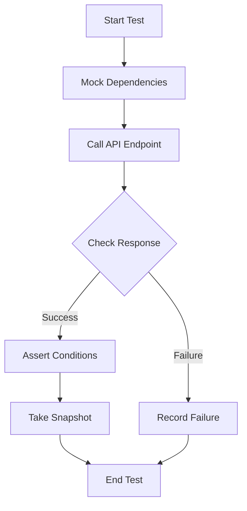
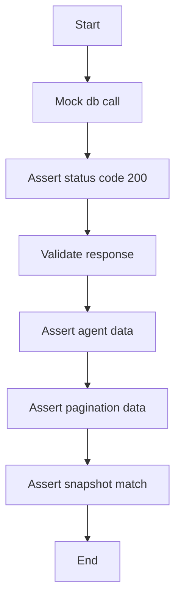
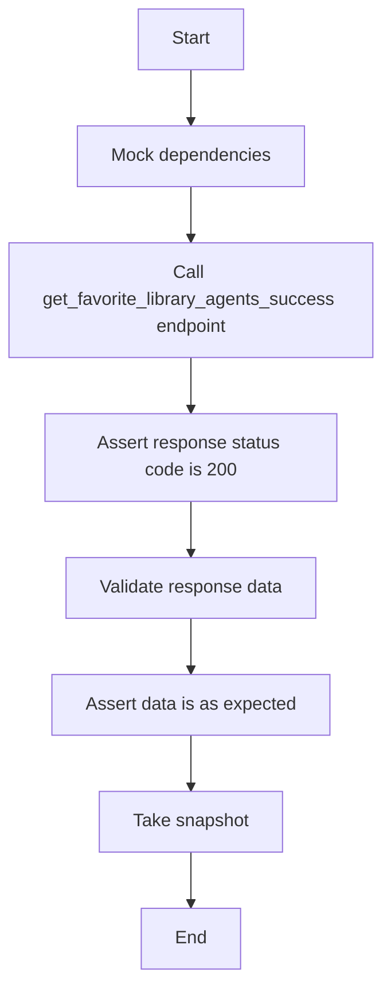
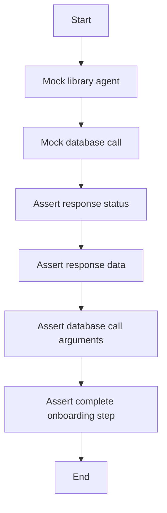
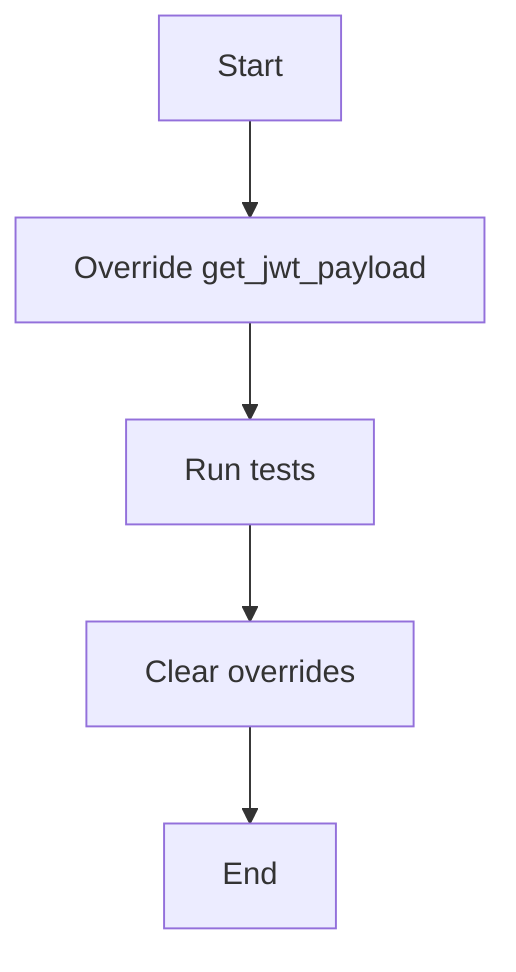
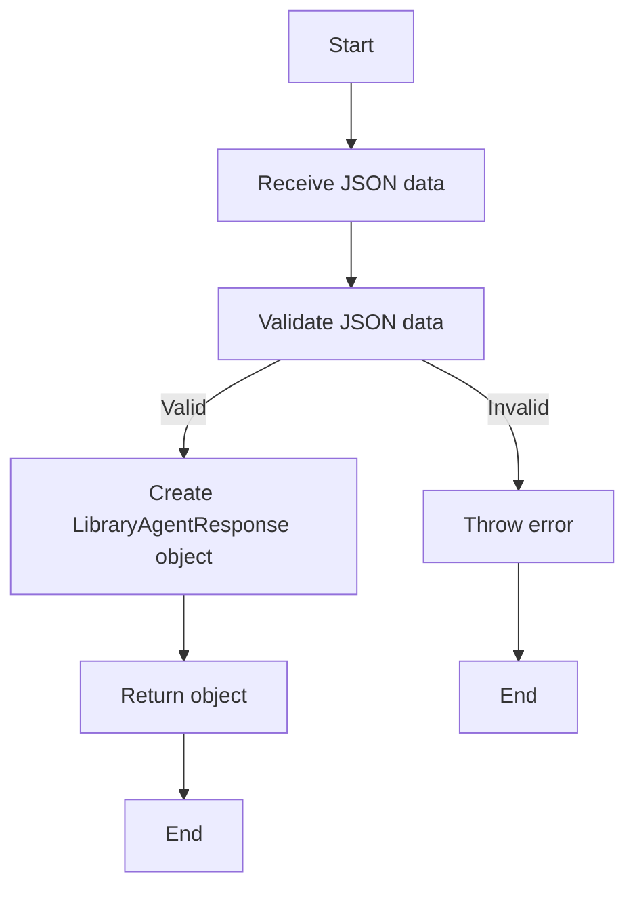
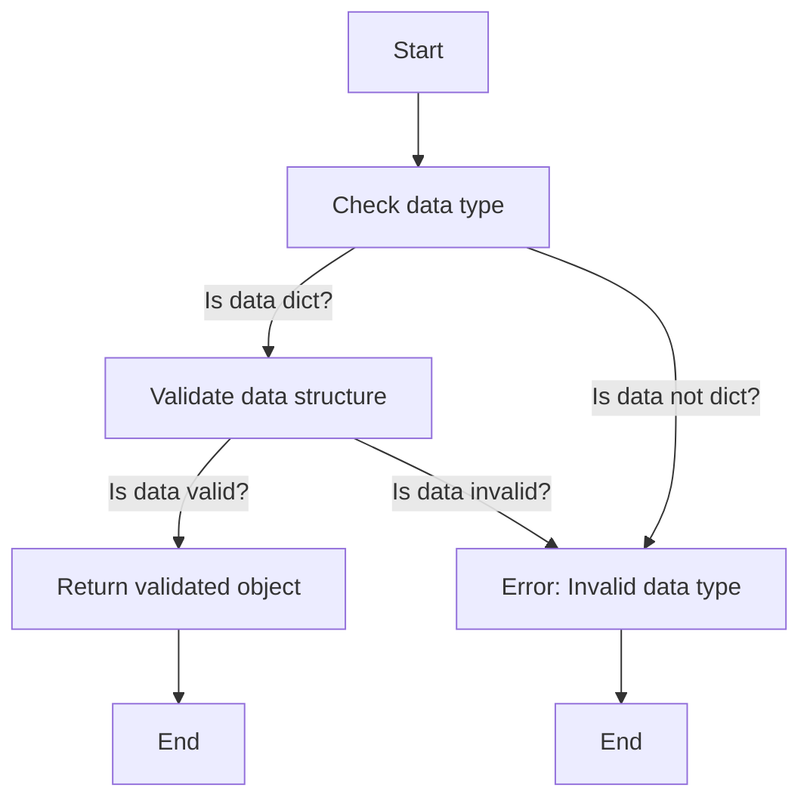
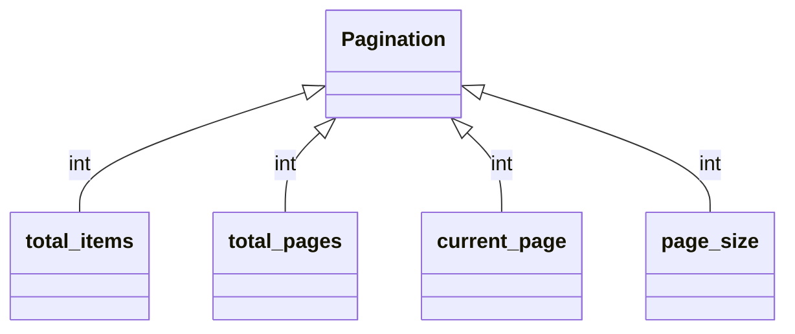

# `.\AutoGPT\autogpt_platform\backend\backend\api\features\library\routes_test.py` 详细设计文档

This file contains tests for the library module, which includes functionality for managing library agents, such as listing, favoriting, and adding agents to the library.

## 整体流程



## 类结构

```
library_test (Test Module)
├── test_get_library_agents_success (Test Function)
│   ├── setup_app_auth (Fixture)
│   ├── test_get_favorite_library_agents_success (Test Function)
│   └── test_add_agent_to_library_success (Test Function)
```

## 全局变量及字段


### `FIXED_NOW`
    
A fixed datetime object representing a specific date and time used for testing purposes.

类型：`datetime.datetime`
    


### `client`
    
A TestClient instance used to test the FastAPI application.

类型：`fastapi.testclient.TestClient`
    


### `app`
    
The FastAPI application instance.

类型：`fastapi.FastAPI`
    


### `snapshot`
    
A Snapshot instance used for taking snapshots of the application's responses during testing.

类型：`pytest_snapshot.plugin.Snapshot`
    


### `test_user_id`
    
A string representing the user ID used in tests to simulate user interactions.

类型：`str`
    


### `LibraryAgent.id`
    
The unique identifier of the library agent.

类型：`str`
    


### `LibraryAgent.graph_id`
    
The identifier of the graph associated with the library agent.

类型：`str`
    


### `LibraryAgent.graph_version`
    
The version number of the graph associated with the library agent.

类型：`int`
    


### `LibraryAgent.owner_user_id`
    
The identifier of the user who owns the library agent.

类型：`str`
    


### `LibraryAgent.name`
    
The name of the library agent.

类型：`str`
    


### `LibraryAgent.description`
    
The description of the library agent.

类型：`str`
    


### `LibraryAgent.image_url`
    
The URL of the image representing the library agent.

类型：`str`
    


### `LibraryAgent.creator_name`
    
The name of the creator of the library agent.

类型：`str`
    


### `LibraryAgent.creator_image_url`
    
The URL of the image representing the creator of the library agent.

类型：`str`
    


### `LibraryAgent.input_schema`
    
The schema for the input of the library agent.

类型：`dict`
    


### `LibraryAgent.output_schema`
    
The schema for the output of the library agent.

类型：`dict`
    


### `LibraryAgent.credentials_input_schema`
    
The schema for the credentials input of the library agent.

类型：`dict`
    


### `LibraryAgent.has_external_trigger`
    
A boolean indicating whether the library agent has an external trigger.

类型：`bool`
    


### `LibraryAgent.has_human_in_the_loop`
    
A boolean indicating whether the library agent has a human in the loop.

类型：`bool`
    


### `LibraryAgent.has_sensitive_action`
    
A boolean indicating whether the library agent has a sensitive action.

类型：`bool`
    


### `LibraryAgent.status`
    
The status of the library agent.

类型：`library_model.LibraryAgentStatus`
    


### `LibraryAgent.recommended_schedule_cron`
    
The recommended schedule cron expression for the library agent.

类型：`str`
    


### `LibraryAgent.new_output`
    
A boolean indicating whether the library agent has a new output.

类型：`bool`
    


### `LibraryAgent.can_access_graph`
    
A boolean indicating whether the library agent can access the graph.

类型：`bool`
    


### `LibraryAgent.is_latest_version`
    
A boolean indicating whether the library agent is the latest version.

类型：`bool`
    


### `LibraryAgent.is_favorite`
    
A boolean indicating whether the library agent is a favorite.

类型：`bool`
    


### `LibraryAgent.created_at`
    
The datetime when the library agent was created.

类型：`datetime.datetime`
    


### `LibraryAgent.updated_at`
    
The datetime when the library agent was last updated.

类型：`datetime.datetime`
    


### `LibraryAgentResponse.agents`
    
A list of library agents in the response.

类型：`list`
    


### `LibraryAgentResponse.pagination`
    
The pagination information for the response.

类型：`Pagination`
    


### `Pagination.total_items`
    
The total number of items in the pagination.

类型：`int`
    


### `Pagination.total_pages`
    
The total number of pages in the pagination.

类型：`int`
    


### `Pagination.current_page`
    
The current page number in the pagination.

类型：`int`
    


### `Pagination.page_size`
    
The number of items per page in the pagination.

类型：`int`
    
    

## 全局函数及方法


### test_get_library_agents_success

This function tests the success scenario of retrieving library agents based on a search term.

参数：

- `mocker`：`pytest_mock.MockFixture`，用于模拟依赖项
- `snapshot`：`pytest_snapshot.plugin.Snapshot`，用于验证快照
- `test_user_id`：`str`，测试用户ID

返回值：`None`，无返回值

#### 流程图



#### 带注释源码

```python
@pytest.mark.asyncio
async def test_get_library_agents_success(
    mocker: pytest_mock.MockFixture,
    snapshot: Snapshot,
    test_user_id: str,
) -> None:
    mocked_value = library_model.LibraryAgentResponse(
        agents=[
            library_model.LibraryAgent(
                id="test-agent-1",
                graph_id="test-agent-1",
                graph_version=1,
                owner_user_id=test_user_id,
                name="Test Agent 1",
                description="Test Description 1",
                image_url=None,
                creator_name="Test Creator",
                creator_image_url="",
                input_schema={"type": "object", "properties": {}},
                output_schema={"type": "object", "properties": {}},
                credentials_input_schema={"type": "object", "properties": {}},
                has_external_trigger=False,
                has_human_in_the_loop=False,
                has_sensitive_action=False,
                status=library_model.LibraryAgentStatus.COMPLETED,
                recommended_schedule_cron=None,
                new_output=False,
                can_access_graph=True,
                is_latest_version=True,
                is_favorite=False,
                created_at=datetime.datetime(2023, 1, 1, 0, 0, 0),
                updated_at=datetime.datetime(2023, 1, 1, 0, 0, 0),
            ),
            library_model.LibraryAgent(
                id="test-agent-2",
                graph_id="test-agent-2",
                graph_version=1,
                owner_user_id=test_user_id,
                name="Test Agent 2",
                description="Test Description 2",
                image_url=None,
                creator_name="Test Creator",
                creator_image_url="",
                input_schema={"type": "object", "properties": {}},
                output_schema={"type": "object", "properties": {}},
                credentials_input_schema={"type": "object", "properties": {}},
                has_external_trigger=False,
                has_human_in_the_loop=False,
                has_sensitive_action=False,
                status=library_model.LibraryAgentStatus.COMPLETED,
                recommended_schedule_cron=None,
                new_output=False,
                can_access_graph=False,
                is_latest_version=True,
                is_favorite=False,
                created_at=datetime.datetime(2023, 1, 1, 0, 0, 0),
                updated_at=datetime.datetime(2023, 1, 1, 0, 0, 0),
            ),
        ],
        pagination=Pagination(
            total_items=2, total_pages=1, current_page=1, page_size=50
        ),
    )
    mock_db_call = mocker.patch("backend.api.features.library.db.list_library_agents")
    mock_db_call.return_value = mocked_value

    response = client.get("/agents?search_term=test")
    assert response.status_code == 200

    data = library_model.LibraryAgentResponse.model_validate(response.json())
    assert len(data.agents) == 2
    assert data.agents[0].graph_id == "test-agent-1"
    assert data.agents[0].can_access_graph is True
    assert data.agents[1].graph_id == "test-agent-2"
    assert data.agents[1].can_access_graph is False

    snapshot.snapshot_dir = "snapshots"
    snapshot.assert_match(json.dumps(response.json(), indent=2), "lib_agts_search")

    mock_db_call.assert_called_once_with(
        user_id=test_user_id,
        search_term="test",
        sort_by=library_model.LibraryAgentSort.UPDATED_AT,
        page=1,
        page_size=15,
    )
```


### test_get_favorite_library_agents_success

This function tests the success scenario for retrieving favorite library agents for a user.

参数：

- `mocker`: `pytest_mock.MockFixture`，用于模拟依赖项
- `test_user_id`: `str`，测试用户ID
- `snapshot`: `Snapshot`，用于验证快照

返回值：`None`，没有返回值

#### 流程图



#### 带注释源码

```python
@pytest.mark.asyncio
async def test_get_favorite_library_agents_success(
    mocker: pytest_mock.MockFixture,
    test_user_id: str,
) -> None:
    mocked_value = library_model.LibraryAgentResponse(
        agents=[
            library_model.LibraryAgent(
                id="test-agent-1",
                graph_id="test-agent-1",
                graph_version=1,
                owner_user_id=test_user_id,
                name="Favorite Agent 1",
                description="Test Favorite Description 1",
                image_url=None,
                creator_name="Test Creator",
                creator_image_url="",
                input_schema={"type": "object", "properties": {}},
                output_schema={"type": "object", "properties": {}},
                credentials_input_schema={"type": "object", "properties": {}},
                has_external_trigger=False,
                has_human_in_the_loop=False,
                has_sensitive_action=False,
                status=library_model.LibraryAgentStatus.COMPLETED,
                recommended_schedule_cron=None,
                new_output=False,
                can_access_graph=True,
                is_latest_version=True,
                is_favorite=True,
                created_at=datetime.datetime(2023, 1, 1, 0, 0, 0),
                updated_at=datetime.datetime(2023, 1, 1, 0, 0, 0),
            ),
        ],
        pagination=Pagination(
            total_items=1, total_pages=1, current_page=1, page_size=15
        ),
    )
    mock_db_call = mocker.patch(
        "backend.api.features.library.db.list_favorite_library_agents"
    )
    mock_db_call.return_value = mocked_value

    response = client.get("/agents/favorites")
    assert response.status_code == 200

    data = library_model.LibraryAgentResponse.model_validate(response.json())
    assert len(data.agents) == 1
    assert data.agents[0].is_favorite is True
    assert data.agents[0].name == "Favorite Agent 1"

    mock_db_call.assert_called_once_with(
        user_id=test_user_id,
        page=1,
        page_size=15,
    )
```


### test_add_agent_to_library_success

This function tests the successful addition of an agent to the library.

参数：

- `mocker`：`pytest_mock.MockFixture`，用于模拟依赖项
- `test_user_id`：`str`，测试用户ID

返回值：`None`，无返回值

#### 流程图



#### 带注释源码

```python
def test_add_agent_to_library_success(
    mocker: pytest_mock.MockFixture, test_user_id: str
):
    # Create a mock library agent
    mock_library_agent = library_model.LibraryAgent(
        id="test-library-agent-id",
        graph_id="test-agent-1",
        graph_version=1,
        owner_user_id=test_user_id,
        name="Test Agent 1",
        description="Test Description 1",
        image_url=None,
        creator_name="Test Creator",
        creator_image_url="",
        input_schema={"type": "object", "properties": {}},
        output_schema={"type": "object", "properties": {}},
        credentials_input_schema={"type": "object", "properties": {}},
        has_external_trigger=False,
        has_human_in_the_loop=False,
        has_sensitive_action=False,
        status=library_model.LibraryAgentStatus.COMPLETED,
        new_output=False,
        can_access_graph=True,
        is_latest_version=True,
        is_favorite=False,
        created_at=FIXED_NOW,
        updated_at=FIXED_NOW,
    )

    # Mock the database call
    mock_db_call = mocker.patch(
        "backend.api.features.library.db.add_store_agent_to_library"
    )
    mock_db_call.return_value = mock_library_agent

    # Mock the complete onboarding step
    mock_complete_onboarding = mocker.patch(
        "backend.api.features.library.routes.agents.complete_onboarding_step",
        new_callable=AsyncMock,
    )

    # Make the POST request to add the agent to the library
    response = client.post(
        "/agents", json={"store_listing_version_id": "test-version-id"}
    )

    # Assert the response status code
    assert response.status_code == 201

    # Verify the response contains the library agent data
    data = library_model.LibraryAgent.model_validate(response.json())
    assert data.id == "test-library-agent-id"
    assert data.graph_id == "test-agent-1"

    # Assert the database call arguments
    mock_db_call.assert_called_once_with(
        store_listing_version_id="test-version-id", user_id=test_user_id
    )

    # Assert that the complete onboarding step was called
    mock_complete_onboarding.assert_awaited_once()
``` 


### setup_app_auth

Setup auth overrides for all tests in this module.

参数：

- `mock_jwt_user`：`dict`，Mocked JWT user data for authentication overrides.

返回值：无

#### 流程图



#### 带注释源码

```python
@pytest.fixture(autouse=True)
def setup_app_auth(mock_jwt_user):
    """Setup auth overrides for all tests in this module"""
    from autogpt_libs.auth.jwt_utils import get_jwt_payload

    app.dependency_overrides[get_jwt_payload] = mock_jwt_user["get_jwt_payload"]
    yield
    app.dependency_overrides.clear()
```


### `LibraryAgent.__init__`

初始化一个LibraryAgent对象。

参数：

- `id`：`str`，LibraryAgent的唯一标识符。
- `graph_id`：`str`，关联的图ID。
- `graph_version`：`int`，关联的图版本。
- `owner_user_id`：`str`，所有者的用户ID。
- `name`：`str`，LibraryAgent的名称。
- `description`：`str`，LibraryAgent的描述。
- `image_url`：`str`，LibraryAgent的图片URL。
- `creator_name`：`str`，创建者的名称。
- `creator_image_url`：`str`，创建者的图片URL。
- `input_schema`：`dict`，输入模式。
- `output_schema`：`dict`，输出模式。
- `credentials_input_schema`：`dict`，凭证输入模式。
- `has_external_trigger`：`bool`，是否有外部触发。
- `has_human_in_the_loop`：`bool`，是否有人的参与。
- `has_sensitive_action`：`bool`，是否有敏感操作。
- `status`：`LibraryAgentStatus`，LibraryAgent的状态。
- `recommended_schedule_cron`：`str`，推荐的定时任务cron表达式。
- `new_output`：`bool`，是否有新输出。
- `can_access_graph`：`bool`，是否可以访问图。
- `is_latest_version`：`bool`，是否是最新版本。
- `is_favorite`：`bool`，是否是收藏。
- `created_at`：`datetime`，创建时间。
- `updated_at`：`datetime`，更新时间。

返回值：无

#### 流程图

```mermaid
classDiagram
    LibraryAgent <|-- LibraryAgentResponse
    LibraryAgent {
        id
        graph_id
        graph_version
        owner_user_id
        name
        description
        image_url
        creator_name
        creator_image_url
        input_schema
        output_schema
        credentials_input_schema
        has_external_trigger
        has_human_in_the_loop
        has_sensitive_action
        status
        recommended_schedule_cron
        new_output
        can_access_graph
        is_latest_version
        is_favorite
        created_at
        updated_at
    }
    LibraryAgentResponse {
        agents
        pagination
    }
```

#### 带注释源码

```python
class LibraryAgent:
    def __init__(self,
                 id: str,
                 graph_id: str,
                 graph_version: int,
                 owner_user_id: str,
                 name: str,
                 description: str,
                 image_url: str,
                 creator_name: str,
                 creator_image_url: str,
                 input_schema: dict,
                 output_schema: dict,
                 credentials_input_schema: dict,
                 has_external_trigger: bool,
                 has_human_in_the_loop: bool,
                 has_sensitive_action: bool,
                 status: LibraryAgentStatus,
                 recommended_schedule_cron: str,
                 new_output: bool,
                 can_access_graph: bool,
                 is_latest_version: bool,
                 is_favorite: bool,
                 created_at: datetime,
                 updated_at: datetime):
        self.id = id
        self.graph_id = graph_id
        self.graph_version = graph_version
        self.owner_user_id = owner_user_id
        self.name = name
        self.description = description
        self.image_url = image_url
        self.creator_name = creator_name
        self.creator_image_url = creator_image_url
        self.input_schema = input_schema
        self.output_schema = output_schema
        self.credentials_input_schema = credentials_input_schema
        self.has_external_trigger = has_external_trigger
        self.has_human_in_the_loop = has_human_in_the_loop
        self.has_sensitive_action = has_sensitive_action
        self.status = status
        self.recommended_schedule_cron = recommended_schedule_cron
        self.new_output = new_output
        self.can_access_graph = can_access_graph
        self.is_latest_version = is_latest_version
        self.is_favorite = is_favorite
        self.created_at = created_at
        self.updated_at = updated_at
```


### library_model.LibraryAgentResponse.model_validate

This function validates the model for the LibraryAgentResponse object.

参数：

- `data`：`dict`，The JSON data to be validated.

返回值：`LibraryAgentResponse`，The validated LibraryAgentResponse object.

#### 流程图



#### 带注释源码

```python
from . import library_model

def model_validate(data: dict) -> library_model.LibraryAgentResponse:
    # Validate the JSON data
    if not isinstance(data, dict):
        raise ValueError("Invalid data format")

    # Create a LibraryAgentResponse object
    return library_model.LibraryAgentResponse(**data)
```


### `LibraryAgentResponse.__init__`

初始化 `LibraryAgentResponse` 对象。

参数：

- `agents`：`list`，包含 `LibraryAgent` 对象的列表，表示图书馆代理。
- `pagination`：`Pagination`，表示分页信息。

返回值：无

#### 流程图

```mermaid
classDiagram
    LibraryAgentResponse <|-- LibraryAgent
    LibraryAgentResponse {
        agents
        pagination
    }
```

#### 带注释源码

```python
class LibraryAgentResponse:
    def __init__(self, agents, pagination):
        self.agents = agents
        self.pagination = pagination
```


### `LibraryAgentResponse.model_validate`

This function validates the model of a LibraryAgentResponse object, ensuring that the data structure and values meet the expected format.

参数：

- `data`：`dict`，The JSON data to be validated.

返回值：`LibraryAgentResponse`，The validated LibraryAgentResponse object.

#### 流程图



#### 带注释源码

```python
from . import model as library_model

def model_validate(data: dict) -> library_model.LibraryAgentResponse:
    # Validate the data structure and values
    if not isinstance(data, dict):
        raise ValueError("Invalid data type: expected dict")

    # Extract necessary fields from the data
    agents = data.get("agents", [])
    pagination = data.get("pagination", None)

    # Validate the agents list
    if not isinstance(agents, list):
        raise ValueError("Invalid data structure: 'agents' should be a list")
    for agent in agents:
        # Validate each agent in the list
        # ...

    # Validate the pagination object
    if pagination is not None:
        if not isinstance(pagination, dict):
            raise ValueError("Invalid data structure: 'pagination' should be a dict")
        # Validate pagination fields
        # ...

    # Create and return the validated LibraryAgentResponse object
    return library_model.LibraryAgentResponse(agents=agents, pagination=pagination)
```


### Pagination.__init__

Pagination 类的初始化方法。

参数：

- `total_items`：`int`，表示总项目数。
- `total_pages`：`int`，表示总页数。
- `current_page`：`int`，表示当前页码。
- `page_size`：`int`，表示每页显示的项目数。

返回值：无

#### 流程图



#### 带注释源码

```python
class Pagination:
    def __init__(self, total_items: int, total_pages: int, current_page: int, page_size: int):
        self.total_items = total_items
        self.total_pages = total_pages
        self.current_page = current_page
        self.page_size = page_size
```


## 关键组件


### 张量索引与惰性加载

张量索引与惰性加载是代码中用于高效处理大型数据集的关键组件，通过延迟加载和索引优化，减少内存消耗并提高数据处理速度。

### 反量化支持

反量化支持是代码中用于处理量化数据的关键组件，它能够将量化数据转换回原始数据，以便进行进一步的分析和处理。

### 量化策略

量化策略是代码中用于优化数据存储和计算效率的关键组件，它通过减少数据精度来降低内存和计算资源的使用。


## 问题及建议


### 已知问题

-   **测试依赖**: 测试代码中使用了`pytest_mock`和`pytest_snapshot`，这些依赖可能不是所有开发环境都安装的，需要确保测试环境配置正确。
-   **数据库调用**: `mock_db_call`使用了`mocker.patch`来模拟数据库调用，这可能导致实际数据库操作被忽略，需要确保在非测试环境中正确调用数据库。
-   **时间固定**: `FIXED_NOW`被设置为固定时间，这可能导致测试结果在不同时间运行时不同，需要考虑使用动态时间或模拟时间。
-   **异常处理**: 代码中没有显示异常处理逻辑，需要确保在可能发生异常的地方添加适当的异常处理。

### 优化建议

-   **环境隔离**: 确保测试环境与生产环境隔离，避免测试代码影响生产环境。
-   **数据库连接**: 使用数据库连接池来管理数据库连接，提高性能并减少连接开销。
-   **时间模拟**: 使用时间模拟库（如`freezegun`）来确保测试的一致性。
-   **日志记录**: 在关键操作和可能出错的地方添加日志记录，以便于问题追踪和调试。
-   **代码复用**: 将重复的代码提取为函数或类，提高代码可读性和可维护性。
-   **单元测试**: 扩展单元测试覆盖范围，确保代码的每个部分都经过测试。
-   **性能优化**: 对数据库查询进行优化，减少查询时间和资源消耗。
-   **错误处理**: 在可能发生错误的地方添加异常处理，确保程序的健壮性。


## 其它


### 设计目标与约束

- 设计目标：
  - 提供一个API接口，用于管理图书馆代理。
  - 支持对图书馆代理进行搜索、获取和添加操作。
  - 确保API接口的响应时间在可接受范围内。
  - 确保API接口的响应格式一致且易于解析。

- 约束条件：
  - 使用FastAPI框架构建API接口。
  - 使用PostgreSQL数据库存储图书馆代理数据。
  - 使用JWT进行用户身份验证。
  - 使用pytest进行单元测试。

### 错误处理与异常设计

- 错误处理：
  - 对于所有API接口，返回状态码和错误信息。
  - 对于数据库操作错误，返回500内部服务器错误。
  - 对于参数错误，返回400Bad Request错误。

- 异常设计：
  - 使用try-except语句捕获和处理异常。
  - 定义自定义异常类，用于处理特定类型的错误。

### 数据流与状态机

- 数据流：
  - 用户通过API接口发送请求。
  - API接口处理请求，与数据库交互。
  - 数据库返回结果，API接口返回响应。

- 状态机：
  - 图书馆代理的状态包括：未添加、已添加、已删除。
  - 用户可以通过API接口更改图书馆代理的状态。

### 外部依赖与接口契约

- 外部依赖：
  - FastAPI框架
  - Pytest框架
  - PostgreSQL数据库
  - JWT库

- 接口契约：
  - API接口的输入参数和输出参数定义。
  - API接口的HTTP方法和路径定义。
  - API接口的响应状态码和错误信息定义。


    