# `AutoGPT\autogpt_platform\backend\backend\api\features\oauth.py` 详细设计文档

该代码实现了一个支持 PKCE 的 OAuth 2.0 授权码流程，包含授权、令牌交换、令牌内省与撤销端点，以及 OAuth 应用的管理与 Logo 上传功能，基于 FastAPI 构建。

## 整体流程

```mermaid
graph TD
    subgraph Authorization [授权流程]
        A[用户点击登录] --> B[重定向至 /auth/authorize]
        B --> C{用户已登录?}
        C -- 否 --> D[跳转登录页]
        C -- 是 --> E[展示授权页]
        E --> F[用户同意授权]
        F --> G[后端验证 client_id, redirect_uri, scopes]
        G --> H[创建 authorization_code (PKCE)]
        H --> I[重定向回应用并附带 code]
    end
    subgraph TokenExchange [令牌交换流程]
        I --> J[应用请求 /api/oauth/token]
        J --> K[验证 client_secret]
        K --> L{grant_type?}
        L -- authorization_code --> M[验证 code & PKCE verifier]
        L -- refresh_token --> N[验证 refresh_token]
        M --> O[签发 access_token & refresh_token]
        N --> O
        O --> P[返回 TokenResponse]
    end
    subgraph LogoUpload [Logo 上传流程]
        Q[请求 /apps/id/logo/upload] --> R[验证应用所有权]
        R --> S[验证文件类型与大小]
        S --> T[验证图片尺寸 512x512 - 2048x2048]
        T --> U[病毒扫描]
        U --> V[上传至 GCS]
        V --> W[更新数据库 logo_url]
        W --> X[返回更新后的应用信息]
    end
```

## 类结构

```
BaseModel (Pydantic)
├── TokenResponse
├── ErrorResponse
├── OAuthApplicationPublicInfo
├── AuthorizeRequest
├── AuthorizeResponse
├── TokenRequestByCode
├── TokenRequestByRefreshToken
└── UpdateAppLogoRequest
```

## 全局变量及字段


### `settings`
    
应用程序配置设置对象实例

类型：`Settings`
    


### `logger`
    
用于记录日志的模块级记录器实例

类型：`Logger`
    


### `router`
    
用于组织 OAuth 相关路由的 FastAPI 路由器

类型：`APIRouter`
    


### `LOGO_MIN_SIZE`
    
Logo 图片允许的最小边长（像素）

类型：`int`
    


### `LOGO_MAX_SIZE`
    
Logo 图片允许的最大边长（像素）

类型：`int`
    


### `LOGO_ALLOWED_TYPES`
    
允许上传的 Logo 图片 MIME 类型集合

类型：`set`
    


### `LOGO_MAX_FILE_SIZE`
    
Logo 图片允许的最大文件大小（字节）

类型：`int`
    


### `TokenResponse.token_type`
    
令牌类型，固定为 Bearer

类型：`Literal["Bearer"]`
    


### `TokenResponse.access_token`
    
用于访问受保护资源的访问令牌字符串

类型：`str`
    


### `TokenResponse.access_token_expires_at`
    
访问令牌的过期时间戳

类型：`datetime`
    


### `TokenResponse.refresh_token`
    
用于获取新访问令牌的刷新令牌字符串

类型：`str`
    


### `TokenResponse.refresh_token_expires_at`
    
刷新令牌的过期时间戳

类型：`datetime`
    


### `TokenResponse.scopes`
    
授予令牌的权限范围列表

类型：`list[str]`
    


### `ErrorResponse.error`
    
OAuth 错误代码

类型：`str`
    


### `ErrorResponse.error_description`
    
错误的可读描述信息

类型：`Optional[str]`
    


### `OAuthApplicationPublicInfo.name`
    
OAuth 应用程序的名称

类型：`str`
    


### `OAuthApplicationPublicInfo.description`
    
OAuth 应用程序的描述

类型：`Optional[str]`
    


### `OAuthApplicationPublicInfo.logo_url`
    
OAuth 应用程序的 Logo 图片 URL

类型：`Optional[str]`
    


### `OAuthApplicationPublicInfo.scopes`
    
应用程序请求的权限范围列表

类型：`list[str]`
    


### `AuthorizeRequest.client_id`
    
客户端标识符

类型：`str`
    


### `AuthorizeRequest.redirect_uri`
    
授权完成后的重定向 URI

类型：`str`
    


### `AuthorizeRequest.scopes`
    
客户端请求的权限范围列表

类型：`list[str]`
    


### `AuthorizeRequest.state`
    
用于防止 CSRF 攻击的随机字符串

类型：`str`
    


### `AuthorizeRequest.response_type`
    
响应类型，此处必须为 code

类型：`str`
    


### `AuthorizeRequest.code_challenge`
    
PKCE 代码挑战值

类型：`str`
    


### `AuthorizeRequest.code_challenge_method`
    
PKCE 代码挑战的转换方法

类型：`Literal["S256", "plain"]`
    


### `AuthorizeResponse.redirect_url`
    
包含授权码或错误信息的重定向 URL

类型：`str`
    


### `TokenRequestByCode.grant_type`
    
授权类型，固定为 authorization_code

类型：`Literal["authorization_code"]`
    


### `TokenRequestByCode.code`
    
从授权端点获取的授权码

类型：`str`
    


### `TokenRequestByCode.redirect_uri`
    
必须与授权请求中使用的重定向 URI 一致

类型：`str`
    


### `TokenRequestByCode.client_id`
    
客户端标识符

类型：`str`
    


### `TokenRequestByCode.client_secret`
    
客户端密钥

类型：`str`
    


### `TokenRequestByCode.code_verifier`
    
PKCE 代码验证器

类型：`str`
    


### `TokenRequestByRefreshToken.grant_type`
    
授权类型，固定为 refresh_token

类型：`Literal["refresh_token"]`
    


### `TokenRequestByRefreshToken.refresh_token`
    
用于刷新访问令牌的刷新令牌

类型：`str`
    


### `TokenRequestByRefreshToken.client_id`
    
客户端标识符

类型：`str`
    


### `TokenRequestByRefreshToken.client_secret`
    
客户端密钥

类型：`str`
    


### `UpdateAppLogoRequest.logo_url`
    
已上传的 Logo 图片 URL

类型：`str`
    
    

## 全局函数及方法


### `get_oauth_app_info`

获取指定OAuth应用程序的公共信息，供同意屏幕展示给用户，以便用户授权访问。

参数：

- `client_id`：`str`，OAuth客户端标识符，用于查找指定应用
- `user_id`：`str`，通过安全依赖注入获取的当前登录用户ID

返回值：`OAuthApplicationPublicInfo`，包含应用程序名称、描述、Logo URL 及请求权限范围列表的响应模型

#### 流程图

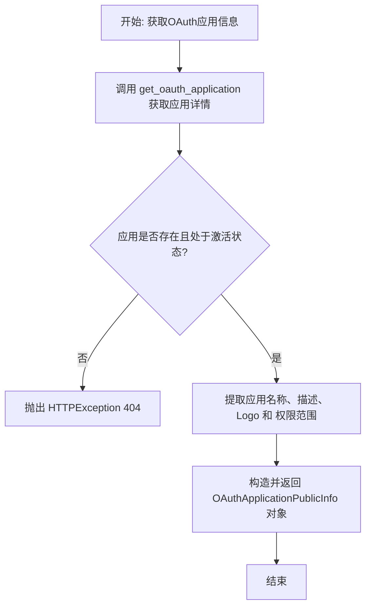

#### 带注释源码

```python
async def get_oauth_app_info(
    client_id: str, user_id: str = Security(get_user_id)
) -> OAuthApplicationPublicInfo:
    """
    Get public information about an OAuth application.

    This endpoint is used by the consent screen to display application details
    to the user before they authorize access.

    Returns:
    - name: Application name
    - description: Application description (if provided)
    - scopes: List of scopes the application is allowed to request
    """
    # 根据提供的 client_id 从数据库获取 OAuth 应用详情
    app = await get_oauth_application(client_id)

    # 检查应用是否存在，以及应用是否处于激活状态
    if not app or not app.is_active:
        # 如果应用不存在或未激活，返回 404 错误
        raise HTTPException(
            status_code=status.HTTP_404_NOT_FOUND,
            detail="Application not found",
        )

    # 返回包含应用公开信息的响应对象
    # 将权限范围的枚举值转换为字符串列表
    return OAuthApplicationPublicInfo(
        name=app.name,
        description=app.description,
        logo_url=app.logo_url,
        scopes=[s.value for s in app.scopes],
    )
```


### `authorize`

该函数实现了 OAuth 2.0 授权端点，用于处理用户的授权逻辑。它要求用户必须登录（通过 Supabase JWT 认证），强制使用 PKCE（Proof Key for Code Exchange）以增强安全性。函数会验证客户端 ID、重定向 URI 以及请求的权限范围（scopes），验证通过后生成一个临时的授权码，并构建包含该授权码的重定向 URL 返回给前端，以便将用户重定向回客户端应用。

参数：

- `request`：`AuthorizeRequest`，OAuth 2.0 授权请求体，包含 `client_id`、`redirect_uri`、`scopes`、`state`、`response_type`、`code_challenge` 和 `code_challenge_method`。
- `user_id`：`str`，当前登录用户的 ID，由 `Security(get_user_id)` 自动注入。

返回值：`AuthorizeResponse`，包含用于重定向用户的 URL（`redirect_url`），该 URL 中附带授权码或错误信息。

#### 流程图

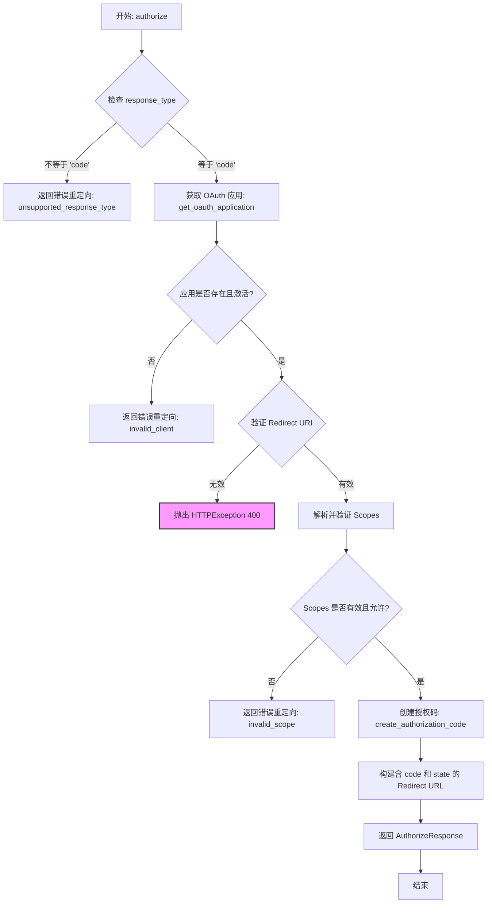

#### 带注释源码

```python
@router.post("/authorize")
async def authorize(
    request: AuthorizeRequest = Body(),
    user_id: str = Security(get_user_id),
) -> AuthorizeResponse:
    """
    OAuth 2.0 Authorization Endpoint

    User must be logged in (authenticated with Supabase JWT).
    This endpoint creates an authorization code and returns a redirect URL.

    PKCE (Proof Key for Code Exchange) is REQUIRED for all authorization requests.

    The frontend consent screen should call this endpoint after the user approves,
    then redirect the user to the returned `redirect_url`.

    Request Body:
    - client_id: The OAuth application's client ID
    - redirect_uri: Where to redirect after authorization (must match registered URI)
    - scopes: List of permissions (e.g., "EXECUTE_GRAPH READ_GRAPH")
    - state: Anti-CSRF token provided by client (will be returned in redirect)
    - response_type: Must be "code" (for authorization code flow)
    - code_challenge: PKCE code challenge (required)
    - code_challenge_method: "S256" (recommended) or "plain"

    Returns:
    - redirect_url: The URL to redirect the user to (includes authorization code)

    Error cases return a redirect_url with error parameters, or raise HTTPException
    for critical errors (like invalid redirect_uri).
    """
    try:
        # 1. 验证 response_type 是否为 'code'
        if request.response_type != "code":
            return _error_redirect_url(
                request.redirect_uri,
                request.state,
                "unsupported_response_type",
                "Only 'code' response type is supported",
            )

        # 2. 获取并验证 OAuth 应用
        app = await get_oauth_application(request.client_id)
        if not app:
            return _error_redirect_url(
                request.redirect_uri,
                request.state,
                "invalid_client",
                "Unknown client_id",
            )

        if not app.is_active:
            return _error_redirect_url(
                request.redirect_uri,
                request.state,
                "invalid_client",
                "Application is not active",
            )

        # 3. 验证重定向 URI 是否与注册的匹配
        if not validate_redirect_uri(app, request.redirect_uri):
            # 对于无效的 redirect_uri，不能安全地重定向，必须抛出异常
            raise HTTPException(
                status_code=status.HTTP_400_BAD_REQUEST,
                detail=(
                    "Invalid redirect_uri. "
                    f"Must be one of: {', '.join(app.redirect_uris)}"
                ),
            )

        # 4. 解析并验证请求的 scopes 权限范围
        try:
            requested_scopes = [APIKeyPermission(s.strip()) for s in request.scopes]
        except ValueError as e:
            return _error_redirect_url(
                request.redirect_uri,
                request.state,
                "invalid_scope",
                f"Invalid scope: {e}",
            )

        if not requested_scopes:
            return _error_redirect_url(
                request.redirect_uri,
                request.state,
                "invalid_scope",
                "At least one scope is required",
            )

        # 检查应用是否有权请求这些 scopes
        if not validate_scopes(app, requested_scopes):
            return _error_redirect_url(
                request.redirect_uri,
                request.state,
                "invalid_scope",
                "Application is not authorized for all requested scopes. "
                f"Allowed: {', '.join(s.value for s in app.scopes)}",
            )

        # 5. 创建授权码，包含 PKCE 参数
        auth_code = await create_authorization_code(
            application_id=app.id,
            user_id=user_id,
            scopes=requested_scopes,
            redirect_uri=request.redirect_uri,
            code_challenge=request.code_challenge,
            code_challenge_method=request.code_challenge_method,
        )

        # 6. 构建重定向 URL，附带 code 和 state
        params = {
            "code": auth_code.code,
            "state": request.state,
        }
        redirect_url = f"{request.redirect_uri}?{urlencode(params)}"

        logger.info(
            f"Authorization code issued for user #{user_id} "
            f"and app {app.name} (#{app.id})"
        )

        return AuthorizeResponse(redirect_url=redirect_url)

    except HTTPException:
        raise
    except Exception as e:
        # 捕获未预期的错误，返回服务器错误重定向
        logger.error(f"Error in authorization endpoint: {e}", exc_info=True)
        return _error_redirect_url(
            request.redirect_uri,
            request.state,
            "server_error",
            "An unexpected error occurred",
        )
```


### `_error_redirect_url`

构建包含 OAuth 错误参数的重定向 URL，用于处理授权流程中的错误情况，确保错误信息和状态参数能正确返回给客户端。

参数：

- `redirect_uri`：`str`，用于错误重定向的目标 URI。
- `state`：`str`，用于防止跨站请求伪造（CSRF）的状态参数。
- `error`：`str`，OAuth 2.0 协议定义的错误代码（如 `invalid_client`）。
- `error_description`：`Optional[str]`，可选的、人类可读的错误详细描述。

返回值：`AuthorizeResponse`，包含格式化后的带有错误查询参数的重定向 URL 的响应对象。

#### 流程图

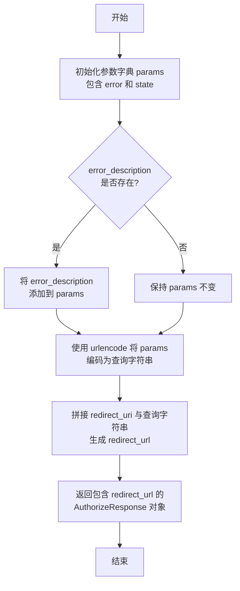

#### 带注释源码

```python
def _error_redirect_url(
    redirect_uri: str,
    state: str,
    error: str,
    error_description: Optional[str] = None,
) -> AuthorizeResponse:
    """Helper to build redirect URL with OAuth error parameters"""
    # 初始化基本参数字典，包含错误代码和 state
    params = {
        "error": error,
        "state": state,
    }
    # 如果提供了错误描述，则添加到参数中
    if error_description:
        params["error_description"] = error_description

    # 构建完整的重定向 URL，将参数编码为查询字符串
    redirect_url = f"{redirect_uri}?{urlencode(params)}"
    
    # 返回包含重定向 URL 的响应对象
    return AuthorizeResponse(redirect_url=redirect_url)
```


### `get_oauth_app_info`

获取 OAuth 应用的公开信息，用于在同意屏幕展示应用详情。

参数：

-   `client_id`：`str`，OAuth 客户端标识符
-   `user_id`：`str`，当前登录用户的 ID（通过 Security 依赖注入）

返回值：`OAuthApplicationPublicInfo`，包含应用名称、描述、Logo URL 和允许申请的作用域列表。

#### 流程图

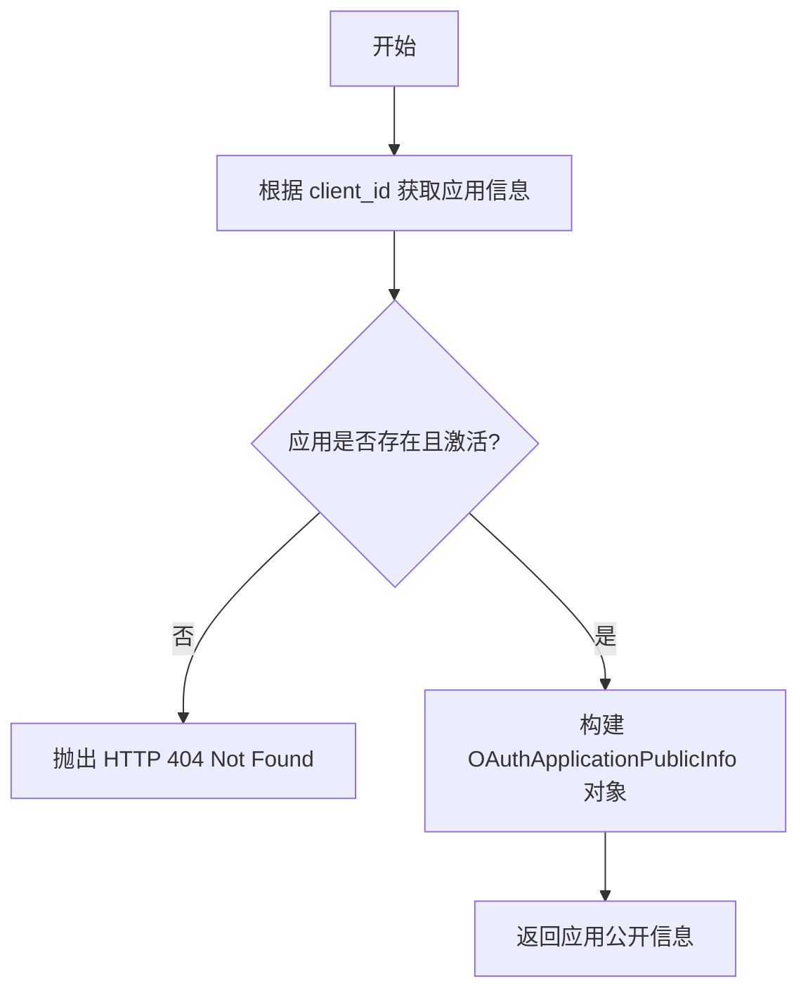

#### 带注释源码

```python
@router.get(
    "/app/{client_id}",
    responses={
        404: {"description": "Application not found or disabled"},
    },
)
async def get_oauth_app_info(
    client_id: str, user_id: str = Security(get_user_id)
) -> OAuthApplicationPublicInfo:
    """
    Get public information about an OAuth application.

    This endpoint is used by the consent screen to display application details
    to the user before they authorize access.

    Returns:
    - name: Application name
    - description: Application description (if provided)
    - scopes: List of scopes the application is allowed to request
    """
    # 获取应用信息
    app = await get_oauth_application(client_id)
    # 检查应用是否存在以及是否激活
    if not app or not app.is_active:
        raise HTTPException(
            status_code=status.HTTP_404_NOT_FOUND,
            detail="Application not found",
        )

    # 返回公开信息模型
    return OAuthApplicationPublicInfo(
        name=app.name,
        description=app.description,
        logo_url=app.logo_url,
        scopes=[s.value for s in app.scopes],
    )
```


### `authorize`

OAuth 2.0 授权端点，处理用户授权请求，创建授权码并返回重定向 URL。

参数：

-   `request`：`AuthorizeRequest`，授权请求体，包含 client_id, redirect_uri, scopes, state, code_challenge 等
-   `user_id`：`str`，当前登录用户的 ID（通过 Security 依赖注入）

返回值：`AuthorizeResponse`，包含重定向 URL，URL 中附带授权码或错误信息。

#### 流程图

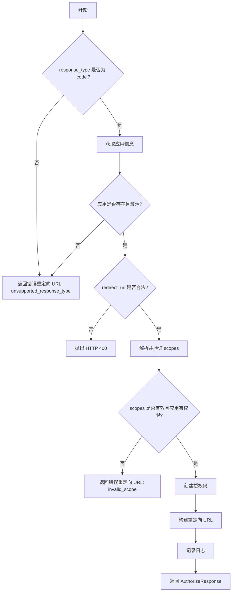

#### 带注释源码

```python
@router.post("/authorize")
async def authorize(
    request: AuthorizeRequest = Body(),
    user_id: str = Security(get_user_id),
) -> AuthorizeResponse:
    """
    OAuth 2.0 Authorization Endpoint

    User must be logged in (authenticated with Supabase JWT).
    This endpoint creates an authorization code and returns a redirect URL.

    PKCE (Proof Key for Code Exchange) is REQUIRED for all authorization requests.

    The frontend consent screen should call this endpoint after the user approves,
    then redirect the user to the returned `redirect_url`.
    """
    try:
        # 验证 response_type 必须为 code
        if request.response_type != "code":
            return _error_redirect_url(
                request.redirect_uri,
                request.state,
                "unsupported_response_type",
                "Only 'code' response type is supported",
            )

        # 获取应用
        app = await get_oauth_application(request.client_id)
        if not app:
            return _error_redirect_url(
                request.redirect_uri,
                request.state,
                "invalid_client",
                "Unknown client_id",
            )

        if not app.is_active:
            return _error_redirect_url(
                request.redirect_uri,
                request.state,
                "invalid_client",
                "Application is not active",
            )

        # 验证重定向 URI
        if not validate_redirect_uri(app, request.redirect_uri):
            # redirect_uri 无效，不能重定向，直接抛错
            raise HTTPException(
                status_code=status.HTTP_400_BAD_REQUEST,
                detail=(
                    "Invalid redirect_uri. "
                    f"Must be one of: {', '.join(app.redirect_uris)}"
                ),
            )

        # 解析并验证 scopes
        try:
            requested_scopes = [APIKeyPermission(s.strip()) for s in request.scopes]
        except ValueError as e:
            return _error_redirect_url(
                request.redirect_uri,
                request.state,
                "invalid_scope",
                f"Invalid scope: {e}",
            )

        if not requested_scopes:
            return _error_redirect_url(
                request.redirect_uri,
                request.state,
                "invalid_scope",
                "At least one scope is required",
            )

        if not validate_scopes(app, requested_scopes):
            return _error_redirect_url(
                request.redirect_uri,
                request.state,
                "invalid_scope",
                "Application is not authorized for all requested scopes. "
                f"Allowed: {', '.join(s.value for s in app.scopes)}",
            )

        # 创建授权码
        auth_code = await create_authorization_code(
            application_id=app.id,
            user_id=user_id,
            scopes=requested_scopes,
            redirect_uri=request.redirect_uri,
            code_challenge=request.code_challenge,
            code_challenge_method=request.code_challenge_method,
        )

        # 构建带 code 的重定向 URL
        params = {
            "code": auth_code.code,
            "state": request.state,
        }
        redirect_url = f"{request.redirect_uri}?{urlencode(params)}"

        logger.info(
            f"Authorization code issued for user #{user_id} "
            f"and app {app.name} (#{app.id})"
        )

        return AuthorizeResponse(redirect_url=redirect_url)

    except HTTPException:
        raise
    except Exception as e:
        logger.error(f"Error in authorization endpoint: {e}", exc_info=True)
        return _error_redirect_url(
            request.redirect_uri,
            request.state,
            "server_error",
            "An unexpected error occurred",
        )
```


### `token`

OAuth 2.0 令牌端点，用于交换授权码获取令牌，或使用刷新令牌更新令牌。

参数：

-   `request`：`TokenRequestByCode | TokenRequestByRefreshToken`，令牌请求体，支持授权码模式或刷新令牌模式

返回值：`TokenResponse`，包含访问令牌、刷新令牌及其过期时间和作用域。

#### 流程图

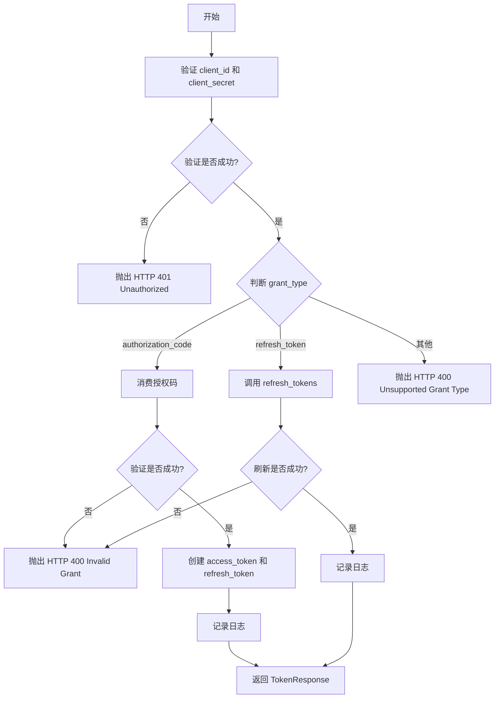

#### 带注释源码

```python
@router.post("/token")
async def token(
    request: TokenRequestByCode | TokenRequestByRefreshToken = Body(),
) -> TokenResponse:
    """
    OAuth 2.0 Token Endpoint

    Exchanges authorization code or refresh token for access token.
    """
    # 验证客户端凭证
    try:
        app = await validate_client_credentials(
            request.client_id, request.client_secret
        )
    except InvalidClientError as e:
        raise HTTPException(
            status_code=status.HTTP_401_UNAUTHORIZED,
            detail=str(e),
        )

    # 处理 authorization_code 授权类型
    if request.grant_type == "authorization_code":
        # 消费授权码
        try:
            user_id, scopes = await consume_authorization_code(
                code=request.code,
                application_id=app.id,
                redirect_uri=request.redirect_uri,
                code_verifier=request.code_verifier,
            )
        except InvalidGrantError as e:
            raise HTTPException(
                status_code=status.HTTP_400_BAD_REQUEST,
                detail=str(e),
            )

        # 创建访问令牌和刷新令牌
        access_token = await create_access_token(app.id, user_id, scopes)
        refresh_token = await create_refresh_token(app.id, user_id, scopes)

        logger.info(
            f"Access token issued for user #{user_id} and app {app.name} (#{app.id})"
            "via authorization code"
        )

        if not access_token.token or not refresh_token.token:
            raise HTTPException(
                status_code=status.HTTP_500_INTERNAL_SERVER_ERROR,
                detail="Failed to generate tokens",
            )

        return TokenResponse(
            token_type="Bearer",
            access_token=access_token.token.get_secret_value(),
            access_token_expires_at=access_token.expires_at,
            refresh_token=refresh_token.token.get_secret_value(),
            refresh_token_expires_at=refresh_token.expires_at,
            scopes=list(s.value for s in scopes),
        )

    # 处理 refresh_token 授权类型
    elif request.grant_type == "refresh_token":
        # 刷新令牌
        try:
            new_access_token, new_refresh_token = await refresh_tokens(
                request.refresh_token, app.id
            )
        except InvalidGrantError as e:
            raise HTTPException(
                status_code=status.HTTP_400_BAD_REQUEST,
                detail=str(e),
            )

        logger.info(
            f"Tokens refreshed for user #{new_access_token.user_id} "
            f"by app {app.name} (#{app.id})"
        )

        if not new_access_token.token or not new_refresh_token.token:
            raise HTTPException(
                status_code=status.HTTP_500_INTERNAL_SERVER_ERROR,
                detail="Failed to generate tokens",
            )

        return TokenResponse(
            token_type="Bearer",
            access_token=new_access_token.token.get_secret_value(),
            access_token_expires_at=new_access_token.expires_at,
            refresh_token=new_refresh_token.token.get_secret_value(),
            refresh_token_expires_at=new_refresh_token.expires_at,
            scopes=list(s.value for s in new_access_token.scopes),
        )

    else:
        raise HTTPException(
            status_code=status.HTTP_400_BAD_REQUEST,
            detail=f"Unsupported grant_type: {request.grant_type}. "
            "Must be 'authorization_code' or 'refresh_token'",
        )
```


### `introspect`

OAuth 2.0 令牌内省端点 (RFC 7662)，用于检查令牌的有效性及元数据。

参数：

-   `token`：`str`，待检查的令牌
-   `token_type_hint`：`Optional[Literal["access_token", "refresh_token"]]`，令牌类型提示（可选）
-   `client_id`：`str`，客户端标识符
-   `client_secret`：`str`，客户端密钥

返回值：`TokenIntrospectionResult`，包含令牌是否激活、作用域、用户 ID 等信息。

#### 流程图

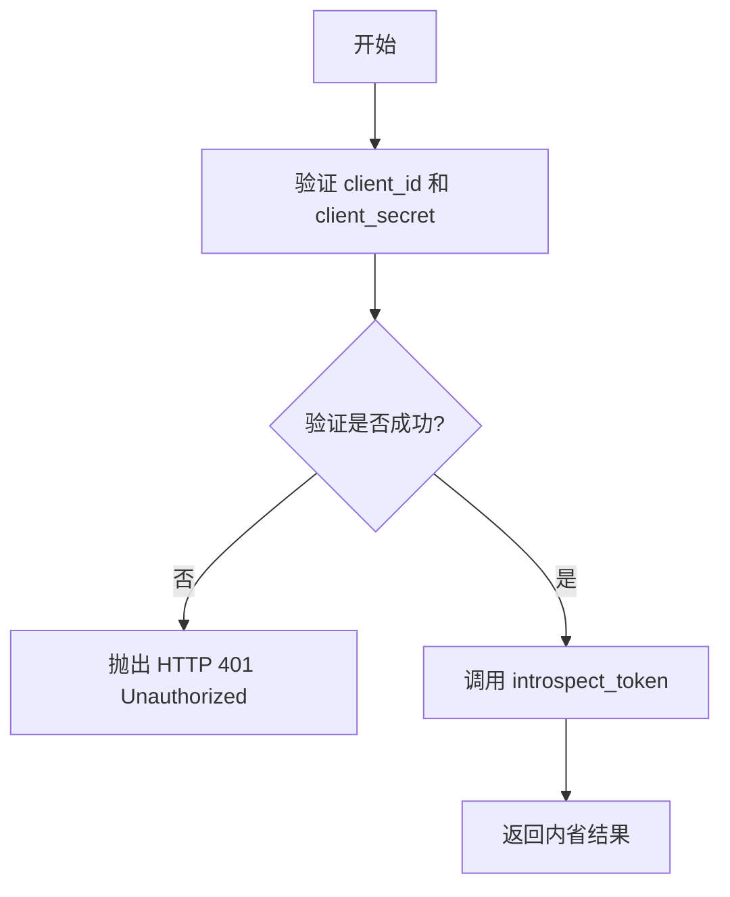

#### 带注释源码

```python
@router.post("/introspect")
async def introspect(
    token: str = Body(description="Token to introspect"),
    token_type_hint: Optional[Literal["access_token", "refresh_token"]] = Body(
        None, description="Hint about token type ('access_token' or 'refresh_token')"
    ),
    client_id: str = Body(description="Client identifier"),
    client_secret: str = Body(description="Client secret"),
) -> TokenIntrospectionResult:
    """
    OAuth 2.0 Token Introspection Endpoint (RFC 7662)

    Allows clients to check if a token is valid and get its metadata.
    """
    # 验证客户端凭证
    try:
        await validate_client_credentials(client_id, client_secret)
    except InvalidClientError as e:
        raise HTTPException(
            status_code=status.HTTP_401_UNAUTHORIZED,
            detail=str(e),
        )

    # 执行令牌内省
    return await introspect_token(token, token_type_hint)
```


### `revoke`

OAuth 2.0 令牌吊销端点 (RFC 7009)，用于吊销访问令牌或刷新令牌。

参数：

-   `token`：`str`，待吊销的令牌
-   `token_type_hint`：`Optional[Literal["access_token", "refresh_token"]]`，令牌类型提示（可选）
-   `client_id`：`str`，客户端标识符
-   `client_secret`：`str`，客户端密钥

返回值：`dict`，包含状态信息，根据 RFC 7009，即使令牌未找到也应返回 200 OK。

#### 流程图

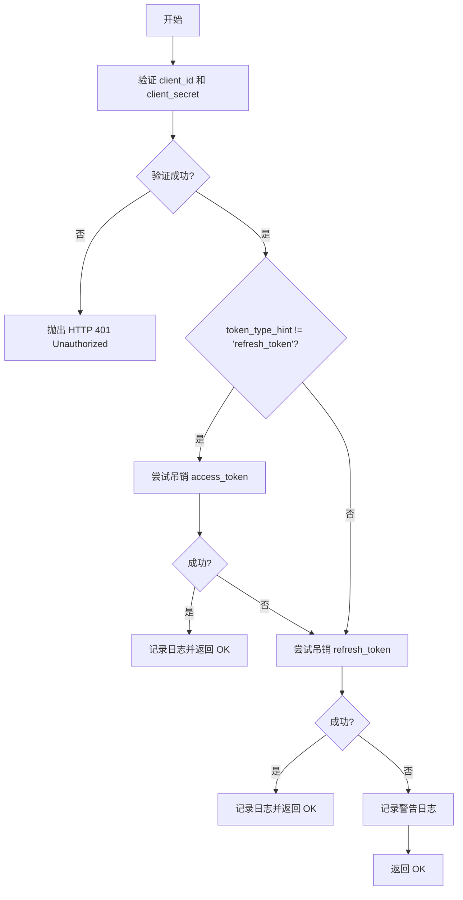

#### 带注释源码

```python
@router.post("/revoke")
async def revoke(
    token: str = Body(description="Token to revoke"),
    token_type_hint: Optional[Literal["access_token", "refresh_token"]] = Body(
        None, description="Hint about token type ('access_token' or 'refresh_token')"
    ),
    client_id: str = Body(description="Client identifier"),
    client_secret: str = Body(description="Client secret"),
):
    """
    OAuth 2.0 Token Revocation Endpoint (RFC 7009)

    Allows clients to revoke an access or refresh token.

    Note: Revoking a refresh token does NOT revoke associated access tokens.
    Revoking an access token does NOT revoke the associated refresh token.
    """
    # 验证客户端凭证
    try:
        app = await validate_client_credentials(client_id, client_secret)
    except InvalidClientError as e:
        raise HTTPException(
            status_code=status.HTTP_401_UNAUTHORIZED,
            detail=str(e),
        )

    # 优先尝试作为 access token 吊销
    if token_type_hint != "refresh_token":
        revoked = await revoke_access_token(token, app.id)
        if revoked:
            logger.info(
                f"Access token revoked for app {app.name} (#{app.id}); "
                f"user #{revoked.user_id}"
            )
            return {"status": "ok"}

    # 尝试作为 refresh token 吊销
    revoked = await revoke_refresh_token(token, app.id)
    if revoked:
        logger.info(
            f"Refresh token revoked for app {app.name} (#{app.id}); "
            f"user #{revoked.user_id}"
        )
        return {"status": "ok"}

    # 根据 RFC 7009，即使令牌未找到或属于其他应用，也返回 200，防止令牌扫描攻击
    logger.warning(f"Unsuccessful token revocation attempt by app {app.name} #{app.id}")
    return {"status": "ok"}
```


### `list_my_oauth_apps`

列出当前用户拥有的所有 OAuth 应用程序。

参数：

-   `user_id`：`str`，当前登录用户的 ID（通过 Security 依赖注入）

返回值：`list[OAuthApplicationInfo]`，OAuth 应用程序信息列表（不包含 client_secret）。

#### 流程图

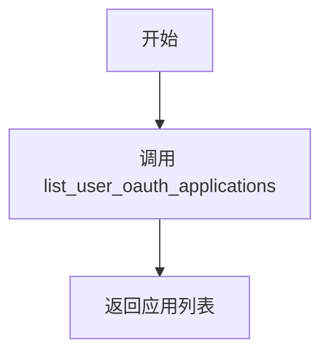

#### 带注释源码

```python
@router.get("/apps/mine")
async def list_my_oauth_apps(
    user_id: str = Security(get_user_id),
) -> list[OAuthApplicationInfo]:
    """
    List all OAuth applications owned by the current user.

    Returns a list of OAuth applications with their details including:
    - id, name, description, logo_url
    - client_id (public identifier)
    - redirect_uris, grant_types, scopes
    - is_active status
    - created_at, updated_at timestamps

    Note: client_secret is never returned for security reasons.
    """
    return await list_user_oauth_applications(user_id)
```


### `update_app_status`

启用或禁用 OAuth 应用程序。

参数：

-   `app_id`：`str`，应用程序 ID
-   `user_id`：`str`，当前登录用户的 ID（通过 Security 依赖注入）
-   `is_active`：`bool`，目标状态（启用或禁用）

返回值：`OAuthApplicationInfo`，更新后的应用程序信息。

#### 流程图

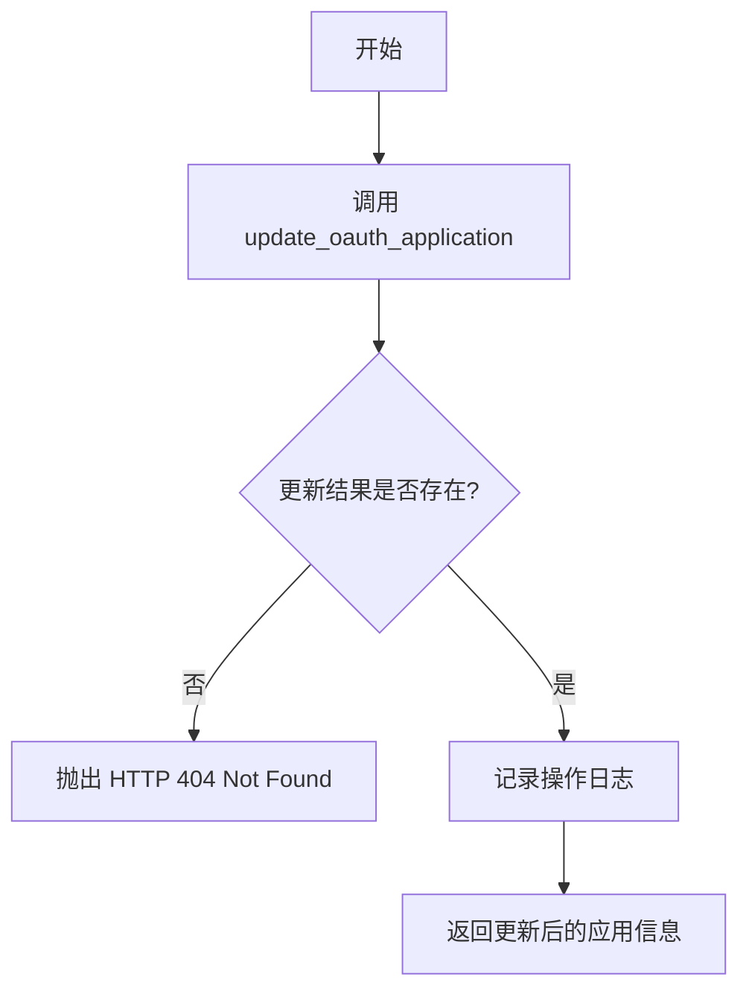

#### 带注释源码

```python
@router.patch("/apps/{app_id}/status")
async def update_app_status(
    app_id: str,
    user_id: str = Security(get_user_id),
    is_active: bool = Body(description="Whether the app should be active", embed=True),
) -> OAuthApplicationInfo:
    """
    Enable or disable an OAuth application.

    Only the application owner can update the status.
    When disabled, the application cannot be used for new authorizations
    and existing access tokens will fail validation.

    Returns the updated application info.
    """
    updated_app = await update_oauth_application(
        app_id=app_id,
        owner_id=user_id,
        is_active=is_active,
    )

    if not updated_app:
        raise HTTPException(
            status_code=status.HTTP_404_NOT_FOUND,
            detail="Application not found or you don't have permission to update it",
        )

    action = "enabled" if is_active else "disabled"
    logger.info(f"OAuth app {updated_app.name} (#{app_id}) {action} by user #{user_id}")

    return updated_app
```


### `update_app_logo`

更新 OAuth 应用程序的 Logo URL。

参数：

-   `app_id`：`str`，应用程序 ID
-   `request`：`UpdateAppLogoRequest`，包含新的 Logo URL
-   `user_id`：`str`，当前登录用户的 ID（通过 Security 依赖注入）

返回值：`OAuthApplicationInfo`，更新后的应用程序信息。

#### 流程图

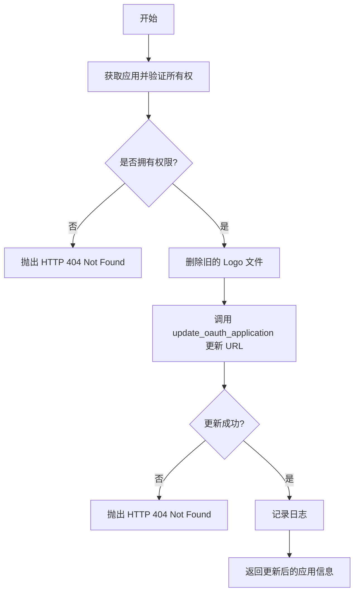

#### 带注释源码

```python
@router.patch("/apps/{app_id}/logo")
async def update_app_logo(
    app_id: str,
    request: UpdateAppLogoRequest = Body(),
    user_id: str = Security(get_user_id),
) -> OAuthApplicationInfo:
    """
    Update the logo URL for an OAuth application.

    Only the application owner can update the logo.
    The logo should be uploaded first using the media upload endpoint,
    then this endpoint is called with the resulting URL.

    Logo requirements:
    - Must be square (1:1 aspect ratio)
    - Minimum 512x512 pixels
    - Maximum 2048x2048 pixels

    Returns the updated application info.
    """
    # 验证所有权
    if (
        not (app := await get_oauth_application_by_id(app_id))
        or app.owner_id != user_id
    ):
        raise HTTPException(
            status_code=status.HTTP_404_NOT_FOUND,
            detail="OAuth App not found",
        )

    # 删除旧的 logo 文件（如果存在且在云存储中）
    await _delete_app_current_logo_file(app)

    updated_app = await update_oauth_application(
        app_id=app_id,
        owner_id=user_id,
        logo_url=request.logo_url,
    )

    if not updated_app:
        raise HTTPException(
            status_code=status.HTTP_404_NOT_FOUND,
            detail="Application not found or you don't have permission to update it",
        )

    logger.info(
        f"OAuth app {updated_app.name} (#{app_id}) logo updated by user #{user_id}"
    )

    return updated_app
```


### `upload_app_logo`

上传并设置 OAuth 应用程序的 Logo 图片。包含文件格式、大小、尺寸验证及病毒扫描。

参数：

-   `app_id`：`str`，应用程序 ID
-   `file`：`UploadFile`，上传的图片文件
-   `user_id`：`str`，当前登录用户的 ID（通过 Security 依赖注入）

返回值：`OAuthApplicationInfo`，更新后的应用程序信息。

#### 流程图

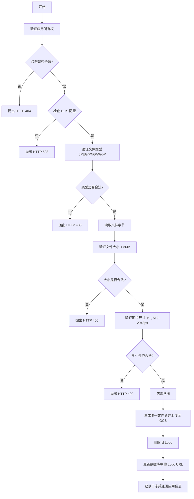

#### 带注释源码

```python
@router.post("/apps/{app_id}/logo/upload")
async def upload_app_logo(
    app_id: str,
    file: UploadFile,
    user_id: str = Security(get_user_id),
) -> OAuthApplicationInfo:
    """
    Upload a logo image for an OAuth application.

    Requirements:
    - Image must be square (1:1 aspect ratio)
    - Minimum 512x512 pixels
    - Maximum 2048x2048 pixels
    - Allowed formats: JPEG, PNG, WebP
    - Maximum file size: 3MB

    The image is uploaded to cloud storage and the app's logoUrl is updated.
    Returns the updated application info.
    """
    # 验证所有权，防止 DoS 攻击
    if (
        not (app := await get_oauth_application_by_id(app_id))
        or app.owner_id != user_id
    ):
        raise HTTPException(
            status_code=status.HTTP_404_NOT_FOUND,
            detail="OAuth App not found",
        )

    # 检查 GCS 配置
    if not settings.config.media_gcs_bucket_name:
        raise HTTPException(
            status_code=status.HTTP_503_SERVICE_UNAVAILABLE,
            detail="Media storage is not configured",
        )

    # 验证 Content-Type
    content_type = file.content_type
    if content_type not in LOGO_ALLOWED_TYPES:
        raise HTTPException(
            status_code=status.HTTP_400_BAD_REQUEST,
            detail=f"Invalid file type. Allowed: JPEG, PNG, WebP. Got: {content_type}",
        )

    # 读取文件内容
    try:
        file_bytes = await file.read()
    except Exception as e:
        logger.error(f"Error reading logo file: {e}")
        raise HTTPException(
            status_code=status.HTTP_400_BAD_REQUEST,
            detail="Failed to read uploaded file",
        )

    # 检查文件大小
    if len(file_bytes) > LOGO_MAX_FILE_SIZE:
        raise HTTPException(
            status_code=status.HTTP_400_BAD_REQUEST,
            detail=(
                "File too large. "
                f"Maximum size is {LOGO_MAX_FILE_SIZE // 1024 // 1024}MB"
            ),
        )

    # 验证图片尺寸
    try:
        image = Image.open(io.BytesIO(file_bytes))
        width, height = image.size

        if width != height:
            raise HTTPException(
                status_code=status.HTTP_400_BAD_REQUEST,
                detail=f"Logo must be square. Got {width}x{height}",
            )

        if width < LOGO_MIN_SIZE:
            raise HTTPException(
                status_code=status.HTTP_400_BAD_REQUEST,
                detail=f"Logo too small. Minimum {LOGO_MIN_SIZE}x{LOGO_MIN_SIZE}. "
                f"Got {width}x{height}",
            )

        if width > LOGO_MAX_SIZE:
            raise HTTPException(
                status_code=status.HTTP_400_BAD_REQUEST,
                detail=f"Logo too large. Maximum {LOGO_MAX_SIZE}x{LOGO_MAX_SIZE}. "
                f"Got {width}x{height}",
            )
    except HTTPException:
        raise
    except Exception as e:
        logger.error(f"Error validating logo image: {e}")
        raise HTTPException(
            status_code=status.HTTP_400_BAD_REQUEST,
            detail="Invalid image file",
        )

    # 病毒扫描
    filename = file.filename or "logo"
    await scan_content_safe(file_bytes, filename=filename)

    # 生成唯一文件名
    file_ext = os.path.splitext(filename)[1].lower() or ".png"
    unique_filename = f"{uuid.uuid4()}{file_ext}"
    storage_path = f"oauth-apps/{app_id}/logo/{unique_filename}"

    # 上传到 GCS
    try:
        async with async_storage.Storage() as async_client:
            bucket_name = settings.config.media_gcs_bucket_name

            await async_client.upload(
                bucket_name, storage_path, file_bytes, content_type=content_type
            )

            logo_url = f"https://storage.googleapis.com/{bucket_name}/{storage_path}"
    except Exception as e:
        logger.error(f"Error uploading logo to GCS: {e}")
        raise HTTPException(
            status_code=status.HTTP_500_INTERNAL_SERVER_ERROR,
            detail="Failed to upload logo",
        )

    # 删除旧 Logo
    await _delete_app_current_logo_file(app)

    # 更新应用信息
    updated_app = await update_oauth_application(
        app_id=app_id,
        owner_id=user_id,
        logo_url=logo_url,
    )

    if not updated_app:
        raise HTTPException(
            status_code=status.HTTP_404_NOT_FOUND,
            detail="Application not found or you don't have permission to update it",
        )

    logger.info(
        f"OAuth app {updated_app.name} (#{app_id}) logo uploaded by user #{user_id}"
    )

    return updated_app
```


### `introspect`

OAuth 2.0 令牌内省端点 (RFC 7662)。允许客户端检查令牌是否有效并获取其元数据。

参数：

-   `token`：`str`，要内省的令牌
-   `token_type_hint`：`Optional[Literal["access_token", "refresh_token"]]`，关于令牌类型的提示（'access_token' 或 'refresh_token'）
-   `client_id`：`str`，客户端标识符
-   `client_secret`：`str`，客户端密钥

返回值：`TokenIntrospectionResult`，返回包含令牌有效性、权限范围、客户端ID、用户ID、过期时间和令牌类型的结果对象。

#### 流程图

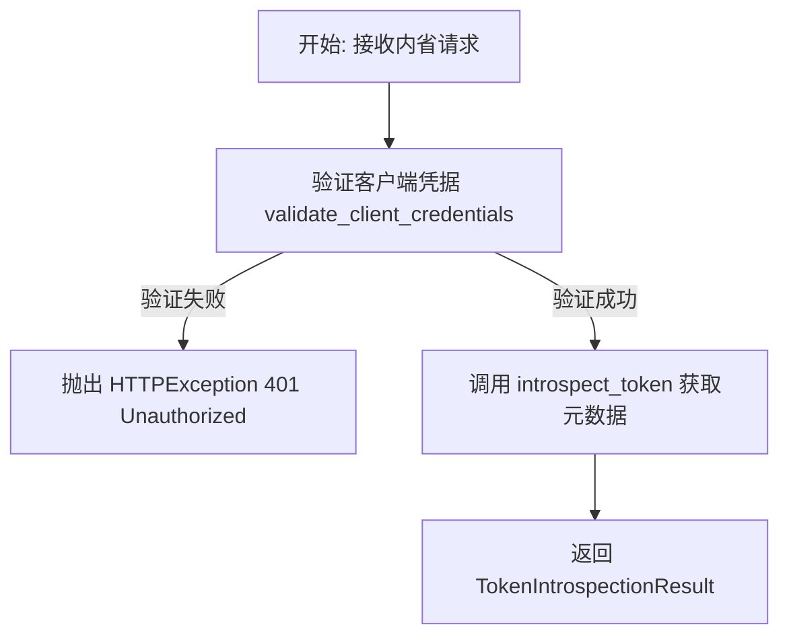

#### 带注释源码

```python
@router.post("/introspect")
async def introspect(
    token: str = Body(description="Token to introspect"),
    token_type_hint: Optional[Literal["access_token", "refresh_token"]] = Body(
        None, description="Hint about token type ('access_token' or 'refresh_token')"
    ),
    client_id: str = Body(description="Client identifier"),
    client_secret: str = Body(description="Client secret"),
) -> TokenIntrospectionResult:
    """
    OAuth 2.0 Token Introspection Endpoint (RFC 7662)

    Allows clients to check if a token is valid and get its metadata.

    Returns:
    - active: Whether the token is currently active
    - scopes: List of authorized scopes (if active)
    - client_id: The client the token was issued to (if active)
    - user_id: The user the token represents (if active)
    - exp: Expiration timestamp (if active)
    - token_type: "access_token" or "refresh_token" (if active)
    """
    # 验证客户端凭据，确保请求来自合法的注册应用
    try:
        await validate_client_credentials(client_id, client_secret)
    except InvalidClientError as e:
        # 如果客户端ID或密钥无效，返回 401 未授权错误
        raise HTTPException(
            status_code=status.HTTP_401_UNAUTHORIZED,
            detail=str(e),
        )

    # 调用底层服务进行令牌内省，返回令牌的当前状态和元数据
    return await introspect_token(token, token_type_hint)
```


### `revoke`

OAuth 2.0 Token Revocation Endpoint (RFC 7009)。允许客户端撤销访问令牌或刷新令牌。根据 RFC 7009 规范，无论令牌是否存在或是否成功撤销，端点都返回 200 OK 状态，以防止令牌扫描攻击。

参数：

- `token`：`str`，要撤销的令牌字符串
- `token_type_hint`：`Optional[Literal["access_token", "refresh_token"]]`，令牌类型的提示（"access_token" 或 "refresh_token"），用于优化查找过程
- `client_id`：`str`，客户端标识符
- `client_secret`：`str`，客户端密钥

返回值：`dict`，包含操作状态的字典，固定为 `{"status": "ok"}`

#### 流程图

```mermaid
flowchart TD
    A[开始] --> B[验证 Client ID 和 Client Secret]
    B -->|验证失败| C[抛出 HTTPException 401]
    B -->|验证成功| D{token_type_hint<br>是否为 'refresh_token'?}
    
    D -->|否 (提示为 access 或无提示)| E[尝试撤销访问令牌<br>revoke_access_token]
    E -->|撤销成功| F[记录成功日志]
    F --> G[返回 {"status": "ok"}]
    
    E -->|撤销失败| H[尝试撤销刷新令牌<br>revoke_refresh_token]
    D -->|是 (提示为 refresh_token)| H
    
    H -->|撤销成功| I[记录成功日志]
    I --> G
    
    H -->|撤销失败| J[记录警告日志<br>防止令牌扫描]
    J --> G
    
    G --> K[结束]
```

#### 带注释源码

```python
@router.post("/revoke")
async def revoke(
    token: str = Body(description="Token to revoke"),
    token_type_hint: Optional[Literal["access_token", "refresh_token"]] = Body(
        None, description="Hint about token type ('access_token' or 'refresh_token')"
    ),
    client_id: str = Body(description="Client identifier"),
    client_secret: str = Body(description="Client secret"),
):
    """
    OAuth 2.0 Token Revocation Endpoint (RFC 7009)

    Allows clients to revoke an access or refresh token.

    Note: Revoking a refresh token does NOT revoke associated access tokens.
    Revoking an access token does NOT revoke the associated refresh token.
    """
    # 1. 验证客户端凭据 (client_id 和 client_secret)
    try:
        app = await validate_client_credentials(client_id, client_secret)
    except InvalidClientError as e:
        # 如果凭据无效，返回 401 未授权
        raise HTTPException(
            status_code=status.HTTP_401_UNAUTHORIZED,
            detail=str(e),
        )

    # 2. 如果提示不是 "refresh_token"，首先尝试作为访问令牌撤销
    # 注意：我们传入 app.id 以确保令牌属于经过身份验证的应用程序
    if token_type_hint != "refresh_token":
        revoked = await revoke_access_token(token, app.id)
        if revoked:
            # 撤销成功，记录日志并返回 OK
            logger.info(
                f"Access token revoked for app {app.name} (#{app.id}); "
                f"user #{revoked.user_id}"
            )
            return {"status": "ok"}

    # 3. 尝试作为刷新令牌撤销
    # 如果上一步作为访问令牌撤销失败，或者提示明确是 refresh_token
    revoked = await revoke_refresh_token(token, app.id)
    if revoked:
        # 撤销成功，记录日志并返回 OK
        logger.info(
            f"Refresh token revoked for app {app.name} (#{app.id}); "
            f"user #{revoked.user_id}"
        )
        return {"status": "ok"}

    # 4. 处理撤销未成功的情况（如令牌不存在或属于其他应用）
    # 根据 RFC 7009，即使找不到令牌或令牌属于不同的应用程序，
    # 撤销端点也返回 200 状态码。
    # 这是为了防止令牌扫描攻击（即攻击者通过此端点探测令牌是否有效）。
    logger.warning(f"Unsuccessful token revocation attempt by app {app.name} #{app.id}")
    return {"status": "ok"}
```


### `list_my_oauth_apps`

列出当前用户拥有的所有 OAuth 应用程序。

参数：

-   `user_id`：`str`，从认证上下文中提取的用户 ID（通过 `Security(get_user_id)` 依赖注入）。

返回值：`list[OAuthApplicationInfo]`，包含用户拥有的 OAuth 应用程序信息列表，每个应用包含 ID、名称、描述、Logo URL、Client ID、重定向 URI、权限范围、激活状态及时间戳等详细信息。

#### 流程图

```mermaid
flowchart TD
    Start([开始]) --> GetUserID[通过 Security get_user_id 获取 user_id]
    GetUserID --> ValidateUser{用户是否有效?}
    ValidateUser -- 否 --> Unauthorized[返回 401 Unauthorized]
    ValidateUser -- 是 --> CallService[调用 list_user_oauth_applications]
    CallService --> FetchDB[从数据库获取应用列表]
    FetchDB --> ReturnList[返回 list[OAuthApplicationInfo]]
    ReturnList --> End([结束])
```

#### 带注释源码

```python
@router.get("/apps/mine")
async def list_my_oauth_apps(
    user_id: str = Security(get_user_id),  # 使用 Security 依赖注入获取当前已认证用户的 ID
) -> list[OAuthApplicationInfo]:
    """
    List all OAuth applications owned by the current user.

    Returns a list of OAuth applications with their details including:
    - id, name, description, logo_url
    - client_id (public identifier)
    - redirect_uris, grant_types, scopes
    - is_active status
    - created_at, updated_at timestamps

    Note: client_secret is never returned for security reasons.
    """
    # 调用底层服务函数，根据 user_id 获取该用户所有的 OAuth 应用列表
    return await list_user_oauth_applications(user_id)
```


### `update_app_status`

启用或禁用 OAuth 应用程序。仅应用程序所有者可以更新状态。当应用程序被禁用时，它将无法用于新的授权，并且现有的访问令牌将无法通过验证。返回更新后的应用程序信息。

参数：

- `app_id`：`str`，要更新的应用程序的 ID（路径参数）。
- `user_id`：`str`，发起请求的用户 ID（当前登录用户），用于权限验证。
- `is_active`：`bool`，应用程序是否应处于激活状态（请求体参数）。

返回值：`OAuthApplicationInfo`，更新后的应用程序信息对象。

#### 流程图

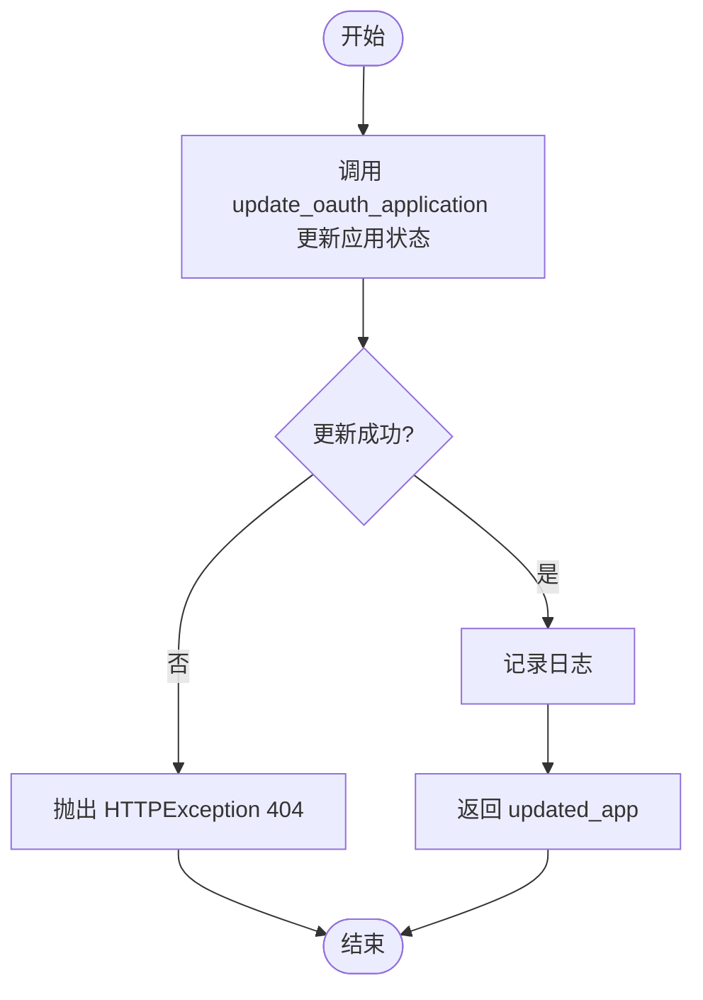

#### 带注释源码

```python
@router.patch("/apps/{app_id}/status")
async def update_app_status(
    app_id: str,
    user_id: str = Security(get_user_id),
    is_active: bool = Body(description="Whether the app should be active", embed=True),
) -> OAuthApplicationInfo:
    """
    Enable or disable an OAuth application.

    Only the application owner can update the status.
    When disabled, the application cannot be used for new authorizations
    and existing access tokens will fail validation.

    Returns the updated application info.
    """
    # 调用底层服务更新应用状态，传入 app_id, owner_id (user_id) 和新的 is_active 状态
    updated_app = await update_oauth_application(
        app_id=app_id,
        owner_id=user_id,
        is_active=is_active,
    )

    # 如果 updated_app 为空，说明应用不存在或用户无权修改（非所有者）
    if not updated_app:
        raise HTTPException(
            status_code=status.HTTP_404_NOT_FOUND,
            detail="Application not found or you don't have permission to update it",
        )

    # 根据状态生成动作描述
    action = "enabled" if is_active else "disabled"
    
    # 记录操作日志，包含应用名称、ID、执行动作和操作用户 ID
    logger.info(f"OAuth app {updated_app.name} (#{app_id}) {action} by user #{user_id}")

    # 返回更新后的应用信息对象
    return updated_app
```


### `update_app_logo`

更新指定 OAuth 应用的 Logo URL。该接口首先验证应用是否存在以及当前用户是否拥有该应用的所有权，随后尝试删除存储在云端的旧 Logo 文件，最后将新的 Logo URL 更新到数据库中。

参数：

-  `app_id`：`str`，OAuth 应用的唯一标识符。
-  `request`：`UpdateAppLogoRequest`，请求体对象，包含新的 Logo URL 字段 (`logo_url`)。
-  `user_id`：`str`，当前登录用户的 ID，用于权限验证。

返回值：`OAuthApplicationInfo`，更新后的 OAuth 应用信息对象。

#### 流程图

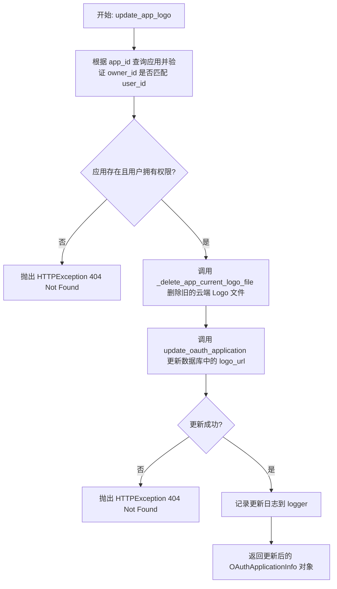

#### 带注释源码

```python
@router.patch("/apps/{app_id}/logo")
async def update_app_logo(
    app_id: str,
    request: UpdateAppLogoRequest = Body(),
    user_id: str = Security(get_user_id),
) -> OAuthApplicationInfo:
    """
    Update the logo URL for an OAuth application.

    Only the application owner can update the logo.
    The logo should be uploaded first using the media upload endpoint,
    then this endpoint is called with the resulting URL.

    Logo requirements:
    - Must be square (1:1 aspect ratio)
    - Minimum 512x512 pixels
    - Maximum 2048x2048 pixels

    Returns the updated application info.
    """
    # 验证应用是否存在以及当前用户是否为应用所有者
    if (
        not (app := await get_oauth_application_by_id(app_id))
        or app.owner_id != user_id
    ):
        raise HTTPException(
            status_code=status.HTTP_404_NOT_FOUND,
            detail="OAuth App not found",
        )

    # 删除当前应用的旧 Logo 文件（如果存在且存储在配置的云存储中）
    await _delete_app_current_logo_file(app)

    # 更新数据库中的应用记录，设置新的 Logo URL
    updated_app = await update_oauth_application(
        app_id=app_id,
        owner_id=user_id,
        logo_url=request.logo_url,
    )

    # 检查更新是否成功
    if not updated_app:
        raise HTTPException(
            status_code=status.HTTP_404_NOT_FOUND,
            detail="Application not found or you don't have permission to update it",
        )

    # 记录操作日志
    logger.info(
        f"OAuth app {updated_app.name} (#{app_id}) logo updated by user #{user_id}"
    )

    return updated_app
```


### `upload_app_logo`

为 OAuth 应用上传 Logo 图片。该函数会验证应用所有权、文件格式、尺寸及安全性，将图片上传至 Google Cloud Storage，并更新应用的 Logo URL。

参数：

-  `app_id`：`str`，OAuth 应用的唯一标识符。
-  `file`：`UploadFile`，用户上传的 Logo 图片文件对象。
-  `user_id`：`str`，当前登录用户的 ID，用于验证权限。

返回值：`OAuthApplicationInfo`，包含更新后 Logo URL 的 OAuth 应用详细信息。

#### 流程图

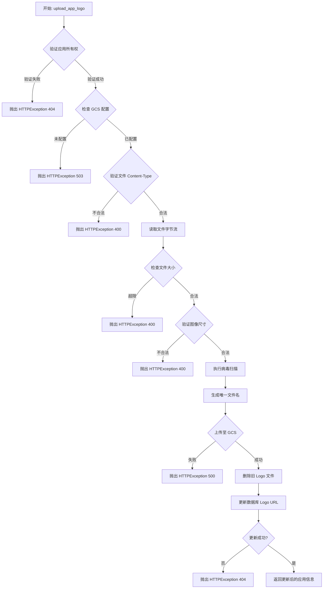

#### 带注释源码

```python
@router.post("/apps/{app_id}/logo/upload")
async def upload_app_logo(
    app_id: str,
    file: UploadFile,
    user_id: str = Security(get_user_id),
) -> OAuthApplicationInfo:
    """
    Upload a logo image for an OAuth application.

    Requirements:
    - Image must be square (1:1 aspect ratio)
    - Minimum 512x512 pixels
    - Maximum 2048x2048 pixels
    - Allowed formats: JPEG, PNG, WebP
    - Maximum file size: 3MB

    The image is uploaded to cloud storage and the app's logoUrl is updated.
    Returns the updated application info.
    """
    # 验证应用所有权，防止未授权访问或存储攻击
    if (
        not (app := await get_oauth_application_by_id(app_id))
        or app.owner_id != user_id
    ):
        raise HTTPException(
            status_code=status.HTTP_404_NOT_FOUND,
            detail="OAuth App not found",
        )

    # 检查 Google Cloud Storage (GCS) 配置是否存在
    if not settings.config.media_gcs_bucket_name:
        raise HTTPException(
            status_code=status.HTTP_503_SERVICE_UNAVAILABLE,
            detail="Media storage is not configured",
        )

    # 验证文件类型
    content_type = file.content_type
    if content_type not in LOGO_ALLOWED_TYPES:
        raise HTTPException(
            status_code=status.HTTP_400_BAD_REQUEST,
            detail=f"Invalid file type. Allowed: JPEG, PNG, WebP. Got: {content_type}",
        )

    # 读取文件内容
    try:
        file_bytes = await file.read()
    except Exception as e:
        logger.error(f"Error reading logo file: {e}")
        raise HTTPException(
            status_code=status.HTTP_400_BAD_REQUEST,
            detail="Failed to read uploaded file",
        )

    # 检查文件大小限制 (3MB)
    if len(file_bytes) > LOGO_MAX_FILE_SIZE:
        raise HTTPException(
            status_code=status.HTTP_400_BAD_REQUEST,
            detail=(
                "File too large. "
                f"Maximum size is {LOGO_MAX_FILE_SIZE // 1024 // 1024}MB"
            ),
        )

    # 验证图像尺寸 (正方形, 512x512 ~ 2048x2048)
    try:
        image = Image.open(io.BytesIO(file_bytes))
        width, height = image.size

        if width != height:
            raise HTTPException(
                status_code=status.HTTP_400_BAD_REQUEST,
                detail=f"Logo must be square. Got {width}x{height}",
            )

        if width < LOGO_MIN_SIZE:
            raise HTTPException(
                status_code=status.HTTP_400_BAD_REQUEST,
                detail=f"Logo too small. Minimum {LOGO_MIN_SIZE}x{LOGO_MIN_SIZE}. "
                f"Got {width}x{height}",
            )

        if width > LOGO_MAX_SIZE:
            raise HTTPException(
                status_code=status.HTTP_400_BAD_REQUEST,
                detail=f"Logo too large. Maximum {LOGO_MAX_SIZE}x{LOGO_MAX_SIZE}. "
                f"Got {width}x{height}",
            )
    except HTTPException:
        raise
    except Exception as e:
        logger.error(f"Error validating logo image: {e}")
        raise HTTPException(
            status_code=status.HTTP_400_BAD_REQUEST,
            detail="Invalid image file",
        )

    # 安全扫描：检查文件是否包含病毒
    filename = file.filename or "logo"
    await scan_content_safe(file_bytes, filename=filename)

    # 生成唯一的存储文件名
    file_ext = os.path.splitext(filename)[1].lower() or ".png"
    unique_filename = f"{uuid.uuid4()}{file_ext}"
    storage_path = f"oauth-apps/{app_id}/logo/{unique_filename}"

    # 上传文件到 Google Cloud Storage
    try:
        async with async_storage.Storage() as async_client:
            bucket_name = settings.config.media_gcs_bucket_name

            await async_client.upload(
                bucket_name, storage_path, file_bytes, content_type=content_type
            )

            logo_url = f"https://storage.googleapis.com/{bucket_name}/{storage_path}"
    except Exception as e:
        logger.error(f"Error uploading logo to GCS: {e}")
        raise HTTPException(
            status_code=status.HTTP_500_INTERNAL_SERVER_ERROR,
            detail="Failed to upload logo",
        )

    # 删除旧的 Logo 文件（如果存在且位于云存储中）
    await _delete_app_current_logo_file(app)

    # 更新数据库中的应用信息，设置新的 Logo URL
    updated_app = await update_oauth_application(
        app_id=app_id,
        owner_id=user_id,
        logo_url=logo_url,
    )

    if not updated_app:
        raise HTTPException(
            status_code=status.HTTP_404_NOT_FOUND,
            detail="Application not found or you don't have permission to update it",
        )

    logger.info(
        f"OAuth app {updated_app.name} (#{app_id}) logo uploaded by user #{user_id}"
    )

    return updated_app
```


### `_delete_app_current_logo_file`

删除指定 OAuth 应用当前的 Logo 文件。该函数会检查应用的 Logo URL 是否托管在配置的 Google Cloud Storage (GCS) 中，如果是，则从云端存储中删除对应的文件对象，以确保在更新 Logo 时清理旧资源。

参数：

-  `app`：`OAuthApplicationInfo`，包含当前 Logo URL 和应用 ID 的 OAuth 应用信息对象。

返回值：`None`，该函数为异步方法，执行文件删除操作，不返回具体数据。

#### 流程图

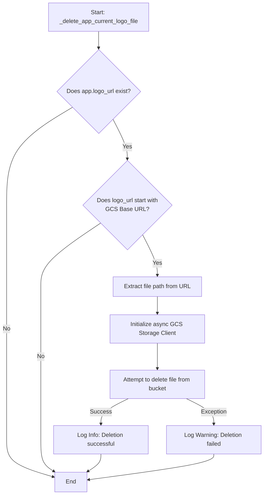

#### 带注释源码

```python
async def _delete_app_current_logo_file(app: OAuthApplicationInfo):
    """
    Delete the current logo file for the given app, if there is one in our cloud storage
    """
    # 从设置中获取 GCS 存储桶名称
    bucket_name = settings.config.media_gcs_bucket_name
    # 构建该存储桶的基础 URL 前缀
    storage_base_url = f"https://storage.googleapis.com/{bucket_name}/"

    # 检查应用是否有 Logo URL，且该 URL 是否属于我们配置的 GCS 存储桶
    # 这样做是为了防止误删外部托管的图片资源
    if app.logo_url and app.logo_url.startswith(storage_base_url):
        # 从完整的 URL 中解析出 GCS 对象路径 (Blob Name)
        # 例如: https://storage.googleapis.com/bucket/path/to/file.png -> path/to/file.png
        old_path = app.logo_url.replace(storage_base_url, "")
        try:
            # 创建异步 GCS 存储客户端
            async with async_storage.Storage() as async_client:
                # 调用删除接口移除旧文件
                await async_client.delete(bucket_name, old_path)
            # 记录成功删除的日志
            logger.info(f"Deleted old logo for OAuth app #{app.id}: {old_path}")
        except Exception as e:
            # 捕获异常并记录警告，但不抛出错误
            # 这是因为这是清理操作，即使删除失败（例如文件已不存在），也不应阻碍主业务流程（如更新新 Logo）
            logger.warning(
                f"Failed to delete old logo for OAuth app #{app.id}: {e}", exc_info=e
            )
```


## 关键组件


### OAuth 2.0 授权码流程
实现OAuth 2.0的核心授权流程，从用户授权、创建授权码到交换访问令牌，并集成了PKCE安全机制。

### PKCE (Proof Key for Code Exchange) 支持
在授权请求中强制要求 `code_challenge`，并在令牌交换时验证 `code_verifier`，以增强授权码交换的安全性，防止授权码拦截攻击。

### 令牌管理
负责访问令牌和刷新令牌的创建、刷新、撤销以及内省检查，管理令牌的生命周期及元数据查询。

### 应用注册与管理
提供OAuth应用的查询、列表展示、状态启用/禁用功能，并包含Logo上传、图片格式验证及云存储集成。

### 安全验证与扫描
对客户端凭证、重定向URI、请求作用域进行严格验证，并对上传的Logo文件进行病毒扫描，确保系统安全性。


## 问题及建议

### 已知问题

-   **阻塞事件循环的图像处理**：在 `upload_app_logo` 函数中，使用 `PIL.Image.open` 和文件读取操作直接在异步主事件循环中运行。这些是 CPU 密集型和阻塞型 I/O 操作，会导致并发请求处理能力下降，严重影响上传接口在高并发下的性能。
-   **潜在的存储资源泄露（孤岛文件）**：在 `_delete_app_current_logo_file` 函数中，删除旧 Logo 文件失败时仅记录日志并继续执行。虽然这保证了主流程（上传新 Logo）的可用性，但如果删除操作反复失败，GCS 存储桶中将会积累大量不再被数据库引用的“孤儿”文件，导致持续产生不必要的存储费用。
-   **硬编码的配置项**：Logo 上传的约束条件（如 `LOGO_MIN_SIZE`, `LOGO_MAX_SIZE`, `LOGO_MAX_FILE_SIZE`）直接硬编码在模块级别，而不是集中在 `Settings` 或配置文件中。这降低了系统的灵活性，调整这些限制需要修改代码并重新部署。
-   **脆弱的 URL 构造逻辑**：代码中通过字符串拼接手动构造 GCS 访问 URL（`f"https://storage.googleapis.com/..."`）。如果未来更换云存储提供商（如 AWS S3, Azure Blob）或更换 CDN 域名，需要修改多处代码，违反了 DRY 原则且容易出错。

### 优化建议

-   **异步化 CPU 密集型任务**：建议使用 `loop.run_in_executor` 将 `Image.open` 进行图片尺寸验证和病毒扫描 (`scan_content_safe`) 等阻塞操作提交到线程池中执行，释放主事件循环以处理其他 I/O 请求，显著提升接口吞吐量。
-   **引入应用元数据缓存**：`get_oauth_application` 在授权 (`/authorize`)、令牌获取 (`/token`) 等高频路径中被反复调用查询数据库。建议引入 Redis 等缓存层缓存应用的基本信息（Client ID, Redirect URIs, Scopes 等），并设置合理的 TTL，以大幅降低数据库负载。
-   **实施频率限制**：OAuth 端点（尤其是 `/token` 和 `/authorize`）是攻击者的常见目标。建议实现 IP 级别或 Client ID 级别的速率限制，防止暴力破解攻击或 DoS 攻击。
-   **增加后台清理任务**：除了实时删除外，建议开发一个定期的后台维护任务（Cron Job），扫描 GCS 存储桶中的文件并与数据库记录进行比对，自动清理长期存在的孤儿文件，确保存储成本可控。
-   **集中化配置管理**：将 Logo 的尺寸限制、文件大小限制、允许的 MIME 类型等业务配置参数迁移到 `Settings` 类或数据库配置表中，以便运维人员可以在不重启服务的情况下动态调整这些限制。

## 其它


### 设计目标与约束

**设计目标：**
1. **OAuth 2.0 标准合规性**：实现符合 RFC 6749 (OAuth 2.0)、RFC 7636 (PKCE)、RFC 7662 (Token Introspection) 和 RFC 7009 (Token Revocation) 标准的授权服务器。
2. **安全性**：强制要求所有授权请求使用 PKCE (Proof Key for Code Exchange) 以防止授权码拦截攻击。确保敏感操作（如 Token 交换）需要 Client Secret 进行客户端认证。
3. **用户体验与管理**：提供 OAuth 应用的管理功能，包括 Logo 上传、状态启用/禁用，并允许用户查看自己拥有的应用。
4. **模块化**：核心逻辑委托给 `backend.data.auth.oauth` 模块，路由层仅处理 HTTP 请求/响应转换和验证。

**约束：**
1. **PKCE 强制要求**：`/authorize` 端点强制要求 `code_challenge` 和 `code_challenge_method` 参数。
2. **Logo 上传限制**：Logo 图片必须是正方形 (1:1)，尺寸在 512x512 到 2048x2048 像素之间，格式仅限 JPEG/PNG/WebP，大小不超过 3MB。
3. **存储依赖**：Logo 上传功能强依赖于 Google Cloud Storage (GCS) 的配置 (`media_gcs_bucket_name`)。
4. **重定向 URI 安全性**：如果提供的 `redirect_uri` 不合法或无效，`/authorize` 端点必须返回 HTTP 错误而不是重定向，以防止开放重定向漏洞。

### 错误处理与异常设计

1. **OAuth 2.0 错误响应（重定向场景）**：
   - 在 `/authorize` 端点，当发生 `unsupported_response_type`、`invalid_client`、`invalid_scope` 或 `server_error` 时，系统不会直接抛出 HTTPException，而是生成包含 `error` 和 `error_description` 参数的重定向 URL。
   - **特例**：如果 `redirect_uri` 本身无效（不匹配注册列表），为了防止攻击者利用任意 URL 进行钓鱼，系统直接抛出 `400 Bad Request` HTTPException，不进行重定向。

2. **API 错误响应（Token 与管理端点）**：
   - 对于 `/token`、`/introspect`、`/revoke` 等端点，错误通过标准的 HTTP 状态码和 JSON 响应返回。
   - 客户端认证失败（`InvalidClientError`）返回 `401 Unauthorized`。
   - 授权码无效或过期（`InvalidGrantError`）返回 `400 Bad Request`。
   - 资源未找到或无权限操作返回 `404 Not Found`。

3. **安全侧通道控制**：
   - `/revoke` 端点遵循 RFC 7009 建议，即使提供的 Token 无效或不属于该客户端，也返回 `200 OK` 状态码。这是为了防止恶意客户端通过枚举响应状态来验证 Token 的有效性。

4. **日志记录**：
   - 所有关键操作（颁发授权码、颁发 Token、刷新 Token、撤销 Token、更新应用状态、上传 Logo）均有详细的 `info` 或 `warning` 级别日志记录，包含操作者和操作对象的 ID。
   - 未预期的异常会被捕获并记录 `error` 级别日志，同时返回用户友好的 `server_error` 响应。

### 数据流与状态机

**1. OAuth 授权码模式数据流：**
   - **状态 A (初始化)**：用户在第三方 App 点击登录，携带 `client_id`, `redirect_uri`, `state` 等参数。
   - **状态 B (认证)**：后端验证用户身份（`get_user_id`）。
   - **状态 C (授权)**：后端验证 App 合法性、Scope 权限。用户同意后，后端生成 `authorization_code`（绑定 PKCE challenge）。
   - **状态 D (回调)**：浏览器重定向至 `redirect_uri?code=...&state=...`。
   - **状态 E (Token 交换)**：第三方 App 后端使用 `code` 和 `code_verifier` 换取 `access_token` 和 `refresh_token`。授权码在此步被消费（失效）。
   - **状态 F (API 访问)**：第三方 App 使用 `access_token` 访问受保护资源。

**2. Token 状态机：**
   - **Access Token**：`Active` (创建后) -> `Expired` (TTL 到期，默认1小时) 或 `Revoked` (主动撤销)。
   - **Refresh Token**：`Active` -> `Expired` (TTL 到期，默认30天) 或 `Revoked` (主动撤销或刷新后旧 Token 失效)。*注意：刷新 Token 会颁发新的 Refresh Token，旧 Token 随即失效。*

**3. Logo 上传处理流：**
   - **Input**：`UploadFile` -> **Validate** (检查 Content-Type, 文件大小) -> **Transform** (PIL 打开检查尺寸/比例) -> **Security** (病毒扫描) -> **Storage** (上传至 GCS) -> **Update DB** (更新数据库中的 Logo URL) -> **Cleanup** (删除 GCS 中的旧 Logo)。

### 外部依赖与接口契约

1. **`autogpt_libs.auth`**：
   - **函数**：`get_user_id`
   - **契约**：从请求上下文中提取当前经过 Supabase JWT 认证的用户 ID。依赖 FastAPI 的 Security 依赖注入机制。

2. **`backend.data.auth.oauth`**：
   - **模块**：核心业务逻辑层。
   - **关键函数契约**：
     - `get_oauth_application(client_id)`: 返回应用信息或 None。
     - `validate_client_credentials(client_id, client_secret)`: 验证通过返回应用对象，失败抛出 `InvalidClientError`。
     - `create_authorization_code(...)`: 返回包含 code 字符串的对象。
     - `consume_authorization_code(...)`: 返回 `(user_id, scopes)`，失败抛出 `InvalidGrantError`。
     - `create_access_token`, `create_refresh_token`: 返回包含 Token 字符串和过期时间的对象。

3. **`gcloud.aio.storage`**：
   - **契约**：用于异步上传和删除二进制文件到 Google Cloud Storage。
   - **配置**：依赖 `Settings().config.media_gcs_bucket_name` 提供的 Bucket 名称。

4. **`backend.util.virus_scanner`**：
   - **函数**：`scan_content_safe(bytes, filename)`
   - **契约**：扫描文件内容，如果发现病毒则抛出异常（具体异常类型未在代码中显示，但流程中假设抛出异常会导致上传失败）。

5. **数据库**：
   - **Prisma ORM**：通过 `backend.data.auth.oauth` 间接使用。依赖枚举类型 `prisma.enums.APIKeyPermission` 来定义和处理 Scope。

    