# `AutoGPT\autogpt_platform\backend\backend\api\features\oauth_test.py` 详细设计文档

该文件包含针对 OAuth 2.0 提供者端点的端到端集成测试，涵盖了从授权码创建、令牌交换（授权码模式和刷新令牌模式）、令牌内省、令牌撤销到完整流程验证的全过程，利用真实的 API 调用和数据库操作验证了系统的正确性和安全性。

## 整体流程

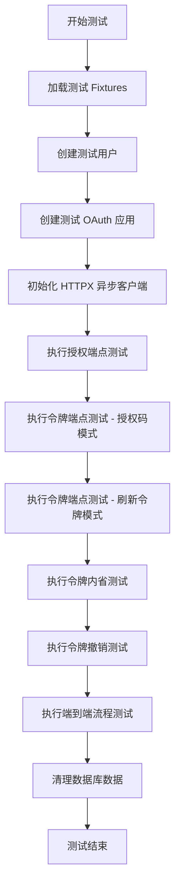

## 类结构

```
OAuth 2.0 Integration Tests (Root)
├── Helper Functions
│   └── generate_pkce
├── Pytest Fixtures
│   ├── test_user_id
│   ├── test_user
│   ├── test_oauth_app
│   ├── pkce_credentials
│   ├── client
│   ├── inactive_oauth_app
│   └── other_oauth_app
├── Authorization Endpoint Tests
│   ├── test_authorize_creates_code_in_database
│   ├── test_authorize_with_pkce_stores_challenge
│   ├── test_authorize_invalid_client_returns_error
│   ├── test_authorize_inactive_app
│   ├── test_authorize_invalid_redirect_uri
│   ├── test_authorize_invalid_scope
│   ├── test_authorize_unauthorized_scope
│   └── test_authorize_unsupported_response_type
├── Token Endpoint Tests (Auth Code)
│   ├── test_token_exchange_creates_tokens_in_database
│   ├── test_authorization_code_cannot_be_reused
│   ├── test_token_exchange_with_invalid_client_secret
│   ├── test_token_authorization_code_invalid_code
│   ├── test_token_authorization_code_expired
│   ├── test_token_authorization_code_redirect_uri_mismatch
│   └── test_token_authorization_code_pkce_failure
├── Token Endpoint Tests (Refresh Token)
│   ├── test_refresh_token_creates_new_tokens
│   ├── test_token_refresh_invalid_token
│   ├── test_token_refresh_expired
│   ├── test_token_refresh_revoked
│   └── test_token_refresh_wrong_application
├── Introspection Tests
│   ├── test_introspect_valid_access_token
│   ├── test_introspect_invalid_token_returns_inactive
│   ├── test_introspect_active_refresh_token
│   ├── test_introspect_invalid_client
│   └── test_validate_access_token_fails_when_app_disabled
├── Revocation Tests
│   ├── test_revoke_access_token_updates_database
│   ├── test_revoke_unknown_token_returns_ok
│   ├── test_revoke_refresh_token_updates_database
│   ├── test_revoke_invalid_client
│   └── test_revoke_token_from_different_app_fails_silently
└── End-to-End Tests
    └── test_complete_oauth_flow_end_to_end
```

## 全局变量及字段


### `keysmith`
    
Instance of APIKeySmith utility used to hash and verify client secrets for OAuth applications.

类型：`APIKeySmith`
    


    

## 全局函数及方法


### `generate_pkce`

生成一个随机的 PKCE（Proof Key for Code Exchange）代码验证器，并使用 SHA-256 算法计算对应的代码质询，用于增强 OAuth 2.0 授权码模式的安全性。

参数：

-  无参数

返回值：`tuple[str, str]`，返回一个元组，第一个元素是代码验证器，第二个元素是代码质询。

#### 流程图

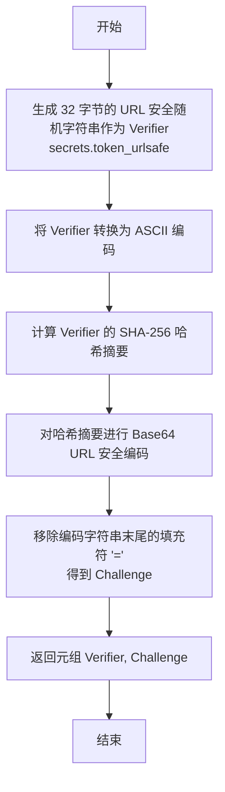

#### 带注释源码

```python
def generate_pkce() -> tuple[str, str]:
    """Generate PKCE code verifier and challenge."""
    # 生成一个加密安全的随机 URL 安全字符串，作为 code_verifier
    verifier = secrets.token_urlsafe(32)
    
    # 根据 PKCE 规范（S256 方法），使用 SHA-256 对 verifier 进行哈希
    # 1. 将 verifier 编码为 ASCII
    # 2. 计算 SHA-256 摘要
    # 3. 将摘要进行 Base64 URL 安全编码
    # 4. 移除 Base64 编码后的填充字符 '='
    challenge = (
        base64.urlsafe_b64encode(hashlib.sha256(verifier.encode("ascii")).digest())
        .decode("ascii")
        .rstrip("=")
    )
    
    # 返回验证器和质询
    return verifier, challenge
```


### `test_user_id`

这是一个 Pytest 测试夹具，其作用域为会话级别（session scope），用于为 OAuth 集成测试生成并提供一个唯一的测试用户 ID 字符串。该 ID 在整个测试会话期间保持一致，用于模拟用户身份并在数据库操作中关联数据。

参数：

-  无参数

返回值：`str`，生成的测试用户唯一标识符（UUID 字符串）。

#### 流程图

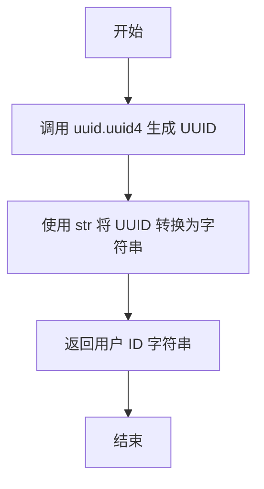

#### 带注释源码

```python
@pytest.fixture(scope="session")
def test_user_id() -> str:
    """
    Test user ID for OAuth tests.
    为 OAuth 测试提供测试用户 ID。
    """
    # 生成一个随机的 UUID 并将其转换为字符串返回
    return str(uuid.uuid4())
```


### `test_user`

这是一个 Pytest 异步夹具（Fixture），用于在数据库中创建一个测试用户，并在测试结束后清理相关的数据库记录。

参数：

-   `server`：`Any`，服务器夹具，通常用于确保数据库连接等环境已就绪。
-   `test_user_id`：`str`，要创建的测试用户的唯一标识符。

返回值：`AsyncGenerator[str, None]`，异步生成器，产生测试用户的 ID 字符串。

#### 流程图

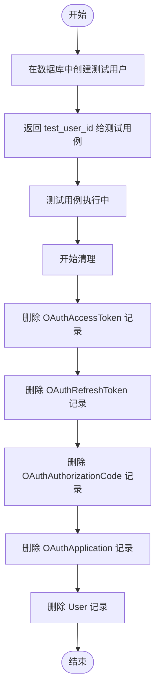

#### 带注释源码

```python
@pytest_asyncio.fixture(scope="session", loop_scope="session")
async def test_user(server, test_user_id: str):
    """Create a test user in the database."""
    # 在数据库中创建用户记录
    await PrismaUser.prisma().create(
        data={
            "id": test_user_id,
            "email": f"oauth-test-{test_user_id}@example.com",
            "name": "OAuth Test User",
        }
    )

    # 将用户 ID 返回给测试用例
    yield test_user_id

    # Cleanup - delete in correct order due to foreign key constraints
    # 清理：由于外键约束，需按正确顺序删除数据
    
    # 1. 删除访问令牌
    await PrismaOAuthAccessToken.prisma().delete_many(where={"userId": test_user_id})
    # 2. 删除刷新令牌
    await PrismaOAuthRefreshToken.prisma().delete_many(where={"userId": test_user_id})
    # 3. 删除授权码
    await PrismaOAuthAuthorizationCode.prisma().delete_many(
        where={"userId": test_user_id}
    )
    # 4. 删除 OAuth 应用
    await PrismaOAuthApplication.prisma().delete_many(where={"ownerId": test_user_id})
    # 5. 最后删除用户本身
    await PrismaUser.prisma().delete(where={"id": test_user_id})
```


### `test_oauth_app`

这是一个用于在数据库中创建测试 OAuth 应用程序的 pytest 异步 fixture。它生成随机的客户端凭据，使用 APIKeySmith 对其进行哈希处理，将其持久化到数据库中，并产生包含 ID、客户端 ID、密钥和重定向 URI 的配置字典，供后续测试使用。

参数：

- `test_user`：`str`，测试所有者的用户 ID，用于关联创建的 OAuth 应用程序。

返回值：`dict`，包含应用程序配置的字典。

返回值描述：一个包含 OAuth 应用程序详细信息的字典，包括 `id`、`client_id`、`client_secret` 和 `redirect_uri`。

#### 流程图

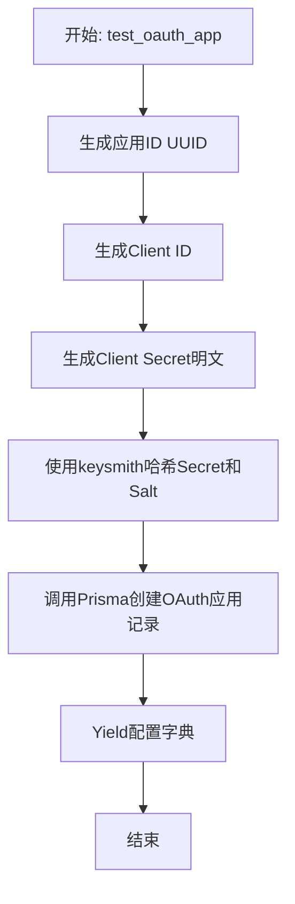

#### 带注释源码

```python
@pytest_asyncio.fixture
async def test_oauth_app(test_user: str):
    """Create a test OAuth application in the database."""
    # 1. 生成应用 ID
    app_id = str(uuid.uuid4())
    # 2. 生成客户端 ID
    client_id = f"test_client_{secrets.token_urlsafe(8)}"
    # 3. 生成客户端密钥明文，必须以 "agpt_" 开头以便 keysmith 验证工作
    client_secret_plaintext = f"agpt_secret_{secrets.token_urlsafe(16)}"
    # 4. 使用 keysmith 哈希密钥和盐
    client_secret_hash, client_secret_salt = keysmith.hash_key(client_secret_plaintext)

    # 5. 在数据库中创建 OAuth 应用程序记录
    await PrismaOAuthApplication.prisma().create(
        data={
            "id": app_id,
            "name": "Test OAuth App",
            "description": "Test application for integration tests",
            "clientId": client_id,
            "clientSecret": client_secret_hash,
            "clientSecretSalt": client_secret_salt,
            "redirectUris": [
                "https://example.com/callback",
                "http://localhost:3000/callback",
            ],
            "grantTypes": ["authorization_code", "refresh_token"],
            "scopes": [APIKeyPermission.EXECUTE_GRAPH, APIKeyPermission.READ_GRAPH],
            "ownerId": test_user,
            "isActive": True,
        }
    )

    # 6. 产生包含应用配置的字典供测试使用
    yield {
        "id": app_id,
        "client_id": client_id,
        "client_secret": client_secret_plaintext,
        "redirect_uri": "https://example.com/callback",
    }

    # Cleanup is handled by test_user fixture (cascade delete)
```


### `pkce_credentials`

这是一个 Pytest 测试夹具，用于生成 PKCE（Proof Key for Code Exchange）的代码验证器和代码挑战。该函数通过调用 `generate_pkce` 辅助函数来创建这些凭据，主要用于在 OAuth 2.0 授权码流程的集成测试中模拟客户端的 PKCE 安全扩展。

参数：

无

返回值：`tuple[str, str]`，包含两个字符串的元组，第一个元素是 PKCE code verifier（代码验证器），第二个元素是 PKCE code challenge（代码挑战）。

#### 流程图

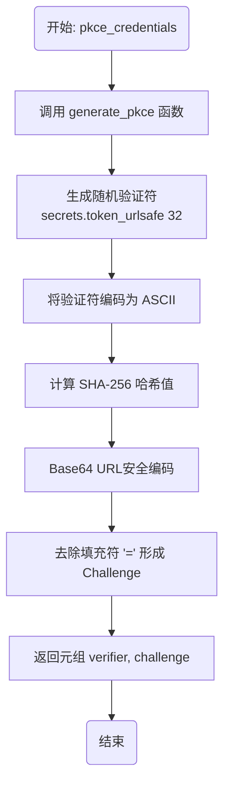

#### 带注释源码

```python
@pytest.fixture
def pkce_credentials() -> tuple[str, str]:
    """Generate PKCE code verifier and challenge as a fixture."""
    # 调用内部辅助函数生成并返回 PKCE 凭据对
    return generate_pkce()
```


### `client`

这是一个 pytest 的异步 fixture，用于创建一个直接与 FastAPI 应用程序通信的异步 HTTP 客户端。它使用 ASGI 传输层，避免了启动实际的 HTTP 服务器，并通过重写 `get_user_id` 依赖项来模拟已认证的测试用户上下文，确保测试在正确的用户身份下运行。

参数：

-  `server`：`Any` (隐式类型)，依赖于 server fixture，通常用于确保数据库连接或服务器环境已就绪。
-  `test_user`：`str`，测试用户的 ID 字符串，用于在依赖重写中模拟当前登录用户。

返回值：`AsyncGenerator[httpx.AsyncClient, None]`，生成一个 `httpx.AsyncClient` 对象，该对象配置为通过 ASGI 接口直接向测试应用发送请求。

#### 流程图

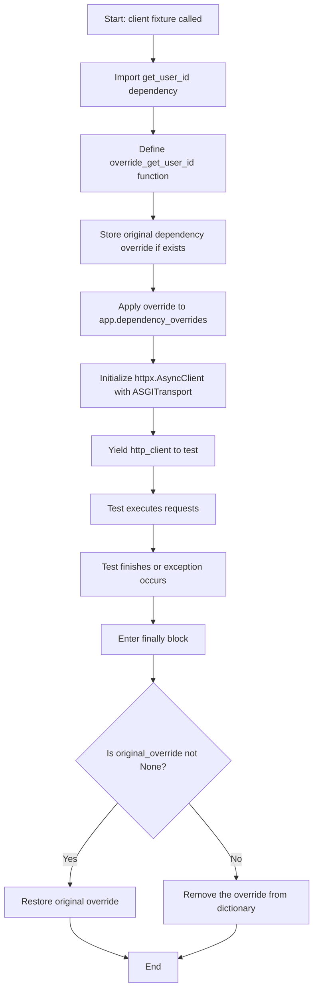

#### 带注释源码

```python
@pytest_asyncio.fixture
async def client(server, test_user: str) -> AsyncGenerator[httpx.AsyncClient, None]:
    """
    Create an async HTTP client that talks directly to the FastAPI app.

    Uses ASGI transport so we don't need an actual HTTP server running.
    Also overrides get_user_id dependency to return our test user.

    Depends on `server` to ensure the DB is connected and `test_user` to ensure
    the user exists in the database before running tests.
    """
    from autogpt_libs.auth import get_user_id

    # Override get_user_id dependency to return our test user
    def override_get_user_id():
        return test_user_id

    # Store original override if any
    original_override = app.dependency_overrides.get(get_user_id)

    # Set our override
    app.dependency_overrides[get_user_id] = override_get_user_id

    try:
        # Create an async client using ASGI transport to directly call the app
        async with httpx.AsyncClient(
            transport=httpx.ASGITransport(app=app),
            base_url="http://test",
        ) as http_client:
            yield http_client
    finally:
        # Restore original override
        if original_override is not None:
            app.dependency_overrides[get_user_id] = original_override
        else:
            app.dependency_overrides.pop(get_user_id, None)
```


### `inactive_oauth_app`

在数据库中创建一个非活跃的测试 OAuth 应用程序，用于测试针对禁用应用的错误处理逻辑。

参数：

-  `test_user`：`str`，用于设置 OAuth 应用所有者的测试用户 ID。

返回值：`Dict[str, str]`，包含创建的非活跃 OAuth 应用详细信息（ID、Client ID、Client Secret、Redirect URI）的字典。

#### 流程图

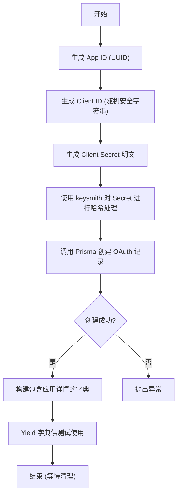

#### 带注释源码

```python
@pytest_asyncio.fixture
async def inactive_oauth_app(test_user: str):
    """Create an inactive test OAuth application in the database."""
    # 生成应用唯一标识符
    app_id = str(uuid.uuid4())
    # 生成客户端 ID
    client_id = f"inactive_client_{secrets.token_urlsafe(8)}"
    # 生成客户端密钥明文，注意 "agpt_" 前缀
    client_secret_plaintext = f"agpt_secret_{secrets.token_urlsafe(16)}"
    # 对密钥进行哈希处理以存储在数据库中
    client_secret_hash, client_secret_salt = keysmith.hash_key(client_secret_plaintext)

    # 在数据库中创建应用记录，设置 isActive 为 False
    await PrismaOAuthApplication.prisma().create(
        data={
            "id": app_id,
            "name": "Inactive OAuth App",
            "description": "Inactive test application",
            "clientId": client_id,
            "clientSecret": client_secret_hash,
            "clientSecretSalt": client_secret_salt,
            "redirectUris": ["https://example.com/callback"],
            "grantTypes": ["authorization_code", "refresh_token"],
            "scopes": [APIKeyPermission.EXECUTE_GRAPH],
            "ownerId": test_user,
            "isActive": False,  # 关键点：设置为非活跃状态
        }
    )

    # 返回应用详情给测试用例，包含明文密钥以便请求使用
    yield {
        "id": app_id,
        "client_id": client_id,
        "client_secret": client_secret_plaintext,
        "redirect_uri": "https://example.com/callback",
    }
    # 清理逻辑由 test_user fixture 中的级联删除处理
```


### `other_oauth_app`

一个 pytest 异步 fixture，用于在数据库中创建第二个 OAuth 应用程序。它主要用于测试跨应用程序的场景，例如验证一个应用程序不能使用或撤销属于另一个应用程序的令牌。

参数：

-   `test_user`：`str`，拥有此 OAuth 应用程序的测试用户的 ID。

返回值：`AsyncGenerator[Dict[str, str], None]`，一个包含应用程序详细信息的字典，包括应用程序 ID (`id`)、客户端 ID (`client_id`)、客户端密钥 (`client_secret`) 和重定向 URI (`redirect_uri`)。

#### 流程图

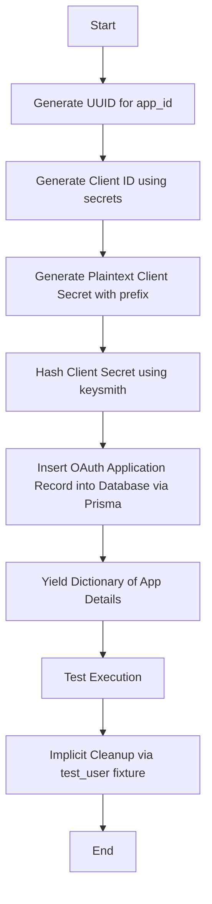

#### 带注释源码

```python
@pytest_asyncio.fixture
async def other_oauth_app(test_user: str):
    """Create a second OAuth application for cross-app tests."""
    # 生成应用程序的唯一 ID
    app_id = str(uuid.uuid4())
    # 生成客户端 ID
    client_id = f"other_client_{secrets.token_urlsafe(8)}"
    # 生成明文客户端密钥，确保以特定前缀开头以便 keysmith 验证
    client_secret_plaintext = f"agpt_other_{secrets.token_urlsafe(16)}"
    # 使用 keysmith 对密钥进行哈希处理和加盐
    client_secret_hash, client_secret_salt = keysmith.hash_key(client_secret_plaintext)

    # 在数据库中创建 OAuth 应用程序记录
    await PrismaOAuthApplication.prisma().create(
        data={
            "id": app_id,
            "name": "Other OAuth App",
            "description": "Second test application",
            "clientId": client_id,
            "clientSecret": client_secret_hash,
            "clientSecretSalt": client_secret_salt,
            "redirectUris": ["https://other.example.com/callback"],
            "grantTypes": ["authorization_code", "refresh_token"],
            "scopes": [APIKeyPermission.EXECUTE_GRAPH],
            "ownerId": test_user,
            "isActive": True,
        }
    )

    # 将应用程序配置信息字典返回给测试函数使用
    yield {
        "id": app_id,
        "client_id": client_id,
        "client_secret": client_secret_plaintext,
        "redirect_uri": "https://other.example.com/callback",
    }

    # 清理逻辑由 test_user fixture 处理（级联删除）
```


### `test_authorize_creates_code_in_database`

测试 OAuth 2.0 授权端点，验证其是否能成功创建授权码并将其正确存储在数据库中，同时检查响应的重定向 URL 和 PKCE 参数是否正确。

参数：

- `client`：`httpx.AsyncClient`，用于发送 HTTP 请求的异步测试客户端。
- `test_user`：`str`，测试用户的 ID。
- `test_oauth_app`：`dict`，包含测试 OAuth 应用的配置信息（如 client_id, redirect_uri 等）。
- `pkce_credentials`：`tuple[str, str]`，包含 PKCE 协议的 code_verifier 和 code_challenge。

返回值：`None`，该函数为测试函数，无返回值，主要通过断言验证逻辑。

#### 流程图

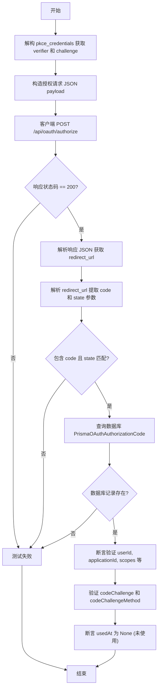

#### 带注释源码

```python
@pytest.mark.asyncio(loop_scope="session")
async def test_authorize_creates_code_in_database(
    client: httpx.AsyncClient,
    test_user: str,
    test_oauth_app: dict,
    pkce_credentials: tuple[str, str],
):
    """Test that authorization endpoint creates a code in the database."""
    # 1. 获取 PKCE 验证器和挑战码
    verifier, challenge = pkce_credentials

    # 2. 发送授权请求到 OAuth 端点
    response = await client.post(
        "/api/oauth/authorize",
        json={
            "client_id": test_oauth_app["client_id"],
            "redirect_uri": test_oauth_app["redirect_uri"],
            "scopes": ["EXECUTE_GRAPH", "READ_GRAPH"],
            "state": "test_state_123",
            "response_type": "code",
            "code_challenge": challenge,
            "code_challenge_method": "S256",
        },
        follow_redirects=False,
    )

    # 3. 验证响应状态码
    assert response.status_code == 200
    
    # 4. 从响应中获取重定向 URL
    redirect_url = response.json()["redirect_url"]

    # 5. 解析 URL 以获取 authorization code
    from urllib.parse import parse_qs, urlparse

    parsed = urlparse(redirect_url)
    query_params = parse_qs(parsed.query)

    # 6. 断言 URL 中包含 code 且 state 正确
    assert "code" in query_params, f"Expected 'code' in query params: {query_params}"
    auth_code = query_params["code"][0]
    assert query_params["state"][0] == "test_state_123"

    # 7. 验证数据库中是否存在该 code 记录
    db_code = await PrismaOAuthAuthorizationCode.prisma().find_unique(
        where={"code": auth_code}
    )

    # 8. 断言数据库记录非空，并验证字段数据
    assert db_code is not None
    assert db_code.userId == test_user
    assert db_code.applicationId == test_oauth_app["id"]
    assert db_code.redirectUri == test_oauth_app["redirect_uri"]
    assert APIKeyPermission.EXECUTE_GRAPH in db_code.scopes
    assert APIKeyPermission.READ_GRAPH in db_code.scopes
    assert db_code.usedAt is None  # 尚未被使用
    assert db_code.codeChallenge == challenge
    assert db_code.codeChallengeMethod == "S256"
```


### `test_authorize_with_pkce_stores_challenge`

该测试函数用于验证 OAuth 2.0 授权端点在处理带有 PKCE（Proof Key for Code Exchange）参数的授权请求时，能否正确将 `code_challenge`（代码挑战）和 `code_challenge_method`（挑战方法）存储在数据库的授权码记录中。这是确保 PKCE 安全流程能有效防止授权码拦截攻击的关键验证步骤。

参数：

- `client`：`httpx.AsyncClient`，用于向测试服务器发送异步 HTTP 请求的客户端实例。
- `test_user`：`str`，测试用户的 ID 标识符。
- `test_oauth_app`：`dict`，包含测试 OAuth 应用详细信息的字典（如 client_id, redirect_uri 等）。
- `pkce_credentials`：`tuple[str, str]`，包含 PKCE 验证器（verifier）和挑战码（challenge）的元组。

返回值：`None`，该函数为测试用例，无返回值，主要通过断言验证行为。

#### 流程图

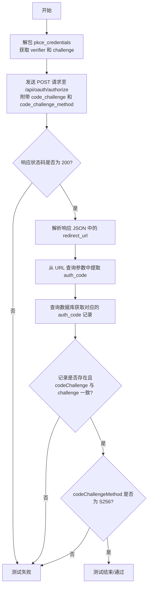

#### 带注释源码

```python
@pytest.mark.asyncio(loop_scope="session")
async def test_authorize_with_pkce_stores_challenge(
    client: httpx.AsyncClient,
    test_user: str,
    test_oauth_app: dict,
    pkce_credentials: tuple[str, str],
):
    """Test that PKCE code challenge is stored correctly."""
    # 从 fixture 中解包 PKCE 验证器和挑战码
    verifier, challenge = pkce_credentials

    # 向授权端点发送 POST 请求，请求中包含 PKCE 相关参数
    response = await client.post(
        "/api/oauth/authorize",
        json={
            "client_id": test_oauth_app["client_id"],
            "redirect_uri": test_oauth_app["redirect_uri"],
            "scopes": ["EXECUTE_GRAPH"],
            "state": "pkce_test_state",
            "response_type": "code",
            "code_challenge": challenge,          # 提供 code_challenge
            "code_challenge_method": "S256",      # 指定挑战方法为 SHA-256
        },
        follow_redirects=False,
    )

    # 断言响应成功
    assert response.status_code == 200

    # 导入 URL 解析工具，用于提取返回的重定向 URL 中的授权码
    from urllib.parse import parse_qs, urlparse

    # 从返回的重定向 URL 中解析出 authorization code
    auth_code = parse_qs(urlparse(response.json()["redirect_url"]).query)["code"][0]

    # 在数据库中查找该授权码记录
    db_code = await PrismaOAuthAuthorizationCode.prisma().find_unique(
        where={"code": auth_code}
    )

    # 验证数据库记录存在
    assert db_code is not None
    # 验证数据库中存储的 code_challenge 与请求发送的一致
    assert db_code.codeChallenge == challenge
    # 验证数据库中存储的 code_challenge_method 为 S256
    assert db_code.codeChallengeMethod == "S256"
```


### `test_authorize_invalid_client_returns_error`

该测试函数用于验证当使用无效的 `client_id` 请求授权端点时，系统能否正确处理并返回包含 `invalid_client` 错误的重定向 URL，而非抛出未捕获的异常或 HTTP 错误码。

参数：

-   `client`：`httpx.AsyncClient`，用于发送 HTTP 请求的异步客户端，模拟浏览器或应用与 API 的交互。
-   `test_user`：`str`，测试用户的 ID，虽然此测试主要关注客户端验证，但作为 fixture 传入以维持上下文。
-   `test_oauth_app`：`dict`，包含有效的 OAuth 应用配置信息（如有效的 `redirect_uri`），用于构造请求 payload，尽管本测试中会覆盖 `client_id`。

返回值：`None`，这是一个异步测试函数，不返回值，通过断言来验证行为是否符合预期。

#### 流程图

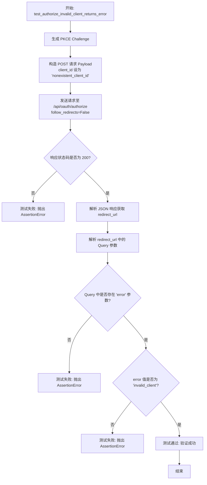

#### 带注释源码

```python
@pytest.mark.asyncio(loop_scope="session")
async def test_authorize_invalid_client_returns_error(
    client: httpx.AsyncClient,
    test_user: str,
    test_oauth_app: dict,
):
    """Test that invalid client_id returns error in redirect."""
    # 生成 PKCE code challenge，用于模拟真实的 OAuth 2.0 PKCE 流程参数
    _, challenge = generate_pkce()

    # 向授权端点发送 POST 请求
    # 注意：这里故意使用了一个不存在的 client_id ("nonexistent_client_id")
    # redirect_uri 使用的是 test_oauth_app fixture 中的有效地址
    response = await client.post(
        "/api/oauth/authorize",
        json={
            "client_id": "nonexistent_client_id",
            "redirect_uri": test_oauth_app["redirect_uri"],
            "scopes": ["EXECUTE_GRAPH"],
            "state": "error_test",
            "response_type": "code",
            "code_challenge": challenge,
            "code_challenge_method": "S256",
        },
        follow_redirects=False,  # 不自动跟随重定向，以便检查响应中的 Location 或 redirect_url
    )

    # 断言 HTTP 状态码为 200，表明 API 接受了请求并返回了包含错误重定向信息的 JSON 响应
    assert response.status_code == 200
    
    # 导入解析 URL 的工具
    from urllib.parse import parse_qs, urlparse

    # 解析返回的 JSON 中的 redirect_url 字段
    query_params = parse_qs(urlparse(response.json()["redirect_url"]).query)
    
    # 断言重定向 URL 的 query 参数中包含 error 字段，且值为 "invalid_client"
    # 这验证了服务端正确识别了无效客户端并按照 OAuth 协议返回了错误
    assert query_params["error"][0] == "invalid_client"
```


### `test_authorize_inactive_app`

该函数是一个端到端集成测试，用于验证当尝试使用未激活的OAuth应用进行授权时，系统是否正确返回错误。

参数：

-  `client`：`httpx.AsyncClient`，用于发送HTTP请求的异步客户端。
-  `test_user`：`str`，测试用户的ID。
-  `inactive_oauth_app`：`dict`，包含未激活OAuth应用信息的字典（如client_id, redirect_uri等）。

返回值：`None`，该函数为测试用例，无返回值，主要通过断言验证行为。

#### 流程图

```mermaid
flowchart TD
    A[开始: test_authorize_inactive_app] --> B[生成 PKCE challenge]
    B --> C[向 /api/oauth/authorize 发送 POST 请求]
    C --> D[请求参数包含 inactive_oauth_app 的信息]
    D --> E{断言响应状态码}
    E -- 状态码 == 200 --> F[解析响应中的 redirect_url]
    F --> G[从 redirect_url 中解析查询参数]
    G --> H{断言错误参数}
    H -- error == "invalid_client" --> I[测试通过]
    E -- 状态码 != 200 --> J[测试失败]
    H -- error != "invalid_client" --> J
```

#### 带注释源码

```python
@pytest.mark.asyncio(loop_scope="session")
async def test_authorize_inactive_app(
    client: httpx.AsyncClient,
    test_user: str,
    inactive_oauth_app: dict,
):
    """Test that authorization with inactive app returns error."""
    # 生成 PKCE code challenge，忽略 verifier
    _, challenge = generate_pkce()

    # 向授权端点发送请求，使用未激活的应用凭证
    response = await client.post(
        "/api/oauth/authorize",
        json={
            "client_id": inactive_oauth_app["client_id"],
            "redirect_uri": inactive_oauth_app["redirect_uri"],
            "scopes": ["EXECUTE_GRAPH"],
            "state": "inactive_test",
            "response_type": "code",
            "code_challenge": challenge,
            "code_challenge_method": "S256",
        },
        follow_redirects=False, # 不自动跟随重定向，以便检查响应中的重定向URL
    )

    # 断言HTTP响应状态码为200（虽然业务逻辑是错误，但API返回了包含错误信息的重定向URL）
    assert response.status_code == 200
    
    # 导入URL解析工具
    from urllib.parse import parse_qs, urlparse

    # 解析响应JSON中的重定向URL
    query_params = parse_qs(urlparse(response.json()["redirect_url"]).query)
    
    # 断言查询参数中包含特定的错误码 "invalid_client"
    assert query_params["error"][0] == "invalid_client"
```


### `test_authorize_invalid_redirect_uri`

该测试函数用于验证OAuth授权端点的安全性，确保当客户端使用未注册的`redirect_uri`进行授权请求时，服务器不会执行重定向，而是返回HTTP 400错误。这是为了防止开放重定向漏洞（Open Redirect Vulnerability），攻击者可能利用此漏洞将用户引导至恶意网站。

参数：

-  `client`：`httpx.AsyncClient`，用于模拟HTTP请求发送至测试服务器的异步客户端。
-  `test_user`：`str`，测试用户的唯一标识符。
-  `test_oauth_app`：`dict`，包含测试OAuth应用配置信息的字典（如client_id等）。

返回值：`None`，该函数为测试用例，通过断言来验证行为，不返回具体数值。

#### 流程图

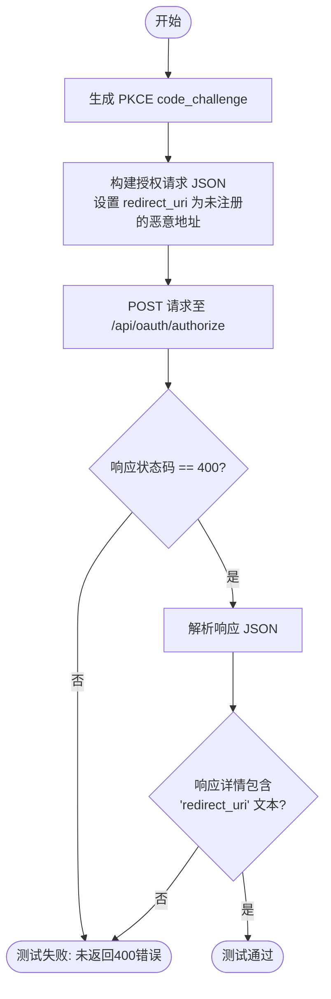

#### 带注释源码

```python
@pytest.mark.asyncio(loop_scope="session")
async def test_authorize_invalid_redirect_uri(
    client: httpx.AsyncClient,
    test_user: str,
    test_oauth_app: dict,
):
    """Test authorization with unregistered redirect_uri returns HTTP error."""
    # 生成 PKCE (Proof Key for Code Exchange) 挑战码
    _, challenge = generate_pkce()

    # 向授权端点发送 POST 请求，故意使用一个未在 test_oauth_app 中注册的 redirect_uri
    response = await client.post(
        "/api/oauth/authorize",
        json={
            "client_id": test_oauth_app["client_id"],
            # 使用恶意/未注册的重定向地址
            "redirect_uri": "https://malicious.com/callback",
            "scopes": ["EXECUTE_GRAPH"],
            "state": "invalid_redirect_test",
            "response_type": "code",
            "code_challenge": challenge,
            "code_challenge_method": "S256",
        },
        follow_redirects=False, # 禁止自动跟随重定向，以便检查原始响应
    )

    # 断言服务器返回 HTTP 400 Bad Request，而不是 302 重定向
    # 这是防止开放重定向攻击的关键安全检查
    assert response.status_code == 400
    
    # 断言返回的错误详情中包含 "redirect_uri" 字样，确认错误原因正确
    assert "redirect_uri" in response.json()["detail"].lower()
```


### `test_authorize_invalid_scope`

该函数用于测试 OAuth 2.0 授权端点在接收到无效 scope 请求时的错误处理机制，确保系统能正确识别并返回 `invalid_scope` 错误。

参数：

-   `client`：`httpx.AsyncClient`，用于发送 HTTP 请求的异步测试客户端。
-   `test_user`：`str`，测试用户的 ID 标识符。
-   `test_oauth_app`：`dict`，包含测试用 OAuth 应用配置信息的字典（如 client_id, redirect_uri 等）。

返回值：`None`，该函数为测试函数，无显式返回值。

#### 流程图

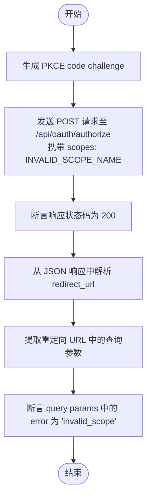

#### 带注释源码

```python
@pytest.mark.asyncio(loop_scope="session")
async def test_authorize_invalid_scope(
    client: httpx.AsyncClient,
    test_user: str,
    test_oauth_app: dict,
):
    """Test authorization with invalid scope value."""
    # 生成 PKCE 代码验证码和挑战码，用于请求参数
    _, challenge = generate_pkce()

    # 向授权端点发送 POST 请求， scopes 字段设置为一个无效的值 "INVALID_SCOPE_NAME"
    response = await client.post(
        "/api/oauth/authorize",
        json={
            "client_id": test_oauth_app["client_id"],
            "redirect_uri": test_oauth_app["redirect_uri"],
            "scopes": ["INVALID_SCOPE_NAME"], # 故意使用无效的 scope 名称
            "state": "invalid_scope_test",
            "response_type": "code",
            "code_challenge": challenge,
            "code_challenge_method": "S256",
        },
        follow_redirects=False, # 不自动跟随重定向，以便检查响应内容
    )

    # 断言 HTTP 响应状态码为 200，表示服务器已处理请求（错误信息通常包含在重定向 URL 中）
    assert response.status_code == 200
    
    # 导入 URL 解析工具
    from urllib.parse import parse_qs, urlparse

    # 解析响应 JSON 中的 redirect_url 字段
    query_params = parse_qs(urlparse(response.json()["redirect_url"]).query)
    
    # 断言查询参数中包含错误代码 'invalid_scope'
    assert query_params["error"][0] == "invalid_scope"
```


### `test_authorize_unauthorized_scope`

测试当 OAuth 应用请求未被授权的 scope（权限范围）时，授权端点是否正确返回错误。该函数模拟了一个应用请求了超出其注册时允许的权限范围（`DELETE_GRAPH`），并验证系统是否返回 `invalid_scope` 错误。

参数：

-   `client`：`httpx.AsyncClient`，用于发送模拟 HTTP 请求的异步客户端实例。
-   `test_user`：`str`，测试用户的 ID 字符串。
-   `test_oauth_app`：`dict`，测试 OAuth 应用的配置字典，包含 client_id、redirect_uri 等信息。

返回值：`None`，该函数为测试函数，无返回值。

#### 流程图

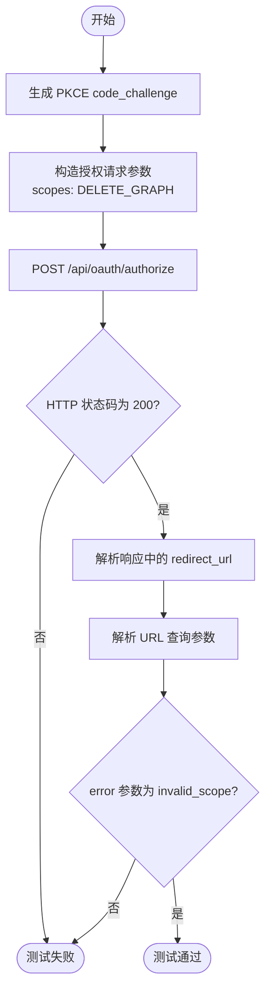

#### 带注释源码

```python
@pytest.mark.asyncio(loop_scope="session")
async def test_authorize_unauthorized_scope(
    client: httpx.AsyncClient,
    test_user: str,
    test_oauth_app: dict,
):
    """Test authorization requesting scope not authorized for app."""
    # 生成 PKCE (Proof Key for Code Exchange) 的 code_challenge
    _, challenge = generate_pkce()

    # 发送授权请求
    # test_oauth_app fixture 中定义的应用仅拥有 EXECUTE_GRAPH 和 READ_GRAPH 权限
    # 此处故意请求应用未被授权的 DELETE_GRAPH 权限
    response = await client.post(
        "/api/oauth/authorize",
        json={
            "client_id": test_oauth_app["client_id"],
            "redirect_uri": test_oauth_app["redirect_uri"],
            "scopes": ["DELETE_GRAPH"],  # 未授权的 Scope
            "state": "unauthorized_scope_test",
            "response_type": "code",
            "code_challenge": challenge,
            "code_challenge_method": "S256",
        },
        follow_redirects=False,  # 不自动跟随重定向，以便检查响应中的 Location 头或 Body 中的 URL
    )

    # 预期服务器返回 200 OK，并响应体中包含重定向 URL
    assert response.status_code == 200
    from urllib.parse import parse_qs, urlparse

    # 从响应 JSON 中提取重定向 URL 并解析其查询参数
    query_params = parse_qs(urlparse(response.json()["redirect_url"]).query)
    # 验证错误类型是否为 invalid_scope，表示拒绝了未授权的权限请求
    assert query_params["error"][0] == "invalid_scope"
```


### `test_authorize_unsupported_response_type`

测试当使用不支持的响应类型（例如隐式流程中的 "token"）发起授权请求时，授权端点是否正确返回 `unsupported_response_type` 错误。

参数：

- `client`：`httpx.AsyncClient`，用于与 API 进行交互的异步 HTTP 客户端。
- `test_user`：`str`，测试用户的 ID。
- `test_oauth_app`：`dict`，包含测试 OAuth 应用程序详细信息的字典（如 client_id, redirect_uri 等）。

返回值：`None`，无返回值（这是一个测试函数）。

#### 流程图

```mermaid
graph TD
    A[开始: test_authorize_unsupported_response_type] --> B[调用 generate_pkce 生成 challenge]
    B --> C[构造 POST 请求 /api/oauth/authorize]
    C --> D[设置 response_type 为 'token' 不支持的类型]
    D --> E[发送请求并关闭自动重定向 follow_redirects=False]
    E --> F{断言 HTTP 状态码 == 200}
    F -- 否 --> G[测试失败]
    F -- 是 --> H[从响应 JSON 中提取 redirect_url]
    H --> I[解析 URL 获取查询参数]
    I --> J{断言 query_params['error'] == 'unsupported_response_type'}
    J -- 否 --> G
    J -- 是 --> K[测试通过]
    K --> L[结束]
```

#### 带注释源码

```python
@pytest.mark.asyncio(loop_scope="session")
async def test_authorize_unsupported_response_type(
    client: httpx.AsyncClient,
    test_user: str,
    test_oauth_app: dict,
):
    """Test authorization with unsupported response_type."""
    # 生成 PKCE (Proof Key for Code Exchange) 验证码和挑战
    _, challenge = generate_pkce()

    # 向授权端点发送 POST 请求
    response = await client.post(
        "/api/oauth/authorize",
        json={
            "client_id": test_oauth_app["client_id"],
            "redirect_uri": test_oauth_app["redirect_uri"],
            "scopes": ["EXECUTE_GRAPH"],
            "state": "unsupported_response_test",
            # 设置 response_type 为 "token"，这代表隐式流程，而本服务不支持
            "response_type": "token", 
            "code_challenge": challenge,
            "code_challenge_method": "S256",
        },
        follow_redirects=False,  # 禁止自动跟随重定向，以便检查响应头或响应体中的重定向信息
    )

    # 断言 HTTP 状态码为 200，表示服务器接收了请求但通过重定向返回了错误
    assert response.status_code == 200
    from urllib.parse import parse_qs, urlparse

    # 解析响应体中返回的重定向 URL
    query_params = parse_qs(urlparse(response.json()["redirect_url"]).query)
    
    # 断言错误参数为 'unsupported_response_type'
    assert query_params["error"][0] == "unsupported_response_type"
```


### `test_token_exchange_creates_tokens_in_database`

该函数用于测试 OAuth 2.0 授权码模式下，通过交换授权码是否能在数据库中成功创建有效的访问令牌和刷新令牌，并验证授权码已被正确标记为已使用。

参数：

-  `client`：`httpx.AsyncClient`，用于向 API 端点发送 HTTP 请求的异步客户端实例。
-  `test_user`：`str`，测试用户的 ID，用于验证数据库中的令牌是否关联到正确的用户。
-  `test_oauth_app`：`dict`，包含测试 OAuth 应用程序的配置信息（如 client_id, client_secret 等）的字典。

返回值：`None`，该函数为测试函数，无返回值，通过断言验证结果。

#### 流程图

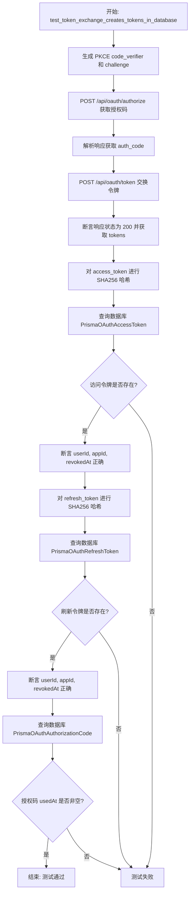

#### 带注释源码

```python
@pytest.mark.asyncio(loop_scope="session")
async def test_token_exchange_creates_tokens_in_database(
    client: httpx.AsyncClient,
    test_user: str,
    test_oauth_app: dict,
):
    """Test that token exchange creates access and refresh tokens in database."""
    from urllib.parse import parse_qs, urlparse

    # 生成 PKCE (Proof Key for Code Exchange) 验证器和挑战码
    verifier, challenge = generate_pkce()

    # 第一步：请求授权端点获取授权码
    auth_response = await client.post(
        "/api/oauth/authorize",
        json={
            "client_id": test_oauth_app["client_id"],
            "redirect_uri": test_oauth_app["redirect_uri"],
            "scopes": ["EXECUTE_GRAPH", "READ_GRAPH"],
            "state": "token_test_state",
            "response_type": "code",
            "code_challenge": challenge,
            "code_challenge_method": "S256",
        },
        follow_redirects=False,
    )

    # 从重定向 URL 中解析出授权码
    auth_code = parse_qs(urlparse(auth_response.json()["redirect_url"]).query)["code"][
        0
    ]

    # 第二步：使用授权码向令牌端点请求访问令牌和刷新令牌
    token_response = await client.post(
        "/api/oauth/token",
        json={
            "grant_type": "authorization_code",
            "code": auth_code,
            "redirect_uri": test_oauth_app["redirect_uri"],
            "client_id": test_oauth_app["client_id"],
            "client_secret": test_oauth_app["client_secret"],
            "code_verifier": verifier,
        },
    )

    # 断言响应成功并解析令牌
    assert token_response.status_code == 200
    tokens = token_response.json()

    assert "access_token" in tokens
    assert "refresh_token" in tokens
    assert tokens["token_type"] == "Bearer"
    assert "EXECUTE_GRAPH" in tokens["scopes"]
    assert "READ_GRAPH" in tokens["scopes"]

    # 第三步：验证访问令牌已正确存储在数据库中（存储形式为哈希值）
    access_token_hash = hashlib.sha256(tokens["access_token"].encode()).hexdigest()
    db_access_token = await PrismaOAuthAccessToken.prisma().find_unique(
        where={"token": access_token_hash}
    )

    assert db_access_token is not None
    assert db_access_token.userId == test_user
    assert db_access_token.applicationId == test_oauth_app["id"]
    assert db_access_token.revokedAt is None

    # 第四步：验证刷新令牌已正确存储在数据库中（存储形式为哈希值）
    refresh_token_hash = hashlib.sha256(tokens["refresh_token"].encode()).hexdigest()
    db_refresh_token = await PrismaOAuthRefreshToken.prisma().find_unique(
        where={"token": refresh_token_hash}
    )

    assert db_refresh_token is not None
    assert db_refresh_token.userId == test_user
    assert db_refresh_token.applicationId == test_oauth_app["id"]
    assert db_refresh_token.revokedAt is None

    # 第五步：验证授权码已被标记为已使用
    db_code = await PrismaOAuthAuthorizationCode.prisma().find_unique(
        where={"code": auth_code}
    )
    assert db_code is not None
    assert db_code.usedAt is not None
```


### `test_authorization_code_cannot_be_reused`

该测试用于验证 OAuth 2.0 授权码的一次性使用安全机制。测试流程包括获取一个新的授权码，第一次使用该码交换令牌（预期成功），然后尝试第二次使用同一个码交换令牌（预期失败），以确保系统拒绝重复使用的授权码。

参数：

- `client`：`httpx.AsyncClient`，用于发起 HTTP 请求的异步测试客户端。
- `test_user`：`str`，测试用户的 ID。
- `test_oauth_app`：`dict`，包含测试 OAuth 应用程序信息的字典（如 client_id, client_secret 等）。

返回值：`None`，测试函数在验证通过时无返回值，失败时抛出断言错误。

#### 流程图

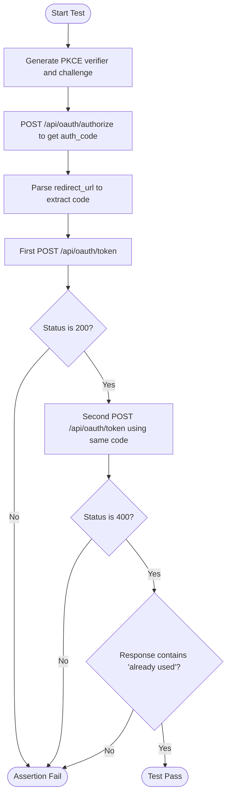

#### 带注释源码

```python
@pytest.mark.asyncio(loop_scope="session")
async def test_authorization_code_cannot_be_reused(
    client: httpx.AsyncClient,
    test_user: str,
    test_oauth_app: dict,
):
    """Test that authorization code can only be used once."""
    from urllib.parse import parse_qs, urlparse

    # 生成 PKCE (Proof Key for Code Exchange) 验证器和挑战码
    verifier, challenge = generate_pkce()

    # 步骤 1: 获取授权码
    auth_response = await client.post(
        "/api/oauth/authorize",
        json={
            "client_id": test_oauth_app["client_id"],
            "redirect_uri": test_oauth_app["redirect_uri"],
            "scopes": ["EXECUTE_GRAPH"],
            "state": "reuse_test",
            "response_type": "code",
            "code_challenge": challenge,
            "code_challenge_method": "S256",
        },
        follow_redirects=False,
    )

    # 从响应中解析出授权码
    auth_code = parse_qs(urlparse(auth_response.json()["redirect_url"]).query)["code"][
        0
    ]

    # 步骤 2: 第一次交换授权码 - 预期成功
    first_response = await client.post(
        "/api/oauth/token",
        json={
            "grant_type": "authorization_code",
            "code": auth_code,
            "redirect_uri": test_oauth_app["redirect_uri"],
            "client_id": test_oauth_app["client_id"],
            "client_secret": test_oauth_app["client_secret"],
            "code_verifier": verifier,
        },
    )
    assert first_response.status_code == 200

    # 步骤 3: 第二次尝试使用相同的授权码 - 预期失败
    second_response = await client.post(
        "/api/oauth/token",
        json={
            "grant_type": "authorization_code",
            "code": auth_code, # 重用同一个 code
            "redirect_uri": test_oauth_app["redirect_uri"],
            "client_id": test_oauth_app["client_id"],
            "client_secret": test_oauth_app["client_secret"],
            "code_verifier": verifier,
        },
    )
    # 验证响应状态码为 400 (Bad Request)
    assert second_response.status_code == 400
    # 验证错误信息包含 "already used"
    assert "already used" in second_response.json()["detail"]
```


### `test_token_exchange_with_invalid_client_secret`

该函数是一个集成测试，用于验证当客户端在令牌交换请求中提供无效的 `client_secret` 时，OAuth 2.0 提供程序的令牌端点是否能够正确拒绝请求并返回 401 未授权状态码。

参数：

-  `client`：`httpx.AsyncClient`，用于向测试 API 发送异步 HTTP 请求的客户端实例。
-  `test_user`：`str`，测试用户的 ID，由 fixture 提供。
-  `test_oauth_app`：`dict`，包含测试 OAuth 应用程序详细信息的字典（如 `client_id`、`client_secret` 和 `redirect_uri`）。

返回值：`None`，函数本身不返回值，但如果断言失败则抛出异常。

#### 流程图

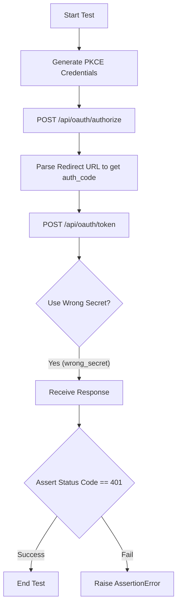

#### 带注释源码

```python
@pytest.mark.asyncio(loop_scope="session")
async def test_token_exchange_with_invalid_client_secret(
    client: httpx.AsyncClient,
    test_user: str,
    test_oauth_app: dict,
):
    """Test that token exchange fails with invalid client secret."""
    # 导入 URL 解析工具，用于从重定向 URL 中提取授权码
    from urllib.parse import parse_qs, urlparse

    # 生成 PKCE (Proof Key for Code Exchange) 验证器和挑战码
    verifier, challenge = generate_pkce()

    # 步骤 1: 请求授权码
    # 使用正确的 client_id 和 redirect_uri 向授权端点发送请求
    auth_response = await client.post(
        "/api/oauth/authorize",
        json={
            "client_id": test_oauth_app["client_id"],
            "redirect_uri": test_oauth_app["redirect_uri"],
            "scopes": ["EXECUTE_GRAPH"],
            "state": "bad_secret_test",
            "response_type": "code",
            "code_challenge": challenge,
            "code_challenge_method": "S256",
        },
        follow_redirects=False,
    )

    # 步骤 2: 从响应中提取授权码
    # 解析返回的 JSON 中的 redirect_url，并获取 query 参数中的 code
    auth_code = parse_qs(urlparse(auth_response.json()["redirect_url"]).query)["code"][
        0
    ]

    # 步骤 3: 尝试使用错误的 client_secret 交换令牌
    # 故意在请求体中传入错误的 client_secret ("wrong_secret")
    response = await client.post(
        "/api/oauth/token",
        json={
            "grant_type": "authorization_code",
            "code": auth_code,
            "redirect_uri": test_oauth_app["redirect_uri"],
            "client_id": test_oauth_app["client_id"],
            "client_secret": "wrong_secret",  # 错误的密钥
            "code_verifier": verifier,
        },
    )

    # 步骤 4: 断言验证
    # 预期服务器应返回 401 Unauthorized，表示客户端身份验证失败
    assert response.status_code == 401
```


### `test_token_authorization_code_invalid_code`

该函数用于测试OAuth 2.0令牌端点在接收到无效或不存在的授权码时的错误处理逻辑，验证系统是否能正确拒绝请求并返回相应的错误信息。

参数：

- `client`：`httpx.AsyncClient`，用于模拟HTTP请求的异步客户端。
- `test_user`：`str`，测试用户的ID，由pytest fixture提供。
- `test_oauth_app`：`dict`，包含测试OAuth应用详情的字典（如client_id, client_secret等），由pytest fixture提供。

返回值：`None`，该函数为测试函数，无返回值，主要通过断言验证行为。

#### 流程图

```mermaid
flowchart TD
    A[开始: test_token_authorization_code_invalid_code] --> B[构造POST请求]
    B --> C[设置grant_type为authorization_code]
    C --> D[设置code为不存在的值<br/>'nonexistent_invalid_code_xyz']
    D --> E[发送请求至 /api/oauth/token]
    E --> F{断言响应状态码}
    F -- 状态码 == 400 --> G[断言通过]
    F -- 状态码 != 400 --> H[测试失败]
    G --> I{断言响应详情}
    I -- 包含 'not found' --> J[测试结束: 成功]
    I -- 不包含 'not found' --> H
```

#### 带注释源码

```python
@pytest.mark.asyncio(loop_scope="session")
async def test_token_authorization_code_invalid_code(
    client: httpx.AsyncClient,
    test_user: str,
    test_oauth_app: dict,
):
    """Test token exchange with invalid/nonexistent authorization code."""
    # 向令牌端点发送POST请求，尝试使用一个不存在的授权码来交换令牌
    response = await client.post(
        "/api/oauth/token",
        json={
            "grant_type": "authorization_code",
            # 使用一个硬编码的、不存在的授权码
            "code": "nonexistent_invalid_code_xyz",
            "redirect_uri": test_oauth_app["redirect_uri"],
            "client_id": test_oauth_app["client_id"],
            "client_secret": test_oauth_app["client_secret"],
            "code_verifier": "",
        },
    )

    # 断言：预期HTTP状态码为 400 Bad Request
    assert response.status_code == 400
    # 断言：预期响应的 detail 字段中包含 "not found" 字符串（不区分大小写）
    assert "not found" in response.json()["detail"].lower()
```


### `test_token_authorization_code_expired`

测试当使用过期的授权码进行令牌交换时，系统能够正确识别并拒绝请求。

参数：

-   `client`：`httpx.AsyncClient`，用于发起 HTTP 请求的异步测试客户端。
-   `test_user`：`str`，测试用户的 ID。
-   `test_oauth_app`：`dict`，包含测试 OAuth 应用配置信息的字典（如 client_id, client_secret 等）。

返回值：`None`，无返回值（测试函数）。

#### 流程图

```mermaid
flowchart TD
    A[开始: test_token_authorization_code_expired] --> B[生成过期的授权码字符串]
    B --> C[获取当前 UTC 时间]
    C --> D[计算过期时间为当前时间减去 1 小时]
    D --> E[在数据库中直接创建授权码记录<br>设置 expiresAt 为过去的时间]
    E --> F[构造 Token 交换请求<br>包含过期的 code 和正确的认证信息]
    F --> G[发送 POST 请求到 /api/oauth/token]
    G --> H[断言响应状态码为 400]
    H --> I[断言响应详情中包含 'expired' 字符串]
    I --> J[结束测试]
```

#### 带注释源码

```python
@pytest.mark.asyncio(loop_scope="session")
async def test_token_authorization_code_expired(
    client: httpx.AsyncClient,
    test_user: str,
    test_oauth_app: dict,
):
    """Test token exchange with expired authorization code."""
    # 导入日期时间处理模块，用于模拟过期时间
    from datetime import datetime, timedelta, timezone

    # 1. 准备数据：创建一个直接设定为已过期的授权码
    # 生成一个随机字符串作为过期的授权码
    expired_code = f"expired_code_{secrets.token_urlsafe(16)}"
    # 获取当前的 UTC 时间
    now = datetime.now(timezone.utc)

    # 2. 直接在数据库中创建一条授权码记录
    # 绕过正常的申请流程，直接插入一个 expiresAt 在过去（1小时前）的数据
    await PrismaOAuthAuthorizationCode.prisma().create(
        data={
            "code": expired_code,
            "applicationId": test_oauth_app["id"],
            "userId": test_user,
            "scopes": [APIKeyPermission.EXECUTE_GRAPH],
            "redirectUri": test_oauth_app["redirect_uri"],
            "expiresAt": now - timedelta(hours=1),  # 关键：设置为已过期
        }
    )

    # 3. 执行操作：尝试使用这个过期的 code 去交换 token
    response = await client.post(
        "/api/oauth/token",
        json={
            "grant_type": "authorization_code",
            "code": expired_code,
            "redirect_uri": test_oauth_app["redirect_uri"],
            "client_id": test_oauth_app["client_id"],
            "client_secret": test_oauth_app["client_secret"],
            "code_verifier": "",  # 此场景下不校验 PKCE
        },
    )

    # 4. 验证结果：期望返回 400 错误
    assert response.status_code == 400
    # 验证错误信息中包含 "expired" 字样
    assert "expired" in response.json()["detail"].lower()
```


### `test_token_authorization_code_redirect_uri_mismatch`

测试在令牌交换过程中，当提供的 `redirect_uri` 与创建授权码时所使用的 `redirect_uri` 不匹配时，系统能够正确拒绝请求并返回错误。

参数：

-   `client`：`httpx.AsyncClient`，用于模拟 HTTP 请求的异步客户端，直接与 FastAPI 应用交互。
-   `test_user`：`str`，测试用户的 ID 标识符（由 fixture 注入）。
-   `test_oauth_app`：`dict`，包含测试 OAuth 应用的配置信息，如 `client_id`、`client_secret` 和 `redirect_uri` 等（由 fixture 注入）。

返回值：`None`，这是一个 pytest 异步测试函数，不返回具体值，通过断言来验证行为。

#### 流程图

```mermaid
graph TD
    A[开始测试] --> B[生成 PKCE 凭据]
    B --> C[请求授权码 /api/oauth/authorize]
    C --> D[解析响应获取 authorization_code]
    D --> E[使用不匹配的 redirect_uri 请求令牌 /api/oauth/token]
    E --> F{响应状态码是否为 400?}
    F -- 否 --> G[测试失败]
    F -- 是 --> H{错误详情是否包含 redirect_uri?}
    H -- 否 --> G
    H -- 是 --> I[测试通过]
    I --> J[结束]
```

#### 带注释源码

```python
@pytest.mark.asyncio(loop_scope="session")
async def test_token_authorization_code_redirect_uri_mismatch(
    client: httpx.AsyncClient,
    test_user: str,
    test_oauth_app: dict,
):
    """Test token exchange with mismatched redirect_uri."""
    from urllib.parse import parse_qs, urlparse

    # 1. 生成 PKCE 验证器和挑战码
    verifier, challenge = generate_pkce()

    # 2. 发起授权请求，使用 test_oauth_app 中配置的 redirect_uri (例如 https://example.com/callback)
    auth_response = await client.post(
        "/api/oauth/authorize",
        json={
            "client_id": test_oauth_app["client_id"],
            "redirect_uri": test_oauth_app["redirect_uri"],
            "scopes": ["EXECUTE_GRAPH"],
            "state": "redirect_mismatch_test",
            "response_type": "code",
            "code_challenge": challenge,
            "code_challenge_method": "S256",
        },
        follow_redirects=False,
    )

    # 3. 从响应的重定向 URL 中提取授权码
    auth_code = parse_qs(urlparse(auth_response.json()["redirect_url"]).query)["code"][
        0
    ]

    # 4. 尝试交换令牌，但在请求体中使用了一个不同的 redirect_uri
    # 注意：虽然 localhost:3000 也是该应用注册的有效重定向 URI 之一，但它必须与获取 code 时使用的 URI 完全一致
    response = await client.post(
        "/api/oauth/token",
        json={
            "grant_type": "authorization_code",
            "code": auth_code,
            # 这里使用了一个不同的 redirect_uri，旨在触发验证错误
            "redirect_uri": "http://localhost:3000/callback",
            "client_id": test_oauth_app["client_id"],
            "client_secret": test_oauth_app["client_secret"],
            "code_verifier": verifier,
        },
    )

    # 5. 断言服务器返回 400 Bad Request 状态码
    assert response.status_code == 400
    
    # 6. 断言错误详情信息中包含 "redirect_uri" 字样，确认错误原因正确
    assert "redirect_uri" in response.json()["detail"].lower()
```


### `test_token_authorization_code_pkce_failure`

测试在令牌交换过程中，当提供错误的 PKCE code_verifier 时，系统是否能正确拒绝请求并返回相应的错误信息。

参数：

- `client`：`httpx.AsyncClient`，用于发送异步 HTTP 请求的测试客户端。
- `test_user`：`str`，测试用户的 ID。
- `test_oauth_app`：`dict`，包含测试 OAuth 应用详细信息的字典（如 client_id, client_secret 等）。
- `pkce_credentials`：`tuple[str, str]`，包含 PKCE code_verifier 和 code_challenge 的元组。

返回值：`None`，该函数为测试函数，无显式返回值，通过断言验证逻辑正确性。

#### 流程图

```mermaid
flowchart TD
    A[开始] --> B[获取 PKCE verifier 和 challenge]
    B --> C[POST /api/oauth/authorize<br>携带 code_challenge]
    C --> D[解析响应 JSON 获取 redirect_url]
    D --> E[从 redirect_url 中提取 auth_code]
    E --> F[POST /api/oauth/token<br>使用 auth_code 和错误的 code_verifier]
    F --> G{断言: 状态码是否为 400?}
    G -- 否 --> H[测试失败]
    G -- 是 --> I{断言: 详情是否包含 'pkce'?}
    I -- 否 --> H
    I -- 是 --> J[测试通过]
    J --> K[结束]
```

#### 带注释源码

```python
@pytest.mark.asyncio(loop_scope="session")
async def test_token_authorization_code_pkce_failure(
    client: httpx.AsyncClient,
    test_user: str,
    test_oauth_app: dict,
    pkce_credentials: tuple[str, str],
):
    """Test token exchange with PKCE verification failure (wrong verifier)."""
    from urllib.parse import parse_qs, urlparse

    # 解包 PKCE 凭证，获取验证器和挑战码
    verifier, challenge = pkce_credentials

    # 步骤 1: 请求授权端点，生成授权码，并在请求中包含 PKCE challenge
    auth_response = await client.post(
        "/api/oauth/authorize",
        json={
            "client_id": test_oauth_app["client_id"],
            "redirect_uri": test_oauth_app["redirect_uri"],
            "scopes": ["EXECUTE_GRAPH"],
            "state": "pkce_failure_test",
            "response_type": "code",
            "code_challenge": challenge,
            "code_challenge_method": "S256",
        },
        follow_redirects=False,
    )

    # 步骤 2: 从响应的重定向 URL 中解析出授权码
    auth_code = parse_qs(urlparse(auth_response.json()["redirect_url"]).query)["code"][
        0
    ]

    # 步骤 3: 尝试用授权码换取令牌，但故意提供一个错误的 code_verifier
    response = await client.post(
        "/api/oauth/token",
        json={
            "grant_type": "authorization_code",
            "code": auth_code,
            "redirect_uri": test_oauth_app["redirect_uri"],
            "client_id": test_oauth_app["client_id"],
            "client_secret": test_oauth_app["client_secret"],
            "code_verifier": "wrong_verifier_that_does_not_match", # 错误的验证器
        },
    )

    # 步骤 4: 验证服务器是否返回了 400 错误
    assert response.status_code == 400
    # 步骤 5: 验证错误详情中是否包含 'pkce' 关键字，确认是 PKCE 校验失败
    assert "pkce" in response.json()["detail"].lower()
```


### `test_refresh_token_creates_new_tokens`

该函数用于测试 OAuth 2.0 刷新令牌（Refresh Token）流程是否能正确生成新的访问令牌和刷新令牌，同时确保旧的刷新令牌在数据库中被标记为已撤销，新的令牌在数据库中有效。

参数：

-  `client`：`httpx.AsyncClient`，用于直接与 FastAPI 应用进行交互的异步 HTTP 客户端。
-  `test_user`：`str`，测试用户的 ID，用于数据库记录的验证。
-  `test_oauth_app`：`dict`，包含测试 OAuth 应用配置信息的字典（如 client_id, client_secret, redirect_uri 等）。

返回值：`None`，该函数为异步测试函数，无显式返回值，通过断言验证结果。

#### 流程图

```mermaid
flowchart TD
    A[开始: test_refresh_token_creates_new_tokens] --> B[生成 PKCE 验证器和挑战码]
    B --> C[请求授权码 /api/oauth/authorize]
    C --> D[解析响应获取授权码 auth_code]
    D --> E[交换初始令牌 /api/oauth/token<br/>grant_type=authorization_code]
    E --> F[保存初始 access_token 和 refresh_token]
    F --> G[请求刷新令牌 /api/oauth/token<br/>grant_type=refresh_token]
    G --> H{检查响应状态码}
    H -- 否 --> I[抛出断言错误]
    H -- 是 --> J[断言新令牌与旧令牌不同]
    J --> K[计算旧 refresh_token 的哈希值]
    K --> L[查询数据库中的旧刷新令牌记录]
    L --> M[断言旧令牌的 revokedAt 不为空]
    M --> N[计算新 access_token 的哈希值]
    N --> O[查询数据库中的新访问令牌记录]
    O --> P[断言新令牌存在且 revokedAt 为空]
    P --> Q[测试结束]
```

#### 带注释源码

```python
@pytest.mark.asyncio(loop_scope="session")
async def test_refresh_token_creates_new_tokens(
    client: httpx.AsyncClient,
    test_user: str,
    test_oauth_app: dict,
):
    """Test that refresh token grant creates new access and refresh tokens."""
    from urllib.parse import parse_qs, urlparse

    # 步骤 1: 生成 PKCE (Proof Key for Code Exchange) 凭据
    verifier, challenge = generate_pkce()

    # 步骤 2: 获取初始的授权码
    # 向授权端点发送 POST 请求，携带 PKCE challenge
    auth_response = await client.post(
        "/api/oauth/authorize",
        json={
            "client_id": test_oauth_app["client_id"],
            "redirect_uri": test_oauth_app["redirect_uri"],
            "scopes": ["EXECUTE_GRAPH"],
            "state": "refresh_test",
            "response_type": "code",
            "code_challenge": challenge,
            "code_challenge_method": "S256",
        },
        follow_redirects=False,
    )

    # 步骤 3: 从重定向 URL 中解析出授权码
    auth_code = parse_qs(urlparse(auth_response.json()["redirect_url"]).query)["code"][
        0
    ]

    # 步骤 4: 使用授权码换取初始的访问令牌和刷新令牌
    initial_response = await client.post(
        "/api/oauth/token",
        json={
            "grant_type": "authorization_code",
            "code": auth_code,
            "redirect_uri": test_oauth_app["redirect_uri"],
            "client_id": test_oauth_app["client_id"],
            "client_secret": test_oauth_app["client_secret"],
            "code_verifier": verifier,
        },
    )
    initial_tokens = initial_response.json()

    # 步骤 5: 使用刷新令牌获取新的令牌对
    refresh_response = await client.post(
        "/api/oauth/token",
        json={
            "grant_type": "refresh_token",
            "refresh_token": initial_tokens["refresh_token"],
            "client_id": test_oauth_app["client_id"],
            "client_secret": test_oauth_app["client_secret"],
        },
    )

    # 验证响应成功
    assert refresh_response.status_code == 200
    new_tokens = refresh_response.json()

    # 步骤 6: 验证返回的令牌确实发生了变化
    # Tokens should be different
    assert new_tokens["access_token"] != initial_tokens["access_token"]
    assert new_tokens["refresh_token"] != initial_tokens["refresh_token"]

    # 步骤 7: 验证旧的刷新令牌已在数据库中被撤销
    # Old refresh token should be revoked in database
    old_refresh_hash = hashlib.sha256(
        initial_tokens["refresh_token"].encode()
    ).hexdigest()
    old_db_token = await PrismaOAuthRefreshToken.prisma().find_unique(
        where={"token": old_refresh_hash}
    )
    assert old_db_token is not None
    assert old_db_token.revokedAt is not None

    # 步骤 8: 验证新的访问令牌已在数据库中创建且未被撤销
    # New tokens should exist and be valid
    new_access_hash = hashlib.sha256(new_tokens["access_token"].encode()).hexdigest()
    new_db_access = await PrismaOAuthAccessToken.prisma().find_unique(
        where={"token": new_access_hash}
    )
    assert new_db_access is not None
    assert new_db_access.revokedAt is None
```


### `test_token_refresh_invalid_token`

该函数为 OAuth 2.0 提供商的集成测试用例，旨在验证当使用无效或不存在的刷新令牌尝试刷新访问令牌时，系统能够正确地返回 HTTP 400 错误，并在响应详情中指示令牌未找到。

参数：

-  `client`：`httpx.AsyncClient`，用于模拟向 API 端点发送 HTTP 请求的异步测试客户端。
-  `test_oauth_app`：`dict`，包含测试用的 OAuth 应用凭证数据（如 client_id 和 client_secret）的 fixture。

返回值：`None`，该函数作为测试用例不返回具体数值，通过断言验证行为，若不符合预期则抛出异常。

#### 流程图

```mermaid
flowchart TD
    Start([开始]) --> PostRequest[发送 POST 请求至 /api/oauth/token]
    PostRequest --> |携带 grant_type=refresh_token 和无效的 refresh_token| CheckStatus{检查响应状态码}
    
    CheckStatus --> |状态码为 400| CheckDetail{检查响应详情}
    CheckStatus --> |状态码非 400| Fail([测试失败: 状态码错误])
    
    CheckDetail --> |详情包含 'not found'| Success([测试通过])
    CheckDetail --> |详情不包含 'not found'| FailDetail([测试失败: 错误信息不符])
```

#### 带注释源码

```python
@pytest.mark.asyncio(loop_scope="session")
async def test_token_refresh_invalid_token(
    client: httpx.AsyncClient,
    test_oauth_app: dict,
):
    """Test token refresh with invalid/nonexistent refresh token."""
    # 向 token 端点发送 POST 请求，尝试使用一个伪造的、不存在的 refresh_token 进行刷新
    response = await client.post(
        "/api/oauth/token",
        json={
            "grant_type": "refresh_token",
            "refresh_token": "completely_invalid_refresh_token_xyz", # 故意使用无效的刷新令牌
            "client_id": test_oauth_app["client_id"],
            "client_secret": test_oauth_app["client_secret"],
        },
    )

    # 断言服务器返回 400 Bad Request 状态码
    assert response.status_code == 400
    
    # 断言响应 JSON 中的 "detail" 字段包含 "not found" 字样，验证错误信息的准确性
    assert "not found" in response.json()["detail"].lower()
```


### `test_token_refresh_expired`

验证使用过期的刷新令牌尝试获取新令牌会导致API返回“expired”错误。

参数：

- `client`：`httpx.AsyncClient`，用于发送HTTP请求的异步客户端实例。
- `test_user`：`str`，测试用户的ID标识符。
- `test_oauth_app`：`dict`，包含测试OAuth应用的配置信息（如client_id, client_secret等）。

返回值：`None`，该函数为测试用例，无返回值，主要通过断言验证行为。

#### 流程图

```mermaid
graph TD
    A[开始: test_token_refresh_expired] --> B[定义过期的刷新令牌: expiresAt = 当前时间 - 1天]
    B --> C[计算令牌Hash值]
    C --> D[将过期令牌直接写入数据库]
    D --> E[调用 /api/oauth/token 接口, grant_type=refresh_token]
    E --> F{响应状态码 == 400?}
    F -- 否 --> G[测试失败: 预期状态码为400]
    F -- 是 --> H{响应详情包含 'expired'?}
    H -- 否 --> I[测试失败: 预期错误信息包含'expired']
    H -- 是 --> J[测试通过]
```

#### 带注释源码

```python
@pytest.mark.asyncio(loop_scope="session")
async def test_token_refresh_expired(
    client: httpx.AsyncClient,
    test_user: str,
    test_oauth_app: dict,
):
    """Test token refresh with expired refresh token."""
    from datetime import datetime, timedelta, timezone

    # 1. 准备一个已过期的刷新令牌值
    expired_token_value = f"expired_refresh_{secrets.token_urlsafe(16)}"
    
    # 2. 计算令牌的哈希值，因为数据库中存储的是哈希后的值
    expired_token_hash = hashlib.sha256(expired_token_value.encode()).hexdigest()
    now = datetime.now(timezone.utc)

    # 3. 直接在数据库中创建一个刷新令牌记录，并将其过期时间设置为昨天
    await PrismaOAuthRefreshToken.prisma().create(
        data={
            "token": expired_token_hash,
            "applicationId": test_oauth_app["id"],
            "userId": test_user,
            "scopes": [APIKeyPermission.EXECUTE_GRAPH],
            "expiresAt": now - timedelta(days=1),  # 设置为已过期
        }
    )

    # 4. 尝试使用该过期的刷新令牌去获取新的访问令牌
    response = await client.post(
        "/api/oauth/token",
        json={
            "grant_type": "refresh_token",
            "refresh_token": expired_token_value,
            "client_id": test_oauth_app["client_id"],
            "client_secret": test_oauth_app["client_secret"],
        },
    )

    # 5. 验证系统返回了 400 Bad Request 错误
    assert response.status_code == 400
    
    # 6. 验证错误信息中包含 "expired" 关键字
    assert "expired" in response.json()["detail"].lower()
```


### `test_token_refresh_revoked`

测试当尝试使用已被撤销的刷新令牌进行令牌刷新时，系统是否能正确拒绝该请求并返回相应的错误信息。

参数：

-  `client`：`httpx.AsyncClient`，用于发送 HTTP 请求的异步客户端。
-  `test_user`：`str`，测试用户的 ID。
-  `test_oauth_app`：`dict`，包含测试 OAuth 应用程序信息的字典（如 client_id, client_secret 等）。

返回值：`None`，该函数作为测试用例，无返回值，通过断言验证行为。

#### 流程图

```mermaid
flowchart TD
    A[Start test_token_refresh_revoked] --> B[Import datetime tools]
    B --> C[Generate revoked_token_value]
    C --> D[Hash token value using SHA256]
    D --> E[Get current UTC time]
    E --> F[Create OAuthRefreshToken in DB]
    F --> G[Set expiresAt to future and revokedAt to past]
    G --> H[Send POST request to /api/oauth/token]
    H --> I[Payload: grant_type, refresh_token, client_id, secret]
    I --> J{Assert status_code == 400}
    J -->|True| K{Assert response detail contains 'revoked'}
    K -->|True| L[Test Passes]
    J -->|False| M[Test Fails]
    K -->|False| M
```

#### 带注释源码

```python
@pytest.mark.asyncio(loop_scope="session")
async def test_token_refresh_revoked(
    client: httpx.AsyncClient,
    test_user: str,
    test_oauth_app: dict,
):
    """Test token refresh with revoked refresh token."""
    # 导入日期时间处理模块，用于设置令牌的时间属性
    from datetime import datetime, timedelta, timezone

    # 步骤 1: 生成一个模拟的已撤销刷新令牌的明文值
    revoked_token_value = f"revoked_refresh_{secrets.token_urlsafe(16)}"
    # 步骤 2: 计算该令牌的 SHA256 哈希值，因为数据库中存储的是哈希后的值
    revoked_token_hash = hashlib.sha256(revoked_token_value.encode()).hexdigest()
    # 步骤 3: 获取当前的 UTC 时间
    now = datetime.now(timezone.utc)

    # 步骤 4: 直接在数据库中创建一个刷新令牌记录
    await PrismaOAuthRefreshToken.prisma().create(
        data={
            "token": revoked_token_hash,              # 存储哈希后的令牌
            "applicationId": test_oauth_app["id"],    # 关联的应用 ID
            "userId": test_user,                      # 关联的用户 ID
            "scopes": [APIKeyPermission.EXECUTE_GRAPH], # 授权范围
            "expiresAt": now + timedelta(days=30),   # 设置过期时间为未来（令牌本身未过期）
            "revokedAt": now - timedelta(hours=1),   # 设置撤销时间为过去（令牌已被撤销）
        }
    )

    # 步骤 5: 尝试使用该已撤销的刷新令牌获取新的访问令牌
    response = await client.post(
        "/api/oauth/token",
        json={
            "grant_type": "refresh_token",
            "refresh_token": revoked_token_value,    # 使用明文令牌进行请求
            "client_id": test_oauth_app["client_id"],
            "client_secret": test_oauth_app["client_secret"],
        },
    )

    # 断言 1: 验证 HTTP 状态码为 400 (Bad Request)
    assert response.status_code == 400
    # 断言 2: 验证响应内容中包含 "revoked" 关键字，提示令牌已被撤销
    assert "revoked" in response.json()["detail"].lower()
```


### `test_token_refresh_wrong_application`

测试当使用不属于当前OAuth应用程序的刷新令牌进行令牌刷新时，系统是否能正确拒绝请求并返回400错误。该测试验证了OAuth令牌在不同应用之间的隔离性，确保应用A的令牌不能被应用B的凭证使用。

参数：

-  `client`：`httpx.AsyncClient`，用于发送HTTP请求的异步客户端。
-  `test_user`：`str`，测试用户的ID，用于关联数据库记录。
-  `test_oauth_app`：`dict`，拥有刷新令牌的OAuth应用信息（包含client_id, client_secret等）。
-  `other_oauth_app`：`dict`，尝试非法使用令牌的另一个OAuth应用信息。

返回值：`None`，无显式返回值。该函数通过`assert`语句断言响应状态码和错误信息来验证测试结果。

#### 流程图

```mermaid
flowchart TD
    A["开始"] --> B["生成刷新令牌值及Hash"]
    B --> C["在数据库中创建刷新令牌记录<br>关联到 test_oauth_app"]
    C --> D["发送 POST 请求到 /api/oauth/token<br>使用 other_oauth_app 的 client_id/secret"]
    D --> E{检查响应状态码}
    E -- 400 --> F["断言错误信息包含 'does not belong'"]
    E -- 其他 --> G["测试失败"]
    F --> H["测试通过"]
    G --> I["结束"]
    H --> I
```

#### 带注释源码

```python
@pytest.mark.asyncio(loop_scope="session")
async def test_token_refresh_wrong_application(
    client: httpx.AsyncClient,
    test_user: str,
    test_oauth_app: dict,
    other_oauth_app: dict,
):
    """Test token refresh with token from different application."""
    from datetime import datetime, timedelta, timezone

    # Step 1: 为 test_oauth_app (App 1) 创建一个合法的刷新令牌
    # 生成令牌明文和SHA256哈希值
    token_value = f"app1_refresh_{secrets.token_urlsafe(16)}"
    token_hash = hashlib.sha256(token_value.encode()).hexdigest()
    now = datetime.now(timezone.utc)

    # 直接在数据库中插入刷新令牌，将其关联到 test_oauth_app
    await PrismaOAuthRefreshToken.prisma().create(
        data={
            "token": token_hash,
            "applicationId": test_oauth_app["id"],  # 令牌属于 App 1
            "userId": test_user,
            "scopes": [APIKeyPermission.EXECUTE_GRAPH],
            "expiresAt": now + timedelta(days=30),
        }
    )

    # Step 2: 尝试使用 other_oauth_app (App 2) 的凭证来刷新 App 1 的令牌
    response = await client.post(
        "/api/oauth/token",
        json={
            "grant_type": "refresh_token",
            "refresh_token": token_value,      # 使用 App 1 的令牌
            "client_id": other_oauth_app["client_id"],   # 但使用 App 2 的 Client ID
            "client_secret": other_oauth_app["client_secret"], # 和 App 2 的 Secret
        },
    )

    # Step 3: 验证请求应被拒绝，返回 400 错误
    assert response.status_code == 400
    
    # 验证错误提示包含令牌不属于该应用的信息
    assert "does not belong" in response.json()["detail"].lower()
```


### `test_introspect_valid_access_token`

Test introspection returns correct info for valid access token.

参数：

-  `client`：`httpx.AsyncClient`，An asynchronous HTTP client used to make requests to the test application endpoints.
-  `test_user`：`str`，The unique identifier of the test user who owns the tokens.
-  `test_oauth_app`：`dict`，A dictionary containing configuration details for the test OAuth application, such as `client_id` and `client_secret`.

返回值：`None`，This is a test function and does not return a value; it asserts specific conditions to verify the system behavior.

#### 流程图

```mermaid
graph TD
    A[Start] --> B[Generate PKCE Verifier and Challenge]
    B --> C[POST /api/oauth/authorize]
    C --> D[Parse Authorization Code from Response]
    D --> E[POST /api/oauth/token<br/>Exchange Code for Access Token]
    E --> F[Parse Access Token from Response]
    F --> G[POST /api/oauth/introspect<br/>Send Access Token]
    G --> H{Check Status Code}
    H -- Not 200 --> I[Raise Error]
    H -- 200 --> J[Assert 'active' is True]
    J --> K[Assert 'token_type', 'user_id'<br/>'client_id', and 'scopes']
    K --> L[End]
```

#### 带注释源码

```python
@pytest.mark.asyncio(loop_scope="session")
async def test_introspect_valid_access_token(
    client: httpx.AsyncClient,
    test_user: str,
    test_oauth_app: dict,
):
    """
    Test introspection returns correct info for valid access token.
    
    This test performs the full Authorization Code flow to obtain an access token,
    then queries the introspection endpoint to verify if the token is recognized
    as active and contains the correct metadata.
    """
    from urllib.parse import parse_qs, urlparse

    # Step 1: Generate PKCE (Proof Key for Code Exchange) credentials for security
    verifier, challenge = generate_pkce()

    # Step 2: Request an authorization code
    # Get tokens
    auth_response = await client.post(
        "/api/oauth/authorize",
        json={
            "client_id": test_oauth_app["client_id"],
            "redirect_uri": test_oauth_app["redirect_uri"],
            "scopes": ["EXECUTE_GRAPH", "READ_GRAPH"],
            "state": "introspect_test",
            "response_type": "code",
            "code_challenge": challenge,
            "code_challenge_method": "S256",
        },
        follow_redirects=False,
    )

    # Step 3: Extract the authorization code from the redirect URL returned by the server
    auth_code = parse_qs(urlparse(auth_response.json()["redirect_url"]).query)["code"][
        0
    ]

    # Step 4: Exchange the authorization code for actual tokens (access token and refresh token)
    token_response = await client.post(
        "/api/oauth/token",
        json={
            "grant_type": "authorization_code",
            "code": auth_code,
            "redirect_uri": test_oauth_app["redirect_uri"],
            "client_id": test_oauth_app["client_id"],
            "client_secret": test_oauth_app["client_secret"],
            "code_verifier": verifier,
        },
    )
    tokens = token_response.json()

    # Step 5: Call the introspection endpoint with the access token
    # Introspect the access token
    introspect_response = await client.post(
        "/api/oauth/introspect",
        json={
            "token": tokens["access_token"],
            "token_type_hint": "access_token",
            "client_id": test_oauth_app["client_id"],
            "client_secret": test_oauth_app["client_secret"],
        },
    )

    # Step 6: Verify the response status is successful
    assert introspect_response.status_code == 200
    data = introspect_response.json()

    # Step 7: Assert that the token data matches expectations
    # The token must be active
    assert data["active"] is True
    # Verify token type
    assert data["token_type"] == "access_token"
    # Verify the user ID associated with the token
    assert data["user_id"] == test_user
    # Verify the client ID associated with the token
    assert data["client_id"] == test_oauth_app["client_id"]
    # Verify the scopes granted to the token
    assert "EXECUTE_GRAPH" in data["scopes"]
    assert "READ_GRAPH" in data["scopes"]
```


### `test_introspect_invalid_token_returns_inactive`

该测试函数验证当使用一个不存在或无效的 token 调用 token 内省端点时，系统是否能正确识别并返回非活动状态，确保系统的安全性。

参数：

- `client`：`httpx.AsyncClient`，用于发送 HTTP 请求的异步客户端，通过 pytest fixture 注入，模拟客户端行为。
- `test_oauth_app`：`dict`，包含测试用的 OAuth 应用配置信息（如 client_id, client_secret），通过 pytest fixture 注入。

返回值：`None`，该函数为测试函数，不返回具体值，主要通过断言来验证系统行为是否符合预期。

#### 流程图

```mermaid
graph TD
    A[开始测试: 内省无效Token] --> B[准备请求体: 包含无效token和有效的client信息]
    B --> C[发送POST请求至 /api/oauth/introspect]
    C --> D{检查HTTP状态码}
    D -- 200 OK --> E{检查响应体JSON中active字段}
    E -- False --> F[测试通过: Token被正确识别为无效]
    E -- True --> G[测试失败: Token不应处于活动状态]
    D -- 非200 --> H[测试失败: 状态码不符合预期]
    F --> I[结束]
    G --> I
    H --> I
```

#### 带注释源码

```python
@pytest.mark.asyncio(loop_scope="session")
async def test_introspect_invalid_token_returns_inactive(
    client: httpx.AsyncClient,
    test_oauth_app: dict,
):
    """Test introspection returns inactive for non-existent token."""
    # 向内省端点发送 POST 请求， payload 包含一个肯定不存在的 token 字符串
    # 以及有效的 client_id 和 client_secret
    introspect_response = await client.post(
        "/api/oauth/introspect",
        json={
            "token": "completely_invalid_token_that_does_not_exist",
            "client_id": test_oauth_app["client_id"],
            "client_secret": test_oauth_app["client_secret"],
        },
    )

    # 断言 HTTP 响应状态码为 200，表示请求成功被处理
    # 注意：即使 token 无效，OAuth 2.0 规范通常要求返回 200 OK，但在 body 中指明 active 状态
    assert introspect_response.status_code == 200
    
    # 断言响应体中的 'active' 字段为 False，确认系统正确识别了该 token 无效
    assert introspect_response.json()["active"] is False
```


### `test_introspect_active_refresh_token`

Test introspection returns correct info for valid refresh token.

参数：

-  `client`：`httpx.AsyncClient`，异步HTTP客户端，用于发送请求至API端点。
-  `test_user`：`str`，测试用户的ID。
-  `test_oauth_app`：`dict`，包含测试OAuth应用配置的字典（如client_id, client_secret等）。

返回值：`None`，该函数为测试函数，无返回值，通过断言验证逻辑。

#### 流程图

```mermaid
graph TD
    A[Start: test_introspect_active_refresh_token] --> B[Generate PKCE Verifier & Challenge]
    B --> C[POST /api/oauth/authorize]
    C --> D[Parse Redirect URL to get Auth Code]
    D --> E[POST /api/oauth/token to exchange code]
    E --> F[Extract access_token and refresh_token]
    F --> G[POST /api/oauth/introspect with refresh_token]
    G --> H[Assert Response Status is 200]
    H --> I[Assert active is True]
    I --> J[Assert token_type is refresh_token]
    J --> K[Assert user_id and client_id match]
    K --> L[End]
```

#### 带注释源码

```python
@pytest.mark.asyncio(loop_scope="session")
async def test_introspect_active_refresh_token(
    client: httpx.AsyncClient,  # 异步HTTP客户端，用于模拟API请求
    test_user: str,             # 测试用户ID
    test_oauth_app: dict,       # 测试OAuth应用配置字典
):
    """Test introspection returns correct info for valid refresh token."""
    from urllib.parse import parse_qs, urlparse

    # 步骤 1: 生成PKCE (Proof Key for Code Exchange) 验证器和挑战码
    verifier, challenge = generate_pkce()

    # 步骤 2: 调用授权端点获取授权码
    auth_response = await client.post(
        "/api/oauth/authorize",
        json={
            "client_id": test_oauth_app["client_id"],
            "redirect_uri": test_oauth_app["redirect_uri"],
            "scopes": ["EXECUTE_GRAPH", "READ_GRAPH"],
            "state": "introspect_refresh_test",
            "response_type": "code",
            "code_challenge": challenge,
            "code_challenge_method": "S256",
        },
        follow_redirects=False,
    )

    # 步骤 3: 从响应的重定向URL中解析出授权码
    auth_code = parse_qs(urlparse(auth_response.json()["redirect_url"]).query)["code"][
        0
    ]

    # 步骤 4: 使用授权码换取访问令牌和刷新令牌
    token_response = await client.post(
        "/api/oauth/token",
        json={
            "grant_type": "authorization_code",
            "code": auth_code,
            "redirect_uri": test_oauth_app["redirect_uri"],
            "client_id": test_oauth_app["client_id"],
            "client_secret": test_oauth_app["client_secret"],
            "code_verifier": verifier,
        },
    )
    tokens = token_response.json()

    # 步骤 5: 调用内省端点 检查刷新令牌的状态
    introspect_response = await client.post(
        "/api/oauth/introspect",
        json={
            "token": tokens["refresh_token"],
            "token_type_hint": "refresh_token",
            "client_id": test_oauth_app["client_id"],
            "client_secret": test_oauth_app["client_secret"],
        },
    )

    # 步骤 6: 验证响应状态码是否为200
    assert introspect_response.status_code == 200
    data = introspect_response.json()

    # 步骤 7: 验证内省返回的数据是否符合预期
    assert data["active"] is True               # 令牌应当是激活状态
    assert data["token_type"] == "refresh_token" # 令牌类型应为刷新令牌
    assert data["user_id"] == test_user         # 用户ID应匹配
    assert data["client_id"] == test_oauth_app["client_id"] # 客户端ID应匹配
```


### `test_introspect_invalid_client`

测试在使用错误的客户端凭证（client_secret）调用 Token 内省端点时，API 是否正确返回 401 未授权状态码。

参数：

- `client`：`httpx.AsyncClient`，用于模拟 HTTP 请求的异步测试客户端。
- `test_oauth_app`：`dict`，包含测试用 OAuth 应用程序配置信息的字典（如 client_id）。

返回值：`None`，该函数为测试用例，不直接返回值，主要功能是验证 API 响应状态码是否符合预期。

#### 流程图

```mermaid
graph TD
    A[开始] --> B[构造 POST 请求至 /api/oauth/introspect]
    B --> C[设置请求体: token=任意值, client_id=test_app_id, client_secret=错误密钥]
    C --> D[发送请求并获取响应]
    D --> E{断言响应状态码}
    E -- 等于 401 --> F[测试通过]
    E -- 不等于 401 --> G[测试失败]
```

#### 带注释源码

```python
@pytest.mark.asyncio(loop_scope="session")
async def test_introspect_invalid_client(
    client: httpx.AsyncClient,
    test_oauth_app: dict,
):
    """Test introspection with invalid client credentials."""
    # 发送内省请求，故意提供错误的 client_secret
    introspect_response = await client.post(
        "/api/oauth/introspect",
        json={
            "token": "some_token",
            "client_id": test_oauth_app["client_id"],
            "client_secret": "wrong_secret_value",  # 错误的密钥
        },
    )

    # 断言响应状态码应为 401 Unauthorized
    assert introspect_response.status_code == 401
```


### `test_validate_access_token_fails_when_app_disabled`

该测试函数验证了当关联的 OAuth 应用程序被禁用时，访问令牌的验证是否会立即失败并抛出 `InvalidClientError`。这是一个安全特性测试，确保禁用应用能立即使其颁发的所有令牌失效。

参数：

- `test_user`：`str`，测试用户的 ID，用于创建测试数据。

返回值：`None`，无返回值，该函数通过断言验证逻辑正确性。

#### 流程图

```mermaid
flowchart TD
    A([开始]) --> B[创建一个活跃的 OAuth 应用<br/>isActive = True]
    B --> C[在数据库中创建有效的访问令牌]
    C --> D[调用 validate_access_token 验证令牌]
    D --> E{验证成功且用户ID匹配?}
    E -- 是 --> F[更新 OAuth 应用状态<br/>设置 isActive = False]
    F --> G[再次调用 validate_access_token]
    G --> H{抛出 InvalidClientError?}
    H -- 是 --> I[断言通过: 安全特性生效]
    H -- 否 --> J[测试失败]
    I --> K[清理数据: 删除测试应用]
    K --> L([结束])
```

#### 带注释源码

```python
@pytest.mark.asyncio(loop_scope="session")
async def test_validate_access_token_fails_when_app_disabled(
    test_user: str,
):
    """
    Test that validate_access_token raises InvalidClientError when the app is disabled.

    This tests the security feature where disabling an OAuth application
    immediately invalidates all its access tokens.
    """
    from datetime import datetime, timedelta, timezone

    from backend.data.auth.oauth import InvalidClientError, validate_access_token

    # 1. 创建一个活跃的 OAuth 应用程序
    app_id = str(uuid.uuid4())
    client_id = f"disable_test_{secrets.token_urlsafe(8)}"
    client_secret_plaintext = f"agpt_disable_{secrets.token_urlsafe(16)}"
    client_secret_hash, client_secret_salt = keysmith.hash_key(client_secret_plaintext)

    await PrismaOAuthApplication.prisma().create(
        data={
            "id": app_id,
            "name": "App To Be Disabled",
            "description": "Test app for disabled validation",
            "clientId": client_id,
            "clientSecret": client_secret_hash,
            "clientSecretSalt": client_secret_salt,
            "redirectUris": ["https://example.com/callback"],
            "grantTypes": ["authorization_code"],
            "scopes": [APIKeyPermission.EXECUTE_GRAPH],
            "ownerId": test_user,
            "isActive": True,  # 初始状态为活跃
        }
    )

    # 2. 在数据库中为该应用直接创建一个有效的访问令牌
    token_plaintext = f"test_token_{secrets.token_urlsafe(32)}"
    token_hash = hashlib.sha256(token_plaintext.encode()).hexdigest()
    now = datetime.now(timezone.utc)

    await PrismaOAuthAccessToken.prisma().create(
        data={
            "token": token_hash,
            "applicationId": app_id,
            "userId": test_user,
            "scopes": [APIKeyPermission.EXECUTE_GRAPH],
            "expiresAt": now + timedelta(hours=1),
        }
    )

    # 3. 验证令牌在应用活跃时是有效的
    token_info, _ = await validate_access_token(token_plaintext)
    assert token_info.user_id == test_user

    # 4. 禁用该应用程序
    await PrismaOAuthApplication.prisma().update(
        where={"id": app_id},
        data={"isActive": False},
    )

    # 5. 验证现在令牌验证应失败，并抛出 InvalidClientError
    # 这确保了应用被禁用后，安全机制立即生效，拒绝旧令牌
    with pytest.raises(InvalidClientError, match="disabled"):
        await validate_access_token(token_plaintext)

    # 6. 清理测试数据
    await PrismaOAuthApplication.prisma().delete(where={"id": app_id})
```


### `test_revoke_access_token_updates_database`

该测试函数用于验证OAuth 2.0令牌撤销端点的正确性。它通过模拟完整的授权码流程获取一个有效的访问令牌，确认其在数据库中处于未撤销状态，然后调用撤销接口，最后检查数据库记录是否正确更新了撤销时间戳（`revokedAt`）。

参数：

- `client`：`httpx.AsyncClient`，用于发送HTTP请求测试API端点的异步客户端。
- `test_user`：`str`，测试用户的ID，用于数据库查询和验证。
- `test_oauth_app`：`dict`，包含测试用OAuth应用程序的详细信息（如client_id、client_secret等）。

返回值：`None`，该函数为测试用例，无返回值，通过断言验证行为。

#### 流程图

```mermaid
graph TD
    A[开始] --> B[生成PKCE凭证 verifier 与 challenge]
    B --> C[POST /api/oauth/authorize 获取授权码]
    C --> D[解析响应获取 authorization_code]
    D --> E[POST /api/oauth/token 换取访问令牌]
    E --> F[哈希 access_token 并查询数据库]
    F --> G{数据库中 revokedAt 是否为 None?}
    G -- 是 --> H[断言成功: 令牌初始有效]
    G -- 否 --> I[测试失败]
    H --> J[POST /api/oauth/revoke 撤销令牌]
    J --> K[查询数据库更新后的令牌记录]
    K --> L{数据库中 revokedAt 是否不为 None?}
    L -- 是 --> M[断言成功: 令牌已撤销]
    L -- 否 --> N[测试失败]
    M --> O[结束]
```

#### 带注释源码

```python
@pytest.mark.asyncio(loop_scope="session")
async def test_revoke_access_token_updates_database(
    client: httpx.AsyncClient,
    test_user: str,
    test_oauth_app: dict,
):
    """Test that revoking access token updates database."""
    from urllib.parse import parse_qs, urlparse

    # 步骤1: 生成PKCE verifier和challenge，用于后续的安全验证
    verifier, challenge = generate_pkce()

    # 步骤2: 调用授权接口获取授权码
    auth_response = await client.post(
        "/api/oauth/authorize",
        json={
            "client_id": test_oauth_app["client_id"],
            "redirect_uri": test_oauth_app["redirect_uri"],
            "scopes": ["EXECUTE_GRAPH"],
            "state": "revoke_access_test",
            "response_type": "code",
            "code_challenge": challenge,
            "code_challenge_method": "S256",
        },
        follow_redirects=False,
    )

    # 步骤3: 从重定向URL中解析出授权码
    auth_code = parse_qs(urlparse(auth_response.json()["redirect_url"]).query)["code"][
        0
    ]

    # 步骤4: 使用授权码换取访问令牌
    token_response = await client.post(
        "/api/oauth/token",
        json={
            "grant_type": "authorization_code",
            "code": auth_code,
            "redirect_uri": test_oauth_app["redirect_uri"],
            "client_id": test_oauth_app["client_id"],
            "client_secret": test_oauth_app["client_secret"],
            "code_verifier": verifier,
        },
    )
    tokens = token_response.json()

    # 步骤5: 验证令牌在数据库中尚未被撤销
    # 计算token的哈希值，因为数据库中存储的是哈希后的token
    access_hash = hashlib.sha256(tokens["access_token"].encode()).hexdigest()
    db_token_before = await PrismaOAuthAccessToken.prisma().find_unique(
        where={"token": access_hash}
    )
    assert db_token_before is not None
    assert db_token_before.revokedAt is None

    # 步骤6: 调用撤销接口
    revoke_response = await client.post(
        "/api/oauth/revoke",
        json={
            "token": tokens["access_token"],
            "token_type_hint": "access_token",
            "client_id": test_oauth_app["client_id"],
            "client_secret": test_oauth_app["client_secret"],
        },
    )

    # 步骤7: 验证撤销接口返回成功状态
    assert revoke_response.status_code == 200
    assert revoke_response.json()["status"] == "ok"

    # 步骤8: 再次查询数据库，验证令牌已被标记为撤销
    db_token_after = await PrismaOAuthAccessToken.prisma().find_unique(
        where={"token": access_hash}
    )
    assert db_token_after is not None
    assert db_token_after.revokedAt is not None
```


### `test_revoke_unknown_token_returns_ok`

该测试函数用于验证 OAuth 2.0 Token 撤销端点（Revocation Endpoint）的行为是否符合 RFC 7009 规范。具体而言，它测试当尝试撤销一个系统中不存在或未知的 Token 时，服务端应返回 200 OK 状态码，而不是报错，以确保操作具有幂等性（即撤销不存在的 Token 与撤销已存在的 Token 效果一致）。

参数：

-   `client`：`httpx.AsyncClient`，用于模拟发送 HTTP 请求到被测应用的异步客户端实例。
-   `test_oauth_app`：`dict`，包含测试用 OAuth 应用程序的配置信息（如 `client_id` 和 `client_secret`）的字典。

返回值：`None`，这是一个测试函数，没有返回值，通过断言（assert）来验证系统行为是否符合预期。

#### 流程图

```mermaid
graph TD
    A[开始: test_revoke_unknown_token_returns_ok] --> B[构造撤销请求: 使用不存在的 Token]
    B --> C[发送 POST 请求至 /api/oauth/revoke]
    C --> D[断言: 响应状态码是否为 200?]
    D -->|否| E[测试失败]
    D -->|是| F[断言: 响应体中 status 字段是否为 'ok'?]
    F -->|否| E
    F -->|是| G[测试通过]
    E --> H[结束]
    G --> H
```

#### 带注释源码

```python
@pytest.mark.asyncio(loop_scope="session")
async def test_revoke_unknown_token_returns_ok(
    client: httpx.AsyncClient,
    test_oauth_app: dict,
):
    """Test that revoking unknown token returns 200 (per RFC 7009)."""
    # 向 /api/oauth/revoke 端点发送 POST 请求
    # token 参数使用一个明确不存在的字符串 "unknown_token_that_does_not_exist_anywhere"
    # 同时携带有效的 client_id 和 client_secret 以通过认证
    revoke_response = await client.post(
        "/api/oauth/revoke",
        json={
            "token": "unknown_token_that_does_not_exist_anywhere",
            "client_id": test_oauth_app["client_id"],
            "client_secret": test_oauth_app["client_secret"],
        },
    )

    # 根据 RFC 7009，即使 Token 不存在，服务端也应返回 200 OK
    assert revoke_response.status_code == 200
    # 验证响应 JSON 体中包含状态成功的标识
    assert revoke_response.json()["status"] == "ok"
```


### `test_revoke_refresh_token_updates_database`

这是一个集成测试函数，用于验证 OAuth 2.0 撤销端点在处理 Refresh Token 时，能够正确更新数据库中的令牌状态。测试流程包括获取有效的令牌、确认数据库中该令牌未被撤销、调用撤销接口、以及最终确认数据库中该令牌已被标记为撤销状态。

参数：

-  `client`：`httpx.AsyncClient`，用于模拟 HTTP 请求的异步测试客户端，直接与 FastAPI 应用交互。
-  `test_user`：`str`，测试用户的 ID，用于关联数据库中的用户记录。
-  `test_oauth_app`：`dict`，包含测试 OAuth 应用的配置信息，如 client_id、client_secret 和 redirect_uri。

返回值：`None`，该函数为测试用例，无返回值，通过断言验证逻辑正确性。

#### 流程图

```mermaid
flowchart TD
    A[开始] --> B[生成 PKCE 验证码]
    B --> C[调用 /api/oauth/authorize 获取授权码]
    C --> D[调用 /api/oauth/token 换取 Access Token 和 Refresh Token]
    D --> E[计算 Refresh Token 的 SHA256 哈希值]
    E --> F[查询数据库 PrismaOAuthRefreshToken]
    F --> G{令牌存在且 revokedAt 为空?}
    G -- 是 --> H[调用 /api/oauth/revoke 撤销 Refresh Token]
    G -- 否 --> I[测试失败]
    H --> J[检查撤销响应状态码为 200]
    J --> K[再次查询数据库 PrismaOAuthRefreshToken]
    K --> L{revokedAt 不为空?}
    L -- 是 --> M[测试通过]
    L -- 否 --> I
    M --> N[结束]
    I --> N
```

#### 带注释源码

```python
@pytest.mark.asyncio(loop_scope="session")
async def test_revoke_refresh_token_updates_database(
    client: httpx.AsyncClient,
    test_user: str,
    test_oauth_app: dict,
):
    """Test that revoking refresh token updates database."""
    # 导入解析 URL 所需的工具库
    from urllib.parse import parse_qs, urlparse

    # 步骤 1: 生成 PKCE (Proof Key for Code Exchange) 的 code_verifier 和 code_challenge
    verifier, challenge = generate_pkce()

    # 步骤 2: 调用授权端点获取授权码
    # 使用 POST 请求 /api/oauth/authorize
    auth_response = await client.post(
        "/api/oauth/authorize",
        json={
            "client_id": test_oauth_app["client_id"],
            "redirect_uri": test_oauth_app["redirect_uri"],
            "scopes": ["EXECUTE_GRAPH"],
            "state": "revoke_refresh_test",
            "response_type": "code",
            "code_challenge": challenge,
            "code_challenge_method": "S256",
        },
        follow_redirects=False,
    )

    # 步骤 3: 从重定向 URL 中解析出 authorization code
    auth_code = parse_qs(urlparse(auth_response.json()["redirect_url"]).query)["code"][
        0
    ]

    # 步骤 4: 使用授权码换取 Access Token 和 Refresh Token
    token_response = await client.post(
        "/api/oauth/token",
        json={
            "grant_type": "authorization_code",
            "code": auth_code,
            "redirect_uri": test_oauth_app["redirect_uri"],
            "client_id": test_oauth_app["client_id"],
            "client_secret": test_oauth_app["client_secret"],
            "code_verifier": verifier,
        },
    )
    tokens = token_response.json()

    # 步骤 5: 验证 Refresh Token 在撤销前的数据库状态
    # 计算令牌哈希值，因为数据库中存储的是哈希后的令牌
    refresh_hash = hashlib.sha256(tokens["refresh_token"].encode()).hexdigest()
    db_token_before = await PrismaOAuthRefreshToken.prisma().find_unique(
        where={"token": refresh_hash}
    )
    # 断言令牌存在且尚未被撤销
    assert db_token_before is not None
    assert db_token_before.revokedAt is None

    # 步骤 6: 调用撤销端点 (/api/oauth/revoke) 撤销 Refresh Token
    revoke_response = await client.post(
        "/api/oauth/revoke",
        json={
            "token": tokens["refresh_token"],
            "token_type_hint": "refresh_token",
            "client_id": test_oauth_app["client_id"],
            "client_secret": test_oauth_app["client_secret"],
        },
    )

    # 步骤 7: 验证撤销请求成功 (HTTP 200)
    assert revoke_response.status_code == 200
    assert revoke_response.json()["status"] == "ok"

    # 步骤 8: 验证 Refresh Token 在撤销后的数据库状态
    db_token_after = await PrismaOAuthRefreshToken.prisma().find_unique(
        where={"token": refresh_hash}
    )
    assert db_token_after is not None
    # 断言令牌的 revokedAt 字段已被更新，不再为 None
    assert db_token_after.revokedAt is not None
```


### `test_revoke_invalid_client`

Test revocation with invalid client credentials.（使用无效客户端凭据测试撤销功能。）

参数：

-   `client`：`httpx.AsyncClient`，用于直接调用 FastAPI 应用的异步 HTTP 客户端。
-   `test_oauth_app`：`dict`，包含测试 OAuth 应用配置信息的字典，用于提供 client_id。

返回值：`None`，该函数为测试用例，无显式返回值。

#### 流程图

```mermaid
graph TD
    A[开始测试] --> B[调用 client.post 请求 /api/oauth/revoke]
    B --> C[构建请求体: token, client_id, 错误的 client_secret]
    C --> D[发送请求并获取响应]
    D --> E{断言响应状态码}
    E -->|等于 401| F[测试通过]
    E -->|不等于 401| G[测试失败]
    F --> H[结束]
    G --> H
```

#### 带注释源码

```python
@pytest.mark.asyncio(loop_scope="session")
async def test_revoke_invalid_client(
    client: httpx.AsyncClient,
    test_oauth_app: dict,
):
    """Test revocation with invalid client credentials."""
    # 向撤销端点发送 POST 请求
    revoke_response = await client.post(
        "/api/oauth/revoke",
        json={
            "token": "some_token",  # 测试用的 token
            "client_id": test_oauth_app["client_id"],  # 有效的 client_id
            "client_secret": "wrong_secret_value",  # 无效的 client_secret
        },
    )

    # 断言响应状态码为 401，表示认证失败
    assert revoke_response.status_code == 401
```


### `test_revoke_token_from_different_app_fails_silently`

该函数用于测试OAuth令牌撤销的安全性，确保一个应用程序（App 2）无法撤销属于另一个不同应用程序（App 1）的令牌。根据RFC 7009规范，即使撤销操作实际上未执行（因为令牌不属于调用方），端点也应返回200 OK状态以防止令牌扫描攻击。测试验证了在此场景下令牌在数据库中仍然保持有效，并且只有令牌所属的原始应用程序（App 1）才能成功将其撤销。

参数：

-  `client`：`httpx.AsyncClient`，用于向测试服务器发送HTTP请求的异步客户端fixture。
-  `test_user`：`str`，测试用户的ID字符串fixture。
-  `test_oauth_app`：`dict`，包含主测试应用程序配置（如client_id、client_secret等）的字典fixture。

返回值：`None`，这是一个异步测试函数，不返回值，主要通过断言验证行为。

#### 流程图

```mermaid
graph TD
    A[开始测试] --> B[生成PKCE验证器和挑战码]
    B --> C[请求授权码]
    C --> D[交换授权码获取访问令牌]
    D --> E[在数据库中创建第二个OAuth应用 App2]
    E --> F[App2 尝试撤销 App1 的访问令牌]
    F --> G[断言: HTTP响应状态码为 200 OK]
    G --> H[查询数据库检查令牌状态]
    H --> I{令牌是否被撤销?}
    I -- 否 (revokedAt is None) --> J[断言: 令牌保持有效]
    I -- 是 --> K[测试失败]
    J --> L[App1 请求撤销自己的访问令牌]
    L --> M[断言: HTTP响应状态码为 200 OK]
    M --> N[查询数据库再次检查令牌状态]
    N --> O{令牌是否被撤销?}
    O -- 是 (revokedAt is not None) --> P[断言: 令牌已被成功撤销]
    O -- 否 --> Q[测试失败]
    P --> R[清理: 删除数据库中的 App2]
    R --> S[测试结束]
```

#### 带注释源码

```python
@pytest.mark.asyncio(loop_scope="session")
async def test_revoke_token_from_different_app_fails_silently(
    client: httpx.AsyncClient,
    test_user: str,
    test_oauth_app: dict,
):
    """
    Test that an app cannot revoke tokens belonging to a different app.

    Per RFC 7009, the endpoint still returns 200 OK (to prevent token scanning),
    but the token should remain valid in the database.
    """
    from urllib.parse import parse_qs, urlparse

    # 生成PKCE凭据用于授权流程
    verifier, challenge = generate_pkce()

    # 步骤 1: App 1 请求授权
    auth_response = await client.post(
        "/api/oauth/authorize",
        json={
            "client_id": test_oauth_app["client_id"],
            "redirect_uri": test_oauth_app["redirect_uri"],
            "scopes": ["EXECUTE_GRAPH"],
            "state": "cross_app_revoke_test",
            "response_type": "code",
            "code_challenge": challenge,
            "code_challenge_method": "S256",
        },
        follow_redirects=False,
    )

    # 从响应中解析授权码
    auth_code = parse_qs(urlparse(auth_response.json()["redirect_url"]).query)["code"][
        0
    ]

    # 步骤 2: App 1 交换授权码获取令牌
    token_response = await client.post(
        "/api/oauth/token",
        json={
            "grant_type": "authorization_code",
            "code": auth_code,
            "redirect_uri": test_oauth_app["redirect_uri"],
            "client_id": test_oauth_app["client_id"],
            "client_secret": test_oauth_app["client_secret"],
            "code_verifier": verifier,
        },
    )
    tokens = token_response.json()

    # 步骤 3: 在数据库中直接创建第二个 OAuth 应用 (App 2)
    app2_id = str(uuid.uuid4())
    app2_client_id = f"test_client_app2_{secrets.token_urlsafe(8)}"
    app2_client_secret_plaintext = f"agpt_secret_app2_{secrets.token_urlsafe(16)}"
    app2_client_secret_hash, app2_client_secret_salt = keysmith.hash_key(
        app2_client_secret_plaintext
    )

    await PrismaOAuthApplication.prisma().create(
        data={
            "id": app2_id,
            "name": "Second Test OAuth App",
            "description": "Second test application for cross-app revocation test",
            "clientId": app2_client_id,
            "clientSecret": app2_client_secret_hash,
            "clientSecretSalt": app2_client_secret_salt,
            "redirectUris": ["https://other-app.com/callback"],
            "grantTypes": ["authorization_code", "refresh_token"],
            "scopes": [APIKeyPermission.EXECUTE_GRAPH, APIKeyPermission.READ_GRAPH],
            "ownerId": test_user,
            "isActive": True,
        }
    )

    # 步骤 4: App 2 尝试撤销 App 1 的访问令牌
    revoke_response = await client.post(
        "/api/oauth/revoke",
        json={
            "token": tokens["access_token"],
            "token_type_hint": "access_token",
            "client_id": app2_client_id,
            "client_secret": app2_client_secret_plaintext,
        },
    )

    # 断言: 根据 RFC 7009，即使令牌未找到或不属于该应用，也应返回 200 OK
    assert revoke_response.status_code == 200
    assert revoke_response.json()["status"] == "ok"

    # 步骤 5: 验证数据库中的令牌状态
    access_hash = hashlib.sha256(tokens["access_token"].encode()).hexdigest()
    db_token = await PrismaOAuthAccessToken.prisma().find_unique(
        where={"token": access_hash}
    )
    assert db_token is not None
    # 关键断言: 令牌不应该被不同应用撤销，因此 revokedAt 应该为 None
    assert db_token.revokedAt is None, "Token should NOT be revoked by different app"

    # 步骤 6: App 1 撤销自己的令牌 - 应该成功
    revoke_response2 = await client.post(
        "/api/oauth/revoke",
        json={
            "token": tokens["access_token"],
            "token_type_hint": "access_token",
            "client_id": test_oauth_app["client_id"],
            "client_secret": test_oauth_app["client_secret"],
        },
    )

    assert revoke_response2.status_code == 200

    # 步骤 7: 验证令牌现在已被撤销
    db_token_after = await PrismaOAuthAccessToken.prisma().find_unique(
        where={"token": access_hash}
    )
    assert db_token_after is not None
    # 关键断言: 令牌应该被拥有它的应用撤销，因此 revokedAt 不应该为 None
    assert db_token_after.revokedAt is not None, "Token should be revoked by own app"

    # 清理: 删除第二个应用
    await PrismaOAuthApplication.prisma().delete(where={"id": app2_id})
```


### `test_complete_oauth_flow_end_to_end`

测试完整的 OAuth 2.0 流程，包括授权码获取、令牌交换、令牌内省、令牌刷新以及令牌撤销，同时验证每一步的数据库状态变更。

参数：

-   `client`：`httpx.AsyncClient`，用于发送HTTP请求的异步客户端实例。
-   `test_user`：`str`，测试用户的ID。
-   `test_oauth_app`：`dict`，包含OAuth应用信息的字典（如 client_id, client_secret, redirect_uri 等）。
-   `pkce_credentials`：`tuple[str, str]`，包含 PKCE (Proof Key for Code Exchange) 的 code_verifier 和 code_challenge 元组。

返回值：`None`，无返回值。

#### 流程图

```mermaid
flowchart TD
    Start((开始)) --> Step1[步骤1: 发起授权请求<br>POST /api/oauth/authorize]
    Step1 --> Step1Check{状态码 200?}
    Step1Check -- 否 --> Error1[断言失败]
    Step1Check -- 是 --> ParseCode[解析 Redirect URL 获取 Code]
    ParseCode --> DBVerify1[查询数据库验证 Code Challenge]
    DBVerify1 --> Step2[步骤2: 交换授权码获取令牌<br>POST /api/oauth/token]
    Step2 --> Step2Check{状态码 200?}
    Step2Check -- 否 --> Error2[断言失败]
    Step2Check -- 是 --> ExtractTokens[获取 access_token 和 refresh_token]
    ExtractTokens --> DBVerify2[查询数据库验证 Code 已被使用 usedAt]
    DBVerify2 --> Step3[步骤3: 内省 Access Token<br>POST /api/oauth/introspect]
    Step3 --> Step3Check{active == True?}
    Step3Check -- 否 --> Error3[断言失败]
    Step3Check -- 是 --> Step4[步骤4: 刷新令牌<br>POST /api/oauth/token (refresh_token)]
    Step4 --> Step4Check{状态码 200?}
    Step4Check -- 否 --> Error4[断言失败]
    Step4Check -- 是 --> ExtractNewTokens[获取新的 Token]
    ExtractNewTokens --> DBVerify3[查询数据库验证旧 Refresh Token 已撤销 revokedAt]
    DBVerify3 --> Step5[步骤5: 内省新 Access Token]
    Step5 --> Step5Check{active == True?}
    Step5Check -- 否 --> Error5[断言失败]
    Step5Check -- 是 --> Step6[步骤6: 撤销新 Access Token<br>POST /api/oauth/revoke]
    Step6 --> Step6Check{状态码 200?}
    Step6Check -- 否 --> Error6[断言失败]
    Step6Check -- 是 --> Step7[步骤7: 再次内省验证 Token 状态]
    Step7 --> Step7Check{active == False?}
    Step7Check -- 是 --> DBVerify4[查询数据库验证 Token 已撤销]
    DBVerify4 --> End((结束))
    Step7Check -- 否 --> Error7[断言失败]
```

#### 带注释源码

```python
@pytest.mark.asyncio(loop_scope="session")
async def test_complete_oauth_flow_end_to_end(
    client: httpx.AsyncClient,
    test_user: str,
    test_oauth_app: dict,
    pkce_credentials: tuple[str, str],
):
    """
    Test the complete OAuth 2.0 flow from authorization to token refresh.

    This is a comprehensive integration test that verifies the entire
    OAuth flow works correctly with real API calls and database operations.
    """
    from urllib.parse import parse_qs, urlparse

    # 获取 PKCE 验证器和挑战码
    verifier, challenge = pkce_credentials

    # Step 1: 发起授权请求
    # 向授权端点发送请求，携带 client_id, redirect_uri, scopes, PKCE challenge 等
    auth_response = await client.post(
        "/api/oauth/authorize",
        json={
            "client_id": test_oauth_app["client_id"],
            "redirect_uri": test_oauth_app["redirect_uri"],
            "scopes": ["EXECUTE_GRAPH", "READ_GRAPH"],
            "state": "e2e_test_state",
            "response_type": "code",
            "code_challenge": challenge,
            "code_challenge_method": "S256",
        },
        follow_redirects=False,
    )

    # 验证响应状态码
    assert auth_response.status_code == 200

    # 解析返回的 redirect_url 以提取授权码
    redirect_url = auth_response.json()["redirect_url"]
    query = parse_qs(urlparse(redirect_url).query)

    # 验证 state 参数以防止 CSRF
    assert query["state"][0] == "e2e_test_state"
    auth_code = query["code"][0]

    # 验证数据库中是否存在该授权码，并且 code_challenge 正确
    db_code = await PrismaOAuthAuthorizationCode.prisma().find_unique(
        where={"code": auth_code}
    )
    assert db_code is not None
    assert db_code.codeChallenge == challenge

    # Step 2: 用授权码交换访问令牌
    # 向令牌端点发送请求，携带 code, verifier 和客户端凭据
    token_response = await client.post(
        "/api/oauth/token",
        json={
            "grant_type": "authorization_code",
            "code": auth_code,
            "redirect_uri": test_oauth_app["redirect_uri"],
            "client_id": test_oauth_app["client_id"],
            "client_secret": test_oauth_app["client_secret"],
            "code_verifier": verifier,
        },
    )

    assert token_response.status_code == 200
    tokens = token_response.json()
    # 确保返回了 access_token 和 refresh_token
    assert "access_token" in tokens
    assert "refresh_token" in tokens

    # 验证数据库中的授权码已被标记为已使用 (usedAt 不为空)
    db_code_used = await PrismaOAuthAuthorizationCode.prisma().find_unique_or_raise(
        where={"code": auth_code}
    )
    assert db_code_used.usedAt is not None

    # Step 3: 内省访问令牌
    # 检查令牌是否有效
    introspect_response = await client.post(
        "/api/oauth/introspect",
        json={
            "token": tokens["access_token"],
            "client_id": test_oauth_app["client_id"],
            "client_secret": test_oauth_app["client_secret"],
        },
    )

    assert introspect_response.status_code == 200
    introspect_data = introspect_response.json()
    assert introspect_data["active"] is True
    assert introspect_data["user_id"] == test_user

    # Step 4: 刷新令牌
    # 使用 refresh_token 获取新的访问令牌
    refresh_response = await client.post(
        "/api/oauth/token",
        json={
            "grant_type": "refresh_token",
            "refresh_token": tokens["refresh_token"],
            "client_id": test_oauth_app["client_id"],
            "client_secret": test_oauth_app["client_secret"],
        },
    )

    assert refresh_response.status_code == 200
    new_tokens = refresh_response.json()
    # 确保新令牌与旧令牌不同
    assert new_tokens["access_token"] != tokens["access_token"]
    assert new_tokens["refresh_token"] != tokens["refresh_token"]

    # 验证旧的 refresh_token 在数据库中已被撤销
    old_refresh_hash = hashlib.sha256(tokens["refresh_token"].encode()).hexdigest()
    old_db_refresh = await PrismaOAuthRefreshToken.prisma().find_unique_or_raise(
        where={"token": old_refresh_hash}
    )
    assert old_db_refresh.revokedAt is not None

    # Step 5: 验证新的访问令牌有效
    new_introspect = await client.post(
        "/api/oauth/introspect",
        json={
            "token": new_tokens["access_token"],
            "client_id": test_oauth_app["client_id"],
            "client_secret": test_oauth_app["client_secret"],
        },
    )

    assert new_introspect.status_code == 200
    assert new_introspect.json()["active"] is True

    # Step 6: 撤销新的访问令牌
    revoke_response = await client.post(
        "/api/oauth/revoke",
        json={
            "token": new_tokens["access_token"],
            "token_type_hint": "access_token",
            "client_id": test_oauth_app["client_id"],
            "client_secret": test_oauth_app["client_secret"],
        },
    )

    assert revoke_response.status_code == 200

    # Step 7: 验证被撤销的令牌状态为非活跃
    final_introspect = await client.post(
        "/api/oauth/introspect",
        json={
            "token": new_tokens["access_token"],
            "client_id": test_oauth_app["client_id"],
            "client_secret": test_oauth_app["client_secret"],
        },
    )

    assert final_introspect.status_code == 200
    assert final_introspect.json()["active"] is False

    # 验证数据库中该令牌的撤销时间戳
    new_access_hash = hashlib.sha256(new_tokens["access_token"].encode()).hexdigest()
    db_revoked = await PrismaOAuthAccessToken.prisma().find_unique_or_raise(
        where={"token": new_access_hash}
    )
    assert db_revoked.revokedAt is not None
```


## 关键组件

### 1. 一段话描述
该代码是一个针对 OAuth 2.0 提供者端点的端到端集成测试套件，旨在通过模拟真实客户端请求和数据库交互，全面验证授权、令牌交换、令牌刷新、内省以及撤销等核心 OAuth 流程的正确性与安全性。

### 2. 文件的整体运行流程
文件利用 `pytest` 框架组织测试，首先定义并初始化数据库测试夹具，如测试用户和 OAuth 应用；然后通过 `httpx.AsyncClient` 模拟 HTTP 客户端向 FastAPI 应用发送请求；测试用例按逻辑分组执行，依次验证授权端点、令牌端点、内省端点和撤销端点的功能及错误处理；最终通过检查数据库中的状态变更（如授权码是否已使用、令牌是否被撤销）来确认数据的一致性，测试结束后由夹具负责清理测试数据。

### 3. 类的详细信息
本文件主要为测试代码，未定义自定义类，主要使用了外部库的类（如 `PrismaUser`, `PrismaOAuthApplication` 等）。

### 4. 全局变量和全局函数的详细信息

#### 全局变量

*   **名称**: `keysmith`
*   **类型**: `APIKeySmith`
*   **描述**: 用于生成和验证 API 密钥哈希的工具实例。

#### 全局函数

##### 1. generate_pkce

*   **描述**: 生成 PKCE (Proof Key for Code Exchange) 协议所需的验证码和挑战码。
*   **参数**: 无
*   **返回值类型**: `tuple[str, str]`
*   **返回值描述**: 包含 code_verifier 和 code_challenge 的元组。
*   **Mermaid 流程图**:
```mermaid
graph TD
    A[Start] --> B[Generate random verifier]
    B --> C[SHA256 hash verifier]
    C --> D[Base64 encode hash]
    D --> E[Strip padding =]
    E --> F[Return verifier, challenge]
```
*   **带注释源码**:
```python
def generate_pkce() -> tuple[str, str]:
    """Generate PKCE code verifier and challenge."""
    # 生成一个安全的随机字符串作为 verifier
    verifier = secrets.token_urlsafe(32)
    # 使用 SHA256 对 verifier 进行哈希
    challenge = (
        base64.urlsafe_b64encode(hashlib.sha256(verifier.encode("ascii")).digest())
        .decode("ascii")
        .rstrip("=") # 移除 Base64 填充字符
    )
    return verifier, challenge
```

##### 2. test_user (Fixture)

*   **描述**: 创建并在测试结束后清理数据库中的测试用户。
*   **参数**: `server` (隐式), `test_user_id` (str)
*   **返回值类型**: `AsyncGenerator[str, None]`
*   **返回值描述**: 生成测试用户的 ID 字符串。
*   **Mermaid 流程图**:
```mermaid
graph TD
    A[Start] --> B[Create User in DB]
    B --> C[Yield user_id to tests]
    C --> D[Delete OAuth Access Tokens]
    D --> E[Delete OAuth Refresh Tokens]
    E --> F[Delete OAuth Authorization Codes]
    F --> G[Delete OAuth Applications]
    G --> H[Delete User]
    H --> I[End]
```
*   **带注释源码**:
```python
@pytest_asyncio.fixture(scope="session", loop_scope="session")
async def test_user(server, test_user_id: str):
    """Create a test user in the database."""
    # 在数据库中创建用户
    await PrismaUser.prisma().create(
        data={
            "id": test_user_id,
            "email": f"oauth-test-{test_user_id}@example.com",
            "name": "OAuth Test User",
        }
    )

    yield test_user_id

    # Cleanup - delete in correct order due to foreign key constraints
    # 清理阶段，按外键约束顺序删除关联数据
    await PrismaOAuthAccessToken.prisma().delete_many(where={"userId": test_user_id})
    await PrismaOAuthRefreshToken.prisma().delete_many(where={"userId": test_user_id})
    await PrismaOAuthAuthorizationCode.prisma().delete_many(
        where={"userId": test_user_id}
    )
    await PrismaOAuthApplication.prisma().delete_many(where={"ownerId": test_user_id})
    await PrismaUser.prisma().delete(where={"id": test_user_id})
```

##### 3. test_complete_oauth_flow_end_to_end

*   **描述**: 执行完整的 OAuth 2.0 流程测试，包括授权、令牌交换、刷新、内省和撤销。
*   **参数**: `client` (httpx.AsyncClient), `test_user` (str), `test_oauth_app` (dict), `pkce_credentials` (tuple[str, str])
*   **返回值类型**: `None`
*   **返回值描述**: 无返回值，通过断言验证流程正确性。
*   **Mermaid 流程图**:
```mermaid
graph TD
    A[Start E2E Test] --> B[Auth Request with PKCE]
    B --> C[Get Auth Code from Redirect]
    C --> D[Verify Code in DB]
    D --> E[Exchange Code for Tokens]
    E --> F[Verify Code marked as used]
    F --> G[Introspect Access Token]
    G --> H[Refresh Tokens]
    H --> I[Verify Old Refresh Token Revoked]
    I --> J[Revoke New Access Token]
    J --> K[Introspect Revoked Token]
    K --> L[Assert Token Inactive]
    L --> M[End]
```
*   **带注释源码**:
```python
@pytest.mark.asyncio(loop_scope="session")
async def test_complete_oauth_flow_end_to_end(
    client: httpx.AsyncClient,
    test_user: str,
    test_oauth_app: dict,
    pkce_credentials: tuple[str, str],
):
    """
    Test the complete OAuth 2.0 flow from authorization to token refresh.
    """
    from urllib.parse import parse_qs, urlparse

    verifier, challenge = pkce_credentials

    # Step 1: Authorization request with PKCE
    auth_response = await client.post(
        "/api/oauth/authorize",
        json={
            "client_id": test_oauth_app["client_id"],
            "redirect_uri": test_oauth_app["redirect_uri"],
            "scopes": ["EXECUTE_GRAPH", "READ_GRAPH"],
            "state": "e2e_test_state",
            "response_type": "code",
            "code_challenge": challenge,
            "code_challenge_method": "S256",
        },
        follow_redirects=False,
    )
    # ... (断言响应状态) ...
    
    # Step 2: Exchange code for tokens
    token_response = await client.post(
        "/api/oauth/token",
        json={
            "grant_type": "authorization_code",
            "code": auth_code,
            "redirect_uri": test_oauth_app["redirect_uri"],
            "client_id": test_oauth_app["client_id"],
            "client_secret": test_oauth_app["client_secret"],
            "code_verifier": verifier,
        },
    )
    # ... (断言 Token 获取成功) ...

    # Step 3: Introspect access token
    # ... (验证 Token 活跃状态) ...

    # Step 4: Refresh tokens
    # ... (刷新 Token 并验证旧 Token 失效) ...

    # Step 5: Revoke new access token
    # ... (撤销 Token) ...

    # Step 6: Verify revoked token is inactive
    # ... (最终验证) ...
```

### 5. 关键组件信息

### OAuth 测试套件
一系列集成测试，覆盖了授权、令牌交换、刷新、内省和撤销等 OAuth 2.0 核心流程。

### Pytest Fixtures
用于管理测试数据的生命周期，包括创建测试用户、OAuth 应用、生成 PKCE 凭证以及配置 HTTP 客户端。

### PKCE 安全机制
实现 Proof Key for Code Exchange 逻辑，生成随机验证码和 SHA-256 挑战码，以增强授权码模式的安全性。

### 数据库交互层
使用 Prisma ORM 直接操作数据库，验证 API 响应后的数据持久化状态（如哈希存储、撤销标记、过期时间）。

### 6. 潜在的技术债务或优化空间
*   **硬编码字符串**: Scope 名称（如 "EXECUTE_GRAPH"）和错误消息字符串分散在代码中，建议提取为常量以提高可维护性。
*   **清理逻辑复杂度**: `test_user` fixture 的清理逻辑显式列出了所有表的删除顺序，如果模型关系变更，这里容易失效。建议考虑使用数据库事务回滚或级联删除配置来简化。
*   **测试并行化**: 当前测试使用了 `scope="session"`，这意味着测试是串行或在会话级别共享状态。若要进一步缩短测试时间，可以考虑细化 fixture 作用域以支持更细粒度的并行测试。

### 7. 其它项目
*   **设计目标与约束**: 目标是验证 OAuth 2.0 Provider 的功能完整性和安全性，约束是必须与真实 API 和数据库交互，不能使用 Mock。
*   **错误处理与异常设计**: 测试覆盖了 `invalid_client`, `invalid_scope`, `unsupported_response_type` 等标准 OAuth 错误码，以及特定的业务逻辑错误（如 Redirect URI 不匹配、App 已禁用）。
*   **数据流与状态机**: 验证了 OAuth 状态机的流转：Authorization Code (未使用) -> Authorization Code (已使用) -> Access Token/Refresh Token (活跃) -> Access Token/Refresh Token (已撤销/过期)。
*   **外部依赖与接口契约**: 严重依赖 `autogpt_libs` (KeySmith, Auth), `prisma` (数据库 ORM), 和 `httpx` (HTTP 客户端)。API 契约遵循 OAuth 2.0 RFC 标准（如 RFC 6749, RFC 7009）。

## 问题及建议


### 已知问题

-   **数据清理依赖级联删除**：测试数据的清理严重依赖于数据库的外键级联删除机制（如 `test_user` fixture 的清理逻辑）。如果数据库模型的级联配置发生变更或存在数据孤岛，测试可能会导致数据库中残留脏数据，影响后续测试或测试环境的稳定性。
-   **测试代码存在大量重复**：授权码获取和令牌交换的流程在多个测试用例（如 `test_token_exchange_creates_tokens_in_database` 和 `test_complete_oauth_flow_end_to_end`）中重复编写，增加了维护成本。
-   **全局状态修改风险**：`client` fixture 直接修改了全局 `app` 对象的 `dependency_overrides` 以注入测试用户。虽然代码中有 `try-finally` 块进行恢复，但在复杂的异步测试场景或并发测试中，这种对全局单例的修改仍可能导致状态污染。
-   **硬编码的魔法值**：测试中大量使用了硬编码的字符串（如 `agpt_` 前缀、`EXECUTE_GRAPH` 权限、特定的错误消息片段 `"redirect_uri"`）。这些对业务逻辑细节的强依赖使得代码在业务调整（如错误文案变更、密钥策略调整）时容易失败。
-   **测试隔离性风险**：`test_user` 使用了 `scope="session"`，意味着多个测试共享同一个用户数据。虽然大部分数据通过 `user_id` 过滤，但如果某个测试意外修改了用户本身的数据或创建了未与该用户关联的数据，可能会影响其他测试的通过率。

### 优化建议

-   **使用参数化测试合并用例**：对于输入验证类测试（如 `test_authorize_invalid_client`、`test_authorize_invalid_scope`、`test_authorize_invalid_redirect_uri` 等），建议使用 `@pytest.mark.parametrize` 将它们合并为一个参数化测试函数，大幅减少代码量并提高可读性。
-   **提取公共 Fixture 或辅助函数**：将“获取授权码”和“交换令牌”这两个高频步骤封装成独立的辅助函数或Fixture（例如 `authorized_tokens` fixture），从而消除各测试用例中的重复代码。
-   **引入数据库事务回滚机制**：建议使用数据库事务包裹每个测试用例，并在测试结束后执行回滚（Rollback），而不是手动执行 `delete` 操作。这能显著提高测试速度，并确保数据库状态在任何情况下都能完全复原。
-   **使用 TypedDict 或 Pydantic 模型定义 Fixture 返回类型**：目前 `test_oauth_app` 等 fixture 返回的是裸字典，缺乏类型提示。建议定义 `TypedDict` 或 Pydantic 模型来描述这些测试数据结构，以便 IDE 提供自动补全和类型检查。
-   **增强断言的健壮性**：在检查错误响应时，尽量使用 HTTP 状态码或特定的错误码字段，而不是依赖错误详情中的文本字符串（如 `"redirect_uri" in response.json()["detail"]`），以避免因文案修改导致的测试失败。


## 其它


### 设计目标与约束

**设计目标：**
1.  **全面验证 OAuth 2.0 流程**：确保从授权码获取、令牌交换、令牌刷新到令牌撤销的完整生命周期符合 OAuth 2.0 标准（RFC 6749）及相关扩展（如 PKCE RFC 7636, Token Introspection RFC 7662, Token Revocation RFC 7009）。
2.  **端到端数据一致性验证**：不仅验证 API 的 HTTP 响应，还直接查询数据库（通过 Prisma Client），验证令牌、授权码的哈希存储、过期时间、撤销状态及用户关联关系的正确性。
3.  **安全性测试覆盖**：重点测试 PKCE (Proof Key for Code Exchange) 机制的正确实现，以及客户端认证、重定向 URI 白名单、作用域权限控制等安全边界。

**设计约束：**
1.  **运行环境依赖**：测试依赖于 `pytest-asyncio` 进行异步测试执行，且必须能够连接到测试数据库实例。
2.  **测试隔离性**：利用 `pytest` 的 `fixture` 机制进行资源管理，特别是 `scope="session"` 的 fixtures 用于在测试会话期间复用测试用户和应用，以减少数据库操作开销。
3.  **直接 ASGI 调用**：使用 `httpx.ASGITransport` 直接调用 FastAPI 应用实例，绕过网络层，要求测试代码能够导入并配置 `backend.api.rest_api.app`。

### 错误处理与异常设计

**错误场景测试：**
代码系统地覆盖了各种错误路径，验证系统在异常输入下的行为：
1.  **认证与授权失败**：测试无效的 `client_id`、错误的 `client_secret`、不匹配的 `redirect_uri` 以及未注册或无效的 `scope`。
2.  **令牌逻辑错误**：测试使用已过期的授权码、重复使用授权码、使用已过期或已撤销的刷新令牌、以及刷新令牌归属应用错误的情况。
3.  **PKCE 验证失败**：测试在令牌交换时提供错误的 `code_verifier`，确保服务端能正确拒绝请求。

**异常处理机制：**
1.  **HTTP 状态码断言**：通过 `assert response.status_code == 400/401` 验证错误处理的正确性。
2.  **异常对象断言**：使用 `pytest.raises(InvalidClientError)` 验证底层逻辑在特定条件下（如应用被禁用）抛出预期的异常。
3.  **资源恢复保障**：在 `client` fixture 中使用 `try...finally` 块，确保即使在测试失败的情况下，也能恢复 FastAPI 应用的依赖覆盖，防止污染其他测试。

### 数据流与状态机

**数据流：**
1.  **初始化阶段**：`test_user` 和 `test_oauth_app` fixtures 向数据库写入用户和 OAuth 应用数据。
2.  **请求阶段**：测试用例通过 `httpx.AsyncClient` 发送 POST 请求到 `/api/oauth/*` 端点。
3.  **处理阶段**：FastAPI 应用接收请求，处理业务逻辑，并通过 Prisma ORM 写入或更新数据库记录（如创建 `OAuthAccessToken`）。
4.  **验证阶段**：测试代码解析 HTTP 响应 JSON，并使用 `PrismaModel.prisma().find_unique` 直接查询数据库，对比内存中的响应数据与持久化数据的一致性。
5.  **清理阶段**：Fixtures 删除创建的数据，通常遵循子表（Token）到父表（User/Application）的顺序以处理外键约束。

**状态机：**
代码验证了 OAuth 核心实体的状态转换：
1.  **授权码**：
    *   初始状态：`usedAt` 为 NULL。
    *   终止状态：令牌交换成功后，`usedAt` 被更新为当前时间，且不可再次使用。
2.  **访问令牌与刷新令牌**：
    *   活跃状态：`revokedAt` 为 NULL。
    *   撤销状态：调用撤销端点后，`revokedAt` 被更新为当前时间。
    *   刷新机制：使用旧的刷新令牌获取新令牌后，旧令牌进入撤销状态，新令牌进入活跃状态。

### 外部依赖与接口契约

**外部依赖：**
1.  **被测系统**：`backend.api.rest_api.app`，即基于 FastAPI 构建的 OAuth 2.0 提供服务。
2.  **数据库层**：`prisma.models` 及其生成的客户端，用于直接操作数据库进行数据准备和结果验证。
3.  **HTTP 客户端**：`httpx.AsyncClient`，用于模拟 OAuth 客户端发起请求。
4.  **工具库**：`autogpt_libs.api_key.keysmith.APIKeySmith`，用于生成符合特定前缀和哈希要求的客户端密钥。

**接口契约：**
测试代码隐式定义了 API 的接口规范（Input/Output Contract）：
1.  **Authorization Endpoint (`/api/oauth/authorize`)**：
    *   输入：JSON 包含 `client_id`, `redirect_uri`, `scopes`, `response_type`, `code_challenge` 等。
    *   输出：JSON 包含 `redirect_url`，其中包含授权码或错误信息。
2.  **Token Endpoint (`/api/oauth/token`)**：
    *   输入：JSON 包含 `grant_type`, `code` 或 `refresh_token`, `client_id`, `client_secret` 等。
    *   输出：JSON 包含 `access_token`, `refresh_token`, `token_type`, `scopes`。
3.  **Introspection Endpoint (`/api/oauth/introspect`)**：
    *   输入：JSON 包含 `token`。
    *   输出：JSON 包含 `active` (bool), `client_id`, `scopes`, `user_id` 等元数据。
4.  **Revocation Endpoint (`/api/oauth/revoke`)**：
    *   输入：JSON 包含 `token`。
    *   输出：JSON 包含 `status: "ok"`（RFC 7009 规定即使令牌不存在也应返回 200）。

### 测试策略与数据管理

**测试策略：**
1.  **集成测试优先**：侧重于验证组件间的交互，而非单元逻辑。通过模拟真实的 HTTP 请求和数据库状态，确保整个链路畅通。
2.  **Happy Path 与 Unhappy Path 并重**：既验证核心流程的正确性，也大量编写边界条件和恶意攻击场景的测试用例，确保系统的健壮性。
3.  **状态复用与隔离**：使用 `scope="session"` 的 fixtures 来创建开销较大的资源（如 User），利用 `scope="function"` 的 fixtures 来生成每次测试独立的随机数据（如 PKCE codes）。

**数据管理：**
1.  **确定性数据生成**：使用 `uuid.uuid4()` 和 `secrets` 模块生成唯一且随机的 ID 和密钥，避免测试间数据冲突。
2.  **清理策略**：Fixture 中实现了显式的清理逻辑（`delete`），而不是依赖事务回滚，这更接近真实环境行为，并能测试级联删除是否正确配置。
3.  **依赖注入模拟**：通过 `app.dependency_overrides` 模拟了 `get_user_id` 依赖，强制应用使用测试用户 ID，从而解耦了对真实认证系统的依赖，简化了测试环境搭建。

    