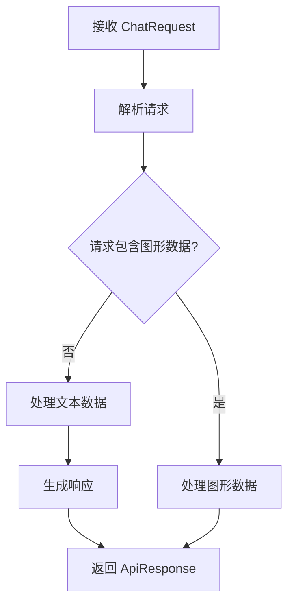

# `.\AutoGPT\autogpt_platform\backend\backend\api\features\otto\models.py` 详细设计文档

The code defines a set of data models for handling chat requests, responses, and related data structures.

## 整体流程



## 类结构

```
Document (数据模型)
├── ApiResponse (数据模型)
│   ├── GraphData (数据模型)
│   └── Message (数据模型)
└── ChatRequest (数据模型)
```

## 全局变量及字段


### `Document.url`
    
The URL of the document.

类型：`str`
    


### `Document.relevance_score`
    
The relevance score of the document.

类型：`float`
    


### `ApiResponse.answer`
    
The answer to the query.

类型：`str`
    


### `ApiResponse.documents`
    
A list of documents related to the query.

类型：`list[Document]`
    


### `ApiResponse.success`
    
Indicates whether the API call was successful.

类型：`bool`
    


### `GraphData.nodes`
    
The nodes of the graph.

类型：`list[Dict[str, Any]]`
    


### `GraphData.edges`
    
The edges of the graph.

类型：`list[Dict[str, Any]]`
    


### `GraphData.graph_name`
    
The name of the graph.

类型：`Optional[str]`
    


### `GraphData.graph_description`
    
The description of the graph.

类型：`Optional[str]`
    


### `Message.query`
    
The query string.

类型：`str`
    


### `Message.response`
    
The response to the query.

类型：`str`
    


### `ChatRequest.conversation_history`
    
The conversation history leading up to the current message.

类型：`list[Message]`
    


### `ChatRequest.message_id`
    
The unique identifier for the message.

类型：`str`
    


### `ChatRequest.include_graph_data`
    
Indicates whether to include graph data in the response.

类型：`bool`
    


### `ChatRequest.graph_id`
    
The unique identifier for the graph data, if included.

类型：`Optional[str]`
    
    

## 全局函数及方法


## 关键组件


### 张量索引与惰性加载

张量索引与惰性加载是处理大规模数据集时常用的技术，它允许在需要时才加载数据的一部分，从而减少内存消耗和提高效率。

### 反量化支持

反量化支持是指系统对量化操作的反向操作的支持，允许在量化后的模型上进行反向传播，以优化模型参数。

### 量化策略

量化策略是用于将浮点数模型转换为低精度整数模型的方法，以减少模型大小和提高推理速度。


## 问题及建议


### 已知问题

-   **全局变量缺失**：代码中没有使用全局变量，但考虑到可能存在需要跨多个类共享的状态或配置，未来可能需要引入全局变量。
-   **错误处理未定义**：代码中没有定义错误处理机制，对于可能出现的异常情况（如网络请求失败、数据格式错误等）没有明确的处理策略。
-   **数据流不明确**：虽然定义了多个类来表示不同的数据结构，但数据在类之间的流动路径和转换逻辑没有在代码中明确体现。

### 优化建议

-   **引入全局变量**：根据实际需求，引入全局变量来管理跨类共享的状态或配置，并确保其线程安全。
-   **定义错误处理机制**：为每个可能发生错误的地方定义异常处理逻辑，确保系统的健壮性和用户体验。
-   **明确数据流**：通过注释或文档明确数据在类之间的流动路径和转换逻辑，有助于代码的可维护性和可读性。
-   **考虑使用数据库**：如果数据量较大或需要持久化存储，考虑使用数据库来管理数据，并设计相应的数据访问层。
-   **性能优化**：对于可能存在性能瓶颈的代码段，进行性能分析并优化，例如使用缓存、减少不必要的数据库查询等。
-   **代码重构**：随着项目的发展，可能需要对代码进行重构，以提高代码的可读性和可维护性。
-   **单元测试**：编写单元测试来验证代码的正确性和稳定性，确保在代码修改后不会引入新的错误。
-   **文档完善**：完善代码文档，包括类、方法、全局变量等的详细说明，以及系统的整体架构和设计思路。


## 其它


### 设计目标与约束

- 设计目标：确保代码能够高效、准确地处理和返回用户查询的结果，同时保持良好的可扩展性和可维护性。
- 约束条件：遵循Pydantic库的规范，确保数据模型的一致性和有效性。

### 错误处理与异常设计

- 错误处理：在数据模型验证失败时，应抛出相应的Pydantic异常。
- 异常设计：定义自定义异常类，以处理特定于应用程序的错误情况。

### 数据流与状态机

- 数据流：用户查询通过`ChatRequest`类传递，经过处理生成`ApiResponse`。
- 状态机：描述查询处理的状态转换，例如从接收查询到生成响应。

### 外部依赖与接口契约

- 外部依赖：依赖Pydantic库进行数据模型验证。
- 接口契约：定义`Document`、`ApiResponse`、`GraphData`、`Message`和`ChatRequest`类的接口，确保外部组件能够正确使用这些类。

### 测试与验证

- 测试策略：编写单元测试以确保每个类和方法按预期工作。
- 验证方法：使用模拟数据和自动化测试来验证数据模型和业务逻辑的正确性。

### 性能考量

- 性能指标：监控查询处理时间和资源消耗。
- 优化策略：针对性能瓶颈进行优化，例如缓存常用数据或使用更高效的数据结构。

### 安全性考量

- 安全措施：确保数据传输的安全性，例如使用HTTPS协议。
- 安全漏洞：定期进行安全审计，以识别和修复潜在的安全漏洞。

### 可维护性与可扩展性

- 设计原则：遵循SOLID原则，确保代码的可维护性和可扩展性。
- 代码组织：合理组织代码结构，便于维护和扩展。


    