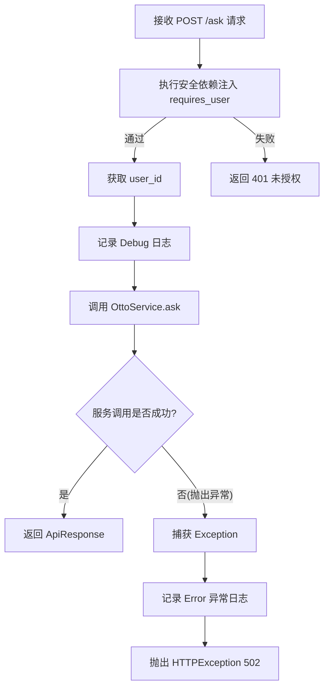
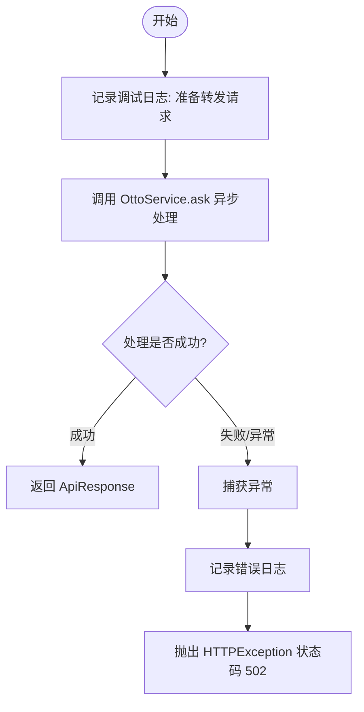

# `AutoGPT\autogpt_platform\backend\backend\api\features\otto\routes.py` 详细设计文档

该代码实现了一个 FastAPI 路由，用于将经过身份验证的用户的聊天请求安全地代理到 Otto 服务，并集成了日志记录与异常处理机制。

## 整体流程



## 类结构

```
None (No class definitions found in this file)
```

## 全局变量及字段


### `logger`
    
用于记录模块运行时的调试信息和异常。

类型：`logging.Logger`
    


### `router`
    
用于定义和注册 API 路由的 FastAPI 路由器对象。

类型：`fastapi.APIRouter`
    


    

## 全局函数及方法


### `proxy_otto_request`

该函数是一个 FastAPI 异步端点处理器，用于接收用户的聊天请求，并将其代理转发至 Otto 服务进行处理。它依赖于 FastAPI 的安全机制进行用户身份认证，负责记录请求日志，并捕获底层服务异常以转换为标准的 HTTP 响应。

参数：

-  `request`：`ChatRequest`，包含用户聊天消息及相关元数据的请求体模型。
-  `user_id`：`str`，通过 FastAPI 安全依赖注入获取的当前认证用户的唯一标识符。

返回值：`ApiResponse`，包装了 Otto 服务返回数据的响应模型。

#### 流程图



#### 带注释源码

```python
async def proxy_otto_request(
    request: ChatRequest, user_id: str = Security(get_user_id)
) -> ApiResponse:
    """
    Proxy requests to Otto API while adding necessary security headers and logging.
    Requires an authenticated user.
    """
    # 记录调试日志，标识正在为特定用户转发请求
    logger.debug("Forwarding request to Otto for user %s", user_id)
    try:
        # 异步调用 OttoService 的 ask 方法处理请求，并返回结果
        return await OttoService.ask(request, user_id)
    except Exception as e:
        # 捕获处理过程中的任何异常
        # 记录异常详情，包含用户 ID 和错误信息
        logger.exception("Otto request failed for user %s: %s", user_id, e)
        # 将异常转换为 HTTP 502 Bad Gateway 响应，避免暴露内部详细错误但提供提示
        raise HTTPException(
            status_code=502,
            detail={"message": str(e), "hint": "Check Otto service status."},
        )
```


## 关键组件


### APIRouter

用于定义和组织 API 路由的核心 FastAPI 组件。

### proxy_otto_request

处理 /ask 请求的异步端点，负责用户认证、日志记录及请求转发。

### OttoService

封装核心业务逻辑，用于与后端 Otto 服务进行交互的服务类。

### Authentication Dependency

基于 FastAPI Security 和 autogpt_libs 的用户身份验证与授权机制。


## 问题及建议


### 已知问题
-   **通用异常处理掩盖客户端错误**：代码捕获所有 `Exception` 并统一返回 502 Bad Gateway。如果上游服务因客户端输入错误（如 400 Bad Request）而失败，代理会将其包装为 502，导致客户端无法准确定位错误原因。
-   **潜在的信息泄露风险**：直接将上游异常的 `str(e)` 传递给 HTTP 响应体。这可能导致内部实现细节、堆栈信息或敏感路径泄露给 API 调用者。
-   **依赖耦合导致测试困难**：直接在函数体内部调用 `OttoService.ask`，使得在不使用 Monkey Patching（猴子补丁）的情况下难以在单元测试中模拟 Service 层的行为。

### 优化建议
-   **引入依赖注入**：使用 FastAPI 的 `Depends` 机制注入 `OttoService`，提高代码的可测试性和模块解耦。
-   **细粒度异常映射**：区分具体的异常类型。将上游服务抛出的业务逻辑错误映射为对应的 HTTP 状态码（如 400, 401, 404），仅对网络或服务不可用错误返回 502/504。
-   **增强错误处理安全性**：记录详细的异常堆栈到服务器日志，但仅向客户端返回通用的错误提示信息，防止敏感信息泄露。
-   **添加请求追踪**：在请求处理链路中引入 Correlation ID（追踪 ID），并将其传递给下游服务，便于在分布式日志中排查问题。
-   **精简安全检查逻辑**：审查 `dependencies=[Security(requires_user)]` 的必要性。若 `Security(get_user_id)` 已包含完整的认证检查，装饰器中的依赖项可能存在冗余，可考虑移除以提升性能。


## 其它


### 设计目标与约束

**设计目标**：
1.  **安全代理**：作为客户端与内部 Otto 服务之间的安全网关，确保所有请求均经过严格的身份验证，并自动注入用户身份信息。
2.  **关注点分离**：路由层仅负责请求转发、认证校验和异常封装，具体的业务逻辑处理委托给 `OttoService`，保持代码结构的清晰与解耦。
3.  **可观测性**：通过日志记录请求的转发过程和失败情况，便于问题排查和监控。

**约束条件**：
1.  **认证强制**：端点必须依赖有效的用户凭据，匿名请求无法通过 `requires_user` 依赖项的检查。
2.  **异步非阻塞**：接口设计遵循 FastAPI 的异步模式，以支持高并发场景下的 I/O 密集型操作。
3.  **数据契约一致性**：必须严格遵守 `ChatRequest` 和 `ApiResponse` 定义的数据结构进行交互。

### 错误处理与异常设计

**设计原则**：
采用“统一捕获与转换”策略，在网关层将底层服务的异常统一转换为标准的 HTTP 响应，防止底层错误细节直接泄露给客户端，同时保留必要的错误信息用于调试。

**处理流程**：
1.  **捕获范围**：在 `proxy_otto_request` 函数内部使用 `try-except` 块捕获 `OttoService.ask()` 调用时抛出的所有异常（基类为 `Exception`）。
2.  **日志记录**：捕获异常后，使用 `logger.exception` 记录完整的堆栈信息和上下文（用户 ID 和错误信息），确保服务端有据可查。
3.  **响应转换**：不将原始异常抛出，而是将其封装为 `HTTPException`。
4.  **状态码映射**：统一映射为 HTTP 状态码 `502 Bad Gateway`，表明网关收到了请求但上游服务处理失败。
5.  **客户端反馈**：在响应体中返回包含 `message`（原始错误信息）和 `hint`（排查建议）的 JSON 对象，辅助调用方进行错误处理。

### 数据流与状态机

**数据流向**：
1.  **请求输入**：客户端发起 HTTP POST 请求至 `/ask`，携带 `ChatRequest` 数据和认证 Token。
2.  **身份解析**：FastAPI 依赖注入系统调用 `get_user_id` 解析 Token，提取 `user_id`。
3.  **权限校验**：`requires_user` 确认用户身份有效性。
4.  **业务调用**：路由层将 `ChatRequest` 和 `user_id` 传递给 `OttoService.ask` 方法。
5.  **外部交互**：`OttoService` 与后端 Otto 模型/API 进行交互。
6.  **响应返回**：`OttoService` 返回 `ApiResponse` 对象，经路由层序列化为 JSON 返回给客户端；或在异常分支返回 502 错误响应。

**状态机**：
该组件是无状态的。每个请求独立处理，不存在跨请求的会话状态保持。处理状态仅为瞬时的“处理中”或“成功/失败”。

### 外部依赖与接口契约

**外部组件依赖**：
1.  **FastAPI 框架**：提供路由注册 (`APIRouter`)、依赖注入 (`Security`)、请求处理和异常基类。
2.  **Autogpt 认证库 (`autogpt_libs.auth`)**：
    *   `requires_user`：声明式的依赖项，用于保护端点。
    *   `get_user_id`：函数式依赖，用于从请求上下文中提取用户标识字符串。
3.  **内部服务层 (`.service.OttoService`)**：
    *   **契约**：必须实现静态或异步方法 `ask(request: ChatRequest, user_id: str) -> ApiResponse`。
    *   **行为**：该方法负责实际的业务逻辑处理，可能涉及网络 I/O，调用方需使用 `await`。
4.  **数据模型 (`.models`)**：
    *   **ChatRequest**：定义客户端输入的数据结构。
    *   **ApiResponse**：定义服务端输出给客户端的数据结构。

**接口契约**：
*   **端点**：`POST /ask`
*   **请求头**：必须包含符合认证库要求的授权信息（如 `Authorization: Bearer <token>`）。
*   **请求体**：符合 `ChatRequest` Pydantic 模型的 JSON 数据。
*   **成功响应**：HTTP 200，包含符合 `ApiResponse` 模型的 JSON 数据。
*   **失败响应**：HTTP 502，JSON 包含 `message` 和 `hint` 字段。

    